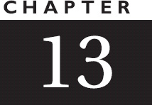

[]{#Coverpage.xhtml}

::: {#Coverpage.xhtml#Cover}

:::

[]{#Titlepage.xhtml}

::: {#Titlepage.xhtml#sbo-rt-content}
::: cen
{height="100%"}
:::

::: booksection
***Coders at Work***

```
Copyright © 2009 by Peter Seibel

All rights reserved. No part of this work may be reproduced or transmitted in any form or by any means, electronic or mechanical, including photocopying, recording, or by any information storage or retrieval system, without the prior written permission of the copyright owner and the publisher.

ISBN-13 (pbk): 978-1-4302-1948-4\
ISBN-13 (electronic): 978-1-4302-1949-1

Printed and bound in the United States of America (POD)

Trademarked names, logos, and images may appear in this book. Rather than use a trademark symbol with every occurrence of a trademarked name, logo, or image we use the names, logos, and images only in an editorial fashion and to the benefit of the trademark owner, with no intention of infringement of the trademark.

The use in this publication of trade names, trademarks, service marks, and similar terms, even if they are not identified as such, is not to be taken as an expression of opinion as to whether or not they are subject to proprietary rights.

President and Publisher: Paul Manning\
Lead Editor: Jeffrey Pepper\
Technical Reviewer: John Vacca\
Editorial Board: Steve Anglin, Mark Beckner, Ewan Buckingham, Gary Cornell, Jonathan\
    Gennick, Jonathan Hassell, Michelle Lowman, Matthew Moodie, Jeffrey Pepper,\
    Ben Renow-Clarke, Dominic Shakeshaft, Matt Wade, Tom Welsh\
Coordinating Editor: Anita Castro\
Copy Editor: Candace English\
Cover Designer: Anna Ishschenko

Distributed to the book trade worldwide by Springer Science+Business Media, LLC., 233 Spring Street, 6th Floor, New York, NY 10013. Phone 1-800-SPRINGER, fax 201-348-4505, e-mail `orders-ny@springer-sbm.com`, or visit `www.springeronline.com`.

For information on translations, please contact us by e-mail at `info@apress.com`, or visit `www.apress.com`.

Apress and friends of ED books may be purchased in bulk for academic, corporate, or promotional use. eBook versions and licenses are also available for most titles. For more information, reference our Special Bulk Sales--eBook Licensing web page at `www.apress.com/info/bulksales`.

The information in this book is distributed on an "as is" basis, without warranty. Although every precaution has been taken in the preparation of this work, neither the author(s) nor Apress shall have any liability to any person or entity with respect to any loss or damage caused or alleged to be caused directly or indirectly by the information contained in this work.
```
:::
:::

[]{#Dedication.xhtml}

::: {#Dedication.xhtml#sbo-rt-content}
::: booksection
*For Amelia*
:::
:::

[]{#Contents.xhtml}

::: {#Contents.xhtml#sbo-rt-content}
::: booksection
## []{#Contents.xhtml#contents}Contents {.chaptitle}

[**About the Author**](#Abouttheauthor.xhtml)

[**Acknowledgments**](#Acknowledgments.xhtml)

[**Introduction**](#Introduction.xhtml)

[**Chapter 1:** Jamie Zawinski](#Chapter01.xhtml)

[**Chapter 2:** Brad Fitzpatrick](#Chapter02.xhtml)

[**Chapter 3:** Douglas Crockford](#Chapter03.xhtml)

[**Chapter 4:** Brendan Eich](#Chapter04.xhtml)

[**Chapter 5:** Joshua Bloch](#Chapter05.xhtml)

[**Chapter 6:** Joe Armstrong](#Chapter06.xhtml)

[**Chapter 7:** Simon Peyton Jones](#Chapter07.xhtml)

[**Chapter 8:** Peter Norvig](#Chapter08.xhtml)

[**Chapter 9:** Guy Steele](#Chapter09.xhtml)

[**Chapter 10:** Dan Ingalls](#Chapter10.xhtml)

[**Chapter 11:** L Peter Deutsch](#Chapter11.xhtml)

[**Chapter 12:** Ken Thompson](#Chapter12.xhtml)

[**Chapter 13:** Fran Allen](#Chapter13.xhtml)

[**Chapter 14:** Bernie Cosell](#Chapter14.xhtml)

[**Chapter 15:** Donald Knuth](#Chapter15.xhtml)

[**Appendix A:** Bibliography](#Appendix.xhtml)

[**Index**](#Index.xhtml)
:::
:::

[]{#Abouttheauthor.xhtml}

::: {#Abouttheauthor.xhtml#sbo-rt-content}
::: booksection
## []{#Abouttheauthor.xhtml#abouttheauthor}About the Author {.chaptitle}


Peter Seibel is either a writer turned programmer or programmer turned writer. After picking up an undergraduate degree in English and working briefly as a journalist, he was seduced by the web. In the early \'90s he hacked Perl for *Mother Jones Magazine* and Organic Online. He participated in the Java revolution as an early employee at WebLogic and later taught Java programming at UC Berkeley Extension. In 2003 he quit his job as the architect of a Java-based transactional messaging system, planning to hack Lisp for a year. Instead he ended up spending two years writing the Jolt Productivity Award--winning *Practical Common Lisp*. Since then he\'s been working as chief monkey at Gigamonkeys Consulting, learning to train chickens, practicing Tai Chi, and being a dad. He lives in Berkeley, California, with his wife Lily, daughter Amelia, and dog Mahlanie.

> Peter Seibel要么是作家出身的程序员，要么是程序员出身的作家。在获得英语本科学位并短暂从事记者工作后，他被网络所诱惑。90年代初，他为《琼斯妈妈杂志》和《有机在线》破解了Perl。作为WebLogic的早期员工，他参与了Java革命，后来在UC Berkeley Extension教授Java编程。2003年，他辞去了基于Java的事务消息系统架构师的工作，计划在一年内破解Lisp。相反，他花了两年时间撰写了Jolt Productivity Award，获得了“实用公共Lisp”奖。从那以后，他一直在Gigamonkeys咨询公司担任首席猴子，学习训练鸡，练习太极，并成为一名父亲。他和妻子莉莉、女儿阿米莉亚以及小狗玛拉妮住在加利福尼亚州的伯克利。
:::
:::

[]{#Acknowledgments.xhtml}

::: {#Acknowledgments.xhtml#sbo-rt-content}
::: booksection
## []{#Acknowledgments.xhtml#acknowledgments}Acknowledgments {.chaptitle}


First of all I want to thank my subjects who gave generously of their time and without whom this book would be nothing but a small pamphlet of unanswered questions. Additional thanks go to Joe Armstrong and Bernie Cosell, and their families, for giving me a place to stay in Stockholm and Virginia. Extra thanks also go to Peter Norvig and Jamie Zawinski who, in addition to taking their own turns speaking into my recorders, helped me get in touch with other folks who became my subjects.

> 首先，我要感谢我的研究对象，他们慷慨地投入了时间，如果没有他们，这本书只不过是一本关于未回答问题的小册子。还要感谢乔·阿姆斯特朗和伯尼·科塞尔以及他们的家人，他们给了我一个在斯德哥尔摩和弗吉尼亚的住处。还要特别感谢Peter Norvig和Jamie Zawinski，他们除了轮流对着我的录音机讲话外，还帮助我与其他成为我主题的人取得了联系。


As I traveled around the world conducting interviews several other families also welcomed me into their homes: thanks for their hospitality go to Dan Weinreb and Cheryl Moreau in Boston, to Gareth and Emma McCaughan in Cambridge, England, and to my own parents who provided a great base of operations in New York city. Christophe Rhodes helped me fill some free time between interviews with a tour of Cambridge University and he and Dave Fox rounded out the evening with dinner and a tour of Cantabrigian pubs.

> 当我环游世界进行采访时，其他几个家庭也欢迎我到家里来：感谢他们的热情款待，感谢波士顿的Dan Weinreb和Cheryl Moreau，感谢英国剑桥的Gareth和Emma McCaughan，感谢我自己的父母，他们在纽约市提供了良好的运营基础。Christophe Rhodes帮助我在面试间隙抽出一些空闲时间参观剑桥大学，他和Dave Fox共进晚餐，参观了坎塔布里吉的酒吧。


Dan Weinreb, in addition to being my Boston host, has been my most diligent reviewer of all aspects of the the book since the days when I was still gathering names of potential subjects. Zach Beane, Luke Gorrie, Dave Walden and my mom also all read chapters and provided well-timed encouragement. Zach additionally---as is now traditional with my books---provided some words to go on the cover; this time the book\'s subtitle. Alan Kay made the excellent suggestion to include Dan Ingalls and L Peter Deutsch. Scott Fahlman gave me some useful background on Jamie Zawinski\'s early career and Dave Walden sent historical materials on Bolt Beranek and Newman to help me prepare for my interview with Bernie Cosell. To anyone I have forgotten, you still have my thanks and also my apologies.

> Dan Weinreb，除了是我在波士顿的主持人之外，自从我还在收集潜在主题的名字以来，他一直是我对这本书各个方面最勤奋的评论家。Zach Beane、Luke Gorrie、Dave Walden和我妈妈也都阅读了章节，并适时给予鼓励。另外，扎克——就像我的书现在的传统一样——在封面上提供了一些文字；这次是这本书的副标题。Alan Kay提出了一个很好的建议，让Dan Ingalls和L Peter Deutsch加入。Scott Fahlman给了我一些关于Jamie Zawinski早期职业生涯的有用背景，Dave Walden发送了关于Bolt Beranek和Newman的历史材料，帮助我准备与Bernie Cosell的采访。对于我忘记的任何人，我仍然向你们表示感谢和歉意。


Thanks to the folks at Apress, especially Gary Cornell who first suggested I do this book, John Vacca and Michael Banks for their suggestions, and my copy editor Candace English who fixed innumerable errors.

> 感谢Apress的员工，尤其是加里·康奈尔，他首先建议我写这本书，感谢约翰·瓦卡和迈克尔·班克斯的建议，感谢我的文案编辑坎迪斯·英格利希，他纠正了无数错误。


Finally, deepest thanks to my family, extended and nuclear. Both of my moms, biological and in-law, came on visits to watch the the kid and let me get some extra work done; my parents gave my wife and kid a place to escape for a week so I could make another big push. And most of all, thanks to the wife and kid themselves: Lily and Amelia, while I may occasionally need some time to myself to do the work, without you guys in my life, it wouldn\'t be worth doing. I love you.

> 最后，我要向我的家人致以最深切的感谢，衷心的感谢。我的两位母亲，亲生母亲和公婆，都来看望孩子，让我做一些额外的工作；我父母给了我的妻子和孩子一个地方躲避一周，这样我就可以再次奋力前行。最重要的是，感谢妻子和孩子们：莉莉和阿米莉亚，虽然我偶尔可能需要一些时间独自完成这项工作，但如果我的生活中没有你们，这将不值得做。我爱你。
:::
:::

[]{#Introduction.xhtml}

::: {#Introduction.xhtml#sbo-rt-content}
::: booksection
## []{#Introduction.xhtml#introduction}Introduction {.chaptitle}


Leaving aside the work of Ada Lovelace---the 19th century countess who devised algorithms for Charles Babbage\'s never-completed Analytical Engine---computer programming has existed as a human endeavor for less than one human lifetime: it has been only 68 years since Konrad Zuse unveiled his Z3 electro-mechanical computer in 1941, the first working general-purpose computer. And it\'s been only 64 years since six women---Kay Antonelli, Jean Bartik, Betty Holberton, Marlyn Meltzer, Frances Spence, and Ruth Teitelbaum---were pulled from the ranks of the U.S. Army\'s "computer corps", the women who computed ballistics tables by hand, to become the first programmers of ENIAC, the first general-purpose electronic computer. There are many people alive today---the leading edge of the Baby Boom generation and all of the Boomers\' parents---who were born into a world without computer programmers.

> 撇开19世纪为查尔斯·巴贝奇（Charles Babbage）从未完成的分析引擎设计算法的伯爵夫人阿达·洛夫莱斯（Ada Lovelace）的工作不谈，计算机编程作为人类的努力已经存在了不到一个人的一生：自1941年康拉德·祖塞（Konrad Zuse）推出他的Z3机电计算机，这是第一台工作的通用计算机以来，仅仅68年。仅仅64年前，六位女性——凯·安东内利、让·巴提克、贝蒂·霍尔伯顿、玛琳·梅尔策、弗朗西斯·斯彭斯和露丝·泰特尔鲍姆——从美国陆军的“计算机军团”中脱颖而出，成为第一台通用电子计算机ENIAC的第一位程序员。今天有许多人——婴儿潮一代的领军人物和婴儿潮一世的所有父母——出生在一个没有计算机程序员的世界。


No more, of course. Now the world is awash in programmers. According to the Bureau of Labor Statistics, in the United States in 2008 approximately one in every 106 workers---over 1.25 million people---was a computer programmer or software engineer. And that doesn\'t count professional programmers outside the U.S. nor the many student and hobbyist programmers and people whose official job is something else but who spend some or even a lot of their time trying to bend a computer to their will. Yet despite the millions of people who have written code, and the billions, if not trillions of lines of code written since the field began, it still often feels like we\'re still making it up as we go along. People still argue about what programming is: mathematics or engineering? Craft, art, or science? We certainly argue---often with great vehemence---about the best way to do it: the Internet overflows with blog articles and forum postings about this or that way of writing code. And bookstores are chock-a-block with books about new programming languages, new methodologies, new ways of thinking about the task of programming.

> 当然没有了。现在世界上到处都是程序员。根据美国劳工统计局的数据，2008年，在美国，大约每106名工人中就有一人（超过125万人）是计算机程序员或软件工程师。这还不包括美国以外的专业程序员，也不包括许多学生和业余程序员，以及那些公务是其他事情，但却花了一些甚至很多时间试图让计算机屈从于自己意愿的人。然而，尽管有数以百万计的人编写了代码，自该领域开始以来，即使不是数万亿行，也有数十亿行的代码，但人们仍然经常觉得我们仍在不断地编造。人们仍然在争论什么是编程：数学还是工程？工艺、艺术还是科学？当然，我们经常激烈地争论最好的方法：互联网上充斥着关于这种或那种代码编写方式的博客文章和论坛帖子。书店里塞满了关于新编程语言、新方法论和思考编程任务的新方法的书籍。


This book takes a different approach to getting at what programming is, following in the tradition established when the literary journal *The Paris Review* sent two professors to interview the novelist E.M. Forster, the first in a series of Q&A interviews later collected in the book *Writers at Work*.

> 这本书采用了一种不同的方法来理解编程是什么，遵循了文学杂志《巴黎评论》派出两名教授采访小说家E.M.福斯特时确立的传统，这是后来在《工作中的作家》一书中收集的一系列问答采访中的第一次。


I sat down with fifteen highly accomplished programmers with a wide range of experiences in the field---heads down systems hackers such as Ken Thompson, inventor of Unix, and Bernie Cosell, one of the original implementers of the ARPANET; programmers who combine strong academic credentials with hacker cred such as Donald Knuth, Guy Steele, and Simon Peyton Jones; industrial researchers such as Fran Allen of IBM, Joe Armstrong of Ericsson, and Peter Norvig at Google; Xerox PARC alumni Dan Ingalls and L Peter Deutsch; early Netscape implementers Jamie Zawinski and Brendan Eich; folks involved in the design and implementation of the languages the present-day web, Eich again as well as Douglas Crockford and Joshua Bloch; and Brad Fitzpatrick, inventor of Live Journal, and an able representative of the generation of programmers who came of age with the Web.

> 我与15位在该领域有着广泛经验的高成就程序员坐在一起——比如Unix的发明者Ken Thompson和ARPANET的最初实现者之一Bernie Cosell；将强大的学术证书与黑客信誉相结合的程序员，如Donald Knuth、Guy Steele和Simon Peyton Jones；工业研究人员，如IBM的Fran Allen、爱立信的Joe Armstrong和谷歌的Peter Norvig；施乐PARC校友Dan Ingalls和L Peter Deutsch；网景早期的实施者Jamie Zawinski和Brendan Eich；参与设计和实现当今网络语言的人员，再次是Eich以及Douglas Crockford和Joshua Bloch；Brad Fitzpatrick，Live Journal的发明者，也是伴随网络成长的一代程序员的得力代表。


I asked these folks about programming: how they learned to do it, what they\'ve discovered along the way, and what they think about its future. More particularly, I tried to get them to talk about the issues that programmers wrestle with all the time: How should we design software? What role do programming languages play in helping us be productive or avoid errors? Are there ways we can make it easier to track down hard-to-find bugs?

> 我问了这些人关于编程的问题：他们是如何学会编程的，一路上他们发现了什么，以及他们对编程未来的看法。更特别的是，我试图让他们谈论程序员一直在努力解决的问题：我们应该如何设计软件？编程语言在帮助我们提高工作效率或避免错误方面发挥了什么作用？有没有什么方法可以让我们更容易地追踪难以找到的bug？


As these are far from settled questions, it\'s perhaps unsurprising that my subjects sometimes had quite varied opinions. Jamie Zawinski and Dan Ingalls emphasized the importance of getting code up and running right away while Joshua Bloch described how he designs APIs and tests whether they can support the code he wants to write against them before he does any implementation and Donald Knuth described how he wrote a complete version of his typesetting software TeX in pencil before he started typing in any code. And while Fran Allen lay much of the blame for the decline in interest in computer science in recent decades at the feet of C and Bernie Cosell called it the "biggest security problem to befall modern computers", Ken Thompson argued that security problems are caused by programmers, not their programming languages and Donald Knuth described C\'s use of pointers as one of the "most amazing improvements in notation" he\'s seen. Some of my subjects scoffed at the notion that formal proofs could be useful in improving the quality of software, but Guy Steele gave a very nice illustration of both their power and their limitations.

> 由于这些问题还远未解决，我的研究对象有时会有相当不同的意见，这也许并不奇怪。Jamie Zawinski和Dan Ingalls强调了立即启动和运行代码的重要性，Joshua Bloch描述了他如何设计API，并在进行任何实现之前测试它们是否能够支持他想要针对它们编写的代码，Donald Knuth描述了他是如何在开始输入任何代码之前用铅笔编写完整版本的排版软件TeX的。尽管Fran Allen将近几十年来计算机科学兴趣下降的大部分责任归咎于C，Bernie Cosell称其为“现代计算机面临的最大安全问题”，但Ken Thompson认为，安全问题是由程序员引起的，而不是他们的编程语言，Donald Knuth将C对指针的使用描述为他所见过的“最惊人的符号改进”之一。我的一些受试者嘲笑形式证明在提高软件质量方面可能有用的观点，但盖伊·斯蒂尔很好地说明了它们的力量和局限性。


There were, however, some common themes: almost everybody emphasized the importance of writing readable code; most of my subjects have found that the hardest bugs to track down are in concurrent code; and nobody seemed to think programming is a solved problem: most are still looking for a better way to write software, whether by finding ways to automatically analyze code, coming up with better ways for programmers to work together, or finding (or designing) better programming languages. And almost everyone seemed to think that ubiquitous multi-core CPUs are going to force some serious changes in the way software is written.

> 然而，也有一些共同的主题：几乎每个人都强调编写可读代码的重要性；我的大多数研究对象都发现，最难追踪的bug是并发代码；似乎没有人认为编程是一个已经解决的问题：大多数人仍在寻找更好的软件编写方法，无论是找到自动分析代码的方法，还是为程序员提供更好的合作方式，或者找到（或设计）更好的编程语言。几乎所有人都认为无处不在的多核CPU将迫使软件的编写方式发生一些重大变化。


These conversations took place at a particular moment in our field\'s history, so no doubt some of the topics discussed in this book will fade from urgent present-day issues to historical curiosities. But even in a field as young as programming, history can hold lessons for us. Beyond that, I suspect that my subjects have shared some insights into what programming is and how we could do it better that will be useful to programmers today *and* to programmers several generations from now.

> 这些对话发生在我们这个领域历史上的一个特定时刻，因此毫无疑问，本书中讨论的一些主题将从当今紧迫的问题逐渐淡化为历史上的好奇。但即使在编程这样年轻的领域，历史也可以为我们提供教训。除此之外，我怀疑我的研究对象已经分享了一些关于什么是编程以及我们如何做得更好的见解，这些见解对今天的程序员和几代程序员都很有用。


Finally, a note on the title: we chose *Coders at Work* for its resonance with the previously mentioned *Paris Review\'s* *Writers at Work* series as well as Apress\'s book *Founders at Work*, which does for starting a technology company what this book tries to do for computer programming. I realize that "coding" could be taken to refer to only one rather narrow part of the larger activity of programming. Personally I have never believed that it is possible to be a good coder without being a good programmer nor a good programmer without being a good designer, communicator, and thinker. Certainly all of my subjects are all of those and much more and I believe the conversations you are about to read reflect that. Enjoy!

> 最后，请注意标题：我们选择了《工作中的程序员》，因为它与前面提到的《巴黎评论》的《工作中作家》系列以及Apress的《工作的创始人》一书产生了共鸣，这本书为创办一家科技公司做了这本书试图为计算机编程做的事情。我意识到，“编码”可以被看作是指更大的编程活动中相当狭窄的一部分。就我个人而言，我从未相信，如果不是一个好的程序员，就有可能成为一名好的程序员。当然，我所有的主题都是这些，还有更多，我相信你即将阅读的对话反映了这一点。享受
:::
:::

[]{#Chapter01.xhtml}

::: {#Chapter01.xhtml#sbo-rt-content}
::: booksection
## []{#Chapter01.xhtml#ch1}[]{#Chapter01.xhtml#page_1}{width="234" height="174"} {.chapnum}

## Jamie Zawinski {.chaptitle}

::: sidebar

*Lisp hacker, early Netscape developer, and nightclub owner Jamie Zawinski, a.k.a. jwz, is a member of the select group of hackers who are as well known by their three-letter initials as by their full names.*

> *Lisp黑客，网景早期开发者，夜总会老板Jamie Zawinski，又名jwz，是一个精选的黑客群体的成员，他们以三个字母的首字母缩写和全名而闻名*


*Zawinski started working as a programmer as a teenager when he was hired to hack Lisp at a Carnegie Mellon artificial intelligence lab. After attending college just long enough to discover that he hated it, he worked in the Lisp and AI world for nearly a decade, getting a strange immersion in a fading hacker subculture when other programmers his age were growing up with microcomputers.*

> *Zawinski十几岁时就开始从事程序员工作，当时他被卡内基梅隆人工智能实验室聘为Lisp的黑客。在上大学的时间刚刚长到他讨厌Lisp之后，他在Lisp和人工智能世界工作了近十年，当其他和他同龄的程序员都在使用微型计算机长大时，他奇怪地沉浸在一种逐渐消失的黑客亚文化中*


*He worked at UC Berkeley for Peter Norvig, who has described him as "one of the of the best programmers I ever hired," and later at Lucid, the Lisp company, where he ended up leading the development of Lucid Emacs, later renamed XEmacs, which eventually led to the great Emacs schism, one of the most famous open source forks.*

> *他曾在加州大学伯克利分校为Peter Norvig工作，后者称他为“我雇佣过的最好的程序员之一”，后来又在Lisp公司Lucid工作，在那里他最终领导了Lucid Emacs的开发，后来更名为XEmacs，这最终导致了大的Emacs分裂，这是最著名的开源分支之一*


[]{#Chapter01.xhtml#page_2}*In 1994 he finally left Lucid and the Lisp world to join Netscape, then a fledgling start-up, where he was one of the original developers of the Unix version of the Netscape browser and later of the Netscape mail reader.*

> []{#Chapter01.xhtml#page_2}*1994年，他最终离开Lucid和Lisp世界，加入了当时刚刚起步的网景公司，在那里他是Unix版本的网景浏览器和后来的网景邮件阅读器的最初开发者之一*


*In 1998 Zawinski was one of the prime movers, along with Brendan Eich, behind mozilla.org, the organization that took the Netscape browser open source. A year later, discouraged by the lack of progress toward a release, he quit the project and bought a San Francisco nightclub, the DNA Lounge, which he now runs. He is currently devoting his energies to battling the California Department of Alcoholic Beverage Control in an attempt to convert the club to an all-ages venue for live music.*

> *1998年，Zawinski和Brendan Eich是mozilla.org的主要推动者之一，该组织将Netscape浏览器开源。一年后，由于在发行方面缺乏进展，他灰心丧气，放弃了这个项目，买下了旧金山的一家夜总会DNA Lounge，现在他经营着这家夜总会。他目前正将精力投入到与加州酒精饮料控制部的斗争中，试图将俱乐部转变为一个全年龄段的现场音乐场所*


*In this interview we talked about, among other things, why C++ is an abomination, the joy of having millions of people use your software, and the importance of tinkering for budding programmers.*

> *在这次采访中，我们讨论了为什么C++是一种令人厌恶的东西，让数百万人使用你的软件的乐趣，以及对崭露头角的程序员进行修补的重要性*
:::

**Seibel:** How did you learn to program?


**Zawinski:** Wow, it was so long ago I can barely remember it. The first time I really used a computer in a programming context was probably like eighth grade, I think. We had some TRS-80s and we got to goof around with BASIC a little bit. I\'m not sure there was even a class---I think it was just like an after-school thing. I remember there was no way to save programs so you\'d just type them in from magazines and stuff like that. Then I guess I read a bunch of books. I remember reading books about languages that I had no way to run and writing programs on paper for languages that I\'d only read about.

> **Zawinski：**哇，那是很久以前的事了，我几乎记不清了。我想我第一次真正在编程环境中使用计算机可能是在八年级。我们有一些TRS-80，我们可以在BASIC上游手好闲。我甚至不确定是否有课——我想这就像是课后的事情。我记得没有办法保存程序，所以你只能从杂志之类的地方输入。然后我想我读了很多书。我记得我读过一些关于我无法运行的语言的书，并在纸上为我只读过的语言编写程序。

**Seibel:** What languages would that have been?


**Zawinski:** APL, I remember, was one of them. I read an article about it and thought it was really neat.

> **扎温斯基：我记得APL就是其中之一。我读了一篇关于它的文章，觉得它真的很整洁。


**Seibel:** Well, it saves having to have the fancy keyboard. When you were in high school did you have any classes on computers?

> **赛贝尔：**好吧，它省去了拥有花哨键盘的麻烦。你上高中的时候上过电脑课吗？

**Zawinski:** In high school I learned Fortran. That\'s about it.


[]{#Chapter01.xhtml#page_3}**Seibel:** And somehow you got exposed to Lisp.

> []{#Chapter01.xhtml#page_3}**Seibel：**不知怎么的，你接触到了Lisp。


**Zawinski:** I read a lot of science fiction. I thought AI was really neat; the computers are going to take over the world. So I learned a little bit about that. I had a friend in high school, Dan Zigmond, and we were trading books, so we both learned Lisp. One day he went to the Apple Users Group meeting at Carnegie Mellon---which was really just a software-trading situation---because he wanted to get free stuff. And he\'s talking to some college student there who\'s like, "Oh, here\'s this 15-year-old who knows Lisp; that\'s novel; you should go ask Scott Fahlman for a job." So Dan did. And Fahlman gave him one. And then Dan said, "Oh, you should hire my friend too," and that was me. So Fahlman hired us. I think his motivation had to be something along the lines of, Wow, here are two high school kids who are actually interested in this stuff; it doesn\'t really do me much harm to let them hang out in the lab." So we had basic grunt work---this set of stuff needs to be recompiled because there\'s a new version of the compiler; go figure out how to do that. Which was pretty awesome. So there are the two of us---these two little kids---surrounded by all these grad students doing language and AI research.

> **扎文斯基：**我读了很多科幻小说。我觉得人工智能真的很巧妙；计算机将接管世界。所以我学到了一些。我在高中时有一个朋友，Dan Zigmond，我们在交易书籍，所以我们都学了Lisp。有一天，他去了卡内基梅隆的苹果用户小组会议——这实际上只是一个软件交易的情况——因为他想获得免费的东西。他正在和那里的某个大学生交谈，他说：“哦，这是一个15岁的孩子，他知道利普；那是小说；你应该去找斯科特·法尔曼找份工作。”丹照做了。法尔曼给了他一个。然后丹说，“哦，你也应该雇佣我的朋友，”那就是我。所以法尔曼雇佣了我们。我认为他的动机应该是，哇，这里有两个高中生，他们真的对这些东西感兴趣；让他们呆在实验室里对我没有多大伤害。”所以我们做了一些基本的繁重的工作——这套东西需要重新编译，因为有了新版本的编译器；去想办法做到这一点。这太棒了。所以我们两个——这两个小孩——周围都是做语言和人工智能研究的研究生。


**Seibel:** Was that the first chance you actually had to run Lisp, there at CMU.

> **赛贝尔：那是你第一次有机会在CMU运行Lisp吗。


**Zawinski:** I think so. I know at one point we were goofing around with XLISP, which ran on Macintoshes. But I think that was later. I learned how to program for real there using these PERQ workstations which were part of the Spice project, using Spice Lisp which became CMU Common Lisp. It was such an odd environment. We\'d go to weekly meetings, learning how software development works just by listening in. But there were some really entertaining characters in that group. Like the guy who was sort of our manager---the one keeping an eye on us---Rob MacLachlan, Wholey, was this giant blond-haired, barbarian-looking guy. Very intimidating-looking. And he didn\'t talk much. I remember a lot of times I\'d be sitting there---it was kind of an open-plan cubicle kind of thing---working, doing something, writing some Lisp program. And he\'d come shuffling in with his ceramic mug of beer, bare feet, and he\'d just stand behind me. I\'d say hi. And he\'d grunt or say nothing. He\'d just stand there watching me type. At some []{#Chapter01.xhtml#page_4}point I\'d do something and he\'d go, "Ptthh, wrong!" and he\'d walk away. So that was kind of getting thrown in the deep end. It was like the Zen approach---the master hit me with a stick, now I must meditate.

> **Zawinski：**我想是的。我知道有一次我们在麦金托什上运行的XLISP上玩得很开心。但我想那是后来的事了。我在那里学习了如何使用这些PERQ工作站进行编程，这些工作站是Spice项目的一部分，使用Spice Lisp，后来成为CMU Common Lisp。那是一个如此奇怪的环境。我们每周都会去参加会议，通过聆听来学习软件开发是如何工作的。但这群人中有一些非常有趣的角色。就像那个有点像我们经理的人——那个一直盯着我们的人——罗伯·麦克拉克伦，Wholey，是一个金发碧眼、长相野蛮的巨人。看起来很吓人。他也不怎么说话。我记得很多时候我坐在那里——那是一种开放式的隔间——工作，做一些事情，写一些Lisp程序。他光着脚拖着陶瓷杯啤酒进来，站在我身后，我打招呼。他要么咕哝，要么什么也不说。他只是站在那里看着我打字。在某个[]{#Chapter01.xhtml#page_4}点上，我会做点什么，他会说：“Ptthh，错了！”然后他会走开。所以这有点被抛到了最后。这就像禅宗的方法——大师用棍子打我，现在我必须冥想。


**Seibel:** I emailed Fahlman and he said that you were talented and learned very fast. But he also mentioned that you were kind of undisciplined. As he put it, "We tried gently to teach him about working in a group with others and about writing code that you, or someone else, could understand a month from now." Do you remember any of those lessons?

> **赛贝尔：**我给法尔曼发了电子邮件，他说你很有天赋，学得很快。但他也提到你有点不守纪律。正如他所说，“我们试着温和地教他如何与他人在一个小组中工作，以及如何编写你或其他人一个月后就能理解的代码。”你还记得这些教训吗？


**Zawinski:** Not the learning of them, I guess. Certainly one of the most important things is writing code you can come back to later. But I\'m about to be 39 and I was 15 at the time, so it\'s all a little fuzzy.

> **扎温斯基：**我想这不是他们的学习。当然，最重要的事情之一是编写代码，以后可以再回来。但我快39岁了，那时我15岁，所以一切都有点模糊。

**Seibel:** What year did that start?


**Zawinski:** That must have been \'84 or \'85. I think I started in the summer between 10th and 11th grade. After high school, at 4:00 or so I\'d head over there and stay until eight or nine. I don\'t think I did that every day but I was there a fair amount.

> **扎温斯基：**那一定是84年或85年。我想我是从10年级到11年级的夏天开始的。高中毕业后，大约4点左右，我会去那里，一直呆到8点或9点。我不认为我每天都这样做，但我在那里的次数相当多。


**Seibel:** And you very briefly went to CMU after you finished high school.

> **赛贝尔：**高中毕业后，你曾短暂地上过CMU。


**Zawinski:** Yeah. What happened was, I hated high school. It was the worst time of my life. And when I was about to graduate I asked Fahlman if he\'d hire me full-time and he said, "No, but I\'ve got these friends who\'ve got a startup; go talk to them." Which was Expert Technologies---ETI. I guess he was on their board. They were making this expert system to automatically paginate the yellow pages. They were using Lisp and I knew a couple of the people already who had been in Fahlman\'s group. They hired me and that was all going fine, and then about a year later I panicked: Oh my god, I completely lucked into both of these jobs; this is never going to happen again. Once I no longer work here I\'m going to be flipping burgers if I don\'t have a college degree, so what I ought to do is go get one of those.

> **扎温斯基：**是的。事实是，我讨厌高中。那是我一生中最糟糕的时刻。当我即将毕业时，我问Fahlman是否愿意全职雇佣我，他说：“不，但我有一些朋友，他们已经创业了，去和他们谈谈吧。”这就是Expert Technologies——ETI。我猜他在他们的董事会上。他们正在制作这个专家系统来自动对黄页进行分页。他们在使用Lisp，我认识几个已经加入Fahlman小组的人。他们雇佣了我，一切都很顺利，大约一年后，我惊慌失措：天哪，我完全幸运地胜任了这两份工作；这种事再也不会发生了。一旦我不再在这里工作，如果我没有大学学位，我就要做汉堡了，所以我应该做的是去吃一个。


[]{#Chapter01.xhtml#page_5}The plan was that I\'d be working part-time at ETI and then I\'d be going to school part time. That turned into working full-time and going to school full-time and that lasted, I think, six weeks. Maybe it was nine weeks. I know it lasted long enough that I\'d missed the add/drop period, so I didn\'t get any of my money back. But not long enough that I actually got any grades. So it\'s questionable whether I actually went.

> []｛#Chapter01.xhtml#page_5｝我的计划是在ETI做兼职，然后去学校做兼职。这变成了全职工作和全职上学，我想这持续了六周。也许是九个星期。我知道它持续了足够长的时间，我错过了添加/删除期，所以我没有拿回我的钱。但时间不够长，我实际上没有取得任何成绩。所以我是否真的去了还值得怀疑。


It was just awful. When you\'re in high school, everyone tells you, "There\'s a lot of repetitive bullshit and standardized tests; it\'ll all be better once you\'re in college." And then you get to your first year of college and they\'re like, "Oh, no---it gets better when you\'re in grad school." So it\'s just same shit, different day---I couldn\'t take it. Getting up at eight in the morning, memorizing things. They wouldn\'t let me opt out of this class called Introduction to Facilities where they teach you how to use a mouse. I was like, "I\'ve been working at this university for a year and a half---I know how to use a mouse." No way out of it---"It\'s policy." All kinds of stuff like that. I couldn\'t take it. So I dropped out. And I\'m glad I did.

> 太可怕了。当你上高中的时候，每个人都告诉你，“有很多重复的狗屁和标准化考试；一旦你上了大学，一切都会更好。”然后你上了大一，他们会说，“哦，不——当你上研究生的时候，情况会变好。”所以这只是同样的狗屁，不同的一天——我受不了。早上八点起床，背东西。他们不会让我退出这门名为“设施简介”的课程，在那里他们教你如何使用鼠标。我想，“我在这所大学工作已经一年半了——我知道如何使用鼠标。”没有出路——“这是政策。”诸如此类的事情。我受不了，所以退学了。我很高兴我做到了。


Then I worked at ETI for four years or so until the company started evaporating. We were using TI Explorer Lisp machines at ETI so I spent a lot of my time, besides actually working on the expert system, just sort of messing around with user-interface stuff and learning how those machines worked from the bottom up. I loved them---I loved digging around in the operating system and just figuring out how it all fit together.

> 然后我在ETI工作了四年左右，直到公司开始蒸发。我们在ETI使用TI Explorer Lisp机器，所以我花了很多时间，除了实际工作在专家系统上，只是在用户界面上乱搞，从下到上学习这些机器是如何工作的。我喜欢它们——我喜欢在操作系统中四处挖掘，弄清楚它们是如何结合在一起的。


I\'d written a bunch of code and there was some newsgroup where I posted that I was looking for a job and, oh, by the way, here\'s a bunch of code. Peter Norvig saw it and scheduled an interview. My girlfriend at the time had moved out here to go to UC Berkeley, so I followed her out.

> 我写了一堆代码，在一些新闻组里我发布了我正在找工作的消息，哦，顺便说一句，这是一堆代码。彼得·诺维格看到了，安排了一次采访。我当时的女朋友搬到这里去加州大学伯克利分校，所以我跟着她出去了。

**Seibel:** Norvig was at Berkeley then?


**Zawinski:** Yeah. That was a very strange job. They had a whole bunch of grad students who\'d been doing research on natural language understanding; they were basically linguists who did some programming. So they wanted someone to take these bits and pieces []{#Chapter01.xhtml#page_6}of code they\'d left behind and integrate them into one thing that actually worked.

> **扎温斯基：**是的。那是一份非常奇怪的工作。他们有一群研究生，他们一直在研究自然语言理解；他们基本上是做一些编程的语言学家。所以他们希望有人把他们留下的这些零碎的代码整合成一个真正有效的东西。


That was incredibly difficult because I didn\'t have the background to understand what in the world they were doing. So this would happen a lot: I\'d be looking at something; I\'d be completely stuck. I have no idea what this means, where do I go from here, what do I have to read to understand this. So I\'d ask Peter. He\'d be nice about it---he\'d say, "It totally makes sense that you don\'t understand that yet. I\'ll sit down and explain it to you Tuesday." So now I\'ve got nothing to do. So I spent a lot of time working on windows system stuff and poking around with screen savers and just the kind of UI stuff that I\'d been doing for fun before.

> 这非常困难，因为我没有了解他们在做什么的背景。所以这种情况会经常发生：我会看到一些东西；我会完全陷入困境。我不知道这意味着什么，我该何去何从，我必须读什么才能理解这一点。所以我想问问彼得。他会说：“你还不明白，这完全有道理。我星期二坐下来向你解释。”所以现在我没有什么可做的。所以我花了很多时间研究windows系统的东西，浏览屏幕保护程序和我以前一直在做的那种用户界面的东西。


After six or eight months of that it just felt like, wow, I\'m really just wasting my time. I\'m not doing anything for them, and I just felt like I was on vacation. There have been times when I was working really a lot when I\'d look back at that and I\'m like, "Why did you quit the vacation job? What is wrong with you? They were paying you to write screen savers!"

> 在经历了六、八个月之后，我觉得，哇，我真的只是在浪费时间。我没有为他们做任何事，我只是觉得自己在度假。有几次我真的很忙，当我回首往事时，我会想，“你为什么辞去度假工作？你怎么了？他们付钱给你写屏幕保护程序！”


So I ended up going to work for Lucid, which was one of the two remaining Lisp-environment developers. The thing that really made me decide to leave was just this feeling that I wasn\'t accomplishing anything. And I was surrounded by people who weren\'t programmers. I\'m still friends with some of them; they\'re good folks, but they were linguists. They were much more interested in abstract things than solving problems. I wanted to be doing something that I could point to and say, "Look, I made this neat thing."

> 所以我最终去为Lucid工作，Lucid是剩下的两个Lisp环境开发人员之一。真正让我决定离开的是我没有完成任何事情的感觉。我周围的人都不是程序员。我仍然和他们中的一些人是朋友；他们是好人，但他们是语言学家。他们对抽象事物比对解决问题更感兴趣。我想做一些我可以指着说的事情，“看，我做了这个整洁的东西。”


**Seibel:** Your work at Lucid eventually gave rise to XEmacs, but when you went there originally were you working on Lisp stuff?

> **赛贝尔：**你在Lucid的工作最终产生了XEmacs，但当你最初去那里的时候，你在做Lisp的东西吗？


**Zawinski:** Yeah, one of the first projects I worked on was---I can\'t even remember what the machine was, but it was this 16-processor parallel computer and we had this variant of Lucid Common Lisp with some control structures that would let you fork things out to different processors.

> **Zawinski：**是的，我做的第一个项目是——我甚至记不起这台机器是什么了，但这是一台16处理器的并行计算机，我们有Lucid Common Lisp的变体，它有一些控制结构，可以让你把东西分配给不同的处理器。


[]{#Chapter01.xhtml#page_7}I worked a little bit on the back end of that to make the overhead of spawning a thread lower so you could do something like a parallel implementation of Fibonacci that wasn\'t just completely swamped by the overhead of creating a new stack group for each thread. I really enjoyed that. It was the first time I\'d gotten to use a fairly bizarre machine like that.

> []｛#Chapter01.xhtml#page_7｝我在后端做了一点工作，以降低生成线程的开销，这样你就可以做一些事情，比如斐波那契的并行实现，而不仅仅是完全被为每个线程创建新堆栈组的开销淹没。我真的很喜欢。这是我第一次使用这种相当奇怪的机器。


Before that I was bringing up Lisp on new machines. Which means basically someone\'s already written the compiler back end for the new architecture and then they\'ve compiled the bootstrap piece of code. So I\'ve got this file full of binary, supposedly executable code for this other machine and now I\'ve got to decipher their loader format so that I can write a little C program that will load that in, make the page executable, and jump to it. Then, hopefully, you get a Lisp prompt and at that point you can start loading things in by hand.

> 在此之前，我在新机器上学习Lisp。这意味着基本上有人已经为新体系结构编写了编译器后端，然后他们已经编译了引导程序代码。因此，我得到了这个文件，里面充满了二进制的，应该是另一台机器的可执行代码，现在我必须破译它们的加载程序格式，这样我就可以写一个小的C程序来加载它，使页面可执行，然后跳到它。然后，希望你能得到一个Lisp提示，然后你就可以开始手动加载了。


Which for every architecture was bizarre, because it\'s never documented right. So it\'s a matter of compiling a C program and then looking at it byte by byte---byte-editing it in Emacs. Let\'s see what happens if I change this to a zero; does it stop running?

> 对于每一种建筑来说，这都是奇怪的，因为它从来没有被正确地记录下来。因此，这是一个编译C程序，然后逐字节查看它的问题——在Emacs中进行字节编辑。让我们看看如果我把它改成零会发生什么；它停止运行了吗？


**Seibel:** When you say it wasn\'t documented right, was it that it wasn\'t documented correctly, or it wasn\'t documented at all?

> **Seibel：**当你说它没有被正确地记录下来时，是没有被正确记录下来，还是根本没有被记录下来？


**Zawinski:** It was usually documented and it was usually wrong. Or maybe it was just three revisions behind---who knows? But at some point you tweak a bit and then it would no longer believe this was an executable file and you had to figure out what was going on there.

> **Zawinski：**这通常是有记录的，而且通常是错误的。或者可能只是落后了三次修订——谁知道呢？但在某个时候，你稍微调整一下，它就不再相信这是一个可执行文件，你必须弄清楚那里发生了什么。


**Seibel:** So that\'s something that comes up all the time, from the lowest-level systems programming to high-level APIs, where things just don\'t work the way you expect or the way they are documented. How do you deal with that?

> **Seibel：**所以，从最低级别的系统编程到高级API，这都是经常出现的问题，在那里，事情并没有按照你期望的方式或文档记录的方式进行。你是怎么处理的？


**Zawinski:** Well, you just come to expect it. The sooner you realize that your map is wrong, the sooner you\'ll be able to figure out where it went wrong. In my case, I\'m trying to produce an executable file. Well, I know the C compiler will produce one. Take the good one and []{#Chapter01.xhtml#page_8}start converting it into the bad one until it stops working. That\'s primary tool of reverse engineering.

> **扎温斯基：**好吧，你只是在期待它。你越早意识到你的地图是错误的，你就越早能够弄清楚哪里出了问题。就我而言，我正在尝试生成一个可执行文件。我知道C编译器会产生一个。取一个好的，[]{#Chapter01.xhtml#page_8}开始将其转换为坏的，直到它停止工作。这是逆向工程的主要工具。


The hardest bug I\'ve ever fixed, I think, was probably during that period at Lucid. I\'d gotten to the point where it\'s running the executable and it\'s trying to bootstrap Lisp and it gets 500 instructions in and crashes. So there I am leaning on the S key, stepping through trying to figure out where it crashes. And it seems to be crashing at a different place each time. And it doesn\'t make any sense. I\'m reading the assembly output of this architecture I only barely understand. Finally I realize, "Oh my god, it\'s doing something different when I step; maybe it\'s timing-based." Eventually I figure out that what\'s going on is this is one of the early machines that did speculative execution. It would execute both sides of the branch. And GDB would always take the branch if you single-stepped past a branch instruction. There was a bug in GDB!

> 我想，我修复过的最难的错误可能是在Lucid的那段时间。我已经到了它运行可执行文件并试图引导Lisp的地步，它得到了500条指令，然后崩溃了。所以我靠在S键上，试着找出它在哪里坠毁。它似乎每次都在不同的地方坠毁。这没有任何意义。我正在阅读这个体系结构的汇编输出，我只是勉强理解。最后，我意识到，“天哪，当我迈出一步时，它正在做一些不同的事情；也许这是基于时间的。”最终，我发现这是早期进行推测执行的机器之一。它将执行分支的两侧。如果你一步通过一个分支指令，那么GDB总是会接受这个分支。GDB中有一个错误！

**Seibel:** Nice.


**Zawinski:** Right. So then that takes me down into, "Oh my god; now I\'m trying to debug GDB, which I\'ve never looked at before." The way to get around that is you\'re coming up to a branch instruction and you stop before the branch, set a break point on both sides, and continue. So that was how I proved that really was what was going on. Spent like a week trying to fix GDB; couldn\'t figure it out. I assume a register was getting stomped somewhere, so it always thought there was a positive value in the branch check or something like that.

> **扎温斯基：**对。这让我陷入了这样的境地：“天哪，现在我正在尝试调试GDB，这是我以前从未见过的。”解决这一问题的方法是，你走到一个分支指令前，在分支前停下来，在两边设置一个断点，然后继续。这就是我如何证明这确实是正在发生的事情。花了大约一周的时间试图修复GDB；搞不明白。我想寄存器在某个地方被踩踏了，所以它总是认为分支检查中有一个正值或类似的东西。


So I changed the step-by-instruction command to recognize when it was coming up on a branch instruction and just say, "No, don\'t do that." Then I can just lean on the S key and it would eventually stop and I\'d set the break point by hand and continue. When you\'re debugging something and then you figure out that not only is the map wrong but the tools are broken---that\'s a good time.

> 因此，我更改了逐指令命令，以识别它何时出现在分支指令上，只需说：“不，不要那样做。”然后我可以靠在S键上，它最终会停止，我会手动设置断点并继续。当你在调试某个东西时，你发现不仅映射错误，而且工具也坏了——这是个好时机。


Working on Lisp systems was especially weird because GDB was completely nonfunctional on Lisp code because it doesn\'t have any debug info---it\'s written by a compiler GDB has never heard of. I think on some platforms it laid out the stack frames in a way GDB didn\'t []{#Chapter01.xhtml#page_9}understand. So GDB was pretty much an assembly stepper at that point. So you wanted to get out of the GDB world just as quickly as you could.

> 在Lisp系统上工作特别奇怪，因为GDB在Lisp代码上完全不起作用，因为它没有任何调试信息——它是由GDB从未听说过的编译器编写的。我认为在某些平台上，它以GDB无法理解的方式来布局堆栈框架。因此，GDB在这一点上几乎是一个组装步进器。所以你想尽快离开GDB世界。

**Seibel:** And then you\'d have a Lisp debugger and you\'d be all set.

**Zawinski:** Right, yeah.


**Seibel:** So somewhere in there Lucid switched directions and said, "We\'re going to make a C++ IDE".

> **Seibel：**所以Lucid在那里的某个地方改变了方向，说：“我们要做一个C++IDE”。


**Zawinski:** That had been begun before I started working there---it was in progress. And people started shifting over from the Lisp side to the Energize side, which is what the development environment was called. It was a really good product but it was two or three years too early. Nobody, at least on the Unix side, had any idea they wanted it yet. Everyone uses them now but we had to spend a lot of time explaining to people why this was better than vi and GCC. Anyway, I\'d done a bit of Emacs stuff. I guess by that point I\'d already rewritten the Emacs byte compiler because---why did I do that? Right, I\'d written this Rolodex phone/address-book thing.

> **扎温斯基：**在我开始在那里工作之前就已经开始了——正在进行中。人们开始从Lisp端转移到Energize端，这就是开发环境的名称。这是一款非常好的产品，但这还为时过早两三年。至少在Unix方面，没有人知道他们想要它。现在每个人都在使用它们，但我们不得不花很多时间向人们解释为什么这比vi和GCC更好。不管怎样，我做了一些Emacs的东西。我想到那时我已经重写了Emacs字节编译器，因为——我为什么要这么做？对，我写了这个Rolodex电话/通讯录的东西。

**Seibel:** Big Brother Database?


**Zawinski:** Yeah. And it was slow so I started digging into why it was slow and I realized, oh, it\'s slow because the compiler sucks. So I rewrote the compiler, which was my first run-in with the intransigence of Stallman. So I knew a lot about Emacs.

> **扎温斯基：**是的。它很慢，所以我开始探究为什么它很慢。我意识到，哦，它很慢是因为编译器很糟糕。所以我重写了编译器，这是我第一次遇到Stallman的顽固态度。所以我对Emacs了解很多。


**Seibel:** So the change to the byte compiler, did it change the byte-code format or did it just change the compiler?

> **Seibel：**那么字节编译器的变化，是改变了字节码格式，还是仅仅改变了编译器？


**Zawinski:** It actually had a few options---I made some changes at the C layer, the byte-code interpreter, added a few new instructions that sped things up. But the compiler could be configured to emit either old-style byte-code or ones that took advantage of the new codes.

> **Zawinski：**它实际上有几个选项——我在C层，字节码解释器上做了一些更改，添加了一些新的指令，加快了速度。但编译器可以配置为发出旧式字节码或利用新代码的字节码。


So I write a new compiler and Stallman\'s response is, "I see no need for this change." And I\'m like, "What are you talking about? It generates way faster code." Then his next response is, "Okay, uh, []{#Chapter01.xhtml#page_10}send me a diff and explain each line you changed." "Well, I didn\'t do that---I rewrote it because the old one was crap." That was not OK. The only reason it ever got folded in was because I released it and thousands of people started using it and they loved it and they nagged him for two years and finally he put it in because he was tired of being nagged about it.

> 所以我写了一个新的编译器，Stallman的回应是，“我认为没有必要做这个更改。”我想，“你在说什么？它生成的代码快得多。”然后他的下一个回应是，”好吧，嗯，[]{#Chapter01.xhtml#page_10}给我发一个diff，并解释你更改的每一行。“嗯，我没有这么做——我重写了它，因为旧的是垃圾。”这不好。它被折叠起来的唯一原因是因为我发布了它，成千上万的人开始使用它，他们喜欢它，他们唠叨了他两年，最后他把它放了进去，因为他厌倦了被唠叨。


**Seibel:** Did you sign the papers assigning the copyright to the Free Software Foundation?

> **赛贝尔：**你签署了将版权转让给自由软件基金会的文件吗？


**Zawinski:** Oh yeah, I did that right away. I think that was probably the first thing in the email. It was like, send me a diff for each line and sign this. So I signed and said, "I can\'t do the rest; can\'t send you a diff; that\'s ridiculous. It\'s well documented; go take a look." I don\'t think he ever did.

> **Zawinski：**哦，是的，我马上就这么做了。我想这可能是邮件中的第一件事。这就像是，给我发一个每行的差异，并在上面签名。所以我签名说：“我不能做剩下的；不能给你发一个diff；这太荒谬了。它有很好的记录；去看看。”我想他从来没有这样做过。


There\'s this myth that there was some legal issue between Lucid and FSF and that\'s absolutely not true---we assigned copyrights for everything we did to them. It was convenient for them to pretend we hadn\'t at certain times. Like, we actually submitted the paperwork multiple times because they\'d be like, "Oh, oh, we seem to have lost it." I think there was some kind of brouhaha with assignments and XEmacs much later, but that was way after my time.

> 有一个神话说Lucid和FSF之间存在一些法律问题，但这绝对不是真的——我们为他们所做的一切都分配了版权。他们在某些时候假装我们没有，这很方便。比如，我们实际上提交了多次文件，因为他们会说，“哦，哦，我们好像丢了。”。


**Seibel:** So you started with Lisp. But you obviously didn\'t stick with it for your whole career. What came next?

> **赛贝尔：**所以你是从利普开始的。但你显然没有在整个职业生涯中坚持下去。接下来会发生什么？


**Zawinski:** Well, the next language I did any serious programming in after Lisp was C, which was kind of like going back to the assembly I programmed on an Apple II. It\'s the PDP-11 assembler that thinks it\'s a language. Which was, you know, unpleasant. I\'d tried to avoid it for as long as possible. And C++ is just an abomination. Everything is wrong with it in every way. So I really tried to avoid using that as much as I could and do everything in C at Netscape. Which was pretty easy because we were targeting pretty small machines that didn\'t run C++ programs well because C++ tends to bloat like crazy as soon as you start using any libraries. Plus the C++ compilers were all in flux---there were lots of incompatibility problems. So we just settled on ANSI C from the beginning and that served us pretty well. After that []{#Chapter01.xhtml#page_11}Java felt like going back to Lisp a bit in that there were concepts that the language wasn\'t bending over backwards trying to make you avoid---that were comfortable again.

> **Zawinski：**好吧，在Lisp之后，我用的下一种语言是C，这有点像回到我在Apple II上编程的程序集。PDP-11汇编程序认为它是一种语言。你知道，这很不愉快。我尽量避开它。而C++就是一个令人憎恶的东西。它在各个方面都有问题。所以我真的尽量避免使用它，在网景用C语言做每件事。这很容易，因为我们针对的是运行C++程序不好的非常小的机器，因为一旦你开始使用任何库，C++就会像疯了一样膨胀。另外，C++编译器都在不断变化——有很多不兼容的问题。所以我们从一开始就选择了ANSI C，这对我们很有帮助。在那之后[]{#Chapter01.xhtml#page_11}Java感觉有点回到了Lisp，因为有些概念是该语言没有竭尽全力让你避免的——这些概念又很舒服了。

**Seibel:** Like what?


**Zawinski:** Memory management. That functions felt more like functions than subroutines. There was much more enforced modularity to it. It\'s always tempting to throw in a goto in C code just because it\'s easy.

> **Zawinski：**内存管理。那个函数感觉更像是函数而不是子程序。它有更多的模块化。在C代码中加入goto总是很诱人，因为它很容易。

**Seibel:** So these days it seems like you\'re mostly doing C and Perl.


**Zawinski:** Well, I don\'t really program very much anymore. Mostly I write stupid little Perl scripts to keep my servers running. I end up writing a lot of goofy things for getting album art for MP3s I have---that kind of thing. Just tiny brute-force throw-away programs.

> **扎温斯基：**好吧，我真的不怎么编程了。大多数情况下，我会编写一些愚蠢的Perl小脚本来保持服务器的运行。我最终写了很多愚蠢的东西来为我的MP3获得专辑艺术——诸如此类的东西。只是小小的暴力丢弃程序。

**Seibel:** Do you like Perl or is it just handy?


**Zawinski:** Oh, I despise it. It\'s a horrible language. But it is installed absolutely everywhere. Any computer you sit down on, you\'re never going to have to talk someone through installing Perl to run your script. Perl is there already. That\'s really the one and only thing that recommends it.

> **扎温斯基：**哦，我鄙视它。这是一种可怕的语言。但它绝对安装在任何地方。你坐在任何一台计算机上，你都不必通过安装Perl来与别人交谈来运行你的脚本。Perl已经存在了。这确实是唯一值得推荐的东西。


It has an OK collection of libraries. There\'s often a library for doing the thing you want. And often it doesn\'t work very well, but at least there\'s something. The experience of writing something in Java and then trying to figure out---I myself have trouble installing Java on my computer---it\'s horrible. I think Perl is a despicable language. If you use little enough of it, you can make it kind of look like C---or I guess more like JavaScript than like C. Its syntax is crazy, if you use it. Its data structures are a mess. There\'s not a lot good about it.

> 它有一个OK的库集合。图书馆里经常有你想做的事。通常情况下，它不会很好地工作，但至少有一些东西。用Java写东西然后试图弄清楚的经历——我自己在电脑上安装Java时遇到了麻烦——太可怕了。我认为Perl是一种卑鄙的语言。如果你很少使用它，你可以让它看起来像C——或者我想更像JavaScript而不是C。如果你使用它，它的语法很疯狂。它的数据结构一团糟。它没有什么好的地方。

**Seibel:** But not as bad as C++.


**Zawinski:** No, absolutely not. It\'s for different things. There\'s stuff that would be so much easier to write in Perl or any language like Perl than in C just because they\'re text-oriented---all these so-called []{#Chapter01.xhtml#page_12}"scripting languages". Which is a distinction I don\'t really buy---"programming" versus "scripting". I think that\'s nonsense. But if what you\'re doing is fundamentally manipulating text or launching programs, like running wget and pulling some HTML out and pattern-matching it, it\'s going to be easier to do that in Perl than even Emacs Lisp.

> **扎温斯基：**不，绝对不是。它适用于不同的事物。有些东西用Perl或任何像Perl这样的语言写起来都比用C语言容易得多，因为它们是面向文本的——所有这些所谓的[]{#Chapter01.xhtml#page_12}“脚本语言”。这是我并不认同的区别——“编程”和“脚本”。我认为那是胡说八道。但是，如果你所做的是从根本上操纵文本或启动程序，比如运行wget并提取一些HTML并对其进行模式匹配，那么在Perl中这样做甚至比Emacs Lisp更容易。


**Seibel:** To say nothing of, Emacs Lisp is not going to be very suitable for command-line utilities.

> **Seibel：**更不用说，Emacs Lisp不太适合用于命令行实用程序。


**Zawinski:** Yeah, though I used to write just random little utilities in Emacs all the time. There was actually a point, early on in Netscape, where part of our build process involved running "emacs -batch" to manipulate some file. No one really appreciated that.

> **Zawinski：**是的，尽管我过去一直在Emacs中写一些随机的小实用程序。事实上，在Netscape的早期，我们的构建过程中有一部分涉及到运行“emacs-batch”来操作一些文件。没有人真正欣赏这一点。


**Seibel:** No. I imagine they wouldn\'t. What about XScreenSaver---do you still work on that?

> **赛贝尔：**不。我想他们不会的。XScreenSaver怎么样？你还在做这个吗？


**Zawinski:** I still write new screen savers every now and then just for kicks, and that\'s all C.

> **Zawinski：**我仍然时不时地写新的屏幕保护程序，只是为了好玩，这都是C。

**Seibel:** Do you use some kind of IDE for that?


**Zawinski:** I just use Emacs, mostly. Though recently, I ported XScreenSaver to OS X. The way I did that was I reimplemented Xlib in terms of Cocoa, the Mac graphics substrate, so I wouldn\'t have to change the source code of all the screen savers. They\'re still making X calls but I implemented the back end for each of those. And that was in Objective C, which actually is a pretty nice language. I enjoyed doing that. It definitely feels Java-like in the good ways but it also feels like C. Because it\'s essentially C, you can still link directly with C code and just call the functions and not have to bend over backwards.

> **Zawinski：**我主要使用Emacs。尽管最近，我将XScreenSaver移植到了OS X。我这样做的方式是，我根据Mac图形基板Cocoa重新实现了Xlib，这样我就不必更改所有屏幕保护程序的源代码。他们仍在进行X调用，但我为每一个调用都实现了后端。这是在目标C中，这实际上是一种非常好的语言。我很喜欢这样做。它确实感觉像Java，但也感觉像C。因为它本质上是C，所以你仍然可以直接与C代码链接，只需调用函数，而不必向后弯曲。


**Seibel:** At Lucid, leaving aside the politics of Emacs development, what technical stuff did you learn?

> **赛贝尔：**在Lucid，抛开Emacs开发的政治因素不谈，你学到了什么技术？


**Zawinski:** I definitely became a better programmer while I was there. Largely because that was really the smartest group of people I\'ve been around. Everyone who worked there was brilliant. And it was just nice to be in that kind of environment where when someone says, "That\'s []{#Chapter01.xhtml#page_13}nonsense," or "We should do it this way," you can just take their word for it, believe that they know what they were talking about. That was really nice. Not that I hadn\'t been around smart people before. But it was just such a high-quality group of people there, consistently.

> **Zawinski：**我在那里的时候，肯定成为了一名更好的程序员。很大程度上是因为那真的是我身边最聪明的一群人。在那里工作的每个人都很出色。当有人说“这是[]{#Chapter01.xhtml#page_13}胡说八道”或“我们应该这样做”时，你可以相信他们的话，相信他们知道自己在说什么。真是太好了。并不是说我以前没有遇到过聪明人。但这正是一群高素质的人，始终如一。

**Seibel:** And how big was the development team?


**Zawinski:** I think there were like 70 people at the company so probably; I don\'t know, 40 or so on the development team. The Energize team was maybe 25 people, 20. It was divided up into pretty distinct areas. There were the folks working on the compiler side of things and the back-end database side of things. The GUI stuff that wasn\'t Emacs. And then there was, at one point, me and two or three other people working on integrating Emacs with the environment. That eventually turned into mostly me working on mostly Emacs stuff, trying to make our Emacs 19 be usable, be an editor that doesn\'t crash all the time, and actually runs all the Emacs packages that you expect it to run.

> **Zawinski：**我想公司大概有70个人；我不知道，开发团队大约有40人。Energize团队可能有25人，20人。它被划分为非常明显的区域。有人在编译器方面工作，也有人在后端数据库方面工作。不是Emacs的GUI内容。然后，有一次，我和另外两三个人正在将Emacs与环境集成。这最终变成了我主要从事Emacs的工作，试图使我们的Emacs 19可用，成为一个不会一直崩溃的编辑器，并实际运行您期望它运行的所有Emacs包。


**Seibel:** So you wanted the Emacs included in your product to be a fully capable version of Emacs.

> **Seibel：**所以您希望产品中包含的Emacs是Emacs的完全功能版本。


**Zawinski:** The original plan was that we wouldn\'t include Emacs with our product. You have Emacs on your machine already and you have our product and they work together. And you had GCC on your machine already and our product, and they work together. I think one of the early code names for our product was something like Hitchhiker because the idea was that it would take all the tools that you already have and integrate them---make them talk to each other by providing this communication layer between them.

> **Zawinski：**最初的计划是我们的产品中不会包含Emacs。你的机器上已经有了Emacs，你有了我们的产品，它们可以一起工作。你的机器和我们的产品上已经有GCC了，它们可以一起工作。我认为我们产品的早期代号之一有点像Hitchhiker，因为它的想法是，它将利用您现有的所有工具并将它们集成在一起——通过在它们之间提供这种通信层，使它们相互通信。


That didn\'t work out at all. We ended up shipping our version of GCC and GDB because we couldn\'t get the changes upstream fast enough, or at all in some cases. And same thing with Emacs. So we ended up shipping the whole thing. We ended up going down the path of, "Well, we\'re replacing Emacs. Shit. I guess we have to do that so we better make it work." One thing I spent a bunch of time on was making the vi emulation mode work.

> 那根本没用。我们最终推出了GCC和GDB版本，因为我们无法足够快地向上游进行更改，或者在某些情况下根本无法。Emacs也是如此。所以我们最终运送了整个东西。我们最终走上了这样一条路：“好吧，我们要取代Emacs。该死。我想我们必须这样做，这样我们才能更好地让它发挥作用。”我花了很多时间做的一件事是让vi模拟模式发挥作用。


[]{#Chapter01.xhtml#page_14}**Seibel:** And that\'s several weeks of your life you\'re never going to get back.

> []｛#Chapter01.xhtml#page_14｝**Seibel：**这是你生命中的几周，你再也回不来了。


**Zawinski:** That\'s true, yeah. It was challenging. I think it ended up working OK. The real problem with that wasn\'t so much that it was emulating vi wrong as that vi users quit and restart vi all the time. And no amount of coding on my part is going to get them out of that mindset. So they\'re like, "I expected this to launch in half a second and it\'s taking 14 seconds. That\'s ridiculous. I can\'t use this."

> **扎温斯基：**那是真的，是的。这很有挑战性。我认为它最终运行正常。真正的问题并不是它模仿vi错误，而是vi用户一直退出并重新启动vi。我再多的编码也无法让他们摆脱这种心态。所以他们会说，“我本以为它会在半秒内发射，但它需要14秒。这太荒谬了。我不能用这个。”

**Seibel:** Why did you leave Lucid?


**Zawinski:** Lucid was done. There\'d been a bunch of layoffs. I sent mail to a bunch of people I know saying, "Hey, looks like I\'m going to need a new job soon" and one of those people was Marc Andreessen and he said, "Oh, funny you should mention that, because we just started a company last week." And that was that.

> **Zawinski：**Lucid完了。有很多人被解雇了。我给我认识的一群人发了邮件，说：“嘿，看起来我很快就需要一份新工作了。”其中一个人是Marc Andreessen，他说：“哦，有趣的是，你应该提到这一点，因为我们上周刚刚成立了一家公司。”就这样。

**Seibel:** So you went to Netscape. What did you work on there?


**Zawinski:** I pretty much started right away doing the Unix side of the browser. There had been maybe a few days\' worth of code written on it so far. A little bit more of the Windows and Mac sides had been started. The model was a big pile of back-end code and then as small as possible a piece of front-end code for each of the three platforms.

> **Zawinski：**我几乎马上就开始做浏览器的Unix端了。到目前为止，上面可能已经写了几天的代码。更多的Windows和Mac版本已经启动。该模型是一大堆后端代码，然后是三个平台中每一个平台的尽可能小的前端代码。

**Seibel:** And was this all new code?


**Zawinski:** It was all new code. Most of the Netscape founders had been NCSA/Mosaic developers so they had written the various versions of NCSA/Mosaic, which was actually three different programs. And all six of those people were at Netscape. They weren\'t reusing any code but they had written this program before.

> **Zawinski：**这都是新代码。网景的大多数创始人都是NCSA/Maic的开发人员，所以他们编写了各种版本的NCSA/Mamic，实际上是三个不同的程序。这六个人都在网景。他们没有重复使用任何代码，但他们以前写过这个程序。

**Seibel:** So they started with an empty disk and started typing?


**Zawinski:** Exactly. I never looked at the Mosaic code; still haven\'t. We actually were sued over that at one point; the university claimed that we were reusing their code and I guess that was settled one way []{#Chapter01.xhtml#page_15}or the other. There\'s always been that rumor that we started that way, but we didn\'t.

> **扎温斯基：**没错。我从来没有看过Mosaic代码；仍然没有。事实上，我们曾一度因此被起诉；该大学声称我们正在重用他们的代码，我想这是以某种方式解决的[]{#Chapter01.xhtml#page_15}。一直有传言说我们是这样开始的，但我们没有。


And really, why would we? Everyone wants to write version two, right? You were figuring it out while you wrote it and now you\'ve got a chance to throw that away and start over---of course you\'re going to start over. It\'s going to be better this time. And it was. With the design that the other ones had, there was basically no way to load images in parallel, things like that. And that was really important. So we had a better design for the back end.

> 真的，我们为什么要这样做？每个人都想写第二版，对吧？你在写的时候就想好了，现在你有机会把它扔掉，重新开始——当然你会重新开始的。这次会更好。事实确实如此。按照其他的设计，基本上没有办法并行加载图像，诸如此类的事情。这真的很重要。所以我们有一个更好的后端设计。


**Seibel:** Yet that\'s also a classic opportunity to fall into the second-system syndrome.

> **赛贝尔：**然而，这也是陷入第二系统综合症的典型机会。

**Zawinski:** It is, it is.

**Seibel:** How did you guys avoid that?


**Zawinski:** We were so focused on deadline it was like religion. We were shipping a finished product in six months or we were going to die trying.

> **扎温斯基：**我们如此专注于最后期限，就像宗教一样。我们要在六个月内运送一个成品，否则我们会在尝试中死去。

**Seibel:** How did you come up with that deadline?


**Zawinski:** Well, we looked around at the rest of the world and decided, if we\'re not done in six months, someone\'s going to beat us to it so we\'re going to be done in six months.

> **扎温斯基：**好吧，我们环顾世界其他地方，决定，如果我们在六个月内没有完成，就会有人打败我们，所以我们将在六个月中完成。


**Seibel:** Given that you picked the date first, you had to rein in scope or quality. How did that work?

> **赛贝尔：**考虑到你首先选择了日期，你必须控制范围或质量。这是怎么回事？


**Zawinski:** We spent a long time talking about features. Well, not a long time, but it seemed like a long time because we were living a week every day. We stripped features, definitely. We had a whiteboard; we scribbled ideas; we crossed them out. This was a group of like six or seven people. I don\'t remember exactly the number. A bunch of smart, egotistical people sitting in a room yelling at each other for a week or so.

> **Zawinski：**我们花了很长时间讨论功能。嗯，时间不长，但似乎很长，因为我们每天都要生活一周。我们当然去掉了功能。我们有一块白板；我们潦草地写下想法；我们把它们划掉了。这是一个大概有六七个人的团体。我记不清确切的数字了。一群聪明、自负的人坐在一个房间里互相大喊大叫一周左右。


[]{#Chapter01.xhtml#page_16}**Seibel:** Six or seven being the whole Netscape development team or the Unix development team?

> []｛#Chapter01.xhtml#page_16｝**Seibel：**六个或七个是整个Netscape开发团队还是Unix开发团队？


Zawinski: That was the whole client team. There were also the server folks who were implementing their fork of Apache, basically. We didn\'t talk to them much because we were busy. We had lunch with them, but that was it. So we figured out what we wanted to be in the thing and we divided up the work so that there were, I guess, no more than two people working on any part of the project. I was doing the Unix side and Lou Montulli did most of back-end network stuff. And Eric Bina was doing layout and Jon Mittelhauser and Chris Houck were doing the Windows front end and Aleks Totić and Mark Lanett were doing the Mac front end for the pre---version 1.0 team. Those teams grew a little bit after that. But we\'d have our meetings and then go back to our cubicles and be heads-down for 16 hours trying to make something work.

> 扎温斯基：那是整个客户团队。基本上，还有一些服务器人员正在实现他们的Apache分支。因为我们很忙，所以没怎么和他们说话。我们和他们一起吃了午饭，但仅此而已。所以我们想好了我们想在这件事上做什么，然后我们把工作分开，这样，我想，项目的任何部分都不会超过两个人。我在Unix端工作，Lou Montulli做了大部分后端网络的工作。Eric Bina负责布局，Jon Mittelhauser和Chris Houck负责Windows前端，Aleks Totić和Mark Lanett负责1.0之前版本团队的Mac前端。在那之后，这些球队有了一些成长。但我们会开会，然后回到我们的隔间，头朝下坐16个小时，试图让一些事情发挥作用。


It was really a great environment. I really enjoyed it. Because everyone was so sure they were right, we fought constantly but it allowed us to communicate fast. Someone would lean over your cubicle and say, "What the fuck did you check in; that\'s complete bullshit---you can\'t do it that way. You\'re an idiot." And you\'d say, "Fuck off!" and go look at it and fix it and check it in. We were very abrasive but we communicated fast because you didn\'t have to go blow sunshine up someone\'s ass and explain to them what you thought was wrong---you could say, "Hey, that\'s a load of shit! I can\'t use that." And you\'d hash it out very quickly. It was stressful but we got it done pretty quickly.

> 那真是一个很棒的环境。我真的很享受。因为每个人都非常确信自己是对的，我们一直在战斗，但这让我们能够快速沟通。有人会靠在你的隔间上说：“你他妈的登记了什么；那完全是胡说八道——你不能那样做。你是个白痴。”然后你会说：“滚！”然后去看它，把它修好，然后登记。我们很粗鲁，但我们沟通得很快，因为你不必去把阳光吹到别人的屁股上，向他们解释你认为错了什么——你可以说，“嘿，那是一堆垃圾！我不能用它。”你会很快解决的。这很有压力，但我们很快就完成了。


**Seibel:** Are the long hours and the intensity required to produce software quickly?

> **Seibel：**快速生产软件需要长时间和高强度吗？


**Zawinski:** It\'s certainly not healthy. I know we did it that way and it worked. So the way to answer that question is, is there another example of someone delivering a big piece of software that fast that\'s of reasonable quality where they actually had dinner at home and slept during the night? Has that ever happened? I don\'t actually know. Maybe it has.

> **扎温斯基：**这肯定不健康。我知道我们是这样做的，而且效果很好。因此，回答这个问题的方法是，有没有另一个例子表明，有人交付了一个质量合理、速度如此之快的大软件，而他们实际上在家吃饭，晚上睡觉？这种事发生过吗？我其实不知道。也许是这样。


[]{#Chapter01.xhtml#page_17}But it\'s not always about getting it done as quickly as possible. It also would be nice to not burn out after two years and be able to continue doing your job for ten. Which is not going to happen if you\'re working 80-plus hours a week.

> []｛#Chapter01.xhtml#page_17｝但这并不总是要尽快完成。两年后不要精疲力竭，能够继续做十年的工作也是很好的。如果你每周工作80多个小时，这是不会发生的。


**Seibel:** What is the thing that you worked on that you were most proud of.

> **赛贝尔：**你最引以为豪的工作是什么。


**Zawinski:** Really just the fact that we shipped it. The whole thing. I was very focused on my part, which was the user interface of the Unix front end. But really just that we shipped the thing at all and that people liked it. People converted immediately from NCSA Mosaic and were like, "Wow, this is the greatest thing ever." We had the button for the What\'s Cool page up in the toolbar and got to show the world these crazy web sites people had put up already. I mean, there were probably almost 200 of them! It\'s not so much that I was proud of the code; just that it was done. In a lot of ways the code wasn\'t very good because it was done very fast. But it got the job done. We shipped---that was the bottom line.

> **扎温斯基：**真的只是我们发货的事实。整件事。我非常专注于我的部分，那就是Unix前端的用户界面。但事实上，我们运送了这个东西，人们很喜欢它。人们立即从NCSA Mosaic转换过来，说：“哇，这是有史以来最棒的东西。”我们在工具栏上有了What's Cool页面的按钮，可以向世界展示人们已经建立的这些疯狂网站。我的意思是，可能有将近200个！与其说我为代码感到骄傲；只是它已经完成了。在很多方面，代码不是很好，因为它做得很快。但它完成了任务。我们发货了——这是底线。


That first night when we put up the .96 beta, we were all sitting around the room watching the downloads with sound triggers hooked up to it---that was amazing. A month later two million people were running software I\'d written. It was unbelievable. That definitely made it all worthwhile---that we\'d had an impact on people\'s lives; that their day was more fun or more pleasant or easier because of the work we\'d done.

> 当我们发布.96测试版的第一个晚上，我们都坐在房间里观看下载，并连接了声音触发器——这太神奇了。一个月后，200万人在运行我编写的软件。真是难以置信。这无疑让一切都变得值得——我们对人们的生活产生了影响；因为我们所做的工作，他们的一天变得更有趣、更愉快或更容易。


**Seibel:** After this relentless pace, at some point that has to start to catch up with you in terms of the quality of the code. How did you guys deal with that?

> **Seibel：**在这无情的步伐之后，在某种程度上，它必须在代码质量方面赶上你。你们是怎么处理的？


**Zawinski:** Well, the way we dealt with that was badly. There\'s never a time to start over and rewrite it. And it\'s never a good idea to start over and rewrite it.

> **扎温斯基：**好吧，我们处理这件事的方式很糟糕。从来没有时间重新开始重写，也从来不是一个好主意。

**Seibel:** At some point you also worked on the mail reader, right?


[]{#Chapter01.xhtml#page_18}**Zawinski:** In 2.0 Marc comes into my cubicle and says, "We need a mail reader." And I\'m like, "OK, that sounds cool. I\'ve worked on mail readers before." I was living in Berkeley and basically I didn\'t come into the office for a couple weeks. I was spending the whole time sitting in cafes doodling, trying to figure out what I wanted in a mail reader. Making lists, crossing it off, trying to decide how long it would take me. What should the UI look like?

> []{#Chapter01.xhtml#page_18}**Zawinski:**在2.0中，Marc走进我的隔间说：“我们需要一个邮件阅读器。”我想，“好吧，听起来很酷。我以前做过邮件阅读器的工作。”我当时住在伯克利，基本上有几个星期没有来办公室。我一直坐在咖啡馆里涂鸦，试图在邮件阅读器上找到我想要的东西。列出清单，划掉它，试着决定我需要多长时间。UI应该是什么样子？


Then I came back and started coding. And then Marc comes in again and says, "Oh, so we hired this other guy who\'s done mail stuff before. You guys should work together." It\'s this guy Terry Weissman, who was just fantastic---we worked together so well. And it was a completely different dynamic than it had been in the early days with the rest of the browser team.

> 然后我回来开始编码。然后马克又进来说：“哦，所以我们雇佣了另一个以前做过邮件的人。你们应该一起工作。”是这个人特里·韦斯曼，他太棒了——我们合作得很好。与早期浏览器团队的其他成员相比，这是一种完全不同的动态。


We didn\'t yell at each other at all. And the way we divided up labor, I can\'t imagine how it possibly worked or could ever work for anyone. I had the basic design done and I\'d started doing a little coding and every day or every couple of days we\'d look at the list of features and I\'d go, "Uhhh, maybe I\'ll work on that," and he\'d go, "OK, I\'ll work on that," and then we\'d go away.

> 我们一点也不吼对方。我们分工的方式，我无法想象它是如何运作的，也无法想象它会对任何人起作用。我完成了基本的设计，我开始做一些编码，每天或每隔几天我们都会看一看功能列表，我会说，“啊，也许我会做这个”，他会说，”好吧，我会做那个“，然后我们就走了。


Check-ins would happen and then we\'d come back and he\'d say, "Alright, I\'m done with that, what are you doing?" "Uh, I\'m working on this." "OK, well, I\'ll start on that then." And we just sort of divided up the pieces. It worked out really well.

> 登记会发生，然后我们回来，他会说，“好吧，我已经结束了，你在做什么？”。结果真的很好。


We had disagreements---I thought we had to toss filtering into folders because we just didn\'t have time to do it right. And he was like, "No, no, I really think we ought to do that." And I was like, "We don\'t have time!" So he wrote it that night.

> 我们有分歧——我想我们不得不把过滤功能扔进文件夹，因为我们没有时间把它做好。他说，“不，不，我真的认为我们应该这么做。”我说，“我们没有时间！”所以他那天晚上写了这篇文章。


The other thing was, Terry and I rarely saw each other because he lived in Santa Cruz and I lived in Berkeley. We were about the same distance from work in opposite directions and because the two of us were the only two who ever needed to communicate, we were just like, "I won\'t make you come in if you don\'t make me come in." "Deal!"

> 另一件事是，特里和我很少见面，因为他住在圣克鲁斯，我住在伯克利。我们离工作的距离差不多，方向相反，因为我们两个是唯一需要沟通的人，我们只是说，“如果你不让我进来，我就不会让你进来。”“成交！”

[]{#Chapter01.xhtml#page_19}**Seibel:** Did you guys email a lot?


**Zawinski:** Yeah, constant email. This was before instant messaging---these days it probably all would have been IM because we were sending one-liner emails constantly. And we talked on the phone.

> **Zawinski：**是的，经常发电子邮件。这是在即时消息之前——现在可能都是即时消息，因为我们一直在发送单行电子邮件。我们通了电话。


So we shipped 2.0 with the mail reader and it was well-received. Then we\'re working on 2.1, which is the version of the mail reader that I\'m starting to consider done---this is the one with all the stuff that we couldn\'t ship the first time around. Terry and I are halfway through doing that and Marc comes in and says, "So we\'re buying this company. And they make a mail-reader thing that\'s kind of like what you guys did." I\'m like, "Oh. OK. Well, we have one of those." And he says, "Well, yeah, but we\'re growing really fast and it\'s really hard to hire good people and sometimes the way you hire good people is you just acquire another company because then they\'ve already been vetted for you." "OK. What are these people going to be working on?" "They\'re going to be working on your project." "OK, that kind of sucks---I\'m going to go work on something else."

> 因此，我们随邮件阅读器一起发布了2.0版本，反响很好。然后我们正在开发2.1，这是我开始考虑完成的邮件阅读器版本——这是一个包含了我们第一次无法发货的所有内容的版本。Terry和我做了一半，Marc进来说：“所以我们要收购这家公司。他们做了一个邮件阅读器，有点像你们做的。”我说：“哦。好吧。好吧，我们有一个。”他说，“好吧，是的，但我们发展得很快，很难雇佣到优秀的人才，有时你雇佣优秀人才的方式就是收购另一家公司，因为他们已经为你进行了审查。”“好吧。这些人会在做什么？”“他们会在你的项目上工作。”“嗯，那太糟糕了——我会去做其他事情。”


So basically they acquired this company, Collabra, and hired this whole management structure above me and Terry. Collabra has a product that they had shipped that was similar to what we had done in a lot of ways except it was Windows-only and it had utterly failed in the marketplace.

> 所以基本上，他们收购了Collabra公司，并雇佣了我和Terry之上的整个管理结构。Collabra有一款他们发货的产品，在很多方面都与我们的产品相似，只是它只是Windows，在市场上完全失败了。


Then they won the start-up lottery and they got acquired by Netscape. And, basically, Netscape turned over the reins of the company to this company. So rather than just taking over the mail reader they ended up taking over the entire client division. Terry and I had been working on Netscape 2.1 when the Collabra acquisition happened and then the rewrite started. Then clearly their Netscape 3.0 was going to be extremely late and our 2.1 turned into 3.0 because it was time to ship something and we needed it to be a major version.

> 然后他们中了初创公司的彩票，被网景公司收购了。基本上，网景把公司的控制权交给了这家公司。因此，他们最终接管了整个客户部门，而不仅仅是邮件阅读器。当Collabra被收购时，Terry和我正在开发Netscape 2.1，然后重写开始了。很明显，他们的Netscape 3.0将非常晚，我们的2.1变成了3.0，因为是时候发布一些东西了，我们需要它成为一个主要版本。


So the 3.0 that they had begun working on became 4.0 which, as you know, is one of the biggest software disasters there has ever been. It basically killed the company. It took a long time to die, but that was it: the rewrite helmed by this company we\'d acquired, who\'d never []{#Chapter01.xhtml#page_20}accomplished much of anything, who disregarded all of our work and all of our success, went straight into second-system syndrome and brought us down.

> 因此，他们开始研究的3.0变成了4.0，正如你所知，这是有史以来最大的软件灾难之一。它基本上扼杀了公司。它花了很长时间才消亡，但仅此而已：由我们收购的这家公司领导的重写，他从未[]{#Chapter01.xhtml#page_20}完成过很多事情，他无视我们所有的工作和所有的成功，直接进入了第二系统综合症，把我们打倒了。


They thought just by virtue of being here, they were bound for glory doing it their way. But when they were doing it their way, at their company, they failed. So when the people who had been successful said to them, "Look, really, don\'t use C++; don\'t use threads," they said, "What are you talking about? You don\'t know anything."

> 他们认为，只要来到这里，他们就一定会以自己的方式获得荣誉。但当他们在公司按照自己的方式做事时，他们失败了。因此，当那些成功的人对他们说，“看，真的，不要使用C++；不要使用线程”时，他们说：“你在说什么？你什么都不知道。”


Well, it was decisions like not using C++ and not using threads that made us ship the product on time. The other big thing was we always shipped all platforms simultaneously; that was another thing they thought was just stupid. "Oh, 90 percent of people are using Windows, so we\'ll focus on the Windows side of things and then we\'ll port it later." Which is what many other failed companies have done. If you\'re trying to ship a cross-platform product, history really shows that\'s how you don\'t do it. If you want it to really be cross-platform, you have to do them simultaneously. The porting thing results in a crappy product on the second platform.

> 好吧，正是像不使用C++和不使用线程这样的决定让我们按时发货。另一件大事是，我们总是同时运送所有平台；这是另一件他们认为很愚蠢的事情。“哦，90%的人都在使用Windows，所以我们会把重点放在Windows方面，然后再移植。”这也是许多其他失败的公司所做的。如果你想推出一款跨平台的产品，历史确实表明了你没有做到这一点。如果你想让它真正成为跨平台的，你必须同时做到。移植的事情导致了第二个平台上的糟糕产品。

**Seibel:** Was the 4.0 rewrite from scratch?


**Zawinski:** They didn\'t start from scratch with a blank disk but they eventually replaced every line of code. And they used C++ from the beginning. Which I fought against so hard and, dammit, I was right. It bloated everything; it introduced all these compatibility problems because when you\'re programming C++ no one can ever agree on which ten percent of the language is safe to use. There\'s going to be one guy who decides, "I have to used templates." And then you discover that there are no two compilers that implement templates the same way.

> **Zawinski：**他们不是从一个空白磁盘开始的，但他们最终替换了每一行代码。他们从一开始就使用C++。我与之进行了激烈的斗争，该死，我是对的。它膨胀了一切；它引入了所有这些兼容性问题，因为当你在编程C++时，没有人能就使用哪种语言的10%是安全的达成一致。会有一个人决定，“我必须使用模板。”然后你会发现，没有两个编译器可以以相同的方式实现模板。


And when your background, your entire background, is writing code where multiplatform means both Windows 3.1 and Windows 95, you have no concept how big a deal that is. So it made the Unix side of things---which thankfully was no longer my problem---a disaster. It made the Mac side of things a disaster. It meant it was no longer possible to ship on low-end Windows boxes like Win16. We had to []{#Chapter01.xhtml#page_21}start cutting platforms out. Maybe it was time to do that, but it was a bad reason. It was unnecessary.

> 当你的背景，你的整个背景，都在写多平台意味着Windows 3.1和Windows 95的代码时，你不知道这有多重要。所以它让Unix方面的事情——谢天谢地，这不再是我的问题——变成了一场灾难。这让Mac方面的事情变成了一场灾难。这意味着它不再可能在像Win16这样的低端Windows盒子上发货。我们不得不[]{#Chapter01.xhtml#page_21}开始削减平台。也许是时候这么做了，但这是一个糟糕的理由。这是没有必要的。


It really felt---this is my bitter, selfish way of looking at it---like Terry and I built this great thing and were punished for our success by having it handed over to idiots. That was a very unhappy time for me at Netscape. That began the period where I was only there waiting to vest.

> 这真的让我觉得——这是我痛苦而自私的看待方式——就像特里和我建造了这件伟大的东西，却因为我们的成功而受到惩罚，把它交给了白痴。那是我在网景的一段非常不愉快的时光。这开始了我只在那里等待背心的时期。

**Seibel:** So you lasted there five years?


**Zawinski:** Yeah. A year past vesting, because just before vesting day mozilla.org stared and that was really interesting again, so I stuck around for that.

> **扎温斯基：**是的。一年前的行权，因为就在行权日之前，mozilla.org开始了，这真的很有趣，所以我坚持了下来。

**Seibel:** Did you ultimately get dragged into using C++?


**Zawinski:** Well, there was the Java thing. At one point, we were going to rewrite the browser in Java. We were like, "Yes! We\'re going to get to ditch that 4.0 code base which is going to destroy our company and this is gonna actually work because, like, we know what we\'re doing!"

> **Zawinski：**嗯，还有Java的东西。有一次，我们打算用Java重写浏览器。我们想，“是的！我们将抛弃4.0代码库，这将摧毁我们的公司，这将真正奏效，因为，我们知道我们在做什么！”

And it didn\'t work.

**Seibel:** Did it just not work because Java wasn\'t ready?


**Zawinski:** No. We were all broken up into fairly well-defined groups again. There were three of us working on the mail reader. And we were done. We had a really nice mail reader that was fast and had a lot of really nice features and was better about saving your data---there were never any stalls where it was writing some big file. We took really good advantage of multithreading in Java, which was less painful than I had expected it to be. It was just really pleasant to work on. From the API we had designed we saw all these directions it could grow.

> **扎温斯基：**没有。我们又被分成了定义明确的小组。我们三个人在做邮件阅读器。我们完了。我们有一个非常好的邮件阅读器，速度很快，有很多非常好的功能，而且更适合保存数据——它在写大文件时从来没有任何停顿。我们很好地利用了Java中的多线程，这比我预期的要痛苦得多。这真的很令人愉快。从我们设计的API中，我们看到了它可以发展的所有方向。


Except the one thing that it couldn\'t do was display messages. Because what it did was, it generated HTML and to display HTML you need an HTML display layer, which wasn\'t done and was never finished. The []{#Chapter01.xhtml#page_22}layout group just completely went down a rat hole and they were the reason that that project got canceled.

> 除了它不能做的一件事就是显示消息。因为它所做的是，它生成了HTML，而要显示HTML，你需要一个HTML显示层，而这并没有完成，也从来没有完成。[]{#Chapter01.xhtml#page_22}布局组完全陷入了困境，他们是该项目被取消的原因。


**Seibel:** So they were presumably wrestling with the---at that time---immature Java GUI technology.

> **Seibel：**所以他们当时大概是在和不成熟的Java GUI技术作斗争。


**Zawinski:** I don\'t think so. Because all the chrome worked. There was just this big blank rectangle in the middle of the window where we could only display plain text. They were being extremely academic about their project. They were trying to approach it from the DOM/DTD side of things. "Oh, well, what we need to do is add another abstraction layer here and have a delegate for this delegate for this delegate. And eventually a character will show up on the screen."

> **扎温斯基：**我不这么认为。因为所有的铬都起作用了。窗口中间只有一个大的空白矩形，我们只能显示纯文本。他们对自己的项目非常注重学术。他们试图从DOM/DTD的角度来处理它。“哦，好吧，我们需要做的是在这里添加另一个抽象层，并为这个委托为这个委托设置一个委托。最终，一个角色会出现在屏幕上。”

**Seibel:** Overengineering seems to be a pet peeve of yours.


**Zawinski:** Yeah. At the end of the day, ship the fucking thing! It\'s great to rewrite your code and make it cleaner and by the third time it\'ll actually be pretty. But that\'s not the point---you\'re not here to write code; you\'re here to ship products.

> **扎温斯基：**是的。一天下来，把他妈的东西运出去！重写你的代码并使其更干净是很好的，到第三次时，它实际上会很漂亮。但这不是重点——你不是来写代码的；你是来运送产品的。


**Seibel:** Folks engaged in overengineering usually say, "Well, once I\'ve got this framework in place everything will be easy after that. So I\'ll actually save time by doing this."

> **Seibel：**从事过度设计的人通常会说，“好吧，一旦我有了这个框架，之后一切都会很容易。所以我这样做实际上会节省时间。”

**Zawinski:** That is always the theory.


**Seibel:** And there are times when that theory is true, when someone has good sense and the framework isn\'t too elaborate, and it does save time. Is there any way you can tell which side of the line you\'re on?

> **赛贝尔：**有时候这个理论是正确的，当某人有很好的判断力，框架不太复杂，这确实节省了时间。有什么方法可以告诉你在队伍的哪一边吗？


**Zawinski:** I know it\'s kind of a cliché but it comes back to worse is better. If you spend the time to build the perfect framework that\'s going to do what you want and that\'s going to carry you from release 1.0 through release 5.0 and everything\'s going to be great; well guess what: release 1.0 is going to take you three years to ship and your competitor is going to ship their 1.0 in six months and now you\'re out []{#Chapter01.xhtml#page_23}of the game. You never shipped your 1.0 because someone else ate your lunch.

> **扎温斯基：**我知道这有点陈词滥调，但它会变得更糟。如果你花时间构建一个完美的框架，它将做你想做的事情，将把你从1.0版带到5.0版，一切都会很棒；好吧，你猜怎么着：1.0版需要三年的时间才能发布，而你的竞争对手将在六个月后发布他们的1.0版，现在你已经退出了游戏[]{#Chapter01.xhtml#page_23}。你从来没有因为别人吃了你的午餐而发货过你的1.0。


Your competitor\'s six-month 1.0 has crap code and they\'re going to have to rewrite it in two years but, guess what: they can rewrite it because you don\'t have a job anymore.

> 你的竞争对手六个月的1.0有糟糕的代码，他们将不得不在两年内重写它，但是，你猜怎么着：他们可以重写它，因为你没有工作了。


**Seibel:** There must have been times, perhaps on a shorter time frame, where you\'ve ripped out a big chunk of code because you thought it would be faster to start over.

> **Seibel：**一定有一些时候，也许是在更短的时间范围内，你已经撕下了一大块代码，因为你认为重新开始会更快。


**Zawinski:** Yes, there are definitely times when you have to cut your losses. And this always feels wrong to me, but when you inherit code from someone else, sometimes it\'s faster to write your own than to reuse theirs. Because it\'s going to take a certain amount of time to understand their code and learn how to use it and understand it well enough to be able to debug it. Where if you started from scratch it would take less time. And it might only do 80 percent of what you need, but maybe that\'s the 80 percent you actually need.

> **Zawinski：**是的，有时候你必须减少损失。我总是觉得这不对，但当你从别人那里继承代码时，有时写自己的代码比重用他们的代码更快。因为要理解他们的代码，学习如何使用它，并足够好地理解它以进行调试，需要一定的时间。如果你从头开始，需要更少的时间。它可能只做了你需要的80%，但也许这才是你真正需要的80%。


**Seibel:** Isn\'t it exactly this thing---someone comes along and says, "I can\'t understand this stuff. I\'ll just rewrite it"---that leads to the endless rewriting you bemoan in open-source development?

> **赛贝尔：**这不正是一件事吗？有人走过来说：“我看不懂这些东西。我会重写它”——这导致了你在开源开发中哀叹的无休止重写？


**Zawinski:** Yeah. But there\'s also another aspect of that which is, efficiency aside, it\'s just more fun to write your own code than to figure out someone else\'s. So it\'s easy to understand why that happens. But the whole Linux/GNOME side of things is straddling this line between someone\'s hobby and a product. Is this a research project where we\'re deciding what desktops should look like and we\'re experimenting? Or are we competing with Macintosh? Which is it? Hard to do both.

> **扎温斯基：**是的。但还有另一个方面，除了效率之外，写自己的代码比找出别人的代码更有趣。所以很容易理解为什么会发生这种情况。但是整个Linux/GNOME方面的东西跨越了某人的爱好和产品之间的界限。这是一个我们正在决定台式机应该是什么样子并进行实验的研究项目吗？还是我们在与Macintosh竞争？是哪一个？两者都很难做到。


But even phrasing it that way makes it sounds like there\'s someone who\'s actually in charge making that decision, which isn\'t true at all. All of this stuff just sort of happens. And one of the things that happens is everything gets rewritten all the time and nothing\'s ever finished. If you\'re one of those developers, that\'s fine because there\'s always something to play around with if your hobby is messing around with []{#Chapter01.xhtml#page_24}your computer rather than it being a means to an end---being a tool you use to get whatever you\'re actually interested in done.

> 但即使这样说，听起来也像是有人在真正负责做出这个决定，这根本不是真的。所有这些事情都会发生。发生的事情之一是，所有的东西都被重写了，但什么都没有完成。如果你是这些开发人员中的一员，那也没关系，因为如果你的爱好是摆弄你的计算机[]｛#Chapter01.xhtml#page_24｝，而不是把它作为达到目的的手段——成为一种工具，你可以用来完成你真正感兴趣的事情。


**Seibel:** Speaking of messing around with a computer for its own sake, do you still enjoy programming?

> **赛贝尔：**说到为了电脑本身而摆弄电脑，你还喜欢编程吗？


**Zawinski:** Sometimes. I end up doing all the sysadmin crap, which I can\'t stand---I\'ve never liked it. I enjoy working on XScreenSaver because in some ways screen savers---the actual display modes rather than the XScreenSaver framework---are the perfect program because they almost always start from scratch and they do something pretty and there\'s never a version 2.0. There\'s very rarely a bug in a screen saver. It crashes---oh, there\'s a divide-by-zero and you fix that.

> **扎温斯基：**有时。我最终做了所有的系统管理垃圾，我无法忍受——我从来都不喜欢它。我喜欢使用XScreenSaver，因为在某些方面，屏幕保护程序——实际的显示模式，而不是XScreenSaver框架——是完美的程序，因为它们几乎总是从头开始，做得很漂亮，从来没有2.0版本。屏幕保护程序中很少有错误。它崩溃了——哦，有一个除以零的除法，你可以解决它。


But no one is ever going to ask for a new feature in a screen saver. "I wish it was more yellow." You\'re not going to get a bug report like that. It is what it is. So that\'s why I\'ve always written those for fun. They make this neat result and you don\'t have to think about them too much. They don\'t haunt you.

> 但没有人会要求在屏幕保护程序中添加新功能。“我希望它是黄色的。”你不会得到这样的错误报告。它就是这样。所以这就是为什么我总是写那些有趣的东西。他们做出了这个巧妙的结果，你不必想太多。它们不会困扰你。


**Seibel:** And do you enjoy the puzzle of doing some math and figuring out geometry and graphics?

> **赛贝尔：**你喜欢做一些数学和计算几何图形的谜题吗？


**Zawinski:** Yeah. What\'s this abstract little equation going to look like if I display it this way? Or, how can I make these blobs move around that looks more organic and less rigid, like a computer normally moves things? Stuff like that. What do I do to these sine waves to make it look more like something bouncing?

> **扎温斯基：**是的。如果我这样显示，这个抽象的小方程会是什么样子？或者，我如何让这些斑点四处移动，看起来更有机，不那么僵硬，就像电脑通常移动东西一样？诸如此类的东西。我该如何处理这些正弦波，使其看起来更像是在弹跳？


And then I end up writing all these stupid little shell scripts---self-defense stuff. I know I could do this by clicking on 30,000 web pages and doing it by hand, but why don\'t I write this script---little time-saver things. Which barely feels like programming to me. I know to people who aren\'t programmers, that seems like a black art.

> 然后我写了所有这些愚蠢的小剧本——自卫的东西。我知道我可以通过点击30000个网页并手动完成这项工作，但为什么我不写这个脚本呢。这对我来说几乎不像是编程。我知道对于那些不是程序员的人来说，这似乎是一门黑色艺术。


I really enjoyed doing the Mac port of the XScreenSaver framework. That was actually writing a lot of new code that required thinking about APIs and the structure of the thing.

> 我真的很喜欢做XScreenSaver框架的Mac端口。这实际上是在写很多新代码，需要考虑API和事物的结构。


[]{#Chapter01.xhtml#page_25}**Seibel:** Was that your APIs---how you were structuring your code?

> []｛#Chapter01.xhtml#page_25｝**Seibel：**那是你的API吗？你是如何构建代码的？


**Zawinski:** Both. Both figuring out the existing APIs and figuring out the best way to build a layer between the X11 world and the Mac world. How should I structure that? Which of the Mac APIs is most appropriate? It was the first time in a long time that I\'d done something like that and it was just like, "Wow, this is kind of fun. I think I might be kind of good at this."

> **扎温斯基：**两者都有。既要弄清楚现有的API，又要弄清楚在X11世界和Mac世界之间构建一个层的最佳方式。我应该如何构建？哪种Mac API最合适？这是很长一段时间以来我第一次做这样的事情，就像是，“哇，这很有趣。我想我可能会擅长这方面。”


It had been forever because I got completely burned out on the software *industry*. That part of it I just couldn\'t take anymore---the politics of it both in the corporate world and in the free-software world. I\'d just had too much. I wanted to do something that didn\'t involve arguing online about trivia. Or having my product destroyed by bureaucratic decisions that I had no input in.

> 这已经是一辈子了，因为我对软件行业彻底厌倦了。这部分我再也受不了了——企业界和自由软件界的政治。我只是吃得太多了。我想做一些不需要在网上争论琐事的事情。或者让我的产品被我没有参与的官僚决策摧毁。

**Seibel:** Are you ever tempted to go back and hack on Mozilla?


**Zawinski:** Nah. I just don\'t want to be arguing with people and having pissing matches in Bugzilla anymore. That\'s not fun. That kind of thing is necessary to build big products. If it\'s something that requires more than one person working on it, which obviously Mozilla does, that\'s the way you have to do it. But I don\'t look forward to that kind of fight anymore. That\'s been beaten out of me by too many years of it. And the other alternative, as a programmer, is go work for someone else. And I don\'t have to do that, so I can\'t. My first bad day I\'d just leave. And were I to start my own company I couldn\'t be a programmer---I\'d have to run the company.

> **扎温斯基：**不。我只是不想再和人们争论了，也不想再在Bugzilla玩撒尿游戏了。那可不好玩。这种东西对于制造大产品是必要的。如果这件事需要不止一个人来做，Mozilla显然是这样做的，那就是你必须要做的。但我不再期待这种斗争了。多年来，我已经被它打败了。作为一名程序员，另一种选择是去为别人工作。我不必那样做，所以我不能。我的第一个糟糕的日子我就要离开了。如果我要创办自己的公司，我就不能成为一名程序员——我必须经营这家公司。


**Seibel:** Other than having two million people using your software, what about programming do you enjoy?

> **赛贝尔：**除了让200万人使用你的软件之外，你喜欢编程吗？


**Zawinski:** It\'s a hard question. The problem-solving aspect of it, I guess. It\'s not quite like it\'s a puzzle---I don\'t really play many puzzle-type games. Just figuring out how to get from point A to point B---how to make the machine do what you want. That\'s the basic element that the satisfaction of programming comes from.

> **扎温斯基：**这是个很难回答的问题。我想这是解决问题的方面。这不像是一个谜题——我真的不怎么玩益智类游戏。只是想知道如何从A点到B点——如何让机器做你想做的事。这是编程满足感的基本要素。


[]{#Chapter01.xhtml#page_26}**Seibel:** Do you find code beautiful? Is there an aesthetic beyond maintainability?

> []｛#Chapter01.xhtml#page_26｝**Seibel：**你觉得代码漂亮吗？是否存在超越可维护性的美学？


**Zawinski:** Yeah, definitely. Anything expressed just right, whether it\'s being really concise or just capturing it---like anything, a really well-put-together sentence or a little doodle, a caricature that looks just like someone but only used four lines, that kind of thing---it\'s the same sort of thing.

> **扎温斯基：**是的，当然。任何表达得恰到好处的东西，无论是非常简洁还是只是捕捉到它——就像任何东西一样，一个组合得很好的句子，或者一个小涂鸦，一个看起来像某人但只使用了四行的漫画，诸如此类的东西——都是同一种东西。


**Seibel:** Do you find that programming and writing are similar intellectual exercises?

> **赛贝尔：**你发现编程和写作是类似的智力练习吗？


**Zawinski:** In some ways, yeah. Programming is obviously much more rigid. But as far as the overall ability to express a thought, they\'re very similar. Not rambling, having an idea in your head of what you\'re trying to say, and then being concise about it. I think that kind of thinking is the overlap between programming and writing prose.

> **扎温斯基：**在某些方面，是的。编程显然要严格得多。但就表达思想的整体能力而言，它们非常相似。不要漫无边际，脑子里有一个想法，然后简明扼要。我认为这种想法是编程和写散文之间的重叠。


It feels like they use similar parts of my brain, but it\'s hard to express exactly what it is. A lot of times I\'ll read things that just look like bad code. Like most contracts. The really rigid style they use---it\'s so repetitive. I look at that and I\'m like, why can\'t you break this out into a subroutine---which we call paragraphs. And the way they usually begin with definitions, like, so and so, referred to as blah blah blah.

> 感觉它们使用了我大脑中类似的部分，但很难准确地表达它是什么。很多时候我会读到看起来像坏代码的东西。就像大多数合同一样。他们使用的非常死板的风格——太重复了。我看到这个，我想，为什么你不能把它分解成一个子程序——我们称之为段落。他们通常从定义开始，比如，某某，被称为废话。


**Seibel:** Lets talk a little bit about the nitty-gritty of programming. How do you design your code? How do you structure code? Maybe take your recent work on the OS X XScreenSaver as an example.

> **Seibel：**让我们谈一谈编程的实质。你是如何设计代码的？如何构建代码？也许以您最近在OSXScreenSaver上的工作为例。


**Zawinski:** Well, first I messed around and made little demo programs that never ended up being used again. Just to figure out here\'s how you put a window on the screen, and so on. Since I\'m implementing X11, the first thing to do is pick one of the screen savers and make the list of all the X11 calls it makes.

> **Zawinski：**好吧，首先我搞砸了，制作了一些小的演示程序，这些程序再也没有被使用过。这里只想弄清楚你是如何在屏幕上放置一个窗口的，等等。由于我正在实现X11，首先要做的就是选择一个屏幕保护程序，并列出它所进行的所有X11调用。


Then I create stubs for each of those and then I slowly start filling them in, figuring out how am I going to implement this one, how am I going to implement this one.

> 然后我为每一个创建存根，然后慢慢地开始填充它们，弄清楚我将如何实现这个，我将如何实施这个。


[]{#Chapter01.xhtml#page_27}At another level, on the Mac side of things, there\'s the start-up code. How is the window getting on the screen? And at some point that\'s going to call out to the X code. One of the trickier parts of that was really figuring out how to set up the build system to make that work in any kind of sane way. So a bunch of experimentation. Moving things around. At some point, maybe I\'d had this piece of code on top and this piece of code being called by it. And then maybe those need to be turned inside out. So there\'s a lot of cut-and-pasting until I kind of wrapped my head around a flow of control that seemed sensible. Then I went in and cleaned things up and put things in more appropriate files so this piece of code is together with this piece of code.

> []｛#Chapter01.xhtml#page_27｝在另一个层面上，在Mac方面，有启动代码。这个窗户是怎么挂在屏幕上的？在某个时刻，它将调用X代码。其中一个棘手的部分是真正弄清楚如何建立构建系统，使其以任何合理的方式工作。所以一堆实验。移动东西。在某个时刻，也许我有这段代码在上面，这段代码被它调用。然后，也许这些代码需要从内到外翻转。所以有很多剪切和粘贴，直到我把我的头包裹在一个看起来合理的控制流上。然后我进去清理了一些东西，把它们放在更合适的文件中，这样这段代码就和这段代码在一起了。


That was sort of the broad strokes, building the infrastructure. After that it was just a matter of moving on to the next screen saver; this one uses these three functions that the previous one hadn\'t used before, so I\'ve got to implement those. And each of those tasks was fairly straightforward. There were some that ended up being really tricky because the X11 API has a ton of options for putting text on the screen and moving rectangles around. So I kept having to make that piece of code hairier and hairier. But most of them were fairly straightforward.

> 这是一个大致的步骤，建设基础设施。在那之后，这只是一个转移到下一个屏幕保护程序的问题；这一个使用了前一个以前没有使用过的这三个函数，所以我必须实现它们。每一项任务都相当简单。由于X11 API提供了大量在屏幕上显示文本和移动矩形的选项，因此有些操作非常棘手。所以我不得不让这段代码变得越来越粗糙。但其中大多数都相当直截了当。


**Seibel:** So for each of these X11 calls you\'re writing an implementation. Did you ever find that you were accumulating lots of bits of very similar code?

> **Seibel：**因此，对于这些X11调用中的每一个，您都在编写一个实现。你有没有发现你正在积累很多非常相似的代码？


**Zawinski:** Oh, yeah, definitely. Usually by the second or third time you\'ve cut and pasted that piece of code it\'s like, alright, time to stop cutting and pasting and put it in a subroutine.

> **扎温斯基：**哦，是的，当然。通常，当你第二次或第三次剪切并粘贴这段代码时，它就像是，好吧，是时候停止剪切和粘贴并将其放入子例程了。


**Seibel:** If you were doing something on the scale of writing a mail reader again, you mentioned starting with a few paragraphs of text and a list of features. Is that the finest granularity that you would get to before you would just start writing code?

> **Seibel：**如果你正在做一件类似于再次编写邮件阅读器的事情，你提到从几段文字和一系列功能开始。这是在开始编写代码之前所能达到的最精细的粒度吗？


**Zawinski:** Yeah. Maybe there\'d be a vague description of the division between library and front end. But probably not. If I was working alone I wouldn\'t bother with that because that part is just kind of obvious to me. And then the first thing I would do with something like []{#Chapter01.xhtml#page_28}that is either start at the top or at the bottom. So start with either, put a window on the screen that has some buttons on it, and then dig down and start building the stuff that those buttons do. Or you can start at the other side and start writing the thing that parses mailboxes and that saves mailboxes. Either way. or both and meet in the middle.

> **扎温斯基：**是的。也许图书馆和前端之间的划分会有一个模糊的描述。但可能不会。如果我一个人工作，我就不会去打扰它，因为这一部分对我来说是显而易见的。然后我要做的第一件事就是从顶部或底部开始，比如[]{#Chapter01.xhtml#page_28}。所以，从任何一个开始，在屏幕上放一个有一些按钮的窗口，然后向下挖掘，开始构建这些按钮所做的事情。或者，你可以从另一端开始，开始编写解析邮箱和保存邮箱的东西。不管怎样。或者两者兼而有之，然后在在中间相遇。


I find that getting something on the screen as soon as possible really helps focus the problem for me. It helps me decide what to work on next. Because if you\'re just looking at that big to-do list it\'s like, eh, I don\'t know which one I should do---does it matter which one I do? But if there\'s something you can actually look at, even if it\'s just the debug output of your mailbox parser, it\'s like, OK, there! That\'s something; what\'s the next direction this needs to go in? OK, instead of just displaying a tree structure, now maybe I should be emitting HTML or something along those lines. Or parsing the headers in a more detailed way. You just look for the next thing to build on from there.

> 我发现，尽快在屏幕上显示一些内容确实有助于我集中精力解决问题。它有助于决定下一步该做什么。因为如果你只是看着一大堆待办事项，那就像是，嗯，我不知道我应该做哪一个——我做哪一件重要吗？但是，如果你真的可以看到一些东西，即使它只是邮箱解析器的调试输出，它也会像，好吧，在那里！这很了不起；下一个方向是什么？好吧，现在我不应该只显示一个树结构，也许我应该发出HTML或类似的东西。或者以更详细的方式解析标头。你只需要从那里寻找下一个可以构建的东西。


**Seibel:** Do you refactor to keep the internal structure of the code coherent? Or do you just have a very good sense at the beginning how it\'s all going to fit together?

> **Seibel：**您是否进行重构以保持代码的内部结构连贯？还是你一开始就很清楚这一切将如何结合在一起？


**Zawinski:** I usually have a pretty good sense of that. I don\'t remember too many occasions where I thought, "Oh, I did this whole thing inside out. I\'m going to have to move everything around." That does happen sometimes.

> **扎温斯基：**我通常对此有很好的感觉。我不记得有多少次我会想，“哦，我把这整件事都做了。我得把所有东西都搬来搬去。”这种情况有时确实会发生。


When I\'m just writing the first version of the program, I tend to put everything in one file. And then I start seeing structure in that file. Like there\'s this block of things that are pretty similar. That\'s a thousand lines now, so why don\'t I move that into another file. And the API sort of builds up organically that way. The design process is definitely an ongoing thing; you never know what the design is until the program is done. So I prefer to get my feet wet as early as possible; get something on the screen so I can look at it sideways.

> 当我刚编写程序的第一个版本时，我倾向于把所有内容都放在一个文件中。然后我开始在那个文件中看到结构。就像有一块东西非常相似。现在已经有一千行了，为什么我不把它移到另一个文件中呢。API就是这样有机地构建起来的。设计过程绝对是一个持续的过程；在程序完成之前，你永远不知道设计是什么。所以我更喜欢尽早把脚弄湿；把一些东西放在屏幕上，这样我就可以侧身看了。


Also, once you start writing the code, you\'re gonna realize, "No, that was a dumb idea. Why did I think that this module was going to be really easy when actually it\'s way more complicated than I thought?" []{#Chapter01.xhtml#page_29}Which is something you\'re not going to clue into until you actually start writing code and you feel it getting away from you.

> 此外，一旦你开始写代码，你就会意识到，“不，这是一个愚蠢的想法。为什么我认为这个模块会很容易，而实际上它比我想象的要复杂得多？”[]{#Chapter01.xhtml#page_29}这是你在真正开始写代码并感觉它离你越来越远之前不会知道的事情。

**Seibel:** What are the signs that something is getting away from you?


**Zawinski:** When you go into something and you have in your head, "Oh, this is going to take me half a day and it\'s gonna be a chunk of code this size," and then you start doing it and you get that sinking feeling like, "Oh, right, I need this other piece too; well, I\'d better go off and do that. Oh, and that\'s kind of a big problem."

> **Zawinski：**当你开始做某件事时，你会在脑海中想，“哦，这要花我半天的时间，它将是一大块这么大的代码”，然后你开始做，你会有一种下沉的感觉，“噢，对，我也需要另一块；好吧，我最好去做。哦，这是一个大问题。”


**Seibel:** I\'ve noticed that one thing that separates good programmers from bad programmers is that good programmers are more facile at jumping between layers of abstraction---they can keep the layers distinct while making changes and choose the right layer to make changes in.

> **Seibel：**我注意到，区分好程序员和坏程序员的一点是，好程序员更容易在抽象层之间跳跃——他们可以在进行更改时保持层的不同，并选择正确的层进行更改。


**Zawinski:** There\'s definitely got to be some style in where you decide to put things---it can matter a lot down the line. Being able to just hack it out somewhere up near the user versus making a maybe larger change that may have repercussions down at the bottom---either of those can be the right answer and it is tricky to know which is which. This change I need to make, is it really one little special case or are there eventually going to be 12 of these?

> **Zawinski：**你决定把东西放在哪里肯定要有一些风格——这可能很重要。能够在用户附近的某个地方破解它，而不是做出可能会在底部产生影响的更大的更改——这两者中的任何一个都可能是正确的答案，而且很难知道哪一个是哪一个。我需要做的这个改变，真的是一个小特例吗？还是最终会有12个这样的改变？


I think one of the most important things, for me anyway, when building something from the ground up like that is, as quickly as possible, getting the program to a state that you, the programmer, can use it. Even a little bit. Because that tells you where to go next in a really visceral way. Once the thing\'s on the screen and you\'ve got the one button hooked up that does one thing, now you kind of know, which button is next. Obviously that\'s a GUI-centric description of what I\'m talking about.

> 无论如何，我认为对我来说，当从头开始构建这样的东西时，最重要的一件事是，尽可能快地使程序达到你，程序员，可以使用它的状态。哪怕是一点点。因为这以一种发自内心的方式告诉你下一步该去哪里。一旦这个东西出现在屏幕上，你就可以连接一个按钮来做一件事，现在你知道了，下一个是哪个按钮。显然，这是对我所说内容的以GUI为中心的描述。


**Seibel:** We talked a bit about some of the really hideous bugs you had to track down like that thing with GDB. But let\'s talk a little bit more about debugging. For starters, what\'s your preferred debugging tool? Print statements? Symbolic debuggers? Formal proofs of correctness?

> **Seibel：**我们讨论了一些非常可怕的bug，你必须像GDB那样追踪它们。但是，让我们再谈一谈调试。对于初学者来说，您最喜欢的调试工具是什么？打印报表？符号调试器？正确性的正式证明？


[]{#Chapter01.xhtml#page_30}**Zawinski:** That\'s changed over the years a lot. When I was using the Lisp machines it was all about running the program and stopping it and exploring the data---there was an inspector tool that let you browse through memory and I changed it so basically the Lisp listener became an inspector. So anytime time it printed out an object there was a context menu on it so you could click on this thing here and have that value returned. Just to make it easier to follow around chains of objects and that sort of thing. So early on that was how I thought about things. Getting down in the middle of the code and chasing it around and experimenting.

> []｛#Chapter01.xhtml#page_30｝**Zawinski：**这些年来，情况发生了很大变化。当我使用Lisp机器时，一切都是为了运行程序，停止它并探索数据——有一个检查器工具可以让你浏览内存，我对它进行了更改，所以基本上Lisp监听器变成了检查器。所以每当它打印出一个对象时，上面都有一个上下文菜单，所以你可以点击这里的这个东西，然后返回这个值。只是为了更容易追踪物体链之类的东西。这么早的时候我就是这么想的。深入到代码的中间，四处追逐并进行实验。


Then when I started writing C and using GDB inside of Emacs I kind of tried to keep up that same way of doing things. That was the model we built Energize around. And that just never seemed like it worked very well. And as time went by I gradually stopped even trying to use tools like that and just stick in print statements and run the thing again. Repeat until done. Especially when you get to more and more primitive environments like JavaScript and Perl and stuff like that, it\'s the only choice you have---there aren\'t any debuggers.

> 然后，当我开始在Emacs中编写C并使用GDB时，我试着保持同样的做事方式。这就是我们围绕Energize构建的模型。但这似乎从来都不是很有效。随着时间的推移，我甚至逐渐不再尝试使用这样的工具，而是坚持打印语句，然后重新运行它。重复直到完成。尤其是当你使用越来越原始的环境，比如JavaScript和Perl之类的东西时，这是你唯一的选择——没有任何调试器。


People these days seem confused about the notion of what a debugger is. "Oh, why would you need that? What does it do---put print statements in for you? I don\'t understand. What are these strange words you use?" Mostly these days it\'s print statements.

> 如今，人们似乎对调试器的概念感到困惑。“哦，你为什么需要它？它能做什么——为你输入打印语句？我不明白。你用的这些奇怪的词是什么？”现在大多是打印语句。


**Seibel:** How much of that was due to the differences between Lisp and C, as opposed to the tools---one difference is that in Lisp you can test small parts---you can call a small function you\'re not sure is working right and then put a break in the middle of it and then inspect what\'s going on. Whereas C it\'s like, run the whole program in all of its complex glory and put a break point somewhere.

> **Seibel：**这在很大程度上是由于Lisp和C之间的差异，而不是工具之间的差异——其中一个差异是在Lisp中，你可以测试小部件——你可以调用一个你不确定是否正常工作的小函数，然后在其中插入一个中断，然后检查正在发生的事情，以其复杂的荣耀运行整个程序，并在某个地方设置一个断点。


**Zawinski:** Lisp-like languages lend themselves more to that than C. Perl and Python and languages like that have a little more of the Lisp nature in that way but I still don\'t see people doing it that way very much.

> **Zawinski：**类似Lisp的语言比C.Perl和Python更适合这样做，而且类似的语言在这方面有更多的Lisp特性，但我仍然没有看到人们经常这样做。


**Seibel:** But GDB does give you the ability to inspect stuff. What about it makes it not usable for you?

> **赛贝尔：**但GDB确实让你有能力检查东西。那它怎么会让你无法使用呢？


[]{#Chapter01.xhtml#page_31}**Zawinski:** I always found it unpleasant. Part of it is just intrinsic to being C. Poking around in an array and now I\'m looking at a bunch of numbers and now I have to go in there and cast the thing to whatever it really is. It just never managed that right, the way a better language would.

> []{#Chapter01.xhtml#page_31}**Zawinski：**我总是觉得不愉快。部分原因是C.在一个数组中四处寻找，现在我看到了一堆数字，现在我必须进入其中，把它转换成它的真实样子。它从来没有像更好的语言那样做到这一点。


**Seibel:** Whereas in Lisp, if you\'re looking at a Lisp array, they\'ll just be printed as those things because it knows what they are.

> **Seibel：**而在Lisp中，如果你在看一个Lisp数组，它们会被打印成那些东西，因为它知道它们是什么。


**Zawinski:** Exactly. It always just seemed in GDB like bouncing up and down, the stack things would just get messed up. You\'d go up the stack and things have changed out from under you and often that\'s because GDB is malfunctioning in some way. Or, oh well, it was expecting this register to be here and you\'re in a different stack frame, so that doesn\'t count anymore.

> **扎温斯基：**没错。在GDB中，它似乎总是像上下弹跳一样，堆栈中的东西会变得一团糟。你会往上爬，事情从你下面发生了变化，这通常是因为GDB在某种程度上出现了故障。或者，哦，好吧，它希望这个寄存器在这里，而你在一个不同的堆栈帧中，所以这不再重要了。


It just always felt like I couldn\'t really trust what the debugger was actually telling me. It would print something and, look, there\'s a number. Is that true or not? I don\'t know. And a lot of times you\'d end up with no debug info. So you\'re in a stack frame and it looks like it has no arguments and then I\'d spend ten minutes trying to remember the register that argument zero goes in is. Then give up, relink and put in a print statement.

> 我总是觉得我不能真正相信调试器到底在告诉我什么。它会打印一些东西，然后，看，有一个数字。这是真的还是假的？我不知道。而且很多时候你最终没有调试信息。所以你在一个堆栈帧中，它看起来没有参数，然后我会花十分钟的时间试图记住参数0所在的寄存器。然后放弃，重新链接并放入一个打印语句。


It seemed like as time went by the debugging facilities just kept getting worse and worse. But on the other hand now people are finally realizing that manual memory allocation is not the way to go; it kind of doesn\'t matter as much any more because the sorts of really complicated bugs where you\'d have to dig deep into data structures don\'t really happen as often because those, often, in C anyway, were memory-corruption issues.

> 随着时间的推移，调试设施似乎越来越糟糕。但另一方面，现在人们终于意识到手动内存分配不是一条路；这不再那么重要了，因为你必须深入挖掘数据结构的那种非常复杂的错误不会经常发生，因为在C中，这些错误往往是内存损坏问题。


**Seibel:** Do you use assertions or other more or less formal ways of documenting or actually checking invariants?

> **Seibel：**您是否使用断言或其他或多或少正式的方式来记录或实际检查不变量？


**Zawinski:** We went back and forth about what to do about assertions in the Netscape code base. Obviously putting in assert statements is always a good idea for debugging and like you said, for documentation purposes. It expressed the intent. We did that a lot. []{#Chapter01.xhtml#page_32}But then the question is, well, what happens when the assertion fails and you\'re in production code; what do you do? And we sort of decided that what you do is return zero and hope it keeps going. Because having the browser go down is really bad---it\'s worse than returning to the idle loop and maybe having leaked a bunch of memory or something. That\'s going to upset people less than the alternative.

> **Zawinski：**我们反复讨论了如何处理Netscape代码库中的断言。显然，放入断言语句对于调试和文档编制来说总是一个好主意。它表达了这一意图。我们做了很多。[]｛#Chapter01.xhtml#page_32｝但问题是，当断言失败并且您在生产代码中时会发生什么；你是做什么的？我们有点决定，你所做的是归零，并希望它继续下去。因为浏览器关闭真的很糟糕——这比回到空闲循环，可能泄露了一堆内存或其他什么更糟糕。这会比其他选择更让人不安。


A lot of programmers have the instinct of, "You\'ve got to present the error message!" No you don\'t. No one cares about that. That sort of stuff is a lot easier to manage in languages like Java that actually have an exception system. Where, at the top loop of your idle state, you just catch everything and you\'re done. No need to bother the user with telling them that some value was zero.

> 很多程序员都有这样的本能：“你必须给出错误信息！”不，你没有。没人在乎这个。在像Java这样实际上有异常系统的语言中，这类东西更容易管理。在空闲状态的顶部循环中，您只需捕获所有内容，就可以完成任务。无需麻烦用户告诉他们某个值为零。


**Seibel:** Did you ever just step through a program---either to debug it or, as some people recommend, to just step through it once you\'ve written it as a way of checking it?

> **Seibel：**你有没有试过一个程序——要么是调试它，要么像一些人建议的那样，一旦你把它写成一种检查它的方式，就直接试一下？


**Zawinski:** No, not really. I only really do stepping when I\'m debugging something. I guess sometimes to make sure I wrote it right. But not that often.

> **扎温斯基：**不，不是真的。我只有在调试某个东西时才真正执行步进操作。我想有时候是为了确保我写对了。但并不经常。

**Seibel:** So how do you go about debugging?


**Zawinski:** I just eyeball the code first. Read through it until I think, well, this can\'t happen because that\'s going on right there. And then I put in something to try and resolve that contradiction. Or if I read it and it looks fine then I\'ll stop in the middle or something and see where it is. It depends. It\'s hard to generalize about that.

> **Zawinski：**我只是先看代码。通读一遍，直到我想，好吧，这不可能发生，因为那里正在发生。然后我投入了一些东西，试图解决这种矛盾。或者，如果我读了它，它看起来很好，那么我会停在中间或其他什么地方，看看它在哪里。这取决于情况。对此很难一概而论。


**Seibel:** As far as the assertions---how formally do you think? Some people just use ad hoc assertions---here\'s something that I think should be true here. And some people think very formally---functions have preconditions and postconditions and there are global invariants. Where are you on that scale?

> **赛贝尔：**就断言而言——你认为形式有多正式？有些人只是临时断言——我认为这里应该是真的。有些人非常正式地认为——函数有先决条件和后条件，并且有全局不变量。你在哪里？


**Zawinski:** I definitely don\'t think about things in a mathematically provable way. I\'m definitely more ad hoc than that. You know, it\'s always helpful when you\'ve got inputs to a function to at least have an []{#Chapter01.xhtml#page_33}idea in your head what their bounds are. Can this be an empty string? That sort of thing.

> **Zawinski：**我绝对不会用数学上可以证明的方式来思考问题。我肯定比那更特别。你知道，当你有一个函数的输入时，至少在脑海中有一个[]{#Chapter01.xhtml#page_33}的想法，它们的边界是什么，这总是很有帮助的。这可以是一个空字符串吗？诸如此类的事情。


**Seibel:** Related to debugging, there\'s testing. At Netscape, did you guys have a separate QA group or did you guys test everything yourselves?

> **Seibel：**与调试有关，还有测试。在网景，你们有单独的QA小组吗？还是你们自己测试所有东西？


**Zawinski:** We did both. We were all running it all the time, which is always your best front-line QA. Then we had a QA group and they had formal tests they went through. And every time there was a new release they\'d go down the list and try this thing. Go to this page, click on this. You should see this. Or you shouldn\'t see this.

> **扎温斯基：**我们都做了。我们一直在运行它，这总是你最好的一线QA。然后我们有一个QA小组，他们进行了正式的测试。每次有新的发布，他们都会从列表中往下看，并尝试这个东西。转到此页面，单击此。你应该看看这个。或者你不应该看到这个。

**Seibel:** What about developer-level tests like unit tests?


**Zawinski:** Nah. We never did any of that. I did occasionally for some things. The date parser for mail headers had a gigantic set of test cases. Back then, at least, no one really paid a whole lot of attention to the standards. So you got all kinds of crap in the headers. And whatever you\'re throwing at us, people are going to be annoyed if their mail sorts wrong. So I collected a whole bunch of examples online and just made stuff up and had this giant list of crappily formatted dates and the number I thought that should turn into. And every time I\'d change the code I\'d run through the tests and some of them would flip. Well, do I agree with that or not?

> **扎温斯基：**不。我们从来没有这样做过。我偶尔会做一些事情。邮件头的日期解析器有一组庞大的测试用例。至少在当时，没有人真正关注这些标准。所以你的标题里有各种各样的垃圾。无论你向我们扔什么，如果他们的邮件分类错误，人们都会很恼火。所以我在网上收集了一大堆例子，然后编了一些东西，列出了一大堆格式糟糕的日期和我认为应该变成的数字。每次我更改代码时，我都会运行测试，其中一些会翻转。好吧，我同意还是不同意？


**Seibel:** Did that kind of thing get folded into any kind of automated testing?

> **赛贝尔：**这种东西被纳入任何一种自动化测试中了吗？


**Zawinski:** No, when I was writing unit tests like that for my code they would basically only run when I ran them. We did a little bit of that later with Grendel, the Java rewrite, because it was just so much easier to write a unit test when you write a new class.

> **Zawinski：**不，当我为我的代码编写这样的单元测试时，它们基本上只有在我运行它们的时候才会运行。我们后来在Java重写Grendel中做了一点这方面的工作，因为在编写新类时，编写单元测试要容易得多。


**Seibel:** In retrospect, do you think you suffered at all because of that? Would development have been easier or faster if you guys had been more disciplined about testing?

> **赛贝尔：**回想起来，你认为你会因此而受苦吗？如果你们在测试方面更加自律，开发会更容易还是更快？


[]{#Chapter01.xhtml#page_34}**Zawinski:** I don\'t think so. I think it would have just slowed us down. There\'s a lot to be said for just getting it right the first time. In the early days we were so focused on speed. We had to ship the thing even if it wasn\'t perfect. We can ship it later and it would be higher quality but someone else might have eaten our lunch by then.

> []{#Chapter01.xhtml#page_34}**Zawinski：**我不这么认为。我认为这只会让我们慢下来。对于第一次就把事情做好，有很多话要说。早期我们非常注重速度。即使这东西不完美，我们也必须把它运出去。我们可以稍后发货，质量会更高，但那时其他人可能已经吃了我们的午餐。


There\'s bound to be stuff where this would have gone faster if we\'d had unit tests or smaller modules or whatever. That all sounds great in principle. Given a leisurely development pace, that\'s certainly the way to go. But when you\'re looking at, "We\'ve got to go from zero to done in six weeks," well, I can\'t do that unless I cut something out. And what I\'m going to cut out is the stuff that\'s not absolutely critical. And unit tests are not critical. If there\'s no unit test the customer isn\'t going to complain about that. That\'s an upstream issue.

> 如果我们进行单元测试或更小的模块或其他什么的话，肯定会有一些事情进展得更快。原则上这一切听起来都很棒。考虑到一个悠闲的发展步伐，这肯定是一条路要走。但当你看到“我们必须在六周内从零开始完成”时，嗯，除非我删掉一些东西，否则我做不到。我要删掉的是那些不是绝对关键的东西。单元测试并不重要。如果没有单元测试，客户不会抱怨。这是一个上游问题。


I hope I don\'t sound like I\'m saying, "Testing is for chumps." It\'s not. It\'s a matter of priorities. Are you trying to write good software or are you trying to be done by next week? You can\'t do both. One of the jokes we made at Netscape a lot was, "We\'re absolutely 100 percent committed to quality. We\'re going to ship the highest-quality product we can on March 31st."

> 我希望我听起来不像是在说“测试是为傻瓜准备的”，事实并非如此。这是一个优先级问题。你是想写一个好的软件，还是想在下周完成？你不能两者都做。我们在网景经常开的一个玩笑是，“我们绝对100%致力于质量。我们将在3月31日推出我们能买到的最高质量的产品。”


**Seibel:** That leads to another topic, maintaining software. How do you tackle understanding a piece of code that you didn\'t write?

> **Seibel：**这引出了另一个话题，维护软件。你如何理解一段你没有写的代码？

**Zawinski:** I just dive in and start reading the code.


**Seibel:** So where do you start? Do you start at page one and read linearly?

> **赛贝尔：**那你从哪里开始呢？你是从第一页开始线性阅读吗？


**Zawinski:** Sometimes. The more common thing is learning how to use some new library or toolkit. If you\'re lucky there\'s some documentation. There\'s an API. So you figure out the piece of it you might be interested in using. Or work out how that was implemented. Thread your way through. Or with something like Emacs, maybe start at the bottom. What are cons cells made of? How\'s that look? And then skip around from there. Sometimes starting with the build system can give you an idea how things fit together. I always find that a good []{#Chapter01.xhtml#page_35}way to sort of immerse yourself in a piece of code is pick a task you want to accomplish and then try and do it.

> **扎温斯基：**有时。更常见的是学习如何使用一些新的库或工具包。如果你幸运的话，这里有一些文档。有API。所以你可以找出你可能感兴趣使用的部分。或者弄清楚这是如何实现的。穿过去。或者像Emacs这样的东西，也许从底部开始。cons细胞是由什么组成的？看起来怎么样？然后从那里跳过。有时，从构建系统开始可以让您了解事物是如何组合在一起的。我总是发现，让自己沉浸在一段代码中的一个好方法是选择一个你想完成的任务，然后尝试去做。


With something like Emacs you might do that by taking an existing module and gutting it. OK, now I\'ve got this piece of code. Rip out the part that actually does anything and now I\'ve got the boilerplate. OK, now I know what a component of this system looks like and I can start putting my stuff back in. Sort of stripping it down to the frame.

> 对于Emacs这样的东西，你可以通过取一个现有的模块并将其删除来做到这一点。好吧，现在我有了这段代码。把真正能做任何事情的部分撕下来，现在我就有了样板。好的，现在我知道这个系统的一个组件是什么样子的，我可以开始把我的东西放回原处。有点像把它拆到框架上。


**Seibel:** In Emacs you ended up rewriting the byte-code compiler and bits of the byte-code VM. And we\'ve talked about how it\'s more fun to rewrite stuff than to fix it, but it\'s not always a good idea. I wonder how do you draw that line? Do you think that you chose to rewrite the whole compiler because it was really easier than fixing it more locally? Or was it just, "Hey! It\'d be fun to write a compiler."

> **Seibel：**在Emacs中，您最终重写了字节码编译器和字节码VM的位。我们已经讨论过重写东西比修复它更有趣，但这并不总是一个好主意。我想知道你是怎么画这条线的？你认为你选择重写整个编译器是因为它比在本地修复它更容易吗？或者只是，“嘿！写一个编译器会很有趣。”


**Zawinski:** It sort of just turned into a rewrite. It started with me just fixing it and trying to add optimizations to it. And then eventually there wasn\'t any of the original left. I ended up using the same APIs until then they were gone. I think the byte-code compiler worked out fine. Partly because that was such an isolated module. There\'s only one entry point: compile and save.

> **Zawinski：**这有点像是一次重写。它开始时我只是修复它并尝试添加优化。然后最终就没有了原来的东西了。我最终使用了相同的API，直到它们消失。我认为字节码编译器运行得很好。部分原因是这是一个如此孤立的模块。只有一个入口点：编译和保存。


There was definitely a lot of stuff that I put into Lucid Emacs that was more gratuitous than that. Really, a lot of the stuff I did was motivated by wanting it to be more like Lisp machines. Wanting it to be more like the Emacs I was familiar with. Which really was the Lisp environment I was familiar with. So I put in a lot of stuff to try to make Emacs be a less half-assed Lisp in a lot of ways: there should be event objects instead of a list with a number in it. Having an event object be a list with a number in it---that\'s just tasteless. It\'s icky. And in retrospect, those changes were some of the biggest problems. Those kind of changes caused compatibility problems with third-party libraries.

> 我在Lucid Emacs身上肯定有很多东西比这更免费。真的，我做的很多事情都是为了让它更像Lisp机器。希望它更像我熟悉的Emacs。这确实是我熟悉的Lisp环境。所以我投入了很多东西，试图在很多方面让Emacs成为一个不那么半途而废的Lisp：应该有事件对象，而不是一个有数字的列表。太恶心了。回想起来，这些变化是一些最大的问题。这些更改导致了与第三方库的兼容性问题。


**Seibel:** Of course you didn\'t know there were going to be two Emacs at that point.

> **赛贝尔：**你当然不知道当时会有两个Emac。


[]{#Chapter01.xhtml#page_36}**Zawinski:** Sure. But even without that, even if there had only been one Emacs, there were still two Emacs---there was Emacs 18 and Emacs 19. There was still going to be a compatibility problem. In hindsight those were changes that if I\'d realized what an impact it was going to make, I probably would have done that differently. Or spent a lot more time on making the old way work as well. That kind of thing.

> []｛#Chapter01.xhtml#page_36｝**Zawinski：**当然。但即使没有这一点，即使只有一个Emacs，仍然有两个Emacs——分别是Emacs 18和Emacs 19。仍然存在兼容性问题。事后看来，如果我意识到这将产生多大的影响，我可能会采取不同的做法。或者花了更多的时间让旧的方式也起作用。诸如此类的事情。


**Seibel:** Earlier you said something about writing code in order to make it easier to read, which ties into maintenance. What are the characteristics that make code easier to read?

> **Seibel：**早些时候你说过为了更容易阅读而编写代码，这与维护有关。哪些特性使代码更易于阅读？


**Zawinski:** Well, comments obviously. Writing down what the assumptions are and what this does. If it\'s building up a data structure, describing the layout of it. A lot of times I find that pretty helpful. Especially in writing Perl code when it\'s like, uh, well, it\'s a hash table and values are bunch of references to lists, because the data structures in Perl are just nuts. Do I need a right arrow here to get to this? I find examples like that to be helpful.

> **扎温斯基：**好吧，显然是评论。写下假设是什么以及它的作用。如果是建立一个数据结构，描述它的布局。很多时候我觉得这很有帮助。尤其是在编写Perl代码时，它就像是一个哈希表，值是对列表的一堆引用，因为Perl中的数据结构简直是疯了。我需要向右箭头才能到达这里吗？我发现这样的例子很有帮助。


I always wish people would comment more, though the thing that makes me cringe is when the comment is the name of the function rephrased. Function\'s called push_stack and the comment says, "This pushes to the stack." Thank you.

> 我一直希望人们能多发表评论，尽管让我感到尴尬的是，当评论是重新表述的函数名称时。函数名为push_stack，注释说：“这会推到堆栈中。”谢谢。


You\'ve got to say in the comment something that\'s not there already. What\'s it for? Either a higher-level or a lower-level description, depending on what\'s most important. Sometimes the most important thing is, what is this for? Why would I use it? And sometimes the most important thing is, what\'s the range of inputs that this expects?

> 你必须在评论中说一些还没有出现的话。这是干什么用的？根据最重要的内容，可以是更高级别的描述，也可以是更低级别的描述。有时候最重要的是，这是为了什么？我为什么要用它？有时最重要的是，这期望的输入范围是多少？


Long variable names. I\'m not a fan of Hungarian notation, but I think using actual English words to describe things, except for loop iterators, where it\'s obvious. Just as much verbosity as possible, I guess.

> 长变量名。我不喜欢匈牙利符号，但我认为使用实际的英语单词来描述事物，除了循环迭代器，这是显而易见的。我想，尽可能多的冗长。


**Seibel:** What about organization---ultimately there\'s some linear organization but programs are not really linear. Do you organize your code top-down or bottom-up?

> **赛贝尔：**组织呢？——最终有一些线性的组织，但项目并不是真正的线性的。您是自上而下还是自下而上地组织代码？


[]{#Chapter01.xhtml#page_37}**Zawinski:** I usually end up putting the leaf nodes up at the top of the file---try to keep it basically structured that way. And then usually up at the top, document the API. What are the top-level entry points of this file, this module, whatever? With an object-y language, that\'s done by the language for you. With C you\'ve got to be a little more explicit about that. In C I do tend to try to have a .h file for every .c file that has all the externs for it. And anything that\'s not exported in the .h file is static. And then I\'ll go back and say, "Wait, I need to call that," and I change it. But you\'re doing that explicitly rather than just by accident.

> []｛#Chapter01.xhtml#page_37｝**Zawinski：**我通常会把叶节点放在文件的顶部——尽量保持它的基本结构。然后通常在顶部，记录API。这个文件、这个模块的顶级入口点是什么？对于一种以对象为基础的语言，这是由语言为你完成的。对于C，你必须更明确一点。在C语言中，我确实倾向于为每个具有所有外部元素的.C文件创建一个.h文件。任何没有在.h文件中导出的文件都是静态的。然后我会回去说，“等等，我需要这么说，”然后我改变它。但你这样做是明确的，而不仅仅是偶然的。


**Seibel:** You put the leaves first in the file, but is that how you write? Do you build up from leaves?

> **赛贝尔：**你把树叶放在文件的第一位，但你就是这样写的吗？你是靠树叶堆积起来的吗？


**Zawinski:** Not always. Sometimes I start at the top and sometimes I start at the bottom. It depends. One way is, I know I\'m going to need these building blocks and I\'ll put those together first. Or another way of thinking about it is, you\'ve sort of got an outline of it in your head and you dig down. I do it both ways.

> **扎温斯基：**不总是。有时我从顶部开始，有时我从底部开始。这取决于情况。一种方法是，我知道我需要这些构建块，我会先把它们组装起来。或者另一种思考方式是，你脑子里有一个它的轮廓，然后往下挖。我是双向的。


**Seibel:** So suppose for the sake of argument that you were going to come out of retirement and build a development team. How would you organize it?

> **Seibel：**所以，为了便于论证，假设你将从退休后组建一个开发团队。你将如何组织它？


**Zawinski:** Well, I think you want to arrange for there to be no more than three or four people working really closely together on a day-to-day basis. Then that can scale up a lot. Say you\'ve got a project where you can divide it up into twenty-five really distinct modules. Well, you can have twenty-five tiny teams---maybe that\'s a little much. Say ten. And as long as they can coordinate with each other, I don\'t think there\'s a whole lot of limit to how big you can scale that. Eventually it just starts looking like multiple projects instead of like one project.

> **扎温斯基：**好吧，我想你应该安排不超过三到四个人每天密切合作。然后这可以扩大很多。假设你有一个项目，你可以把它分成25个真正不同的模块。好吧，你可以有25个小团队——也许这有点多。说十。只要他们能相互协调，我不认为你能扩大到什么程度有太多限制。最终，它开始看起来像多个项目，而不是一个项目。


**Seibel:** So you\'ve got multiple teams of up to four people. How do you coordinate the teams? Do you have one grand architect who\'s managing the dependencies and mediating between those teams?

> **赛贝尔：**所以你有多个团队，最多四人。你如何协调团队？你有一个伟大的架构师来管理依赖关系并在这些团队之间进行调解吗？


**Zawinski:** Well, there\'s got to be agreement about what the interface between modules is. For that very modular approach to work at all, the interface between modules has to be clear and simple. Which, []{#Chapter01.xhtml#page_38}hopefully, means it won\'t take too much screaming for everyone to agree on it and it won\'t be too difficult to follow the module contract. I guess what I\'m getting at is the best way to make interaction between modules be easy is to just make it be really simple. Make there be fewer ways for that to go wrong.

> **Zawinski：**好吧，关于模块之间的接口是什么，必须达成一致。要想让这种非常模块化的方法发挥作用，模块之间的界面必须清晰简单。希望这[]{#Chapter01.xhtml#page_38}意味着不需要太多的尖叫就可以让每个人都同意，遵守模块合同也不会太困难。我想我想的是，让模块之间的交互变得简单的最好方法就是让它变得非常简单。减少出错的途径。


And what lines you divide on depends entirely on a project. With some kind of web app you\'ve probably got the UI and you\'ve got your database and the part that runs on the server and the part that runs on the machine behind the server. And if it\'s a desktop application it\'s similar division of labor. There\'s file formats and GUI and basic command structure.

> 你划分的界线完全取决于一个项目。有了某种网络应用程序，你可能就有了用户界面、数据库、在服务器上运行的部分和在服务器后面的机器上运行的部件。如果它是一个桌面应用程序，它也有类似的分工。有文件格式、GUI和基本的命令结构。

**Seibel:** How do you recognize talent?


**Zawinski:** That I don\'t know. I\'ve never really been the person who had to hire people. And when I\'ve been involved in interviews I\'ve always just felt like I had no idea. I can tell from the interview whether I\'d get along with this person, but I can\'t tell whether they\'re any good or not just by talking to them. I always found that difficult.

> **扎温斯基：**我不知道。我从来都不是一个不得不雇佣员工的人。当我参加面试时，我总是觉得自己一无所知。我可以从面试中判断出我是否会和这个人相处，但我不能仅仅通过与他们交谈来判断他们是否好。我总是觉得这很难。

**Seibel:** How about if they\'re bad? Are there reliable clues then?


**Zawinski:** Sometimes. Normally I would think that someone who is a big fan of C++ templates---keep me away from that guy. But that might just be a snap judgment on my part. Maybe in the context they\'ve used them, they actually work fine. Certainly with the folks I\'ve worked with, ability to argue their point was important because we all ended up being a pretty argumentative bunch. With that environment, that helped a lot. That certainly doesn\'t have anything to do with programming ability. That\'s just interpersonal-dynamics stuff.

> **扎温斯基：**有时。通常情况下，我会认为一个非常喜欢C++模板的人——让我远离那个家伙。但对我来说，这可能只是一个草率的判断。也许在他们使用过它们的情况下，它们实际上工作得很好。当然，对于与我共事过的人来说，论证自己观点的能力很重要，因为我们最终都是一群爱争论的人。有了这样的环境，这帮了很大的忙。这当然与编程能力无关。这只是人际关系的动态。

**Seibel:** And on a different team, that would actually be detrimental.

**Zawinski:** Yeah, absolutely.


**Seibel:** It sounds like at Netscape you guys divided things up so people owned different parts of the software. Some people think []{#Chapter01.xhtml#page_39}that\'s really important. Other folks say it\'s better for a team to collectively own all the code. Do you have an opinion on that?

> **赛贝尔：**这听起来像是在网景，你们把东西分开了，所以人们拥有软件的不同部分。有些人认为[]｛#Chapter01.xhtml#page_39｝这真的很重要。其他人说，团队最好共同拥有所有的代码。你对此有意见吗？


**Zawinski:** I\'ve done it both ways. They both have their merits. The idea that everyone should own all the code, I don\'t think is really practical because there\'s going to be too much of it. People are going to have to specialize; you need an expert sometimes. It\'s just always going to work out that way. There\'s always going to be the code you\'re familiar with because you happened to write more of that module than some other guy did. Or there\'s just going to be parts that resonate with you more. It\'s certainly good for other people to have their hands in it, if only because you\'re not going to be maintaining it yourself forever. It\'s going to have to be handed off to someone else for one reason or another. And for that knowledge to be spread around is good. But it\'s also good to have someone to blame. If everybody is responsible for it then there\'s no one to put their foot down.

> **扎温斯基：**我已经做到了。他们都有各自的优点。每个人都应该拥有所有代码的想法，我认为并不实际，因为它会太多。人们将不得不专业化；有时你需要一位专家。事情总是会这样发展的。总会有你熟悉的代码，因为你碰巧比其他人写了更多的模块。或者只会有更多的部分与你产生共鸣。如果只是因为你自己不会永远保持这种状态，那么其他人也会参与其中。出于这样或那样的原因，它将不得不交给其他人。让这些知识四处传播是件好事。但是，有人来责备也是件好事。如果每个人都对此负责，那么就没有人能放下他们的脚。

**Seibel:** Have you ever been a manager?


**Zawinski:** Not really. When I was doing the Emacs stuff at Lucid, there would be a lot of modules that were included in Lucid Emacs that were written by other people. Those people didn\'t really work for me but it was a little bit like management. And a lot of those people were definitely less experienced and the way that worked out well was they were doing their favorite thing and I was basically giving them feedback: "Well, I want to include this but first I need this, this, and this from it."

> **扎温斯基：**不是。当我在Lucid做Emacs的时候，Lucid Emacs中会包含很多其他人编写的模块。那些人并不真的为我工作，但这有点像管理。这些人中的很多人肯定经验不足，他们在做自己喜欢的事情，我基本上是在给他们反馈：“好吧，我想包括这个，但首先我需要这个，这个，这个。”


**Seibel:** And did you give them a free rein? You tell them you want X, Y, and Z and then they get to figure out how to do it?

> **赛贝尔：**你让他们自由支配了吗？你告诉他们你想要X、Y和Z，然后他们就会想办法做到这一点？


**Zawinski:** Yeah. If I\'m trying to decide whether to include this module in the thing that I\'m going to ship, I\'m going to have requirements about it. Does the damn thing work is really the bottom line there. So I would give them advice on, "I think you\'re going to have better luck if you try it this rather than this way." But I wanted it to work and I wanted to not have to be the one to write it. If they wanted to go do it in some crazy way but it worked, that was OK []{#Chapter01.xhtml#page_40}because that gave me point two: I didn\'t have to write it. But mostly the feedback I was giving them was just, does it work and does it make sense.

> **扎温斯基：**是的。如果我想决定是否将这个模块包括在我要发货的东西中，我会对它有要求。这该死的东西能起作用吗？这真的是底线。因此，我会给他们一些建议，“我认为如果你这样做，而不是这样做，你会有更好的运气。”但我希望它能起作用，我不想非要成为写它的人。如果他们想以某种疯狂的方式去做，但它起了作用，那没关系[]{#Chapter01.xhtml#page_40}，因为这给了我第二点：我不必写它。但大多数情况下，我给他们的反馈只是，它有效吗？它有意义吗。


**Seibel:** On the flip side, when you were the less-experienced programmer, what did your mentors do that was helpful?

> **Seibel：**另一方面，当你还是一个经验较少的程序员时，你的导师做了哪些有帮助的事情？


**Zawinski:** I guess the most important thing is they\'d recognize when it was time to level up. When I went to work for Fahlman I was given some silly little busy work. And eventually got given tasks that were a little more significant---not that they were significant at all really.

> **Zawinski：**我想最重要的是他们会意识到什么时候该升级了。当我去法尔曼工作时，我得到了一些愚蠢而繁忙的工作。最终，他们被赋予了更重要的任务——并不是说它们真的很重要。


**Seibel:** I think you talked about Skef, who just hovered and said, "Wrong!" Was that balanced, perhaps, by someone else who was a little more nurturing?

> **赛贝尔：**我想你谈到了Skef，他只是徘徊着说：“错了！”也许是其他更有教养的人平衡了这一点吗？


**Zawinski:** Well, he wasn\'t completely a cave man. He would actually tell me things, too. I know I ended up doing a lot of reading of code and asking questions. I think one thing that\'s really important is to not be afraid of your ignorance. If you don\'t understand how something works, ask someone who does. A lot of people are skittish about that. And that doesn\'t help anybody. Not knowing something doesn\'t mean you\'re dumb---it just means you don\'t know it yet.

> **扎温斯基：**嗯，他并不完全是一个洞穴人。他实际上也会告诉我一些事情。我知道我最后读了很多代码并提出了很多问题。我认为有一件事非常重要，那就是不要害怕你的无知。如果你不明白某件事是如何运作的，那就去问明白的人。很多人对此感到不安。这对任何人都没有帮助。不知道某件事并不意味着你很笨，只是意味着你还不知道。


**Seibel:** Did you read code mostly because it was something you were working on, or was it just something you wanted to know how it worked?

> **Seibel：**你之所以阅读代码，主要是因为它是你正在研究的东西，还是只是你想知道它是如何工作的？


**Zawinski:** Yeah. Just poking around---"I wonder how that works." The impulse to take things apart is a big part of what gets people into this line of work.

> **扎温斯基：**是的。只是随便看看——“我想知道这是怎么回事。”把事情拆开的冲动是人们从事这项工作的很大一部分。

**Seibel:** Were you actually one of those kids who took toasters apart?


**Zawinski:** Yeah. I made a telephone and learned how to dial with a telegraph tapper that I made out of a tin can. When I was little I had these old books I got at a garage sale or something, like *Boy\'s Own Science Book* from the \'30s, and I remember getting a really big kick out of those. That was really hacker culture in the \'20s and \'30s where []{#Chapter01.xhtml#page_41}they\'re showing how to wire up a telegraph between your room and the barn and how to make Leyden jars.

> **扎温斯基：**是的。我做了一部电话，学会了如何用我用锡罐做的窃听器拨号。当我小的时候，我有这些旧书，我在车库里买的，比如30年代的《男孩自己的科学书》，我记得我从中得到了很大的乐趣。这真的是20世纪20年代和30年代的黑客文化，[]{#Chapter01.xhtml#page_41}他们正在展示如何在你的房间和谷仓之间连接电报，以及如何制作Leyden罐子。


**Seibel:** That brings me to another of my standard questions: do you, as a programmer, think of yourself as a scientist or an engineer or an artist or a craftsman or something else?

> **赛贝尔：**这就引出了我的另一个标准问题：作为一名程序员，你是否认为自己是科学家、工程师、艺术家、工匠或其他什么？


**Zawinski:** Well, definitely not a scientist or engineer because those have very formal connotations. I don\'t do a lot of math; I don\'t draw blueprints; I don\'t prove things. I guess somewhere between craftsman and artist, depending on what the project is. I write a lot of screen savers---that\'s not craftsman; that\'s making pretty pictures. Somewhere in that area.

> **扎温斯基：**当然不是科学家或工程师，因为这些都有非常正式的含义。我不怎么数学；我不画蓝图；我不会证明什么。根据项目的不同，我想是在工匠和艺术家之间。我写了很多屏幕保护程序——那不是工匠；那是很好看的照片。在那个地区的某个地方。


**Seibel:** Do you feel like you taught yourself computer science or did you just learn to program?

> **赛贝尔：**你觉得你是自学了计算机科学，还是只是学会了编程？


**Zawinski:** Well, I certainly picked up a bunch of computer science over the years. But learning to program was the goal. Making the machine do something was the goal and the computer-science side of it was a means to an end.

> **扎温斯基：**好吧，这些年来我确实学到了很多计算机科学。但学习编程是我们的目标。让机器做某事是我们的目标，而它的计算机科学方面是达到目的的一种手段。


**Seibel:** Did you ever feel that as a lack---did you ever wish you had been exposed to things in a more systematic way?

> **赛贝尔：**你有没有觉得这是一种缺失——你有没有希望自己以一种更系统的方式接触事物？


**Zawinski:** There were definitely times, especially at Lucid, where it\'d be obvious that there\'s this whole big black hole that these guys are talking about that I just completely missed because I never needed to know it. And I\'d then I\'d pick up the terminology and have a basic idea what they\'re talking about and maybe do a little bit of reading on it if it was something I needed to know. So there were definitely times, especially early on, where I felt like, "Oh my god, I don\'t know anything." It would just be embarrassing---but that was just being insecure. Being the young kid around all these people with PhDs---"Aaah, I don\'t know anything! I\'m an idiot! How did I bluff my way into this?"

> **Zawinski：**确实有一些时候，尤其是在Lucid，很明显，这些家伙在谈论这个大黑洞，我完全错过了，因为我从来都不需要知道它。然后我会拿起术语，对他们在说什么有一个基本的想法，如果我需要知道的话，也许可以读一读。所以肯定有一些时候，尤其是在早期，我会觉得，“天哪，我什么都不知道。”这会很尴尬，但那只是没有安全感。作为这些拥有博士学位的人身边的孩子——“啊，我什么都不知道！我是个白痴！我是怎么骗到这一步的？”


[]{#Chapter01.xhtml#page_42}Though my life certainly would have turned out very differently if I had spent a lot more time in school---it was a moment in time when I got to do the things I did.

> []{#Chapter01.xhtml#page_42}虽然如果我在学校多呆一段时间，我的生活肯定会大不相同——但那是我做我所做事情的时刻。


**Seibel:** Did you ever feel the opposite, where you felt like the computer scientists around you just didn\'t understand actual programming as well as you did?

> **赛贝尔：**你有没有相反的感觉，你觉得你周围的计算机科学家没有像你一样理解实际的编程？


**Zawinski:** I felt like that a lot, but really that\'s not so much about thinking, "Wow, you guys have been barking up the wrong tree." as, "Wow, we\'re just not interested in the same things." I don\'t want to be a mathematician but I\'m not going to criticize someone who is a mathematician.

> **Zawinski：**我经常有这种感觉，但实际上，这与其说是想“哇，你们找错树了”，不如说是想，“哇，我们只是对同样的事情不感兴趣。”我不想成为一名数学家，但我不会批评数学家。


It\'s weird that people often confuse those two pursuits. People who are into very theoretical computer science are thought of in this same way as people who are shipping desktop applications. And they don\'t really have a lot to do with each other.

> 奇怪的是，人们常常把这两种追求混为一谈。人们认为，对非常理论化的计算机科学感兴趣的人和运送桌面应用程序的人是一样的。他们之间并没有太多的关系。


**Seibel:** You\'re largely self-taught. Do you have any advice for self-taught programmers?

> **赛贝尔：**你基本上是自学成才的。你对自学成才的程序员有什么建议吗？


**Zawinski:** That\'s a really hard question because the world\'s so different now. I always feel weird talking about, "Here\'s what I did." I don\'t know if that was the right way to do it. But people always hear it as, "Be like me."

> **Zawinski：**这个问题很难回答，因为现在的世界太不一样了。谈到“这就是我所做的”，我总是觉得很奇怪。我不知道这是否是正确的做法。但人们总是听到这样的话：“像我一样。”


I stumbled into this---it all just sort of happened. I made some decisions and they led to others and here we are.

> 我跌跌撞撞地发现了这一切就这样发生了。我做了一些决定，它们导致了其他的决定，我们就在这里。


Every now and then I get an email from someone that\'s basically, "I want to be a programmer; what do I do?" Or, "Should I go to college or not?" How can I answer that? I would have had very strong opinions about this if you asked me in 1986. But someone today couldn\'t take the same path that I took because that path doesn\'t even exist anymore.

> 我时不时地会收到一封来自某人的电子邮件，基本上是，“我想成为一名程序员；我该怎么办？”或者，“我该不该上大学？”我该怎么回答？如果你在1986年问我，我会对此有非常强烈的意见。但今天有人不能走和我一样的路，因为那条路已经不存在了。


Ten years ago I would have said absolutely the first thing you have to do is learn assembly language. You have to learn how the machine []{#Chapter01.xhtml#page_43}actually works. Does that matter any more? I don\'t even know. Maybe it does. But possibly not. If the way software is going to be ten years from now is all web applications or a piece of distributed code in some rented computing cluster that\'s moving around between a dozen different Google servers and spawning other copies of itself and then merging back together once it\'s got results, does anyone need to know assembly language any more? Is that so abstracted away that it doesn\'t matter? I don\'t know.

> 十年前我会说，你必须做的第一件事就是学习汇编语言。您必须了解机器[]｛#Chapter01.xhtml#page_43｝的实际工作原理。这还重要吗？我甚至不知道。也许是这样。但可能不会。如果十年后软件的发展方式是所有的网络应用程序或某个租用的计算集群中的一段分布式代码，这些代码在十几个不同的谷歌服务器之间移动，生成自己的其他副本，然后在得到结果后重新合并在一起，那么有人需要了解汇编语言吗？这是不是抽象到无关紧要了？我不知道。


I was kind of freaked out when I realized that there are people graduating with CS degrees who\'d never written C. They started in Java and they stayed there. That just seemed bizarre and wrong. But I don\'t know. Maybe it\'s not wrong. Maybe that\'s the caveman thoughts: "Back in my day, we programmed with a nine-volt battery and a steady hand!"

> 当我意识到有些获得CS学位的人从未写过C时，我有点吓坏了。他们从Java开始，一直呆在那里。这看起来既奇怪又错误。但我不知道。也许这没有错。也许这就是穴居人的想法：“在我的时代，我们用九伏电池和一只稳定的手编程！”


**Seibel:** What about books? Are there particular computer-science or programming books that everyone should read?

> **赛贝尔：**书呢？有没有每个人都应该读的特别的计算机科学或编程书籍？


**Zawinski:** I actually haven\'t read very many of those. The one I always recommend is *Structure and Interpretation of Computer Programs*, which a lot of people are afraid of because it\'s Lispy, but I think does a really good job of teaching programming without teaching a language. I think a lot of introductory-level stuff focuses on syntax and I definitely saw that in the classes I had in high school and in the intro classes at Carnegie-Mellon during my brief time there.

> **扎温斯基：**实际上我没有读过很多。我一直推荐的一个是《计算机程序的结构与解释》，很多人都害怕它，因为它很晦涩，但我认为在不教语言的情况下，它在教编程方面做得很好。我认为很多入门级的东西都集中在语法上，我在高中的课堂上和卡内基梅隆大学的入门课上都看到了这一点。


This is not teaching people to program; this is teaching people where the semicolon goes. That seems like the kind of thing that\'s going to scare people away from it more than anything, because that\'s not the interesting part. Not even to someone who knows what they\'re doing.

> 这不是教人们编程；这是在教人们分号的位置。这似乎比任何事情都更能吓跑人们，因为这不是有趣的部分。甚至对一个知道自己在做什么的人来说都不是。


There was another book---what was it called?---about debugging, written by someone from Microsoft. It was about how to use asserts effectively. I remember thinking that was a really good book, not because I learned anything from it, but because it was the book you wish your idiot coworker had read.

> 还有一本书，叫什么---关于调试，由微软的某个人编写。这是关于如何有效地使用断言。我记得我认为这是一本非常好的书，不是因为我从中学到了什么，而是因为这本书是你希望你的白痴同事读过的。


[]{#Chapter01.xhtml#page_44}Then there was another book that everybody thought was the greatest thing ever in that same period---*Design Patterns*---which I just thought was crap. It was just like, programming via cut and paste. Rather than thinking through your task you looked through the recipe book and found something that maybe, kinda, sorta felt like it, and then just aped it. That\'s not programming; that\'s a coloring book. But a lot of people seemed to love it. Then in meetings they\'d be tossing around all this terminology they got out of that book. Like, the inverse, reverse, double-back-flip pattern---whatever. Oh, you mean a loop? OK.

> []{#Chapter01.xhtml#page_44}然后还有一本书，大家都认为它是同一时期有史以来最伟大的东西——《设计模式》——我只是觉得它很垃圾。这就像，通过剪切和粘贴进行编程。你没有仔细思考你的任务，而是翻阅食谱，发现了一些可能有点像它的东西，然后就模仿了它。这不是编程；那是一本涂色书。但很多人似乎很喜欢它。然后在会议上，他们会把从那本书中得到的所有术语都抛来抛去。比如，反向、反向、双后空翻模式——随便什么。哦，你是说绕圈吗？好啊

**Seibel:** Is there a key skill programmers must have?


**Zawinski:** Well, curiosity---taking things apart. Wanting to know what\'s going on under the hood. I think that\'s really the basis of it. Without that I don\'t think you get very far. That\'s your primary way of acquiring knowledge. Taking something apart and looking at it is how you learn to build your own. At least for me. I\'ve read very few books about computers. My experience has been digging through source code or reference manuals. I\'ve got a goal and, alright, to do this I need to know what this thing does and what this thing does. And I\'ll just sort of random-walk through that until I find where I\'m going.

> **扎温斯基：**好吧，好奇心---把事情拆开。想知道幕后发生了什么。我认为这才是真正的基础。如果没有这一点，我认为你不会走得很远。这是你获取知识的主要途径。把一些东西拆开看，这就是你如何学会建立自己的东西。至少对我来说，我很少读关于计算机的书。我的经验一直在挖掘源代码或参考手册。我有一个目标，好吧，要做到这一点，我需要知道这个东西是做什么的，这个东西是干什么的。我只是随便走一走，直到找到我要去的地方。

**Seibel:** Have you read Knuth\'s, *The Art of Computer Programming*?


**Zawinski:** I haven\'t. And that\'s one of those things where, I really probably should have. But I never did.

> **扎温斯基：**我没有。而这正是我真正应该做的事情之一。但我从来没有。

**Seibel:** It\'s tough going---you need a lot of math to really grok it.

**Zawinski:** And I\'m not a math person at all.


**Seibel:** That\'s interesting. Lots of programmers come out of mathematics and lots of computer-science theory is very mathematical. So you\'re an existence proof that it\'s not absolutely necessary. How much math or mathy kind of thinking is necessary to be a good programmer?

> **赛贝尔：**这很有趣。很多程序员都是从数学中走出来的，很多计算机科学理论都是非常数学化的。所以你是一个存在的证据，证明它不是绝对必要的。作为一名优秀的程序员，需要多少数学或数学思维？


[]{#Chapter01.xhtml#page_45}**Zawinski:** Well, it depends on where you draw the line as to what\'s mathy and what\'s not. Is being good at pattern matching mathy? Having an understanding of orders of magnitude and combinatorics is important at a gut level. But I\'m sure I would completely flunk if I had to take a basic intro quiz on that kind of stuff. It\'s been so long since I\'ve had to do anything formal like that.

> []｛#Chapter01.xhtml#page_45｝**Zawinski：**好吧，这取决于你在哪里画出数学和非数学的界限。擅长模式匹配数学吗？对数量级和组合数学的理解在肠道层面上很重要。但我确信，如果我必须参加一个关于这类东西的基本介绍测验，我会完全不及格的。我已经很久没有做那种正式的事情了。


Really the only math classes I had were in high school. I had algebra. A little bit of calculus. I wasn\'t terribly good at it. I got through it but it didn\'t really come naturally to me. I had a physics class in high school where we were doing mechanics and doing labs dragging blocks across sandpaper and stuff like that. I did terribly in that class and felt like an idiot because I actually enjoyed the class. I did the labs really well---the procedure was spot on---and then I just couldn\'t do the math.

> 实际上，我上的数学课只有高中的时候。我有代数。一点点微积分。我不是很擅长它。我挺过来了，但它对我来说并不是很自然。我在高中上过一节物理课，我们在那里学习力学和实验室，在砂纸上拖块之类的东西。我在那节课上表现很糟糕，感觉自己像个白痴，因为我真的很喜欢这节课。我的实验做得很好——程序很到位——然后我就不会做数学了。


I\'d get an answer that I knew was three orders of magnitude off. I\'d show my work---I don\'t know what I did wrong. I\'d get half credit since the data was collected properly and I cleaned up afterwards. So math was never really my forte.

> 我会得到一个我知道相差三个数量级的答案。我会展示我的作品——我不知道我做错了什么。我得到了一半的信用，因为数据收集得很好，然后我就清理了。所以数学从来都不是我的强项。


But I wouldn\'t go so far as to say you don\'t need that to be a programmer. There\'s obviously different kinds of programming. Without people who are not like me none of this would exist. But I\'ve always seen much more in common with writing prose than math. It feels like you\'re writing a story and you\'re trying to express a concept to a very dumb person---the computer---who has a limited vocabulary. You\'ve got this concept you want to express and limited tools to express it with. What words do you use and what does your introductory and summary statement look like? That sort of thing.

> 但我不会说你不需要成为程序员。显然有不同种类的程序。如果没有像我这样的人，这一切都不可能存在。但我一直认为写散文比数学有更多的共同点。这感觉就像你在写一个故事，你试图向一个词汇量有限的非常愚蠢的人——计算机——表达一个概念。你已经有了这个你想要表达的概念和有限的工具来表达它。你用了什么词？你的介绍性陈述和总结性陈述是什么样子的？诸如此类的事情。


The issue of taste really fits in there. You can have a piece of text describing something that describes it correctly or it can describe it well, with some flair. And the same thing\'s true of programs. It can get the job done or it can also make sense, be put together well.

> 品味的问题真的很适合。你可以用一段文字来描述正确描述的东西，也可以用一些天赋来很好地描述它。程序也是如此。它可以完成工作，也可以很有意义，很好地组合在一起。


**Seibel:** And why does that matter? Is that just for the satisfaction of it or is tasteful code also better in some practical way?

> **赛贝尔：**为什么这很重要？这只是为了满足它，还是有品味的代码在某些实用方面也更好？


[]{#Chapter01.xhtml#page_46}**Zawinski:** To a large degree, tasteful and maintainable are similar. Or very closely related. One of the things that makes a piece of writing tasteful is if it\'s structured in a way that\'s easy to grasp. Are the facts loaded up at the front or are they scattered around? If you\'re referring back---if you\'re flipping through a book, can you figure out where in the book is the thing you kind of remember? "This was somewhere near the middle because that\'s where he talked about this thing." Or is it just scattered all through. And that\'s the same sort of thing that goes on with programming a lot.

> []｛#Chapter01.xhtml#page_46｝**Zawinski：**在很大程度上，高雅和可维护是相似的。或者关系非常密切。使一篇文章有品味的一件事是，它的结构是否易于把握。事实是摆在最前面，还是分散在各处？如果你在回顾——如果你在翻阅一本书，你能找出书中你记得的东西在哪里吗？“这是在中间的某个地方，因为那是他谈论这件事的地方。”或者它只是分散在各处。这和编程中经常发生的事情是一样的。


**Seibel:** Do you think the kind of people who can be successful at programming has changed?

> **赛贝尔：**你认为编程成功的人已经改变了吗？


**Zawinski:** Certainly these days it\'s impossible to just write a program from scratch that doesn\'t have any dependencies. The explosion of toolkits and libraries and frameworks and that sort of thing---even the most basic piece of software needs those these days. It\'s just exploded. These days, everything\'s got to be a web app. And that\'s just a whole different way of going about it.

> **Zawinski：**当然，现在不可能从头开始编写一个没有任何依赖关系的程序。工具包、库和框架的爆炸式增长诸如此类的东西——即使是最基本的软件也需要这些东西。它刚刚爆炸了。现在，一切都必须是一个网络应用程序。这只是一种完全不同的方式。


So, if anything, that makes the part of the skill set that is being able to dive into someone else\'s code and figure out how to make use of it even more important. "I don\'t understand this, so I\'m going to write my own" worked better in the past. Whether it was ever a good idea or not, you could do it. It\'s much harder to get away with that now.

> 因此，如果说有什么不同的话，那就是能够深入研究别人的代码并找出如何利用它的部分技能变得更加重要。“我不明白这一点，所以我要写我自己的”过去写得更好。不管这是不是一个好主意，你都可以做到。现在要摆脱它要困难得多。


**Seibel:** I wonder if the inclination to take things apart and understand everything also needs to be a little more tempered these days. If you try to take apart every piece of code you work with, it\'ll never end---these days you\'ve got to have a little capacity for saying, "I sort of understand how this works and I\'m going to let it go at that until it becomes urgent that I understand it better."

> **赛贝尔：**我想知道，这些天，把事情拆开并理解一切的倾向是否也需要稍微缓和一下。如果你试图拆开你使用的每一段代码，它永远不会结束——这些天你必须有一点能力说，“我有点理解它是如何工作的，我会顺其自然，直到它变得紧迫，我才能更好地理解它。”


**Zawinski:** Yeah. My first instinct, because things work that way, is you\'re breeding a generation of programmers who don\'t understand anything about efficiency or what\'s actually being allocated. When they realize, "Oh, my program\'s getting gigantic," what are they going to do? They\'re not going to know where to start. That\'s my first instinct []{#Chapter01.xhtml#page_47}because I\'m a caveman. Really that probably doesn\'t even matter because you\'ll just throw more memory at it and it\'ll be fine.

> **扎温斯基：**是的。我的第一直觉是，因为事情是这样运作的，你正在培养一代程序员，他们对效率或实际分配的内容一无所知。当他们意识到，“哦，我的程序越来越庞大了”，他们会怎么办？他们不知道从哪里开始。这是我的第一直觉[]｛#Chapter01.xhtml#page_47｝，因为我是一个洞穴人。真的，这可能根本不重要，因为你只需要投入更多的内存，一切都会好起来的。


**Seibel:** Or perhaps people will actually learn a more sophisticated view of what all those things mean. Like, maybe it doesn\'t really matter whether we allocated six bytes or four bytes here---what matters is whether we\'ve sized this thing so it fits in one node of the cluster versus having to spill over onto a second node.

> **赛贝尔：**或者，也许人们真的会对所有这些东西的含义有一个更复杂的看法。比如，也许我们在这里分配了六个字节还是四个字节并不重要——重要的是我们是否调整了这个东西的大小，使其适合集群的一个节点，而不是必须溢出到第二个节点。


**Zawinski:** Right, exactly. I think programming has definitely changed in that sense. The things you had to focus on before were different. Before you would focus on counting bytes, and "How big are my objects? Maybe I should do something different here because that array header is really going to add up." Things like that. No one is ever going to care about that stuff again. Tricks like XORing your forward and back pointers into the same word are voodoo---why would anyone do that; it\'s crazy. But there\'s this whole different set of skills now that were always around but come more to the front. People who can dig into an API and figure out which parts you need and which parts you don\'t, is, I think, one of those important things now.

> **扎温斯基：**没错。我认为编程在这个意义上肯定已经发生了变化。你以前必须关注的事情有所不同。在你关注字节数和“我的对象有多大？也许我应该在这里做一些不同的事情，因为数组头真的会加起来。”诸如此类的事情。没有人会再关心那些东西了。把你的前向和后向指针异或到同一个单词里这样的技巧是伏都教——为什么有人会这么做；这太疯狂了。但现在有一套完全不同的技能，它们总是存在，但更多地出现在最前面。我认为，那些能够深入研究API并找出你需要哪些部件和不需要哪些部件的人，是现在最重要的事情之一。


**Seibel:** If you were 13 today, would you be drawn to programming the way programming is today?

> **赛贝尔：**如果你今天13岁，你会像今天这样被编程所吸引吗？


**Zawinski:** So hard to say. I don\'t know any 13-year-olds. I don\'t know what the world looks like. Things are harder to take apart now. There\'s not going to be some 10-year-old who pops open his cell phone and figures out how the speaker works like I did with a phone when I was a little kid. There are no user-serviceable parts anymore.

> **扎温斯基：**很难说。我不认识任何一个13岁的孩子。我不知道这个世界是什么样子。事情现在更难拆开了。不会有一个10岁的孩子像我小时候用手机那样打开手机，弄清楚扬声器的工作原理。不再有用户可维修的零件。


I feel like that kind of tinkering, taking the back of the tape deck off and seeing how the gears fit together, that sort of exploration is what led to this for me. Aside from things like LEGO Mindstorms, I don\'t think there\'s a lot of opportunity for people to follow that path these days. But maybe I\'m wrong---like I said, I don\'t know any 13-year-olds. I don\'t know what the toys are like. There\'s a lot of video games; there\'s a lot of things with remote controls. I haven\'t seen any really good construction kinds of toys. Which seems sad.

> 我觉得这是一种修修补补，把磁带盒的背面取下来，看看齿轮是如何配合在一起的，这种探索才是我做到这一点的原因。除了乐高思维风暴之类的东西，我认为这些天人们没有太多机会走这条路。但也许我错了——就像我说的，我不认识任何13岁的孩子。我不知道这些玩具是什么样的。有很多电子游戏；遥控器有很多功能。我还没见过真正好的建筑玩具。这看起来很可悲。


[]{#Chapter01.xhtml#page_48}**Seibel:** On the flip side, programming itself is much more accessible. You don\'t have to master all the intricacies of assembly programming right off the bat just to make a computer do something neat.

> []｛#Chapter01.xhtml#page_48｝**Seibel：**另一方面，编程本身更容易访问。你不必一下子就掌握所有复杂的汇编编程，只为了让计算机做一些巧妙的事情。


**Zawinski:** Yeah. I imagine that today\'s kids who are getting into programming start off building some web app or writing a Facebook plugin or something. Brad Fitzpatrick, who wrote LiveJournal, is a friend of mine. When he wrote LiveJournal he was goofing around and wrote this Perl script where he and his friends could say, "I\'m going to get lunch." The way he started out was he wrote a little Perl script and put it on a web server. Probably things will go more in that direction.

> **扎温斯基：**是的。我想，今天的孩子们正在学习编程，他们开始构建一些网络应用程序或编写Facebook插件或其他什么。《生活杂志》的作者Brad Fitzpatrick是我的一个朋友。当他写LiveJournal的时候，他在闲逛，写了这个Perl脚本，他和他的朋友可以说：“我要去吃午饭了。”。也许事情会朝着这个方向发展。
:::
:::

[]{#Chapter02.xhtml}

::: {#Chapter02.xhtml#sbo-rt-content}
::: booksection
## []{#Chapter02.xhtml#ch2}[]{#Chapter02.xhtml#page_49}{width="249" height="175"} {.chapnum}

## Brad Fitzpatrick {.chaptitle}

::: sidebar

*Brad Fitzpatrick is the youngest person I interviewed and the only one who has never lived in a world without the Internet or personal computers. Born in 1980, he got an early start as a programmer, learning to program at age five on a home-built Apple II clone. By his teenage years the Internet revolution was in full swing and he was deep into it, building his first commercial web site while still in high school and starting work on the popular community site LiveJournal the summer before he went to college.*

> *Brad Fitzpatrick是我采访过的最年轻的人，也是唯一一个从未生活在没有互联网或个人电脑的世界里的人。他出生于1980年，很早就开始成为一名程序员，五岁时就在自制的Apple II克隆上学习编程。在他十几岁的时候，互联网革命正如火如荼地进行着，他深入其中，在高中时就建立了自己的第一个商业网站，并在上大学前的夏天开始在流行的社区网站LiveJournal上工作*


*Keeping up with LiveJournal\'s ever-growing popularity forced Fitzpatrick to learn the hard way about building scalable web sites and along the way he and the programmers at the company he founded, Danga Interactive, ended up building several pieces of open source software, including memcached, Perlbal, and MogileFS, which are now used on the servers of many of the world\'s busiest web sites.*

> *随着LiveJournal越来越受欢迎，Fitzpatrick不得不艰难地学习如何构建可扩展的网站。在这一过程中，他和他创立的Danga Interactive公司的程序员最终构建了几款开源软件，包括memcached、Perlbal和MogileFS，这些软件现在被用于世界上许多最繁忙的网站的服务器上*


*Fitzpatrick is a prototypical---if exceptionally accomplished---turn-of-the-century web programmer: his primary programming languages have been Perl and C, though he also works in Java, C++, Python, JavaScript, and C# as needed. And almost all the programming he does is somehow network-related, whether it\'s []{#Chapter02.xhtml#page_50}building better back-end infrastructure for web sites, designing protocols and software to improve the way blog-reading software knows when blogs have been updated, or programming his cell phone to automatically open his garage door when he rides up on his motorcycle.*

> *Fitzpatrick是一位典型的——如果成就非凡的话——世纪之交的网络程序员：他的主要编程语言是Perl和C，尽管他也可以根据需要使用Java、C++、Python、JavaScript和C#。他所做的几乎所有编程都与网络有关，无论是[]{#Chapter02.xhtml#page_50}为网站构建更好的后端基础设施，设计协议和软件以改进博客阅读软件在博客更新时的感知方式，还是编程手机在骑摩托车时自动打开车库门*


*We talked about learning to program at the same age as he was reading* Clifford the Big Red Dog, *why he was glad he stayed in college while running LiveJournal, and how he learned not to be afraid of reading other people\'s code.*

> *我们讨论了在他读《大红狗克利福德》的同一年龄学习编程，他为什么很高兴在大学里经营LiveJournal，以及他是如何学会不害怕阅读别人的代码的*
:::

**Seibel:** How did you become a programmer?


**Fitzpatrick:** My dad was working at Mostek. They made memory and he was into computers. He built an Apple II from spare parts, pretty much. He and my mom would sit around the TV soldering it all together. It took them months, just soldering it. Then he was able to get ROMs from work that they weren\'t going to sell because they had a bit, or multiple bits, stuck high or stuck low. Somehow they got the Apple II ROM and they just kept burning it onto these dead chips until they got one that worked, where the stuck bits just happened to be right. Eventually he and a bunch of his coworkers managed to make homemade Apple IIs. I was playing on that from age two or so and watching him program.

> **Fitzpatrick:**我爸爸在Mostek工作。他们制造了记忆，他迷上了电脑。他几乎用零配件制造了一台苹果II。他和我妈妈会坐在电视机旁把它焊在一起。他们花了几个月的时间，只是焊接它。然后他能够从工作中获得他们不会出售的ROM，因为它们有一个或多个比特，高或低。不知怎的，他们得到了Apple II ROM，他们只是不停地把它烧到这些死芯片上，直到他们得到了一个工作的芯片，在那里卡住的部分恰好是正确的。最终，他和一群同事成功地自制了苹果II。我从两岁左右就开始玩这个游戏，看他的节目。

**Seibel:** Was he a programmer or a hardware guy?


**Fitzpatrick:** He was an electrical engineer; he dabbled in programming. He taught me to program when I was five and jokes that I passed him up around six or seven. My mom says I was reading the Apple II programmers\' manual from the library at the same time as *Clifford the Big Red Dog*. Instead of "variables," I would say, "valuables." Some of my first memories are programming with my dad. Like he pulled me into the kitchen and he was writing down a program on paper. He asked, "What do you think it does?" I remember it was like, "10 PRINT HELLO, 20 GOTO 10."

> **Fitzpatrick:**他是一名电气工程师；他涉猎编程。他在我五岁的时候教我编程，并开玩笑说我在六七岁左右就放弃了他。我妈妈说我和大赤犬克利福德同时在图书馆里读苹果II程序员手册。我说的不是“变量”，而是“贵重物品”。我最初的一些记忆是和爸爸一起编程。就像他把我拉进厨房，在纸上写下一个程序。他问道：“你认为它是什么？”我记得当时是这样的，“10打印你好，20得到10。”

**Seibel:** So you started with BASIC?


**Fitzpatrick:** Yeah, that was BASIC. I couldn\'t do stuff with the mouse, or stuff with higher graphics modes and colors, until a friend of our family []{#Chapter02.xhtml#page_51}introduced me to C and gave me Turbo C. This was maybe when I was eight or ten. My dad moved to Intel in \'84 and we moved to Portland. He helped design the 386 and 486. He\'s still at Intel. We always had new, fun computers.

> **Fitzpatrick:**是的，那是基础。我无法使用鼠标，也无法使用更高级的图形模式和颜色，直到我们家的一个朋友[]{#Chapter02.xhtml#page_51}向我介绍了C并给了我Turbo C。这可能是在我八岁或十岁的时候。我父亲在84年搬到了英特尔，我们搬到了波特兰。他帮助设计了386和486。他还在英特尔工作。我们总是有新的，有趣的电脑。

**Seibel:** Did you get into assembly programming at all?


**Fitzpatrick:** I did assembly a little on calculators. Like Z80 on the TI calculators, but that was about it.

> **Fitzpatrick:**我在计算器上做了一些组装。就像TI计算器上的Z80一样，但仅此而已。

**Seibel:** Do you remember what it was that drew you to programming?


**Fitzpatrick:** I don\'t know. It was just always fun. My mom had to cut me off and give me computer coupons to make me go outside and play with friends. My friends would come over: "Brad\'s on the computer again. He\'s so boring." My mom\'s like, "Go outside and play."

> **菲茨帕特里克：**我不知道。它总是很有趣。我妈妈不得不切断我的联系，给我电脑优惠券，让我出去和朋友们玩。我的朋友们会过来说：“布拉德又在电脑上了。他太无聊了。”我妈妈说：“出去玩吧。”

**Seibel:** Do you remember the first interesting program that you wrote?


**Fitzpatrick:** We had this Epson printer and it came with big, thick manuals with a programmers\' reference at the end. So I wrote something---this was back on an Apple---where I could draw something in the high graphics mode, and then, once my program finished drawing whatever it was drawing---lines or patterns or something---I\'d hit control C and be typing in the background, in a frame buffer that\'s not showing, and load my other program, which read the screen off and printed it.

> **Fitzpatrick:**我们有这台Epson打印机，它附带了又大又厚的手册，最后还有程序员的参考资料。所以我写了一些东西——这是在苹果上——在那里我可以在高图形模式下画一些东西，然后，一旦我的程序画完它画的任何东西——线条或图案或其他什么——我就会点击控件C，在后台的一个没有显示的帧缓冲区中打字，然后加载我的另一个程序，它读取屏幕并打印出来。


Before that I remember writing something that every time I hit a key, it moved the head and I had wired backspace up to go backwards so as I typed it felt like a typewriter.

> 在那之前，我记得我写了一些东西，每次我按下一个键，它就会移动我的头，我把退格线连接起来向后走，所以当我打字时，感觉就像一台打字机。


This was one of my first programs---it was something like K equals grab the next char. Then I said if K equals "a", print "a"; if K is "b", print "b". I pretty much did every letter, number, and some punctuation. Then at one point I was like, "Wait, I could just say, \'Print the variable!\'" and I replaced 40 lines of code with one. I was like, "Holy shit, that was awesome!" That was some major abstraction for a six-year-old.

> 这是我的第一个程序之一——它类似于K等于抓取下一个字符。然后我说，如果K等于“a”，就打印“a”；如果K为“b”，则打印“b”。我几乎完成了每一个字母、数字和一些标点符号。然后有一次我想，“等等，我可以说，‘打印变量！’”然后我用一行代码替换了40行代码。我想，“天哪，太棒了！”这对一个六岁的孩子来说是一个主要的抽象概念。


Those are the notable early ones. Then in middle school I would make games and I would make the graphics editors and the level editors for my []{#Chapter02.xhtml#page_52}friends, and my friends would make the graphics into levels, and then we would sell it to our classmates. I remember having to make games that detected EGA versus VGA. If one of \'em failed on VGA, it would fault back to EGA and use a different set of tiles that fit on the screen, so we\'d have to have two sets of graphics for everything. People from school would buy it for like five bucks and they would go to install it and it wouldn\'t work, and their parents would call my parents and yell, "Your son stole five dollars from my kid for this crap that doesn\'t work." My mom would drive me over there and sit in the cul-de-sac while I went in and debugged it and fixed it.

> 这些都是早期值得注意的。然后在中学时，我会制作游戏，我会为我的[]{#Chapter02.xhtml#page_52}朋友制作图形编辑器和关卡编辑器，我的朋友会将图形制作成关卡，然后我们会把它卖给同学。我记得我不得不制作检测EGA与VGA的游戏。如果其中一个在VGA上失败，它将故障返回到EGA，并使用一组适合屏幕的不同瓷砖，所以我们必须有两组图形。学校里的人会花五块钱买它，然后他们去安装它，但它不起作用，他们的父母会打电话给我父母，大喊：“你儿子从我孩子那里偷了五块钱，因为这些垃圾不起作用。”我妈妈会开车送我去那里，坐在死胡同里，我进去调试并修复它。

**Seibel:** During that time did you take any classes on programming?


**Fitzpatrick:** Not really. It was all one or two books from the library, and then just playing around. There weren\'t really forums or the Internet. At one point I got on a BBS, but the BBS didn\'t really have anything on it. It wasn\'t connected to the Net, so it was people playing board games.

> **Fitzpatrick：**不是。这都是图书馆里的一两本书，然后只是在玩。那里没有真正的论坛或互联网。有一次我上了一个BBS，但这个BBS上什么都没有。它没有连接到网络，所以人们在玩棋盘游戏。

**Seibel:** Did your school have AP computer science or anything?


**Fitzpatrick:** Well, we didn\'t have AP C.S., but we had a computer-programming class. There was a guy teaching it but then I would teach sort of an advanced class in the back. They still use the graphics editor and the graphics library I wrote---their final project is to make a game. I still occasionally run into that C.S. teacher---he\'s a friend of my family\'s and I\'ll see him at my brother\'s soccer games---he\'ll be like, "Yep, we still use your libraries."

> **Fitzpatrick:**嗯，我们没有AP C.S.，但我们上了计算机编程课。有一个人在教它，但后来我会在后面教某种高级课程。他们仍然使用我写的图形编辑器和图形库——他们的最终项目是制作游戏。我仍然偶尔会遇到那个C.S.老师——他是我家人的朋友，我会在我哥哥的足球赛上看到他——他会说：“是的，我们仍然使用你们的图书馆。”


I did take the AP C.S. test. It was the last year it was in Pascal before they switched to C, which was one year before they switched to Java or something like that. I didn\'t know Pascal so I went to a neighboring high school that had AP C.S. and I went to some night classes, like three or four of them. Then I found a book and learned the language, and I spent most of my time building asteroids in Pascal because I had just learned trig. I was like, "Oooh, sin and cosin; these are fun. I can get thrust and stuff like that."

> 我确实参加了AP C.S.考试。这是他们改用C语言之前在Pascal中的最后一年，也是他们改用Java或类似语言之前的一年。我不认识Pascal，所以我去了附近一所有AP C.S.的高中，我上了一些夜校，比如三四个。然后我找到了一本书并学习了这门语言，我把大部分时间都花在了Pascal上建造小行星上，因为我刚刚学会了trig。我想，“哦，罪恶和舒适；这些很有趣。我可以得到推力和诸如此类的东西。”

**Seibel:** How\'d you do?


**Fitzpatrick:** Oh, I got a five. I had to write bigint classes. Now that\'s one of the interview questions I give people. "Write a class to do arbitrary, []{#Chapter02.xhtml#page_53}bigint manipulation with multiplication and division." If I did it in high school on an AP test, they should be able to do it here.

> **Fitzpatrick:**哦，我得了五分。我不得不写bigint类。这是我给人们的面试问题之一。“写一节课，用乘法和除法进行任意的[]{#Chapter02.xhtml#page_53}bigint运算。”如果我在高中的AP考试中做到了，他们应该能在这里做到。


**Seibel:** Your freshman year in college you worked at Intel during the summer. Did you also work as a programmer during high school?

> **赛贝尔：**你大学一年级的时候，夏天在英特尔工作。你在高中时也当过程序员吗？


**Fitzpatrick:** Yeah, I worked at Tektronix for a while. Before I had any official job, I got some hosting account. I got kicked off of AOL for writing bots, flooding their chat rooms, and just being annoying. I was scripting the AOL client from another Windows program. I also wrote a bot to flood their online form to send you a CD. I used every variation of my name, because I didn\'t want their duplicate suppression to only send me one CD, because they had those 100 free hours, or 5,000 free hours. I submitted this form a couple thousand times and for a week or so the postman would be coming with bundles of CDs wrapped up.

> **Fitzpatrick:**是的，我在泰克工作过一段时间。在我有任何正式工作之前，我得到了一些托管帐户。我被AOL开除了，因为我写了机器人，淹没了他们的聊天室，而且很烦人。我正在从另一个Windows程序编写AOL客户端的脚本。我还写了一个机器人程序来淹没他们的在线表格，向你发送一张CD。我使用了我名字的每一个变体，因为我不希望他们的重复抑制只发送给我一张CD，因为他们有100个免费小时，或5000个免费小时。我把这份表格提交了几千次，在一周左右的时间里，邮递员会带着一捆捆CD来。


My mom was like, "Damn it, Brad, you\'re going to get in trouble." I was like, "Eh---their fucking fault, right?" Then one day I get a phone call and I actually picked up the phone, which I normally didn\'t, and it was someone from AOL. They were just screaming at me. "Stop sending us all these form submissions!" I\'m not normally this quick and clever, but I just yelled back, "Why are you sending me all this crap? Every day the postman comes! He\'s dropping off all these CDs!" They\'re like, "We\'re so sorry, sir. It won\'t happen again." Then I used all those and I decorated my dorm room in college with them. I actually still have them in a box in the garage. I can\'t get rid of them because I just remember them being such a good decoration at one point.

> 我妈妈说，“该死的，布拉德，你会有麻烦的。”我说，“呃——他们他妈的错，对吧？”然后有一天我接到一个电话，我真的拿起了电话，但我通常不会，是AOL的人打来的。他们只是冲我尖叫。“别再给我们寄这些表格了！”我通常没有那么快和聪明，但我只是大声喊道，“你为什么要给我寄这些垃圾？每天邮递员都来！他把所有这些CD都扔了！”他们说，“我们很抱歉，先生。这种事不会再发生了。”然后我用了所有这些，用它们装饰了我在大学的宿舍。事实上，我仍然把它们放在车库的一个盒子里。我无法摆脱它们，因为我只记得它们曾经是一个很好的装饰。


After I got kicked off of AOL, I got a shell account on some local ISP. That\'s basically where I learned Unix. I couldn\'t run CGI scripts, but I could FTP up, so I would run Perl stuff on my desktop at home to generate my whole website and then upload it. Then I got a job at Tektronix, like a summer intern job. I knew Perl really well and I knew web stuff really well, but I had never done dynamic web stuff. This was probably \'95, \'94---the web was pretty damn new.

> 在我被AOL开除后，我在当地某家ISP上获得了一个空壳账户。那基本上就是我学习Unix的地方。我不能运行CGI脚本，但我可以FTP，所以我会在家里的桌面上运行Perl，生成我的整个网站，然后上传。然后我在泰克找到了一份工作，就像一份暑期实习生的工作。我非常了解Perl，也非常了解web内容，但我从未做过动态web内容。这可能是'95年，'94年——网络是相当新的。


Then I go to work at Tektronix and on my first day they\'re introducing me to stuff, and they\'re like, "Here\'s your computer." It\'s this big SPARCstation or something running X and Motif. And, "Here\'s your browser." It\'s []{#Chapter02.xhtml#page_54}Netscape 2 or something---I don\'t remember. And, "If you have some CGIs, they go in this directory." I remember I got a basic hello-world CGI, like three lines working that night and I was like, "Holy shit, this is so fun." I was at work the next day at six in the morning and just going crazy with CGI stuff.

> 然后我去泰克工作，第一天他们向我介绍一些东西，他们说：“这是你的电脑。”这是一个很大的SPARCstation或运行X和Motif的东西。还有，“这是你的浏览器。”它是[]{#Chapter02.xhtml#page_54}Netscape 2之类的——我不记得了。“如果你有一些CGI，它们会放在这个目录里。”我记得我有一个基本的hello world CGI，就像那天晚上工作的三行，我想，“天哪，这太有趣了。”第二天早上六点我在上班，对CGI的东西简直疯了。


Then I started doing dynamic web-programming stuff on my own. Maybe at that point I had found a web server for Windows that supported CGI. I finally convinced my ISP---I\'d made friends with them enough, or sent enough intelligent things that they trusted me---so they said, "OK, we\'ll run your CGIs but we\'re going to audit them all first." They\'d skim them and toss them in their directory. So I started running this Voting Booth script where you created a topic like, "What\'s your favorite movie?" and you could add things to it and vote them up. That got more and more popular. That was going on in the background for a couple of years.

> 然后我开始自己做动态网络编程。也许那时我已经找到了一个支持CGI的Windows网络服务器。我终于说服了我的ISP——我和他们交了足够多的朋友，或者发送了足够多他们信任我的智能东西——所以他们说：“好吧，我们会运行你的CGI，但我们会先审核所有的。”他们会浏览它们，然后把它们扔到他们的目录中。所以我开始运行这个投票亭脚本，你可以创建一个主题，比如“你最喜欢的电影是什么？”你可以添加一些内容并投票。这变得越来越受欢迎。这种情况在幕后持续了几年。

**Seibel:** That was FreeVote?


**Fitzpatrick:** Yeah, that turned into FreeVote after it flooded my host. Banner ads were really popular then, or they were just getting really popular, and I kept getting more and more money from that, better contracts, more cost per click. At the height I was getting 27 cents per click of banner ads, which I think is pretty ridiculous even by today\'s standards. So at the height, I was making like \$25, \$27 grand per month on fucking clicks on banner ads.

> **Fitzpatrick：**是的，在我的主持人蜂拥而至后，它变成了FreeVote。横幅广告当时真的很受欢迎，或者它们只是越来越受欢迎，我从中得到了越来越多的钱，更好的合同，更多的点击成本。在鼎盛时期，我每次点击横幅广告都能得到27美分，即使以今天的标准来看，我也觉得这很荒谬。所以在鼎盛时期，我每月点击横幅广告赚了大约2500、2700美元。


This was all through high school---I did this in the background all of high school. And I worked at Intel two summers, and then started doing LiveJournal my last summer, right before college. So then my first year of college, I was just selling FreeVote, which I basically sold for nothing to a friend, for like \$11 grand just because I wanted to get rid of it and get rid of legal responsibility for it.

> 这一切都发生在整个高中——我在整个高中的背景下都这样做了。我在英特尔工作了两个夏天，然后在上大学前的最后一个夏天开始做LiveJournal。所以，在我大学的第一年，我只是把FreeVote卖了，我基本上免费卖给了一个朋友，只卖了大约11000美元，因为我想摆脱它，摆脱法律责任。


**Seibel:** When you got on your ISP and got to use Unix, did that change your programming much?

> **Seibel：**当你使用ISP并使用Unix时，这对你的编程有很大的改变吗？


**Fitzpatrick:** Yeah. It didn\'t drive me crazy. I couldn\'t understand what was going on with Windows. You\'ve probably seen the Windows API---there are like twenty parameters to every function and they\'re all flags and half of []{#Chapter02.xhtml#page_55}them are zero. No clue what\'s going on. And you can\'t go peek underneath the covers when something\'s magically not working.

> **Fitzpatrick:**是的。这并没有让我发疯。我不明白Windows是怎么回事。您可能已经见过Windows API——每个函数大约有二十个参数，它们都是标志，而[]{#Chapter02.xhtml#page_55}的一半是零。不知道发生了什么。当某些东西神奇地不起作用时，你不能去偷看盖子下面。


**Seibel:** Are there big differences you can identify between your early approach to programming or programming style to the way you think about programming now?

> **Seibel：**你能发现你早期的编程方法或编程风格与现在的编程方式之间有很大的区别吗？


**Fitzpatrick:** I went through lots of styles, object-oriented stuff, and then functional stuff, and then this weird, hybrid mix of object-oriented and functional programming. This is why I really love Perl. As ugly as the syntax is and as much historical baggage and warts as it has, it never fucks with me and tells me what style to write in. Any style you want is fine. You can make your code pretty and consistent, but there\'s no language-specified style. It\'s only since I\'ve been at Google that I\'ve stopped writing much Perl.

> **Fitzpatrick：**我经历了很多风格，面向对象的东西，然后是函数式的东西，还有这种奇怪的，面向对象和函数式编程的混合。这就是为什么我真的很喜欢Perl。尽管语法很丑陋，也有很多历史包袱和缺点，但它从来不会惹我，告诉我该用什么风格写作。你想要的任何风格都没问题。您可以使代码美观且一致，但没有指定语言的样式。直到我在谷歌工作后，我才停止写很多Perl。


I\'ve also done a lot of testing since LiveJournal. Once I started working with other people especially. And once I realized that code I write never fucking goes away and I\'m going to be a maintainer for life. I get comments about blog posts that are almost 10 years old. "Hey, I found this code. I found a bug," and I\'m suddenly maintaining code.

> 自从LiveJournal以来，我也做了很多测试。有一次我开始和其他人一起工作，尤其是。一旦我意识到我写的代码永远不会消失，我将成为一名终身维护者。我收到了关于博客文章的评论，这些文章已经有将近10年的历史了。“嘿，我发现了这个代码。我发现了一个bug，”我突然在维护代码。


I now maintain so much code, and there\'s other people working with it, if there\'s anything halfway clever at all, I just assume that somebody else is going to not understand some invariants I have. So basically anytime I do something clever, I make sure I have a test in there to break really loudly and to tell them that they messed up. I had to force a lot of people to write tests, mostly people who were working for me. I would write tests to guard against my own code breaking, and then once they wrote code, I was like, "Are you even sure that works? Write a test. Prove it to me." At a certain point, people realize, "Holy crap, it does pay off," especially maintenance costs later.

> 我现在维护了这么多代码，还有其他人在使用它，如果有什么聪明的地方，我只是假设其他人不会理解我的一些不变量。所以基本上，每当我做一些聪明的事情时，我都会确保我有一个测试，让我大声打断他们，告诉他们他们搞砸了。我不得不强迫很多人写测试，大多数是为我工作的人。我会写测试来防止我自己的代码被破坏，然后一旦他们写了代码，我就会想，“你确定这有效吗？写一个测试。向我证明它。”在某个时刻，人们意识到，“天哪，它确实有回报，”尤其是后来的维护成本。

**Seibel:** When did you start working with other people?


**Fitzpatrick:** It was pretty much towards the end of college when I started hiring other people, and especially once I moved back to Portland after college.

> **Fitzpatrick：**当我开始雇佣其他人的时候，差不多是在大学快结束的时候，尤其是当我大学毕业后搬回波特兰的时候。


[]{#Chapter02.xhtml#page_56}Then the early employees were customer support, so they didn\'t write any code. Then slowly I started hiring programmers. The first person I hired was a friend of mine from online. His name is Brad Whitaker and we both had websites called BradleyLand or BradleyWorld, so we found each other\'s websites. I was a couple of years ahead of him web programming-wise, or maybe a year, and he was asking me, "Hey, how do you do that," whether it was HTML, or frames, or CGI, or Perl stuff. So then I started getting a bunch of contract projects and I would give the ones I didn\'t want to him. And then we had a project that was too big for either of us so we told the guy, "It\'s going to take two people to do this project." And he flew us out to Pennsylvania. Pittsburgh? I don\'t know the East Coast at all; I\'m a West-coast guy. Philadelphia? The cheesesteak place.

> []{#Chapter02.xhtml#page_56}然后早期的员工是客户支持，所以他们没有写任何代码。然后慢慢地，我开始雇佣程序员。我雇佣的第一个人是我的一个网上朋友。他的名字叫Brad Whitaker，我们都有BradleyLand或BradleyWorld网站，所以我们找到了对方的网站。在网络编程方面，我领先他几年，也许一年，他问我，“嘿，你是怎么做到的”，无论是HTML、帧、CGI还是Perl之类的东西。于是，我开始得到一堆合同项目，我会把我不想要的交给他。然后我们有一个项目对我们任何一个人来说都太大了，所以我们告诉那个家伙，“这个项目需要两个人来做。”然后他把我们送到宾夕法尼亚州。匹兹堡？我根本不了解东海岸；我是西海岸的人。费城？芝士牛排店。

**Seibel:** Philadelphia.


**Fitzpatrick:** Yeah, and we met for the first time at some cheapo hotel and it felt like I knew him already. He was like, "Hey, what up?" He came in and took a piss in my hotel bathroom without even closing the door as I\'m standing right there. I\'m like, "Alright. You\'re comfortable." It was like we knew each other for four or five years, even though we had never met. We started working on this stuff together.

> **Fitzpatrick：**是的，我们第一次见面是在某家廉价酒店，感觉我已经认识他了。他说：“嘿，怎么了？”当我站在那里的时候，他进来在我酒店的浴室里撒尿，甚至没有关上门。我想，“好吧。你很舒服。”就好像我们认识了四五年，尽管我们从未见过面。我们开始一起研究这个东西。


He moved up into my spare bedroom and we basically moved all the stuff out of my kitchen, set up a bunch of tables, and worked on computers. We would wake up around 10 or 11 and work until noon, and watch some TV---sit around in our boxers and watch TV, and hack, and stay up until 3 or 4 in the morning just working nonstop. Then another friend of mine moved down for the summer from UW. This was after my freshman year in college and then there were three of us working there. The third friend was living downtown. He would come on the light rail in the morning and skateboard over to my house. He would sit outside on Wi-Fi, just hacking until we woke up, opened the door, and let him in.

> 他搬进了我空闲的卧室，我们基本上把所有的东西都搬出了我的厨房，摆了一堆桌子，然后在电脑上工作。我们会在10点或11点左右醒来，工作到中午，看一些电视——穿着拳击服坐在那里看电视，然后聊天，直到凌晨3点或4点，不停地工作。然后我的另一个朋友从华盛顿大学搬了下来过夏天。这是在我大学一年级之后，当时我们三个人在那里工作。第三个朋友住在市中心。他会在早上乘轻轨来，然后滑板到我家。他会坐在外面的Wi-Fi上，只是窃听，直到我们醒来，打开门，让他进来。


Once there were three of us, it was a little crowded in my house, so I was like, "Oh, OK, let\'s get an office." So we got an office and we were like, "Oh, we have all this space! Let\'s hire more people." We slowly got up to 12 over the next couple of years, and LiveJournal got more and more popular, and then more stressful too, because I was dealing with HR.

> 有一次我们三个人，家里有点挤，所以我想，“哦，好吧，我们找一间办公室吧。”所以我们找了一间办公室，然后我们想，“噢，我们有这么多空间！让我们雇佣更多的人。”在接下来的几年里，我们慢慢地增加到了12人，LiveJournal变得越来越受欢迎，压力也越来越大，因为我在处理人力资源问题。


[]{#Chapter02.xhtml#page_57}Or my mom was dealing with HR and my mom was fighting with me because she worked for me. I had to make rules for my mom, like, "If you call me, it has to be personal or business; whatever one you start with, that\'s how you end it. You can\'t switch from work to personal or personal to work." I just started hanging up on her if she switched. Then she\'d call back and I\'m like, "Nope, you lost." So that was really stressful. She was really happy when I sold it, and she could stop working for me and we could stop fighting.

> []{#Chapter02.xhtml#page_57}或者我妈妈在处理人力资源问题，我妈妈因为她为我工作而与我争吵。我必须为我妈妈制定规则，比如，“如果你打电话给我，必须是私人的或商业的；无论你从哪一个开始，都是这样结束的。你不能从工作切换到私人的或私人的工作。”如果她切换，我就开始挂断她的电话。然后她会回电话，我说：“不，你输了。”所以这真的很有压力。当我卖掉它的时候，她真的很高兴，她可以不再为我工作，我们也可以停止战斗。


**Seibel:** Was your company still doing contract work or was it all LiveJournal at that point?

> **赛贝尔：**你的公司还在做合同工作，还是当时都是LiveJournal？


**Fitzpatrick:** It was pretty much all LiveJournal. We were also trying to start a photo hosting-service, which Flickr beat us to. Ours was probably overdesigned: beautifully abstract and plugged into everything. But each new infrastructure thing we did for LiveJournal, we were like, "How is this going to work on FotoBilder?" so we started building everything abstract. Memcached was abstract because there was no reason to tie it into LiveJournal. Then we built a file system like GFS, and we built a job queue. So we kept building all these infrastructure components for scaling that would work for either of our products, but also because the less intertwined spaghetti dependency-wise, the easier it is to maintain something. Even if it\'s a little bit more work, if you can cut some dependencies, it was great, so we started building all that generic infrastructure.

> **Fitzpatrick:**几乎都是LiveJournal。我们还试图启动一项照片托管服务，Flickr击败了我们。但我们为LiveJournal做的每一件新的基础设施事情，我们都会想，“这将如何在FotoBilder上工作？”所以我们开始构建抽象的东西。Memcached是抽象的，因为没有理由将其绑定到LiveJournal中。然后，我们构建了一个类似GFS的文件系统，并构建了作业队列。因此，我们不断构建所有这些基础设施组件，以进行扩展，这些组件适用于我们的任何一种产品，但也因为意大利面条依赖性越少，就越容易维护一些东西。即使这需要更多的工作，如果你能减少一些依赖性，那也很棒，所以我们开始构建所有的通用基础设施。


**Seibel:** I\'m curious about the process that you went through of scaling LiveJournal, in terms of where you started and how you learned the lessons you needed to learn along the way.

> **Seibel：**我很好奇你在扩展LiveJournal的过程中，从哪里开始，以及你是如何吸取教训的。


**Fitzpatrick:** So it started on one shared Unix box with other customers and pretty much killed that.

> **Fitzpatrick:**所以它从一个与其他客户共享的Unix盒子开始，几乎扼杀了它。

**Seibel:** Running as CGIs?


**Fitzpatrick:** Yes. Yeah. I think it was probably a literal CGI, fork up the whole world and die. There was a guy assigned to me at this ISP. I was having problems with my server dying all the time. I\'m like, "I paid my []{#Chapter02.xhtml#page_58}\$10.00 a month. Why isn\'t it working?" So he would say, "Oh, do this." Pretty soon I was learning Unix and learning what was actually going on.

> **Fitzpatrick:**是的。是 啊我认为这可能是一个字面上的CGI，分叉整个世界然后死去。有一个人被分配给我在这个ISP。我的服务器一直在崩溃，我遇到了问题。我想，“我每月支付我的[]{#Chapter02.xhtml#page_58}\10.00美元。为什么它不起作用？”所以他会说，“哦，做这个。”很快我就开始学习Unix，并了解实际情况。


Then I converted to FastGCI. Then I tuned Apache and turned off reverse DNS lookups. All these steps you go through. Finally, I was I/O-bound or CPU-bound. Then I got my own dedicated server, but it was still just one and it was dying and I was out of capacity. I had originally opened it up for my friends and I just left the signup page alive. Then they invited their friends who invited their friends---it was never really supposed to be a public site. It just had an open signup page on accident. So then I put something up on the LiveJournal news page and I said, "Help. We need to buy servers."

> 然后我转到了FastGCI。然后我调整了Apache并关闭了反向DNS查找。你经历的所有这些步骤。最后，我受到了I/O或CPU的限制。然后我有了自己的专用服务器，但它仍然只是一台，而且正在消亡，我的容量也用完了。我最初是为我的朋友打开的，我只是把注册页面留了下来。然后他们邀请了邀请朋友的朋友——这从来都不是一个真正的公共网站。它刚刚打开了一个关于事故的注册页面。然后我在LiveJournal的新闻页面上贴了一些东西，我说：“救命，我们需要买服务器。”


I think that raised maybe six or seven thousand dollars or something to buy these two big Dells and put them in Speakeasy in downtown Seattle. Somebody recommend some servers, Dells, these huge 6U things, like ninety pounds each. The logical split was the database server and the web server. That was the only division I knew because I was running a MySQL process and an Apache process.

> 我想这筹集了六七千美元或其他什么钱，买下了这两个大戴尔，并把它们放在西雅图市中心的Speakeasy。有人推荐一些服务器，戴尔，这些巨大的6U东西，每个大约90磅。逻辑拆分是数据库服务器和web服务器。这是我唯一知道的部门，因为我运行的是MySQL进程和Apache进程。


That worked well for a while. The web servers spoke directly to the world and had two network cards and had a little crossover cable to the database server. Then the web server got overloaded, but that was still fairly easy. At this point I got 1U servers. Then we had three web servers and one database server. At that point, I started playing with three or four HTTP load balancers---mod_backhand and mod_proxy and Squid and hated them all. That started my hate for HTTP load balancers.

> 这在一段时间内效果很好。网络服务器直接与世界通信，有两个网卡，并有一根连接数据库服务器的小交叉电缆。然后网络服务器过载，但这仍然相当容易。在这一点上，我得到了1U服务器。然后我们有三个web服务器和一个数据库服务器。从那时起，我开始玩三四个HTTP负载均衡器——mod_backhand、mod_proxy和Squid，并讨厌它们。这让我开始讨厌HTTP负载均衡器。


The next thing to fall over was the database, and that\'s when I was like, "Oh, shit." The web servers scale out so nicely. They\'re all stateless. You just throw more of them and spread load. So that was a long stressful time. "Well, I can optimize queries for a while," but that only gives you another week until it\'s loaded again. So at some point, I started thinking about what does an individual request need.

> 接下来要崩溃的是数据库，那时候我想，“哦，该死。”网络服务器的扩展非常好。他们都是无国籍的。你只需要扔更多的，然后分散负载。所以那段时间压力很大。“好吧，我可以优化查询一段时间，”但这只会给你一周的时间，直到它再次加载。因此，在某个时刻，我开始思考个人请求需要什么。


That\'s when---I thought I was the first person in the world to think of this---I was like, we\'ll shard it out---partition it. So I wrote up design doc with pictures saying how our code would work. "We\'ll have our master database just for metadata about global things that are low traffic and all the per-blog []{#Chapter02.xhtml#page_59}and per-comment stuff will be partitioned onto a per-user database cluster. These user IDs are on this database partition." Obvious in retrospect---it\'s what everyone does. Then there was a big effort to port the code while the service was still running.

> 就在那时——我以为我是世界上第一个想到这个的人——我想，我们会把它分割开来。所以我写了一份设计文档，上面有图片，说明我们的代码是如何工作的。“我们将拥有我们的主数据库，只用于低流量的全局事物的元数据，所有每个博客[]｛#Chapter02.xhtml#page_59｝和每个评论的内容都将被划分到每个用户的数据库集群中。这些用户ID都在这个数据库分区上。”回想起来很明显，这是每个人都会做的事情。然后，在服务仍在运行的情况下，进行了大量的代码移植工作。


**Seibel:** Was there a red-flag day where you just flipped everything over?

> **赛贝尔：**有没有一个红旗日，你把所有东西都翻了？


**Fitzpatrick:** No. Every user had a flag basically saying what cluster number they were on. If it was zero, they were on the master; if it was nonzero, they were partitioned out. Then there was a "Your Account Is Locked" version number. So it would lock and try to migrate the data and then retry if you\'d done some mutation in the meantime---basically, wait \'til we\'ve done a migration where you hadn\'t done any write on the master, and then pivot and say, "OK, now you\'re over there."

> **Fitzpatrick:**没有。每个用户都有一个标志，基本上说他们在哪个集群号上。如果是零，他们就在master上；如果它是非零的，它们就被划分出去。然后是一个“您的帐户已锁定”的版本号。因此，它会锁定并尝试迁移数据，如果您在此期间进行了一些突变，则重试——基本上，等待我们完成了迁移，而您没有在主数据上进行任何写入，然后转向并说：“好吧，现在您在那里了。”


This migration took months to run in the background. We calculated that if we just did a straight data dump and wrote something to split out the SQL files and reload it, it would have taken a week or something. We could have a week of downtime or two months of slow migration. And as we migrated, say, 10 percent of the users, the site became bearable again for the other ones, so then we could turn up the rate of migration off the loaded cluster.

> 这次迁移花了几个月的时间在后台运行。我们计算出，如果我们只是直接进行数据转储，并编写一些东西来拆分SQL文件并重新加载它，可能需要一周左右的时间。我们可能会有一周的停机时间或两个月的缓慢迁移。当我们迁移，比如说，10%的用户时，该网站对其他用户来说又可以承受了，所以我们可以提高从加载的集群迁移的速度。

**Seibel:** That was all pre-memcached and pre-Perlbal.


**Fitzpatrick:** Yeah, pre-Perlbal for sure. Memcached might have come after that. I don\'t think I did memcached until like right after college, right when I moved out. I remember coming up with the idea. I was in my shower one day. The site was melting down and I was showering and then I realized we had all this free memory all over the place. I whipped up a prototype that night, wrote the server in Perl and the client in Perl, and the server just fell over because it was just way too much CPU for a Perl server. So we started rewriting it in C.

> **Fitzpatrick:**是的，当然是在佩尔巴尔之前。Memcached可能是在那之后出现的。我想我直到大学毕业，搬出去的时候才记得。我记得我想出了这个主意。有一天我在洗澡。网站正在融化，我正在洗澡，然后我意识到我们到处都是免费的内存。那天晚上，我制作了一个原型，用Perl编写了服务器，用Perl写了客户端，但服务器就崩溃了，因为对于Perl服务器来说，它的CPU太多了。所以我们开始用C重写它。

**Seibel:** So that saved you from having to buy more database servers.


**Fitzpatrick:** Yeah, because they were expensive and slow to migrate. Web servers were cheap and we could add them and they would take effect immediately. You buy a new database and it\'s like a week of setup and validation: test its disks, and set it all up and tune it.

> **Fitzpatrick:**是的，因为它们价格昂贵，迁移速度慢。网络服务器很便宜，我们可以添加它们，它们会立即生效。你买了一个新的数据库，这就像一周的设置和验证：测试它的磁盘，设置并调优它。


[]{#Chapter02.xhtml#page_60}**Seibel:** So all the pieces of infrastructure you built, like memcached and Perlbal, were written in response to the actual scaling needs of LiveJournal?

> []｛#Chapter02.xhtml#page_60｝**Seibel：**所以您构建的所有基础设施，如memcached和Perlbal，都是为了响应LiveJournal的实际扩展需求而编写的？


**Fitzpatrick:** Oh, yeah. Everything we built was because the site was falling over and we were working all night to build a new infrastructure thing. We bought one NetApp ever. We asked, "How much does it cost?" and they\'re like, "Tell us about your business model." "We have paid accounts." "How many customers do you have? What do you charge?" You just see them multiplying. "The price is: all the disposable income you have without going broke." We\'re like, "Fuck you." But we needed it, so we bought one. We weren\'t too impressed with the I/O on it and it was way too expensive and there was still a single point of failure. They were trying to sell us a configuration that would be high availability and we were like, "Fuck it. We\'re not buying any more of these things."

> **Fitzpatrick：**哦，是的。我们建造的一切都是因为场地正在倒塌，我们整晚都在努力建造新的基础设施。我们曾经买过一个NetApp。我们问，“这要多少钱？”他们会说，“告诉我们你的商业模式。”“我们有付费账户。”“你有多少客户？你收取多少费用？”你只会看到他们成倍增加。“代价是：你所有的可支配收入都不会破产。”我们说，“去你的。”但我们需要它，所以我们买了一个。我们对它的I/O印象不太深刻，而且它太贵了，而且仍然有一个故障点。他们试图向我们出售一种高可用性的配置，我们说：“去他妈的。我们不再买这些东西了。”


So then we just started working on a file system. I\'m not even sure the GFS paper had published at this point---I think I\'d heard about it from somebody. At this point I was always spraying memory all over just by taking a hash of the key and picking the shard. Why can\'t we do this with files? Well, files are permanent. So, we should record actually where it is because configuration will change over time as we add more storage nodes. That\'s not much I/O, just keeping track of where stuff is, but how do we make that high availability? So we figured that part out, and I came up with a scheme: "Here\'s all the reads and writes we\'ll do to find where stuff is." And I wrote the MySQL schema first for the master and the tracker for where the files are. Then I was like, "Holy shit! Then this part could just be HTTP. This isn\'t hard at all!"

> 然后我们开始研究一个文件系统。我甚至不确定GFS的论文在这一点上发表了——我想我是从某人那里听说的。在这一点上，我总是把记忆喷得到处都是，只需把钥匙弄乱，然后捡起碎片。为什么我们不能对文件执行此操作？文件是永久性的。因此，我们应该记录它的实际位置，因为随着时间的推移，随着存储节点的增加，配置会发生变化。这不是太多I/O，只是跟踪东西在哪里，但我们如何实现高可用性？所以我们找到了这一部分，我想出了一个方案：“这是我们要做的所有读写操作，以找到东西的位置。”我首先为master和tracker编写了MySQL模式，以确定文件的位置。然后我想，“天哪！那么这部分可能只是HTTP。这一点都不难！”


I remember coming into work after I\'d been up all night thinking about this. We had a conference room downstairs in the shared office building---a really dingy, gross conference room. "All right, everyone, stop. We\'re going downstairs. We\'re drawing." Which is pretty much what I said every time we had a design---we\'d go find the whiteboards to draw.

> 我记得我整晚都在想这件事之后才开始上班。我们在楼下的共享办公楼里有一个会议室——一个非常昏暗、恶心的会议室。“好吧，大家停下来。我们要下楼了。我们正在画画。”这几乎就是我每次设计时所说的——我们会去找白板画画。


I explained the schema and who talks to who, and who does what with the request. Then we went upstairs and I think I first ordered all the hardware because it takes two weeks or something to get it. Then we started writing the code, hoping we\'d have the code done by the time the machines arrived. []{#Chapter02.xhtml#page_61}Everything was always under fire. Something was always breaking so we were always writing new infrastructure components.

> 我解释了模式，以及谁与谁交谈，以及谁对请求做什么。然后我们上楼，我想我首先订购了所有的硬件，因为需要两周左右的时间才能拿到。然后我们开始编写代码，希望在机器到达时完成代码。[]｛#Chapter02.xhtml#page_61｝一切总是受到攻击。有些东西总是坏掉，所以我们总是在编写新的基础设施组件。


**Seibel:** Are there things that if someone had just sat you down at the very beginning and told you, "You need to know X, Y, and Z," that your life would have been much easier?

> **赛贝尔：**如果有人在一开始就让你坐下来告诉你，“你需要知道X、Y和Z”，你的生活会轻松得多吗？


**Fitzpatrick:** It\'s always easier to do something right the first time than to do a migration with a live service. That\'s the biggest pain in the ass ever. Everything I\'ve described, you could do on a single machine. Design it like this to begin with. You no longer make assumptions about being able to join this user data with this user data or something like that. Assume that you\'re going to want to load these 20 assets---your implementation can be to load them all from the same table but your higher-level code that just says, "I want these 20 objects" can have an implementation that scatter-gathers over a whole bunch of machines. If I would have done that from the beginning, I\'d have saved a lot of migration pain.

> **Fitzpatrick:**第一次做正确的事情总是比使用实时服务进行迁移更容易。这是有史以来最大的痛苦。我所描述的一切，你都可以在一台机器上完成。一开始就这样设计。您不再假设能够将此用户数据与此用户数据或类似数据连接起来。假设你想要加载这20个资产——你的实现可以从同一个表中加载所有这些资产，但你的高级代码只说“我想要这20个对象”，它的实现可以分散在一大堆机器上。如果我从一开始就这么做，我会省去很多迁移的痛苦。


**Seibel:** So basically the lesson is, "You have to plan for the day when your data doesn\'t all fit into one database."

> **Seibel：**所以基本上的教训是，“当你的数据不能全部放入一个数据库时，你必须为这一天做好计划。”


**Fitzpatrick:** Which I think is common knowledge nowadays in the web community. And people can go overkill on assuming that their site is going to be huge. But at the time, the common knowledge was, Apache is all you need and MySQL is all you need.

> **Fitzpatrick：**我认为这是当今网络社区的常识。如果人们认为他们的网站将是巨大的，他们可能会过于夸张。但当时的常识是，Apache就是你所需要的，MySQL就是你所需的。


**Seibel:** It does seem that while you were writing all this stuff because you needed it, you also enjoyed doing it.

> **赛贝尔：**看起来，当你因为需要而写这些东西的时候，你也很喜欢做。


**Fitzpatrick:** Oh, yeah. I definitely try to find an excuse to use anything, to learn it. Because you never learn something until you have to write something in it, until you have to live and breathe it. It\'s one thing to go learn a language for fun, but until you write some big, complex system in it, you don\'t really learn it.

> **Fitzpatrick：**哦，是的。我肯定会找个借口去使用任何东西，去学习它。因为除非你必须在里面写一些东西，除非你必须生活和呼吸它，否则你永远不会学到一些东西。去学习一门语言是一回事，但除非你在里面写了一些大而复杂的系统，否则你不会真正学会它。


**Seibel:** So what languages would you say you\'ve really lived and breathed with enough to claim as your own?

> **赛贝尔：**那么，你会说你真正生活和呼吸过的语言是什么？


[]{#Chapter02.xhtml#page_62}**Fitzpatrick:** Perl. C. Back in the day, BASIC, but I\'m not even sure BASIC counts. I wrote a lot of Logo too. In our Logo class in elementary school, people were doing pen up, pen down and I would be not in graphics mode---there\'s some key to get out of graphics mode---writing functions. My teacher would come over and say, "What are you doing? You\'re doing the wrong thing. You\'re supposed to be drawing houses." "No, I\'m writing Logo. Look," "No, you\'re not." Then at the end of the class I\'d do something---I had a library that drew every letter of the alphabet, but at arbitrary scales and rotations. So I could print entire messages on wavy banners going into the distance and stuff, and everyone was like, "What the fuck?" I don\'t know if that one counts either.

> []｛#Chapter02.xhtml#page_62｝**Fitzpatrick:**Perl。C.回到过去，BASIC，但我甚至不确定BASIC是否算数。我也写了很多Logo。在我们小学的Logo课上，人们在用笔，用笔，而我不会处于图形模式——有一些摆脱图形模式的关键——书写功能。我的老师会过来说：“你在做什么？你做错了。你应该画房子。”。所以我可以在远处的波浪形横幅上打印整个信息，每个人都会说，“他妈的怎么了？”我也不知道这一条算不算。


But a lot of Perl and C, and then a lot of C++ in college for work and for Windows stuff. Then I forgot C++, or it atrophied, and now at Google, in the last year, it\'s a lot of C++, Python, and Java. I also wrote a lot of Java back in the day when it first came out, but then I got sick of it. Now I\'m writing a lot of Java again, and I\'m kinda sick of it.

> 但是很多Perl和C，然后在大学里学习了很多C++，用于工作和Windows。然后我忘了C++，或者它萎缩了，现在在谷歌，去年，它有很多C++、Python和Java。在Java刚问世的那一天，我也写了很多Java，但后来我厌倦了它。现在我又在写很多Java了，我有点厌倦了。

**Seibel:** Does it matter much to you what language you use?


**Fitzpatrick:** I\'m still not happy with any of them. I don\'t know what exactly would make me totally happy. I hate that for a given project you have to jump around all the time. I want something that lets me have static types and checks all that stuff at compile time, when I want. Perl gets me pretty close in that it lets me write in any style I want. It doesn\'t let me do enough static checking at compile time but I can make it blow up pretty hard when I want to at runtime. But it\'s still not good enough.

> **Fitzpatrick：**我仍然对他们中的任何一个都不满意。我不知道什么能让我完全快乐。我讨厌对于一个特定的项目，你必须一直跳来跳去。我想要一些东西，让我有静态类型，并在编译时检查所有这些东西。Perl让我非常接近，因为它可以让我用任何我想要的风格写作。它不允许我在编译时进行足够的静态检查，但当我想在运行时进行静态检查时，我可以让它变得非常困难。但它仍然不够好。


I want optional static typing. In Perlbal, there\'s no reason for half the things to be performant except for the core, copying bytes around. I would like to give the runtime hints in certain parts of the code and declare types. But if I want to be lazy and mock something out, I want to write in that style.

> 我想要可选的静态打字。在Perlbal中，除了核心，复制字节之外，没有理由让一半的东西都是性能性的。我想在代码和声明类型的某些部分中给出运行时提示。但如果我想变得懒惰，嘲笑一些东西，我想用那种风格写作。

**Seibel:** So you want types mostly so the compiler can optimize better?


**Fitzpatrick:** No. I also want it to blow up at compile time to tell me like, "You\'re doing something stupid." Then sometimes I don\'t care and I want it to coerce for me at runtime and do whatever. I don\'t want to be too []{#Chapter02.xhtml#page_63}optimistic about Perl 6, but they\'re preaching a lot of things I want to see. But I don\'t think it\'ll ever come out.

> **Fitzpatrick:**不。我还希望它在编译时爆炸，告诉我，“你在做一些愚蠢的事情。”然后有时我不在乎，我希望它在运行时强迫我做任何事情。我不想对Perl6过于乐观，但他们宣扬了很多我想看到的东西。但我认为它永远不会出来。

**Seibel:** Do you like C++?


**Fitzpatrick:** I don\'t mind it. The syntax is terrible and totally inconsistent and the error messages, at least from GCC, are ridiculous. You can get 40 pages of error spew because you forgot some semicolon. But---like anything else---you quickly memorize all the patterns. You don\'t even read the words; you just see the structure and think, "Oh, yeah, I probably forgot to close the namespace in a header file." I think the new C++ spec, even though it adds so much complexity, has a lot of stuff that\'ll make it less painful to type---as far as number of keystrokes. The auto variables and the for loops. It\'s more like Python style. And the lambdas. It\'s enough that I could delude myself into thinking I\'m writing in Python, even though it\'s C++.

> **Fitzpatrick:**我不介意。语法很糟糕，完全不一致，而且错误消息，至少来自GCC，都很荒谬。你可以得到40页的错误喷涌，因为你忘记了一些分号。但是，就像其他任何事情一样，你很快就能记住所有的模式。你甚至连单词都不读；你看到它的结构就会想，“哦，是的，我可能忘了关闭头文件中的名称空间。”我认为新的C++规范，尽管它增加了很多复杂性，但有很多东西会让打字不那么痛苦——就击键次数而言。自动变量和for循环。它更像Python风格。还有羊羔肉。这足以让我自欺欺人地认为我在用Python写作，即使它是C++。

**Seibel:** And you use C++ for efficiency.


**Fitzpatrick:** Yeah, pretty much. I mostly use it at Google. Anything that\'s halfway performant is in C++ there. I also write a ton of Java at Google.

> **Fitzpatrick:**是的，差不多。我主要在谷歌使用它。任何性能达到一半的东西都在C++中。我还在谷歌写了很多Java。


**Seibel:** From what I understand, Google has a C++-centric culture because that\'s what they used originally and they\'ve built a whole bunch of software infrastructure around it. While you can\'t undo all that history, there\'s probably a lot of code written at Google in C++ where it\'s not really necessary for performance.

> **Seibel：**据我所知，谷歌有一种以C++为中心的文化，因为这是他们最初使用的文化，他们已经围绕它构建了一整套软件基础设施。虽然你无法撤销所有这些历史，但谷歌可能有很多用C++编写的代码，对性能来说并不是真正必要的。


**Fitzpatrick:** Especially because, over time, Java has gotten faster and the JVM has gotten a lot smarter. The thing that annoys me about Java is that everyone has such a strong aversion to JNI stuff. Sometimes a library is in C++. The Python people---in the outside community and inside Google---don\'t care. They\'re like, "Oh, we\'ll SWIG-wrap it." They get on their way and they\'re happy. Python gets support for something right away if it\'s in C++ because they\'re not religious about what the source language is.

> **Fitzpatrick:**特别是因为随着时间的推移，Java变得更快了，JVM也变得更智能了。Java让我恼火的是，每个人都非常讨厌JNI的东西。有时库是用C++编写的。Python的人——在外部社区和谷歌内部——并不在乎。他们会说，“哦，我们要把它裹起来。”他们上路了，他们很高兴。如果Python是用C++编写的，它会立即得到支持，因为他们对源语言并不虔诚。


Java people are like, "Must be pure Java. We cannot use JNI because then if the JVM crashes, we don\'t know why." The problem with that is you end up writing everything twice, once for C++ and Python and all the other []{#Chapter02.xhtml#page_64}languages, and then once for Java. So if they could come up with a good embedding story or get over this fear of JNI, then I wouldn\'t mind it.

> Java的人会说，“必须是纯Java。我们不能使用JNI，因为如果JVM崩溃，我们不知道为什么。”问题是，你最终会把所有东西都写两次，一次是针对C++和Python，以及所有其他[]｛#Chapter02.xhtml#page_64｝语言，然后是针对Java。所以，如果他们能想出一个好的嵌入故事，或者克服对JNI的恐惧，那么我不会介意。


**Seibel:** What about explicit memory management versus garbage collection? People still argue about that. Do you have a strong opinion one way or the other?

> **Seibel：**显式内存管理与垃圾收集相比如何？人们仍然对此争论不休。你有强烈的意见吗？


**Fitzpatrick:** No, not really. I\'m amused to watch other people\'s strong opinions when generally they\'re not backed up by anything. I personally don\'t find it that annoying to manage memory, at least in C++ with like scoped pointers. I can write in C++ for days and never actually say "new" or "delete". It seems to just all kind of work.

> **Fitzpatrick:**不，不是真的。看到别人的强烈意见，我觉得很有趣，而他们通常没有任何支持。我个人并不觉得管理内存那么烦人，至少在具有类似作用域指针的C++中是这样。我可以用C++写好几天，从来不会说“新”或“删除”。这似乎只是一种工作。


I rewrote memcached inside Google to work with Google infrastructure and to add it to App Engine. That was all written in C++ because I needed a very exclusive control of memory to reduce fragmentation. So I really appreciated having it there.

> 我在谷歌内部重写了memcached，以使用谷歌基础设施并将其添加到应用程序引擎中。这一切都是用C++编写的，因为我需要对内存进行非常独占的控制来减少碎片。所以我真的很感激有它在那里。


**Seibel:** The original memcached was in C. Did you redo it in C++ because C++ is more accepted within Google, or were there other advantages?

> **Seibel：**最初的memcached是在C中。你用C++重做它是因为C++在谷歌中更容易被接受，还是有其他优势？


**Fitzpatrick:** I started to take the existing one and port it but it turned out to be more work. Memcached isn\'t that much code to begin with, so it was a lot quicker to just rewrite in C++. It was like half as much code, rewriting it in C++.

> **Fitzpatrick：**我开始拿现有的一个移植，但结果是工作量更大。Memcached一开始没有那么多代码，所以用C++重写要快得多。用C++重写它就像是一半的代码。


**Seibel:** Do you think that was because of C++ or just because you were smarter this time around?

> **Seibel：**你认为这是因为C++，还是因为你这次更聪明了？


**Fitzpatrick:** It could be. Once, when I was 11 or 12, we were on a trip around the US and I wrote that game Mastermind on a TI-85 calculator. I\'m writing this program---a couple hundred lines---on this tiny little screen trying to remember where I am. I ended up deleting the damn thing twice. So I wrote the thing three times. But then it got so easy. That\'s a good point---the second time around it was a lot easier.

> **Fitzpatrick：**有可能。有一次，当我11岁或12岁的时候，我们在美国旅行，我在TI-85计算器上写了《Mastermind》游戏。我正在这个小小的屏幕上写这个程序——几百行——试图记住我在哪里。结果我把这个该死的东西删除了两次。所以我写了三遍。但后来它变得如此容易。这是一个很好的观点——第二次要容易得多。


**Seibel:** You\'ve done a lot of your work in Perl, which is a pretty high-level language. How low do you think programmers need to go---do programmers still need to know assembly and how chips work?

> **Seibel：**您已经用Perl做了很多工作，这是一种非常高级的语言。你认为程序员需要走多远——程序员还需要知道汇编和芯片是如何工作的吗？


[]{#Chapter02.xhtml#page_65}**Fitzpatrick:** I don\'t know. I see people that are really smart---I would say they\'re good programmers---but say they only know Java. The way they think about solving things is always within the space they know. They don\'t think end-to-end as much. I think it\'s really important to know the whole stack even if you don\'t operate within the whole stack.

> []｛#Chapter02.xhtml#page_65｝**Fitzpatrick:**我不知道。我看到一些人非常聪明——我会说他们是优秀的程序员——但说他们只懂Java。他们思考解决问题的方式总是在他们所知道的范围内。他们没有那么多端到端的思考。我认为了解整个堆栈非常重要，即使你不在整个堆栈中操作。


When I was doing stuff on LiveJournal, I was thinking about things from JavaScript to how things were interacting in the kernel. I was reading Linux kernel code about epoll and I was like, "Well, what if we have all these long TCP connections and JavaScript is polling with these open TCP connections that are going to this load balancer?" I was trying to think of how much memory is in each structure here. That\'s still somewhat high-level, but then we were thinking about things like, we\'re getting so many interrupts on the Ethernet card---do we switch to this NAPI thing in the kernel where rather than the NIC sending an interrupt on every incoming packet it coalesces them to boundaries that were equivalent to 100 megabits speed even though it was a gigabit NIC. We were collecting numbers to see at what point this made sense and freed up the processor.

> 当我在LiveJournal上做一些事情时，我在思考从JavaScript到内核中的交互方式等问题。我正在阅读关于epoll的Linux内核代码，我想，“好吧，如果我们有所有这些长的TCP连接，而JavaScript正在用这些通向这个负载均衡器的开放TCP连接进行轮询呢？”。这仍然有点高水平，但后来我们在考虑这样的事情，比如，我们在以太网卡上得到了这么多中断——我们是否在内核中切换到NAPI，在那里，NIC不是在每个传入的数据包上发送中断，而是将它们合并到相当于100兆比特速度的边界，即使它是一个千兆网卡。我们正在收集数字，看看这在什么时候有意义，并释放了处理器。


We were getting a lot of wins for really low-level stuff. I had somebody recently tell me about something: "Java takes care of that; we don\'t have to deal with that." I was like, "No, Java can\'t take care of this because I know what kernel version you\'re using and the kernel doesn\'t support it. Your virtual machine may be hiding that from you and giving you some abstraction that makes it look like that\'s efficient, but it\'s only efficient when you\'re running it on this kernel." I get frustrated if people don\'t understand at least the surface of the whole stack.

> 我们因为一些非常低级的东西赢得了很多胜利。最近有人告诉我一件事：“Java会处理这个问题；我们不必处理这个问题。”我想，“不，Java不能处理这个问题，因为我知道你使用的内核版本，而内核不支持它。”。你的虚拟机可能会对你隐瞒这一点，并给你一些抽象，让它看起来很高效，但只有当你在这个内核上运行它时，它才有效率。“如果人们至少不了解整个堆栈的表面，我会感到沮丧。


In practice, nothing works. There are all these beautiful abstractions that are backed by shit. The implementation of libraries that look like they could be beautiful are shit. And so if you\'re the one responsible for the cost of buying servers, or reliability---if you\'re on call for pages---it helps to actually know what\'s going on under the covers and not trust everyone else\'s libraries, and code, and interfaces.

> 在实践中，什么都不管用。所有这些美丽的抽象都是靠大便支撑的。那些看起来很漂亮的库的实现是糟糕的。因此，如果你要为购买服务器的成本或可靠性负责——如果你随时需要页面——那么真正了解背后发生了什么，而不信任其他人的库、代码和接口会有所帮助。


I almost don\'t think I would be a programmer today if I was starting off. It\'s just too ugly. This is why I\'m so excited about things like App Engine. Someone described Google\'s App Engine as this generation\'s BASIC. Because this generation, everything is networked. When I was []{#Chapter02.xhtml#page_66}programming, it was one language, and it was on my own machine, and the deploy was up enter, or RUN enter. Kids today don\'t want to write something stupid like a "bounce a ball" app on their own machine. They want a web site to interact with.

> 如果我刚开始的话，我几乎不认为我今天会成为一名程序员。这太难看了。这就是为什么我对AppEngine这样的东西如此兴奋。有人将谷歌的应用引擎描述为这一代的BASIC。因为这一代人，一切都是网络化的。当我在[]｛#Chapter02.xhtml#page_66｝编程时，它是一种语言，在我自己的机器上，部署是up-enter或RUN-enter。现在的孩子们不想在自己的机器上写一些愚蠢的东西，比如“弹球”应用程序。他们想要一个网站与之互动。


I still have people mailing me who are like, "Hey, I have this idea---I want to make Wikipedia meets YouTube, meets---" Everyone wants to do a web site where their favorite four web sites aren\'t quite right and they want to make one that looks kind of like that.

> 我仍然有人给我发邮件说，“嘿，我有这个想法——我想让维基百科与YouTube相遇，相遇——”每个人都想做一个他们最喜欢的四个网站都不太正确的网站，他们想做一一个看起来有点像的网站。


The fact that App Engine gives you one button, "Put this on the Web," and you write in one language, arguably a pretty easy-to-learn one, Python, is perfect. It\'s a great intro to programming---there are so many layers and layers of bullshit that it gets rid of.

> 事实上，应用程序引擎给你一个按钮，“把这个放到网上”，你用一种语言写，可以说是一种很容易学习的语言，Python，这是完美的。这是一个很好的编程入门——有太多层次的废话，它可以摆脱。


**Seibel:** How does that fit with your dismay at the Java guys who tell you, "Oh, Java takes care of that for you." Isn\'t that the same? "Well, App Engine will take care of that for you."

> **赛贝尔：**这与你对那些Java家伙告诉你“哦，Java帮你搞定了”的沮丧有什么关系？“好吧，应用引擎会帮你解决的。”


**Fitzpatrick:** I don\'t know. Maybe it\'s because I know what\'s going on. Actually the JVM isn\'t that bad. I guess it\'s when people have blind faith in their abstractions without understanding what\'s going on.

> **菲茨帕特里克：**我不知道。也许是因为我知道发生了什么。实际上JVM并没有那么糟糕。我想这是因为人们对自己的抽象概念抱有盲目的信念，却不了解发生了什么。


**Seibel:** You had a lot of programming experience by the time you got to college and studied computer science. How did that work out?

> **赛贝尔：**当你上大学学习计算机科学时，你已经有了很多编程经验。结果如何？


**Fitzpatrick:** I skipped a lot of my early C.S. classes, because they were just really boring. I would go and take the tests. Then towards the end they got kind of fun, once you get to the 300- and 400-level classes. But right when it got interesting, I graduated. And they wouldn\'t let me take the fun grad-level classes, because I wasn\'t a grad student.

> **Fitzpatrick:**我跳过了很多早期的C.S.课程，因为它们真的很无聊。我会去参加考试。然后在接近尾声时，一旦你进入300级和400级课程，他们就会变得很有趣。但就在它变得有趣的时候，我毕业了。他们不让我参加有趣的研究生课程，因为我不是研究生。


I remember in the compiler class, the final project was we had to take this existing language that we had been playing with and add a whole bunch of features, including one feature of our own choosing as the bonus part of the project. So I chose to implement run-time array bounds checking. Anyway, the professor took our compiled binary and ran his test suite against it, and it failed a couple of his tests. He was like, "Sorry, you get a C because you failed my unit test," When I went to look at it, I was like, "You have off-by-[]{#Chapter02.xhtml#page_67}ones in your test suite." So he gave me the grade back and I got an A, but I never got the bonus points for adding a feature to the language. I was angry at school at that point.

> 我记得在编译器类中，最后的项目是我们必须采用我们一直在使用的现有语言，并添加一大堆功能，包括我们自己选择的一个功能作为项目的奖励部分。所以我选择实现运行时数组边界检查。不管怎样，教授取了我们编译的二进制文件，并针对它运行了他的测试套件，但它没有通过他的几次测试。他说，“对不起，你得了C，因为你没有通过我的单元测试。”当我去看的时候，我说，“你的测试套件中有-[]{#Chapter02.xhtml#page_67}个。”所以他给了我分数，我得了a，但我从来没有因为在语言中添加功能而获得加分。当时我在学校很生气。


And I remember our database class was taught by someone who, it seemed, had no real-world experience with databases. At this point I\'d worked with Oracle, Microsoft Server, and tons of MySQL. So I was asking all these real-world questions I actually wanted answers to---things that were melting right now---they would just give me some textbook answer. I\'m like, "No, no. That doesn\'t work."

> 我记得我们的数据库课是由一个似乎没有数据库实际经验的人教的。在这一点上，我已经使用了Oracle、Microsoft Server和大量MySQL。所以我问了所有这些现实世界中的问题，我实际上想得到答案——现在正在融化的东西——它们只会给我一些教科书般的答案。我想，“不，不。那不管用。”


**Seibel:** You graduated in 2002. Do you have any greater appreciation now of what they were trying to teach you?

> **赛贝尔：**你2002年毕业。你现在对他们试图教你的东西有更多的欣赏吗？


**Fitzpatrick:** Half the classes I totally loved, and either I learned something totally new that I wouldn\'t have learned at the time, or I learned the proper background material and the proper terminology. Prior to that, I knew programming pretty well but I didn\'t have the vocabulary to describe what it was I was doing. Or I would make up my own terminology for it and people would think I didn\'t know what I was talking about. Formal C.S. education helped me be able to talk about it.

> **Fitzpatrick：**一半的课程我都很喜欢，要么我学到了当时不会学到的全新东西，要么我学会了合适的背景材料和合适的术语。在此之前，我对编程很了解，但我没有足够的词汇来描述我正在做的事情。或者我会为它编造自己的术语，人们会认为我不知道我在说什么。正规的C.S.教育帮助我能够谈论它。


**Seibel:** Do you have any regrets about combining running a business with school? Would you rather have just done one or the other?

> **赛贝尔：**你对把经营企业和上学结合起来有什么遗憾吗？你宁愿只做其中一个还是另一个？


**Fitzpatrick:** No, I think that was the best way. I had friends who went to college and just did college, but I knew so much of it already, I would\'ve been bored. I had one friend who also knew a whole bunch of it but he was of this school of thought that he\'s at college to learn, not for grades, so he was, on the side, studying Arabic and Chinese and Japanese. And all the crazy programming languages. Every week it was like, "I have a new favorite language. This week I\'m only going to write in OCaml." So he kept himself busy that way. I kept myself busy and not bored other ways.

> **Fitzpatrick：**不，我认为那是最好的方式。我有一些朋友上过大学，刚刚上过大学。但我已经知道很多了，我会很无聊的。我有一个朋友，他也知道很多，但他是这个学派的人，他在大学是为了学习，而不是为了成绩，所以他在一边学习阿拉伯语、汉语和日语。还有所有疯狂的编程语言。每周都是这样，“我有了一种新的最喜欢的语言。这周我只打算用OCaml写作。”所以他一直这样忙碌着。我通过其他方式让自己忙碌而不无聊。


Then I had friends who dropped out after their freshman year just to do web stuff. A couple were doing a porn web site or something. They were like, "Oh, we\'re making all this money." But they just worked a whole bunch; they were always in their basement working. College was awesome []{#Chapter02.xhtml#page_68}for meeting people and partying. If I *just* did LiveJournal, I would\'ve killed myself stresswise.

> 然后我有一些朋友在大一毕业后就辍学了，只是为了做一些网络方面的事情。一对情侣在做色情网站什么的。他们说，“哦，我们赚了这么多钱。”但他们只是干了一大堆；他们总是在地下室工作。大学非常适合与人见面和聚会。如果我只是做了LiveJournal，我会在压力下自杀的。

**Seibel:** Are you glad you studied computer science?


**Fitzpatrick:** I probably could have done without it. I did a lot of things I wouldn\'t have done normally, so I guess it was good. I wish maybe I would have like done something else as well, maybe stayed another year and double-majored in something totally unrelated. Did linguistics more. I\'m kind of sad I left college and I felt I only did half studying because so much of it I already knew. My early C.S. classes I barely attended and it was only towards the end where things just started to get interesting when it was like, "OK, you\'re done."

> **Fitzpatrick：**如果没有它，我可能还能做。我做了很多平时不会做的事情，所以我想这很好。我希望我也能做一些其他的事情，也许再呆一年，主修一些完全无关的专业。语言学做得更多。我有点难过我离开了大学，我觉得我只学习了一半，因为我已经知道了很多。在我早期的C.S.课程中，我几乎没有参加过，直到快结束时，事情才开始变得有趣起来，就像是，“好吧，你完了。”

**Seibel:** Did you ever think about going to grad school?

**Fitzpatrick:** Yeah. It would have been fun, but I was busy.

**Seibel:** Do you try to keep up with the C.S. literature?


**Fitzpatrick:** Me and my friends still forward each other papers around, neat papers. I read something the other day about some new technique for resizing Bloom filters at runtime. It was pretty awesome. The papers that come out of the storage conferences, some out of industry and some from academics, about different cool systems---I try to read those. There are different reading groups at Google---systems reading groups or storage reading groups. I\'ll see something on Reddit or a friend will forward a paper or something like that or link it on a blog.

> **Fitzpatrick：**我和我的朋友们仍然互相转发整洁的文件。前几天我读到一些关于在运行时调整Bloom过滤器大小的新技术的文章。太棒了。存储会议上发表的关于不同冷却系统的论文，有些来自行业，有些来自学术界——我试着读这些。谷歌有不同的阅读组——系统阅读组或存储阅读组。我会在Reddit上看到一些东西，或者朋友会转发一篇论文或类似的东西，或者将其链接到博客上。


**Seibel:** You just mentioned papers from the academy and from industry. Do you have any sense of whether those two meet in the right place these days?

> **赛贝尔：**你刚才提到了学院和工业界的论文。你知道这两个人这些天在合适的地方见面吗？


**Fitzpatrick:** They kind of feel about the same to me. But it\'s more interesting, a lot of times, to read the industry ones because you know they did it to solve a problem and their solution works as opposed to, "We\'d think it would be cool if---" There\'s a lot of crazier stuff that comes out of academia and it doesn\'t actually work, so it\'s just a crazy idea. Maybe they turn it into commercial things later.

> **Fitzpatrick：**他们对我也有同样的感觉。但很多时候，阅读行业报告更有趣，因为你知道他们这样做是为了解决问题，他们的解决方案是有效的，而不是“我们认为如果……”学术界有很多更疯狂的东西，但实际上并不起作用，所以这只是一个疯狂的想法。也许他们以后会把它变成商业化的东西。

[]{#Chapter02.xhtml#page_69}**Seibel:** How do you design software?


**Fitzpatrick:** I start with interfaces between things. What are the common methods, or the common RPCs, or the common queries. If it\'s storage, I try to think, what are the common queries? What indexes do we need? How are the data going to be laid out on disk? Then I write dummy mocks for different parts and flesh it out over time.

> **Fitzpatrick:**我从事物之间的接口开始。常见的方法、常见的RPC或常见的查询是什么。如果是存储，我想，常见的查询是什么？我们需要什么索引？数据将如何在磁盘上布局？然后，我为不同的部分编写模拟模型，并随着时间的推移将其充实起来。


**Seibel:** Do you write mocks in the test-first sense so you can test it as you go?

> **Seibel：**你是否编写了测试第一意义上的模拟，以便在进行测试时进行测试？


**Fitzpatrick:** More and more. I always designed software this way, even before testing. I would just design interfaces and storage first, and then work up to an actual implementation later.

> **Fitzpatrick:**越来越多。我总是这样设计软件，甚至在测试之前。我只会先设计接口和存储，然后再进行实际实现。


**Seibel:** What form would the design take? Pseudocode? Actual code? Whiteboard scribbles?

> **赛贝尔：**设计会采取什么形式？伪代码？实际代码？白板涂鸦？


**Fitzpatrick:** Generally I would bring up an editor and just write notes with pseudocode for the schema. After it got good, I would make up a real schema and then I would copy-paste it in just to make sure that "create table" works. Once I got that all going, I\'d actually go implement it. I always start with a spec.txt first.

> **Fitzpatrick:**一般来说，我会打开一个编辑器，然后用模式的伪代码写笔记。好了之后，我会制作一个真正的模式，然后复制粘贴它，以确保“创建表”有效。一旦我完成了这一切，我就会去实现它。我总是先从spec.txt开始。


**Seibel:** After you write a bunch of code do you ever discover that you really need to reconsider your original plan?

> **赛贝尔：**在你写了一堆代码之后，你有没有发现你真的需要重新考虑你最初的计划？


**Fitzpatrick:** Sometimes. But I\'ve started with the hard bits or the parts I was unsure of, and tried to implement those parts first. I try not to put off anything hard or surprising to the end; I enjoy doing the hard things first. The projects that I never finish---my friends give me shit that it\'s a whole bunch---it\'s because I did the hard part and I learned what I wanted to learn and I never got around to doing the boring stuff.

> **Fitzpatrick：**有时。但我已经从我不确定的困难部分开始，并试图首先实现这些部分。我尽量不把任何艰难或令人惊讶的事情拖到最后；我喜欢先做艰难的事情。我从来没有完成过的项目——我的朋友们说这是一大堆——这是因为我做了最难的部分，我学到了我想学的东西，我从来没有时间做无聊的事情。

**Seibel:** Do you have any advice for self-taught programmers?


**Fitzpatrick:** Always try to do something a little harder, that\'s outside your reach. Read code. I heard this a lot, but it didn\'t really sink in until later. There were a number of years when I wrote a lot of code and never read anyone else\'s. Then I get on the Internet and there\'s all this open source []{#Chapter02.xhtml#page_70}code I could contribute to but I was just scared shitless that if it wasn\'t my code and the whole design wasn\'t in my head, that I couldn\'t dive in and understand it.

> **Fitzpatrick：**总是试着做一些更难的事情，那是你做不到的。读取代码。我听了很多，但直到后来才真正理解。有好几年，我写了很多代码，从来没有读过别人的。然后我上了互联网，我可以贡献所有这些开源[]{#Chapter02.xhtml#page_70}代码，但我非常害怕，如果这不是我的代码，整个设计不在我的脑海中，我就无法深入理解它。


Then I was sending in patches to Gaim, the GTK instant-messenger thing, and I was digging around that code and I just saw the whole design. Just seeing parts of it, I understood. I realized, after looking at other people\'s code, that it wasn\'t that I memorized all my own code; I was starting to see patterns. I would see their code and I was like, "Oh, OK. I understand the structure that they\'re going with."

> 然后我向Gaim发送补丁，GTK即时通讯软件，我在代码周围挖掘，我看到了整个设计。只是看到了其中的一部分，我就明白了。在看了别人的代码后，我意识到并不是我记住了自己所有的代码；我开始看到图案了。我会看到他们的代码，然后我想，“哦，好吧。我理解他们要使用的结构。”


Then I really enjoyed reading code, because whenever I didn\'t understand some pattern, I was like, "Wait, why the fuck did they do it like this?" and I would look around more, and I\'d be like, "Wow, that is a really clever way to do this. I see how that pays off." I would\'ve done that earlier but I was afraid to do it because I was thinking that if it wasn\'t my code, I wouldn\'t understand it.

> 然后我真的很喜欢阅读代码，因为每当我不理解某些模式时，我就会想，“等等，他们他妈的为什么这么做？”我会环顾四周，然后我会想，“哇，这是一个非常聪明的方法。我看到了回报。”我本可以早点做，但我害怕做，因为我在想，如果这不是我的代码，我不会理解的。


**Seibel:** And how do you tackle reading other people\'s code? For starters, do you read code just to see how it works overall, or do you always go in with some change you want to make?

> **赛贝尔：**你是如何阅读别人的代码的？对于初学者来说，您阅读代码只是为了了解它的总体工作方式，还是总是进行一些您想要进行的更改？


**Fitzpatrick:** Generally I wanted to change something. Or if you really respect some programmer, go read some of their code. Maybe that\'ll make you realize that they\'re mortal and they\'re not really someone you should be idolizing. Or you learn something about their code.

> **Fitzpatrick:**总的来说，我想改变一些事情。或者，如果你真的很尊重一些程序员，就去读他们的一些代码。也许这会让你意识到他们是凡人，他们不是你真正应该崇拜的人。或者你了解了他们的代码。


**Seibel:** So say you\'ve got a change you want to make; how do you tackle it?

> **赛贝尔：**所以说你有一个你想做的改变；你是怎么处理的？


**Fitzpatrick:** First step, take a virgin tarball or check out from svn, and try to get the damn thing to build. Get over that hurdle. That tends to be the hugest hurdle for most people---dependencies in the build system or they\'re assuming this library is installed. I almost wish that these large projects just came with a virtual machine that was the build environment.

> **Fitzpatrick：**第一步，拿一个原始的防水布或从svn那里看看，试着建造这个该死的东西。越过那个障碍。对于大多数人来说，这往往是最大的障碍——构建系统中的依赖性，或者他们假设安装了这个库。我几乎希望这些大型项目只附带一个作为构建环境的虚拟机。

**Seibel:** You mean like a VMware virtual machine?


[]{#Chapter02.xhtml#page_71}**Fitzpatrick:** Yeah, so if you just want to get into hacking on it really quickly, here\'s all the dependencies. People\'s connections are getting quick enough. That\'s totally viable.

> []｛#Chapter02.xhtml#page_71｝**Fitzpatrick:**是的，所以如果你只是想很快进入黑客攻击，下面是所有的依赖项。人们的联系越来越快。这是完全可行的。


Anyway, once you have one clean, working build, kill it, and just make one damn change. Change the title bar to say, "Brad says, \'Hello world.\'" Change something. Even if everything\'s ugly, just start making changes.

> 不管怎样，一旦你有了一个干净的、有效的构建，就杀了它，只做一个该死的改变。把标题栏改成“Brad说‘你好，世界’”。即使一切都很丑陋，也要开始做出改变。


Then send out patches along the way. I find that\'s the best way to start a conversation. If you get on a mailing list and you\'re like, "Hey, I want to add a feature X," the maintainer is probably going to be like, "Oh fuck, I\'m so busy. Go away. I hate feature X." But if you come to them and you\'re like, "I want to add feature X. I was thinking something like the attached patch," which is totally wrong but you say, "But I think it\'s totally wrong. I\'m thinking the right way might be to do X," which is some more complex way, generally they\'ll be like, "Holy crap, they tried, and look, they totally did it the wrong way."

> 然后沿途发送补丁。我发现这是开始谈话的最佳方式。如果你在邮件列表上说，“嘿，我想添加一个功能X，”维护人员可能会说，“哦，他妈的，我太忙了。走开。我讨厌功能X。”但如果你找到他们，你会说，”我想添加功能X。“我在想附加的补丁之类的东西，”这是完全错误的，但你说，“但我认为这是完全错误的。我认为正确的方法可能是做X，”这是一种更复杂的方法，通常他们会说，“天哪，他们试过了，看，他们完全错了。”


Maybe that pains the maintainer. They\'re like, "Oh man, I can\'t believe they went through all that effort to do it. It\'s so easy to do it the right way." Or, "Oh, wow, they did all this work in the wrong direction. I hope they don\'t go in that direction any more." And then they reply.

> 也许这让维护者很痛苦。他们会说：“哦，天哪，我简直不敢相信他们付出了这么多努力。用正确的方式做这件事很容易。”或者，“哦，哇，他们朝着错误的方向做了所有这些工作。我希望他们不要再朝着那个方向走了。”然后他们回答道。


That\'s always the best way to start a conversation. Even at Google, that\'s the way I start a lot of conversations to a team I don\'t know. When I fix a bug in their product the first thing I do is send them a patch in the mail and just say, "What do you guys think of this?" Or on the internal code-review tool I\'d be like, "Here is a review. What do you think?" They could just say, "Fuck no, that\'s totally the wrong fix."

> 那总是开始谈话的最佳方式。即使在谷歌，这也是我与一个我不认识的团队开始很多对话的方式。当我修复他们产品中的一个错误时，我做的第一件事就是在邮件中给他们发一个补丁，然后说：“你们怎么看？”或者在内部代码审查工具上，我会说：“这是一个审查。你们觉得呢？”他们可以说：“他妈的，不，这完全是错误的修复。”


**Seibel:** Do you still read code for fun, as opposed to reading it because you need to work with it?

> **Seibel：**你还是为了好玩而读代码，而不是因为需要使用它而读代码吗？


**Fitzpatrick:** Sometimes. I checked out Android source code for no real reason. The same with Chrome; when it went open source, I mirrored the repo and just looked around. I did the same thing with Firefox and Open Office. Some program you\'ve been using and all of a sudden you have access and you might as well look.

> **Fitzpatrick：**有时。我检查了Android源代码，没有真正的原因。与Chrome相同；当它开源时，我镜像了回购，只是环顾四周。我对Firefox和Open Office也做了同样的事情。你一直在使用的一些程序，突然间你有了访问权限，你不妨看看。


[]{#Chapter02.xhtml#page_72}**Seibel:** Programs like that, the code base is pretty huge. When you look at something like that for fun, how deeply do you get into it?

> []｛#Chapter02.xhtml#page_72｝**Seibel：**像这样的程序，代码库相当庞大。当你为了好玩而看这样的东西时，你会深入到什么程度？


**Fitzpatrick:** Generally, I\'ll just pipe find into less and try to understand the directory structure. Then either something grabs my eye or I don\'t understand what something is. So I pick a random file and get a feel for it. Then I bounce around and wander aimlessly until I\'m bored and then pick a new random spot to jump in.

> **Fitzpatrick:**一般来说，我只会用管道查找较少的内容，并尝试理解目录结构。然后，要么有什么东西吸引了我的眼球，要么我不明白什么是什么。所以我随机选择一个文件，并对它有一个感觉。然后我四处弹跳，漫无目的地闲逛，直到我感到无聊，然后选择一个新的随机点跳进去。


A lot of times, I\'ll work on building it in parallel with reading it because they\'re very parallelizable tasks, especially if it\'s hard to build. By the time it\'s finally built, then I can start tweaking it if I want to.

> 很多时候，我会在阅读的同时构建它，因为它们是非常可并行的任务，尤其是在很难构建的情况下。当它最终建成时，如果我想的话，我可以开始调整它。


**Seibel:** So when you read good code it either fits into patterns that you already understand, or you\'d discover new patterns. But not all code is good. What are the first warning signs of bad code?

> **Seibel：**所以当你读到好的代码时，它要么适合你已经理解的模式，要么你会发现新的模式。但并不是所有的代码都是好的。坏代码的第一个警告信号是什么？


**Fitzpatrick:** Well, I\'m particularly snooty now, having worked at Google with really strict style guidelines in all languages. On our top six or seven languages, there\'s a really strict style guide that says, "This is how we lay out our code. This is how we name variables. This is how we do spacing and indentation, and these patterns and conventions you use, and this is how you declare a static field."

> **Fitzpatrick:**嗯，我现在特别自大，在谷歌工作过，所有语言都有非常严格的风格准则。在我们的前六或七种语言中，有一个非常严格的风格指南，上面写着：“这就是我们如何布局代码。这就是我们命名变量的方式。这是我们如何进行间距和缩进，以及您使用的这些模式和约定，这也是您声明静态字段的方式。”


We\'ve started putting these online too, just as a reference for external contributors contributing to our projects. We wanted to have a documented policy so we don\'t just say, "We don\'t like your style."

> 我们也开始把这些放在网上，作为对我们项目做出贡献的外部贡献者的参考。我们希望有一个文件化的政策，这样我们就不会只是说：“我们不喜欢你的风格。”


Now when I work on projects in C, the first thing I do is add a style guide. Once a project is mature and has a lot of people hacking on it, they\'ll have a style guide. It\'s not even always written, but the programmers just respect the style of code written already. Maybe they don\'t like the brace style, but fuck it, it\'s more important to have it consistent within a file, within a project, than to do it your favorite way.

> 现在，当我用C语言处理项目时，我要做的第一件事就是添加一个样式指南。一旦一个项目成熟了，有很多人参与进来，他们就会有一个风格指南。它甚至不总是被编写的，但程序员只是尊重已经编写的代码的风格。也许他们不喜欢大括号的样式，但操他妈的，在文件和项目中保持一致比用你喜欢的方式更重要。

**Seibel:** Do you ever do any pair programming?


[]{#Chapter02.xhtml#page_73}**Fitzpatrick:** I think it\'s pretty fun. It\'s good for lots of things. Sometimes you just need to think and want to be left alone. I don\'t subscribe to it all the time, but it\'s definitely fun.

> []{#Chapter02.xhtml#page_73}**Fitzpatrick:**我觉得这很有趣。它对很多事情都有好处。有时你只需要思考，想独处。我并不总是订阅它，但它确实很有趣。


I start too many projects. I finish them because I have guilt if I don\'t finish them, but I definitely context-switch way too often and I\'m spread too thin. This is why I really need pair programming---it forces me to sit down for three solid hours, or even two or one solid hour, and work on one thing with somebody else, and they force me to not be bored. If I hit a bored patch, they\'re like, "Come on. We\'ve got to do it," and we finish.

> 我开始的项目太多了。我完成它们是因为如果我没有完成它们，我会感到内疚，但我肯定太频繁地切换上下文，而且我传播得太少了。这就是为什么我真的需要结对编程——它迫使我坐下来整整三个小时，甚至两个或一个小时，和别人一起做一件事，他们强迫我不要无聊。如果我遇到无聊的地方，他们会说，“来吧。我们必须去做”，然后我们就结束了。


I like working alone but I just bounce all over the place when I do. On a plane I\'ll bring extra laptop batteries and I have a whole development environment with local web servers and I\'ll be in a web browser, testing stuff. But I\'ll still be hitting new tabs, and typing "reddit" or "lwn"---sites I read. Autocomplete and hit Enter, and then---error message. I\'ll do this multiple times within a minute. Holy fuck! Do I do this at work? Am I reading web sites this often that I don\'t even think about it? It\'s scary. I had a friend, who had some iptables rule, that on connection to certain IP addresses between certain hours of the day would redirect to a "You should be working," page. I haven\'t got around to doing that, but I need to do something like it, probably.

> 我喜欢一个人工作，但当我这样做的时候，我会到处蹦蹦跳跳。在飞机上，我会带上额外的笔记本电脑电池，我有一个带本地网络服务器的完整开发环境，我会在网络浏览器中测试东西。但我仍然会点击新的标签，输入“reddit”或“lwn”——我读过的网站。自动完成并点击Enter，然后点击---错误消息。我会在一分钟内做多次。天哪！我在工作中这样做吗？我是不是经常阅读网站，以至于想都没想？太可怕了。我有一个朋友，他有一些iptables规则，在一天中的某些时间连接到某些IP地址时，会重定向到“你应该在工作”页面。我还没有时间去做，但我可能需要做一些类似的事情。


**Seibel:** What about code ownership? Is it important for people to own code individually or is it better for a team to share ownership?

> **Seibel：**代码所有权怎么办？人们单独拥有代码很重要吗？还是团队共享所有权更好？


**Fitzpatrick:** I don\'t think code should be owned. I don\'t think anyone really thinks that. The way it works within Google is that it\'s one massive source tree, one root, and one unified build system across all of it. And so anyone can go and change anything. But there are code reviews, and directories have owners, always at least two people, just in case someone quits or is on vacation.

> **Fitzpatrick:**我认为代码不应该被拥有。我不认为有人真的这么认为。它在谷歌内部的工作方式是，它是一个巨大的源树、一个根和一个统一的构建系统。因此，任何人都可以去改变任何事情。但也有代码审查，目录有所有者，总是至少有两个人，以防有人退出或度假。


To check in you need three conditions met: You need someone to review it and say it looks good. You need to be certified in the language---basically you\'ve proven you know the style of this language---called "readability." And then you also need the approval above from somebody in the owner\'s file in that directory. So in the case that you already are an owner of that directory and you have readability in that language, you just need someone []{#Chapter02.xhtml#page_74}to say, "Yeah, it looks good." And it\'s a pretty good system, because there tends to be a minimum of two, up to twenty, thirty owners. Once you work on a code base for a while, someone just adds you to owners. I think it\'s a great system.

> 要办理入住手续，你需要满足三个条件：你需要有人审核并说它看起来不错。你需要通过这种语言的认证——基本上你已经证明你知道这种语言的风格——叫做“可读性”。然后你还需要得到该目录所有者文件中某个人的批准。因此，如果你已经是该目录的所有者，并且你在该语言中具有可读性，你只需要有人[]{#Chapter02.xhtml#page_74}说：“是的，它看起来不错。”这是一个非常好的系统，因为通常至少有两个，最多二十个，三十个所有者。一旦你在代码库上工作了一段时间，就会有人把你添加到所有者中。我认为这是一个很棒的系统。

**Seibel:** So let\'s go back in time a bit---how did LiveJournal start?


**Fitzpatrick:** It was just fucking around with my friends---what I wanted and what we thought would be funny. Commenting on LiveJournal was a practical joke. I was checking my LiveJournal right before I ran into class. We had just introduced friend pages and I saw something my friend wrote and it was really stupid and I wanted to make fun of him. "Oh, but I can\'t reply." So I went to class and all throughout class I was thinking, "How can I add a reply system?" I was thinking of the existing schema and how we could render it. I had a two-hour break between classes, so I add commenting and I reply something smartass and sarcastic and go to my other class. When I came back from my second class, he\'s like, "What the fuck? We can comment now?"

> **Fitzpatrick：**这只是和我的朋友们在一起——我想要的和我们认为有趣的。在LiveJournal上发表评论是个恶作剧。就在我跑进课堂之前，我正在查看我的LiveJournal。我们刚刚介绍了朋友页面，我看到了我朋友写的东西，这真的很愚蠢，我想取笑他。“哦，但我不能回复。”所以我去上课，整个课堂我都在想，“我怎么能添加回复系统？”我在想现有的模式以及我们如何呈现它。我在课间休息了两个小时，所以我添加了评论，我回复了一些巧妙和讽刺的东西，然后去上另一节课。当我上完第二节课回来时，他说：“他妈的怎么了？我们现在可以评论了？”


Everything on LiveJournal was pretty much a joke. The whole security thing, like friends-only posts and private posts, was because a friend wrote that he went to a party and woke up drunk in a ditch the next day. His parents read it and were like, "What? You\'re drinking?" He was like, "Brad, we need a way to lock this shit down!" I was like, "On it!" We already had friends, so we just made it so some posts are friends only and then your parents---just don\'t be friends with them.

> LiveJournal上的一切几乎都是一个笑话。整个安全问题，就像只有朋友的帖子和私人帖子一样，是因为一个朋友写道，他去参加一个聚会，第二天在沟里喝醉了。他的父母读到后说：“什么？你在喝酒？”他说：“布拉德，我们需要一种方法把这东西锁起来！”。


**Seibel:** In the early days of LiveJournal it seems your life was an endless series of late nights, sleeping late, and overall working long hours. How much of that is a necessary part of programming?

> **赛贝尔：**在LiveJournal的早期，你的生活似乎是一系列无休止的深夜、睡懒觉和长时间工作。其中有多少是编程的必要部分？


**Fitzpatrick:** I just thought it was the least stressful time. During the day, there\'s always something coming up, like another meal is coming up, or a class, or maybe you get a phone call. There\'s always some interruption. I can\'t relax. If I go into work two hours before some meeting, that two hours is less productive than if I didn\'t have that meeting that day or if the meeting was the first thing in the morning. Knowing that I have nothing coming up to bug me, I\'m so much more relaxed.

> **Fitzpatrick：**我只是觉得这是压力最小的时候。白天，总会有一些事情发生，比如又一顿饭要来了，或者上课了，或者你接到了一个电话。总有一些干扰。我不能放松。如果我在开会前两个小时开始上班，那两个小时的工作效率会比我那天没有开会或开会是早上第一件事的时候低。知道我没有什么事情困扰我，我就轻松多了。


[]{#Chapter02.xhtml#page_75}At night I feel like this is my time and I\'m stealing this time because everyone else is sleeping. There\'s no noise and no interruptions, and I can do whatever. I still stay up late sometimes. I did it this weekend; I was up quite a bit working on different things. But that screws me up for days sleepwise. I did that mostly when I had to in college, because I had some project, and I was also doing LiveJournal on the side. The only time to do it was at night and also all our server maintenance had to be at night. And then in the summer, just because why not? There\'s no reason to wake up early in the morning to go to a class or anything, so might as well work at night.

> []{#Chapter02.xhtml#page_75}晚上我觉得这是我的时间，我在偷这个时间，因为其他人都在睡觉。没有噪音，没有打扰，我可以做任何事。我有时还是熬夜。我这个周末做的；我做了很多不同的事情。但这让我失眠了好几天。我在大学里大部分时间都是在必要的时候做的，因为我有一些项目，我也在兼职做LiveJournal。唯一的时间是在晚上，而且我们所有的服务器维护都必须在晚上。然后在夏天，只是因为为什么不呢？没有理由一大早就起床去上课或做任何事情，所以不妨晚上工作。


**Seibel:** What about the length and intensity? I\'m sure you\'ve done the 80-, 100-, 120-hour weeks. Is that necessary? Under what circumstances is that really necessary and when is it just a macho thing that we do?

> **赛贝尔：**长度和强度如何？我确信你已经完成了每周80、100、120小时的工作。这有必要吗？在什么情况下，这才是真正必要的？什么时候我们做的只是一件男子汉气概的事情？


**Fitzpatrick:** In my case, I\'m not sure it was either necessary or a macho thing. I was having fun and it was what I wanted to be doing. Sometimes things were breaking, but even when they weren\'t breaking, I was still doing it just because I was working on a new feature that I really wanted to see happen.

> **Fitzpatrick：**就我而言，我不确定这是必要的还是有男子气概的。我玩得很开心，这正是我想要做的。有时事情会崩溃，但即使它们没有崩溃，我仍然在做，只是因为我正在开发一个我真的想看到的新功能。


**Seibel:** Have you ever been in a situation where you really had to estimate how long things were going to take?

> **赛贝尔：**你有没有遇到过这样的情况，你真的必须估计事情需要多长时间？


**Fitzpatrick:** Once I got to Six Apart. I guess that was my first experience, three and a half years ago. We had started doing migration---we\'d have a customer and they\'d say, "Can you move this data?" That requires adding this support for this code and testing, and pushing it out. I was terrible at it. I probably still am terrible at it, because I always forget a factor, like the bullshit multiplier of having to deal with interruptions and the fact that I\'m never going to get away from maintaining a dozen projects on the side.

> **Fitzpatrick：**有一次我上了Six Apart。我想那是我三年半前的第一次经历。我们已经开始进行迁移——我们有一个客户，他们会说：“你能移动这些数据吗？”这需要添加对这些代码和测试的支持，并将其推出。我在这方面很糟糕。我可能仍然很糟糕，因为我总是忘记一个因素，比如必须处理中断的扯淡乘数，以及我永远无法摆脱维持十几个项目的事实。


I think I\'m getting better, but fortunately they don\'t ask for that too often. And now when I actually do get a deadline for something, I\'m like, "Yay! A deadline!" and I get so excited that the adrenaline kicks in, and I work, and I finish the damn thing. Nothing with Google is really a deadline. With Google it\'s like, "What do you think about launching this? How does that feel?" It\'s rare that there\'s some real deadline. Most of them, we think it\'d be nice to

> 我想我正在好转，但幸运的是他们不会经常要求我这么做。现在，当我真的有了某件事的最后期限时，我会说，“耶！一个最后期限！”我非常兴奋，肾上腺素开始分泌，我工作了，我完成了这该死的事情。谷歌的一切都不是最后期限。对于谷歌来说，这就像是“你觉得推出这个怎么样？感觉如何？”很少有真正的截止日期。大多数人，我们认为


[]{#Chapter02.xhtml#page_76}launch on this date and so everyone tries really hard. But you\'re only letting down other people that want to see it launch by that day if you don\'t finish something. And most of the things I work on are very "When it\'s done, it\'s done."

> []{#Chapter02.xhtml#page_76}在这个日期发布，所以每个人都非常努力。但是，如果你没有完成某件事，你只会让那些希望看到它在那一天推出的人失望。我做的大多数事情都很“当它完成了，它就完成了”


**Seibel:** When you were hiring programmers at LiveJournal, did you manage them?

> **赛贝尔：**当你在LiveJournal招聘程序员时，你管理过他们吗？


**Fitzpatrick:** Well, I kind of assumed that none of them would need managing; that they would just all be self-driven like me. That was a learning experience in HR, that some people just do what they\'re told and don\'t really have a passion for excellence. They\'re just like, "Done. Next assignment," Or they don\'t tell you and just browse the Web. So I had a couple of painful experiences. But I think after a year or two of that, I learned that people are different.

> **Fitzpatrick：**好吧，我有点认为他们中没有人需要管理；他们都会像我一样自我驱动。这是人力资源领域的一次学习经历，有些人只是按照别人的指示行事，并没有真正追求卓越的热情。他们只是说，“完成下一个任务”，或者他们不告诉你，只是浏览网页。所以我有过几次痛苦的经历。但我想，经过一两年的时间，我明白了人是不同的。


Some are purists. They would just do abstraction on abstraction on abstractions. They would go really slowly and are very religious about their style. They\'re like, "I\'m an artisan programmer." And I was like, "Your code doesn\'t run. It\'s not efficient and it doesn\'t look like any of the other code that you\'re interacting with."

> 有些人是纯粹主义者。他们只是在抽象上做抽象。他们会走得很慢，而且对自己的风格非常虔诚。他们说，“我是一个手工程序员。”我说，“你的代码不运行。它效率不高，看起来也不像你正在交互的任何其他代码。”

**Seibel:** Did you figure out how to make good use of people like that?


**Fitzpatrick:** One person, I tried dozens of different things. I think he might\'ve been ten years older than me. I don\'t know how much, because I never ask that---I was afraid of legal hiring questions. But I got the feeling that he didn\'t want to work for some young punk. I was like 22. That one eventually didn\'t work out. That was the only person I let go.

> **Fitzpatrick:**一个人，我尝试了几十种不同的东西。我想他可能比我大十岁。我不知道多少，因为我从来没有问过——我害怕法律招聘问题。但我有一种感觉，他不想为一些年轻的朋克工作。我当时大概22岁。那一次最终没有成功。那是我唯一放过的人。


Other people I eventually figured out what motivated them. One guy was really good at tinkering and getting a prototype working. He wrote sysadmin Perl. He could wire stuff together, write shell scripts, and write really bad Perl and really bad C, but kind of get it working. Then we would be like, "Holy crap, you researched all this stuff, you got all these components talking to each other?"

> 其他人，我最终弄明白是什么激励了他们。有一个人真的很擅长修补并使原型发挥作用。他编写了sysadmin Perl。他可以把东西连接在一起，写shell脚本，写非常糟糕的Perl和非常糟糕的C，但有点让它发挥作用。然后我们会说，“天哪，你研究了所有这些东西，你让所有这些组件相互交谈？”


We were setting up a voice bridge to LiveJournal so you record something and post it to LiveJournal. There were just so many moving parts involved. I []{#Chapter02.xhtml#page_77}thought it was painful as hell. He loved it. He figured it all out and got it working. Then we just rewrote it all. And we figured out that was the way it worked with him. He figured out the interface and we would fix it all up. Once I figured out that was his role, we got along great.

> 我们正在设置一个到LiveJournal的语音桥，所以您可以录制一些内容并将其发布到LiveJournal。涉及到的运动部件太多了。我[]{#Chapter02.xhtml#page_77}认为这非常痛苦。他喜欢它。他想清楚了一切，并使它发挥了作用。然后我们就重写一遍。我们发现这就是他工作的方式。他找到了接口，我们会把它全部修好。一旦我发现这是他的角色，我们相处得很好。


**Seibel:** So you\'ve hired for your own company, and I assume you\'ve been involved in hiring at Google. How do you recognize a great programmer?

> **赛贝尔：**所以你已经为自己的公司雇佣了员工，我想你也参与了谷歌的招聘工作。你如何认识一个伟大的程序员？


**Fitzpatrick:** I often look for people that have done, like, a lot of stuff on their own that wasn\'t asked of them. Not just their school project or just what their previous employer had them do. Somebody who was passionate about something and had some side project. How did they maintain it and how serious did they get with it? Or do they do a lot of quick hacks and abandon them?

> **Fitzpatrick：**我经常寻找那些自己做了很多没有被要求做的事情的人。不仅仅是他们的学校项目，也不仅仅是他们以前的雇主让他们做的事情。一个对某事充满热情并有一些副业的人。他们是如何维护的，他们对此有多认真？还是他们做了很多快速破解并放弃了它们？

**Seibel:** Do you have favorite interview questions?


**Fitzpatrick:** One of the ones I\'ve given a few times because it was on my AP programming test is given two decimal numbers as strings of arbitrary length, multiply them. There are a lot of different ways that they could do it. If they\'re really good at math---like I\'m not---they can find some clever ways to do it really efficiently. Worst case, they can make a class that does just addition repeatedly.

> **Fitzpatrick：**我在AP编程测试中给出了几次，其中一个是两个十进制数字，作为任意长度的字符串，将它们相乘。他们可以用很多不同的方法来做这件事。如果他们真的像我一样擅长数学，他们可以找到一些聪明的方法来非常有效地做这件事情。最坏的情况是，他们可以创建一个只重复添加的类。


I tell them from the beginning, "Don\'t stress out. You don\'t have to do it efficiently. Just get it done somehow." Some people stress out and have no clue where to begin. That\'s kind of a bad sign. The worst case, you just implement the algorithm you do in grade school.

> 我从一开始就告诉他们，“不要紧张。你不必高效地完成它。只要以某种方式完成它就行了。”有些人压力过大，不知道从哪里开始。这是一个坏兆头。最坏的情况是，你只是实现了你在小学时所做的算法。


I actually wrote a program in grade school to do my long division and multiplication and show the work. Including all the steps and where to cross out. So then we would get these problems, like ten per page or something, and I would type it into the computer and then just reproduce the problems in scribbles. I did the same thing in chemistry to find the orbitals of electrons. But the thing I find is by writing a program to cheat, you learn because you have to learn it really in depth to write that program.

> 事实上，我在小学时写了一个程序来做我的长除法和乘法，并展示它的工作。包括所有步骤和划掉的位置。然后我们会得到这些问题，比如每页十个，或者其他什么，我会把它输入电脑，然后用潦草的文字重现这些问题。我在化学中做了同样的事情来寻找电子的轨道。但我发现，通过编写一个作弊程序，你会学到东西，因为你必须深入学习才能编写该程序。


**Seibel:** Do you think that would work for anyone? Instead of teaching kids long division, should we teach them how to program and then say, "OK, []{#Chapter02.xhtml#page_78}now your task is to write a program to do this long-division procedure"? By the time they\'ve actually written that program, they\'ll understand division. Or does that only work if you have some natural inclination that way?

> **赛贝尔：**你认为这对任何人都有效吗？与其教孩子们长除法，我们是否应该教他们如何编程，然后说：“好吧，[]{#Chapter02.xhtml#page_78}现在你的任务是编写一个程序来完成这个长除法过程”？等到他们真正写出那个程序的时候，他们就会明白分工了。或者只有当你有这种自然倾向时，这才有效吗？


**Fitzpatrick:** It worked for me. A lot of times, someone could teach you something and you\'re like, "Yeah, yeah, sure. I understand." You delude yourself but once you actually have to get down and do it at a real level and understand all the corner cases, it forces you to actually learn the thing. But I don\'t know if that would work for everyone.

> **Fitzpatrick：**这对我很有效。很多时候，有人可以教你一些东西，而你会说，“是的，是的，当然。我理解。”你自欺欺人，但一旦你真的必须下定决心，在真正的水平上做这件事，并理解所有的角落案例，这就会迫使你真正学会这件事。但我不知道这是否对每个人都有效。


**Seibel:** Google has a bit of a reputation, as Microsoft also does, of interviewers using puzzle questions.

> **赛贝尔：**谷歌和微软一样，在面试官使用难题方面也有一定的声誉。


**Fitzpatrick:** I think those are kind of banned. Or strongly discouraged. Maybe some people still do them, but I think, in general, they\'re discouraged.

> **Fitzpatrick：**我认为这些是被禁止的。或者强烈气馁。也许有些人仍然这样做，但我认为，总的来说，他们是气馁的。

**Seibel:** What did they ask you in your interview?


**Fitzpatrick:** One question was, imagine you have a bunch of computers on a switch and they turn on the whole rack; come up with an algorithm so every machine on the rack knows the status of all the other ones about whether they\'re on or off. So basically a presence thing. That was pretty much the constraint. Basically, they described Ethernet: you could send a broadcast to everyone, or you could send it to a specific MAC address. So I just kind of walked through all the different strategies to minimize bandwidth and to minimize latency discovering when something\'s dead. That was a fun one.

> **Fitzpatrick：**有一个问题是，想象一下，你有一堆电脑在开关上，它们打开了整个机架；想出一个算法，让机架上的每台机器都知道其他机器的状态，知道它们是开着还是关着。这几乎是制约因素。基本上，他们描述了以太网：你可以向每个人发送广播，也可以将其发送到特定的MAC地址。所以我只是浏览了所有不同的策略，以最大限度地减少带宽，并最大限度地降低发现故障时的延迟。那是一个有趣的一个。

**Seibel:** What\'s the worst bug you ever had to track down?


**Fitzpatrick:** I try not to remember them. I hate it when it\'s something where your assumptions are so far off. The other day---this is definitely not an example of the worst one ever---I spent 90 minutes debugging something because I was writing to one output file and reading another file named the same thing but with one path component missing. I kept rerunning this huge MapReduce and seeing the output and putting it in GDB and stepping through it. "What the fuck? It\'s not changing!" Finally I looked at the paths []{#Chapter02.xhtml#page_79}and I was like, "Holy crap." I don\'t know why I spent 90 minutes on it; I was so obsessed that I didn\'t step back and check, is my command line correct?

> **Fitzpatrick：**我尽量不记得他们。我讨厌你的假设太离谱了。前几天——这绝对不是有史以来最糟糕的一个例子——我花了90分钟调试一些东西，因为我正在写入一个输出文件，并读取另一个名称相同但缺少一个路径组件的文件。我一直在重新运行这个巨大的MapReduce，看到输出，把它放在GDB中，然后遍历它。“他妈的怎么了？它没有改变！”最后我看了看路径[]{#Chapter02.xhtml#page_79}，我想，“天哪。”我不知道为什么我花了90分钟在上面；我太着迷了，以至于没有退一步检查，我的命令行正确吗？


There\'s a lot of that. We always had some good stuff with Perl like the \$\_ isn\'t lexically scoped. So if you fuck with \$\_ in a sort, you can mess with somebody else\'s far away. So we had this bug that took us forever and we had a bunch of corruption going on. We finally figured that out. Then I audited all our code we had a new policy of "never do this."

> 有很多。我们在Perl方面一直有一些好东西，比如\$\_在词法上没有作用域。所以，如果你在某种程度上搞砸了$$，你就可以在远处惹上别人。所以我们有一个bug，它把我们带到了永远，我们有一堆腐败在继续。我们终于发现了这一点。然后我审核了我们所有的代码，我们有了一个“永远不要这样做”的新策略


**Seibel:** What are your debugging tools? Debuggers? Printlns? Something else?

> **赛贝尔：**你的调试工具是什么？调试器？打印机？还有别的吗？


**Fitzpatrick:** Println if I\'m in an environment where I can do that. Debugger, if I\'m in an environment that has good debuggers. GDB is really well maintained at Google and is kind of irreplaceable when you need it. I try not to need it too often. I\'m not that great at it, but I can look around and kind of figure things out generally. If I have to go in there, I generally can find my way out. I love strace. Strace, I don\'t think I could live without. If I don\'t know what some program is doing, or what my program is doing, I run it under strace and see exactly what\'s happening. If I could only have one tool, it would probably be that. All the Valgrind tools, Callgrind and all that, those are good.

> **Fitzpatrick:**Println如果我在一个可以做到这一点的环境中。调试器，如果我所在的环境中有好的调试器。GDB在谷歌得到了很好的维护，当你需要它的时候，它是不可替代的。我尽量不经常需要它。我不是很擅长这项工作，但我可以环顾四周，大致弄清楚一些事情。如果我必须去那里，我通常能找到出路。我喜欢斯特拉斯。斯特拉斯，我想没有他我活不下去。如果我不知道某个程序在做什么，或者不知道我的程序正在做什么，我会在strace下运行它，看看到底发生了什么。如果我只能有一个工具，那很可能就是那个。所有的Valgrind工具，Callgrind等等，这些都很好。


But a lot of times lately, if there\'s something weird going on, I\'m like, "OK, that function is too big; let\'s break that up into smaller parts and unit-test each one of them separately to figure out where my assumptions are wrong, rather than just sticking in random printlns."

> 但最近很多时候，如果有什么奇怪的事情发生，我会说，“好吧，这个函数太大了；让我们把它分解成更小的部分，分别对每个部分进行单元测试，找出我的假设错在哪里，而不是只停留在随机打印中。”


Then maybe in the process of refactoring, I have to think about the code more, and then it becomes obvious. I could, at that point, go back to the big, ugly state where it was one big function and fix it but I\'m already halfway there; I might as well continue making it simpler for the next maintainer.

> 然后，也许在重构的过程中，我必须更多地思考代码，然后它就会变得显而易见。在那一点上，我可以回到一个大的、丑陋的状态，它是一个大函数并修复它，但我已经走到了一半；我还不如继续为下一个维护人员简化它。


**Seibel:** How do you use invariants in your code? Some people throw in ad hoc asserts and some people put in invariants at every step so they can prove formal properties of their programs, and there\'s a big range in the middle.

> **Seibel：**您如何在代码中使用不变量？有些人在每一步都加入了特别断言，有些人在每个步骤都加入了不变量，这样他们就可以证明程序的形式属性，在中间有很大的范围。


[]{#Chapter02.xhtml#page_80}**Fitzpatrick:** I don\'t go all the way to formal. My basic rule is, if it could possibly come from the end user, it\'s not a run-time crash. But if it is my code to my code, I crash it as hard as possible---fail as early as possible.

> []｛#Chapter02.xhtml#page_80｝**Fitzpatrick:**我不会一直走正式路线。我的基本规则是，如果它可能来自最终用户，那就不是运行时崩溃。但如果这是我的代码对我的代码，我会尽可能地崩溃它——尽可能早地失败。


I try to think mostly in terms of preconditions, and checking things in the constructor and the beginning of a function. Debug checks, if possible, so it compiles away. There are probably a lot of schools of thought and I\'m probably not educated about what the proper way to do it is. There are languages where all this stuff is actually a formal part of the language. Pretty much all the languages I write in, it\'s up to you.

> 我试着主要从先决条件、检查构造函数和函数开头的内容来思考。调试检查，如果可能的话，这样它就编译掉了。可能有很多学派，我可能没有受过正确的教育。在有些语言中，所有这些东西实际上都是语言的正式组成部分。我写的几乎所有语言都由你决定。


**Seibel:** You wrote once that optimization is your favorite part of programming. Is that still true?

> **Seibel：**你曾经写过优化是你最喜欢的编程部分。这仍然是真的吗？


**Fitzpatrick:** Optimization is fun because it\'s not necessary. If you\'re doing that, you\'ve got your thing working and nothing else is more important and you\'re either saving money or doing it because it\'s like a Perl golf contest---how short can I make this or how much faster. We would identify hotspots in LiveJournal, and I would send out some contests. "Here\'s some code. Here\'s the benchmark. Make it fast." I sent our load balancer\'s header parsing. We were all writing crazy regexps that didn\'t backtrack and tried to capture things with the most efficient capture groups. And we were all competing, getting faster and faster and faster. Then one guy comes over the next day. He had written it all in C++ with XS, and so he was like, "I win."

> **Fitzpatrick:**优化很有趣，因为它不是必需的。如果你在做这件事，你已经完成了你的工作，没有什么比这更重要的了，你要么省钱，要么做这件事情，因为这就像一场Perl高尔夫比赛——我能做多久，或者快多少。我们会在LiveJournal上识别热点，我会发送一些比赛。“这是一些代码。这是基准测试。快一点。”我发送了负载均衡器的头解析。我们都在写疯狂的regexp，它们没有回溯，并试图用最高效的捕获组来捕获事物。我们都在竞争，速度越来越快。第二天就有一个人过来了。他用C++和XS编写了这一切，所以他说，“我赢了。”

**Seibel:** The flip side of that these days is ...


**Fitzpatrick:** Programmers\' time is worth more and all that crap? Which can be true. This is true for a small number of machines. Once you get to a lot of machines, all of a sudden the programmers\' time is worth less than the number of machines that this will be deployed against, so now write it in C and profile the hell out of it, and fix the compiler, and pay people to work on GCC to make this compile faster.

> **Fitzpatrick：**程序员的时间价值更高，还有那些垃圾？这可能是真的。这对于少数机器来说是正确的。一旦你接触到很多机器，突然之间，程序员的时间就比部署它所要面对的机器数量少了，所以现在用C语言编写它，对它进行彻底的剖析，修复编译器，并花钱让人们在GCC上工作，使编译更快。


**Seibel:** But even Google uses C++ rather than assembly, so there\'s some point at which trying to squeeze the maximum performance isn\'t worth it. Or is the theory that a good C++ compiler generates better code than all but the most freakishly rare assembly coders?

> **Seibel：**但即使是谷歌也使用C++而不是汇编，所以在某种程度上，试图压缩最大性能是不值得的。或者说，一个好的C++编译器生成的代码比除了最罕见的汇编编码器之外的所有编译器都好？


[]{#Chapter02.xhtml#page_81}**Fitzpatrick:** We still have some stuff in assembly, but it\'s very rare. We have profiling for lots and lots of stuff and it has to really be justified to rewrite it even from Perl to C, and then from C to assembly. Even if it\'s all x86, there are all different variations of x86. Do you really want to write assembly for every variation of x86? This one uses SSE 2 and that one uses SSE 3.1. Let the compiler deal with it.

> []｛#Chapter02.xhtml#page_81｝**Fitzpatrick:**我们还有一些东西在组装中，但非常罕见。我们已经对很多东西进行了评测，甚至从Perl到C，然后从C到汇编，都必须真正证明重写它是合理的。即使都是x86，x86也有各种不同的变体。您真的想为x86的每一种变体编写程序集吗？这个使用SSE 2，那个使用SSE 3.1。让编译器来处理它。


**Seibel:** You learned to program from programming manuals when you were a little kid. Are there any books that you strongly recommend to new programmers now or think that everyone should read?

> **赛贝尔：**你小时候就从编程手册中学会了编程。你现在有没有强烈推荐给新程序员的书，或者认为每个人都应该读？


**Fitzpatrick:** Back when I was doing Perl---even for people that knew Perl really well---I would recommend MJD\'s *Higher-Order Perl*. The book is really fun in that it starts somewhat simple and you\'re like, "Yeah, yeah, I know what a closure is." And then it just continues to fuck with your head. By the end of the book, you\'re just blown away. Even though I knew all that stuff, in theory, just watching it taken to the extreme really changed how I thought. I recommended that to a bunch of my friends and it blew their minds. In general, any book that gives people a different style to think in. That\'s the most recent example I can think of.

> **Fitzpatrick:**当我做Perl的时候——即使是对那些非常了解Perl的人来说——我也会推荐MJD\'s的*高阶Perl*。这本书真的很有趣，因为它一开始有点简单，你会说，“是的，是的，我知道什么是结束。”然后它就继续折磨你的脑袋。到这本书的结尾，你会大吃一惊。尽管我知道所有这些，但理论上，看着它发展到极致真的改变了我的想法。我把它推荐给了我的一群朋友，这让他们大吃一惊。总的来说，任何一本书都能给人一种不同的思考方式。这是我能想到的最新例子。


**Seibel:** I see you\'ve got *The Art of Computer Programming* up there; it doesn\'t look too worn. How much of it have you read?

> **赛贝尔：我知道你有《计算机编程艺术》；它看起来不太破旧。你读了多少？


**Fitzpatrick:** Oh, I didn\'t get it until less than five years ago, maybe five years ago. I bounce around and read parts of it for fun. But at the time I got it, I had already learned a lot of it through C.S. So it probably would have been more valuable early on, but I didn\'t really know about it prior to the Internet.

> **Fitzpatrick：**哦，我直到不到五年前才明白，也许是五年前。我跳来跳去，读其中的一部分是为了好玩。但当我得到它的时候，我已经通过C.S.学到了很多。所以它可能在早期会更有价值，但在互联网出现之前我并不真正了解它。


**Seibel:** How much math do you think is necessary to be a programmer? To read Knuth and really understand it, you\'ve got to be pretty mathematically sophisticated, but do you actually need that to be a programmer?

> **赛贝尔：**你认为成为一名程序员需要多少数学？要阅读Knuth并真正理解它，你必须在数学上非常复杂，但你真的需要成为一名程序员吗？


**Fitzpatrick:** You don\'t need that much math. For most programmers, day to day, statistics is a lot more important. If you\'re doing graphics stuff, math is a lot more important but most people doing Java enterprise stuff or web stuff, it\'s not. Logic helps and statistics comes up a lot.

> **Fitzpatrick:**你不需要那么多数学。对于大多数程序员来说，日复一日，统计数据要重要得多。如果你在做图形方面的工作，数学要重要得多，但大多数人在做Java企业或网络方面的工作时，数学就不重要了。逻辑很有帮助，统计数据也会出现很多。


[]{#Chapter02.xhtml#page_82}**Seibel:** You obviously still enjoy programming. But reading some of your LiveJournal entries from when you were in college, it seems like there were times when you were pretty stressed out and hating computers.

> []{#Chapter02.xhtml#page_82}**Seibel：**你显然仍然喜欢编程。但是，读一些你在大学时的LiveJournal条目，似乎有时你会感到压力很大，讨厌电脑。


**Fitzpatrick:** Oh, well, I always hate computers. I don\'t think we\'ve really made any progress in quite a long time. Computers seem slower, and crashier, and buggier than ever. But I\'m such an optimist, I keep thinking that they\'ll get better. It seems like my computing experience was happier ten years ago than it is today. It seems like my computer was faster ten years ago; like my computer worked better ten years ago. Things have gotten faster but the software has gotten slower and buggier in the meantime.

> **Fitzpatrick:**哦，我一直讨厌电脑。我认为我们在很长一段时间内没有取得任何进展。计算机似乎比以往任何时候都更慢、更疯狂、更bug。但我是个乐观主义者，我一直认为他们会变得更好。十年前我的计算经验似乎比今天更快乐。我的电脑好像十年前更快了；就像我的电脑十年前工作得更好一样。事情变得更快了，但与此同时，软件变得更慢、更bug。

**Seibel:** Why do you think that is?


**Fitzpatrick:** I don\'t know. Has the bar been lowered? Or are computers faster so you don\'t need to be efficient or you don\'t need to know what you\'re doing? I have no clue. Some combination of all of the above, or maybe there are so many layers of abstraction that people don\'t know what the hell is going on underneath because the computers are so damn fast that it hides your stupidity.

> **菲茨帕特里克：**我不知道。酒吧降低了吗？还是计算机更快，所以你不需要高效，或者你不需要知道自己在做什么？我不知道。以上所有的组合，或者可能有太多的抽象层，人们不知道下面到底发生了什么，因为计算机太快了，它掩盖了你的愚蠢。


**Seibel:** So maybe things are not as fast as they ought to be given the speed of computers. But ten years ago there was no way to do what people, as users, can do today with Google.

> **赛贝尔：**所以，考虑到计算机的速度，也许事情并没有达到应有的速度。但十年前，作为用户的人们无法用谷歌做今天能做的事情。


**Fitzpatrick:** Yeah. So some people are writing efficient code and making use of it. I don\'t play any games, but occasionally I\'ll see someone playing something and I\'m like, "Holy shit, that\'s possible?" It just blows me away. Obviously, some people are doing it right.

> **Fitzpatrick:**是的。所以有些人正在编写高效的代码并利用它。我不玩任何游戏，但偶尔我会看到有人在玩一些东西，我会说，“天哪，这有可能吗？”这让我大吃一惊。显然，有些人做得对。


I guess I\'m mostly dissatisfied with the state of my desktop. It seems like there is a lot of good interesting stuff going on in the back end. But as I\'m using my computer I\'m more and more frustrated with it. It seems like my Mac shouldn\'t have a beach ball spinning all the time.

> 我想我主要是对我的桌面状态不满意。后端似乎有很多有趣的事情在发生。但当我使用电脑时，我对它越来越失望。我的Mac电脑似乎不应该一直在旋转。

**Seibel:** Do you have any interest in writing better desktop software?


[]{#Chapter02.xhtml#page_83}**Fitzpatrick:** The problem is, no one uses it. You want to write stuff people use, which comes down to web apps. I lost my laptop the other day and people were like, "Oh, my God, did you lose stuff?" I had no files on there. It was an Internet terminal. And it was an encrypted disk so I\'m not worried about my password or cookies or anything like that. People won\'t download programs, I don\'t think.

> []{#Chapter02.xhtml#page_83}**Fitzpatrick:**问题是，没有人使用它。你想写人们使用的东西，这归结为网络应用程序。前几天我丢了笔记本电脑，人们说：“哦，天哪，你丢东西了吗？”我上面没有文件。那是一个互联网终端。这是一个加密的磁盘，所以我不担心我的密码或cookie之类的东西。我认为人们不会下载程序。


**Seibel:** Are you more motivated by having users or just by the fun of programming?

> **Seibel：**你是因为拥有用户而更有动力，还是仅仅因为编程的乐趣？


**Fitzpatrick:** There\'s definitely some stuff I write for me and I write it explicitly for me as the only user and I could care less if I get patches and stuff. But a lot of times I want to work with other people. Having users is a key to getting contributors. More users find more bugs and find more use cases. It\'s more fun to work with other people, especially on open source stuff.

> **Fitzpatrick：**肯定有一些东西是我为自己写的，我作为唯一的用户明确地为自己写，如果我得到补丁之类的东西，我就不那么在乎了。但很多时候我想和其他人一起工作。拥有用户是获得贡献者的关键。更多的用户会发现更多的bug，并找到更多的用例。和其他人一起工作更有趣，尤其是在开源方面。


It always feels good when someone writes in to tell you, "Hey, we\'re now using your software for *x*." That\'s pretty cool. When I see the number of web sites that use memcached or the load balancer or something, I\'m like, "Ah, that\'s cool." I remember all these porn sites started telling me they\'re using my file system. Well, that says something. I\'m helping serve up porn. On Craigslist, every request goes through a web server that is basically a front end to memcached. OK. That\'s cool.

> 当有人写信告诉你，“嘿，我们现在正在使用你的软件。”这感觉总是很好。这很酷。当我看到使用memcached或负载均衡器之类的网站的数量时，我会说，“啊，太酷了。”我记得所有这些色情网站都开始告诉我他们在使用我的文件系统。好吧，这说明了一些事情。我在帮忙提供色情片。在Craigslist上，每个请求都通过一个web服务器，该服务器基本上是memcached的前端。好的。太酷了。


**Seibel:** Do you think programmers are overenamored of new things? New languages, new tools, new whatever?

> **赛贝尔：**你认为程序员对新事物太熟悉了吗？新的语言，新的工具，新的东西？


**Fitzpatrick:** They might be. I don\'t know if that\'s desperation in hoping the new thing doesn\'t suck, like the new programming language does what we all want. But users are the same way. Users always like to get the one with the higher version number even if it sucks more.

> **Fitzpatrick:**他们可能是。我不知道这是否是绝望地希望新事物不会像新编程语言那样糟糕。但用户也是如此。用户总是喜欢获得版本号更高的版本，即使它更糟糕。


I don\'t know if programmers are statistically different than humans in general. New must be better. Which is not always the case, but people hope it is. They want it to be.

> 我不知道程序员在统计上是否与一般人不同。新的一定更好。事实并非总是如此，但人们希望如此。他们希望如此。


[]{#Chapter02.xhtml#page_84}I remember talking to my dentist a while back and she was going on and on about, like, the advances in dentistry over the last, like, five years, and she was really excited about them.

> []{#Chapter02.xhtml#page_84}我记得不久前我和我的牙医谈过，她滔滔不绝地谈论着过去五年来牙科的进步，她对此感到非常兴奋。


**Seibel:** A lot of being a modern programmer requires finding the right pieces that you need to use and understanding them just well enough to use them. How do you deal with that?

> **Seibel：**作为一名现代程序员，很多时候都需要找到你需要使用的正确部分，并充分理解它们。你是怎么处理的？

**Fitzpatrick:** CPAN has everything. There are 14 ID3 parsers. Pick one.


**Seibel:** So that, in a way, is the problem facing the modern programmer---there are 14 of them. How do you pick?

> **赛贝尔：**所以，在某种程度上，这就是现代程序员面临的问题——他们有14个。你是怎么挑选的？


**Fitzpatrick:** Google search---which one\'s highest? Which one do people tend to like? And knowing people. I got so much more involved in the open source community once I started going to all these conferences because then I would meet people and see who was respected, and who was cool.

> **Fitzpatrick:**谷歌搜索——哪个最高？人们倾向于喜欢哪一个？了解他人。一旦我开始参加所有这些会议，我就更多地参与到开源社区中，因为那时我会与人们见面，看看谁受到尊重，谁很酷。


Then I would see their code: I remember that guy. He was awesome. He was fun, friendly, and attentive, and he really cared about his code. He was really passionate when people complained about it. I\'m going to use that one because if I find any bugs, I know he\'ll be crazy about fixing them. As opposed to the grumpy guy who maybe writes great code, but he\'s grumpy and not fun to interact with if you have a question or a bug. So you pick maintainers you trust or respect.

> 然后我会看到他们的代码：我记得那个家伙。他太棒了。他风趣、友好、专注，而且他真的很关心自己的代码。当人们抱怨时，他真的很热情。我会用那个，因为如果我发现任何错误，我知道他会疯狂地修复它们。与那些脾气暴躁的家伙相反，他可能会写很棒的代码，但如果你有问题或bug，他脾气暴躁，与你互动并不有趣。所以你选择了你信任或尊敬的维护者。


**Seibel:** Then is there any trick to quickly figuring out whether something\'s going to suit your needs?

> **赛贝尔：**那么有什么诀窍可以快速弄清楚某样东西是否适合你的需求吗？


**Fitzpatrick:** I just start. I don\'t plug it right into my code---first I write a test program that uses the couple functions I know I\'m going to need, make sure they work. Or write a unit test for just that library on just the data I plan to use with it. A lot of libraries out there don\'t even have their own tests. Even if it does, maybe you read the doc and you don\'t really trust that it does what it says it does, or the doc wasn\'t clear about how it behaves. So I write my own tests for the shit I care about. I figure since I\'m going to have to write something to learn the library anyway, my first Hello, World program might as well be a unit test against it.

> **Fitzpatrick：**我刚开始。我没有把它直接插入到我的代码中——首先我写了一个测试程序，使用我知道我需要的几个函数，确保它们能工作。或者只根据我计划使用的数据为这个库编写一个单元测试。很多库甚至没有自己的测试。即使它做到了，也许你读了医生，你并不真的相信它会照它说的做，或者医生不清楚它的行为。所以我为我关心的大便写我自己的测试。我想，既然我无论如何都要写一些东西来学习这个库，我的第一个Hello，World程序还不如对它进行单元测试。


[]{#Chapter02.xhtml#page_85}**Seibel:** What about the actual tools you use---you\'re still an Emacs user, right?

> []｛#Chapter02.xhtml#page_85｝**Seibel：**你使用的实际工具呢？你仍然是Emacs的用户，对吧？


**Fitzpatrick:** I\'m still an Emacs user. I wish I were better at Emacs. But I know all the keystrokes but I don\'t really customize it much. I steal other people\'s customizations and I can kind of read it. But I find myself getting annoyed by something and saying, "I should go write some Elisp to bind it to a key." And then I don\'t.

> **Fitzpatrick:**我仍然是Emacs的用户。我希望我在Emacs方面做得更好。但我知道所有的按键，但我并没有太多的自定义。我偷了别人的定制，我可以阅读。但我发现自己被一些事情惹恼了，并说：“我应该去写一些Elisp把它绑定到一个密钥上。”然后我就没有了。


Steve Yegge is working on a project to basically replace all of Elisp with JavaScript. So I keep saying, I\'ll wait for him to do that so I don\'t have to learn another language. I\'ll just write it in JavaScript. I don\'t mind JavaScript as a language. It\'s browsers that suck. At Google I write a lot of stuff in JavaScript that I then embed in Java and C++. I figure JavaScript is a good embedding language.

> Steve Yegge正在进行一个项目，用JavaScript基本上取代所有Elisp。所以我一直在说，我会等他那样做，这样我就不必学另一种语言了。我只是用JavaScript写。我不介意JavaScript作为一种语言。糟糕的是浏览器。在谷歌，我用JavaScript写了很多东西，然后嵌入到Java和C++中。我认为JavaScript是一种很好的嵌入语言。


**Seibel:** Are there any tools that you are forced to use regularly that you just hate? Other than your whole desktop?

> **赛贝尔：**有什么工具是你被迫经常使用的，而你只是讨厌吗？除了你的整个桌面？


**Fitzpatrick:** Yeah, the whole desktop. There are a whole lot of things on my desktop. All these browsers are always hanging and crashing and using tons of memory. My whole operating system hanging. My coworkers try to tell me---if they see me doing something in Emacs---that Eclipse or IntelliJ does it for them automatically. So every six months I try out one of them, Eclipse or IntelliJ. And the damn thing just sits there spinning forever, consuming memory and maybe crashes in the middle of me typing or can\'t keep up with me typing. Come on---syntax-highlight in the background or compile in a different thread. Why are you blocking my typing to do this? OK, I\'ll try it again in six months, guys. So I\'m glad I\'m not forced to use that. I should really get better at Emacs, though.

> **Fitzpatrick:**是的，整个桌面。我的桌面上有很多东西。所有这些浏览器总是挂起、崩溃，并使用大量内存。我的整个操作系统都挂了。我的同事试图告诉我——如果他们看到我在Emacs中做什么——Eclipse或IntelliJ会自动为他们做这件事。所以每六个月我就试用一次，Eclipse或IntelliJ。这个该死的东西就永远坐在那里旋转，消耗内存，可能在我打字的时候崩溃，或者跟不上我打字。来吧——在后台突出显示语法，或者在不同的线程中编译。你为什么要阻止我打字？好的，我会在六个月后再试一次，伙计们。所以我很高兴我没有被迫使用它。不过，我真的应该在Emacs方面做得更好。


My learning curve is, I learn something pretty rapidly until I get to this point where I\'m pretty productive and good enough. Then I kind of plateau at like maybe 90 percent or 80 percent, where I\'m productive and I don\'t have to look things up and I\'m happy. And then it slowly gets better after that. It\'s only after I\'m super comfortable with something that I\'m like, "I\'m going to go dig around the docs for this language---the man pages---and learn every nook and cranny."

> 我的学习曲线是，我很快就学会了一些东西，直到我达到了富有成效和足够优秀的地步。然后我有点稳定在90%或80%，在那里我很有效率，我不必去查东西，我很开心。之后情况慢慢好转。只有在我对某些事情感到非常舒服之后，我才会说：“我要去翻遍这种语言的文档——手册页——并学习每一个角落。”


[]{#Chapter02.xhtml#page_86}**Seibel:** Is that maybe wise these days? There are so many things you could learn. You could spend forever just learning how to use your editor, and how much software would you write then?

> []{#Chapter02.xhtml#page_86}**Seibel：**现在这样明智吗？你可以学到很多东西。你可以花一辈子的时间学习如何使用编辑器，然后你会写多少软件？


**Fitzpatrick:** Yeah, but I\'ve always found---at least for your editor---it always pays off. Whenever I learn something, it pays off within, I don\'t know, a week or two. Whenever I write a stupid little shell script in my bin directory, or a little Perl script, or something to automate my life, it always pays off.

> **Fitzpatrick:**是的，但我一直发现——至少对你的编辑来说——它总是有回报的。每当我学到一些东西，它都会在一两周内得到回报，我不知道。每当我在bin目录中写一个愚蠢的小shell脚本，或者一个Perl脚本，或者一些自动化我生活的东西时，它总是有回报的。


**Seibel:** So you\'ve never gotten trapped in the pit of endless toolsmithing?

> **赛贝尔：**所以你从来没有被困在无尽的工具加工坑里？


**Fitzpatrick:** Nah. I tend to do it for a purpose. I definitely know people who are just always working on their personal tools and never get anything done. I can go a little bit more in that direction and be safe, though.

> **Fitzpatrick：**不。我做这件事往往是有目的的。我肯定认识一些人，他们总是在使用自己的个人工具，从来没有完成任何事情。不过，我可以朝那个方向多走一点，而且很安全。


**Seibel:** What do you think is the most important skill for a programmer to have?

> **赛贝尔：**你认为程序员最重要的技能是什么？


**Fitzpatrick:** Thinking like a scientist; changing one thing at a time. Patience and trying to understand the root cause of things. Especially when you\'re debugging something or designing something that\'s not quite working. I\'ve seen young programmers say, "Oh, shit, it doesn\'t work," and then rewrite it all. Stop. Try to figure out what\'s going on. Learn how to write things incrementally so that at each stage you could verify it.

> **Fitzpatrick：**像科学家一样思考；一次改变一件事。耐心并努力理解事情的根本原因。尤其是当你正在调试或设计一些不太有效的东西时。我见过年轻的程序员说，“哦，该死，它不起作用”，然后重写所有内容。停止试着弄清楚发生了什么。学习如何循序渐进地写东西，以便在每个阶段都能验证它。


**Seibel:** Is there anything that you did specifically to improve your skill as a programmer?

> **赛贝尔：**作为一名程序员，你有没有专门做过什么来提高你的技能？


**Fitzpatrick:** Sometimes I\'ll go out of my way to write something in a language that I would rather not write it in---and I know it\'ll take me longer to write in that language---because I know I\'ll be better in the end. Like when I got to Google, there were a lot of times where I was writing one-off things and I\'d go to write it in Perl. Then I\'d be like, "Ah, no, I should write this in Python." Now I write tons of Python and it doesn\'t bother me---I barely have to look things up. Perlbal was originally written in C# just to learn that.

> **Fitzpatrick：**有时我会想尽办法用一种我宁愿不写的语言写一些东西——我知道用那种语言写会花更长的时间——因为我知道我最终会变得更好。就像我进入谷歌时一样，有很多时候我在写一次性的东西，我会去用Perl写。然后我会说，“啊，不，我应该用Python写这个。”现在我写了很多Python，这并不困扰我——我几乎不需要查东西。Perlbal最初是用C#编写的，只是为了学习这一点。


[]{#Chapter02.xhtml#page_87}**Seibel:** And are there skills apart from programming itself that you think would-be programmers should develop?

> []{#Chapter02.xhtml#page_87}**Seibel：**除了编程本身，你认为未来的程序员还应该培养一些技能吗？


**Fitzpatrick:** There\'s communication, but I\'m not sure that\'s something you can really practice. Deal with people on mailing lists a lot. Written communication style goes a long way. But that\'s a general life thing, right? There was some study about who was successful after high school. Was it the smart kids or the social kids? It turned out that it was the social kids who ended up making all the money in life, not the people with the good grades. I thought that was interesting.

> **Fitzpatrick:**这里有交流，但我不确定你是否真的可以练习。经常与邮件列表上的人打交道。书面交流方式有很大的帮助。但这是一般生活中的事情，对吧？有一些关于谁在高中毕业后取得成功的研究。是聪明的孩子还是社交的孩子？事实证明，最终赚了生活中所有钱的是社交孩子，而不是成绩好的人。我觉得这很有趣。


**Seibel:** That seems to be a bit of a change from the past. It used to be programmers could be gnomes hiding in an office. These days it\'s all mailing lists and collaboration.

> **赛贝尔：**这似乎与过去有点不同。过去程序员可能是躲在办公室里的侏儒。现在全是邮件列表和协作。


**Fitzpatrick:** Well, at the places I\'ve worked, either on open source or at companies, everyone depends on each other. The motivating factor is, "I\'m going to write this code because I know you\'re going to be needing it in two weeks or I\'m going to be needing yours in two weeks." There\'s always a human level.

> **Fitzpatrick:**嗯，在我工作过的地方，无论是在开源还是在公司，每个人都相互依赖。激励因素是，“我要写这个代码，因为我知道你两周后就会需要它，或者我两周后会需要你的。”这总是有人情味的。


**Seibel:** People have claimed that there are orders of magnitude differences in productivity between the best and worst programmers. Has that been your experience?

> **Seibel：**人们声称，最好的程序员和最差的程序员在生产力上存在数量级的差异。这是你的经历吗？


**Fitzpatrick:** Yeah, but it\'s probably like that in every field. It\'s how much experience you have. It\'s not often the case where I know of two people who do the same sort of programming and have been doing it the same amount of time, but differ by a factor of ten times. It seems like if you\'re not getting better all the time, you\'re probably getting frustrated and you drop out.

> **Fitzpatrick:**是的，但可能每个领域都是这样。这取决于你有多少经验。据我所知，很少有两个人做同样的编程，而且做的时间相同，但相差十倍。看起来，如果你不是一直在进步，你可能会感到沮丧，然后退出。


I guess there are the people who just do it for a job but don\'t really enjoy it. Which is OK. But it\'s kind of weird to compare those people with people who are hardcore programmers. What\'s ten times more productive when one person works ten times the hours and thinks about it nonstop and the other person just does it at his job?

> 我想有些人只是为了工作而做这件事，但并不真正喜欢。这没关系。但把这些人与铁杆程序员相比有点奇怪。当一个人工作十倍于工作时间，不停地思考，而另一个人只是在工作中工作时，什么会比工作效率高十倍？


[]{#Chapter02.xhtml#page_88}**Seibel:** You just mentioned taking a scientist\'s approach to debugging. Do you consider yourself a scientist, an engineer, an artist, or a craftsman?

> []｛#Chapter02.xhtml#page_88｝**Seibel：**您刚才提到采用科学家的方法进行调试。你认为自己是科学家、工程师、艺术家还是工匠？


**Fitzpatrick:** Either scientist or engineer. Probably more engineer. I would say scientist was second, but only in the sense of the scientific method of changing one thing at a time and how you diagnose problems. Engineer for the design aspect of things. I definitely have friends who call themselves artists or craftsmen. I\'ve never thought of myself as that.

> **Fitzpatrick:**要么是科学家，要么是工程师。可能更像工程师。我想说科学家是第二位的，但只是从一次改变一件事的科学方法以及如何诊断问题的意义上来说。设计方面的工程师。我肯定有自称艺术家或工匠的朋友。我从来没有这样想过自己。


**Seibel:** On the other hand, there\'s a lot of engineering envy in software. You hear the jokes about, "If people built skyscrapers the way we build software, the first woodpecker would destroy civilization." Do you think building software is a well-understood engineering discipline?

> **Seibel：**另一方面，软件中有很多工程方面的嫉妒。你听到过这样的笑话：“如果人们像我们建造软件那样建造摩天大楼，第一只啄木鸟就会摧毁文明。”你认为建造软件是一门广为人知的工程学科吗？


**Fitzpatrick:** No. I don\'t think it\'s there yet. You don\'t need a license, right, to write code. Not that I want tons of regulation, but it would be nice to know that some of these PHP programmers with these XSS exploits aren\'t the same people writing the air-traffic-control system. I\'d like there to be some official line between those people.

> **Fitzpatrick:**没有。我想还没有。编写代码不需要许可证。这并不是说我想要大量的监管，但如果知道这些利用XSS漏洞的PHP程序员中的一些人不是编写空中交通管制系统的人，那就太好了。我希望这些人之间有一些正式的界限。


I have a friend who\'s a structural engineer and he went to school forever and took all this engineering certification stuff. It\'s kind of comforting to know that the people who build the bridges I\'m on studied this shit forever and took tons of tests and stayed up all the time studying.

> 我有一个朋友，他是一名结构工程师，他一直在上学，并取得了所有这些工程证书。我感到欣慰的是，那些为我搭建桥梁的人永远都在学习这些东西，接受了大量的测试，并一直熬夜学习。


**Seibel:** But what test could you give a programmer that would give you confidence that they can write software that will work?

> **赛贝尔：**但是你能给程序员做什么测试，让你相信他们能编写出有效的软件？

**Fitzpatrick:** I don\'t know. It\'s kind of scary.


**Seibel:** Even without licensing, do you think programmers have any sort of special ethical responsibilities to society? We\'re arguably a profession, and professions have codes of conduct.

> **赛贝尔：**即使没有许可证，你认为程序员对社会有什么特殊的道德责任吗？我们可以说是一个职业，职业有行为准则。


**Fitzpatrick:** You shouldn\'t kill anyone. Like with flight-control software. But that\'s kind of a rare case. I would like to ask that everyone is consistent on their credit-card forms to like let me put in fucking spaces or hyphens. Computers are good at removing that shit. Don\'t tell me how to format my numbers. But there\'s no ethics there. Just stupidity.

> **菲茨帕特里克：**你不应该杀任何人。就像飞行控制软件一样。但这种情况很少见。我想请每个人在信用卡表格上保持一致，让我加上他妈的空格或连字符。计算机擅长清除这些垃圾。不要告诉我如何格式化我的数字。但是那里没有道德规范。只是愚蠢。


[]{#Chapter02.xhtml#page_89}**Seibel:** You\'re 28 now. Do you have any worries that programming is sort of a young person\'s game, that you\'re going to lose a step as you get older?

> []｛#Chapter02.xhtml#page_89｝**赛贝尔：**你现在28岁了。你有没有担心编程是年轻人的游戏，担心随着年龄的增长你会失去一步？


**Fitzpatrick:** No. The worst case, I could always just stop and work on fun things on my own. I don\'t feel like I\'m competing with anyone right now and I don\'t really care if other people are better because I feel like there are tons of people who are better already. I figure we are always in the middle anyway, so I\'m happy to stay in the middle.

> **Fitzpatrick：**不。最糟糕的情况是，我总是可以停下来，自己做一些有趣的事情。我现在不觉得我在和任何人竞争，我真的不在乎其他人是否更好，因为我觉得有很多人已经更好了。我想我们总是处于中间，所以我很高兴能留在在中间。


**Seibel:** So programming is what you\'d do for fun, even if you quit working?

> **赛贝尔：**所以编程是你为了好玩而做的事情，即使你辞职了？


**Fitzpatrick:** Oh, yeah. I\'d still do stupid shit. I have this silly board game on my phone. I was kind of tired---I couldn\'t work on anything serious, so I wrote a solver for that game. Tried to do some dynamic programming and did different board sizes and did a bunch of random boards and made a histogram of how many moves it takes to solve the board for different board sizes. I sent it to the author because the game has a really bad estimate of par. Basically, to advance in the game you have to do better than par. And everyone on the mailing list was noticing that the game got easier as you went on because his estimate of par he kind of pulled out of nowhere. So I sent him the histograms at every board size. I think in the new version of the game he adjusted par. That was a fun hack, just on the shuttle home. I could retire and just do dumb shit like that all day.

> **Fitzpatrick：**哦，是的。我还是会做傻事。我的手机上有这个愚蠢的棋盘游戏。我有点累了——我不能做任何严肃的事情，所以我为那个游戏写了一个求解器。试着做一些动态编程，做了不同的棋盘尺寸，做了一堆随机的棋盘，并制作了一个直方图，显示了针对不同棋盘尺寸求解棋盘所需的移动次数。我把它发给作者是因为游戏对标准杆的估计非常糟糕。基本上，要想在游戏中晋级，你必须比标准杆做得更好。邮件列表上的每个人都注意到，随着你的进行，游戏变得越来越容易，因为他对标准杆有点出乎意料。所以我把每一块木板大小的柱状图发给他。我认为在新版本的游戏中，他调整了标准杆。这是一个有趣的破解，就在回家的班车上。我可以退休，整天做那种傻事。
:::
:::

[]{#Chapter03.xhtml}

::: {#Chapter03.xhtml#sbo-rt-content}
::: booksection
## []{#Chapter03.xhtml#ch3}[]{#Chapter03.xhtml#page_91}{width="249" height="175"} {.chapnum}

## Douglas Crockford {.chaptitle}

::: sidebar

*A senior JavaScript Architect at Yahoo!, Douglas Crockford has been a programmer since the early \'70s when he took a Fortran course in college after being unable to get studio time for his major in television broadcasting. Over the course of his career, he has combined computers with media in various ways at places like Atari, Lucasfilm, Electric Communities, and now Yahoo!*

> *雅虎高级JavaScript架构师！，Douglas Crockford自70年代初以来一直是一名程序员，当时他在大学里学习Fortran课程，因为他无法获得电视广播专业的演播室时间。在他的职业生涯中，他以各种方式将计算机与媒体结合在一起，如雅达利、卢卡斯影业、电气社区，以及现在的雅虎*


*Crockford is, by nature, a simplifier and a tidier. He invented JSON, the data interchange format widely used in Ajax applications, because he found XML too complicated. His recently published book, JavaScript: The Good Parts, argues that JavaScript is actually quite a nice language if one avoids certain features. When I talked to him he stressed the importance of subsetting as a way of managing complexity and described a code-reading process he uses that starts with simply tidying up the code.*

> *克罗克福德天生就是一个更简单、更整洁的人。他发明了JSON，这是Ajax应用程序中广泛使用的数据交换格式，因为他发现XML太复杂了。他最近出版的书《JavaScript:TheGoodParts》认为，如果避免某些功能，JavaScript实际上是一种很好的语言。当我和他交谈时，他强调了子集作为一种管理复杂性的方式的重要性，并描述了他使用的代码读取过程，该过程从简单地整理代码开始*


*At the time of our interview, Crockford had become well known as an outspoken critic of the proposed ECMAScript 4 (ES4) revision to the ECMAScript (JavaScript) language standard, on the grounds that it was too complex. He was in favor of a more modest proposal labeled ES3.1, and since then he and the other ES3.1 []{#Chapter03.xhtml#page_92}advocates have largely prevailed---ES3.1 has been renamed ES5, and the ES4 effort has been officially abandoned.*

> *在我们接受采访时，Crockford直言不讳地批评了ECMAScript（JavaScript）语言标准的拟议ECMAScript4（ES4）修订版，理由是它过于复杂。他支持一个更温和的ES3.1提案，从那时起，他和其他ES3.1[]{#Chapter03.xhtml#page_92}的支持者基本上占了上风——ES3.1已更名为ES5，ES4的努力已被正式放弃*


*Crockford and I talked about what he disliked about the ES4 proposal, the importance of code reading as a team activity, and how to move the Web forward despite the legacy of existing systems.*

> *Crockford和我讨论了他不喜欢ES4提案的地方，代码阅读作为团队活动的重要性，以及如何在现有系统遗留问题的情况下推动Web向前发展*
:::

**Seibel:** How did you start programming?


**Crockford:** I went to San Francisco State University. I went there because they had a really good television program. My first year I couldn\'t get into the studio so I looked for other things to take and sort of as a fluke I took a Fortran class in the math department. And it turned out I was really good at it so I took the second-semester class.

> **克罗克福德：**我上的是旧金山州立大学。我去那里是因为他们有一个非常好的电视节目。第一年，我没能进入工作室，所以我找了其他的东西来学习，有点侥幸，我在数学系上了Fortran课程。事实证明我真的很擅长，所以我上了第二学期的课。


That was \'71, \'72. It was punch cards in the basement of the library. Timesharing had just come to the school. At San Francisco State we didn\'t have a strong engineering department that owned all the computers. Instead they got distributed all over the school. Natural sciences had a lab; school of business had a lab; school of education had a lab; and humanities had a lab. Which was really interesting in that you had all these disciplines all playing with computers.

> 那是71年，72年。那是图书馆地下室里的穿孔卡片。学校刚刚开始实行分时制。在旧金山州立大学，我们没有一个强大的拥有所有电脑的工程部门。相反，它们被分发到了整个学校。自然科学有一个实验室；商学院有一个实验室；教育学院有一个实验室；人文学科有一个实验室，这真的很有趣，因为你有所有这些学科都在玩计算机。


I went to work first in the science lab and then in the humanities lab. So I\'d have people coming in who were economists or psychologists or geographers---they were the most interesting people. I\'d learn about the problems that they were working on and I developed a lot of sensitivity really early on to the concerns of normal people as they play with these terrible machines and started looking at how we can make this stuff better for them.

> 我先在科学实验室工作，然后在人文实验室工作。所以我会邀请一些经济学家、心理学家或地理学家——他们是最有趣的人。我了解了他们正在解决的问题，我很早就对普通人的担忧产生了很大的敏感性，因为他们玩这些可怕的机器，并开始研究如何让这些东西对他们更好。


Eventually I got into the studios and did all the TV stuff and that was fun but in the end I decided to go the computer way. But all along I spent a lot of time thinking about the two things together. I anticipated a lot of what would become multimedia and now digital media, and at various times in my career I\'ve gone back and done the media part and then returned to the programming part.

> 最终，我进入了工作室，做了所有的电视节目，这很有趣，但最终我决定走电脑的路。但一直以来，我都花了很多时间一起思考这两件事。我预料到很多东西会变成多媒体和现在的数字媒体，在我职业生涯的不同时期，我都回去做媒体部分，然后又回到编程部分。


[]{#Chapter03.xhtml#page_93}**Seibel:** So you started with Fortran and discovered that you were good at it. Was there anything that drew you to programming other than, "Oh, I seem to be good at this\'?\'"

> []｛#Chapter03.xhtml#page_93｝**Seibel：**所以你从Fortran开始，发现自己很擅长它。除了“哦，我似乎很擅长这个”之外，还有什么吸引你去编程的吗


**Crockford:** That\'s all it was. It was my first semester, and I had to take a math class and I had picked one of those at random and it happened to have Fortran in it. So I didn\'t go into it intending to learn how to program. It was just what happened.

> **克罗克福德：**就是这样。那是我的第一个学期，我必须上一门数学课，我随机选了一门，碰巧里面有Fortran。所以我没有打算学习如何编程。事情就是这样。

**Seibel:** What was the first interesting program you remember writing?


**Crockford:** That\'s going way back. I think it was a program I wrote to disassemble the runtime of the Fortran system on the timesharing system I was using. By doing that, I was able to read how that system worked and taught myself a lot about programming based on that model, something which would not ordinarily have been published.

> **克罗克福德：**那是很久以前的事了。我想这是我编写的一个程序，用于在我使用的分时系统上反汇编Fortran系统的运行时。通过这样做，我能够阅读该系统是如何工作的，并教会了自己很多关于基于该模型的编程的知识，而这些知识通常不会发表。


**Seibel:** What do you think is the biggest change in the way you think about programming compared to back then?

> **Seibel：**你认为与当时相比，你对编程的思考方式最大的变化是什么？


**Crockford:** There was a period of maybe a decade where efficiency was really, really important. I guess it was in the early microprocessor era when memory was still really small and the CPUs were still really slow. We\'d get down into assembly language in order to do things like games and music to make it fit and to make it fast. Eventually we got over that, so today we\'re writing big applications in JavaScript that run in a browser. It\'s such a profoundly inefficient environment compared to the stuff that we used to do, but Moore\'s Law sort of made it all OK.

> **克罗克福德：**也许有十年的时间，效率非常非常重要。我想那是在早期的微处理器时代，当时内存仍然很小，CPU仍然很慢。我们会深入汇编语言，以便做游戏和音乐之类的事情，使其适合并快速。最终我们克服了这一点，所以今天我们正在用JavaScript编写在浏览器中运行的大型应用程序。与我们过去做的事情相比，这是一个效率极低的环境，但摩尔定律让一切都好起来了。


**Seibel:** And is there anything that you regret about the path that you took learning to program?

> **赛贝尔：**你在学习编程的过程中有什么后悔的吗？


**Crockford:** There are some languages that I was aware of that I never got a chance to use. I\'ve read a lot about APL and I understand why it lost, but it was really neat and I never spent any time with it and that was unfortunate. There are other languages like that, where I\'m aware of them, I\'ve read what I can about them, but I never got a chance to actually think in them.

> **克罗克福德：**我知道有些语言我从来没有机会使用。我读了很多关于APL的书，我理解它为什么会输，但它真的很整洁，我从来没有花时间和它在一起，这很不幸。还有其他类似的语言，我知道它们，我已经尽我所能阅读了它们，但我从来没有机会真正用它们思考。


[]{#Chapter03.xhtml#page_94}**Seibel:** So you actually ended up doing your degree in broadcasting; after that what did you do?

> []｛#Chapter03.xhtml#page_94｝**Seibel：**所以你最终获得了广播学位；之后你做了什么？


**Crockford:** I started a master\'s program in educational technology. But I felt like I was so far ahead of where the program was that I was just wasting time. I left that after about a year and went to work at SRI in Menlo Park, as a researcher. Then I went to a company called Basic Four, which was making small business minicomputers and spent a lot of years there. I developed a word-processing system for them and started doing some research into portable machines and PCs. I tried to push that company into PCs; I bought the first PC in the company and left it open on my desk so that the engineers could come look at it and see what IBM had done, but ultimately I couldn\'t change the culture there---they were pretty set in what they were doing.

> **克罗克福德：**我开始了一个教育技术硕士项目。但我觉得我远远领先于这个项目，我只是在浪费时间。大约一年后，我离开了那里，去了门洛帕克的SRI做研究员。然后我去了一家名为Basic Four的公司，该公司生产小型商业微型计算机，并在那里度过了很多年。我为他们开发了一个文字处理系统，并开始对便携式机器和个人电脑进行一些研究；我买了公司的第一台电脑，并把它放在桌子上，这样工程师们就可以来看看它，看看IBM做了什么，但最终我无法改变那里的文化——他们对自己正在做的事情非常熟悉。


Then one Christmas, maybe it was Christmas of \'81, I bought an Atari 800. I went to the computer store and there was an Apple II and an 800 and the 800 looked to be snazzier so I got that one. I thought that I\'d write a word processor on it or a programming language for it. But the 6502 was just not up to doing anything. So I\'d spent two thousand dollars for the thing---what can it do? Well, obviously it can do games. So I started writing computer games and I sold one to Atari and then got an offer to work in their research laboratory in Sunnyvale. That was the research lab that Alan Kay had started, his first thing since PARC. So I went there and it was great. I was there for two years and watched the company melt down. But I managed to do some interesting work there. Worked with some really good people.

> 然后有一个圣诞节，也许是81年的圣诞节，我买了一辆雅达利800。我去了电脑店，那里有一台苹果II和一台800，800看起来更时髦，所以我买了那台。我原以为我会在上面写一个文字处理器，或者为它编写一种编程语言。但6502什么都做不了。所以我花了两千美元买了这东西——它能做什么？很明显，它可以玩游戏。所以我开始写电脑游戏，我把一个卖给了雅达利，然后得到了在他们位于桑尼维尔的研究实验室工作的邀请。这是Alan Kay创办的研究实验室，这是他自PARC以来的第一件事。所以我去了那里，那里很棒。我在那里呆了两年，看着公司倒闭。但我设法在那里做了一些有趣的工作。和一些非常好的人一起工作。


[]{#Chapter03.xhtml#page_95}**Seibel:** Had you ever been a game aficionado before that?

> []{#Chapter03.xhtml#page_95}**Seibel：**在那之前你是游戏迷吗？


**Crockford:** I\'d thrown some quarters at Space Invaders and Pac-Man. I liked the games; I wasn\'t hard-core. The interesting thing about games for me was it was another place where television interacted with computers. It was the first place where the public got to participate in that interaction. I thought that was really interesting.

> **克罗克福德：**我向太空入侵者和吃豆人扔了一些硬币。我喜欢这些游戏；我不是硬核。对我来说，游戏的有趣之处在于它是另一个电视与电脑互动的地方。这是公众参与互动的第一个地方。我觉得这真的很有趣。

**Seibel:** After Atari melted down, what next?

**Crockford:** Then I went to Lucasfilm and was there for eight years.

**Seibel:** And Habitat started while you were there.


**Crockford:** It sure did. A friend of mine, Chip Morningstar, started that project. He invented the avatar; he invented the graphical virtual world. He did all that stuff first. It ran on Commodore 64s and off-peak X.25 networks. Just amazing foresight in the design of that thing---he got so much right, it was amazing. I was sort of a spectator. I saw them doing it and encouraged them. But I can\'t take any credit for what they did.

> **克罗克福德：**确实如此。我的一个朋友Chip Morningstar启动了这个项目。他发明了化身；他发明了图形虚拟世界。他先做了所有的事情。它在Commodore 64和非高峰X.25网络上运行。那东西的设计有着惊人的先见之明——他做得太对了，太神奇了。我是个旁观者。我看到他们这么做，并鼓励他们。但我不能为他们所做的事而受到任何赞扬。


**Seibel:** And then you went with them to found Electric Communities, which built upon those ideas?

> **赛贝尔：**然后你和他们一起成立了电力社区，它建立在这些想法的基础上？


**Crockford:** Right. Morningstar and Randy Farmer left Lucasfilm to start a company called the American Information Exchange, which took their idea of a social server and applied it to the idea of online markets. Brilliant idea, but ahead of their time. Had they been a little bit later, they could have been eBay.

> **克罗克福德：**对。晨星和兰迪·法默离开卢卡斯影业，创办了一家名为美国信息交易所的公司，该公司将他们的社交服务器理念应用于在线市场。好主意，但超前于他们的时代。如果他们晚一点，他们可能会成为易趣。


Then we got the idea of well, let\'s do that again and come up with a common platform which does the entertainment thing and the social thing and the business thing and the commercial thing and everything and we\'ll do the platform for the whole world. And we had some ideas about how to make it fully distributed so that there is no single server---that it all spreads over the Net. And we would come up with security models that would allow it to be fully decentralized. It was a really powerful idea and that was the idea behind Electric Communities.

> 然后我们有了一个想法，好吧，让我们再次这样做，并提出一个共同的平台，做娱乐、社交、商业、商业和一切，我们将为全世界做这个平台。我们有一些关于如何使其完全分布式的想法，这样就不会有单一的服务器——它可以在网络上传播。我们将提出安全模型，使其能够完全去中心化。这是一个非常强大的想法，这就是电力社区背后的想法。

**Seibel:** And that\'s where the first versions of E came from.


**Crockford:** Right. We needed a secure programming language to develop the platform and the applications in. And our first attempt at that was something called Joule which was being developed at another company called Agorics. Joule was an actor language and was pretty odd in the way that it did things---it was brilliant but unconventional.

> **克罗克福德：**对。我们需要一种安全的编程语言来开发平台和应用程序。我们的第一次尝试是在另一家名为Agorics的公司开发的Joule。Joule是一种演员语言，它做事的方式很奇怪——它很精彩，但不传统。


We had concerns about Joule. Were we going to be able to get people to use this language; is it too freaky? Then we came up with the idea of E, which was taking the core actor concepts out of Joule and reimplementing them on top of Java.

> 我们担心焦耳。我们是否能够让人们使用这种语言；是不是太怪异了？然后我们提出了E的想法，它从Joule中提取了核心参与者概念，并在Java之上重新实现它们。


[]{#Chapter03.xhtml#page_96}**Seibel:** Did E ever have any adoption by anyone other than its inventors?

> []｛#Chapter03.xhtml#page_96｝**Seibel：**E是否曾被其发明者以外的任何人采用过？


**Crockford:** Not the original language. The old E was a Java dialect. We had all sorts of problems with Sun about that. We then came up with an E scripting language that was lighter but had similar properties. And that is the language which is now called E.

> **克罗克福德：**不是原始语言。旧的E是一种Java方言。在这件事上，我们和孙有各种各样的问题。然后，我们提出了一种E脚本语言，它更轻，但具有类似的特性。这就是现在被称为E的语言。


We developed that language at Electric Communities but I don\'t think we ever made use of it. But at one point we decided that we weren\'t using it, but it was good stuff so we spun it out and I\'m really happy to see that it survived.

> 我们在Electric Communities开发了这种语言，但我认为我们从未使用过它。但有一次我们决定不使用它，但它是好东西，所以我们把它开发出来了，我真的很高兴看到它幸存下来。


One of the things that was good for me in being at Electric Communities is it taught me to think in terms of closures. So when I started doing web stuff I looked at JavaScript and said, "There\'s something familiar about this." Because a lot of JavaScript\'s heritage comes from Scheme but you look at the documentation and there\'s nothing there that tells you that there are closures in the language. So I kind of discovered it by accident and went, "Whoa! This is great." And I\'ve been promoting that idea that you can actually do serious programming in this silly little language.

> 在电气社区对我有好处的一件事是，它教会了我从关闭的角度思考问题。因此，当我开始做网络工作时，我看了看JavaScript，然后说：“这有一些熟悉的东西。”因为很多JavaScript的传统来自Scheme，但你看了一下文档，没有什么告诉你语言中有闭包。所以我偶然发现了它，然后说：“哇！太棒了。”我一直在推广这样一种想法，即你可以用这种愚蠢的小语言进行严肃的编程。


**Seibel:** So that sort of brings us to the recent controversy about ECMAScript 4. I gather that you like the simplicity of the ES3 version of JavaScript.

> **Seibel：**这就引出了最近关于ECMAScript 4的争议。我认为您喜欢ES3版本JavaScript的简单性。


**Crockford:** Well, ultimately, the significance of the changes you can make to a language is related to the success of the language. The more successful the language is, the greater the cost of changing it. You have greater re-education costs and you have the potential costs of disruption which, as you become bigger, become unacceptable. When you\'re really successful, you need to be extremely cautious in any changes that you make. Whereas if you haven\'t made it yet, you have a lot more freedom in changing it around.

> **克罗克福德：**归根结底，你能对一种语言做出的改变的意义与语言的成功有关。一门语言越成功，改变它的成本就越大。你有更大的再教育成本，你也有潜在的破坏成本，随着你变得更大，这些成本变得不可接受。当你真正成功的时候，你需要非常谨慎地对待你所做的任何改变。然而，如果你还没有成功，你就有更多的自由来改变它。


JavaScript, purely by accident, has become the most popular programming language in the world. There are more JavaScript processors in the world than any other language by far. And for all of its problems with its security model, JavaScript is the only language where you can write code and run it on any machine.

> JavaScript，纯属偶然，已经成为世界上最流行的编程语言。到目前为止，世界上的JavaScript处理器比任何其他语言都多。尽管JavaScript的安全模型存在诸多问题，但它是唯一一种可以在任何机器上编写代码并运行的语言。


[]{#Chapter03.xhtml#page_97}And if that weren\'t enough, it\'s now being embedded in a lot of applications. Most of the Adobe applications have JavaScript in them so you can script them locally. And other applications as well. So it\'s become hugely popular.

> []｛#Chapter03.xhtml#page_97｝如果这还不够的话，它现在被嵌入到许多应用程序中。大多数Adobe应用程序都有JavaScript，因此您可以在本地编写脚本。以及其他应用程序。所以它变得非常受欢迎。


The problem with the language is that it was rushed to market way too fast and standardized way too fast. So most of its defects are not in the current implementations---they are in the specification. The standard says *do this incorrectly*. Which is appalling. But that\'s the state of it. It got frozen in 1999 and then should have gone into neglect and died. But instead, by accident, Ajax happened and suddenly it\'s the world\'s most important programming language.

> 该语言的问题在于，它被推向市场的速度太快，而标准化的速度也太快。因此，它的大多数缺陷不在当前的实现中——它们在规范中。标准上说“做得不对”。这太可怕了。但这就是它的现状。它在1999年被冻结，然后应该被忽视并死亡。但意外的是，Ajax突然成为了世界上最重要的编程语言。


So now we\'re thinking that we need to fix it. But the time to have fixed it should have been in 2000. But it didn\'t get fixed then, back when everyone was paying no attention to it. Now it\'s huge.

> 所以现在我们认为我们需要修复它。但修复它的时间应该在2000年。但它当时并没有得到修复，当所有人都不注意它的时候。现在它是巨大的。


There\'s another thing that\'s odd about JavaScript in the web context: If you\'re doing a server application or a desktop application or an embedded application, you get to choose not only the language but which specific compiler you\'re going to use, which specific runtime you\'re going to use. You don\'t get that choice in JavaScript. You have to run on everything that\'s out there.

> 在网络环境中，JavaScript还有一件奇怪的事情：如果你在做服务器应用程序、桌面应用程序或嵌入式应用程序，你不仅要选择语言，还要选择要使用的特定编译器，要使用的具体运行时。你在JavaScript中没有这个选择。你必须全力以赴。


Because we have to run on everything, bugs don\'t get fixed. If a browser maker ships a bug and goes, "Oops, we screwed up," and the next month they ship another one, we cannot depend on all of their users doing the upgrade. The mainstream, once they get IE installed on their machine, that\'s it; they don\'t upgrade. Those bugs stay there for years.

> 因为我们必须在所有东西上运行，所以错误不会得到修复。如果一家浏览器制造商发布了一个bug，然后说：“哎呀，我们搞砸了”，下个月他们又发布了另一个，我们就不能依赖他们所有的用户来升级。主流，一旦他们在自己的机器上安装了IE，就这样了；它们不会升级。那些虫子在那里呆了好几年。


**Seibel:** So that\'s the current situation. Yet you want the Web to be a better platform for developing applications. If we can\'t fix the problems we have unless all the browsers fix it and even that doesn\'t help, we\'re just stuck. What\'s the way forward?

> **赛贝尔：**这就是目前的情况。然而，您希望Web成为开发应用程序的更好平台。如果我们不能解决我们所遇到的问题，除非所有的浏览器都能解决它，即使这样也无济于事，我们就会陷入困境。前进的道路是什么？


**Crockford:** That\'s the thing I struggle with. I can see the ideal. I know what it needs to be. And I know where we are and I can see all the obstructions in the way. And so I\'m trying to figure out how do we take this forward. We\'re in a trap, in a sense, in that we have developed these huge systems---I\'m more concerned with the economic systems and the social systems, but []{#Chapter03.xhtml#page_98}also the technological systems---that are dependent on this system which was not thought through very well.

> **克罗克福德：**这是我一直在挣扎的事情。我能看到理想。我知道它需要什么。我知道我们在哪里，我可以看到路上的所有障碍。因此，我正试图弄清楚我们该如何推进这一进程。从某种意义上说，我们陷入了一个陷阱，因为我们开发了这些巨大的系统——我更关心经济系统和社会系统，但[]{#Chapter03.xhtml#page_98}还有技术系统——它们依赖于这个系统，而这个系统并没有经过很好的思考。


The worst feature of JavaScript, without question, is its dependence on a global object. It doesn\'t have linkers, it doesn\'t have any kind of information hiding between compilation units. It all gets dumped together into a common global object. So all the components see everything else; all the components have equal access to the DOM; they all have equal access to the network. If any script gets onto your page it can go to the server and represent itself as your script and there\'s absolutely no way the server can tell the difference.

> 毫无疑问，JavaScript最糟糕的特性是它依赖于全局对象。它没有链接器，也没有任何隐藏在编译单元之间的信息。所有这些都被转储到一个共同的全局对象中。所以所有的组件都能看到其他的东西；所有组件都具有对DOM的平等访问权；他们都可以平等地访问网络。如果任何脚本进入您的页面，它可以转到服务器并将自己表示为您的脚本，而服务器绝对无法区分。


It has access to the screen; it can go to the user and represent itself as your script and the user can\'t tell the difference. All of the new antiphishing things that they\'re putting in the chrome don\'t work if the page came from your server and all scripts come with the same authority no matter where they came from.

> 它可以访问屏幕；它可以传递给用户，并将自己表示为您的脚本，而用户无法分辨其中的区别。如果页面来自您的服务器，并且所有脚本无论来自哪里都具有相同的权限，那么他们在chrome中添加的所有新的反盗版功能都不起作用。


But it\'s even worse than that because there are other ways that script can get onto your page. The architecture of the Web has several languages in it---there\'s HTTP, there\'s HTML, URLs are a language, there\'s CSS, and there\'s the scripting language. They\'re all in there and they can all be embedded in each other and they all have different quoting and escaping and commenting conventions. And they are not consistently implemented in all of the browsers. Some of them are not specified anywhere. So it\'s really easy for an evildoer to take some script and put it in a URL, put it in a piece of style and put that in some HTML and put that in another script, and so on.

> 但它甚至比这更糟糕，因为还有其他方法可以让脚本进入您的页面。Web的体系结构有几种语言——有HTTP，有HTML，URL是一种语言，有CSS，还有脚本语言。它们都在那里，它们可以相互嵌入，它们都有不同的引用、转义和注释约定。而且它们并不是在所有浏览器中都一致地实现的。其中一些没有在任何地方指定。因此，对于一个作恶者来说，很容易把一些脚本放在URL中，放在一个样式中，放进一些HTML中，再放在另一个脚本中，等等。


**Seibel:** Those are the classic cross-site scripting attacks, taking advantage of bugs in the browser.

> **Seibel：**这些都是典型的跨站点脚本攻击，利用了浏览器中的漏洞。


**Crockford:** Right. That\'s horrible; we have to fix that---it\'s intolerable that we keep going this way.

> **克罗克福德：**对。那太可怕了；我们必须解决这个问题——我们一直这样下去是不能容忍的。


On top of that we\'ve discovered mash-ups. And mash-ups realize something that we\'ve been trying to do in software for 20 years: to have interesting reusable components that we can snap together like LEGO and make new applications out of, instantly. And we\'re doing that stuff in mash-ups and it\'s []{#Chapter03.xhtml#page_99}brilliant, where you can take something from Yahoo! and something from Google and something of yours and something of someone else\'s and put them all together and make an application, and it\'s great. And it all happens on the browser, right in front of your eyes. Except that each of those components has access to the same stuff. So now we are intentionally creating XSS exploits. And the browser\'s security model did not anticipate any of this goodness and does not provide any way of allowing for cooperation with mutual suspicion. The whole Web is built on one mistake after another. We have this big pile of accidents.

> 除此之外，我们还发现了混搭。混搭实现了我们20年来一直试图在软件中做的事情：拥有有趣的可重复使用的组件，我们可以像乐高一样将其组装在一起，并立即制造出新的应用程序。我们在混搭中做这些事情，它非常出色，你可以从雅虎那里学到一些东西！谷歌的东西，你的东西，别人的东西，把它们放在一起，做成一个应用程序，这很好。这一切都发生在浏览器上，就在你眼前。除了这些组件中的每一个都可以访问相同的东西。因此，现在我们有意创建XSS漏洞。浏览器的安全模型没有预料到任何好处，也没有提供任何允许相互怀疑的合作方式。整个网络都建立在一个又一个错误之上。我们有这么多事故。


**Seibel:** So given all that, is the cost of the ES4 effort just the opportunity cost, that everyone is going to spend time thinking about that instead of some way to fix these problems?

> **Seibel：**那么，考虑到所有这些，ES4工作的成本只是机会成本吗？每个人都会花时间思考这个问题，而不是用某种方法来解决这些问题？


**Crockford:** Right. It\'s solving the wrong problem. It\'s solving the problem that people hate JavaScript. And I can appreciate Brendan Eich\'s position there because he did some brilliant work but he rushed it and he was mismanaged and so bad stuff got out. And he\'s been cursed and vilified for the last dozen years about how stupid he is and how stupid the language is and none of that\'s true. There\'s actually brilliance there and he\'s a brilliant guy. So he\'s now trying to vindicate himself and prove, I\'m really a smart guy and I\'m going to show it off with this language that has every good feature I\'ve ever seen and we\'re going to put them all together and it\'s going to work.

> **克罗克福德：**对。它解决了错误的问题。它解决了人们讨厌JavaScript的问题。我很欣赏Brendan Eich在那里的位置，因为他做了一些出色的工作，但他仓促行事，管理不善，糟糕的事情层出不穷。在过去的十几年里，他一直被诅咒和诽谤，说他有多愚蠢，语言有多愚蠢——但这些都不是真的。那里真的很有才华，他是个很有才华的人。因此，他现在正试图证明自己，我真的是一个聪明的人，我将用这种语言来展示这一点，这种语言具有我所见过的所有优点，我们将把它们放在一起，这将奏效。


I don\'t think that\'s the problem we need to be solving right now. I think the problem we need to be solving is: The Web is broken and we need to fix it. So we need to figure out a way to go forward. And my biggest objection with what Brendan is trying to do is it\'s a distraction.

> 我认为这不是我们现在需要解决的问题。我认为我们需要解决的问题是：网络坏了，我们需要修复它。所以我们需要找到前进的道路。我对Brendan试图做的事情最大的反对意见是这会分散注意力。


I\'m looking at this stuff incrementally. If we can get a module; if we can get a choice of programming language, we\'ve gone way forward. We\'re still not done yet, but we\'re in much better shape than we are now. Then there are things like Caja and ADsafe which are trying to do that using today\'s technology. We can\'t wait.

> 我正在逐步地研究这些东西。如果我们能得到一个模块；如果我们能选择一种编程语言，我们就向前迈进了。我们还没有完成，但我们的状态比现在好多了。还有像Caja和ADsafe这样的公司正试图利用当今的技术来做到这一点。我们等不及了。


What ADsafe does is it creates a safe subset of JavaScript. So it disallows access to anything that\'s global and anything that\'s dangerous. And it turns out there\'s still a useful language in that subset. Because all the lambda []{#Chapter03.xhtml#page_100}power is there. And lambdas can do a lot. So it\'s an unconventional language because it doesn\'t let you use prototypes in the way we have up until now. But it\'s a full lambda language, so hugely powerful.

> ADsafe所做的是创建一个安全的JavaScript子集。因此，它禁止访问任何全球性的和危险的东西。事实证明，在这个子集中仍然有一种有用的语言。因为所有的lambda[]｛#Chapter03.xhtml#page_100｝幂都在那里。lambdas可以做很多事情。所以这是一种非传统的语言，因为它不允许你像我们现在这样使用原型。但是它是一个完整的lambda语言，非常强大。


**Seibel:** Leaving aside that it may be solving the wrong problem, are there any bits of ES4 that you like, just from a language point of view?

> **Seibel：**抛开它可能解决了错误的问题不谈，从语言的角度来看，ES4有你喜欢的地方吗？


**Crockford:** There are some bug fixes that are good that I think we should have. But there\'s too much stuff in the language that hasn\'t been tried. And our experience with ES3 is that once an error gets into the spec, it\'s impossible to take it out. And we have no experience with this language. No one has ever written a big application with it.

> **Crockford：**我认为我们应该有一些好的错误修复。但是这种语言中有太多的东西没有被尝试过。我们使用ES3的经验是，一旦错误进入规范，就不可能消除它。我们没有使用这种语言的经验。从来没有人用它编写过大型应用程序。


It will be standardized and deployed before we know that it works. So I think we\'re doing this way too fast. I\'d be much more comfortable if we had multiple reference implementations and people doing useful applications with it and then go, OK, the language seems to work; now let\'s standardize it, now let\'s deploy it worldwide. I think we\'re doing it all backwards.

> 在我们知道它有效之前，它将被标准化和部署。所以我认为我们这样做太快了。如果我们有多个参考实现，人们用它做有用的应用程序，然后说，好吧，语言似乎可以工作，我会更舒服；现在让我们将其标准化，现在让我们在全球范围内部署它。我认为我们做这一切都是在倒退。


**Seibel:** So Google\'s GWT compiles Java into JavaScript. And other folks have played around with compiling other languages to JavaScript. Is that a path forward?

> **Seibel：**所以谷歌的GWT将Java编译成JavaScript。其他人也曾尝试过将其他语言编译成JavaScript。这是一条前进的道路吗？


**Crockford:** It\'s sort of interesting to see JavaScript turning into the universal runtime. That\'s not a role we ever expected for it.

> **Crockford：**看到JavaScript变成通用运行时有点有趣。这不是我们所期望的角色。


**Seibel:** But, as you said, it\'s everywhere; it *is* the universal runtime.

> **赛贝尔：**但是，正如你所说，它无处不在；它是通用运行时。


**Crockford:** Which I think puts even more pressure on getting JavaScript to go fast. Particularly as we\'re now going into mobile. Moore\'s law doesn\'t apply to batteries. So how much time we\'re wasting in interpreting stuff really matters there. The cycles count. So I think that\'s going to put more pressure on improving the quality of the runtime.

> **Crockford：**我认为这会给JavaScript的快速运行带来更大的压力。尤其是当我们进入移动领域时。摩尔定律不适用于电池。所以我们在解释东西上浪费了多少时间真的很重要。循环计数。所以我认为这将给提高运行时的质量带来更大的压力。


As far as GWT goes, and other transforming things, I\'m really pragmatic. This environment is so hard to work in---if you can find something that works, then great. I\'m fearful of using it myself because I worry about the abstraction leakage. If there\'s a problem in your Java code or in GWT or in what it produces on the other side, you may or may not have a place to []{#Chapter03.xhtml#page_101}stand to deal with that. Particularly if you took the approach that you can afford to be completely ignorant about JavaScript because the language is hidden from you. Then you\'re going to be in a world of hurt if anything goes wrong. I hadn\'t heard of that happening to anybody, so, so far they appear to be doing it right. But there is that risk.

> 就GWT和其他正在转变的事物而言，我真的很务实。这种环境很难工作——如果你能找到有效的东西，那就太好了。我害怕自己使用它，因为我担心抽象泄漏。如果您的Java代码、GWT或它在另一端产生的内容有问题，您可能有也可能没有位置来处理它。特别是如果你采取的方法是，你可以完全不了解JavaScript，因为这种语言对你来说是隐藏的。如果出了什么问题，你就会陷入一个充满伤害的世界。我没有听说过这种事发生在任何人身上，所以，到目前为止，他们似乎做得很好。但也存在这种风险。

**Seibel:** What would you like to see happen with JavaScript?


**Crockford:** I think the best way to make JavaScript better would be to make it smaller. If we could just get it down to what it does really well and remove the features that add little or no value, it\'s actually a better language. And I think we can take that approach to HTML; I think we can take that approach to HTTP and to CSS. I think all of the standards that we\'re working with, we need to figure out what do they do right and what is it missing and refocus them, rather than just piling new features on top.

> **Crockford：**我认为让JavaScript更好的最好方法是让它更小。如果我们能把它归结为真正好的语言，去掉那些几乎没有价值的功能，它实际上是一种更好的语言。我认为我们可以对HTML采取这种方法；我认为我们可以对HTTP和CSS采取这种方法。我认为，我们正在使用的所有标准，我们都需要弄清楚它们做得对什么，缺少什么，并重新聚焦它们，而不仅仅是在上面添加新功能。


**Seibel:** Yet there\'s often a tension between small, elegant jewels and sprawling, practical balls of mud. A small, perfect jewel is easy to understand and it doesn\'t have warts but then you have to build more stuff on top of it to do anything. So everybody reimplements the same things over and over and that leads to a different kind of bloat and ugliness.

> **赛贝尔：**然而，小巧优雅的珠宝和杂乱实用的泥球之间往往存在着紧张关系。一颗小而完美的宝石很容易理解，它没有缺点，但你必须在它上面建造更多的东西才能做任何事情。所以每个人都一遍又一遍地重新实现同样的事情，这导致了一种不同的膨胀和丑陋。


**Crockford:** But that\'s not what\'s happening. We have a number of Ajax library developers who are doing that and some of them are getting very sophisticated in their use of the language. And then the communities out there are building sloppy stuff on top of it and that\'s working. So it\'s not necessary for every application programmer to understand how to fully exploit lambda in order to take advantage of the lambda nature of the language. So we\'re already doing that. We don\'t need to abandon the language in order to fix that---that\'s not where it\'s broken.

> **克罗克福德：**但事实并非如此。我们有很多Ajax库开发人员在做这件事，其中一些人在使用该语言方面变得非常老练。然后，那里的社区正在上面建造一些草率的东西，这很有效。因此，并不是每个应用程序程序员都必须了解如何充分利用lambda来利用语言的lambda特性。所以我们已经在这么做了。我们不需要为了解决这个问题而放弃这种语言——这不是它的用武之地。


Where we do have a problem is that there are too many Ajax libraries. That was a consequence of the fact that JavaScript is so powerful and the need is so profound and that they\'re easy to make. So for a while everybody was making them. I\'ve been expecting that we\'re going to have a shake-out but it hasn\'t happened yet. So we still have a whole lot of libraries. So we have an alternative problem now---because there are so many libraries to choose from, developers don\'t know which one to use. I think there will be a shake-out eventually.

> 我们遇到的问题是Ajax库太多了。这是因为JavaScript功能强大，需求深刻，而且制作起来很容易。所以有一段时间，每个人都在制作它们。我一直期待着我们会进行一次大洗牌，但这还没有发生。所以我们仍然有很多图书馆。所以我们现在有另一个问题——因为有太多的库可供选择，开发人员不知道该使用哪一个。我认为最终会有一场大洗牌。


[]{#Chapter03.xhtml#page_102}One thing that we\'re seeing now is that the Ajax libraries are converging. jQuery came up with a notation for using CSS selectors for getting a list of objects from the DOM and then providing methods for manipulating the objects en masse. And that turns out to be a really good idea and it\'s something that JavaScript does very effectively. There\'s an inefficiency there in that the interface to the DOM is horrible but they hide it all. They\'ve really simplified the programming model---it\'s brilliant.

> []｛#Chapter03.xhtml#page_102｝我们现在看到的一件事是Ajax库正在聚合。jQuery提出了一种表示法，用于使用CSS选择器从DOM中获取对象列表，然后提供集体操作对象的方法。事实证明，这是一个非常好的主意，JavaScript可以非常有效地做到这一点。那里的效率很低，因为DOM的接口很糟糕，但它们隐藏了一切。他们真的简化了编程模型——太棒了。


So everybody\'s doing that now---we\'re seeing feature convergence. Which makes the problem even harder for the user community because it makes it harder to decide which library to use because they\'re all becoming more similar. But eventually they\'re going to coalesce down to a couple, maybe one. I had been predicting that one of the winners was going to be Microsoft with their Atlas framework, just because Microsoft is always one of the winners. But they don\'t appear to be getting traction. The open frameworks seem to be doing much better. So I\'m expecting one or two of the open frameworks will ultimately win.

> 所以现在每个人都在这么做——我们看到了功能的融合。这使得用户社区更难解决这个问题，因为这使得决定使用哪个库变得更加困难，因为它们都变得越来越相似。但最终他们会结合成一对，也许是一对。我一直预测，其中一个赢家将是拥有Atlas框架的微软，因为微软永远是赢家之一。但它们似乎没有得到牵引力。开放式框架似乎做得更好。因此，我预计一两个开放框架最终会获胜。


**Seibel:** These days you\'re a JavaScript architect and evangelist here at Yahoo!, so part of your job, presumably, is to tell Yahoo! JavaScript programmers, "Here\'s how you should do it." Does your job also cover general good design practice and good coding practice?

> **Seibel：**现在你是雅虎的JavaScript架构师和传道者！，所以你工作的一部分，大概就是告诉雅虎！JavaScript程序员，“这是你应该怎么做的。”你的工作也包括一般良好的设计实践和良好的编码实践吗？


**Crockford:** One of the things I\'ve been pushing is code reading. I think that is the most useful thing that a community of programmers can do for each other---spend time on a regular basis reading each other\'s code. There\'s a tendency in project management just to let the programmers go off independently and then we have the big merge and if it builds then we ship it and we\'re done and we forget about it.

> **克罗克福德：**我一直在推动的一件事就是阅读代码。我认为这是程序员社区能为彼此做的最有用的事情——定期花时间阅读彼此的代码。项目管理中有一种趋势，就是让程序员独立工作，然后我们进行大的合并，如果它构建好了，我们就会发货，我们就完成了，然后忘记了它。


One of the consequences of that is that if you have weak or confused programmers you\'re not aware of their actual situation until much too late. And so the risks to the project, that you\'re going to have to build with stuff that\'s bad and the delays that that causes, that\'s unacceptable. The other thing is that you may have brilliant programmers on the project who are not adequately mentoring the other people on the team. Code reading solves both of those problems.

> 这样做的后果之一是，如果你有软弱或困惑的程序员，你就不会意识到他们的实际情况，直到为时已晚。因此，项目的风险，你将不得不用糟糕的东西来构建，以及由此造成的延误，是不可接受的。另一件事是，项目中可能有出色的程序员，他们没有充分指导团队中的其他人。代码读取解决了这两个问题。

**Seibel:** Can you talk a bit about how you conduct a code reading?


[]{#Chapter03.xhtml#page_103}**Crockford:** At each meeting, someone\'s responsible for reading their code, and they\'ll walk us through everything, and the rest of us will observe. It\'s a really good chance for the rest of the team to understand how their stuff is going to have to fit with that stuff.

> []｛#Chapter03.xhtml#page_103｝**克罗克福德：**在每次会议上，都有人负责阅读他们的代码，他们会带我们完成所有内容，我们其他人会观察。对于团队的其他成员来说，这是一个很好的机会来了解他们的东西将如何与这些东西相适应。


We get everybody around the table; everybody gets a stack of paper. We also blow it up on the screen. And we all read through it together. And we\'re all commenting on the code as we go along. People say, "I don\'t understand this comment," or, "This comment doesn\'t seem to describe the code." That kind of stuff can be so valuable because as a programmer you stop reading your own comments and you\'re not aware that you\'re misdirecting the reader. Having the people you work with helping to keep your code clean is a huge service---you find defects that you never would\'ve found on your own.

> 我们让每个人都围着桌子转；每个人都得到一堆纸。我们也会在屏幕上放大它。我们一起通读。我们都在评论代码。人们会说，“我不理解这条评论”，或者“这条评论似乎没有描述代码。”这类东西可能非常有价值，因为作为一名程序员，你停止阅读自己的评论，而你没有意识到自己在误导读者。让与你一起工作的人帮助你保持代码的整洁是一项巨大的服务——你会发现自己永远不会发现的缺陷。


I think an hour of code reading is worth two weeks of QA. It\'s just a really effective way of removing errors. If you have someone who is strong reading, then the novices around them are going to learn a lot that they wouldn\'t be learning otherwise, and if you have a novice reading, he\'s going to get a lot of really good advice.

> 我认为一个小时的代码阅读相当于两周的QA。这是消除错误的一种非常有效的方法。如果你有一个阅读能力很强的人，那么他们周围的新手会学到很多他们在其他情况下不会学到的东西，如果你是一个阅读新手，他会得到很多非常好的建议。


And it shouldn\'t be something that we save for the end. Back in the old days, we would schedule a code reading just as we were finishing a project and usually it would be canceled because we were late. I now believe that code reading should be happening all the time throughout the life of the project. That\'s something that took me a while to figure out but there are so many benefits that come from that.

> 我们不应该把它留到最后。在过去，我们会在完成一个项目时安排一次代码阅读，通常会因为迟到而取消。我现在认为，代码阅读应该在项目的整个生命周期中一直进行。这是我花了一段时间才弄明白的，但它带来了很多好处。


For one thing it makes it easier to track the project, because we can actually see what progress people are making. And we can see much sooner if they\'re going off the rails or not.

> 一方面，它使跟踪项目变得更容易，因为我们实际上可以看到人们正在取得的进展。我们可以更快地看到他们是否偏离轨道。


I\'ve managed projects where we\'re up against a deadline and we had people saying, "Yeah, I\'m almost done," and then you get the code, and there\'s nothing there, or it\'s crap, or whatever, and they\'re nowhere close to done. In management, those are the experiences you hate the most and I think code reading is the best way of not getting trapped like that.

> 我管理过一些项目，我们在截止日期前遇到了问题，有人说，“是的，我快完成了”，然后你得到了代码，但那里什么都没有，或者是垃圾，或者其他什么，它们还远远没有完成。在管理中，这些是你最讨厌的经历，我认为阅读代码是避免陷入困境的最佳方式。


[]{#Chapter03.xhtml#page_104}**Seibel:** So say we\'re doing a code reading of some of my code. I bring printouts and we put it up on the screen. Then what? Do I literally read it out loud?

> []｛#Chapter03.xhtml#page_104｝**Seibel：**所以说我们正在对我的一些代码进行代码读取。我把打印出来的东西放在屏幕上。然后呢？我真的大声读出来了吗？


**Crockford:** Yeah, go through it line by line, and you\'ll be doing commentary on it. This is what\'s supposed to be happening here. If we have time, we\'ll go line by line.

> **克罗克福德：**是的，一行一行地看，你会对它进行评论。这就是这里应该发生的事情。如果我们有时间，我们将一行一行地走。


**Seibel:** Do you find that you have to teach people how to do code readings? I can imagine it\'d be hard to find the right balance of being critical enough to be worthwhile without making the code\'s author feel personally attacked.

> **赛贝尔：**你发现你必须教人们如何阅读代码吗？我可以想象，如果不让代码的作者感到受到人身攻击，很难在足够关键和有价值之间找到正确的平衡。


**Crockford:** Yeah, it requires a lot of trust on the part of the team members so there have to be clear rules as to what\'s in bounds and what\'s not. If you had a dysfunctional team, you don\'t want to be doing this, because they\'ll tear themselves apart. And if you have a dysfunctional team and you\'re not aware of it, this will reveal it pretty quickly. There\'s a lot that you can learn, a lot that\'s revealed by this process. It feels unnatural at first, although once you get into the rhythm of it, it feels extremely natural.

> **克罗克福德：**是的，这需要团队成员的信任，所以必须有明确的规则来确定哪些是禁区，哪些是禁区。如果你有一个功能失调的团队，你不想这样做，因为他们会把自己撕裂。如果你有一个功能失调的团队，而你没有意识到这一点，这会很快揭示出来。在这个过程中，你可以学到很多东西，也可以学到很多。一开始感觉很不自然，尽管一旦你进入节奏，就会感觉非常自然。


Another aspect is writing your code such that it can be read. Neatness counts, as it turns out, and style is important. And all of those things will increase the quality of the code base going forward and increase the competence of the programming community.

> 另一个方面是编写代码，使其可以被读取。事实证明，整洁很重要，风格也很重要。所有这些都将提高代码库的质量，并提高编程社区的能力。

**Seibel:** What makes code readable for you?


**Crockford:** It happens at a number of levels. The simplest is just being consistent in the presentation so you always indent everything properly; you have white space in all the right places. One habit that I still struggle with, something I learned back in the Fortran days, is I tend to use too many one-letter variable names, which I believe is a bad thing. And I\'m trying really hard to break it, but it\'s difficult---it\'s still something I struggle with.

> **克罗克福德：**它发生在许多层面上。最简单的就是在演示中保持一致，这样你就可以正确地缩进所有内容；你在所有合适的地方都有空白。我仍然很难养成一个习惯，这是我在Fortran时代学到的，那就是我倾向于使用太多的单字母变量名，我认为这是一件坏事。我真的很努力地想打破它，但它很难——它仍然是我努力克服的问题。


**Seibel:** How hard is it? Do you write the code and then you come back later and say, "Oh, look at all these one-character variable names"?

> **赛贝尔：**有多难？你写了代码，然后回来说，“哦，看看所有这些一个字符的变量名”吗？


[]{#Chapter03.xhtml#page_105}**Crockford:** I think in terms of one letter. Also in JavaScript, there\'s an indefensible efficiency argument that you\'re actually paying for the download cost of those extra characters, and so you can make programs smaller by making your variable names smaller.

> []｛#Chapter03.xhtml#page_105｝**克罗克福德：**我用一个字母来思考。同样在JavaScript中，有一个无法辩护的效率论点认为，你实际上是在为这些额外字符的下载成本买单，所以你可以通过缩小变量名来缩小程序。

**Seibel:** There are tools for that, right?


**Crockford:** Well, you can gzip it and that pretty much takes it all out, so I have no defense. When I\'m going back through my old code and I see the names are too short, if I have time, I\'ll change them. Some things, like my loop counters, will probably always be `i`. I don\'t think I\'ll ever fix that, but there are a lot of others that are just inexcusable.

> **克罗克福德：**好吧，你可以把它包起来，这几乎可以把它全部去掉，所以我没有防御能力。当我回头看旧代码时，发现名称太短，如果有时间，我会更改它们。有些东西，比如我的循环计数器，可能永远是“i”。我不认为我会解决这个问题，但还有很多其他问题是不可原谅的。


That\'s the first level, the grammatical stuff. It\'s similar to writing in English or any language, getting the punctuation right, getting the capitalization right, putting the commas in the right place. Then you start looking at higher-level things like how you structure the sentences and where you break the paragraphs. In a programming language, it takes the form of how do you decompose the problem into a set of functions or a set of classes?

> 这是第一个层次，语法方面的东西。它类似于用英语或任何语言写作，正确使用标点符号，正确使用大写字母，将逗号放在正确的位置。然后你开始关注更高层次的东西，比如你如何构建句子，以及你在哪里打断段落。在编程语言中，它的形式是如何将问题分解为一组函数或一组类？


**Seibel:** What are the concrete things that programmers should focus on to make their code readable?

> **Seibel：**程序员应该关注哪些具体的事情来使代码可读？


**Crockford:** The subset idea is really important, especially for JavaScript because it contains so many bad features. But it\'s true for all languages. When I was a journeyman, I would read the language manual and I would understand every feature. And I would figure out how to use them all. And I\'d use them all all the time. It turns out a lot of them were not well thought through.

> **Crockford：**子集的想法非常重要，尤其是对JavaScript来说，因为它包含了太多糟糕的功能。但所有语言都是如此。当我还是一名熟练工人时，我会阅读语言手册，我会理解每一个功能。我会想办法全部使用它们。我会一直使用它们。事实证明，他们中的很多人都没有经过深思熟虑。


I\'m thinking back to Fortran now, but it was true in all languages. Sometimes language designers get it wrong. C has a whole bunch of errors in it, from my perspective now.

> 我现在回想Fortran，但它在所有语言中都是正确的。有时语言设计者会搞错。从我现在的角度来看，C有一大堆错误。

**Seibel:** For instance?


**Crockford:** Like the switch statement having fall-through be the default was wrong---they shouldn\'t have done that. `++` has huge security problems---it encourages you to be way too tricky, to try to do too much in []{#Chapter03.xhtml#page_106}one line. In that compulsion to do it in one line, you make code which is hard to understand and which is likely to lead to things like buffer overrun errors. So most of the security problems that we\'ve seen in operating systems over the last few years are a consequence of `++`.

> **Crockford：**就像switch语句失败一样，默认值是错误的——他们不应该这么做。“++”有巨大的安全问题——它鼓励你过于狡猾，试图在[]{#Chapter03.xhtml#page_106}一行中做太多事情。在这种只需一行代码的冲动下，您编写的代码很难理解，很可能会导致缓冲区溢出等错误。因此，过去几年我们在操作系统中看到的大多数安全问题都是“++”的结果。


In my programming style now I don\'t use `++` anymore, *ever*. I can make the case that it\'s good to use it here and it\'s bad to use it there but it\'s hard for me to find the good pieces and the bad pieces in my code.

> 在我现在的编程风格中，我不再使用“++”了。我可以证明在这里使用它是好的，在那里使用它是坏的，但我很难在代码中找到好的部分和坏的部分。


**Seibel:** Couldn\'t one argue that the security problem with `++` really has nothing to do with `++` but with unchecked array bounds or raw pointers? It isn\'t a security risk in Java because if you `++` off the end of the array you just get an exception.

> **Seibel：**难道不能说“++”的安全问题实际上与“++”无关，而是与未检查的数组边界或原始指针有关吗？在Java中，这不是一个安全风险，因为如果在数组末尾“++”，只会得到一个异常。


**Crockford:** Yeah, it\'s certainly less dangerous in Java. And that danger doesn\'t exist at all in JavaScript because it doesn\'t have arrays. But even so, I found that the quality of my code got better when I stopped doing it, just because it invited me to write one-liners and that\'s usually a bad idea.

> **克罗克福德：**是的，在爪哇岛肯定没那么危险。这种危险在JavaScript中根本不存在，因为它没有数组。但即便如此，我发现当我停止做代码时，我的代码质量变得更好了，因为它邀请我写一行代码，而这通常是个坏主意。


Another example of that is the `continue` statement. I have never seen a piece of code that I could not improve by taking the `continue out`. It makes certain kinds of complicated structures easier to write. But I found that I can always improve the structure if I can find a way to factor it out. So as part of my personal discipline, I don\'t use `continue` ever. If I see a `continue` in my code, then I assume I haven\'t thought it through carefully.

> 另一个例子是“继续”发言。我从未见过一段代码不能通过去掉“continue-out”来改进。它使某些类型的复杂结构更易于编写。但我发现，如果我能找到一种方法将其考虑在内，我总是可以改进结构。因此，作为我个人纪律的一部分，我从不使用“继续”。如果我在代码中看到“continue”，那么我认为我没有仔细考虑。

**Seibel:** How do you read code you didn\'t write?


**Crockford:** By cleaning it. I\'ll throw it in a text editor and I\'ll start fixing it. First thing I\'ll do is make the punctuation conform; get the indentation right; do all that stuff. I have programs that can do that for me, but I find doing that myself is more efficient in the long run because it gets me more acquainted with the code. Morningstar taught me to do this. He\'s brilliant at refactoring other people\'s code and that\'s the approach he takes and I find it works.

> **Crockford：**通过清理它。我会把它扔到文本编辑器中，然后开始修复它。我要做的第一件事是使标点符号一致；使压痕正确；做所有这些事情。我有一些程序可以为我做到这一点，但从长远来看，我发现自己做这件事更有效率，因为这让我对代码更加熟悉。晨星教我这么做。他在重构别人的代码方面非常出色，这就是他所采取的方法，我发现它很有效。


**Seibel:** Have you ever found that code that was, at that level, a mess, then you cleaned it all up and discovered it was actually good code underneath?

> **Seibel：**你有没有发现那个级别的代码一团糟，然后你把它全部清理干净，发现里面其实是好代码？


[]{#Chapter03.xhtml#page_107}**Crockford:** I\'ve never actually seen that. I think it\'s really difficult to write good code in a sloppy manner. By good code, I mean it\'s going to be readable. At one level, it doesn\'t matter what it does to a machine if I can\'t figure out what it does, so it might turn out that the code is amazing in terms of its efficiency, or its compactness, or some other metric which I don\'t care about.

> []｛#Chapter03.xhtml#page_107｝**克罗克福德：**我从来没有见过。我认为用草率的方式编写好的代码真的很难。所谓好的代码，我的意思是它将是可读的。在某种程度上，如果我弄不清它对机器做了什么，那么它对机器的作用就无关紧要了，所以可能会证明，代码在效率、紧凑性或其他我不关心的指标方面是惊人的。


Readability of code is now my first priority. It\'s more important than being fast, almost as important as being correct, but I think being readable is actually the most likely way of making it correct. So I think it\'s probably not good code and they probably made the wrong trade-offs if the code turned out to be in the state that it\'s not easily readable.

> 代码的可读性现在是我的首要任务。它比快速更重要，几乎和正确一样重要，但我认为可读性实际上是最有可能使它正确的方法。所以我认为这可能不是一个好的代码，如果代码处于不易阅读的状态，他们可能会做出错误的权衡。


**Seibel:** What about in the inner loop of the inner loop where it\'s just got to be blazing-fast? Can all code be readable or are there times when you must sacrifice readability to gain efficiency?

> **赛贝尔：**在内环的内环里，它必须燃烧得很快呢？所有代码都可读吗？或者有时为了提高效率必须牺牲可读性？


**Crockford:** I suppose, but I would write a novel on both ends of that and explain this is why we\'re doing what we\'re doing. Usually that gets left out. I also see a lot of folks struggling to try to make stuff fast in situations where it absolutely doesn\'t need to go fast. They\'re unaware of how their own program is spending its time and so they\'re optimizing things which don\'t require optimization and which will never be big enough going through that path to ever make any difference so there\'s no reward, no benefit at all, for having done that optimization. All the optimization did was introduce cruft. I see a lot of that.

> **克罗克福德：**我想，但我会写一本关于这两个方面的小说，并解释这就是我们为什么要做我们正在做的事情。通常这会被忽略。我也看到很多人在绝对不需要快速制作的情况下努力快速制作。他们不知道自己的程序是如何花费时间的，所以他们在优化不需要优化的东西，这些东西永远不会大到足以产生任何影响，所以做了优化就没有回报，也没有任何好处。所有的优化都是引入cruft。我看到了很多。


**Seibel:** In curly-brace languages, there are endless religious wars about what\'s the proper place to put the braces, and people argue that one style or the other makes it easier to read. Is part of what you\'re doing when you "clean up" code just putting it in the form that\'s easy for you to absorb?

> **赛贝尔：**在花括号语言中，关于放括号的合适位置，有无休止的宗教战争，人们认为一种或另一种风格更容易阅读。当你“清理”代码时，你所做的部分工作只是把它放在你容易吸收的形式中吗？


[]{#Chapter03.xhtml#page_108}**Crockford:** Yeah, definitely, because I believe I\'m using the only correct style and everybody else got it wrong! I think Thompson and Ritchie did the world a disservice by not defining the pretty-print presentation for C. Saying, "This is how we do it, but you can do it some other way," has had a huge toll on humanity, and it will probably continue to always have one.

> []｛#Chapter03.xhtml#page_108｝**克罗克福德：**是的，当然，因为我相信我使用的是唯一正确的风格，而其他人都错了！我认为汤普森和里奇没有为C定义漂亮的印刷演示文稿，这对全世界都是一种伤害。他们说，“我们就是这样做的，但你可以用其他方式来做”，这对人类造成了巨大的伤害，而且可能会一直如此。

**Seibel:** So your preferred style is K&R?


**Crockford:** Yeah, I think they got it right. Their initial style is right. Particularly in JavaScript. JavaScript does semicolon insertion, and so there are places where the meaning of a program will change in a drastically bad way if you put the braces on the left instead of on the right. It turns out the K&R style is not subject to that problem, but the flush style is.

> **克罗克福德：**是的，我认为他们做得对。他们最初的风格是正确的。尤其是在JavaScript中。JavaScript会插入分号，因此如果你把大括号放在左边而不是右边，程序的意义会在某些地方发生严重的变化。事实证明，K&R样式不存在这个问题，但齐平样式存在。


So I can argue in the case of JavaScript, there absolutely is a correct way of placing the braces. In other C-flavored languages I can\'t make that same case. Some people like to have their braces flush and I\'ve seen people argue for hours about which way is right, and none of the explanations make any sense on either side, because what they\'re really arguing is, what I used in school, or what I used at my first job, or the style that\'s used by someone who impressed me, now looks right to me and everything else looks wrong.

> 所以我可以说，在JavaScript的情况下，绝对有一种正确的方法来放置大括号。在其他C语言中，我不能提出同样的观点。有些人喜欢把牙套齐平，我看到人们争论了好几个小时，争论哪种方式是正确的，但双方都没有任何解释，因为他们真正争论的是，我在学校里用的，或者我第一份工作时用的，或给我留下深刻印象的人使用的风格，现在在我看来是正确的。


It\'s similar, I suppose, to an argument about, should we be driving on the left side of the street or the right. Ultimately there\'s not a good case for doing it one way or another. If you live on an island, you can do it the wrong way and it doesn\'t matter, but ultimately the community benefits if we can all figure out how to drive on the same side.

> 我想，这类似于一场关于我们应该在街道左侧还是右侧行驶的争论。最终，没有一个好的理由以这样或那样的方式去做。如果你住在岛上，你可以用错误的方式开车，这并不重要，但如果我们都能想出如何在同一边开车，最终社区会受益。


**Seibel:** So if you changed jobs and went somewhere where they programmed C or Java in a different style than you prefer, would you say, "Well, I\'ll switch and I know that after a little bit, I\'ll be happy to see this style"? Or would you just not take the job?

> **Seibel：**所以，如果你换了工作，去了一个他们用不同于你喜欢的风格编程C或Java的地方，你会说，“好吧，我会切换，我知道过一段时间，我会很高兴看到这种风格”吗？或者你就是不接受这份工作？


**Crockford:** Maybe that\'s something that people should look at---what is the house of style here? Are we on the left or the right? And maybe not go work at a place that gets them on the wrong side. It does take on a Dr. Seuss quality where you get really upset about whether you\'ve got a star on your belly or not. Ultimately you have to embrace the house style and you hope that the people who put the house style together knew what they were doing. They probably didn\'t; maybe it doesn\'t matter. It\'s more important that everybody be on the same page.

> **克罗克福德：**也许这是人们应该关注的问题——这里的风格之家是什么？我们在左边还是右边？也许不要去一个让他们站在错误一边的地方工作。它确实具有苏斯博士的特质，你会对自己肚子上是否有星星感到非常不安。最终，你必须接受房子的风格，你希望把房子风格组合在一起的人知道他们在做什么。他们可能没有；也许这并不重要。更重要的是每个人都站在同一立场上。


**Seibel:** So when you\'re reading code you start with a typographical cleanup, how deeply or dramatically do you refactor things?

> **Seibel：**所以当你阅读代码时，你从排版清理开始，你重构东西的深度或戏剧性有多大？


[]{#Chapter03.xhtml#page_109}**Crockford:** I\'ll rearrange code so that everything is declared and set up before it\'s called. Some languages give you a lot of flexibility around that so you don\'t have to. I don\'t want that flexibility.

> []｛#Chapter03.xhtml#page_109｝**Crockford：**我将重新排列代码，以便在调用之前声明并设置所有内容。有些语言在这方面给了你很大的灵活性，所以你不必这么做。我不想要这种灵活性。

**Seibel:** So you want no forward references?


**Crockford:** Right, or if there is a forward reference, I want it to be explicit. I don\'t want code to come in any random order unless I\'m doing a literate programming thing in which I\'m explicitly breaking the code in terms of a presentational order rather than the order that the language wants, and I like that a lot. But unless you\'re actually using literate tools, you shouldn\'t be doing that.

> **克罗克福德：**是的，或者如果有向前的引用，我希望它是明确的。我不希望代码以任何随机顺序出现，除非我在做一个识字的编程，在这个编程中，我明确地按照表示顺序而不是语言想要的顺序来破坏代码，我很喜欢这样。但除非你真的在使用识字工具，否则你不应该这么做。


**Seibel:** In one of your talks you quoted Exodus 23:10 and 11: "And six years thou shalt sow thy land, and shalt gather in the fruits thereof: But the seventh year thou shalt let it rest and lie still" and suggested that every seventh sprint should be spent cleaning up code. What is the right time frame for that?

> **西贝尔：**在你的一次演讲中，你引用了《出埃及记》23:10和11:“六年后，你要播种你的土地，收获它的果实：但第七年你要让它休息，静止不动”，并建议每七年都要清理代码。什么是合适的时间框架？


**Crockford:** Six cycles---whatever the cycle is between when you ship something. If you\'re on a monthly delivery cycle then I think every half year you should skip a cycle and just spend time cleaning the code up.

> **克罗克福德：**六个周期——无论你运送东西的周期是多少。如果你是一个月交付周期，那么我认为每半年你应该跳过一个周期，花时间清理代码。


**Seibel:** So if you don\'t clean up every seventh cycle you may be faced with the choice of whether or not to do a big rewrite. How do you know when, if ever, it\'s time for a big rewrite?

> **赛贝尔：**所以，如果你不每七个周期都清理一次，你可能会面临是否进行大规模重写的选择。你怎么知道什么时候，如果有的话，是时候进行大规模重写了？


**Crockford:** Generally the team knows when it\'s time. Management finds out a lot later. The team is getting beat up pretty regularly, making too many bugs; the code\'s too big, it\'s too slow; we\'re falling behind. They know why. It\'s not because they became stupider or lazier. It\'s because the code base is no longer serving the purpose that it needs to.

> **克罗克福德：**一般球队都知道什么时候该上场。管理层后来发现了很多。这个团队经常被打败，制造了太多的bug；代码太大，太慢；我们落后了。他们知道为什么。这并不是因为他们变得更愚蠢或懒惰。这是因为代码库不再为它需要的目的服务。


It\'s a really difficult thing for management to see, particularly managers who are not programmers. But even programming managers have trouble with this because you\'ve seen that you\'ve invested so much time to get to this point. And starting over means we\'ve got to go all the way back to there and bring it up. And in the meantime we\'re not going to be going forward []{#Chapter03.xhtml#page_110}on anything else and it\'s just impossible. No, we go forward with what we have.

> 对于管理层来说，这是一件很难看到的事情，尤其是那些不是程序员的管理者。但即使是编程经理也会遇到麻烦，因为你已经看到你投入了这么多时间来达到这一点。重新开始意味着我们必须一路回到那里，把它提出来。与此同时，我们不会在其他任何事情上继续前进[]{#Chapter03.xhtml#page_110}，这是不可能的。不，我们继续前进。


The fallacy is that it\'s going to take that amount of time again, though there are counterexamples. You\'ve got the second-system problem where people who\'ve had some success are given a blank slate and allowed to do whatever they want. Generally, they will fail because they\'ll be too ambitious, they won\'t understand the limits. And you get nothing out of that. You have to have extreme discipline to say, "It\'s not a blank slate; it\'s reimplementing what we had here; it\'s doing what we knew."

> 谬论是，尽管还有反例，但它还需要那么长的时间。你遇到了第二个系统问题，那些取得了一些成功的人被赋予了一张白纸，并被允许做他们想做的任何事情。一般来说，他们会失败，因为他们过于雄心勃勃，不了解极限。你什么也得不到。你必须有极端的纪律才能说：“这不是一张白纸；它在重新实现我们在这里的一切；它在做我们知道的事情。”


Part of what makes programming difficult is most of the time we\'re doing stuff we\'ve never done before. If it was stuff that had been done before we\'d be reusing something else. For most of what we do, we\'re doing something that we haven\'t done before. And doing things that you haven\'t done before is hard. It\'s a lot of fun but it\'s difficult. Particularly if you\'re using a classical methodology you\'re having to do classification on systems that you don\'t fully understand. And the likelihood that you\'re going to get the classification wrong is high.

> 让编程变得困难的部分原因是，大多数时候我们都在做以前从未做过的事情。如果这是以前做过的东西，我们就会重复使用其他东西。在我们所做的大部分事情中，我们都在做一些以前没有做过的事情。做一些你以前没有做过的事情是很难的。这很有趣，但很难。特别是如果你使用的是一种经典的方法，你就必须对你不完全理解的系统进行分类。而且你把分类弄错的可能性很高。

**Seibel:** By "classical" you mean using classes.


**Crockford:** Right. I\'ve found it\'s less of a problem in the prototypal world because you focus on the instances. If you can find one instance which is sort of typical of what the problem is, you\'re done. And generally you don\'t have to refactor those. But in a classical system you can\'t do that---you\'re always working from the abstract back to the instance. And then making hierarchy out of that is really difficult to get right. So ultimately when you understand the problem better you have to go back and refactor it. But often that can have a huge impact on the code, particularly if the code\'s gotten big since you figured it out. So you don\'t. So you keep bundling these new things on top of it to try to patch the problems that were in the original hierarchy and it gets cruftier and worse.

> **克罗克福德：**对。我发现这在原型世界里不是什么问题，因为你关注的是实例。如果你能找到一个典型问题的例子，你就完了。一般来说，您不必重构这些。但在一个经典的系统中，你不能做到这一点——你总是从抽象回到实例。然后把等级制度化真的很难做到正确。因此，最终当你更好地理解问题时，你必须回去重构它。但这通常会对代码产生巨大影响，尤其是当你发现问题后，代码变得越来越大的时候。所以你没有。所以你不断地把这些新东西捆绑在上面，试图修补原始层次结构中的问题，结果会变得越来越糟糕。


**Seibel:** But you do think that refactoring can work, if you take every seventh interval to do it? You don\'t *have* to end up needing a big rewrite?

> **Seibel：**但你确实认为重构是可行的，如果你每隔七分钟就进行一次？你不必最终需要一次大的重写吗？


**Crockford:** I think it can work. Throw it out and start over should only be considered in the cases where you didn\'t do that or you did it badly or []{#Chapter03.xhtml#page_111}something went wrong and you\'ve got a code base that has become unworkable. And you can make a reasonable judgment that it will be faster to replace it than to fix it.

> **克罗克福德：**我认为这是可行的。只有当你没有做到或做得很糟糕，或者[]{#Chapter03.xhtml#page_111}出现问题，并且你的代码库变得不可行时，才应该考虑放弃它并重新开始。你可以做出合理的判断，更换它比修复它更快。


**Seibel:** What about the risk that you don\'t fully understand what the code you want to rewrite actually does. Because any piece of code contains bits of embedded knowledge---little bits of cruft that are hard-won functionality that you don\'t think of when you say, "Oh, we can just rewrite this."

> **Seibel：**如果你不完全理解你想要重写的代码的实际作用，那么风险又如何呢。因为任何一段代码都包含一些嵌入的知识——这些是来之不易的功能，当你说“哦，我们可以重写它。”


**Crockford:** That is a real problem. One of the reasons that we\'re in the mess that we\'re in is that the Web is so poorly specified. The specifications were incomplete and were largely misinterpreted and many of those misinterpretations have become part of the canon. So these systems are way more complicated than they should be due to those historical reasons. Working at that level, yeah, I have huge sympathy for that, that there is a lot of undocumented knowledge that is reflected in the code base.

> **克罗克福德：**这是个真正的问题。我们陷入困境的原因之一是网络的规范性太差。这些规范是不完整的，在很大程度上被误解了，其中许多误解已经成为正典的一部分。因此，由于这些历史原因，这些系统比应该的要复杂得多。在这个级别上工作，是的，我对此深表同情，因为有很多未记录的知识反映在代码库中。


Microsoft has a similar problem with their operating systems, in that they shipped crap for too many years and then they had to remain compatible with all the bad stuff that was based on the bad stuff that they had done. And so the constraints that puts on the design of their next system are just horrendous. So it\'s really hard going forward with that. Ultimately they may find that they can\'t go forward anymore either.

> 微软的操作系统也有类似的问题，因为他们运送垃圾的时间太长了，然后他们不得不与基于他们所做的坏事的所有坏事保持兼容。因此，对他们下一个系统设计的限制是可怕的。所以这真的很难继续下去。最终，他们可能会发现自己也无法继续前进了。


Those sort of specification errors are really, really hard. And we have them in the Ajax world. Most of our problems in the Ajax world are due to the differences at the browser level. Doing the cross-browser stuff is much harder than it should be because the Web is not specified well and because the implementations are so variable.

> 这种规格错误真的非常难。我们在Ajax的世界里有他们。Ajax世界中的大多数问题都是由于浏览器级别的差异造成的。做跨浏览器的工作比应该做的要困难得多，因为Web没有被很好地指定，而且实现是可变的。


We\'ve gotten a lot better at that over the last few years, particularly with the advent of the Ajax libraries. Most of them do a very good job---not a complete job yet---but a pretty good job of boosting the level of programming that you do. So we\'re not having to deal directly with the browser guts; we have a sort of virtualized application layer that we can work on that is fairly resilient and pretty portable. We have one group here at Yahoo! which is primarily responsible for dealing with the pain that the browser causes. And when they do their job right, it makes it easier for all the other developers here. So that\'s good.

> 在过去的几年里，我们在这方面做得更好了，特别是随着Ajax库的出现。它们中的大多数都做得很好——还不是一项完整的工作——但在提高编程水平方面做得相当好。所以我们不必直接处理浏览器的内脏；我们有一种虚拟化的应用程序层，我们可以在它上工作，它具有相当的弹性和可移植性。我们在雅虎有一个小组！其主要负责处理浏览器造成的痛苦。当他们做好自己的工作时，这会让这里的所有其他开发人员更容易。所以这很好。


[]{#Chapter03.xhtml#page_112}**Seibel:** On the other hand, rewrites don\'t always work out. You just mentioned the second-system effect and in one of your talks, you described seeing it in action as "heartbreaking." When was that?

> []｛#Chapter03.xhtml#page_112｝**Seibel：**另一方面，重写并不总是有效的。你刚刚提到了第二个系统效应，在你的一次演讲中，你形容看到它的作用“令人心碎”。那是什么时候？


**Crockford:** It was at Electric Communities. We got together the smartest team of programmers I\'ve ever seen assembled anywhere. And we had enough money and we were going to reimplement the stuff that Chip and Randy had already done and knew exactly how to do it. Except it was grander.

> **克罗克福德：**那是在电气社区。我们召集了我所见过的最聪明的程序员团队。我们有足够的钱，我们将重新实现奇普和兰迪已经做过的事情，他们知道如何做。但这更伟大。

**Seibel:** So that was basically Habitat, redone.


**Crockford:** Yeah, we were going to redo Habitat except it was now going to be globally distributed. And it turned out to be really hard. We actually got it built but it was painful. Not something I\'d like to do again.

> **克罗克福德：**是的，我们本来打算重做Habitat，但现在它将在全球分销。结果真的很难。我们确实建造了它，但很痛苦。这不是我想再做的事。


**Seibel:** Would the advice you gave before---to be very disciplined about only reimplementing what you already understand---would that have been sufficient to head off the disaster?

> **赛贝尔：**你之前给出的建议——严格遵守纪律，只重新实现你已经理解的东西——足以阻止灾难吗？


**Crockford:** I think it could have helped. We didn\'t think about it in stages properly. We didn\'t have an incremental approach. Had we taken an incremental approach, I would have started with two parallel efforts. One, work out a secure distributed platform which doesn\'t do anything but has the infrastructure for doing the messaging and the object management. Two, let\'s rebuild Habitat. Knowing what we know, with modern languages, let\'s just rebuild it.

> **克罗克福德：**我认为这会有所帮助。我们没有适当地分阶段考虑。我们没有增量方法。如果我们采取渐进的方法，我会从两个平行的努力开始。第一，开发一个安全的分布式平台，它什么都不做，但有用于消息传递和对象管理的基础设施。第二，让我们重建家园。了解我们所知道的，用现代语言，让我们重建它。


Then the second phase would be, OK let\'s merge them together. Can we hoist this one on top of that one and still have a working system? OK, now distribute it.

> 然后第二个阶段是，好吧，让我们把它们合并在一起。我们能把这个吊在那个上面，仍然有一个工作系统吗？好的，现在分发它。


Had we taken that kind of incremental approach, I think we would have been very successful with it. But we tried to do all of those in one step and that was too hard.

> 如果我们采取这种循序渐进的方法，我想我们会非常成功。但我们试图一步到位，这太难了。


**Seibel:** And you think you were led into trying to do it in one step because you knew big chunks of it.

> **赛贝尔：**你认为你是被引导去尝试一步到位的，因为你知道其中的大部分。


[]{#Chapter03.xhtml#page_113}**Crockford:** Because we were so smart and we had so much experience. We had it wired. Couldn\'t miss. Programmers are optimistic. And we have to be because if we weren\'t optimists we couldn\'t do this work. Which is why we fall prey to things like second systems, why we can\'t schedule our projects, why this stuff is so hard.

> []｛#Chapter03.xhtml#page_113｝**克罗克福德：**因为我们很聪明，我们有很多经验。我们把它接线了。不能错过。程序员是乐观的。我们必须这样做，因为如果我们不是乐观主义者，我们就无法完成这项工作。这就是为什么我们会成为第二系统的牺牲品，为什么我们不能安排我们的项目，为什么这些东西如此困难。


**Seibel:** Is programming getting easier? In the future will more people be able to do something that we would recognize as programming?

> **赛贝尔：**编程越来越容易了吗？未来会有更多的人能够做一些我们认为是编程的事情吗？


**Crockford:** My interest in programming is helping other people to do programming, designing a language or a programming tool specifically so that it\'s more accessible to more people---the thing that got Smalltalk started. Smalltalk went in a different direction, but the initial direction was really attractive to me. How do we build a language specifically for children or how do we build a language specifically for people who don\'t think of themselves as programmers?

> **Crockford：**我对编程的兴趣是帮助其他人进行编程，专门设计一种语言或编程工具，让更多的人更容易访问它——这就是Smalltalk开始的原因。Smalltalk朝着另一个方向发展，但最初的方向对我来说真的很有吸引力。我们如何专门为儿童构建语言，或者如何专门为那些不认为自己是程序员的人构建语言？


**Seibel:** Is that because you think everybody should learn to program, at least a little bit?

> **赛贝尔：**那是因为你认为每个人都应该学会编程，至少一点点吗？


**Crockford:** I think you have to. The world has been pretty much taken over by computers now and in order to defend yourself, or to be a full citizen, you have to have some understanding of how these things work.

> **克罗克福德：**我认为你必须这样做。现在世界几乎已经被计算机接管了，为了保护自己，或者成为一个完整的公民，你必须了解这些事情是如何运作的。


**Seibel:** Some folks would also argue that learning to program teaches a way of thinking that\'s important, like reading and math are different ways of thinking, and both important.

> **赛贝尔：**有些人还认为，学习编程教会了一种重要的思维方式，比如阅读和数学是不同的思维方式。


**Crockford:** I used to think so. I had these amazing insights when I started programming: everything became orderly, and I saw structures and things I had never seen before. I thought, "Wow, this is amazing. Everybody should learn how to do this," because suddenly I was feeling a lot smarter. Except pretty quickly I\'d find, talking to other programmers, that somehow they didn\'t get it. Programmers are capable of completely misunderstanding the world in exactly the same way everybody else does. I was really sad to figure that out.

> **克罗克福德：**我以前也这么认为。当我开始编程时，我有了这些惊人的见解：一切都变得有序起来，我看到了以前从未见过的结构和东西。我想，“哇，这太神奇了。每个人都应该学会如何做这件事，”因为突然间我觉得自己聪明多了。但我很快就发现，在与其他程序员交谈时，他们不知何故没有理解。程序员能够像其他人一样完全误解世界。我真的很难过。

**Seibel:** Do you still enjoy programming as much as you always did?

[]{#Chapter03.xhtml#page_114}**Crockford:** Oh, yeah.


**Seibel:** Do you think that programming is at all biased toward being young?

> **赛贝尔：**你认为编程偏向年轻化吗？


**Crockford:** I used to think so. A few years ago I had sleep apnea, but I didn\'t know it. I thought I was just getting tired and old, and I got to the point where it was so difficult to concentrate that I couldn\'t program anymore because I just couldn\'t keep enough stuff in my head. A lot of programming is you keep stuff in your head until you can get it written down and structured properly. And I just couldn\'t do it.

> **克罗克福德：**我以前是这么认为的。几年前我患了睡眠呼吸暂停症，但我不知道。我以为我只是越来越累，越来越老了，我已经到了很难集中注意力的地步，我再也无法编程了，因为我脑子里记不下足够的东西。很多编程都是把东西记在脑子里，直到你能把它写下来并正确地结构化。我就是做不到。


I had lost that ability and I thought it was just because I was getting older. Fortunately, I got better and it came back and so I\'m programming again. I\'m doing it well and maybe a little bit better now because I\'ve learned how not to depend so much on my memory. I\'m better at documenting my code now than I used to be because I\'m less confident that I\'ll remember next week why I did this. In fact, sometimes I\'ll be going through my stuff and I\'m amazed at stuff that I had written: I don\'t remember having done it and it\'s either really either awful or brilliant. I had no idea I was capable of that.

> 我已经失去了这种能力，我认为这只是因为我越来越老了。幸运的是，我好多了，它又回来了，所以我又开始编程了。我做得很好，也许现在好多了，因为我学会了如何不那么依赖我的记忆力。我现在比以前更善于记录我的代码，因为我不太相信下周我会记得我为什么这么做。事实上，有时我会浏览我的东西，我对我写的东西感到惊讶：我不记得做过，它要么真的很糟糕，要么很精彩。我不知道我有能力做到这一点。


**Seibel:** I read somewhere where you said that literate programming, a la Donald Knuth, is a brilliant idea. Do you use literate tools?

> **赛贝尔：**我在某个地方读到你说识字编程，就像唐纳德·克努思一样，是一个绝妙的主意。你使用识字工具吗？


**Crockford:** No. I\'ve been thinking about it and I\'ve been designing literate tools for some of the languages that I\'m using but I\'m currently not doing any literate programming.

> **克罗克福德：**没有。我一直在考虑这个问题，我一直在为我正在使用的一些语言设计识字工具，但我目前没有做任何识字的编程。


**Seibel:** Is that just a tool-chain problem? If the tools existed you think you would write literate programs?

> **赛贝尔：**这只是一个工具链问题吗？如果这些工具存在，你认为你会写识字的程序吗？


**Crockford:** I would. I think JSLint, for example, would be easier for me to maintain if I had written it in a literate style. The thing I like about the literate style is that you\'re designing the program specifically for reading and I think that provides tremendous value to the program.

> **克罗克福德：**我会的。例如，我认为如果我用识字的风格写JSLint，我会更容易维护它。我喜欢识字风格的一点是，你是专门为阅读而设计的程序，我认为这为程序提供了巨大的价值。


**Seibel:** What are the key features of a literate programming tool, as you see it?

> **Seibel：**在您看来，识字编程工具的主要功能是什么？


**Crockford:** The principal thing that Knuth found or provided was the ability to write out of order. So if I\'m concerned with a particular thing []{#Chapter03.xhtml#page_115}which touches code in a lot of places, I can collect all that code together and describe it together, and then the tool will distribute the details out to where it needs to go.

> **克罗克福德：**克努思发现或提供的主要东西是书写无序的能力。因此，如果我关心一个在很多地方涉及代码的特定事物[]｛#Chapter03.xhtml#page_115｝，我可以将所有代码收集在一起并一起描述，然后该工具将把细节分发到需要的地方。


Another of the things he frees you from is the size of a function. Ideally, you want a function to be no bigger than a screen\'s worth so that you can read it all at once. And if it doesn\'t fit, then you\'re making a lot more functions, and if the functions aren\'t actually contributing anything to the structure of the program, they\'re just introducing noise.

> 他让你摆脱的另一件事是函数的大小。理想情况下，你希望一个函数不大于一个屏幕的大小，这样你就可以一次读取所有内容。如果它不适合，那么你会生成更多的函数，如果这些函数实际上对程序的结构没有任何贡献，那么它们只是在引入噪音。


Knuth allows you to take each of the aspects of that function, which may be closely related---it might have good coherence but it\'s just big; sometimes stuff is big---and he allows you to represent each of those collections of stuff with an extremely descriptive label and then say, "This function is:" and then list those labels. You could do that with functions, but it\'s not quite the same and then you have to deal with communication between the pieces, and so on. So it\'s introducing more structure which doesn\'t exactly match the problem.

> Knuth可以让你了解这个函数的每个方面，这些方面可能是密切相关的——它可能有很好的连贯性，但它只是很大；有时候东西很大，他允许你用一个非常描述性的标签来表示这些东西的集合，然后说，“这个函数是：”然后列出这些标签。你可以用函数来做这件事，但它不太一样，然后你必须处理部件之间的通信，等等。所以它引入了更多的结构，这与问题并不完全匹配。


Ultimately I would like to see new languages designed specifically to be literate languages. Knuth has been very good at applying the idea to Pascal and C, but I\'d really like to see a new language which is, from the bottom, designed to be used in that fashion.

> 最终，我希望看到专门为识字语言设计的新语言。Knuth非常善于将这个想法应用到Pascal和C中，但我真的很想看到一种新的语言，它从底层开始就被设计成以这种方式使用。

**Seibel:** Have you read Knuth\'s literate programs?

**Crockford:** Sure.

**Seibel:** How do you read them? Like a novel?


**Crockford:** Yeah, I read it like a novel. I tend to be reading his prose rather than his program, but I really like the way he lays it out and he writes really well, and occasionally he\'ll slip a little joke in there. I enjoy reading his stuff.

> **克罗克福德：**是的，我读起来像小说一样。我倾向于阅读他的散文，而不是他的节目，但我真的很喜欢他写文章的方式，他写得很好，偶尔他会在里面开个小玩笑。我喜欢读他的东西。


**Seibel:** And what do you get out of it? So you\'ve read *TeX: The Program*, and you get to the end. Now are you ready to go add features into TeX or do you just have an overall sense of wow, Knuth\'s a brilliant guy?

> **赛贝尔：**你从中得到了什么？所以你已经阅读了《TeX:The Program》，并且已经读到了结尾。现在，你准备好在TeX中添加功能了吗？还是你只是有一种总体感觉，哇，Knuth是个聪明的家伙？


[]{#Chapter03.xhtml#page_116}**Crockford:** That\'s a really good question. I\'ve read TeX, but I didn\'t read it with an intention that I wanted to modify TeX. I was just reading it to see what he had done. I had a particular interest in how he was doing line-breaking, so I read that part with particular interest, more to understand his algorithm than to understand how the code works so that I can modify it or reuse it. If I were reading it with the expectation that I was going to mess with the program, I\'m sure I would\'ve read it differently.

> []｛#Chapter03.xhtml#page_116｝**克罗克福德：**这真是个好问题。我读过TeX，但我读它的目的不是想修改TeX。我只是想看看他做了什么。我对他是如何换行的特别感兴趣，所以我特别感兴趣地阅读了这一部分，更多的是为了理解他的算法，而不是为了理解代码是如何工作的，以便我可以修改或重用它。

**Seibel:** Do you often read code, literate or otherwise, for fun?


**Crockford:** Yeah. There\'s not much code out there that\'s good enough that you could read it for fun. Knuth wrote some. Fraser and Hanson have a C compiler that is literate; it\'s very good. But there are not a lot of examples of that yet. That\'s kind of a shame. That could indicate that maybe literate programming has failed, because there aren\'t very many examples of it.

> **克罗克福德：**是的。没有太多的代码足够好，你可以阅读它来取乐。克努思写了一些。Fraser和Hanson有一个识字的C编译器；它非常好。但目前还没有太多这样的例子。真是太可惜了。这可能表明识字编程失败了，因为例子不多。


**Seibel:** What about Knuth\'s magnum opus, *The Art of Computer Programming*? Are you the kind of person who read it cover to cover, who dips into it for reference, or who put it on the shelf and never looked at it?

> **赛贝尔：那克努思的代表作《计算机程序设计的艺术》呢？你是那种一页又一页地读，蘸着它参考，或者把它放在架子上却从不看的人吗？


**Crockford:** All except the last one. When I was in college, there were a couple of months where I didn\'t pay rent in order to buy copies of his books. And I read them and found jokes in them, like there\'s a TUG joke in the index of Volume I. I have not been able to make sense out of all of it. There are places where he goes really a lot deeper than I can go, but I enjoy the books a lot, and I\'ve also used them as reference books.

> **克罗克福德：**除了最后一个。当我在大学的时候，有几个月我没有付房租来买他的书。我读了它们，发现了其中的笑话，就像第一卷的索引中有一个TUG笑话一样。我无法理解所有这些。有些地方他比我深入得多，但我非常喜欢这些书，我也把它们当作参考书。


**Seibel:** Did you literally read them cover to cover, skimming over the math that you couldn\'t understand?

> **赛贝尔：**你是不是真的读了一遍又一遍，略读了一遍你听不懂的数学？


**Crockford:** Yeah, the part when there are too many stars, I would read it very quickly. I tried to make familiarity with Knuth a hiring criteria, and I was disappointed that I couldn\'t find enough people that had read him. In my view, anybody who calls himself a professional programmer should have read Knuth\'s books or at least should have copies of his books.

> **克罗克福德：**是的，当星星太多的时候，我会读得很快。我试着把熟悉Knuth作为招聘标准，但我很失望，因为我找不到足够多的人读过他的书。在我看来，任何自称专业程序员的人都应该读过Knuth的书，或者至少应该有他的书的副本。


[]{#Chapter03.xhtml#page_117}**Seibel:** To read Knuth, it seems to me, you have to be able to read the math and understand it. To what extent do you think having that kind of mathematical training is necessary to be a programmer?

> []{#Chapter03.xhtml#page_117}**Seibel：**在我看来，要阅读Knuth，你必须能够阅读并理解数学。你认为在多大程度上接受这种数学训练对成为一名程序员是必要的？


**Crockford:** Obviously it\'s not, because most of them don\'t have it. In the sorts of applications that I\'m working on, we don\'t see that much application of the particular tools that Knuth gives us. If we were writing operating systems or writing runtimes, it\'d be much more critical. But we\'re doing form validations and UIs. Generally performance is not that important in the things that we do. We spend most of our time waiting for the user or waiting for the network.

> **Crockford：**显然不是，因为他们中的大多数人都没有。在我正在开发的应用程序中，我们没有看到Knuth给我们的特定工具有那么多应用。如果我们在写操作系统或运行时，这将更加关键。但我们正在进行表单验证和UI。一般来说，性能在我们做的事情中并不重要。我们大部分时间都在等待用户或网络。


I would like to insist that it\'s absolutely necessary for people to understand this stuff, but it\'s not. And maybe that\'s why web programming has taken off and why it\'s so accessible and why JavaScript works. This stuff really isn\'t that hard. And most of the things that make it hard are unnecessarily hard. If we just cleaned up the platform a little bit, this work gets a lot easier.

> 我想坚持认为人们理解这些东西是绝对必要的，但事实并非如此。也许这就是为什么网络编程已经起飞，为什么它如此容易访问，为什么JavaScript有效。这东西真的没那么难。大多数让它变得困难的事情都是不必要的困难。如果我们只是稍微清理一下平台，这项工作就会容易得多。


**Seibel:** So there\'s the nitty-gritty stuff that Knuth will teach you how to do and then there\'s the big picture. Even if you clean up the platform, building big systems and designing them in a way that\'s comprehensible will still be hard. How do you design your code?

> **赛贝尔：**所以克努思会教你如何做一些实质性的事情，然后就是大局。即使你清理了平台，构建大系统并以一种可理解的方式进行设计仍然很困难。你是如何设计代码的？


**Crockford:** It\'s not so much about writing the program as making iterations on the program\'s survival. Generally the reason we\'re doing software is because we know we\'re going to have to change it and changing anything is hard because there\'s a likelihood that, in changing it, you\'re going to break it.

> **Crockford：与其说是编写程序，不如说是对程序的生存进行迭代。一般来说，我们做软件的原因是因为我们知道我们将不得不改变它，而改变任何事情都很困难，因为改变它很可能会破坏它。


You can\'t anticipate everything that\'s going to be done with it but you try to build in enough flexibility that it\'s likely to adapt to whatever you\'re going to do. So that\'s what I\'m thinking. How do I not write myself into a corner too much? How do I give myself the flexibility to adapt as I need to?

> 你不能预测它将要做的一切，但你要努力建立足够的灵活性，使它能够适应你将要做什么。所以这就是我的想法。我怎么能不把自己写得太多？我该如何让自己灵活地适应需要？


That\'s one of the things that I discovered I really like about JavaScript. Refactoring in JavaScript, I find, is really easy. Whereas refactoring a deep class hierarchy can be really, really painful.

> 这是我发现我非常喜欢JavaScript的地方之一。我发现，用JavaScript重构真的很容易。而重构一个深层的类层次结构可能真的非常痛苦。


[]{#Chapter03.xhtml#page_118}For example, JSLint has transformed quite a lot since I started writing it in 2000, 2001. And its goals have changed significantly---it\'s doing a lot of stuff now that I never thought it would do. And a lot of that\'s because JavaScript is so flexible. I can fiddle with it and allow the program to grow without becoming sloppy.

> []{#Chapter03.xhtml#page_118}例如，自从我在20002001年开始写JSLint以来，它已经发生了很大的变化。它的目标发生了重大变化——它现在做了很多我从未想过会做的事情。这在很大程度上是因为JavaScript非常灵活。我可以摆弄它，让程序在不变得草率的情况下发展。

**Seibel:** What makes it so much easier?


**Crockford:** I\'ve become a really big fan of soft objects. In JavaScript, any object is whatever you say it is. That\'s alarming to people who come at it from a classical perspective because without a class, then what have you got? It turns out you just have what you need, and that\'s really useful. Adapting your objects . . . the objects that you want is much more straightforward.

> **克罗克福德：**我已经成为一个非常喜欢软性物品的人了。在JavaScript中，任何对象都是你说的任何东西。这让那些从经典角度研究它的人感到震惊，因为如果没有类，你会得到什么？事实证明，你只需要你需要的东西，这真的很有用。正在调整对象。您想要的对象要简单得多。


**Seibel:** Presumably the problem, working with a class-based language, is that it\'s too static---you\'ve got a big class hierarchy and if you want to change that structure you\'ve got to take it apart and put it back together. In JavaScript it seems the danger is that it can be too dynamic---you\'ve stuck little kludges everywhere and the actual structure of your program is determined by lots of things that happen at runtime; there\'s no static thing you can look at and say, "OK, this is the program and how it\'s structured."

> **Seibel：**使用基于类的语言时，问题可能是它太静态了——你有一个很大的类层次结构，如果你想改变这种结构，你必须把它拆开再放回一起。在JavaScript中，危险似乎在于它可能过于动态——你到处都是小杂烩，而程序的实际结构是由运行时发生的许多事情决定的；没有静态的东西，你可以看着说，“好吧，这就是程序和它的结构。”


**Crockford:** That is the scary part of it and it\'s good to be scared because it is scary and it is real. It requires discipline. In most of the classical languages, the language is the thing imposing the discipline. In JavaScript you have to bring your own discipline.

> **克罗克福德：**这就是它可怕的部分，害怕是件好事，因为它很可怕，而且是真实的。这需要纪律。在大多数古典语言中，语言是强加纪律的东西。在JavaScript中，你必须有自己的规则。


Part of what I do to keep my code from falling apart is to be really rigorous myself in how I put it together because I know the language is not providing that rigor for me. So today I would not consider undertaking something as complicated as JSLint without JSLint. JavaScript does not scale very well on its own, but with that tool I become a lot more confident that I\'m going to be able to keep it working.

> 为了防止我的代码崩溃，我所做的部分工作是在如何将其组合在一起时非常严格，因为我知道这种语言并不能为我提供这种严格性。所以今天我不会考虑在没有JSLint的情况下进行像JSLint这样复杂的工作。JavaScript本身并不能很好地扩展，但有了这个工具，我对自己能够保持它的工作更有信心了。


**Seibel:** So the softness of JavaScript objects can be dangerous. But if you never availed yourself of the ability to augment objects, then you might as well just be writing classes in Java. Is there some way you think about []{#Chapter03.xhtml#page_119}structuring your JavaScript programs to take good advantage of the flexibility the language gives you?

> **Seibel：**所以JavaScript对象的柔软性可能是危险的。但是，如果您从未使用过增强对象的能力，那么您还不如用Java编写类。您是否有办法考虑[]{#Chapter03.xhtml#page_119}构建您的JavaScript程序，以充分利用该语言提供的灵活性？


**Crockford:** For me it was years of trial and error. When I started working with JavaScript, I didn\'t read anything about it. I just started. I found a sample program, which was awful, and started fiddling with it until it worked more like the way I thought it should. So I began programming in the language, having no understanding about what the language was, or how it worked, or how you needed it to think about it.

> **克罗克福德：**对我来说，这是多年的试错。当我开始使用JavaScript时，我没有读过任何关于它的东西。我找到了一个很糟糕的示例程序，并开始摆弄它，直到它的工作方式更像我认为的那样。所以我开始用这种语言编程，不了解这种语言是什么，它是如何工作的，或者你需要它如何思考它。


I understand why people are frustrated with the language. If you try to write in JavaScript as though it is Java, it\'ll keep biting you. I did this. One of the first things I did in the language was to figure out how to simulate something that looked sort of like a Java class, but at the edges it didn\'t work anything like it. And I would always eventually get pushed up against those edges and get hurt.

> 我理解为什么人们对这种语言感到沮丧。如果你试图把JavaScript当作Java来写，它会一直咬着你。我做到了。我在这门语言中做的第一件事就是弄清楚如何模拟一个看起来有点像Java类的东西，但在边缘，它的工作原理与它完全不同。我最终总是会被推到边缘，受到伤害。


Eventually I figured out I just don\'t need these classes at all and then the language started working for me. Instead of fighting it, I found I was being empowered by it.

> 最终，我发现我根本不需要这些课程，然后语言开始对我起作用。我没有反抗它，而是发现它赋予了我力量。


**Seibel:** When you\'re designing software, do you prefer to think top-down or bottom-up or middle-out?

> **Seibel：**当你在设计软件时，你更喜欢自上而下还是自下而上？


**Crockford:** All at once. That\'s the thing about keeping the system in your head. Ultimately you need to divide and conquer and get it down into something you can manage. I find I\'m on all parts of the problem and using all those techniques simultaneously. And I keep struggling with it until I become clear on what the structure is. Once you figure out what the structure is, then the rest of it falls out.

> **克罗克福德：**立刻。这就是保持头脑中系统的问题。最终，你需要分而治之，并将其转化为你可以管理的东西。我发现我处理了问题的所有部分，并同时使用了所有这些技术。我一直在努力，直到我清楚了结构是什么。一旦你弄清楚了结构，剩下的就掉了。


**Seibel:** How do design and coding relate for you? Do you start coding immediately and then iteratively refine it, or do you do something that\'s separate from writing code?

> **赛贝尔：**设计和编码对你来说有什么关系？你是立即开始编码，然后迭代地改进它，还是做一些与编写代码无关的事情？


**Crockford:** They used to be separate. They\'re becoming more similar now. I used to work in a design language or a meta language---something semi-English, a little structured, which is more descriptive of what you\'re going to []{#Chapter03.xhtml#page_120}write. But if I\'m writing in JavaScript, that language has turned into JavaScript.

> **克罗克福德：**它们曾经是分开的。他们现在越来越相似了。我曾经使用设计语言或元语言——一些半英语的语言，有点结构化，更能描述你要写的东西。

**Seibel:** What tools do you actually use for writing code?


**Crockford:** I use a little freeware text editor. It doesn\'t do anything tricky. That\'s about all I need. There is much less need of formal tools like you have in other languages. The browser just wants a source file, and so you send it a source file, and the compiler is built into the browser, so there\'s really nothing to do. You don\'t have a linker. You don\'t have a compiler. You don\'t have any of that stuff. It just all runs on the browser.

> **克罗克福德：**我使用了一个小的免费文本编辑器。它不会做任何棘手的事情。这就是我所需要的。不像其他语言那样需要正式的工具。浏览器只需要一个源文件，所以你给它发送一个源代码文件，编译器内置在浏览器中，所以真的没有什么可做的。你没有链接器。你没有编译器。你没有那种东西。它只是在浏览器上运行。

**Seibel:** You use JSLint, presumably.


**Crockford:** I do use JSLint. I use it a lot. I try to use it every time before I run a program, so if I\'ve gone through and I\'ve done some edits, I\'ll run it through JSLint first before I run it.

> **克罗克福德：**我确实使用JSLint。我经常用它。每次运行程序之前，我都会尝试使用它，所以如果我已经完成了并进行了一些编辑，我会在运行程序之前先通过JSLint运行它。


**Seibel:** So you edit in your text editor, run JSLint on the program, and then run it in a browser. How about debugging?

> **Seibel：**所以您在文本编辑器中进行编辑，在程序上运行JSLint，然后在浏览器中运行它。调试怎么样？


**Crockford:** It depends on the browser. If it\'s Firefox, then you use Firebug. If it\'s IE, then you use the Visual Studio debugger. They\'re both actually very good. We have surprisingly good debuggers in the browser.

> **Crockford：**这取决于浏览器。如果是火狐，那么你就用火虫。如果是IE，则使用Visual Studio调试器。他们实际上都很好。我们在浏览器中有令人惊讶的好调试器。


I\'ve used frameworks in which there were inspectors built out of DOM elements that could then go into objects, and open them up, and inspect through that set of frames. But I found I really don\'t need that. Just a debugger is enough.

> 我使用过一些框架，其中有一些由DOM元素构建的检查器，这些检查器可以进入对象，打开它们，并通过这组框架进行检查。但我发现我真的不需要那个。只要一个调试器就足够了。


**Seibel:** Do you ever step through code just as a way of checking it when you\'re not tracking down a specific bug?

> **Seibel：**当你没有追踪到一个特定的bug时，你有没有把遍历代码作为检查它的一种方式？


**Crockford:** Only if I have something that\'s really intricate. I\'ll step through it as part of my testing, but generally I only step if I know I have problems.

> **克罗克福德：**只有当我有一些非常复杂的东西的时候。作为测试的一部分，我会逐步完成，但一般来说，只有当我知道自己有问题时，我才会逐步完成。


**Seibel:** How about other debugging techniques, like assertions, or proofs. Do you use any of those? Do you think in terms of invariants?

> **Seibel：**其他调试技术如何，比如断言或证明。你用过这些吗？你是用不变量来思考的吗？


[]{#Chapter03.xhtml#page_121}**Crockford:** I like them. I was disappointed that Eiffel was not the winner in the object-oriented-language contest; that C++ won instead. I thought Eiffel was a much more interesting language and I liked the precondition/postcondition contract stuff that it did. I would like to see that built into my language, whatever language I\'m using, but that\'s another one of those ideas that hasn\'t really caught on.

> []｛#Chapter03.xhtml#page_121｝**克罗克福德：**我喜欢它们。我很失望艾菲尔没有在面向对象语言比赛中获胜；C++反而赢了。我认为艾菲尔是一种更有趣的语言，我喜欢它所做的前提条件/后条件合同的东西。我希望看到这一点融入我的语言，无论我使用什么语言，但这是另一个没有真正流行起来的想法。

**Seibel:** What\'s the worst bug you ever had to track down?


**Crockford:** It would\'ve been a real-time bug. It might\'ve been in a video game. We\'ve got interrupts popping all over the place, and no memory management at all, and the program suddenly goes away and you don\'t know why. That kind of stuff is really hard. And generally there wouldn\'t be a debugger around either.

> **克罗克福德：**这会是一个实时错误。它可能出现在电子游戏中。我们到处都是中断，根本没有内存管理，程序突然消失了，你不知道为什么。那种东西真的很难。而且通常也不会有调试器。


At Basic Four we had developed a word-processing terminal. It was a Z80-based terminal with a full-page display and 64K, which wasn\'t nearly enough memory for a display that big. And it had a local network connection to our server where it would send up the pages.

> 在基础四年级，我们开发了一个文字处理终端。这是一个基于Z80的终端，有一个全页显示器和64K，对于这么大的显示器来说，这几乎没有足够的内存。它有一个本地网络连接到我们的服务器，在那里它会发送页面。


And we had this problem where every once in a while the screen would go blank. We had this architecture in which we had a line of text and then it would have a stop code, and then the address of the next line, and a little DMA processor that would follow those links. And at some point a link would go away---there was some race that was happening.

> 我们遇到了这个问题，每隔一段时间屏幕就会变成一片空白。我们有这样的体系结构，其中我们有一行文本，然后它会有一个停止代码，然后是下一行的地址，以及一个跟随这些链接的小DMA处理器。在某个时刻，一种联系会消失——有一些比赛正在发生。


From our perspective, looking at it logically, all of the links were good, but we hadn\'t considered the real-time interaction with the DMA processor, which might not be looking at memory at the same time that we were. I just puzzled it out. I remember I was working at home that day and I was on the phone with my team and suddenly the lightbulb went on; I knew what the problem was and I was able to tell them how to fix it and we never had that problem again.

> 从我们的角度来看，从逻辑上看，所有的链接都很好，但我们没有考虑与DMA处理器的实时交互，DMA处理器可能不会与我们同时查看内存。我只是把它弄糊涂了。我记得那天我在家工作，和我的团队通电话，突然灯泡亮了；我知道问题出在哪里，我能够告诉他们如何解决，我们再也没有遇到过这个问题。


In my experience, the worst bugs are the real-time bugs, which have to do with interactions with multiple threads. My approach to those bugs is to avoid making them. So I don\'t like threads. I think threads are an atrocious programming model. They\'re an occasionally necessarily evil, but they\'re not necessary for most of the things we use threads for.

> 根据我的经验，最糟糕的bug是实时bug，它与多个线程的交互有关。我处理这些bug的方法是避免制造它们。所以我不喜欢线程。我认为线程是一种糟糕的编程模型。它们偶尔是一种必然的邪恶，但对于我们使用线程的大多数事情来说，它们并不是必需的。


[]{#Chapter03.xhtml#page_122}One of the things I like about the browser model is that we only get one thread. Some people complain about that---if you lock up that thread, then the browser\'s locked up. So you just don\'t do that. There are constantly calls for putting threads into JavaScript and so far we\'ve resisted that. I\'m really glad we have.

> []{#Chapter03.xhtml#page_122}我喜欢浏览器模型的一点是我们只得到一个线程。有些人抱怨——如果你锁定了那个线程，那么浏览器就被锁定了。所以你就是不这么做。不断有人呼吁将线程放入JavaScript中，到目前为止，我们一直抵制这种做法。我真的很高兴我们有。


The event-based model, which is what we\'re using in the browser, works really well. The only place where it breaks down is if you have some process that takes too long. I really like the approach that Google has taken in Gears to solving that, where they have a separate process which is completely isolated that you can send a program to and it\'ll run there. When it\'s finished, it\'ll tell you the result and the result comes back as an event. That\'s a brilliant model.

> 我们在浏览器中使用的基于事件的模型运行得非常好。它唯一会崩溃的地方是，如果你有一些过程需要太长时间。我真的很喜欢谷歌在Gears中解决这个问题的方法，他们有一个完全独立的过程，你可以发送一个程序到它，它会在那里运行。当它完成时，它会告诉你结果，结果会作为一个事件返回。那是一个绝妙的模型。

**Seibel:** Have you ever been interested in formal proofs?


**Crockford:** I watched it closely during the \'70s, looking to see if they were going to come up with anything. And I didn\'t see it paying off. Software is so complicated and can go wrong in so many ways.

> **克罗克福德：**我在70年代密切关注它，想看看他们是否会想出什么办法。我没想到它会有回报。软件是如此复杂，可能会在很多方面出错。


Basically, software is the specification for how the software is supposed to work. And anything less than the complete specification doesn\'t really tell you anything about how it\'s ultimately going to behave. And that just makes software really, really hard.

> 基本上，软件是软件应该如何工作的规范。任何不完整的规范都不会真正告诉你它最终会如何表现。这让软件变得非常非常困难。


**Seibel:** How do you test code? Are you, as they say these days, test-infected?

> **赛贝尔：**你是如何测试代码的？正如他们最近所说，你被检测出感染了吗？


**Crockford:** I tend to be more ad hoc. That\'s another place where I\'m considering changing my style, but I haven\'t accomplished that yet.

> **克罗克福德：**我更倾向于随机应变。那是我考虑改变风格的另一个地方，但我还没有做到。

**Seibel:** There is a JsUnit, right?


**Crockford:** There is a JsUnit. Testing of UI code is really difficult because it\'s really dependent on a whole lot of stuff, so breaking it down into units tends to be less effective. Also, I found because of the style that I\'m writing []{#Chapter03.xhtml#page_123}in JavaScript, it doesn\'t break in an orderly way into units the way classes do, so you can think about testing a class in isolation.

> **克罗克福德：**这里有一个JsUnit。UI代码的测试非常困难，因为它确实依赖于很多东西，所以将其分解为单元往往效果较差。此外，我发现，由于我在JavaScript中编写[]｛#Chapter03.xhtml#page_123｝的风格，它不像类那样有序地分解为单元，所以你可以考虑孤立地测试一个类。


In JavaScript, testing a function in isolation maybe doesn\'t make much sense because there\'s the state that it needs in order to be interesting. I haven\'t figured out a sufficiently useful way of testing units of JavaScript yet.

> 在JavaScript中，孤立地测试一个函数可能没有多大意义，因为它需要状态才能有趣。我还没有找到一种足够有用的方法来测试JavaScript单元。


**Seibel:** In places that have separate QA groups, how should developers and QA groups work together?

> **Seibel：**在有独立QA小组的地方，开发人员和QA小组应该如何合作？


**Crockford:** I\'ve had companies where there was an antagonism between the development teams and the testing teams, which I thought was extremely unhealthy. There was this theory that you keep the two separate and one would rat out the other, basically. And I just think it\'s a horrible model.

> **Crockford：**我有一些公司的开发团队和测试团队之间存在对立，我认为这是非常不健康的。有一种理论认为，基本上，你把两者分开，一个会吃掉另一个。我只是觉得这是一个糟糕的模型。


It worked much better when we put the two teams together and made the testers responsible for helping the developers to make their programs better, rather than ratting out the developers. It changed the way they reported and was much more effective. Also, cycling the developers into testing, so you weren\'t exclusively one or the other.

> 当我们把两个团队放在一起，让测试人员负责帮助开发人员改进他们的程序，而不是出卖开发人员时，效果要好得多。它改变了他们的报道方式，而且更加有效。此外，循环开发人员进行测试，所以你不是唯一的一个或另一个。


The place where I found that to be most effective was taking testing, sort of, to the ultimate: going to visit customers. I did some of that early in my career and that was a great experience, having to go live with a customer for a week, helping them to install a new system, and helping them to work out the problems with using it.

> 我发现最有效的地方是把测试带到极致：去拜访客户。我在职业生涯早期就做了一些这样的事情，这是一次很棒的经历，我不得不与客户一起生活一周，帮助他们安装新系统，并帮助他们解决使用过程中的问题。


It gave me a huge amount of insight into what it\'s like to actually use our stuff and what I want to be doing for the benefit of the people who are going to be using my stuff. Going back afterwards, developers who had not had that experience all seemed arrogant to me in a way which was completely inexcusable. The lack of respect they had for the people who used our stuff was appalling and it was basically a consequence of their having never met those people.

> 它让我深入了解了实际使用我们的东西是什么感觉，以及我想为将要使用我的东西的人做什么。后来回想起来，那些没有这种经验的开发人员在我看来都很傲慢，这是完全不可原谅的。他们对使用我们产品的人缺乏尊重，这令人震惊，基本上是因为他们从未见过这些人。


**Seibel:** Do you consider yourself a scientist, an engineer, an artist, a craftsman, or something else?

> **赛贝尔：**你认为自己是科学家、工程师、艺术家、工匠还是其他什么？


**Crockford:** I think of myself as a writer. Sometimes I write in English and sometimes I write in JavaScript.

> **克罗克福德：**我认为自己是一个作家。有时我用英语写作，有时我用JavaScript写作。


[]{#Chapter03.xhtml#page_124}It all comes down to communication and the structures that you use in order to facilitate that communication. Human language and computer languages work very differently in many ways, but ultimately I judge a good computer program by its ability to communicate with a human who reads that program. So at that level, they\'re not that different.

> []｛#Chapter03.xhtml#page_124｝这一切都归结为沟通以及您为促进沟通而使用的结构。人类语言和计算机语言在很多方面的工作方式都非常不同，但最终我判断一个好的计算机程序是根据它与阅读该程序的人通信的能力。所以在这个层面上，他们并没有那么不同。


**Seibel:** And if it can communicate well to a human, you feel like the communicating-with-the-computer part will fall out?

> **赛贝尔：**如果它能很好地与人类通信，你会觉得与计算机通信的部分会脱落吗？


**Crockford:** You hope so. Computers are arbitrary and not very smart, so you have to make special efforts to make sure that they get it. Because that\'s so hard, it\'s easy to overlook the other part, but I think it is at least as important.

> **克罗克福德：**你希望如此。计算机是武断的，而且不是很聪明，所以你必须做出特别的努力来确保它们得到它。因为这太难了，很容易忽视其他部分，但我认为它至少同样重要。


**Seibel:** So Dijkstra had a famous paper, "On the cruelty of really teaching computing science," that basically said computer programming is a branch of applied math. Do you agree?

> **Seibel：**所以Dijkstra有一篇著名的论文，“关于真正教授计算科学的残酷性”，基本上说计算机编程是应用数学的一个分支。你同意吗？


**Crockford:** Mathematics is important in programming, but it\'s just one of a lot of things that are important. I think if you overemphasize the math then you underemphasize stuff which might be even more important, such as literacy.

> **Crockford：**数学在编程中很重要，但它只是许多重要事物中的一个。我认为，如果你过分强调数学，那么你就会低估可能更重要的东西，比如识字。


I mentioned I wanted to have the hiring requirement that they had to have read Knuth and I couldn\'t do that because I couldn\'t find enough people who had. The other thing I wanted was that they be really literate in whatever language they write to other humans. I want people who can write, because we spend a lot of time writing to each other. We\'re writing email or documentation. We\'re writing plans. We\'re writing specifications. I want to know that the people on my team are capable of doing that, and that turns out to be a really difficult skill. So I would actually rather see people start as English majors than as math majors to get into programming.

> 我提到我想有招聘要求，他们必须读过Knuth，但我做不到，因为我找不到足够多的人读过。我想要的另一件事是，无论他们给其他人写什么语言，他们都能真正识字。我想要会写作的人，因为我们花了很多时间互相写作。我们正在写电子邮件或文档。我们正在写计划。我们正在编写规范。我想知道我的团队中的人有能力做到这一点，这是一项非常困难的技能。所以我宁愿看到人们从英语专业开始，而不是从数学专业开始进入编程。


**Seibel:** I think Dijkstra had another quote about that along the lines of, "If you can\'t write in your native language, give it up."

> **赛贝尔：**我想Dijkstra对此还有另一句话，大意是“如果你不能用母语写作，就放弃吧。”

**Crockford:** I agree with that one.


[]{#Chapter03.xhtml#page_125}**Seibel:** An aspect of programming that you seem to keep running up against is that while we are unbound by physical constraints we get tied down by accidents of history. A lot of your proposals for subsetting JavaScript and your version of HTML5 seem to be attempts to fix these kinds of historical accidents.

> []｛#Chapter03.xhtml#page_125｝**Seibel：**你似乎一直在遇到的编程的一个方面是，当我们不受物理约束时，我们会被历史的意外所束缚。您提出的许多关于JavaScript子集和HTML5版本的建议似乎都是为了修复这些历史事故。


**Crockford:** Yeah, and some of it is quixotic. I know that a lot of the things that I\'m hoping to accomplish are not achievable. I\'m aware of that. But every once in a while something works. Like when XML was proposed as a data-interchange format, my first impression of that was, "My god, this is way, way, way too complicated. We don\'t need all of this stuff just to move data back and forth." And so I proposed another way to do it, and it won. JSON is now the preferred way of doing data transfer in Ajax applications and it\'s winning in a whole lot of other applications. And it\'s just really simple. So that restores my faith in humanity, that maybe we can finally get some of these things right.

> **克罗克福德：**是的，有些是不切实际的。我知道很多我希望完成的事情都是无法实现的。我知道这一点。但每隔一段时间就会有一些东西起作用。就像当XML被提议作为一种数据交换格式时，我对它的第一印象是，“天哪，这太复杂了。我们不需要所有这些东西来来回移动数据。”所以我提出了另一种方法，它成功了。JSON现在是Ajax应用程序中进行数据传输的首选方式，它在许多其他应用程序中也取得了成功。这真的很简单。因此，这恢复了我对人性的信念，也许我们最终可以把其中的一些事情做好。


But you can\'t have everybody going off, making up their own thing. That doesn\'t work. That doesn\'t do anybody any good. But one person has to make up a thing and everyone else has to figure out how to agree which one of those we\'re all going to get behind. JSON was a different kind of accident of history.

> 但你不可能让每个人都离开，自己做自己的事情。这行不通。这对任何人都没有好处。但一个人必须编造一件事，其他人必须想办法达成一致，我们都会支持其中的哪一个。JSON是另一种历史偶然事件。


**Seibel:** Overall, do you think that the software industry is a brilliant engine of innovation or a horrible mess?

> **Seibel：**总的来说，你认为软件行业是一个辉煌的创新引擎，还是一个糟糕的烂摊子？


**Crockford:** I\'m trying to think of a nice way to say, "Horrible mess." I\'d think generally software has gotten better. Not at the same pace that Moore lets the hardware got better. We track way, way slow compared to him, so it takes us 20 years to double our efficiency in software development. But we have seen improvement. Most of our improvement is due to the fact that we don\'t have to make it fit anymore. We don\'t have to make it fast anymore. So that should have liberated us to just making it good. But we don\'t spend enough time doing that, I think.

> **克罗克福德：**我正在想一个很好的方法来形容“糟糕的一团糟”。我认为软件总体上已经变得更好了。与Moore让硬件变得更好的速度不同。与他相比，我们的跟踪速度非常慢，所以我们需要20年的时间才能将软件开发效率提高一倍。但我们看到了改善。我们的进步很大程度上是因为我们不必再让它合身了。我们不必再把它搞快了。所以，这本应该解放我们，让它变得更好。但我认为我们没有花足够的时间去做这件事。


**Seibel:** So if we are, however nicely you put it, a horrible mess, what could we do to not be such a mess?

> **赛贝尔：**所以，如果我们，不管你说得多么好，都是一个可怕的烂摊子，我们能做些什么来不变成这样的烂摊子呢？


[]{#Chapter03.xhtml#page_126}**Crockford:** That\'s what I\'m trying to figure out. A lot of it I think has to do with the way that we create standards. The reason why things are working as well as they are now is because the Net works; all the benefits that came, came from being able to tie everything together and have that happen pretty reliably.

> []｛#Chapter03.xhtml#page_126｝**克罗克福德：**这就是我想弄清楚的。我认为这在很大程度上与我们制定标准的方式有关。事情之所以能像现在这样运转良好，是因为网络是有效的；所有的好处都来自于能够将一切联系在一起，并且能够非常可靠地实现这一点。


But you don\'t have to scratch it very deep to find places where we got that wrong, where we could\'ve got it better. The dilemma is, how do we fix this stuff in place? Anytime we change a software standard, it\'s an act of violence. It is disruptive. It will cause stuff to fail. It will cause cost and harm to people. So we need to be really careful when we revise the standards because there is that cost. We have to make sure that we\'re adding so much value to offset that cost. From what I see of the way that standards are being manipulated right now, that\'s not occurring. Standard changes are being motivated by "we want to do it" or "because it\'d be neat" or some other motivation which is not necessarily closely related to creating a lot of value for the world. So I\'m struggling with that. How do we get better at that?

> 但你不必把它刮得很深，就能找到我们做错的地方，我们本可以做得更好。困境是，我们如何将这些东西固定到位？任何时候我们改变软件标准，都是一种暴力行为。它具有破坏性。这会导致事情失败。这将给人们带来代价和伤害。因此，我们在修改标准时需要非常小心，因为这是有成本的。我们必须确保增加这么多价值来抵消成本。从我所看到的标准目前被操纵的方式来看，这并没有发生。标准的改变是由“我们想做”或“因为它会很整洁”或其他一些动机驱动的，这些动机不一定与为世界创造很多价值密切相关。所以我正在努力解决这个问题。我们如何在这方面做得更好？


**Seibel:** You seem to lean toward specifying less. That, obviously, is a way to avoid over specifying things and standardizing things that you\'re going to regret later. But if less is specified in standards, then people have to make more stuff up and you\'re going to have a big pile of de facto standards as people try to settle on OK ways of getting stuff done. Is making standards simpler really going to fix the problem, if the complexity just pops up elsewhere?

> **赛贝尔：**你似乎倾向于少指定。很明显，这是一种避免过度指定和标准化你以后会后悔的事情的方法。但是，如果标准中规定的更少，那么人们就必须编造更多的东西，当人们试图确定完成事情的好方法时，你将有一大堆事实上的标准。如果复杂性突然出现在其他地方，那么简化标准真的能解决问题吗？


**Crockford:** What we really need to be doing is getting better at predicting what we\'re really going to need in the future. Maybe we have to wait for time travel before we finally start getting this stuff right. In the meantime, I look on that experimentation and proliferation of possible approaches as a positive thing in that maybe the right approach to take to standardization is to figure out which of those are the best thought out, which are the most maintainable, which are the most growable, and pick that. Rather than a standards committee trying to guess the best way to do it, we pick from examples in the marketplace what is actually demonstrably the best way to do it.

> **克罗克福德：**我们真正需要做的是更好地预测我们未来真正需要什么。也许我们必须等待时间旅行，然后才能最终开始把这些东西做好。与此同时，我认为实验和推广可能的方法是一件积极的事情，因为也许正确的标准化方法是找出其中哪些是经过深思熟虑的，哪些是最可维护的，哪些最可种植的，并选择它们。我们不是由一个标准委员会来猜测最好的方法，而是从市场上的例子中挑选出实际上是最好的方法。

**Seibel:** But you feel like overall we\'re making some progress?


[]{#Chapter03.xhtml#page_127}**Crockford:** Progress isn\'t always forward. Sometimes we\'re leaping forward and sometimes we\'re leaping backwards. When we leaped to the PC, we lost a whole lot of stuff. In the timesharing era, we had social systems online. A timesharing system was a marketplace. It was a community and everybody who was a part of that system could exchange email, they could exchange files, they could chat, they could play games. They were doing all this stuff and all that got lost when we went to PCs. It took another 20 years or so to get that back.

> []｛#Chapter03.xhtml#page_127｝**克罗克福德：**进展并不总是向前的。有时我们向前跳，有时我们向后跳。当我们跳到电脑上时，我们失去了很多东西。在分时度假时代，我们有在线的社交系统。分时度假系统就是一个市场。这是一个社区，每个参与该系统的人都可以交换电子邮件，交换文件，聊天，玩游戏。他们做了所有这些事情，当我们转向PC时，所有这些都失去了。又花了大约20年的时间才恢复过来。


We also took a huge step backwards in terms of security. Timesharing systems were starting to understand how to defend the system and the users of the system from each other. When we went to PCs, you owned your machine and everything running in that machine had the same privileges, the same rights to do whatever it had to do, and it turned out that not all the software running in your machine is acting in your interest. We\'re still struggling with that. We\'ve seen lots of improvements going into the PC operating systems, but we\'re still not at the point where some of the more forward-looking timesharing systems were way, way back.

> 我们在安全方面也倒退了一大步。分时系统开始了解如何保护系统和系统用户免受彼此伤害。当我们谈到个人电脑时，你拥有你的机器，机器上运行的一切都有相同的特权，有相同的权利去做它必须做的事情，事实证明，并不是所有运行在你机器上的软件都符合你的利益。我们仍在与之斗争。我们已经看到PC操作系统有了很多改进，但我们仍然没有达到一些更具前瞻性的分时度假系统很久以前的水平。

**Seibel:** Which ones are you thinking of?


**Crockford:** MULTICS was doing some really interesting stuff in cooperative processes, and having multiple address spaces which were able to communicate with each other but couldn\'t get into each other\'s stuff. That\'s the basic baseline you need in order to start doing cooperative computing. And we\'re now trying to figure out how to get that into the browser. It\'s a long time between MULTICS and here. We\'re starting now to catch up to insights that were being acted on way back then.

> **Crockford：**MULTICS在协作过程中做了一些非常有趣的事情，并拥有多个地址空间，这些地址空间能够相互通信，但无法进入彼此的内容。这是开始进行协作计算所需要的基本基线。我们现在正试图找出如何将其输入到浏览器中。从MULTICS到这里还有很长一段时间。我们现在开始了解当时正在采取的行动。


**Seibel:** I\'ve noticed a similar thing with languages---PCs were programmed in assembly because even C was too high-level and only now are we getting back to languages with some of the power of languages like Smalltalk and Lisp that existed when PCs came out. I wonder if programmers are as aware of the relatively short history of our field as they could be, or do we keep reinventing the wheel?

> **Seibel：**我注意到语言也有类似的情况——PC是用汇编语言编程的，因为即使是C语言也太高级了，直到现在我们才回到具有Smalltalk和Lisp等语言的一些功能的语言，这些语言在PC问世时就存在了。我想知道程序员是否尽可能地意识到我们这个领域相对较短的历史，或者我们是否一直在重新发明轮子？


**Crockford:** I think we\'re tragically unaware of our history, and I\'m often really disappointed to see that people who are now practicing this craft having no intellectual curiosity about where this stuff came from and just []{#Chapter03.xhtml#page_128}assume that some committee got it right and presented them with a set of tools or languages, and all they have to do is use it properly.

> **克罗克福德：**我认为我们不幸地没有意识到我们的历史，我经常非常失望地看到，现在练习这门技艺的人对这些东西来自哪里没有智力上的好奇心，只是[]{#Chapter03.xhtml#page_128}认为某个委员会做得对，并向他们提供了一套工具或语言，他们所要做的就是正确使用它。


There are amazing stories about where this stuff came from, and what influenced what, and who did what, and what is now considered a mistake, and what *should* be considered a mistake, but hasn\'t yet. I think of myself sometimes as an archaeologist of software technology and over the years I\'ve accumulated this collection of underappreciated technology, things that I think were really, really good, which are significantly in advance of the state of the art of what we\'re doing now. I keep hoping that we will somehow rediscover this stuff and learn to appreciate it and benefit from having done it, but it\'s a really slow process. I see folks are really entrenched in the way that things are working right now and it\'s really difficult to move.

> 关于这些东西是从哪里来的，是什么影响了什么，谁做了什么，什么现在被认为是一个错误，什么应该被认为是错误，但还没有。我有时认为自己是软件技术的考古学家，多年来，我积累了一些被低估的技术，我认为这些技术非常非常好，大大领先于我们现在所做的技术。我一直希望我们能以某种方式重新发现这些东西，学会欣赏它，并从中受益，但这是一个非常缓慢的过程。我看到人们对现在的工作方式非常根深蒂固，很难改变。

**Seibel:** What are some of those technologies?


**Crockford:** Lisp and Smalltalk, you\'ve just mentioned. That\'s brilliant stuff, and we\'re now finally seeing those ideas being factored into modern languages, so we\'re doing a lot of work now in JavaScript and trying to modernize that. It turns out JavaScript already anticipated a bunch of that stuff; it\'s got functions which are lexically scoped and first-class, which was brilliant. Now we\'re trying to figure out how to get more of the goodness of Smalltalk and Scheme into this language without breaking it. You could argue that we\'d be better off if we just threw out everything we\'re working on now and go back to Smalltalk and Scheme, and we probably would be better off than we are right now, but that doesn\'t appear to be an option.

> **克罗克福德：**Lisp和Smalltalk，你刚才提到过。这是非常棒的东西，我们现在终于看到这些想法被纳入现代语言，所以我们现在在JavaScript方面做了很多工作，并试图使其现代化。事实证明，JavaScript已经预料到了一堆这样的东西；它的函数在词汇范围内是一流的，这太棒了。现在，我们正试图找出如何在不破坏这种语言的情况下，将Smalltalk和Scheme的优点更多地融入到这种语言中。你可能会说，如果我们放弃现在正在做的一切，回到Smalltalk&Scheme，我们会过得更好，我们可能会比现在更好，但这似乎不是一种选择。


As we\'re getting more and more into mash-ups, we want to have code from all over the place---stuff that we\'ll never, ever test with---actually run out in the field. Which is a new kind of programming. We\'ve never done that before. I think that\'s the future of programming and we\'re getting to it in JavaScript first and it\'s working here because the language, in spite of all the stuff it got wrong, got this other stuff right.

> 随着我们越来越多地使用混搭，我们希望拥有来自各地的代码——这些我们永远不会测试的东西——实际上已经在现场用完了。这是一种新的编程。我们以前从未这样做过。我认为这就是编程的未来，我们首先用JavaScript来实现它，它在这里工作，因为这种语言，尽管有很多错误，但其他东西都是正确的。


Looking at where we\'ve come on the timeline of programming, we started with machine codes and then we took a leap to symbolic assembly language and then we took a leap to high-level languages and then we took a leap to structured programming and then we took a leap to object-oriented programming. And each of these leaps takes about a human generation.

> 看看我们在编程时间轴上的进展，我们从机器代码开始，然后我们飞跃到符号汇编语言，然后我们跳跃到高级语言，然后跳跃到结构化编程，然后我们跨越到面向对象编程。每一次飞跃都需要一代人的时间。


[]{#Chapter03.xhtml#page_129}We\'re overdue on the next one. We\'ve been at object for a while. You could argue it was Smalltalk-80. You could go back a little bit earlier, but we\'ve been sitting on these ideas for a long time.

> []｛#Chapter03.xhtml#page_129｝我们下一张已经过期了。我们讨论这个问题已经有一段时间了。你可以说是Smalltalk-80。你可以早一点回去，但我们已经考虑这些想法很长时间了。


I think the next leap, we don\'t know what the name of it is yet, but I think it\'s something related to mash-ups where we can casually take bits of program and put them together and immediately make new programs. We\'ve been talking for decades about a model of programming in which we snapped programs together like LEGO and make stuff. That hasn\'t happened yet. But I think it is starting to happen now and the place it\'s happening is in JavaScript, which is the least likely place.

> 我认为下一个飞跃，我们还不知道它的名字是什么，但我认为它与混搭有关，我们可以随意地把一些程序放在一起，然后立即制作新的程序。几十年来，我们一直在讨论一种编程模型，在这种模型中，我们把程序像乐高一样组装在一起，然后制作东西。这还没有发生。但我认为它现在开始发生了，发生的地方是JavaScript，这是最不可能的地方。


**Seibel:** When you\'re hiring programmers, how do you recognize the good ones?

> **赛贝尔：**当你在招聘程序员时，你如何识别优秀的程序员？


**Crockford:** The approach I\'ve taken now is to do a code reading. I invite the candidate to bring in a piece of code he\'s really proud of and walk us through it.

> **Crockford：**我现在采用的方法是读取代码。我邀请候选人带来一段他非常自豪的代码，并带领我们完成它。

**Seibel:** And what are you looking for?


**Crockford:** I\'m looking for quality of presentation. I want to see what he thinks is something he\'s proud of. I want to see evidence that in fact he is the author of the thing that he\'s defending. I find that is much more effective than asking them to solve puzzles or trivia questions. I see all that kind of stuff as useless. But how effectively they can communicate, that\'s a skill that I\'m hiring for.

> **克罗克福德：**我在寻求演讲的质量。我想看看他认为什么是他引以为豪的。我想看看证据，证明他实际上是他所辩护的东西的作者。我发现这比让他们解决谜题或琐事问题要有效得多。我认为那些东西都没用。但他们沟通的效率如何，这是我招聘的一项技能。

**Seibel:** Do you have any advice for self-taught programmers?


**Crockford:** Yeah, read a lot. There are good books out there. Find the good ones and read those. And if you\'re doing web development, find the best sites and look at their code. Although I\'m a little reluctant to give that advice yet. Most web developers learned to do web development by doing "view source," and until fairly recently, most of the source that was out there was very bad. So you had a generation of programmers who were raised on really bad examples, thinking bad code was the way to write.

> **克罗克福德：**是的，读了很多书。外面有好书。找到好的并阅读。如果你在做网络开发，找到最好的网站并查看它们的代码。尽管我有点不愿意给你提那个建议。大多数web开发人员都是通过“查看源代码”来学习web开发的，直到最近，大多数源代码都非常糟糕。因此，有一代程序员是在非常糟糕的例子中长大的，他们认为糟糕的代码是写作的方式。


[]{#Chapter03.xhtml#page_130}That\'s getting better now, but there\'s still so much bad stuff out there that I\'m reluctant to give that advice yet.

> []{#Chapter03.xhtml#page_130}现在情况越来越好，但仍然有很多不好的东西，我还不愿意给出这个建议。


**Seibel:** What about advice for someone who\'s actually getting a C.S. degree who wants to work as a programmer?

> **赛贝尔：**对于那些想当程序员的人来说，有什么建议吗？


**Crockford:** I would focus on the communication aspect. Learn to write; learn to read.

> **克罗克福德：**我会把重点放在沟通方面。学会写作；学习阅读。


My advice to everybody is pretty much the same, to read and write. I generally don\'t hire for specific skills. Until very recently, you couldn\'t hire good JavaScript programmers. They were extremely rare. There are a lot of really good ones out there now, but that\'s a fairly recent thing. So until that happened, I would just hire for quality. Are you a good Java programmer, a good C programmer, or whatever? I don\'t care. I just want to know that you know how to put an algorithm together, you understand data structures, and you know how to document it. If you can do that, you should be able to figure out JavaScript.

> 我给每个人的建议都差不多，读书写字。我一般不会为了特定的技能而雇佣。直到最近，你还无法雇佣到优秀的JavaScript程序员。它们极为罕见。现在有很多非常好的东西，但这是最近才出现的。所以，在那之前，我只会以质量为标准雇佣员工。你是一个优秀的Java程序员，还是一个出色的C程序员？我不在乎。我只想知道你知道如何将算法组合在一起，你了解数据结构，你知道如何记录它。如果你能做到这一点，你应该能够理解JavaScript。


**Seibel:** Have you ever had problems with that? People who\'ve been successful in one language sometimes have a hard time giving up their old ways, even when working in a new language where they don\'t really make sense.

> **赛贝尔：**你有没有遇到过这样的问题？在一门语言上取得成功的人有时很难放弃他们的旧方式，即使是在用一门新语言工作时，他们也没有真正的意义。


**Crockford:** I have with, say, Windows programmers. Windows has a number of very complicated APIs and you can spend years just understanding how those APIs work. And that\'s pretty much all you do, is you know that one API. You can write a window handle but there\'s not much else you can do. I tend not to look for that kind of overspecialization unless I have a really specific niche. Generally, I prefer generalists. I want someone who\'s capable of learning any of those APIs but isn\'t necessarily skilled in any one.

> **克罗克福德：**我和Windows程序员有过接触。Windows有许多非常复杂的API，您可以花数年时间来了解这些API是如何工作的。这几乎就是你所做的，就是你知道一个API。你可以写一个窗口句柄，但你能做的不多。我倾向于不寻求那种过度专业化，除非我有一个真正特定的利基市场。一般来说，我更喜欢多面手。我希望有人能够学习这些API中的任何一个，但不一定精通任何一个。


**Seibel:** You said earlier that you got into computers because you thought they would make the world a better place.

> **赛贝尔：**你之前说过，你进入电脑是因为你认为电脑会让世界变得更美好。

**Crockford:** That\'s my intention.

**Seibel:** How\'s that working out?


[]{#Chapter03.xhtml#page_131}**Crockford:** For the most part, we\'ve done pretty good. I think the world is a better place, although it\'s not always moving forward. Looking at, say, international politics over the last ten years, the consolidation of big media and the corrupting effects of that have not been compensated for by the open network. That\'s a big disappointment.

> []｛#Chapter03.xhtml#page_131｝**克罗克福德：**在大多数情况下，我们做得很好。我认为世界是一个更美好的地方，尽管它并不总是在前进。比如说，看看过去十年的国际政治，大媒体的整合及其腐败影响并没有得到开放网络的补偿。这太令人失望了。


Hundreds of thousands of people have died as a direct consequence of that. That\'s really sad. I would like for the network to be doing a better job so that kind of stuff doesn\'t happen again. It\'s not clear yet what transformations to the network have to occur in order to accomplish that. And maybe it\'ll be fine on its own, but I\'m more pessimistic. I think we need to figure out the next leap in order to overcome whatever is not working now.

> 数十万人因此直接死亡。这真的很可悲。我希望网络能做得更好，这样这种事情就不会再发生了。目前还不清楚需要对网络进行哪些转换才能实现这一点。也许它本身会很好，但我更悲观。我认为我们需要找出下一个飞跃，以克服目前不起作用的问题。


**Seibel:** Wouldn\'t the gazillion bloggers out there say, "Hey, we\'re out here blogging about everything and the mainstream media is taking it in the pants."

> **赛贝尔：**难道外面的无数博主不会说：“嘿，我们在这里写关于一切的博客，而主流媒体却在接受它。”


**Crockford:** Yeah, that\'s great. We still got it wrong. We\'ve got this great thing where we can all get wired together and we can all get the message out to each other, but it\'s not working. It\'s just a lot of noise at this point.

> **克罗克福德：**是的，太棒了。我们还是错了。我们有一个很棒的东西，我们可以连接在一起，我们可以互相传递信息，但它不起作用。这只是一个很大的噪音在这一点。


**Seibel:** And do you think that part of the solution of that problem will be technical? Is there something programmers or system designers can do to tweak the architecture that will help? Or is it a social problem?

> **赛贝尔：**你认为这个问题的部分解决方案是技术性的吗？程序员或系统设计师能做些什么来调整体系结构吗？还是一个社会问题？


**Crockford:** It may be that new social systems have to evolve on top of this new network infrastructure and it\'s just immature at this point and that\'s why it\'s not working. Maybe it just solves itself. I\'m hoping that\'s the case. But I think there may be more involved. Right now, the network does an extremely poor job of identity, does an extremely poor job of security, and those are a necessary component, I think, of building robust social systems. So that aspect of the Web is still deficient and maybe that\'s why it\'s so noisy still.

> **Crockford：**可能是新的社会系统必须在这个新的网络基础设施之上发展，而它在这一点上还不成熟，这就是它不起作用的原因。也许它只是自己解决了。我希望是这样。但我认为可能会有更多的参与。现在，网络在身份认同方面做得非常差，在安全方面做得也非常差，我认为这些都是建立健全社会体系的必要组成部分。因此，网络的这一方面仍然不足，也许这就是为什么它仍然如此嘈杂的原因。
:::
:::

[]{#Chapter04.xhtml}

::: {#Chapter04.xhtml#sbo-rt-content}
::: booksection
## []{#Chapter04.xhtml#ch3_Chapter04}[]{#Chapter04.xhtml#page_133}{width="249" height="175"} {.chapnum}

## Brendan Eich {.chaptitle}

::: sidebar

*Creator of JavaScript, perhaps the most widely used and most reviled programming language on the modern Web, Brendan Eich is now CTO of the Mozilla Corporation, the subsidiary of the Mozilla Foundation responsible for continuing development of the Firefox browser.*

> *JavaScript可能是现代网络上使用最广泛、最受唾骂的编程语言，其创建者Brendan Eich现在是Mozilla公司的CTO，Mozilla公司是Mozilla基金会的子公司，负责Firefox浏览器的持续开发*


*With an appreciation of both elegant theory and good pragmatic engineering, Eich spent the early days of his career hacking network and kernel code at Silicon Graphics and MicroUnity. After MicroUnity, he moved to Netscape, where he worked on the Netscape browser and, under intense time pressure, invented JavaScript.*

> *凭借对优雅理论和良好实用工程的欣赏，Eich在其职业生涯的早期曾在Silicon Graphics和MicroUnity公司从事网络和内核代码的黑客攻击。在MicroUnity之后，他搬到了Netscape，在那里他开发了Netscape浏览器，并在巨大的时间压力下发明了JavaScript*


*In 1998, along with Jamie Zawinski, he was one of the leaders of the effort to convince Netscape to open-source its browser, leading to the formation of mozilla.org, where he was chief architect.*

> *1998年，他和Jamie Zawinski一起，成为说服网景开放浏览器的领导者之一，并成立了mozilla.org，他是该网站的首席架构师*


*In recent years Eich has been involved in both high-level direction setting for the Mozilla platform and in low-level hacking on a new JITing JavaScript virtual machine called TraceMonkey. And, as he explains in this interview, he has also been trying to find ways for the Mozilla project to "move the research needle," bringing practical-minded academics into the Mozilla fold in order to bridge the gap between academic theory and industrial practice.*

> *近年来，Eich参与了Mozilla平台的高级方向设置和名为TraceMonkey的新JITing JavaScript虚拟机的低级黑客攻击。而且，正如他在这次采访中所解释的那样，他也一直在努力为Mozilla项目寻找“移动研究针”的方法，将有实践意识的学者引入Mozilla，以弥合学术理论和工业实践之间的差距*


[]{#Chapter04.xhtml#page_134}*Other topics we touched on include why JavaScript had to look somewhat like Java but not too much, why JavaScript does still need to grow as a language despite the failure of the ECMAScript 4 project, and the need for more kinds of static code analysis.*

> []｛#Chapter04.xhtml#page_134｝*我们谈到的其他主题包括为什么JavaScript看起来有点像Java，但又不太像，为什么尽管ECMAScript 4项目失败了，JavaScript仍然需要作为一种语言发展，以及需要更多种类的静态代码分析*
:::

**Seibel:** When did you learn to program?


**Eich:** I was a physics major as an undergraduate at Santa Clara in the late \'70s, early \'80s. We used to go over to Stanford and hack into LOTS-A and LOTS-B, which were the two big timesharing DEC TOPS-20 systems and Santa Clara had a TOPS-20 system: a nice 36-bit processor from DEC, great OS, wonderful macro assembler. C is "portable assembler" but the macro processing is terrible, whereas back then you had real macros for assembly and you could do a lot of fairly structured programming if you were disciplined about it. No type system, but C doesn\'t have much of one to speak of. And a rich set of system calls, system services, memory-mapped I/O, all the stuff that didn\'t make it into Unix originally.

> **艾奇：**70年代末、80年代初，我在圣克拉拉大学读物理专业。我们过去常常去斯坦福大学，破解LOTS-A和LOTS-B，这是两个大型的分时DEC TOPS-20系统，圣克拉拉有一个TOPS-20：一个不错的DEC 36位处理器，很棒的操作系统，很棒的宏汇编程序。C是“可移植汇编程序”，但宏处理很糟糕，而当时你有真正的汇编宏，如果你对此有纪律，你可以做很多结构合理的编程。没有类型系统，但C没有太多类型系统。还有一组丰富的系统调用、系统服务、内存映射I/O，所有这些最初都没有进入Unix。


**Eich:** I was doing physics but I was starting to program more and I was liking the math and computer-science classes I was taking, dealing with automata theory and formal languages. At that point there was a research race to develop the best bottom-up parser generator, what yacc was doing and others would do. It was easy to see the formal purity translate into fairly clean code, which has almost always been the case with the front end of compiler construction. The back end back then was a mess of lore and heuristics, but I really liked the formal language theory and the theory of regular languages and so on.

> **艾奇：**我在学物理，但我开始更多地编程，我喜欢我正在上的数学和计算机科学课，涉及自动机理论和形式语言。当时有一场研究竞赛，旨在开发最好的自下而上的解析器生成器，yacc正在做什么，其他人也会做什么。很容易看到形式上的纯粹性转化为相当干净的代码，编译器构建的前端几乎总是如此。当时的后端是一堆传说和启发法，但我真的很喜欢形式语言理论和正则语言理论等等。


**Seibel:** And what languages and environments were you programming in---presumably in physics you were doing Fortran?

> **Seibel：**你是在什么语言和环境中编程的——大概是在物理学中，你在做Fortran？


**Eich:** That\'s the funny thing. I was so pure physics, I wasn\'t taking the engineering classes that would\'ve had me carrying the deck and risking spilling it and using the collator. I actually bypassed Fortran. Pascal was big then and we were getting into C. And assembly. So I was doing low-level coding, writing assembly hash tables and stuff like that. Which was good. You get better appreciation for different trade-offs. You can tell the []{#Chapter04.xhtml#page_135}programmers who\'ve actually been down to bit-banging level versus the ones who\'ve been shielded all their lives.

> **艾奇：**这才是有趣的事。我是如此纯粹的物理学，我没有参加工程课程，因为这些课程会让我背着甲板，冒着把甲板弄洒和使用整理器的风险。我实际上绕过了Fortran。帕斯卡当时很大，我们正在进入C和组装阶段。所以我在做低级编码，写汇编哈希表之类的东西。这很好。你会更好地理解不同的权衡。你可以告诉[]｛#Chapter04.xhtml#page_135｝程序员，他们实际上已经达到了极限，而不是那些一辈子都被屏蔽的程序员。


I also was interested in C and Unix but we were only just getting into it with this old DEC iron. We had the Portable C Compiler yacc-based mess and we were just starting to generate code and play around with Unix utility porting. Since physics wasn\'t getting me summer jobs and I was doing a lot of hacking and being a lab assistant I ended up switching in my senior year to math/computer science, and that\'s what I got my undergraduate degree in.

> 我也对C和Unix感兴趣，但我们刚刚开始使用这个旧的DEC铁杆。我们有一个基于yacc的可移植C编译器，我们刚刚开始生成代码并尝试Unix实用程序移植。由于物理没有给我提供暑期工作，我做了很多黑客和实验室助理，我最终在大四时转到了数学/计算机科学，这就是我获得本科学位的原因。


**Seibel:** What was the first interesting program that you remember writing?

> **赛贝尔：**你记得写的第一个有趣的节目是什么？


**Eich:** This is going to be embarrassing. There was a terrible graphics terminal DEC made; it was like an evolution of VT100 because it understood the escape sequences, but it also had some pathetic color depth and some sort of early \'80s resolution. So I started writing game knockoffs for it: Pac-Man, Donkey Kong. I wrote those games in Pascal and they emitted escape sequences. But it was kind of hobby programming that grew and grew. I think that was the first nontrivial programming I did where I had to think about modularity and protecting myself.

> **艾奇：**这会很尴尬的。DEC制造了一个糟糕的图形终端；这就像VT100的进化，因为它了解逃逸序列，但它也有一些可怜的颜色深度和某种80年代早期的分辨率。所以我开始为它写游戏仿制品：吃豆人，金刚。我用Pascal编写了这些游戏，它们发出了转义序列。但这是一种不断发展的业余编程。我想这是我做的第一个非平凡的编程，我必须考虑模块化和保护自己。


This was while I was a physics major, probably third year. Fourth year I became math/computer science and I was starting to study formal languages and write parser generators. So those were the kinds of programs I wrote: either games or serious nerd parser generator type programs. Then I started thinking about compilers and writing macro processor knock offs, like m4 knockoffs or CPP knockoffs. I remember when we got some version of the Unix source and reading some of the really crufty C code. The John Reiser C preprocessor---probably the original---was just an amazing mess. It was very efficient; it was using a global buffer and it was a huge pointer stew, and it would try to avoid copying. I thought, "There has to be a better way to do this."

> 这是我读物理专业的时候，可能是第三年。第四年，我开始学习数学/计算机科学，并开始学习形式语言和编写解析器生成器。所以这些就是我写的程序：要么是游戏，要么是严肃的书呆子解析器生成器类型的程序。然后我开始考虑编译器和编写宏处理器的仿制品，比如m4仿制品或CPP仿制品。我记得当我们得到Unix源代码的某个版本，并阅读了一些非常糟糕的C代码时。John Reiser C预处理器——可能是最初的——简直一团糟。它非常高效；它使用了一个全局缓冲区，这是一个巨大的指针炖菜，它会尽量避免复制。我想，“必须有更好的方法来做到这一点。”


So that\'s how I ended up getting out of physics and into computer science and programming. I wasn\'t really programming before that; it was all math and science. My parents didn\'t let me get an Apple II. I tried once. I didn\'t beg but I was saying, "I could learn a foreign language with this," which was a complete smoke screen. "No. You\'ll probably waste time playing games." And they were right. So they saved me from that fate.

> 这就是我最终从物理学毕业，进入计算机科学和编程的原因。在那之前我并没有真正编程；都是数学和科学。我父母不让我买苹果II。我试过一次。我没有乞求，但我说，“我可以用这个学习外语”，这完全是一个烟幕弹。“不，你可能会浪费时间玩游戏。”他们是对的。所以他们把我从这种命运中救了出来。


[]{#Chapter04.xhtml#page_136}**Seibel:** Other than providing more summer employment than physics, what about programming drew you in?

> []{#Chapter04.xhtml#page_136}**Seibel：**除了提供比物理更多的暑期就业机会外，编程吸引了你吗？


**Eich:** The connection between theory and practice, especially at the front end of the compiler construction process, was attractive to me. Numerical methods I didn\'t get into too much. They\'re less attractive because you end up dealing with all sorts of crazy trade-offs in representing real numbers as finite precision floating-point numbers and that\'s just hellish. It still bites JavaScript users because we chose this hardware standard from the \'80s and it\'s not always operating the way people expect.

> **Eich:**理论和实践之间的联系，尤其是在编译器构建过程的前端，对我很有吸引力。我没有过多地研究数值方法。它们不那么吸引人，因为在将实数表示为有限精度浮点数时，你最终会遇到各种疯狂的权衡，这简直太可怕了。它仍然困扰着JavaScript用户，因为我们从80年代就选择了这种硬件标准，而且它并不总是按照人们期望的方式运行。


**Seibel:** Because, like the Spanish Inquisition, no one really expects floating point.

> **赛贝尔：**因为，就像西班牙宗教裁判所一样，没有人真正期待浮点运算。


**Eich:** No one expects the rounding errors you get---powers of five aren\'t representable well. They round badly in base-two. So dollars and cents, sums and differences, will get you strange long zeros with a nine at the end in JavaScript. There was a blog about this that blamed Safari and Mac for doing math wrong and it\'s IEEE double---it\'s in everything, Java and C.

> **艾奇：没有人预料到你会出现舍入误差——五次方不能很好地表示。他们在二垒打得很糟糕。因此，美元和美分，总和和差值，在JavaScript中会得到奇怪的长0，末尾有一个9。有一个关于这件事的博客指责Safari和Mac做了错误的数学运算，这是IEEE的双重标准——它适用于Java和C。


Physics was also less satisfying to me because it has kind of stalled. There\'s something not quite right when you have these big inductive theories where people are polishing corners and inventing stuff like dark energy, which is basically unfalsifiable. I was gravitating toward something that was more practical but still had some theoretical strength based in mathematics and logic.

> 物理学对我来说也不那么令人满意，因为它有点停滞不前。当你有这些大的归纳理论，人们在打磨角落，发明像暗能量这样的东西，这基本上是不可模仿的。我被更实用的东西所吸引，但仍然有一些基于数学和逻辑的理论力量。


Then I went to University of Illinois Champaign-Urbana to get a master\'s degree, at least. I was thinking of going all the way but I got stuck in a project that was basically shanghaied by IBM. They had a strange 68020 machine they had acquired from a company in Danbury, Connecticut, and they ported Xenix to it. It was so buggy they co-opted our research project and had us become like a QA group. Every Monday we\'d have the blue suit come out and give us a pep talk. My professors were kind of supine about it. I should\'ve probably found somebody new, but I also heard Jim Clark speak on campus and I pretty much decided I wanted to go work at Silicon Graphics.

> 然后我去了伊利诺伊大学香槟分校，至少获得了硕士学位。我本想一路走下去，但我陷入了一个基本上被IBM收购的项目中。他们从康涅狄格州丹伯里的一家公司购买了一台奇怪的68020机器，并将Xenix移植到了机器上。这台机器太bug了，他们选择了我们的研究项目，让我们变成了一个QA小组。每周一我们都会让蓝色西装出来给我们打气。我的教授们对此有点懒散。我可能应该找个新人，但我也听到了吉姆·克拉克在校园里的演讲，我几乎决定去硅图形公司工作。

**Seibel:** What were you working on at SGI?


[]{#Chapter04.xhtml#page_137}**Eich:** Kernel and networking code mostly. The amount of language background that I used there grew over time because we ended up writing our own network-management and packet-sniffing layer and I wrote the expression language for matching fields and packets, and I wrote the translator that would reduce and optimize that to a short number of mask-and-match filters over the front 36 bytes of the packet.

> []｛#Chapter04.xhtml#page_137｝**Eich:**主要是内核和网络代码。随着时间的推移，我在那里使用的语言背景数量不断增加，因为我们最终编写了自己的网络管理和数据包嗅探层，我编写了用于匹配字段和数据包的表达式语言，我还编写了翻译器，将其减少并优化为在数据包的前36个字节上使用少量掩码和匹配过滤器。


And I ended up writing another language implementation, a compiler that would generate C code given a protocol description. Somebody wanted us to support AppleTalk in this packet sniffer. It was a huge, complex grab bag of protocol syntax for sequences and fields of various sizes and dependent types of . . . mostly arrays, things like that. It was fun and challenging to write. I ended up using some of the old Dragon book---Aho and Ullman---compiler skills. But that was it. I think I did a unifdef clone. Dave Yost had done one and it didn\'t handle `#if` expressions and it didn\'t do expression minimization based on some of the terms being pound-defined or undefined, so I did that. And that\'s still out there. I think it may have made its way into Linux.

> 最后，我编写了另一种语言实现，一个编译器，它将生成给定协议描述的C代码。有人希望我们在这个数据包嗅探器中支持AppleTalk。这是一个巨大而复杂的协议语法包，用于各种大小和依赖类型的序列和字段。主要是数组之类的东西。写作既有趣又富有挑战性。我最终使用了一些古老的龙之书——阿霍和厄尔曼——的编译技巧。但就是这样。我想我做了一个unifdef克隆。Dave Yost做了一个，它不处理“#if”表达式，也不基于一些被磅定义或未定义的术语来进行表达式最小化，所以我这样做了。这仍然存在。我认为它可能已经进入了Linux。


I was at SGI from \'85 to \'92. In \'92 somebody I knew at SGI had gone to MicroUnity and I was tired of SGI bloating up and acquiring companies and being overrun with politicians. So I jumped and it was to MicroUnity, which George Gilder wrote about in the \'90s in *Forbes ASAP* as if it was going to be the next big thing. Then down the memory hole; it turned into a \$200 million crater in North Sunnyvale. It was a very good learning experience. I did some work on GCC there, so I got some compiler-language hacking. I did a little editor language for MPEG2 video where you could write this crufty pseudospec language like the ISO spec or the IEC spec, and actually generate test bit streams that have all the right syntax.

> 我从85年到92年在SGI工作。92年，我在SGI认识的一个人去了MicroUnity，我厌倦了SGI膨胀、收购公司和被政客淹没。所以我跳了起来，来到了MicroUnity，乔治·吉尔德在90年代的《福布斯》杂志上写道，就好像它将成为下一件大事一样。然后顺着记忆的洞往下走；它在北桑尼维尔变成了一个价值2亿美元的火山口。这是一次非常好的学习经历。我在那里做了一些GCC的工作，所以我得到了一些编译器语言破解。我为MPEG2视频做了一个小的编辑语言，在那里你可以编写这种粗糙的伪规范语言，比如ISO规范或IEC规范，并实际生成具有所有正确语法的测试比特流。


**Seibel:** And then after MicroUnity you ended up at Netscape and the rest is history. Looking back, is there anything you wish you had done differently as far as learning to program?

> **赛贝尔：**在MicroUnity之后，你最终进入了网景，剩下的就是历史了。回过头来看，在学习编程方面，你是否希望自己做得有所不同？


**Eich:** I was doing a lot of physics until I switched to math and computer science. I was doing enough math that I was getting some programming but I had already studied some things on my own, so when I was in the classes I was already sitting in the back kind of moving ahead or being bored or doing []{#Chapter04.xhtml#page_138}something else. That was not good for personal self-discipline and I probably missed some things that I could\'ve studied.

> **艾奇：**在我转到数学和计算机科学之前，我一直在学很多物理。我做了足够多的数学，我正在学习一些编程，但我已经自己学习了一些东西，所以当我上课的时候，我已经坐在后面了，有点向前看，或者感到无聊，或者做[]{#Chapter04.xhtml#page_138}其他事情。这不利于个人自律，我可能错过了一些本可以学习的东西。


I\'ve talked to people who\'ve gone through a PhD curriculum and they obviously have studied certain areas to a greater depth than I have. I feel like that was the chance that I had then. Can\'t really go back and do it now. You can study anything on the Internet but do you really get the time with the right professor and the right coursework, do you get the right opportunities to really learn it? But I\'ve not had too many regrets about that.

> 我和那些修过博士课程的人谈过，他们显然比我对某些领域的研究更深入。我觉得那是我当时的机会。现在真的不能回去做了。你可以在互联网上学习任何东西，但你真的有时间和合适的教授一起学习吗？你有机会真正学习吗？但我对此并没有太多遗憾。


As far as programming goes, I was doing, like I said, low-level coding. I\'m not an object-oriented, design-patterns guy. I never bought the Gamma book. Some people at Netscape did, some of Jamie Zawinski\'s and my nemeses from another acquisition, they waved it around like the Bible and they were kind of insufferable because they weren\'t the best programmers.

> 就编程而言，正如我所说，我在做低级编码。我不是一个面向对象、设计模式的人。我从来没有买过伽玛的书。网景的一些人做到了，杰米·扎温斯基和我在另一次收购中的一些敌人，他们像圣经一样挥舞着它，他们有点令人难以忍受，因为他们不是最好的程序员。


I\'ve been more low-level than I should\'ve been. I think what I\'ve learned with Mozilla and Firefox has been about more test-driven development, which I think is valuable. And other things like fuzz testing, which we do a lot of. We have many source languages and big deep rendering pipelines and other kinds of evaluation pipelines that have lots of opportunity for memory safety bugs. So we have found fuzz testing to be more productive than almost any other kind of testing.

> 我的水平比我应该的要低。我认为我从Mozilla和Firefox中学到的是更多的测试驱动开发，我认为这很有价值。还有其他事情，比如我们经常做的模糊测试。我们有许多源语言和大型深度渲染管道以及其他类型的评估管道，这些管道有很多内存安全漏洞的机会。因此，我们发现模糊测试比几乎任何其他类型的测试都更有效率。


I\'ve also pushed us to invest in static analysis and that\'s been profitable, though it\'s fairly esoteric. We have some people we hired who are strong enough to use it.

> 我还推动我们投资于静态分析，这是有利可图的，尽管它相当深奥。我们雇佣了一些足够强壮的人来使用它。

**Seibel:** What kind of static analysis?


**Eich:** Static analysis of C++, which is difficult. Normally in static analysis you\'re doing some kind of whole-program analysis and you like to do things like prove facts about memory. So you have to disambiguate memory to find all the aliases, which is an exponential problem, which is generally infeasible in any significant program. But the big breakthrough has been that you don\'t really need to worry about memory. If you can build a complete control-flow graph and connect all the virtual methods to their possible implementation, you can do a process of partial evaluation over the code []{#Chapter04.xhtml#page_139}without actually running it. You can find dead code and you can find redundant tests and you can find missing null tests.

> **Eich:**C++的静态分析，这很难。通常在静态分析中，你会做一些完整的程序分析，你喜欢做一些事情，比如证明关于内存的事实。因此，您必须消除内存中的歧义才能找到所有别名，这是一个指数问题，在任何重要的程序中通常都是不可行的。但最大的突破是，你真的不需要担心记忆力。如果你能构建一个完整的控制流图，并将所有虚拟方法连接到它们可能的实现，你就可以在不实际运行的情况下对代码[]｛#Chapter04.xhtml#page_139｝进行部分评估。你可以找到死代码，找到冗余测试，还可以找到缺失的null测试。


And you can actually do more if you go to higher levels of discourse where we all operate, where there\'s a proof system in our head about the program we\'re writing. But we don\'t have a type system in the common languages to express the terms of the proof. That\'s a real problem. The Curry-Howard correspondence says there\'s a correspondence between logic systems and type systems, and types are terms and programs are proofs, and you should be able to write down these higher-level models that you\'re trying to enforce. Like, this array should have some constraint on its length, at least in this early phase, and then after that it maybe has a different or no constraint. Part of the trick is you go through these nursery phases or other phases where you have different rules. Or you\'re inside your own abstraction\'s firewall and you violate your own invariants for efficiency but you know what you\'re doing and from the outside it\'s still safe. That\'s very hard to implement in a fully type-checked fashion.

> 如果你进入更高层次的话语，我们都在运作，在我们的头脑中有一个关于我们正在编写的程序的证明系统，你实际上可以做得更多。但我们没有通用语言中的类型系统来表达证明的术语。这是个真正的问题。柯里-霍华德的对应关系说，逻辑系统和类型系统之间存在对应关系，类型是术语，程序是证明，你应该能够写下你试图执行的这些更高层次的模型。比如，这个数组的长度应该有一些约束，至少在这个早期阶段是这样，然后它可能会有不同的约束或没有约束。诀窍的一部分是你要经历这些托儿所阶段或其他有不同规则的阶段。或者，你在自己的抽象防火墙内，为了效率而违反了自己的不变量，但你知道自己在做什么，从外部来看，它仍然是安全的。这很难以完全类型检查的方式实现。


When you write Haskell programs you\'re forced to decide your proof system in advance of knowing what it is you\'re doing. Dynamic languages became popular because people can actually rapidly prototype and keep this latent type system in their head. Then maybe later on, if they have a language that can support it, or if they\'re recoding in a static language, they can write down the types. That was one of the reasons why in JavaScript we were interested in optional typing and we still are, though it\'s controversial in the committee. There\'s still a strong chance we\'ll get some kind of hybrid type system into a future version of JavaScript.

> 当你编写Haskell程序时，你必须在知道你在做什么之前决定你的证明系统。动态语言之所以流行，是因为人们实际上可以快速原型化并将这种潜在的类型系统留在脑海中。然后，也许以后，如果他们有一种语言可以支持它，或者如果他们用静态语言重新编码，他们可以写下类型。这就是为什么在JavaScript中我们对可选类型感兴趣的原因之一，尽管这在委员会中存在争议，但我们现在仍然感兴趣。我们仍然有很大的机会将某种混合类型的系统引入JavaScript的未来版本。


So we would like to annotate our C++ with annotations that conservative static analysis could look at. And it would be conservative so it wouldn\'t fall into the halting-problem black hole and take forever trying to go exponential. It would help us to prove things about garbage-collector safety or partitioning of functions into which control can flow from a script, functions from which control can flow back out to the script, and things to do with when you have to rematerialize your interpreter stack in order to make security judgments. It would give us some safety properties we can prove. A lot of them are higher-level properties. They aren\'t just memory safety. So we\'re going to have to keep fighting that battle.

> 因此，我们想用保守静态分析可以看到的注释来注释我们的C++。它将是保守的，这样它就不会陷入停滞的问题黑洞，并花很长时间试图达到指数级。这将有助于我们证明垃圾收集器的安全性，或者控制可以从脚本流到的函数的分区，控制可以从中流回到脚本的函数，以及当您必须重新物质化解释器堆栈以进行安全判断时要做的事情。这将给我们一些可以证明的安全特性。其中很多都是高级属性。它们不仅仅是记忆安全。所以我们将不得不继续战斗。


[]{#Chapter04.xhtml#page_140}**Seibel:** So that\'s a very high-level view of programming. How close to the metal do you think programmers today need to be able to go? If someone is going to be writing most of their applications in JavaScript, is it still important that they grok assembly?

> []｛#Chapter04.xhtml#page_140｝**Seibel：**所以这是一个非常高级的编程视图。你认为今天的程序员需要有多接近金属？如果有人要用JavaScript编写他们的大部分应用程序，那么他们摸索汇编是否仍然很重要？


**Eich:** I know a lot of JavaScript programmers who are clever programmers, and the best ones have a good grasp of the economics. They benchmark and they test as they go and they write tight JavaScript. They don\'t have to know about how it maps to machine instructions.

> **艾奇：**我认识很多JavaScript程序员，他们都是聪明的程序员，最优秀的程序员都很好地掌握了经济学。他们进行基准测试，边测试边编写紧凑的JavaScript。他们不必知道它是如何映射到机器指令的。


A lot of them are interested in that when they hear about these JITing, tracing VMs that we\'re building. And we\'re getting more and more people who are pushing pixels. If you give people enough programming-language performance and enough pixel-pushing power I think JavaScript programmers will start using JavaScript at a lower level. And machine economics or the virtual-machine economics---what really matters? Maybe it\'s the virtual-machine economics.

> 当他们中的许多人听说我们正在构建的这些JITing、跟踪VM时，他们对此很感兴趣。而且我们有越来越多的人在推广像素。如果你给人们足够的编程语言性能和足够的像素推动能力，我认为JavaScript程序员将开始在较低级别上使用JavaScript。机器经济还是虚拟机经济——什么才是真正重要的？也许这是虚拟机经济的问题。


Abstraction is powerful. What I\'m really allergic to, and what I had a bad reaction to in the \'90s, was all the CORBA, COM, DCOM, object-oriented nonsense. Every startup of the day had some crazy thing that would take 200,000 method calls to start up and print "hello, world." That\'s a travesty; you don\'t want to be a programmer associated with that sort of thing. At SGI, the kernel, of course, was where the real programmers with chest hair went, and there you couldn\'t screw around. Kernel `malloc` was a new thing; we still used fixed-sized tables, and we panicked when we filled them up.

> 抽象是强大的。我真正过敏的是，在90年代我对所有CORBA、COM、DCOM、面向对象的废话反应不佳。当时的每一家初创公司都有一些疯狂的事情，需要20万个方法调用才能启动并打印“你好，世界”；你不想成为一个与那类事情相关联的程序员。当然，在SGI，内核是真正的胸脯程序员的用武之地，在那里你不能到处乱搞。内核“malloc”是一个新事物；我们仍然使用固定尺寸的桌子，当我们把它们装满时，我们惊慌失措。


Staying close to the metal was my way of keeping honest and avoiding the bullshit, but now, you know, with time and better, faster hardware and an evolutionary winnowing process of good abstractions versus bad, I think people can operate above that level and not know assembly and still be good programmers and write tight code.

> 保持接近金属是我保持诚实和避免扯淡的方式，但现在，你知道，随着时间的推移，有了更好、更快的硬件，有了好的抽象与坏的抽象的进化筛选过程，我认为人们可以在这个水平之上操作，而不知道汇编，仍然是好的程序员，编写紧凑的代码。


**Seibel:** Do you think, conversely, that the people who, back in the day, could write intricate, puzzle-box assembly code, would be just as great programmers in today\'s world doing high-level programming? Or does that kind of programming require different skills?

> **Seibel：**相反，你认为那些在当时能够编写复杂的、益智的汇编代码的人，会像今天世界上做高级编程的伟大程序员一样吗？还是这种编程需要不同的技能？


[]{#Chapter04.xhtml#page_141}**Eich:** I would say for certain aspects of programming there is a correspondence between the two. There\'s a difference between raw pointers and this happy, fun JavaScript world. That kind of still separates the chest hair---gender-independent---programmers from those who don\'t quite have it.

> []{#Chapter04.xhtml#page_141}**Eich:**我想说，对于编程的某些方面，两者之间存在对应关系。原始指针和这个快乐、有趣的JavaScript世界是有区别的。这种情况仍然将胸毛（与性别无关）程序员与那些没有胸毛的程序员区分开来。


Keeping it all in your head is important. Obviously people have different-sized heads. Somebody with a big head could keep track of higher-level invariants in a memory-safe architecture and not have to worry about pointers. But there\'s something still that bothers me if over time we lose the ability to write to the metal. Somebody\'s doing it; the compiler is generating the code. The compiler writers have to be doing a better job over time.

> 把这一切记在脑子里很重要。显然，人们的脑袋大小不同。有头脑的人可以在内存安全的体系结构中跟踪更高级别的不变量，而不必担心指针。但是，如果随着时间的推移，我们失去了在金属上写字的能力，仍然有一些事情困扰着我。有人在做这件事；编译器正在生成代码。随着时间的推移，编译器编写者必须做得更好。


**Seibel:** So there will always be a place for that kind of programming. But are there people who can be successful programmers now who just couldn\'t when all programming was low-level hacking? Or is there one fixed population of people who have the right kind of brain for programming and now they\'re split with some people doing low-level stuff and some people doing high-level stuff?

> **赛贝尔：**所以这种编程总会有一席之地的。但是，现在有没有人可以成为成功的程序员，但在所有编程都是低级黑客的时候却做不到呢？或者，有没有一个固定的群体拥有正确的编程大脑，现在他们被分成了一些人做低级的事情，一些人做高级的事情？


**Eich:** I haven\'t hacked kernel code in a long time, so I would have to go for there\'s some ability to migrate. There\'s more code to write. And sound abstractions give you leverage over problems you couldn\'t address before.

> **Eich:**我已经很长时间没有破解内核代码了，所以我必须寻找一些迁移能力。还有更多的代码要写。合理的抽象可以让你克服以前无法解决的问题。


**Seibel:** Let\'s go back to those ten days when you implemented the original JavaScript. I know that at some point someone had turned you on to Abelson and Sussman and your original idea was to put Scheme in the browser.

> **Seibel：**让我们回到实现原始JavaScript的那十天。我知道在某个时候，有人让你打开了Abelson和Sussman，你最初的想法是把Scheme放在浏览器中。


**Eich:** The immediate concern at Netscape was it must look like Java. People have done Algol-like syntaxes for Lisp but I didn\'t have time to take a Scheme core so I ended up doing it all directly and that meant I could make the same mistakes that others made.

> **艾奇：**网景公司最关心的是它必须看起来像Java。人们已经为Lisp做了类似Algol的语法，但我没有时间学习Scheme核心，所以我最终直接做了这一切，这意味着我可能会犯其他人犯的同样的错误。


I didn\'t have total dynamic scope, like Stallman insisted was somehow important for Emacs and infested Elisp with. JavaScript has mostly lexical scope with some oddness to it---there are a few loopholes that are pretty much dynamic: the global object, the `with` statement, eval. But it\'s not like []{#Chapter04.xhtml#page_142}dollar variables in Perl before `my` or `upvar`, `uplevel` in Tcl. The \'90s was full of that---it was trendy.

> 我没有完全的动态范围，就像Stallman坚持的那样，在某种程度上对Emacs很重要，并感染了Elisp。JavaScript主要具有词法范围，但也有一些奇怪之处——有一些漏洞是动态的：全局对象、“with”语句、eval。但它不像Perl中的[]{#Chapter04.xhtml#page_142}美元变量在Tcl中的'my'或'upvar'、'uplevel'之前。90年代充满了这一点——它很时髦。


But I didn\'t stick to Scheme and it was because of the rushing. I had too little time to actually think through some of the consequences of things I was doing. I was economizing on the number of objects that I was going to have to implement in the browser. So I made the global object be the window object, which is a source of unknown new name bindings and makes it impossible to make static judgments about free variables. So that was regrettable. Doug Crockford and other object-capabilities devotees are upset about the unwanted source of authority you get through the global object. That\'s a different way of saying the same thing. JavaScript has memory-safe references so we\'re close to where we want to be but there are these big blunders, these loopholes.

> 但我没有坚持这个计划，这是因为匆忙。我几乎没有时间真正思考我所做事情的一些后果。我节省了必须在浏览器中实现的对象的数量。因此，我将全局对象设置为窗口对象，这是未知新名称绑定的来源，因此无法对自由变量进行静态判断。因此，这是令人遗憾的。Doug Crockford和其他对象功能爱好者对你通过全局对象获得的不必要的权威来源感到不安。对同一件事，那是一种不同的说法。JavaScript有内存安全的引用，所以我们已经接近了我们想要的位置，但也存在这些大错误和漏洞。


Making those variables in the top level actually become mutable properties of an object that you can alias and mess around with behind the back of somebody---that\'s no good. It should\'ve been lexical bindings. Because if you go down from there into the functions and nested functions, then it is much more Scheme-like. You don\'t quite have the rich binding forms, the fluid lets or whatever; you have more like set-bang. But the initial binding you create with a local variable is a lexical variable.

> 让那些顶级的变量实际上成为对象的可变属性，你可以在某人背后对其进行别名和篡改——这是不好的。它应该是词法绑定。因为如果你从那里深入到函数和嵌套函数，那么它就更像Scheme了。你没有丰富的结合形式，流体或其他什么；你有更像set bang。但是，使用局部变量创建的初始绑定是一个词法变量。


**Seibel:** So basically now people make a top-level function to get a namespace.

> **Seibel：**所以基本上现在人们会制作一个顶级函数来获得一个名称空间。


**Eich:** Yeah. You see people have a function and they call it right away. It gives them a safe environment to bind in, private variables. Doug\'s a big champion of this. It was not totally unknown to the Schemers and Lispers but a lot of JavaScript people had to learn it and Doug and others have done a valuable service by teaching them. It\'s not like you\'re getting everybody to be high-quality Scheme programmers, unfortunately, but to some extent they\'ve succeeded, so people now do understand more functional idioms at some patterny level, not necessarily at a deep level.

> **艾奇：**是的。你看到人们有一个函数，他们马上就调用它。它为它们提供了一个安全的环境来绑定私有变量。道格是这方面的大冠军。这对Schemers和Lispers来说并不是完全未知的，但很多JavaScript用户都必须学习它，Doug和其他人通过教他们做了有价值的服务。不幸的是，这并不是说你让每个人都成为高质量的Scheme程序员，但在某种程度上他们已经成功了，所以人们现在确实在某种模式层面上理解了更多的功能习语，而不一定是在深层次上。


**Seibel:** So that\'s the JavaScript that\'s been out there for over a decade. And now there\'s this big renaissance due to Ajax. So folks say, "OK, we really need to take another look at this." You recently went through the drama of the ECMAScript 4 proposal and the competing ECMAScript 3.1 proposal []{#Chapter04.xhtml#page_143}and now things seem to have settled down with the "Harmony" plan for unifying the two. Was the ES4 proposal your chance to show the world that, "Look, I\'m a really smart guy and JavaScript is a really a good language"?

> **Seibel：**这就是JavaScript已经存在了十多年。现在，由于Ajax，出现了一场伟大的复兴。所以人们说，“好吧，我们真的需要再看一看这个。”你最近经历了ECMAScript 4提案和相互竞争的ECMAScript3.1提案的戏剧性过程[]{#Chapter04.xhtml#page_143}，现在事情似乎已经随着统一两者的“和谐”计划而尘埃落定。ES4提案是你向世界展示“看，我是一个非常聪明的人，JavaScript是一种非常好的语言”的机会吗？


**Eich:** No, I don\'t think so. I know Doug may think that. I don\'t think Doug knows me that well, but the thing is, I\'m not really looking for respect, especially from the Java-heads or the trailing edge.

> **艾奇：**不，我不这么认为。我知道道格可能会这么想。我不认为Doug那么了解我，但问题是，我并不是真的在寻求尊重，尤其是来自Java的领先者或落后者。


**Seibel:** Was ES4 your brainchild? Was it your take on, knowing all that you know now, what you want JavaScript to be?

> **赛贝尔：**ES4是你的创意吗？这是你的看法吗，知道你现在所知道的一切，你希望JavaScript成为什么样子？


**Eich:** No. It was definitely a collaborative effort and in some ways a compromise because we were working with Adobe, who had done a derivative language called ActionScript. Their version three was the one that was influencing the fourth-edition proposals. And that was based on Waldemar Horwat\'s work on the original JavaScript 2/ECMAScript fourth-edition proposals in the late \'90s, which got mothballed in 2003 when Netscape mostly got laid off and the Mozilla foundation was set up.

> **艾奇：**不。这绝对是一种合作，在某些方面是一种妥协，因为我们与Adobe合作，后者开发了一种名为ActionScript的衍生语言。他们的第三个版本是影响第四版提案的版本。这是基于Waldemar Horwat在90年代末对原始JavaScript 2/ECMAScript第四版提案的研究，该提案在2003年被搁置，当时Netscape大部分被解雇，Mozilla基金会成立。


Waldemar did a good job---I gave him the keys to the kingdom in late \'97 when I went off to found mozilla.org with Jamie. Waldemar is a huge brain---I think he won the Putnam in \'87. MIT PhD. He did try and keep the dynamic flavor of the language, but he struggled to add certain programming-in-the-large facilities to it, like namespaces.

> 瓦尔德马尔做得很好——97年末，当我和杰米一起去寻找mozilla.org时，我把王国的钥匙给了他。瓦尔德马尔是个大脑袋——我认为他在87年赢得了普特南奖。麻省理工学院博士。他确实试图保持语言的动态风格，但他很难在大型设施中添加某些编程，比如名称空间。


There\'s a contrary school which is more pedantic: "We should have just a few primitives we can de-sugar our spec to; we can lambda code everything. That\'s how people should write anyway because that\'s how I think of things" or, "That\'s the best way to think of things." It\'s very reductionistic and it\'s not for everybody. Obviously one way to do your own mental proof system is to reduce things, to subset languages. Subsetting is powerful. But to say everyone has to program in this sort of minuscule subset, that\'s not usable.

> 有一种相反的学派更为迂腐：“我们应该只有几个基元，我们可以对规范进行降级；我们可以对所有内容进行lambda编码。这就是人们无论如何都应该写的方式，因为这就是我对事物的看法”或“这是思考事物的最佳方式。”这是非常简化的，并不适合所有人。显然，做你自己的心理证明系统的一种方法是减少事情，将语言子集化。子集功能强大。但要说每个人都必须在这种极小的子集中编程，这是不可用的。


**Seibel:** In some of the discussion about ES4, you cited Guy Steele\'s paper, "Growing a Language." Speaking as a Lisper, to me the take-away from that paper was, step one, put a macro system in your language. Then all of this special sugar goes away.

> **Seibel：**在一些关于ES4的讨论中，你引用了Guy Steele的论文《成长一门语言》。作为一名Lisper，对我来说，这篇论文的收获是，第一步，在你的语言中建立一个宏观系统。然后所有这些特殊的糖都消失了。


[]{#Chapter04.xhtml#page_144}**Eich:** There are two big problems, obviously. C syntax means that you have a much harder time than with s-expression, so you have to define your ASTs and we\'re going to have to standardize them and that\'s going to be a pain. Then there\'s the other problem, which is hygiene is still not quite understood. Dave Herman, who\'s working with us is doing his thesis---or was last I checked---on a kind of logic for proving soundness for hygiene, which is, I hope, beneficial. Because we will get to macros.

> []{#Chapter04.xhtml#page_144}**Eich:**显然有两个大问题。C语法意味着你比使用s-表达式要困难得多，所以你必须定义你的AST，我们必须将它们标准化，这将是一件痛苦的事情。还有另一个问题，那就是人们对卫生还不太了解。与我们一起工作的Dave Herman正在做他的论文——或者是我最后一次检查的——关于一种证明卫生合理性的逻辑，我希望这是有益的。因为我们将讨论宏。


I said this to Doug Crockford a couple years ago when he had me speak at Yahoo! I started talking about the sugar that I was enthusiastic about. He said, "Gee, maybe we should do a macro system first," and I said, "No, because then we\'ll take nine years." At the time there was a real risk politically that Microsoft was just not going to cooperate. They came back into ECMA after being asleep and coasting. The new guy, who was from Hyderabad, was very enthusiastic and said, "Yes, we will put the CLR into IE8 and JScript.net will be our new implementation of web JavaScript." But I think his enthusiasm went upstairs and then he got told, "No, that\'s not what we\'re doing." So it led to the great revolt and splitting the committee.

> 几年前，当Doug Crockford让我在雅虎演讲时，我对他说过这句话！我开始谈论我热衷的糖。他说：“天哪，也许我们应该先做一个宏观系统。”我说：“不，因为那样我们需要九年时间。”当时，微软不合作在政治上存在着真正的风险。他们在睡着并滑行后回到ECMA。这位来自海得拉巴的新人非常热情，他说：“是的，我们将把CLR放入IE8，JScript.net将成为我们新的网络JavaScript实现。”但我认为他的热情高涨，然后他被告知：“不，这不是我们正在做的。”因此，这导致了大反抗，并分裂了委员会。


So we were concerned that if we went off to do macros we were doing research, and if we were doing research we were not going to have Microsoft engaged and we were not going to be putting competitive pressure on them. So macros have had to wait. I\'m fine with that so long as we do the right automated grammar checks and we do make sure we can recast all of the sugar as macros when we have macros. But in the meantime there\'s no reason to starve the users for sugar. It doesn\'t rot their teeth and it helps them avoid mistakes.

> 因此，我们担心，如果我们去做宏，我们就是在做研究，如果我们在做研究的话，我们就不会让微软参与进来，也不会给他们施加竞争压力。所以宏不得不等待。我对此很满意，只要我们做正确的自动语法检查，并确保当我们有宏时，我们可以将所有的糖重新定义为宏。但与此同时，没有理由为了糖而饿死用户。它不会腐蚀他们的牙齿，还能帮助他们避免犯错。


**Seibel:** Back in 1995, what other languages influenced your original design of JavaScript?

> **Seibel：**早在1995年，还有哪些语言影响了您最初的JavaScript设计？


**Eich:** Self was big, mainly because of the papers that Dave Ungar had just written. I never played with any Self code, but I was just inspired by them. I like Smalltalk and here was somebody taking one idea applied to Smalltalk, which was prototype-based delegation---multiple prototypes unlike JavaScript---and just running with it as hard as they could. That was inspiring to me because there was both good compiler, VM-level engineering and, I thought, good language design.

> **艾奇：**赛尔夫很高大，主要是因为戴夫·昂加刚刚写的论文。我从来没有玩过任何Self代码，但我只是受到了它们的启发。我喜欢Smalltalk，这里有人把一个想法应用到Smalltall中，那就是基于原型的委托——与JavaScript不同的多个原型——并尽可能地使用它。这对我来说很有启发性，因为这里有很好的编译器、VM级工程，我认为还有很好的语言设计。


[]{#Chapter04.xhtml#page_145}Because, like Crock and others, I think you do want to simplify and I do like the languages designers who take fewer primitives and see how far they can go. I think there\'s been kind of a Stockholm syndrome with JavaScript: "Oh, it only does what it does because Microsoft stopped letting it improve, so why should we want better syntax; it\'s actually a virtue to go lambda-code everything." But that Stockholm syndrome aside, and Microsoft stagnating the Web aside, language design can do well to take a kernel idea or two and push them hard.

> []{#Chapter04.xhtml#page_145}因为，像Crock和其他人一样，我认为你确实想简化，我也喜欢那些使用更少原语并看看它们能走多远的语言设计者。我认为JavaScript有一种斯德哥尔摩综合症：“哦，它之所以能做到这一点，是因为微软不再让它改进，所以我们为什么要想要更好的语法呢？实际上，把所有东西都用lambda代码是一种美德。”。

**Seibel:** Were you aware of NewtonScript at all?


**Eich:** Only after the fact did someone point it out to me and I realized, "Hey, they\'ve got something like our scope chain in their parent link and our single prototype." I think it was convergent evolution based on Self. And the DOM event handlers---part of the influence there was HyperTalk and Atkinson\'s HyperCard. So I was looking not only at Self and Scheme, but there were these onFoo event handlers in HyperTalk, and that is what I did for the DOM onClick and so on.

> **艾奇：**直到事实发生后，有人向我指出了这一点，我才意识到，“嘿，他们在他们的父链接和我们的单一原型中有一些类似于我们的范围链的东西。”我认为这是基于自我的趋同进化。DOM事件处理程序——HyperTalk和Atkinson的HyperCard对其产生了部分影响。所以我不仅研究了Self和Scheme，而且在HyperTalk中还有这些onFoo事件处理程序，这就是我为DOM onClick等所做的。


One more positive influence, and this is kind of embarrassing, was awk. I mean, I was an old Unix hacker and Perl was out, but I was still using awk for various chores. And I could\'ve called these first-class functions anything, but I called them "function" mainly because of awk. An eight-letter keyword---it\'s kind of heavy, but there it is.

> 还有一个积极的影响，这有点尴尬，那就是awk。我的意思是，我是一个老Unix黑客，Perl已经过时了，但我仍然在使用awk做各种家务。我本可以把这些一流的函数称为任何东西，但我把它们称为“函数”主要是因为awk。一个八个字母的关键词——有点重，但它就在那里。


**Seibel:** At least it wasn\'t "lambda"---JavaScript would\'ve been doomed from the start. Were there any languages that negatively influenced JavaScript, in the sense of, "I don\'t want to do that"?

> **Seibel：**至少它不是“lambda”——JavaScript从一开始就注定要失败。是否有任何语言对JavaScript产生了负面影响，比如“我不想那样做”？


**Eich:** It was such a rush job that I wasn\'t, like, worried about, "Oh, I can\'t make it into Ada or Common Lisp." Java was in some ways a negative influence. I both had to make it look like Java and not let in those crazy things like having a distinction between primitive types and objects. Also, I didn\'t want to have anything classy. So I swerved from that and it caused me to look at Self and do prototypes.

> **Eich:**这是一项非常匆忙的工作，我并不担心，“哦，我不能把它变成Ada或Common Lisp。”Java在某些方面受到了负面影响。我都必须让它看起来像Java，而不是让那些疯狂的事情进来，比如区分原始类型和对象。此外，我不想有任何高雅的东西。所以我偏离了这一点，这促使我审视赛尔夫并制作原型。


**Seibel:** Did you ever consider making a language more closely related to Java---take Java and make some kind of simple subset; get rid of the primitive types and other needless complexities?

> **Seibel：**你有没有考虑过让一种语言与Java更紧密地联系起来——以Java为例，做一些简单的子集；摆脱原始类型和其他不必要的复杂性？


[]{#Chapter04.xhtml#page_146}**Eich:** There was some pressure from management to make the syntax look like Java. There was also some pressure to make it not too big, because after all, people should use Java if they\'re doing any real programming; this is just Java\'s dumb little brother.

> []｛#Chapter04.xhtml#page_146｝**Eich:**管理层施加了一些压力，要求使语法看起来像Java。也有一些压力使它不太大，因为毕竟，如果人们在做任何真正的编程，就应该使用Java；这只是Java愚蠢的弟弟。

**Seibel:** So you wanted to be like Java, but not too much.


**Eich:** Not too much. If I put classes in, I\'d be in big trouble. Not that I really had time to, but that would\'ve been a no-no.

> **艾奇：**不太多。如果我上课，我会有大麻烦的。并不是说我真的有时间，但那是不允许的。


**Seibel:** Coming back to the present, ES4 has been officially abandoned and everyone is now working toward ES-Harmony, which will somehow combine ES3.1 with ideas from ES4? Do you think that\'s ultimately a good decision?

> **Seibel：**回到现在，ES4已经被正式放弃，每个人现在都在努力实现ES Harmony，它将以某种方式将ES3.1与ES4的想法结合起来？你认为这最终是个好决定吗？


**Eich:** Doug was a little triumphalist in first blog post: "We\'ve won. The devil has been vanquished." I had a joke slide I gave in London a year ago about Doug being Gandalf on the bridge, at Khazad-dûm facing down the ES4rog. He liked that a lot. It was the first time I poked fun at him because he\'s a little serious sometimes when he gets on this topic and he liked it a lot. He can be the hero; ES4 wasn\'t quite the monster.

> **艾奇：**道格在第一篇博客文章中有点必胜：“我们赢了。魔鬼已经被征服了。”一年前，我在伦敦做了一张笑话幻灯片，说道格是桥上的甘道夫，在哈扎德杜姆，面朝ES4rog。他很喜欢这个。这是我第一次取笑他，因为当他谈到这个话题时，他有时有点严肃，而且他很喜欢这个话题。他可以成为英雄；ES4并不完全是怪物。


ES4 looks, in retrospect, too big. But we need to be practical about standards. We can\'t just say all you need are lambdas---Alonzo Church proved it, so we\'re not going to add any more to the language. That\'s the sort of impoverished approach that tries to make everybody into an expert and it will not work on the large number of programmers out there who have been mistrained in these Java schools. JavaScript *will* fall someday but we can keep evolving it and keep it competitive in both the theoretical and the practical sense if we don\'t try to hold back the sugar for purity\'s sake.

> 回想起来，ES4看起来太大了。但我们需要在标准方面务实。我们不能只说你需要的是lambdas——Alonzo Church证明了这一点，所以我们不会再增加任何语言。这是一种贫穷的方法，试图让每个人都成为专家，但它对那些在Java学校受到不信任的大量程序员来说是行不通的。JavaScript*总有一天会失败，但如果我们不为了纯度而抑制糖分，我们可以继续发展它，并保持它在理论和实践意义上的竞争力。


It needs to evolve to solve the problems that programmers face. Programmers can solve some of them by writing their own library abstractions. But the ability to write abstractions in the language is limited without the extensions---you can\'t write getters and setters. You can\'t make objects look native, have properties turn into code; things like that. And you can\'t solve some of these security problems in an implicit or automated way.

> 它需要不断发展以解决程序员面临的问题。程序员可以通过编写自己的库抽象来解决其中的一些问题。但是，如果没有扩展，用这种语言编写抽象的能力是有限的——你不能编写getter和setter。你不能让对象看起来是原生的，不能让属性变成代码；诸如此类的事情。而且你无法以隐含或自动化的方式解决其中的一些安全问题。


[]{#Chapter04.xhtml#page_147}**Seibel:** In general do you feel like languages are getting better over time?

> []｛#Chapter04.xhtml#page_147｝**Seibel：**总的来说，你觉得语言会随着时间的推移而变得更好吗？


**Eich:** I think so, yeah. Maybe we\'re entering the second golden age; there\'s more interest in languages and more language creation. We talk about programming: we need to keep practicing the craft---it\'s like writing or music. But the language that you use---the tonal system---matters too. Language matters. So we should be evolving programming languages; we shouldn\'t be sitting still. Because the Web demands compatibility, JavaScript may have to sit still too much. But we shouldn\'t get stuck by that; we should either make a better JavaScript, even if it doesn\'t replace the one on the Web, or we should move beyond that.

> **艾奇：**我想是的。也许我们正在进入第二个黄金时代；人们对语言越来越感兴趣，对语言的创造也越来越多。我们谈论编程：我们需要不断练习这门技艺——就像写作或音乐一样。但你使用的语言——音调系统——也很重要。语言很重要。因此，我们应该不断发展编程语言；我们不应该坐着不动。由于Web要求兼容性，JavaScript可能不得不太过静止。但我们不应该陷入这种困境；我们要么制作一个更好的JavaScript，即使它不能取代Web上的JavaScript，要么我们应该超越它。


You see stuff like Ruby, which took influences from Ada and Smalltalk. That\'s great. I don\'t mind eclecticism. Though Ruby does seem kind of overhyped. Nothing bad about it, just sometimes the fan boys make it sound like the second coming and it\'s going to solve all your problems, and that\'s not the case. We should have new languages but they should not be overhyped. Like the C++ hype, the whole "design patterns will save us." Though maybe they were reacting to the conservatism of the Unix C world of the \'80s.

> 你可以看到像Ruby这样的东西，它受到了Ada和Smalltalk的影响。太棒了。我不介意折衷主义。尽管鲁比看起来确实有点言过其实。没什么不好的，只是有时候粉丝们会让它听起来像是第二次来了，它会解决你所有的问题，但事实并非如此。我们应该有新的语言，但它们不应该被夸大。就像C++大肆宣传的那样，整个“设计模式会拯救我们”。尽管它们可能是对80年代Unix C世界的保守主义做出的反应。


But at some point we have to have better languages. And the reason is to have proof assistants or proof systems, to have some kind of automatic verification of some claims you\'re making in your code. You won\'t get all of them, right? And the dynamic tools like Valgrind and its race detectors, that\'s great too. There\'s no silver bullet, as Brooks said, but there are better languages and we should migrate to them as we can.

> 但在某种程度上，我们必须拥有更好的语言。原因是要有证明助手或证明系统，对你在代码中做出的一些声明进行某种自动验证。你不会得到所有的，对吧？还有像Valgrind及其种族探测器这样的动态工具，这也很棒。正如布鲁克斯所说，没有灵丹妙药，但有更好的语言，我们应该尽可能地迁移到它们。


**Seibel:** To what extent should programming languages be designed to prevent programmers from making mistakes?

> **赛贝尔：**程序设计语言应该在多大程度上防止程序员犯错？


**Eich:** So a blue-collar language like Java shouldn\'t have a crazy generic system because blue-collar people can\'t figure out what the hell the syntax means with covariant, contravariant type constraints. Certainly I\'ve experienced some toe loss due to C and C++\'s foot guns. Part of programming is engineering; part of engineering is working out various safety properties, which matter. Doing a browser they matter. They matter more if you\'re doing the Therac-25. Though that was more a thread-scheduling problem, as I recall. But even then, you talk about better []{#Chapter04.xhtml#page_148}languages for writing concurrent programs or exploiting hardware parallelism. We shouldn\'t all be using synchronized blocks---we certainly shouldn\'t be using mutexes or spin locks. So the kind of leverage you can get through languages may involve trade-offs where you say, "I\'m going, for safety, to sacrifice some expressiveness."

> **Eich:**所以像Java这样的蓝领语言不应该有一个疯狂的通用系统，因为蓝领人无法理解协变、逆变类型约束的语法到底意味着什么。当然，由于C和C++的脚炮，我经历过一些脚趾受伤的经历。编程的一部分是工程；工程的一部分是计算各种重要的安全特性。做浏览器很重要。如果你在做Therac-25，它们更重要。尽管我记得这更多的是一个线程调度问题。但即便如此，您也会讨论更好的[]{#Chapter04.xhtml#page_148}语言，用于编写并发程序或利用硬件并行性。我们不应该都使用同步块——我们当然不应该使用互斥或旋转锁。因此，你可以通过语言获得的杠杆作用可能涉及权衡，你会说，“为了安全，我要牺牲一些表达能力。”


With JavaScript I think we held to this, against the wild, woolly Frenchmen superhackers who want to use JavaScript as a sort of a lambda x86 language. We\'re not going to add call/cc; there\'s no reason to. Besides the burden on implementers---let\'s say that wasn\'t a problem---people would definitely go astray with it. Not necessarily the majority, but enough people who wanted to be like the superhackers. There\'s sort of a programming ziggurat---the Right Stuff, you know. People are climbing towards the top, even though some of the tops sometimes fall off or lose a toe.

> 有了JavaScript，我想我们坚持了这一点，反对那些想把JavaScript作为一种lambda x86语言使用的狂野、毛茸茸的法国人。我们不会添加call/cc；没有理由。除了实施者的负担——假设这不是问题——人们肯定会误入歧途。不一定是大多数人，但有足够多的人想成为超级黑客。有一种编程之神---正确的东西，你知道的。人们正在向顶峰攀登，尽管有些顶峰有时会脱落或失去一只脚趾。


You can only borrow trouble so many different ways in JavaScript. There are first-class functions. There are prototypes, which are a little confusing to people still because they\'re not the standard classical OOP.

> 在JavaScript中，你只能以多种不同的方式借题发挥。这里有一流的功能。有些原型仍然让人有点困惑，因为它们不是标准的经典OOP。


That\'s almost enough. I\'m not a minimalist who says, "That\'s it; we should freeze the language." That\'s convenient cover for Microsoft, and it kind of outrages me, because I see people wasting a lot of time and still having bugs. You know, you can still have lots of hard-to-find bugs with lambda coding.

> 差不多够了。我不是一个极简主义者，他说：“就这样，我们应该冻结语言。”这对微软来说是一个方便的掩护，但有点让我恼火，因为我看到人们浪费了很多时间，仍然有漏洞。你知道，lambda编码仍然有很多难以发现的错误。


Doug has taught people different patterns, but I do agree with Peter Norvig: those patterns show some kind of defect in the language. These patterns are not free. There\'s no free lunch. So we should be looking for evolution in the language that adds the right bits. Adding optional types probably will happen. They might even be more like PLT contracts.

> Doug教过人们不同的模式，但我同意Peter Norvig的观点：这些模式显示了语言中的某种缺陷。这些模式不是免费的。没有免费的午餐。因此，我们应该在添加正确比特的语言中寻找进化。可能会添加可选类型。它们甚至可能更像PLT合同。


**Seibel:** A lot of the stuff you\'re dealing with, from static analysis of your C++ to the tracing JITs and new features for JavaScript, seems like you\'re trying to keep up with some pretty cutting-edge computer-science research.

> **Seibel：**你正在处理的很多事情，从C++的静态分析到跟踪JIT和JavaScript的新功能，似乎你正在努力跟上一些相当前沿的计算机科学研究。


**Eich:** So we\'re fighting the good fight but we\'re trying to be smart about it. We\'re also trying to move the research needle because---this is something else that was obvious to me, even back when I was in school, and I think it\'s still a problem---there are a lot of problems with academic research. It\'s widely separated from industry.

> **艾奇：**所以我们在打一场好仗，但我们努力做到聪明一点。我们也在努力推动研究方向，因为这是我显而易见的，甚至在我上学的时候，我认为这仍然是一个问题——学术研究有很多问题。它与工业有着广泛的分离。


[]{#Chapter04.xhtml#page_149}So there\'s something wrong that we\'d like to fix. We\'ve been working with academics who are practically minded. That\'s been great. We don\'t have much money so we\'re going to have to use leverage---partly it\'s just getting people to talk and network together.

> []｛#Chapter04.xhtml#page_149｝所以我们想解决一些问题。我们一直在与务实的学者合作。太棒了。我们没有多少钱，所以我们将不得不利用杠杆——部分原因是让人们聚在一起聊天和建立网络。


You lose something when the academics are all off chasing NSF grants every year. The other thing is, you see the rise in dynamic languages. You see crazy, idiotic statements about how dynamic language are going to totally unseat Java and static languages, which is nonsense. But the academics are out there convinced static type systems are the ultimate end and they\'re researching particular kinds of static type systems like the ML, Hindley-Milner type inferences and it\'s completely divorced from industry.

> 当学术界每年都在追逐美国国家科学基金会的拨款时，你就会失去一些东西。另一件事是，你可以看到动态语言的兴起。你会看到关于动态语言将如何彻底取代Java和静态语言的疯狂、愚蠢的说法，这是无稽之谈。但学者们确信静态类型系统是最终目的，他们正在研究特定类型的静态类型系统，如ML、Hindley-Milner类型推断，这与工业完全脱节。


**Seibel:** Why is that? Because it\'s not solving any real problems or because it\'s only a partial solution?

> **赛贝尔：**为什么？因为它没有解决任何真正的问题，还是因为它只是部分解决方案？


**Eich:** We did some work with SML New Jersey to self-host the reference implementation of JavaScript, fourth edition, which is now defunct. We were trying to make a definitional interpreter. We weren\'t even using Hindley-Milner. We would annotate types and arguments to avoid these crazy, notorious error messages you get when it can\'t unify types and picks some random source code to blame and it\'s usually the wrong one. So there\'s a quality-of-implementation issue there. Maybe there\'s a type-theoretic problem there too because it is difficult, when unification fails, to have useful blame.

> **Eich:**我们与SML New Jersey进行了一些工作，以自托管JavaScript的参考实现，第四版，现在已经失效。我们试图做一个有定义的口译员。我们甚至没有用辛德雷·米尔纳。我们会对类型和参数进行注释，以避免当它无法统一类型并选择一些随机源代码进行指责时，你会收到这些疯狂的、臭名昭著的错误消息，而这通常是错误的。因此，存在实施质量问题。也许还有一个类型论问题，因为当统一失败时，很难得到有用的指责。


Now you could do more research and try to develop some higher-level model of cognitive errors that programmers make and get better blame coordinates. Maybe I\'m just picking on one minor issue here, but it does seem like that\'s a big one.

> 现在你可以做更多的研究，尝试开发一些程序员犯下的认知错误的更高层次的模型，并获得更好的指责坐标。也许我只是在挑一个小问题，但这似乎是一个大问题。


Academia has not been helpful in leading people toward a better model. I think academia has been kind of derelict. Maybe it\'s not their fault. The economics that they subsist on aren\'t good. But we all knew we were headed toward this massively parallel future. Nobody has solved it. Now they\'re all big about transactional memory. That\'s not going to solve it. You\'re not going to have nested transactions rolling back and contending across a large number of processors. It\'s not going to be efficient. It\'s not going to actually work correctly in some cases. You can\'t map all your []{#Chapter04.xhtml#page_150}concurrent or parallel programming algorithms on to it. And you shouldn\'t try.

> 学术界并没有帮助人们走向更好的模式。我认为学术界有点失职。也许这不是他们的错。他们赖以生存的经济状况并不好。但我们都知道，我们正朝着这个巨大的平行未来前进。没有人解决这个问题。现在他们都热衷于事务内存。这不会解决问题。你不会有嵌套的事务在大量处理器上回滚和竞争。这不会有效率。在某些情况下，它实际上不会正常工作。您不能将所有[]｛#Chapter04.xhtml#page_150｝并发或并行编程算法映射到它上。您不应该尝试。


People like Joe Armstrong have done really good work with the shared-nothing approach. You see that a lot in custom systems in browser implementations. Chrome is big on it. We do it our own way in our JavaScript implementation. And shared nothing is not even interesting to academics, I think. Transactional memory is more interesting, especially with the sort of computer-architecture types because they can figure out ways to make good instructions and hardware support for it. But it\'s not going to solve all the problems we face.

> 像乔·阿姆斯特朗这样的人在不共享的方法下做得非常好。您可以在浏览器实现中的自定义系统中看到很多。Chrome在这方面很重要。我们在JavaScript实现中以自己的方式实现它。我认为，对学术界来说，什么都不分享甚至都不有趣。事务存储器更有趣，尤其是对于那种计算机体系结构类型，因为它们可以找到制作良好指令和硬件支持的方法。但它并不能解决我们面临的所有问题。


I think there will be progress and it should involve programming languages. That\'s why I do think the talk about the second golden age isn\'t wrong. It\'s just that we haven\'t connected the users of the languages with the would-be developers with the academics who might research a really breakthrough language.

> 我认为会有进展，应该包括编程语言。这就是为什么我认为关于第二个黄金时代的说法没有错。只是我们还没有将语言的用户与潜在的开发人员和可能研究真正突破性语言的学者联系起来。


**Seibel:** You got a Masters but not a PhD. Would you generally recommend that people who want to be programmers should go get a PhD in computer science? Or should only certain kinds of people do that?

> **赛贝尔：**你有硕士学位，但没有博士学位。你通常会建议那些想成为程序员的人去攻读计算机科学博士学位吗？或者应该只有某些类型的人这样做？


**Eich:** I think only certain kind of people. It takes certain skills to do a PhD, and sometimes you wonder if it\'s ultimately given just because you endured. But then you get the three letters to put after your name if you want to. And that helps you open certain doors. But my experience in the Valley in this inflationist boom of 20 years or so that we\'ve been living through---though that may be coming to an end---was certainly it wasn\'t a good economic trade-off. So I don\'t have regrets about that.

> **艾奇：**我认为只有某些类型的人。取得博士学位需要一定的技能，有时你会想，最终是否仅仅因为你的努力就获得了博士学位。但如果你愿意的话，你可以在名字后面加上三个字母。这有助于你打开某些大门。但我在硅谷经历了20年左右的通货膨胀主义繁荣，尽管这可能即将结束，但这肯定不是一个好的经济权衡。所以我对此并不后悔。


The ability to go study something in a systematic, and maybe even leisurely, way is attractive. The go-to-market, ride Moore\'s law, and compete and deal with fast product cycles and sometimes throwaway software---seems like a shame if that\'s all everybody does. So there\'s a role for people who want to get PhDs, who have the skills for it. And there is interesting research to do. One of the things that we\'re pushing at Mozilla is in between what\'s respected in academic research circles and what\'s already practice in the industry. That\'s compilers and VM stuff, debuggers even---things like Valgrind---profiling tools. Underinvested-in and not sexy for []{#Chapter04.xhtml#page_151}researchers, maybe not novel enough, too much engineering, but there\'s room for breakthroughs. We\'re working with Andreas Gal and he gets these papers rejected because they\'re too practical.

> 以一种系统的、甚至是悠闲的方式去研究某件事的能力是有吸引力的。进入市场，遵循摩尔定律，竞争和处理快速的产品周期，有时还有一次性软件——如果每个人都这么做的话，这似乎是一种耻辱。因此，对于那些想获得博士学位的人来说，这是一个有能力的角色。还有一些有趣的研究要做。我们在Mozilla推动的一件事是介于学术研究界的尊重和行业中已经实践的东西之间。这是编译器和VM的东西，调试器甚至像Valgrind这样的评测工具。对研究人员来说，投资不足，也不性感，也许不够新颖，工程太多，但还有突破的空间。我们正在与Andreas Gal合作，但他拒绝了这些文件，因为它们太实用了。


Of course, we need researchers who are inclined that way, but we also need programmers who do research. We need to have the programming discipline not be just this sort of blue-collar thing that\'s cut off from the people in the ivory towers.

> 当然，我们需要有这种倾向的研究人员，但我们也需要做研究的程序员。我们需要有编程纪律，而不仅仅是那种与象牙塔里的人隔绝的蓝领阶层。

**Seibel:** How do you feel about proofs?


**Eich:** Proofs are hard. Most people are lazy. Larry Wall is right. Laziness should be a virtue. So that\'s why I prefer automation. Proofs are something that academics love and most programmers hate. Writing assertions can be useful. In spite of bad assertions that should\'ve been warnings, we\'ve had more good assertions over time in Mozilla. From that we\'ve had some illumination on what the invariants are that you\'d like to express in some dream type system.

> **艾奇：**校对很难。大多数人都很懒惰。拉里·沃尔是对的。懒惰应该是一种美德。所以这就是为什么我更喜欢自动化。校对是学术界喜欢的东西，也是大多数程序员讨厌的东西。编写断言可能很有用。尽管不好的断言本应是警告，但随着时间的推移，Mozilla中有了更多好的断言。从那以后，我们对你想在某种梦类型的系统中表达的不变量有了一些启发。


I think thinking about assertions as proof points helps. But not requiring anything that pretends to be a complete proof---there are enough proofs that are published in academic papers that are full of holes.

> 我认为将断言视为证据会有所帮助。但不需要任何伪装成完整证据的东西——有足够多的证据发表在漏洞百出的学术论文中。


**Seibel:** On a completely different topic, what\'s the worst bug you ever had to track down?

> **Seibel：**在一个完全不同的话题上，你必须追踪到的最糟糕的bug是什么？


**Eich:** Oh, man. The worst bugs are the multithreaded ones. The work I did at Silicon Graphics involved the Unix kernel. The kernel originally started out, like all Unix kernels of the day, as a monolithic monitor that ran to completion once you entered the kernel through a system call. Except for interrupts, you could be sure you could run to completion, so no []{#Chapter04.xhtml#page_152}locks for your own data structure. That was cool. Pretty straightforward.

> **艾奇：**哦，天哪。最糟糕的bug是多线程的。我在SiliconGraphics所做的工作涉及Unix内核。与当时的所有Unix内核一样，内核最初是作为一个单片监视器启动的，一旦您通过系统调用进入内核，它就会一直运行到完成。除了中断，您可以确保您可以运行到完成，因此您自己的数据结构没有[]｛#Chapter04.xhtml#page_152｝锁。太酷了。相当简单。


But at SGI the bright young things from HP came in. They sold symmetric multiprocessing to SGI. And they really rocked the old kernel group. They came in with some of their new guys and they did it. They stepped right up and they kept swinging until they knocked the ball pretty far out of the field. But they didn\'t do it with anything better than C and semaphores and spin locks and maybe monitors, condition variables. All hand-coded. So there were tons of bugs. It was a real nightmare.

> 但在SGI，来自惠普的聪明的年轻人出现了。他们向SGI出售对称多处理。他们真的震撼了老内核团队。他们和一些新队员一起上场，他们做到了。他们站起来，一直挥棒，直到把球打到离球场很远的地方。但他们没有使用比C、信号量、旋转锁，也许还有监视器、条件变量更好的东西。全部手动编码。所以有很多虫子。这真是一场噩梦。


I got a free trip to Australia and New Zealand that I blogged about. We actually fixed the bug in the field but it was hellish to find and fix because it was one of these bugs where we\'d taken some single-threaded kernel code and put it in this symmetric multiprocessing multithreaded kernel and we hadn\'t worried about a particular race condition. So first of all we had to produce a test case to find it, and that was hard enough. Then under time pressure, because the customer wanted the fix while we were in the field, we had to actually come up with a fix.

> 我得到了一次免费的澳大利亚和新西兰之旅，我在博客上写到了这一点。我们实际上已经在现场修复了这个错误，但要找到并修复它是非常困难的，因为这是我们采用了一些单线程内核代码并将其放入这个对称多处理多线程内核中的错误之一，而且我们不担心特定的竞争条件。因此，首先我们必须生成一个测试用例来找到它，这已经够难的了。然后，在时间的压力下，因为客户在我们实地工作时想要解决问题，我们不得不实际提出解决方案。


Diagnosing it was hard because it was timing-sensitive. It had to do with these machines being abused by terminal concentrators. People were hooking up a bunch of PTYs to real terminals. Students in a lab or a bunch of people in a mining software company in Brisbane, Australia in this sort of \'70s sea of cubes with a glass wall at the end, behind which was a bunch of machines including the SGI two-processor machine. That was hard and I\'m glad we found it.

> 诊断它很困难，因为它对时间很敏感。这与这些机器被终端集中器滥用有关。人们把一堆云台连接到真正的终端上。澳大利亚布里斯班一家实验室的学生或一家采矿软件公司的一群人在这片70年代的立方体海洋中，海洋的尽头有一堵玻璃墙，后面是一堆机器，包括SGI双处理器机器。这很难，我很高兴我们找到了。


These bugs generally don\'t linger for years but they are really hard to find. And you have to sort of suspend your life and think about them all the time and dream about them and so on. You end up doing very basic stuff, though. It\'s like a lot of other bugs. You end up bisecting---you know "wolf fence." You try to figure out by monitoring execution and the state of memory and try to bound the extent of the bug and control flow and data that can be addressed. If it\'s a wild pointer store then you\'re kinda screwed and you have to really start looking at harder-to-use tools, which have only come to the fore recently, thanks to those gigahertz processors, like Valgrind and Purify.

> 这些虫子通常不会逗留数年，但很难找到。你必须暂停你的生活，一直思考它们，梦想它们等等。不过，你最终会做一些非常基本的事情。它就像许多其他的bug一样。你最终会一分为二——你知道“狼篱笆”。你试图通过监控执行和内存状态来找出问题，并试图限制bug的范围，控制流和可以解决的数据。如果这是一个疯狂的指针存储，那么你就有点完蛋了，你必须真正开始寻找更难使用的工具，这些工具最近才崭露头角，这要归功于那些千兆赫的处理器，比如Valgrind和Purify。


Instrumenting and having a checked model of the entire memory hierarchy is big. Robert O\'Callahan, our big brain in New Zealand, did his own debugger based on the Valgrind framework, which efficiently logs every instruction so he can re-create the entire program state at any point. It\'s not just a time-traveling debugger. It\'s a full database so you see a data structure and there\'s a field with a scrogged value and you can say, "Who wrote to that last?" and you get the full stack. You can reason from effects []{#Chapter04.xhtml#page_153}back to causes. Which is the whole game in debugging. So it\'s very slow. It\'s like a hundred times slower than real time, but there\'s hope.

> 检测并检查整个内存层次结构的模型是非常重要的。Robert O\'Callahan，我们在新西兰的大脑袋，基于Valgrind框架做了他自己的调试器，该框架有效地记录每一条指令，这样他就可以在任何时候重新创建整个程序状态。它不仅仅是一个穿越时间的调试器。这是一个完整的数据库，所以你可以看到一个数据结构，有一个字段有一个scrogged值，你可以说，“谁写的最后一个？”然后你就得到了完整的堆栈。您可以从effects[]｛#Chapter04.xhtml#page_153｝推断原因。这就是整个游戏的调试过程。所以它非常慢。这比实时慢一百倍，但还是有希望的。


Or you can use one of these faster recording VMs---they checkpoint only at system call and I/O boundaries. They can re-create corrupt program states at any boundary but to go in between those is harder. But if you use that you can probably close in quickly at near real time and then once you get to that stage you can transfer it into Rob\'s Chronomancer and run it much slower and get all the program states and find the bug.

> 或者您可以使用其中一个更快的记录虚拟机——它们只在系统调用和I/O边界进行检查点。他们可以在任何边界重新创建腐败的程序状态，但要介于两者之间就更难了。但如果你使用它，你可能会在接近实时的情况下快速接近，然后一旦你到达那个阶段，你就可以将它转移到Rob的Chronomancer中，运行速度慢得多，获得所有程序状态并找到错误。


Debugging technology has been sadly underresearched. That\'s another example where there\'s a big gulf between industry and academia: the academics are doing proofs, sometimes by hand, more and more mechanized thanks to the POPLmark challenge and things like that. But in the real world we\'re all in debuggers and they\'re pieces of shit from the \'70s like GDB.

> 令人遗憾的是，调试技术被低估了。这是工业界和学术界之间存在巨大差距的另一个例子：由于POPLmark的挑战和诸如此类的事情，学术界正在做证明，有时是手工的，越来越机械化。但在现实世界中，我们都在调试程序中，它们就像GDB一样是70年代的垃圾。


**Seibel:** In the real world one big split is between people who use symbolic debuggers and people who use print statements.

> **Seibel：**在现实世界中，使用符号调试器的人和使用打印语句的人之间存在很大的分歧。


**Eich:** Yeah. So I use GDB, and I\'m glad GDB, at least on the Mac, has a watch-point facility that mostly works. So I can watch an address and I can catch it changing from good bits to bad bits. That\'s pretty helpful. Otherwise I\'m using `printf`s to bisect. Once I get close enough usually I can just try things inside GDB or use some amount of command scripting. But it\'s incredibly weak. The scripting language itself is weak. I think Van Jacobson added loops and I don\'t even know if those made it into the real GDB, past the FSF hall monitors.

> **艾奇：**是的。所以我使用GDB，我很高兴GDB，至少在Mac上，有一个主要工作的观察点设施。所以我可以观察一个地址，我可以捕捉到它从好比特到坏比特的变化。这很有帮助。否则我就用“printf”来平分。一旦我足够接近，通常我可以在GDB中尝试一些东西，或者使用一些命令脚本。但它非常虚弱。脚本语言本身很弱。我认为Van Jacobson添加了循环，我甚至不知道这些循环是否通过FSF大厅监视器进入了真正的GDB。


But there\'s so much more debugging can do for you and these attempts, like Chronomancer and Replay, are good. They certainly changed the game for me recently. But I don\'t know about multithreading. There\'s Helgrind and there are other sort of dynamic race detectors that we\'re using. Those are producing some false positives we have to weed through, trying to train the tools or to fix our code not to trigger them. The jury is still out on those.

> 但是还有很多调试可以为你做，这些尝试，比如Chronomancer和Replay，都很好。他们最近确实改变了我的比赛。但是我不知道多线程。有Helgrind，还有我们正在使用的其他类型的动态种族检测器。这些产生了一些我们必须剔除的误报，试图训练工具或修复我们的代码以避免触发它们。这些问题还没有定论。


The multithreaded stuff, frankly, scares me because before I was married and had kids it took a lot of my life. And not everybody was ready to think about concurrency and all the possible combinations of orders that are out []{#Chapter04.xhtml#page_154}there for even small scenarios. Once you combine code with other people\'s code it just gets out of control. You can\'t possibly model the state space in your head. Most people aren\'t up to it. I could be like one of these chest-thumpers on Slashdot---when I blogged about "Threads suck" someone was saying, "Oh he doesn\'t know anything. He\'s not a real man." Come on, you idiot. I got a trip to New Zealand and Australia. I got some perks. But it was definitely painful and it takes too long. As Oscar Wilde said of socialism, "It takes too many evenings."

> 坦率地说，多线程的东西让我害怕，因为在我结婚生子之前，它占用了我很多生命。并不是每个人都准备好考虑并发性和所有可能的订单组合，即使是在很小的场景中也会出现[]{#Chapter04.xhtml#page_154}。一旦你把代码和其他人的代码结合起来，它就会失去控制。你不可能在头脑中对状态空间进行建模。大多数人都做不到。我可能就像Slashdot上的那些捶胸顿足的人一样——当我在博客上写“Threads suck”时，有人说：“哦，他什么都不知道。他不是一个真正的男人。”来吧，你这个白痴。我去了新西兰和澳大利亚。我得到了一些额外津贴。但这确实很痛苦，而且花费的时间太长了。正如奥斯卡·王尔德（Oscar Wilde）在谈到社会主义时所说：“这需要太多的夜晚。”

**Seibel:** How do you design code?


**Eich:** A lot of prototyping. I used to do sort of high-level pseudocode, and then I\'d start filling in bottom up. I do less of the high-level pseudocode because I can usually hold it in my head and just do bottom-up until it joins. Often I\'m working with existing pieces of code adding some new subsystem or something on the side and I can almost do it bottom-up. When I get in trouble in the middle I do still write pseudo-code and just start working bottom up until I can complete it. I try not to let that take too long because you\'ve got to be able to test it; you\'ve got to be able to see it run and step through it and make sure it\'s doing what it\'s supposed to be doing.

> **艾奇：**很多原型设计。我曾经做过一些高级伪代码，然后我开始自下而上地填充。我很少做高级伪代码，因为我通常可以把它记在脑子里，只做自下而上的操作，直到它连接起来。我经常使用现有的代码片段，添加一些新的子系统或其他东西，我几乎可以自下而上地完成。当我在中间遇到麻烦时，我仍然会写伪代码，并开始自下而上地工作，直到我能完成它。我尽量不要让它花太长时间，因为你必须能够测试它；你必须能够看到它在运行，穿过它，并确保它在做它应该做的事情。


Before that level of design, there may be some entity relationships or gross modularization. There\'s probably an algorithm or three that we\'re thinking of where you\'re reasoning about the complexity of it---is it linear? Is it constant? Every time I\'ve written some kind of linear search that\'s going to compound quadratically, and unleashed it on the Web, web developers have found that to be a problem. They\'ve written enough stuff it stresses it. So we tend to do a lot of data structures that are constant time. And even then, constant can be not one---it can be big enough that you care.

> 在该级别的设计之前，可能存在一些实体关系或总体模块化。我们可能在想一个或三个算法，你在那里推理它的复杂性——它是线性的吗？它是恒定的吗？每当我编写了某种线性搜索，将其二次复合，并将其发布到网络上时，网络开发人员就会发现这是一个问题。他们已经写了足够多的东西，这给我们带来了压力。所以我们倾向于做很多恒定时间的数据结构。即便如此，常数也不可能是一个——它可以足够大，以至于你关心它。


So we do lots of prototyping, we do lots of bottom-up and top-down and they meet in the middle. And I think actually we, at Mozilla, don\'t do enough rewriting. We\'re very conservative. We are open source, so we have community we try to build and bring new people into. We certainly have value that users benefit from, and we don\'t want to take a three-year break rewriting, which is what would happen if we tried too much.

> 所以我们做了很多原型设计，我们做了许多自下而上和自上而下的工作，它们在在中间相遇。事实上，我认为Mozilla的重写工作做得还不够。我们非常保守。我们是开源的，所以我们有一个社区，我们试图建立并引入新人。我们当然有用户受益的价值，我们不想花三年时间重写，如果我们尝试太多，就会发生这种情况。


But if you really are trying to move a needle and you don\'t know exactly what you\'re doing, rewrite. It\'s going to take several tries to know what the []{#Chapter04.xhtml#page_155}hell you\'re doing. And then when you have a design more firm you\'ll stick with it and you\'ll start patching it more, and you\'ll get to this mature state where we creak with patches. It\'s kind of an evolutionary dead-end for code. You know, maybe it\'s a good sunk cost and you can stand on it for years. Maybe it\'s this thing that\'s crying out for replacement. Maybe in the open-source world some better standard library has emerged.

> 但是，如果你真的想移动指针，却不知道自己在做什么，那就重写。要想知道你到底在做什么，需要几次尝试。然后，当你有一个更坚定的设计时，你会坚持它，你会开始更多地修补它，你就会进入这种成熟的状态，我们会被修补得吱吱作响。对于代码来说，这是一条进化的死胡同。你知道，也许这是一笔不错的沉没成本，你可以坚持多年。也许是这个东西迫切需要更换。也许在开源世界中出现了一些更好的标准库。


And that gets back to the craft of programming, I think. You don\'t just write code based on some old design. You want to keep practicing, and the practicing involves thinking about design and feeding back your experience in coding to the design process.

> 我认为，这又回到了编程的技巧上。你不只是在一些旧设计的基础上编写代码。你想继续练习，练习包括思考设计，并将你的编码经验反馈到设计过程中。


I have this big allergy to ivory-tower design and design patterns. Peter Norvig, when he was at Harlequin, he did this paper about how design patterns are really just flaws in your programming language. Get a better programming language. He\'s absolutely right. Worshipping patterns and thinking about, "Oh, I\'ll use the X pattern."

> 我对象牙塔的设计和图案非常过敏。Peter Norvig，当他在Harlequin的时候，他写了一篇关于设计模式实际上只是编程语言中的缺陷的论文。获得更好的编程语言。他是绝对正确的。崇拜图案并思考，“哦，我会用X图案。”


**Seibel:** So newer experiences can show you better ways going forward. But what about when writing the code shows you big flaws in your existing design?

> **赛贝尔：**所以更新的经验可以为你指明更好的前进道路。但是，当编写的代码显示出现有设计中的巨大缺陷时，该怎么办？


**Eich:** That does happen. It happens a lot. Sometimes it\'s difficult to throw out and go back to square one. You\'ve already made commitments, and you get into this trap. I did this with JavaScript. In a great big hurry, I wrote a byte-code interpreter. Even at the time I knew I was going to regret some of the things I\'d done. But it was a design that was understandable to other people and I could hope to get other people helping me work on. So I question design all the time. I just realize that we don\'t always get the luxury of revisiting our deepest design decisions. And that is where we then attempt to do a big rewrite, because you really would have a hard time incrementally rewriting to change deep design decisions.

> **艾奇：**确实发生了。这种情况经常发生。有时候很难摆脱困境，回到原点。你已经做出了承诺，却陷入了这个陷阱。我用JavaScript做到了这一点。我匆匆忙忙地写了一个字节码解释器。即使在那个时候，我也知道我会后悔我所做的一些事情。但这是一个其他人可以理解的设计，我希望能得到其他人的帮助。所以我一直质疑设计。我只是意识到，我们并不总是能够奢侈地重新审视我们最深刻的设计决策。这就是我们试图进行大规模重写的地方，因为你真的很难通过增量重写来改变深层设计决策。


**Seibel:** How do you decide when it\'s right to do a big rewrite? Thanks to Joel Spolsky, Netscape is in some ways the poster child for the dangers of the big rewrite.

> **赛贝尔：**你如何决定什么时候进行大的重写？多亏了Joel Spolsky，网景在某些方面是大重写危险的典型代表。


**Eich:** There was an imperative from Netscape to make the acquisition that waved the *Design Patterns* book around feel like they were winners by using []{#Chapter04.xhtml#page_156}their new rendering engine, which was like My First Object-Oriented Rendering Engine. From a high level it sounded good; it used C++ and design patterns. But it had a lot of problems.

> **Eich:**网景公司迫切需要通过使用[]｛#Chapter04.xhtml#page_156｝他们的新渲染引擎，就像我的第一个面向对象渲染引擎一样，让挥舞着《设计模式》一书的收购感觉像是赢家。从高层来看，这听起来不错；它使用了C++和设计模式。但它有很多问题。


But the second reason we did the big rewrite---I was in mozilla.org and I really was kind of pissed at Netscape, like Jamie, who was getting ready to quit. I thought, you know, we need to open up homesteading space to new contributors. We can\'t do it with this old hairball of student code from 1994. Or my fine Unix kernel-style interpreter code.

> 但我们进行大重写的第二个原因是——我在mozilla.org上，我真的有点对网景感到愤怒，就像杰米一样，他正准备退出。我想，你知道，我们需要向新的贡献者开放家园。我们不能用这个1994年的旧学生代码来做这件事。或者我优秀的Unix内核风格的解释器代码。


We needed to do a fairly big reset. Yeah, we were going to be four years from shipping. At that point I don\'t think we were telling upper management that because they didn\'t want to hear it, so we were optimizing to them. And that cost some of the management their heads. Though they all made out fabulously on the options---much better than I did. But for Mozilla that was the right trade.

> 我们需要做一个相当大的重置。是的，我们离发货还有四年的时间。在那一点上，我不认为我们告诉了高层管理层，因为他们不想听，所以我们正在优化他们。这让一些管理层付出了高昂的代价。尽管他们在选择上都做得很好——比我做得好得多。但对于Mozilla来说，这是正确的交易。


We were lucky in hindsight, because we could have had a more rapid evolution of the Web. Microsoft was---some people claim this was due to the antitrust case more than their nature---inclined to sit on the Web and stagnate it. So that gave us time to wave the standards flag---which is two-edged and half bullshit---and go rewrite. Like Joel, I\'m skeptical of rewrites. I think it\'s rare to find that kind of an alignment of interests and get enough funding to live through it and not miss the market. The exceptions are very rare.

> 事后看来，我们很幸运，因为我们本可以让网络更快地进化。有些人声称这是由于反垄断案件，而不是他们的本性，微软倾向于坐视网络，停滞不前。因此，这给了我们时间来挥舞标准旗帜——这是两全其美的废话——然后重写。和乔尔一样，我对重写持怀疑态度。我认为很少有人能找到这样的利益联盟，并获得足够的资金来度过难关而不错过市场。例外情况非常罕见。


The rewrites I was speaking of earlier, though, were when you\'re prototyping. That\'s critical and smaller-scale. It may be a cross-cutting change to a big pile of code so it\'s small in lines, but it\'s big in reach and all the invariants you have to satisfy. Or maybe it\'s a new JIT or whatever, and that you can get away with.

> 不过，我之前提到的重写是在你制作原型的时候。这是至关重要的，而且规模较小。这可能是对一大堆代码的交叉更改，所以它的行数很小，但它的范围很大，而且所有的不变量都必须满足。或者它可能是一个新的JIT或其他什么，你可以逃脱惩罚。

**Seibel:** Have you ever done any literate programming, a la Knuth?


**Eich:** I followed the original stuff. It was very neat. I liked it. It was word retrieval. He had some kind of a hash-trie data structure and it was all literately programmed. Then Doug McIlroy came along and did it all with a pipeline.

> **艾奇：**我遵循了原来的东西。它非常整洁。我喜欢它。它是单词检索。他有某种散列trie数据结构，而且都是用文字编程的。然后Doug McIlroy走了过来，用管道完成了这一切。


[]{#Chapter04.xhtml#page_157}Our programs are heavily commented but we don\'t have any way of extracting the prose and somehow making it be checked by humans, if not automatically, against the code. Python people have done some more interesting work there. I have not done anything more than heavily comment. I do go back and maintain comments---it\'s a real pain and sometimes I don\'t do it and then I regret it because somebody gets a bum steer.

> []｛#Chapter04.xhtml#page_157｝我们的程序被大量评论，但我们没有任何方法来提取散文，并以某种方式让人类根据代码进行检查，如果不是自动的话。Python的人在那里做了一些更有趣的工作。我所做的不过是严厉的评论。我确实回去发表评论——这真的很痛苦，有时我不这么做，然后我后悔了，因为有人得到了一个流浪汉。


I actually like McIlroy\'s rejoinder. It wasn\'t a rebuttal of literate programming---but it was kind of. You don\'t want to write too many words, prose or code. In some ways the code should speak for itself at the small level. It\'s at the bigger level, the big monster function or the module boundary, that you need docs. So doc comments or things like them---doc strings. Embedding the test in the comment. I guess that\'s the big Python thing. That\'s good.

> 我其实很喜欢麦克罗伊的反驳。这不是对有文化的编程的反驳，但有点像。你不想写太多的单词、散文或代码。在某些方面，代码应该在小级别上为自己说话。它是在更大的层次，大怪物函数或模块边界，你需要文档。所以文档注释或类似的东西——文档字符串。在注释中嵌入测试。我想这是Python的大问题。这很好。


There is something to literate programming, especially these integrated tests and doc strings. I\'d like to see more of that supported by languages. We tried to add doc comments of some sort to ES4 with first-class metadata hooks or reflection hooks and it was just impossible to get everybody to agree.

> 识字编程是有意义的，尤其是这些集成测试和文档字符串。我希望看到更多的语言支持。我们试图用一流的元数据挂钩或反射挂钩将某种文档注释添加到ES4中，但不可能让所有人都同意。

**Seibel:** Do you read code you\'re not working on?


**Eich:** I do it as part of my job. Code review is a mandatory pre-check-in step, mostly to compensate for Netscape\'s bad hiring, but we kept it and still use it for integration review. We have a separate "super review" for when you\'re touching a lot of modules and you don\'t know all the hidden invariants that Joe Schmoe, who no longer works on Mozilla, knew in his head. Somebody else may have figured them out so you have somebody experienced to look at the big picture. Sometimes you can bypass it if you know what you\'re doing and you\'re in the sort of Jedi council, but we\'re not trying to cheat on it too much.

> **艾奇：**这是我工作的一部分。代码审查是一个强制性的预检查步骤，主要是为了弥补Netscape糟糕的招聘，但我们保留了它，并仍将其用于集成审查。我们有一个单独的“超级评论”，当你接触到很多模块时，你不知道Joe Schmoe在脑海中知道的所有隐藏的不变量，他不再在Mozilla工作。其他人可能已经发现了它们，所以你有经验的人来看待大局。有时，如果你知道自己在做什么，并且你是绝地武士委员会的成员，你可以绕过它，但我们并没有试图在它上欺骗太多。


We don\'t have design reviews, so sometimes this causes a delayed design review to happen. They say, "Oh, back to the drawing board. You wrote too much code. You should have designed it this other way." That\'s the exception. We aren\'t going to impose any kind of waterfall, design then implementation. That was the big thing when I was getting into the industry []{#Chapter04.xhtml#page_158}in the early \'80s and it was a nightmare, frankly. You spend all this time writing documents and then you go to write the code and often you realize that it\'s really stupid and you totally change the code and put the documents down the memory hole.

> 我们没有设计审查，所以有时这会导致设计审查延迟。他们说：“哦，回到绘图板上。你写的代码太多了。你应该用另一种方式设计它。”这是个例外。我们不会强加任何形式的瀑布，先设计后实现。这是我在80年代初进入这个行业时的一件大事，坦率地说，这是一场噩梦。你花了这么多时间写文档，然后去写代码，你经常意识到这真的很愚蠢，你完全改变了代码，把文档放进了内存洞。


**Seibel:** So that\'s code that is going into Mozilla; do you ever read other people\'s code, outside Mozilla, just for edification?

> **Seibel：**所以这是进入Mozilla的代码；你有没有读过Mozilla以外的其他人的代码，只是为了获得启发？


**Eich:** Open source is great. I love looking at other people\'s code that\'s in some other part of the world. I don\'t spend enough time on it but I do look at server frameworks or I look at things like Python and Ruby.

> **Eich:**开源非常棒。我喜欢看别人在世界其他地方的代码。我没有花足够的时间在上面，但我确实研究了服务器框架或Python和Ruby之类的东西。

**Seibel:** The implementations of those things?


**Eich:** Implementations and also library code. I look at the Ajax libraries---and it\'s heartening to see how clever people can be and how this small set of tools---closures, prototypes, and objects---can be used to create reasonable, convenient, sometimes very convenient abstractions. They\'re not always hardened or safe but they\'re awfully convenient.

> **Eich:**实现以及库代码。我看了Ajax库，很高兴看到人们是多么聪明，以及这套小工具——闭包、原型和对象——是如何被用来创建合理、方便、有时非常方便的抽象的。它们并不总是坚硬或安全的，但它们非常方便。

**Seibel:** When you read a big piece of code, how do you get into it?


**Eich:** I used to start top-down. If it\'s big enough you get function pointers and control flow gets opaque. I sometimes drive it in the debugger and play around with it that way. Also, I look for bottom-up patterns that I recognize. If it\'s a language processor or if it\'s got something that makes system calls that I understand, I can start looking at how those primitives are used. How does that get used by higher levels in the system? And that helps me get around. But really understanding it is this gestalt process that involves looking at different angles of top and bottom and different views of it, playing in the debugger, stepping through in the debugger---incredibly tedious though that can be.

> **艾奇：**我以前是自上而下开始的。如果它足够大，你会得到函数指针，控制流就会变得不透明。我有时会在调试器中驱动它，并以这种方式玩它。此外，我还寻找我能识别的自下而上的模式。如果它是一个语言处理器，或者它有一些我能理解的系统调用，我可以开始研究这些原语是如何使用的。系统中的更高级别如何使用它？这有助于我四处走动。但真正理解它的是这个格式塔过程，包括从顶部和底部的不同角度以及对它的不同看法，在调试器中进行游戏，在调试程序中逐步完成——尽管这可能非常乏味。


If you can understand what\'s going on a little bit in the heap---chase pointers, walk through cons cells, whatever---that can be worth the trouble though it gets tedious. That, to me, is as important as reading source. You can get a long way reading source; you can also get stuck and get bored and convince yourself you understand something that you don\'t.

> 如果你能稍微理解堆里发生了什么——追逐指针，遍历cons单元格，等等——尽管这会变得乏味，但这是值得的。对我来说，这和阅读来源一样重要。你可以获得一个长距离的阅读来源；你也可能陷入困境，感到无聊，并说服自己你理解一些你不理解的东西。


[]{#Chapter04.xhtml#page_159}When I did JavaScript\'s regular expressions I was looking at Perl 4. I did step through it in the debugger, as well as read the code. And that gave me ideas; the implementation I did was similar. In this case the recursive backtracking nature of them was a little novel, so that I had to wrap my head around. It did help to just debug simple regular expressions, just to trace the execution. I know other programmers talk about this: you should step through code, you should understand what the dynamic state of the program looks like in various quick bird\'s-eye views or sanity checks, and I agree with that.

> []｛#Chapter04.xhtml#page_159｝当我做JavaScript的正则表达式时，我看到的是Perl4。我确实在调试器中逐步完成了它，并阅读了代码。这给了我一些想法；我所做的实现是类似的。在这种情况下，它们的递归回溯性质有点新颖，所以我不得不考虑一下。它确实有助于调试简单的正则表达式，只是为了跟踪执行情况。我知道其他程序员也在谈论这一点：你应该逐步了解代码，你应该了解程序的动态状态在各种快速鸟瞰图或健全性检查中是什么样子的，我同意这一点。


**Seibel:** Do you do that with your own code, even when you\'re not tracking down a bug?

> **Seibel：**即使你没有追踪到一个bug，你也会用自己的代码来做这件事吗？


**Eich:** Absolutely---just sanity checks. I have plenty of assertions, so if those botch then I\'ll be in the debugger for sure. But sometimes you write code and you\'ve got some clever bookkeeping scheme or other. And you test it and it seems to work until you step through it in the debugger. Particularly if there\'s a bit of cleverness that only kicks in when the stars and the moon align. Then you want to use a conditional break point or even a watch point, a data break point, and then you can actually catch it in the act and check that, yes, the planets are all aligned the way they should be and maybe test that you weren\'t living in optimistic pony land. You can actually look in the debugger, whereas in the source you\'re still in pony land. So that seems important; I still do it.

> **艾奇：**当然——只是精神检查。我有很多断言，所以如果这些错误，那么我肯定会在调试器中。但有时你写代码，就会有一些巧妙的记账方案。您对它进行了测试，它似乎一直有效，直到您在调试器中逐步完成它。特别是如果有一点聪明只有在星星和月亮对齐的时候才会发挥作用。然后你想使用一个有条件的断点，甚至是一个观察点，一个数据断点，然后你可以在行动中捕捉到它，并检查，是的，行星都按照它们应该的方式排列，也许可以测试你是否生活在乐观的小马地里。实际上，您可以在调试器中查看，而在源代码中，您仍然处于一片空白。因此，这似乎很重要；我仍然这么做。


**Seibel:** Is the way you discover a problem that you\'re stepping through looking at the source with your mental model of what\'s about to happen, and then you see it not happen?

> **赛贝尔：**你发现问题的方式是不是你正在用你的心理模型去寻找即将发生的事情的根源，然后你发现它没有发生？


**Eich:** You see it not happen, or---and this is my problem---I was in pony land. I\'m getting older and more skeptical and I\'m doing better, but there\'s still something that I was optimistic about. In the back of my mind this Jiminy Cricket is whispering, "You probably have a bug because you forgot about something." That kind of problem happens to me still.

> **艾奇：**你看这不会发生，或者——这是我的问题——我当时在小马地。我年纪越来越大，越来越怀疑，我做得越来越好，但仍有一些事情是我乐观的。在我的脑海里，这个吉米尼蟋蟀在窃窃私语，“你可能是因为忘记了什么而得了窃听器。”这种问题仍然发生在我身上。


And sometimes I know about it, I swear---somewhere in there I know I\'m wrong. I have this sort of itch in my hind-brain---well, not in my hind-brain; I don\'t know where it is; the microtubules. Anyway, I kind of feel like there\'s something that I should []{#Chapter04.xhtml#page_160}watch out for, and being in debugger helps me watch out for it and it helps me force the issue or see that the test vector, though it covered the code in some sense, didn\'t cover all the combinations, because it\'s a huge, huge hyperspace. And if you just change this one value then you\'d go into a bad place.

> 有时我知道这件事，我发誓——在那里的某个地方，我知道我错了。我的后脑有这种瘙痒——嗯，不是在我的后脑子里；我不知道它在哪里；微管。无论如何，我觉得有一些东西我应该[]｛#Chapter04.xhtml#page_160｝注意，在调试器中帮助我注意它，它帮助我解决问题，或者看到测试向量，尽管在某种意义上涵盖了代码，但并没有涵盖所有组合，因为它是一个巨大的超空间。如果你只改变这一个值，那么你就会陷入一个糟糕的境地。


**Seibel:** In addition to reading code, lots of programmers read books about programming---are there any books that you would recommend?

> **Seibel：**除了阅读代码，很多程序员还阅读有关编程的书籍——你有推荐的书吗？


**Eich:** I should be a better student of the literature. But I think it\'s sort of like music in that you have to practice it. And you can learn a lot reading other people\'s code. I did like Brian Kernighan\'s books; I thought they were neat, because they would build up a small amount of code, and start reusing it as you go, and modularizing. And Knuth\'s *Art of Computer Programming*, Volumes 1--3, especially the seminumerical stuff. Double-hashing---I love those parts. The lemma about the golden ratio with the proof left as an exercise.

> **艾奇：**我应该是一个更好的文学学生。但我认为这有点像音乐，因为你必须练习它。阅读别人的代码你可以学到很多。我确实喜欢Brian Kernighan的书；我认为它们很整洁，因为它们会构建少量的代码，并在进行时开始重用它，并进行模块化。克努思的《计算机程序设计艺术》，第1-3卷，尤其是半数学部分。双重散列——我喜欢那些部分。关于黄金比例的引理以及作为练习留下的证明。


But I\'m a little skeptical of book learning for programming. Programming is partly engineering; there\'s maybe some math on a good day. And then there\'s a lot of practical stuff that doesn\'t even rise to the level of engineering in the sense of civil engineering and mechanical engineering. Maybe it\'ll be formalized more over time.

> 但我对编程的书本学习有点怀疑。编程在一定程度上是工程；天气好的时候也许会有数学课。还有很多实用的东西甚至没有达到土木工程和机械工程的水平。也许随着时间的推移，它会更加正式化。


There\'s definitely a good corpus of knowledge. Computer science is a science. I remember somebody on Usenet 20 years ago said, "Science lite, one-third the rigor." There\'s still a lot of stuff that doesn\'t look like it really holds up over time---there are these publish-or-perish ten-page, ten-point-font papers that often have holes in them. The journal publications are better because you get to interact with the referee; it\'s not just a truth or dare. And they get reviewed more carefully. The areas of mechanized proofs, that\'s getting impressive. But it\'s still not reaching programmers. So there\'s something a little bit missing in computer science in my view that makes me skeptical of book learning. I should probably not go so far on this Luddite track. But there it is.

> 肯定有很好的知识库。计算机科学是一门科学。我记得20年前有人在Usenet上说，“科学是轻的，三分之一的严谨。”随着时间的推移，仍然有很多东西看起来并不能真正支撑起来——有些10页、10点字体的论文要么发表，要么消亡，它们经常有洞。期刊出版物更好，因为你可以与裁判互动；这不仅仅是一个事实或大胆。他们会得到更仔细的审查。机械化校样的领域，令人印象深刻。但它仍然没有影响到程序员。因此，在我看来，计算机科学中有一点缺失，这让我对书本学习持怀疑态度。我可能不应该在这条卢德分子的轨道上走这么远。但它就在那里。


There is science there, and there are important things to learn. You could spend a lot of time studying them, too. I know a lot of people on the theoretical side of it from work on JavaScript language development, and a lot of them are hackers, too, which is good. Some of them don\'t program. []{#Chapter04.xhtml#page_161}They\'re not really practical people. They have amazing insights, which can sometimes be very productive, but when you have to actually write programs and ship them to users and have them be usable and have them win some sort of market contest, you\'re far removed from theory. But I am interested in theory, and it does help improve our lives.

> 那里有科学，也有重要的东西需要学习。你也可以花很多时间研究它们。我在JavaScript语言开发方面认识很多理论方面的人，他们中的很多人也是黑客，这很好。其中一些不编程。[]｛#Chapter04.xhtml#page_161｝他们不是真正务实的人。他们有惊人的见解，有时会非常有成效，但当你必须真正编写程序并将其发送给用户，使其可用并赢得某种市场竞争时，你就远远偏离了理论。但我对理论感兴趣，它确实有助于改善我们的生活。


**Seibel:** There are other kinds of books too. There are books that introduce you to the craft of programming, without a lot of theory.

> **赛贝尔：**还有其他种类的书。有些书向你介绍编程技巧，但没有很多理论。


**Eich:** And that\'s the kind of book I like. We talked about Knuth\'s literate programming paper. And there was a whole area of programming as craft that I like. I like the Smalltalk books. Now that I think about it, those were pretty influential. The Adele Goldberg book. And before that, the *Byte* issue.

> **艾奇：**那是我喜欢的那种书。我们讨论了克努思的识字编程论文。还有一整个领域的编程作为工艺，我喜欢。我喜欢Smalltalk的书。现在我想想，这些都很有影响力。阿黛尔·戈德堡的书。在此之前，“字节”问题。

**Seibel:** With the hot-air balloon on the cover?


**Eich:** Yeah. That turned me around in a big way. That was big. That was like \'80 or so. So I wasn\'t really doing a lot of programming then. I was thinking about it and I was reading about it and I was playing around on this old iron at undergraduate university. The purity of the Smalltalk environment, the fact that it was so highly bootstrapped---all that really hit me in a way that made me want to be involved in programming---languages and virtual machines. Going into Unix was physical machines and operating systems, and that was where the action was. But even then I was reading---there was a Springer-Verlag book that had a bunch of papers, and people back then were fantasizing about universal object file formats and Java byte-code, essentially, before its time. But yes, Smalltalk was huge. I didn\'t actually get to use it until years later at U of I, when they finally released something that ran on the Suns of the time and it was slow.

> **艾奇：**是的。这在很大程度上改变了我。太大了。那大概是80年左右。所以当时我并没有真正做很多编程。我在想，我在读，我在大学里玩这个旧铁。Smalltalk环境的纯粹性，以及它高度自举的事实——所有这些都在某种程度上打击了我，让我想参与编程——语言和虚拟机。进入Unix的是物理机器和操作系统，这就是操作的地方。但即使在那时，我也在读——有一本Springer Verlag的书，里面有很多论文，当时的人们都在幻想通用对象文件格式和Java字节码，基本上，在它出现之前。但是的，Smalltalk非常棒。直到几年后，我才真正开始使用它，当时他们终于发布了一些在当时的太阳队上运行的东西，而且速度很慢。

**Seibel:** On another topic, how do you recognize programming talent?


**Eich:** We hired somebody a while ago; he was a friend of one of the superbrains we\'d hired. But this was a guy who was, I think, just undergrad or a bachelor\'s degree; I\'m not sure if he even finished. He met a guy who was working for us and they\'re both OCaml hackers, and he was doing his own OCaml hacking on the side. And he was thinking about problems that we were seeing in my static analysis. When we interviewed him, I knew he was young but you couldn\'t tell. Some people thought, "Oh, yeah, he hasn\'t []{#Chapter04.xhtml#page_162}done much. You know, we should only hire rock stars; what are we talking to him for?"

> **艾奇：**我们不久前雇了一个人；他是我们雇佣的一位超级巨星的朋友。但我认为，这是一个刚刚获得本科或学士学位的人；我不确定他是否完成了。他遇到了一个为我们工作的人，他们都是OCaml黑客，他在一旁进行自己的OCaml攻击。他在思考我们在静态分析中看到的问题。当我们采访他时，我知道他很年轻，但你说不出来。有些人认为，“哦，是的，他没有做太多。你知道，我们应该只雇佣摇滚明星；我们和他说话是为了什么？”


I said, "No, you guys are looking at this wrong. This is like one of our bright interns. Get them while they\'re young. He\'s done a bunch by himself, he\'s gotten into OCaml; he knows not just the source language, but the runtime, and he\'s hacked native methods and he was writing an OCaml operating system, toy operating system. But this guy is good." And it wasn\'t that I gave him any particular programming test; it was just that I\'d listened to him talk about what he\'d done and why he\'d done it. He wasn\'t just repeating pabulum about C++ patterns. We have kids like that, unfortunately. Nice people and adequate programmers, for what they were doing, Java Enterprise stuff. But we needed somebody different, and this guy was different.

> 我说：“不，你们看错了。这就像我们的一个聪明的实习生。趁他们年轻的时候找他们。他自己做了很多事情，他进入了OCaml；他不仅知道源语言，还知道运行时，他还破解了原生方法，他正在写一个OCaml操作系统，玩具操作系统。但这家伙很好。”。“我并没有给他做任何特定的编程测试，只是听他谈论他做了什么以及为什么这么做。他不仅仅是在重复关于C++模式的陈词滥调。不幸的是，我们有这样的孩子。好人和足够的程序员，就他们所做的事情而言，是Java Enterprise的东西。但我们需要一个不同的人，而这个人是不同的。”。


So in the interview the main problem was overcoming people misreading his age or thinking he wasn\'t accomplished enough. But we hired him and he\'s just been a superstar. He\'s done a bunch of static analysis tooling, originally on this open-source Berkeley Oink framework, and then on GCC as plug-ins, working with the GCC guys. Now he\'s kicking our mobile effort into high gear, just doing poor man\'s profiling and `printf` of timestamps and finding out where the costs are and whacking them.

> 因此，在采访中，主要的问题是克服人们对他的年龄误读或认为他不够有成就。但我们雇佣了他，他成了超级明星。他做了一堆静态分析工具，最初是在这个开源的Berkeley-Oink框架上，然后是作为插件的GCC，与GCC人员一起工作。现在，他正在把我们的移动工作推向高速，只是做穷人的分析和时间戳的“打印”，找出成本在哪里，并将其剔除。


So when I interviewed him I knew there was talent. That he came recommended from somebody bright was good, because you know bright people like each other and can judge each other---generally there\'s not a dysfunctional, "Hire my friend, who\'s really not bright." They want to work with bright people. Maybe this sounds like I\'m cheating, but that\'s one way I recognize talent. And I think that\'s why we\'re hiring superhackers. I think we\'re hiring up all the Valgrind hackers. Some of those guys can do anything; they don\'t fuck around.

> 所以当我采访他时，我知道他很有天赋。他是从一个聪明的人那里推荐来的，这很好，因为你知道聪明的人喜欢彼此，可以评判对方——一般来说，没有一句功能失调的话，“雇佣我的朋友，他真的不聪明。”他们想和聪明的人一起工作。也许这听起来像是我在作弊，但这是我认识人才的一种方式。我认为这就是为什么我们要雇佣超级背包客。我认为我们正在雇佣所有的Valgrind黑客。其中有些人什么都能做；他们不会到处乱搞。


**Seibel:** So is that something you often do in interviews: get them to talk about their own projects?

> **赛贝尔：**那么你在采访中经常做的事情是：让他们谈论自己的项目吗？


**Eich:** I do. I don\'t give people puzzles to solve. We have people who do that here. To the extent that we have to do that and we\'re using that to filter applicants, I worry.

> **艾奇：**我知道。我不给人们解谜。我们这里有这样的人。在某种程度上，我们必须这样做，而且我们正在用它来筛选申请人，我担心。


[]{#Chapter04.xhtml#page_163}**Seibel:** Is that even a good first-pass filter?

> []｛#Chapter04.xhtml#page_163｝**Seibel：**这是一个好的初通滤波器吗？


**Eich:** I\'m skeptical. Google does that in spades, and they hire a bunch of very bright puzzle-solvers. But some of them, their street smarts are not necessarily there, and mature judgment. So I\'m skeptical of it. I think we have to do it to some extent because you can end up getting someone who talks well, but actually isn\'t effective at programming, and so you want to see them think on their feet, you want to see if they\'ve solved a problem before. So we give them fairly practical problems. Not esoteric puzzles or math-y things, but more like programming problems.

> **艾奇：**我对此持怀疑态度。谷歌确实做到了这一点，他们雇佣了一群非常聪明的解谜者。但他们中的一些人，他们的街头智慧不一定存在，而且判断成熟。所以我对此持怀疑态度。我认为我们必须在一定程度上这样做，因为你最终会遇到一个说话很好，但实际上在编程方面并不有效的人，所以你想看到他们站起来思考，你想看看他们以前是否解决过问题。所以我们给他们一些相当实际的问题。不是深奥的谜题或数学问题，而是更像编程问题。


Check their C++ knowledge, because C++ is hairy. So it\'s sort of a sanity check, not enough to say, "Let\'s hire him." But if they pass it, that\'s good; if they don\'t, we worry. To say, "Let\'s hire them," we have to see something else, and that\'s the spark that involves particulars, like what they\'ve done and their approach and what languages they\'ve used.

> 检查他们的C++知识，因为C++是毛茸茸的。所以这是一种理智的检查，不足以说“让我们雇佣他吧”。但如果他们通过了，那就好了；如果他们不这样做，我们担心。要说“让我们雇佣他们”，我们必须看到其他东西，这就是涉及细节的火花，比如他们做了什么、他们的方法和他们使用了什么语言。


Maybe I\'m also sympathetic to the odd duck. I don\'t mind people who are a little different. I don\'t want to hire somebody who\'s hard to work with, but we need talent. We need people who think differently.

> 也许我也很同情这只怪鸭子。我不介意有点与众不同的人。我不想雇用一个很难共事的人，但我们需要人才。我们需要有不同想法的人。


When I was an undergrad I was really affected by Pirsig\'s *Zen and the Art of Motorcycle Maintenance*. And I had been going through Plato and the early philosophers. I was, at that point, inclined more towards idealism in some philosophical sense. I thought little-endian byte order was superior to big-endian, because after all, the least significant digits are in the lowest address---there was some kind of harmony or geometry in that. But try reading a hex dump. Practical things matter; particulars matter. The famous School of Athens painting with Aristotle pointing down and Plato pointing up---I\'m more on the pointing-down side now. As I get older I get more and more skeptical and more and more interested in what works.

> 当我还是一名本科生的时候，我真的很受皮尔西格的禅宗和摩托车维修艺术的影响。我一直在学习柏拉图和早期的哲学家。在那一点上，我更倾向于某种哲学意义上的理想主义。我认为小端字节顺序优于大端字节顺序，因为毕竟，最低有效数字位于最低地址——这里面有某种和谐或几何结构。但试着读一个十六进制转储。实际的事情很重要；细节很重要。著名的雅典画派，亚里士多德指向下方，柏拉图指向上方——我现在更倾向于指向下方。随着年龄的增长，我变得越来越怀疑，对什么有效越来越感兴趣。


When I\'m interviewing people, when I\'m looking for talent, it\'s very hard for me to not stick with particulars and practicalities. OK, so this guy knew OCaml---it meant he was smart, but should we hire him? Well no, but he also did things on his own and he thought on his feet when I talked to him, and he was already thinking about compilation or analysis problems that we were going to hire him to work on. But maybe the important thing there, the []{#Chapter04.xhtml#page_164}real story, was the network we were going through, the guy we hired, he was his friend.

> 当我面试别人，当我寻找人才时，我很难不拘泥于细节和实际。好吧，所以这家伙知道OCaml——这意味着他很聪明，但我们应该雇佣他吗？嗯，不，但他也自己做事情，当我和他交谈时，他站起来思考，他已经在思考我们将雇佣他来解决的汇编或分析问题。但也许最重要的是，[]{#Chapter04.xhtml#page_164}真实的故事，是我们正在经历的网络，我们雇佣的那个人，他是他的朋友。

**Seibel:** Do you still enjoy programming?


**Eich:** Yeah. It\'s a bit like an addiction; it\'s a little problematic. It\'s not just the programming part of getting the code to run; to me now it\'s more and more finding the right idea that has the New Jersey philosophy of a 90/10 trade-off---a sweet, sound theoretical core that isn\'t going to solve *all* your problems but when you fall on the 10 percent that loses, you don\'t go to hell. You can actually win this way and the code stays small enough and simple enough and there\'s some dance between theory and implementation. I like that. That still appeals to me; it still is fun; it keeps me up at night thinking about it when I should be sleeping.

> **艾奇：**是的。这有点像上瘾；这有点问题。这不仅仅是让代码运行的编程部分；对我来说，现在它越来越多地找到了正确的想法，它具有新泽西州90/10权衡的哲学——一个甜美、合理的理论核心，它不会解决你所有的问题，但当你陷入10%的损失时，你不会下地狱。实际上，你可以通过这种方式获胜，代码保持足够小和简单，理论和实现之间也有一些舞蹈。我喜欢这样。这仍然吸引着我；它仍然很有趣；它让我彻夜难眠，想着什么时候该睡觉。

**Seibel:** Are there parts of it that you don\'t enjoy as much anymore?


**Eich:** I don\'t know. C++. We\'re able to use most of its features---there are too many of them. It\'s probably got a better type system than Java. But we\'re still screwing around with \'70s debuggers and linkers, and it\'s stupid. I don\'t know why we put up with it.

> **艾奇：**我不知道。C++我们能够使用它的大部分功能——它们太多了。它可能有一个比Java更好的类型系统。但我们仍然在摆弄70年代的调试器和链接器，这很愚蠢。我不知道我们为什么要忍受它。


Impatience and hatred of primitive tools drives me to try to be a better programmer. Our code is riddled with assertions now and they are fatal. That\'s important to us. But this is something that has helped me, especially when I\'m doing one of these allegedly sound, 90/10, sweet trade-off moves on the code that doesn\'t quite satisfy all the invariants. I forget something; an assertion will botch and then it\'s like, bing, I know what to fix.

> 对原始工具的不耐烦和仇恨驱使我努力成为一名更好的程序员。我们的代码现在充满了断言，它们是致命的。这对我们来说很重要。但这对我很有帮助，尤其是当我在不完全满足所有不变量的代码上进行所谓合理、90/10、甜蜜的权衡时。我忘记了什么；一个断言会出错，然后它就像，bing，我知道该修复什么。


Also I\'m even now learning about my own weaknesses, where I\'ll optimize something too much. I\'ll have made some kind of happy pony land in my head, where I forgot some important problem. That\'s always a challenge because programmers have to be optimists. We\'re supposed to be paranoid, neurotic, Woody Allen types who are always worried about things, but really you wouldn\'t get anywhere in programming if you were truly paranoid.

> 此外，我现在也在了解我自己的弱点，在那里我会优化太多的东西。我会让一些快乐的小马降落在我的脑海中，在那里我忘记了一些重要的问题。这总是一个挑战，因为程序员必须是乐观主义者。我们应该是偏执、神经质、伍迪·艾伦式的人，他们总是担心事情，但实际上，如果你真的是偏执狂，你在编程方面就不会有任何进展。


**Seibel:** Do you feel at all that programming is a young person\'s game?

> **赛贝尔：**你觉得编程是年轻人的游戏吗？


[]{#Chapter04.xhtml#page_165}**Eich:** I think young people have enormous advantages, just physiological advantages to do with the brain. What they don\'t have is the wisdom! You get crustier and maybe you get slower but you do learn some painful lessons that you try to pass on to the next generation. I see them ignoring me and learning them the hard way, and I shake my fist!

> []{#Chapter04.xhtml#page_165}**Eich:**我认为年轻人有巨大的优势，只是与大脑有关的生理优势。他们没有的是智慧！你会变得更暴躁，也许会变得更慢，但你确实学到了一些痛苦的教训，并试图将其传递给下一代。我看到他们无视我，艰难地学习，我挥舞着拳头！


But, apart from that, if you stay well-read and keep at it, your output doesn\'t necessarily have to be voluminous. While producing a lot of code is still important, what has interested me---and this is something that we talked about at Netscape when we talked about their track for principal engineer---is somebody who isn\'t management but still has enough leadership or influence to cause other programmers to write code like they would write without them having to do it, because you don\'t have enough hours in the day or fingers.

> 但是，除此之外，如果你保持良好的阅读能力并坚持下去，你的输出就不一定是海量的。虽然生成大量代码仍然很重要，但我感兴趣的是——这是我们在网景谈论他们的首席工程师时所谈论的——一个不是管理层，但仍然有足够的领导力或影响力的人，让其他程序员像不必写代码那样写代码，因为你一天中没有足够的时间或手指。


Having that ability to spread your approach and whatever you\'ve learned about programming, and have that go through some kind of community and produce a corpus of code that\'s bigger than you could do, that\'s as satisfying to me as being the one that stays up all night writing too much code.

> 有能力传播你的方法和你所学到的编程知识，并通过某种社区，生成一个比你所能做的更大的代码库，这对我来说就像是一个通宵写太多代码的人一样令人满意。


I\'m still working too much, plus I\'ve got small children. My wife is a good sport but I don\'t think she likes me traveling so much. But I\'m doing some of that too. That\'s not programming, yet it somehow has become important. In the case of JavaScript we have to figure out how to move the language forward, and that requires some amount of not just evangelism, but getting people to think about what would happen if the language did move, how would you like it to move, where should it go. And then dealing with the cacophony of responses.

> 我仍然工作太多，而且我还有小孩。我妻子是个好运动员，但我不认为她那么喜欢我旅行。但我也在做一些。这不是编程，但它在某种程度上变得很重要。就JavaScript而言，我们必须弄清楚如何推动语言向前发展，这不仅需要一些宣传，还需要让人们思考如果语言真的发展了会发生什么，你希望它如何发展，它应该去哪里。然后处理不和谐的回应。


Not all programmers will say this, a lot of them are solitary, in the corner, but one of the things I realized at Netscape was that I liked interacting with people who actually use my code. And I would miss that if I went back into a corner. I want to be grounded about this. I\'m secure enough to think I could go do something that was a fine sky castle for myself, but I\'m realist enough to know that it would be only for myself and probably not fine for other people. And what\'s the point? "If I\'m only for myself", you know, Hillel the elder, "what am I?"

> 并不是所有的程序员都会这么说，他们中的很多人都是孤独的，在角落里，但我在Netscape意识到的一件事是，我喜欢与真正使用我代码的人互动。如果我回到一个角落，我会怀念的。我想对此保持冷静。我有足够的安全感，认为我可以去做一些对自己来说是一座美丽的天空城堡的事情，但我足够现实，知道这只对我自己有利，可能对其他人不利。这有什么意义？“如果我只为我自己”，你知道，老希勒，“我是什么？”


[]{#Chapter04.xhtml#page_166}I am not JavaScript. In the early days, it was such a rush job and it was buggy and then there was some Usenet post Jamie Zawinski forwarded me. He said, "They\'re calling your baby ugly." I have real kids now; I don\'t have to worry about that.

> []｛#Chapter04.xhtml#page_166｝我不是JavaScript。在早期，这是一项非常匆忙的工作，而且很麻烦，然后有一些Usenet的帖子Jamie Zawinski转发给我。他说：“他们说你的孩子很丑。”我现在有了真正的孩子；我不必担心。
:::
:::

[]{#Chapter05.xhtml}

::: {#Chapter05.xhtml#sbo-rt-content}
::: booksection
## []{#Chapter05.xhtml#ch5}[]{#Chapter05.xhtml#page_167}{width="250" height="175"} {.chapnum}

## Joshua Bloch {.chaptitle}

::: sidebar

*Now Chief Java Architect at Google, Bloch previously was a Distinguished Engineer at Sun Microsystems, where he led the design and implementation of the Java Collections Framework introduced in Java 2 and was involved in the design of several language additions in the Java 5 release. He has a BS from Columbia University and a PhD from Carnegie-Mellon University, where he worked on the Camelot distributed transaction processing system, which later became Encina, a product of Transarc, where he was a Senior Systems Designer. He wrote the 2001 Jolt Award--winning book Effective Java and coauthored Java Puzzlers and Java Concurrency in Practice.*

> *Bloch现在是谷歌的首席Java架构师，之前是Sun Microsystems的杰出工程师，他领导了Java 2中引入的Java Collections Framework的设计和实现，并参与了Java 5版本中几个语言添加的设计。他拥有哥伦比亚大学的理学学士学位和卡内基梅隆大学的博士学位，在那里他研究了Camelot分布式事务处理系统，该系统后来成为Encina，是Transarc的产品，他是该系统的高级系统设计师。他撰写了2001年Jolt奖获奖书《高效Java》，并与人合著了《Java谜题》和《Java并发实践》*


*As you might expect from someone whose job is to encourage the use of Java at Google, Bloch is a strong advocate of the language. Despite the recent flurry of interest in approaches to concurrency such as Software Transactional Memory or Erlang\'s message passing, Bloch thinks Java has "the best approach of any language out there" to concurrency and predicts a resurgence of interest in Java as more and more programmers are forced to deal with programming for machines with multicore CPUs.*

> *正如你所期望的那样，Bloch是一位在谷歌鼓励使用Java语言的人。尽管最近人们对并发方法（如软件事务内存或Erlang的消息传递）产生了浓厚的兴趣，但Bloch认为Java是“所有语言中最好的并发方法”，并预测随着越来越多的程序员被迫为具有多核CPU的机器编程，人们对Java的兴趣将重新兴起*


[]{#Chapter05.xhtml#page_168}*Bloch is also a strong advocate of treating programming as API design, and we talked about how that affects his own design process, as well as whether Java has gotten too complex and why picking a programming language is like picking a bar.*

> []｛#Chapter05.xhtml#page_168｝*Bloch也是将编程视为API设计的强烈倡导者，我们讨论了这对他自己的设计过程的影响，以及Java是否变得过于复杂，以及为什么选择编程语言就像选择条*
:::

**Seibel:** How did you get into programming?


**Bloch:** I\'m tempted to say it\'s in the blood. My dad was a chemist at Brookhaven National Lab. When I was in fourth grade, he took a programming course. Back then, of course, machines were mainframes behind glass windows and you handed your deck of cards to the operator. It wasn\'t hands-on, but I was just thrilled by the idea of these electronic computing machines that would do stuff for you. So I learned a little bit of Fortran from him while he was taking that course.

> **布洛赫：**我很想说这是血肉相连的。我爸爸是布鲁克海文国家实验室的一名化学家。我四年级的时候，他上了一门编程课程。当然，那时候，机器是玻璃窗后面的主机，你把一副牌递给操作员。这不是亲自动手，但我只是被这些电子计算机为你做事情的想法所激动。所以我在他上这门课的时候从他那里学到了一点Fortran。

**Seibel:** This would have been what year?


**Bloch:** I think it was 1971. The bug didn\'t really bite me until a couple years later. And what did it, of course, was timesharing. Long Island had a DECsystem-10, which was shared among all of the schools in Suffolk County. There was another one for Nassau County. It\'s amazing how many well-known people got their start on one of those two DECsystem-10s.

> **布洛赫：**我想那是1971年。直到几年后，这个虫子才真正咬我。当然，它的作用是分时度假。长岛有一个DEC-10系统，萨福克郡的所有学校都共享该系统。拿骚县还有一个。令人惊讶的是，有这么多知名人士开始使用这两个DECsystem-10中的一个。


Once you have interactivity, the bug bites you. I was programming in BASIC, like everybody else back then, from about 1973 through 1976. That\'s when I got seriously into it. The amazing thing is, I still have programs from back then on Teletype paper---that\'s the medium that survived---and I look at them and I can sort of see that bits and pieces of my style haven\'t changed since then.

> 一旦你有了互动，bug就会咬你。从1973年到1976年，我和当时的其他人一样，用BASIC编程。那是我认真研究的时候。令人惊讶的是，我在电传纸上仍然有当时的程序——这是幸存下来的媒介——我看着它们，我可以看到我的风格从那时起就没有改变。


**Seibel:** So what was the first interesting program that you remember writing?

> **赛贝尔：**那么你记得写的第一个有趣的节目是什么？


**Bloch:** Well, I remember on July 4th, 1977 writing a version of the classic Twenty Questions game called "animals." The program had a binary tree with yes-or-no questions at the interior nodes and animals at the leaves. When it first encountered a new animal, it "learned" the animal by asking the user for a yes-or-no question to distinguish the new animal from the []{#Chapter05.xhtml#page_169}one it had incorrectly guessed. The binary tree was stored on disk so the program kept getting "smarter" over time.

> **Bloch：**好吧，我记得1977年7月4日，我写了一个经典的二十个问题游戏的版本，名为“动物”。这个程序有一个二叉树，内部节点有是或否问题，叶子上有动物。当它第一次遇到新动物时，它通过向用户询问是或否的问题来“学习”该动物，以将新动物与它错误猜测的[]{#Chapter05.xhtml#page_169}动物区分开来。二进制树存储在磁盘上，所以随着时间的推移，程序变得越来越“智能”。


I remember thinking, "My gosh, this is cool: the program actually learns." That was one sort of *aha!* moment for me. Another thing I remember was in high school---10th grade, I think---on that DECsystem-10. We weren\'t allowed to write what would now be called instant-messaging programs---they were thought to be too big a drain on system resources.

> 我记得当时在想，“天哪，这太酷了：这个程序真的学会了。”这有点“啊哈！”我记得的另一件事是在高中——我想是10年级——在DEC-10系统上。我们不被允许编写现在被称为即时消息程序的程序——它们被认为对系统资源的消耗太大了。

**Seibel:** As they are, in fact, now.


**Bloch:** Don\'t get me started. IM ruins my life. No, email ruins my life---IM is just a distraction. Anyway, being the bratty kid that I was, I entered a project into the Long Island Math Fair on what I called "inter-job communication programs." I actually won a prize for it.

> **布洛赫：**别让我开始。IM毁了我的生活。不，电子邮件毁了我的生活---即时通讯只是一种消遣。不管怎么说，作为一个淘气的孩子，我参加了长岛数学博览会的一个项目，我称之为“跨工作沟通项目”。实际上，我为此赢得了一个奖项。

**Seibel:** And you actually wrote the programs?


**Bloch:** Yes. I wrote the programs, except for one that was contributed by a friend named Thomas De Bellis. The unique thing about Tom\'s program was that it was written entirely in BASIC. It was line-oriented, and used files to communicate. It wasn\'t fast or efficient, but it worked! I wrote two, one line-oriented and one character-oriented. I wrote them in MACRO-10, the PDP-10 assembly language. They used a kind of shared memory called the "high segment" for the communication.

> **布洛克：**是的。除了一个叫托马斯·德·贝利斯的朋友写的节目外，其他节目都是我写的。汤姆程序的独特之处在于它完全是用BASIC语言编写的。它是面向行的，并使用文件进行通信。它既不快也不高效，但它奏效了！我写了两个，一行为导向，一个字符为导向。我用PDP-10汇编语言MACRO-10编写了它们。他们使用了一种被称为“高分段”的共享内存进行通信。


I didn\'t know anything about concurrent programming back then. I remember not really understanding mutexes. But there were communication buffers, and independent agents trying to communicate with each other concurrently. So there were race conditions, and occasionally the program lost a character or two. I wasn\'t able to figure that out myself as a high-school student.

> 当时我对并发编程一无所知。我记得我并没有真正理解互斥。但也有通信缓冲区，以及试图同时相互通信的独立代理。所以有比赛条件，偶尔节目会失去一两个角色。作为一名高中生，我自己无法理解这一点。


**Seibel:** You say that you saw aspects of your current style in your earliest programs. What are the bits that have stayed the same?

> **赛贝尔：**你说你在最早的节目中看到了当前风格的某些方面。哪些部分保持不变？


**Bloch:** My attempts to make my programs readable. As Knuth would say, a program is essentially a work of literature. For whatever reason, I realized even back then that a program has to be readable. And that hasn\'t changed.

> **Bloch:**我试图让我的程序可读。正如Knuth所说，程序本质上是一部文学作品。无论出于什么原因，我甚至在那时就意识到程序必须可读。这一点没有改变。

[]{#Chapter05.xhtml#page_170}**Seibel:** And what has changed?


**Bloch:** Well, it\'s hard to make your programs readable when you\'re restricted to single-character variable names. So I worry more about variable naming now. Obviously, as you use languages with new features, many things change. And things that you vaguely understood over the years really get slammed home.

> **Bloch:**嗯，当你被限制为单字符变量名时，很难让你的程序可读。所以我现在更担心变量命名了。显然，当您使用具有新功能的语言时，许多事情都会发生变化。多年来你模糊地理解的事情真的会被猛烈抨击。


For example, don\'t repeat yourself. I was freer with the copy-and-paste back then than I am now. Now I really try not to do it at all. That\'s a little bit of an overstatement, but only a little bit. Generally speaking, if I find myself copying and pasting, I think, "What\'s wrong with this design? How can I fix it?" So that\'s something that took a little while to get right. Basically I\'ve become harder on myself over the years---that\'s what it takes to write good programs. You really can\'t accept bad habits from yourself.

> 例如，不要重复自己的话。当时我比现在更自由地进行复制粘贴。现在我真的尽量不去做。这有点言过其实，但也只是一点点。一般来说，如果我发现自己在复制和粘贴，我会想，“这个设计出了什么问题？我该如何修复它？”所以这需要一段时间才能纠正。基本上，这些年来我对自己越来越苛刻了——这就是编写好程序所需要的。你真的不能接受自己的坏习惯。


**Seibel:** If you were going to go back in time and do it all over again, is there anything you wish you had really done differently? The BASIC didn\'t brain-damage you or anything?

> **赛贝尔：**如果你要回到过去，重新开始，你真的希望自己做得有所不同吗？BASIC没有伤害你的大脑或其他什么？


**Bloch:** No, actually that\'s a funny thing. I think Dijkstra, God rest his soul, was entirely wrong about that. I know so many really good programmers who got their start programming BASIC because that\'s what was available to them.

> **布洛克：**不，实际上那是一件有趣的事情。我认为Dijkstra，上帝保佑他的灵魂，这是完全错误的。我认识很多真正优秀的程序员，他们开始编程BASIC，因为这是他们可以使用的。


I do think it\'s good to use lots of languages, though. By the time I was in college, I was programming a whole bunch of them. Each course you would do in a different language. In a numerics course or a science course, you\'d use Fortran. If you were taking a programming course back then, it was Pascal or SAIL or Simula or something like that. In an AI course, it was Lisp.

> 不过，我确实认为多用语言是件好事。到我上大学的时候，我已经在为一大堆编程了。你将用不同的语言学习每门课程。在数学课程或科学课程中，您可以使用Fortran。如果你当时正在上编程课程，那就是Pascal、SAIL、Simula或类似的课程。在人工智能课程中，是Lisp。


But maybe I should have learned more languages. It\'s funny---I didn\'t really get into the object-oriented thing until late in the game. Java was the first object-oriented language I used with any seriousness, in part because I couldn\'t exactly bring myself to use C++.

> 但也许我应该学更多的语言。有趣的是，我直到游戏后期才真正进入面向对象的领域。Java是我认真使用的第一种面向对象语言，部分原因是我不能完全使用C++。

**Seibel:** When was that?


[]{#Chapter05.xhtml#page_171}**Bloch:** Starting in \'96 when I joined Sun. I think it would have been good to learn those concepts a little earlier than I did. That said, I don\'t think all those concepts are good. OO is a funny thing. It means two things. It means modularity. And modularity is great. But I don\'t think the OO people can claim the right to that. You can look at older literature---for example Parnas\'s information hiding---and see that the notion of a kind of class as an abstraction predates object-oriented programming. And the other thing is inheritance and I consider inheritance a mixed blessing, as many people do by now.

> []｛#Chapter05.xhtml#page_171｝**Bloch:**从96年加入Sun开始。我认为比我早一点学习这些概念会很好。也就是说，我不认为所有这些概念都是好的。OO是一件有趣的事情。这意味着两件事。它意味着模块化。模块化非常好。但我不认为OO的人可以要求这样的权利。你可以看看以前的文献，例如Parnas的信息隐藏，发现类作为抽象的概念早于面向对象编程。另一件事是继承，我认为继承是一件喜忧参半的事情，就像现在很多人所做的那样。


Also I should have exposed myself to more areas, inside and outside of computer science. The more things you learn and the younger you learn them, the better off you are. One thing I\'ve never really done much of is GUI programming and I should have forced myself to do that at some point. But for whatever reason, libraries have appealed the most to me over the years, writing the building blocks for other people to use. So I\'ve been doing data structures and algorithms and so forth for decades.

> 此外，我应该让自己接触更多的领域，包括计算机科学的内部和外部。你学的东西越多，越年轻，你的生活就越好。有一件事我从来没有真正做过，那就是GUI编程，我应该在某个时候强迫自己去做。但无论出于何种原因，这些年来，图书馆对我的吸引力最大，它们为其他人编写了可供使用的构建块。所以我已经做了几十年的数据结构和算法等等。

**Seibel:** Are there any books that every programmer should read?


**Bloch:** An obvious one, which I have slightly mixed feelings about but I still think everyone should read, is *Design Patterns*. It gives us a common vocabulary. There are a lot of good ideas in there. On the other hand, there\'s sort of a mish-mash of styles and languages, and it\'s beginning to show its age. But I think it\'s absolutely worth reading.

> **Bloch：**一个很明显的问题，我对此有点复杂的感觉，但我仍然认为每个人都应该阅读，那就是“设计模式”。它给了我们一个共同的词汇。里面有很多好主意。另一方面，风格和语言混杂在一起，开始显示出它的时代。但我认为它绝对值得一读。


Another is *Elements of Style*, which isn\'t even a programming book. You should read it for two reasons: The first is that a large part of every software engineer\'s job is writing prose. If you can\'t write precise, coherent, readable specs, nobody is going to be able to use your stuff. So anything that improves your prose style is good. The second reason is that most of the ideas in that book are also applicable to programs.

> 另一本是《风格元素》，它甚至不是一本编程书。你应该阅读它有两个原因：第一，每个软件工程师的大部分工作都是写散文。如果你写不出精确、连贯、可读的规范，就没有人能够使用你的东西。所以，任何能改善你散文风格的东西都是好的。第二个原因是，那本书中的大多数想法也适用于程序。


My desert-island list is a little bit odd. For example, a book that\'s terribly important to me is *Hacker\'s Delight*, by Hank Warren.

> 我的荒岛名单有点奇怪。例如，对我来说非常重要的一本书是Hank Warren的《黑客的喜悦》。

**Seibel:** That\'s the bit-twiddling book?


[]{#Chapter05.xhtml#page_172}**Bloch:** Yes. I love bit twiddling and it\'s relevant to what I do. If you write libraries, compilers, low-level graphics, or crypto, this book is indispensable. Warren has taken what used to be an oral tradition, put it all in one place, and given it the rigorous mathematical treatment that it deserves. I was thrilled when that book was published.

> []｛#Chapter05.xhtml#page_172｝**Bloch:**是。我喜欢小游戏，它与我的工作相关。如果你写库、编译器、低级图形或加密货币，这本书是必不可少的。沃伦采用了过去的口头传统，将其放在一个地方，并给予了应有的严格数学处理。那本书出版时我很激动。


Of course there\'s Knuth\'s *The Art of Computer Programming*. In truth, I haven\'t read the whole series or anything close to it. When I\'m working on a particular algorithm, though, I go there to see what he has to say about it. And often it\'s exactly what I need---it\'s all in there.

> 当然还有克努思的《计算机编程艺术》。事实上，我还没有读过整个系列或任何接近它的东西。不过，当我在研究一个特定的算法时，我会去那里看看他对它有什么看法。通常这正是我所需要的——一切都在那里。


But I simply don\'t have the capacity and speed to read through all of it, so I\'d be lying if I told you I had. An old book that I think is great is *The Elements of Programming Style*, by Kernighan and Plauger. All the examples are in Fortran IV and PL/I, so it\'s a bit out-of-date. But it\'s amazing, given the age of the book, the ideas are all still current.

> 但我根本没有能力和速度通读所有内容，所以如果我告诉你我有，那我就是在撒谎。我认为一本很好的旧书是Kernighan和Plauger的《编程风格的元素》。所有的例子都是用Fortran IV和PL/I编写的，所以它有点过时了。但令人惊讶的是，考虑到这本书的年代，这些想法仍然是最新的。


Another old one is Frederick Brooks\'s *The Mythical Man Month*. It\'s 40 years old and still as true today as when it was written. And it\'s just a joy to read. Everyone should read that. The main message of the book is "adding people to a late software project makes it later," and it\'s still true. But there are a lot of other important things in it. Some of the details are beginning to age, but everyone should read it anyway.

> 另一个古老的是弗雷德里克·布鲁克斯的《神话中的人月》。它已经有40年的历史了，今天仍然和它被写出来的时候一样真实。阅读是一种乐趣。每个人都应该读一读。这本书的主要信息是“把人加入到一个后期的软件项目中会让它变得更晚”，这仍然是真的。但它还有很多其他重要的东西。有些细节已经开始过时，但每个人都应该阅读它。


These days, everybody has to learn about concurrency. So *Java Concurrency in Practice* is another good bet. Although it has *Java* in the title, a lot of the material transcends any particular programming language.

> 现在，每个人都必须学习并发性。所以*Java Concurrency in Practice*是另一个不错的选择。尽管它的标题中有*Java*，但很多材料都超越了任何特定的编程语言。

**Seibel:** That\'s the one you worked on with Brian Goetz?


**Bloch:** My name is on the cover but the reason I felt free to mention it is that it\'s not really my book. The lead author is Brian and then the secondary author was Tim Peierls and the remaining ones are everyone who was on JSR-166, the Java concurrency people. But those are almost there for courtesy---we contributed material but not prose to the book.

> **布洛克：**我的名字在封面上，但我之所以可以随意提及它，是因为它不是我真正的书。第一作者是Brian，第二作者是Tim Peierls，剩下的是JSR-166上的所有人，Java并发人员。但这些都是出于礼貌——我们为这本书贡献了素材，但没有散文。


Oh, one more book: *Merriam-Webster\'s Collegiate Dictionary, 11th Edition*. Never go anywhere without it. It\'s not something you actually *read*, but as I said, when you\'re writing programs you need to be able to name your []{#Chapter05.xhtml#page_173}identifiers well. And your prose has to be good. I\'d feel lost without a good dictionary.

> 哦，还有一本书：《韦氏大学词典》，第11版。任何地方都不要没有它。它不是你真正读过的东西，但正如我所说，当你在写程序时，你需要能够很好地命名你的[]{#Chapter05.xhtml#page_173}标识符。你的散文必须是好的。如果没有一本好词典，我会感到失落。


**Seibel:** Other than naming your variables better, and cutting and pasting less, is there anything else about how you approach programming that has changed as you gained experience?

> **Seibel：**除了更好地命名变量，减少剪切和粘贴之外，你的编程方式还有什么变化吗？


**Bloch:** The older I get, the more I realize it isn\'t just about making it work; it\'s about producing an artifact that is readable, maintainable, and efficient. Generally speaking, I find that, contrary to popular belief, the cleaner and nicer the program, the faster it\'s going to run. And if it doesn\'t, it\'ll be easy to make it fast. As they say, it\'s easier to optimize correct code than to correct optimized code.

> **Bloch：**我年纪越大，就越意识到这不仅仅是为了让它发挥作用；它是关于生成可读、可维护和高效的工件。一般来说，我发现，与人们普遍认为的相反，程序越干净越好，运行速度就越快。如果不这样做，就很容易做到快速。正如他们所说，优化正确的代码比纠正优化的代码更容易。


Some of the changes in my approach are specific to languages. Every language presents you with a toolkit. You want to use the right tool for the job, and what would be the right tool in one language may not be the right one in another. A trivial example: if you\'re writing in Java 5, using `enums` instead of `int` constants or booleans can greatly simplify your program and make it safer and more robust.

> 我的方法中的一些变化是针对语言的。每种语言都会为您提供一个工具包。你想为工作使用正确的工具，而在一种语言中正确的工具在另一种语言可能不正确。一个微不足道的例子：如果你用Java 5编写，使用“enums”而不是“int”常量或布尔值可以极大地简化你的程序，使其更安全、更健壮。


**Seibel:** Given that, can you say anything about how to speed up the process of getting to fluency in a new language?

> **赛贝尔：**既然如此，你能谈谈如何加快一门新语言的流利程度吗？


**Bloch:** I think it\'s a lot like spoken languages. One way is by knowing a lot of languages---if you already know Italian and Spanish and you want to learn Portuguese, you\'re not going to have a very hard time doing it. The more you know, the more you have to draw on.

> **布洛赫：**我觉得这很像口语。一种方法是了解很多语言——如果你已经知道意大利语和西班牙语，并且你想学习葡萄牙语，你就不会很难做到。你知道的越多，你就越需要借鉴。


When you\'re learning a new language, come in with all that you\'ve learned, but remain open-minded. I know people who have sort of decided, "This is the way that all programs should be written." I won\'t mention any languages, but some languages, for whatever reason, cause people to get this way. Whenever they go to a new language, they criticize it to the extent it isn\'t like God\'s true language, whatever that happens to be. And when they use the new language, they try to program in God\'s true language to the extent that you can in the new language. Often you\'re missing what makes a language special if you do that.

> 当你在学习一门新语言时，把你所学的全部都带进来，但要保持开放的心态。我知道有些人已经决定，“这就是所有程序的编写方式。”我不会提及任何语言，但有些语言，无论出于何种原因，都会导致人们这样做。每当他们使用一种新语言时，他们都会批评它，因为它与上帝的真实语言不一样，不管它是什么。当他们使用新语言的时候，他们会尽可能地用上帝的真正语言编程。如果你这样做，你往往会错过一门语言的特殊之处。


[]{#Chapter05.xhtml#page_174}It\'s like if the only tool you have is a hammer and someone gives you a screwdriver, and you say, "Well, this isn\'t a very good hammer but I guess I can hold the blade in my hand and whack with the handle." You have a crappy hammer when in fact you could have used it as a fine screwdriver. So, a combination of open-mindedness and a willingness to apply everything you already do know. And of course, code, code, code! The more you use the language, the faster you\'ll learn it.

> []{#Chapter05.xhtml#page_174}这就像你唯一的工具是一把锤子，有人给你一把螺丝刀，你说：“好吧，这不是一把很好的锤子，但我想我可以把刀刃握在手里，用把手敲击。”你有一把糟糕的锤子，而事实上你本可以把它当作一把好螺丝刀。因此，开放的心态和应用你已经知道的一切的意愿相结合。当然，还有代码，代码，代码！你使用这种语言的次数越多，你就会学得越快。


**Seibel:** Why do people get so religious about their computer languages?

> **赛贝尔：**为什么人们对自己的计算机语言如此虔诚？


**Bloch:** I don\'t know. But when you choose a language, you\'re choosing more than a set of technical trade-offs---you\'re choosing a community. It\'s like choosing a bar. Yes, you want to go to a bar that serves good drinks, but that\'s not the most important thing. It\'s who hangs out there and what they talk about. And that\'s the way you choose computer languages. Over time the community builds up around the language---not only the people, but the software artifacts: tools, libraries, and so forth. That\'s one of the reasons that sometimes languages that are, on paper, better than other languages don\'t win---because they just haven\'t built the right communities around themselves.

> **布洛赫：**我不知道。但当你选择一种语言时，你选择的不仅仅是一系列技术上的权衡——你选择的是一个社区。这就像选择一家酒吧。是的，你想去一家供应好饮料的酒吧，但那不是最重要的。这是谁在外面闲逛，他们在谈论什么。这就是你选择计算机语言的方式。随着时间的推移，社区围绕着语言建立起来——不仅是人，还有软件工件：工具、库等等。这就是为什么有时在纸面上比其他语言更好的语言不会获胜的原因之一——因为它们没有围绕自己建立正确的社区。


**Seibel:** Java strikes me as interesting in that regard because it has two communities. There\'s the implementers and systems programmers---people who worked at Javasoft or Weblogic or places like that. Then there\'s all the people who use Java and app servers and prebuilt frameworks to build business applications. Those are very different bars.

> **Seibel：**Java在这方面让我觉得很有趣，因为它有两个社区。这里有实现者和系统程序员——在Javasoft或Weblogic或类似的地方工作的人。然后是所有使用Java和应用程序服务器以及预构建框架来构建业务应用程序的人。那些是非常不同的酒吧。


**Bloch:** There are multiple communities associated with Java and with other programming languages too. When there aren\'t, it\'s usually a sign that the language is either a niche language or an immature language. As a language grows and prospers, it naturally appeals to a more diverse community. And furthermore, as the amount of investment in a language grows, the value of it grows.

> **Bloch:**有多个社区与Java以及其他编程语言相关。当没有的时候，这通常是一种迹象，表明这种语言要么是小众语言，要么是不成熟的语言。随着一种语言的发展和繁荣，它自然会吸引更多样化的群体。此外，随着对一门语言的投资额的增长，它的价值也在增长。


It\'s like Metcalfe\'s law: the value of a network is proportional to the square of the number of users. The same is true of languages---you get all these people using a language and all of a sudden you\'ve got Eclipse, you\'ve got FindBugs, you\'ve got Guice. Even if Java isn\'t the perfect language for you, there are all these incidental benefits to using it, so you form your own []{#Chapter05.xhtml#page_175}community that figures out how to do numeric programming in Java, or whatever kind of programming you want to do.

> 这就像梅特卡夫定律：网络的价值与用户数量的平方成正比。语言也是如此——你让所有这些人都在使用一种语言，突然之间你有了Eclipse，你有了FindBugs，你就有了Guice。即使Java对你来说不是完美的语言，使用它也有所有这些附带的好处，所以你可以组建自己的[]{#Chapter05.xhtml#page_175}社区，了解如何用Java进行数字编程，或者你想做的任何编程。


**Seibel:** Do you enjoy programming as much as you did when you were a kid?

> **赛贝尔：**你和小时候一样喜欢编程吗？


**Bloch:** I do, although not necessarily in the same way. Like many kids, I think, to some degree programming was a refuge from aspects of life that I couldn\'t handle. And the other thing is, when you\'re young you have boundless energy and you can hack for hours and hours on end.

> **布洛赫：**我喜欢，尽管不一定是这样。和许多孩子一样，我想，在某种程度上，编程是我无法处理的生活方面的避难所。另一件事是，当你年轻的时候，你有无限的能量，你可以连续工作几个小时。


As you get older and have a family and kids and all that, you have other responsibilities, other important things in your life. And yet, there\'s still this undeniable high that comes from writing a program, watching the pieces fall into place and coming up with several beautiful lines of code that are readable, fast, and do what you want.

> 随着年龄的增长，有了家庭和孩子等等，你在生活中还有其他的责任和重要的事情。然而，仍然有这种不可否认的高水平来自于编写一个程序，看着这些片段就位，并想出几行可读、快速、随心所欲的漂亮代码。


**Seibel:** Do you ever find that because of your greater awareness that it\'s not just enough to get it to work, that there are all these other issues, that it\'s almost more daunting?

> **赛贝尔：**你有没有发现，因为你更清楚地意识到，这不仅仅是让它发挥作用，还有所有其他问题，它几乎更令人生畏？


**Bloch:** Absolutely. Books too, by the way. I definitely go into avoidance behaviors when starting things. Starting is the hardest part, whether it\'s a program or a book or anything else. On the other hand, sometimes you remind yourself, "Come on Josh; you\'ve been doing this for three decades now, you know how to do it as well as most other people, so just go for it." And you just sort of remind yourself that, "Look, pretty much every other time you\'ve tried to do this the results have been good, so they\'re probably going to be good this time too."

> **布洛克：**当然。顺便说一句，书也是。在开始做事的时候，我肯定会做出回避行为。开始是最困难的部分，无论是一个程序、一本书还是其他什么。另一方面，有时你会提醒自己，“来吧，乔希；你已经做了三十年了，你和大多数人一样知道如何做，所以就去做吧。”你只是提醒自己，”看，几乎每隔一次你都试着做这件事，结果都很好，所以这次可能也会很好。“


**Seibel:** So you just talked about how as your life experience broadens, it can be a distraction, but are there any things, experiences outside of programming, that you feel have made you a better programmer?

> **Seibel：**所以你刚刚谈到了随着你的生活经历的扩大，这可能会分散你的注意力，但你觉得编程之外还有什么事情、经历让你成为一个更好的程序员吗？


**Bloch:** Oh, absolutely. I think almost everything you do, if you do it well. Ideas transfer from all over the place. One example that comes to mind is, when I wrote my thesis, I did an analysis of a distributed data structure, the replicated sparse memory. And the basic idea that enabled me to do the analysis came from a chemistry course I had taken. It was the notion of a []{#Chapter05.xhtml#page_176}rate-balance equation: when you have a dynamic equilibrium in a system, you can write equations that say, "Things are entering a certain state at the same rate that they\'re leaving it." I got three simultaneous equations in three variables, solved them, and came up with results that precisely matched the observed behavior of this complicated distributed data structure. This was an idea I stole straight from chemistry and retargeted at computer science.

> **布洛克：**哦，当然。我认为，如果你做得好，你做的几乎每件事都是如此。想法从各地转移过来。我想到的一个例子是，当我写论文时，我分析了一种分布式数据结构，即复制的稀疏内存。使我能够进行分析的基本想法来自我参加的一门化学课程。这是一个[]{#Chapter05.xhtml#page_176}速率平衡方程的概念：当你在一个系统中有一个动态平衡时，你可以写下这样的方程：“事物以与离开它相同的速率进入某个状态。”，并得出了与这种复杂的分布式数据结构的观测行为精确匹配的结果。这是我直接从化学专业偷来的一个想法，后来又改学了计算机科学。


Many things that you see in life, whether in architecture---the way buildings are constructed, in language---the way that communication occurs, many of these ideas can be retargeted. And, of course, there\'s math. Math and programming are pretty darn similar. So keeping your eyes open and being willing to reuse ideas is a good thing.

> 你在生活中看到的许多东西，无论是在建筑中——建筑的建造方式，还是在语言中——交流的发生方式，其中许多想法都可以重新定位。当然，还有数学。数学和编程非常相似。因此，睁大眼睛并愿意重复使用想法是一件好事。


**Seibel:** Do you know programmers who are great programmers but who aren\'t mathematical or well-educated in math? Is it actually important to have learned calculus and discrete math and all this stuff in order to be a programmer? Or is just more a kind of thinking that you could have even if you hadn\'t had that training?

> **赛贝尔：**你知道哪些程序员是伟大的程序员，但他们不是数学或受过良好的数学教育吗？为了成为一名程序员，学习微积分、离散数学和所有这些东西真的很重要吗？还是更多的是一种即使你没有接受过训练，你也可以拥有的想法？


**Bloch:** I think it\'s a kind of thinking that you could have if you hadn\'t had that training. But it sure helps. I worked with a guy by the name of madbot, Mike McCloskey. He\'s very mathematically inclined but hadn\'t taken number theory. He rewrote BigInteger. It used to be a veneer over a C package, and he rewrote it in Java with marching orders to make it run as fast as the C-based version. He actually pulled it off. In doing so he had to learn a heck of a lot of number theory. He couldn\'t have done it if he weren\'t mathematically inclined, but he wouldn\'t have had to learn it if he already knew it.

> **布洛赫：**我认为这是一种如果你没有接受过训练，你就可以拥有的想法。但这确实有帮助。我和一个叫麦可·麦克洛斯基的人一起工作。他很有数学倾向，但没有学习数论。他重写了BigInteger。它曾经是C包上的一个贴面，他用Java用行进命令重写了它，使其运行速度与基于C的版本一样快。他真的成功了。在这样做的过程中，他必须学习大量的数论。如果他没有数学倾向，他不可能做到这一点，但如果他已经知道了，他就不必学习了。

**Seibel:** But that was an inherently mathematical problem.


**Bloch:** You\'re right; it\'s a terrible example. But I believe that even for problems that aren\'t inherently mathematical, the kind of thinking that you learn in math is essential to programming. For instance, inductive proofs are so tied to recursive programming that you can\'t really understand one without understanding the other. You may not know the terms *base case* and *induction hypothesis*, but you have to understand these concepts if you\'re going to write correct recursive programs. So even if the domain is []{#Chapter05.xhtml#page_177}unrelated to math, a programmer who isn\'t comfortable with these concepts is going to have a harder time.

> **布洛克：**你说得对；这是一个可怕的例子。但我相信，即使对于本质上不是数学的问题，你在数学中学习的那种思维对编程来说也是必不可少的。例如，归纳证明与递归编程紧密相连，如果不理解另一个，你就无法真正理解其中一个。你可能不知道术语“基本情况”和“归纳假设”，但如果你要写正确的递归程序，你必须理解这些概念。因此，即使域[]｛#Chapter05.xhtml#page_177｝与数学无关，对这些概念不熟悉的程序员也会遇到更困难的情况。


You mentioned calculus---I think it\'s less important. A funny thing has happened over the years. It used to be just assumed that if you were an educated person who had gone to college you had to know calculus. And there are a lot of beautiful ideas there---it\'s nice to be able to get your mind around infinity in that way.

> 你提到微积分——我认为它不那么重要。这些年来发生了一件有趣的事情。过去人们只是认为，如果你是一个受过教育的人，上过大学，你就必须知道微积分。那里有很多美好的想法——能够以这种方式让你的思想围绕着无穷大是很好的。


But there\'s a discrete and a continuous way to get your mind around infinity. I think that for a programmer it\'s more important to have mastered the discrete way. For example, I just mentioned induction proofs. You can prove something true for all integers. It\'s kind of magical. You prove it for one integer and you prove that one implies the next and then you\'ve proved it for all of them. And I think that is more important for a programmer than, let\'s say, understanding the notion of limits.

> 但是有一个离散的和连续的方式让你的思想围绕着无限。我认为对于程序员来说，掌握离散方法更为重要。例如，我刚才提到了归纳证明。你可以证明所有整数都是真的。这有点神奇。你为一个整数证明了它，你证明了一个意味着下一个，然后你为所有整数证明了这一点。我认为这对程序员来说比理解极限的概念更重要。


Luckily we don\'t have to make a choice. I think that there\'s plenty of room in the curriculum for both. So even if you\'re not going to use the calculus as much as you use the discrete mathematics, I think it should still get taught. But I think that the importance of the discrete stuff is greater than that of the continuous.

> 幸运的是，我们不必做出选择。我认为这两方面的课程都有很大的空间。所以，即使你不会像使用离散数学那样多地使用微积分，我认为它仍然应该被教授。但我认为离散的东西比连续的东西更重要。


**Seibel:** You talked before about how writing prose has many similar characteristics to programming. While mathematics has always been closely associated with computers and programming, I wonder if once you\'re talking about developing things like web frameworks or a web application on top of a framework, if it requires skills more related to writing.

> **Seibel：**您之前谈到过写散文与编程有许多相似的特点。虽然数学一直与计算机和编程密切相关，但我想知道，一旦你谈到开发web框架或在框架之上开发web应用程序时，是否需要更多与写作相关的技能。


**Bloch:** Yes---earlier you mentioned that there were two distinct communities of Java programmers. The need for math is much greater in the community that writes libraries, compilers, and frameworks. If you write web applications on top of frameworks, you have to understand communication, both verbal and visual. I get infuriated at web sites when they drive me to do the wrong thing. It\'s clear that someone just hasn\'t thought about how someone approaching this thing will deal with it. So yes, the truth of the matter is that programming is at the confluence of a whole bunch of disciplines. And depending on which ones you excel at, you will be better at writing different applications. But even libraries, compilers, and []{#Chapter05.xhtml#page_178}frameworks have to be readable and maintainable. I contend that you\'ll have a hard time achieving that goal if you aren\'t a competent writer.

> **Bloch:**是的——你之前提到Java程序员有两个不同的社区。在编写库、编译器和框架的社区中，对数学的需求要大得多。如果你在框架之上编写web应用程序，你必须理解语言和视觉交流。当网站驱使我做错事时，我会被激怒。很明显，有人只是没有想过处理这件事的人会如何处理它。所以，是的，事实是编程是一大堆学科的融合。根据你擅长的应用程序，你会更擅长编写不同的应用程序。但是，即使是库、编译器和[]{#Chapter05.xhtml#page_178}框架也必须可读和可维护。我认为，如果你不是一个称职的作家，你将很难实现这个目标。


**Seibel:** What is your process for designing software? Do you fire up Emacs and start writing code and then move it around until it looks right? Or do you sit down on your couch with a pad of paper?

> **赛贝尔：**你设计软件的过程是什么？你是否启动Emacs并开始编写代码，然后四处移动，直到它看起来正确？或者你会拿着一张纸坐在沙发上？


**Bloch:** I gave a talk called "How to Design a Good API and Why It Matters" at OOPSLA a couple years ago, and several versions of it are floating around the Web. It does a pretty good job explaining how I go about it.

> **Bloch：**几年前，我在OOPSLA做了一个题为“如何设计一个好的API和为什么它很重要”的演讲，它的几个版本在网上流传。它很好地解释了我是怎么做的。


The most important thing is to know what you\'re trying to build: what problem you\'re trying to solve. The importance of requirements analysis can\'t be overstated. There are people who think, "Oh, yeah, requirements analysis; you go to your customer, you say, \'What do you need?\' He tells you, and you\'re done."

> 最重要的是要知道你试图构建什么：你试图解决什么问题。需求分析的重要性怎么强调都不为过。有些人会想，“哦，是的，需求分析；你去找你的客户，你说，‘你需要什么？’他告诉你，你就完成了。”


Nothing could be further from the truth. Not only is it a negotiation but it\'s a process of understanding. Many customers won\'t tell you a problem; they\'ll tell you a solution. A customer might say, for instance, "I need you to add support for the following 17 attributes to this system. Then you have to ask, \'Why? What are you going to do with the system? How do you expect it to evolve?\'" And so on. You go back and forth until you figure out what all the customer really needs the software to do. These are the use cases.

> 事实远非如此。这不仅是一次谈判，也是一个理解的过程。许多客户不会告诉你问题；他们会告诉你一个解决方案。例如，客户可能会说，“我需要你为这个系统添加对以下17个属性的支持。然后你必须问，“为什么？你打算对这个系统做什么？你希望它如何发展？”等等。你来回地说，直到你弄清楚所有客户真正需要软件做什么。这些就是用例。


Coming up with a good set of use cases is the most important thing you can do at this stage. Once you have that, you have a benchmark against which you can measure any possible solution. It\'s OK if you spend a lot of time getting it reasonably close to right, because if you get it wrong, you\'re already dead. The rest of the process will be an exercise in futility.

> 在这个阶段，提出一套好的用例是最重要的事情。一旦你有了它，你就有了一个基准，你可以根据它来衡量任何可能的解决方案。如果你花很多时间把它合理地接近正确，那没关系，因为如果你做错了，你就已经死了。剩下的过程将是徒劳的。


The worst thing that you can do---and I\'ve seen this happen---is you get a bunch of smart guys into a room to work for six months and write a 247-page system specification before they really understand what it is they\'re trying to build. Because after six months, they\'ll have a very precisely specified system that may well be useless. And often they say, "We\'ve invested so much in the spec that we have to build it." So they build the useless system and it never gets used. And that\'s horrible. If you don\'t have []{#Chapter05.xhtml#page_179}use cases, you build the thing and then you try to do something very simple and you realize that, "Oh my gosh, doing something very simple like taking an XML document and printing it requires pages upon pages of boilerplate code." And that\'s a horrible thing.

> 你能做的最糟糕的事情——我见过这种情况发生——就是让一群聪明的人进入一个房间工作六个月，在他们真正理解他们想要构建的是什么之前，写一份247页的系统规范。因为六个月后，他们将拥有一个非常精确的系统，这很可能是无用的。他们经常说，“我们在规范上投入了太多，所以我们必须建立它。”所以他们建立了无用的系统，但它永远不会被使用。这太可怕了。如果你没有[]｛#Chapter05.xhtml#page_179｝用例，你构建这个东西，然后你试图做一些非常简单的事情，你会意识到，“天哪，做一些非常容易的事情，比如获取XML文档并打印它，需要一页又一页的样板代码。”这是一件可怕的事情。


So get those use cases and then write a skeletal API. It should be really, really short. The whole thing should, usually, fit on a page. It doesn\'t have to be terribly precise. You want declarations for the packages, classes, and methods and, if it\'s not clear what they should do, then maybe a one-sentence description for each. But this is not documentation of the quality that you will end up distributing.

> 因此，获取这些用例，然后编写一个框架API。它应该非常非常短。通常，整件事应该放在一页纸上。它不必非常精确。你想要包、类和方法的声明，如果不清楚它们应该做什么，那么可能每个都有一句话的描述。但这并不是您最终分发的质量文档。


The whole idea is to stay agile at this stage, to flesh the API out just enough that you can take the use cases and code them up with this nascent API to see if it it\'s up to the task. It\'s just amazing, there are so many things that are obvious in hindsight but when you\'re designing the API, even with the use cases in mind, you get them wrong. Then when you try to code up the use cases you say, "Oh, yeah, this is fundamentally wrong; I have too many classes here; these should be combined, these need to be broken out," whatever it is. Luckily, your API doc is only a page long, so it\'s easy to fix it.

> 整个想法是在这个阶段保持敏捷，使API更加丰富，这样你就可以利用这个新生的API对用例进行编码，看看它是否能胜任任务。令人惊讶的是，事后看来，有很多事情是显而易见的，但当你设计API时，即使考虑到了用例，你也会把它们弄错。然后，当你试图对用例进行编码时，你会说，“哦，是的，这从根本上是错误的；我这里有太多的类；这些类应该组合起来，这些需要分解，”不管是什么。幸运的是，你的API文档只有一页长，所以很容易修复它。


As your confidence in the API increases, *then* you flesh it out. But the fundamental rule is, write the code that uses the API before you write the code that implements it. Because otherwise you may be wasting your time writing implementation code that won\'t get used. In fact, write the code that uses the API before you even flesh out the spec, because otherwise you may be wasting your time writing detailed specs for something that\'s fundamentally broken. That\'s how I go about designing stuff.

> 当你对API的信心增强时，*然后*你会充实它。但最基本的规则是，在编写实现API的代码之前，先编写使用它的代码。否则，您可能会浪费时间编写不会被使用的实现代码。事实上，在你完善规范之前就要编写使用API的代码，因为否则你可能会浪费时间为根本上已经损坏的东西编写详细的规范。这就是我设计东西的方式。


**Seibel:** And how specific is this to designing things like the Java collections, which are a particular kind of self-contained API?

> **Seibel：**这对于设计Java集合这样的东西有多具体，Java集合是一种特殊的自包含的API？


**Bloch:** I claim it\'s less specific than you might think. Programming of any complexity requires API design because big programs have to be modular, and you have to design the intermodular interfaces.

> **布洛赫：**我声称它没有你想象的那么具体。任何复杂的编程都需要API设计，因为大型程序必须是模块化的，并且必须设计跨模块接口。


Good programmers think in terms of pieces that make sense in isolation, for several reasons. One is that you, perhaps inadvertently, end up producing useful, reusable modules. If you write a monolithic system and, []{#Chapter05.xhtml#page_180}when it gets too big, you tear it into pieces, there will likely be no clear boundaries, and you\'ll end up with unmaintainable sewage. So I claim that it\'s simply the best way to program, whether you consider yourself an API designer or not.

> 优秀的程序员会孤立地思考有意义的部分，原因有几个。一种是，您可能会无意中产生有用的、可重复使用的模块。如果你写一个整体系统，当它变得太大时，你会把它撕成碎片，很可能没有明确的边界，你最终会得到无法维护的污水。所以我声称这是最好的编程方式，不管你是否认为自己是API设计师。


That said, the world of programming is very large. If programming for you is writing HTML, it\'s probably not the best way to program. But I think that for many kinds of programming, it is.

> 也就是说，编程的世界非常大。如果为您编程是编写HTML，这可能不是最好的编程方式。但我认为，对于许多类型的编程来说，确实如此。


**Seibel:** So you want a system that\'s made up of modules that are cohesive and loosely coupled. These days there\'s at least two views on how you can get to that point. One is to sit down and design these intermodule APIs in advance, the process that you\'re talking about. And the other is this "simplest thing that could possibly work, refactor mercilessly" approach.

> **Seibel：**所以你想要一个由内聚和松散耦合的模块组成的系统。这些天来，关于如何达到这一点，至少有两种观点。一种是坐下来提前设计这些互调API，也就是你所说的过程。另一种是这种“最简单的事情可能会奏效，无情地重构”的方法。


**Bloch:** I don\'t think the two are mutually exclusive. In a sense, what I\'m talking about is test-first programming and refactoring applied to APIs. How do you test an API? You write use cases to it before you\'ve implemented it. Although I can\'t run them, I am doing test-first programming: I\'m testing the quality of the API, when I code up the use cases to see whether the API is up to the task.

> **布洛赫：**我不认为这两者是相互排斥的。从某种意义上说，我所说的是应用于API的测试优先编程和重构。如何测试API？在你实现它之前，你要先编写用例。虽然我不能运行它们，但我正在进行测试第一次编程：我正在测试API的质量，当我对用例进行编码以查看API是否能完成任务时。


**Seibel:** So you write the client code to use the API and then look at it and ask, "Is this code I would want to write?"

> **Seibel：**所以您编写客户端代码以使用API，然后查看它并问：“这是我想要编写的代码吗？”


**Bloch:** Absolutely. Sometimes you don\'t even get to the stage where you can look at the client code. You try to write it and you say either, "I cannot do this at all because I forgot this piece of functionality in the API," or, "I can do this but it\'s going to be so tedious that this was not the right approach."

> **布洛克：**当然。有时，您甚至还没有到可以查看客户端代码的阶段。你试着写它，然后说，“我根本做不到，因为我忘记了API中的这项功能”，或者，“我可以做这件事，但它会非常乏味，这不是正确的方法。”


It doesn\'t matter how good you are; you can\'t get an API right until you\'ve tried to code to it. You design something; try to use it; and say, "Oh, this is so wrong." And if you do this before you\'ve wasted time writing all of the layers underneath it, that\'s a huge win. So what I\'m talking about is test-first programming and refactoring the APIs, rather than refactoring the implementation code underneath the APIs.

> 你有多优秀并不重要；除非你已经试着对API进行编码，否则你无法正确使用它；尝试使用它；然后说：“哦，这太错误了。”如果你在浪费时间写下它下面的所有层之前就这么做了，那将是一个巨大的胜利。所以我所说的是测试优先编程和重构API，而不是重构API下面的实现代码。


[]{#Chapter05.xhtml#page_181}As far as doing the simplest thing that will work, I\'m all for it. The fundamental theorem of API design is, *when in doubt, leave it out*. It should be the simplest thing that is big enough to handle all the use cases that you care about. That doesn\'t mean "Just throw some sloppy code together." There are oodles of aphorisms to this effect. My favorite is one that\'s commonly misattributed to Thelonious Monk: "Simple ain\'t easy."

> []｛#Chapter05.xhtml#page_181｝只要做最简单的事情就行，我完全支持。API设计的基本定理是，当有疑问时，把它排除在外。它应该是最简单的东西，足够大，可以处理您关心的所有用例。这并不意味着“把一些草率的代码放在一起就行了。”有很多格言都是这样的。我最喜欢的是一个通常被误认为是Thelonious Monk的词：“简单不容易。”


Nobody likes sloppy software. People who say, "Write the simplest thing that could possibly work and refactor mercilessly" aren\'t saying, "Write sloppy code," and they aren\'t saying, "Don\'t do upfront design work." I\'ve talked to Martin Fowler about this. He\'s a huge believer in thinking about what you\'re going to do so your system has a reasonable shape and a reasonable structure. What he\'s saying is, "Don\'t write 247-page specs before writing a line of code," and I agree.

> 没有人喜欢草率的软件。那些说“写最简单的可能有效的东西并无情地重构”的人并不是说“写草率的代码”，他们也不是说“不要做前期的设计工作”。我已经和Martin Fowler谈过了。他非常相信思考你将要做什么，这样你的系统才会有一个合理的形状和结构。他说的是，“在写一行代码之前，不要写247页的规范，”我同意。


I do disagree with Martin on one point: I don\'t think tests are even remotely an acceptable substitute for documentation. Once you\'re trying to write something that other people can code to, you need precise specs, and the tests should test that the code conforms to those specs.

> 我在一点上不同意Martin的观点：我不认为测试是文档的一个可以接受的替代品。一旦你试图编写其他人可以编写的代码，你就需要精确的规范，测试应该测试代码是否符合这些规范。


So there are some points of disagreement between the two camps, but I don\'t think the gulf is as wide as some people do.

> 因此，两个阵营之间存在一些分歧，但我不认为分歧像一些人那样大。


**Seibel:** Since you mentioned Fowler, who\'s written a couple of books on UML, do you ever use UML as a design tool?

> **Seibel：**既然你提到Fowler，他写了几本关于UML的书，你有没有把UML作为一种设计工具？


**Bloch:** No. I think it\'s nice to be able to make diagrams that other people can understand. But honestly I can\'t even remember which components are supposed to be round or square.

> **布洛赫：**不。我认为能够制作其他人都能理解的图表是件好事。但老实说，我甚至记不清哪些组件应该是圆形还是方形。

**Seibel:** Have you ever done full-on literate programming a la Knuth?


**Bloch:** No. I\'m not against it in principle. I just haven\'t had occasion to do it. The other thing is---how can I put this delicately---I tend not to buy into religions, any religions, whole hog. Whether it\'s object-oriented programming or functional programming or Christianity or Judaism---I mine them for good ideas but I don\'t practice them in toto. There are a lot of great ideas in literate programming, but it\'s not the right bar: there aren\'t []{#Chapter05.xhtml#page_182}enough other programmers hanging out there. I could see maybe doing it once as an experiment.

> **布洛克：**不，原则上我并不反对。我只是没有机会这么做。另一件事是——我怎么能委婉地说——我倾向于不相信宗教，任何宗教。无论是面向对象编程、函数编程还是基督教或犹太教，我都会从中挖掘出好的想法，但我不会完全实践它们。在有文化的编程中有很多很棒的想法，但这不是正确的标准：没有足够多的其他程序员。我可以把它当作一次实验。


What I do instead is I will cheerfully spend literally hours on identifier names: variable names, method names, and so forth, to make my code readable. If you read some expression using these identifiers and it reads like an English sentence, your program is much more likely to be correct, and much easier to maintain. I think that people who say, "Oh, it\'s not worth the time; it\'s just the name of a variable," just don\'t get it. You\'re not going to produce a maintainable program with that attitude.

> 相反，我会愉快地花几个小时在标识符名称上：变量名称、方法名称等等，以使代码可读。如果你使用这些标识符读取一些表达式，并且它读起来像英语句子，那么你的程序更有可能是正确的，也更容易维护。我认为，那些说“哦，这不值得花时间；这只是一个变量的名字”的人，就是不明白。你不会以这种态度产生一个可维护的程序。


**Seibel:** One way that programs differ from most literature---non-experimental literature anyway---is that there is no one order in which to read a program. How do you read a big program that you didn\'t write?

> **赛贝尔：**程序与大多数文献（无论如何都是非实验文献）的一个不同之处在于，阅读程序没有一个顺序。你是如何阅读一个你没有写的大程序的？


**Bloch:** Good question. The truth is I really want programs to be well-written. I know a few people with the ability to take an arbitrarily large and poorly written system and wrap themselves in the code till they get a total mental picture of the architecture. It\'s a really useful skill, but I\'ve never been able to do it.

> **布洛克：**好问题。事实上，我真的希望程序写得好。我认识一些人，他们有能力把一个任意大、写得不好的系统包装在代码中，直到他们对体系结构有一个全面的心理了解。这是一项非常有用的技能，但我从来没能做到。


I want to be able to take small modules, read them, and understand them in isolation. If I\'m trying to read a system that\'s tightly coupled so I have to read the whole thing in order to understand one part, it\'s a nightmare. I have to psych myself up even to *attempt* to read it, and I have to have access to all the code at the same time. I usually print everything out and sit on the floor surrounded by the printout, writing notes on it.

> 我希望能够单独学习小模块，阅读它们，并理解它们。如果我试图阅读一个紧密耦合的系统，所以我必须阅读整个系统才能理解其中的一部分，那将是一场噩梦。我必须让自己振作起来，甚至“尝试”阅读它，而且我必须同时访问所有代码。我通常把所有的东西都打印出来，坐在地板上，周围都是打印出来的东西，在上面写笔记。


If I\'m reading a well-written piece of code, I try to find a view from 10,000 feet: usually someone, somewhere has written a description of the shape of the entire system. If I can find it, I know what the important modules are, and I read them first, occasionally diving down into lower-level modules to aid my understanding.

> 如果我正在阅读一段写得很好的代码，我会试图从10000英尺的高度找到一个视图：通常有人，在某个地方写了一个关于整个系统形状的描述。如果我能找到它，我知道什么是重要的模块，我会先阅读它们，偶尔会深入到较低级别的模块中以帮助我理解。


Also, although code is written linearly down the page, the execution is not at all linear. If I\'m lucky enough to have a piece of code that can be read from top to bottom, great. If not, it\'s important that I have access to tools that let me quickly locate methods that are being invoked, classes that are []{#Chapter05.xhtml#page_183}being extended, and so on. This lets me understand key execution paths through the code.

> 此外，尽管代码是线性地写在页面上的，但执行根本不是线性的。如果我有幸拥有一段可以从上到下阅读的代码，那就太好了。如果没有，重要的是我可以访问一些工具，这些工具可以让我快速定位正在调用的方法、正在扩展的[]｛#Chapter05.xhtml#page_183｝类等等。这可以让我了解代码中的关键执行路径。

**Seibel:** Do you ever step through code as a way of understanding it?


**Bloch:** Absolutely! That is still my chosen method of debugging. Especially for concurrent code---there are too many states that the thing can be in for me to possibly enumerate all of them. I just stare at the code; step through it mentally; think of what invariants must hold at what time. For all of the fancy debugging tools at our disposal, there\'s nothing that can match the power of simply stepping through a program, in a debugger or by reading it and mentally executing the code. I\'ve found many bugs that way and I use it as part of the writing process.

> **布洛克：**当然！这仍然是我选择的调试方法。特别是对于并发代码——这个东西可能处于太多的状态，我可能无法列举所有状态。我只是盯着代码看；在心理上逐步克服；想想什么不变量在什么时间必须保持不变。对于我们所掌握的所有花哨的调试工具来说，没有什么能比得上简单地在调试器中遍历程序或读取程序并在脑海中执行代码的能力。我发现了很多这样的错误，我把它作为写作过程的一部分。


As I write the program, I say to myself, what it is that must be true here? And it\'s very important to put those assertions into the code, to preserve them for posterity. If your language lets you do it with an assert construct, use it; if not, put assertions in comments. Either way, the information is too valuable to lose. It\'s what you need to understand the program six months down the road, and what your colleague needs to understand the program any time at all.

> 当我写这个程序的时候，我对自己说，这里一定是真的吗？将这些断言放入代码中，为子孙后代保存下来，这一点非常重要。如果您的语言允许您使用断言构造来执行此操作，请使用它；如果没有，请在注释中添加断言。无论哪种方式，这些信息都太有价值了，不容丢失。这是你六个月后需要理解的程序，也是你的同事随时需要理解程序的内容。


**Seibel:** Do you feel like people understand invariants and how to use assertions as well as they ought?

> **Seibel：**你觉得人们理解不变量以及如何使用断言吗？


**Bloch:** No. You probably know that assertions were the first construct that I added to the Java programming language and I\'m well aware that they never really became part of the culture. Only a small fraction of Java programmers use them. I don\'t exactly know why that is. Talking of mathematics---invariants are very much a mathematical idea.

> **Bloch:**没有。你可能知道断言是我添加到Java编程语言中的第一个构造，我很清楚它们从未真正成为文化的一部分。只有一小部分Java程序员使用它们。我不知道为什么。说到数学，不变量在很大程度上是一个数学概念。


**Seibel:** But you don\'t have to have a lot of math to be able to understand it.

> **赛贝尔：**但是你不需要有很多数学知识就能理解它。


**Bloch:** You don\'t. But let me just play the devil\'s advocate. There\'s a certain precision of thinking that comes with doing math. I coached a Math Olympiad team for fourth and fifth graders. This is just the age at which some kids are starting to understand, at some level, the notion of a proof---that []{#Chapter05.xhtml#page_184}a proposition can be demonstrably, unequivocally true rather than just, "I think it\'s true because here are a few examples where it seems to work."

> **布洛克：**你没有。但让我扮演魔鬼代言人吧。做数学有一定的思维精度。我曾执教过一支四年级和五年级的奥数队。正是在这个年龄，一些孩子开始在某种程度上理解证明的概念——[]{#Chapter05.xhtml#page_184}一个命题可以是明显的、明确的正确的，而不仅仅是“我认为这是真的，因为这里有几个例子，它似乎是有效的。”


In order to understand the notion of an invariant, you have to understand the notion of a proof. Unfortunately, there are plenty of adults who don\'t. And it\'s a style of thinking that is typically taught in mathematics classes.

> 为了理解不变量的概念，你必须理解证明的概念。不幸的是，有很多成年人没有。这是数学课上常见的一种思维方式。


**Seibel:** You\'d almost wonder if maybe the better forum to teach that kind of thinking would be in programming. If you just taught programming as being about invariants---

> **赛贝尔：**你几乎会想，也许在编程中会是教授这种思维的更好论坛。如果你刚刚教编程是关于不变量的---


**Bloch:** To a certain extent I agree, but you can go too far in that direction. Then we\'re back to Dijkstra. I\'m sure you\'ve read "On the Cruelty of Really Teaching Computing Science", which I think is as wrong as it could possibly be. Dijkstra says that you shouldn\'t let students even touch a computer until they\'ve manipulated symbols, stripped of their true meaning, for a semester. That\'s crazy! There\'s a joy in telling the computer to do something, and watching it do it. I would not deprive students of that joy. And furthermore, I wouldn\'t assume that I could---computers are everywhere. Ten-year-olds are programming.

> **布洛赫：**在某种程度上我同意，但你可以在这个方向上走得太远。然后我们回到Dijkstra。我相信你已经读过《论真正教授计算科学的残酷性》，我认为这本书可能是错误的。Dijkstra说，在学生们操纵了一个学期的符号，剥夺了它们的真正含义之前，你不应该让他们触摸电脑。太疯狂了！告诉电脑做某事并看着它做是一种乐趣。我不会剥夺学生们的这种乐趣。此外，我不认为我可以——电脑无处不在。十岁的孩子正在编程。


**Seibel:** As a Java guy at Google, do you think it could be used more? Leaving aside the force of history and historical choices, if somehow you could wave a magic wand and replace all of the C++ with Java, could that work?

> **Seibel：**作为谷歌的Java程序员，你认为它可以被更多地使用吗？抛开历史和历史选择的力量不谈，如果你能以某种方式挥动魔杖，用Java取代所有的C++，这能奏效吗？


**Bloch:** Up to a point. Large parts of the system could be written that way, and over time, things are moving in that direction. But for the absolute core of the system---the inner loops of the index servers, for instance---very small gains in performance are worth an awful lot. When you have that many machines running the same piece of code, if you can make it even a few percent faster, then you\'ve done something that has real benefits, financially and environmentally. So there is some code that you want to write in assembly language, and what is C but glorified assembly language?

> **布洛赫：**在一定程度上。系统的大部分内容都可以这样写，随着时间的推移，事情正在朝着这个方向发展。但对于系统的绝对核心——例如索引服务器的内部循环——来说，性能上的微小提升是非常有价值的。当你有那么多机器在运行同一段代码时，如果你能让它更快百分之几，那么你就已经做了一些在经济和环境方面都有真正好处的事情。所以，有一些代码你想用汇编语言写，什么是C，但美化汇编语言？


I\'m not religious. If it works, great. I wrote C code for 20 years. But it\'s much more efficient, in terms of programmers\' time, to use a more modern language that provides better safety, convenience, and expressiveness. In most cases, programmer time is much more valuable than computer time. []{#Chapter05.xhtml#page_185}But that isn\'t necessarily so if you\'re running the same program on many, many thousands of machines. So there are some programs that we write where probably using less-safe languages to extract every ounce of performance is worth it. I think for most programs these days the performance of all modern languages is a wash and if anyone tells you that their language is ten times more efficient, they\'re probably lying to you.

> 我不信教。如果它有效，那就太好了。我写了20年的C代码。但是，就程序员的时间而言，使用一种更现代的语言，提供更好的安全性、便利性和表达能力，效率会高得多。在大多数情况下，程序员的时间比计算机的时间更有价值。[]｛#Chapter05.xhtml#page_185｝但如果您在成千上万的机器上运行同一个程序，则不一定如此。因此，我们编写的一些程序可能值得使用不太安全的语言来提取每一盎司的性能。我认为，对于目前大多数程序来说，所有现代语言的性能都是洗白的，如果有人告诉你他们的语言效率高十倍，他们可能在欺骗你。


But in terms of efficiency, in terms of use of engineers\' time, it\'s far from a wash. More modern languages, first of all, are exempt from large classes of errors. Second of all, they have marvelous sets of tools which make engineers more efficient. To some degree it\'s cultural; it\'s what languages people learned in schools. But to some degree I think it\'s actually fundamental engineering at work. For example, if a language has a macro processor it\'s much harder to write good tools for it. Parsing C++ is a much trickier business than parsing Java.

> 但就效率而言，就工程师的时间使用而言，这还远远不够。首先，更现代的语言不会出现大量错误。其次，他们有一套奇妙的工具，使工程师更有效率。在某种程度上，它是文化性的；这是人们在学校里学的语言。但在某种程度上，我认为这实际上是基础工程在起作用。例如，如果一种语言有一个宏处理器，就很难为它编写好的工具。解析C++比解析Java要困难得多。


Google is writing a lot more of its code in Java now than it used to. I don\'t know what the numbers are, but if the lines haven\'t already crossed, they will soon. So there\'s a big difference between how many lines of code do we have in each language versus how many cycles are getting executed in each language. And I think it would be a fool\'s errand and not particularly meritorious, either, to try and get the inner loops of the indexing servers written in Java. If you were starting a company to do this sort of thing today, you might write things largely in Java or in some other modern, safe language, and then escape it when you needed to. But we have this engineering infrastructure. Libraries and monitoring facilities and all of that stuff that makes it go. And finally Java is, if not an equal partner in this, it\'s reasonably usable within these systems, which is good. When I arrived that wasn\'t the case yet.

> 谷歌现在用Java编写的代码比以前多得多。我不知道数字是多少，但如果还没有越界，很快就会越界。因此，每种语言中有多少行代码与每种语言执行的循环数之间存在很大差异。我认为尝试用Java编写索引服务器的内部循环是一件愚蠢的事情，也不是特别有价值。如果你今天创办一家公司来做这类事情，你可能会主要用Java或其他现代、安全的语言写东西，然后在需要的时候逃离它。但我们有这样的工程基础设施。图书馆和监控设施以及所有让它运转起来的东西。最后，如果Java不是这方面的平等合作伙伴，那么它在这些系统中是合理可用的，这很好。当我到达时，情况还不是这样。


Companies establish their DNA very early on. It can make them tremendously successful, but it can also make it hard for them to escape when what served them well in the early days doesn\'t serve them so well any more. I remember being an intern at IBM Research in Yorktown Heights around 1982, seeing the culture still dominated by batch processing. Even when they were doing timesharing, they talked in terms of virtual card readers and virtual card punches. Everything was still 80-column records. With DEC, it was the timesharing mentality that they never escaped. And I []{#Chapter05.xhtml#page_186}suppose with Microsoft it\'s an open question whether they\'ll be able to move beyond the desktop-PC mentality.

> 公司很早就建立了自己的DNA。这可以使他们取得巨大的成功，但也会使他们很难逃脱，因为早期对他们有利的东西不再对他们有利。我记得1982年左右，我在约克镇高地的IBM Research实习，看到了仍然以批处理为主的文化。即使在分时度假时，他们也会谈论虚拟读卡器和虚拟打卡器。一切仍然是80栏的记录。对于DEC来说，这是他们从未逃脱的分时度假心态。我[]{#Chapter05.xhtml#page_186}认为，对于微软来说，他们是否能够超越台式电脑的思维方式是一个悬而未决的问题。


**Seibel:** And 20 years from now people will be talking about how Google can\'t get past how to sell ads on the Internet.

> **赛贝尔：**20年后，人们将讨论谷歌如何无法通过如何在互联网上销售广告。


**Bloch:** Absolutely. Anyway, there was this sort of cultural meme at Google that Java is slow and unreliable. And it\'s obvious where it came from: Blackdown Java on Linux, around 1999, was slow and unreliable. And old ideas die very hard. Although the truth is, Google uses Java for many sorts of business-critical functions, including, by the way, ads.

> **布洛克：**当然。不管怎么说，谷歌有一种文化迷因，认为Java是缓慢和不可靠的。它的来源是显而易见的：1999年左右，Linux上的Blackdown Java速度缓慢且不可靠。旧思想很难消亡。尽管事实是，谷歌将Java用于许多业务关键功能，顺便说一句，包括广告。


So at some level they understand that it\'s neither slow nor unreliable. But the actual search pipeline, which is the most intense in terms of machine cycles, that stuff is all basically C++ and there\'s an obvious reason having to do with the genesis of the company. And I think that will continue to affect us for quite some time.

> 因此，在某种程度上，他们明白这既不缓慢也不可靠。但就机器周期而言，实际的搜索管道是最密集的，这些东西基本上都是C++，这显然与公司的起源有关。我认为这将在相当长的一段时间内继续影响我们。

**Seibel:** What are the tools you actually use to program?


**Bloch:** I knew this was coming; I\'m an old fart and I\'m not proud of it. The Emacs keystrokes are wired into my brain. And I tend to write smaller programs, libraries and so forth. So I do too much of my coding without modern tools. But I know that modern tools make you a lot more efficient.

> **布洛赫：**我就知道这会发生；我是一个老混蛋，我对此并不感到骄傲。Emacs的击键输入了我的大脑。我倾向于编写较小的程序、库等等。所以我在没有现代工具的情况下做了太多的编码。但我知道现代工具会让你更有效率。


I do use IntelliJ for larger stuff, because the rest of my group uses it, but I\'m not terribly proficient. It is impressive: I love the static analysis that these tools do for you. I had people from those tools---IntelliJ, Eclipse, NetBeans, and FindBugs---as chapter reviewers on *Java Puzzlers*, so many of the traps and pitfalls in that book are detected automatically by these tools. I think it\'s just great.

> 我确实对更大的东西使用IntelliJ，因为我的团队其他人都使用它，但我不是很熟练。令人印象深刻的是：我喜欢这些工具为您所做的静态分析。我有来自这些工具的人——IntelliJ、Eclipse、NetBeans和FindBugs——作为*Java Puzzlers*的书评人，所以这本书中的许多陷阱和陷阱都是由这些工具自动检测到的。我觉得这太棒了。


**Seibel:** Do you believe you would really be more productive if you took a month to really learn IntelliJ inside out?

> **赛贝尔：**你相信如果你花一个月的时间真正从内到外学习IntelliJ，你真的会更有效率吗？


**Bloch:** I do. Modern IDEs are great for large-scale refactorings. Something that Brian Goetz pointed out is that people write much cleaner code now because they do refactorings that they simply wouldn\'t have attempted []{#Chapter05.xhtml#page_187}before. They can pretty much count on these tools to propagate changes without changing the behavior of the code.

> **Bloch:**我知道。现代IDE非常适合大规模重构。Brian Goetz指出，人们现在编写的代码要干净得多，因为他们进行的重构以前根本不会尝试[]｛#Chapter05.xhtml#page_187｝。他们几乎可以指望这些工具在不改变代码行为的情况下传播更改。

**Seibel:** What about other tools?


**Bloch:** I\'m not good with programming tools. I wish I were. The build and source-control tools change more than I would like, and it\'s hard for me to keep up. So I bother my more tool-savvy colleagues each time I set up a new environment. I say, "How do you do it these days?" They roll their eyes and help me and I use the environment until it doesn\'t work anymore.

> **Bloch:**我不擅长编程工具。我希望我是。构建和源代码管理工具的变化超出了我的意愿，我很难跟上。所以每次我建立一个新的环境时，我都会打扰我那些更懂工具的同事。我说，“你这些天是怎么做的？”他们翻白眼，帮助我和我使用环境，直到它不再起作用。


I\'m not proud of this. Engineers have things that they\'re good at and things they\'re not so good at. There are people who would like to pretend that this isn\'t so, that engineers are interchangeable, and that everyone can and should be a total generalist. But this ignores the fact that there are people who are stunningly good at certain things and not necessarily so good at other things. If you force them all to do everything, you\'ll probably make mediocre products.

> 我对此并不感到骄傲。工程师有他们擅长的东西，也有他们不太擅长的东西。有些人想假装事实并非如此，工程师是可以互换的，每个人都可以而且应该是通才。但这忽略了一个事实，即有些人非常擅长某些事情，而不一定那么擅长其他事情。如果你强迫他们做每件事，你可能会做出平庸的产品。


In particular there are some people who, in Kevin Bourrillion\'s words, "lack the empathy gene." You aren\'t going to be a good API designer or language designer if you can\'t put yourself in the shoes of an ordinary programmer trying to use your API or language to get something done. Some people are good API and language designers, though. Then there are people who are stunningly good at the technical aspects of language design where they can say, "Oh, this will make the thing not LALR(1) and you need to tweak it in just such a way." That\'s an incredibly useful skill. But it\'s no substitute for having the empathy gene and knowing you have this awful language that\'s unusable.

> 特别是，用KevinBourrillion的话来说，有些人“缺乏同理心基因”。如果你不能设身处地为一个试图使用API或语言来完成任务的普通程序员着想，你就不会成为一个好的API设计师或语言设计师。不过，有些人是优秀的API和语言设计师。还有一些人在语言设计的技术方面非常擅长，他们可以说：“哦，这会让事情变得不是LALR（1），你需要用这样的方式来调整它。”这是一种非常有用的技能。但这并不能代替你有同理心的基因，知道你有这种无法使用的糟糕语言。


I know other people who are stunningly good at extracting that last percentage of performance. You want to put them in a position where that\'s what they\'re doing. They\'ll be happy and they\'ll do good stuff for your company. I think you\'ve got to figure out what your engineers are good at and use them for that. So that\'s my apologia for why I suck at tools. Lame, I know.

> 我认识其他人，他们非常善于提取最后一个百分比的表现。你想把他们放在一个他们正在做的事情的位置上。他们会很高兴，会为你的公司做好事。我认为你必须弄清楚你的工程师擅长什么，并利用他们来做到这一点。所以这就是我为什么不擅长工具的原因。Lame，我知道。


**Seibel:** Let\'s talk about debugging. What\'s the worst bug you ever had to track down?

> **Seibel：**让我们谈谈调试。你追踪到的最糟糕的bug是什么？


[]{#Chapter05.xhtml#page_188}**Bloch:** One that comes to mind, which was both horrible and amusing, happened when I worked at a company called Transarc, in Pittsburgh, in the early \'90s. I committed to do a transactional shared-memory implementation on a very tight schedule. I finished the design and implementation on schedule, and even produced a few reusable components in the process. But I had written a lot of new code in a hurry, which made me nervous.

> []{#Chapter05.xhtml#page_188}**Bloch:**90年代初，当我在匹兹堡一家名为Transarc的公司工作时，我想到了一件既可怕又有趣的事情。我承诺在非常紧张的时间内实现事务共享内存。我按时完成了设计和实现，甚至在这个过程中产生了一些可重用的组件。但我匆忙地写了很多新代码，这让我很紧张。


To test the code, I wrote a monstrous "basher." It ran lots of transactions, each of which contained nested transactions, recursively up to some maximum nesting depth. Each of the nested transactions would lock and read several elements of a shared array in ascending order and add something to each element, preserving the invariant that the sum of all the elements in the array was zero. Each subtransaction was either committed or aborted---90 percent commits, 10 percent aborts, or whatever. Multiple threads ran these transactions concurrently and beat on the array for a prolonged period. Since it was a shared-memory facility that I was testing, I ran multiple multithreaded bashers concurrently, each in its own process.

> 为了测试代码，我写了一个可怕的“basher”。它运行了很多事务，每个事务都包含嵌套事务，递归地达到最大嵌套深度。每个嵌套事务将按升序锁定和读取共享数组的几个元素，并向每个元素添加一些内容，从而保持数组中所有元素之和为零的不变。每个子传输操作要么被提交，要么被中止——90%的提交，10%的中止，或者其他什么。多个线程同时运行这些事务，并在阵列上长时间跳动。由于我正在测试的是一个共享内存设施，所以我同时运行了多个多线程basher，每个basher都在自己的进程中。


At reasonable concurrency levels, the basher passed with flying colors. But when I really cranked up the concurrency, I found that occasionally, just occasionally, the basher would fail its consistency check. I had no idea what was going on. Of course I assumed it was my fault because I had written all of this new code.

> 在合理的并发级别上，basher以优异的成绩通过了测试。但当我真正提高并发性时，我发现偶尔，只是偶尔，basher的一致性检查会失败。我不知道发生了什么。当然，我认为这是我的错，因为我已经写了所有这些新代码。


I spent a week or so writing painfully thorough unit tests of each component, and all the tests passed. Then I wrote detailed consistency checks for each internal data structure, so I could call the consistency checks after every mutation until a test failed. Finally I caught a low-level consistency check failing---not repeatably, but in a way that allowed me to analyze what was going on. And I came to the inescapable conclusion that my locks weren\'t working. I had concurrent read-modify-write sequences taking place in which two transactions locked, read, and wrote the same value and the last write was clobbering the first.

> 我花了一周左右的时间痛苦地编写了每个组件的彻底单元测试，所有的测试都通过了。然后，我为每个内部数据结构编写了详细的一致性检查，这样我就可以在每次突变后调用一致性检查直到测试失败。最后，我发现一个低级别的一致性检查失败了——不是重复的，但在某种程度上，我可以分析发生了什么。我得出了一个不可避免的结论，我的锁不起作用。我有并发的读-修改-写序列，其中两个事务锁定、读取和写入相同的值，最后一次写入会破坏第一次写入。


I had written my own lock manager, so of course I suspected it. But the lock manager was passing its unit tests with flying colors. In the end, I determined that what was broken wasn\'t the lock manager, but the underlying mutex implementation! This was before the days when operating []{#Chapter05.xhtml#page_189}systems supported threads, so we had to write our own threading package. It turned out that the engineer responsible for the mutex code had accidentally exchanged the labels on the lock and try-lock routines in the assembly code for our Solaris threading implementation. So every time you thought you were calling lock, you were actually calling try-lock, and vice versa. Which means that when there was actual contention---rare in those days---the second thread just sailed into the critical section as if the first thread didn\'t have the lock. The funny thing was that that this meant the whole company had been running without mutexes for a couple weeks, and nobody noticed.

> 我已经写了我自己的锁管理器，所以我当然怀疑。但锁管理器以优异的成绩通过了单元测试。最后，我确定损坏的不是锁管理器，而是底层的互斥实现！这是在操作[]｛#Chapter05.xhtml#page_189｝系统支持线程的日子之前，所以我们必须编写自己的线程包。事实证明，负责互斥代码的工程师意外地交换了Solaris线程实现的汇编代码中的锁和try-lock例程上的标签。所以每次你以为你在调用lock，实际上你在调用try-lock，反之亦然。这意味着，当发生真正的争用时——在那些日子里很少见——第二个线程就进入了关键部分，就好像第一个线程没有锁一样。有趣的是，这意味着整个公司已经在没有互斥的情况下运行了几个星期，但没有人注意到。


There\'s a wonderful Knuth quote about testing, quoted by Bentley and McIlroy in their wonderful paper called "Engineering a Sort Function," about getting yourself in the meanest and nastiest mood that you can. I most certainly did that for this set of tests. But this tickled all of the things that make a bug hard to find. First of all, it had to do with concurrency and it was utterly unreproducible. Second of all, you had some core assumption that turned out to be false. It\'s the hallmark of the tyro that they say, "Yeah, well, the language is broken" or, "The system is broken." But in this case, yes, the bedrock on which I was standing---the mutex---was, in fact, broken.

> Bentley和McIlroy在他们的精彩论文《设计排序函数》中引用了Knuth关于测试的一句精彩名言，关于让自己陷入最卑鄙、最恶劣的情绪。我在这组测试中肯定是这么做的。但这让所有让bug很难找到的事情都感到好笑。首先，它与并发性有关，而且是完全不可复制的。其次，你的一些核心假设被证明是错误的。这是新手的标志，他们说，“是的，好吧，语言坏了”或“系统坏了”。但在这种情况下，是的，我所站的基石——互斥体——实际上已经坏了。


**Seibel:** So the bug wasn\'t in your code but in the meantime you had written such thorough unit tests for your code that you had no choice but to look outside your code. Do you think there were tests that the author of the mutex code could have, or should have, written that would have found this bug and saved you a week and a half of debugging?

> **Seibel：**所以这个bug不在你的代码中，但与此同时，你已经为你的代码编写了如此彻底的单元测试，以至于你别无选择，只能在代码之外寻找。您认为互斥代码的作者本可以或应该编写的测试会发现这个错误并为您节省一周半的调试时间吗？


**Bloch:** I think a good automated unit test of the mutex facility could have saved me from this particular agony, but keep in mind that this was in the early \'90s. It never even occurred to me to blame the engineer involved for not writing good enough unit tests. Even today, writing unit tests for concurrency utilities is an art form.

> **Bloch:**我认为一个好的互斥功能的自动化单元测试本可以让我免于这种特殊的痛苦，但请记住，这是在90年代初。我甚至从来没有想过要责怪相关的工程师没有写出足够好的单元测试。即使在今天，为并发实用程序编写单元测试也是一种艺术形式。


**Seibel:** We talked a bit before about stepping through code, but what are the actual tools you use for debugging?

> **Seibel：**我们之前讨论过逐步执行代码，但实际用于调试的工具是什么？


**Bloch:** I\'m going to come out sounding a bit Neanderthal, but the most important tools for me are still my eyes and my brain. I print out all the code involved and read it very carefully.

> **Bloch：**我听起来有点像尼安德特人，但对我来说，最重要的工具仍然是我的眼睛和大脑。我打印出所有涉及的代码，并仔细阅读。


[]{#Chapter05.xhtml#page_190}Debuggers are nice and there are times when I would have used a `print` statement, but instead use a breakpoint. So yes, I use debuggers occasionally, but I don\'t feel lost without them, either. So long as I can put `print` statements in the code, and can read it thoroughly, I can usually find the bugs.

> []｛#Chapter05.xhtml#page_190｝调试器很好，有时我会使用“print”语句，但却使用断点。所以，是的，我偶尔会使用调试器，但没有它们我也不会感到失落。只要我能把“print”语句放在代码中，并能彻底阅读，我通常就能找到错误。


As I said, I use assertions to make sure that complicated invariants are maintained. If invariants are corrupted, I want to know the instant it happens; I want to know what set of actions caused the corruption to take place.

> 正如我所说，我使用断言来确保维护复杂的不变量。如果不变量被破坏了，我想知道它发生的那一刻；我想知道是什么行动导致了腐败的发生。


That reminds me of another very difficult-to-find bug. My memory of this one is a bit hazy; either it happened at Transarc or when I was a grad student at CMU, working on the Camelot distributed transaction system. I wasn\'t the one who found this one, but it sure made an impression on me.

> 这让我想起了另一个很难找到的bug。我对这件事的记忆有点模糊；要么发生在Transarc，要么发生在我还是CMU的研究生时，从事Camelot分布式交易系统的工作。我不是那个发现这个的人，但它确实给我留下了深刻的印象。


We had a trace package that allowed code to emit debugging information. Each trace event was tagged with the ID of the thread that emitted it. Occasionally we were getting incorrect thread IDs in the logs, and we had no idea why. We just decided that we could live with the bug for a while. It seemed innocuous enough.

> 我们有一个跟踪包，它允许代码发出调试信息。每个跟踪事件都用发出它的线程的ID标记。偶尔我们会在日志中得到不正确的线程ID，我们不知道为什么。我们只是决定可以忍受这个bug一段时间。这似乎无伤大雅。


It turned out that the bug wasn\'t in the trace package at all: it was much more serious. To find the thread ID, the trace package called into the threading package. To get the thread ID, the threading package used a trick that was fairly common at the time: it looked at some high-order bits of the address of a stack variable. In other words, it took a pointer to a stack variable, shifted it to the right by a fixed distance, and that was the thread ID. This trick depends on the fact that each thread has a fixed-size stack whose size is a well-known power of two.

> 事实证明，这个bug根本不在跟踪包中：它要严重得多。为了找到线程ID，跟踪包调用到线程包中。为了获得线程ID，线程包使用了一个当时相当常见的技巧：它查看堆栈变量地址的一些高阶位。换句话说，它取一个指向堆栈变量的指针，将其向右移动一个固定的距离，这就是线程ID。这个技巧取决于每个线程都有一个固定大小的堆栈，其大小是众所周知的2的幂。


Seems like a reasonable approach, right? Except that people who didn\'t know any better were creating objects on the stack that were, by the standards of the day, very big. Perhaps arrays of 100 elements, each 4k in size---so you\'ve got 400k slammed onto your thread stack. You jump right over the stack\'s red zone and into the next thread\'s stack. Now the thread-ID method misidentifies the thread. Worse, when the thread accesses thread-local variables, it gets the next thread\'s values, because the thread ID was used as the key to the thread-local variables.

> 这似乎是一个合理的方法，对吧？除了那些不太了解的人正在堆栈上创建对象，按照当时的标准，这些对象非常大。也许是由100个元素组成的数组，每个元素的大小为4k——所以你的线程堆栈上有400k个。您直接跳过堆栈的红色区域，进入下一个线程的堆栈。现在线程ID方法错误地识别了线程。更糟糕的是，当线程访问线程局部变量时，它会获取下一个线程的值，因为线程ID被用作线程局部变量的键。


[]{#Chapter05.xhtml#page_191}So what we took to be a minor flaw in the tracing system was actually evidence of a really serious bug. When an event was attributed to thread-43 instead of thread-42, it was because thread-42 was now unintentionally impersonating thread-43, with potentially disastrous consequences.

> []｛#Chapter05.xhtml#page_191｝因此，我们认为跟踪系统中的一个小缺陷实际上是一个非常严重的错误的证据。当一个事件被归因于线程-43而不是线程-42时，这是因为线程-42现在无意中模仿了线程-43，这可能会带来灾难性的后果。


This is an example of why you need safe languages. This is just not something that anyone should ever have to cope with. I was talking to someone recently at a university who asked me what I thought about the fact that his university wanted to teach C and C++ first and then Java, because they thought that programmers should understand the system "all the way down."

> 这是为什么您需要安全语言的一个例子。这不是任何人都应该面对的事情。最近，我在一所大学与一个人交谈，他问我对他的大学想先教C和C++，然后教Java这一事实有何看法，因为他们认为程序员应该“一路”理解这个系统


I think the premise is right but the conclusion is wrong. Yes, students should learn low-level languages. In fact, they should learn assembly language, and even chip architecture. Though chips have turned into to these unbelievable complicated beasts where even the chips don\'t have good performance models anymore because of the fact that they are such complicated state machines. But they\'ll be much better high-level language programmers if they understand what\'s going on in the lower layers of the system.

> 我认为前提是正确的，但结论是错误的。是的，学生应该学习低级语言。事实上，他们应该学习汇编语言，甚至芯片架构。尽管芯片已经变成了这些令人难以置信的复杂野兽，甚至芯片也不再有好的性能模型，因为它们是如此复杂的状态机。但是，如果他们了解系统底层的情况，他们将成为更好的高级语言程序员。


So yes, I think it\'s important that you learn all this stuff. But do I think you should start with a low-level language like C? No! Students should not have to deal with buffer overruns, manual memory allocation, and the like in their first exposure to programming.

> 所以，是的，我认为学习这些东西很重要。但我认为你应该从C这样的低级语言开始吗？不学生在第一次接触编程时不应该处理缓冲区溢出、手动内存分配等问题。


James Gosling once said to me, discussing the birth of Java, "Occasionally you get to hit the reset button. That\'s one of the most marvelous things that can happen." Usually, you have to maintain compatibility with stuff that\'s decades old; rarely, you don\'t, and it\'s great when that happens. But unfortunately, as you can see with Java, it only takes you a decade until you\'re the problem.

> James Gosling曾在讨论Java的诞生时对我说：“偶尔你会按下重置按钮。这是可能发生的最奇妙的事情之一。”通常，你必须保持与几十年前的东西的兼容性；很少，你不这样做，当这种情况发生时，这很好。但不幸的是，正如您在Java中看到的那样，您只需要十年的时间就可以解决问题。


**Seibel:** Since you say that, is Java off in the weeds a little bit? Is it getting more complex faster than it\'s getting better?

> **赛贝尔：**既然你这么说，爪哇岛是不是有点荒诞不经了？它是不是变得越来越复杂，变得越来越好？


**Bloch:** That\'s a very difficult question. In particular, the Java 5 changes added far more complexity than we ever intended. I had no understanding of just how much complexity generics and, in particular, wildcards were []{#Chapter05.xhtml#page_192}going to add to the language. I have to give credit where credit is due---Graham Hamilton did understand this at the time and I didn\'t.

> **布洛赫：**这是一个很难回答的问题。特别是，Java5的更改增加了比我们预期的要多得多的复杂性。我不知道泛型，特别是通配符会给语言增加多少复杂性[]{#Chapter05.xhtml#page_192}。我必须在应该表扬的地方表扬——格雷厄姆·汉密尔顿当时确实理解这一点，但我没有。


The funny thing is, he fought against it for years, trying to keep generics out of the language. But the notion of variance---the idea behind wildcards---came into fashion during the years when generics were successfully being kept out of Java. If they had gone in earlier, without variance, we might have had a simpler, more tractable language today.

> 有趣的是，他与之斗争了多年，试图将泛型排除在语言之外。但变异的概念——通配符背后的想法——在Java成功地将泛型排除在外的几年里开始流行起来。如果他们早点进来，没有变化，我们今天可能会有一种更简单、更容易处理的语言。


That said, there are real benefits to wildcards. There\'s a fundamental impedance mismatch between subtyping and generics, and wildcards go a long way towards rectifying the mismatch. But at a significant cost in terms of complexity. There are some people who believe that declaration-site, as opposed to use-site, variance is a better solution, but I\'m not so sure.

> 也就是说，通配符确实有好处。子类型和泛型之间存在根本的阻抗不匹配，通配符在很大程度上有助于纠正这种不匹配。但在复杂性方面付出了巨大的代价。有些人认为，与使用网站相比，声明网站、差异是一个更好的解决方案，但我不太确定。


The jury is basically still out on anything that hasn\'t been tested by a huge quantity of programmers under real-world conditions. Often languages only succeed in some niche and people say, "Oh, they\'re great and it\'s such a pity they didn\'t become the successful language in the world." But often there are reasons they didn\'t. Hopefully some language that does use declaration-site variance, like Scala or C# 4.0, will answer this question once and for all.

> 在现实世界条件下，任何没有经过大量程序员测试的东西基本上都没有定论。通常，语言只在某些领域取得了成功，人们会说：“哦，它们很棒，很遗憾它们没有成为世界上成功的语言。”但它们没有成功往往是有原因的。希望某些使用声明站点差异的语言，如Scala或C#4.0，能够一劳永逸地回答这个问题。

**Seibel:** So what was the impetus for adding generics?


**Bloch:** As is always the case for ideas that prove less wonderful than they seemed, it was believing our own press sheets. My mental model was, "Hey, collections are almost all homogeneous---a list of strings, a map from string to integer, or whatever. Yet by default they are heterogeneous: they\'re all collections of objects and you have to cast on the way out and that\'s nonsense." Wouldn\'t it be much better if I could tell the system that this is a map from strings to integers and it would do the casting for me and it would catch it at compile time when I tried to do something wrong? It could catch more errors---it would have higher-level-type information and that sounds like a good thing.

> **Bloch：**就像那些被证明不如看上去那么美妙的想法一样，它相信了我们自己的新闻稿。我的心理模型是，“嘿，集合几乎都是同质的——一个字符串列表，一个从字符串到整数的映射，或者其他什么。然而，默认情况下，它们是异质的：它们都是对象的集合，你必须在退出时进行投射，这是无稽之谈。”。“如果我能告诉系统这是一个从字符串到整数的映射，它会为我进行强制转换，并在我试图做错事时在编译时捕获它，那不是更好吗？它可以捕获更多的错误——它将具有更高级别的类型信息，这听起来是一件好事。”。


I thought of generics in the same way I thought about many of the other language features we added in Java 5---we were simply getting the language to do for us what we had to do manually before. In some cases I was dead on: the `for-each` loop is just great. All it does is hide the complexity of the []{#Chapter05.xhtml#page_193}iterators or the index variables from you. The code is shorter and the conceptual surface area is no larger. In a sense, it\'s even smaller because we\'ve created this false polymorphism between arrays and other collections so you can iterate over an ArrayList or an array and not know or care which you\'re iterating over.

> 我思考泛型的方式与思考我们在Java5中添加的许多其他语言功能的方式相同——我们只是让语言为我们做我们以前必须手动做的事情。在某些情况下，我已经死定了：“for each”循环非常棒。它所做的只是向您隐藏[]｛#Chapter05.xhtml#page_193｝迭代器或索引变量的复杂性。代码更短，概念表面积也不会更大。从某种意义上说，它甚至更小，因为我们在数组和其他集合之间创建了这种错误的多态性，这样你就可以迭代ArrayList或数组，而不知道或不关心你在迭代哪个。


The main reason this thinking didn\'t apply to generics is that they represent a major addition to an already complex type system. Type systems are delicate, and modifying them can have far-reaching and unpredictable effects throughout the language.

> 这种想法不适用于泛型的主要原因是它们代表了对已经很复杂的类型系统的主要补充。类型系统是微妙的，修改它们会对整个语言产生深远而不可预测的影响。


I think the lesson here is, when you are evolving a mature language you have to be even more conscious than ever of the power-versus-complexity trade-off. And the thing is, the complexity is at least quadratic in the number of features in a language. When you add a feature to an old language you\'re often adding a hell of a lot of complexity. When a language is already at or approaching programmers\' ability to understand it, you simply can\'t add any more complexity to it without breaking it.

> 我认为这里的教训是，当你发展一种成熟的语言时，你必须比以往任何时候都更加意识到权力与复杂性的权衡。问题是，复杂性至少是一种语言中特征数量的二次方。当你在一种旧语言中添加一个功能时，你经常会添加很多复杂性。当一种语言已经达到或接近程序员的理解能力时，你就无法在不破坏它的情况下增加任何复杂性。


And if you do add complexity to it, will the language simply disappear? No, it won\'t. I think C++ was pushed well beyond its complexity threshold and yet there are a lot of people programming it. But what you do is you force people to subset it. So almost every shop that I know of that uses C++ says, "Yes, we\'re using C++ but we\'re not doing multiple-implementation inheritance and we\'re not using operator overloading." There are just a bunch of features that you\'re not going to use because the complexity of the resulting code is too high. And I don\'t think it\'s good when you have to start doing that. You lose this programmer portability where everyone can read everyone else\'s code, which I think is such a good thing.

> 如果你真的增加了复杂性，这种语言会消失吗？不，不会。我认为C++已经远远超过了它的复杂性阈值，但有很多人在编程它。但你所做的是强迫人们对它进行子集化。所以我所知道的几乎每一家使用C++的商店都说，“是的，我们使用C++，但我们没有进行多实现继承，也没有使用运算符重载。”。“有很多功能你不会使用，因为生成的代码的复杂性太高了。我认为当你不得不开始这样做的时候是不好的。你失去了程序员的可移植性，每个人都可以阅读其他人的代码，我认为这是一件好事。”。


**Seibel:** Do you feel like Java would be better off today if you had just left generics out?

> **Seibel：**如果你不考虑泛型，你觉得Java今天会更好吗？


**Bloch:** I don\'t know. I still like generics. Generics find bugs in my code for me. Generics let me take things that used to be in comments and put them into the code where the compiler can enforce them. On the other hand, when I look at those crazy parameterized-type-related error messages, and when I look at generic type declarations like the one I wrote for Enum---class []{#Chapter05.xhtml#page_194}`Enum<E extends Enum<E>>`---I think it\'s clear that the generics design wasn\'t quite mature enough to go in.

> **布洛赫：**我不知道。我仍然喜欢仿制药。泛型为我发现代码中的错误。泛型让我把以前在注释中的东西放进代码中，编译器可以强制执行它们。另一方面，当我看到那些疯狂的参数化类型相关错误消息时，当我看泛型类型声明时，比如我为Enum-class[]｛#Chapter05.xhtml#page_194｝`Enum<E扩展Enum<E>>`写的声明时，我认为很明显，泛型设计还不够成熟，无法使用。


We\'re all optimists in our profession or we\'d be forced to shoot ourselves. So we say, "Oh, yeah, of course we can do this. We\'ve known about generics since CLU. This is 25-year-old technology." These days you hear the same argument applied to closures except it\'s 50-year-old technology. "Oh, it\'s easy; it doesn\'t add any complexity to the language at all."

> 在我们的职业中，我们都是乐观主义者，否则我们将被迫开枪自杀。所以我们说，“哦，是的，我们当然可以这样做。我们从CLU开始就知道仿制药。这是一项25年前的技术。”这些天，你会听到同样的论点适用于闭包，除了它是一项50年前的科技。“哦，这很简单，一点也不增加语言的复杂性。”


Hell yes, it does. But I think many of us have learned from our experience with generics. You shouldn\'t add something to a language until you really understand what it\'s going to do to the conceptual surface area---until you can make a convincing argument that working programmers will be able to use the new feature effectively, and that it will make their lives better.

> 是的，确实如此。但我认为我们中的许多人已经从仿制药的经验中吸取了教训。你不应该在一种语言中添加一些东西，直到你真正理解它将对概念表面区域产生什么影响——直到你能够提出一个令人信服的论点，即在职程序员将能够有效地使用新功能，并使他们的生活变得更好。


If you look at how the man on the street has been reacting to generics, we certainly should have done something other than what we did. Does that mean we shouldn\'t have done generics at all? No, I don\'t think so. I think that generics are actually good. The fundamental argument that most collections are homogeneous, not heterogeneous, so it should be easy to deal with homogeneous collections is true. Furthermore casting is generally a bad thing. Casts can fail and casts don\'t make your program beautiful. So I think you should be able to say what kind of collection it is and then it should just automatically be enforced for you. But does that mean you have to suffer with all this complexity that we have today? No. I think we just didn\'t take the right cut at it.

> 如果你看看街上的人对仿制药的反应，我们当然应该做一些不同于我们所做的事情。这是否意味着我们根本不应该做泛型？不，我不这么认为。我认为仿制药其实很好。大多数集合是同构的，而不是异构的，因此处理同构集合应该很容易，这一基本论点是正确的。此外，铸造通常是一件坏事。强制转换可能会失败，并且强制转换不会使程序美观。所以我认为你应该能够说出它是什么样的收集，然后它应该自动为你强制执行。但这是否意味着你必须忍受我们今天的复杂性？不，我想我们只是没有切中要害。


**Seibel:** Was there real user pressure for generics? Were people complaining that the lack of generics was stopping them from writing software?

> **Seibel：**仿制药确实存在用户压力吗？人们是否在抱怨缺乏泛型使他们无法编写软件？


**Bloch:** Were real engineers bitching about the lack of generics? I think the unfortunate answer to that question is, no, they weren\'t. I think I was guilty of putting in something because it was neat. And because it felt like the right thing to do.

> **布洛赫：**真正的工程师在抱怨缺乏仿制药吗？我认为这个问题的不幸答案是，不，他们没有。我想我犯了错误，因为它很整洁。因为这感觉是正确的做法。


That said, a lot of engineering is from the gut. Had people been telling me to put in `foreach`? No. They hadn\'t been telling me to do that either. But I just knew that it was the right thing to do. And I was right---everybody likes it. []{#Chapter05.xhtml#page_195}But I think a big sin in our area, in engineering, is doing stuff just because it\'s neat, because it\'s good engineering, whatever. If you\'re not solving real problems for real users---in this case, Java programmers---then you shouldn\'t add the feature.

> 也就是说，很多工程都是发自内心的。是不是有人叫我穿“foreach”？没有。他们也没有叫我那样做。但我只知道这是正确的做法。我是对的——每个人都喜欢它。[]{#Chapter05.xhtml#page_195}但我认为，在我们的工程领域，一个很大的罪过是，仅仅因为它整洁，因为它是好的工程，不管怎样。如果你没有为真正的用户——在本例中是Java程序员——解决真正的问题，那么你就不应该添加这个功能。


There\'s this marvelous talk that James Gosling gave called "The Feel of Java," in which he said you need three real uses before you put anything in. You don\'t put anything in just because it\'s neat.

> James Gosling做了一个了不起的演讲，叫做“Java的感觉”，他在演讲中说，在你投入任何东西之前，你需要三个真正的用途。你不能仅仅因为它整洁就投入任何东西。


But people just want to put stuff in. What do engineers do? They write code. And if they are writing a library or writing a language, they want to put their stuff in. You need some presence, some guiding voice, to give you something that works well together and has made the right set of trade-offs between what you do and don\'t put in. Because there\'s simply more stuff that you could put in than you should put in to any given language. Does that mean that any of this stuff is bad? No, it doesn\'t. It just means that you make your choices and certain things shouldn\'t be mixed.

> 但人们只是想把东西放进去。工程师是做什么的？他们编写代码。如果他们正在写一个图书馆或一种语言，他们想把自己的东西放进去。你需要一些在场的人，一些引导性的声音，给你一些能很好地配合在一起的东西，并在你做什么和不做什么之间做出了正确的权衡。因为你可以放的东西比你应该放在任何特定语言中的东西都多。这是不是意味着这些东西都不好？不，不是。这只是意味着你要做出自己的选择，某些事情不应该混杂在一起。


**Seibel:** I was reading *Java Puzzlers* and *Effective Java* and it struck me that there are a lot of little weird corners for a language that started out so simple.

> **Seibel：**我在读《Java Puzzlers》和《Effective Java*》，我突然发现，对于一种一开始就很简单的语言来说，有很多奇怪的地方。


**Bloch:** There are weird corners, yes, but that\'s just a fact of life; all languages have them. You haven\'t seen a book called *C++ Puzzlers*. Why not?

> **布洛克：**有一些奇怪的角落，是的，但这只是生活中的一个事实；所有的语言都有它们。你还没有看过一本名为《C++谜题》的书。为什么不呢？

**Seibel:** Because it\'s *all* puzzlers.


**Bloch:** Yep. It would take up a shelf. In Java, the puzzlers are worth collecting precisely because you think of it as a simple language. Every language has its corner cases and Java has few enough that they\'re for the most part fun and interesting.

> **布洛克：**是的。它会占用一个架子。在Java中，这些谜题值得收集，正是因为你认为它是一种简单的语言。每种语言都有自己的特例，Java的特例很少，所以它们在很大程度上是有趣的。


**Seibel:** Is there anything that you\'ve learned about programming specifically from working on Java and thinking about its design?

> **Seibel：**你在编程方面学到了什么，特别是从Java的工作和设计中学到的吗？


**Bloch:** I\'ve learned an awful lot of things. One thing I\'ve learned---I wrote about this in the "Nearly All Binary Searches and Mergesorts Are Broken" blog entry---is that even writing small programs correctly is incredibly difficult. We\'re just fooling ourselves if we think our programs are, by and []{#Chapter05.xhtml#page_196}large, free of bugs. They\'re not. For the most part, we\'ve written programs that are free enough of bugs to approximate the jobs that we want them to do.

> **布洛赫：**我学到了很多东西。我学到了一件事——我在“几乎所有的二进制搜索和合并排序都被破坏了”的博客文章中写到了这一点——那就是即使正确地编写小程序也非常困难。如果我们认为我们的程序在很大程度上没有错误，那我们就是在自欺欺人。他们不是。在大多数情况下，我们编写的程序没有足够的bug，可以近似地完成我们希望他们完成的工作。


I learned that, given how hard it is to write correct programs, we need all the help we can get. So anything that removes potential bugs from our plate is good. That\'s why I\'m very much a believer in static typing and in static analysis---anything that can remove the possibility of a certain class of bugs from our plate is a very good thing. Anything that can make our jobs as programmers easier is a good thing.

> 我了解到，考虑到编写正确的程序有多么困难，我们需要尽可能多的帮助。所以，任何能去除我们盘子里潜在虫子的东西都是好的。这就是为什么我非常相信静态类型和静态分析——任何能从我们的盘子里消除某类bug的可能性的东西都是一件非常好的事情。任何能让我们的程序员工作更轻松的事情都是好事。


My belief in the importance of good API documentation has been reinforced. Javadoc is one of the lesser-appreciated reasons for the success of the platform. Good API documentation has always been a part of Java\'s culture, and I believe it\'s because Javadoc has been there from day one.

> 我对良好的API文档的重要性的信念得到了加强。Javadoc是该平台成功的一个不太受重视的原因。好的API文档一直是Java文化的一部分，我相信这是因为Javadoc从第一天起就一直存在。


My natural tendency to believe that simple is good has been reinforced. Over and over I see additions that are more complex proving themselves to be detrimental in the long---or short---run. When I\'m designing stuff, I pay close attention to my "complexity meter:" when it starts bumping into the red zone, it\'s time to redesign stuff.

> 我认为简单就是好的自然倾向得到了强化。我一次又一次地看到，从长期或短期来看，更复杂的添加证明了自己是有害的。当我在设计东西的时候，我会密切关注我的“复杂度计”：当它开始撞到红色区域时，是时候重新设计东西了。


I\'ve occasionally run into people who just don\'t believe that, who just say, "Well, you\'re stupid, Josh, you just don\'t get it; this is the right way to do it and I\'m sorry if you don\'t understand it." I just don\'t buy that. I think that if things start getting complicated, there\'s probably something wrong with them and it\'s probably time to start looking for an easier way to do it.

> 我偶尔会遇到一些不相信这一点的人，他们只是说：“好吧，你太愚蠢了，乔希，你就是不明白；这是正确的做法，如果你不明白，我很抱歉。”我就是不相信。我认为，如果事情开始变得复杂，可能有问题，也许是时候开始寻找一种更简单的方法了。


There\'s a brilliant quote by Tony Hoare in his Turing Award speech about how there are two ways to design a system: "One way is to make it so simple that there are *obviously* no deficiencies and the other way is to make it so complicated that there are no *obvious* deficiencies."

> 托尼·霍尔在他的图灵奖演讲中引用了一句精彩的话，讲述了如何有两种方法来设计一个系统：“一种方法是让它变得如此简单，以至于没有明显的缺陷，另一种方法则是让它如此复杂，以至于没有显着的缺陷。”


The paragraph that follows is equally brilliant, though it isn\'t as well-known: "The first method is far more difficult. It demands the same skill, devotion, insight, and even inspiration as the discovery of the simple physical laws which underlie the complex phenomena of nature. It also requires a willingness to accept objectives which are limited by physical, logical, and technological constraints, and to accept a compromise when conflicting []{#Chapter05.xhtml#page_197}objectives cannot be met. No committee will ever do this until it is too late."

> 下面的段落同样精彩，尽管它并不那么广为人知：“第一种方法要困难得多。它需要与发现复杂自然现象背后的简单物理定律一样的技巧、奉献精神、洞察力，甚至灵感。它还需要愿意接受受物理、逻辑和技术限制的目标，并在冲突时接受妥协无法实现目标。任何委员会都不会这样做，直到为时已晚。“


**Seibel:** Do you expect that you will change your primary language again in your career or do you think you\'ll be doing Java until you retire?

> **Seibel：**你希望在你的职业生涯中再次改变你的主要语言吗？还是你认为你会一直做Java直到退休？


**Bloch:** I don\'t know. I sort of turned on a dime from C to Java. I programmed in C pretty much exclusively from the time I left grad school until 1996, and then Java exclusively until now. I could certainly see some circumstance under which I would change to another programming language. But I don\'t know what that language would be. I think it may not exist yet. I think the world is ripe for a new programming language but I also think that the inertia of a platform is so much higher now than it used to be. A modern platform isn\'t just a language and a few libraries; it\'s got loads of tools, a virtual machine---it\'s an enormous thing. The prospect of creating an entire new platform is much more daunting than it ever was before.

> **布洛赫：**我不知道。从C语言到Java语言，我有点急功近利。从我离开研究生院到1996年，我几乎完全用C编程，然后一直用Java编程。我当然可以看到在某些情况下我会改用另一种编程语言。但我不知道这种语言会是什么。我想它可能还不存在。我认为世界已经成熟，可以开发一种新的编程语言，但我也认为现在平台的惯性比过去高得多。现代平台不仅仅是一种语言和几个库；它有很多工具，一个虚拟机，这是一个巨大的东西。创建一个全新平台的前景比以往任何时候都更加艰巨。


I don\'t know what\'s coming next. But I\'d like to think that if changing my primary language was the correct thing to do, I could still do it. I want to keep my mind open to the possibility. I want to play around more with other languages. I haven\'t had the time to do that recently, but I want to take the time.

> 我不知道接下来会发生什么。但我想，如果改变我的母语是正确的，我仍然可以这样做。我想对这种可能性保持开放的心态。我想多学习其他语言。我最近没有时间这么做，但我想慢慢来。

**Seibel:** What\'s your short list of ones you want to play with more?


**Bloch:** I want to try Scala, though I have some doubts as to whether it will be the next big thing. I have great respect for Martin Odersky. I think there are a bunch of neat ideas in the language. But I also think it may be too complex and too oriented towards academics to succeed in the world at large. I have no right to say that, though, because I haven\'t learned it yet.

> **Bloch：**我想试试Scala，尽管我对它是否会成为下一个大项目有些怀疑。我非常尊敬马丁·奥德斯基。我认为语言中有很多巧妙的想法。但我也认为，它可能过于复杂，过于注重学术，无法在世界上取得成功。但是我没有权利这么说，因为我还没有学会。


I should also play with Python. A real old one I want to play with is Scheme. I think that it would be fun to just take a couple of months and work my way through *Structure and Interpretation of Computer Programs* with my son. Everybody says it\'s such a great book. I bought it---that\'s the first step. But it\'ll take a while to do. I guess that\'s my current short list.

> 我也应该玩Python。我想玩的一个真正的老游戏是Scheme。我想，花几个月的时间和我儿子一起学习《计算机程序的结构和解释》会很有趣。每个人都说这是一本很棒的书。我买了它--这是第一步。但这需要一段时间。我想这是我目前的短名单。


**Seibel:** These days lots of people are worrying about how we\'re going to write software that takes good advantage of the coming multicore CPUs. []{#Chapter05.xhtml#page_198}Java is notable as the first mainstream language to provide built-in mechanisms for multithreading; do you feel like Java\'s approach is viable in a multicore world?

> **Seibel：**现在很多人都在担心我们将如何编写能够充分利用即将到来的多核CPU的软件。[]{#Chapter05.xhtml#page_198}Java是第一个为多线程提供内置机制的主流语言；你觉得Java的方法在多核世界中可行吗？


**Bloch:** I\'m going to go one step further. I think it is the best approach of any language out there. It\'s funny because it seems very popular to talk about Java being dead now. I see it as histrionics, basically. But I think that right now the best existing multithreaded building blocks are in Java. I think Java is poised for a little resurgence. I\'m not saying it is where we\'ll be headed for the next 20 years; that it is the best way to take care of these multicores. But I think of what\'s available today, it\'s head and shoulders above the competition.

> **布洛赫：**我要更进一步。我认为这是所有语言中最好的方法。这很有趣，因为现在谈论Java已死似乎很流行。基本上，我认为这是表演。但我认为目前最好的现有多线程构建块是Java。我认为Java已经做好了复苏的准备。我并不是说这是我们未来20年的发展方向；这是处理这些多核的最佳方式。但我认为今天有什么可用的，它远远超过了竞争对手。

**Seibel:** What do you see as the competition to Java?

**Bloch:** Well, I\'m thinking C++ and C#.


**Seibel:** What about things like Erlang or Software Transactional Memory?

> **Seibel：**Erlang或软件事务内存之类的东西呢？


**Bloch:** So far as I know, STM doesn\'t yet exist in a practical form in any mainstream language. If STM proves to be worth its salt, I suspect it will appear in Java at about the same time it appears elsewhere.

> **Bloch:**据我所知，STM在任何主流语言中还没有以实用的形式存在。如果STM被证明是值得的，我怀疑它将在Java中出现的同时出现在其他地方。


Erlang\'s approach to concurrency is actors, and if they prove to be a big win, they can also be implemented in many languages. As you know, Odersky and company have already implemented them in Scala. I\'m not convinced that actors are the best fit for multicore parallelism, but if they are, I suspect that someone will implement them in Java soon enough.

> Erlang\的并发方法是参与者，如果他们被证明是一个巨大的胜利，他们也可以用许多语言实现。正如您所知，Odersky和他的公司已经在Scala中实现了它们。我不相信actor是最适合多核并行的，但如果是，我怀疑很快就会有人在Java中实现它们。


**Seibel:** So Java provides, as you say, building blocks that let you get portable access to threads provided by the OS and then some higher-level constructs with the `java.util.concurrent` API. But they\'re still pretty low-level constructs compared to something like Erlang or STM, aren\'t they?

> **Seibel：**因此，正如您所说，Java提供了构建块，可以让您对操作系统提供的线程进行可移植访问，然后使用`Java.util.concurrent` API进行一些更高级的构造。但与Erlang或STM相比，它们仍然是相当低级的构造，不是吗？


**Bloch:** I\'m not so sure. Some of Java\'s building blocks are low-level, like AtomicInteger; some are midlevel, like CyclicBarrier; and some are high-level, like ConcurrentHashMap and ThreadPoolExecutor. I believe that STM and actors could both find comfortable homes in Java\'s "concurrency []{#Chapter05.xhtml#page_199}building blocks" approach when and if people are convinced that they pull their weight.

> **布洛赫：**我不太确定。Java的一些构建块是低级的，比如AtomicInteger；有些是中等水平的，比如CyclicBarrier；还有一些是高级的，比如ConcurrentHashMap和ThreadPoolExecutor。我相信，当人们确信STM和actors发挥了他们的作用时，他们都可以在Java的“并发[]{#Chapter05.xhtml#page_199}构建块”方法中找到舒适的家。


Some form of transactional memory may become important in the future, perhaps as a building block for use by concurrency library designers. But I don\'t think STM will succeed as a tool that lets the application programmer stop worrying about locks and live in a beautiful world where threads don\'t interfere with one another. It\'s just not going to happen.

> 某种形式的事务内存在未来可能会变得很重要，也许可以作为并发库设计者使用的构建块。但我不认为STM会成功地成为一种工具，让应用程序程序员不再担心锁，生活在一个线程互不干扰的美丽世界中。这是不会发生的。


There are a bunch of reasons for this. Here\'s one I learned when I worked in transaction systems. When you try to do automatic locking or optimistic concurrency control based merely on reading and writing at the byte level, you end up with "false contention" between threads: you have physical conflicts that don\'t correspond to logical conflicts. If you\'re forced to think about what locks to acquire, you can do your best to ensure that you don\'t acquire any locks beyond what is required to enforce logical conflicts.

> 这有很多原因。这是我在事务系统工作时学到的一个。当您试图仅基于字节级的读写来进行自动锁定或乐观并发控制时，线程之间会出现“错误争用”：您有与逻辑冲突不对应的物理冲突。如果你被迫考虑要获取什么锁，你可以尽最大努力确保你不会获取任何超出强制执行逻辑冲突所需的锁。


So, for example, if you have two threads, both of which are incrementing a counter, they should be allowed to proceed concurrently. They may be accessing the same piece of memory but they\'re not conflicting with each other from a logical perspective. If you have one thread that\'s reading a counter and one that\'s incrementing it, they\'re in conflict. But you can have arbitrarily many readers or arbitrarily many incrementers proceeding concurrently. This is the sort of thing that no system that I\'ve seen to date can figure out of its own accord. The counter example may be artificial, but it\'s not uncommon that physical contention is far more restrictive than logical contention.

> 因此，例如，如果有两个线程，它们都在递增一个计数器，那么应该允许它们同时进行。它们可能正在访问同一块内存，但从逻辑角度来看，它们并不冲突。如果你有一个线程正在读取计数器，而另一个线程在递增计数器，那么它们就会发生冲突。但你可以有任意多个阅读器或任意多个增量器同时进行。这是我迄今为止所见过的任何一个系统都无法自行解决的问题。反例可能是人为的，但物理争用远比逻辑争用更具限制性，这并不罕见。


Another problem with STM is that there are all manner of operations that can\'t occur inside a transaction. I/O is the classic example. A third problem is that some STM schemes allow "doomed transactions" to view memory in inconsistent states, with potentially disastrous results. Again, these are problems that we struggled with back when we were building general-purpose distributed transaction systems. They have solutions, but all the solutions I know of add complexity or reduce performance.

> STM的另一个问题是，有各种各样的操作不能在事务中发生。I/O就是典型的例子。第三个问题是，一些STM方案允许“注定失败的事务”以不一致的状态查看内存，这可能会带来灾难性的结果。同样，这些都是我们在构建通用分布式事务系统时遇到的问题。他们有解决方案，但我所知道的所有解决方案都会增加复杂性或降低性能。


Anyway, to the best of my knowledge, STM is still research. I think it\'s great that people are doing this research. But I simply don\'t believe in a silver bullet for concurrency, at least for the foreseeable future.

> 无论如何，据我所知，STM仍在研究中。我认为人们做这项研究是件好事。但我根本不相信并发的灵丹妙药，至少在可预见的未来是这样。


[]{#Chapter05.xhtml#page_200}**Seibel:** OK, different topic: how do you prefer to work with other programmers?

> []｛#Chapter05.xhtml#page_200｝**Seibel：**好吧，不同的主题：你更喜欢如何与其他程序员一起工作？


**Bloch:** I\'m actually quite flexible. I love "buddy programming" where you\'re working with someone else but not at the same keyboard. You\'re writing different parts of the system---you trade the code back and forth. You don\'t even have to be in the same hemisphere. Doug Lea and I have worked that way extensively over the years. One of us will write an interface and the other one will say, "Well this is great but this part sucks and I changed it this way."

> **布洛克：**我其实很灵活。我喜欢“好友编程”，你和其他人一起工作，但不是在同一个键盘上。你正在编写系统的不同部分——你来回地交换代码。你甚至不必在同一个半球。这些年来，Doug Lea和我以这种方式进行了广泛的工作。我们中的一个会写一个界面，另一个会说，“这很好，但这部分很糟糕，我用这种方式改变了它。”


Eventually we arrive at some interface that we like and I\'ll implement the nonconcurrent version and he\'ll implement the concurrent version and as we do that, we\'ll find out all the things that we did wrong and take another crack at the interface. And we\'ll read each other\'s code and he\'ll say, "Well, you can make this much faster this way," and I\'ll say, "You\'re right, Doug, you can." He\'s very good at making things go fast---he kind of communes with the VM. So that\'s one style that I like a lot. And that lends itself to remote collaborations.

> 最终，我们得到了一些我们喜欢的接口，我将实现非当前版本，他将实现并发版本，当我们这样做的时候，我们将找出所有我们做错的事情，并在接口上进行另一次尝试。我们会阅读彼此的代码，他会说，“好吧，你可以用这种方式更快地完成这项工作，”我会说，”你是对的，Doug，你可以。“他非常擅长让事情进展得更快——他有点与虚拟机通信。所以这是我非常喜欢的一种风格。这有利于远程协作。


I do like sitting at the same terminal with someone and working on code, but I haven\'t written many programs that way from the ground up. Typically it\'s in the context of a code review where I\'ll get some code to review and there\'ll be a lot of changes and I\'ll say, "Why don\'t we just sit together at a machine and bash it into shape?" That\'s good for a whole bunch of reasons. I think it\'s a great way to teach, to pass knowledge down from one generation of hacker to the next.

> 我确实喜欢和某人坐在同一个终端上编写代码，但我还没有写过很多这样的程序。通常情况下，这是在代码审查的背景下，我会得到一些代码来审查，会有很多变化，我会说，“我们为什么不坐在一起，把它砸成形状呢？”这有很多原因。我认为这是一种很好的教学方式，把知识从一代黑客传给下一代。


I don\'t like working in total isolation. When I\'m writing a program and I come to a tricky design decision, I just have to bounce it off someone else. At every place I\'ve worked, I\'ve had one or more colleagues I could bounce ideas off of. That\'s critically important for me; I need that feedback.

> 我不喜欢完全孤立地工作。当我在写一个程序时，遇到了一个棘手的设计决定，我只需要把它从别人身上弹开。在我工作过的每一个地方，我都有一个或多个同事可以提出一些想法。这对我来说至关重要；我需要这种反馈。


**Seibel:** Is that for the feedback you get or just for the chance to talk it through?

> **赛贝尔：**这是为了你得到的反馈，还是只是为了有机会好好谈谈？


**Bloch:** Both. There\'s so much craft in what we do---it\'s often the case that there\'s no one right solution, or if there is, it\'s not apparent until you\'ve []{#Chapter05.xhtml#page_201}used it. You have to go from the gut and talking to someone with a different perspective can be very helpful.

> **布洛克：**两者都有。我们所做的事情有很多技巧——通常情况下，没有一个正确的解决方案，或者如果有，直到你[]{#Chapter05.xhtml#page_201}使用了它，这才是显而易见的。你必须从内心出发，与不同观点的人交谈会非常有帮助。


I\'ve known people who don\'t feel this way---who are willing to program in a vacuum. I think it hurts them. You will discover your bugs earlier---you really want to discover problems with a design long before it hits the point of code. So when you\'re wrestling with different approaches or even different features---should I support this and this or simply that---you just have to bounce it off other people. On the other hand, you can\'t take what each person says as gospel because you\'ll get conflicting opinions, and ultimately, you are responsible for your own work.

> 我认识一些人，他们不会有这种感觉——他们愿意在真空中编程。我认为这伤害了他们。你会更早地发现你的错误——你真的想在设计到达代码点之前很久就发现它的问题。所以，当你在与不同的方法甚至不同的功能作斗争时——我应该支持这个、这个还是那个——你只需要把它从其他人身上弹开。另一方面，你不能把每个人说的都当作福音，因为你会得到相互矛盾的意见，最终，你要对自己的工作负责。


**Seibel:** That raises another age-old question---I think Weinberg wrote about this in *The Psychology of Computer Programming* in the \'70s and the XPers talk about it today: should code be "owned" by one person who is the only person who ever touches it or should everyone on a project collectively own all the code so anyone can fiddle with anything?

> **Seibel：**这提出了另一个古老的问题——我认为Weinberg在70年代的《计算机编程心理学》中写到了这一点，而XPers今天也在谈论这一点：代码应该由唯一一个接触过它的人“拥有”吗？还是一个项目中的每个人都应该集体拥有所有代码，这样任何人都可以篡改任何东西？


**Bloch:** I believe that code ownership can\'t be denied. In a way, it\'s like motherhood---you give birth to the code that you write, and especially if it\'s large, complex, or original, it *is* yours. If you find yourself working in someone else\'s code, talk to them before mucking with their code. Especially if you think there\'s something really wrong with it, because you might be wrong. If you break someone else\'s code, that\'s not nice.

> **Bloch:**我相信代码所有权是不可否认的。在某种程度上，这就像做母亲一样——你生下了你写的代码，尤其是如果它很大、复杂或原创，它就是你的。如果你发现自己在处理别人的代码，在处理他们的代码之前先和他们谈谈。尤其是当你认为它真的有问题的时候，因为你可能错了。如果你破坏了别人的代码，那就不好了。


Of course, it\'s bad for an organization if a piece of code belongs to exactly one person because if that person leaves the organization, they\'re high and dry. So it\'s really important that multiple people learn about each piece of code and are able to work on it. But I think it\'s unrealistic to expect everyone to own all the code.

> 当然，如果一段代码只属于一个人，这对一个组织来说是不好的，因为如果这个人离开了组织，他们就会筋疲力尽。因此，让多个人了解每一段代码并能够处理它是非常重要的。但我认为期望每个人都拥有所有代码是不现实的。


This also touches on what we were discussing earlier in terms of areas of expertise. There aren\'t that many people who can really write bit-twiddling code, so if you find yourself in the bowels of some code that\'s doing bit twiddling, you should talk to one of the few people at your company who can actually handle that stuff, if you\'re not one of them. People who do this stuff love it and are willing to spend whole days reducing an instruction sequence by one instruction or proving some identity that speeds up a computation. But it\'s so easy to break something. And it\'s so easy to write []{#Chapter05.xhtml#page_202}something that, let\'s say, works well for 2^32^ minus 1 of the 2^32^ possible inputs. A unit test may or may not test that one value where your new solution doesn\'t work. And if it doesn\'t and you broke it, you\'re the goat.

> 这也涉及到我们早些时候在专业领域所讨论的问题。没有那么多人真的能写一些琐碎的代码，所以如果你发现自己陷入了一些正在做琐碎的代码的困境，你应该和公司里少数几个能真正处理这些事情的人谈谈，如果你不是其中之一的话。做这件事的人喜欢它，愿意花一整天的时间通过一个指令来减少指令序列，或者证明一些加快计算速度的恒等式。但是打碎东西很容易。写[]｛#Chapter05.xhtml#page_202｝很容易，比如说，它对2^32^减去2^32^1的可能输入很有效。在新解决方案不起作用的地方，单元测试可能会也可能不会测试那个值。如果它没有，而你打碎了它，你就是山羊。


**Seibel:** Speaking of writing intricate code, I\'ve noticed that people who are too smart, in a certain dimension anyway, make the worst code. Because they can actually fit the whole thing in their head they can write these great reams of spaghetti code.

> **Seibel：**说到编写复杂的代码，我注意到那些太聪明的人，不管怎样，在某个维度上，都会编写出最糟糕的代码。因为他们实际上可以把整件事都记在脑子里，所以他们可以写大量的意大利面条代码。


**Bloch:** I agree with you that people who are both smart enough to cope with enormous complexity and lack empathy with the rest of us may fall prey to that. They think, "I can understand this and I can use it, so it has to be good."

> **Bloch：**我同意你的观点，那些既聪明到能够应对巨大的复杂性，又对我们其他人缺乏同理心的人可能会成为这种情况的牺牲品。他们认为，“我能理解这一点，也能使用它，所以它必须是好的。”


**Seibel:** Is there something intrinsic in programming that\'s always going to draw people with that kind of mentality?

> **Seibel：**编程中是否有某种内在的东西总是会吸引人们抱有这种心态？


**Bloch:** Absolutely. We love brainteasers. But we have to temper this love with the knowledge that we\'re solving real problems for real people. And if we don\'t do that we are, essentially, whacking off. I think that part of the failure of the first company that I was involved in was due to the fact that we didn\'t understand that what we were doing wasn\'t pure engineering.

> **布洛克：**当然。我们喜欢脑筋急转弯。但我们必须用我们正在为真实的人解决真实问题的知识来调和这种爱。如果我们不这样做，我们基本上就是在失败。我认为我参与的第一家公司的失败部分是因为我们不明白我们所做的不是纯粹的工程。


We weren\'t really thinking that the most important thing we could do was solve real problems for real customers. The moment you lose sight of that and who your customers are, you\'re dead meat. But I do think that it tends to conflict with the sort of people who are attracted to programming, who are the people who love brainteasers. But I think you can have your cake and eat it too. Keep that empathy gene on when you\'re designing your APIs, but then, in order to make them run bloody fast, you can freely descend into the puzzle palace.

> 我们并没有真正认为我们能做的最重要的事情就是为真正的客户解决真正的问题。一旦你忽视了这一点和你的顾客是谁，你就成了死肉。但我确实认为，这往往与那些被编程吸引的人相冲突，他们是那些喜欢脑筋急转弯的人。但我想你也可以吃蛋糕。当你设计你的API时，保持这种同理心基因，但为了让它们运行得非常快，你可以自由地进入谜题的殿堂。


You\'ll have plenty of opportunity to solve brainteasers when designing and optimizing algorithms and data structures, especially concurrent ones. You have to be able to think with mathematical precision about stuff that is quite complex, and you have to be able to come up with creative ways of combining primitives to achieve the desired effect.

> 在设计和优化算法和数据结构，尤其是并行算法和数据架构时，您将有很多机会解决难题。你必须能够以数学精度思考非常复杂的东西，并且你必须能够想出创造性的方法来组合基元以达到预期的效果。


[]{#Chapter05.xhtml#page_203}But you have to know where you can and should apply that kind of thinking and where it will just produce a system that is unmaintainable or unusable.

> []{#Chapter05.xhtml#page_203}但你必须知道你可以也应该在哪里应用这种想法，以及它会在哪里产生一个无法维护或不可用的系统。


**Seibel:** Are the opportunities for doing that kind of programming going away? A lot of this low-level stuff is implemented in the VM that you\'re using or the concurrency libraries that you\'re using. So for a lot of people, anymore, programming is about gluing stuff together.

> **赛贝尔：**做那种编程的机会会消失吗？很多这种低级的东西都是在您正在使用的VM或您正在使用中的并发库中实现的。所以对很多人来说，编程就是把东西粘在一起。


**Bloch:** I totally agree. Well, in relative terms it\'s diminishing. The percentage of programmers who have to do this is way smaller than it used to be. Back when you bought a machine and it didn\'t even have an operating system on it, nevermind a programming language or any ready-written applications, yeah, everybody had to do that.

> **布洛赫：**我完全同意。嗯，相对而言，它正在减少。必须这样做的程序员比例比过去要小得多。当你买了一台机器，它甚至没有操作系统，更不用说编程语言或任何现成的应用程序了，是的，每个人都必须这样做。


The world in which most programmers have to do this is vanishing or vanished. But in absolute terms there\'s probably as much need as there ever was for that sort of people. We want to have our cake and eat it too---we want to have the advantages of safe languages coupled with the speed of hand-tuned assembly code, so we need people to write these virtual machines and these garbage collectors and design these chips which are themselves basically works of software, albeit realized in hardware.

> 大多数程序员必须这样做的世界正在消失或消失。但从绝对意义上讲，对这类人的需求可能和以往一样多。我们想要有我们的蛋糕，也要吃它——我们想要拥有安全语言的优势，再加上手动调整的汇编代码的速度，所以我们需要人们编写这些虚拟机和垃圾收集器，并设计这些芯片，这些芯片本身基本上是软件的作品，尽管是在硬件中实现的。


I think there\'s plenty of employment for people who like doing this stuff, but we have to carefully target them. I think if you have people who are pure puzzle solvers you have to couple them with management who can make sure that they are using their skills in the organization\'s best interests.

> 我认为喜欢做这件事的人有很多工作，但我们必须谨慎地针对他们。我认为，如果你的员工是纯粹的解谜者，你必须将他们与管理层联系起来，确保他们将自己的技能用于组织的最大利益。


There\'s this problem, which is, programming is so much of an intellectual meritocracy and often these people are the smartest people in the organization; therefore they figure they should be allowed to make all the decisions. But merely the fact that they\'re the smartest people in the organization doesn\'t mean they should be making all the decisions, because intelligence is not a scalar quantity; it\'s a vector quantity. And if you lack empathy or emotional intelligence, then you shouldn\'t be designing APIs or GUIs or languages.

> 有一个问题，那就是编程在很大程度上是一种智力精英统治，而这些人往往是组织中最聪明的人；因此，他们认为应该允许他们做出所有的决定。但仅仅因为他们是组织中最聪明的人并不意味着他们应该做出所有的决定，因为智力不是一个标量；它是一个矢量。如果你缺乏同理心或情商，那么你就不应该设计API、GUI或语言。


What we\'re doing is an aesthetic pursuit. It involves craftsmanship as well as mathematics and it involves people skills and prose skills---all of these things that we don\'t necessarily think of as engineering but without which I don\'t []{#Chapter05.xhtml#page_204}think you\'ll ever be a really good engineer. So I think it\'s just something that we have to remind ourselves of. But I think it\'s one of the most fun jobs on the planet. I think we\'re really lucky to have grown up at the time that we did when these skills led to these jobs. I don\'t know what we would have been doing a few generations back.

> 我们所做的是一种审美追求。它涉及工艺和数学，还涉及人际交往和散文技巧——所有这些我们不一定认为是工程，但如果没有这些，我就不会认为你会成为一名真正优秀的工程师。所以我认为这只是我们必须提醒自己的事情。但我认为这是这个星球上最有趣的工作之一。我认为我们真的很幸运，能在这些技能带来这些工作的时候长大。我不知道几代人以前我们会做什么。
:::
:::

[]{#Chapter06.xhtml}

::: {#Chapter06.xhtml#sbo-rt-content}
::: booksection
## []{#Chapter06.xhtml#ch6}[]{#Chapter06.xhtml#page_205}{width="248" height="175"} {.chapnum}

## Joe Armstrong {.chaptitle}

::: sidebar

*Joe Armstrong is best known as the creator of the programming language Erlang and the Open Telecom Platform (OTP), a framework for building Erlang applications.*

> *Joe Armstrong是编程语言Erlang和开放电信平台（OTP）的创建者，OTP是构建Erlang应用程序的框架*


*In the modern language landscape, Erlang is a bit of an odd duck. It is both older and younger than many popular languages: Armstrong started work on it in 1986---a year before Perl appeared---but it was available only as a commercial product and used primarily within Ericsson until it was released as open source in 1998, three years after Java and Ruby appeared. Its roots are in the logic programming language Prolog rather than some member of the Algol family. And it was designed for a fairly specific kind of software: highly available, highly reliable systems like telephone switches.*

> *在现代语言景观中，二郎是一只有点奇怪的鸭子。它比许多流行语言既古老又年轻：Armstrong于1986年开始研究它，也就是Perl出现的前一年，但它仅作为商业产品提供，主要在爱立信内部使用，直到1998年，也就是Java和Ruby出现的三年后，它才以开源形式发布。它的根源是逻辑编程语言Prolog，而不是Algor家族的一些成员。它是为一种相当特定的软件设计的：高度可用、高度可靠的系统，如电话交换机*


*But the characteristics that made it good for building telephone switches also---and almost inadvertently---made it quite well suited to writing concurrent software, something which has drawn notice as programmers have started wrestling with the consequences of the multicore future.*

> *但是，它有利于构建电话交换机的特性——几乎是无意中的——也使它非常适合编写并发软件，这一点在程序员开始努力应对多核未来的后果时引起了人们的注意*


*Armstrong, too, is a bit of an odd duck. Originally a physicist, he switched to computer science when he ran out of money in the middle of his physics PhD and landed a job as a researcher working for Donald Michie---one of the founders of the field of artificial intelligence in Britain. At Michie\'s lab, Armstrong was exposed []{#Chapter06.xhtml#page_206}to the full range of AI goodies, becoming a founding member of the British Robotics Association and writing papers about robotic vision.*

> *阿姆斯特朗也有点古怪。他原本是一名物理学家，在攻读物理学博士学位的中途，当他没钱时，他转向了计算机科学，并在英国人工智能领域的创始人之一唐纳德·米奇（Donald Michie）找到了一份研究员的工作。在米奇的实验室里，阿姆斯特朗接触到了各种人工智能产品，成为英国机器人协会的创始成员，并撰写了关于机器人视觉的论文*


*When funding for AI dried up as a result of the famous Lighthill report, it was back to physics-related programming for more than half a decade, first at the EISCAT scientific association and later the Swedish Space Corporation, before finally joining the Ericsson Computer Science Lab, where he invented Erlang.*

> *当人工智能的资金因著名的Lighthill报告而枯竭时，它又回到了与物理相关的编程领域长达五年多，最初是在EISCAT科学协会，后来是瑞典航天公司，最后加入了爱立信计算机科学实验室，在那里他发明了二郎*


*In our several days of conversation over his kitchen table in Stockholm, we talked about, among other things, the Erlang approach to concurrency, the need for better and simpler ways of connecting programs, and the importance of opening up black boxes.*

> *在斯德哥尔摩他厨房餐桌上的几天谈话中，我们讨论了Erlang并发方法、连接程序的更好、更简单的方法的必要性，以及打开黑盒的重要性*
:::

**Seibel:** How did you learn to program? When did it all start?


**Armstrong:** When I was at school. I was born in 1950 so there weren\'t many computers around then. The final year of school, I suppose I must have been 17, the local council had a mainframe computer---probably an IBM. We could write Fortran on it. It was the usual thing---you wrote your programs on coding sheets and you sent them off. A week later the coding sheets and the punch cards came back and you had to approve them. But the people who made the punch cards would make mistakes. So it might go backwards and forwards one or two times. And then it would finally go to the computer center.

> **阿姆斯特朗：**我上学的时候。我出生于1950年，所以那时没有多少电脑。在学校的最后一年，我想我一定17岁了，当地议会有一台大型计算机——可能是IBM。我们可以在上面写Fortran。这是通常的事情——你把程序写在编码表上，然后把它们发送出去。一周后，编码表和穿孔卡回来了，你必须批准它们。但是制作穿孔卡片的人会犯错。所以它可能会前后移动一两次。然后它最终会被送到计算机中心。


Then it went to the computer center and came back and the Fortran compiler had stopped at the first syntactic error in the program. It didn\'t even process the remainder of the program. It was something like three months to run your first program. I learned then, instead of sending one program you had to develop every single subroutine in parallel and send the lot. I think I wrote a little program to display a chess board---it would plot a chess board on the printer. But I had to write all the subroutines as parallel tasks because the turnaround time was so appallingly bad.

> 然后它转到计算机中心并返回，Fortran编译器在程序中出现第一个语法错误时就停止了。它甚至没有处理程序的剩余部分。运行你的第一个程序大约需要三个月的时间。我当时学到了，你不必发送一个程序，而是必须并行开发每个子程序并发送很多。我想我写了一个显示棋盘的小程序——它会在打印机上绘制棋盘。但我不得不把所有的子程序都写成并行任务，因为周转时间太糟糕了。


**Seibel:** So you would write a subroutine with, basically, a unit test so you would see that it had, in fact, run?

> **Seibel：**所以你会写一个子程序，基本上是一个单元测试，这样你就会看到它实际上已经运行了？


[]{#Chapter06.xhtml#page_207}**Armstrong:** Yes. And then you\'d put it all together. I don\'t know if that counts as learning programming. When I went to university I was in the physics department at University College of London. I think we probably had programming from the first year. Then you had this turnaround of three hours or something. But again it was best to run about four or five programs at the same time so you got them back fairly quickly.

> []｛#Chapter06.xhtml#page_207｝**阿姆斯特朗：**是的。然后你会把它们放在一起。我不知道这算不算学习编程。当我上大学的时候，我在伦敦大学学院的物理系。我想我们可能从第一年就开始编程了。然后你有了三个小时左右的转机。但同样，最好同时运行四到五个程序，这样你就可以很快恢复它们。

**Seibel:** In high school, was it an actual school course?


**Armstrong:** It was an after-hours course---computer club or something. We went to see the computer, I remember. Lots of serious-looking older men wearing white coats with pens stuck in their pockets wandering around, like, a church. It was a very expensive computer.

> **阿姆斯特朗：**这是一个下班后的课程——电脑俱乐部之类的。我记得我们去看了电脑。很多看起来严肃的老年人穿着白大褂，口袋里插着钢笔，在教堂里走来走去。那是一台非常昂贵的电脑。

**Seibel:** You were studying physics; when did you shift to programming?


**Armstrong:** Well, as an undergraduate some of the courses involved writing programs and I really enjoyed that. And I got to be very good at debugging. If all else failed, I would debug people\'s programs. The standard debugging was one beer. Then it would go up---a two-beer problem or a three-beer problem or something like that.

> **阿姆斯特朗：**嗯，作为一名本科生，有些课程涉及写作项目，我真的很喜欢。我必须非常擅长调试。如果其他一切都失败了，我会调试别人的程序。标准的调试是一杯啤酒。然后它会上升——两杯啤酒或三杯啤酒的问题，或者类似的问题。


**Seibel:** That was in terms of how many beers they had to buy you when you debugged their program?

> **赛贝尔：**那是因为当你调试他们的程序时，他们必须给你买多少啤酒？


**Armstrong:** Yeah, when I fixed their program. I used to read programs and think, "Why are they writing it this way; this is very complicated," and I\'d just rewrite them to simplify them. It used to strike me as strange that people wrote complicated programs. I could see how to do things in a few lines and they\'d written tens of lines and I\'d sort of wonder why they didn\'t see the simple way. I got quite good at that.

> **阿姆斯特朗：**是的，当我修复他们的程序时。我以前读程序时会想，“为什么他们这样写，这很复杂”，我只会重写它们以简化它们。人们编写复杂的程序曾经让我觉得很奇怪。我能从几行中看出如何做事，他们写了几十行，我有点想知道为什么他们看不到简单的方法。我在这方面做得很好。


When I really got to programming was after I finished my first degree and I decided I wanted to do a PhD. So I started to do a PhD in high-energy physics and joined the bubble chamber group there and they had a computer. A DDP-516, a Honeywell DDP-516. And I could use it all by myself. It was punched cards, but I could run the programs there---I could put them into the thing and press a button and *whoomp*, out came the []{#Chapter06.xhtml#page_208}answer immediately. I had great fun with that. I wrote a little chess program for it.

> 当我真正开始编程的时候是在我完成第一个学位之后，我决定要攻读博士学位。所以我开始攻读高能物理学博士学位，并加入了那里的气泡室小组，他们有了一台计算机。一个DDP-516，一个霍尼韦尔DDP-516。我可以自己使用它。这是穿孔的卡片，但我可以在那里运行程序——我可以把它们放进东西里，按下一个按钮，就会立即得到[]{#Chapter06.xhtml#page_208}的答案。我玩得很开心。我为它写了一个国际象棋小程序。


This was when real core memory was knitted by little old ladies and you could see the cores---you could see these little magnets and the wires went in and out. Frightfully expensive---it had something like a 10MB disk drive that had 20 platters and weighed 15 kilos or something. It had a teletext interface---you could type your programs in on that.

> 这是真正的核心记忆是由小老太太编织的，你可以看到核心——你可以看到这些小磁铁，电线进出。贵得吓人——它有一个10MB的磁盘驱动器，有20个盘片，重15公斤左右。它有一个图文电视接口——你可以在上面输入你的程序。


And then came this "glass TTY" which was one of the first visual display units and you could type your programs in and edit them. I thought this was fantastic. No more punched cards. I remember talking to the computer manager and saying, "You know, one day everybody will have these." And he said, "You\'re mad, Joe. Completely mad!" "Why not?" "Well, they\'re far too expensive."

> 然后是这个“玻璃TTY”，它是最早的视觉显示单元之一，你可以键入你的程序并编辑它们。我觉得这太棒了。不再有穿孔卡片。我记得我和电脑经理说过，“你知道，总有一天每个人都会有这些。”他说，“你疯了，乔。完全疯了！”“为什么不呢？”“嗯，它们太贵了。”


That was really when I learned to program. And my supervisor at the time, he said, "You shouldn\'t be doing a PhD in physics. You should stop and do computers because you love computers." And I said, "No, no, no. I\'ve to finish this stuff that I was doing." But he was right, actually.

> 那是我真正学会编程的时候。我当时的导师说：“你不应该攻读物理学博士学位。你应该停下来学计算机，因为你喜欢计算机。”我说：“不，不，不。我必须完成我正在做的事情。”但事实上，他是对的。

**Seibel:** Did you finish your PhD?


**Armstrong:** No, I didn\'t because I ran out of money. Then I went to Edinburgh. When I was reading physics we used to go and study in the physics library. And in the corner of the physics library there was this section of computer science books. And there were these brown-backed volumes called *Machine Intelligence,* Volumes 1, 2, 3, and 4, which came from Edinburgh, from the Department of Machine Intelligence there. I was supposed to be studying physics but I was eagerly reading these things and thought, "Oh, that\'s jolly good fun." So I wrote to Donald Michie, who was the director of the Department of Machine Intelligence at Edinburgh, and said I was very interested in this kind of stuff and did he have any jobs. And I got back a letter that said, well, they didn\'t at the moment but he would like to meet me anyway, see what sort of person I was.

> **阿姆斯特朗：**不，我没有，因为我没钱了。然后我去了爱丁堡。当我读物理的时候，我们经常去物理图书馆学习。在物理图书馆的角落里有这部分计算机科学书籍。还有这些棕色背景的卷，叫做机器智能，卷1、2、3和4，来自爱丁堡，来自那里的机器智能部。我本应该学习物理，但我急切地读着这些东西，心想：“哦，太有趣了。”于是我写信给爱丁堡机器智能系主任唐纳德·米奇，说我对这类东西很感兴趣，他有工作吗。我收到了一封信，信中说，嗯，他们现在没有，但他无论如何都想见我，看看我是什么样的人。


Months later I got a phone call, or letter, from Michie, saying, "I\'ll be in London next Tuesday; can we meet? I\'m getting the train to Edinburgh; can you come to the station?" I went to the station, met Michie, and he said, []{#Chapter06.xhtml#page_209}"Hmmm! Well, we can\'t have an interview here---well, we\'ll find a pub." So we went to a pub and I chatted to Michie and then a bit later I got another letter from him, he says, "There\'s a research job at Edinburgh, why don\'t you apply for it." So I became Donald Michie\'s research assistant and went to Edinburgh. That was my transition between physics and computer science.

> 几个月后，我接到米奇的电话或信件，说：“我下周二会在伦敦，我们能见面吗？我要坐火车去爱丁堡，你能来车站吗？”。“所以我们去了一家酒吧，我和米奇聊了聊，过了一会儿，我又收到了他的一封信，他说：“爱丁堡有一份研究工作，你为什么不申请呢？”于是我成为了唐纳德·米奇的研究助理，去了爱丁堡。这是我在物理学和计算机科学之间的转变。


Michie had worked with Turing at Bletchley Park during the second World War and got all of Turing\'s papers. I had a desk in Turing\'s library, so all around me were Turing\'s papers. So I was a year at Edinburgh. After that Edinburgh kind of collapsed because James Lighthill, a mathematician, was hired by the government to go and investigate artificial intelligence at Edinburgh. And he came back and said, "Nothing of commercial value will ever come out of this place."

> 第二次世界大战期间，米奇曾在布莱切利公园与图灵共事，并获得了图灵所有的论文。我在图灵的图书馆里有一张桌子，所以我周围都是图灵的论文。所以我在爱丁堡待了一年。在那之后，爱丁堡有点崩溃了，因为数学家詹姆斯·莱特希尔被政府雇佣去爱丁堡研究人工智能。他回来说：“这个地方永远不会有任何商业价值。”


It was like one gigantic playpen kind of place. I was a founding member of the British Robotics Association and we all thought this was really going to have enormous relevance. But the funding agencies---Robotics! What\'s this stuff? We\'re not going to fund this! And so there was a period around \'72, I guess, when all the funding dried up and everybody said, "Well, we had fun while we were here; better go and do something else."

> 这就像一个巨大的游戏围栏。我是英国机器人协会的创始成员，我们都认为这将具有巨大的相关性。但是资助机构——机器人！这是什么东西？我们不会资助这个！我想，72年左右有一段时间，所有的资金都枯竭了，每个人都说：“好吧，我们在这里玩得很开心；最好去做点别的。”


Then it\'s back to being a physicist. I came to Sweden and I got a job as a physicist programmer for the EISCAT scientific association. My boss had come from IBM and he was older than me and he wanted a specification and he would go and implement it. We used to argue over this. He said, "What\'s bad about the job is we don\'t have a job description and we don\'t have a detailed specification." And I said, "Well, a job with no job description is a really good job. Because then you can form it how you like." Anyway, he left after about a year and I got the boss\'s job, the chief designer.

> 然后它又回到了物理学家的身份。我来到瑞典，在EISCAT科学协会找到了一份物理学家程序员的工作。我的老板来自IBM，他比我大，他想要一个规范，他会去实现它。我们曾经为此争论过。他说：“这份工作的糟糕之处在于，我们没有工作描述，也没有详细的说明。”我说：“好吧，没有工作描述的工作是一份非常好的工作。因为这样你就可以随心所欲地完成它了。”无论如何，他在大约一年后离开了，我得到了老板的工作，首席设计师。


I designed a system for them and that was what I suppose you\'d call an application operating system---it\'s something that runs on top of the regular operating system. By now computers were becoming quite reasonable. We had NORD-10 computers which were Norwegian---I think they were an attempt to get into the PDP-11 market.

> 我为他们设计了一个系统，我想你会称之为应用程序操作系统——它运行在常规操作系统之上。到目前为止，计算机变得相当合理。我们有挪威的NORD-10电脑——我认为它们是为了进入PDP-11市场。


[]{#Chapter06.xhtml#page_210}I worked there for almost four years. Then I got a job for the Swedish Space Corporation and built yet another application operating system to control Sweden\'s first satellite, which was called *Viking*. That was a fun project---I\'ve forgotten the name of the computer but it was a clone of the Amdahl computer. It still only had line editors. It didn\'t have full-screen editors. And all your programs had to be in one directory. Ten letters for the file name and three letters for the extension. And a Fortran compiler or assembler and that\'s it.

> []{#Chapter06.xhtml#page_210}我在那里工作了将近四年。然后我在瑞典航天公司找到了一份工作，并建立了另一个应用程序操作系统来控制瑞典的第一颗卫星，它被称为“维京号”。这是一个有趣的项目——我忘记了电脑的名字，但它是Amdahl电脑的克隆。它仍然只有行编辑器。它没有全屏编辑器。所有程序都必须在一个目录中。文件名用十个字母表示，扩展名用三个字母表示。还有Fortran编译器或汇编程序，仅此而已。


The funny thing is, thinking back, I don\'t think all these modern gizmos actually make you any more productive. Hierarchical file systems---how do they make you more productive? Most of software development goes on in your head anyway. I think having worked with that simpler system imposes a kind of disciplined way of thinking. If you haven\'t got a directory system and you have to put all the files in one directory, you have to be fairly disciplined. If you haven\'t got a revision control system, you have to be fairly disciplined. Given that you apply that discipline to what you\'re doing it doesn\'t seem to me to be any better to have hierarchical file systems and revision control. They don\'t solve the fundamental problem of solving your problem. They probably make it easier for groups of people to work together. For individuals I don\'t see any difference.

> 有趣的是，回想起来，我不认为所有这些现代小发明真的能让你更有效率。分层文件系统--它们如何使您的工作效率更高？大多数软件开发都是在你的脑海中进行的。我认为，使用更简单的系统会带来一种有纪律的思维方式。如果你没有一个目录系统，并且你必须把所有的文件放在一个目录中，你必须有相当的纪律。如果你没有修订控制系统，你就必须有相当的纪律。考虑到你将这一原则应用于你正在做的事情，在我看来，拥有分层文件系统和修订控制并没有更好的效果。它们不能解决解决你问题的根本问题。它们可能会让团队更容易合作。对于个人来说，我看不出有什么不同。


Also, I think today we\'re kind of overburdened by choice. I mean, I just had Fortran. I don\'t think we even had shell scripts. We just had batch files so you could run things, a compiler, and Fortran. And assembler possibly, if you really needed it. So there wasn\'t this agony of choice. Being a young programmer today must be awful---you can choose 20 different programming languages, dozens of framework and operating systems and you\'re paralyzed by choice. There was no paralysis of choice then. You just start doing it because the decision as to which language and things is just made---there\'s no thinking about what you should do, you just go and do it.

> 此外，我认为今天我们的选择有点负担过重。我的意思是，我刚刚有了Fortran。我认为我们甚至没有shell脚本。我们只有批处理文件，这样您就可以运行编译器和Fortran。如果你真的需要的话，可能还有汇编程序。所以没有这种选择的痛苦。今天，作为一名年轻的程序员一定很糟糕——你可以选择20种不同的编程语言、几十种框架和操作系统，但你会被这些选择所麻痹。当时没有选择的瘫痪。你只是开始做这件事，因为决定哪种语言和事情是刚刚做出的——没有考虑你应该做什么，你只是去做。


**Seibel:** Another difference these days is that you can no longer understand the whole system from top to bottom. So not only do you have lots of choices to make, they\'re all about which black boxes you want to use without necessarily fully understanding how they work.

> **Seibel：**现在的另一个区别是，你再也无法从上到下理解整个系统了。因此，你不仅有很多选择要做，而且都是关于你想使用哪些黑匣子，而不一定完全了解它们是如何工作的。


**Armstrong:** Yeah---if these big black boxes don\'t work properly, and you have to modify them, I reckon it\'s easier just to start from scratch and just []{#Chapter06.xhtml#page_211}write everything yourself. The thing that really hasn\'t worked is software reuse. It\'s appallingly bad.

> **阿姆斯特朗：**是的——如果这些大黑匣子不能正常工作，你必须修改它们，我认为从头开始，自己写所有内容会更容易。真正不起作用的是软件重用。糟糕得令人震惊。


**Seibel:** Yet you\'re the architect not only of Erlang but of an application framework, the Open Telecom Platform. Is it reusable?

> **Seibel：**然而，您不仅是Erlang的架构师，还是应用程序框架开放电信平台的架构师。它是可重复使用的吗？


**Armstrong:** To an extent it\'s reusable. But the same problem will occur. If that framework exactly solves your problem---if some programmer who doesn\'t know anything about the design criteria for OTP looks at it in a few years\' time and says, "Oh, that\'s great; that\'s exactly what I want to do," then it\'s fine and you get this measure of reusability. If it\'s *not*, then you have a problem.

> **阿姆斯特朗：**在某种程度上，它是可重复使用的。但同样的问题也会出现。如果这个框架完全解决了你的问题——如果一些对OTP的设计标准一无所知的程序员在几年后看到它并说：“哦，那太好了；这正是我想做的”，那么它就很好，你就可以获得这种可重用性。如果不是，那么你就有问题了。


Fairly recently I\'ve seen people say, "This is really kind of artificial, we\'re twisting the code to fit into this OTP framework." So I say, "Well, rewrite the OTP framework." They don\'t feel they can change the framework. But the framework\'s just another program. It\'s really rather easy. And I go into it and then it does what they want. They look at it and they say, "Yeah, well, that\'s easy." They accept that it\'s easy. But they say, "Well, our project management doesn\'t want us messing around with the framework." Well, give it a different name then or something.

> 最近，我看到人们说，“这真的有点人为，我们正在扭曲代码以适应这个OTP框架。”所以我说，“好吧，重写OTP框架吧。”他们觉得自己无法改变框架。但是这个框架只是另一个程序。这真的很容易。我进入其中，然后它做了他们想要的。他们看着它说，“是的，好吧，那很容易。”他们接受这很容易。但他们说，“好吧，我们的项目管理不希望我们打乱框架。”好吧，给它一个不同的名字吧。


**Seibel:** But do you think it\'s really feasible to really open up all those black boxes, look inside, see how they work, and decide how to tweak them to one\'s own needs?

> **赛贝尔：**但你认为真正打开所有这些黑匣子，看看里面，看看它们是如何工作的，并决定如何根据自己的需求进行调整，这真的可行吗？


**Armstrong:** Over the years I\'ve kind of made a generic mistake and the generic mistake is to not open the black box. To mentally think, this black box is so impenetrable and so difficult that I won\'t open it. I\'ve opened up one or two black boxes: I wanted to do a windowing system, a graphics system for Erlang, and I thought, "Well, let\'s run this on X Windows." What is X Windows? It\'s a socket with a protocol on top of it. So you just open the socket and squirt these messages down it. Why do you need libraries? Erlang is message based. The whole idea is you send messages to things and they do things. Well, that\'s the idea in X Windows---you\'ve got a window, send it a message, it does something. If you do something in the window it sends you a message back. So that\'s very much like Erlang. The way of *programming* X Windows, however, is through callback libraries---this happens and call this. That\'s not the Erlang way of thinking. The Erlang way []{#Chapter06.xhtml#page_212}of thinking is, send a message to something and do something. So, hang on, let\'s get rid of all these libraries in between---let\'s talk directly to the socket.

> **阿姆斯特朗：**这些年来，我犯了一个普遍的错误，而普遍的错误就是没有打开黑盒。仔细想想，这个黑匣子太难穿透了，我不会打开它。我打开了一两个黑匣子：我想为Erlang做一个窗口系统，一个图形系统，我想，“好吧，让我们在X Windows上运行这个。”什么是X Windows？这是一个上面有协议的套接字。所以你只需打开套接字并将这些消息喷到它下面。为什么你需要库？Erlang是基于消息的。整个想法是，你向事物发送信息，它们就会做事。好吧，这就是X Windows的想法——你有一个窗口，给它发一条消息，它会做一些事情。如果你在窗口中做了什么，它会给你回一条消息。这很像二郎。然而，*编程*X Windows的方式是通过回调库——这会发生并调用它。这不是二郎的思维方式。Erlang方法[]{#Chapter06.xhtml#page_212}的思考方式是，向某个事物发送消息并做某事。所以，等一下，让我们去掉中间的所有库——让我们直接与套接字对话。


And guess what? It\'s really easy. The X protocol\'s got, I don\'t know, 100 messages, 80 messages or something. Turns out you only need about 20 of them to do anything useful. And these 20 messages you just map onto Erlang terms and do a little bit of magic and then you can start sending messages to windows directly and they do things. And it\'s efficient as well. It\'s not very pretty because I haven\'t put much effort into graphics and artistic criteria---there\'s a lot of work there to make it look beautiful. But it\'s not actually difficult.

> 你猜怎么着？这真的很容易。X协议有，我不知道，100条消息，80条消息或其他什么。事实证明，你只需要大约20个就可以做任何有用的事情。这20条消息，你只需映射到Erlang术语上，并做一点魔术，然后你就可以开始直接向窗口发送消息，它们就会完成任务。而且它也很有效。它不是很漂亮，因为我没有在图形和艺术标准上下太多功夫——为了让它看起来漂亮，我做了很多工作。但这其实并不难。


Another one is this typesetting system I did where the abstraction boundary I opened up is Postscript. As you get to that boundary you think, "I don\'t want to go through the boundary," because what\'s underneath is---you imagine---enormously complicated. But again, it turns out to be very easy. It\'s a programming language. It\'s a good programming language. The abstraction boundary is easy to go through and once you\'ve gone through, there\'s a lot of benefit.

> 另一个是我做的这个排版系统，我打开的抽象边界是Postscript。当你到达边界时，你会想，“我不想穿过边界”，因为你想象，下面的东西非常复杂。但事实再次证明，这是非常容易的。这是一种编程语言。这是一种很好的编程语言。抽象边界很容易通过，一旦你通过了，就会有很多好处。


For my Erlang book, my publisher said, "We\'ve got tools to make diagrams." But the thing I don\'t like about diagramming tools is it\'s really difficult to get an arrow to meet exactly. And your hand hurts. I thought, "The amount of time to write a program that spits out Postscript and then say, \'I want a circle there and the arrow goes exactly there,\' and get the program right, isn\'t long." It takes a few hours. Doing diagrams with programs takes about the same time as doing them in a WYSIWYG thing. Only there are two benefits. Your hand doesn\'t hurt at the end and even when you blow the thing up to a magnification of 10,000, the arrow points exactly right.

> 对于我的Erlang书，我的出版商说：“我们有制作图表的工具。”但我不喜欢图表工具的一点是，很难准确地找到箭头。你的手很疼。我想，“写一个程序，吐出Postscript，然后说，‘我想在那里画一个圆圈，箭头正好指向那里’，然后把程序做好的时间并不长。”这需要几个小时。用程序绘制图表所花费的时间与用所见即所得的方法绘制图表所花的时间大致相同。只有两个好处。你的手在最后不会受伤，即使你把它放大到10000倍，箭头也指向正确的方向。


I can\'t say beginner programmers should open up all these abstractions. But what I am saying is you should certainly consider the possibility of opening them. Not completely reject the idea. It\'s worthwhile seeing if the direct route is quicker than the packaged route. In general I think if you buy software, or if you use other people\'s software, you have to reckon with an extremely long time to tailor it---it doesn\'t do exactly what you want, it does something subtly different. And that difference can take a very long time to solve.

> 我不能说初学者程序员应该开放所有这些抽象概念。但我想说的是，你当然应该考虑开放它们的可能性。并不是完全拒绝这个想法。看看直达路线是否比打包路线快是值得的。总的来说，我认为如果你购买软件，或者使用别人的软件，你必须考虑非常长的时间来定制它——它并不能完全满足你的需求，它会做一些微妙的不同。这种差异可能需要很长时间才能解决。


[]{#Chapter06.xhtml#page_213}**Seibel:** So you started out saying software reuse is "appallingly bad," but opening up every black box and fiddling with it all hardly seems like movement toward reusing software.

> []{#Chapter06.xhtml#page_213}**Seibel：**所以你一开始说软件复用“糟糕得令人震惊”，但打开每一个黑匣子并篡改它似乎很难像是向复用软件的方向发展。


**Armstrong:** I think the lack of reusability comes in object-oriented languages, not in functional languages. Because the problem with object-oriented languages is they\'ve got all this implicit environment that they carry around with them. You wanted a banana but what you got was a gorilla holding the banana and the entire jungle.

> **Armstrong：**我认为缺乏可重用性来自于面向对象的语言，而不是函数式语言。因为面向对象语言的问题在于它们有所有这些隐含的环境。你想要一根香蕉，但你得到的是一只大猩猩拿着香蕉和整个丛林。


If you have referentially transparent code, if you have pure functions---all the data comes in its input arguments and everything goes out and leaves no state behind---it\'s incredibly reusable. You can just reuse it here, there, and everywhere. When you want to use it in a different project, you just cut and paste this code into your new project.

> 如果你有引用透明的代码，如果你有纯函数——所有的数据都在它的输入参数中，所有的东西都出去了，没有留下任何状态——它是令人难以置信的可重用性。你可以在这里、那里和任何地方重复使用它。当您想在其他项目中使用它时，只需将此代码剪切并粘贴到新项目中即可。


Programmers have been conned into using all these different programming languages and they\'ve been conned into not using easy ways to connect programs together. The Unix pipe mechanism---A pipe B pipe C---is trivially easy to connect things together. Is that how programmers connect things together? No. They use APIs and they link them into the same memory space, which is appallingly difficult and isn\'t cross-language. If the language is in the same family it\'s OK---if they\'re imperative languages, that\'s fine. But suppose one is Prolog and the other is C. They have a completely different view of the world, how you handle memory. So you can\'t just link them together like that. You can\'t reuse things. There must be big commercial interests for whom it is very desirable that stuff won\'t work together. It creates thousands of jobs for consultants. And thousands of tools to solve problems that shouldn\'t exist. Problems that were solved years ago.

> 程序员被欺骗使用所有这些不同的编程语言，他们被欺骗不使用简单的方法将程序连接在一起。Unix管道机制——A管道B管道C——非常容易将事物连接在一起。这就是程序员将事物连接在一起的方式吗？不。它们使用API，并将它们链接到相同的内存空间，这非常困难，而且不是跨语言的。如果这门语言属于同一家族，那没关系——如果它们是命令式语言，那也没关系。但假设一个是Prolog，另一个是C。他们对世界有着完全不同的看法，你是如何处理记忆的。所以你不能就这样把它们联系在一起。你不能重复使用东西。一定有大的商业利益集团，对他们来说，这些东西不能协同工作是非常可取的。它为顾问创造了数千个工作岗位。还有成千上万的工具来解决不应该存在的问题。多年前解决的问题。


I think it\'s really weird that we have very few programming languages that describe the interaction between things. I keep coming back to ways of gluing things together and ways of describing protocols. We don\'t have ways of describing this protocol in between things: if I send you one of them then you send me one of these. We have ways of describing packets and their types but we have very restricted ways of describing the protocols.

> 我觉得很奇怪，我们很少有编程语言来描述事物之间的交互。我不断地回到将事物粘合在一起的方法和描述协议的方法。我们没有办法在事情之间描述这个协议：如果我给你发一个，你就给我发一个。我们有描述数据包及其类型的方法，但描述协议的方法非常有限。


Programming is fundamentally different to the way we construct things in the real world. Imagine you\'re a car manufacturer. You buy components []{#Chapter06.xhtml#page_214}from subcontractors. You buy a battery from Lucas and you buy a generator from somewhere. And you bolt things together---you construct things by placing things next to each other. You build a house by putting the bricks on top of each other and putting the door *there*. That\'s how we make chips. You get a printed circuit board that basically just provides this connection. But you can think of making electronic things as you buy all these chips and you connect the legs of some to others with wires. And that\'s how you make hardware. But we don\'t make software like that. We should make software like that and we don\'t.

> 编程与我们在现实世界中构建事物的方式有着根本的不同。想象一下你是一个汽车制造商。您从分包商处购买组件[]｛#Chapter06.xhtml#page_214｝。你从卢卡斯那里买电池，从某处买发电机。你把东西拼凑在一起——你通过把东西放在一起来构建东西。你建造房子的方法是把砖叠在一起，然后把门放在那里。我们就是这样做芯片的。你会得到一块印刷电路板，它基本上只是提供这种连接。但你可以考虑制造电子产品，因为你买了所有这些芯片，然后用电线将一些芯片的腿连接到另一些芯片上。这就是制造硬件的方法。但我们不生产那样的软件。我们应该制造这样的软件，但我们没有。


The reason we don\'t, has to do with concurrency. You see, the chips, when you put them next to each other, they all execute in parallel. And they send messages. They are based on this message-passing paradigm of programming, which is what I believe in. And that\'s not how we write software together. So I think one direction Erlang might take, or I would like it to take, is this component direction. I haven\'t done it yet, but I\'d like to make some graphic front ends that make components and I\'d like to make software by just connecting them together. Dataflow programming is very declarative. There\'s no notion of sequential state. There\'s no program counter flipping through this thing. It just is. It\'s a declarative model and it\'s very easy to understand. And I miss that in most programming languages.

> 我们不这样做的原因与并发性有关。你看，当你把芯片放在一起时，它们都是并行执行的。他们发送信息。它们是基于这种传递信息的编程范式，这也是我所相信的。但这不是我们一起编写软件的方式。所以我认为Erlang可能会朝着一个方向发展，或者我希望它朝着这个方向发展。我还没有做，但我想制作一些制作组件的图形前端，我想通过将它们连接在一起来制作软件。数据流编程是非常声明性的。没有顺序状态的概念。没有程序计数器在翻转这个东西。就是这样。这是一个声明性模型，很容易理解。我怀念大多数编程语言中的这一点。


That\'s not to say that what\'s inside an individual black box isn\'t very complicated. Take grep, for example. Seen from the outside---imagine a little square. The input is a stream of data, a file. You say `cat foo | grep` and grep has got some arguments, it\'s got a regular expression it\'s got to match. OK. And out of grep come all the lines that match that regular expression. Now, at a perceptual level, understanding what grep does is extremely simple. It has an input which is a file. It has an input which is a regular expression. It has an output which is a set of lines or a stream of lines that match the regular expression. But that is not to say that the algorithm inside the black box is simple---it could be exceedingly complicated.

> 这并不是说一个单独的黑盒子里的东西不是很复杂。以grep为例。从外面看——想象一个小正方形。输入是一个数据流，一个文件。你说“cat foo|grep”，grep有一些参数，它有一个必须匹配的正则表达式。好的。从grep中得到所有与正则表达式匹配的行。现在，在感知层面上，理解grep的作用非常简单。它有一个作为文件的输入。它的输入是一个正则表达式。它的输出是与正则表达式匹配的一组行或一系列行。但这并不是说黑盒子里的算法很简单——它可能非常复杂。


What\'s going on inside the black boxes can be exceedingly complicated. But gluing things together from these complicated components does not itself have to be complicated. The use of grep is not complicated in the slightest. And what I don\'t see in system architectures is this clear distinction []{#Chapter06.xhtml#page_215}between the gluing things together and the complexity of the things inside the boxes.

> 黑匣子里发生的事情可能极其复杂。但是，将这些复杂的组件粘合在一起本身并不一定很复杂。grep的使用一点也不复杂。在系统体系结构中，我没有看到将事物粘合在一起和盒子内事物的复杂性之间的这种明显区别[]{#Chapter06.xhtml#page_215}。


When we connect things together through programming language APIs we\'re not getting this black box abstraction. We\'re putting them in the same memory space. If grep is a module that exposes routines in its API and you give it a `char*` pointer to this and you\'ve got to malloc that and did you deep copy this string---can I create a parallel process that\'s doing this? Then it becomes appallingly complicated to understand. I don\'t understand why people connect things together in such complicated ways. They should connect things together in simple ways.

> 当我们通过编程语言API将事物连接在一起时，我们不会得到这种黑盒抽象。我们把它们放在同一个内存空间里。如果grep是一个在其API中公开例程的模块，并且你给它一个指向这个的`char*`指针，那么你必须malloc那个，并且你是否深度复制了这个字符串——我可以创建一个正在做这件事的并行进程吗？然后，它变得极其复杂，难以理解。我不明白为什么人们用如此复杂的方式把事情联系在一起。他们应该用简单的方式把事情联系在一起。


**Seibel:** Comparing how you think about programming now with how you thought when you were starting out, what\'s the biggest change in your thinking?

> **Seibel：**将你现在对编程的想法与刚开始时的想法进行比较，你的想法最大的变化是什么？


**Armstrong:** The big changes in how I think about programming have nothing to do with the hardware. Obviously it\'s a lot faster and lot more powerful but your brain is a million times more powerful than the best software tools. I can write programs and then suddenly, days later, say, "There\'s a mistake in that program---if this happens and that happens and that happens and this happens, then it will crash." And then I go and look in the code---yup, I was right. There has never been a symptom. Now you tell me a development system that can do that kind of stuff. So the changes that have happened as a programmer, they\'re mental changes within me.

> **阿姆斯特朗：**我对编程的想法发生了很大的变化，这与硬件无关。显然，它的速度要快得多，功能也要强大得多，但你的大脑比最好的软件工具强大一百万倍。我可以编写程序，几天后突然说，“程序中有一个错误——如果发生这种情况，发生那种情况，就会崩溃。”然后我去查看代码——是的，我是对的。从来没有出现过症状。现在你告诉我一个可以做这类事情的开发系统。因此，作为一名程序员所发生的变化，是我内心的变化。


There are two changes and I think they\'re to do with the number of years you program. One is, when I was younger quite often I would write a program and work at it until it\'s finished. When it was finished I would stop working on it. It was done, finished. Then I\'d get an insight---"Ah! Wrong! Idiot!" I\'d rewrite it. Again: "Yeah, it\'s wrong"---rewrite it.

> 有两个变化，我认为它们与你计划的年数有关。一个是，当我年轻的时候，我经常会写一个程序，并一直工作到它完成。当它完成后，我会停止工作。它完成了，完成了。然后我会有一个领悟---“啊！错了！白痴！”我会重写它。再次：“是的，它错了”---重写它。


I remember thinking to myself, "Wouldn\'t it be nice if I could think all of this stuff instead of writing it?" Wouldn\'t it be nice if I could get this insight without writing it. I think I can do that now. So I would characterize that period, which took 20 years, as learning how to program. Now I know how to program. I was doing experiments to learn how to program. I think I know how to program now and therefore I don\'t have to do the experiments anymore.

> 我记得我在想，“如果我能思考所有这些东西而不是写出来，那不是很好吗？”如果我能在不写的情况下获得这些见解，那不是也很好吗。我想我现在可以做到了。所以我会把这段花了20年的时间描述为学习如何编程。现在我知道如何编程了。我在做实验，学习如何编程。我想我现在知道如何编程了，所以我不必再做实验了。


[]{#Chapter06.xhtml#page_216}Occasionally I have to do very small experiments---write extremely small programs just to answer some question. And then I think through things and they more or less work as I expect when I program them because I\'ve thought through them. That also means it takes a long time. A program that you write, you get the insight, you rewrite---it might take you a year to write. So I might think about it for a year instead. I\'m just not doing all this typing.

> []{#Chapter06.xhtml#page_216}偶尔我不得不做非常小的实验——写非常小的程序只是为了回答一些问题。然后我仔细思考，当我对它们进行编程时，它们或多或少会像我预期的那样发挥作用，因为我已经仔细思考过了。这也意味着它需要很长时间。一个你写的程序，你得到了洞察力，你重写了——你可能需要一年的时间来写。所以我可能会考虑一年。我只是不想打字。


That\'s the first thing. The second thing that\'s happened is intuition. When I was younger, I would do the all-night hacks, programming to four in the morning and you get really tired and it\'s macho programming---you hack the code in hour after hour. And it\'s not going well and you persevere and you get it working. And I would program when the intuition wasn\'t there.

> 这是第一件事。发生的第二件事是直觉。当我年轻的时候，我会通宵编程，编程到凌晨四点，你会很累，这是一种男子汉气概的编程——你一小时又一小时地破解代码。但进展并不顺利，你坚持下去，你就能让它发挥作用。当直觉不存在的时候，我会编程。


And what I\'ve learned is, programming when you\'re tired, you write crap and you throw it all away the next day. And 20 years ago I would program although I was getting a strong feeling that this isn\'t right---there\'s something wrong with this code. I have noticed over the years, the really good code I would write was when I\'m in complete flow---just totally unaware of time: not even really thinking about the program, just sitting there in a relaxed state just typing this stuff and watching it come out on the screen as I type it in. That code\'s going to be OK. The stuff where you can\'t concentrate and something\'s saying, "No, no, no, this is wrong, wrong, wrong"---I was ignoring that years ago. And I\'d throw it all away. Now I can\'t program anymore if it says, "No." I just know from experience, stop---don\'t write code. Stop with the problem. Do something else.

> 我学到的是，当你累的时候编程，你会写一些垃圾，第二天就会把它们都扔掉。20年前，我会编程，尽管我有一种强烈的感觉，这是不对的——这段代码有问题。这些年来，我注意到，我会写的真正好的代码是当我完全流畅的时候——完全没有意识到时间：甚至没有真正思考程序，只是坐在那里放松地打字，看着它在我打字的时候出现在屏幕上。代码会好起来的。那些你无法集中注意力的东西，“不，不，这是错误的，错误的，错的”——几年前我就忽略了这一点。我会把它全部扔掉。现在，如果它说“不”，我就不能再编程了。我只是从经验中知道，停止——不要写代码。别再提这个问题了。做其他事情。


Because I was good at math and that sort of stuff at school, I thought, "Oh, I\'m a logical person." But I took these psychology tests and got way high scores on intuition. And quite low scores on logical thinking. Not low---I can do math and stuff; I\'m quite good at them. But because I was good at math I thought science was about logic and math. But I wouldn\'t say that now. I\'d say it\'s an awful lot of intuition, just knowing what\'s right.

> 因为我在学校擅长数学和诸如此类的东西，我想，“哦，我是一个有逻辑的人。”但我参加了这些心理测试，直觉得分很高。逻辑思维得分很低。不低——我会做数学之类的；我很擅长它们。但因为我擅长数学，我认为科学是关于逻辑和数学的。但我现在不会这么说。我想说这是一种可怕的直觉，只知道什么是正确的。


**Seibel:** So now that you spend more time thinking before you code, what are you actually doing in that stage?

> **Seibel：**所以现在你在编码之前花了更多的时间思考，在那个阶段你到底在做什么？


**Armstrong:** Oh, I\'m writing notes---I\'m not *just* thinking. Doodling on paper. I\'m probably not committing much to code. If you were to monitor []{#Chapter06.xhtml#page_217}my activity it\'d be mostly thinking, a bit of doodling. And another thing, very important for problem solving, is asking my colleagues, "How would you solve this?" It happens so many times that you go to them and you say, "I\'ve been wondering about whether I should do it this way or that way. I\'ve got to choose between A and B," and you describe A and B to them and then halfway through that you go, "Yeah, B. Thank you, thank you very much."

> **阿姆斯特朗：**哦，我在写笔记——我不是在思考。在纸上涂鸦。我可能不会对代码投入太多。如果你监视[]{#Chapter06.xhtml#page_217}我的活动，它主要是思考，有点涂鸦。另一件对解决问题非常重要的事情是问我的同事，“你会如何解决这个问题？”这种情况发生了很多次，你去找他们说，“我一直在想我应该这样做还是那样做。我必须在A和B之间做出选择。”你向他们描述A和B，然后说，“是的，B。谢谢，非常感谢。”


You need this intelligent white board---if you just did it yourself on a white board there\'s no feedback. But a human being, you\'re explaining to them on the white board the alternative solutions and they join in the conversation and suggest the odd thing. And then suddenly you see the answer. To me that doesn\'t extend to writing code. But the dialog with your colleagues who are in the same problem space is very valuable.

> 你需要这个智能白板——如果你只是在白板上自己做，就没有反馈。但作为一个人，你在白板上向他们解释替代方案，他们就会加入对话，并提出奇怪的事情。然后你突然看到了答案。对我来说，这并不延伸到编写代码。但是，与处于同一问题空间的同事进行对话是非常有价值的。


**Seibel:** Do you think it\'s those little bits of feedback or questions? Or is it just the fact of explaining it?

> **赛贝尔：**你认为是那些小反馈还是问题？还是仅仅是解释它的事实？


**Armstrong:** I think it is because you are forcing it to move it from the part of your brain that has solved it to the part of your brain that has verbalized it and they are different parts of the brain. I think it\'s because you\'re forcing that to happen. I\'ve never done the experiment of just speaking out loud to an empty room.

> **阿姆斯特朗：**我认为这是因为你强迫它把它从你大脑中解决它的部分转移到你大脑中表达它的部分，它们是大脑的不同部分。我认为这是因为你在强迫它发生。我从来没有做过对着空荡荡的房间大声说话的实验。


**Seibel:** I heard about a computer science department where in the tutor\'s office they had a stuffed animal and the rule was you had to explain your problem to the stuffed animal before you could bother the tutor. "OK, Mr. Bear, here\'s the thing I\'m working on and here\'s my approach---aha! There it is."

> **赛贝尔：**我听说有一个计算机科学系，在导师的办公室里有一个毛绒玩具，规则是你必须向毛绒玩具解释你的问题，然后才能打扰导师。“好吧，熊先生，这是我正在做的事情，这是我们的方法——啊哈！就在这里。”

**Armstrong:** Really? I must try that.

**Seibel:** Talk to your cats.


**Armstrong:** The cats---absolutely! I worked with this guy who was slightly older than me and very clever. And every time I\'d go into his office and ask him a question, every single question, he would say, "A program is a black box. It has inputs and it has outputs. And there is a functional relationship between the inputs and the outputs. What are the inputs to your problem? What are the outputs to your problem? What is the functional relationship []{#Chapter06.xhtml#page_218}between the two?" And then somewhere in this dialog, you would say, "You\'re a genius!" And you\'d run out of the room and he would shake his head in amazement---"I wonder what the problem was, he never said." So he\'s your bear which you explain the problem to.

> **阿姆斯特朗：**猫——绝对！我和一个比我大一点的家伙一起工作，他很聪明。每次我走进他的办公室问他一个问题，每个问题，他都会说，“程序是一个黑匣子。它有输入，也有输出。输入和输出之间存在函数关系。你的问题的输入是什么？你的问题有什么输出？两者之间的函数关系是什么[]｛#Chapter06.xhtml#page_218｝？”然后在这个对话框的某个地方，你会说，“你真是个天才！”然后你跑出房间，他会惊讶地摇摇头——“我想知道问题出在哪里，他从来没有说过。”所以他是你解释问题的熊。


**Seibel:** The doodling---is that writing little snippets of code or is it literally graphical doodles?

> **赛贝尔：**涂鸦——是写代码的小片段，还是字面上的图形涂鸦？


**Armstrong:** It\'s more bubbles with arrows. You know when you explain things to people on a white board---you draw bubbles and arrows and equations and notations. Not code. Code fragments---piddly bits of code sometimes because that\'s a compact way to express something. This is in the thinking period. Very occasional code experiments because I don\'t know how long it takes to do something. So I\'ll write ten lines of code and time something.

> **阿姆斯特朗：**更多的是带箭头的气泡。当你在白板上向人们解释事情时，你会画出气泡、箭头、方程和符号。不是代码。代码片段——有时是代码的小片段，因为这是一种紧凑的表达方式。这正处于思考期。偶尔进行代码实验，因为我不知道做某事需要多长时间。所以我会写十行代码，然后计时。

**Seibel:** You mean how long it takes for the computer to do it?


**Armstrong:** Yeah. Does that take a millisecond or a microsecond---I don\'t know. I can guess but I want to confirm that guess. And so I\'m only looking at the bits I don\'t really know. But I have a great stock of experience programming Erlang so I know pretty much what things are going to do. Problem solving was the same years ago. It was, identify the difficult bits, write the small prototypes, identify the areas of uncertainty, writing very small bits of code. Essentially I do the same thing now but I have less reason to do these small experiments. If it\'s Erlang. If I\'m doing Ruby or Java then I have to go back and do a lot of experiments because I don\'t know what\'s going to happen.

> **阿姆斯特朗：**是的。这需要一毫秒还是一微秒——我不知道。我可以猜，但我想证实这个猜测。所以我只看那些我不知道的部分。但我在编写Erlang程序方面有丰富的经验，所以我非常清楚接下来要做什么。解决问题在几年前也是如此。它是，识别困难的部分，编写小的原型，识别不确定性的区域，编写非常小的代码。从本质上讲，我现在也做同样的事情，但我没有太多理由做这些小实验。如果是Erlang。如果我在做Ruby或Java，那么我必须回去做很多实验，因为我不知道会发生什么。


**Seibel:** Then somewhere in this thinking process you get to the point where you know how to write the code?

> **Seibel：**然后在这个思考过程的某个地方，你就知道如何编写代码了？


**Armstrong:** Yeah, then all the bits fit together. But maybe I can\'t explain it to anybody. I just get a very strong feeling that if I start writing the program now it\'ll work. I don\'t really know what the solution is. It\'s like an egg. The chicken\'s ready to lay the egg. Now I\'m ready to lay the egg.

> **阿姆斯特朗：**是的，然后所有的部分都能放在一起。但也许我无法向任何人解释。我只是有一种强烈的感觉，如果我现在就开始写这个程序，它就会起作用。我真的不知道解决办法是什么。它就像一个鸡蛋。鸡准备下蛋了。现在我准备下蛋了。


**Seibel:** And that\'s the point at which you need to go into flow and not be interrupted.

> **赛贝尔：**在这一点上，你需要进入流程，不要被打断。

[]{#Chapter06.xhtml#page_219}**Armstrong:** Yes, yes.


**Seibel:** So there are still presumably a lot of details to be sorted out at the code level which requires your concentration.

> **Seibel：**所以在代码级别上可能还有很多细节需要整理，这需要你集中注意力。


**Armstrong:** Oh yes. But then there are two types of those things. The stuff that really needs the concentration is the stuff that is not automatic---you\'ve got to think about it. You\'ve got this really tricky garbage collection---exactly what needs to be marked and exactly where---you\'ve got to think hard about that. You know you\'ll find a solution because you\'ve kind of bounded it in. And you know it\'s in the right little black box.

> **阿姆斯特朗：**哦，是的。但有两种类型的东西。真正需要集中注意力的是那些不是自动的东西——你必须仔细考虑。你有一个非常棘手的垃圾收集——确切地说，需要标记什么，确切地说在哪里——你必须认真考虑。你知道你会找到一个解决方案，因为你已经把它束缚住了。你知道它就在正确的小黑框里。


Michelangelo is doing the roof of the Sistine Chapel or something and he\'s got a whole team of painters helping him. So he would sketch the big picture first. These huge areas have got to be done in blue and green. So that\'s rather like writing a program. The first sketch is this broad sketch where everything\'s in the right place. Some of these places are going to be filled with uniform color and just can be filled in fairly rapidly---you don\'t have to think.

> 米开朗基罗正在做西斯廷教堂的屋顶或其他什么，他得到了一整个画家团队的帮助。所以他会先画出大局。这些巨大的领域必须用蓝色和绿色来完成。所以这就像是在写一个程序。第一个草图是一个大的草图，所有的东西都在正确的位置。其中一些地方将用统一的颜色填充，而且可以很快填充——你不必思考。


And then you get to the details of the eyes---that\'s tricky stuff. You know you can do it. And the eye is in the right place because the picture is OK. So you go and do the eye and the detail. That\'s not to say that\'s easy---that\'s the difficult bit, actually. You\'ve got to really concentrate while you\'re doing the eye. You don\'t have to really concentrate while you\'re doing the forehead or the cheeks because they\'re fairly uniform. A bit of stubble here so you pay a sort of half concentration.

> 然后你会看到眼睛的细节——这是很棘手的事情。你知道你能做到。眼睛在正确的位置，因为照片还可以。所以你去做眼睛和细节。这并不是说这很容易——事实上，这是困难的一点。当你做眼睛的时候，你必须真正集中注意力。当你做前额或脸颊时，你不必真正集中注意力，因为它们相当均匀。这里有一点胡茬，所以你有点注意力不集中。


Then type it all in and get the syntax errors out and run a few little tests to make sure it works. And that\'s all rather relaxing. See a little compiler error there and you fix it. Once you\'re experienced at a language you don\'t even bother to read the diagnostic. It just says the line number---you don\'t read what it says. That line---oh, yeah. That\'s wrong, you retype it.

> 然后键入所有内容，消除语法错误，并运行一些小测试以确保其正常工作。这一切都相当放松。在那里看到一个小的编译器错误，你就可以修复它。一旦你对一种语言有了经验，你甚至不必费力地阅读诊断。它只是说行号——你不会读它说的内容。那条线——哦，是的。这是错误的，你重新键入。


I gave a course in Erlang in Chicago. I was wandering around the class and I\'d notice, there\'s something wrong. Oh, there\'s a comma missing there or that\'ll crash before that happens and you\'re not linked. My wife\'s very good at proofreading and she says errors spring out of the page at you. A missing comma or a spelling mistake---they literally spring out of the page at her.

> 我在芝加哥的二郎上了一门课。我在课堂上走来走去，发现有点不对劲。哦，这里少了一个逗号，否则它会在发生之前崩溃，而你没有被链接。我妻子非常擅长校对，她说错误会从你的页面上冒出来。一个缺失的逗号或拼写错误——它们真的从页面上跳出来攻击她。


[]{#Chapter06.xhtml#page_220}And programming errors just spring out of the page if I look at other people\'s code, wandering around. It doesn\'t feel like conscious thought is involved---it\'s holistic. You see everything on the screen and there\'s the error, `bumpf`. So it\'s just a matter of correcting those surface errors.

> []｛#Chapter06.xhtml#page_220｝如果我四处查看其他人的代码，编程错误就会从页面中弹出。这感觉不像是有意识的思考，而是整体的。你在屏幕上看到了所有的东西，却出现了错误，“bumpf”。所以这只是一个纠正表面误差的问题。


One that\'s tricky is slight spelling errors in variable names. So I choose variable names that are very dissimilar, deliberately, so that error won\'t occur. If you\'ve got a long variable like `personName` and you\'ve got `personNames` with an "s" on the end, that\'s a list of person names, that will be something that my eye will tend to read what I thought it should have been. And so I\'d have `personName` and then `listOfPeople`. And I do that deliberately because I know that my eye will see what I thought I\'d written. But punctuation, I do see that---I do see the commas and the brackets as being wrong. And of course Emacs colors everything and auto-indents and the brackets are different colors. So this is really easy.

> 其中一个棘手的问题是变量名称中的轻微拼写错误。所以我特意选择了非常不同的变量名，这样就不会发生错误。如果你有一个像“personName”这样的长变量，而“personNames”结尾有一个“s”，那就是人名列表，我的眼睛会倾向于阅读我认为应该是什么。所以我会有“personName”，然后是“listOfPeople”。我这样做是故意的，因为我知道我的眼睛会看到我认为我写的东西。但是标点符号，我确实看到了---我确实看到逗号和括号是错误的。当然，Emacs为所有东西上色，自动缩进和括号都是不同的颜色。所以这真的很容易。


**Seibel:** At the point that you start typing code, do you code top-down or bottom-up or middle-out?

> **Seibel：**在您开始键入代码时，您是从上到下编码还是从下到下编码？


**Armstrong:** Bottom up. I write a little bit and test it, write a little bit and test it. I\'ve gone over to this writing test cases first, now. Unit testing. Just write the test cases and then write the code. I feel fairly confident that it works.

> **阿姆斯特朗：**自下而上。我写了一点并测试它，写了一点点并测试它。我已经先写了测试用例。单元测试。只需编写测试用例，然后编写代码。我很有信心它能起作用。


**Seibel:** Back to a bit of your history, it was after the Swedish Space Corporation that you went to Ericsson\'s research lab?

> **赛贝尔：**回想一下你的历史，是在瑞典航天公司之后，你去了爱立信的研究实验室吗？


**Armstrong:** Yes. And it was a very, very fortunate time to come, it must have been \'84. I think I had come to the lab something like two years after it had started. So we were very optimistic. Our view of the world was, yes we\'ll solve problems and then we\'ll push them into projects and we will improve Ericsson\'s productivity. This view of the world wasn\'t yet tinged by any contact with reality. So we thought it would be easy to discover new and useful stuff and we thought that once we had discovered new and useful stuff then the world would welcome us with open arms. What we learned later was, it wasn\'t all that easy to discover new stuff. And it\'s *incredibly* difficult to get people to use new and better stuff.

> **阿姆斯特朗：**是的。这是一个非常非常幸运的时刻，一定是84年。我想我是在实验室开始大约两年后来到实验室的。所以我们非常乐观。我们对世界的看法是，是的，我们会解决问题，然后把它们推进项目，我们会提高爱立信的生产力。这种世界观还没有与现实接触过。所以我们认为发现新的有用的东西很容易，我们认为一旦我们发现了新的有用东西，世界就会张开双臂欢迎我们。我们后来了解到，发现新事物并不是那么容易。让人们使用新的更好的东西是非常困难的。


[]{#Chapter06.xhtml#page_221}**Seibel:** And Erlang was one of those new and useful things you expected them to use?

> []{#Chapter06.xhtml#page_221}**Seibel：**Erlang是你希望他们使用的新的有用的东西之一？


**Armstrong:** Yes. Absolutely. So what happened was, first of all it was just Prolog. I sort of made a little language and people started using it. And then Robert Virding came along and said, "Hey, this looks like fun." And he\'d been reading my Prolog and he said, "Can I modify it a bit?" That\'s pretty dangerous because Robert says that and you end up with one comment at the top of the program that says, "Joe thought of this stuff and I\'ve changed a bit," and then it\'s completely changed. So Robert and I just rewrote this stuff back and forth and we had great arguments---"Ahhh, I can\'t read your code, it\'s got blanks after all the commas."

> **阿姆斯特朗：**是的。绝对地所以发生的事情是，首先它只是Prolog。我做了一点语言，人们开始使用它。然后Robert Virding走了过来，说：“嘿，这看起来很有趣。”他一直在读我的Prolog，他说：“我能修改一下吗？”这很危险，因为Robert这么说，你最终会在程序顶部看到一条评论，“乔想到了这些东西，我改变了一点，”然后它完全改变了。所以Robert和我反复重写了这些东西，我们进行了激烈的争论——“啊，我读不懂你的代码，所有逗号后面都是空白。”


Then we found somebody inside Ericsson who wanted a new programming language or wanted a better way of programming telephony. We met up with them once a week for about, I can\'t remember, six months, nine months. And the general idea was we would teach them how to program and they would teach us about telephony---what the problem was. I remember it was both frustrating and very stimulating. That changed the language because we had real people using it and that resulted in a study where they thought, "Yeah, this would be OK but it\'s far too slow"---they measure the performance of it and said, "It\'s gotta be 70 times faster." So then we said, "This phase is now over. We\'ll make it go 70 times faster and they\'ll carry on programming it and we have to do this in two years or something."

> 然后我们在爱立信内部找到了一个人，他想要一种新的编程语言，或者想要一种更好的电话编程方式。我们每周见他们一次面，我不记得了，大概有六个月，九个月。总的来说，我们会教他们如何编程，他们会教我们电话——问题是什么。我记得这既令人沮丧又非常刺激。这改变了语言，因为我们有真实的人在使用它，这导致了一项研究，他们认为，“是的，这没关系，但太慢了”——他们测量了它的性能，并说，“它必须快70倍。”然后我们说，“这个阶段现在已经结束了。我们会让它快70倍，他们会继续编程，我们必须在两年左右的时间内完成。”


We had several false starts. And we had several really embarrassing moments. Big mistake: don\'t tell people how fast something is going to be *before* you\'ve implemented it. But ultimately we figured out how to do it. I wrote a compiler in Prolog. And Rob was doing the libraries and things. We\'re now kind of two years in. Then I thought I could implement this abstract machine in C so I started writing my first-ever C. And Mike Williams came along and looked at my C and said, "This is the worst C I\'ve ever seen in my entire life. This is appallingly bad." I didn\'t think it was *that* bad but Mike didn\'t like it. So then Mike did the virtual machine in C and I did the compiler in Prolog. Then the compiler compiled itself and produced byte-code and you put it in the machine and then we changed the grammar and the syntax and compiled the compiler in itself and came out with an []{#Chapter06.xhtml#page_222}image that would bootstrap and then we\'re flying. We\'ve lost our Prolog roots and we\'re now a language.

> 我们有几次起跑失误。我们有过几个非常尴尬的时刻。大错误：在你实现它之前，不要告诉人们它会有多快。但最终我们找到了如何做到这一点。我在Prolog中写了一个编译器。Rob在做图书馆和其他事情。我们现在已经两年了。然后我想我可以用C语言实现这个抽象机器，所以我开始写我的第一个C。Mike Williams走过来，看着我的C说：“这是我一生中见过的最糟糕的C。这糟糕得令人震惊。”我不认为它有那么糟糕，但Mike不喜欢它。然后Mike用C语言做了虚拟机，我用Prolog语言做了编译器。然后编译器自行编译并生成字节码，然后将其放入机器中，然后我们更改语法和语法，自行编译编译器，并生成一个[]｛#Chapter06.xhtml#page_222｝图像，该图像将引导程序，然后我们就可以飞了。我们已经失去了Prolog的根基，现在我们是一种语言。


**Seibel:** Has there ever been anything that you\'ve found difficult to work into the Erlang model?

> **Seibel：**您有没有发现在Erlang模型中难以处理的问题？


**Armstrong:** Yeah. We abstract away from memory, completely. If you were turning a JPEG image into a bitmap data, which depends on the placement of the data in a very exact sense, that doesn\'t work very well. Algorithms that depend on destructively upgrading state---they don\'t work well.

> **阿姆斯特朗：**是的。我们完全从记忆中抽象出来。如果您将JPEG图像转换为位图数据，这在很大程度上取决于数据的位置，则效果不太好。依赖于破坏性升级状态的算法不能很好地工作。


**Seibel:** So if you were writing a big image processing work-flow system, then would you write the actual image transformations in some other language?

> **Seibel：**那么，如果你正在编写一个大型的图像处理工作流系统，那么你会用其他语言编写实际的图像转换吗？


**Armstrong:** I\'d write them in C or assembler or something. Or I might actually write them in a dialect of Erlang and then cross-compile the Erlang to C. Make a dialect---this kind of domain-specific language kind of idea. Or I might write Erlang programs which generate C programs rather than writing the C programs by hand. But the target language would be C or assembler or something. Whether I wrote them by hand or generated them would be the interesting question. I\'m tending toward automatically generating C rather than writing it by hand because it\'s just easier.

> **阿姆斯特朗：**我会用C语言或汇编语言或其他语言写。或者我可能真的用二郎的方言写它们，然后把二郎交叉编译成C。做一个方言——这种特定领域的语言，这种想法。或者我可能会编写生成C程序的Erlang程序，而不是手工编写C程序。但目标语言可能是C语言、汇编语言或其他语言。是我亲手写的还是生成的，这将是一个有趣的问题。我倾向于自动生成C，而不是手工编写，因为这更容易。


But I\'d use an Erlang structure. I\'ve got some stuff that does my family images and things. So I use ImageMagik with some shell scripts. But I control it all from Erlang. So I just write wrappers around it and call `os:command` and then the ImageMagik command. So it\'s quite nice to wrap up things in. Wouldn\'t want to do the actual image processing in Erlang. It\'d be foolish to write that in Erlang. C\'s just going to be a lot better.

> 但我会使用Erlang结构。我有一些东西可以做我的家庭形象和东西。所以我使用ImageMagik和一些shell脚本。但这一切都是我从二郎那里控制的。所以我只是围绕它编写包装，然后调用“os:command”，然后调用ImageMagik命令。所以把东西包起来很好。我不想在Erlang中进行实际的图像处理。用二郎写那是愚蠢的。C只会好很多。

**Seibel:** Plus, ImageMagik is already written.


**Armstrong:** That doesn\'t worry me in the slightest. I think if I was doing it in OCaml then I would go down and do it because OCaml can do that kind of efficiency. But Erlang can\'t. So if I was an OCaml programmer: "OK, what do I have to do? Reimplement ImageMagik? Right, off we go."

> **阿姆斯特朗：**我一点也不担心。我想如果我在OCaml中做这件事，那么我会去做，因为OCaml可以做到这种效率。但二郎不行。所以，如果我是一名OCaml程序员：“好吧，我该怎么办？重新实现ImageMagik？好吧，我们走吧。”

[]{#Chapter06.xhtml#page_223}**Seibel:** Just because it\'s fun?


**Armstrong:** I like programming. Why not? You know, I\'ve always been saying that Erlang is bad for image processing---I\'ve never actually tried. I feel it would be bad but that might be false. I should try. Hmmm, interesting. You shouldn\'t tempt me.

> **阿姆斯特朗：**我喜欢编程。为什么不呢？你知道，我一直在说Erlang对图像处理不好——我从来没有真正尝试过。我觉得这会很糟糕，但这可能是错误的。我应该试试。嗯，很有趣。你不应该引诱我。


The really good programmers spend a lot of time programming. I haven\'t seen very good programmers who don\'t spend a lot of time programming. If I don\'t program for two or three days, I need to do it. And you get better at it---you get quicker at it. The side effect of writing all this other stuff is that when you get to doing ordinary problems, you can do them very quickly.

> 真正优秀的程序员会花很多时间编程。我没有见过不花很多时间编程的优秀程序员。如果我两三天都不编程，我就需要去做。你会做得更好，也会做得更快。写这些其他东西的副作用是，当你开始做普通的问题时，你可以很快地完成。


**Seibel:** Is there anything that you have done specifically to improve your skill as a programmer?

> **赛贝尔：**作为一名程序员，你有没有专门做过什么来提高你的技能？


**Armstrong:** No, I don\'t think so. I learned new programming languages but not with the goal of becoming a better programmer. With the goal of being a better language designer, maybe.

> **阿姆斯特朗：**不，我不这么认为。我学习了新的编程语言，但不是为了成为一名更好的程序员。也许是为了成为一名更好的语言设计师。


I like to figure out how things work. And a good test of that is to implement it yourself. To me programming isn\'t about typing code into a machine. Programming is about understanding. I like understanding things. So why would I implement a JPEG thing like we talked about earlier? It\'s because I\'d like to understand wavelet transforms. So the programming is a vehicle to understand wavelet transformations. Or why do I try to do an interface to X Windows? Because I wanted to understand how the X protocol worked.

> 我喜欢弄清楚事情是如何运作的。一个很好的测试就是自己实现它。对我来说，编程不是在机器上输入代码。编程就是理解。我喜欢理解事物。那么，为什么我要实现我们前面讨论过的JPEG呢？这是因为我想了解小波变换。因此，编程是理解小波变换的工具。或者为什么我要尝试做一个X Windows的接口？因为我想了解X协议是如何工作的。


It\'s a motivating force to implement something; I really recommend it. If you want to understand C, write a C compiler. If you want to understand Lisp, write a Lisp compiler or a Lisp interpreter. I\'ve had people say, "Oh, wow, it\'s really difficult writing a compiler." It\'s not. It\'s quite easy. There are a lot of little things you have to learn about, none of which is difficult. You have to know about data structures. You need to know about hash tables, you need to know about parsing. You need to know about code generation. You need to know about interpretation techniques. Each one of these is not particularly difficult. I think if you\'re a beginner you think it\'s big and complicated so you don\'t do it. Things you don\'t do are difficult and things you\'ve done are easy. So you don\'t even try. And I think that\'s a mistake.

> 这是一种执行某些事情的动力；我真的很推荐它。如果你想理解C，就写一个C编译器。如果你想了解Lisp，可以编写一个Lisp编译器或Lisp解释器。我曾经有人说，“哦，哇，写编译器真的很难。”事实并非如此。这很容易。有很多小事情你必须学习，没有一件是困难的。你必须了解数据结构。你需要了解哈希表，你需要了解解析。您需要了解代码生成。你需要了解口译技巧。每一个都不是特别困难。我认为，如果你是一个初学者，你会认为它又大又复杂，所以你不去做。你不做的事情很难，你做过的事情很容易。所以你甚至都不尝试。我认为这是个错误。


[]{#Chapter06.xhtml#page_224}**Seibel:** Several of the folks I\'ve talked to have recommended learning different programming languages because it gives you different perspectives on how to solve problems.

> []｛#Chapter06.xhtml#page_224｝**Seibel：**与我交谈过的一些人建议学习不同的编程语言，因为它为您提供了解决问题的不同视角。


**Armstrong:** Languages that do different things. There\'s no point learning lots of languages that all do the same thing. Certainly I\'ve written quite a lot of JavaScript and quite a lot of Tcl and quite a lot of C and quite a lot of Prolog---well, an enormous amount of Prolog and an enormous amount of Fortran and an enormous amount of Erlang. And a bit of Ruby. A bit of Haskell. I sort of read all languages and I\'m not fluent at programming them all. Certainly I can program in quite a lot of languages.

> **阿姆斯特朗：**做不同事情的语言。学习很多做同样事情的语言是没有意义的。当然，我已经写了很多JavaScript、很多Tcl、很多C和很多Prolog——嗯，大量的Prolog、大量的Fortran和大量的Erlang。还有一点鲁比。有点哈斯克尔。我差不多能读懂所有的语言，但我不太擅长编程。当然，我能用很多种语言编程。

**Seibel:** No C++?


**Armstrong:** No, C++, I can hardly read or write it. I don\'t like C++; it doesn\'t feel right. It\'s just complicated. I like small simple languages. It didn\'t feel small and simple.

> **阿姆斯特朗：**不，C++，我几乎不会读写。我不喜欢C++；感觉不对。这很复杂。我喜欢简单的小语种。它感觉不小也不简单。

**Seibel:** What languages influenced the design of Erlang?

**Armstrong:** Prolog. Well, it grew out of Prolog, obviously.

**Seibel:** There\'s not a lot of Prolog discernible in it today.


**Armstrong:** Well, unification---pattern matching, that comes directly from Prolog. And the kind of data structures. Tuples and lists have slightly different syntax in Prolog but they\'re there. Then there was Tony Hoare\'s CSP, Communicating Sequential Processes. Also I\'d read about Dijkstra\'s guarded commands---that\'s why I require that some pattern should always match, there shouldn\'t be a default case---you should explicitly require that some branch always match. I think those are the main influences.

> **Armstrong：**统一——模式匹配，它直接来自Prolog。以及数据结构的种类。元组和列表在Prolog中的语法略有不同，但它们确实存在。然后是Tony Hoare的CSP，通信顺序过程。我还读过Dijkstra的保护命令——这就是为什么我要求某些模式始终匹配，不应该有默认情况——你应该明确要求某些分支始终匹配。我认为这些是主要的影响。

**Seibel:** And where did you get the functional aspect?


**Armstrong:** Once you\'ve added concurrency to Prolog you really just had to make sure it didn\'t backtrack after you\'d done something. In Prolog you could call something and then backtrack over the solution to basically undo the effect of calling it. So you had to realize if this statement says, "Fire the missiles," and *whoom*, off they go, you can\'t backtrack over it and reverse that. Pure Prolog programs are reversible. But when you\'re interacting with []{#Chapter06.xhtml#page_225}the real world, all the things you do are one way. Having said, fire the missiles, the missiles fire. Having said, "Change the traffic lights from red to green," they change from red to green and you can\'t say, "Oh, that was a bad decision; undo it."

> **Armstrong：**一旦您向Prolog添加了并发性，您就必须确保它不会在您完成某些操作后回溯。在Prolog中，你可以调用一些东西，然后回溯到解决方案上，基本上消除调用它的效果。所以你必须意识到，如果这句话说，“发射导弹”，然后“哇”，它们就走了，你就不能回溯到它上并逆转它。纯Prolog程序是可逆的。但当你与现实世界中的[]{#Chapter06.xhtml#page_225}互动时，你所做的一切都是单向的。话虽如此，发射导弹，导弹就会发射。说了“把红绿灯从红色改成绿色”，它们从红色改为绿色，你不能说“哦，那是个糟糕的决定，撤销它。”


Now we\'ve got a concurrent language and parallel processes and inside these processes we\'re doing full Prolog with backtracking and all that kind of stuff. So the Prolog became very deterministic with cuts everywhere to stop it from backtracking.

> 现在我们有了一种并发语言和并行进程，在这些进程中，我们正在用回溯和诸如此类的东西做完整的Prolog。因此，Prolog变得非常具有确定性，到处都有切口，以阻止它回溯。


**Seibel:** Where the irreversible things would be sending messages to other processes?

> **Seibel：**不可逆的东西会在哪里向其他进程发送消息？


**Armstrong:** Yes. But it\'s just a function call and maybe not of the function that fires the rockets but one that calls something else that calls something else that calls it so it\'s just a pain kind of trying to keep these two worlds separate. So the code you wrote inside a process became more and more functional, sort of a dialect of Prolog which was a functional subset. And so if it\'s a functional subset, might as well make it completely functional.

> **阿姆斯特朗：**是的。但这只是一个函数调用，也许不是发射火箭的函数，而是一个调用其他东西的函数，调用其他调用它的函数，所以试图将这两个世界分开只是一种痛苦。因此，您在流程中编写的代码变得越来越实用，有点像Prolog的方言，它是一个函数子集。因此，如果它是一个函数子集，不妨让它完全起作用。


**Seibel:** Yet Erlang is pretty different from most functional languages these days in being dynamically typed. Do you feel like part of the functional language community?

> **Seibel：**然而，Erlang与目前大多数函数式语言在动态类型化方面有很大不同。你觉得自己是功能语言社区的一员吗？


**Armstrong:** Oh yes. When we go to functional programming conferences, I suppose we argue about our differences. We argue about eager evaluation and lazy evaluation. We argue about dynamic type systems and static type systems. But despite everything the central core of functional programming is the idea of nonmutable state---that *x* isn\'t the name of a location in memory; it\'s a value. So it can\'t change. We say *x* equals three and you can\'t change it thereafter. All these different communities say that has enormous benefits for understanding your program and for parallelizing your program and for debugging your program. Then there are functional languages with dynamic type systems like Erlang and functional languages with static type systems and they\'ve both got their good and bad points.

> **阿姆斯特朗：**哦，是的。当我们参加函数式编程会议时，我想我们会争论我们的差异。我们讨论了热切评价和懒惰评价。我们讨论了动态类型系统和静态类型系统。尽管如此，函数式编程的核心是不可变状态的概念——*x*不是内存中某个位置的名称；这是一个价值。所以它不会改变。我们说*x*等于3，此后你不能改变它。所有这些不同的社区都表示，这对理解程序、并行化程序和调试程序都有巨大的好处。还有像Erlang这样具有动态类型系统的函数式语言和具有静态类型系统的功能式语言，它们都有各自的优点和缺点。


It\'d be really nice to have the benefits of a static type system in Erlang. Maybe in certain places we could annotate programs to make the types []{#Chapter06.xhtml#page_226}more explicit so the compiler can derive the types and generate much better code.

> 如果能在Erlang中获得静态类型系统的好处，那将是一件非常好的事情。也许在某些地方，我们可以对程序进行注释，使类型[]{#Chapter06.xhtml#page_226}更显式，这样编译器就可以派生类型并生成更好的代码。


Then the static type people say, "Well, we really rather like the benefits of dynamic types when we\'re marshaling data structures." We can\'t send an arbitrary program down a wire and reconstruct it at the other end because we need to know the type. And we have---Cardelli called it a system that\'s permanently inconsistent. We have systems that are growing and changing all the time, where the parts may be temporarily inconsistent. And as I change the code in a system, it\'s not atomic. Some of the nodes change, others don\'t. They talk to each other---at certain times they\'re consistent. At other times---when we go over a communication boundary---do we trust that the boundary is correct? They might fib. So we need to check certain stuff.

> 然后静态类型的人会说，“好吧，当我们封送数据结构时，我们真的很喜欢动态类型的好处。”我们不能把任意程序发送到另一端，然后在另一端重建它，因为我们需要知道类型。我们有——卡德利称之为一个永久不一致的系统。我们的系统一直在增长和变化，其中的部分可能暂时不一致。当我更改系统中的代码时，它不是原子的。有些节点会更改，而另一些则不会。他们相互交谈——在某些时候他们是一致的。在其他时候，当我们越过沟通的边界时，我们相信这个边界是正确的吗？他们可能会撒谎。所以我们需要检查某些东西。


**Seibel:** So early on you earned your beer by debugging other people\'s programs. Why do you think you were such a good debugger?

> **赛贝尔：**这么早你就靠调试别人的程序赚得盆满钵满。你为什么认为自己是一个如此优秀的调试器？


**Armstrong:** Well, I enjoyed debugging. At this point in the program you print out a few variables and things to see what\'s going on and they\'re all according to what you expect. And at this point in the program it\'s right. And somewhere later it\'s wrong. So you look halfway in between---it\'s either right or wrong and you just do this interval halving. Provided you can reproduce an error. Errors that are nonreproducible, that\'s pretty difficult to debug. But they weren\'t giving me that. They were giving me reproducible errors. So just carry on halving until you find it. You must ultimately find it.

> **阿姆斯特朗：**嗯，我很喜欢调试。在程序的这一点上，你打印出一些变量和东西来看看发生了什么，它们都是根据你的预期。在程序的这一点上，它是正确的。后来的某个时候，它错了。所以你在中间看——这要么是对的，要么是错的，你就把这个间隔减半。前提是您可以重现错误。不可重复的错误，很难调试。但他们没有给我那个。他们给了我可重复的错误。所以继续减半直到你找到它。你必须最终找到它。

**Seibel:** So do you think you just had a more systematic view?


**Armstrong:** Yeah, they gave up. I don\'t know why---I couldn\'t really understand why they couldn\'t debug programs. I mean, do you think debugging is difficult? I don\'t. You just stop it and slow it down. I mean, I\'m just talking about batch Fortran.

> **阿姆斯特朗：**是的，他们放弃了。我不知道为什么——我真的不明白他们为什么不能调试程序。我的意思是，你认为调试很困难吗？我没有。你只要停下来，放慢速度。我的意思是，我只是在谈论批处理Fortran。


OK, debugging real-time systems or garbage collectors---I remember once Erlang crashed---it was early days---and it crashed just after I\'d started it. I was just typing something. It had built in sort of Emacsy commands into the shell. And I typed `erl` to start it and you get into a read-eval-print loop. And []{#Chapter06.xhtml#page_227}I\'d typed about four or five characters and made a spelling mistake. And then I backed the cursor a couple of times and corrected it and it crashed with a garbage collection error. And I knew that\'s a deep, deep, error. And I thought, "Can I remember exactly what did I type in?" Because it was only about 12 characters or something. I restarted and typed and it didn\'t crash. And I sat there for like an hour and a half trying probably a hundred different things. Then it crashed again! Then I wrote it down. Then I could debug it.

> 好的，调试实时系统或垃圾收集器——我记得有一次Erlang崩溃了——那是早期的事情——我刚启动它就崩溃了。我只是在打字。它在shell中内置了某种Emacsy命令。我输入了“erl”来启动它，然后你就进入了一个read-eval-print循环。和[]{#Chapter06.xhtml#page_227}我键入了大约四到五个字符，并犯了拼写错误。然后我对光标进行了几次备份并更正了它，它因垃圾收集错误而崩溃。我知道这是一个很深很深的错误。我想，“我能准确地记得我输入了什么吗？”因为它只有大约12个字符或其他什么。我重新启动并键入，它没有崩溃。我在那里坐了大约一个半小时，尝试了大概一百种不同的东西。然后它又坠毁了！然后我把它写了下来。然后我可以调试它。

**Seibel:** What are the techniques that you use there? Print statements?


**Armstrong:** Print statements. The great gods of programming said, "Thou shalt put `printf` statements in your program at the point where you think it\'s gone wrong, recompile, and run it."

> **Armstrong：**打印报表。伟大的编程之神说：“你应该在你认为程序出错的地方放上‘printf’语句，重新编译并运行它。”


Then there\'s---I don\'t know if I read it somewhere or if I invented it myself---Joe\'s Law of Debugging, which is that all errors will be plus/minus three statements of the place you last changed the program. When I worked at the Swedish Space Corporation my boss was a hardware guy. We were up at Esrange, the rocket-launching site and satellite-tracking station in the north. And one time he was banging his head, debugging some bug in the hardware, plugging in oscilloscopes, and changing things. And I said, "Oh, can I help?" And he said, "No Joe, you can\'t help here---this is hardware." And I said, "Yeah, but it must be like software---the bug will be pretty near to the last change you made to the hardware." And he went, "I changed a capacitor. You\'re a genius!" He\'d replaced one capacitor with a bigger capacitor and he unsoldered it and put the original one back and it worked. It\'s the same everywhere. You fix your car and it goes wrong---it\'s the last thing you did. You changed something---you just have to remember what it was. It\'s true with everything.

> 然后是——我不知道是在哪里读的，还是我自己发明的——乔调试定律，即所有错误都是加上/减去你上次更改程序的地方的三条语句。当我在瑞典航天公司工作时，我的老板是一名硬件工人。我们在Esrange，在北方的火箭发射场和卫星跟踪站。有一次，他敲着头，调试硬件中的一些错误，插入示波器，然后改变东西。我说，“哦，我能帮忙吗？”他说，“不，乔，你不能帮忙，这是硬件。”我说，”是的，但它一定像软件一样，这个错误将非常接近你对硬件所做的最后一次更改。“然后他说，”我换了一个电容器。你是个天才！“他用一个更大的电容器替换了一个，然后拆下它，把原来的放回原处，它就工作了。到处都一样。你把车修好，却出了问题——这是你做的最后一件事。你改变了一些东西——你只需要记住它是什么。一切都是如此。


**Seibel:** So have you ever proved any of your programs correct? Has that kind of formalism ever appealed to you?

> **赛贝尔：**那么你有没有证明过你的程序是正确的？这种形式主义对你有吸引力吗？


**Armstrong:** Yes and no. I\'ve manipulated programs algebraically to just show that they were equivalent. Haven\'t really gone into theorem proving as such. I did a course in denotational semantics and things like that. I remember giving up. The exercise was given: `let × = 3 in let y = 4 in × plus y` show that the eager evaluation scheme given by the equations foo []{#Chapter06.xhtml#page_228}and the lazy evaluation scheme given by the equations bar, both evaluate to seven.

> **阿姆斯特朗：**是的，也不是。我用代数方法操纵程序，只是为了证明它们是等价的。还没有真正深入到定理的证明中去。我上了一门指称语义学之类的课程。我记得我放弃了。给出的练习是：“let×=3 in let y=4 in×plus y”表明方程组foo[]{#Chapter06.xhtml#page_228}给出的热切评估方案和方程组栏给出的懒惰评估方案都评估为7。


Fourteen pages of lemmas and things later I thought, "Hang on---x is three, y is four, × plus y; yeah seven." At the time I was writing the Erlang compiler. If it took lots of pages to prove that three plus four is seven then the proof that my compiler was in any sense correct would have been thousands and thousands of pages.

> 十四页引理和后来的事情，我想，“等一下——x是三，y是四，×加y；是的，七。”当时我正在写Erlang编译器。如果用很多页的时间来证明三加四是七，那么我的编译器在任何意义上都是正确的证明将是成千上万页。

**Seibel:** Do you prefer to work alone or on a team?


**Armstrong:** I like a workplace of teams, if you see what I mean. I\'m not antisocial. But I just like programming by myself. Certainly I like collaborating with people in the sense of discussing problems with them. I always thought the coffee break that you have when you got to work and out came all the ideas that you\'d had on your walk to work was very valuable. You get a lot of insights then. Good to thrash your ideas out in front of the crowd. You\'re put in a position of explaining your ideas which, for me, moves them from one part of my brain to another part. Often when you explain things then you understand them better.

> **阿姆斯特朗：**如果你明白我的意思，我喜欢团队合作的工作场所。我不反社会。但我只是喜欢自己编程。当然，我喜欢与人们合作，与他们讨论问题。我一直认为，当你开始工作时，喝咖啡休息的时间以及你在上班路上的所有想法都是非常有价值的。你会得到很多真知灼见。很高兴能在众人面前把你的想法研究出来。你处于一个解释你的想法的位置，对我来说，这将把它们从我大脑的一个部分转移到另一个部分。通常，当你解释事情时，你会更好地理解它们。


**Seibel:** Have you ever pair programmed---sat down at a computer and produced code with another person?

> **赛贝尔：**你有没有配对编程过——坐在电脑前和另一个人一起生成代码？


**Armstrong:** Yeah. With Robert, Robert Virding. We would tend to do that when both of us were kind of struggling in the dark. We didn\'t really know what we were doing. So if you don\'t know what you\'re doing then I think it can be very helpful with someone who also doesn\'t know what they\'re doing. If you have one programmer who\'s better than the other one, then there\'s probably benefit for the weaker programmer or the less-experienced programmer to observe the other one. They\'re going to learn something from that. But if the gap\'s too great then they won\'t learn, they\'ll just sit there feeling stupid. When I have done pair programming with programmers about the same ability as me but neither of us knew what we were doing, then it\'s been quite fun.

> **阿姆斯特朗：**是的。与罗伯特，罗伯特·维尔丁。当我们都在黑暗中挣扎时，我们往往会这样做。我们真的不知道自己在做什么。所以，如果你不知道自己在做什么，那么我认为这对那些同样不知道自己正在做什么的人很有帮助。如果你有一个程序员比另一个好，那么较弱的程序员或经验不足的程序员观察另一个可能会有好处。他们将从中学到一些东西。但是，如果差距太大，他们就不会学习，只是坐在那里感觉很愚蠢。当我和能力和我差不多的程序员进行结对编程，但我们都不知道自己在做什么时，这很有趣。


Then there are what I might call special problems. I wouldn\'t attempt them if I\'ve got a cold or I\'m not on good physical form. I know it\'s going to take three days to write and I\'ll plan a day and not read email and start and it\'s []{#Chapter06.xhtml#page_229}gonna be four hours solid. I\'ll do it at home so I know I won\'t be interrupted. I just want to do it and get into this complete concentrated state where I can do it. I don\'t think pair programming would help there. It would be very disruptive.

> 然后是我可能称之为特殊问题的问题。如果我感冒了或身体状况不好，我不会尝试。我知道写作需要三天时间，我会计划一天，而不是阅读电子邮件和开始，这将持续四个小时。我会在家里做，这样我就知道我不会被打扰。我只想做到这一点，并进入一个完全集中的状态，在那里我可以做到。我不认为结对编程会有帮助。这将极具破坏性。

**Seibel:** What\'s an example of that kind of problem?


**Armstrong:** Figuring out bits of a garbage collector---it\'s the imperative coding---where you\'ve got to remember to mark all those registers. Or doing some lambda lifting in the compiler, which is pretty tough---you relabel all the variables and then you\'ve got four or five layers of abstract data types all messing around and frames with different stuff in them and you think, "I\'ve got to really understand this, really think deeply about it." You want to concentrate.

> **Armstrong：**计算垃圾收集器的比特——这是命令式编码——你必须记住标记所有这些寄存器。或者在编译器中进行一些lambda提升，这是非常困难的——你重新标记所有变量，然后你有四到五层抽象数据类型，它们都在混乱中，框架中有不同的东西，你会想，“我必须真正理解这一点，真正深入地思考它。”你需要集中精力。


I vary the tasks I do according to mood. Sometimes I\'m very uninspired so I think to myself, "Ah, who shall I go and disturb now." Or I\'ll read some emails. Other times I feel, right now I\'m going to do some hard coding because I\'m in the mood for it. You\'ve got to be sort of right to do the coding. So how\'s that going to work with two people? One of them is just not in a concentrating mode and wants to read his emails and things.

> 我会根据心情改变我所做的任务。有时我很没有灵感，所以我想，“啊，我现在该去打扰谁呢？”或者我会读一些电子邮件。其他时候我觉得，现在我要做一些硬编码，因为我有心情。你必须做正确的编码。那么，两个人怎么做呢？其中一人只是没有集中注意力，想阅读他的电子邮件和其他东西。


**Seibel:** You did do a kind of serial pair programming with Robert Virding, when you passed the code back and forth rewriting it each time.

> **Seibel：**你确实和Robert Virding做了一种串行对编程，当你来回传递代码时，每次都会重写它。


**Armstrong:** Yeah. One at a time. I would work on the program, typically two or three weeks, and then I\'d say, "Well, I\'ve had enough, here you are, Robert." And he\'d take it. Every time we did this, it would come back sort of unrecognizable. He would make a large number of changes and it\'d come back to me and I\'d make a large number of changes.

> **阿姆斯特朗：**是的。一次一个。我会做这个项目，通常是两三周，然后我会说，“好吧，我受够了，给你，罗伯特。”他会接受它。每次我们这样做，它都会变得面目全非。他会做出大量的改变，它会回到我身边，我也会做出大量改变。

**Seibel:** And they were productive changes?


**Armstrong:** Oh, absolutely. I was delighted if he found better ways of doing things. We both got on very well. He used to generalize. I remember once I found a variable---I followed it round and round through about 45 routines and then, out it came, at the end, never even used. He just passed this variable in and out of 45 different functions. I said, "What\'s that for? []{#Chapter06.xhtml#page_230}You don\'t use it." He said, "I know. Reserved for future expansion." So I removed that.

> **阿姆斯特朗：**哦，当然。如果他能找到更好的做事方法，我很高兴。我们俩相处得很好。他过去常常一概而论。我记得有一次我找到了一个变量——我一轮又一轮地遵循它，完成了大约45个例程，然后，它出来了，最后，甚至从来没有使用过。他刚刚在45个不同的函数中传递了这个变量。我说：“这是干什么用的？你不用它。”他说：“我知道。保留给未来的扩展。”所以我删除了它。


I would write a specific algorithm removing all things that were not necessary for this program. Whenever I got the program, it became shorter as it became more specific. And whenever Robert took my program it became longer, adding generality. I believe this Unix philosophy---a program should do what it\'s supposed to do *and nothing else*. And Robert\'s philosophy is it should be a general program and then the program itself should be a specific case of the general program. So he would add generality and then specialize it.

> 我会写一个特定的算法，删除这个程序不需要的所有东西。每当我得到这个程序时，它就变得越具体越短。每当罗伯特接受我的程序时，它就会变得更长，增加了通用性。我相信Unix的哲学——一个程序应该做它应该做的事情，而不是其他事情。罗伯特的哲学是，它应该是一个通用程序，然后程序本身应该是通用程序的一个具体例子。所以他会增加一般性，然后专门化。


**Seibel:** That seems like a pretty deep philosophical divide. Was there any benefit to having the program go through those two extremes?

> **赛贝尔：**这似乎是一个相当深刻的哲学分歧。让这个项目经历这两个极端有什么好处吗？


**Armstrong:** Oh yes. Every cycle it improved. I think it was a lot better because of that. And probably better than either of us could have done on our own.

> **阿姆斯特朗：**哦，是的。每一个周期都有所改善。我认为正因为如此，情况好多了。而且可能比我们任何一个人单独做的都要好。


**Seibel:** Can you talk about how you design software? Maybe take example of something like OTP.

> **赛贝尔：**你能谈谈你是如何设计软件的吗？也许以OTP为例。


**Armstrong:** OTP was designed by me and Martin Björklund and Magnus Fröberg. There were just the three of us did the original design. We met every morning at coffee and had a long conversation---about an hour to two hours---and we covered the white board in stuff. I\'d take loads of notes---I wrote all the documentation immediately and they wrote all the code. Sometimes I\'d write a bit of code as well. And when I was writing the documentation I\'d discover, I can\'t describe this, we have to change it. Or they would run into me and say, "Nah, it doesn\'t work; this idea we had this morning, because of this, this, this, and this it doesn\'t work." At the end of the day we either got to the point where we got all the documentation and all the code or enough of the code and enough of the documentation that we knew it was going to work. And then we called it a day.

> **Armstrong：**OTP由我和Martin Björklund以及Magnus Fröberg共同设计。只有我们三个人做了最初的设计。我们每天早上在喝咖啡时见面，进行了长时间的交谈——大约一到两个小时——然后我们在白板上盖了一些东西。我会记下大量的笔记——我立即写下所有的文档，他们也写下了所有的代码。有时我也会写一些代码。当我在写文档时，我发现我无法描述这一点，我们必须更改它。否则他们会碰到我说：“不，这不起作用；我们今天早上的想法，因为这个，这个，这个和这个，它不起作用。”。“一天下来，我们要么得到了所有的文档和代码，要么得到了足够多的代码和足够多的文档，我们知道它会起作用。然后我们结束了这一天。


Some days it didn\'t work so we said, "OK, we\'ll do it again tomorrow." There wasn\'t enough time to do a second pass in a day. But about one pass in a day worked fine. Because it gives us about two hours to discuss it in the morning, about two hours to write the documentation or code it up. And if []{#Chapter06.xhtml#page_231}you spent four hours really thinking hard, that\'s a good day\'s work. So that worked very, very well. I don\'t know how long we worked like that for. Ten weeks, twelve weeks, something like that. And then we got the basic framework and then we had more people. We\'d specified the architecture---now we could start growing it. We\'d get three or four more programmers in.

> 有时它不起作用，所以我们说：“好吧，我们明天再做一次。”没有足够的时间在一天内做第二次传球。但大约一天通过一次就可以了。因为它给了我们大约两个小时的时间在早上讨论它，大约两个时间来编写文档或编写代码。如果你花了四个小时认真思考，那就是一天的好工作。所以效果非常非常好。我不知道我们这样工作了多久。十周，十二周，差不多吧。然后我们得到了基本的框架，然后我们有了更多的人。我们已经指定了体系结构——现在我们可以开始发展它了。我们将再雇佣三四名程序员。

**Seibel:** And then how did you divvy up the work for those new folks?


**Armstrong:** Well, we knew what were prototypes and what were final versions. I\'ve always taken the view of system design, you solve the hard problems first. Identify the hard problems and then solve them. And then the easy problems, you know they\'ll just come out in the wash. So there\'s a bit of experience there in classifying them as easy and hard. I know IP fail-over or something like that is going to be fairly hard. But I know that parsing a configuration file is going to be easy. In the prototype you might just have a configuration file that you read. You don\'t syntax check it---you don\'t have a grammar. In the production version you might do it in XML and have a complete grammar and validate it. But you know that that\'s a mechanical step to do that. It will take a competent programmer several weeks, or whatever time it takes. But it\'s doable, it\'s predictable in time, and there shouldn\'t be any nasty surprises on the way. But getting the communication protocols right, and getting them working properly when things fail, that I would do in a small group.

> **阿姆斯特朗：**好吧，我们知道什么是原型，什么是最终版本。我一直认为系统设计，你先解决难题。找出难题，然后加以解决。然后是那些简单的问题，你知道它们会水落石出。所以把它们分为简单和困难有一些经验。我知道IP故障转移或类似的事情将相当困难。但我知道解析配置文件会很容易。在原型中，您可能只读取了一个配置文件。你没有语法检查---你没有语法。在生产版本中，你可以用XML来完成它，并有一个完整的语法和验证它。但你知道这是一个机械的步骤。这将需要一个称职的程序员几个星期，或者任何时间。但这是可行的，是可以及时预测的，不应该有任何令人讨厌的惊喜。但是，我会在一个小组中完成正确的通信协议，并在出现故障时使其正常工作。


**Seibel:** So in this case you wrote the documentation before, or at least while, the code was being written. Is that how you usually do it?

> **Seibel：**所以在这种情况下，您在编写代码之前或者至少在编写代码期间编写了文档。你通常是这样做的吗？


**Armstrong:** It depends on the difficulty of the problem. I think with very difficult problems I quite often start right by writing the documentation. The more difficult it is, the more likely I am to document it first.

> **阿姆斯特朗：**这取决于问题的难度。我认为，对于非常困难的问题，我经常从编写文档开始。它越困难，我就越有可能首先记录它。


I like documentation. I don\'t think a program is finished until you\'ve written some reasonable documentation. And I quite like a specification. I think it\'s unprofessional these people who say, "What does it do? Read the code." The code shows me what it *does*. It doesn\'t show me what it\'s supposed to do. I think the code is the answer to a problem. If you don\'t have the spec or you don\'t have any documentation, you have to guess what the problem []{#Chapter06.xhtml#page_232}is from the answer. You might guess wrong. I want to be told what the problem is.

> 我喜欢文档。我认为在你写了一些合理的文档之前，程序是不会完成的。我很喜欢一个规范。我认为这些人说“它做什么？读代码”是不专业的。代码告诉我它做什么。它没有告诉我它应该做什么。我认为代码就是问题的答案。如果您没有规范或没有任何文档，您必须根据答案猜测问题[]｛#Chapter06.xhtml#page_232｝是什么。你可能猜错了。我想知道问题出在哪里。


**Seibel:** Is the documentation you write at this stage internal documentation that another programmer would read or documentation for the user?

> **Seibel：**您在这个阶段编写的文档是其他程序员会阅读的内部文档还是用户的文档？


**Armstrong:** It\'s for user guides. It sort of switches me into a different mode of thinking. I just start, in order to do this, create a directory called that, put this file in there, rename this as that and that is guiding the structure. I\'ve sort of pondered the question. I bet Knuth would say, "Well, all programs are literate programs." You don\'t write the code and then write the documentation. You write both at the same time, so it\'s a literate program. I\'m not there. I don\'t think that. I don\'t know if his view is because he publishes his programs.

> **阿姆斯特朗：**这是用户指南。这让我进入了一种不同的思维模式。我刚开始，为了做到这一点，创建一个名为that的目录，把这个文件放在那里，把它重命名为that，这就是结构的指导。我有点想了想这个问题。我敢打赌Knuth会说，“好吧，所有的程序都是识字的程序。”你不会先写代码，然后再写文档。你同时写这两篇文章，所以这是一个识字的程序。我不在那里。我不这么认为。我不知道他的观点是否是因为他发布了自己的节目。


I don\'t know if it\'s a left-brain/right-brain shift, or what it is, but when you write the documentation you think about the program differently to when you write the code. So I guess writing literate programs forces that shift as you\'re doing it. Which might be very productive. I did do some literate Erlang though I haven\'t actually used it for a very long time. So that\'s an interesting idea---perhaps I should wake it up again and write some stuff using literate Erlang. I\'m not against the idea but I\'m sort of impatient and wanted to write the code and not the documentation. But if you really want to understand it then I think writing the documentation is an essential step.

> 我不知道这是不是左脑/右脑的转变，或者是什么，但当你写文档时，你对程序的思考与写代码时不同。所以我想写识字的程序会迫使你在做的时候改变，这可能会非常有成效。我确实做了一些识字的二郎，尽管我已经很久没有实际使用它了。所以这是一个有趣的想法——也许我应该再次唤醒它，用识字的二郎写一些东西。我并不反对这个想法，但我有点不耐烦，想写代码而不是文档。但如果你真的想了解它，那么我认为编写文档是必不可少的一步。


If I were programming Haskell, I would be forced to think about the types pretty early and document them and write them down. If you\'re programming in Lisp or Erlang you can start writing the code and you haven\'t really thought about the types. And in a way, writing the documentation is thinking about the types in a way. I suppose you start off with "is a". You say, "A melody is a sequence of notes." Right. OK. A melody is a sequence of chords where each chord is a parallel composition of notes of the same duration. Just by defining terms in your documentation---a something is a something---you\'re doing a sort of type analysis and you\'re thinking declaratively about what the data structures are.

> 如果我在编程Haskell，我会被迫很早就考虑这些类型，并将它们记录下来。如果您正在用Lisp或Erlang进行编程，您可以开始编写代码，但您还没有真正考虑过类型。在某种程度上，编写文档就是以某种方式思考类型。我想你的开头应该是“is a”。你说，“旋律是一系列音符。”对。好的。旋律是一系列的和弦，每个和弦都是由相同持续时间的音符平行组成的。只要在文档中定义术语——某个东西就是某个东西——你就在做一种类型分析，你就在声明性地思考数据结构是什么。


**Seibel:** Do you think overall programming languages are getting better? Are we on a trajectory where we learn enough lessons from the past and come up with enough new ideas?

> **赛贝尔：**你认为整体编程语言在进步吗？我们是否正在从过去吸取足够的教训并提出足够的新想法？


[]{#Chapter06.xhtml#page_233}**Armstrong:** Yes. The new languages are good. Haskell and things like that. Erlang. Then there are some funny languages that should really be used. Prolog is a beautiful language but not widely used. It sort of peaked; Kowalski called it a solution looking for a problem.

> []｛#Chapter06.xhtml#page_233｝**阿姆斯特朗：**是的。新语言很好。哈斯克尔之类的。二郎。还有一些有趣的语言真的应该使用。Prolog是一种优美的语言，但使用并不广泛。它有点达到顶峰；科瓦尔斯基称之为寻找问题的解决方案。


**Seibel:** Dan Ingalls mentioned Prolog as an example of the kind of idea that we should really revisit now that we\'ve had a couple decades of Moore\'s Law.

> **Seibel：**Dan Ingalls提到Prolog是一个例子，说明既然我们已经有了几十年的摩尔定律，我们就应该重新审视这种想法。


**Armstrong:** Prolog is so different to all the other programming languages. It\'s just this amazing way of thinking. And it\'s not appropriate to all problems. But it is appropriate to an extremely large set of problems. It\'s not widely used. And it\'s a great shame because programs are incredibly short. I think I went into shock when I wrote my first Prolog program. It\'s a kind of shocking experience. You just walk around going, where\'s the program---I haven\'t written a program. You just told it a few facts about the system, about your problem. Here it is figuring out what to do. It\'s wonderful. I should go back to Prolog---drop Erlang.

> **Armstrong：**Prolog与所有其他编程语言都非常不同。这只是一种令人惊奇的思维方式。而且它并不适用于所有的问题。但它适用于一系列极其庞大的问题。它没有被广泛使用。这是一个巨大的耻辱，因为程序非常短。当我写第一个Prolog程序的时候，我觉得我很震惊。这是一种令人震惊的经历。你只是四处走走，程序在哪里——我还没有写程序。你只是告诉了它一些关于系统的事实，关于你的问题。在这里，它正在想办法做什么。这太棒了。我应该回到Prolog——放下二郎。


**Seibel:** Are there other skills that are not directly related to programming that you feel have improved your programming or that are valuable to have as a programmer?

> **Seibel：**是否有其他与编程无关的技能，你觉得这些技能提高了你的编程水平，或者对程序员来说很有价值？


**Armstrong:** Writing is. There\'s some computer scientist that said, "Oh, if you\'re no good at English you\'ll never be a very good programmer."

> **阿姆斯特朗：**写作是。有一位计算机科学家说：“哦，如果你英语不好，你就永远不会是一个很好的程序员。”

**Seibel:** I think Dijkstra had something about that.


**Armstrong:** I\'ve occasionally been asked to advise people at universities on choice of syllabus subjects for computer science courses, being as how I work for industry---what does industry want? And I say, "Well, turn \'em out being able to write and argue cogently." Most graduates who come out, and they\'ve got degrees in computer science, writing\'s not their strong point.

> **阿姆斯特朗：**我偶尔会被要求在大学里为人们选择计算机科学课程的教学大纲科目提供建议，比如我如何为行业工作——行业想要什么？我说，“好吧，事实证明他们能够有说服力地写作和辩论。”大多数毕业后，他们都获得了计算机科学学位，写作不是他们的强项。


I think it\'s actually very difficult to teach because it\'s very individual. Somebody\'s got to take your text and a red pen and explain to you what you did wrong. And that\'s very time consuming. Have you ever read Hamming\'s advice to young researchers?

> 我认为教学实际上很难，因为它非常个人化。必须有人拿着你的短信和红笔向你解释你做错了什么。这非常耗时。你读过哈明给年轻研究人员的建议吗？

[]{#Chapter06.xhtml#page_234}**Seibel:** "You and Your Research"?


**Armstrong:** He says things like, "Do good stuff." He says, "If you don\'t do good stuff, in good areas, it doesn\'t matter what you do." And Hamming said, "I always spend a day a week learning new stuff. That means I spend 20 percent more of my time than my colleagues learning new stuff. Now 20 percent at compound interest means that after four and a half years I will know twice as much as them. And because of compound interest, this 20 percent extra, one day a week, after five years I will know three times as much," or whatever the figures are. And I think that\'s very true. Because I do research I don\'t spend 20 percent of my time thinking about new stuff, I spend 40 percent of my time thinking about new stuff. And I\'ve done it for 30 years. So I\'ve noticed that I know a lot of stuff. When I get pulled in as a troubleshooter, boom, do it that way, do it that way. You were asking earlier what should one do to become a better programmer? Spend 20 percent of your time learning stuff---because it\'s compounded. Read Hamming\'s paper. It\'s good. Very good.

> **阿姆斯特朗：**他说“做好事”。他说，“如果你不在好的领域做好事，你做什么都无关紧要。”哈明说，“我总是每周花一天时间学习新东西。这意味着我花在学习新东西上的时间比我的同事多20%。现在20%的复利意味着四年半后我所知道的将是他们的两倍。因为复利，这20%的额外时间，一周一天，五年后我将知道三倍，”或者其他数字。我认为这是真的。因为我做研究，我不会花20%的时间思考新事物，而是花40%的时间思考新鲜事物。我已经做了30年了。所以我注意到我知道很多东西。当我作为一个疑难解答者被拉进来时，轰，那样做，那样做。你早些时候问过，一个人应该做什么才能成为一名更好的程序员？把20%的时间花在学习上——因为它是复杂的。阅读哈明的论文。这很好。很好。

**Seibel:** Do you find some code beautiful?


**Armstrong:** Yes. Why this is I don\'t know. The funny thing is, if you give two programmers the same problem---it depends on the problem, but problems of a more mathematical nature, they can often end up writing the same code. Subject to just formatting issues and relabeling the variables and the function names, it\'s isomorphic---it\'s exactly the same algorithms. Are we creating these things or are we just pulling the cobwebs off? It\'s like a statue that\'s there and we\'re pulling the cobwebs off and revealing the algorithm that\'s always been there. So are we inventing a new algorithm or are we inventing a structure that already exists? Some algorithms feel like that. I think it\'s more the mathematical algorithms. I don\'t get that feeling when I\'m implementing a telephony protocol or something. That\'s not a statue that I\'m pulling the cobwebs off.

> **阿姆斯特朗：**是的。我不知道为什么会这样。有趣的是，如果你给两个程序员同样的问题——这取决于问题，但更具数学性质的问题，他们最终往往会编写相同的代码。仅受格式问题和重新标记变量和函数名的影响，它是同构的——它是完全相同的算法。我们是在创造这些东西，还是只是把蛛网扯下来？这就像一座雕像，我们正在解开蛛网，揭示一直存在的算法。那么，我们是在发明一种新的算法，还是在发明一个已经存在的结构？有些算法就是这样。我认为更多的是数学算法。当我实现一个电话协议或其他什么的时候，我没有那种感觉。那不是一座我正在拆除的雕像。


**Seibel:** So that\'s similar to the beauty of math, because it\'s part of nature. Then there are other levels at which code sort of has an aesthetic.

> **赛贝尔：**这与数学之美相似，因为它是自然的一部分。此外，还有其他层次的代码具有某种美感。


**Armstrong:** Yeah. It\'s kind of feng shui. I like minimalistic code, very beautifully poised, structured code. If you start removing things, if you get to the point where if you were to remove anything more it would not work []{#Chapter06.xhtml#page_235}any more---at this point it is beautiful. Where every change that you could conceivably make, makes it a worse algorithm, at that point it becomes beautiful.

> **阿姆斯特朗：**是的。这是一种风水。我喜欢极简主义的代码，非常优美的，有结构的代码。如果你开始删除东西，如果你到了这样一个地步，如果你要删除更多的东西，它将不再有效[]{#Chapter06.xhtml#page_235}——在这一点上，它是美丽的。当你可以想象的每一个改变都会使它成为一个更糟糕的算法时，它就会变得很漂亮。


**Seibel:** You mentioned that when you and Robert Virding were passing the code back and forth how each of you changed the low-level details of formatting, stuff that programmers argue endlessly about.

> **Seibel：**你提到过，当你和Robert Virding来回传递代码时，你们每个人都是如何改变格式化的底层细节的，这些都是程序员争论不休的。

**Armstrong:** That\'s not affecting the beauty of the algorithm.

**Seibel:** But it\'s part of the aesthetic. It\'s people\'s taste.


**Armstrong:** Yeah. But I wouldn\'t say, "This is ugly code because there\'s a blank after the comma." Ugly is when it\'s done with a linear search and it could have been done with a binary interval halving. Or it could have done logarithmically and it\'s done linearly. For the wrong reasons. Sure do it linearly if we know we\'re searching through a list of ten elements, who cares? But if it\'s a big data structure then it should have been done with a binary search. And so it\'s really not very pretty to do it in a linear form. The mathematical algorithms---that\'s like Platonic beauty. This is more like architecture. You admire a fine building---it\'s not a mathematical object. Not a solid or a sphere or a prism---it\'s a skyscraper. It looks nice.

> **阿姆斯特朗：**是的。但我不会说，“这是丑陋的代码，因为逗号后面有一个空白。”丑陋是指用线性搜索完成的代码，而它本可以用二进制间隔减半来完成。或者它可以是对数的，也可以是线性的。因为错误的原因。如果我们知道我们正在搜索一个由十个元素组成的列表，那么当然要线性搜索，谁在乎呢？但如果它是一个大数据结构，那么它应该用二进制搜索来完成。因此，用线性形式做这件事真的不太好看。数学算法——这就像柏拉图式的美。这更像是建筑。你很欣赏一座漂亮的建筑--它不是一个数学物体。不是固体、球体或棱镜，而是摩天大楼。看起来不错。


**Seibel:** What makes a good programmer? If you are hiring programmers---what do you look for?

> **赛贝尔：**是什么造就了一个好的程序员？如果你正在招聘程序员，你想找什么？


**Armstrong:** Choice of problem, I think. Are you driven by the problems or by the solutions? I tend to favor the people who say, "I\'ve got this really interesting problem." Then you ask, "What was the most fun project you ever wrote; show me the code for this stuff. How would you solve this problem?" I\'m not so hung up on what they know about language X or Y. From what I\'ve seen of programmers, they\'re either good at all languages or good at none. The guy who\'s a good C programmer will be good at Erlang---it\'s an incredibly good predictor. I have seen exceptions to that but the mental skills necessary to be good at one language seem to convert to other languages.

> **阿姆斯特朗：**我想是问题的选择。你是被问题驱动还是被解决方案驱动？我倾向于喜欢那些说“我有一个非常有趣的问题。”然后你会问，“你写过的最有趣的项目是什么？给我看看这些东西的代码。你会如何解决这个问题？”我不太在意他们对X或Y语言的了解。从我对程序员的了解来看，他们要么擅长所有语言，要么不擅长任何语言。一个优秀的C程序员会擅长Erlang——它是一个非常好的预测器。我见过例外情况，但擅长一种语言所需的心理技能似乎会转化为其他语言。


**Seibel:** Some companies are famous for using logic puzzles during interviews. Do you ask people that kind of question in interviews?

> **赛贝尔：**有些公司以在面试中使用逻辑谜题而闻名。你在面试中会问别人这样的问题吗？


[]{#Chapter06.xhtml#page_236}**Armstrong:** No. Some very good programmers are kind of slow at that kind of stuff. One of the guys who worked on Erlang, he got a PhD in math, and the only analogy I have of him, it\'s like a diamond drill drilling a hole through granite. I remember he had the flu so he took the Erlang listings home. And then he came in and he wrote an atom in an Erlang program and he said, "This will put the emulator into an infinite loop." He found the initial hash value of this atom was exactly zero and we took something mod something to get the next value which also turned out to be zero. So he reverse engineered the hash algorithm for a pathological case. He didn\'t even execute the programs to see if they were going to work; he read the programs. But he didn\'t do it quickly. He read them rather slowly. I don\'t know how good he would have been at these quick mental things.

> []{#Chapter06.xhtml#page_236}**Armstrong：**不。一些非常优秀的程序员在这方面有点慢。其中一个研究二郎的人，他获得了数学博士学位，我对他唯一的类比是，这就像一个金刚石钻头在花岗岩上钻孔。我记得他得了流感，所以他把二郎的房源带回家了。然后他进来，在Erlang程序中写了一个原子，他说：“这将使模拟器进入一个无限循环。”他发现这个原子的初始哈希值正是零，我们用一些mod来得到下一个值，结果也是零。因此，他对一个病理病例的哈希算法进行了逆向工程。他甚至没有执行这些程序，看看它们是否能正常工作；他看了节目。但他做得不快。他读得相当慢。我不知道他在这些快速的心理方面会有多好。

**Seibel:** Are there any other characteristics of good programmers?


**Armstrong:** I read somewhere, that you have to have a good memory to be a reasonable programmer. I believe that to be true.

> **阿姆斯特朗：**我在某个地方读到，你必须有良好的记忆力才能成为一个合理的程序员。我相信这是真的。


**Seibel:** Bill Gates once claimed that he could still go to a blackboard and write out big chunks of the code to the BASIC that he had written for the Altair, a decade or so after he had originally written it. Do you think you can remember your old code that way?

> **赛贝尔：**Bill Gates曾经声称，在他最初写下牛郎星的BASIC代码大约十年后，他仍然可以走到黑板前，把大块的代码写出来。你认为你能那样记住你的旧代码吗？


**Armstrong:** Yeah. Well, I could reconstruct something. Sometimes I\'ve just completely lost some old code and it doesn\'t worry me in the slightest. I haven\'t got a listing or anything; just type it in again. It would be logically equivalent. Some of the variable names would change and the ordering of the functions in the file would change and the names of the functions would change. But it would be almost isomorphic. Or what I would type in would be an improved version because my brain had worked at it.

> **阿姆斯特朗：**是的。好吧，我可以重建一些东西。有时我只是完全丢失了一些旧代码，这一点也不让我担心。我还没有一个清单或任何东西；只要再打一遍就行了。这在逻辑上是等价的。一些变量名会发生变化，文件中函数的顺序也会发生变化。但它几乎是同构的。或者我会输入一个改进的版本，因为我的大脑已经在做了。


Take the pattern matching in the compiler which I wrote ten years ago. I could sit down and type that in. It would be different to the original version but it\'d be an improved version if I did it from memory. Because it sort of improves itself while you\'re not doing anything. But it\'d probably have a pretty similar structure.

> 以我十年前写的编译器中的模式匹配为例。我可以坐下来把它打进去。它与原来的版本不同，但如果我用记忆写的话，它会是一个改进的版本。因为当你什么都不做的时候，它会自我改善。但它可能有一个非常相似的结构。


I\'m not worried about losing code or anything like that. It\'s these patterns in your head that you remember. Well, I can\'t even say you remember them. []{#Chapter06.xhtml#page_237}You can do it again. It\'s not so much remembering. When I say you can remember a program exactly, I don\'t think that it\'s actually remembering. But you can do it again. If Bill could remember the actual text, I can\'t do that. But I can certainly remember the structure for quite a long time.

> 我不担心丢失代码或类似的事情。你记住的是你头脑中的这些模式。嗯，我甚至不能说你还记得它们。[]｛#Chapter06.xhtml#page_237｝您可以再做一次。与其说是记住，不如说是记住。当我说你能准确地记住一个程序时，我不认为它实际上是在记住。但你可以再做一次。如果比尔能记住原文，我就不会那样做了。但我肯定记得很长一段时间的结构。


**Seibel:** Is Erlang-style message passing a silver bullet for slaying the problem of concurrent programming?

> **Seibel：**Erlang风格的消息是否是解决并发编程问题的灵丹妙药？


**Armstrong:** Oh, it\'s not. It\'s an improvement. It\'s a lot better than shared memory programming. I think that\'s the one thing Erlang has done---it has actually demonstrated that. When we first did Erlang and we went to conferences and said, "You should copy all your data." And I think they accepted the arguments over fault tolerance---the reason you copy all your data is to make the system fault tolerant. They said, "It\'ll be terribly inefficient if you do that," and we said, "Yeah, it will but it\'ll be fault tolerant."

> **阿姆斯特朗：**哦，不是。这是一个进步。它比共享内存编程要好得多。我认为这是Erlang所做的一件事——它实际上已经证明了这一点。当我们第一次做Erlang时，我们去参加会议，说：“你应该复制所有的数据。”我认为他们接受了关于容错的论点——你复制所有数据的原因是为了让系统具有容错性。他们说：“如果你这样做，效率会非常低。”我们说：“是的，会的，但它是容错的。”


The thing that is surprising is that it\'s more efficient in certain circumstances. What we did for the reasons of fault tolerance, turned out to be, in many circumstances, just as efficient or even *more* efficient than sharing.

> 令人惊讶的是，它在某些情况下更有效。事实证明，在许多情况下，我们出于容错的原因所做的工作与共享一样高效，甚至更高效。


Then we asked the question, "Why is that?" Because it increased the concurrency. When you\'re sharing, you\'ve got to lock your data when you access it. And you\'ve forgotten about the cost of the locks. And maybe the amount of data you\'re copying isn\'t that big. If the amount of data you\'re copying is pretty small and if you\'re doing lots of updates and accesses and lots of locks, suddenly it\'s not so bad to copy everything. And then on the multicores, if you\'ve got the old sharing model, the locks can stop all the cores. You\'ve got a thousand-core CPU and one program does a global lock---all the thousand cores have got to stop.

> 然后我们问了一个问题，“为什么会这样？”因为它增加了并发性。当你共享数据时，你必须在访问数据时锁定数据。而且你已经忘记了锁定的成本。也许你正在复制的数据量并没有那么大。如果你正在复制的数据量很小，并且你正在进行大量的更新、访问和锁定，那么突然间，复制所有内容就没那么糟糕了。然后在多核上，如果你有旧的共享模型，锁可以停止所有的核。你有一个千核CPU，一个程序执行全局锁定——所有的千核都必须停止。


I\'m also very skeptical about implicit parallelism. Your programming language can have parallel constructs but if it doesn\'t map into hardware that\'s parallel, if it\'s just being emulated by your programming system, it\'s not a benefit. So there are three types of hardware parallelism.

> 我也对隐含的平行性持怀疑态度。你的编程语言可以有并行结构，但如果它没有映射到并行的硬件中，如果它只是被你的编程系统模拟，那就没有好处了。因此有三种类型的硬件并行性。


There\'s pipeline parallelism---so you make a deeper pipeline in the chip so you can do things in parallel. Well, that\'s once and for all when you design []{#Chapter06.xhtml#page_238}the chip. A normal programmer can\'t do anything about the instruction-level parallelism.

> 有流水线并行性——所以你可以在芯片中制作一个更深的流水线，这样你就可以并行地做事情。好吧，当你设计[]{#Chapter06.xhtml#page_238}芯片时，这是一劳永逸的。一个普通的程序员对指令级并行性无能为力。


There\'s data parallelism, which is not really parallelism but it has to do with cache behavior. If you want to make a C program go efficiently, if `*p` is on a 16-byte boundary, if you access `*p`, then the access to `*(p + 1)` is free, basically, because the cache line pulls it in. Then you need to worry about how wide the cache lines are---how many bytes do you pull in in one cache transfer? That\'s data parallelism, which the programmer can use by being very careful about their structures and knowing exactly how it\'s laid out in memory. Messy stuff---you don\'t really want to do that.

> 有数据并行性，这不是真正的并行性，但它与缓存行为有关。如果你想让C程序高效运行，如果“*p”在16字节的边界上，如果你访问“*p’，那么对“*（p+1）”的访问基本上是免费的，因为缓存线会把它拉进去。然后你需要担心缓存线有多宽——你在一次缓存传输中会拉进去多少字节？这就是数据并行性，程序员可以通过非常小心它们的结构并确切地知道它在内存中的布局来使用它。乱七八糟的东西——你不是真的想那样做。


The other source of real concurrency in the chip are multicores. There\'ll be 32 cores by the end of the decade and a million cores by 2019 or whatever. So you have to take the granules of concurrency in your program and map them onto the cores of the computer. Of course that\'s quite a heavyweight operation. Starting a computation on a different core and getting the answer back is itself something that takes time. So if you\'re just adding two numbers together, it\'s just not worth the effort---you\'re spending more effort in moving it to another core and doing it and getting the answer back than you are in doing it in place.

> 芯片中真正并发的另一个来源是多核。到本世纪末将有32个核心，到2019年或其他时候将有100万个核心。因此，您必须在程序中获取并发性的颗粒，并将它们映射到计算机的核心上。当然，这是一项相当艰巨的任务。在不同的核心上开始计算并得到答案本身就需要时间。因此，如果你只是把两个数字加在一起，那么付出的努力是不值得的——你在把它转移到另一个核心，然后去做并得到答案上花费的精力比你在原地做的要多。


Erlang\'s quite well suited there because the programmer has said, "I want a process, I want another process, I want another process." Then we just put them on the cores. And maybe we should be thinking about actually physically placing them on cores. Probably a process that spawns another process talks to that process. So if we put it on a core that\'s physically near, that\'s a good place to put it, not on one that\'s a long way away. And maybe if we know it\'s *not* going to talk to it a lot maybe we can put it a long way away. And maybe processes that do I/O should be near the edge of the chip---the ones that talk to the I/O processes. As the chips get bigger we\'re going to have to think about how getting data to the middle of the chip is going to cost more than getting it to the edge of the chip. Maybe you\'ve got two or three servers and a database and maybe you\'re going to map this onto the cores so we\'ll put the database in the middle of the chip and these ones talk to the client so we\'ll put them near the edge of the chip. I don\'t know---this is research.

> Erlang非常适合那里，因为程序员说过，“我想要一个进程，我想要另一个进程。”然后我们就把它们放在核心上。也许我们应该考虑将它们物理地放置在核心上。可能是一个产生另一个过程的过程与那个过程对话。所以，如果我们把它放在一个物理上很近的核心上，那是一个很好的地方，而不是放在很远的地方。也许如果我们知道它不会经常和它说话，也许我们可以把它放在很远的地方。也许做I/O的进程应该靠近芯片的边缘——与I/O进程对话的进程。随着芯片越来越大，我们将不得不考虑将数据传输到芯片中间的成本将比传输到芯片边缘的成本更高。也许你有两个或三个服务器和一个数据库，也许你会把它映射到核心上，所以我们会把数据库放在芯片的中间，这些数据库会和客户端对话，所以我们将它们放在芯片边缘附近。我不知道——这是研究。


[]{#Chapter06.xhtml#page_239}**Seibel:** You care a lot about the idea of Erlang\'s way of doing concurrency. Do you care more about that idea---the message-passing shared-nothing concurrency---or Erlang the language?

> []｛#Chapter06.xhtml#page_239｝**Seibel：**您非常关心Erlang的并发方式。你更关心这个想法——消息传递不共享并发性——还是Erlang语言？


**Armstrong:** The idea---absolutely. People keep on asking me, "What will happen to Erlang? Will it be a popular language?" I don\'t know. I think it\'s already been influential. It might end up like Smalltalk. I think Smalltalk\'s very, very influential and loved by an enthusiastic band of people but never really very widely adopted. And I think Erlang might be like that. It might need Microsoft to take some of its ideas and put some curly braces here and there and shove it out in the Common Language Runtime to hit a mass market.

> **阿姆斯特朗：**这个主意——当然。人们一直在问我，“二郎会怎么样？它会成为一种流行的语言吗？”我不知道。我认为它已经很有影响力了。它可能会像Smalltalk一样结束。我认为Smalltalk非常非常有影响力，受到一群热情的人的喜爱，但从未真正被广泛采用。我认为二郎可能就是这样。它可能需要微软采纳一些想法，在这里和那里放一些大括号，并将其推出公共语言运行时，以进入大众市场。
:::
:::

[]{#Chapter07.xhtml}

::: {#Chapter07.xhtml#sbo-rt-content}
::: booksection
## []{#Chapter07.xhtml#ch7}[]{#Chapter07.xhtml#page_241}{width="225" height="155"} {.chapnum}

## Simon Peyton Jones {.chaptitle}

::: sidebar

*One of the instigators, back in 1987, of the project that led to the definition of the programming language Haskell, Simon Peyton Jones is a Principal Researcher at Microsoft Research\'s lab in Cambridge, England. He edited the* Haskell 98 Revised Report*, the current stable definition of the language; he is the architect and lead developer of the Glasgow Haskell Compiler (GHC), the "de facto standard compiler" according to haskell.org; and he gave Haskell its widely cited unofficial motto: "Avoid success at all costs."*

> *早在1987年，Simon Peyton Jones就是该项目的发起者之一，该项目导致了编程语言Haskell的定义，他是英国剑桥微软研究实验室的首席研究员。他编辑了《哈斯克尔98修订报告》，这是目前该语言的稳定定义；他是格拉斯哥哈斯克尔编译器（GHC）的架构师和首席开发人员，根据Haskell.org的说法，这是“事实上的标准编译器”；他给哈斯克尔一句被广泛引用的非官方格言：“不惜一切代价避免成功。”*


*A high-powered researcher and former professor who never got a PhD, Peyton Jones values both the practical and the theoretically beautiful. He learned to program on a machine with no permanent storage and only 100 memory locations, and in college he worked on both writing high-level compilers for the school\'s big iron and building his own primitive computers out of parts he could afford on a student\'s budget. But he was drawn to functional programming by a professor\'s demonstration of how to build doubly linked lists without using mutation and the beauty of the idea of lazy evaluation. Peyton Jones saw the ideas of functional programming "as a radical and elegant attack on the whole enterprise of writing programs": a way, rather than "just putting one more brick in the wall," to "build a whole new wall." In 2004 the Association for Computing []{#Chapter07.xhtml#page_242}Machinery elected him a Fellow, citing his "contributions to functional programming languages."*

> *佩顿·琼斯是一位位高权重的研究人员和从未获得博士学位的前教授，他重视实用性和理论上的美。他学会了在一台没有永久存储器、只有100个存储位置的机器上编程。在大学里，他既为学校的大铁编写高级编译器，又用学生预算所能负担得起的零件建造自己的原始计算机。但一位教授演示了如何在不使用突变的情况下构建双链表，以及懒惰评估的美妙之处，这让他被函数编程所吸引。Peyton Jones认为函数式编程的思想“是对整个程序编写事业的一次激进而优雅的攻击”：这是一种“建造一堵全新的墙”的方式，而不是“在墙上再添一块砖”。2004年，计算协会[]{#Chapter07.xhtml#page_242}机械公司选举他为研究员，理由是他“对函数式编程语言的贡献”*


*Among the topics we covered in this interview are why he thinks functional programming shows increasing promise of changing the way software is written, why Software Transactional Memory is a much better way of writing concurrent software than locks and condition variables, and why it is so difficult, even at a place like Microsoft Research, to do real studies of whether different programming languages make programmers more or less productive.*

> *我们在这次采访中讨论的主题包括，为什么他认为函数编程显示出改变软件编写方式的越来越大的希望，为什么软件事务内存是一种比锁和条件变量更好的并发软件编写方式，以及为什么它如此困难，即使在微软研究院这样的地方，真正研究不同的编程语言是否会提高程序员的工作效率*
:::

**Seibel:** When did you learn to program?


**Peyton Jones:** When I was at school. Intel had just about produced the 4004---the world\'s first microprocessor. We didn\'t have a 4004 or anything like it---it was really a chip that hobbyists could barely get at that stage. The only computer they had available was an IBM schools computer, which was a strange machine built out of spare parts from mainframes. It had no permanent storage whatsoever so you had to type in your program every time you ran it.

> **佩顿·琼斯：**我上学的时候。英特尔刚刚生产出世界上第一台微处理器4004。我们没有4004或类似的芯片——这真的是业余爱好者在那个阶段几乎买不到的芯片。他们唯一可用的电脑是一台IBM学校的电脑，这是一台用大型机备件制造的奇怪机器。它没有任何永久存储空间，所以每次运行时都必须键入程序。


It had 100 storage locations, total, which would each store, I think, eight-digit decimal numbers. And this stored both your program and your data. So the name of the game of programming that was simply to fit the program into 100 storage locations. I can\'t quite remember how I got to write my first program. I think I and one other enthusiast at the school spent a lot of time on the schools computer. This would have been when I was about 15, 1974, \'73---that kind of era.

> 它总共有100个存储位置，我想每个存储位置都会存储八位数的十进制数字。这存储了你的程序和数据。所以编程游戏的名字就是简单地将程序放入100个存储位置。我不太记得我是怎么写第一个程序的。我想我和学校的另一位爱好者花了很多时间在学校的电脑上。这应该是我1974年15岁的时候，73年——那个时代。


Then after we\'d been programming this machine for a little bit we discovered there was a computer at the technical college in Swindon. So we spent an hour on a very slow bus one afternoon a week and went to Swindon where there was this enormous machine---an Elliot 803---which lived in half a dozen large, white, fridge-sized cabinets in a room all its own with a white-coated operator.

> 然后，在我们对这台机器编程一段时间后，我们发现在斯文顿的技术学院里有一台电脑。因此，我们在一周的一个下午花了一个小时坐在一辆非常慢的公交车上，去了斯文顿，那里有一台巨大的机器——一台Elliot 803——它住在一个房间里的六个白色冰箱大小的大橱柜里，里面有一个白色的操作员。


After a bit the white-coated operator learned that we could figure out how to use the machine so she went away while we played with this vast engine. []{#Chapter07.xhtml#page_243}It worked with paper tape and teletype so you had your program on a paper tape. We wrote in Algol, so that was my first high-level language. You wrote your program on the tape, you edited on the tape. You wanted to change it, you had to run the tape through the teletype, make it print out a new tape, stop it at the right place, type the new bit---an extremely laborious way to edit your program. A kind of line editor with physical medium. So that was my first experience of programming. It was very motivating.

> 过了一会儿，白衣操作员知道我们可以学会如何使用机器，所以当我们玩这个巨大的发动机时，她离开了。[]{#Chapter07.xhtml#page_243}它与纸带和电传打字机一起工作，所以你的程序就在纸带上。我们用阿尔及利亚语写作，所以这是我的第一门高级语言。你把你的程序写在磁带上，你在磁带上编辑。如果你想改变它，你必须把磁带穿过电传打字机，让它打印出一个新的磁带，把它停在正确的地方，键入新的比特——这是编辑程序的一种极其费力的方式。一种具有物理介质的行编辑器。这是我第一次体验编程。这非常激励人心。

**Seibel:** That wasn\'t a course at school though.


**Peyton Jones:** Oh, no! Zero, absolutely no teaching about computers at school.

> **佩顿·琼斯：**哦，不！零，学校里绝对没有关于计算机的教学。


**Seibel:** So it was just---"Hey kids, here\'s a computer, knock yourself out."

> **赛贝尔：**所以它只是---“嘿，孩子们，这是一台电脑，把自己累坏了。”


**Peyton Jones:** Absolutely. It was there in a large locked cupboard and you could borrow the key and there it was with a screen and it just displayed a fixed display of what was in the registers and these decimal numbers of what was in memory locations. You could set the program and press Go. You could single-step it. That was really it. So it wasn\'t even assembly language programming because there was no ASCII characters at all. It was literally the machine code, displayed in decimal, not even in hexadecimal.

> **佩顿·琼斯：**当然。它在一个锁着的大橱柜里，你可以借用钥匙，它有一个屏幕，它只是显示寄存器中内容的固定显示，以及存储位置中内容的十进制数字。你可以设置程序，然后按Go。你可以一步到位。就是这样。所以它甚至不是汇编语言编程，因为根本没有ASCII字符。它实际上是机器代码，以十进制显示，甚至不是十六进制。

**Seibel:** But it had a screen?


**Peyton Jones:** It did have a television screen. That was its sole output medium.

> **佩顿·琼斯：**它确实有一个电视屏幕。这是它唯一的输出媒介。

**Seibel:** And what was the input?


**Peyton Jones:** It was a kind of touch keyboard. You touched these buttons and they sensed that your finger touched. So that was rather sophisticated---no mechanical keys. It was some kind of capacitive thing---you touched the key and there it was. There were a total of about 20 buttons.

> **佩顿·琼斯：**那是一种触摸键盘。你触摸了这些按钮，他们感觉到你的手指碰到了。所以这相当复杂——没有机械钥匙。这是一种电容性的东西——你触摸了钥匙，它就在那里。总共有大约20个按钮。

**Seibel:** So these buttons were just for numbers?


[]{#Chapter07.xhtml#page_244}**Peyton Jones:** Numbers and Go and Step. And "show me this memory location." It was really extremely primitive. And all the more exciting for that.

> []｛#Chapter07.xhtml#page_244｝**Peyton Jones：**数字和Go and Step。“给我看看这个记忆的位置。”它真的非常原始。更令人兴奋的是。


**Seibel:** I assume you had to plan your program, probably in excruciating detail, before you get up to this machine and start keying stuff in.

> **赛贝尔：**我想，在你走到这台机器上开始输入内容之前，你必须计划好你的程序，可能要非常详细。


**Peyton Jones:** First of all you draw a flow diagram. Then you\'d break it down into instructions. Then you\'d encode the instructions into this strange digital format. And then you type in the numbers. You type in essentially an 800-digit number, which is your program. And then you press Go. If you were lucky you hadn\'t mistyped one of those 800 digits and you were in good shape. So we spent a lot of time just looking down the thing with one guy looking at the screen and checking and the other guy saying, "Go to the next location."

> **佩顿·琼斯：**首先你要画一个流程图。然后你会把它分解成指令。然后你将指令编码成这种奇怪的数字格式。然后你输入数字。您输入的基本上是一个800位数字，这就是您的程序。然后按Go。如果你幸运的话，你没有打错这800个数字中的一个，而且你的状态很好。所以我们花了很多时间往下看，一个人看着屏幕检查，另一个人说：“去下一个地方。”


Then when I went to university at Cambridge, microprocessors were just beginning to take off. So there was a university computing club. There was a big university computing mainframe kind of machine, called Phoenix, with an extremely elaborate accounting system.

> 当我在剑桥上大学的时候，微处理器才刚刚起步，于是就有了一个大学计算机俱乐部。有一种大型的大学计算机主机，叫做Phoenix，有一个极其复杂的会计系统。


The time at which you used it was very significant. You were given a certain amount of units of the machine\'s currency and the more memory your program took, the more units you consumed; the longer your program took, the more units you consumed. But the lower the load was, the fewer units your program consumed. So as a result, us undergraduates, who didn\'t get a very large allocation, simply spent our nights there because from about 9:00 at night it became rather cheap to run your program.

> 你使用它的时间非常重要。你得到了一定数量的机器货币单位，你的程序占用的内存越多，你消耗的单位就越多；你的程序花费的时间越长，你消耗的单位就越多。但是负载越低，程序消耗的单元就越少。因此，我们这些没有得到很大分配的本科生只是在那里过夜，因为从晚上9点左右开始，运行你的课程变得相当便宜。


So we would be there 9:00 to 3:00 a.m., writing our programs. And what did we write in mainly? BCPL, I think. So this again was completely hobbyist stuff. I was doing a maths degree at the time. So zero formal teaching in computer science.

> 所以我们会在上午9点到3点在那里，编写我们的程序。我们主要写了什么？BCPL，我想。所以这又完全是业余爱好者的东西。当时我正在攻读数学学位。所以计算机科学没有正式的教学。


There wasn\'t a whole undergraduate degree at that time either. That was 1976 to \'79. There was a final year course so you could graduate in computer science. But you couldn\'t do three years of computer science---you had to do something else like maths or natural sciences beforehand. In fact I did maths and finished up with a year of electrical sciences. Mainly []{#Chapter07.xhtml#page_245}because I thought computing was my hobby---it\'d be a bit like cheating to do it as your degree as well; degrees should be hard.

> 当时也没有完整的本科学位。那是1976年到1979年。有最后一年的课程，所以你可以毕业于计算机科学。但是你不能学三年的计算机科学——你必须事先做一些其他的事情，比如数学或自然科学。事实上，我学了数学，最后完成了一年的电气科学。主要是[]{#Chapter07.xhtml#page_245}，因为我认为计算是我的爱好——把它当作学位来做有点像作弊；学位应该很难。


But maths turned out to be a bit too hard because Cambridge is stuffed with extremely brainy mathematicians so I switched to electrical sciences.

> 但数学有点太难了，因为剑桥大学到处都是非常聪明的数学家，所以我转向了电学。


**Seibel:** And electrical sciences---that\'s what we\'d call electrical engineering in the U.S.?

> **赛贝尔：**还有电气科学——那就是我们在美国所说的电气工程。？


**Peyton Jones:** That\'s right. At that stage my same friend that I was at school with, Thomas Clarke, was also here at Cambridge. So Thomas and I built various computers. You would buy yourself a microprocessor and lots of 7400 series TTL and wire it up. Our biggest problem, I remember, was printers. Printers and screens. Those were the hard bits.

> **佩顿·琼斯：**没错。在那个阶段，我和我一起上学的朋友托马斯·克拉克也在剑桥。所以托马斯和我制造了各种各样的电脑。你会给自己买一个微处理器和很多7400系列TTL，然后把它连接起来。我记得，我们最大的问题是打印机。打印机和屏幕。这些都是最难的部分。

**Seibel:** Because they\'re expensive.


**Peyton Jones:** They\'re so expensive---yes. You could get the electrical parts for the kind of money students could afford but printers were typically big, fridge-sized line printer things. They had a lot of mechanics in them that made them completely out of our price bracket. That and storage devices---any kind of permanent storage device tended to be tricky. So we tended to have computers with a keyboard, a screen, and not much else. And some kind of primitive tape mechanism.

> **佩顿·琼斯：**它们太贵了——是的。你可以用学生能负担得起的钱买到电气零件，但打印机通常是冰箱大小的大型行打印机。他们身上有很多机制，这使他们完全脱离了我们的价格范围。这和存储设备——任何类型的永久存储设备都很棘手。因此，我们倾向于拥有带键盘、屏幕的电脑，而没有太多其他功能。还有某种原始的磁带机制。


**Seibel:** You guys were building these computers from scratch in \'76 to \'79. Isn\'t that about the same time the Altair was coming out?

> **赛贝尔：**你们在76年到79年从头开始制造这些电脑。那不是和牛郎星出来的时间差不多吗？


**Peyton Jones:** That\'s right. Hobbyist computers were definitely starting to come out. But we considered those to be rather cheating.

> **佩顿·琼斯：**没错。业余爱好者的电脑肯定开始问世了。但我们认为这些都是骗人的。


The thing about this machine that we built ourselves was that software was the problem. I think my most advanced program for this machine was Conway\'s Game of Life. That worked very nicely. But writing any kind of serious program, like a programming language, was just too much work because it had very limited permanent storage medium. And it was all typing in hexadecimal stuff---no assembler.

> 我们自己制造的这台机器的问题在于软件。我想我在这台机器上最高级的程序是康威的《生命游戏》。效果非常好。但是，编写任何一种严肃的程序，比如编程语言，都是太多的工作，因为它的永久存储介质非常有限。而且都是用十六进制的东西打字——没有汇编程序。

**Seibel:** So more raw machine code.


[]{#Chapter07.xhtml#page_246}**Peyton Jones:** Of course the Cambridge mainframe understood BCPL so we were writing lots of BCPL programs. We were actually writing a compiler then for a programming language that we\'d invented. We never completed this compiler---it was very elaborate. There were these two completely divorced worlds. Writing compilers in a high-level language for a mainframe and diddling with hardware on the other end.

> []{#Chapter07.xhtml#page_246}**Peyton Jones：**剑桥主机当然理解BCPL，所以我们写了很多BCPL程序。实际上，我们当时正在为我们发明的编程语言编写编译器。我们从来没有完成这个编译器——它非常精细。有两个完全分离的世界。用高级语言为大型机编写编译器，并在另一端处理硬件。

**Seibel:** What was the first interesting program you remember writing?


**Peyton Jones:** A program to extract 24-digit square roots on this schools computer and fit it into 99 memory locations.

> **Peyton Jones：**一个在学校电脑上提取24位数平方根并将其放入99个内存位置的程序。

**Seibel:** So you had one spare!


**Peyton Jones:** That\'s right. It was some kind of Newton-Raphson approximation to do square roots. I was terribly proud of it. What after that? I suppose the next scale up must have been this compiler that we never completed. It was written in BCPL and it was extremely elaborate. We were extremely ambitious with it. There was no type system so we just had enormous sheets of printout with pictures, diagrams of structures and arrows between them.

> **佩顿·琼斯：**没错。做平方根是牛顿-拉斐逊近似法。我为此感到非常自豪。之后呢？我想下一个升级一定是我们从未完成的编译器。它是用BCPL写的，非常精细。我们对它非常雄心勃勃。没有打字系统，所以我们只有巨大的打印件，上面有图片、结构图和箭头。

**Seibel:** You mean in BCPL there was no type system.


**Peyton Jones:** Yeah, that\'s right. So essentially we wrote out our types by drawing them on large sheets of papers with arrows. That was our type system. That was a pretty large program---in fact it was over ambitious; we never completed it.

> **佩顿·琼斯：**是的，没错。所以基本上，我们通过在带有箭头的大纸上画出我们的类型。这就是我们的类型系统。这是一个相当大的项目——事实上，它过于雄心勃勃；我们从未完成。

**Seibel:** Do you think you learned any lessons from that failure?


**Peyton Jones:** That was probably when I first became aware that writing a really big program you could end up with problems of scale---you couldn\'t keep enough of it in your head at the same time. Previously all the things I had written, you could keep the whole thing in your head without any trouble. So it was probably the first time I\'d done any serious attempt at long-standing documentation.

> **佩顿·琼斯：**那可能是我第一次意识到，写一个真正大的程序，最终可能会出现规模问题——你不能同时在脑子里想得足够多。以前我写的所有东西，你都可以毫不费力地把整件事记在脑子里。因此，这可能是我第一次认真研究长期文档。

**Seibel:** But even that wasn\'t enough, in this case?


[]{#Chapter07.xhtml#page_247}**Peyton Jones:** Well, we had a lot of other things to do, like get degrees. This was all between 9:00 p.m. and 3:00 a.m.

> []{#Chapter07.xhtml#page_247}**Peyton Jones：**嗯，我们还有很多其他事情要做，比如获得学位。这一切都发生在晚上9点到凌晨3点之间。


**Seibel:** And is there anything you wish you had done differently about learning to program?

> **赛贝尔：**在学习编程方面，你有什么希望做得不同的吗？


**Peyton Jones:** Well, nobody ever taught me to program. I\'m not sure I ever really missed that. Today I feel as if my main programming blank spot is that I don\'t have a deep, visceral feel for object-oriented programming. Of course I know how to write object-oriented programs and all that. But something different happens when you do something at scale. When you build big programs that last for a long time and you use class hierarchies in a complex way and you build frameworks---that\'s what I mean by a deep, visceral understanding. Not the kind of stuff that you\'d learn immediately from a book.

> **佩顿·琼斯：**嗯，从来没有人教过我编程。我不确定我是否真的错过了。今天，我觉得我的主要编程空白点是，我对面向对象编程没有深刻的、发自内心的感觉。我当然知道如何编写面向对象的程序等等。但当你大规模地做某事时，会发生一些不同的事情。当你构建持续很长时间的大程序，以复杂的方式使用类层次结构，构建框架时——这就是我所说的深刻、发自内心的理解。不是那种你能从书中立即学到的东西。


I feel that as a lack because I don\'t feel I can really be authoritative about what you can and can\'t do with object-oriented programming. I\'m always very careful in what I say, particularly not to be negative about imperative programming because it\'s an incredibly sophisticated and rich programming paradigm. But somehow because of the way my life developed, I never really spent several years writing big C++ programs. That\'s how you get some kind of deep, visceral feel and I never have.

> 我觉得这是一种缺乏，因为我觉得我不能真正权威地了解面向对象编程的能力和不能力。我说话总是非常谨慎，尤其是不要否定命令式编程，因为它是一种极其复杂和丰富的编程范式。但不知何故，由于我的生活发展方式，我从来没有真正花几年时间编写大型C++程序。这就是你如何获得某种深刻的、发自内心的感觉，而我从来没有。

**Seibel:** I think that feeling is usually revulsion.


**Peyton Jones:** That\'s right---but it\'s a well-informed revulsion rather than a superficial, "Oh, that sucks" kind of revulsion.

> **佩顿·琼斯：**这是对的，但这是一种见多识广的反感，而不是一种肤浅的、“哦，太糟糕了”的反感。

**Seibel:** So you finished your three years at Cambridge, then what?


**Peyton Jones:** Then I thought, "Alright, better do a little bit of work on computing." So I spent one year doing a postgraduate diploma in computer science---my sole formal education in computer science.

> **佩顿·琼斯：**然后我想，“好吧，最好做一点计算机方面的工作。”所以我花了一年时间攻读计算机科学研究生文凭，这是我唯一的计算机科学正式教育。

**Seibel:** Is that kind of like a master\'s degree?


**Peyton Jones:** Kind of like a master\'s degree. I had a great year. I suspect it was very similar to the computer science tripos, the undergraduate degree. []{#Chapter07.xhtml#page_248}But it was intended for students who hadn\'t done any other computer science.

> **佩顿·琼斯：**有点像硕士学位。我度过了美好的一年。我怀疑它与计算机科学三脚架，即本科学位非常相似。[]{#Chapter07.xhtml#page_248}但它是为那些没有做过任何其他计算机科学的学生准备的。


**Seibel:** Then you spent a couple years in industry before getting back into research. What were you doing then?

> **赛贝尔：**然后你在工业界呆了几年才重新开始研究。你当时在做什么？


**Peyton Jones:** That was a very small process control and monitoring company. We built hardware and software that sat in microprocessor-based computers that were physically sitting in weigh scale controllers for conveyor belts. One thing I built watched a load cell on a conveyor belt that carried coal; it controlled the speed of the belt and listened to what the load cell was saying and adjusted the speed to make the flow rate what it should be. It was a little real-time operating system, which I wrote in a language called PL/Z. It was a little bit like Algol. I wrote it on a Z80 machine that ran a sort of cut-down Unix called Chromix.

> **佩顿·琼斯：**那是一家非常小的过程控制和监控公司。我们制造的硬件和软件位于基于微处理器的计算机中，这些计算机物理上位于传送带的称重秤控制器中。我做的一件事是观察运送煤炭的传送带上的称重传感器；它控制皮带的速度，听称重传感器说什么，并调整速度以使流速达到应有的水平。这是一个小的实时操作系统，我用一种名为PL/Z的语言编写。它有点像阿尔戈尔。我在一台Z80机器上写的，这台机器运行一种叫做Chromix的精简Unix。


It was a very small company---it was like half a dozen people. Varied up to 15 at times. But because it was small everything was quite volatile. Sometimes we had plenty of money, other times we had none. After two years I\'d decided that the entrepreneurial life was not for me. This was my main insight about small companies: to be an entrepreneur you need to *get* energy from stressful situations involving money, whereas my energy is sapped by stressful situations involving money. My boss was the managing director of this company. The worse things got, the more energetic he would be. He\'d come bouncing around and he\'d have new technical ideas for software. He was just as happy as a bee. And I realized, that\'s what you need, because if it saps your energy, you spend your whole time in a slump.

> 这是一家很小的公司，大约有六个人。有时变化多达15个。但因为它很小，所以一切都很不稳定。有时我们有很多钱，有时我们没有。两年后，我决定创业生活不适合我。这是我对小公司的主要见解：要成为一名企业家，你需要从涉及金钱的紧张情况中获得能量，而我的能量却被涉及金钱的压力情况消耗殆尽。我的老板是这家公司的总经理。事情越糟糕，他就会越有活力。他会四处奔波，对软件有新的技术想法。他高兴得像蜜蜂一样。我意识到，这正是你所需要的，因为如果它消耗了你的能量，你就会把整个时间都花在低迷中。


So I decided that was all much too hard work and looked around for a job and ended up getting a job as a lecturer at University College London. And when I was there I had no PhD, I had no research training. So my head of department gave me time off to do research. Gave me a light teaching load so I could get my research gig started. But I hadn\'t the faintest idea what to do. So I would sit in my office with a blank sheet of paper and a sharpened pencil and wait for great ideas. And there was this sort of silence while I would sort of stare around the room waiting for great ideas to come. And nothing much would happen.

> 所以我觉得这太难了，于是四处寻找工作，最终在伦敦大学学院找到了一份讲师的工作。当我在那里的时候，我没有博士学位，也没有接受过研究培训。所以我的部门主管给了我时间做研究。给了我一点教学负担，这样我就可以开始我的研究工作了。但我一点也不知道该怎么办。所以我会坐在办公室里，拿着一张白纸和一支削尖的铅笔，等待好主意。当我凝视着房间等待伟大的想法出现时，这里有一种沉默。什么也不会发生。


[]{#Chapter07.xhtml#page_249}John Washbrook, who was himself a senior academic in the department, took me under his wing and he told me something that was very important. He said, "Just start something, no matter how humble." This is not really about programming, this is about research. But no matter how humble and unoriginal and unimportant it may seem, start something and write a paper about it. So that\'s what I did. It turned out to be a very significant piece of advice.

> []{#Chapter07.xhtml#page_249}约翰·沃什布鲁克本人也是该系的一名高级学者，他庇护我，并告诉我一些非常重要的事情。他说：“开始做点什么，不管多么谦虚。”这不是真正的编程，而是研究。但是，不管它看起来多么谦逊、多么没有创意、多么不重要，都要开始做点什么，并写一篇关于它的论文。所以我就是这么做的。事实证明，这是一条非常重要的建议。


I\'ve told that to every research student I\'ve ever had since. Because it\'s how you get started. Once you start the mill turning then computer science is very fractal---almost everything turns out to be interesting, because the subject grows ahead of you. It\'s not like a fixed thing that\'s there that you\'ve got to discover. It just expands.

> 从那以后，我把这件事告诉了每一个研究生。因为这是你开始的方式。一旦你开始学习，那么计算机科学就是非常分形的——几乎所有的事情都很有趣，因为这个学科就在你面前发展。它不像是一个固定的东西，你必须去发现。它只是膨胀。


**Seibel:** So you came back into academia but you never did get a PhD. How was that possible?

> **赛贝尔：**所以你回到了学术界，但你从来没有获得过博士学位。这怎么可能？


**Peyton Jones:** These days getting a faculty post without a PhD would be very hard. This must have been 1982, 1983. I applied to UCL because my sister was studying computer science there and she said, "Oh, there are a couple of lectureships at UCL, why don\'t you apply?" Much to my astonishment, I was appointed. I can only assume that at the time there must have been a desperate shortage and that anyone that could give a plausible account of himself, in a computing sense, could get hired. Because otherwise, how did they manage to hire somebody without a PhD?

> **佩顿·琼斯：**现在要想在没有博士学位的情况下获得教职是非常困难的。这一定是1982年、1983年。我申请伦敦大学学院是因为我姐姐在那里学习计算机科学，她说：“哦，伦敦大学学院有几个讲师职位，你为什么不申请呢？”令我惊讶的是，我被任命了。我只能假设，当时一定存在严重的短缺，任何能在计算机意义上对自己做出合理描述的人都可能被雇佣。因为除此之外，他们是如何雇佣没有博士学位的人的？


After seven years at UCL I began to think maybe I should get a PhD. But it was a big hassle writing a thesis, really. But, it turns out at Cambridge you can get a PhD by special regulation, which means that you just submit your published work and, with luck, they say, "You are a fine person who should have a PhD." So I was just getting geared up to do that when I got appointed as a professor at Glasgow. Full professor. So by that time I was called "Professor" so nobody would know whether I had a PhD or not so I dropped the idea. Robin Milner doesn\'t have a PhD; it must be a distinguished company. I\'ve stuck like that ever since.

> 在伦敦大学学院工作了七年后，我开始考虑也许我应该获得博士学位。但写论文真的很麻烦。但是，事实证明，在剑桥大学，你可以通过特殊规定获得博士学位，这意味着你只需提交你发表的作品，幸运的话，他们会说：“你是一个应该获得博士学位的好人。”所以，当我被任命为格拉斯哥大学的教授时，我正准备这样做。正式教授。所以那时我被称为“教授”，所以没有人知道我是否有博士学位，所以我放弃了这个想法。罗宾·米尔纳没有博士学位；这一定是一家杰出的公司。从那以后我就一直这样。


**Seibel:** These days, is getting a PhD valuable? Someone once told me a PhD is really a vocational degree---if you want to be a professor, you\'ve got to []{#Chapter07.xhtml#page_250}get one but if you don\'t want to be a professor, there\'s no point. Do you think that analysis applies to computer science?

> **赛贝尔：**这些天，获得博士学位有价值吗？有人曾经告诉我，博士学位实际上是一种职业学位——如果你想成为一名教授，你必须[]{#Chapter07.xhtml#page_250}获得一个，但如果你不想成为教授，那就没有意义了。你认为这种分析适用于计算机科学吗？


**Peyton Jones:** That part is certainly true. It\'s necessary but not sufficient if you want to stick with research as a career---either academic or at somewhere like Microsoft Research or Google\'s research labs---a serious industrial research lab. You really need a PhD to get past the starting post.

> **佩顿·琼斯：**那部分当然是真的。如果你想把研究作为一种职业——无论是学术还是在微软研究所或谷歌的研究实验室——一个严肃的工业研究实验室——这是必要的，但还不够。你真的需要一个博士学位才能通过这一起点。


If you don\'t want to pursue a career in research, then I think it becomes a follow-your-heart kind of thing. You\'re five times as productive if you\'re working on something that makes you enthusiastic. So if you find yourself thinking, "I just love this and I\'d just like to have some time to dig into it some more," a PhD is a fantastic opportunity to spend three years in Britain, or rather longer in the States, just studying something. It\'s an incredible freedom really because you\'re sort of a parasite on society. If you know you don\'t want to do full-time research as a career then the reason to do a PhD is because you\'re just enthusiastic and inquisitive and interested. But PhDs are rather strange anyway. They force you to work on your own and produce a substantial thesis that most people won\'t read---they\'ll read your papers. So it\'s an unusual research mode.

> 如果你不想从事研究事业，那么我认为这将成为一件追随你内心的事情。如果你正在做一些能让你充满激情的事情，那么你的工作效率是原来的五倍。因此，如果你发现自己在想，“我很喜欢这个，我只想有一些时间再深入研究一下”，那么博士学位是一个极好的机会，可以在英国呆三年，或者在美国呆更长时间，只是学习一些东西。这是一种难以置信的自由，因为你是社会上的寄生虫。如果你知道你不想把全职研究作为一种职业，那么攻读博士学位的原因是因为你只是热情、好奇和感兴趣。但无论如何，博士学位都相当奇怪。他们强迫你自己工作，写出一篇大多数人不会读的实质性论文——他们会读你的论文。所以这是一种不同寻常的研究模式。


Once you\'ve finished a PhD you start working much more collaboratively with lots of other people on typically smaller, more bite-sized pieces of work. I think in some ways a PhD is an odd preparation, even for research. Odder in Britain because of its compressed timescale. I think in the States you can be more collaborative for a while until you zero in on your own research program.

> 一旦你完成了博士学位，你就会开始与许多其他人进行更多的合作，完成通常更小、更小的工作。我认为在某些方面，博士学位是一种奇怪的准备，即使是研究。在英国更奇怪，因为它的时间尺度被压缩了。我认为在美国，你可以在一段时间内更加合作，直到你专注于自己的研究项目。


**Seibel:** Speaking of research and academics, functional programming is quite popular within the research community but I think a lot of people outside that community see functional programming as being driven by ideas that, while neat, can be very mathematical and divorced from day-to-day programming. Is that a fair characterization?

> **Seibel：**说到研究和学术界，函数式编程在研究界很受欢迎，但我认为该界以外的很多人认为函数式编程是由一些想法驱动的，这些想法虽然简洁，但可能非常数学化，与日常编程脱节。这是一个公平的描述吗？


**Peyton Jones:** I think it\'s about half fair. I characterize functional programming---that is, purely functional programming, where side effects are somehow really relegated to a world of their own---as a radical and elegant attack on the whole enterprise of writing programs. Things that are []{#Chapter07.xhtml#page_251}radical are by definition not evolutionary from the state of where things are at.

> **佩顿·琼斯：**我认为这大概有一半公平。我把函数式编程——也就是说，纯粹的函数式编程，副作用在某种程度上真的被归入了自己的世界——描述为对整个程序编写过程的激进而优雅的攻击。从定义上讲，[]{#Chapter07.xhtml#page_251}激进的东西并不是从事物所处的状态进化而来的。


Today "where things are at" is that big companies are pouring immense resources into ecosystems and editors and profilers and tools and programmers and skills and all that kind of stuff. The mainstream is, by definition, deeply practical. Meanwhile this radical and elegant stuff of functional programming has much less of that deep, infrastructural support. But at the same time that doesn\'t necessarily make it self-indulgent to pursue it. Because, after all, unless *some* people are working on radical and elegant things you\'re going to end up in a local optimum, incrementally optimizing the mainstream but stuck on a low hill.

> 今天的“现状”是，大公司正在向生态系统、编辑、评测器、工具、程序员和技能等领域投入巨大的资源。从定义上讲，主流是非常实用的。与此同时，这种激进而优雅的函数式编程却没有那么深入的基础设施支持。但同时，这并不一定会让追求它变得过于放纵。因为，毕竟，除非有人在做激进而优雅的事情，否则你最终会陷入局部最优，逐步优化主流，但却陷入低谷。


So I think that one of the good things about the whole business of academic research is that professors can go off and do sort of loopy things without being asked how it\'s benefiting the bottom line. Some will do things that turn out to be fantastically important, and some less so; but you can\'t tell which is which in advance! So my big-picture justification for why it\'s worth some people, like me, spending a lot of time on purely functional programming, is that it shows promise. I don\'t want to claim that it\'s exactly the way that everyone will be writing programs in the future, but it shows promise. And actually I\'ll make the case that it shows *increasing* promise. I see it as, when the limestone of imperative programming is worn away, the granite of functional programming will be observed.

> 所以我认为，整个学术研究的好处之一是，教授们可以去做一些愚蠢的事情，而不用被问到这对底线有何好处。有些人会做一些非常重要的事情，有些人则不那么重要；但是你不能提前说出哪个是哪个！因此，我认为值得像我这样的人花大量时间在纯函数编程上的原因是，它显示了前景。我不想说这正是未来每个人编写程序的方式，但这显示了希望。事实上，我会证明它显示出越来越大的前景。我认为，当命令式编程的石灰石被磨掉时，函数式编程的花岗岩就会被观察到。


That said, I think purely functional programming started quite geeky and academic and mathematical. The story of the last, really, 20 years---all the time I\'ve been working on it---has been a story of becoming increasingly practical, focusing not just on abstract ideas but trying to overcome, one by one, the obstacles that prevent real-life programmers using functional programming languages for real applications. The development of Haskell itself is an example of that.

> 也就是说，我认为纯函数式编程一开始就相当古怪、学术和数学。事实上，在过去的20年里——我一直在研究它——是一个越来越实用的故事，不仅关注抽象的想法，而且试图一个接一个地克服现实程序员在实际应用中使用函数式编程语言的障碍。哈斯克尔的发展本身就是一个例子。


It\'s good that there are a bunch of people out here, maybe slightly impractical, who are heading towards the mainstream and maybe the perspectives you learn over here in the purely functional world can inform and illuminate the mainstream. That, you can see, has happened. Lots of stuff about type systems and generics were originally developed in the context of functional programming languages. It was a kind of laboratory in []{#Chapter07.xhtml#page_252}which some of those ideas were developed. Generators and lazy streams are another example. Python has list comprehensions at the syntactic level. There are lots of individual things. Usually they\'ve been rebranded and sometimes, to fit the mainstream context, they\'ve been changed quite a bit. I don\'t want to claim a kind of exclusive genealogy but I do think a lot of ideas have nevertheless percolated across. So it\'s been useful.

> 这里有一群人，也许有点不切实际，正在走向主流，这很好，也许你在这里学到的纯粹功能世界的观点可以为主流提供信息和启示。你可以看到，这种情况已经发生了。很多关于类型系统和泛型的东西最初都是在函数式编程语言的上下文中开发的。这是[]{#Chapter07.xhtml#page_252}中的一种实验室，其中一些想法就是在这里发展起来的。生成器和惰性流是另一个例子。Python在语法级别上具有列表理解。有很多个人的事情。通常，它们会被重新命名，有时，为了适应主流环境，它们会发生很大的变化。我不想声称有一种排他性的家谱，但我确实认为很多想法已经渗透进来了。所以它很有用。


**Seibel:** For you, what about the relation between research and actually programming?

> **赛贝尔：**对你来说，研究和实际编程之间的关系如何？


**Peyton Jones:** Oh, they interact a lot. My area of study is programming languages. What are programming languages for in the end? They\'re to make it easier to program. They\'re the user interface of programming, in effect. So programming and programming language research are deeply related. One thing we\'re not good about is this: the proof of the pudding is in the eating, so you should watch programmers eating. That is, you should do proper, formalized studies of programmers programming and see what they do. And that\'s jolly expensive. And it\'s also more "squishy." It\'s harder to come up with unequivocal results.

> **佩顿·琼斯：**哦，他们经常互动。我的学习领域是编程语言。编程语言到底有什么用？它们是为了使编程更容易。实际上，它们是编程的用户界面。因此程序设计与程序设计语言研究有着深刻的联系。我们不擅长的一件事是：布丁的证据就在吃，所以你应该看着程序员吃。也就是说，你应该对程序员的编程进行适当的、形式化的研究，看看他们在做什么。这是非常昂贵的。而且它也更“黏糊糊”。很难得出明确的结果。


So the culture of the programming-language community is much more, "prove that your type system is sound and complete," kind of stuff. We dodge, probably, the more important but much harder to answer questions about whether, in practice, they make people more productive. But they are questions that are really hard to give convincing answers to. Are you more productive writing a functional program or an object-oriented program to do the same thing? Even if you could spend a lot of money on doing serious experiments, I\'m not sure you\'d come up with results which people would actually buy.

> 因此，编程语言社区的文化更多的是“证明你的类型系统是健全和完整的”之类的东西。我们可能回避了更重要但更难回答的问题，即在实践中，它们是否能提高人们的生产力。但这些问题真的很难给出令人信服的答案。你是更高效地编写一个函数式程序还是一个面向对象的程序来做同样的事情？即使你可以花很多钱做严肃的实验，我也不确定你会得出人们会真正购买的结果。


**Seibel:** Do you guys do any, even small-scale experiments? You\'re working for Microsoft, who has plenty of cash, so why not get a team of experienced Haskellites and a team of experienced C# people and give them the same task and see what happens? That\'s the kind of test you would need, right?

> **赛贝尔：**你们做什么，甚至是小规模的实验吗？你在为微软工作，微软有很多钱，为什么不找一个经验丰富的Haskellites团队和一个有经验的C#团队，给他们同样的任务，看看会发生什么？这正是你需要的测试，对吧？


**Peyton Jones:** Yeah, yeah, that\'s right. It\'s partly a question of money. But it\'s not just a question of money. It\'s also sort of time and attention. To do that kind of experiment your whole methodology is different. And you need to shift culturally as well. And, while Microsoft, from the outside, appears to []{#Chapter07.xhtml#page_253}have plenty of cash, in fact the story here is largely one researcher and his workstation. We can\'t just turn on money for any particular thing. Be nice if we could. Nearer the coalface, as it were, there are big usability labs in Redmond where they do perform experiments on things that are proto products. New versions of Visual Studio are extensively usability tested.

> **佩顿·琼斯：**是的，是的，没错。这在一定程度上是钱的问题。但这不仅仅是钱的问题。这也是一种时间和注意力。要做那种实验，你的整个方法是不同的。你也需要转变文化。而且，尽管从外部来看，微软似乎有充足的现金，但事实上，这里的故事主要是一位研究人员和他的工作站。我们不能只把钱花在任何特定的事情上。如果可以的话，请友善一点。在采煤工作面附近，雷德蒙有一些大型可用性实验室，他们在那里对原型产品进行实验。Visual Studio的新版本经过了广泛的可用性测试。


**Seibel:** Presumably that\'s more for the total user interaction, rather than for programming language issues.

> **Seibel：**据推测，这更多的是为了用户的整体交互，而不是编程语言问题。


**Peyton Jones:** Well, they also do some interesting work on testing APIs. Steven Clarke and his colleagues at Redmond have made systematic attempts to watch programmers, given a new API, talk through what they\'re trying to do. And they get the people who designed the API to sit behind a glass screen and watch them.

> **Peyton Jones：**嗯，他们在测试API方面也做了一些有趣的工作。Steven Clarke和他在Redmond的同事们进行了系统的尝试，观察程序员在获得新的API后谈论他们正在尝试做的事情。他们让API的设计者坐在玻璃屏幕后面观看他们。


And the guys sitting there behind the glass screen say, "No, no, don\'t do that! That\'s not the right way!" But it\'s soundproof. That turns out often to be very instructive. They go and change their API. To be honest, programming language research is weak on that score. But it is partly because these are difficult questions to answer. And culturally we\'re not well adapted to do it. I regard it as a weakness. But not one that I personally feel terribly well equipped to address.

> 坐在玻璃屏幕后面的人说：“不，不，不要那样做！这不是正确的方式！”但这是隔音的。这往往很有启发性。他们去改变他们的API。老实说，编程语言研究在这方面还很薄弱。但部分原因是这些问题很难回答。在文化上，我们不太适应这样做。我认为这是一个弱点。但我个人认为，这并不是一个非常适合解决的问题。


**Seibel:** So if researchers are coming up with interesting ideas about how to improve programming, are the best of those good ideas from research labs and universities percolating into practice fast enough?

> **Seibel：**那么，如果研究人员正在就如何改进编程提出有趣的想法，那么来自研究实验室和大学的这些好想法中的最好的想法是否足够快地渗透到实践中？


**Peyton Jones:** Well, fast enough. I don\'t know. Whenever I talk to people who are actually involved in building products that customers want and are therefore prepared to pay for, I\'m very conscious that many of the things that bother me just aren\'t on their radar at all.

> **佩顿·琼斯：**好吧，足够快了。我不知道。每当我与那些真正参与制造客户想要的产品并因此准备付费的人交谈时，我都非常清楚，许多困扰我的事情根本不在他们的雷达上。


They have to do something this week that their customers are going to value; they just don\'t have time to mess about with something that might work or that might even work in some ways but in total isn\'t yet ready for prime time.

> 他们本周必须做一些让客户重视的事情；他们只是没有时间去做一些可能有效的事情，或者在某些方面可能有效，但总的来说还没有为黄金时段做好准备。


There\'s a bit of a disconnect---it\'s sort of a chicken-and-egg problem there. Sometimes the ideas that are developed in research need quite a bit of []{#Chapter07.xhtml#page_254}engineering effort around the edges that isn\'t fundamental research in order to be directly useful.

> 有点脱节——这有点像鸡和蛋的问题。有时，在研究中提出的想法需要在非基础研究的边缘进行相当多的工程努力才能直接有用。


I wouldn\'t like to imply that developers on the ground are being dopey about this, just not taking up good ideas that would benefit their lives. They\'re doing what they\'re doing for quite good reasons. There is sometimes a bit of a gap between research prototypes and stuff that you can build in reality. And I think that Microsoft is actually doing quite well here because Microsoft Research does fill that gap a bit and does have quite a bit of mechanism---incubation groups and so forth---whose aim is to put researchers and developers in closer touch with each other and perhaps to help provide some extra effort to lift things across the boundary. So MSR is kind of as good as it gets, I think, as far as crossing that boundary is concerned.

> 我不想暗示当地的开发人员对此很迟钝，只是没有采纳有益于他们生活的好想法。他们做他们正在做的事情是有充分理由的。研究原型和你可以在现实中构建的东西之间有时会有一些差距。我认为微软实际上在这方面做得很好，因为微软研究确实填补了这一空白，而且确实有相当多的机制——孵化小组等等——其目的是让研究人员和开发人员彼此更紧密地联系，也许还有助于提供一些额外的努力来跨越界限。因此，我认为，就跨越这一界限而言，MSR是最好的。


There are layers to this kind of onion. For a mainstream developer shop that\'s stuffed with Java, not only is functional programming a radically different way of thinking about programming but also there are lots of interop questions. And have you got enough books and are there enough libraries? So there\'s this whole ecosystem that goes with programming, people and skills and libraries and frameworks and tools and so forth.

> 这种洋葱有很多层。对于充斥着Java的主流开发人员商店来说，函数式编程不仅是一种完全不同的编程思维方式，而且还有很多互操作问题。你有足够的书吗？有足够的图书馆吗？因此，整个生态系统与编程、人员、技能、库、框架和工具等相关。


If you have enough of those blockers you get sort of stuck. So I think different pieces of research technology in programming language live on different points on a spectrum. Some are more evolutionary from where we are. You can say, "It just plugs right into your existing framework, it works on unmodified Java, it\'s a static analysis that points you to bugs in your code and yipee!" That\'s much easier to absorb than, "Here\'s a whole new way of thinking about programming."

> 如果你有足够多的阻断剂，你会有点被卡住。所以我认为编程语言中不同的研究技术存在于一个光谱上的不同点上。有些比我们现在更进化。你可以说，“它只是直接插入到你现有的框架中，它在未经修改的Java上工作，它是一种静态分析，可以指出你代码中的错误！”这比“这是一种全新的编程思维方式”更容易吸收


That said, I think that if we\'re specifically discussing functional programming then I do think that we have seen a qualitative sea change in people\'s attitude. Many more people have heard about functional programming than ever used to. Suddenly rather than *always* having to explain what Haskell is, sometimes people say, "Oh, I\'ve heard about that. In fact I was reading about it on Slashdot the other week and I gather it\'s rather cool." That just didn\'t happen a few years ago.

> 也就是说，我认为如果我们专门讨论函数式编程，那么我确实认为我们已经看到人们的态度发生了质的巨大变化。听说函数式编程的人比以往任何时候都多。突然之间，人们不再总是解释Haskell是什么，有时会说：“哦，我听说过。事实上，前几周我在Slashdot上读到了这篇文章，我觉得它很酷。”这在几年前还没有发生。


[]{#Chapter07.xhtml#page_255}But what\'s underlying that? Is it just a random popularity thing? Or maybe part of it is that more students have been taught about functional programming in university and are now in managerial or seniorish positions. Perhaps. But perhaps it\'s also to do with as we scale up software dealing with the bad consequences of unrestricted side effects and as we want to deal with more verification and parallelism, all those issues become more pressing. I think that leads to this greater level of interest. I think gradually the needle is moving across this cost/benefit tradeoff.

> []｛#Chapter07.xhtml#page_255｝但这背后是什么？这只是一个随机流行的东西吗？也许部分原因是，更多的学生在大学里学习了函数式编程，现在担任管理或高级职位。可能但也许这也与我们扩大软件规模以应对不受限制的副作用的不良后果有关，也与我们希望处理更多的验证和并行性有关，所有这些问题都变得更加紧迫。我认为这导致了更大程度的兴趣。我认为针正在逐渐越过这种成本/效益的权衡。

**Seibel:** When did you get introduced to functional programming?


**Peyton Jones:** I didn\'t learn about functional programming until something like my final year at Cambridge when I went to a short course given by Arthur Norman. Arthur Norman was a brilliant and slightly eccentric lecturer in the department. Wonderful guy, interested in symbolic algebra so he was big into Lisp as well. He gave a short course on functional programming in which he showed us how to build doubly linked lists without using any side effects at all. I vividly remember this because this was my first notion that you could do something that weird---you\'d think if you build a doubly-linked list you have to allocate the cells and then you have to fill them in to make them point to each other. It looks as if you just *have* to use side effects somehow.

> **Peyton Jones：**直到我在剑桥大学的最后一年，我才开始学习函数编程，当时我上了Arthur Norman教授的一门短期课程。亚瑟·诺曼是该系一位才华横溢、略显古怪的讲师。了不起的家伙，对符号代数感兴趣，所以他对Lisp也很感兴趣。他开设了一门关于函数编程的短期课程，向我们展示了如何在不使用任何副作用的情况下构建双链表。我清楚地记得这一点，因为这是我的第一个想法，你可以做一些奇怪的事情——你会认为，如果你建立一个双链表，你必须分配单元格，然后你必须填写它们，使它们相互指向。看起来好像你只是“不得不”以某种方式使用副作用。


But he showed how, in a purely functional language, you could actually write it without using any side effects. So that opened my eyes to the fact that functional programming, which at that stage I knew very little about, was a medium you could really write quite interesting programs in rather than just little toy ones.

> 但他展示了如何用一种纯粹的函数式语言来编写它，而不会产生任何副作用。这让我看到了一个事实，即函数式编程，在那个阶段我对它知之甚少，是一种你可以真正用它来编写非常有趣的程序的媒介，而不仅仅是玩具程序。


**Seibel:** I think a lot of people might look at that demonstration and say, "Oh, isn\'t that interesting," and then still go back to hacking BCPL. Why do you think you were able to take the leap so much farther, spending most of your career trying to show how folks can really use this stuff?

> **Seibel：**我想很多人可能会看到这个演示，然后说，“哦，不是很有趣吗？”。为什么你认为你能够跨越这么远，花了你职业生涯的大部分时间试图展示人们如何真正使用这些东西？


**Peyton Jones:** There was one other component, which was David Turner\'s papers on S-K combinators. S-K combinators are a way of translating and then executing the lambda calculus. I\'d learned a little bit about the lambda calculus, probably by osmosis at the time. What Turner\'s papers showed was how to translate lambda calculus into the three []{#Chapter07.xhtml#page_256}combinators, S, K, and I. S, K, and I are all just closed lambda terms. So in effect it says, "You can translate these arbitrary complicated lambda terms into just these three." In fact, you can get rid of I as well because I equals SKK.

> **Peyton Jones：**还有一个组成部分，那就是David Turner关于s-K组合子的论文。S-K组合子是一种翻译然后执行lambda演算的方法。我学到了一些关于lambda演算的知识，可能是通过当时的渗透。Turner的论文展示了如何将lambda演算转化为三个[]｛#Chapter07.xhtml#page_256｝组合子，s、K和I。实际上，它说，“你可以把这些任意复杂的lambda项转化为这三个。”事实上，你也可以去掉I，因为我等于SKK。


So there\'s this strange compilation step in which you take a lambda term that you can kind of understand and turn it into a complete mess of S\'s and K\'s that you can\'t understand at all. But when you apply it to an argument, miraculously, it computes the same answer as the original lambda stuff did. And that was another example of something that was very clever and, to me at the time, implausible. But nevertheless you could see that it would just always work.

> 所以有一个奇怪的编译步骤，在这个步骤中，你取一个你能理解的lambda项，把它变成一个你根本无法理解的s和K的混乱。但当你把它应用到一个论点上时，奇迹般的是，它计算出的答案和最初的lambda一样。这是另一个非常聪明的例子，对当时的我来说，这是难以置信的。但不管怎样，你可以看到它总是有效的。


I don\'t know quite what it was that turned me on about this. I found it completely inspirational. It\'s partly, I suppose, because, being interested in hardware, it felt like this is a way you could *implement* the lambda calculus. Because the lambda calculus doesn\'t look like it\'s an implementation mechanism at all. It\'s a bit of a mathematical way of thinking, a bit remote from the machine. This S-K stuff looks as if you could just run it and indeed you can.

> 我不太清楚是什么让我对此感到兴奋。我觉得这完全是鼓舞人心的。我想，这在一定程度上是因为，对硬件感兴趣，感觉这是一种实现lambda演算的方法。因为lambda演算看起来根本不是一种实现机制。这是一种数学思维方式，有点脱离机器。这个S-K的东西看起来就像你可以运行它，事实上你可以。


**Seibel:** So, you had a sense that, OK, I\'ll just build a machine that has S and K hardwired and then all I\'ve got to do is compile things to a series of S and K ops.

> **Seibel：**所以，你有一种感觉，好吧，我只需要构建一台硬连接了S和K的机器，然后我所要做的就是把东西编译成一系列的S和K操作。


**Peyton Jones:** In fact that\'s exactly what my friends did. William Stoye and Thomas Clarke and a couple others, built this machine, SKIM, the SKI Machine, which directly executed S and K. For some reason I wasn\'t directly involved in that project. But at the time there was this feeling developing. John Backus\'s paper, called, "Can Programming Be Liberated from the von Neumann Style" was extremely influential at the time. It was his Turing Award lecture and he was this guy who had invented Fortran saying, in effect, "Functional programming is the way of the future."

> **佩顿·琼斯：**事实上，我的朋友们就是这么做的。William Stoye和Thomas Clarke以及其他几个人建造了这台机器，SKIM，SKI机器，它直接执行S和K。出于某种原因，我没有直接参与那个项目。但当时这种感觉正在发展。约翰·巴克斯的论文《编程能从冯·诺依曼风格中解放出来吗》在当时极具影响力。这是他的图灵奖演讲，他发明了Fortran，他说，“函数式编程是未来的发展方向。”


Furthermore, he said, "Maybe we should develop new computer architectures to execute this stuff on." So this very high-level endorsement of this research area meant we cited that paper like crazy. And so SKIM was an example of such a thing. We thought maybe this unusual way of going about executing, or at least thinking about, programs turns into a []{#Chapter07.xhtml#page_257}completely different sort of computer architecture. That phase lasted from about 1980 to 1990---radical architectures for functional programming. I now regard it as slightly misdirected but nevertheless it was terribly exciting.

> 此外，他说，“也许我们应该开发新的计算机体系结构来执行这些东西。”因此，对这一研究领域的高度认可意味着我们疯狂地引用了那篇论文。所以SKIM就是这样一个例子。我们认为，也许这种不寻常的执行方式，或者至少是思考程序的方式，会变成一种完全不同的计算机体系结构。这一阶段大约从1980年持续到1990年——功能编程的激进架构。我现在认为它有点误导，但它仍然非常令人兴奋。


Lazy evaluation was another huge motivating factor. With the benefit of hindsight I now think lazy evaluation is just wonderful but at that time it was sort of pivotal. Lazy evaluation is this idea that functions don\'t evaluate their arguments. Again the motivating factor was something to do with it being beautiful or elegant and unusual and radical.

> 懒散的评价是另一个巨大的激励因素。事后看来，我现在认为懒惰的评估很好，但在当时它有点关键。惰性求值是指函数不求值其参数。同样，激励因素与它的美丽或优雅、不同寻常和激进有关。


That\'s kind of good for catching the imagination: it looks as if this might be a way of thinking about programming in a whole new way. Rather than just putting one more brick in the wall, we can build a whole new wall. That\'s very exciting. I was strongly motivated by that. Was it just that it was a neat trick? In some ways I think neat tricks are very significant. Lazy evaluation was just so neat and you could do such remarkable different things that you wouldn\'t think were possible.

> 这有助于激发想象力：看起来这可能是一种以全新方式思考编程的方式。我们可以建造一堵全新的墙，而不仅仅是在墙上再放一块砖。这太令人兴奋了。我受到了强烈的激励。只是因为这是一个巧妙的把戏吗？在某些方面，我认为巧妙的技巧非常重要。懒惰的评估是如此巧妙，你可以做如此显著的不同事情，你不会认为这是可能的。

**Seibel:** Like what?


**Peyton Jones:** I remember my friend John Hughes wrote a program for me. For a project I was doing two implementations of the lambda calculus and comparing their performance, so John gave me some test programs. One of them was a program that computed the decimal expansion of *e* to arbitrary precision. It was a lazy program---it was rather beautiful because it produced *all* the digits of *e*.

> **Peyton Jones：**我记得我的朋友John Hughes为我写了一个程序。在一个项目中，我正在做lambda演算的两个实现，并比较它们的性能，所以John给了我一些测试程序。其中之一是一个程序，该程序将*e*的小数展开计算到任意精度。这是一个懒惰的程序——它相当漂亮，因为它产生了所有的数字。

**Seibel:** Eventually.


**Peyton Jones:** Eventually, that\'s right. But it was up to the consumer. You didn\'t have to say how many digits to produce in advance. You just got given this list and you kept hauling on elements of the list and it wouldn\'t give you another digit until it had spent enough cycles computing it. So that\'s not something that\'s very obvious to do if you\'re writing a C program. Actually you can do it with enough cleverness. But it\'s not a natural programming paradigm for C. You can almost only do it once you\'ve seen the lazy functional program. Whereas John\'s program was just about four or five lines. Amazing.

> **佩顿·琼斯：**最终，这是对的。但这取决于消费者。你不必事先说要产生多少个数字。你刚刚得到了这个列表，你不断地提取列表中的元素，直到它花了足够的周期来计算它，它才会给你另一个数字。所以，如果你在写C程序，这不是很明显的事情。事实上，你只要足够聪明就能做到。但对于C来说，这不是一个自然的编程模式。你几乎只有在看到懒惰的函数程序后才能做到这一点。而约翰的节目只有四五行。太神了


[]{#Chapter07.xhtml#page_258}**Seibel:** Other languages have since special-cased that kind of computation with, for example, generators in Python or something where you can yield values. Was there something that made you say, "Aha; there are lots of things that could be fruitfully looked at as an infinite series of computations from which we just want to draw answers until we\'re tired of it?" As opposed to saying, "Oh, that\'s an interesting technique for certain problems but not the basis for everything."

> []｛#Chapter07.xhtml#page_258｝**Seibel：**此后，其他语言对这种计算进行了特殊处理，例如，Python中的生成器或可以产生值的东西。有没有什么东西让你说，“啊哈；有很多事情可以被有效地视为一个无限的计算序列，我们只想从中得出答案，直到我们厌倦了它？”而不是说，“哦，这是解决某些问题的有趣技巧，但不是所有问题的基础。”


**Peyton Jones:** I think at this stage I wasn\'t as reflective as that. I just thought it was so cool. And fun. I think it\'s important to do what you find motivating and interesting and follow it. I just found it very inspiring. I don\'t think I really thought there are deep principled reasons why this is *the* way to do programming. I just thought it was a rather wonderful way to do programming. I like skiing. Well, why do I like skiing? Not because it\'s going to change the world---just because it\'s a lot of fun.

> **佩顿·琼斯：**我想在这个阶段我没有那么反思。我只是觉得它太酷了。而且很有趣。我认为做你觉得激励和有趣的事情并遵循它是很重要的。我只是觉得这很鼓舞人心。我不认为我真的认为这是编程的方式有深刻的原则性原因。我只是觉得这是一种非常棒的编程方式。我喜欢滑雪。嗯，为什么我喜欢滑雪？不是因为它会改变世界，而是因为它很有趣。


I now think the important thing about laziness is that it kept us pure. You\'ll have seen this in several of my talks probably. But I actually really like laziness. Given a choice I\'d choose a lazy language. I think it\'s really helpful for all kinds of programming things. I\'m sure you\'ve read John Hughes\'s paper, "Why Functional Programming Matters." It\'s probably the earliest articulate exposition of why laziness might be important in more than a cute way. And his main story is that it helps you write modular programs.

> 我现在认为懒惰的重要之处在于它使我们保持纯洁。你可能已经在我的几次演讲中看到了这一点。但我其实很喜欢懒惰。如果有选择的话，我会选择一种懒散的语言。我认为它对各种编程都很有帮助。我相信你已经读过约翰·休斯的论文《为什么函数式编程很重要》。这可能是最早的一篇阐述懒惰为什么重要的文章。他的主要故事是它可以帮助你编写模块化程序。


Lazy evaluation lets you write generators---his example is generate all the possible moves in your chess game---separately from your consumer, which walks over the tree and does alpha-beta minimaxing or something. Or if you\'re generating all the sequence of approximations of an answer, then you have a consumer who says when to stop. It turns out that by separating generators from consumers you can modularly decompose your program. Whereas, if you\'re having to generate it along with a consumer that\'s saying when to stop, that can make your program much less modular. Modular in the sense of separate thoughts in separate places that can be composed together. John\'s paper gives some nice examples of ways in which you can change the consumer or change the generator, independently from each other, and that lets you plug together new programs that would have been more difficult to get by modifying one tightly interwoven one.

> 懒惰的评估可以让你编写生成器——他的例子是生成你的国际象棋游戏中所有可能的动作——与你的消费者分开，消费者走过树，进行阿尔法-贝塔最小化或其他什么。或者，如果你正在生成一个答案的所有近似序列，那么你有一个消费者会说什么时候停止。事实证明，通过将生成器与使用者分离，您可以对程序进行模块化分解。然而，如果你必须与消费者一起生成它，消费者会说什么时候停止，这会使你的程序模块化程度大大降低。模块化是指在不同的地方可以组合在一起的独立思想。John的论文给出了一些很好的例子，说明了如何相互独立地更改使用者或生成器，并使您能够将更难通过修改一个紧密交织的程序来获得的新程序组合在一起。


[]{#Chapter07.xhtml#page_259}So that\'s all about why laziness is a good thing. It\'s also very helpful in a very local level in your program. You tend to find Haskell programmers will write down a function definition with some local definitions. So they\'ll say "f of × equals blah, blah, blah *where* ..." And in the `where` clause they write down a bunch of definitions and of these definitions, not all are needed in all cases. But you just write them down anyway. The ones that are needed will get evaluated; the ones that aren\'t needed won\'t. So you don\'t have to think, "Oh, goodness, all of these sub expressions are going to be evaluated but I can\'t evaluate that because that would crash because of a divide by zero so I have to move the definition into the right branch of the conditional."

> []｛#Chapter07.xhtml#page_259｝所以这就是为什么懒惰是一件好事。在你的项目中，它在当地也很有帮助。你往往会发现Haskell程序员会写下一个带有一些局部定义的函数定义。所以他们会说“f of×等于布拉，布拉，布拉*其中*…”在“哪里”子句中，他们写下了一堆定义，而这些定义中，并不是所有情况下都需要所有定义。但你还是把它们写下来。将对所需的进行评估；那些不需要的不会。所以你不必想，“哦，天哪，所有这些子表达式都会被求值，但我不能求值，因为这会因为除以零而崩溃，所以我必须把定义移到条件的右分支。”


There\'s none of that. You tend to just write down auxiliary definitions that might be needed and the ones that are needed will be evaluated. So that\'s a kind of programming convenience thing. It\'s a very, very convenient mechanism.

> 没有这些。你倾向于只写下可能需要的辅助定义，并对需要的定义进行评估。所以这是一种编程上的便利。这是一个非常非常方便的机制。


But getting back to the big picture, if you have a lazy evaluator, it\'s harder to predict exactly when an expression is going to be evaluated. So that means if you want to print something on the screen, every call-by-value language, where the order of evaluation is completely explicit, does that by having an impure "function"---I\'m putting quotes around it because it now isn\'t a function at all---with type something like string to unit. You call this function and as a side effect it puts something on the screen. That\'s what happens in Lisp; it also happens in ML. It happens in essentially every call-by-value language.

> 但回到全局，如果你有一个懒惰的评估者，就很难准确预测表达式何时被评估。这意味着，如果你想在屏幕上打印一些东西，每一个按值调用的语言，其中的求值顺序是完全明确的，都是通过使用一个不纯净的“函数”来实现的——我在它周围加引号，因为它现在根本不是一个函数——用字符串之类的类型来表示单位。你调用这个函数，作为副作用，它会在屏幕上显示一些内容。Lisp就是这样；它也发生在ML中。它基本上发生在每个按值调用的语言中。


Now in a pure language, if you have a function from string to unit you would never need to call it because you know that it just gives the answer unit. That\'s all a function can do, is give you the answer. And you know what the answer is. But of course if it has side effects, it\'s very important that you *do* call it. In a lazy language the trouble is if you say, "`f` applied to `print “hello”`," then whether `f` evaluates its first argument is not apparent to the caller of the function. It\'s something to do with the innards of the function. And if you pass it two arguments, `f` of `print “hello”` and `print “goodbye”`, then you might print either or both in either order or neither. So somehow, with lazy evaluation, doing input/output by side effect just isn\'t feasible. You can\'t write sensible, reliable, predictable programs that way. So, we had to put up with that. It was a bit embarrassing really because you couldn\'t really []{#Chapter07.xhtml#page_260}do any input/output to speak of. So for a long time we essentially had programs which could just take a string to a string. That was what the whole program did. The input string was the input and result string was the output and that\'s all the program could really ever do.

> 现在在纯语言中，如果你有一个从字符串到单元的函数，你永远不需要调用它，因为你知道它只给出了答案单元。这就是函数所能做的，就是给你答案。你知道答案是什么。当然，如果它有副作用，那么你调用它是非常重要的。在一种懒惰的语言中，问题是如果你说“f”应用于“print”hello“”，那么“f”是否评估它的第一个参数对函数的调用方来说并不明显。这与函数的内部结构有关。如果你给它传递两个参数，“打印“你好”和“打印“再见”的“f”，那么你可以按任意顺序打印其中一个或两个，或者两者都不打印。因此，不知何故，对于懒惰的评估，通过副作用进行输入/输出是不可行的。你不能用这种方式编写合理、可靠、可预测的程序。所以，我们不得不忍受。这真的有点尴尬，因为你真的不能[]{#Chapter07.xhtml#page_260}做任何输入/输出。所以很长一段时间以来，我们基本上有一些程序，可以把一个字符串转换成一个字符串。整个项目就是这么做的。输入字符串就是输入，结果字符串就是输出，这就是程序真正能做的一切。


You could get a bit clever by making the output string encode some output commands that were interpreted by some outer interpreter. So the output string might say, "Print this on the screen; put that on the disk." An interpreter could actually do that. So you imagine the functional program is all nice and pure and there\'s sort of this evil interpreter that interprets a string of commands. But then, of course, if you read a file, how do you get the input back into the program? Well, that\'s not a problem, because you can output a string of commands that are interpreted by the evil interpreter and using lazy evaluation, it can dump the results back into the input of the program. So the program now takes a stream of responses to a stream of requests. The stream of requests go to the evil interpreter that does the things to the world. Each request generates a response that\'s then fed back to the input. And because evaluation is lazy, the program has emitted a response just in time for it to come round the loop and be consumed as an input. But it was a bit fragile because if you consumed your response a bit too eagerly, then you get some kind of deadlock. Because you\'d be asking for the answer to a question you hadn\'t yet spat out of your back end yet.

> 您可以通过使输出字符串对一些由外部解释器解释的输出命令进行编码来获得一点智慧。所以输出字符串可能会说，“把这个打印在屏幕上，把它放在磁盘上。”解释器实际上可以做到这一点。所以你可以想象这个函数程序是非常好和纯粹的，有一个邪恶的解释器来解释一系列命令。但是，当然，如果你读了一个文件，你如何将输入返回到程序中？好吧，这不是问题，因为你可以输出一系列由邪恶解释器解释的命令，并使用惰性求值，它可以将结果转储回程序的输入中。因此，该程序现在对一系列请求进行一系列响应。源源不断的请求流向了对世界做坏事的邪恶口译员。每个请求都会生成一个响应，然后将其反馈给输入。由于评估是惰性的，程序已经及时发出响应，以便它绕过循环并作为输入使用。但它有点脆弱，因为如果你过于急切地消耗你的响应，那么你就会陷入某种僵局。因为你要问的是一个问题的答案，你还没有从你的后端吐出来。


The point of this is laziness drove us into a corner in which we had to think of ways around this I/O problem. I think that that was extremely important. The single most important thing about laziness was it drove us there. But that wasn\'t the way it started. Where it started was, laziness is cool; what a great programming idiom.

> 关键是懒惰把我们逼到了一个角落，我们不得不想办法解决这个I/O问题。我认为这是极其重要的。懒惰最重要的一点是它驱使我们去那里。但事情并不是这样开始的。从哪里开始，懒惰很酷；多么好的编程习惯啊。


**Seibel:** Since you started programming, what\'s changed about how you think about programming?

> **Seibel：**自从你开始编程以来，你对编程的看法发生了什么变化？


**Peyton Jones:** I think probably the big changes in how I think about programming have been to do with monads and type systems. Compared to the early 80s, thinking about purely functional programming with relatively simple type systems, now I think about a mixture of purely functional, imperative, and concurrent programming mediated by monads. And the types have become a lot more sophisticated, allowing you to express a []{#Chapter07.xhtml#page_261}much wider range of programs than I think, at that stage, I\'d envisaged. You can view both of those as somewhat evolutionary, I suppose.

> **Peyton Jones：**我认为我对编程的看法可能发生了很大的变化，这与monad和类型系统有关。与80年代初相比，我认为纯函数式编程具有相对简单的类型系统，现在我认为由monad介导的纯函数式、命令式和并发编程的混合。类型也变得更加复杂，使您能够表达[]｛#Chapter07.xhtml#page_261｝比我认为的在那个阶段所设想的范围更广的程序。我想，你可以把这两者都看作是某种进化。


**Seibel:** For instance, since your first abortive attempt at writing a compiler you\'ve written lots of compilers. You must have learned some things about how to do that that enable you to do it successfully now.

> **Seibel：**例如，自从你第一次尝试编写编译器失败以来，你已经编写了很多编译器。你一定已经学到了一些关于如何做到这一点的知识，这些知识使你现在能够成功地做到这一步。


**Peyton Jones:** Yes. Well, lots of things. Of course that was a compiler for an imperative language written in an imperative language. Now I\'m writing a compiler for a functional language in a functional language. But a big feature of GHC, our compiler for Haskell, is that the intermediate language it uses is itself typed.

> **佩顿·琼斯：**是的。嗯，很多事情。当然，这是用命令式语言编写的命令式语言的编译器。现在我正在用函数语言为函数语言编写一个编译器。但我们为Haskell编写的编译器GHC的一大特点是，它使用的中间语言本身就是类型化的。


**Seibel:** And is the typing on the intermediate representation just carrying through the typing from the original source?

> **Seibel：**在中间表示上的打字只是从原始来源进行打字吗？


**Peyton Jones:** It is, but it\'s much more explicit. In the original source, lots of type inference is going on and the source language is carefully crafted so that type inference is possible. In the intermediate language, the type system is much more general, much more expressive because it\'s more explicit: every function argument is decorated with its type. There\'s no type *inference*, there\'s just type *checking* for the intermediate language. So it\'s an explicitly typed language whereas the source language is implicitly typed.

> **佩顿·琼斯：**是的，但要明确得多。在原始源中，大量的类型推理正在进行，并且源语言经过精心制作，因此类型推理是可能的。在中间语言中，类型系统更通用，更具表现力，因为它更明确：每个函数参数都用它的类型来修饰。没有类型*推理*，只有中间语言的类型*检查*。所以它是一种显式类型的语言，而源语言是隐式类型的。


Type inference is based on a carefully chosen set of rules that make sure that it just fits within what the type inference engine can figure out. If you transform the program by a source-to-source transformation, maybe you\'ve now moved outside that boundary. Type inference can\'t reach it any more. So that\'s bad for an optimization. You don\'t want optimizations to have to worry about whether you might have just gone out of the boundaries of type inference.

> 类型推理基于一组精心选择的规则，这些规则确保它符合类型推理引擎所能计算出的内容。如果你通过源到源的转换来转换程序，也许你现在已经移动到了这个边界之外。类型推理再也达不到它了。所以这对优化是不利的。您不希望优化不必担心您是否刚刚超出了类型推理的界限。


**Seibel:** So that points out that there are programs that are correct, because you\'re assuming a legitimate source-to-source transformation, which, if you had written it by hand, the compiler would have said, "I\'m sorry; I can\'t type this."

> **Seibel：**这表明有些程序是正确的，因为你假设了一个合法的源代码到源代码的转换，如果你手工编写，编译器会说：“对不起，我不能键入这个。”


**Peyton Jones:** Right. That\'s the nature of static type systems---and why dynamic languages are still interesting and important. There are programs []{#Chapter07.xhtml#page_262}you can write which can\'t be typed by a particular type system but which nevertheless don\'t "go wrong" at runtime, which is the gold standard---don\'t segfault, don\'t add integers to characters. They\'re just fine.

> **佩顿·琼斯：**对。这就是静态类型系统的本质，也是为什么动态语言仍然有趣和重要的原因。你可以编写一些程序[]｛#Chapter07.xhtml#page_262｝，这些程序不能由特定的类型系统键入，但在运行时不会“出错”，这是黄金标准——不要分段，不要在字符中添加整数。它们很好。


**Seibel:** So when advocates of dynamic and static typing bicker the dynamic folks say, "Well, there are lots of those programs---static typing gets in the way of writing the program I want to write." And then the fans of static typing say, "No, they exist but in reality it\'s not a problem." What\'s your take on that?

> **赛贝尔：**所以，当动态和静态打字的倡导者争论不休时，动态的人会说，“嗯，有很多这样的程序——静态打字妨碍了我写想要写的程序。”然后静态打字的粉丝会说：“不，它们存在，但实际上这不是问题。”你对此有何看法？


**Peyton Jones:** It\'s partly to do with simple familiarity. It\'s very like me saying I\'ve not got a visceral feel for writing C++ programs. Or, you don\'t miss lazy evaluation because you\'ve never had it whereas I\'d miss it because I\'m going to use it a lot. Maybe dynamic typing is a bit like that. My feeling---for what it\'s worth, given that I\'m biased culturally---is that large chunks of programs can be perfectly well statically typed, particularly in these very rich type systems. And where it\'s possible, it\'s very valuable for reasons that have been extensively rehearsed.

> **佩顿·琼斯：**这在一定程度上与简单的熟悉有关。这很像我说我对编写C++程序没有发自内心的感觉。或者，你不会因为从未使用过而错过懒惰的评估，而我会错过它，因为我会经常使用它。也许动态键入有点像这样。考虑到我在文化上有偏见，我的感觉是，大块的程序可以很好地静态类型化，尤其是在这些非常丰富的类型系统中。在可能的情况下，它是非常有价值的，原因已经被广泛排练过了。


But one that is less often rehearsed is maintenance. When you have a blob of code that you wrote three years ago and you want to make a systemic change to it---not just a little tweak to one procedure, but something that is going to have pervasive effects---I find type systems are incredibly helpful.

> 但很少排练的是维护。当你有一个三年前写的代码块，并且你想对它进行系统性的更改——不仅仅是对一个过程的一点调整，而是将产生普遍影响的东西——我发现类型系统非常有用。


This happens in our own compiler. I can make a change to GHC, to data representations that pervade the compiler, and can be confident that I\'ve found all the places where they\'re used. And I\'d be very anxious about that in a more dynamic language. I\'d be anxious that I\'d missed one and shipped a compiler where somebody feeds in some data that I never had and it just fell over something that I hadn\'t consistently changed.

> 这种情况发生在我们自己的编译器中。我可以更改GHC，更改编译器中普遍存在的数据表示，并且可以确信我已经找到了所有使用它们的地方。用一种更有活力的语言来说，我会对此感到非常焦虑。我会担心我错过了一个，并交付了一个编译器，其中有人输入了一些我从未拥有的数据，而它只是落在了我没有一直改变的东西上。


I suppose static types, for me, also perform part of my explanation of what the program *does*. It\'s a little language in which I can say something, but not too much, about what this program does. People often ask, "What\'s the equivalent of UML diagrams for a functional language?" And I think the best answer I\'ve ever been able to come up with is, it\'s the type system. When an object-oriented programmer might draw some pictures, I\'m sitting there writing type signatures. They\'re not diagrammatic, to be sure, but because they are a formal language, they form a permanent part of the program text []{#Chapter07.xhtml#page_263}and are statically checked against the code that I write. So they have all sorts of good properties, too. It\'s almost an architectural description of part of what your program does.

> 我想静态类型，对我来说，也执行了我对程序的解释。这是一种小语言，我可以用它来谈论这个程序的功能，但不能说太多。人们经常问，“功能语言的UML图等效于什么？”我认为我能想到的最好的答案是，这是类型系统。当一个面向对象的程序员可能会画一些图片时，我就坐在那里写类型签名。可以肯定的是，它们不是图解的，但因为它们是一种形式语言，所以它们构成了程序文本[]｛#Chapter07.xhtml#page_263｝的永久部分，并根据我编写的代码进行静态检查。所以它们也有各种各样的好特性。它几乎是程序所做工作的一部分的体系结构描述。


**Seibel:** So do you ever write a program that you know is correct but somehow falls outside the bounds of the type checker?

> **Seibel：**那么，你有没有写过一个程序，你知道它是正确的，但不知何故超出了类型检查器的范围？


**Peyton Jones:** This comes up when you\'re doing generic programming, where you want to write functions that will take data of any type and just walk over it and serialize it, say. So that\'s a time when types can be a bit awkward and an untyped language is particularly straightforward. It couldn\'t be easier to write a serializer in an untyped language.

> **Peyton Jones：**当你在进行泛型编程时，就会出现这种情况，比如说，你想写一些函数，这些函数可以获取任何类型的数据，然后遍历它并序列化它。因此，在这个时候，类型可能会有点尴尬，而非类型化的语言尤其简单。用非类型化语言编写序列化程序再容易不过了。


Now there\'s a small cottage industry of people describing clever typed ways of writing generic programs. I think such things are fascinating. But it\'s somehow just isn\'t as simple as writing it in a dynamically typed language. I\'m trying to persuade John Hughes to write a paper for the *Journal of Functional Programming* on why static typing is bad. Because I think it would be very interesting to have a paper from John, who\'s a mainstream, strongly typed, very sophisticated functional programmer, who is now doing a lot of work in untyped Erlang, saying why static types are bad. I think he would write a very reflective and interesting paper. I don\'t know quite where we\'ll end up.

> 现在有一个小型的家庭手工业，人们描述编写通用程序的巧妙打字方式。我认为这样的事情很有趣。但不知何故，它并不像用动态类型语言编写那么简单。我试图说服John Hughes为《函数编程杂志》写一篇关于为什么静态类型不好的论文。因为我认为如果能收到John的一篇论文会很有趣，他是一位主流的、强类型的、非常复杂的函数程序员，现在正在非类型Erlang中做很多工作，他说为什么静态类型不好。我想他会写一篇非常有反思性和趣味性的论文。我不太清楚我们的结局。


I think I would still say, "Where static typing fits, do it every time because it has just fantastic maintenance benefits." It helps you think about your program; it helps you write it, all that kind of stuff. But the fact that we keep generating more and more sophisticated type systems is an indication that we\'re trying to keep pushing the boundary out to say more in the world---to cover more programs. So the story hasn\'t finished yet.

> 我想我还是会说，“在适合静态打字的地方，每次都这样做，因为它有极好的维护好处。”它可以帮助你思考你的程序；它可以帮助你写出来，诸如此类的东西。但是，我们不断生成越来越复杂的类型系统的事实表明，我们正试图不断突破界限，在世界上说得更多——覆盖更多的项目。所以这个故事还没有结束。


The dependently typed programming people would say, "Ultimately the type system should be able to express absolutely anything." But types are funny things---types are like a very compact specification language. They say something about the function but not so much that you can\'t fit it in your head at one time. So an important thing about a type is it\'s kind of crisp. If it goes on for two pages, then it stops conveying all the information it should.

> 依赖类型编程的人会说，“最终类型系统应该能够表达任何东西。”但类型是有趣的东西——类型就像一种非常紧凑的规范语言。他们说了一些关于功能的东西，但并没有说得太多，以至于你无法一次把它放在脑子里。因此，一种类型的一个重要之处在于它有点脆。如果它持续了两页，那么它就停止传递它应该传递的所有信息。


[]{#Chapter07.xhtml#page_264}I think the direction I\'d like to see things go is to have still crisp and compact types which are a little bit weak, precisely so that they can be crisp, along with invariants, perhaps stated in a rather richer language than the inferable type system, but which are still amenable to static checking. Something I\'m working on in another project is to try to do static verification for pre- and post-conditions and data-type invariants.

> []｛#Chapter07.xhtml#page_264｝我认为我希望看到事情发展的方向是拥有仍然清晰紧凑的类型，这些类型有点弱，确切地说，这样它们就可以是清晰的，还有不变量，也许用比可推断类型系统更丰富的语言来表述，但它们仍然可以接受静态检查。我在另一个项目中正在做的事情是尝试对前置和后置条件以及数据类型不变量进行静态验证。

**Seibel:** Similar to Design by Contract in Eiffel?


**Peyton Jones:** That\'s right. You\'d like to be able to write a contract for a function like, "You give me arguments that are bigger than zero and I\'ll give you a result that is smaller than zero."

> **佩顿·琼斯：**没错。你希望能够为一个函数写一个契约，比如，“你给我一个大于零的参数，我会给你一个小于零的结果。”

**Seibel:** How do you go about designing software?


**Peyton Jones:** I suppose I would say that usually the dominant problem when I\'m thinking about writing a program---thinking about writing some new piece of GHC---is not how to get the idea into code. But it\'s rather, what is the idea?

> **Peyton Jones：**我想我会说，当我考虑写一个程序——考虑写一些新的GHC——时，通常主要的问题不是如何将这个想法转化为代码。但更确切地说，这个想法是什么？


To take an example, at the moment we\'re in mid-flight for moving GHC\'s back end, the code generation part, to refactor it in a new way. At the moment there\'s a step in the compiler that takes essentially a functional language and translates it into C\--, which is an imperative language. And that\'s a pretty big step. It\'s called C\-- because it\'s like a subset of C. But it\'s really meant to be a portable assembly language. And it\'s not printed out in ASCII---it\'s just an internal data type. So this step in the compiler is a function from a data structure representing a functional program to a data structure representing an imperative program. How do you make that step?

> 举个例子，目前我们正在努力移动GHC的后端，即代码生成部分，以一种新的方式对其进行重构。目前，编译器中有一个步骤，它本质上是一种函数式语言，并将其翻译成命令式语言C。这是相当大的一步。它被称为C，因为它就像C的子集。但它实际上是一种可移植的汇编语言。它不是用ASCII打印出来的——它只是一种内部数据类型。因此，编译器中的这一步是一个函数，从表示函数程序的数据结构到表示命令式程序的数据架构。你是怎么迈出那一步的？


Well, I have a pretty complicated bit of code that does that at the moment. But a couple of days ago I realized that it could be separated into two parts: first transform it into a dialect of C\--, which allows procedure calls---inside a procedure, you can call a procedure. Then translate *that* into a sub-language that has no calls---only has tail calls.

> 嗯，我现在有一个相当复杂的代码。但几天前，我意识到它可以分为两部分：首先将它转换为C\--的方言，它允许过程调用--在过程中，你可以调用过程。然后将*that*翻译成一种没有调用的子语言——只有尾调用。


Then the name of the game is figuring out, just what is the data type? This C\-- stuff, what is it? It\'s a data structure representing an imperative program. And as you make the second step, you walk over the program, []{#Chapter07.xhtml#page_265}looking at each bit, one at a time. So your focus of attention moves down the control flow, or perhaps back up through the control flow. A good data structure for representing that is called a "zipper"---which is a very useful purely functional data structure for moving the focus around a purely functional data structure.

> 然后游戏的名称就要弄清楚了，数据类型是什么？这东西是什么？它是一种表示命令式程序的数据结构。当你进行第二步时，你走过程序，[]{#Chapter07.xhtml#page_265}一次一个地查看每一位。因此，你的注意力沿着控制流向下移动，或者通过控制流向上移动。一个很好的数据结构被称为“拉链”，这是一个非常有用的纯功能数据结构，可以将焦点转移到一个纯功能的数据结构上。


Norman Ramsey at Harvard found a way to use this for walking around data structures that represent imperative control flow graphs. So he and I and John Dias then spent a while reengineering GHC\'s back end to adopt essentially this factored technology. And in doing so making it much more general so we can now use this same back end as a back end for other languages.

> 哈佛大学的Norman Ramsey找到了一种方法，可以将其用于遍历表示命令控制流图的数据结构。因此，他和我以及John Dias花了一段时间重新设计GHC的后端，基本上采用了这一因素技术。通过这样做，它变得更加通用，所以我们现在可以使用相同的后端作为其他语言的后端。


A lot of our discussion was essentially at the type level. Norman would say, "Here\'s the API,"---by giving a type signature---and I would say, "That looks way complicated, why is it like that?" And he\'d explain why and I\'d say, "Couldn\'t it be simpler this way." So we spent a lot of time to\'ing and fro\'ing at the level of describing types.

> 我们的很多讨论基本上都是在类型层面上进行的。Norman会说，“这是API，”——通过给出类型签名——我会说，”这看起来很复杂，为什么会是那样？“他会解释为什么，我会说：”难道不能这样更简单吗？“所以我们花了很多时间在描述类型的层面上来回穿梭。


But a lot of the time it wasn\'t really about programming as such---it was about, what is the idea? What are we trying to do with this dataflow analysis, anyway? You try to say in a clear way what this step of the program is meant to do. So we spent quite a lot of time just being clear on what the inputs and the outputs are and working on the data types of the inputs and the outputs. Just getting the data types right, already you\'ve said quite a lot about what your program does. A surprisingly large amount, in fact.

> 但很多时候，这并不是真正的编程——而是关于，这个想法是什么？无论如何，我们试图用这种数据流分析做什么？你试着以一种清晰的方式说明程序的这一步要做什么。所以我们花了很多时间来清楚输入和输出是什么，并研究输入和输出的数据类型。只要数据类型正确，你就已经说过很多关于你的程序的功能了。事实上，这是一个惊人的大数字。


**Seibel:** How does thinking about the types relate to actually sitting down and coding? Once you sketch out the types can you sit down and write the code? Or does the act of writing the code feed back into your understanding of the types?

> **Seibel：**思考类型与实际坐下来编码有什么关系？一旦你画出了类型，你能坐下来写代码吗？或者，编写代码的行为会反馈到您对类型的理解中吗？


**Peyton Jones:** Oh, more the latter, yes. I\'ll start writing type signatures into a file right away. Actually I\'ll probably start writing some code that manipulates values of those types. Then I\'ll go back and change the data types. It\'s not a two-stage process where we say, "Now I\'ve done the types, I can write the code."

> **佩顿·琼斯：**哦，更多的是后者，是的。我将立即开始在文件中写入类型签名。实际上，我可能会开始编写一些操作这些类型的值的代码。然后我将返回并更改数据类型。这不是一个两阶段的过程，我们说：“现在我已经完成了类型，我可以写代码了。”


[]{#Chapter07.xhtml#page_266}If anything I\'m a bit ill-disciplined about this. This comes from not working as part of a large team. You can do things when you\'re working on code that one person can still get their head around that you probably couldn\'t in a much bigger team.

> []｛#Chapter07.xhtml#page_266｝如果有什么不同的话，我对此有点不守纪律。这源于不作为一个大团队的一部分工作。当你在编写代码时，你可以做一些事情，一个人仍然可以理解，而在一个更大的团队中，你可能做不到。


**Seibel:** You mentioned that in this latest code upheaval in GHC, things got much more general. GHC is a big program that\'s evolved over time so you\'ve had the chance to benefit from generality and the chance to pay the cost of over-generality. Have you learned anything about how to strike the balance between over- and under- generalization?

> **Seibel：**你提到在GHC最近的代码剧变中，事情变得更加普遍了。GHC是一个随着时间的推移而发展的大程序，所以你有机会从通用性中受益，也有机会为过度通用性付出代价。关于如何在过度概括和过度概括之间取得平衡，你学到了什么吗？


**Peyton Jones:** I think my default is not to write something very general to begin with. So I try to make my programs as *beautiful* as I can but not necessarily as *general* as I can. There\'s a difference. I try to write code that will do the task at hand in a way that\'s as clear and perspicuous as I can make it. Only when I\'ve found myself writing essentially the same code more than once, then I\'ll think, "Oh, let\'s just do it once, passing some extra arguments to parameterize it over the bits that are different between the two."

> **佩顿·琼斯：**我认为我的默认做法是一开始就不写一些非常笼统的东西。所以我试着让我的程序尽可能“漂亮”，但不一定尽可能“一般”。这是有区别的。我试着写代码，以尽可能清晰明了的方式完成手头的任务。只有当我发现自己不止一次地写基本上相同的代码时，我才会想，“哦，让我们只做一次，传递一些额外的参数，将其参数化为两者不同的部分。”


**Seibel:** What is your actual programming environment? What tools do you use?

> **Seibel：**您实际的编程环境是什么？你用什么工具？


**Peyton Jones:** Oh, terribly primitive. I just sit there with Emacs and compile with GHC. That\'s just about it. There are profiling tools that come with our compiler and people often use those for profiling Haskell programs. And we do that for profiling the compiler itself. GHC dumps a lot of intermediate output so I can see what\'s going on.

> **佩顿·琼斯：**哦，太原始了。我只是和Emacs坐在一起，用GHC编译。仅此而已。我们的编译器附带了一些评测工具，人们经常使用这些工具来评测Haskell程序。我们这样做是为了评测编译器本身。GHC转储了很多中间输出，所以我可以看到发生了什么。


Debugging, for me, is often, the compiler isn\'t generating good code so I\'m eyeballing the state of its entrails. Or, take this little source program; compile it this far; look at that. That\'s debugging for me. It\'s seldom single-stepping through the program---it\'s more looking at values of different parts in compilation.

> 对我来说，调试通常是编译器没有生成好的代码，所以我在关注它的内部状态。或者，以这个小源程序为例；编译到目前为止；看看这个。这对我来说是调试。它很少是单步执行程序——它更多的是在编译中查看不同部分的值。


I don\'t even have any very sophisticated Emacs jiggery-pokery. Which some people do. There\'s also a whole world of people out there who are used to Visual Studio and Eclipse kind of IDEs. I think a cultural barrier to adoption of functional programming languages is partly that we haven\'t got the IDE []{#Chapter07.xhtml#page_267}story sorted out. There\'s a bit of a chicken-and-egg problem here. At the moment the chicken is getting busier---there\'s more interest in functional programming generally. I\'m hoping that will provoke work on the egg. It\'s a lot of engineering to build an IDE for Haskell. Even with Visual Studio as a shell or Eclipse as a shell, there\'s quite a lot of work in making a plugin that\'s really smooth and does everything right.

> 我甚至没有任何非常复杂的Emacs把戏。有些人会这么做。还有很多人习惯了Visual Studio和Eclipse之类的IDE。我认为采用函数式编程语言的文化障碍部分是因为我们没有整理好IDE[]{#Chapter07.xhtml#page_267}的故事。这里有点鸡和蛋的问题。现在鸡越来越忙了——人们普遍对函数式编程更感兴趣。我希望这能激起人们对鸡蛋的研究。为Haskell构建IDE需要大量的工程。即使将Visual Studio作为shell或将Eclipse作为shell，也要做大量的工作来制作一个真正流畅且一切都正确的插件。


**Seibel:** GHC has a read-eval-print loop, GHCI. Do you tend to program Haskell interactively?

> **Seibel：**GHC有一个读取评估打印循环，GHCI。你倾向于对Haskell进行交互式编程吗？


**Peyton Jones:** Actually, I tend to mostly edit and compile. But other people just live their whole lives in GHCI.

> **佩顿·琼斯：**事实上，我主要是编辑和编译。但其他人只是在GHCI生活了一辈子。


**Seibel:** When it comes to testing, I suppose one of the nice things about functional languages is when you want to test some little function in the bowels of your program, you just have to figure out what form is its input going to be.

> **Seibel：**说到测试，我想函数式语言的一个好处是，当你想测试程序内部的一些小函数时，你只需要弄清楚它的输入是什么形式。


**Peyton Jones:** Well, for me, if the input data is simple enough that you could do that, it\'s probably not going to be the problem with my program. The problem with my program is going to be some fairly humongous input program that GHC is trying to compile and getting the wrong answer for it.

> **Peyton Jones：**好吧，对我来说，如果输入数据足够简单，你可以做到这一点，这可能不会是我的程序的问题。我的程序的问题将是GHC试图编译的一些相当庞大的输入程序，但却得到了错误的答案。


Testing is, I think, frightfully important for writing down properties and QuickCheck properties are really useful---QuickCheck is a Haskell library for generating random tests for a function based on its type. But I was trying to think why I don\'t use QuickCheck---which is a very nice tool---more. I think it\'s because the situations that cause me trouble are ones that I would find it difficult to generate test data for. In any case, there are loads of people out there generating programs that make GHC barf in one way or another. That\'s what GHC\'s bug tracker is about.

> 我认为，测试对于写下属性非常重要，QuickCheck属性非常有用——QuickCheck是一个Haskell库，用于根据函数类型为其生成随机测试。但我一直在思考为什么我不使用QuickCheck——这是一个非常好的工具——更多。我认为这是因为给我带来麻烦的情况是我发现很难生成测试数据的情况。在任何情况下，都有很多人以这样或那样的方式生成使GHC呕吐的程序。这就是GHC的bug跟踪器的作用所在。


So typically I\'m starting with something that\'s not right, already. Maybe the compiler could just fall over altogether or reject a program when it shouldn\'t. Or it could just generate suboptimal code. If it\'s just generating bad code, I\'ll look at the code at various stages in the compilation pipeline and say, "It looks good then; it looks good then. Bah, it\'s gone bad here; what\'s gone wrong?"

> 所以通常我会从一些不正确的事情开始。也许编译器可能会完全崩溃，或者在不应该的时候拒绝程序。或者它可能只是生成次优代码。如果它只是生成了错误的代码，我会查看编译管道中各个阶段的代码，然后说：“当时看起来不错，当时看起来不错。啊，这里不好了；出了什么问题？”


[]{#Chapter07.xhtml#page_268}**Seibel:** So how do you actually look at it?

> []{#Chapter07.xhtml#page_268}**Seibel：**那么你实际上是怎么看待它的呢？


**Peyton Jones:** GHC has flags that let you say, in rather a batch-dumpy kind of way, "Just print out various things."

> **Peyton Jones：**GHC有一些标志，让你以一种相当笨拙的方式说，“只需打印出各种东西。”

**Seibel:** Built-in print statement debugging?


**Peyton Jones:** Yes. And it\'s aided by the fact that the structure is like most compilers: it has this top-level structure of a pipeline of things that happen. If something\'s gone wrong in the middle of one of these passes, then that could be a bit trickier. But I tend to use rather unsophisticated debugging techniques. Just show me the program before and after this pass. Aaah, I see what\'s going wrong. Or sometimes I don\'t see what\'s going wrong so then I might scatter a few unsafe `printf`s around to show me what\'s actually going on.

> **佩顿·琼斯：**是的。这得益于这样一个事实，即该结构与大多数编译器一样：它具有一个由发生的事情组成的管道的顶级结构。如果在其中一次传球中出现了问题，那可能会有点棘手。但我倾向于使用相当简单的调试技术。只要给我看一下传球前后的程序。啊，我知道出了什么问题。或者有时我不知道出了什么问题，所以我可能会四处撒一些不安全的“打印”，告诉我实际发生了什么。


There are various debugging environments for Haskell---a summer student, Pepe Iborra, did a nice one earlier this year which now comes with GHC, which is an interactive debugger of some kind. Which I\'ve not used very much yet. Partly because we haven\'t had one for so long, because it\'s less obvious how do you single-step a functional program.

> Haskell有各种各样的调试环境——暑期学生Pepe Iborra今年早些时候做了一个很好的调试环境，现在它附带了GHC，这是一种交互式调试器。我还没怎么用。部分原因是我们已经很久没有一个了，因为你如何单步执行一个功能程序还不太明显。


It\'s been a kind of interesting research question of how you go about debugging functional programs for some time. It\'s a bit embarrassing that we can\'t tick that box in a straightforward way, but that makes it an interesting research problem.

> 一段时间以来，如何调试功能程序一直是一个有趣的研究问题。我们不能直接勾选这个框，这有点尴尬，但这使它成为一个有趣的研究问题。


That was the long way around of saying that I tend to use terribly crude debugging techniques with unsafe `printf`s. And I\'m not very proud of that. But for a long time we didn\'t have anything else. At least as far as GHC is concerned, I\'ve evolved mechanisms that mean that\'s the shortest path to completion for me.

> 我倾向于使用非常粗糙的调试技术和不安全的“printf”。我对此并不感到骄傲。但很长一段时间以来，我们什么都没有。至少就GHC而言，我已经进化出了一些机制，这意味着这是我完成任务的最短途径。


**Seibel:** That seems to be a common story. It sort of makes you wonder about the utility of writing better debuggers if so many people get by with print statement debugging.

> **赛贝尔：**这似乎是一个常见的故事。如果有这么多人通过打印语句调试，这会让你想知道编写更好的调试器的效用。


**Peyton Jones:** There\'s a cultural thing though. On the .NET platform with debuggers that people have put tens or hundreds of man-years into []{#Chapter07.xhtml#page_269}engineering, I think it\'s a qualitatively different experience. I think debuggers do require perhaps more engineering cycles to get to work well. But if you put them in, you do get something that is really quite remarkably more helpful.

> **佩顿·琼斯：**不过有一个文化因素。在上。NET平台上的调试器，人们在[]｛#Chapter07.xhtml#page_269｝工程中投入了几十或数百年的时间，我认为这是一种质的不同体验。我认为调试器确实需要更多的工程周期才能正常工作。但如果你把它们放进去，你确实会得到一些非常有帮助的东西。


Maybe the people that you\'ve been mainly talking to are more in the academic software mold. And also perhaps have grown up with sophisticated debugging environments less. I wouldn\'t like to draw any general lessons. I certainly wouldn\'t wish to denigrate or downplay the importance of good debugging environments. Particularly in these rather complicated ecosystems where there are many, many, many layers of software. GHC is a very simple system compared to a full-on .NET environment with layers of DOMs and UMLs and I don\'t know what kind of goop. The real world gets so goopy that more mechanical support may well be really important.

> 也许你主要与之交谈的人更多的是学术软件模式。而且可能是在较少使用复杂调试环境的情况下长大的。我不想吸取任何一般性的教训。我当然不想诋毁或淡化良好调试环境的重要性。尤其是在这些相当复杂的生态系统中，那里有很多很多层的软件。GHC是一个非常简单的系统相比于一个完整的。NET环境，有多层DOM和UML，我不知道是什么样的goop。现实世界变得如此黏糊糊，更多的机械支持可能真的很重要。


**Seibel:** Another approach to getting correct software is to use formal proofs. What do you think about the prospect of that being useful?

> **Seibel：**获得正确软件的另一种方法是使用形式证明。你认为这是有用的前景如何？


**Peyton Jones:** Suppose you declare that your goal is for everything to have a machine-checked proof of correctness. It\'s not even obvious what that would mean. Mechanically proved against what? Against some specification. Well how do you write the specification? This is now meant to be a specification of *everything* the program does. Otherwise you wouldn\'t have proved that it does everything that it should do. So you must have a formal specification for everything it should do. Well now---how are you going to write that specification? You\'ll probably write it in a functional language. In which case, maybe that\'s your program.

> **佩顿·琼斯：**假设你宣布你的目标是让机器检查正确性的证据。这意味着什么还不清楚。机械地证明反对什么？违反某些规范。你是怎么写说明书的？现在，这意味着要成为程序所做的一切的规范。否则你就不会证明它做了它应该做的一切。所以你必须有一个正式的规范来说明它应该做什么。好吧，现在——你打算如何写这个规范？你可能会用函数式语言来写。在这种情况下，也许这就是你的程序。


I\'m being a bit fast and loose here because you can say some things in specification languages that you can\'t say in programs like, "The result of the function is that *y* such that *y* squared equals *x*." That\'s a good specification for a square-root function but it\'s not very executable. Nevertheless, I think to try to specify *all* that a program should do, you get specifications that are themselves so complicated that you\'re no longer confident that they say what you intended.

> 我在这里有点快和松，因为你可以在规范语言中说一些你在程序中不能说的东西，比如，“函数的结果是*y*，使得*y*平方等于*x*。”这是一个很好的平方根函数规范，但它不是很可执行。尽管如此，我认为试图指定程序应该做的所有事情，你会得到非常复杂的规范，以至于你不再相信它们说出了你的意图。


I think much more productive for real life is to write down some *properties* that you\'d like the program to have. You\'d like to say, "This valve should []{#Chapter07.xhtml#page_270}never be shut at the same time as that valve. This tree should always be balanced. This function should always return a result that\'s bigger than zero." These are all little partial specifications. They\'re not complete specifications. They\'re just things that you would like to be true.

> 我认为，在现实生活中，写下一些你希望程序拥有的“属性”会更有成效。你想说，“这个阀门应该[]｛#Chapter07.xhtml#page_270｝永远不要和那个阀门同时关闭。这个树应该总是平衡的。这个函数应该总是返回一个大于零的结果。”这些都是小的部分规范。它们不是完整的规格。它们只是你想成为真实的东西。


How do you write those down? Well, functional languages are rather good at that. In fact this is exactly what happens when you write a QuickCheck specification; you write down properties as Haskell functions. Say we want to check that `reverse` is its own inverse---well, you might write `checkreverse` with type list of A to bool. So `checkreverse` of `xs` is `reverse` of `reverse` `xs` equals `xs.` So this is a function that should always return true. That\'s what a property function is. But it\'s just written in the same language---so that\'s nice.

> 你是怎么写的？函数式语言在这方面相当擅长。事实上，这正是编写QuickCheck规范时所发生的情况；将属性写为Haskell函数。假设我们想检查“reverse”是它自己的逆——好吧，你可以用类型列表A到bool来写“checkreverse’”。所以'xs'的'checkreverse'是'reverse'xs`的'reverse等于'xs'所以这是一个应该始终返回true的函数。这就是属性函数的含义。但它只是用同一种语言编写的——所以这很好。


Now you might hope to do some static checking on this. It might be hard or easy. But even having the property written down in a formal way is a real help. You can test it by generating test data, which is, indeed, just what QuickCheck does.

> 现在，您可能希望对此进行一些静态检查。这可能很难，也可能很容易。但即使是以正式的方式写下这处房产也是一种真正的帮助。您可以通过生成测试数据来测试它，实际上，这正是QuickCheck所做的。


So rather than trying to write down specifications for *all* that a program does I think it\'s much more productive to write down partial specifications. Perhaps multiple partial specifications. And then check them either by testing or by dynamic checks or by static checks. You never prove that your program is right. You just increase your confidence that it\'s right. And I think that\'s all that anybody ever does.

> 因此，我认为写下部分规范会更有效率，而不是试图写下一个程序的所有规范。可能有多个部分规范。然后通过测试、动态检查或静态检查对它们进行检查。你永远不会证明你的计划是正确的。你只是增加了你对它是正确的信心。我认为这就是任何人所做的一切。


**Seibel:** So you define however many properties, covering the things you care about. And then you can choose to confirm that those properties actually hold either statically or dynamically, depending on what\'s actually feasible. Because we may not know how to statically check them all?

> **Seibel：**所以你定义了多少属性，涵盖了你关心的东西。然后，您可以选择确认这些属性实际上静态或动态地保持不变，这取决于实际可行的情况。因为我们可能不知道如何对它们进行静态检查？


**Peyton Jones:** Right. But in a functional setting, you have a better chance. But we\'ve still been dragging our feet a bit about demonstrating that. Nevertheless---step one is to write down these properties in the first place.

> **佩顿·琼斯：**对。但在功能性环境中，你有更好的机会。但我们在展示这一点上还是有些拖沓。然而，第一步是首先写下这些性质。


But I think the big thing is to get away from this monolithic, all-or-nothing story about specification and to say that you can do useful static and dynamic tests on partial specifications. These will increase your confidence in the correctness of your program and that is all you can possibly hope for. []{#Chapter07.xhtml#page_271}Even the allegedly complete specifications miss out---you know, it has to work in .1 of a second. Or must fit in 10KB of memory. Resource things are often not covered. Or timing things. There\'s endless little stuff that means the program might actually not function as desired even though it meets its formal specification. So I think we\'re kidding ourselves to say we\'ve actually proved the whole thing is completely right. Best thing to do is to acknowledge that and say we\'re improving our confidence---that\'s what we\'re doing. And that can start quite modestly---you might have improved your confidence by 75 percent with only 5 percent of the effort. That\'d be good.

> 但我认为最重要的是摆脱这个关于规范的单一的、要么全有要么全无的故事，并说你可以对部分规范进行有用的静态和动态测试。这些将增加你对程序正确性的信心，这就是你所能期望的。[]{#Chapter07.xhtml#page_271}即使是据称完整的规范也会漏掉——你知道，它必须在0.1秒内工作。或者必须容纳10KB的内存。资源方面的东西往往不包括在内。或者把握时机。有无穷无尽的小东西意味着即使程序符合其正式规范，它实际上也可能无法正常工作。所以我认为我们在开玩笑，说我们已经证明了整个事情是完全正确的。最好的做法是承认这一点，并说我们正在提高信心——这就是我们正在做的。这可以从一开始就很谦虚——你可能只花了5%的努力就把你的信心提高了75%。那就太好了。


**Seibel:** Let\'s talk about concurrency a little bit. Guy Steele asked me to ask you: "Is STM going to save the world?"

> **Seibel：**让我们稍微谈谈并发性。盖伊·斯蒂尔让我问你：“STM会拯救世界吗？”


**Peyton Jones:** Oh, no. STM is not going to save the world on its own. Concurrency, and parallel programming generally, is a many-faceted beast and I don\'t think it will be slain by a single bullet. I\'m a diversifist when it comes to concurrency.

> **佩顿·琼斯：**哦，不。STM不会独自拯救世界。并发和并行编程是一个多方面的问题，我不认为它会被一颗子弹杀死。当涉及到并发时，我是个多面手。


It\'s tempting to say, "Use one programming paradigm for writing concurrent programs and implement it really well and that\'s it;" people should just learn how to write concurrent programs using that paradigm. But I just don\'t believe it. I think for some styles of programming you might want to use message passing. For others you might want to use STM. For others data parallelism is much better. The programmer is going to need to grapple with more than one way to do it.

> 人们很容易说，“使用一种编程范式来编写并发程序，并很好地实现它，仅此而已；”人们应该学会如何使用这种范式编写并发程序。但我就是不相信。我认为对于某些风格的编程，你可能想要使用消息传递。对于其他人，您可能希望使用STM。对其他人来说，数据并行性要好得多。程序员需要解决不止一种方法。


But if you ask me, is STM better than locks and condition variables? Now you\'re comparing like with like. Yes. I think it completely dominates locks and condition variables. So just forget locks and condition variables. For multiple program counters, multiple threads, diddling on shared memory on a shared-memory multicore: STM. But is that the only way to write concurrent programs? Absolutely not.

> 但如果你问我，STM比锁和条件变量更好吗？现在你在比较同类。对我认为它完全控制了锁和条件变量。所以忘记锁和条件变量。对于多个程序计数器、多个线程，利用共享内存多核上的共享内存：STM。但这是编写并发程序的唯一方法吗？绝对不是。


**Seibel:** A criticism I\'ve heard of STM was that when it really gets down to it, optimistic concurrency won\'t allow as much concurrency as you hope. I think the claim was you can fairly easily get in these situations where you\'re really not making progress.

> **Seibel：**我听说过对STM的一个批评是，当它真正深入到它的时候，乐观并发不会允许像你希望的那样多的并发。我认为，在这种情况下，你可以很容易地取得进展。


[]{#Chapter07.xhtml#page_272}**Peyton Jones:** You do have to worry about starvation. My favorite example here is of one big transaction that keeps failing to commit because a little transaction gets in there and commits first. So an example would be a librarian who\'s reorganizing their library. They start optimistically reorganizing their library. And they\'ve got two-thirds of the way through and an undergraduate comes along and borrows a book. Well, he commits his transaction successfully because the library reorganization hasn\'t committed. The librarian gets to the end and discovers, ah, I saw an inconsistent view of memory because the library changed while I was reorganizing it so I just have to go back and start again.

> []{#Chapter07.xhtml#page_272}**Peyton Jones：**你确实要担心饥饿。这里我最喜欢的例子是一个大事务，它总是无法提交，因为有一个小事务进入并首先提交。举个例子，一位图书管理员正在重组他们的图书馆。他们开始乐观地重新组织他们的图书馆。他们已经完成了三分之二的学习，一名本科生过来借了一本书。嗯，他成功地提交了事务，因为库重组尚未提交。图书管理员走到最后，发现，啊，我看到了一个不一致的记忆观，因为图书馆在我重组的时候发生了变化，所以我只能回去重新开始。


**Seibel:** In a locks-and-condition-variables program it would probably go the other way---the librarian would lock the library and nobody could check out books until it\'s completely reorganized. So you would probably look at this problem and immediately say, "We can\'t lock the library until we\'re done," disallowing checkouts so we have to come up with some hairier locking scheme.

> **Seibel：**在一个锁和条件变量程序中，它可能会走另一条路——图书管理员会锁上图书馆，在它完全重组之前，没有人可以结账。所以你可能会看到这个问题，然后立即说，“我们不能锁定库，直到我们完成”，不允许签出，所以我们必须想出一些更粗糙的锁定方案。


**Peyton Jones:** Right. Make a little sub-library or something---put the commonly borrowed books out there so undergraduates can borrow them while you lock the main library and reorganize it or something. So now you\'ve got to think of an application-specific strategy and now you\'ve got to express it in some way. Well, the same problem arises in both cases---you need an application-specific strategy so you can reorganize the library despite not wanting to block out all sorts of borrowing. Once you\'ve done the hard thinking about how you wish to do it, now you\'ve got to express that. What is the medium in which to express it? STM is a clear win. It\'s just much better than locks and condition variables for expressing concurrent programs.

> **佩顿·琼斯：**对。做一个小的子图书馆或其他什么——把通常借来的书放在那里，这样本科生就可以在你锁上主图书馆并重新组织它或其他什么的时候借到它们。因此，现在您必须考虑一个特定于应用程序的策略，并且必须以某种方式表达它。好吧，在这两种情况下都会出现同样的问题——你需要一个特定于应用程序的策略，这样你就可以重组库，尽管你不想阻止各种各样的借用。一旦你完成了对如何做的艰难思考，现在你必须表达出来。表达它的媒介是什么？STM是一个明显的胜利。在表达并发程序时，它比锁和条件变量要好得多。


**Seibel:** What if I don\'t even want to allow for the possibility that someone comes in and looks for the 21st most-requested book and gets blocked? In the physical world you can imagine that when someone checks out a book we swap in a proxy for the book that the librarian then reorganizes and whenever a book comes back we put it back wherever the proxy is now. But you are modifying the library which seems, in an STM world, like it would cause the librarian to have to retry his whole transaction.

> **赛贝尔：**如果我甚至不想考虑有人进来寻找第21本最受欢迎的书却被屏蔽的可能性，该怎么办？在现实世界中，你可以想象，当有人签出一本书时，我们会用一个代理来交换图书管理员重新整理的书，每当一本书回来时，我们都会把它放回代理现在所在的地方。但你正在修改库，在STM世界中，这似乎会导致图书管理员不得不重试他的整个事务。


[]{#Chapter07.xhtml#page_273}**Peyton Jones:** But there\'s something that stayed the same---the key on the book is guaranteed not to change somehow, right? So there\'s a number of ways you could do this. One is you could say, "What you do when you replace it with a proxy is you don\'t modify the library at all"---that\'s unchanged. What you do is you modify the book itself. And you don\'t modify its key field---you only modify its value field, where it\'s currently living. Now the index can be reorganized while the book is somewhere else. That\'s cool---and you can express that perfectly naturally.

> []{#Chapter07.xhtml#page_273}**Peyton Jones：**但有一些东西保持不变——书上的钥匙保证不会以某种方式改变，对吧？所以有很多方法可以做到这一点。一种是你可以说，“当你用代理替换它时，你所做的就是根本不修改库”——这是不变的。你所做的就是修改这本书本身。并且你不修改它的关键字字段——你只修改它当前所在的值字段。现在，当书在其他地方时，可以重新组织索引。这很酷——你可以很自然地表达出来。


With STM, at the end the librarian looks through all the memory locations that he has read and sees if they contain now the same values that they did when he read them. So the locations that he has read will include the key field of the book because that determined where he put it. But he hasn\'t read the contents of the book. So he\'ll say, "Ah, this book---does this key field still contain 73; oh, yes it does."

> 使用STM，在最后，图书管理员查看他阅读过的所有记忆位置，看看它们现在是否包含与他阅读时相同的值。因此，他读过的地方会包括书的关键字段，因为这决定了他把书放在哪里。但他没有读过书的内容。所以他会说：“啊，这本书——这个关键字段还包含73个吗？哦，是的，它包含了。”


But I don\'t want to minimize the problem of starvation because it\'s a bit insidious. You need good profiling tools that point you at transactions that are failing to commit because they keep getting bumped so that, rather than the program just silently not doing very much, you get some feedback about it. The same is true of a lock-based program. I hate it when those hourglasses appear.

> 但我不想把饥饿问题降到最低，因为它有点阴险。你需要好的分析工具来指出那些因为不断被碰撞而无法提交的事务，这样，你就可以得到一些反馈，而不是程序默默地不怎么做。基于锁的程序也是如此。我讨厌那些沙漏出现。


**Seibel:** I guess in locked-based programs we\'ve just learned to try hold locks for as short a duration as possible since that will give us the least contention.

> **Seibel：**我想在基于锁定的程序中，我们刚刚学会了尽可能短时间地保持锁定，因为这将使我们的争论最小。


**Peyton Jones:** Right. But, of course, then it\'s harder to program. Finer-grained locking is tricky to get right. I think this is one of the huge wins of STM, is it gives you the fine granularity of very fine-grained locking along with very simple reasoning principles.

> **佩顿·琼斯：**对。但是，当然，这样就更难编程了。细粒度的锁定很难做到正确。我认为这是STM的巨大优势之一，它为您提供了非常细粒度的锁定的细粒度以及非常简单的推理原理。


Here\'s a reasoning principle that STM gives you that locks absolutely do not. I\'ll establish my top-level invariants---I\'ve got a bunch of bank accounts, the total sum of money in all the bank accounts added together is *N*. Money moves between bank accounts---that\'s all. So there\'s my invariant. Any transaction assumes that invariant at the beginning and restores it at the end. How do you reason that it does? We look at any one transaction that says, "Take three out of that one and put three into that one." Good, []{#Chapter07.xhtml#page_274}invariant maintained. How is my reasoning in that done? Purely sequential reasoning. Once I\'ve described some top-level invariants, I can reason completely sequentially about each transaction separately.

> 以下是STM给出的一个推理原则，锁绝对不会。我将建立我的顶级不变量——我有一堆银行账户，所有银行账户中的总金额加在一起是*N*。钱在银行账户之间流动，仅此而已。这就是我的不变量。任何事务在开始时都假定该不变量，并在结束时恢复它。你是怎么解释的？我们观察任何一个事务，它说，“从那个事务中取出三个，并将三个放入那个事务中。”很好，[]｛#Chapter07.xhtml#page_274｝保持不变。我的推理是怎么做到的？纯粹的顺序推理。一旦我描述了一些顶级不变量，我就可以完全按顺序分别对每个事务进行推理。

**Seibel:** Because you have transaction isolation.


**Peyton Jones:** Because they are put in isolation. So that\'s really rather a powerful reasoning principle. Because it says you can use your sequential reasoning about imperative code despite the fact that the program\'s concurrent. You\'ve got to establish what those top-level invariants are, but that\'s good for your soul, too. Because then you know what things you are trying to maintain. If you get an exception thrown in the middle of a transaction, that\'s cool, too---that can\'t destroy the invariants because the transaction is abandoned without effect. I think this is fabulous. Then reasoning about performance issues is a different level---you\'ve guaranteed a certain sort of correctness; now you want to make sure you haven\'t got any performance holes. Those are harder to get at---at the moment I don\'t know anything better than profiling and directed feedback tools for doing that.

> **佩顿·琼斯：**因为他们被隔离了。因此，这确实是一个相当有力的推理原则。因为它说，尽管程序是并发的，但你可以使用关于命令式代码的顺序推理。你必须确定那些顶级不变量是什么，但这对你的灵魂也有好处。因为这样你就知道你在努力维持什么了。如果在事务中间抛出异常，那也很酷——因为事务被放弃而没有效果，所以不能破坏不变量。我觉得这太棒了。那么，关于性能问题的推理是另一个层次——你已经保证了某种正确性；现在你要确保你没有任何性能漏洞。这些都很难做到——目前我不知道有什么比分析和定向反馈工具更好的了。


**Seibel:** It strikes me that while optimistic concurrency has been used from time to time in persistent databases, it\'s never really gotten a foothold there compared to lock-based concurrency.

> **Seibel：**我突然想到，尽管乐观并发在持久性数据库中不时被使用，但与基于锁的并发相比，它从未真正在那里站稳脚跟。


**Peyton Jones:** Of course STM can be implemented in all sorts of ways---optimistic concurrency is only one of them. You can lock as you go, which is more like a pessimistic concurrency model.

> **Peyton Jones：**当然，STM可以用各种方式实现——乐观并发只是其中之一。您可以边锁定边锁定，这更像是一个悲观的并发模型。


**Seibel:** But there\'s also a reason that lock managers are the hairiest part of databases.

> **Seibel：**但锁管理器是数据库中最多毛的部分也是有原因的。


**Peyton Jones:** Right. So the thing about STM is you want to make sure that one person, or one team, gets to implement STM and everybody else gets to use it. You can pay them a lot of money and shut them in a small dark room for a year to try to make sure they do a really good job.

> **佩顿·琼斯：**对。因此，STM的问题是，你想确保一个人或一个团队能够实施STM，其他人也能使用它。你可以付给他们很多钱，把他们关在一个小暗室里一年，以确保他们做得很好。


But then that work is usable by everybody through a very simple interface. That\'s what I think is nice about it. What I want to avoid is having that level of expertise in everybody\'s head. The example that I used at a talk I gave []{#Chapter07.xhtml#page_275}yesterday---this comes from Maurice Herlihy---is a double-ended queue: insert and delete elements.

> 但是，通过一个非常简单的界面，每个人都可以使用该工作。这就是我认为它很好的地方。我想避免的是每个人都有那种水平的专业知识。我在昨天的一次演讲中使用的例子是一个双端队列：插入和删除元素。


A sequential implementation of a double-ended queue is a first-year undergraduate programming problem. For a concurrent implementation with a lock per node, it\'s a research paper problem. That is too big a step. It\'s absurd for something to be so hard. With transactional memory it\'s an undergraduate problem again. You simply wrap "atomic" around the insert and delete operations---job done. That\'s amazing, I think. It\'s a qualitative difference. Now the people who implement the STM, they\'d have to make sure they atomically commit a bunch of changes to memory as one. That\'s not easy to do, just with compare and swaps. It can be done but you have to be careful about it.

> 双端队列的顺序实现是一个一年级本科生的编程问题。对于每个节点都有锁的并发实现，这是一个研究论文问题。这一步太大了。事情如此艰难是荒谬的。对于事务性记忆来说，这又是一个本科生的问题。您只需将插入和删除操作包装成“原子”即可完成任务。我觉得这太神奇了。这是一个质的差异。现在，实现STM的人必须确保他们将一堆更改原子化地提交到内存中。这并不容易做到，只是通过比较和交换。这是可以做到的，但你必须小心。


And then if there are performance problems to do with starvation then you may need to do some application-level thinking about how to avoid that. But then you express the results of your application-level thinking, again using STM. I do think for that kind of program it\'s a leap forward.

> 然后，如果存在与饥饿有关的性能问题，那么您可能需要在应用程序级别思考如何避免这种情况。但是，您可以再次使用STM来表达应用程序级思考的结果。我确实认为这类项目是一个飞跃。


There was one other thing I wanted to mention---this goes back to functional programming. STM, of course, has nothing directly to do with functional programming at all. It\'s really about mutating shared state---that doesn\'t sound very functional.

> 还有一件事我想提一下，那就是函数式编程。当然，STM与函数式编程没有任何直接关系。这实际上是关于改变共享状态——这听起来不太有效。


But what happened is this, I went to a talk given by Tim Harris about STM in Java. I\'d never heard about STM before; I just happened to go to his talk. He was describing an STM in which he had "atomic" but really not much else. You could implement these atomic transactions.

> 但事情是这样的，我去听了Tim Harris关于Java中STM的演讲。我以前从未听说过STM；我只是碰巧去听他的演讲。他在描述一种STM，其中他有“原子”，但实际上没有太多其他东西。您可以实现这些原子事务。


I said, "Wow, that seems really neat. Ah, so you need to log every side effect on memory. Every load and store instruction. Gosh, well there are a lot of those in Java." But in Haskell there are practically none because they occur in this monadic setting. So loads and stores in Haskell are extremely explicit---programmers think of them as a big deal.

> 我说：“哇，这看起来真的很好。啊，所以你需要记录内存中的每一个副作用。每一个加载和存储指令。天哪，Java中有很多这样的指令。”但在Haskell中几乎没有，因为它们发生在这种一元设置中。因此，Haskell中的加载和存储是非常明确的——程序员认为它们是一件大事。


So I thought, "Oh, we should just try replicating this atomic memory stuff in Haskell because it would be a very cool feature to have." And off we went---I talked to Tim about how to do this. Before long, because of the kind of framework []{#Chapter07.xhtml#page_276}that we had---this kind of pure, rather sparer framework that we had---we\'d invented `retry` and `orElse`. `Retry` is this mechanism that allows you to do blocking within a transaction and `orElse` is the bit that allows you to do choice within a transaction. Neither of these are things that had occurred to him or his colleagues in developing transactional memory for Java because the rest of their context was rather more complicated.

> 所以我想，“哦，我们应该试着在Haskell中复制这种原子内存的东西，因为这将是一个非常酷的功能。”然后我们走了——我和Tim讨论了如何做到这一点。不久，由于我们拥有的框架[]{#Chapter07.xhtml#page_276}，这种纯粹的、相当稀疏的框架，我们发明了“重试”和“或其他”`“重试”是一种允许您在事务中进行阻塞的机制，“或其他”是允许您在交易中进行选择的位。这两件事都不是他或他的同事在为Java开发事务内存时发生的，因为他们的其他上下文相当复杂。


So they hadn\'t really thought much about blocking. Or maybe they just assumed that the way you do blocking was you say, atomically, "Only run this transaction when this predicate holds." But that\'s very noncompositional---supposing you wanted to get something out of one bank account and put it in another, well, what\'s the condition that the transaction can run under? Answer: well, if there\'s enough money in the first bank account and there\'s enough space in the second---let\'s say that they\'re limited at both ends. So that\'s a rather complicated condition to figure out. And it gets even more complicated if there\'s a third bank account involved. It\'s very noncompositional---you have to look inside the methods and pull all their preconditions out to the front.

> 因此，他们并没有真正考虑过阻止。或者，他们只是假设你进行阻塞的方式是，原子地说，“只有当这个谓词成立时才运行这个事务。”但这是非常不合理的——假设你想从一个银行账户中取出一些东西并将其放入另一个银行帐户，那么，事务可以在什么条件下运行？答：好吧，如果第一个银行账户里有足够的钱，第二个银行账户有足够的空间，那么两端都是有限的。所以这是一个相当复杂的条件。如果涉及到第三个银行账户，情况会变得更加复杂。这是非常非竞争性的——你必须看看方法的内部，把它们的所有先决条件都放在前面。


That\'s what he had and it kind of worked fine for small programs but clearly wasn\'t very satisfactory. So in a Haskell context we came up with this `retry`, `orElse` thing which we\'ve since transplanted back into the mainstream imperative context and they\'re busy doing `retry` and `orElse` as well. That\'s great.

> 这就是他所拥有的，对于小程序来说效果不错，但显然不是很令人满意。因此，在Haskell的上下文中，我们提出了“重试”、“或其他”的东西，此后我们将其移植回主流命令上下文中，他们也忙于执行“重试”和“或其他“。太棒了。


**Seibel:** So there\'s nothing actually inherent about Haskell that enabled that concept? It was just that you were able to think of it?

> **Seibel：**所以Haskell实际上并没有什么内在的东西能够实现这个概念？只是你能想到它？


**Peyton Jones:** That\'s right. There was less crap, basically, so the cool idea stood out in higher relief. It became more disgusting that there was no way to do blocking without losing the abstraction. That\'s what led us to `retry` and `orElse`. I think a really good place for functional programming to be, or a role for it to play, is as a kind of laboratory in which to examine the beast. And then ideas can feed back. And this STM was a particularly clear example because there was a transition in both directions. Here there was a loop that actually got closed, which I thought was lovely.

> **佩顿·琼斯：**没错。基本上，垃圾少了，所以这个很酷的想法让人松了一口气。更令人恶心的是，没有办法在不失去抽象的情况下进行阻塞。这就是我们选择“重试”和“否则”的原因。我认为函数式编程的一个真正好的地方，或者它可以发挥的作用，是作为一种检查野兽的实验室。然后想法可以反馈。这个STM是一个特别明显的例子，因为在两个方向上都有过渡。这里有一个环实际上是闭合的，我觉得这很可爱。

**Seibel:** What\'s your desert-island list of books for programmers?


[]{#Chapter07.xhtml#page_277}**Peyton Jones:** Well, you should definitely read Jon Bentley\'s *Programming Pearls*. Speaking of pearls, Brian Hayes has a lovely chapter in this book *Beautiful Code* entitled, "Writing Programs for 'The Book'" where I think by "The Book" he means a program that will have eternal beauty. You\'ve got two points and a third point and you have to find which side of the line between the two points this third point is on. And several solutions don\'t work very well. But then there\'s a very simple solution that just does it right.

> []{#Chapter07.xhtml#page_277}**Peyton Jones：**好吧，你绝对应该读Jon Bentley的《编程珍珠》。说到珍珠，Brian Hayes在《美丽的代码》一书中有一个可爱的章节，题为“为‘书’编写程序”，我认为他所说的“书”是指一个具有永恒美丽的程序。你有两个点和第三个点，你必须找到这两个点之间的线的哪一边，第三个在上面。但是，有一个非常简单的解决方案，它只是做对了。


Of course, Don Knuth\'s series, *The Art of Computer Programming*. I don\'t think it was ever anything I read straight through; it\'s not that kind of book. I certainly referred to it a lot at one stage. Chris Okasaki\'s book *Purely Functional Data Structures*. Fantastic. It\'s like Arthur Norman\'s course only spread out to a whole book. It\'s about how you can do queues and lookup tables and heaps without any side effects but with good complexity bounds. Really, really nice book. Everyone should read this. It\'s also quite short and accessible as well. *Structure and Interpretation of Computer Programs*. Abelson and Sussman. I loved that. And *Compiling with Continuations*, Andrew Appel\'s book about how to compile a functional program using continuation passing style. Also wonderful.

> 当然，Don Knuth的系列，“计算机编程的艺术”。我不认为这是我直接读过的任何东西；它不是那种书。我在某个阶段肯定提到过很多。Chris Okasaki的著作《纯粹函数数据结构》。好极了这就像亚瑟·诺曼的课程只涉及一整本书。这是关于如何在没有任何副作用但具有良好复杂性边界的情况下进行队列、查找表和堆。真的，真的很好看的书。每个人都应该读这篇文章。它也很短，也很容易访问*计算机程序的结构与解释。Abelson和Sussman。我很喜欢。以及Andrew Appel关于如何使用延续传递样式编译函数程序的书《用延续进行编译》。也很棒。


Books that were important to me but I haven\'t read for a long time: *A Discipline of Programming* by Dijkstra. Dijkstra is very careful about writing beautiful programs. These ones are completely imperative but they have the "Hoare property" of rather than having no obvious bugs they obviously have no bugs. And it gives very nice, elegant reasoning to reason about it. That\'s a book that introduced me for the first time to reasoning about programs in a pretty watertight way. Another book that at the time made a huge impression on me was Per Brinch Hansen\'s book about writing concurrent operating systems. I read it lots of times.

> 对我来说很重要但我已经很久没有读过的书了：Dijkstra的《编程的纪律》。Dijkstra在编写漂亮的程序时非常小心。这些是完全必要的，但它们具有“囤积特性”，即它们不是没有明显的bug，而是明显没有bug。这本书第一次向我介绍了用一种非常严密的方式对程序进行推理。另一本当时给我留下深刻印象的书是Per Brinch Hansen关于编写并发操作系统的书。我读了很多遍。

**Seibel:** Do you still program a lot?


**Peyton Jones:** Oh yes. I write some code every day. It\'s not actually every day, but that\'s my mantra. I think there\'s this horrible danger that people who are any good at anything get promoted or become more important until they don\'t get to do the thing they\'re any good at anymore. So one of the things I like about working here and working in research generally is that I can still work on the compiler that I\'ve been working on since 1990. []{#Chapter07.xhtml#page_278}It\'s a big piece of code and there are large chunks of it that I\'m really the person who knows most about it.

> **佩顿·琼斯：**哦，是的。我每天都写一些代码。实际上不是每天都这样，但这是我的口头禅。我认为这是一种可怕的危险，那些擅长任何事情的人都会得到晋升或变得更重要，直到他们再也不能做他们擅长的事情。因此，我喜欢在这里工作和从事研究的一件事是，我仍然可以使用自1990年以来一直在使用的编译器。[]｛#Chapter07.xhtml#page_278｝这是一段很大的代码，其中有很大一部分是我真正了解它的人。


How much code do I write? Some days I spend the whole day programming, actually staring at code. Other days, none. So maybe, on average, a couple hours a day, certainly. Programming is such fun. Why would you ever want not to do it? Furthermore it keeps you honest---it\'s a good reality check to use your own compiler and to use the language that you advocate as well.

> 我要写多少代码？有些日子，我花了一整天的时间编程，实际上是盯着代码看。其他日子，没有。所以，也许，平均每天几个小时，当然。编程是如此有趣。你为什么不想这么做？此外，它让你保持诚实——使用你自己的编译器和使用你提倡的语言是一个很好的现实检查。


**Seibel:** And you still enjoy programming just as much as when you started?

> **赛贝尔：**你还和刚开始的时候一样喜欢编程吗？


**Peyton Jones:** Oh, yes, yes. That\'s the most fun thing. I think most programmers have the feeling that "there must be a good way to do this." One of the nice things about working in research is that instead of some manager standing over me saying, "This has to be done this week---just get it done," I can sit and look at something and say, "There must be a right way to do this."

> **佩顿·琼斯：**哦，是的，是的。这是最有趣的事情。我认为大多数程序员都有一种感觉，“必须有一个好的方法来做到这一点。”从事研究工作的一个好处是，我可以坐下来看一看，然后说，“一定有一个正确的方法来做这件事。”


So I spend a lot of time refactoring and moving interfaces around and writing new types or even just rewriting a whole blob to try to make it right. GHC is pretty large---it\'s not large by industrial standards; it\'s large by functional programming standards---it\'s about 80,000 lines of Haskell, maybe a bit more. And it\'s long-lived---it\'s 15 years old now. The fact that it\'s still actively developed is indicative that chunks have got rewritten. There are no untouchable bits. So it\'s both challenging and good fun to look at something and think, "What is the right way to do this?" And often I\'ll hold off for weeks on something but I just can\'t think of a nice way to do it. But that\'s tantalizing. Because there has to be a nice way.

> 所以我花了很多时间重构和移动接口，编写新的类型，甚至只是重写整个blob，试图使其正确。GHC相当大——按照工业标准来看，它并不大；按照函数式编程标准，它很大——大约有80000行Haskell，也许更多。而且它很长寿——现在已经15岁了。事实上，它仍在积极开发，这表明区块已经被重写。没有不可触碰的地方。因此，看着某件事，思考“正确的方法是什么？”这既有挑战性，又很有趣。通常我会在某件事上拖延数周，但我就是想不出一个好的方法来做。但这很诱人。因为必须有一个好的方法。

**Seibel:** In those weeks, what happens?


**Peyton Jones:** Oh, I\'m thinking about it in the back of my mind. And sometimes I\'ll have a go at it---I sort of run up the hill. And then I remember why it was so complicated and then usually some other displacement activity takes place. So sometimes I run up this hill several times. Sometimes I\'m thinking about it in the background. And sometimes I think, "Well, time\'s up---just got to do something now." And maybe it\'s not quite as beautiful as it could be.

> **佩顿·琼斯：**哦，我在想这个。有时我会尝试一下——我有点往山上跑。然后我记得为什么它如此复杂，然后通常会发生一些其他的位移活动。所以有时我会跑上这座山好几次。有时我会在后台思考。有时我会想，“好吧，时间到了——现在就得做点什么。”也许它并没有想象中那么美丽。


[]{#Chapter07.xhtml#page_279}**Seibel:** Is it the kind of thing that you wake up in the morning and you say, "Ah, I\'ve got it!" Or is it that you decide to take another run at it and this time you get to the top of the hill?

> []{#Chapter07.xhtml#page_279}**Seibel：**是不是你早上醒来时说：“啊，我找到了！”还是你决定再跑一次，这次你到了山顶？


**Peyton Jones:** It\'s more like that. It\'s seldom that I just having a blinding insight in the morning. Another thing that happens as a researcher is you have the opportunity to reflect on what you\'ve done and write it up. So quite often if something interesting has happened I try to write a paper about it. So an example of that is there\'s a paper called "The Secrets of the GHC Inliner," which is really a very implementation-oriented paper that describes some implementation techniques that we developed for a particular part of GHC\'s innards which we thought might be reusable for others. The chance that you have as an academic is to abstract from the code that, the fourth time around, you\'ve finally kicked into a shape that feels good, and write about it so other people can reuse that same technique.

> **佩顿·琼斯：**更像那样。我很少在早上有一个盲目的洞察力。作为一名研究人员，另一件事是你有机会反思自己所做的事情并把它写下来。因此，如果发生了一些有趣的事情，我经常会写一篇关于它的论文。例如，有一篇题为“GHC Inliner的秘密”的论文，这是一篇非常面向实现的论文，描述了我们为GHC内部的特定部分开发的一些实现技术，我们认为这些技术可能可供其他人重复使用。作为一名学者，你有机会从第四次出现的代码中抽象出来，并写下它，让其他人可以重复使用同样的技术。


**Seibel:** What is programming to you? Do you think of yourself as a scientist or an engineer or a craftsman? Or something else entirely?

> **赛贝尔：**编程对你来说是什么？你认为自己是科学家、工程师还是工匠？或者完全是别的什么？


**Peyton Jones:** Have you read Fred Brooks\'s paper about this, the one called, "The Computer Scientist as Toolsmith"? I reread it recently. It\'s very nice. I think it\'s good to remember that we\'re concerned with building things. I think that\'s why programming is so interesting.

> **佩顿·琼斯：**你读过弗雷德·布鲁克斯关于这一点的论文吗？那篇论文名叫《作为工具匠的计算机科学家》？我最近重读了一遍。它非常好。我认为最好记住我们关心的是建筑。我认为这就是编程如此有趣的原因。


At the same time I\'m really keen on trying to extract *principles* of enduring value. I have a paper about how to write a good paper or give a good research talk and one of the high-order bits is, don\'t describe an artifact. An artifact is an implementation of an idea. What is the idea, the reusable brain-thing that you\'re trying to transfer into the minds of your listeners? There\'s something that\'s useful to them. It\'s the business of academics, I think, to abstract reusable ideas from concrete artifacts. Now that\'s still not science in the sense of discovering laws. But it is a kind of abstraction into reusable thought-stuff out of the morass of real life that I think is very important.

> 同时，我真的很热衷于提取具有持久价值的原则。我有一篇关于如何写一篇好论文或进行一次好的研究演讲的论文，其中一个高阶比特是，不要描述工件。工件是一个想法的实现。这个想法是什么，你试图将可重复使用的大脑东西转移到听众的脑海中？有些东西对他们有用。我认为，从具体的工件中抽象出可重复使用的思想是学术界的职责。现在，这仍然不是发现规律意义上的科学。但这是一种从现实生活的泥潭中抽象出可重复使用的思想，我认为这是非常重要的。


**Seibel:** So what about engineering vs. craft. Should we expect to be like the guys who build bridges where, for the most part, bridges don\'t fall down? Or are we really more like the guys making pottery---except the pottery is []{#Chapter07.xhtml#page_280}just incredibly complex---where all you can do is apprentice yourself to someone and learn from them how they do it?

> **赛贝尔：**那么工程与工艺又如何呢。我们应该像那些建造桥梁的人一样，在大多数情况下，桥梁不会倒塌吗？或者我们真的更像那些制作陶器的人吗？只是陶器非常复杂——你所能做的就是向某人学徒，并向他们学习他们是如何制作的？


**Peyton Jones:** It\'s a bit of a false dichotomy. It\'s not truly an either-or choice. One thing that is hard, even for professional software engineers and developers, is to viscerally grok the size of the artifacts on which we work. You\'re looking at the Empire State Building through a 1-foot-square porthole, so it\'s difficult to have a real feel for how gigantic the structure you\'re looking at is. And how it\'s interconnected.

> **佩顿·琼斯：**这是一种错误的二分法。这不是一个非此即彼的选择。即使对专业的软件工程师和开发人员来说，有一件事也很难，那就是从内心深处摸索我们工作的工件的大小。你通过一个1英尺见方的舷窗看到帝国大厦，所以很难真正感受到你所看到的建筑有多巨大，以及它是如何相互连接的。


How big is GHC? I don\'t have a feel for that in the same sense I have a feel for how big this building is. So I don\'t think we\'re anywhere near where the engineers are with building bridges. Their design patterns have now been boiled down to where they can pretty much be sure that the bridge isn\'t going to fall down. We\'re nowhere near that with software. But I don\'t think that that\'s a reason for saying we just shouldn\'t worry about it at all.

> GHC有多大？我没有那种感觉，就像我感觉到这座建筑有多大一样。所以我认为我们离工程师们建造桥梁的水平还差得很远。他们的设计模式现在已经被归结为他们几乎可以确定大桥不会倒塌的地方。在软件方面，我们还远远没有做到这一点。但我不认为这是我们根本不应该担心的理由。


In fact I think it\'s somewhere where functional programming has a lot to offer. Because I think fundamentally it enables you to build more robust structures. Structures that are easier to comprehend and test and reason about. And here is something that I think functional programmers are lagging on: we talk about reasoning about functional programs but we don\'t *do* it very much. I\'d like to see much more by way of tools that understand Haskell programs and formally reason about them and give you guarantees beyond their types. We stand on a higher platform and we should be able to go further.

> 事实上，我认为这是函数式编程可以提供很多东西的地方。因为我认为从根本上讲，它可以让你建立更坚固的结构。更容易理解、测试和推理的结构。我认为函数式程序员在这方面落后了：我们谈论函数式程序的推理，但我们不怎么做。我希望通过工具了解更多Haskell程序，并对其进行正式推理，并为您提供超出其类型的保证。我们站在一个更高的平台上，我们应该能够走得更远。


So that\'s about saying the material should become more robust. The more robust your materials, the less you need to concentrate on the minutia instead of the larger-scale structures. Of course that will just make us more ambitious to build larger structures until we get to the point where they fall apart again.

> 因此，这意味着材料应该变得更加坚固。材料越坚固，就越不需要专注于细节，而不是更大规模的结构。当然，这只会让我们更有雄心建造更大的建筑，直到它们再次分崩离析。


I think that\'s sort of an invariant. As soon as you can do it, you stretch to the point where you can\'t do it anymore. I suppose I don\'t really see it as, is it this or is it that? There will always be a strong crafty element, I think, just because we\'ll stretch our ambition. In the case of engineering structures, there are physical limits on how far you can stretch. Nobody\'s going to build a bridge that traverses the Atlantic any time soon. And that really []{#Chapter07.xhtml#page_281}might fall down if you built it. But that\'s not the reason people won\'t build it---it\'s just because it\'d be too expensive. Whereas nowadays, with software, once you can build bridges over the Channel pretty quickly and cheaply, well then, that becomes a done deal and we now think that\'s pretty cheap so we\'ll now try the Atlantic. And now it falls apart again.

> 我认为这是一个不变量。一旦你能做到，你就会伸展到你再也做不到的地步。我想我并不真的认为是，是这个还是那个？我认为，总会有一种强烈的狡猾成分，因为我们会扩大我们的野心。在工程结构的情况下，你能伸展多远是有物理限制的。没有人会在短期内建造一座横跨大西洋的大桥。如果你建造了它，那真的[]{#Chapter07.xhtml#page_281}可能会倒塌。但这并不是人们不建造它的原因——只是因为它太贵了。然而，如今，有了软件，一旦你可以快速、廉价地在英吉利海峡上建造桥梁，那么，这就成了一笔交易，我们现在认为这相当便宜，所以我们现在将尝试大西洋。现在它又分崩离析了。


**Seibel:** Guy Steele was saying how Moore\'s Law has been true for his whole career and he suspects it won\'t be true for his son\'s whole career and was speculating a bit about what that\'s going to do to programming. I wonder will we eventually have to stop just saying, "If we can build a bridge over the Channel, we can build one over the Atlantic"?

> **赛贝尔：盖伊·斯蒂尔说摩尔定律在他的整个职业生涯中都是正确的，他怀疑这对他儿子的整个职业生涯来说都不是正确的，并猜测这会对编程产生什么影响。我想知道我们最终会不会停止说“如果我们能在英吉利海峡上建造一座桥，我们就能在大西洋上建造一个桥”？


**Peyton Jones:** No, no. Software\'s different I think. Because if you write software that\'s ten times as big that doesn\'t mean you have to run it on a computer that\'s ten times as fast. The program counter spends its time in a small portion of the code. Ninety percent of its time is spent in ten percent of the code or something. So the parts that are performance critical may be a relatively small part of the program.

> **佩顿·琼斯：**不，不。我觉得软件不一样。因为如果你编写的软件是它的十倍大，并不意味着你必须在十倍快的计算机上运行它。程序计数器将时间花在代码的一小部分上。它90%的时间都花在了10%的代码或其他东西上。因此，性能关键的部分可能是程序中相对较小的部分。


It\'s true that what tends to happen is you slap abstraction on abstraction on abstraction and before you know it pressing a single button on the screen a great number of things happen all the way down the chain before you finally get to some registers being moved.

> 的确，往往会发生的事情是，你把抽象打在抽象上，然后在你意识到按下屏幕上的一个按钮之前，在你最终到达一些被移动的寄存器之前，大量的事情一直在发生。


So we may have to work on ways of collapsing out those layers by sophisticated compiler transformations so not so much happens. The abstraction boundary may be useful for people but machines don\'t care. So I don\'t think just because we may reach the boundaries of what computers can do that necessarily software will immediately halt from getting more complicated. Because by that time they\'ll be pretty fast anyway. I think the primary limitation on software is not the speed of computers but our ability to get our heads around what it\'s supposed to do.

> 因此，我们可能不得不研究通过复杂的编译器转换来折叠这些层的方法，这样就不会发生太多事情。抽象边界可能对人有用，但机器不在乎。所以我不认为仅仅因为我们可能达到了计算机所能做的事情的极限，软件就必然会立即停止变得更加复杂。因为到那时，他们无论如何都会很快。我认为软件的主要限制不是计算机的速度，而是我们思考它应该做什么的能力。

**Seibel:** What do you enjoy about programming?


**Peyton Jones:** For me, part of what makes programming fun is trying to write programs that have an intellectual integrity to them. You can go on slapping mud on the side of a program and it just kind of makes it work for a long time but it\'s not very satisfying. So I think a good attribute of a good []{#Chapter07.xhtml#page_282}programmer, is they try to find a beautiful solution. Not everybody has the luxury of being able to not get the job done today because they can\'t think of a beautiful way to do it.

> **Peyton Jones：**对我来说，编程之所以有趣，部分原因是试图编写具有知识完整性的程序。你可以继续在程序的一边打泥，这只是让它工作很长一段时间，但不是很令人满意。所以我认为一个好的[]{#Chapter07.xhtml#page_282}程序员的一个好特性是，他们试图找到一个漂亮的解决方案。并不是每个人都有今天不能完成任务的奢侈，因为他们想不出一个漂亮的方法来完成任务。


But I really think it\'s a funny medium because it\'s so malleable. You can do virtually anything with it. But that means you can build ugly things as well as beautiful things and things that will be completely unmaintainable and un-durable. I sometimes feel a bit afraid about the commercial world with, on the one hand, the imperatives of getting it done because the customer needs it next week and, on the other hand, the sheer breadth rather than depth of the systems that we build.

> 但我真的认为这是一种有趣的媒介，因为它可塑性很强。你几乎可以用它做任何事情。但这意味着你可以建造丑陋的东西，也可以建造美丽的东西，以及完全无法维护和耐用的东西。我有时会对商业世界感到有点害怕，一方面是因为客户下周需要，所以必须完成这项工作，另一方面是我们构建的系统的广度而非深度。


Systems are filled with so much goop---in order to build an ASP.NET web service-y thing you need to know about this API and this tool and you need to write in three different languages and you need to know about Silverlight and LINQ and you can go on doing acronyms forever. And each of them has a fat book that describes it.

> 为了构建一个ASP，系统中充满了如此多的粘性物质。NET web服务-关于这个API和这个工具，你需要知道的事情，你需要用三种不同的语言编写，你需要了解Silverlight和LINQ，你可以永远使用缩写词。他们每个人都有一本厚厚的书来描述这一点。


This is a tension I don\'t know how to resolve. These are useful systems---they\'re not designed by accident. Each of them is there for a reason and each of them has a smart person who\'s thinking hard about how this thing should be architected. But nevertheless, each, individually, has a broad interface. It may or may not be deep but it\'s certainly broad. There\'s a lot of stuff you need to just have in your head. It\'s like learning a language---a human language---there\'s a large vocabulary.

> 这是一种我不知道如何解决的紧张情绪。这些都是有用的系统——它们不是偶然设计的。他们每个人都是有原因的，每个人都有一个聪明的人，他在认真思考这个东西应该如何构建。然而，每一个单独地都有一个广泛的界面。它可能很深，也可能不深，但肯定很宽。你的脑子里需要有很多东西。这就像学习一门语言——一门人类语言——有大量的词汇。


For me, that\'s no fun. I never learned my multiplication tables. I always worked them out from first principles every time and I just developed enough tricks that I could do it quickly enough. When you do seven nines I still have to go, oh, seven nines, oh, seven tens and subtract, so it\'s sixty-three. Whereas other people just learnt them. And that\'s a relatively small thing. So I hate things were you just have to learn these big things. So instinctively I back away from these big goopy things. But at the same time I acknowledge that they\'re useful and important in practice. The question in my mind is, if you were able to take a bit longer to design some of these things, could they be designed with smaller, less complicated, and less ad hoc interfaces?

> 对我来说，那不好玩。我从来没有学过乘法表。我每次都会从第一原则出发，想出足够多的技巧，我可以很快做到。当你做7个9的时候，我仍然要去，哦，7个9，哦，七个10，然后减法，所以是63。而其他人只是学会了。这是一件相对较小的事情。所以我讨厌你只需要学习这些重要的东西。所以我本能地避开这些黏糊糊的大东西。但同时我也承认它们在实践中是有用和重要的。我心中的问题是，如果你能花更长的时间来设计其中的一些东西，它们能用更小、更不复杂、更不特别的接口来设计吗？


[]{#Chapter07.xhtml#page_283}**Seibel:** Sometimes it seems that it\'s exactly *because* each of these blobs has some smart person or people working on it and each smart person wants their own little playground to play in, that things get so complicated.

> []{#Chapter07.xhtml#page_283}**Seibel：**有时似乎正是因为这些家伙中的每个人都有一些聪明的人在工作，每个聪明的人都想在自己的小操场上玩耍，所以事情变得如此复杂。


**Peyton Jones:** I\'m sure there\'s an element of that. But to put a more positive construction on it, if you like, it\'s a big, complicated world and there\'s a lot to get done. If you had a grand Olympian vision---if you had a very large brain and enormous throughput---you might be able to do something with less overlap and more overall coherence.

> **佩顿·琼斯：**我确信这是有原因的。但是，如果你愿意的话，给它一个更积极的构建，这是一个巨大而复杂的世界，还有很多事情要做。如果你有一个宏大的奥运愿景——如果你有很大的大脑和巨大的吞吐量——你可能能够做一些重叠更少、整体连贯性更强的事情。


But in practice we have to factor these problems into little chunks. And then the little chunks each have somebody who looks after it and who\'s conditioned by the things they\'ve done before and their heritage. So maybe they design something within that space that may not be as good as it could possibly be---they\'re pressed for time. And certainly by the time you look at the combination of everything it\'s maybe quite a lot less good than it could possibly be. And then before you know it you\'re locked into a legacy problem---that\'s another reason that things are not as good as they could possibly be.

> 但在实践中，我们必须将这些问题分解成小块。然后，每一小块都有人照顾它，他们被以前做过的事情和他们的传统所制约。所以，也许他们在这个空间里设计了一些可能不如预期的东西——他们时间紧迫。当然，当你审视所有事物的组合时，它可能比可能的要好得多。然后在你意识到这一点之前，你就陷入了一个遗留问题——这是事情没有可能的好的另一个原因。


So there\'s a tremendous legacy ball and chain that\'s being dragged around. It\'s one of the nice things about Haskell. When I gave a retrospective on Haskell at, I think it was POPL 2004 or something, I put up a slide that said one of the things we\'ve learned to do in Haskell is to "avoid success at all costs." This is clearly a sort of meme because people remember that phrase and they quote it back to me.

> 因此，有一个巨大的遗留问题正在被拖来拖去。这是哈斯克尔的优点之一。当我在上回顾哈斯克尔时，我想是2004年的POPL或其他什么时候，我放了一张幻灯片，上面说我们在哈斯克尔学到的一件事是“不惜一切代价避免成功”。这显然是一种模因，因为人们记住了这句话，并引用给我听。


It has a grain of truth in it because it means by not being too successful, too early, we\'ve been able to morph Haskell quite a lot during its life. And part of the reason that I\'m feeling a bit manic at the moment is because Haskell has become more successful and so I get more bug reports, more feature requests. And more people saying, "Don\'t break my program please." That didn\'t use to happen.

> 这里面有一点道理，因为这意味着通过不太成功，不太早，我们已经能够在哈斯克尔的一生中改变它很多。我现在感到有点狂躁的部分原因是因为Haskell变得更加成功了，所以我收到了更多的bug报告和更多的功能请求。还有更多的人说，“请不要破坏我的程序。”这种情况以前没有发生过。


**Seibel:** You\'ve mentioned writing beautiful code a couple of times. What are the characteristics of beautiful code?

> **Seibel：**您已经多次提到编写漂亮的代码。漂亮代码的特点是什么？


**Peyton Jones:** Tony Hoare has this wonderful turn of phrase in which he says your code should obviously have no bugs rather than having no obvious []{#Chapter07.xhtml#page_284}bugs. So for me I suppose beautiful code is code that is obviously right. It\'s kind of limpidly transparent.

> **Peyton Jones：**Tony Hoare有一个很好的措辞，他说你的代码显然应该没有bug，而不是没有明显的[]{#Chapter07.xhtml#page_284}bug。所以对我来说，我认为漂亮的代码就是明显正确的代码。它有点清澈透明。


**Seibel:** What about those little jewels of code that you almost have to puzzle out how they work but once you do, it\'s amazing. Are those also beautiful?

> **赛贝尔：**那些你几乎必须弄清楚它们是如何工作的代码小宝石呢？但一旦你弄清楚了，那就太神奇了。那些也很漂亮吗？


**Peyton Jones:** Sometimes to say that it\'s obviously right doesn\'t mean that you can see that it\'s right without any mental scaffolding. It may be that you need to be told an insight to figure out why it\'s right. If you look at the code for an AVL tree, if you didn\'t know what it was trying to achieve, you really wouldn\'t have a clue why those rotations were taking place. But once you know the invariant that it\'s maintaining, you can see, ah, if we maintain that invariant then we\'ll get log lookup time. And then you look at each line of code and you say, "Ah, yes, it maintains the invariant." So the invariant is the thing that gave you the insight to say, "Oh, it\'s obviously right."

> **佩顿·琼斯：**有时候说它显然是正确的并不意味着你可以在没有任何心理支架的情况下看到它是正确的。这可能是因为你需要被告知一个见解来找出为什么它是正确的。如果你看一下AVL树的代码，如果你不知道它试图实现什么，你真的不知道为什么会发生这些旋转。但是一旦你知道了它所保持的不变量，你就可以看到，啊，如果我们保持这个不变量，那么我们就会得到日志查找时间。然后你看每一行代码，你会说，“啊，是的，它保持不变。”所以不变量是让你有洞察力说，“哦，这显然是对的。”


I agree completely that just looking at the bare code may not be enough. And it\'s not a characteristic, I think, of beautiful code, that you should be able to just look at the bare code and see why it\'s right. You may need to be told why. But after you have that, now with that viewpoint, that invariant, that understanding of what\'s going on, you can see, oh yeah, that\'s right.

> 我完全同意光看简单的代码可能是不够的。我认为，这并不是漂亮代码的一个特点，你应该能够只看裸露的代码，看看为什么它是正确的。你可能需要被告知原因。但在你有了这些之后，现在有了这种观点，那种不变的，对正在发生的事情的理解，你可以看到，哦，是的，这是对的。


**Seibel:** Does that put an upper bound on how big a piece of software can be and still be beautiful?

> **Seibel：**这是否为一个软件的大小设定了上限？


**Peyton Jones:** I don\'t know if it\'s a bound on its size. The insights that you need in order to reassure yourself that it\'s right, or at least right-ish, are along the lines of being more confident that it\'s correct. Any really, really big piece of software is bound to have shortcomings or indeed outright things that you just know are wrong with it. But it\'s not economic to fix them at the moment. It\'s certainly true of GHC and it\'s definitely true of Microsoft\'s software.

> **佩顿·琼斯：**我不知道它的大小是否有问题。为了让自己确信它是正确的，或者至少是正确的——你需要的洞察力是沿着对它是正确更有信心的路线。任何一个非常非常大的软件都必然会有缺点，或者你只知道它有问题。但现在修复它们并不经济。GHC和微软的软件都是如此。


But what makes big software manageable is having some global invariants or big-picture statements about what it\'s supposed to do and what things are supposed to be true. So, to take GHC as another example, having this invariant that each of these intermediate programs should be well typed. []{#Chapter07.xhtml#page_285}That can be checked, actually, at runtime if you like. That\'s quite a powerful invariant about what\'s going on. So I\'m not sure it\'s really necessarily to do with size.

> 但是，让大型软件易于管理的是拥有一些全局不变量或关于它应该做什么和什么是真实的全局声明。所以，以GHC为另一个例子，有了这个不变量，这些中间程序中的每一个都应该是好类型的。[]｛#Chapter07.xhtml#page_285｝如果您愿意，实际上可以在运行时检查。这是一个关于正在发生的事情的非常强大的不变量。所以我不确定它是否真的与大小有关。


Certainly interconnectedness makes big programs eventually crumble under their own weight. Sometimes one of the luxuries that you get from working in research is that you can sometimes take a chunk of code and simply rewrite it in the light of your improved insights into what you were trying to achieve and how you might try to achieve it. We talked about this business of refactoring GHC\'s back end. If I was working in a more commercial setting, I might not be able to afford to do that. But I\'m hoping that it will make GHC more maintainable and understandable in the long term.

> 当然，相互联系会使大型项目最终在自身的压力下崩溃。有时，你从研究工作中获得的一种奢侈是，有时你可以提取一大块代码，根据你对自己试图实现的目标以及如何实现目标的改进见解，简单地重写它。我们讨论了重构GHC后端的业务。如果我在一个更商业化的环境中工作，我可能负担不起。但我希望从长远来看，这将使GHC更易于维护和理解。


Is there an upper bound on the size? I don\'t know. I rather suspect that as long as we can go on building good abstractions we can keep building bridges across the Atlantic. We have software that works---not perfectly, but surprisingly well considering how big it is.

> 尺码有上限吗？我不知道。我很怀疑，只要我们能继续构建良好的抽象，我们就能继续在大西洋上架起桥梁。我们的软件工作起来并不完美，但考虑到它有多大，效果出奇地好。


**Seibel:** So the question is, can you build an edifice that\'s that large, and works, and is also beautiful.

> **赛贝尔：**所以问题是，你能建造一座那么大、那么好用、那么漂亮的大厦吗。


**Peyton Jones:** It\'s hard for it to maintain its beauty. Bits are often beautiful or at least acceptably non-ugly when they\'re first built. In the face of protracted life---maintenance---it\'s quite difficult to maintain that. That\'s the worst thing about long-lived programs ... that they gradually become ugly. So there\'s no moment at which they become disfigured but nevertheless after a while they just become crappy.

> **佩顿·琼斯：**它很难保持它的美丽。比特在最初构建时通常是美丽的，或者至少是可以接受的不丑陋。面对漫长的生活——维持——很难维持下去。这是长寿命程序最糟糕的地方。。。他们逐渐变得丑陋。因此，他们不会在任何时候毁容，但过了一段时间，他们就会变得邋遢。


**Seibel:** And is the only way out to say, "OK, this thing has lived long enough, start over"?

> **赛贝尔：**唯一的出路是说，“好吧，这东西活得够久了，重新开始”吗？


**Peyton Jones:** I think that eventually you have to reengineer chunks of it. And if you can afford to reengineer a bit as you go along, then---if you don\'t do anything for ten years then the result may just be so daunting that you think, "I just have to throw it away and start again." If you can afford to reengineer a bit as you go along, like the human cells regenerating themselves---that\'s what I hope is happening to GHC.

> **Peyton Jones：**我认为最终你必须重新设计它的大部分。如果你能负担得起在你前进的过程中重新设计一点，那么——如果你在十年内什么都不做，那么结果可能会让人望而生畏，以至于你会想，“我只需要扔掉它，重新开始。”，就像人类细胞自我再生一样——这就是我希望GHC正在发生的事情。


[]{#Chapter07.xhtml#page_286}The most depressing thing about life as a programmer, I think, is if you\'re faced with a chunk of code that either someone else wrote or, worse still, you wrote yourself but you no longer dare to modify. That\'s depressing.

> []{#Chapter07.xhtml#page_286}我认为，作为一名程序员，生活中最令人沮丧的事情是，如果你面对的是一大块代码，要么是别人写的，要么更糟糕的是，你自己写的，但你再也不敢修改了。这太令人沮丧了。
:::
:::

[]{#Chapter08.xhtml}

::: {#Chapter08.xhtml#sbo-rt-content}
::: booksection
## []{#Chapter08.xhtml#ch8}[]{#Chapter08.xhtml#page_287}{width="220" height="155"} {.chapnum}

## Peter Norvig {.chaptitle}

::: sidebar

*Peter Norvig is a broad thinker and a hacker at heart. He once wrote a program to find in Google\'s search logs series of three consecutive searches by the same user that, when put together, made a haiku (one of the most memorable: "java ECC / java elliptical curve / playboy faq").*

> *彼得·诺维格是一位广泛的思想家，本质上是一位黑客。他曾经写过一个程序，在谷歌的搜索日志中找到同一用户连续三次搜索的序列，当这些搜索组合在一起时，就形成了一首俳句（最令人难忘的一首：“java ECC/java椭圆曲线/花花公子faq”）*


*On his web site Norvig has links to the usual stuff: books and papers he\'s written, slides from talks he\'s given, and various bits of his code. But there are also links to items he\'s had published in McSweeney\'s Quarterly Concern, his witty recounting of writing a program to generate the world\'s longest palindromic sentence, and his "Gettysburg Powerpoint Presentation," a send-up of Microsoft\'s PowerPoint software, which has been cited by Edward Tufte and which appears on the first page of results if you Google "PowerPoint."*

> *Norvig在他的网站上有一些常见内容的链接：他写的书和论文，他演讲的幻灯片，以及他的各种代码。但也有链接到他在McSweeney的Quarterly Concern上发表的文章，他诙谐地讲述了如何编写一个程序来生成世界上最长的回文句子，以及他的“葛底斯堡Powerpoint演示文稿”，这是一个微软Powerpoint软件的发送，Edward Tufte引用了它，如果你谷歌“Powerpoint”，它会出现在结果的第一页*


*He is now the Director of Research at Google, after having been the Director of Search Quality. Prior to that he had been the head of the Computational Sciences Division at NASA Ames Research Center and before that, an early employee at the late-\'90s Internet startup Junglee. He won the NASA Exceptional Achievement Award in 2001 and is a Fellow of the American Association for Artificial Intelligence and the Association for Computing Machinery.*

> *在担任过搜索质量总监之后，他现在是谷歌的研究总监。在此之前，他曾担任美国国家航空航天局艾姆斯研究中心计算科学部部长，在此之前，是90年代末互联网初创公司Junglee的早期员工。他于2001年获得美国国家航空航天局杰出成就奖，是美国人工智能协会和计算机械协会的研究员*


*Between Google, NASA, and Junglee, Norvig has experience with both the "hacker" and "engineer" approaches to building software and talks in this interview about the advantages and disadvantages of each. As a former computer-science []{#Chapter08.xhtml#page_288}professor and now an insider at one of the biggest industrial software shops in the world, he also has an interesting perspective on the relation between academic computer science and industrial practice.*

> *在谷歌、美国国家航空航天局和Junglee之间，Norvig对构建软件的“黑客”和“工程师”方法都有经验，并在本次采访中谈到了每种方法的优缺点。作为前计算机科学[]{#Chapter08.xhtml#page_288}教授，现在是世界上最大的工业软件商店之一的内部人士，他对学术计算机科学与工业实践之间的关系也有着有趣的见解*


*Other topics in our conversation included how programming has changed in recent years, why no design technique can make up for not knowing what you\'re doing, and why NASA might be better off with less-reliable but cheaper software.*

> *我们谈话中的其他话题包括近年来编程发生了怎样的变化，为什么没有任何设计技术可以弥补你不知道自己在做什么，以及为什么美国国家航空航天局可能会用不太可靠但更便宜的软件过得更好*
:::

**Seibel:** When did you start programming?


**Norvig:** In high school. We had a PDP-8, I think it was, at my high school, and there was a class I took---we started in BASIC programming and I went from there.

> **Norvig:**在高中。我想，在我的高中，我们有一个PDP-8，我上了一节课——我们从BASIC编程开始，然后我就从那里开始了。

**Seibel:** What year would that have been?


**Norvig:** I graduated high school in \'74, so it must have been \'72 or \'73. I remember a couple of things, going back to those early days. I remember the teacher trying to teach shuffling of a deck of cards. Her algorithm was, use a random-number generator to pick two locations and then swap them and keep a bit vector that said, these were swapped, and keep going until they\'re all swapped. I remember my reaction being, "That\'s stupid. That\'s gotta be the stupidest thing in the world. It could take forever because there could be one pair that you never happen to choose." I didn\'t know enough then to say it\'s *n* squared when it could have been order *n*. But I knew that that was just wrong. Then I was able to come up with, I think, the Knuth algorithm of swapping from 0 to 52 and then from 0 to 51 and so on---an order *n* algorithm. And I remember the teacher defending her approach. That helped me think, "Well, maybe I have an aptitude for this programming stuff." It also helped me say, "Maybe teachers don\'t really know everything."

> **Norvig:**我是74年高中毕业的，所以肯定是72年或73年。我记得一些事情，回到那些早期的日子。我记得老师试图教洗牌。她的算法是，使用随机数生成器来选择两个位置，然后交换它们，并保留一个比特向量，即，这些位置被交换了，然后继续进行，直到它们都被交换了。我记得我的反应是，“这太愚蠢了。这一定是世界上最愚蠢的事情。这可能需要很长时间，因为可能有一双你从来没有选择过。”当时我不知道该怎么说，当它可能是有序的时候，它是*n*平方的。但我知道这是错误的。然后，我想到了Knuth算法，从0到52，然后从0到51等等，一个顺序*n*算法。我记得老师为她的做法辩护。这帮助我思考，“好吧，也许我有这种编程的天赋。”这也帮助我说，“也许老师们并不是真的无所不知。”


**Seibel:** Was it as soon as she described it that you just said, "Wow, this is wrong"? Or did you play with it for a while and then say, "Gosh it seems like we\'re doing a lot of work here"?

> **赛贝尔：**是不是她一描述，你就说：“哇，这错了”？还是你玩了一会儿，然后说：“天哪，我们在这里好像做了很多工作”？


[]{#Chapter08.xhtml#page_289}**Norvig:** I think I noticed right away. It\'s hard to know what I was really thinking back then but I think right away I noticed there\'s a finite possibility that this might not terminate. I\'m not sure I knew as much about the expected runtime.

> []{#Chapter08.xhtml#page_289}**Norvig:**我想我马上就注意到了。很难知道我当时到底在想什么，但我想我马上就注意到，这种情况可能不会结束。我不确定我对预期的运行时了解多少。


I also remember finding my father\'s back issues of *Scientific American* in the attic and going through them. There was this article by Christopher Strachey on software engineering in which he said that people are going to use these higher-order languages. And he had invented this language that there was never a compiler for---it was a paper language. And he said, "I\'m going to write a checkers program using this language." I remember reading that---it was the first nontrivial program I had ever read because in school we were just learning how to shuffle and so on. I read it again recently and the first thing I noticed was that there\'s a bug in it. And it was great because you figure this is Christopher Strachey, he should know what he\'s doing, and it\'s *Scientific American*, they\'ve got editors and so on---they should probably get those bugs out. But in the prose it says there\'s a function `make-move` which takes a board position and returns a move and then you look in the code and there\'s `make-move` and it takes a board position and an extra parameter. Apparently they wrote the prose first and then they wrote the implementation. And they found out you can\'t search infinitely deep so they added an extra parameter which was depth of search and you recurse down to a certain level and then you stop. They had added that in afterwards and hadn\'t gone back and fixed the documentation.

> 我还记得在阁楼里找到了我父亲的《科学美国人》杂志，并翻阅了一遍。Christopher Strachey在一篇关于软件工程的文章中说，人们将使用这些高阶语言。他发明了这种从来没有编译器的语言——这是一种书面语言。他说：“我要用这种语言写一个跳棋程序。”，他应该知道自己在做什么，这是《科学美国人》，他们有编辑等等——他们可能应该把那些虫子弄出来。但在散文中，它说有一个函数“make move”，它取一个板位置并返回一个move，然后你在代码中看，有一个“make move”，它获取一个板的位置和一个额外的参数。显然，他们先写了散文，然后写了实现。他们发现你不能无限深入地搜索，所以他们添加了一个额外的参数，即搜索深度，你可以递归到某个级别，然后停止。他们后来补充了这一点，但没有回去修复文件。


**Seibel:** So that was the first interesting code you read; what was the first interesting program you wrote?

> **赛贝尔：**所以这是你读到的第一个有趣的代码；你写的第一个有趣的节目是什么？


**Norvig:** I guess it was probably the Game of Life. It was actually an assignment for the class. I quickly did the assignment, and of course then we didn\'t have the nice display screens. I didn\'t have my 30-inch monitor---I had the teletype with the yellow paper. I said, "This is a waste, printing out one small field"---they probably wanted us to do a ten-by-ten field---"and then printing out the next one and the next one." So I said, "Let\'s print out five generations in a row." And I remember that you couldn\'t have three-dimensional arrays in BASIC, and for some reason I couldn\'t even have a bunch of two-dimensional arrays. It\'s like they ran out of memory or something. So I had to figure out how am I going to have five or six across of these two-dimensional arrays, and that\'s when I discovered bit fields.

> **诺维格：**我想这可能是《生命的游戏》。这实际上是给全班同学布置的作业。我很快就完成了任务，当然那时我们没有漂亮的显示屏。我没有30英寸的显示器——我有黄色纸的电传打字机。我说：“这太浪费了，打印出一个小字段”——他们可能想让我们做一个10乘10的字段——“然后打印出下一个和下一个。”所以我说，“让我们连续打印五代。”我记得BASIC中不能有三维数组，出于某种原因，我甚至不能有一堆二维数组。这就像是他们的内存用完了什么的。所以我必须弄清楚如何在这些二维数组中有五六个，这就是我发现位域的时候。


[]{#Chapter08.xhtml#page_290}**Seibel:** So given the constraints on memory, you rolled your own storage for that much data. Had you been taught about bit arrays and figured out how to apply them, or did you go digging through the manual and discovered, "Oh, look, here\'s this PEEK and POKE" or whatever it was?

> []｛#Chapter08.xhtml#page_290｝**Seibel：**因此，考虑到内存的限制，您可以滚动自己的存储空间来存储那么多数据。你有没有被教导过比特阵列并学会了如何应用它们，或者你有没有仔细阅读手册并发现，“哦，看，这是PEEK和POKE”或其他什么？


**Norvig:** Well, I was storing a zero or one in each of these locations, and I needed to store more stuff somewhere, and I said, "Oh, store other numbers there." In fact, I don\'t even remember if I did bit store. I might\'ve done digits---decimal rather than binary---because the binary stuff hadn\'t really been exposed to us in an interesting way. And then I got to add in things, like, is it repeating and if so, with what cycle. You couldn\'t do that when you were just keeping one previous generation.

> **Norvig：**嗯，我在每个位置都存储了一个零或一，我需要在某个地方存储更多的东西，我说，“哦，在那里存储其他数字。”事实上，我甚至不记得我是否存储了位。我可能会用数字——十进制而不是二进制——因为二进制的东西并没有以一种有趣的方式真正暴露在我们面前。然后我要加上一些东西，比如，它是否在重复，如果是，用什么循环。当你只保留上一代的时候，你不可能做到这一点。


**Seibel:** When you were coming up as a programmer, did you do things specifically to improve your skill as a programmer, or did you just program?

> **Seibel：**当你成为一名程序员时，你是专门做一些事情来提高你的程序员技能，还是只是编程？


**Norvig:** I think I just programmed. Certainly I would do things because they were fun. Especially when I was a grad student and I was less beholden to schedules. I\'d say, "Oh, here\'s an interesting problem. Let\'s see if I can solve that." Not because it\'s progress on my thesis, but just because it was fun.

> **诺维格：**我想我刚刚编程了。我当然会做一些事情，因为它们很有趣。尤其是当我还是一名研究生的时候，我不那么受制于时间表。我会说，“哦，这是一个有趣的问题。让我们看看我能不能解决它。”不是因为这是我论文的进步，而是因为它很有趣。


**Seibel:** And you studied computers in college but didn\'t major in computer science, right?

> **赛贝尔：**你在大学里学过计算机，但没有主修计算机科学，对吧？


**Norvig:** When I started, the computer classes were part of the applied-math department. By the time I graduated there actually was a computer-science department, but I stuck with math as my major. It felt like doing all the requirements for a computer-science major was like majoring in IBM. You had to learn their assembly language, you had to learn their 360 operating system, and so on. That didn\'t seem like much fun. There were some courses that I liked and I took those, but I didn\'t want to go through all the requirements.

> **Norvig:**我刚开始的时候，计算机课是应用数学系的一部分。当我毕业的时候，那里实际上有一个计算机科学系，但我坚持把数学作为我的专业。这感觉就像完成计算机科学专业的所有要求就像在IBM专业一样。你必须学习他们的汇编语言，学习他们的360操作系统，等等。这似乎没有什么乐趣。有一些课程是我喜欢的，我参加了，但我不想通过所有的要求。


After college I worked for two years, for a software company in Cambridge. And after two years I said, "It took me four years to get sick of school and only two years to get sick of work, maybe I like school twice as much."

> 大学毕业后，我在剑桥的一家软件公司工作了两年。两年后，我说：“我花了四年时间厌倦了学校，只花了两年时间厌倦了工作，也许我更喜欢学校。”

**Seibel:** What were you doing for them?


[]{#Chapter08.xhtml#page_291}**Norvig:** Their main product was a software-design tool set, and they also did software consulting of various kinds. The founders had worked at Draper Labs in Cambridge on the *Apollo* mission and other things like that; they had Air Force connections and they were a government contractor. They had this idea of how software should be designed. I never believed in the whole idea, but it was fun.

> []{#Chapter08.xhtml#page_291}**Norvig:**他们的主要产品是一套软件设计工具包，他们还做各种软件咨询。创始人曾在剑桥的德雷珀实验室从事阿波罗任务和其他类似任务；他们与空军有关系，是政府承包商。他们对软件应该如何设计有这样的想法。我从不相信整个想法，但它很有趣。


I remember one of the projects we had there, at this company, was to write a flowchart drawer. The idea was that it would parse your program and generate a flowchart for it. Which was perfect because that\'s the way people always use flowcharts. You\'re supposed to write them ahead of time but you really never do---you write them after the fact. And it was clever in that it had a sort of partial grammar so you could take a program that wasn\'t even quite syntactically correct and it would gloss over the parts that it couldn\'t parse. It would have to know how to parse the `IF` statements because those made different blocks and so on but the other stuff it just said, "Well, whatever is there just throw it into a block." We got this contract to generate this thing and they specified that they wanted to run it on a Unix system. So we borrowed a machine at MIT and used all the Unix tools, yacc and stuff, for the compiler. And at the last minute they said, "No, we\'re going to install it on a VMS system." So all of the sudden, yacc wasn\'t there. But we said, "That\'s OK, we don\'t need it---we just needed it to generate the tables and that\'s done."

> 我记得我们在这家公司的一个项目是写一个流程图抽屉。当时的想法是，它可以解析你的程序并为其生成流程图。这很完美，因为人们总是这样使用流程图。你应该提前写，但你从来没有——你是在事后写的。它很聪明，因为它有一种偏语法，所以你可以使用一个语法不太正确的程序，它会掩盖它无法解析的部分。它必须知道如何解析“IF”语句，因为这些语句生成了不同的块等等，但其他的东西它只是说，“好吧，不管有什么，都把它扔到块里。”我们得到了生成这个东西的合同，他们指定要在Unix系统上运行它。所以我们借用了麻省理工学院的一台机器，并使用了所有的Unix工具，yacc和其他东西来编译。在最后一刻，他们说：“不，我们要把它安装在VMS系统上。”所以突然之间，yacc不在了。但我们说，“没关系，我们不需要它——我们只需要它来生成表，就这样完成了。”

**Seibel:** As long as your grammar never changes, you\'re OK.


**Norvig:** Right, and so we delivered it and they were happy and then---of course---the grammar changed. And we didn\'t have access to any Unix machines anymore. So I ended up having to patch the grammar by understanding the tables and saying, "Here\'s a jump to this other state---OK, I\'ll invent a new state here and jump to that one instead."

> **Norvig：**是的，所以我们送了，他们很高兴，然后——当然——语法变了。我们再也无法访问任何Unix机器了。因此，我最终不得不通过理解表格来修补语法，并说：“这是一个跳到另一个状态的过程——好吧，我将在这里发明一个新状态，然后跳到那个状态。”


**Seibel:** And was that really the right solution---did you ever consider just writing a new parser?

> **Seibel：**这真的是正确的解决方案吗？你有没有考虑过只写一个新的解析器？


**Norvig:** I probably should have. But, you know, it was just this one little fix.

> **诺维格：**我可能应该这么做。但是，你知道，这只是一个小问题。


**Seibel:** And you didn\'t get caught in the trap of every three weeks they come around with a new change to the grammar?

> **赛贝尔：**你没有陷入每三周他们就会对语法进行一次新的修改的陷阱吗？


[]{#Chapter08.xhtml#page_292}**Norvig:** Well, then I went off to grad school. Somebody else had the problem and I don\'t know what happened.

> []{#Chapter08.xhtml#page_292}**Norvig:**好吧，然后我去了研究生院。其他人出了问题，我不知道发生了什么。


**Seibel:** Not your problem anymore. So you got your PhD. Is there anything that you wish you had done differently about how you learned to program?

> **赛贝尔：**不再是你的问题了。所以你拿到了博士学位。在学习编程的过程中，你有没有希望自己做得有所不同？


**Norvig:** I ended up in industrial settings, so maybe I would\'ve wished to have done more of that earlier on. I did learn to do it, but I was in school and in grad school for a long time. That was a lot of fun, too, so I don\'t have any regrets.

> **Norvig：**我最终进入了工业环境，所以也许我希望早点做得更多。我确实学会了做这件事，但我在学校和研究生院待了很长一段时间。那也很有趣，所以我没有任何遗憾。


**Seibel:** What were the things you had to learn about industrial programming?

> **赛贝尔：**关于工业编程，你需要学习哪些东西？


**Norvig:** About having schedules, and keeping team members and customers and managers happy. When you\'re a grad student, you don\'t have to do that; just show up to your adviser every now and then.

> **Norvig:**关于制定时间表，让团队成员、客户和经理满意。当你还是一名研究生时，你不必那么做；只是时不时地出现在你的顾问面前。


I guess the biggest change was going from one person to a team and figuring out how those kinds of interactions work. That\'s something you don\'t normally get in school. I guess some of the schools are starting to bring that into the curriculum more. When I was in school, working as a team was called cheating.

> 我想最大的变化是从一个人变成一个团队，并弄清楚这些互动是如何运作的。这是你在学校里通常不会得到的东西。我想一些学校开始更多地将这一点纳入课程。当我在学校的时候，团队合作被称为作弊。


**Seibel:** For people who are going into industry, are there other skills, beyond just the ability to write code, that people should develop?

> **Seibel：**对于即将进入这个行业的人来说，除了编写代码的能力之外，还有其他技能需要培养吗？


**Norvig:** Getting along with people is the main thing. Being able to understand the customer is important: to know what it is you want to build and whether what you have is right. Being able to interact with them and then interact with your teammates. And interact with people higher up in the company and your customers when you go out and see them. There are all different social relations and they require different skills.

> **Norvig：**与人相处是最重要的。能够理解客户很重要：知道你想要构建什么，以及你所拥有的是否正确。能够与他们互动，然后与你的队友互动。当你出门见到公司高层和你的客户时，与他们互动。有各种不同的社会关系，它们需要不同的技能。


**Seibel:** Has programming become a more social activity than it used to be?

> **赛贝尔：**编程已经成为一种比过去更具社会性的活动了吗？


**Norvig:** I think so. I think the computer used to be more segregated. And in the old days it was mostly batch processing, so the interface was so much simpler. It was possible to do this kind of waterfall design where you said, []{#Chapter08.xhtml#page_293}"The input is going to be this deck of cards, and the output is going to be a report that has this number in this column."

> **Norvig：**我想是的。我认为计算机过去更隔离。在过去，它主要是批量处理，因此界面要简单得多。可以进行这种瀑布式设计，您可以说，[]｛#Chapter08.xhtml#page_293｝“输入将是这副牌，输出将是一个在这一列中有这个数字的报告。”


It probably wasn\'t a very good idea to specify it that way. Probably right from the start you should have had more interaction with the customer. But it seemed more separable. Now everything seems more fluid and interactive so it makes more sense to say, "Rather than have a complete specification from the start, just get customers in the room and start brainstorming."

> 这样指定可能不是一个好主意。也许从一开始你就应该与客户进行更多的互动。但它似乎更可分离。现在，一切似乎都更加流畅和互动，所以说“与其从一开始就有一个完整的规范，不如让客户进入房间，开始集思广益。”


**Seibel:** And do you remember any particular *aha!* moments where you noticed the difference between working on something by yourself and working on a team?

> **赛贝尔：**你还记得什么特别的吗你注意到独自工作和团队工作之间的区别的时刻？


**Norvig:** I don\'t know if it was so much moments, but just this realization that you can\'t do everything yourself. I think a lot of programming is being able to keep as much as you can inside your head, but that only goes so far, at least in my head. Then you have to rely on other people to have the right abstractions so that you can use what they have. I started thinking about it in terms of, "How is this likely done?" rather than, "I know how this was done because I did it." If I were to have done this, how would I have done it? I hope that it\'s like that, and if it\'s not, figure out why not, and then figure out how to use it.

> **Norvig：**我不知道是不是有那么多的时刻，但我意识到你不可能自己做每件事。我认为很多编程都是能够尽可能多地保持在你的脑海中，但这只会持续到目前为止，至少在我的脑海中是这样。然后你必须依靠其他人来获得正确的抽象，这样你才能使用他们所拥有的。我开始思考，“这可能是怎么做到的？”而不是“我知道这是怎么做的，因为我做到了。”如果我做到了，我会怎么做？我希望它是那样的，如果不是，找出为什么不，然后找出如何使用它。


**Seibel:** Do you think that learning to work on teams that way also enables you to actually work on bigger things even by yourself when you\'re sort of a team spread across time?

> **赛贝尔：**你认为，当你是一个跨时间的团队时，学会以这种方式与团队合作也能让你真正完成更大的事情吗？


**Norvig:** I think that\'s true and that\'s certainly something I see in the younger programmers that are coming out now. Another difference between now and then is it seems like it\'s much more assembling pieces now rather than writing everything from scratch. Now, for a school assignment, someone says, "OK, I needed a website, so I used Ruby on Rails for this, and I used Drupal for that part, and then I had this Python script, and then I downloaded this statistical routine," and it\'s all scripting to put together these pieces rather than writing everything from scratch. So I think understanding interfaces and how they go together is more important than all the details of the insides of these packages.

> **Norvig：**我认为这是真的，这肯定是我在现在涌现的年轻程序员身上看到的。现在和那时的另一个区别是，现在似乎更多的是组装零件，而不是从头开始写所有东西。现在，对于一份学校作业，有人说，“好吧，我需要一个网站，所以我用Ruby on Rails做这件事，我用Drupal做那部分，然后我有了这个Python脚本，然后我下载了这个统计例程，”所有的脚本都是把这些部分放在一起，而不是从头开始写。因此，我认为理解接口以及它们如何结合在一起比这些包内部的所有细节更重要。


[]{#Chapter08.xhtml#page_294}**Seibel:** And do you think that changes the kind of people who can be successful at programming now?

> []{#Chapter08.xhtml#page_294}**Seibel：**你认为这会改变现在编程成功的人吗？


**Norvig:** I think the people that are really successful are the same---at least that\'s what I see around here. But, yeah, it is a little bit more of, "Can I quickly get an understanding of what I need," and less of, "I need complete understanding." I think some of it is bravado, this willingness to say, "I\'m just going to go ahead and do it," the fearlessness of saying, "I don\'t understand everything that\'s going on, but I went into the documentation and I learned these three things. I tried it and it worked, so I\'m just going to go ahead." That gets you to a certain point, but I think to really be a good programmer, you can\'t just do that. You have to understand a little bit more, and say, "Is it safe, what I\'m doing here? Or what are the failure cases? Sure, I tried it once and it worked, but is it always going to work? How do I write test cases to show that and to understand it a little better, and then once I\'ve done that, can I extract what I\'ve done and publish a new tool that other people can use because I\'ve put these pieces together in a certain way."

> **Norvig：**我认为真正成功的人都是一样的——至少我在这里看到的是这样。但是，是的，这更多的是“我能很快理解我需要什么吗”，而不是“我需要完全理解”，“我不了解正在发生的一切，但我查阅了文档，学到了这三件事。我试过了，效果很好，所以我只想继续做下去。”这让你达到了一定的程度，但我认为要想成为一名真正的好程序员，你不能只做这件事。你必须多理解一点，然后说，“它安全吗，我在这里做什么？或者失败的案例是什么？当然，我试过一次，它有效，但它总是有效的吗？我如何写测试用例来证明这一点，并更好地理解它，然后一旦我做到了，我能提取我所做的，并发布一个其他人可以使用的新工具吗？因为我已经以某种方式将这些部分组合在一起了。”


**Seibel:** How did you like to work on a team when you were a programmer? Is it better to take the problem and split it up so everybody gets their piece? Or do you like the XP model of pair-program everything and everybody owns all the code collectively?

> **赛贝尔：**当你还是一名程序员的时候，你喜欢在团队中工作吗？把这个问题分解开来，让每个人都能分一杯羹，这样更好吗？还是你喜欢XP模式的对程序一切，每个人共同拥有所有代码？


**Norvig:** I guess it\'s more break it up. Steve Yegge\'s got this "Good Agile, Bad Agile" piece. I think he\'s about right. Ten percent of the time it is a really good idea to sit down together because you want that shared understanding. I think most of the time you\'re not going to be as effective.

> **诺维格：**我想这更像是拆散它。Steve Yegge有一篇“好的敏捷，坏的敏捷”的文章。我认为他是对的。10%的时候，坐在一起是一个非常好的主意，因为你想要共同的理解。我认为大多数时候你不会那么有效。


If you have two good programmers, it\'s better for them to work independently and then debug each other\'s work afterwards rather than to say, "We\'ll take a 50 percent hit just for that added set of eyes."

> 如果你有两个好的程序员，他们最好独立工作，然后调试彼此的工作，而不是说：“我们只需要增加一双眼睛就可以获得50%的成功。”


I think it is important to get together when you\'re figuring out what it is you want to do both in terms of brainstorming what is the problem we\'re trying to solve and what is the functionality going to be here? You don\'t even know what the product is before you start. That you really want to do together. Then you get to the point of saying, "OK, now we know what we want to do. How are we going to divide it up?" That you want to do together. Once you have a pretty good idea, I think you\'re better off []{#Chapter08.xhtml#page_295}spending most of the time on your own. You want feedback, so I think you should require every piece of code to be reviewed by another set of eyes, but it doesn\'t have to be real-time, when you\'re writing it.

> 我认为，当你弄清楚你想做什么时，聚在一起集思广益是很重要的——我们试图解决的问题是什么，这里的功能是什么？在你开始之前，你甚至不知道产品是什么。你们真的想一起做的事。然后你会说，“好吧，现在我们知道我们想做什么了。我们将如何划分？”这是你想一起做的。一旦你有了一个好主意，我认为你最好把大部分时间花在自己身上。你需要反馈，所以我认为你应该要求每一段代码都经过另一双眼睛的审查，但在你写的时候，它不一定是实时的。


I remember the IBM master-programmer idea, and that just seemed like the dumbest thing I have ever heard of. Why would anybody want to subject themselves to being a gopher for the one real programmer?

> 我记得IBM程序员大师的想法，这似乎是我听说过的最愚蠢的事情。为什么有人会想让自己成为一个真正的程序员的地鼠？


**Seibel:** I\'m surprised you think the master-programmer model is such a dumb idea. In your "Teach Yourself Programming in Ten Years" essay you make the point that programming is a skill that, like many skills, probably takes about a decade to really master. And lots of crafts had master/journeymen/apprentice kind of hierarchies. So maybe nobody *wants* to be the apprentice, but maybe it isn\'t crazy to say that somebody who\'s been through that decade-long learning experience should be doing different work than someone who\'s fresh out of school.

> **赛贝尔：**我很惊讶你认为程序员大师模型是一个如此愚蠢的想法。在你的“十年自学编程”文章中，你指出编程是一项技能，就像许多技能一样，可能需要大约十年才能真正掌握。许多工艺都有师傅/熟练工/学徒的等级制度。所以，也许没有人想当学徒，但也许说一个经历了十年学习经历的人应该做与刚毕业的人不同的工作并不疯狂。


**Norvig:** I think the best part of the apprentice approach is that you get to watch the master, and I would like to see more of that. So I guess that\'s another use of pair programming. I can see that it\'d be really good, if you were inexperienced, to watch somebody who\'s much more experienced. Particularly for the types of things that aren\'t taught as much, like debugging skills. Anybody can learn algorithms and so on, but they don\'t really teach debugging and watching someone, and saying, "Wow, I never thought of doing that," that\'s really useful.

> **Norvig：**我认为学徒方法最棒的部分是你可以观看大师，我想看到更多。所以我想这是结对编程的另一个用途。我看得出来，如果你没有经验，看一个更有经验的人会很好。尤其是那些没有教那么多的东西，比如调试技能。任何人都可以学习算法等等，但他们并不是真的教调试和观察别人，然后说“哇，我从来没有想过这么做”，这真的很有用。


But I think part of the reasons why you had master and apprentice is because the materials were rarer. When you were doing goldsmithing, there\'s only so much gold. Or when the surgeon\'s operating, there\'s only one heart, and so you want the best person on that and you want the other guys just helping. With coding, it\'s not like that. You\'ve got plenty of terminals. You\'ve got plenty of keyboards. You don\'t have to ration it.

> 但我认为你有师徒的部分原因是因为材料更稀有。当你做金饰的时候，只有那么多的金子。或者当外科医生在做手术时，只有一颗心，所以你希望最好的人在上面，而你希望其他人只是帮忙。有了编码，情况就不是这样了。你有很多终端。你有很多键盘。你不必定量配给。


**Seibel:** Speaking of things that aren\'t taught as much, you\'ve been both an academic and in industry; do you feel like academic computer science and industrial programming meet in the right place?

> **赛贝尔：**说到没有教那么多的东西，你既是一名学者，又是一名行业人士；你觉得学术计算机科学和工业编程在合适的地方相遇吗？


**Norvig:** It\'s a big question. I don\'t think there\'s a lot of waste in computer-science curriculum. I think that it\'s mostly very good stuff to know. I think []{#Chapter08.xhtml#page_296}going to school is useful, but it\'s not everything that you need to be successful in the industry or to build systems. I do think that curriculum in many schools has been slow to adapt. There are a number of places where that comes into play: working in a team is not taught so much in school. This idea of being able to put the pieces together is not really taught there, but somehow the kids pick it up anyway, so maybe that\'s OK. At Google we\'re certainly interested in this large-scale cloud computing, parallel computing, and so forth. That\'s not taught so much, although I think there\'s a lot of interest in it. So I think they lag behind a little bit, but I think it\'s still useful.

> **诺维格：**这是个大问题。我不认为计算机科学课程有太多浪费。我认为这大多是很好的事情。我认为上学是有用的，但这并不是你在行业中取得成功或构建系统所需要的一切。我确实认为，许多学校的课程适应缓慢。这在很多地方都会发挥作用：在学校里，团队合作并没有学到那么多。在谷歌，我们当然对这种大规模的云计算、并行计算等感兴趣。虽然我认为大家对此很感兴趣，但这并没有教太多。所以我认为他们落后了一点，但我认为这仍然有用。


**Seibel:** And are there any areas where academics are out in front of industry? Where industry is ignoring good stuff about how we ought to build software.

> **赛贝尔：**学术界在哪些领域领先于工业界？工业界忽视了关于我们应该如何构建软件的好东西。


**Norvig:** I think to some degree. Probably the best example was the model checking where Intel wasn\'t really paying much attention and then they had this big recall and they lost a lot of money because they had a bug in their multiply. And then they started to pay attention, and they went to an academic and said, "What can you do to help us?" So there actually was something there. And now it\'s an integral part of what they do, so that was a good example. It seems like programming languages, probably not so much. There\'s a lot of work going on but you don\'t see a big impact of the newer programming languages. Operating systems, a little bit. We\'re supporting this RAD Lab at Berkeley with Dave Patterson and so on. They have some good ideas---how to make reliable systems. But it\'s certainly the case that industry has the larger, bigger problems. They may not have all the answers to them---but they\'re hitting them harder than in the university setting.

> **诺维格：**我认为在某种程度上。也许最好的例子是英特尔没有真正关注的模型检查，然后他们进行了这次大规模召回，他们损失了很多钱，因为他们的乘法运算中有一个错误。然后他们开始注意，他们去找一位学者说，“你能做些什么来帮助我们？”所以实际上有一些东西。现在，这是他们工作的一个组成部分，所以这是一个很好的例子。它看起来像是编程语言，可能没有那么多。有很多工作正在进行，但你看不到更新的编程语言有多大影响。操作系统，一点点。我们和Dave Patterson等一起支持伯克利的RAD实验室。他们有一些好主意——如何制造可靠的系统。但工业确实存在更大的问题。他们可能不知道所有的答案，但他们比在大学里更难找到答案。


**Seibel:** So you don\'t think there are any ideas floating around academia that haven\'t been picked up by industry simply because people resist certain kinds of change---maybe a generation of self-taught PHP programmers are never going to warm to Haskell even if it might be a better way to write software?

> **Seibel：**所以你不认为学术界有任何想法没有被工业界所接受，仅仅是因为人们抵制某些类型的改变——也许一代自学成才的PHP程序员永远不会对Haskell感兴趣，即使它可能是编写软件的更好方法？


**Norvig:** I guess I\'m pretty skeptical. I think that if there were real advantages, people would be taking advantage of them. I don\'t think it\'s a perfect information market where everything instantly moves to the optimal []{#Chapter08.xhtml#page_297}solution, but I think it approximates that. Academics may be not seeing the whole problem that the industry has to deal with. And part of it is an education problem, but if you have a bunch of programmers who don\'t understand what a monad is and haven\'t taken courses in category theory, there\'s a gap.

> **诺维格：**我想我很怀疑。我认为，如果有真正的优势，人们就会利用它们。我不认为这是一个完美的信息市场，在这个市场上，一切都会立即转移到最优[]{#Chapter08.xhtml#page_297}解决方案，但我认为这是近似的。学术界可能没有看到该行业必须解决的全部问题。其中一部分是教育问题，但如果你有一群程序员不明白monad是什么，也没有上过范畴理论课程，那就有差距了。


And part of it\'s this legacy of we\'ve got all these systems and you can\'t just throw them out all at once, so there\'s a transition. I\'m sure there are places where industry should be more forward-looking about saying, "Sure, we can\'t make that transition today, but we should have a plan to say where are we going to be in ten years? It\'s not going to be where we are now and how do we get there?"

> 部分原因是我们拥有所有这些系统，你不能一次把它们都扔掉，所以这是一个转变。我相信，在某些地方，行业应该更具前瞻性地说，“当然，我们今天无法实现这一转变，但我们应该有一个计划来说明十年后我们将走向何方？它不会是我们现在的样子，我们如何实现？”


But you want improvements in areas that are going to make a big impact. And I think a lot of the times the level that programming languages are looking at is maybe too low a level to have as big an impact as language designers think it\'s going to. So if they say, "Oh look, in my shiny new language, these six lines of code become two lines of code." Well yeah, that\'s nice, and I guess that makes you more productive and it\'s easier to debug and maintain and so on. But maybe the code that you write is just a small part of the whole production system, and really the big headache is updating your data every day, and scraping the Web and getting this new data in, and putting it in the right format. So you have to remember that you\'re solving a very small part of the overall problem and that means there has to be a big barrier to make it worthwhile to make a switch.

> 但你希望在将产生重大影响的领域进行改进。我认为很多时候，编程语言所关注的水平可能太低了，无法像语言设计师所认为的那样产生巨大的影响。所以，如果他们说，“哦，看，在我闪亮的新语言中，这六行代码变成了两行代码。”是的，这很好，我想这会让你更有效率，更容易调试和维护等等。但是，也许你编写的代码只是整个生产系统的一小部分，真正令人头疼的是每天更新你的数据，在网上抓取这些新数据，并将其放入正确的格式。所以你必须记住，你只解决了整个问题的一小部分，这意味着必须有一个很大的障碍才能让你做出改变。


**Seibel:** So leaving aside the utility language research, you feel like we have come a ways since computer science was like majoring in IBM.

> **赛贝尔：**所以抛开实用语言研究不谈，你会觉得我们已经走了一条路，因为计算机科学就像是在IBM专业学习一样。


**Norvig:** Yeah. I think it\'s a good curriculum now, and it\'s depressing that it\'s not being taken up by many students. Enrollments are down. Certainly there is a class of people who just love computers or computer design so much that that\'s where they end up. We\'re holding onto that group. But then there\'s a bunch of the best and the brightest who are going into physics or biology or something because those are the hottest fields. And then there\'s a bunch who are saying, "Well, I kind of like computers but there\'s no future in it because all of the jobs are outsourced to India anyway, so I\'m going to do prelaw or something else so I can get a job." And I think that\'s a shame. I think they\'ve been misinformed.

> **Norvig:**是的。我认为现在这是一门很好的课程，而且没有被很多学生学习，这让人很沮丧。报名人数减少。当然，有一类人非常喜欢计算机或计算机设计，以至于他们最终会爱上计算机。我们紧紧抓住了那群人。但是，有一群最优秀、最聪明的人正在进入物理学或生物学或其他领域，因为这些都是最热门的领域。然后有一群人说，“嗯，我有点喜欢电脑，但它没有未来，因为所有的工作都外包给了印度，所以我要做法律预科或其他什么，这样我就能找到工作。”我觉得这太遗憾了。我认为他们被误导了。


[]{#Chapter08.xhtml#page_298}**Seibel:** You mean it\'s a shame because you think a lot of those people would enjoy being programmers, or because we need them?

> []{#Chapter08.xhtml#page_298}**Seibel：**你的意思是，这很遗憾，因为你认为这些人中的很多人会喜欢成为程序员，或者因为我们需要他们？


**Norvig:** Both. Many people could enjoy lots of different things and if they enjoy two equally I don\'t want to say that they have to do computer science. But I think there is a mismatch. We need more good people and I think that they can have a big impact on the world and if that\'s what they want to accomplish, rationally we should be allocating more of the top people into computer science than we are now.

> **Norvig:**两者都有。许多人可以享受很多不同的东西，如果他们同样享受两种，我不想说他们必须学习计算机科学。但我认为这是不匹配的。我们需要更多的优秀人才，我认为他们可以对世界产生重大影响，如果这是他们想要实现的，我们应该合理地将更多的顶尖人才分配到计算机科学领域。


**Seibel:** In one of his papers Dijkstra talks about how computer science is a branch of mathematics and how computer-science students shouldn\'t even touch a computer for the first *n* years of their education and should instead learn to manipulate systems of formal symbols. How much mathematics do you think is required to be a competent programmer?

> **Seibel：**Dijkstra在他的一篇论文中谈到了计算机科学是数学的一个分支，以及计算机科学学生在接受教育的头几年甚至不应该接触计算机，而是应该学会操作形式符号系统。你认为一个称职的程序员需要多少数学知识？


**Norvig:** I don\'t think you need the full Dijkstra level. And it\'s a particular type of math that he focuses on. It\'s discrete, logical proofs. I guess I\'m coming from an area where that\'s less important and it\'s more probabilistic rather than logical. I rarely have a program that I can prove correct.

> **诺维格：**我不认为你需要完全的迪杰斯特拉水平。这是他关注的一种特殊类型的数学，它是离散的、逻辑的证明。我想我来自一个不那么重要的领域，它更具概率性而非逻辑性。我很少有一个程序可以证明是正确的。


Is Google correct? Well, type in these words, you get back ten pages. If it crashes, then it\'s incorrect but if it gives you back these ten links rather than those ten links, there\'s no saying that one is right. You can have opinions on which are better than the other, but you can\'t go beyond that. I think that\'s quite different than what he had in mind. I think once you start solving these types of problems or the problem of having a robot car navigate through a city without hitting anybody, the logical proof gets thrown out pretty quickly.

> 谷歌是正确的吗？好吧，输入这些单词，你可以收回十页。如果它崩溃了，那么它是不正确的，但如果它给了你这十个链接而不是那十个链接，就不能说其中一个是正确的。你可以就哪一个比另一个更好发表意见，但你不能超越这一点。我认为这与他当时的想法大不相同。我认为，一旦你开始解决这些类型的问题，或者让机器人汽车在城市中行驶而不撞到任何人的问题，逻辑证据就会很快被抛出。


**Seibel:** So is there any essential skill needed to be a good programmer? Different domains obviously have different requirements but ultimately is there some commonality to writing code regardless of the domain?

> **赛贝尔：**那么，成为一名优秀的程序员需要什么基本技能吗？不同的领域显然有不同的需求，但最终，无论领域如何，编写代码都有一些共性吗？


**Norvig:** You\'ve got to be able to make progress and then improve on it. That\'s all you need to be able to do in life. You\'ve got to have some idea and say, "Here\'s the direction to go," and then be able to say, "Now I\'ve got to refine it." And refinement can be, "I didn\'t quite get it right; there are cases I didn\'t handle," or it can be, "Now that I understand it better, I\'m []{#Chapter08.xhtml#page_299}going to write a tool so that it\'s more abstract and next time I can write a system like this more easily." Which I guess is that level of introspection to say, "Where was I going? How did I get there? Is there a better way to get there?"

> **Norvig：**你必须能够取得进步，然后不断进步。这就是你在生活中所需要做的。你必须有一些想法，然后说，“这是前进的方向”，然后能够说，“现在我必须完善它。”而完善可以是，“我没有完全做对；有些情况我没有处理好，”也可以是，“现在我对它有了更好的理解，我将[]｛#Chapter08.xhtml#page_299｝编写一个工具，使它更抽象，下次我可以更容易地编写这样的系统。”我想这就是反省的程度，可以说，“我去了哪里？我是如何到达那里的？有更好的方法到达那里吗？”


**Seibel:** So do you think that that skill---essentially make it; debug it; iterate---is a kind of thinking that lots of people should learn, even people who aren\'t going to ultimately be programmers? If you were making a grade-school or junior-high or high-school curriculum, would you want everyone to be exposed to the idea of programming? Or is it too specialized a skill?

> **赛贝尔：**那么你认为这种技能——本质上是成功的吗；调试它；迭代——这是一种很多人都应该学习的思想，即使是那些最终不会成为程序员的人？如果你正在制定小学、初中或高中的课程，你会希望每个人都能接触到编程的想法吗？或者这是一项过于专业化的技能？


**Norvig:** I think it\'s specialized. I think it\'s one example of this type of thinking. But I\'d be just as happy if you brought other examples like some type of mechanical problem. "Here\'s a bunch of pieces. How can I move some water from here to here and get it into this cup?" It doesn\'t have to be manipulating lines of code. It could be manipulating many kinds of pieces and seeing how they work together.

> **诺维格：**我觉得它很专业。我认为这是这种思维的一个例子。但如果你能带来其他的例子，比如某种机械问题，我也会很高兴。“这是一堆碎片。我怎么能把一些水从这里移到这里，然后把它放进这个杯子里？”这不一定是在操纵代码行。它可以操纵多种部件，并观察它们是如何协同工作的。


**Seibel:** And how far down should programmers go? In "Teach Yourself Programming in Ten Years," you talk about knowing how long it takes to execute an instruction vs. reading from disk and so on. Do we still need to learn assembly?

> **赛贝尔：**程序员应该走多远？在“十年自学编程”中，你谈到了知道执行指令需要多长时间，而不是从磁盘上读取等等。我们还需要学习汇编吗？


**Norvig:** I don\'t know. Knuth said, do everything in assembly, because it\'s just too inefficient to write in C. I don\'t agree with that. I think you want to know enough to know what instructions are inefficient, but that\'s no longer at the level of individual instructions. It\'s not just that this was a three-instruction sequence rather than a two-instruction sequence. It\'s, did you have a page fault or a cache miss? I don\'t think we need to know assembly language. You need architecture. You should understand what assembly language is, and you should understand that there\'s a memory hierarchy and missing from one level of the hierarchy to the next is a big performance penalty. But I think you can understand that at the abstract level.

> **诺维格：**我不知道。Knuth说，在汇编中做任何事情，因为用C写太低效了。我不同意这一点。我认为你想知道足够多的信息来了解哪些指令是低效的，但这不再是单个指令的水平。这不仅仅是一个三指令序列，而不是一个两指令序列。是的，你有页面错误还是缓存未命中？我认为我们不需要知道汇编语言。你需要架构。您应该了解汇编语言是什么，并且应该了解内存层次结构，从层次结构的一个级别到下一个级别的缺失是一个很大的性能损失。但我认为你可以从抽象的层面理解这一点。


**Seibel:** Are there any books that you think all programmers should read?

> **赛贝尔：**有没有你认为所有程序员都应该读的书？


**Norvig:** I think there are a lot of choices. I don\'t think there\'s only one path. You\'ve got to read some algorithm book. You can\'t just pick these []{#Chapter08.xhtml#page_300}things out and paste them together. It could be Knuth, or it could be the Cormen, Leiserson, and Rivest. And there are others. Sally Goldman\'s here now. She has a new book out that\'s a more practical take on algorithms. I think that\'s pretty interesting. So you need one of those. You need something on the ideas of abstraction. I like Abelson and Sussman. There are others.

> **Norvig：**我认为有很多选择。我不认为只有一条路。你必须读一些算法书。你不能只是把这些[]{#Chapter08.xhtml#page_300}东西挑出来粘贴在一起。它可能是克努思，也可能是科曼人、雷瑟森人和里维斯特人。还有其他的。萨莉·戈德曼现在来了。她出版了一本新书，这本书对算法进行了更实际的研究。我觉得这很有趣。所以你需要一个。你需要一些关于抽象思想的东西。我喜欢Abelson和Sussman。还有其他的。


You need to know your language well. Read the reference. Read the books that tell you both the mechanics of language and the whole enterprise of debugging and testing: *Code Complete* or some equivalent of that. But I think there are a lot of different paths. I don\'t want to say you have to read one set of books.

> 你需要精通你的语言。阅读参考资料。阅读那些告诉你语言机制以及整个调试和测试过程的书籍：*代码完整*或类似的书籍。但我认为有很多不同的途径。我不想说你必须读一套书。


**Seibel:** Though your job now doesn\'t entail a lot of programming you still write programs for the essays on your web site. When you\'re writing these little programs, how do you approach it?

> **赛贝尔：**虽然你现在的工作不需要很多编程，但你仍然会为网站上的文章编写程序。当你在写这些小程序时，你是如何处理的？


**Norvig:** I think one of the most important things is being able to keep everything in your head at once. If you can do that you have a much better chance of being successful. That makes a small program easier. For a bigger program, you need extra tools to be able to handle that.

> **Norvig：**我认为最重要的事情之一是能够同时把所有的事情都记在脑子里。如果你能做到这一点，你成功的机会就会大得多。这使得小程序变得更容易。对于更大的程序，您需要额外的工具来处理它。


It\'s also important to know what you\'re doing. When I wrote my Sudoku solver, some bloggers commented on that. They said, "Look at the contrast---here\'s Norvig\'s Sudoku thing and then there\'s this other guy," whose name I\'ve forgotten, one of these test-driven design gurus. He starts off and he says, "Well, I\'m going to do Sudoku and I\'m going to have this class and first thing I\'m going to do is write a bunch of tests." But then he never got anywhere. He had five different blog posts and in each one he wrote a little bit more and wrote lots of tests but he never got anything working because he didn\'t know how to solve the problem.

> 知道自己在做什么也很重要。当我写我的数独求解器时，一些博客作者对此发表了评论。他们说，“看看对比——这是Norvig的数独游戏，然后是另一个人，”我忘了他的名字，这些测试驱动的设计大师之一。他开始说：“好吧，我要做数独，我要上这门课，我要写的第一件事就是写一堆测试。”但后来他什么也没做。他有五篇不同的博客文章，每一篇都写得多一点，写了很多测试，但他从来没有得到任何效果，因为他不知道如何解决这个问题。


I actually knew---from AI---that, well, there\'s this field of constraint propagation---I know how that works. There\'s this field of recursive search---I know how that works. And I could see, right from the start, you put these two together, and you could solve this Sudoku thing. He didn\'t know that so he was sort of blundering in the dark even though all his code "worked" because he had all these test cases.

> 事实上，我从人工智能那里知道，嗯，有一个约束传播的领域——我知道它是如何工作的。这里有一个递归搜索领域——我知道它是如何工作的。我可以看到，从一开始，你就把这两者放在一起，你就可以解决这个数独问题。他不知道这一点，所以他有点在黑暗中犯错，尽管他的所有代码都“工作”了，因为他有所有这些测试用例。


[]{#Chapter08.xhtml#page_301}Then bloggers were arguing back and forth about what this means. I don\'t think it means much of anything---I think test-driven design is great. I do that a lot more than I used to do. But you can test all you want and if you don\'t know how to approach the problem, you\'re not going to get a solution.

> []{#Chapter08.xhtml#page_301}然后博主们就这意味着什么来回争论。我不认为这有什么意义——我认为测试驱动的设计很棒。我比以前多做了很多。但你可以随心所欲地测试，如果你不知道如何解决问题，你就得不到解决方案。


**Seibel:** So then the question is, how should he have known that? Should he have gone and gotten a PhD and specialized in artificial intelligence? You can\'t know every algorithm. These days you have Google, but finding the right approach to a problem is a little different than finding a web framework.

> **赛贝尔：**那么问题来了，他怎么会知道呢？他应该去攻读博士学位并专门研究人工智能吗？你不可能知道所有的算法。现在你有了谷歌，但找到解决问题的正确方法与找到网络框架有点不同。

**Norvig:** How do you know what you don\'t know?

**Seibel:** Exactly.


**Norvig:** So I guess it\'s two parts. One is to recognize that maybe there is a known solution to this. You could say, "Well, nobody could possibly know how to do this, so just exploring randomly is as good as everything else." That\'s one possibility. The other possibility is, "Well, probably somebody does know how to do this. I just don\'t know what the words are for it, so I have to discover those." I guess that\'s partly just intuition and saying, "It seems like the kind of thing that should be in the body of knowledge from AI." And then you have to figure out, how do I find it? And probably he could\'ve done a search on Sudoku and found it that way. Maybe he thought that was cheating. I don\'t know.

> **Norvig:**所以我想是两部分。一个是认识到，也许有一个已知的解决方案。你可以说，“好吧，没有人可能知道如何做到这一点，所以随机探索和其他一切一样好。”这是一种可能性。另一种可能性是，“好吧，也许有人知道如何做到这一点。我只是不知道用什么词来形容它，所以我必须发现这些。”我想这在一定程度上只是直觉，并说，“这似乎是人工智能知识体中应该有的东西。”然后你必须弄清楚，我该怎么找到它？也许他本可以在数独上搜索并找到它。也许他认为那是作弊。我不知道。


**Seibel:** So let\'s say that *is* cheating---say you were the first person ever to try and solve Sudoku. The techniques that you ended up using would still have been out there waiting to be applied.

> **赛贝尔：**所以，让我们说*就是作弊——假设你是第一个尝试解决数独问题的人。你最终使用的技术仍然在等待应用。


**Norvig:** Let\'s say I wanted to solve some problem in biology. I wouldn\'t know what the best algorithms were for doing gene sequencing or whatever. But I\'d have a pretty good idea that there were such algorithms. Then I could start looking around. At another level, some of these things are pretty fundamental---if you don\'t know what dynamic programming is, then you\'re at a severe disadvantage. It\'s going to come up time and time again. If you don\'t know this idea of search in general---that you can make a choice and backtrack when you don\'t need it. These are all ideas from the []{#Chapter08.xhtml#page_302}\'60s. It was only a few years into programming that people discovered these things. It seems like that\'s the type of thing that everyone should know. Some things that were discovered last year, not everybody should know.

> **Norvig:**比方说我想解决生物学中的一些问题。我不知道做基因测序的最佳算法是什么。但我有一个很好的想法，有这样的算法。然后我可以开始四处看看了。在另一个层面上，其中一些东西是非常基本的——如果你不知道什么是动态编程，那么你就处于严重的劣势。它会一次又一次地出现。如果你不知道搜索的一般概念——你可以做出选择，并在不需要的时候回溯。这些都是60年代的想法。编程才几年，人们就发现了这些东西。这似乎是每个人都应该知道的事情。有些事情是去年发现的，不是每个人都应该知道。

**Seibel:** So should programmers go back and read all the old papers?


**Norvig:** No, because there are lots of false starts and lots of mergers where two different fields develop completely different technology and terminology, and then they discover they were really doing the same thing. I think you\'d rather have a story from the modern point of view rather than have to follow all the steps. But you should have them. I don\'t know what the best books are for that since I picked it up the hard way, piecemeal.

> **Norvig：**不，因为有很多错误的开始和很多合并，两个不同的领域开发了完全不同的技术和术语，然后他们发现他们真的在做同样的事情。我认为你宁愿从现代的角度来讲述一个故事，也不愿按部就班。但你应该拥有它们。我不知道最好的书是什么，因为我是以零碎的方式艰难地学会的。


**Seibel:** So back to designing software. What about when you\'re working on bigger programs, where you\'re not going to be able to just remember how all the code fits together? Then how do you design it?

> **赛贝尔：**那就回到软件设计上来。当你在处理更大的程序时，你不能只记住所有的代码是如何组合在一起的，那该怎么办？那你是怎么设计的？


**Norvig:** I think you want to have good documentation at the level of over-all system design. What\'s the thing supposed to do and how\'s it going to do it? Documentation for every method is usually more tedious than it needs to be. Most of the time it just duplicates what you could read from the name of the function and the parameters. But the overall design of what\'s going to do what, that\'s really important to lay out first. It\'s got to be something that everybody understands and it\'s also got to be the right choice. One of the most important things for having a successful project is having people that have enough experience that they build the right thing. And barring that, if it\'s something that you haven\'t built before, that you don\'t know how to do, then the next best thing you can do is to be flexible enough that if you build the wrong thing you can adjust.

> **Norvig:**我认为您希望在总体系统设计的层面上拥有良好的文档。这件事应该做什么？它将如何做？每种方法的文档通常都比它需要的更乏味。大多数时候，它只是复制了你可以从函数名称和参数中读取的内容。但是，要做什么的总体设计，首先制定出来真的很重要。这必须是每个人都能理解的，也是正确的选择。一个成功的项目最重要的一点是让有足够经验的人来构建正确的东西。除此之外，如果这是你以前没有做过的，你不知道如何做，那么你能做的下一件最好的事情就是足够灵活，如果你做了错误的事情，你可以调整。


**Seibel:** How much do you think you can sit down and figure out how something ought to work, assuming it\'s not something that you\'ve built before? Do you need to start writing code in order to really understand what the problem is?

> **赛贝尔：**假设某个东西不是你以前建造的，你认为你能坐下来思考它应该如何工作？您是否需要开始编写代码才能真正理解问题所在？


**Norvig:** One way to think about it is going backwards. You want to get to an end state where you have something that\'s good and for some problems there\'s roughly one thing that\'s good. For other problems there are roughly millions and you can go in lots of different directions and they\'d all be []{#Chapter08.xhtml#page_303}roughly the same. So I think it\'s different depending on which of those types of problems you have.

> **Norvig：**思考的一种方式是倒退。你想达到一个最终状态，你有一些好的东西，而对于一些问题，大约有一件事是好的。对于其他问题，大约有数百万个，你可以朝着很多不同的方向前进，它们都是[]{#Chapter08.xhtml#page_303}大致相同的。所以我认为这是不同的，取决于你有哪些类型的问题。


Then you want to think about what are the difficult choices vs. what are the easy ones. What\'s going to come back to really screw you if you make the wrong architectural choice---if you hit built-in limitations or if you\'re just building the wrong thing. At Google I think we run up against all these types of problems. There\'s constantly a scaling problem. If you look at where we are today and say, we\'ll build something that can handle ten times more than that, in a couple years you\'ll have exceeded that and you have to throw it out and start all over again. But you want to at least make the right choice for the operating conditions that you\'ve chosen---you\'ll work for a billion up to ten billion web pages or something. So what does that mean in terms of how you distribute it over multiple machines? What kind of traffic are you going to have going back and forth? You have to have a convincing story at that level. Some of that you can do with calculations on the back of the envelope, some of that you can do with simulations, and some of that you have to predict the future.

> 然后你想思考什么是困难的选择，什么是容易的选择。如果你做出了错误的体系结构选择——如果你遇到了内置的限制，或者你只是在构建错误的东西，那么会有什么结果真正折磨你。在谷歌，我认为我们遇到了所有这些类型的问题。缩放问题一直存在。如果你看看我们今天的处境，然后说，我们将建造一个可以处理十倍以上的东西，几年后你将超过这个数字，你必须把它扔掉，重新开始。但你至少要根据你选择的操作条件做出正确的选择——你将为10亿到100亿个网页或其他东西工作。那么，就如何在多台机器上分发而言，这意味着什么呢？你来回会遇到什么样的交通？你必须有一个令人信服的故事在这个水平上。其中一些可以通过信封背面的计算来完成，一些可以通过模拟来完成，还有一些必须预测未来。


**Seibel:** It seems for that kind of question you\'ll be far more likely to answer correctly with either back-of-the-envelope calculations or simulation than writing code.

> **Seibel：**对于这类问题，你似乎更可能通过信封背面的计算或模拟来正确回答，而不是编写代码。


**Norvig:** Yeah, I think that\'s right. Those are the kind of things where the calculations are probably a better approach. And then there are these issues of some vendor says they\'re going to have a switch coming out next year that will handle ten times as much traffic; do you design to that? Do you believe them? Or do you design to what you have today? There are a lot of trade-offs there.

> **Norvig:**是的，我想是的。在这种情况下，计算可能是一种更好的方法。还有一些供应商说他们明年将推出一款交换机，它将处理十倍的流量；你打算这么做吗？你相信他们吗？还是你按照今天的设计？这里有很多取舍。


Then there are user-interface things where you just don\'t know until you build it. You think this interaction will be great but then you show it to the user and half the users just can\'t get it. Then you have to backtrack and come up with something new.

> 还有一些用户界面的东西，你在构建它之前是不知道的。你认为这种交互会很好，但后来你把它展示给用户，而一半的用户就是无法获得它。然后你必须回溯并想出新的东西。


**Seibel:** Leaving aside designing user interactions, when is prototyping valuable? As opposed to just thinking about how something is going to work?

> **Seibel：**抛开设计用户交互不谈，什么时候原型设计有价值？而不是仅仅思考某件事将如何运作？


[]{#Chapter08.xhtml#page_304}**Norvig:** I think it\'s useful to imagine the solution, to see if it\'s going to work. It\'s useful to see if it feels comfortable. You want a set of tools that are going to help you build what you have to build now and are going to help you evolve the system over time. And if you start out prototyping and all the sudden it feels clunky, then maybe you\'ve got the wrong set of primitives. It\'d be good to know that as soon as possible.

> []｛#Chapter08.xhtml#page_304｝**Norvig:**我认为想象一下解决方案很有用，看看它是否有效。看看它是否感觉舒适是有用的。你想要一套工具来帮助你构建你现在必须构建的东西，并帮助你随着时间的推移发展系统。如果你一开始做原型，突然感觉很笨重，那么也许你得到了一组错误的基元。如果能尽快知道，那就太好了。

**Seibel:** What about the idea of using tests to drive design?


**Norvig:** I see tests more as a way of correcting errors rather than as a way of design. This extreme approach of saying, "Well, the first thing you do is write a test that says I get the right answer at the end," and then you run it and see that it fails, and then you say, "What do I need next?"---that doesn\'t seem like the right way to design something to me.

> **Norvig:**我认为测试更多的是一种纠正错误的方式，而不是一种设计方式。这种极端的说法是，“好吧，你做的第一件事就是写一个测试，说我最后得到了正确的答案”，然后你运行它，发现它失败了，然后你说，“我接下来需要什么？”——这对我来说似乎不是设计东西的正确方式。


It seems like only if it was so simple that the solution was preordained would that make sense. I think you have to think about it first. You have to say, "What are the pieces? How can I write tests for pieces until I know what some of them are?" And then, once you\'ve done that, then it is good discipline to have tests for each of those pieces and to understand well how they interact with each other and the boundary cases and so on. Those should all have tests. But I don\'t think you drive the whole design by saying, "This test has failed."

> 似乎只有当它如此简单，以至于解决方案是预先注定的，这才有意义。我认为你必须先考虑一下。你必须说，“这些片段是什么？在我知道其中一些是什么之前，我怎么能为它们编写测试？”然后，一旦你做到了这一点，那么对每一个片段进行测试，并很好地理解它们是如何相互作用的，以及边界情况等等，这是一个很好的纪律。这些都应该有测试。但我不认为你会说“这个测试失败了”来推动整个设计


The other thing I don\'t like is a lot of the things we run up against at Google don\'t fit this simple Boolean model of test. You look at these test suites and they have `assertEqual` and `assertNotEqual` and `assertTrue` and so on. And that\'s useful but we also want to have `assertAsFastAsPossible` and assert over this large database of possible queries we get results whose score is precision value of such and such and recall value of such and such and we\'d like to optimize that. And they don\'t have these kinds of statistical or continuous values that you\'re trying to optimize, rather than just having a Boolean "Is this right or wrong?"

> 我不喜欢的另一件事是，我们在谷歌遇到的很多事情都不符合这个简单的布尔测试模型。你看看这些测试套件，它们有“assertEqual”、“assertNotEqual”和“assertTrue”等等。这很有用，但我们也想有“assert AsFastAsPossible”，并在这个庞大的可能查询数据库中断言，我们得到的结果的得分是某某的精度值和某某的回忆值，我们希望对此进行优化。它们没有你试图优化的统计或连续值，而不仅仅是布尔值“这是对的还是错的？”


**Seibel:** But ultimately all of those can get converted into Booleans---run a bunch of queries and capture all those values and see if they\'re all within the tolerances that you want.

> **Seibel：**但最终所有这些都可以转换为布尔值——运行一系列查询，获取所有这些值，看看它们是否都在您想要的公差范围内。


[]{#Chapter08.xhtml#page_305}**Norvig:** You could. But you can tell, just from the methods that the test suites give you, that they aren\'t set up to do that, they haven\'t thought about that as a possibility. I\'m surprised at how much this type of approach is accepted at Google---when I was at Junglee I remember having to teach the QA team about it. We were doing this shopping search and saying, "We want a test where on this query we want to get 80 percent right answers." And so they\'re saying, "Right! So if it\'s a wrong answer it\'s a bug, right?" And I said, "No, it\'s OK to have one wrong answer as long at it\'s not 80 percent." So they say, "So a wrong answer\'s *not* a bug?" It was like those were the only two possibilities. There wasn\'t an idea that it\'s more of a trade-off.

> []｛#Chapter08.xhtml#page_305｝**Norvig:**你可以。但你可以从测试套件给你的方法中看出，他们并没有被设置为这样做，他们也没有考虑过这种可能性。我很惊讶这种方法在谷歌得到了如此多的接受——当我在Junglee的时候，我记得我不得不教QA团队这方面的知识。我们在进行购物搜索时说，“我们想要一个测试，在这个查询中，我们希望得到80%的正确答案。”所以他们说，“对！所以如果这是一个错误的答案，那就是一个错误，对吧？”我说，“不，只要不是80%，就可以有一个错误的答案。”所以他们说，“所以错误的答案不是错误吗？”就好像这是仅有的两种可能性。没有人认为这更像是一种权衡。


**Seibel:** But you are still a believer in unit tests. How should programmers think about testing?

> **赛贝尔：**但是你仍然相信单元测试。程序员应该如何看待测试？


**Norvig:** They should write lots of tests. They should think about different conditions. And I think you want to have more complex regression tests as well as the unit tests. And think about failure modes---I remember one of the great lessons I got about programming was when I showed up at the airport at Heathrow, and there was a power failure and none of the computers were working. But my plane was on time.

> **Norvig:**他们应该写很多测试。他们应该考虑不同的情况。我认为你想要更复杂的回归测试以及单元测试。想想故障模式——我记得我在编程方面学到的一堂很好的课是，当我出现在希思罗机场时，停电了，所有的电脑都无法工作。但我的飞机准时了。


Somehow they had gotten print-outs of all the flights. I don\'t know where---there must have been some computer off-site. I don\'t know whether they printed them that morning or if they had a procedure of always printing them the night before and sending them over and every day when there is power they just throw them out. But somehow they were there and the people at the gates had a procedure for using the paper backup rather than using the computer system.

> 不知怎么的，他们得到了所有航班的打印件。我不知道在哪里——一定是场外有电脑。我不知道他们是那天早上打印的，还是他们有一个程序，总是在前一天晚上打印并发送出去，每天有电的时候，他们都会把它们扔掉。但不知怎么的，他们就在那里，门口的人有一个使用纸质备份而不是使用计算机系统的程序。


I thought that was a great lesson in software design. I think most programmers don\'t think about, "How well does my program work when there\'s no power?"

> 我认为这是软件设计方面的一堂好课。我想大多数程序员不会去想，“当没有电的时候，我的程序工作得有多好？”

**Seibel:** How does Google work when there\'s no power?


**Norvig:** Google does not work very well without power. But we have backup power and multiple data centers. And we do think in terms of, "How well does my piece work when the server it\'s connecting to is down []{#Chapter08.xhtml#page_306}or when there are other sorts of failures?" Or, "I\'m running my program on a thousand machines; what happens when one of them dies?" How does that computation get restarted somewhere else?

> **Norvig:**没有电源，谷歌就不能很好地工作。但我们有备用电源和多个数据中心。我们确实会考虑，“当我的程序连接到的服务器关闭时，我的程序工作得有多好？”或者，“我在一千台机器上运行我的程序；当其中一台机器死亡时会发生什么？”如何在其他地方重新启动计算？


**Seibel:** Knuth has an essay about developing TeX where he talks about flipping over to this pure, destructive QA personality and doing his darnedest to break his own code. Do you think most developers are good at that?

> **Seibel：**Knuth有一篇关于开发TeX的文章，他在文章中谈到了转向这种纯粹的、破坏性的QA人格，并尽其所能破坏自己的代码。你认为大多数开发人员都擅长这一点吗？


**Norvig:** No. And I had an example of that in my spelling corrector. I had introduced a bug in the code that measured how well I was doing and simultaneously had made some minor change in the real code. I ran it and I got back a much better score for how well it was doing. And I believed it! If it had been a much worse score I would have never said, "Oh, this minor change to the real function must have made it much worse." But I was willing to believe this minor change made the score much better rather than being skeptical and saying, "Nah, couldn\'t have made that much difference, there must be something else wrong."

> **诺维格：**没有。我的拼写校正器上有一个这样的例子。我在代码中引入了一个bug，用来衡量我做得有多好，同时对实际代码进行了一些小的更改。我跑了它，我得到了一个更好的分数，因为它做得很好。我相信了！如果这是一个更糟糕的分数，我永远不会说，“哦，对真实函数的这个小变化一定会让它变得更糟。”但我愿意相信这个小变化会让分数变得更好，而不是怀疑地说，“不，不可能有那么大的不同，一定有其他问题。”


**Seibel:** How do you avoid over-generalization and building more than you need and consequently wasting resources that way?

> **Seibel：**你如何避免过度概括和构建超出你需要的内容，从而浪费资源？


**Norvig:** It\'s a battle. There are lots of battles around that. And, I\'m probably not the best person to ask because I still like having elegant solutions rather than practical solutions. So I have to sort of fight with myself and say, "In my day job I can\'t afford to think that way." I have to say, "We\'re out here to provide the solution that makes the most sense and if there\'s a perfect solution out there, probably we can\'t afford to do it." We have to give up on that and say, "We\'re just going to do what\'s the most important now." And I have to instill that upon myself and on the people I work with. There\'s some saying in German about the perfect being the enemy of the good; I forget exactly where it comes from---every practical engineer has to learn that lesson.

> **诺维格：**这是一场战斗。围绕这一点有很多战斗。而且，我可能不是最好的提问者，因为我仍然喜欢优雅的解决方案，而不是实用的解决方案。所以我不得不与自己抗争，说：“在我的日常工作中，我不能那样想。”我不得不说，“我们来这里是为了提供最有意义的解决方案，如果有一个完美的解决方案的话，我们可能负担不起。”我们必须放弃这一点，然后说：“我们现在只想做最重要的事情。”。“我必须把这一点灌输给我自己和我的同事。德语中有句话说完美是好的敌人；我完全忘记了它的来源——每个实用工程师都必须吸取这一教训。”。


**Seibel:** Why is it so tempting to solve a problem we don\'t really have?

> **赛贝尔：**为什么解决一个我们并不真正拥有的问题如此诱人？


**Norvig:** You want to be clever and you want closure; you want to complete something and move on to something else. I think people are built to only handle a certain amount of stuff and you want to say, "This is []{#Chapter08.xhtml#page_307}completely done; I can put it out of my mind and then I can go on." But you have to calculate, well, what\'s the return on investment for solving it completely? There\'s always this sort of *S*-shaped curve and by the time you get up to 80 or 90 percent completion, you\'re starting to get diminishing returns. There are 100 other things you could be doing that are just at the bottom of the curve where you get much better returns. And at some point you have to say, "Enough is enough, let\'s stop and go do something where we get a better return."

> **Norvig：**你想要聪明，你想要终结；你想完成某件事，然后继续做其他事情。我认为人们天生只会处理一定数量的事情，而你想说，“这已经完全完成了；我可以把它忘掉，然后继续下去。”但你必须计算，好吧，完全解决它的投资回报是多少？总有这种*s*型曲线，当你完成80%或90%时，你的回报开始递减。你还可以做100件其他事情，这些事情都处于曲线的底部，你可以获得更好的回报。在某种程度上，你不得不说，“够了，让我们停下来，去做一些我们能得到更好回报的事情。”


**Seibel:** And how can programmers learn to better recognize where they are on that curve?

> **Seibel：**程序员如何才能更好地识别他们在曲线上的位置？


**Norvig:** I think you set the right environment, where it\'s results-oriented. And I think people can train themselves. You want to optimize, but left to yourself you optimize your own sense of comfort and that\'s different from what you really should be optimizing---some people would say return on investment for the company, others would say satisfaction of your customers. You have to think how much is it going to benefit the customer if I go from 95 percent to 100 percent on this feature vs. working on these ten other features that are at 0 percent.

> **Norvig:**我认为你设置了一个正确的环境，在那里它是以结果为导向的。我认为人们可以训练自己。你想优化，但由你自己优化你自己的舒适感，这与你真正应该优化的不同——有些人会说公司的投资回报，另一些人会说客户的满意度。你必须想一想，如果我在这个功能上从95%提高到100%，而在其他十个功能上则是0%，这对客户有多大好处。


At Google, I think it\'s easy because we have this "launch early and often" philosophy. And because of the way the company is, for a number of reasons: one, most of our products we don\'t charge any money for so it\'s easy to say, well, go ahead and ship it; how much could they complain? The other one is we\'re not stamping CDs and putting them in a box so if there\'s something that\'s not complete today or even if it has a bug, it\'s not a disaster. Most of the software is on our servers so we can fix it tomorrow and everybody gets the update instantly. We don\'t have this nightmare of installing updates. So it makes it easier for us to say, "We\'re just going to launch things and get some feedback from the users and fix the stuff that needs to be fixed and don\'t worry about the other stuff."

> 在谷歌，我认为这很容易，因为我们有“尽早推出”的理念。由于公司的现状，原因有很多：第一，我们的大多数产品都不收取任何费用，所以很容易说，好吧，继续发货吧；他们能抱怨多少？另一个问题是，我们不会在CD上盖章并把它们放在盒子里，所以如果今天有什么东西不完整，或者即使有错误，也不是灾难。大部分软件都在我们的服务器上，所以我们明天就可以修复它，每个人都能立即得到更新。我们没有安装更新的噩梦。因此，这让我们更容易说：“我们只是要推出一些东西，从用户那里获得一些反馈，修复需要修复的东西，而不必担心其他东西。”


**Seibel:** If you\'re working on the design of a big system what are the tools you use---do you sit down with a pad of graph paper or a UML drawing tool?

> **Seibel：**如果你正在设计一个大系统，你使用的工具是什么？你坐下来用一张图表纸还是UML绘图工具？


**Norvig:** I never liked any of these UML-type tools. I always thought, "If you can\'t do it in the language itself that\'s a weakness of the language." I think a []{#Chapter08.xhtml#page_308}lot of what you\'re doing, you\'re dealing at a higher level. At Google a lot of what we do is figuring out how to break things up and parallelize them. We\'re going to necessarily run this on multiple machines but we\'ve got so many users and, for many applications, so much data; how\'s that going to work? So we\'re thinking more at the level of machines and racks of machines rather than at the level of functions and interactions. Once you get that straightened out, then you can start diving into individual functions and methods.

> **Norvig:**我从来都不喜欢这些UML类型的工具。我一直认为，“如果你不能用语言本身来做这件事，那就是语言的弱点。”。在谷歌，我们所做的很多事情都是想办法将事情分解并并行化。我们必须在多台机器上运行它，但我们有这么多用户，对于许多应用程序来说，有这么多数据；怎么办？因此，我们更多地考虑机器和机架的层面，而不是功能和交互的层面。一旦你弄清楚了这一点，你就可以开始深入研究各个函数和方法了。

**Seibel:** And so that level of description is just prose?


**Norvig:** Yeah, mostly. Sometimes people draw pictures. They\'ll say, "We\'ll have this server here that will be serving these kinds of requests and then it\'s connected to this server and then we\'ll use these various tools for storage and big distributed hash tables and other types of things. We\'ll choose these three tools off the shelf and then we\'ll argue about whether we have to build a new one; which of these existing ones works or do we need something else?"

> **Norvig:**是的，大部分。有时人们会画画。他们会说，“我们在这里有一台服务器，它将为这些类型的请求提供服务，然后它连接到这台服务器，然后我们将使用这些不同的工具进行存储、大型分布式哈希表和其他类型的东西。我们将选择这三种现成的工具，然后我们争论是否必须建立一个新的工具；这些现有的工具中哪一个有效，还是我们需要其他东西？”？“

**Seibel:** And how do you evaluate that kind of design?


**Norvig:** You show it to the people who\'ve done it before. They say, "Oh, it looks like you\'ll need a cache here---it\'s going to be too slow but there should be a lot of repeat requests, so if you install a cache of this size here that should help a lot." You have a design review where people look over it and say whether they think it makes sense and then you start building it and testing it.

> **Norvig：**你把它展示给以前做过的人。他们说：“哦，看起来你需要在这里安装一个缓存——速度太慢了，但应该会有很多重复请求，所以如果你在这里安装这样大小的缓存，应该会有很大帮助。”。


**Seibel:** And you guys have formal design reviews? You worked at NASA where they had a very formal design review.

> **赛贝尔：**你们有正式的设计评审吗？你曾在美国国家航空航天局工作，在那里他们进行了一次非常正式的设计审查。


**Norvig:** Nothing formal like NASA. The stakes are lower for us because, as I say, it\'s easy for us to have a failure and recover from that. At NASA usually the first failure is fatal so they were much more careful. We don\'t worry about that much. It\'s more of a consultation, I think, rather than a review.

> **诺维格：**没有什么比美国国家航空航天局更正式的了。风险对我们来说更低，因为正如我所说，我们很容易失败并从中恢复过来。在美国国家航空航天局，通常第一次故障是致命的，所以他们要小心得多。我们不太担心。我认为这更像是一次咨询，而不是一次审查。


There are people who officially read design documents and comment on them. You go through that and get your design approved. But it\'s still much []{#Chapter08.xhtml#page_309}more informal than the NASA thing. That\'s at the instigation of the project. During the course of a project there are periodic reviews, but they don\'t really dig into the code. It more says, "How do you stand? Are you ahead of schedule? Behind schedule? What are your big problems?"---at that level.

> 有些人会正式阅读设计文件并对其进行评论。你通过这些并获得你的设计批准。但它仍然比美国国家航空航天局的东西要非正式得多。那是该项目的鼓动。在项目的过程中，会有定期的审查，但他们并没有真正深入研究代码。它更多的是说，“你的立场如何？你提前了计划吗？落后了计划？你的大问题是什么？”——在这个层面上。


Then the launch process is the most formal of them all. Then, there is a checklist---it\'s very formal in terms of security issues. If we launch this, is someone going to be able to go in and do cross-site scripting to take over something else? That\'s fairly strict.

> 然后，启动过程是所有过程中最正式的。然后，有一个检查表——就安全问题而言，它非常正式。如果我们推出这个，是否有人能够进入并执行跨站点脚本来接管其他东西？这相当严格。


**Seibel:** You told me once that when Guido van Rossum came here he had to get checked out on Python and Ken Thompson had to get checked out on C, to make sure they could meet very explicit coding standards. Do you have design standards that are equally explicit?

> **Seibel：**你曾经告诉我，当Guido van Rossum来到这里时，他必须检查Python，Ken Thompson必须检查C，以确保它们能够满足非常明确的编码标准。你们有同样明确的设计标准吗？


**Norvig:** No. Some of the coding standards go into some design issues, but you get a lot more leeway there. But there certainly are policies, so you need to be certified before you can start contributing code. Every check-in has to be reviewed by somebody else and verified.

> **Norvig:**没有。一些编码标准涉及到一些设计问题，但你在那里有更多的余地。但肯定有一些策略，所以在开始贡献代码之前，您需要获得认证。每次办理登机手续都必须经过其他人的审核和验证。


**Seibel:** So every code check-in into the Perforce depot is reviewed before it goes in?

> **Seibel：**所以每个代码在进入Perforce仓库之前都会经过审查？


**Norvig:** You can do experimental stuff on your own, and there is an exception process where you can check something in and have be reviewed at a future date. But you\'re supposed to minimize those.

> **Norvig：**你可以自己做实验，还有一个例外的过程，你可以登记一些东西，并在未来接受审查。但你应该尽量减少这些。


**Seibel:** So is this essentially the equivalent of the classic desk check: "Here\'s my code; someone else look at it and read it and say, 'Yeah, this is righteous.'"

> **Seibel：**这基本上相当于经典的案头检查：“这是我的代码；其他人看了看，然后说，‘是的，这是正义的。’”


**Norvig:** Yeah. In fact that was Guido\'s first project. We had used the standard diff tools to do that, and it was kind of clunky, so Guido wrote this distributed system with fancier display and coloring and so on that allowed you to do reviews of check-ins better.

> **Norvig:**是的。事实上，那是Guido的第一个项目。我们使用了标准的diff工具来完成这项工作，但这有点笨拙，所以Guido编写了这个分布式系统，它具有更高级的显示和着色等功能，可以让你更好地对签入进行审查。


**Seibel:** A lot of companies say they should do reviews but it\'s very rarely followed through on. You must, at some level, train people how to do that.

> **塞贝尔：**很多公司都说他们应该做评论，但很少有人坚持到底。你必须在某种程度上训练人们如何做到这一点。


[]{#Chapter08.xhtml#page_310}**Norvig:** I think it was something that had always been done and so people accept it. Well, I shouldn\'t say that completely. Some people it takes a while to get used to it. One of the typical failure cases is a new hire comes in and they\'re not used to doing this kind of thing so they just start an experimental branch and they have all their code in there and you keep on telling them, "Gee, you don\'t have any check-ins yet." And they say, "Yeah, yeah, yeah, I\'m just cleaning it up---I\'ll check it in tomorrow." And then another week goes by and another week goes by and eventually they have this one gigantic check-in. And then it\'s a problem that too much time has gone by, it\'s hard to evaluate it all at once, and some of the things they\'re comparing against have changed out from underneath them. Then they see what a headache it is and they learn not to do that.

> []{#Chapter08.xhtml#page_310}**Norvig:**我认为这是一直以来都在做的事情，所以人们接受了它。嗯，我不应该完全这么说。有些人需要一段时间才能适应。一个典型的失败案例是，一个新员工来了，他们不习惯做这种事情，所以他们只是开始了一个实验分支，他们把所有的代码都放在那里，而你一直告诉他们，“天哪，你还没有办理入住手续。”他们说，“是的，是的，我只是在清理——我明天会检查。”。“然后又过了一周，又过了另一周，最终他们进行了一次巨大的登记。然后，时间过得太久了，很难一次评估所有的事情，而且他们所比较的一些事情已经从内心发生了变化。然后，他们看到这是一件多么令人头疼的事情，他们学会了不要这样做。”。


**Seibel:** So that\'s on the coding side. Are there skills that the reviewers develop?

> **赛贝尔：**所以这是在编码方面。评审员是否有技能需要培养？


**Norvig:** There certainly are people who are known for being better reviewers than others. There\'s a trade-off of when you submit a review---do you try to get somebody who will give you a lot of good feedback or do you try to get somebody who will just say "OK" as quickly as possible?

> **Norvig：**肯定有一些人以比其他人更优秀的评论家而闻名。当你提交一篇评论时，有一个权衡——你是想找一个能给你很多好反馈的人，还是想尽快找一个只会说“好”的人？

**Seibel:** So what makes the better reviewers better?


**Norvig:** Well, that they catch more things. Some of it is the trivial stuff of you indented the wrong number of spaces or whatever but some of it is, "I think this design would be cleaner if you moved this from here over to there." So some people will do more of that and others won\'t bother.

> **诺维格：**好吧，他们抓到了更多的东西。有些是你缩进错误的空格数之类的琐碎事情，但有些是，“我认为如果你把它从这里移到那里，这个设计会更干净。”所以有些人会做更多的事情，而另一些人则不会麻烦。


**Seibel:** Sort of related to that, does every good programmer turn into a good architect when they grow up? Or are there some people who are brilliant coders but only at a certain level and they should never be allowed to do bigger designs?

> **Seibel：**与此相关的是，每个优秀的程序员长大后都会成为一名优秀的架构师吗？还是有一些人是出色的程序员，但只是在一定程度上，他们永远不应该被允许做更大的设计？


**Norvig:** I think different people have different skills. One of our best search people is by no means our best programmer, in terms of how the code looks. But if you say, "Here\'s this new factor that we have---you know, how many times people click on this page after they\'ve done such and such---how do we fold that into our search results?" He\'ll say, "Oh, on line 427 there\'s this variable alpha and you should take this new factor and raise it to []{#Chapter08.xhtml#page_311}the second power and multiply it by 1.5 and add it to alpha." Then you experiment for a couple months trying different things and you find out he was right except it should have been 1.3 instead of 1.5.

> **Norvig：**我认为不同的人有不同的技能。就代码的外观而言，我们最好的搜索人员之一决不是我们最好的程序员。但如果你说，“这是我们的新因子——你知道，人们在做了这样那样的事情后点击了这个页面多少次——我们如何将其折叠到我们的搜索结果中？”。“然后你试验了几个月，尝试了不同的东西，你发现他是对的，只是应该是1.3而不是1.5。


**Seibel:** So that suggests he just has this very good mental model of how the software works.

> **Seibel：**这表明他对软件的工作原理有一个很好的心理模型。


**Norvig:** He understands the code perfectly. Other people can write code better but he understands all the implications of what goes where.

> **Norvig:**他完全理解代码。其他人可以更好地编写代码，但他理解代码的所有含义。


**Seibel:** Do you think those are related? It often seems that people who write the worst spaghetti code are the ones who can hold the most in their head---that\'s the only way they could possibly write code like that.

> **赛贝尔：**你认为这些有关联吗？通常看来，写最糟糕的意大利面条代码的人是那些脑子里想得最多的人——这是他们写这样代码的唯一方法。

**Norvig:** Yeah, I think that may be.


**Seibel:** So the reviews here are less formal here than at NASA. What are the other differences between the "engineering" and "hacker" ethos, in the best sense of both those words?

> **赛贝尔：**所以这里的审查没有美国国家航空航天局那么正式。从最好的意义上讲，“工程”和“黑客”精神之间还有什么区别？


**Norvig:** One big difference is organizational structure and how software is accepted. Google was founded as a software company, and they went out and hired a CEO who has a PhD in computer science from Berkeley, hired a VP of Sales who has a computer engineering background---it\'s throughout the whole company. At NASA they\'re rocket scientists! They aren\'t software guys. They say, "Software is this necessary evil. Straight line code, I can sort of understand; if it\'s got a loop in it, that\'s kind of iffy. Then if there\'s a branch statement *inside* the loop, ooooh, that\'s getting away from what I can solve with a differential equation in control theory." So they\'re distrustful.

> **Norvig:**一个很大的区别是组织结构和软件被接受的方式。谷歌是作为一家软件公司成立的，他们从伯克利聘请了一位拥有计算机科学博士学位的首席执行官，并聘请了一名具有计算机工程背景的销售副总裁——这贯穿了整个公司。在美国国家航空航天局，他们是火箭科学家！他们不是软件人。他们说，“软件是一种必要的邪恶。我可以理解直线代码；如果它有一个循环，那就有点不确定了。然后，如果循环中有一个分支语句，那就偏离了我用控制理论中的微分方程所能解决的问题。”所以他们不信任。

**Seibel:** As well they should be!


**Norvig:** As well they should be, yeah. And they\'re distrustful of innovation. So you can say, "Look at this great new prototype I have," and they\'ll say, "That\'s fantastic; I\'d love to fly that on my mission---as soon as it\'s been proven on two other missions." And you go to everybody else and they all say the same thing.

> **Norvig：**他们应该是，是的。他们不信任创新。所以你可以说，“看看我拥有的这个伟大的新原型，”他们会说，“太棒了；我很想在我的任务中飞行它——一旦它在另外两个任务中得到证实。”然后你去找其他人，他们都说同样的话。


[]{#Chapter08.xhtml#page_312}Don Goldin came in as NASA administrator and he said, "We\'ve got to do this better, faster, cheaper. These space missions cost too much. It\'d be better to run more missions and some of them would fail but overall we\'d still get more done for the same amount of money." And that was undeniably true. Unfortunately it was not politically true. It\'s not OK to lose a spacecraft. Because the public understands very well, NASA lost a spacecraft. They don\'t really know that there\'s any difference between a \$100 million spacecraft and a billion dollar spacecraft. It\'s not like you get to lose ten of the \$100 millions instead of one billion. So it was never quite true.

> []｛#Chapter08.xhtml#page_312｝Don Goldin担任美国国家航空航天局局长，他说：“我们必须做得更好、更快、更便宜。这些太空任务成本太高。最好执行更多的任务，其中一些会失败，但总的来说，用同样的钱，我们仍然会完成更多的任务。”这是不可否认的。不幸的是，这在政治上并不真实。失去一艘宇宙飞船是不好的。因为公众非常了解，美国国家航空航天局失去了一艘航天器。他们并不知道价值1亿美元的宇宙飞船和价值10亿美元的太空飞船有什么区别。这不是说你损失了1亿美元中的10亿美元，而不是10亿美元。所以这从来都不是真的。

**Seibel:** What is the worst bug you\'ve ever had to track down?


**Norvig:** Well, I guess the most consequential bugs I was involved with were not mine, but the ones I had to clean up after: the Mars program failures in \'98. One was foot-pounds vs. newtons. And the other was, we think, though we\'re not 100 percent sure, prematurely shutting off the engines due to a software problem.

> **Norvig:**嗯，我想我参与的最重要的错误不是我的，而是我在98年火星计划失败后必须清理的。一个是英尺磅对牛顿。另一个是，我们认为，尽管我们不能100%确定，由于软件问题，过早地关闭了引擎。


**Seibel:** I read one of the reports on the Mars Climate Orbiter---that was the one that was the foot-pounds vs. newtons problem---and you were the only computer scientist on that panel. Were you involved in talking to the software guys to figure out what the problem was?

> **赛贝尔：**我读了一份关于火星气候轨道飞行器的报告，那是关于英尺-磅与牛顿的问题，而你是这个小组中唯一的计算机科学家。你是否参与了与软件人员的交谈，以找出问题所在？


**Norvig:** That was pretty easy, post hoc, because they knew the failure mode. From that they were able to back it out and it didn\'t take long to figure that one out. Then there was this postmortem of why did it happen? And I think it was a combination of things. One was outsourcing. It was a joint effort between JPL in Pasadena and Lockheed-Martin in Colorado. There were two people on two different teams and they just weren\'t sitting down and having lunch together. I\'m convinced that if they had, they would have solved this problem. But instead, one guy sent an email saying, you know, "Something not quite right with these measurements, seems like we\'re off by a little bit. It\'s not very much, it\'s probably OK, but---"

> **Norvig：**这很容易，事后处理，因为他们知道故障模式。从那以后，他们就可以退出，没过多久就解决了这个问题。然后是尸检，为什么会发生这种事？我认为这是多种因素的结合。一个是外包。这是帕萨迪纳喷气推进实验室和科罗拉多州洛克希德·马丁公司的共同努力。有两个人在两个不同的团队，他们只是没有坐下来一起吃午饭。我确信，如果他们有，他们就会解决这个问题。但相反，一个人发了一封电子邮件说，你知道，“这些测量结果不太对劲，似乎我们偏离了一点。不太多，可能还可以，但是——”

**Seibel:** That was all during the flight?


**Norvig:** Right. During the flight they had chance and chance to catch it. They knew something was wrong and they sent this email but they did not []{#Chapter08.xhtml#page_313}put it into the bug-tracking system. If they had, NASA has very good controls for bug tracking and at later points in the flight somebody would have had to OK it. Instead it was just an informal email that never got an answer back, and JPL said, "Oh, I guess Lockheed-Martin must have solved this problem." And Lockheed says, "Oh, JPL\'s not asking anymore---they must not be concerned."

> **Norvig:**对。在飞行过程中，他们一次又一次地抓住了它。他们知道出了问题，于是发送了这封电子邮件，但他们没有[]{#Chapter08.xhtml#page_313}将其放入错误跟踪系统。如果有，美国国家航空航天局对漏洞跟踪有很好的控制，在飞行的后期，必须有人来确认。相反，这只是一封非正式的电子邮件，一直没有得到回复，喷气推进实验室说：“哦，我想洛克希德·马丁公司一定解决了这个问题。”洛克希德公司说：“噢，喷气推进公司不再问了——他们一定不担心。”


So it was this communications problem. It was also a software reuse problem. They have extremely good checks for the stuff that\'s mission-critical, and on the previous mission the stuff that was recorded in foot-pounds was non--mission-critical---it was just a log that wasn\'t used for navigation. So it had been classified as non--mission-critical. In the new mission they reused most of the stuff but they changed the navigation so that what was formerly a log file now became an input to the navigation.

> 所以这就是沟通问题。这也是一个软件重用问题。他们对关键任务的东西进行了非常好的检查，在之前的任务中，以英尺磅为单位记录的东西是非关键任务的——它只是一个不用于导航的日志。因此，它被归类为非关键任务。在新的任务中，他们重复使用了大部分内容，但他们改变了导航，使以前的日志文件现在成为导航的输入。


**Seibel:** So the actual problem was that one side generated a data file in foot-pounds and that data file was fed into a piece of software that was calculating inputs to the actual navigation and was expecting newtons?

> **Seibel：**所以实际的问题是，一方生成了一个以英尺磅为单位的数据文件，该数据文件被输入到一个软件中，该软件正在计算实际导航的输入，并期望牛顿？


**Norvig:** Right. So essentially the other root cause was too many particles from the sun. The spacecraft is asymmetrical and it\'s got these solar panels. Particles twist the spacecraft a little bit so you\'ve got to fire the rockets to twist it back. So this new hire at Lockheed went to the rocket manufacturer, and they had all their specifications in foot-pounds, so he just said, "I\'ll go with that," and he recorded them that way, not knowing that NASA wanted them in metric.

> **Norvig:**对。所以本质上，另一个根本原因是来自太阳的粒子太多。宇宙飞船是不对称的，它有这些太阳能电池板。粒子稍微扭曲了航天器，所以你必须发射火箭才能把它扭转回来。因此，洛克希德公司的这名新员工去找了火箭制造商，他们所有的规格都以英尺磅为单位，所以他只是说，“我会同意的”，他这样记录下来，不知道美国国家航空航天局想要公制。


**Seibel:** I was struck, reading that report, by the NASA attitude of, "Well, the problem was due to this software bug but we had so many other chances to notice that the ship wasn\'t where we expected, and we should have. We should have fixed it anyway even though the numbers we were dealing with were totally bogus because of some stupid software glitch." I thought that was admirable.

> **赛贝尔：**读到这份报告，我被美国国家航空航天局的态度所震惊，“好吧，问题是由这个软件错误引起的，但我们有很多其他机会注意到，这艘船没有达到我们的预期，我们应该这样做。无论如何，我们都应该修复它，尽管由于一些愚蠢的软件故障，我们处理的数字完全是假的。”我觉得这很令人钦佩。

**Norvig:** Yeah, they were looking at the process.


**Seibel:** Is it actually common for there to be software bugs of that magnitude, which we never hear about because all the other processes keep everything online?

> **Seibel：**这种规模的软件错误真的很常见吗？我们从来没有听说过这种情况，因为所有其他流程都让一切保持在线？


[]{#Chapter08.xhtml#page_314}**Norvig:** Yeah, I think so. Look at all the software bugs on your computer. There are millions of them. But most of the time it doesn\'t crash.

> []{#Chapter08.xhtml#page_314}**Norvig:**是的，我想是的。看看你电脑上所有的软件错误。他们有数百万人。但大多数时候它不会崩溃。


**Seibel:** Yet you hear about how the shuttle flight software costs \$1,500 a line or something because of the care with which they write it and which is allegedly bug-free. Is that just a lie?

> **Seibel：**然而，你听说过航天飞机飞行软件是如何每行1500美元左右的，因为他们编写软件时非常小心，而且据称没有漏洞。那只是个谎言吗？


**Norvig:** No, that\'s probably true. But I don\'t know if it\'s optimal. I think they might be better off with buggy software.

> **诺维格：**不，那可能是真的。但我不知道它是否是最优的。我认为他们使用有缺陷的软件可能会更好。

**Seibel:** With cheaper software and better operations?


**Norvig:** Yeah, because of the amount of training they have to give to these astronauts to be able to deal with the things the software just can\'t do. They put these astronauts in simulators and give them all these situations and when things go bad you\'ve got this screen and stuff is scrolling through it and you can\'t pause the screen, you can\'t go back, you can\'t get a summary of what the important things are. The astronauts just have to be trained to know, "When I see this happening, here\'s what\'s really going on." There are a hundred messages in a row saying, "This electrical thing has faulted," and you train them to say, "OK, that must be because this original one faulted and then there was a cascade downstream and all the other ones are reported." Why can\'t you do that in software rather than train the astronaut? They don\'t try because they don\'t want to mess with it.

> **Norvig：**是的，因为他们必须对这些宇航员进行大量的训练，才能处理软件无法处理的事情。他们把这些宇航员放在模拟器中，给他们所有这些情况，当事情变得糟糕时，你会看到这个屏幕，屏幕上滚动着东西，你不能暂停屏幕，你不能回去，你无法概括出什么是重要的。宇航员只需要接受训练就可以知道，“当我看到这种情况发生时，这是真正发生的事情。”连续有一百条信息说，“这个电气设备出了故障”，你训练他们说，“好吧，那一定是因为最初的一个出了故障，然后下游出现了级联，所有其他的都被报道了。”。“为什么你不能用软件来做，而不是训练宇航员？他们不尝试，因为他们不想惹麻烦。


**Seibel:** On a different topic, what are your preferred debugging techniques and tools? Print statements? Formal proofs? Symbolic debuggers?

> **Seibel：**在另一个话题上，你喜欢什么调试技术和工具？打印报表？形式证明？符号调试器？


**Norvig:** I think it\'s a mix and it depends on where I am. Sometimes I\'m using an IDE that has good tracing capability and sometimes I\'m just using Emacs and don\'t have all that. Certainly tracing and printing. And thinking. Writing smaller test cases and watching them go, and breaking the functionality down to see where the test case failed. And I\'ve got to admit, I often end up rewriting. Sometimes I do that without ever finding the bug. I get to the point where I can just feel that it\'s in this part here. I\'m just not very comfortable about this part. It\'s a mess. It really shouldn\'t be that way. Rather than tweak it a little bit at a time, I\'ll just throw away a couple hundred lines of code, rewrite it from scratch, and often then the bug is gone.

> **Norvig:**我认为这是一种混合，这取决于我所在的位置。有时我使用的IDE具有良好的跟踪功能，有时我只是使用Emacs，但没有所有这些。当然是追踪和印刷。还有思考。编写较小的测试用例并观察它们的运行，并分解功能以查看测试用例失败的地方。我不得不承认，我经常以重写而告终。有时我这样做却从来没有发现bug。我已经到了我能感觉到它就在这一部分的地步。我只是对这个部分不太满意。一团糟。真的不应该那样。与其一次调整一点，我只需要扔掉几百行代码，从头开始重写，然后bug就消失了。


[]{#Chapter08.xhtml#page_315}Sometimes I feel guilty about that. Is that a failure on my part? I didn\'t understand what the bug was. I didn\'t find the bug. I just dropped a bomb on the house and blew up all the bugs and built a new house. In some sense, the bug eluded me. But if it becomes the right solution, maybe it\'s OK. You\'ve done it faster than you would have by finding it.

> []{#Chapter08.xhtml#page_315}有时我会为此感到内疚。这是我的失败吗？我不明白这个bug是什么。我没有找到bug。我刚刚在房子上投了一枚炸弹，炸毁了所有的虫子，盖了一所新房子。从某种意义上说，这个错误一直困扰着我。但如果它成为正确的解决方案，也许没关系。你做得比找到它更快。


**Seibel:** What about things like assertions or invariants? How formally do you think about those kinds of things when you\'re coding?

> **赛贝尔：**断言或不变量之类的东西呢？当你在编码的时候，你对这些事情有多正式的想法？


**Norvig:** I guess I\'m more on the informal side. I haven\'t used languages where that\'s a big part of the formal mechanism, other than just type declarations. Like loop invariants: I\'ve always thought that was more trouble than it was worth. I occasionally have a problem where this loop doesn\'t terminate, but mostly you don\'t, and I just feel like it slows you down to do the formal part. And if you do have a problem, the debugger will tell you what loop you\'re stuck inside. I guess if you\'re writing high-dependability software that\'s embedded in something that it\'s really important that it doesn\'t fail, then you really want to prove everything. But just in terms of getting the first version of the program running or debugging it, I\'d rather move fast towards that than worry about the degree of formal specification you need later.

> **诺维格：**我想我更倾向于不拘小节。除了类型声明之外，我还没有使用过在形式机制中占很大一部分的语言。就像循环不变量一样：我一直认为这比它的价值更麻烦。我偶尔会遇到一个问题，这个循环不会终止，但大多数情况下你不会，我只是觉得它会减慢你完成正式部分的速度。如果你确实有问题，调试器会告诉你被困在哪个循环中。我想，如果你正在编写一个高可靠性的软件，它嵌入了一个非常重要的东西中，它不会失败，那么你真的想证明一切。但就让程序的第一个版本运行或调试而言，我宁愿快速实现这一点，也不愿担心以后需要的正式规范的程度。


**Seibel:** Have you ever done anything explicit to try and learn from the bugs that you\'ve created?

> **Seibel：**你有没有做过任何明确的事情来尝试从你创建的bug中学习？


**Norvig:** Yeah, I think that\'s pretty interesting and I wish I could do more with that. I\'m actually in a discussion now to see if I can do an experiment, company-wide and then maybe for the world at large, to understand more some of these issues. How do you classify bugs, but also what are some factors in terms of productivity? How do you know? Is there a certain type of person? What are the factors of that person that makes them more productive? And I think it\'s more interesting what the controllable factors are that make somebody do better. If giving them a bigger monitor increases productivity by such and such a percent, then you should probably do it.

> **Norvig：**是的，我觉得这很有趣，我希望我能做得更多。事实上，我现在正在进行讨论，看看我是否可以在全公司范围内做一个实验，然后也许对全世界来说，更多地了解其中的一些问题。你是如何对bug进行分类的，但从生产力的角度来看，还有哪些因素？你怎么知道的？有某种类型的人吗？那个人的哪些因素使他们更有效率？我认为更有趣的是，哪些可控因素使一个人做得更好。如果给他们一个更大的显示器可以提高百分之多少的生产力，那么你可能应该这么做。


**Seibel:** People are going to hate you when you discover that actually, really tiny monitors make people more productive.

> **Seibel：**当你发现实际上，非常小的显示器会让人们更有效率时，人们会恨你的。


[]{#Chapter08.xhtml#page_316}**Norvig:** Right. And if providing quiet is important, then you should probably do that, but on the other hand, if providing communication between team members is important, then you should do that, and how do you balance those two?

> []｛#Chapter08.xhtml#page_316｝**Norvig:**右。如果提供安静很重要，那么你可能应该这样做，但另一方面，如果提供团队成员之间的沟通很重要，那你应该这么做，你如何平衡这两者？


I just started thinking about what\'s the right way to do that. How do you set up an experiment? What do you track? Do we have numbers already that we could make use of just by adding in some kind of questionnaire? Do we have to set up an experiment?

> 我刚开始思考怎样做才是正确的。你是如何设置实验的？你追踪什么？我们是否已经有了可以通过添加某种问卷来利用的数字？我们必须做一个实验吗？


**Seibel:** It\'s often claimed that there are orders of magnitude differences in productivity between programmers. Yet I read somewhere some criticism of those claims, saying the studies that found that were done quite some time ago, and a lot of things have changed about programming since then that could have accounted for the differences---such as some people in the study were still using batch processing techniques while other people were using timesharing programming environments.

> **Seibel：**人们经常声称程序员之间的生产力存在数量级的差异。然而，我在某个地方读到了一些对这些说法的批评，说这些研究是很久以前做的，从那时起，编程的很多事情都发生了变化，这可能是造成差异的原因——比如研究中的一些人仍在使用批处理技术，而另一些人则在使用分时编程环境。


**Norvig:** I don\'t think that\'s all of it, because I think there were some differences within the same organization using more of the same tools. I also remember there were criticisms of some of the studies of finding correlation, but not knowing cause and effect. If you found that the programmers in the big corner offices were more productive, is that because you reward the good programmers with the offices, or is it because the offices makes them better? You can\'t really come to a conclusion.

> **Norvig:**我不认为仅此而已，因为我认为在同一个组织中使用更多相同的工具存在一些差异。我还记得有人批评一些研究寻找相关性，但不知道因果关系。如果你发现大角落办公室的程序员更有效率，那是因为你用办公室奖励优秀的程序员，还是因为办公室让他们变得更好？你真的不能下结论。


**Seibel:** Do you still enjoy programming as much as when you were starting out?

> **赛贝尔：**你还像刚开始的时候一样喜欢编程吗？


**Norvig:** Yeah, but it\'s frustrating to not know everything. I\'m not doing it as much, so I forget a little bit. And there are all these new things. I really should redesign my web site and it should have JavaScript on the client side. It should have PHP or something like that, and I just haven\'t gotten up the momentum to learn all that stuff and be able to do it.

> **Norvig:**是的，但不了解所有事情让人沮丧。我没有做那么多，所以我忘了一点。还有所有这些新事物。我真的应该重新设计我的网站，它应该在客户端有JavaScript。它应该有PHP或类似的东西，而我只是还没有足够的动力去学习所有这些东西并能够做到。

**Seibel:** Do you think programming is a young person\'s game?


**Norvig:** I think it helps in some ways. We certainly have a range of people here that are exceptionally good at all levels and all ages. I think the []{#Chapter08.xhtml#page_317}advantage of being young is it\'s important to grasp the whole program, the whole problem, in your head---being able to concentrate. And I think that\'s easier when you\'re younger, because your brain is better at it, or maybe it\'s just that you have less distractions. If you have kids, and family, and so on, you just can\'t devote as many consecutive hours as when you don\'t. So that\'s part of it. But on the other hand, you\'ve got this range of experience, so you can make up for that in some ways by being able to do more because you know how to do it.

> **Norvig：**我认为这在某些方面有帮助。我们这里当然有很多人，他们在各个层面、各个年龄段都非常优秀。我认为年轻的优点是在头脑中掌握整个程序、整个问题——能够集中注意力。我认为，当你年轻的时候，这更容易，因为你的大脑更擅长这一点，或者可能只是因为你分心的事情更少。如果你有孩子、家庭等等，你就不能像没有的时候那样连续投入那么多小时。所以这是其中的一部分。但另一方面，你有这样的经验，所以你可以通过做更多的事情来弥补这一点，因为你知道如何做。


**Seibel:** One of the aspects of the modern style of programming, as you were saying, is that programmers have to absorb things quickly. How do you tackle the problem of understanding a big pile of code, none of which you\'ve ever seen before?

> **Seibel：**正如你所说，现代编程风格的一个方面是程序员必须快速吸收东西。你如何解决理解一大堆你从未见过的代码的问题？


**Norvig:** I think you do a mix of statically and dynamically. You start reading the code and trying to make sense of it and then you get some traces of what calls what, and where most of time is spent, and what\'s the flow through it. Then try to do something. Say, "I\'m going to make this trivial little change." Or go to the issues database and say, "I\'ll take this one." In order to do that, I have to learn a little piece of it. There\'s only a little piece, but you get that done and you move on to the next one.

> **Norvig：**我认为你可以混合静态和动态。你开始阅读代码并试图理解它，然后你会发现一些痕迹，比如什么调用了什么，大部分时间花在了哪里，以及通过它的流程是什么。然后试着做点什么。说：“我要做这个微不足道的小改变。”或者去问题数据库说：“这一个我接受。”为了做到这一点，我必须学习其中的一小部分。只有一小部分，但你完成了，然后继续下一个。

**Seibel:** Have you ever done literate programming a la Knuth?


**Norvig:** I never used his tools per se. I\'ve certainly written macros and so on. And I\'ve used the Java docs and things like that. In many ways, Lisp programming encourages you to make your own system as you go, and so it ends up being literate in that way. You find your own macros for your own application-specific programming, and part of that is the documentation, part of it\'s the data, and part of it\'s the code, so I\'ve certainly done that. Then more recently, in whatever language I\'m using, whether it\'s Java, or Python, or whatever, I\'ve certainly been careful to write test cases, and document around that.

> **Norvig:**我从来没有用过他的工具本身。我当然写过宏等等。我用过Java文档之类的东西。在很多方面，Lisp编程鼓励你在进行时创建自己的系统，因此它最终会以这种方式识字。你可以为自己的应用程序特定编程找到自己的宏，其中一部分是文档，一部分是数据，还有一部分是代码，所以我确实做到了。最近，无论我使用什么语言，无论是Java、Python，还是其他什么语言，我都非常小心地编写测试用例，并围绕这些编写文档。


You look at Knuth\'s original *Literate Programming*, and he was really trying to say, "What\'s the best order for writing a book," assuming that someone\'s going to read the whole book and he wants it to be in a logical order. People don\'t do that anymore. They don\'t want to read a book. They want an index so they can say, "What\'s the least amount of this book that I have []{#Chapter08.xhtml#page_318}to read? I just want to find the three paragraphs that I need. Show me that and then I\'ll move on." I think that\'s a real change.

> 你看看Knuth最初的“Literate Programming”，他真的想说，“写一本书的最佳顺序是什么”，假设有人要读整本书，他希望它按照逻辑顺序。人们不再那样做了。他们不想看书。他们想要一个索引，这样他们就可以说：“这本书我有[]{#Chapter08.xhtml#page_318}要读的最少的量是多少？我只想找到我需要的三段。给我看，然后我会继续前进。”我认为这是一个真正的改变。


**Seibel:** I wonder if there isn\'t a way to write modern-style literate programming. Certainly Knuth\'s tools give you an index and beautiful cross-referencing. I wonder if perhaps a modern approach to literate programming just would organize the book differently---both as a whole program and as a bunch of pieces that you can understand in bits?

> **赛贝尔：**我想知道是否没有办法写出现代风格的识字程序。当然，Knuth的工具可以为您提供索引和漂亮的交叉引用。我想知道，也许一种现代的识字编程方法会不会以不同的方式组织这本书——无论是作为一个完整的程序，还是作为一堆你可以理解的片段？


**Norvig:** I don\'t know. I think he was solving a problem that doesn\'t exist anymore to a large degree. Part of it was because he wanted to put it in a linear order rather than in a web-like or a searchable order. I think part of it was the limitations. I think he was using Pascal originally. And there it\'s pretty strict in terms of what had to be declared first and not necessarily in the order you want. Modern languages are more free in that order, so I think it\'s less of an issue now.

> **诺维格：**我不知道。我认为他正在解决一个在很大程度上已经不存在的问题。部分原因是他想把它按线性顺序排列，而不是按类似网络或可搜索的顺序排列。我认为部分原因是局限性。我想他最初是在用帕斯卡。在那里，它对必须首先声明的内容非常严格，不一定按照你想要的顺序。现代语言按这个顺序更自由，所以我认为现在这不是什么问题了。


**Seibel:** You mentioned reading Strachey\'s checkers code in *Scientific American*. And in your "Teach Yourself Programming in Ten Years" essay, you talk about the importance of reading code. What code did you read coming up?

> **赛贝尔：**你在《科学美国人》中提到读过Strachey的跳棋代码。在你的“十年自学编程”文章中，你谈到了阅读代码的重要性。你读到了什么代码？


**Norvig:** I read a lot of the Symbolics\'s code, because that was available when I was at Berkeley.

> **Norvig:**我读了很多符号学的代码，因为我在伯克利的时候就有了。


**Seibel:** Was that just because it was available and was interesting? Or were you reading it to try to understand some behaviors you were observing?

> **赛贝尔：**那只是因为它有空而且很有趣吗？或者你读它是为了理解你观察到的一些行为？


**Norvig:** Both. I sometimes just tried to figure out how things work and sometimes I needed it to solve a problem.

> **Norvig:**两者都有。我有时只是想弄清楚事情是如何运作的，有时我需要它来解决问题。


**Seibel:** So when you\'re reading just for general edification, how do you approach that?

> **赛贝尔：**那么，当你只是为了获得一般的启迪而阅读时，你是如何做到的呢？


**Norvig:** I think it\'s probably interest-driven. "Gee, this file system allows you to read files across the net using the same protocol that you use locally on your machine---I wonder how it does that?" And so you\'ll say, "Maybe it\'s in the open function." You look there, and say, "Oh, that calls this other []{#Chapter08.xhtml#page_319}thing." And you look there, and eventually you say, "Oh, this is how it does it."

> **Norvig:**我认为这可能是出于兴趣。“天哪，这个文件系统允许你使用与你在机器上本地使用的相同协议通过网络读取文件——我想知道它是如何做到的？”所以你会说，“也许它在开放函数中。”

**Seibel:** Have you read any of Knuth\'s literate programs in book form?


**Norvig:** I\'ve certainly picked up the books and flipped through them. I could say I glanced at them, but I haven\'t studied them.

> **Norvig：**我肯定已经拿起书翻了一遍。我可以说我瞥了他们一眼，但我还没有研究过。


**Seibel:** What about *The Art of Computer Programming*? Some of the people I\'ve talked to on this have absolutely read it from cover to cover. Some people have it on the shelf and use it as a reference. And some people just have it on the shelf.

> **赛贝尔：那《计算机程序设计艺术》呢？与我交谈过的一些人绝对从头到尾都读过这本书。有些人把它放在架子上，并把它作为参考。有些人只是把它放在货架上。


**Norvig:** At one point I had it as my monitor stand because it was one of the biggest set of books I had, and it was just the right height. That was nice because it was always there, and I guess then I was more prone to use it as a reference because it was just right in front of me.

> **Norvig：**有一次，我把它作为我的显示器支架，因为它是我拥有的最大的一套书之一，而且它的高度恰到好处。这很好，因为它总是在那里，我想那时我更倾向于把它作为参考，因为它就在我面前。


**Seibel:** But you had to lift up the monitor every time you wanted to look at it?

> **赛贝尔：**但是你每次想看显示器的时候都要把它举起来？


**Norvig:** No, I had the box set. You had to pull hard, but you could pull one of the box. Now I\'m less likely to use any book for reference---I\'m just likely to do a search.

> **诺维格：**不，我把盒子装好了。你必须用力拉，但你可以拉其中一个箱子。现在我不太可能用任何一本书作为参考——我只是可能搜索一下。

**Seibel:** Just because it\'s more convenient?


**Norvig:** It\'s convenient. I think it\'s also that I\'m probably more goal-oriented. Knuth is good if you say, "I want to know everything about this subject." But usually I\'m saying, "I want to know if A is better than B," or, "I want to know the asymptotic complexity of this, and once I\'ve got that, I don\'t need all the details of how we got there."

> **Norvig:**很方便。我想这也是因为我可能更注重目标。如果你说“我想知道这个主题的一切”，Knuth是很好的。但通常我会说，“我想了解A是否比B好”，或者，“我想要知道这个问题的渐近复杂性，一旦我知道了，我就不需要我们是如何做到这一点的所有细节了。”


**Seibel:** As a programmer, do you consider yourself a scientist, an engineer, an artist, or a craftsman?

> **赛贝尔：**作为一名程序员，你认为自己是科学家、工程师、艺术家还是工匠？


**Norvig:** Well, I know when you compare the various titles of books and so on, I always thought the "craft" was the right answer. So I thought art was a little pretentious because the purpose of art is to be beautiful or to have an emotional contact or emotional impact, and I don\'t feel like that\'s anything []{#Chapter08.xhtml#page_320}that I try to do. Certainly I want programs to be pretty in some ways, and sometimes I feel like I spend too much time doing that. I\'ve been in a position where I\'ve had the luxury to say, "Gee, I have time to go back and pretty this up a little bit." And places where I\'ve been able to write for a publication, you spend more time doing that than you would if it was just for your own professional growth.

> **Norvig：**嗯，我知道当你比较各种书名等等时，我一直认为“工艺”是正确的答案。所以我觉得艺术有点做作，因为艺术的目的是美丽，或者有情感接触或情感影响，我不觉得这是我试图做的任何事情。当然，我希望程序在某些方面看起来很漂亮，有时我觉得我花了太多时间做这件事。我曾经处于这样一个位置，我可以奢侈地说：“天哪，我有时间回去把它整理一下。”而在我能够为出版物写作的地方，你花在写作上的时间比仅仅为了你自己的职业发展要多。


But I don\'t think of that as art. I think *craft* is really the right word for it. You can make a chair, and it\'s good looking, but it\'s mostly functional---it\'s a chair.

> 但我不认为这是艺术。我认为“工艺”这个词真的很合适。你可以做一把椅子，它很好看，但它主要是功能性的——这是一把椅子。


**Seibel:** How do you recognize a great programmer, particularly when you\'re hiring? You guys have hired a lot of programmers and you obviously try to hire really good programmers. How do you do it?

> **赛贝尔：**你如何认识一个伟大的程序员，尤其是当你在招聘的时候？你们已经雇佣了很多程序员，显然你们试图雇佣真正优秀的程序员。你是怎么做到的？

**Norvig:** We still don\'t know.


**Seibel:** Google is somewhat famous for asking puzzle questions in interviews. Do you think that\'s a good approach?

> **赛贝尔：**谷歌以在面试中提出一些令人费解的问题而闻名。你认为这是个好办法吗？


**Norvig:** I don\'t think it\'s important whether people can solve the puzzles or not. I don\'t like the trick puzzle questions. I think it\'s important to put them in a technical situation and not just chitchat and get a feeling if they\'re a nice guy. Though it is important to have someone that you can get along with. But you really have to see, can they technically do what they said they can do. And there are a lot of different ways to demonstrate that. And many times you can see it from the résumé. I think our best signal is if somebody has worked with one of our employees before and the employee can vouch for them. But we still try to draw it out on-site during the interview. It\'s more you want to get a feeling for how this person thinks and how they work together, so do they know the basic ideas? Can they say, "Well, in order to solve this, I need to know A, B, and C," and they start putting it together. And I think you can demonstrate that while still failing on a puzzle. You can say, "Well, here\'s how I attack this puzzle. Well, I first think about this. Then I do that. Then I do that, but geez, here\'s this part I don\'t quite understand." For some people that little part clicks and for some it doesn\'t. And you can do fine if it doesn\'t click as long as you\'ve demonstrated the basic competency and fluency in how you think about it. And then you really want to have people write code on the board if you\'re []{#Chapter08.xhtml#page_321}interviewing them for a coding job. Because some people have forgotten or didn\'t quite know and you could see that pretty quickly.

> **Norvig：**我认为人们是否能解决这些谜题并不重要。我不喜欢这些益智题。我认为重要的是让他们处于一种技术状态，而不仅仅是闲聊，感受他们是否是一个好人。尽管有一个可以相处的人是很重要的。但你真的要看看，从技术上讲，他们能做到他们所说的吗？有很多不同的方法来证明这一点。很多时候，你可以从简历中看到这一点。我认为我们最好的信号是，如果有人以前与我们的一名员工共事过，该员工可以为他们担保。但我们仍然试图在面试时当场把它画出来。更重要的是，你想了解这个人的想法和他们是如何合作的，所以他们知道基本的想法吗？他们能说，“好吧，为了解决这个问题，我需要知道A、B和C，”然后他们开始把它放在一起。我认为你可以证明这一点，同时仍然在谜题上失败。你可以说，“好吧，这就是我攻击这个谜题的方式。好吧，我首先想这个。然后我做那个。然后我再做那个，但天哪，这是我不太理解的部分。”对一些人来说，这一小部分很成功，对一些人则不然。如果它不点击，你就可以做得很好，只要你已经展示了你思考它的基本能力和流畅性。然后，如果你正在面试编码工作，你真的想让人们在黑板上写代码。因为有些人已经忘记或不太清楚了，你很快就能看到。


**Seibel:** So is that just a negative indicator? If they can\'t write reasonable code, that\'s a bad sign. But if they don\'t stumble over that hurdle, it\'s hard to tell whether they\'re actually going to write really good code in a larger context.

> **赛贝尔：那这只是一个负面指标吗？如果他们写不出合理的代码，那是个坏兆头。但如果他们没有跨过这个障碍，就很难判断他们是否真的会在更大的范围内写出真正好的代码。


**Norvig:** Right. You could tell to a certain degree but at other levels you can\'t. And we\'ve studied this pretty carefully because we\'ve gotten a lot of applications and we look at it at two levels. One, we say, from all the résumés we get, are we interviewing the right set of people? And then, from the interviews we get, are we hiring the right set of people?

> **Norvig:**对。你可以在一定程度上判断，但在其他层面上你不能。我们已经非常仔细地研究了这一点，因为我们已经得到了很多应用，我们从两个层面来看待它。第一，我们说，从我们得到的所有简历来看，我们采访的人对吗？然后，从我们得到的面试来看，我们是否雇佣了合适的人才？


**Seibel:** So how do you measure that? You don\'t know about the one you didn\'t talk to or didn\'t hire.

> **赛贝尔：**那你是怎么衡量的呢？你不知道一个你没有交谈过或没有雇佣过的人。


**Norvig:** Yeah, so that\'s hard. At both levels, you\'ve only got half your sample, so it\'s this biased problem, but I guess basically what we\'re doing is saying, "Of the people that we interviewed and did well, what did their résumé look like," and try to find more of those. Is having so many years of experience important? Is working on an open-source programming project important? How does that compare to winning a programming contest?

> **Norvig:**是的，所以这很难。在这两个层面上，你都只有一半的样本，所以这是一个有偏见的问题，但我想基本上我们所做的是说，“在我们采访的人中，他们做得很好，他们的简历是什么样子的”，并试图找到更多这样的人。有这么多年的经验很重要吗？从事开源编程项目很重要吗？这与赢得编程比赛相比如何？


**Seibel:** Do you really take all these things and shove them into a database?

> **赛贝尔：**你真的会把所有这些东西都塞进数据库吗？


**Norvig:** Yes, we do, and when we\'re doing the hiring, we have these scores that come up that say, "The résumé predictor says such and such, and the interview predictor says such and such." We don\'t take them as gospel, but they\'re just another piece of input along with all the other feedback we have.

> **Norvig：**是的，我们确实这样做了，当我们在招聘时，我们会得到这样的分数，“简历预测者说这样那样，面试预测者说那样那样那样。”我们不把它们当作福音，但它们只是我们所有其他反馈的另一部分。


**Seibel:** Do the people who are doing the interviews have those numbers beforehand?

> **赛贝尔：**做采访的人事先有这些数字吗？


**Norvig:** No, we only see that when they\'re in the hiring committee, once we\'ve gathered all the feedback. One of the interesting things we found, when trying to predict how well somebody we\'ve hired is going to perform when we evaluate them a year or two later, is one of the best indicators of []{#Chapter08.xhtml#page_322}success within the company was getting the worst possible score on one of your interviews. We rank people from one to four, and if you got a one on one of your interviews, that was a really good indicator of success.

> **Norvig：**不，我们只有在他们进入招聘委员会时，在我们收集了所有反馈后才能看到这一点。当我们在一两年后评估我们雇佣的人时，试图预测他们的表现时，我们发现一件有趣的事情是，衡量公司内部成功的最佳指标之一是在你的一次面试中获得最差的分数。我们对一到四个人进行排名，如果你在一次面试中获得了一对一的分数，这是一个非常好的成功指标。


**Seibel:** But you had to do well enough on something else that you actually got hired?

> **赛贝尔：**但你必须在其他事情上做得足够好，才能真正被录用？


**Norvig:** Right, so that\'s the thing. Ninety-nine percent of the people who got a one in one of their interviews we didn\'t hire. But the rest of them, in order for us to hire them somebody else had to be so passionate that they pounded on the table and said, "I have to hire this person because I see something in him that\'s so great, and this guy who thought he was no good is wrong, and I\'ve got to stand up for him and put my reputation on the line."

> **Norvig:**对，就是这样。99%的面试中得到一分的人都不是我们雇佣的。但他们中的其他人，为了让我们雇佣他们，其他人必须如此热情，以至于他们捶着桌子说：“我必须雇佣这个人，因为我从他身上看到了一些很棒的东西，而这个认为自己不好的人是错的，我必须站出来支持他，把我的声誉置于危险之中。”


**Seibel:** So you\'re surrounded by top-notch programmers here at Google. Given how pervasive computers and software are in our society, do you think everybody needs to understand a bit about programming just to get along in or understand the world they live in?

> **赛贝尔：**所以你周围都是谷歌的顶尖程序员。考虑到计算机和软件在我们的社会中是多么普遍，你认为每个人都需要了解一些编程知识，才能在他们生活的世界中相处或了解他们吗？


**Norvig:** You probably want an educated person to understand how software is made to the same degree they understand how a car is made. The other interesting thing is, how much does an informed citizen have to *be* a programmer? Certainly the average person now can do word processing and many of them can do spreadsheets, and so if you\'re a little bit experienced with spreadsheets, you\'re starting to be a programmer.

> **Norvig：**你可能希望受过教育的人了解软件是如何制造的，就像他们了解汽车是如何制造一样。另一件有趣的事情是，一个知情的公民必须在多大程度上成为程序员？当然，现在普通人可以做文字处理，他们中的许多人可以做电子表格，所以如果你对电子表格有一点经验，你就开始成为一名程序员了。


Lots of attempts at end-user programming, and programming for everyone, haven\'t been very successful. I don\'t know how easy it is. Is there a way of thinking that people have that we\'ve gotten all the people that it\'s easy to teach, and the other ones are going to be really hard, or is it just that we\'ve missed the model and there\'s some simple model in place of many people that could influence programming if we created it?

> 许多最终用户编程和为每个人编程的尝试都不是很成功。我不知道这有多容易。有没有一种思维方式让人们认为，我们已经找到了所有容易教的人，而其他人会很难教，或者只是我们错过了这个模型，有一些简单的模型代替了很多人，如果我们创造了它，这些人可能会影响编程？


**Seibel:** A lot of people that I have talked to for this book, and elsewhere, got into computers both because they just enjoyed it and because they felt like it would change the world. Some of the folks I talked to for this book did that in the past and now are depressed by how little they feel the world has changed as a result. How do you feel about that?

> **赛贝尔：**我为这本书和其他地方采访过的很多人，都喜欢电脑，因为他们觉得电脑会改变世界。我为这本书采访过的一些人过去和现在都是这样做的，他们对世界因此而发生的变化感到沮丧。你觉得怎么样？


[]{#Chapter08.xhtml#page_323}**Norvig:** Well, I\'m in the right place. We have hundreds of millions of users and we can make a difference for them, and we can launch new services for them quickly. I think that\'s great. I can\'t imagine anything else I could be doing to have that level of impact.

> []｛#Chapter08.xhtml#page_323｝**Norvig:**好吧，我来对地方了。我们有数亿用户，我们可以为他们做出改变，我们可以迅速为他们推出新服务。我认为这很好。我无法想象我还能做什么来产生这样的影响。
:::
:::

[]{#Chapter09.xhtml}

::: {#Chapter09.xhtml#sbo-rt-content}
::: booksection
## []{#Chapter09.xhtml#ch9}[]{#Chapter09.xhtml#page_325}{width="217" height="155"} {.chapnum}

## Guy Steele {.chaptitle}

::: sidebar

*Guy Steele is a true programming polyglot. When I asked him what languages he has used seriously he came up with this list: COBOL, Fortran, IBM 1130 assembly, PDP-10 machine language, APL, C, C++, Bliss, GNAL, Common Lisp, Scheme, Maclisp, S-1 Lisp, \*Lisp, C\*, Java, JavaScript, Tcl, Haskell, FOCAL, BASIC, TECO, and TeX. "Those would be the main ones, I guess," he added.*

> *盖伊·斯蒂尔是一位真正的编程专家。当我问他认真使用过哪些语言时，他列出了以下列表：COBOL、Fortran、IBM 1130汇编、PDP-10机器语言、APL、C、C++、Bliss、GNAL、Common Lisp、Scheme、Maclisp、S-1 Lisp，\*Lisp、C\*、Java、JavaScript、Tcl、Haskell、FOCAL、BASIC、TECO和TeX。“我想这些将是主要的语言，”他补充道*


*He had a hand in the creation of both of the major surviving general-purpose Lisp dialects: Common Lisp and Scheme. He served on the standards bodies that defined Common Lisp, Fortran, C, ECMAScript, and Scheme and was recruited by Bill Joy to help write the official language specification for Java. He is now at work designing Fortress, a new language for high-performance scientific computing.*

> *他参与了两种主要的通用Lisp方言的创作：通用Lisp和Scheme。他曾在定义Common Lisp、Fortran、C、ECMAScript和Scheme的标准机构任职，并被Bill Joy招募来帮助编写Java的官方语言规范。他现在正在设计Fortress，一种用于高性能科学计算的新语言*


*Steele\'s academic career included an AB from Harvard and an SM and PhD from MIT. While at MIT he collaborated with Gerald Sussman on a series of papers now known as "The Lambda Papers," which included the original definition of the Scheme programming language. He has also been a chronicler of hacker culture as one of the original compilers of the Jargon File and editor of the book version, The Hacker\'s Dictionary (subsequently updated and expanded by Eric S. Raymond as The New Hacker\'s Dictionary). And he played an important role in the birth of Emacs and was one of the first programmers to port Donald Knuth\'s program TeX.*

> *斯蒂尔的学术生涯包括哈佛大学的AB和麻省理工学院的SM和博士学位。在麻省理工学院期间，他与Gerald Sussman合作撰写了一系列论文，现在被称为“Lambda论文”，其中包括Scheme编程语言的原始定义。他也是黑客文化的编年史家，是Jargon文件的原始编纂者之一，也是《黑客词典》（后来由Eric s.Raymond更新和扩展为《新黑客词典》）的编辑。他在Emacs的诞生中发挥了重要作用，是最早移植Donald Knuth程序TeX的程序员之一*


[]{#Chapter09.xhtml#page_326}*Steele is a Fellow of the Association for Computing Machinery and the American Academy of Arts and Sciences and a member of the U.S. National Academy of Engineering. He won the ACM\'s Grace Murray Hopper Award in 1988 and Dr. Dobb\'s Excellence in Programming Award in 2005.*

> []｛#Chapter09.xhtml#page_326｝*Steele是计算机械协会和美国艺术与科学院的研究员，也是美国国家工程院的成员。他在1988年获得了ACM的格雷斯·穆里·霍珀奖，并在2005年获得了多布博士的卓越编程奖*


*In this interview he talks about designing software and the relation between writing and programming, and he gives one of the best explanations I\'ve ever heard of the value---and limitations---of formal proofs of correctness.*

> *在这次采访中，他谈到了软件设计以及写作和编程之间的关系，他给出了我所听过的关于形式正确性证明的价值和局限性的最好解释之一*
:::

**Seibel:** How did you get involved in programming?


**Steele:** Well, when I was in elementary school I remember being fascinated by science and math and I read books such as Irving Adler\'s House of Numbers; it was one of my favorites. And I liked kiddie science fiction like, say, the Danny Dunn series and that kind of thing. So I had this general interest in science and math. In reading everything I could about science and math, I read a little bit about these newfangled computers that were coming up as well.

> **斯蒂尔：**好吧，当我上小学的时候，我记得我对科学和数学很着迷，我读过一些书，比如欧文·阿德勒的《数字之家》；这是我的最爱之一。我喜欢儿童科幻小说，比如丹尼·邓恩系列之类的。所以我对科学和数学有着普遍的兴趣。在阅读我所能阅读的关于科学和数学的所有内容时，我也读了一些关于即将出现的新型计算机的内容。

**Seibel:** And when would that have been?


**Steele:** I was in elementary school from 1960 through \'66. But I think the real turning point was when I got to Boston Latin School---it would have been in the equivalent of the ninth grade. A friend asked me, "Have you heard about the new computer in the basement?" I thought this was the newest story after the one about the fourth-floor swimming pool and the school only has three stories. But he said, "No really, it exists."

> **斯蒂尔：**我从1960年到1966年上小学。但我认为真正的转折点是当我进入波士顿拉丁语学校时——那将是相当于九年级的时候。一个朋友问我：“你听说地下室的新电脑了吗？”我以为这是继四楼游泳池的故事之后的最新故事，而学校只有三层。但他说：“不，真的存在。”


It turns out that T. Vincent Learson had arranged for an IBM 1130 minicomputer to be in the basement of the Boston Latin School. He was an alum and a very generous one apparently. My friend proceeded to show me a Fortran program of about five lines and I was immediately fascinated.

> 事实证明，T.Vincent Learson已经安排了一台IBM 1130小型计算机放在波士顿拉丁学校的地下室。他是一位校友，显然是一位非常慷慨的校友。我的朋友给我看了一个大约五行的Fortran程序，我立刻被迷住了。


Then I went to one of our math teachers and asked if I could have some books to study. He gave me some books and thought they\'d keep me busy for a month but they actually lasted a weekend. I taught myself Fortran over Thanksgiving weekend---so it was a long weekend---of 1968. After that I was completely hooked.

> 然后我去找我们的一位数学老师，问我是否可以有一些书学习。他给了我一些书，以为它们会让我忙碌一个月，但实际上它们持续了一个周末。我在1968年的感恩节周末自学了Fortran，所以这是一个漫长的周末。在那之后，我完全被迷住了。


[]{#Chapter09.xhtml#page_327}My Latin School friends and I had a fascination with IBM because of the IBM 1130 and we took to visiting the IBM office downtown every couple of months and talking with the people there and occasionally ordering publications with what little money we had.

> []{#Chapter09.xhtml#page_327}我和拉丁学校的朋友们因为IBM 1130而对IBM着迷，我们每隔几个月就去市中心的IBM办公室，与那里的人交谈，偶尔用我们仅有的一点钱订购出版物。


There was also a bookstore downtown that had books about exotic languages like PL/I, and we\'d occasionally buy books there. So, through Latin School we got to know IBM equipment. We just had the 1130 but we drooled over System 360. We read about it and didn\'t really have access to one.

> 市中心还有一家书店，里面有关于PL/I等异国语言的书，我们偶尔会在那里买书。因此，通过拉丁学校，我们了解了IBM的设备。我们刚刚有了1130，但我们对360系统垂涎三尺。我们读过它，但并没有真正的访问权限。


Then I became involved at MIT in the spring of 1969 in the High School Studies Program. This was great---go on Saturday mornings and have college students teach you all this cool stuff. I took courses in group theory and computer programming and I forget what all else. I became rather heavily involved and therefore got to feel on very familiar turf at MIT. Through the High School Studies Program, we had access to both IBM 1130s and DEC PDP-10s. So that\'s how we got to know the Digital Equipment line.

> 1969年春天，我加入了麻省理工学院的高中学习项目。这太棒了——周六早上去，让大学生教你所有这些很酷的东西。我参加了群论和计算机编程的课程，但我忘记了其他的一切。我变得相当投入，因此在麻省理工学院有了一种非常熟悉的感觉。通过高中学习计划，我们可以使用IBM 1130s和DEC PDP-10s。这就是我们了解数字设备生产线的原因。


As high-school students we became aware of the DEC office in Central Square that tended to cater to the MIT students. They didn\'t blink when high-school students walked in and asked for reference manuals. It was great. When I was a junior or senior at Latin School, a friend of mine and I typed up a proposal to DEC to implement an APL for the PDP-8. And they took the proposal seriously. They looked at it for a week and then they said, "Well, we don\'t think this is a good idea, but thanks for the offer."

> 作为高中生，我们意识到位于中央广场的DEC办公室倾向于为麻省理工学院的学生提供服务。当高中生走进来索要参考手册时，他们没有眨眼。太棒了。当我在拉丁学校读大三或大四的时候，我和一个朋友向DEC打了一份建议，为PDP-8实施APL。他们认真对待这个提议。他们看了一个星期，然后说：“好吧，我们认为这不是一个好主意，但谢谢你的报价。”

**Seibel:** What was the first interesting program you wrote?


**Steele:** Well, I learned Fortran first so I think things really got interesting when I started to learn IBM 1130 assembly language. And I guess the earliest interesting program I can remember was something that would generate keyword-in-context indexes. IBM provided these so-called quick indexes for their manuals that, given a keyword, you could look it up in the index and it was alphabetized according to keyword but on either side of the keyword you would see several other words of context surrounding that word.

> **斯蒂尔：**好吧，我首先学习了Fortran，所以当我开始学习IBM1130汇编语言时，我觉得事情真的很有趣。我想我记忆中最早有趣的程序是生成上下文中关键字索引的程序。IBM为他们的手册提供了这些所谓的快速索引，给定一个关键字，你可以在索引中查找它，它是根据关键字按字母顺序排列的，但在关键字的两侧，你会看到围绕该单词的其他几个上下文单词。

**Seibel:** Context from where the word appeared?


[]{#Chapter09.xhtml#page_328}**Steele:** Where the word had appeared in the original publication. So down the middle column were the words that had been alphabetized and sticking out on either side would be chunks of context. So I thought I\'d tackle that problem, doing it on the 1130. And considering that the 1130 had only 4,000 words of memory, it was clear that I was going to have to keep the records on disk. So I took this opportunity to learn about efficient out-of-core sorting techniques. What was interesting about this program was not so much the generation of the KWIC index but implementing a multiway out-of-core merge sort. And it was reasonably effective. Unfortunately my in-core sort was bubble sort because I wasn\'t that sophisticated. I should have also done a merge sort in core but I hadn\'t quite figured that out at the time.

> []｛#Chapter09.xhtml#page_328｝**斯蒂尔：**这个词在原始出版物中出现的地方。因此，在中间一栏下面是按字母顺序排列的单词，突出在两侧的单词将是上下文的大块。所以我想我应该在1130上解决这个问题。考虑到1130只有4000字的内存，很明显我必须把记录保存在磁盘上。因此，我借此机会学习了高效的堆外分拣技术。这个程序有趣的地方不是KWIC索引的生成，而是实现了一个多方向的核心外合并排序。它相当有效。不幸的是，我的核心排序是泡沫排序，因为我没有那么老练。我本应该在core中进行合并排序，但当时我还没有完全弄清楚。


**Seibel:** How long do you think it was from when you first realized there really was a computer in the basement to when you were writing this program? Was it months? Weeks?

> **赛贝尔：**你认为从你第一次意识到地下室里真的有一台电脑到你写这个程序需要多长时间？是几个月吗？周？


**Steele:** It would have been within the first two years. I don\'t remember whether it was in the first year. I learned Fortran in the fall of \'68. And I remember that APL was my third language so I must have learned the assembly language somewhere around Christmastime or shortly after. I know I learned APL in the spring of \'69 because that\'s when the Spring Joint Computer Conference came to Boston.

> **斯蒂尔：**应该在头两年内。我不记得是不是在第一年。我在68年秋天学会了Fortran。我记得APL是我的第三语言，所以我一定是在圣诞节前后或圣诞节后不久学会了汇编语言。我知道我是在69年春天学会APL的，因为那是春季计算机联合会议来到波士顿的时候。


IBM had an exhibit on the show floor touting all manner of IBM products but the APL 360 in particular, and I hung around that booth. At the end of the trade show they were about to throw the stack of paper away that had been used for demos on the Selectric terminal. At just the right moment I walked up and asked, "Are you going to throw that away?" And the lady looked at me, puzzled, and said, "Here, it\'s yours," as if she was giving me this big Christmas present. Which she was.

> IBM在展厅里举办了一个展览，兜售各种各样的IBM产品，尤其是APL 360，我在那个展位上闲逛。在贸易展结束时，他们正要扔掉Selectric终端上用于演示的那堆纸。就在这时，我走上前去问：“你要把它扔掉吗？”那位女士困惑地看着我，说：“给，这是你的。”就好像她在给我这个大圣诞礼物。她就是。

**Seibel:** What was on that paper?


**Steele:** It was fan-fold paper from a Selectric terminal on which they had been demonstrating APL for the past two days. Just little programming examples of whatever they had happened to type in. And from that and the brochure they had on the trade-show floor, I taught myself APL.

> **斯蒂尔：**这是Selectric终端的扇形折叠纸，他们在过去两天里一直在上面演示APL。只是他们碰巧输入的一些编程示例。从这些和他们在贸易展上的小册子中，我自学了APL。


[]{#Chapter09.xhtml#page_329}**Seibel:** So you were very comfortable at MIT but you ended up going to Harvard and working at MIT. What happened?

> []{#Chapter09.xhtml#page_329}**Seibel：**所以你在麻省理工学院很舒服，但你最终去了哈佛，在麻省理学院工作。发生了什么？


**Steele:** By the time I was applying to colleges I applied to MIT, Harvard, and Princeton and really wanted to go to MIT. I got accepted at all three. The headmaster of Boston Latin School was Wilfred L. O\'Leary, an old-school classicist, a wonderful gentleman. He called up my parents and said, "Do you realize that your son is actually considering going to Tech when he has an acceptance at Harvard?!" So he twisted their arms and they twisted my arm and I decided to go to Harvard after all.

> **斯蒂尔：**当我申请大学时，我申请了麻省理工学院、哈佛大学和普林斯顿大学，真的很想去麻省理工。我三个人都被录取了。波士顿拉丁学校的校长是威尔弗雷德·L·奥利里，一位老派古典主义者，一位了不起的绅士。他打电话给我的父母，说：“你知道你儿子在哈佛被录取后真的在考虑上理工吗？！”所以他扭了他们的胳膊，他们扭了我的胳膊，我最终决定上哈佛。


Then my parents were on my case to get a summer job and not just sit around the house---you know, the classic syndrome. I knew I was interested in computing and didn\'t want to flip burgers. So I interviewed for keypunching jobs, figuring that was something I\'d be reasonably qualified to do. But nobody wanted to hire me, in part because I wasn\'t 18 yet. I didn\'t figure that out until later. They just listened to my story and said, "Don\'t call us, we\'ll call you."

> 然后，我的父母帮我找了一份暑期工作，而不仅仅是坐在家里——你知道，这是典型的综合症。我知道我对计算机很感兴趣，不想做汉堡包。所以我面试了关键职位，认为这是我有资格做的事情。但没有人愿意雇用我，部分原因是我还没有18岁。直到后来我才明白。他们只是听了我的故事，说：“别打电话给我们，我们会打电话给你的。”


Then around the beginning of July I heard that Bill Martin at MIT was looking for Lisp programmers. I thought, "Aha, I know Lisp." I\'d hung around MIT so much and had obtained copies of Lisp documentation from the Artificial Intelligence Lab and I would sneak into the labs and play with the computers. The doors were open in those days---the Vietnam protests had not yet happened, which is what caused them to put locks on the doors. And I had spent my senior year implementing my own Lisp for the IBM 1130.

> 大约在七月初，我听说麻省理工学院的Bill Martin正在寻找Lisp程序员。我想，“啊哈，我知道Lisp。”我经常在麻省理工学院闲逛，从人工智能实验室获得了Lisp文档的副本，我会偷偷溜进实验室玩电脑。在那些日子里，门是敞开的——越南的抗议活动还没有发生，这就是他们锁上门的原因。在大四的时候，我为IBM1130实现了自己的Lisp。


So I showed up at Bill Martin\'s office, this skinny kid out of nowhere, and poked my head in and said, "I hear you\'re looking for Lisp programmers." And he didn\'t laugh at me. He just looked at me and said, "Well, you have to take my Lisp quiz." "OK. How about now?" So I sat down and spent two hours working on a list of questions and puzzles. When I was done I gave him the papers and he spent ten minutes looking them over and said, "You\'re hired."

> 于是，我突然出现在Bill Martin的办公室，这个瘦骨嶙峋的孩子，探出头来说：“我听说你在找Lisp程序员。”他没有嘲笑我。他只是看着我说：“好吧，你必须参加我的Lisp测试。”“好吧。现在怎么样？”于是我坐下来，花了两个小时做了一系列问题和谜题。当我做完后，我把文件给了他，他花了十分钟看了一遍，然后说：“你被录用了。”


**Seibel:** Was Lisp one of the things you had actually studied in this High School Studies Program?

> **赛贝尔：**Lisp是你在这个高中学习项目中真正学习的东西之一吗？


[]{#Chapter09.xhtml#page_330}**Steele:** A little bit, though it was more Fortran and some other things.

> []｛#Chapter09.xhtml#page_330｝**斯蒂尔：**有一点，尽管它更像Fortran和其他一些东西。


**Seibel:** Did you have any important mentors when you were starting out?

> **赛贝尔：**你刚开始的时候有什么重要的导师吗？


**Steele:** At Latin School I\'d primarily have to credit the math teachers with encouraging me just the right amount. In the ninth grade Ralph Wellings, who lent me those books over the Thanksgiving weekend, struck a deal with me. He said, "I notice you\'ve been getting 100 percent on all your math quizzes." He said, "I\'ll let you spend four math classes a week in the computer room if on the fifth day you take the quiz and get 100 percent. If you ever get less than 100 percent then the deal is over." So that was incentive. I proceeded to ace quizzes for the rest of the year---I studied math especially hard and that gave me access to the computer. Even better, the next year my math teacher would not offer the same deal, which was appropriate because I did not know the math for that year. So they judged it about right. So I had good teachers that gave me what I needed to learn all kinds of things.

> **斯蒂尔：**在拉丁学校，我主要要归功于数学老师对我的鼓励。九年级时，拉尔夫·威林斯在感恩节周末借给我这些书，他和我达成了一项协议。他说：“我注意到你所有的数学测验都取得了100%的成绩。”。“所以这就是激励。在这一年剩下的时间里，我继续进行着一流的测验——我特别努力地学习数学，这让我可以使用电脑。更棒的是，第二年我的数学老师不会提供同样的待遇，这是合适的，因为我不知道当年的数学。所以他们认为这是正确的。所以我有好的老师，他们给了我学习各种数学所需的东西。”ings。


**Seibel:** And then, as you got more involved in computers, were there particular folks who helped you along the way?

> **赛贝尔：**然后，随着你越来越多地参与到计算机中来，有没有特定的人在这一过程中帮助过你？


**Steele:** Well, certainly Bill Martin, who hired me. And Joel Moses, who was in charge of the Macsyma project into which I was hired at MIT.

> **斯蒂尔：**当然是比尔·马丁，他雇了我。还有乔尔·摩西，他负责我在麻省理工学院被雇佣的Macsyma项目。

**Seibel:** And you ended up working on that project throughout college?


**Steele:** Yes, I was an employee of MIT all the time I was at Harvard. It was a full-time job in the summers and it became a afternoon job during the school year. I\'d do my best to arrange my classes to be in the mornings at Harvard, then I could take the T down to MIT and get in two or three hours of programming before heading home.

> **斯蒂尔：**是的，我在哈佛的时候一直是麻省理工学院的员工。这在夏天是一份全职工作，在学年里变成了下午的工作。我会尽我所能把我的课安排在早上在哈佛，然后我可以带T去麻省理工学院，在回家前完成两三个小时的编程。

**Seibel:** And that was all working on Macsyma in Lisp?


**Steele:** Yeah. My specific job was to be the maintainer of the Maclisp interpreter. JonL White had been in charge of both the interpreter and the compiler and he became pretty much the compiler guru, and I took care of the interpreter, and it was a pretty good split. So JonL White was a mentor of mine. All the people on the Macsyma project kind of took me under their []{#Chapter09.xhtml#page_331}wing. I also got to know some of the people in the AI Lab. So by the time I applied to MIT for graduate school it was pretty easy to get accepted because they already knew me and what I was doing.

> **斯蒂尔：**是的。我的具体工作是维护Maclisp解释器。JonL White负责解释器和编译器，他几乎成了编译器大师，我负责解释器，这是一个很好的拆分。所以JonL White是我的导师。所有参与Macsyma项目的人都把我置于他们的[]之下。我也认识了人工智能实验室的一些人。所以当我申请麻省理工学院研究生院时，很容易被录取，因为他们已经了解我和我在做什么。

**Seibel:** Did you get your undergrad degree in computer science?


**Steele:** Yeah. I set out to be a pure math major and arranged my courses appropriately and then discovered that I had no intuition whatsoever for infinite dimensional Banach spaces. That\'s what did me in. Fortunately, just out of interest, I had taken enough computer courses on the side that I was well-positioned to make the switch in major. To be precise, what I switched to was an applied math major. Computer science was part of applied math, and applied math was part of the engineering department at Harvard.

> **斯蒂尔：**是的。我开始攻读纯数学专业，并适当地安排了课程，然后发现我对无限维Banach空间没有任何直觉。幸运的是，只是出于兴趣，我已经选修了足够多的计算机课程，我完全有能力转学专业。准确地说，我转学的是应用数学专业。计算机科学是应用数学的一部分，应用数学是哈佛大学工程系的一部分。

**Seibel:** At Harvard what kinds of machines were you dealing with?


**Steele:** DEC PDP-10s. There was a PDP-10 on campus, but I think that was mostly used for the graduate work. Undergraduates had access to teletype terminals to a commercial system that Harvard was renting or leasing or something.

> **钢号：**DEC PDP-10s。校园里有一台PDP-10，但我认为它主要用于研究生工作。本科生可以使用哈佛大学租用或租赁的商业系统的电传终端。


**Seibel:** Is there anything you would do differently about how you went about learning to program? Is there anything you wish you had done earlier?

> **赛贝尔：**在学习编程的过程中，你会有什么不同的做法吗？你希望早点做些什么吗？


**Steele:** It\'s not as if I set out with a particular goal in mind. I have no regrets about the particular path I took. Looking back I think I was the fortunate beneficiary of a number of interesting coincidences or blessings.

> **斯蒂尔：**我出发的时候并没有想着一个特定的目标。我对自己走的这条路并不后悔。回想起来，我认为我是许多有趣的巧合或祝福的幸运受益者。


This experience of being, in effect, both at MIT and Harvard at the same time I now realize was a very unusual experience. I could run back and forth and say, "The professor at the other end of the river says this." And this one will say, "Oh, he\'s full of it; here\'s the way you should think about it." That gave me a very broad education, very quickly.

> 事实上，我现在意识到，同时在麻省理工学院和哈佛大学的这种经历是一种非常不寻常的经历。我可以跑来跑去说，“河的另一端的教授这么说。”而这个人会说，“哦，他充满了它；这是你应该思考的方式。”这很快给了我非常广泛的教育。


Having access to MIT as a high schooler was another relatively unusual thing. And to be allowed to play with million-dollar computers when I was 15, back when a million dollars was real money. So no, I certainly don\'t have any complaints or regrets or wishes that I had done anything differently. I also tend to be a laid-back kind of guy and to take things as they come.

> 高中时进入麻省理工学院是另一件相对不寻常的事情。当我15岁的时候，我被允许玩价值百万美元的电脑，那时一百万美元是真钱。所以，不，我当然没有任何抱怨、遗憾或希望我做了任何不同的事情。我也倾向于一个悠闲的人，随遇而安。


[]{#Chapter09.xhtml#page_332}**Seibel:** What has changed the most in the way you think about programming now, vs. then? Other than learning that bubble sort is not the greatest sorting technique.

> []｛#Chapter09.xhtml#page_332｝**Seibel：**与当时相比，你现在对编程的思考方式变化最大的是什么？除了学习冒泡排序不是最好的排序技术之外。


**Steele:** I guess to me the biggest change is that nowadays you can\'t possibly know everything that\'s going on in the computer. There are things that are absolutely out of your control because it\'s impossible to know everything about all the software. Back in the \'70s a computer had only 4,000 words of memory. It was possible to do a core dump and inspect every word to see if it was what you expected. It was reasonable to read the source listings of the operating system and see how that worked. And I did that---I studied the disk routines and the card-reader routines and wrote variants of my own. I felt as if I understood how the entire IBM 1130 worked. Or at least as much as I cared to know. You just can\'t do that anymore.

> **斯蒂尔：**我想对我来说，最大的变化是现在你不可能知道电脑里发生的一切。有些事情是你绝对无法控制的，因为你不可能知道所有软件的一切。早在70年代，一台计算机的内存只有4000字。可以进行核心转储并检查每个单词，看看它是否符合您的预期。阅读操作系统的源代码列表，看看它是如何工作的，这是合理的。我做到了——我研究了磁盘例程和读卡器例程，并编写了自己的变体。我觉得我好像明白了整个IBM1130是如何工作的。或者至少和我想知道的一样多。你再也不能那样做了。


**Seibel:** Were there books that were important to you when you were learning to program?

> **赛贝尔：**在你学习编程的时候，有没有对你很重要的书？


**Steele:** In the \'70s, absolutely: Knuth, *The Art of Computer Programming*.

> **斯蒂尔：**在70年代，绝对是：克努思，*计算机编程艺术。

**Seibel:** Did you read those cover-to-cover?


**Steele:** Pretty close to cover-to-cover, yes. I worked as many exercises as I felt I was capable of tackling. Some called for higher math or other things I didn\'t understand, and I\'d sort of gloss or skip over those. But the first two volumes and much of the third I read pretty carefully. The Aho, Hopcroft, and Ullman algorithms book---that\'s where I learned how to do sorting for real, I think. I\'d have to step across to my library to try to remember other ones. I\'m a pack rat---I\'ve saved all these books. But those are the ones that I would cite off the top of my head. And books about Lisp. The Triple-I Lisp book edited by Berkeley and Bobrow: kind of a scatter-shot collection of papers, but I learned a lot of interesting stuff from that. And then I started reading *SIGPLAN Notices* and *Communications of the ACM*. Back in those days *CACM* had real technical content and was well worth reading.

> **斯蒂尔：**很接近掩护，是的。我做了尽可能多的练习，因为我觉得我有能力应对。有些人要求更高的数学或其他我不理解的东西，我会有点粉饰或跳过这些。但前两卷和第三卷的大部分我都读得很仔细。Aho、Hopcroft和Ullman算法书——我想这就是我真正学会如何进行排序的地方。我必须走到我的图书馆去试着记住其他的。我是个吝啬鬼--我把这些书都存了起来。但我会不假思索地引用这些。还有关于Lisp的书。Berkeley和Bobrow编辑的Triple-I Lisp书：有点像散拍的论文集，但我从中学到了很多有趣的东西。然后我开始阅读《SIGPLAN通知》和《ACM通讯》。在那些日子里，CACM*有真正的技术内容，非常值得一读。


I should mention two things. First, I did science fairs when I was at Latin School and I made a point of doing projects about computer science. One of the judges one year said, "Have you considered becoming a student []{#Chapter09.xhtml#page_333}member of ACM?" I don\'t know his name. But I have been very thankful ever since. That was a good thing for me.

> 我应该提到两件事。首先，当我在拉丁学校的时候，我参加了科学博览会，我强调要做关于计算机科学的项目。有一年，一位评委说：“你有没有考虑过成为ACM的学生成员？”我不知道他的名字。但从那以后，我一直非常感激。这对我来说是件好事。


And when I got to Harvard, if I had a spare hour to kill in the morning I would go over to Lamont Library and I would do one of two things: I would read my way backwards through *Scientific American* and I would read my way forward, from the beginning, in *Communications of the ACM*. So I was, in particular, trying to pick up all of Martin Gardner\'s columns on mathematical games. And I just read whatever interested me out of *CACM*. In 1972 there was only about 15 years of that journal, so it didn\'t take that long to plow through them all.

> 当我到达哈佛大学时，如果我早上有空闲的时间，我会去拉蒙特图书馆，做两件事中的一件：我会在《科学美国人》中向后读，我会从一开始在《美国计算机学会通讯》中向前读。因此，我特别想学习马丁·加德纳关于数学游戏的所有专栏。我只是从CACM*中读到了我感兴趣的东西。1972年，这本杂志只出版了大约15年，所以没花那么长时间就把它们全部读完了。


**Seibel:** It also must have been easier then than it would today in the sense that the same way you could understand whole systems, one person could hope to understand the whole field.

> **Seibel：**从某种意义上说，当时肯定比今天更容易，就像你可以理解整个系统一样，一个人可以希望理解整个领域。


**Steele:** Yeah, you could hope to understand the whole field. There were lots of one-page articles. You know: "Here\'s a clever new hashing technique." I read a lot.

> **斯蒂尔：**是的，你可以希望了解整个领域。有很多一页的文章。你知道：“这是一个聪明的新散列技术。”我读了很多书。


**Seibel:** I often find older papers are hard to get into since they\'re tied to the particulars of old hardware or languages.

> **赛贝尔：**我经常发现旧论文很难进入，因为它们与旧硬件或语言的细节有关。


**Steele:** Well, necessity is the mother of invention---an idea arises because it\'s needed in a particular context. Then a little later it\'s recognized that that idea is the important thing. And then you need to strip away the context so the idea can be seen and that takes some years. "Here\'s a clever technique for reversing the bits of a word," and they give something in 7090 assembly language. And there\'s an interesting mathematical idea there but they haven\'t quite abstracted yet.

> **斯蒂尔：**好吧，需要是发明之母——一个想法的产生是因为它在特定的环境中被需要。过了一会儿，人们意识到这个想法才是最重要的。然后你需要去掉上下文，这样这个想法才能被看到，这需要几年的时间。“这是一个巧妙的反转单词位的技巧，”他们用7090汇编语言给出了一些东西。这里有一个有趣的数学概念，但它们还没有完全抽象出来。

**Seibel:** I guess that\'s Knuth\'s job, right?

**Steele:** Knuth and people like him, absolutely.


**Seibel:** Presumably people who study computer science in school get guided through all that stuff. But there are also a lot of programmers who came into it without formal training, learning on the job. Do you have any advice for how to tackle that problem? Where do you start and how do you []{#Chapter09.xhtml#page_334}get to the point where you can actually read these technical papers and understand them? Should you start at the beginning of the ACM and try to get up to the present?

> **赛贝尔：**据推测，在学校学习计算机科学的人会在指导下完成所有这些事情。但也有很多程序员在没有经过正式培训的情况下就开始了这项工作，在工作中学习。你对如何解决这个问题有什么建议吗？你从哪里开始？你是如何[]{#Chapter09.xhtml#page_334}真正阅读并理解这些技术论文的？你应该从ACM的开始，努力走到现在吗？


**Steele:** Well, first of all, let me say that that exercise of reading through *CACM* from early on wasn\'t my plan to become a great computer scientist by reading everything there was in the literature. I read it because I was interested in stuff and felt internally motivated to tackle that particular set of material. So I guess there are two things: one is having the internal motivation to want to read this stuff because you\'re interested or because you think it will improve your skills.

> **斯蒂尔：**首先，让我说，从早期开始阅读CACM*并不是我通过阅读文献中的所有内容来成为一名伟大的计算机科学家的计划。我读这本书是因为我对这些东西感兴趣，并感到有内在的动力去处理这套特定的材料。所以我想有两件事：一是因为你感兴趣或认为这会提高你的技能，所以有内在的动机想读这些东西。


Then there is the problem of how do you find the good stuff? And of course the view of what is the good stuff changes from decade to decade. Stuff that was considered the really good stuff this year may be kind of dated in ten years. But I guess you go to a mentor who\'s been through it and say, what do you think was the good stuff? For me the good stuff was Knuth; Aho, Hopcroft, and Ullman. Gerald Weinberg on *The Psychology of Computer Programming*, which I think is still very readable today. Fred Brooks\'s *Mythical Man-Month* gave me some insights.

> 还有一个问题是，你如何找到好的东西？当然，关于什么是好东西的观点在十年到十年之间发生了变化。今年被认为是真正好东西的东西可能会在十年后过时。但我想你会去找一位经历过这一切的导师，然后说，你认为什么是好东西？对我来说，好东西是克努思；啊，霍普克罗夫特和厄尔曼。Gerald Weinberg的《计算机编程心理学》，我认为这本书今天仍然很可读。弗雷德·布鲁克斯的“神话人月”给了我一些见解。


In those days I haunted the computer-science book section of the MIT bookstore and just made a point of going through there once a month and browsing through the bookshelves. Of course now you walk into a bookstore and there\'s a computer section that\'s ten times as big, but most of it is about how to do C or Java this year. But there will be a smaller section of books about the theoretical background, algorithms, that kind of thing.

> 在那些日子里，我经常光顾麻省理工学院书店的计算机科学书籍区，只是特意每月去那里一次，浏览书架。当然，现在你走进一家书店，那里有一个十倍大的计算机部分，但今年大部分内容都是关于如何使用C或Java。但会有一小部分关于理论背景、算法之类的书。


**Seibel:** There\'s another kind of reading, which I know you think is important---reading code. How do you find your way into a big pile of code you didn\'t write?

> **赛贝尔：**还有另一种阅读方式，我知道你认为这很重要——阅读代码。你是如何找到一大堆你没有写的代码的？


**Steele:** If it\'s a piece of software that I know how to use and just don\'t know how the insides work, I will often pick a particular command or interaction and trace it through.

> **斯蒂尔：**如果这是一个我知道如何使用但不知道内部是如何工作的软件，我会经常选择一个特定的命令或交互并跟踪它。

**Seibel:** The execution path?


[]{#Chapter09.xhtml#page_335}**Steele:** Yes. So if I were walking up to Emacs, I\'d say, "OK, let\'s take a look at the code that does 'forward a character'." And I won\'t completely understand it but at least it\'ll introduce me to some data structures it uses and how the buffer is represented. And if I\'m lucky I can find a place where it adds one. And then once I\'ve understood that, then I\'ll try "backwards a character." "Kill a line." And work my way up through more and more complicated uses and interactions until I feel that I\'ve traced my way through some of the more important parts of the code.

> []｛#Chapter09.xhtml#page_335｝**斯蒂尔：**是的。所以，如果我走到Emacs，我会说，“好吧，让我们看看‘转发字符’的代码。”我不会完全理解它，但至少它会向我介绍它使用的一些数据结构以及缓冲区是如何表示的。如果我运气好的话，我能找到一个能添加一个的地方。一旦我理解了这一点，我就会尝试“倒推一个字符”。“杀死一行”。然后通过越来越复杂的使用和交互，直到我觉得我已经找到了代码中一些更重要的部分。


**Seibel:** And would "tracing" mean looking at the text of the source code and mentally executing it, or would you fire it up in a debugger and step through it?

> **Seibel：**“跟踪”是指查看源代码的文本并在心里执行它，还是在调试器中启动它并逐步执行它？


**Steele:** I\'ve done it both ways---I\'ve done it with a stepping debugger mostly on smaller codes back in the \'70s or \'80s. The problem nowadays is from the time a program first fires up until it begins to do anything interesting can already be a long initialization process. So perhaps one is better off trying to find the main command loop or the central control routine and then tracing from there.

> **斯蒂尔：**我两种方法都做过——我在70年代或80年代用步进调试器完成了这项工作，主要针对较小的代码。现在的问题是，从程序第一次启动到它开始做任何有趣的事情，这可能已经是一个漫长的初始化过程。因此，也许最好尝试找到主命令循环或中央控制例程，然后从那里进行跟踪。


**Seibel:** And once you find that, would you set a break point and then step from there or just do it by mental execution?

> **赛贝尔：**一旦你发现了这一点，你会设定一个断点，然后从那里开始，还是只是通过心理执行来完成？


**Steele:** I\'d be inclined to do it by desk-checking---by actually reading the code and thinking about what it does. If I really need to understand the whole code then at some point I might sit down and try to read my way all the way through it. But you can\'t do that at first until you\'ve got some kind of framework in your head about how the thing is organized. Now, if you\'re lucky, the programmer actually left some documentation behind or named things well or left things in the right order in the file so you actually can sort of read it through.

> **斯蒂尔：**我倾向于通过桌面检查来完成——通过实际阅读代码并思考它的作用。如果我真的需要理解整个代码，那么在某个时候我可能会坐下来试着通读一遍。但一开始你不能这样做，除非你脑子里有某种关于如何组织的框架。现在，如果你幸运的话，程序员实际上留下了一些文档，或者很好地命名了东西，或者在文件中按正确的顺序留下了东西，这样你就可以通读了。

**Seibel:** So what is the right order in the file?


**Steele:** That\'s a very good question. It strikes me that one of the problems of a programming language like Pascal was that because it was designed for a one-pass compiler, the order of the routines in the file tended to be bottom-up because you had to define routines before you use them. As a result, the best way to read a Pascal program was actually backwards []{#Chapter09.xhtml#page_336}because that would give you the top-down view of the program. Now that things are more free-form, you really can\'t count on anything other than the programmer\'s good taste in trying to lay things out in a way that might be helpful to you. On the third hand, now that we\'ve got good IDEs that can help you with cross-referencing, maybe the linear order of the program doesn\'t matter so much.

> **斯蒂尔：**这是个很好的问题。我突然想到，像Pascal这样的编程语言的一个问题是，因为它是为一个一次性编译器设计的，所以文件中例程的顺序往往是自下而上的，因为在使用它们之前必须定义例程。因此，读取Pascal程序的最佳方式实际上是向后[]｛#Chapter09.xhtml#page_336｝，因为这将提供程序的自上而下的视图。现在，事情变得更加自由了，你真的不能指望任何事情，除了程序员的良好品味，试图以一种可能对你有帮助的方式来布置事情。第三方面，现在我们有了很好的IDE，可以帮助您进行交叉引用，也许程序的线性顺序无关紧要。


On the fourth hand, one reason I don\'t like IDEs quite so much is that they can make it hard to know when you\'ve actually seen everything. Walking around in a graph, it\'s hard to know you\'ve touched all the parts. Whereas if you\'ve got some linear order, it\'s guaranteed to take you through everything.

> 第四方面，我不太喜欢IDE的一个原因是，它们会让你很难知道什么时候你真的看到了一切。在图表中走来走去，很难知道你已经触摸到了所有的部分。然而，如果你有一些线性秩序，它保证会带你经历一切。


**Seibel:** So when you write code these days would you present more of a top-down organization with the high-level functions before the lower-level functions on which they depend?

> **Seibel：**那么，当你现在写代码的时候，你会不会更像是一个自上而下的组织，在它们所依赖的较低级别的功能之前，先提供高级功能？


**Steele:** I\'d try to present the high-level ideas. The best way to present that might be to show a central command-and-control routine with the things it dispatches to beneath it. Or, it might be that the important thing is to show the data structures first, or the more important data structures. The point is to present the ideas in an order such that they tell a story rather than just being a pile of code thrown together.

> **斯蒂尔：**我会尽量提出高层次的想法。最好的呈现方式可能是显示一个中央命令和控制例程及其下发的内容。或者，重要的是首先显示数据结构，或者更重要的数据结构。重点是按顺序呈现想法，使它们讲述一个故事，而不仅仅是一堆代码。


One of the wonderful things about working at MIT was that there was a lot of code sitting around that was not kept under lock and key, written by pretty smart hackers. So I read the ITS operating system. I read the implementations of TECO and of Lisp. And the first pretty printer for Lisp, written by Bill Gosper. In fact I read them as a high-school student and then proceeded to replicate some of that in my 1130 implementation.

> 在麻省理工学院工作的一个美妙之处是，有很多代码都是由非常聪明的黑客编写的，它们没有被锁起来。所以我阅读了ITS操作系统。我阅读了TECO和Lisp的实现。还有第一台漂亮的Lisp打印机，由Bill Gosper编写。事实上，我在高中时读过它们，然后在1130的实现中复制了其中的一些。


I would not have been able to implement Lisp for an 1130 without having had access to existing implementations of Lisp on another computer. I wouldn\'t have known what to do. That was an important part of my education. Part of the problem that we face nowadays, now that software has become valuable and most software of any size is commercial, is that we don\'t have a lot of examples of good code to read. The open source movement has helped to rectify that to some extent. You can go in and read the source to Linux, if you want to. Reading the source to TeX was a []{#Chapter09.xhtml#page_337}valuable exercise just because it was a large body of well-thought-out, well-debugged code.

> 如果没有在另一台计算机上访问Lisp的现有实现，我将无法为1130实现Lisp。我不知道该做什么。那是我教育的重要组成部分。现在，软件已经变得有价值，而且大多数大小的软件都是商业软件，我们面临的部分问题是，我们没有很多好代码的例子可以阅读。开源运动在一定程度上帮助纠正了这种情况。如果你想的话，你可以进去把源代码读到Linux上。把源代码读取到TeX是一项[]{#Chapter09.xhtml#page_337}有价值的练习，因为它是一个经过深思熟虑、调试良好的大型代码体。


**Seibel:** I usually have the best luck reading code when I have a very specific need to know how something works; what is your mindset reading a program like TeX?

> **Seibel：**当我有一个非常具体的需求来了解某个东西是如何工作的时候，我通常在阅读代码时运气最好；阅读TeX这样的程序时，你的心态是什么？


**Steele:** Sometimes I\'ve got a specific goal because I\'m trying to solve a problem. There have been exactly two times, I think, that I was not able to fix a bug in my TeX macros by reading *The TeXbook* and it was necessary to go ahead and read *TeX: The Program* to find out exactly how a feature worked. In each case I was able to find my answer in 15 minutes because *TeX: The Program* is so well documented and cross-referenced. That, in itself, is an eye-opener---the fact that a program can be so organized and so documented, so indexed, that you can find something quickly.

> **斯蒂尔：**有时候我有一个特定的目标，因为我正在努力解决一个问题。我想，我已经有两次无法通过阅读《TeXbook*》来修复我的TeX宏中的错误，有必要继续阅读《TeX：程序》来了解一个功能是如何工作的。在每种情况下，我都能在15分钟内找到答案，因为*TeX:The Program*有很好的文档记录和交叉引用。这本身就是一个大开眼界的事实——一个程序可以如此组织、如此文档化、如此索引，以至于你可以很快找到一些东西。


The other thing I learned from it is how a master programmer organizes data structures, how he organizes the code so as to make it easier to read. Knuth carefully laid out *TeX: The Program* so you could almost read it as a novel or something. You could read it in a linear pass. You\'d probably want to do some jumping back and forth as you encountered various things. Of course, it was an enormous amount of work on his part, which is why very few programs have been done that way.

> 我从中学到的另一件事是，编程大师是如何组织数据结构的，他是如何组织代码以使其更容易阅读的。Knuth精心编排了《TeX:程序》，这样你几乎可以把它当作小说或其他东西来阅读。你可以用直线传球的方式阅读。当你遇到各种各样的事情时，你可能想做一些来回跳跃的动作。当然，这对他来说是一项巨大的工作，这就是为什么很少有项目是这样做的。

**Seibel:** And when you get to the end, what are you going to take away?


**Steele:** I\'ll have a pretty good idea of how it\'s organized and I may have come away with some ideas about how to organize my own code better. I don\'t think I\'ll ever be able to write in the style of Knuth any more than I could write in the style of Faulkner or Hemingway. Nevertheless, having read novels by those writers will influence my own thinking about English style a little bit. Maybe I\'ll make a conscious decision *not* to write like Hemingway for some reason or another. It\'s a valuable experience. Not to mention just the enjoyment of going through a well-written novel or a well-written piece of code.

> **斯蒂尔：**我会对它的组织方式有一个很好的想法，我可能会对如何更好地组织自己的代码有一些想法。我不认为我能以克努思的风格写作，就像我能以福克纳或海明威的风格写作一样。然而，读过这些作家的小说会对我自己的英语风格产生一些影响。也许出于某种原因，我会有意识地决定不像海明威那样写作。这是一次宝贵的经历。更不用说阅读一本写得很好的小说或一段写得很不错的代码的乐趣了。

**Seibel:** Have you ever written literate programs?


[]{#Chapter09.xhtml#page_338}**Steele:** Not in nearly the disciplined way that Knuth has. It has influenced my style in that I think about those issues---I will often actually write a paragraph of prose before beginning to write a subroutine. But I don\'t do it in nearly as disciplined a style. And sometimes I wonder whether he does, either, when he\'s doing exploratory programming before he readies it up for publication. I don\'t know what his process looks like there.

> []｛#Chapter09.xhtml#page_338｝**斯蒂尔：**不像Knuth那样严格。它影响了我的风格，因为我思考这些问题——在开始写子程序之前，我经常会写一段散文。但我做这件事的风格并没有那么自律。有时我想知道，当他在准备出版之前进行探索性编程时，他是否也这样做了。我不知道他的过程是什么样子的。


**Seibel:** So you\'ve tried it but it didn\'t strike you as something that made programming much more productive or enjoyable?

> **Seibel：**所以你已经尝试过了，但它并没有让你觉得编程更有效率或更有趣？


**Steele:** In part I didn\'t feel like doing a lot of tool building for myself. The tools he had built were organized around Pascal and then C. Pascal I could see but I was quite aware of the flaws in C and I wasn\'t sure that using literate programming tools would suffice to overcome them. If he had built literate programming tools for Common Lisp I might have jumped over to them much more quickly.

> **斯蒂尔：**在某种程度上，我不想为自己做很多工具构建。他构建的工具是围绕Pascal和C.Pascal组织的。我可以看到，但我很清楚C中的缺陷，我不确定使用识字的编程工具是否足以克服这些缺陷。如果他为Common Lisp构建了识字的编程工具，我可能会更快地使用它们。


**Seibel:** Leaving aside literate programs and back to reading code, do you find that you can read usually well-written programs from beginning to end? Or is it always a hypertext that you have to find your way through?

> **Seibel：**抛开识字的程序，回到阅读代码，你发现你能从头到尾阅读通常写得很好的程序吗？还是它总是一个超文本，你必须找到你的方式？


**Steele:** I don\'t necessarily object to hypertext. But I think if a program is well written, there will be something about its structure that will guide me to various parts of it in an order that will make some kind of sense. You know, it\'s not just what the program does---there\'s a story. There\'s a story about how the program is organized, there\'s a story about the context in which the program is expected to operate. And one would hope that there will be something about the program, whether it\'s block comments at the start of each routine or an overview document that comes separately or just choices of variable names that will somehow convey those stories to you. And one would hope that a good programmer, a really good programmer, will have given thought to conveying those stories in addition to the story of *what* the program actually does.

> **斯蒂尔：**我不一定反对超文本。但我认为，如果一个程序写得好，它的结构会有一些东西引导我以某种意义的顺序了解它的各个部分。你知道，这不仅仅是程序的作用，还有一个故事。这里有一个关于程序是如何组织的故事，还有一个关于该程序运行的背景的故事。人们希望这个程序会有一些东西，无论是每个例程开始时的块注释，还是单独提供的概述文档，或者只是选择变量名，以某种方式将这些故事传达给你。人们希望一个好的程序员，一个真正的好程序员，除了考虑程序实际做了什么之外，还会考虑传达这些故事。

**Seibel:** What code have you read most recently just for fun?


**Steele:** It\'s hard to find good code that\'s worth reading. We haven\'t developed a body of accepted literature that says, "This is great code; everybody should read this." So it tends to be one-page snippets, often in []{#Chapter09.xhtml#page_339}papers, rather than chunks of code out of existing stuff. Probably the code I\'ve read most recently is the stuff that my own team has been producing as part of the Fortress implementation. And parts of the Java libraries.

> **斯蒂尔：**很难找到值得一读的好代码。我们还没有开发出一套公认的文献，说“这是一个伟大的代码；每个人都应该阅读它。”因此，它往往是一页的片段，通常出现在[]｛#Chapter09.xhtml#page_339｝的论文中，而不是现有内容中的大块代码。也许我最近读到的代码是我自己的团队作为Fortress实现的一部分一直在制作的东西。以及部分Java库。


Probably the last substantial body of code I read just for fun was written by George Hart. He\'s a mathematician, a specialist in polyhedra. And he has a very interesting piece of code that will generate and display complex polyhedra using VRML within a browser. And so he\'s got this enormous body of JavaScript code that constructs VRML code and then feeds that to the VRML displayer.

> 也许我读的最后一个有趣的代码是由George Hart编写的。他是一位数学家，是多面体方面的专家。他有一段非常有趣的代码，可以在浏览器中使用VRML生成和显示复杂的多面体。因此，他得到了大量的JavaScript代码，这些代码构建了VRML代码，然后将其提供给VRML显示器。


I decided to try to enhance it in various ways so I went in and read his code thoroughly. And then proceeded to try to make various enhancements to it and understand what was going on: try to make some somewhat funkier polyhedra and so forth. I also managed to make several bad errors---there was a relaxation algorithm that tries to spread out the vertexes of the polyhedra to make it prettier and easier to display, and occasionally I\'d introduce mathematical instabilities which would cause grotesque things to happen. Tremendous fun, and I was doing this purely for my own edification. That was probably six or seven years ago.

> 我决定尝试以各种方式增强它，所以我进去仔细阅读了他的代码。然后尝试对其进行各种增强，并了解发生了什么：尝试制作一些更时髦的多面体等等。我还犯了几个严重的错误——有一种松弛算法试图分散多面体的顶点，使其更漂亮、更容易显示，偶尔我会引入数学不稳定性，这会导致奇怪的事情发生。非常有趣，我这么做纯粹是为了给自己启迪。那可能是六七年前的事了。


**Seibel:** How much did the reading and the modification intertwine? Can you read sitting at a table with a printout or at a computer without executing it to see what happens if you twiddle that little bit there?

> **赛贝尔：**阅读和修改在多大程度上交织在一起？你能坐在有打印件的桌子旁阅读吗？或者坐在电脑旁不执行它，看看如果你在那里摆弄那一点点会发生什么？


**Steele:** Well I did, in fact, print out the code on paper. I would sit at a desk and read it. And very often mark it up and make annotations and ask myself questions and things like that. And then I\'d go back to the computer and start typing in things and see how it behaved. And tracing it.

> **斯蒂尔：**事实上，我确实把代码打印在纸上了。我会坐在桌子旁阅读它。经常会把它标记出来，做注释，问自己问题和诸如此类的事情。然后我会回到电脑前，开始输入东西，看看它的表现。并追踪它。


**Seibel:** In this case you wanted to modify it, so that\'s what you did. But could you get some benefit or enjoyment out of just reading the code? Print it out, read it, maybe scribble some questions on it, and then put it down?

> **Seibel：**在这种情况下，你想修改它，所以你就是这么做的。但是，你能从阅读代码中获得一些好处或乐趣吗？把它打印出来，读一读，也许在上面写一些问题，然后把它写下来？


**Steele:** Yes. If I had stopped at that point, it would have been a worthwhile exercise, just having read the code. It taught me something about VRML; it taught me something about JavaScript, which is that it doesn\'t have as many abstractions as I would like. The dynamic typing was a little bit too free-form for my taste---in an object-oriented language.

> **斯蒂尔：**是的。如果我在这一点上停下来，这将是一个值得的练习，仅仅是阅读了代码。它教会了我一些关于VRML的知识；它教会了我一些关于JavaScript的东西，那就是它没有我想要的那么多抽象。在面向对象的语言中，动态类型有点过于自由，不符合我的口味。


[]{#Chapter09.xhtml#page_340}**Seibel:** So let\'s talk a little bit about designing software. You\'re not coding as much these days as you used to, but how did you go about designing a new piece of software? Do you sit down at a computer and start coding or do you sit with a pad of graph paper, or what?

> []｛#Chapter09.xhtml#page_340｝**Seibel：**所以让我们谈谈软件设计。现在你的代码没有以前那么多了，但是你是如何设计一个新软件的呢？你是坐在电脑前开始编码，还是坐在一张图表纸上，或者什么？


**Steele:** I\'m being very cautious here because it\'s all too easy to have a revisionist memory and say, "Oh, well, back in the \'70s this is the way I should have done it so that must be the way I did it." I\'m trying to remember actual things I did.

> **斯蒂尔：**我在这里非常谨慎，因为很容易有修正主义的记忆，然后说：“哦，好吧，在70年代，这是我应该做的事情，所以我一定是这样做的。”。


Sometimes I would draw flowcharts---I did have an IBM flowcharting template and pads of such paper. And I learned to program before the structured programming era, so some of my designs were structured and some of them weren\'t. As I became aware of structured programming I recognized some of the good ideas in that and I think during the \'70s my assembly language programming became more structured in nature and I was thinking explicitly of making if/then/else paths and loops and things like that and I thought more about the structure of my assembly-language code.

> 有时我会画流程图——我确实有一个IBM的流程图模板和这样的纸垫。我在结构化编程时代之前就学会了编程，所以我的一些设计是结构化的，有些不是。当我意识到结构化编程时，我认识到了其中的一些好想法，我认为在70年代，我的汇编语言编程在本质上变得更加结构化，我明确地考虑制作if/then/else路径和循环等，我更多地考虑了我的汇编语码的结构。


I would often make lists describing the kinds of inputs I wanted to be able to give to a program and then write down a description of what kind of output I wanted. Or I would sometimes make up short examples. I recently found an example of one of the earliest APL programs that I ever wrote. I was probably 15 or 16 at the time. And what I had was a piece of APL code---this was the first thing I jotted down on paper before I\'d actually tried it out. And enclosed was another piece of paper, which was an example of what I thought the input/output interaction would look like. It has bugs in it and doesn\'t match the code and so forth but at least I was struggling to try to produce some examples of what I thought it would be like to use this program. It was exactly what I thought the terminal transcript would look like, on a printing terminal. Here\'s a series of interactions that I think we can cause with this program.

> 我经常列出我想给程序提供的输入类型，然后写下我想要的输出类型的描述。或者我有时会编一些简短的例子。我最近发现了一个我写过的最早的APL程序的例子。当时我大概15或16岁。我有一段APL代码——这是我在实际尝试之前在纸上记下的第一件事。随信附上另一张纸，这是我认为输入/输出交互的一个例子。它有错误，与代码不匹配等等，但至少我很难制作一些我认为使用这个程序会是什么样子的例子。这正是我认为打印终端上的终端成绩单的样子。以下是我认为我们可以通过这个程序引起的一系列互动。


Once I started working on the Maclisp project, that provided a structure. Nearly everything I did was a new function being added to an already existing large collection of functions. There were already plenty of examples of what documentation of functions ought to look like so it was just a matter of adding to that pile.

> 当我开始从事Maclisp项目时，它提供了一个结构。我所做的几乎所有事情都是在已经存在的大量函数集合中添加一个新函数。已经有很多关于函数文档应该是什么样子的例子了，所以这只是一个添加到这堆文件中的问题。


[]{#Chapter09.xhtml#page_341}**Seibel:** You said you took over the interpreter from JonL, who had been doing both the interpreter and the compiler.

> []{#Chapter09.xhtml#page_341}**Seibel：**你说你从JonL那里接管了解释器，他一直在做解释器和编译器。


**Steele:** We\'d collaborate on the design work. I was the junior member so he\'d say, "Here\'s a function we should have and here\'s how it should work; why don\'t you go code it." Or, more often, we\'d get requests from the Macsyma implementers saying, "We need something to do this," and JonL and I would put our heads together and say, "Well, why don\'t we design an interface that looks this way," and I then would go off and code it.

> **斯蒂尔：**我们会合作进行设计工作。我是初级成员，所以他会说，“这是我们应该拥有的一个功能，这是它应该如何工作的；你为什么不去编码它呢？”或者，更常见的情况是，我们会收到来自Macsyma实现者的请求，他们说，“我们需要一些东西来做这件事”，JonL和我会集思广益，说，“好吧，我们为什么不设计一个看起来像这样的界面呢？”然后我会去编码它。


**Seibel:** So those were new language features being added to Maclisp that had to be implemented in the interpreter and the compiler?

> **Seibel：**那么这些是Maclisp中添加的新语言功能，必须在解释器和编译器中实现吗？


**Steele:** Yeah, language features. Many of a systems-oriented flavor---they needed to be able to control resources or allocate pages. I implemented a new data type called a "hunk," which was probably the biggest disaster in language design we ever put in. It was essentially a cons cell with more than two pointers. It was a desperation move because we were running out of address space on the PDP-10. Recall that the 10 only had an 18-bit address space. In a list, 50 percent of the pointers were dedicated to just maintaining the structure of the list, whereas with a threaded set of hunks, maybe only one-eighth of the pointers were dedicated to the threading of the chunks so you\'d get better memory usage that way.

> **斯蒂尔：**是的，语言特征。许多面向系统的风格——他们需要能够控制资源或分配页面。我实现了一种新的数据类型，称为“hunk”，这可能是我们在语言设计中遇到的最大灾难。它本质上是一个有两个以上指针的cons单元格。这是一个绝望的举动，因为我们在PDP-10上的地址空间用完了。回想一下，10只有一个18位的地址空间。在列表中，50%的指针只用于维护列表的结构，而对于一组线程化的大块，可能只有八分之一的指针用于块的线程化，这样可以更好地使用内存。


**Seibel:** So you had this stream of requests for features---given that it was incremental, how did you maintain some kind of coherence? If you just keep adding one thing in the most obvious way, eventually you end up with a big pile of kludges that barely holds together.

> **Seibel：**所以你有一系列的功能请求——考虑到它是增量的，你是如何保持某种一致性的？如果你只是以最明显的方式不断添加一件事，最终你会得到一大堆几乎连在一起的拼凑物。


**Steele:** There were one or two big reorgs. I think probably the most notable one was the complete redesign and reimplementation of all the input/output operations in the language. This was the so-called New I/O design, something I undertook in, I want to say, 1975 or \'76, somewhere in there. The goal was that the old I/O system allowed for only one input stream and one output stream, plus being able to interact with the console. We realized that it would be a lot more flexible if we could have actual Lisp objects that stood for I/O channels and then we could have as many as 15 I/O channels open.

> **斯蒂尔：**有一两次大的重组。我认为最值得注意的可能是该语言中所有输入/输出操作的完全重新设计和实现。这就是所谓的新I/O设计，我想说的是，1975年或1976年，我在那里的某个地方进行的设计。目标是旧的I/O系统只允许一个输入流和一个输出流，并且能够与控制台交互。我们意识到，如果我们可以有代表I/O通道的实际Lisp对象，然后我们可以打开多达15个I/O通道，这将更加灵活。


[]{#Chapter09.xhtml#page_342}The other thing that was pushing this was that Maclisp was beginning to be ported to other operating systems. Every site had its own variant of the PDP-10 operating system. When we looked at all the customers we had, we realized there were a half a dozen different operating systems we wanted to support: TENEX, TWENEX, ITS, TOPS-10, WAITS, and the CMU variant.

> []{#Chapter09.xhtml#page_342}推动这一进程的另一件事是，Maclisp开始被移植到其他操作系统。每个站点都有自己的PDP-10操作系统变体。当我们查看所有客户时，我们意识到有六种不同的操作系统需要支持：TENEX、TWENEX、ITS、TOPS-10、WAITS和CMU变体。


So there was a summer when I sat down with JonL and we designed a new set of APIs. We didn\'t call them APIs at the time, but it was descriptions of functions that could be used to create file objects, open and close them, do things like "delete" and "rename" in a systematic way, and get directory listings.

> 所以有一个夏天，我和JonL坐下来，我们设计了一套新的API。我们当时没有称它们为API，但它是对可以用于创建文件对象、打开和关闭它们、以系统的方式执行“删除”和“重命名”等操作以及获取目录列表的函数的描述。


Then there was a point where I took a fresh listing of all of Maclisp on paper and retreated to my parents\' summer home for a week with six sets of operating-systems manuals and the listing and spent six hours a day scribbling corrections and changes in the code.

> 然后，我把所有Maclisp的新清单写在纸上，带着六套操作系统手册和清单回到父母的避暑别墅一周，每天花六个小时在代码中乱写更正和更改。


I had to figure out for each feature, such as the "rename" function, how is that done, because the details of how you interact with the operating system to rename a file were very different among those six operating systems. But it tended to fall into three clusters---the TOPS-20 variants, the TOPS-10 variants, and ITS.

> 我必须弄清楚每个功能，比如“重命名”功能，是如何做到的，因为在这六个操作系统中，如何与操作系统交互以重命名文件的细节非常不同。但它往往分为三类——TOPS-20变体、TOPS-10变体和ITS。


I spent a solid week doing that, and notice, doing design and implementation without sitting at a computer terminal. This was all desk work. And then after a week of that, I came back to MIT and spent the next month typing it all in and debugging and testing it.

> 我花了整整一周的时间来做这件事，并注意到，在没有坐在电脑终端的情况下进行设计和实现。这都是案头工作。一周后，我回到麻省理工学院，在接下来的一个月里把它全部输入并调试和测试。

**Seibel:** Why did you do it that way?


**Steele:** I did it that way because for every function I had to write, it would have to be preceded by an enormous amount of research. As I say, I\'d have to read the specification for six operating systems. And I would have to spend an hour doing that and then write the 30 lines of code, probably times three. It didn\'t seem to make sense to be sitting in front of a terminal when it wasn\'t going to be buying me that much. It\'s not as if I could Google something or access online documentation. I wasn\'t spending most of the time typing. Better to use that desk space for the paper documents in front of me.

> **斯蒂尔：**我是这样做的，因为对于我必须编写的每一个函数，都必须在编写之前进行大量的研究。正如我所说，我必须阅读六个操作系统的规范。我必须花一个小时来做这件事，然后写30行代码，可能是三次。当它不会给我买那么多钱的时候，坐在航站楼前似乎没有意义。这并不是说我可以用谷歌搜索或访问在线文档。我没有花大部分时间打字。最好用那张桌子放我面前的纸质文件。


[]{#Chapter09.xhtml#page_343}**Seibel:** Are there situations today where you think turning off the computer and clearing your desk is the right approach?

> []{#Chapter09.xhtml#page_343}**Seibel：**今天有没有你认为关掉电脑清理桌子是正确的方法？


**Steele:** Yeah, I still do that. In fact, I find that I literally have to turn off the computer because if the fan is whirring behind me there\'s the lure of "Check your email, check your email." So I\'ll turn it off or at least put it to sleep, come over to this table on the other side of the room, and spread out my papers and think. Or work at the whiteboard or something.

> **斯蒂尔：**是的，我还是那样做的。事实上，我发现我真的必须关掉电脑，因为如果风扇在我身后嗡嗡作响，就会有“检查你的电子邮件，检查你的邮件”的诱惑。所以我会把它关掉，或者至少让它睡觉，走到房间另一边的这张桌子前，摊开我的文件思考。或者在白板上工作什么的。


**Seibel:** I read something where you paraphrased Fred Brooks\'s saying about flowcharts and tables, saying, "Show me your interfaces and I won\'t need your code because it\'ll be redundant or irrelevant." When you\'re working in a language like Java, do you start your designs from interfaces?

> **Seibel：**我读到你转述Fred Brooks关于流程图和表格的话，说：“给我看看你的接口，我就不需要你的代码了，因为它是多余的或无关的。”当你使用Java这样的语言时，你会从接口开始设计吗？


**Steele:** Yeah, I\'ve become much more interface-oriented than I used to be. Descriptions of the inputs and actions and outputs of methods with no code. I love writing that stuff. I also enjoy writing the code that implements it, but I do less of that nowadays than I used to. And of course it\'s important to have had an experience doing that so you don\'t design impossible specifications. You should have an idea what the implementation is going to look like as you design the interface. You should at least have an idea for the implementation. Then if someone comes along with a better one, that\'s fine.

> **斯蒂尔：**是的，我变得比以前更加面向接口了。描述没有代码的方法的输入、操作和输出。我喜欢写那些东西。我也喜欢编写实现它的代码，但现在我做的比以前少了。当然，有这样做的经验很重要，这样你就不会设计出不可能的规范。在设计接口时，您应该了解实现的外观。您至少应该对实现有一个想法。那么，如果有人拿出一个更好的，那也没关系。


**Seibel:** Other than the possibility of implementing it at all, how do you decide whether your interfaces are good?

> **Seibel：**除了实现它的可能性之外，你如何决定你的接口是否好？


**Steele:** I usually think about generality and orthogonality. Conformance to accepted ways of doing things. For example, you don\'t put the divisor before the dividend unless there\'s a really good reason for doing so because in mathematics we\'re used to doing it the other way around. So you think about conventional ways of doing things.

> **斯蒂尔：**我通常会想到一般性和正交性。遵守公认的做事方式。例如，除非有充分的理由，否则不要把除数放在被除数之前，因为在数学中，我们习惯于用另一种方式。所以你会考虑传统的做事方式。


I\'ve done enough designs that I think about ways I\'ve done it before and whether they were good or bad. I\'m also designing relative to some related thing that I\'ve already designed before. So, for example, while looking at the specifications for numeric functions in Java, I\'d already done numeric functions for Common Lisp. And I\'d documented numeric functions for C. I knew some of the implementation pitfalls and some of the specification pitfalls for those things. I spent a lot of time worrying about edge cases. []{#Chapter09.xhtml#page_344}That\'s something I learned from Trenchard More and his array theory for APL. His contention was that if you took care of the edge cases then the stuff in the middle usually took care of itself. Well, he didn\'t say it that way; I guess that\'s the conclusion I draw from him.

> 我已经做了足够多的设计，我想我以前做过的方式，以及它们是好是坏。我也在设计一些我以前已经设计过的相关的东西。例如，在查看Java中数字函数的规范时，我已经为Common Lisp编写了数字函数。我记录了C的数字函数。我知道这些东西的一些实现陷阱和一些规范陷阱。我花了很多时间担心边缘病例。[]｛#Chapter09.xhtml#page_344｝这是我从Trenchard More和他的APL阵列理论中学到的。他的论点是，如果你处理好边缘案例，那么中间的东西通常会自行处理。嗯，他不是这么说的；我想这就是我从他那里得出的结论。


To turn it around, you want to design the specification of what\'s in the middle in such a way that it naturally is also correct on the boundaries, rather than treating boundaries as special cases.

> 为了扭转这种局面，您需要设计中间内容的规范，使其在边界上自然也是正确的，而不是将边界视为特殊情况。


**Seibel:** During your time at MIT you were somehow involved in the birth of Emacs. But the early history of Emacs is a bit hazy. What is your version of the story?

> **赛贝尔：**在麻省理工学院期间，你不知何故参与了Emacs的诞生。但Emacs的早期历史有点模糊。你对这个故事的看法是什么？


**Steele:** My version of the story was that I was playing standards guy. What had happened was there was this display mode that turned TECO into something like a WYSIWYG editor. On our 24×80 screens, 21 lines of what was in the buffer would be shown on the screen and the bottom 3 lines were still a TECO command line. You\'d be typing in these TECO commands and only when you hit the double altmode would they then be executed. Then there was the real-time edit mode, where it was suggested that a TECO command throw you in this other mode whereby instead of waiting for you to type the double altmode, TECO would react immediately to single character commands. If you type one character, it would do the command. You type another character, it would do the command. And most printing characters were self-inserting. Then the control characters were used to move forward, back, up, and down. It was a very, very primitive---it looked like a very primitive version of Emacs.

> **斯蒂尔：**我对这个故事的看法是，我扮演的是标准人。所发生的是，正是这种显示模式将TECO变成了一个所见即所得的编辑器。在我们的24×80屏幕上，缓冲区中的21行内容将显示在屏幕上，底部的3行仍然是TECO命令行。你会输入这些TECO命令，只有当你点击双altmode时，它们才会被执行。然后是实时编辑模式，建议TECO命令将您置于另一种模式，即TECO将立即对单字符命令做出反应，而不是等待您键入双altmode。如果您键入一个字符，它将执行命令。你再键入一个字符，它就会执行命令。而且大多数打印字符都是自插入的。然后使用控制字符向前、向后、向上和向下移动。这是一个非常非常原始的——看起来像是Emacs的一个非常原始的版本。


Then came the breakthrough. The suggestion was, we have this idea of taking a character and looking it up in a table and executing TECO commands. Why don\'t we apply that to real-time edit mode? So that every character you can type is used as a lookup character in this table. And the default table says, printing characters are self-inserting and control characters do these things. But let\'s just make it programmable and see what happens. And what immediately happened was four or five different bright people around MIT had their own ideas about what to do with that. Within just a few months there were five completely incompatible GUI interfaces to TECO.

> 然后是突破。建议是，我们有这样的想法，取一个字符，在表中查找它，并执行TECO命令。为什么我们不将其应用于实时编辑模式？这样，您可以键入的每个字符都将用作此表中的查找字符。默认的表格说，打印字符是自插入的，控制字符可以完成这些事情。但让我们把它变成可编程的，看看会发生什么。立即发生的是，麻省理工学院周围有四五个不同的聪明人对如何处理这件事有自己的想法。在短短几个月内，TECO出现了五个完全不兼容的GUI接口。


[]{#Chapter09.xhtml#page_345}**Seibel:** So they were just customizing, essentially, the key-bindings?

> []｛#Chapter09.xhtml#page_345｝**Seibel：**所以他们只是在定制密钥绑定？


**Steele:** That\'s right. And they each had their own ideas about what should be concise because you do it most often and what you can afford to be longer. So one guy, for example, was really concerned about typing in Lisp code and began to experiment with finding balanced parenthesized expressions. And another guy was more interested in text, so he was interested in commands that would move over words and convert between uppercase and lowercase and capitalize them. And that\'s where those commands in Emacs came from.

> **斯蒂尔：**没错。他们每个人都有自己的想法，什么应该简洁，因为你最经常这样做，什么可以更长。例如，有个人非常关心在Lisp代码中键入内容，并开始尝试寻找平衡的括号表达式。另一个人对文本更感兴趣，所以他对命令感兴趣，这些命令可以在单词之间移动，在大写和小写之间转换，并将它们大写。这就是Emacs中那些命令的来源。


Different people had different ideas about how the key-bindings ought to be organized. As a systems-support guy for Lisp, I was often called to people\'s terminals and asked to help them. And I fairly quickly noticed that I couldn\'t sit down at their TECOs and help them modify their programs because I\'d be faced with a set of key-bindings and I had no idea what they were going to do.

> 对于如何组织密钥绑定，不同的人有不同的想法。作为Lisp的系统支持人员，我经常被叫到人们的终端，并被要求帮助他们。我很快就注意到，我无法坐在他们的TECO旁帮助他们修改程序，因为我将面临一组密钥绑定，我不知道他们要做什么。

**Seibel:** Was one of these guys Richard Stallman?


**Steele:** No, Stallman was the implementer and supporter of TECO. And he provided the built-in real-time edit mode feature, although I think Carl Mikkelsen had worked on the early version of it. He provided the key-bindings feature that made all of this possible.

> **斯蒂尔：**不，史泰尔曼是TECO的实施者和支持者。他提供了内置的实时编辑模式功能，尽管我认为Carl Mikkelsen已经开发了早期版本。他提供了密钥绑定功能，使这一切成为可能。


Anyway, there were something like four different macro packages and they were incompatible, and I decided to play standards guy, or community reconciliation guy. I saw something that had been lost in our community, which was the ability to easily help each other at our terminals. I said, "OK, we\'ve had some experimentation; we\'ve seen a bunch of ideas. What if we could agree on a common set of key-bindings and draw the best ideas from each of these things?"

> 总之，有四个不同的宏包，它们不兼容，我决定扮演标准人，或者社区和解人。我看到了我们社区失去的一些东西，那就是在我们的航站楼轻松地互相帮助的能力。我说：“好吧，我们已经进行了一些实验；我们已经看到了很多想法。如果我们能就一组共同的关键绑定达成一致，并从每一件事中得出最好的想法呢？”


I literally had a pad of paper and ran around the building, talking to these guys, visiting each of them several times, and tried to get some kind of consensus. I was trying to get consensus on what the content ought to be and then I drew on their designs and tried to organize the actual choice of key-bindings so as to make them a little more regular and a little more mnemonic. And not being a human-factors guy at all, I didn\'t think at all []{#Chapter09.xhtml#page_346}about convenience for touch typists. I was principally concerned with mnemonic value. And so that\'s why Meta-C and Meta-L and Meta-U stand for capitalize and lowercase and uppercase.

> 我真的拿了一张纸，在大楼里跑来跑去，和这些人交谈，拜访他们每个人好几次，并试图达成某种共识。我试图就内容应该是什么达成共识，然后我借鉴了他们的设计，并试图组织键绑定的实际选择，使它们更规则、更易于记忆。作为一个完全不考虑人为因素的人，我根本没有考虑到触摸打字员的便利性。我主要关注的是助记符的价值。这就是为什么Meta-C、Meta-L和Meta-U代表大写、小写和大写。


**Seibel:** Which is sort of ironic given the way the commands move out of your brain and into your fingers. I\'m sure you have experienced the phenomenon of having someone ask you what is the key-binding for something that you use a thousand times a day, and you can\'t say.

> **赛贝尔：**考虑到命令从你的大脑转移到你的手指，这有点讽刺。我相信你已经经历过这样的现象：有人问你一天用一千次的东西的密钥绑定是什么，但你说不出来。


**Steele:** Actually my wife had that experience. Maybe one of the reasons I was less aware of it is that I\'m not a particularly good touch typist. But she\'d been away from Emacs for 20 years and then I made one available on her Macintosh. And she sat down, typed in some stuff, and then said, "How do I save this? I forget how to save a file." And then she realized her fingers had done it and she didn\'t know what she\'d typed. So she did it again and *watched* her fingers and said, "Oh yes, Control-X Control-S." But she literally couldn\'t remember what the commands were.

> **斯蒂尔：**事实上，我妻子也有过这样的经历。也许我没有意识到这一点的原因之一是我不是一个特别擅长打字的人。但她离开Emacs已经20年了，然后我在她的Macintosh上提供了一个。她坐下来，输入了一些东西，然后说：“我该怎么保存？我忘了怎么保存文件了。”然后她意识到她的手指已经完成了，她不知道自己输入了什么。于是她又做了一次，“看着”她的手指说：“哦，是的，Control-X Control-S。”但她真的记不起命令是什么了。


**Seibel:** So you made this standard set of key-bindings. How did that go over? Were people happy with it?

> **Seibel：**所以您制作了一组标准的密钥绑定。这是怎么回事？人们对此满意吗？


**Steele:** Well, people worked through it. Then I sat down and proceeded to begin an implementation of it. And we had another idea that came into the mix at the same time and it was the idea that you could make TECO macros run a lot faster if you squeezed out the spaces and deleted all the comments. The way the TECO interpreter worked, interpreting one character at a time, when you encountered a comment it had to spend the time skipping over that comment. So we had this idea of this very primitive TECO compiler that was mostly just squeezing out the white space and the comments and doing a few other minor things to put it in a form that would run a little bit faster.

> **斯蒂尔：**好吧，人们完成了它。然后我坐下来开始实现它。同时，我们还有另一个想法，那就是如果你挤出空间并删除所有评论，你可以让TECO宏运行得更快。TECO解释器的工作方式是一次解释一个字符，当你遇到一条评论时，它不得不花时间跳过该评论。因此，我们有了这个非常原始的TECO编译器的想法，它主要只是挤出空白和注释，并做一些其他小事情，使其以更快的速度运行。


So I began in an initial way to try to construct a version of this macro compressor, which I think was actually based on an earlier idea that Moon had had. I don\'t think I originated that idea. I began to think about how to organize the initial dispatch and organize some of the first few routines borrowing on the existing implementations of other macro packages---I was trying to synthesize them. And about that point Stallman came along and said, "What are you doing? This looks interesting." He immediately jumped []{#Chapter09.xhtml#page_347}in and he could implement ten times as fast as I could, partly because he knew TECO inside out.

> 所以我以一种初步的方式开始尝试构建这个宏压缩器的一个版本，我认为它实际上是基于Moon早期的想法。我不认为这是我的主意。我开始考虑如何组织最初的调度，并借用其他宏包的现有实现来组织最初的几个例程——我试图对它们进行综合。关于这一点，Stallman走过来说：“你在做什么？这看起来很有趣。”他立即跳了进去，他可以以我的十倍快的速度实现，部分原因是他对TECO了如指掌。


So I worked seriously on the implementation of Emacs probably for only about four or six weeks. At which point it became clear that Stallman understood what the program was. I wanted to get back to doing graduate-student things. So Stallman did the other 99.999 percent of the work. But I played a role in catalyzing it and beginning the implementation.

> 因此，我认真地研究Emacs的实现，可能只花了大约四到六周的时间。在这一点上，史泰尔曼明白了这个节目是什么。我想回去做研究生的事情。所以史泰尔曼完成了其他99.999%的工作。但我在推动它并开始实施方面发挥了作用。


**Seibel:** On a different subject, academic computer science is very mathematical these days. How important is it for working programmers to be able to understand, say, the math in Knuth? Versus saying, "I need to sort things; I\'m going to flip through Knuth and skip to where he says, 'This is the best algorithm' and implement that"?

> **赛贝尔：**在另一个学科上，现在的学术计算机科学是非常数学化的。对于在职程序员来说，能够理解Knuth中的数学有多重要？Versus说：“我需要对事情进行排序；我要翻到Knuth，跳到他说‘这是最好的算法’的地方，然后实现它”？


**Steele:** I don\'t know. There are parts of Knuth that I don\'t understand because I don\'t have the mathematical training. Particularly if it involves higher or continuous math. I\'m a little weaker on that. I think my strengths are in things like combinatorics and permutations, group theory, things like that. And I find myself using that over and over and over again. Maybe that\'s because that\'s the particular hammer I have at hand. I don\'t think that every programmer needs that. But I think that mathematics formalizes concepts that programmers do need to work with every day.

> **斯蒂尔：**我不知道。克努思有些地方我不懂，因为我没有受过数学训练。尤其是涉及高等数学或连续数学的情况。我在这方面有点软弱。我认为我的优势在于组合数学和排列，群论，诸如此类的东西。我发现自己一次又一次地使用它。也许那是因为那是我手边的一把特别的锤子。我不认为每个程序员都需要这个。但我认为数学形式化了程序员每天都需要处理的概念。


I\'ll give you an example from my recent programming-language work on parallel languages, this Fortress project that I\'ve got going. Suppose you want to add up a bunch of numbers. Well, one thing you can do is you can initialize a register to zero and add in the numbers one at a time---a classic sequential technique.

> 我将给你举一个我最近在并行语言方面的编程语言工作的例子，我正在进行的这个堡垒项目。假设你想把一堆数字加起来。好吧，你可以做的一件事是，你可以将寄存器初始化为零，然后一次加一个数字——这是一种经典的顺序技术。


Notice that this depends on the addition operation having an identity. You needed to start with zero. Trivial little observation, but it\'s there.

> 请注意，这取决于具有标识的加法操作。你需要从零开始。微不足道的观察，但它就在那里。


Now here\'s another strategy---you can lay out all the numbers in a row and then add them up pairwise, giving you a bunch of sums, and keep adding pairwise until you\'ve only got one number left. And of course if at any point you\'ve got an odd number of them you just leave that one over extra and let it go to the next stage and so forth. Well, that works fine, too. And if you\'re using floating-point numbers it may actually give you a little bit better []{#Chapter09.xhtml#page_348}accuracy, although with the bookkeeping overhead it\'s sometimes not worth it.

> 现在有另一个策略——你可以把所有的数字排成一行，然后成对相加，得到一堆和，然后继续成对相加，直到只剩下一个数字。当然，如果在任何时候你有奇数个，你只需要把那个多余的留到下一阶段，以此类推。好吧，这也很好。如果你使用浮点数，它实际上可能会给你更好的[]{#Chapter09.xhtml#page_348}准确性，尽管考虑到记账开销，它有时不值得。


Notice thaat this will give you the same answer, at least if you\'re working with integers, as starting with zero and adding them one at a time. This depends on the fact that addition is associative. In other words, it doesn\'t matter in what way you group the numbers.

> 请注意，这将给你相同的答案，至少如果你使用整数，从零开始，一次加一个。这取决于加法是相联的。换句话说，用什么方式对数字进行分组并不重要。


And then there\'s a third strategy. Suppose you\'ve got a bunch of processors. You could parcel out the pairs to the processors and distribute that work. The "start with zero and add them one at a time" algorithm is hard to parallelize, but with the bunching in pairs, you\'ve in effect made a tree and you can assign processors different parts of the tree, and they can do their parts independently, and only at the end do they need to interact and you get the sum.

> 还有第三种策略。假设你有一堆处理器。您可以将成对的工作分配给处理器并进行分配。“从零开始，一次加一个”的算法很难并行化，但通过成对的集群，你实际上已经创建了一个树，你可以为处理器分配树的不同部分，它们可以独立地完成自己的部分，只有在最后，它们才需要交互，你才能得到总和。


OK, so that\'s cool. Here\'s another parallel strategy that\'s more like the first one: pick some register and initialize it to zero, and then let processors compete for grabbing numbers and adding them into that common place. This involves questions of synchronization, but you will still get the same answer. But this depends on addition being both associative and commutative. That is, not only does it not matter how you group the numbers, it also doesn\'t matter in what order you process the numbers.

> 好的，那很酷。这里有另一种类似于第一种的并行策略：选择一些寄存器并将其初始化为零，然后让处理器竞争获取数字并将其添加到公共位置。这涉及到同步问题，但您仍然会得到相同的答案。但这取决于加法是结合的还是交换的。也就是说，你如何对数字进行分组并不重要，你处理数字的顺序也不重要。


Mathematicians have big, scary words like "identity" and "associativity" and "commutativity" to talk about this stuff---it\'s their shorthand. But programmers need to know about ideas like, it doesn\'t matter in what order you do it. And they need to know about ideas like, it\'s OK if you regroup things. So to that extent I claim that mathematical ideas are important at some level to programmers.

> 数学家们用“同一性”、“结合性”和“交换性”等大而可怕的词来谈论这些东西——这是他们的简写。但程序员需要了解一些想法，比如，你按什么顺序做并不重要。他们需要了解一些思想，比如，如果你重新组合，没关系。因此，在某种程度上，我认为数学思想对程序员来说很重要。


**Seibel:** Obviously that\'s a good example to give because anyone who understands arithmetic can understand it. But do you find that there are kind of higher-level concepts that come back into programming in the same way?

> **Seibel：**很明显，这是一个很好的例子，因为任何懂算术的人都能理解它。但你发现有一些更高级的概念以同样的方式回到编程中吗？


**Steele:** Now suppose I\'m generating a report. The typical thing is you make a bunch of print statements and you depend on doing them in order and things get printed out in the order you said. Well, in this multicore world []{#Chapter09.xhtml#page_349}maybe I would like to break up the generation of the report and parcel it out to processors. Well, how about concatenating strings? Can I use the same techniques I used for adding up numbers? Turns out it is associative but not commutative---that tells me exactly which tricks will work for the strings and which ones won\'t. As a language designer worrying about designing parallel programming languages, I find these concepts and a vocabulary for them very useful.

> **斯蒂尔：**现在假设我正在生成一份报告。典型的情况是，你做了一堆打印声明，你依赖于按顺序进行，然后事情就按你说的顺序打印出来了。好吧，在这个多核世界[]{#Chapter09.xhtml#page_349}中，也许我想分解报告的生成，并将其分配给处理器。那么，连接字符串如何？我能用我以前加数字的方法吗？结果发现它是关联的，但不是交换的——这告诉我哪些技巧对字符串有效，哪些技巧无效。作为一名担心设计并行编程语言的语言设计师，我发现这些概念和词汇表非常有用。


**Seibel:** Speaking of being a language designer, how have your ideas about language design changed over time?

> **赛贝尔：**说到作为一名语言设计师，你对语言设计的想法是如何随着时间的推移而改变的？


**Steele:** I think that the biggest change in my thinking is what I set down in that talk "Growing a Language" at OOPSLA almost ten years ago, in 1998. Back in the \'70s people would invent languages and make a complete design and implement it and you\'d be done. Or you wouldn\'t be done, but you had this idea that there is this complete thing.

> **斯蒂尔：**我认为我思想上最大的变化是大约十年前，也就是1998年，我在OOPSLA的《成长一门语言》演讲中所做的。早在70年代，人们就会发明语言，进行完整的设计和实现，你就完成了。或者你不会完成，但你有这样的想法，那就是有一个完整的东西。


So Pascal was an invention. Things were in it for a reason and things were left out for a reason but it was a complete design. And if it turned out that it wasn\'t complete---if it turned out that string processing wasn\'t that great, well, too bad: Wirth had designed the language. And PL/I got designed and Ada got designed. And maybe Ada and C++ were close to the last of that generation. And C++ not so much, because it did sort of evolve over time.

> 所以Pascal是一个发明。东西在里面是有原因的，东西被遗漏也是有原因的——但这是一个完整的设计。如果结果是它不完整——如果结果是字符串处理不是那么好，那么，太糟糕了：沃思设计了这种语言。PL/I被设计了，Ada也被设计了。也许Ada和C++已经接近那个时代的最后一代了。C++没有那么多，因为它确实随着时间的推移而进化。


I realized as languages got more complicated they were really too big to design all at once and that languages would necessarily from now on undergo evolution because they were too big to design all at once or to implement all at once. And that caused a change in how I approached programming-language design and thinking about it.

> 我意识到，随着语言变得越来越复杂，它们真的太大了，无法同时设计所有语言，而且从现在起，语言必然会经历进化，因为它们太大了无法同时设计或实现所有语言。这让我对编程语言设计和思考的方式发生了变化。

**Seibel:** So you think Java was not designed that way?


**Steele:** I think maybe Java was not and should have been. Java has evolved through the Java Community Process. That has addressed more API than core language issues. And while features have been added to the language over the last 12 or 13 years, I think the team that designed Java in the early \'90s thought they were designing a complete language for a specific self-contained purpose. You know, they were aiming at set-top boxes.

> **斯蒂尔：**我想也许Java不是，也应该是。Java是通过Java社区进程发展起来的。这解决了更多的API问题，而不是核心语言问题。虽然在过去的12或13年里，Java语言已经添加了一些功能，但我认为在90年代初设计Java的团队认为他们正在设计一种完整的语言，用于特定的自包含目的。你知道，他们的目标是机顶盒。

[]{#Chapter09.xhtml#page_350}**Seibel:** Right.


**Steele:** They hadn\'t even envisioned at that point programming the World Wide Web or having as huge a user base as it has turned out to have. And so I thought they were designing a fairly small, self-contained kernel language on top of which you would then build a bunch of APIs and use it for various things. And that was the model and that\'s the way it\'s worked out. And part of my thoughts about "Growing a Language" came out of observing that process, that Java turned out to be a little bit too small and people wanted more features to get to other things.

> **斯蒂尔：**当时他们甚至没有想到要为万维网编程，或者拥有如此庞大的用户群。所以我认为他们正在设计一种相当小的、自包含的内核语言，然后在它的基础上构建一堆API，并将其用于各种事情。这就是模型，它就是这样运作的。我对“成长一种语言”的部分想法来自于对这个过程的观察，Java被证明有点太小了，人们想要更多的功能来实现其他功能。


In particular there was pressure for the kind of `for` loop that could iterate through an enumeration. That is a feature that got added to the language. There was pressure from the high-performance scientific computing community to put in more features to support floating point and stuff like that. That pretty much got rejected by the Java Community Process, and I think that was more for social reasons than technical reasons.

> 特别是对于可以通过枚举进行迭代的“for”循环，存在压力。这是添加到语言中的一个功能。高性能科学计算界施加了压力，要求他们提供更多功能来支持浮点之类的东西。这几乎被Java社区进程拒绝了，我认为这更多是出于社会原因，而不是技术原因。


But there is this demand for adding to the language and then there was a social process that gated that in various ways. And so I got to thinking that maybe for a really successful programming language, you need to design and plan for the social process as much as you design the technical features of the language and think about how those two things are going to interact. And Fortress is our first experiment with that, or at least my first experiment with that. And it\'s still early in the game---it\'s only a half-done experiment.

> 但有这种增加语言的需求，然后有一个社会过程以各种方式将其封闭起来。所以我开始思考，也许对于一种真正成功的编程语言来说，你需要设计和规划社交过程，就像你设计语言的技术特征一样，并思考这两件事将如何相互作用。《堡垒》是我们的第一次实验，或者至少是我的第一次试验。这还处于早期阶段——这只是一个完成了一半的实验。


**Seibel:** Don\'t you think Common Lisp, which you were involved with, stakes out a position in how one does that?

> **赛贝尔：**你不认为你参与的《公共Lisp》在如何做到这一点上表明了立场吗？


**Steele:** Yes, that was the other early example as over against something like Java that got me thinking about these "growing a language" issues. I\'m certainly familiar with the history of Lisp and how its macro facilities in particular made it somewhat easier for it to evolve over time and for people to make contributions.

> **斯蒂尔：**是的，这是另一个早期的例子，与Java这样的东西相比，它让我思考了这些“发展语言”的问题。我当然熟悉Lisp的历史，尤其是它的宏观设施如何使它更容易随着时间的推移而发展，并让人们做出贡献。


**Seibel:** It seems like recently three languages, all of which you were involved with at some level, have gone through or are going through a painful redesign. Scheme just went through R6RS; JavaScript---[]{#Chapter09.xhtml#page_351}ECMAScript---is going through the ES4 vs. ES3.1 debate. And Java is struggling with whether or not and how to add closures.

> **赛贝尔：**最近似乎有三种语言，你在某种程度上参与其中，都经历了或正在经历痛苦的重新设计。方案刚刚通过R6RS；JavaScript---[]｛#Chapter09.xhtml#page_351｝ECMAScript---正在经历ES4与ES3.1的争论。Java正在为是否添加闭包以及如何添加闭包而苦苦挣扎。

**Steele:** For example, yes.


**Seibel:** Are these examples of languages that didn\'t have enough built-in technical or social wherewithal to grow easily and so had to go through these painful growth processes? Or is this how it always happens?

> **Seibel：**这些语言的例子是不是没有足够的内置技术或社会资金来轻松发展，因此不得不经历这些痛苦的成长过程？还是总是这样？


**Steele:** Well, if a language doesn\'t die, it is going to grow. There are always evolutionary pressures because needs change and people will want to modify the tool to suit where they are now as opposed to where they were five years ago. My conjecture isn\'t about whether a language *will* grow or not but rather about technical choices you can make in the early design of the language that may facilitate the growth in certain ways later on. And I think some languages have turned out to be easier to grow than others because of technical differences among them. And also in part because of differences among the social contexts.

> **斯蒂尔：**好吧，如果一种语言不消亡，它就会成长。进化的压力总是存在的，因为需求发生了变化，人们会想修改工具以适应他们现在的情况，而不是五年前的情况。我的猜测不是关于一种语言是否会发展，而是关于你可以在语言的早期设计中做出的技术选择，这些选择可能会在以后的某些方面促进语言的发展。我认为，由于语言之间的技术差异，一些语言比其他语言更容易发展。还有一部分原因是社会背景的差异。

**Seibel:** So what are the examples that have grown easily?


**Steele:** Well, I think Lisp is an example of a language that has grown easily because of the flexibility of its macro mechanism. And to some extent in part because of the social attitudes of the group that constructed it.

> **斯蒂尔：**好吧，我认为Lisp是一个语言的例子，由于其宏机制的灵活性，它很容易发展。在某种程度上，部分原因是构建它的群体的社会态度。


Scheme, by contrast, has had a much more painful growth path. And that\'s in part because the Scheme community developed a culture early on that they would not put anything in the language unless everyone agreed on it. Or close to everyone. So it was more of a blackball culture. Whereas with the community that turned into Common Lisp, majority was enough to satisfy everyone. And people were more willing to accept things they weren\'t crazy about in order to get other things.

> 相比之下，该计划的增长之路要痛苦得多。这在一定程度上是因为Scheme社区很早就形成了一种文化，即除非每个人都同意，否则他们不会用这种语言写任何东西。所以这更像是一种黑球文化。然而，随着社区变成了Common Lisp，大多数人足以满足所有人。人们更愿意接受他们不为之疯狂的东西，以获得其他东西。


**Seibel:** How much does a choice of language really matter? Are there good reasons to choose one language over another or does it all just come down to taste?

> **赛贝尔：**语言的选择到底有多重要？有充分的理由选择一种语言而不是另一种语言吗？还是一切都取决于品味？

**Steele:** Why shouldn\'t taste be a good reason?


[]{#Chapter09.xhtml#page_352}**Seibel:** Well, I may like vanilla ice cream and you like chocolate, but we don\'t *fight* about it. But people fight about programming languages.

> []{#Chapter09.xhtml#page_352}**Seibel：**嗯，我可能喜欢香草冰淇淋，你喜欢巧克力，但我们不会为此而争吵。但人们会为编程语言而争吵。


**Steele:** Well, that\'s the human social phenomenon of wanting to belong to the winning side. And, no, I don\'t think it\'s worth fighting over, but I think it\'s reasonable to have opinions about what is a more effective tool for a given task.

> **斯蒂尔：**好吧，这就是人类想要属于获胜一方的社会现象。而且，不，我认为这不值得争论，但我认为对特定任务来说，什么是更有效的工具有意见是合理的。


The one thing I am reasonably convinced of is that it\'s a mistake to think that one language solves all problems better than any other language, or even equally well. I really think that there are application areas for which particular languages are better suited.

> 我有理由相信的一件事是，认为一种语言比任何其他语言都能更好地解决所有问题，甚至同样好，这是错误的。我真的认为有些应用领域更适合特定的语言。


I feel perfectly free, when doing algorithm design, to use a hodgepodge of different languages. As long as I\'m just communicating with myself I will go to a whiteboard and write fragments of Java and Fortran with APL mixed in. It doesn\'t bother me in the least as long as I can sort out what I\'ve written afterwards. For a particular piece of the algorithm the notation is buying me something that I think another language wouldn\'t be nearly as clear or useful for.

> 在进行算法设计时，我可以完全自由地使用不同语言的大杂烩。只要我只是在与自己交流，我就会走到白板前，用APL混合编写Java和Fortran的片段。只要我能整理好之后写的内容，这一点也不困扰我。对于算法的一个特定部分，符号为我购买了一些我认为另一种语言不会那么清晰或有用的东西。


The problem is, if you come up with a notation that\'s good at one small set of ideas, you still want to put that in the context of a complete programming language and you have to build something around it and make it complete and if you don\'t do a good job of everything, then you end up with a lopsided language that\'s great at this one idea and kind of clunky for the other stuff.

> 问题是，如果你想出了一个擅长一小部分想法的符号，你仍然想把它放在一个完整的编程语言的上下文中，你必须围绕它构建一些东西，使它完整，如果你没有把所有事情都做好，那么你最终会得到一种不平衡的语言，它擅长这一个想法，而对其他东西来说有点笨拙。


On the other hand, it\'s really hard to make a language that\'s great at everything, in part just because there are only so many concise notations to go around. There\'s this Huffman encoding problem. If you make something concise, something is going to have to be more verbose as a consequence. So in designing a language, one of the things you think about is, "What are the things I want to make very easy to say and very easy to get right?" But with the understanding that, having used up characters or symbols for that purpose, you\'re going to have made something else a little bit harder to say.

> 另一方面，很难创造出一种无所不能的语言，部分原因是只有这么多简洁的符号可供使用。这是霍夫曼编码的问题。如果你把一些东西写得简明扼要，那么就会导致一些东西变得更加冗长。因此，在设计一种语言时，你会想到的一件事是，“我想让哪些东西说起来很容易，做起来很容易？”但如果你明白了，为了这个目的使用了字符或符号，你会让其他东西变得更难说。


**Seibel:** One way to resolve that is the way Lisp does---make everything uniformly semiconcise. Where the uniformity has the advantage of allowing []{#Chapter09.xhtml#page_353}users of the language to easily add their own equally uniform, semiconcise, first-class syntactic extensions. Yet a lot of folks resist the s-expression syntax. The smug Lisp weenie view of the world is, "Some people just don\'t get it; if they did they would see the brilliance of the solution." Are you a smug enough Lisp weenie to think that if people really understood Lisp they would not be put off by the parentheses?

> **Seibel：**解决这一问题的一种方法是Lisp的方法——使所有事物都均匀地半精确化。其中，一致性的优点是允许该语言的[]{#Chapter09.xhtml#page_353}用户轻松添加他们自己的同样一致、半精确、一流的语法扩展。然而，许多人反对s-表达式语法。自鸣得意的Lisp weenie对世界的看法是，“有些人就是不明白；如果他们明白了，他们就会看到解决方案的精彩。”你是一个自鸣得意到认为如果人们真的理解Lisp，他们就不会被括号所吓倒的Lisp weenie吗？


**Steele:** No. I don\'t think I\'ve got the standing to be smug. If anything, because I have learned so many languages I think I understand better than a lot of people the fact that different languages can offer different things. And there are good reasons to make choices among them rather than to hold up one language and say, "This is the winner."

> **斯蒂尔：**不。我不认为我有自鸣得意的资格。如果有什么不同的话，因为我学了很多语言，我想我比很多人都更了解不同的语言可以提供不同的东西。有充分的理由在其中做出选择，而不是举起一种语言说：“这是赢家。”


There are certain kinds of projects that I would not want to tackle with anything other than Lisp because I\'m interested in the set of tools it provides me. For instance, ready-made input/output---if I\'m willing to conform to Lisp\'s syntax, then I\'ve already got readers and printers built that are adequate for some kinds of jobs. This in turn allows you to do some kinds of rapid prototyping. On the other hand, if it\'s important that I customize the I/O to an existing specific format, then Lisp might not be such a good tool. Or else I might have to build some kind of transducer in some language, Lisp or otherwise, to get it over to the Lisp world.

> 有些项目我不想用Lisp以外的任何东西来处理，因为我对它为我提供的一套工具感兴趣。例如，现成的输入/输出——如果我愿意遵循Lisp的语法，那么我已经构建了适合某些工作的阅读器和打印机。这反过来又允许您进行一些类型的快速原型设计。另一方面，如果将I/O自定义为现有的特定格式很重要，那么Lisp可能不是一个好的工具。否则，我可能不得不用某种语言，Lisp或其他语言，构建某种转换器，以将其传递到Lisp世界。


**Seibel:** What languages have you used seriously? It must be a long list for you.

> **赛贝尔：**你认真使用过哪些语言？这对你来说一定是一个很长的清单。


**Steele:** I earned my first money programming in COBOL. I was still a high-school student and subcontracted to someone who was doing a report-card generator system for another school system, so there wasn\'t any conflict of interest there. I used Fortran, IBM 1130 assembly language, PDP-10 machine language, APL. I guess I can\'t claim to have used SNOBOL seriously. Certainly C, C++, Bliss, the DECsystems implementation language that came out of Carnegie Mellon. GNAL, which is based on Red, I\'ve used quite seriously.

> **斯蒂尔：**我用COBOL编程赚了第一笔钱。我还是一名高中生，分包给了一个为另一个学校系统做成绩单生成器系统的人，所以那里没有任何利益冲突。我使用了Fortran，IBM 1130汇编语言，PDP-10机器语言，APL。我想我不能声称我认真使用过SNOBOL。当然是C，C++，Bliss，来自卡内基梅隆的DEC系统实现语言。GNAL，它是基于红色的，我非常认真地使用过。


Several different varieties of Lisp, including Common Lisp, Scheme, Maclisp. The version of Lisp that Dick Gabriel and I built for the S-1, S-1 Lisp, which was one of the four or five that merged to make Common Lisp. I developed Connection Machine Lisp but I\'m not sure I could be said to have done []{#Chapter09.xhtml#page_354}serious coding in it. That was, I think, in turn implemented in \*Lisp. \*Lisp is not to be confused with Connection Machine Lisp; they are two distinct languages.

> 几种不同的Lisp变体，包括Common Lisp、Scheme、Maclisp。Dick Gabriel和我为S-1构建的Lisp版本，S-1 Lisp是四个或五个合并为Common Lisp的版本之一。我开发了Connection Machine Lisp，但我不确定我是否可以说在其中完成了[]｛#Chapter09.xhtml#page_354｝的严肃编码。我认为，这反过来又在Lisp中实现了\*Lisp不能与Connection Machine Lisp混淆；它们是两种截然不同的语言。


I did some serious coding in C\*, which was another language we developed for the Connection Machine. Java, of course. And some scripting languages. I\'ve done some extensive work in JavaScript, in Tcl.

> 我用C\*做了一些认真的编码，这是我们为连接机开发的另一种语言。当然是Java。以及一些脚本语言。我在JavaScript和Tcl中做了大量的工作。


I\'ve done serious programming in Haskell, taking "serious" to mean I\'ve worked with a language for more than a month and tried to write a substantial piece of code in it. Oh, FOCAL, an early interactive language on the DEC computers, similar to ... a little bit like BASIC, a little bit like JOSS. I\'ve done substantial coding in BASIC, now that I think about it. And TECO, the Text Editor and Corrector, of course was used to program the first version of Emacs and I regard that as a programming language for that purpose. I wrote enormous amounts of TECO code. And TeX, also regarded as a programming language. Those would be the main ones, I guess.

> 我用Haskell做过严肃的编程，把“严肃”理解为我已经用一种语言工作了一个多月，并试图用它写大量的代码。哦，FOCAL，DEC计算机上的早期交互式语言，类似于。。。有点像BASIC，有点像JOSS。现在想想，我已经用BASIC做了大量的编码。TECO，文本编辑器和校正器，当然被用来编程Emacs的第一个版本，我认为这是一种编程语言。我写了大量的TECO代码。以及TeX，也被视为一种编程语言。我想这些将是主要的。


**Seibel:** I\'m guessing from what you said earlier that the answer to the question of "What\'s your favorite programming language?" would have to be "mu."

> **赛贝尔：**我猜，根据你之前所说的，“你最喜欢的编程语言是什么？”这个问题的答案应该是“mu”


**Steele:** I\'ve got three children; you might as well ask me which is my favorite. They\'re all great---they\'ve got different skills and different personalities.

> **斯蒂尔：**我有三个孩子；你不妨问我哪一个是我的最爱。他们都很棒——他们有不同的技能和个性。


**Seibel:** Are there any programming languages which you just don\'t enjoy using?

> **赛贝尔：**有没有你不喜欢使用的编程语言？


**Steele:** I get some kind of pleasure out of each language. But there are certainly certain languages that I find more frustrating than others. I enjoyed TECO at the time; I don\'t think I\'d want to go back. It had quite a number of difficulties---it was very difficult to come back in a month and read what you\'d written.

> **斯蒂尔：**我从每种语言中都获得了某种乐趣。但肯定有一些语言比其他语言更令人沮丧。我当时很喜欢TECO；我想我不想回去了。它有很多困难——一个月后回来读你写的东西非常困难。


I\'m not sure that I\'ve written enough Perl code to be taken seriously as a detractor, but I have not been attracted to the language. I have not been attracted to C++. I have written some C++ code. Anything I think I might []{#Chapter09.xhtml#page_355}want to write in C++ now could be done about as well and more easily in Java. Unless efficiency were the primary concern.

> 我不确定我是否写了足够多的Perl代码来作为诋毁者，但我并没有被这种语言所吸引。我没有被C++所吸引。我已经写了一些C++代码。现在，我想用C++写的任何东西都可以用Java轻松地完成。除非效率是首要考虑因素。


But I don\'t want to be seen as a detractor of Bjarne Stroustrup\'s effort. He set himself up a particular goal, which was to make an object-oriented language that would be fully backwards-compatible with C. That was a difficult task to set himself. And given that constraint, I think he came up with an admirable design and it has held up well. But given the kinds of goals that I have in programming, I think the decision to be backwards-compatible with C is a fatal flaw. It\'s just a set of difficulties that can\'t be overcome. C fundamentally has a corrupt type system. It\'s good enough to help you avoid some difficulties but it\'s not airtight and you can\'t count on it.

> 但我不想被视为Bjarne Stroustrup努力的批评者。他为自己设定了一个特殊的目标，那就是制作一种与C完全向后兼容的面向对象语言。这对他自己来说是一项艰巨的任务。考虑到这种限制，我认为他提出了一个令人钦佩的设计，而且效果很好。但考虑到我在编程中的目标，我认为与C向后兼容的决定是一个致命的缺陷。这只是一系列无法克服的困难。C从根本上讲有一个损坏类型的系统。它足以帮助你避免一些困难，但它不是无懈可击的，你不能指望它。


**Seibel:** Do you think languages are getting better? You keep designing them, so hopefully you think it\'s a worthwhile pursuit. Is it easier to write software now because of advances that we\'ve made?

> **赛贝尔：**你认为语言越来越好了吗？你一直在设计它们，所以希望你认为这是一个值得追求的目标。由于我们的进步，现在编写软件更容易了吗？


**Steele:** Well, it\'s much easier now to write the kinds of programs we were trying to write 30 years ago. But I think our ambitions have grown tremendously. So I think programming is probably a more difficult activity than it was 30 years ago.

> **斯蒂尔：**好吧，现在写30年前我们试图写的那种程序要容易得多。但我认为我们的雄心已经大大增长。所以我认为编程可能比30年前更难。

**Seibel:** And what are the things that are making it more difficult?


**Steele:** I think we\'ve got people now who are just as smart as the people we had 30 years ago and they are being pushed to the limits of their abilities as people were 30 years ago---I\'ve chosen 30 years ago as an arbitrary baseline because that\'s when I got out of school. But the difference is that---as I remarked earlier---it\'s not possible to understand everything that\'s going on anymore. Or even to think you can. So I think that the programmers of today are up against a more difficult environment---still exercising the same amounts of ingenuity but in an environment that\'s harder to understand. So we try to make more elaborate languages to help them deal with the uncertainty of those environments.

> **斯蒂尔：**我认为我们现在的人和30年前的人一样聪明，他们和30年前人一样被推向了能力的极限——我选择了30年前作为一个任意的基线，因为那是我辍学的时候。但不同的是——正如我早些时候所说——不可能再理解正在发生的一切了。甚至认为你可以。因此，我认为今天的程序员面临着一个更困难的环境——仍然发挥着同样的创造力，但在一个更难理解的环境中。因此，我们试图制作更精细的语言来帮助他们应对这些环境的不确定性。


**Seibel:** It\'s interesting that you say, "more elaborate languages." There\'s a school of thought---one that you\'re certainly aware of as it could be called the Scheme school of thought---that the only way to manage complexity is to keep things, including our programming languages, very simple.

> **赛贝尔：**你说“更复杂的语言”很有趣。有一种学派——你肯定知道，它可以被称为Scheme学派——管理复杂性的唯一方法是保持事物，包括我们的编程语言，非常简单。


[]{#Chapter09.xhtml#page_356}**Steele:** I think it\'s important that a language be able to capture what the programmer wants to tell the computer, to be recorded and taken into account. Now different programmers have different styles and different ideas about what they want recorded. As I\'ve progressed through my understanding of what ought to be recorded I think we want to say a lot more about data structures, we want to say a lot more about their invariants. The kinds of things we capture in Javadoc are the kinds of things that ought to be told to a compiler. If it\'s worth telling another programmer, it\'s worth telling the compiler, I think.

> []｛#Chapter09.xhtml#page_356｝**斯蒂尔：**我认为一种语言能够捕捉程序员想要告诉计算机的内容、被记录下来并加以考虑是很重要的。现在，不同的程序员对他们想要录制的内容有不同的风格和想法。随着我对应该记录的内容的理解不断深入，我想我们想对数据结构说更多，对它们的不变量说更多。我们在Javadoc中捕获的东西是应该告诉编译器的。如果值得告诉另一个程序员，我认为也值得告诉编译器。


**Seibel:** Isn\'t most of the stuff in Javadoc, other than the human-readable prose, actually derived from the code?

> **Seibel：**除了人类可读的散文之外，Javadoc中的大部分内容不是真的来源于代码吗？


**Steele:** Some of it is. But some of it isn\'t. Relationships between parameters are not well captured by Java code. For instance, here\'s an array and here\'s an integer and this integer ought to be a valid index into the array. That\'s something you can\'t easily say in Java. That\'s an important concept and in Fortress you are able to say such things.

> **斯蒂尔：**有些是。但有些不是。Java代码不能很好地捕捉参数之间的关系。例如，这里是一个数组，这里是整数，这个整数应该是数组的有效索引。这在Java中是不容易说出来的。这是一个重要的概念，在《堡垒》中你可以说出这样的话。


**Seibel:** And they\'re compiled into runtime asserts or statically checked?

> **Seibel：**它们被编译成运行时断言还是静态检查？


**Steele:** Whatever is appropriate. Both. In the case of Fortress we are trying to be able to capture those kinds of relationships. We talked about algebraic relationships earlier, the idea that some operation is associative. We want to be able to talk about that very explicitly in Fortress. And I don\'t expect that every applications programmer is going to stop and think, "You know, this subroutine I just invented is associative."

> **斯蒂尔：**只要合适。二者都以《堡垒》为例，我们正试图捕捉到这种关系。我们之前讨论过代数关系，一些运算是关联的。我们希望能够在《堡垒》中非常明确地谈论这一点。我不希望每个应用程序程序员都会停下来思考，“你知道，我刚刚发明的这个子程序是关联的。”


But library programmers really care about that a lot. Partly because if they\'re going to use sophisticated implementation algorithms, the correctness of the algorithm hinges crucially on these properties. And so where it does depend crucially on those properties, we want a way to talk about them in a way the compiler can understand. I conjecture that that is an important approach to finding our way forward, to capture in the language important properties of programming.

> 但库程序员确实非常关心这一点。部分原因是，如果他们要使用复杂的实现算法，算法的正确性关键取决于这些特性。因此，在它确实关键地依赖于这些属性的地方，我们希望有一种方法以编译器能够理解的方式来谈论它们。我猜想这是一种重要的方法，可以找到前进的道路，在语言中捕捉编程的重要特性。


**Seibel:** What about the role of the language in making it impossible to make mistakes? Some people say, "If we just lock this language down enough it\'ll be impossible to write bad code." Then other people say, "Forget it; []{#Chapter09.xhtml#page_357}that\'s a doomed enterprise, so we might as well just leave everything wide open and leave it to the programmers to be smart." How do you find that balance?

> **赛贝尔：**语言在让人不可能犯错方面的作用是什么？有些人说，“如果我们把这种语言锁得足够牢，就不可能写出糟糕的代码。”然后另一些人说：“算了吧；[]{#Chapter09.xhtml#page_357}这是一个注定要失败的企业，所以我们不妨把一切都敞开，让程序员聪明一点。”你如何找到这种平衡？


**Steele:** The important thing is just to realize that it is a trade-off that you make. And you can\'t hope to eradicate all bad code. You can hope to discourage certain kinds of likely errors by requiring "Mother, may I?" code; in order to do something difficult, you have to write something a little more elaborate to say, "Yes, I really meant this." Or you can purposely make it difficult or impossible to say a certain thing, such as, for example, to corrupt the type system. Which has its pluses and minuses---it\'s really hard to write device drivers for bare metal in a completely type-safe language just because the levels of abstraction are wrong for talking to the bare metal. Or you can try to add in stuff that lets you say, "This variable really is this device register at absolute address XXXX." That in itself is a kind of unsafe feature.

> **斯蒂尔：**重要的是要意识到这是一种权衡。而且你不能指望根除所有的坏代码。你可以希望通过要求“妈妈，我可以吗？”代码来阻止某些可能的错误；为了做一些困难的事情，你必须写一些更详细的东西，说：“是的，我真的是这个意思。”或者你可以故意让某件事变得困难或不可能说，比如破坏打字系统。这有其优点和缺点——用一种完全类型安全的语言为裸机编写设备驱动程序真的很难，因为抽象级别对于与裸机对话是错误的。或者你可以试着添加一些东西，让你说，“这个变量实际上是绝对地址XXXX的设备寄存器。”这本身就是一种不安全的功能。


**Seibel:** Have any of the newer languages provided any interesting surprises?

> **赛贝尔：**有没有更新的语言提供了什么有趣的惊喜？


**Steele:** Python\'s kind of nice in the way that it\'s organized. I think I disagreed with Guido\'s decision not to use a garbage collector early on. I think he\'s since recanted that decision---I could have predicted they would probably want one eventually. They made some interesting syntactic choices including the decision to rely on indentation, and the way they use colons at the end of certain statements is kind of cute. And the specific ways in which they support objects and closures is kind of interesting.

> **斯蒂尔：**Python的组织方式有点不错。我想我不同意Guido早期不使用垃圾收集器的决定。我想他后来放弃了这个决定——我本可以预测他们最终可能会想要一个。他们做出了一些有趣的句法选择，包括决定使用缩进，他们在某些语句末尾使用冒号的方式有点可爱。它们支持对象和闭包的具体方式有点有趣。


**Seibel:** Most Lispers would think of the closures as being sort of deficient; the lambda is pretty limited.

> **Seibel：**大多数Lispers会认为闭包有点缺陷；lambda非常有限。


**Steele:** Right. Well you know, he was making a certain set of compromises based on implementability and explainability and other things. And it was an interesting set of choices. And it was not the set of choices I would have made, but he was serving a particular user community and trying to get certain things done and I can appreciate why he made the choices the way he did. Haskell is a beautiful language. I love Haskell. I don\'t use it that much.

> **斯蒂尔：**对。你知道，他在可实施性、可解释性和其他方面做出了一定的妥协。这是一组有趣的选择。这不是我会做出的一系列选择，但他正在为特定的用户社区服务，并试图完成某些事情，我很感激他为什么会这样做。哈斯克尔语是一种优美的语言。我爱哈斯克尔。我不怎么用它。


**Seibel:** So you\'re in the midst of designing a language and you love Haskell, but Fortress isn\'t a pure functional language?

> **赛贝尔：**所以你正在设计一种语言，你喜欢Haskell，但Fortress不是一种纯粹的函数式语言吗？


[]{#Chapter09.xhtml#page_358}**Steele:** On the other hand, now Haskell has discovered monads and they have dragged in the I/O monad and now the transactional-memory monad. There\'s a theory that it\'s functional and maybe that does give you a leg up. On the other hand it\'s feeling more and more imperative. And I can\'t resist thinking of the White Knight in *Through the Looking Glass*---"I was thinking of a plan to dye one\'s whiskers green, and always use so large a fan that they could not be seen." And in some ways, monads strike me as that fan, where you\'re dragging in the I/O and trying to hide it again---are the side effects really there, or are they really not?

> []｛#Chapter09.xhtml#page_358｝**Steele:**另一方面，现在Haskell已经发现了monad，他们已经拖动了I/O monad和事务内存monad。有一种理论认为它是功能性的，也许这确实给了你一个帮助。另一方面，这感觉越来越迫切。我忍不住想起了《透过镜子》中的白骑士——“我在想一个计划，把胡子染成绿色，而且总是用一把大到看不见的风扇。”在某些方面，monad让我觉得自己就是那个风扇，你拖着I/O，试图再次隐藏它——副作用真的存在吗，还是真的没有？


Although I will say that about once a month I get the feeling that I wish that in designing Fortress we had started with Haskell and tried to move it toward Fortran and Java, rather than starting with Fortran and Java and trying to move it toward Haskell. We are finding ourselves taking more and more of a functional approach as we design the Fortress libraries as we encounter the difficulties of trying to make efficient parallel data structures.

> 虽然我会说大约每个月一次，但我有一种感觉，我希望在设计Fortress时，我们从Haskell开始，并试图将其推向Fortran和Java，而不是从Fortran和Java开始，并尝试将其推向Haskell。当我们遇到制作高效并行数据结构的困难时，我们发现在设计堡垒库时，我们越来越采用功能性方法。


**Seibel:** You obviously write a lot in English and care about that craft as well. Do you find writing prose and writing code to be similar mental exercises?

> **赛贝尔：**很明显，你用英语写了很多文章，也很关心这门手艺。你觉得写散文和写代码是类似的心理练习吗？


**Steele:** Well, they feel different in that I\'m very aware that the primary reader for English prose has a very different kind of processor than a computer. So I can\'t use recursion in quite the same way, for example. For sophisticated readers I can use it a little bit. But there\'s a constant awareness of how a reader is going to process the text and understand it.

> **斯蒂尔：**嗯，他们感觉不一样，因为我很清楚英语散文的主要读者有一种与计算机截然不同的处理器。例如，我不能以完全相同的方式使用递归。对于老练的读者，我可以稍微使用一下。但是，读者会一直意识到如何处理和理解文本。


Something I worry about a lot when I write, that I\'m less worried about with a computer, is about the ways in which English is ambiguous. I\'m constantly worrying about ways in which the reader might misinterpret what I\'ve written. So I\'ve actually spent a lot of time consciously crafting the mechanics of my prose style to use constructions that are less likely to be misinterpreted.

> 当我写作时，我经常担心的一件事，是我在使用电脑时不太担心的，那就是英语的歧义。我一直在担心读者可能会误解我所写的内容。因此，我实际上花了很多时间有意识地构建我的散文风格，以使用不太可能被误解的结构。


My favorite *Saturday Night Live* sketch, even more than the bees or the wild and crazy guys, was a sketch where Ed Asner was on and he played the manager of a nuclear power plant going on vacation for two weeks. He walked out the door, saying, "Goodbye, everybody, I\'m going. Remember, []{#Chapter09.xhtml#page_359}you can\'t give too much coolant to the nuclear reactor." And they spend the next three minutes arguing over what he meant.

> 我最喜欢的《周六夜现场》小品，甚至比蜜蜂或狂野疯狂的家伙还多，是Ed Asner扮演的一个小品，他扮演一个正在度假两周的核电站经理。他走出门，说：“再见，大家，我要走了。记住，你不能给核反应堆太多冷却剂。”接下来的三分钟里，他们一直在争论他的意思。


**Seibel:** So when you\'re writing English, you\'re obviously writing for a human reader and you seem to contrast that to writing software, which is for a computer. But lots of people---such as Knuth---make a big point that when you\'re writing code you\'re writing as much for human readers as for the computer.

> **赛贝尔：**所以，当你在写英语时，你显然是在为人类读者写作，你似乎把它与为计算机写作的软件形成了对比。但很多人——比如Knuth——都强调，当你写代码时，你为人类读者写的东西和为计算机写的一样多。

**Steele:** Oh, that\'s true.


**Seibel:** So do the lessons of writing English for a human reader help you with that aspect of code?

> **赛贝尔：**那么，为人类读者编写英语的课程在代码方面对你有帮助吗？


**Steele:** Well, sure. When I\'m writing code, one of the foremost things in my mind is, will this get the computer to do what I want? And so it\'s a matter of, "Will it be understood even one way?" Rather than not at all. Then there\'s the question of often there\'s more than one way to write something correctly. And at that point I begin worrying about the human reader. And I also worry about efficiency.

> **斯蒂尔：**当然。当我写代码时，我脑海中最重要的事情之一是，这会让计算机做我想做的事情吗？因此，这是一个问题，“它会被理解哪怕是一种方式吗？”而不是根本不被理解。还有一个问题是，通常有不止一种方法可以正确地写东西。在这一点上，我开始担心人类读者。我也担心效率。


There\'s a trade-off there, typically. If efficiency is important, I\'ll often resort to a trick. And then I realize that will mislead a human. And you have to comment it or do something to flag that, to make it more readable. But yes, very often in things like choices of variable names and the way code is laid out and so forth, the emphasis is more on the human reader, and you think about how you can use details of the code formatting that don\'t matter to the computer to provide the necessary signals to the human reader.

> 这通常是一种权衡。如果效率很重要的话，我会经常耍花招。然后我意识到这会误导人类。你必须对它进行评论或做一些标记，使它更具可读性。但是，是的，通常在变量名的选择和代码的布局方式等方面，重点更多地放在人类读者身上，你会思考如何使用对计算机无关紧要的代码格式细节，为人类读者提供必要的信号。


**Seibel:** As our languages get better, or at least more programmer-friendly, compared to the days of assembly language on punch cards, it seems like it\'s easier to write correct programs---you get a lot of help from compilers that flag errors for you and so forth. Is it possible to allow the focus on readability to come first, if only slightly ahead, of correctness? After all, as the Haskell folks are fond of saying, "If your Haskell program type checks, it can\'t go wrong."

> **Seibel：**与穿孔卡片上的汇编语言相比，随着我们的语言变得更好，或者至少对程序员更友好，编写正确的程序似乎更容易了——你可以从编译器那里得到很多帮助，为你标记错误等等。是否有可能将可读性放在正确性的首位，哪怕只是稍微领先一点？毕竟，正如哈斯克尔人喜欢说的那样，“如果你的哈斯克尔程序类型检查了，它就不会出错。”


**Steele:** I think that\'s a terrible pitfall. There are so many ways for a compilable program to have errors in it that you really do need to worry []{#Chapter09.xhtml#page_360}about correctness all the time. And if it\'s not correct you\'ll mislead not only the computer but your human readers, too.

> **斯蒂尔：**我认为这是一个可怕的陷阱。一个可编译程序有很多种方法会出错，因此您确实需要一直担心[]{#Chapter09.xhtml#page_360}的正确性。如果它不正确，你不仅会误导计算机，还会误导人类读者。


Programming is a highly unnatural activity, I\'m convinced, and it must be carefully learned. People are used to their listeners filling in the gaps. I suppose we lean on compilers to do that in a little way---you say, "I need a variable named 'foo'," you don\'t worry about exactly what register and so forth. But I think that most people are not used to being very precise and rigorous in their communications. But when we are describing processes to be carried out, little details do matter because a change in a small detail can affect the gross outcome of the process.

> 我确信编程是一种非常不自然的活动，必须认真学习。人们习惯于听众填补空白。我想我们依靠编译器以一种小的方式来做到这一点——你说，“我需要一个名为‘foo’的变量”，你不必担心确切的寄存器等等。但我认为，大多数人不习惯在沟通中非常精确和严谨。但是，当我们描述要执行的流程时，一些小细节确实很重要，因为一个小细节的变化会影响流程的总体结果。


I think people are used to using recursion in a limited way---I think Noam Chomsky demonstrated that. But in practice people rarely go even three deep---and when they do it\'s usually in a tail-recursive way. The discipline of understanding recursion is actually a very difficult learned art. And yet that is actually one of our most powerful programming tools, once you\'ve learned the discipline and wrapped your head around it. So I really think you can\'t afford to take your eye off the correctness ball.

> 我认为人们习惯于以有限的方式使用递归——我认为诺姆·乔姆斯基证明了这一点。但在实践中，人们很少深入三层——当他们这样做的时候，通常是以尾部递归的方式。理解递归的规律实际上是一门非常难学的艺术。然而，一旦你学会了这个规律并认真思考，它实际上是我们最强大的编程工具之一。所以我真的认为你不能把注意力从正确性球上移开。


**Seibel:** Yet lots of people have tried to come up with languages or programming systems that will allow "nonprogrammers" to program. I take it you think that might be a doomed enterprise---the problem about programming is not that we haven\'t found the right syntax for it but that people have to learn this unnatural act.

> **Seibel：**然而，很多人都试图想出允许“非程序员”编程的语言或编程系统。我认为你认为这可能是一个注定要失败的事业——编程的问题不是我们没有找到正确的语法，而是人们必须学习这种不自然的行为。


**Steele:** Yeah. And I think that the other problem is that people like to focus on the main thing they have in mind and not worry about the edge cases or the screw cases or things that are unlikely to happen. And yet it is precisely in those cases where people are most likely to disagree what the right thing to do is.

> **斯蒂尔：**是的。我认为另一个问题是，人们喜欢专注于他们心目中的主要事情，而不担心边缘案件、螺丝案件或不太可能发生的事情。然而，正是在这些情况下，人们最有可能不同意什么是正确的做法。


Sometimes I\'ll quiz a student, "What should happen in this case?" "Well, obviously it should do this." And immediately someone else will jump in and say, "No, no, it should do that." And those are exactly the things that you need to nail down in a programming specification of some process.

> 有时我会问一个学生，“在这种情况下应该发生什么？”“好吧，显然它应该这样做。”然后马上就会有其他人跳进来说，“不，不，它应该那样做。”这些正是你需要在某个过程的编程规范中确定的事情。


I think it\'s not an accident that we often use the imagery of magic to describe programming. We speak of computing wizards and we think of []{#Chapter09.xhtml#page_361}things happening by magic or automagically. And I think that\'s because being able to get a machine to do what you want is the closest thing we\'ve got in technology to adolescent wish-fulfillment.

> 我认为我们经常用魔术的意象来描述编程并不是偶然的。我们谈到计算奇才，就会想到[]{#Chapter09.xhtml#page_361}通过魔法或自动魔法发生的事情。我认为这是因为能够让机器做你想做的事是我们在技术上最接近青少年愿望实现的事情。


And if you look at the fairy tales, people want to be able to just think in their minds what they want, wave their hands, and it happens. And of course the fairy tales are full of cautionary tales where you forgot to cover the edge case and then something bad happens.

> 如果你看看童话故事，人们希望能够在脑海中思考他们想要什么，挥舞他们的手，这就发生了。当然，童话故事中充满了警示故事，你忘记了掩盖边缘案例，然后发生了不好的事情。

**Seibel:** *Fantasia* and the perils of recursion, for instance.


**Steele:** *Fantasia* and recursion, yes. Or, "I wish I was the richest man in the country"---well, that makes everybody else extremely poor and you\'re the same as you were before. That kind of thing happens in fairy tales because people forget that there\'s more than one way to do something. And if you just think about your main wish and don\'t think about the details, that leaves a lot not tied down.

> **斯蒂尔：***幻想曲和递归，是的。或者，“我希望我是这个国家最富有的人”——好吧，这让其他人都非常贫穷，而你和以前一样。这种事情发生在童话故事中是因为人们忘记了做某事的方法不止一种。如果你只考虑你的主要愿望，而不考虑细节，那就有很多事情没有被束缚住。


**Seibel:** So the lesson from fairy tales is that the Gandalfs of the world got there by hard labor, learning the incantations, and there\'s no shortcut to that?

> **赛贝尔：**所以童话故事的教训是，世界上的甘道夫是通过艰苦的劳动，学习咒语到达那里的，而这没有捷径可走吗？


**Steele:** Yeah. I\'ll give you another example---suppose I were to tell my smart computer, "OK, I\'ve got this address book and I want the addresses to always be in sorted order," and it responds by throwing away everything but the first entry. Now the address book is sorted. But that\'s not what you wanted. It turns out that just specifying something as simple as "a list is in sorted order and I haven\'t lost any of the data and nothing has been duplicated" is actually a fairly tricky specification to write.

> **斯蒂尔：**是的。我再举一个例子——假设我告诉我的智能计算机，“好吧，我有这个地址簿，我希望地址总是按顺序排列”，它的反应是扔掉除了第一个条目之外的所有东西。现在地址簿已排序。但那不是你想要的。事实证明，仅仅指定一些简单的东西，比如“列表是按排序的，我没有丢失任何数据，也没有任何重复”，实际上是一个相当棘手的规范。


**Seibel:** So are there language features that make programmers---folks who have mastered this unnatural act---more productive? You\'re designing a language right now so you\'ve obviously got some opinions about this.

> **赛贝尔：**那么，有没有语言功能可以让程序员——那些掌握了这种非自然行为的人——更有效率呢？你现在正在设计一种语言，所以你显然对此有一些看法。


**Steele:** I said earlier that I think you can\'t afford to neglect correctness. On the other hand, I think we can design tools to make it easier to achieve that. We can\'t make it trivial, but I think we can make it easier to avoid mistakes of various kinds. A good example is overflow detection on arithmetic, or providing bignums instead of just letting 32-bit integers wrap around. Now, []{#Chapter09.xhtml#page_362}implementing those is more expensive but I believe that providing full-blown bignums is a little less error-prone for some kinds of programming.

> **斯蒂尔：**我之前说过，我认为你不能忽视正确性。另一方面，我认为我们可以设计工具，使其更容易实现。我们不能把它变得琐碎，但我认为我们可以更容易地避免各种各样的错误。一个很好的例子是算术上的溢出检测，或者提供bignum，而不是只让32位整数环绕。现在，[]{#Chapter09.xhtml#page_362}实现这些更昂贵，但我认为，对于某些类型的编程来说，提供全面的bignum不太容易出错。


A trap that I find systems programmers and designers of operating-systems algorithms constantly falling into is they say, "Well, we need to synchronize some phases here so we\'re going to use a take-a-number strategy. Every time we enter a new phase of the computation we\'ll increment some variable and that\'ll be the new number and then the different participants will make sure they\'re all working on the same phase number before a certain operation happens." And that works pretty well in practice, but if you use a 32-bit integer it doesn\'t take that long to count to four billion anymore. What happens if that number wraps around? Will you still be OK or not? It turns out that a lot of such algorithms in the literature have that lurking bug. What if some thread stalls for 2 to the 32nd iterations? That\'s highly unlikely in practice, but it\'s a possibility. And one should either mitigate that correctness problem or else do the calculation to show that, yeah, it\'s sufficiently unlikely that I don\'t want to worry about it. Or maybe you\'re willing to accept one glitch every day. But the point is you should do the analysis rather than simply ignoring the issue. And the fact that counters can wrap around is a lurking pitfall that doesn\'t hurt most programmers but for a very few it lays traps in their algorithms.

> 我发现系统程序员和操作系统算法的设计者经常陷入一个陷阱，他们说：“好吧，我们需要同步一些阶段，所以我们将使用一个取数策略。每次我们进入计算的新阶段，我们都会增加一些变量，这将是新的数字，然后不同的参与者将确保在某个操作发生之前，他们都在处理同一个阶段的数字。”这在实践中非常有效，但如果你使用32位整数，就不再需要那么长时间才能计算到40亿。如果这个数字包起来会发生什么？你还可以吗？事实证明，文献中的许多此类算法都存在这种潜在的缺陷。如果某个线程在第2次到第32次迭代中暂停，该怎么办？这在实践中是极不可能的，但有可能。人们应该减轻这个正确性问题，或者进行计算，以表明，是的，我不想担心它的可能性很小。或者，也许你愿意每天接受一个小故障。但关键是你应该进行分析，而不是简单地忽略这个问题。计数器可以绕过这一事实是一个潜在的陷阱，它不会伤害大多数程序员，但对极少数程序员来说，它会在他们的算法中设置陷阱。


**Seibel:** Speaking of glitches, what was the worst bug you\'ve ever had to track down?

> **赛贝尔：**说到小故障，你曾经追踪到的最糟糕的错误是什么？


**Steele:** I\'m not sure I can dig up a worst one, but I can tell you a few stories. Certainly, dealing with parallel processes has produced the most difficult-to-deal-with bugs.

> **斯蒂尔：**我不确定我能找出最糟糕的一个，但我可以给你讲几个故事。当然，处理并行进程产生了最难处理的错误。


When I was a teenager programming on the IBM 1130 was the one time in my life when the solution to a bug came to me in a dream. Or as I woke up. I had been puzzling over a bug for a couple days, couldn\'t figure it out. And then suddenly sat bolt upright in the middle of the night and realized I knew what the problem was. And it was because I had overlooked something in an interface specification.

> 当我十几岁的时候，在IBM1130上编程是我一生中唯一一次在梦中找到错误的解决方案。或者当我醒来的时候。我为一个bug困惑了好几天，弄不明白。然后在半夜突然笔直地坐了起来，意识到我知道问题出在哪里。这是因为我在接口规范中忽略了一些东西。


It had to do with concurrent processes. I was writing a decompiler so that I could study the IBM disk operating system by decompiling it. And to this end it would take binary data on the disk and print it in a variety of formats []{#Chapter09.xhtml#page_363}including as instructions, as character codes, as numbers, and so on. And in order to convert the characters, I was feeding the data to various character-conversion routines, one of which was designed for use after reading card codes from a card reader. And I had overlooked the tiny footnote in the specification that said, "We assume that before you call the procedure, the buffer in which the card data will be read has all of the low order bits cleared." Or maybe had them set.

> 它与并发进程有关。我正在写一个反编译器，以便通过反编译来研究IBM磁盘操作系统。为此，它将在磁盘上获取二进制数据，并以各种格式打印出来[]｛#Chapter09.xhtml#page_363｝，包括指令、字符代码、数字等。为了转换字符，我将数据输入到各种字符转换例程中，其中一个是为从读卡器读取卡代码后使用而设计的。我忽略了规范中的一个小脚注，它说：“我们假设在调用该过程之前，读取卡数据的缓冲区已经清除了所有低位。”或者可能设置了它们。


Anyway, the 12 bits from the card-code column were going into the high 12 bits of the 16-bit word and they were using the low bit for a clever trick whereby you could call the card-reader routine asynchronously and it would asynchronously load the buffer and the conversion routine would follow behind, using that low bit to determine whether the next card column had been read in or not. And if it had been read it would then convert that character. Thereby, as soon as the card was read, very shortly thereafter the conversion would finish---they were overlapping the cost of the card conversion with the time it took to read the card. And I was feeding it raw binary data that wasn\'t obeying this constraint. And I had just overlooked this---I thought it was yet another card-conversion routine but it turned out this one had something special about its interface---it was relying on those low-order bits, which ordinarily you wouldn\'t think about. It was interpreting what was in the buffer as saying, "Oh, the data has not yet arrived from the card reader." In principle I knew this, but it wasn\'t occurring to me. And then, as I say, it came to me while I was asleep. So that was an odd case.

> 无论如何，卡代码列的12位进入16位字的高12位，他们使用低位来实现一个巧妙的技巧，即您可以异步调用读卡器例程，它将异步加载缓冲区，转换例程将紧随其后，使用低位来确定下一个卡列是否已被读入。如果它被读取了，它就会转换这个字符。因此，一旦读到卡，很快转换就会完成——他们将卡转换的成本与读卡所需的时间重叠。我给它提供了原始二进制数据，这些数据不符合这个约束。我只是忽略了这一点——我以为这是另一个卡转换例程，但事实证明，这一个的接口有一些特殊之处——它依赖于那些低阶比特，而这些比特通常是你不会想到的。它将缓冲区中的内容解释为：“哦，数据还没有从读卡器中到达。”原则上我知道这一点，但这并没有发生在我身上。然后，正如我所说，它在我睡着的时候出现了。所以这是一个奇怪的情况。


The other really interesting story I can think of was while I was the maintainer of the Maclisp system and Maclisp supported bignums---integers of arbitrary precision. They\'d been around for several years and were considered pretty well debugged and shaken out. They\'d been used for all kinds of stuff in Macsyma, and Macsyma users were using them all the time. And yet a report came in from Bill Gosper saying, "The quotient of these two integers is wrong." And he could tell because the quotient was supposed to be very near a decimal multiple of pi.

> 我能想到的另一个非常有趣的故事是，当我是Maclisp系统的维护者时，Maclisp支持bignums——任意精度的整数。它们已经存在好几年了，被认为是经过很好的调试和淘汰的。它们被用于Macsyma中的各种东西，而Macsyma用户一直在使用它们。然而，Bill Gosper的一份报告说，“这两个整数的商是错误的。”他可以判断，因为商应该非常接近π的十进制倍数。


These were numbers about a hundred digits each and it really wasn\'t feasible to trace through the entire thing by hand because the division routine was fairly complicated and these were big numbers. So I stared at []{#Chapter09.xhtml#page_364}the code and didn\'t see anything obviously wrong. But one thing that caught my eye was a conditional step that I didn\'t quite understand.

> 这些数字每个大约有一百位数，用手追踪整个数字是不可行的，因为除法程序相当复杂，而且这些都是大数字。所以我盯着[]{#Chapter09.xhtml#page_364}代码看，没有发现任何明显的错误。但有一件事引起了我的注意，那就是我不太理解的有条件的步骤。


These routines were based on algorithms from Knuth, so I got Knuth off the shelf and read the specification and proceeded to map the steps of Knuth\'s algorithm onto the assembly-language code. And what caught my eye in Knuth was a comment that this step happens rarely---with a probability of roughly only one in two to the size of the word. So we expected this to happen only once in every four billion times or something.

> 这些例程基于Knuth的算法，所以我把Knuth从货架上拿下来，阅读了规范，然后将Knuth算法的步骤映射到汇编语言代码上。Knuth引起我注意的是一条评论，即这一步骤很少发生——大约只有单词大小的二分之一的概率。所以我们预计这种情况每40亿次中只有一次发生。


From that I reasoned to myself, "These routines are thought to be well shaken out, thus this must be a rare bug; therefore the problem is likely to be in the rarely executed code." That was enough to focus my attention on that code and realize that a data structure wasn\'t being properly copied. As a result, later down the line there was a side-effect bug where something was getting clobbered. And so I repaired that and then fed the numbers through and got the right answer and Gosper seemed to be satisfied.

> 由此，我向自己解释道，“这些例程被认为已经被很好地摆脱了，因此这一定是一个罕见的错误；因此问题很可能出现在很少执行的代码中。”这足以让我将注意力集中在代码上，并意识到数据结构没有被正确复制。结果，后来出现了一个副作用错误，有些东西被打得落花流水。所以我修复了它，然后输入了数字，得到了正确的答案，Gosper似乎很满意。


A week later he came back with two somewhat larger numbers and said, "These don\'t divide properly either." This time, properly prepared, I returned to that same little stretch of ten instructions and discovered there was a second bug of the same kind in that code. So then I scoured the code thoroughly, made sure everything was copied in the right ways, and no errors were ever reported after that.

> 一周后，他带着两个稍大的数字回来，说：“这些数字也不能正确划分。”这一次，经过适当的准备，我回到了同样的十条指令，发现代码中还有第二个类似的错误。因此，我彻底搜索了代码，确保所有内容都以正确的方式复制，之后再也没有错误报告。


**Seibel:** That\'s always the trick---that there\'s going to be more than one.

> **赛贝尔：**这总是一个诀窍——会有不止一个。


**Steele:** So I guess there\'s lessons there---the lesson I should have drawn is there may be more than one bug here and I should have looked harder the first time. But another lesson is that if a bug is thought to be rare, then looking at rarely executed paths may be fruitful. And a third thing is, having good documentation about what the algorithm is trying to do, namely a reference back to Knuth, was just great.

> **斯蒂尔：**所以我想那里有教训——我应该吸取的教训是，这里可能有不止一个虫子，我第一次应该更努力地看。但另一个教训是，如果一个bug被认为是罕见的，那么查看很少执行的路径可能会很有成效。第三件事是，有关于算法试图做什么的良好文档，即参考Knuth，真是太棒了。


**Seibel:** When it\'s not just a matter of waking up in the middle of the night and realizing what the problem is, what are your preferred debugging techniques? Do you use symbolic debuggers, print statements, assertions, formal proofs, all of the above?

> **Seibel：**当这不仅仅是半夜醒来意识到问题是什么的时候，你更喜欢什么调试技术？您是否使用符号调试器、打印语句、断言、形式证明，以及以上所有内容？


[]{#Chapter09.xhtml#page_365}**Steele:** I admit to being lazy---the first thing I will try is dropping in print statements to see if it will help me, even though that is probably the least effective for dealing with a complicated bug. But it does such a good job of grabbing the simple bugs that it\'s worth a try. On the other hand, one of the great revelations in the evolution of my thinking about programming was when I was working on that one project in Haskell. Because it was a purely functional language, I couldn\'t just drop in print statements.

> []｛#Chapter09.xhtml#page_365｝**斯蒂尔：**我承认自己很懒——我要做的第一件事就是插入打印语句，看看它是否对我有帮助，尽管这可能是处理复杂错误最不有效的。但它在捕捉简单的bug方面做得很好，值得一试。另一方面，当我在Haskell的一个项目中工作时，我对编程思想的演变有了很大的启示。因为这是一种纯粹的函数式语言，所以我不能直接插入打印语句。


This forced me to go 100 percent to a regimen of unit testing. So I proceeded to construct thorough unit tests for each of my subprocedures. And this turned out to be a very good discipline.

> 这迫使我百分之百地进行单元测试。因此，我开始为我的每个子流程构建彻底的单元测试。事实证明，这是一个非常好的纪律。


This has influenced the design of Fortress to try to include features that would encourage the construction of unit tests. And recording them alongside the program text, rather than in separate files. To that extent we borrowed some ideas of say, Eiffel\'s Design by Contract and similar things where you can put preconditions and postconditions on procedures. There are places where you can declare test data and unit-test procedures, and then a test harness will take care of running those whenever you request.

> 这影响了Fortress的设计，试图包括鼓励构建单元测试的功能。并将它们与程序文本一起录制，而不是单独录制在文件中。在这种程度上，我们借用了一些想法，比如艾菲尔的合同设计和类似的东西，你可以在程序上设置先决条件和后决条件。在某些地方，您可以声明测试数据和单元测试过程，然后在您提出请求时，测试工具将负责运行这些数据和过程。


**Seibel:** Since you just mentioned Design by Contract, how do you use assertions in your own code?

> **Seibel：**既然您刚才提到了合同设计，那么您如何在自己的代码中使用断言呢？


**Steele:** I have a tendency to drop in assertions, particularly at the beginnings of procedures and at important points along the way. And when trying to---maybe "prove" is too strong a word---trying to justify to myself the correctness of some code I will often think in terms of an invariant and then prove that the invariant is maintained. I think that\'s a fruitful way to think about it.

> **斯蒂尔：**我有放弃断言的倾向，尤其是在程序的开始和过程中的重要时刻。当试图——也许“证明”这个词太强了——试图向自己证明某些代码的正确性时，我经常会用不变量来思考，然后证明不变量是保持不变的。我认为这是一种富有成效的思考方式。


**Seibel:** How about stepping through code in a debugger? Is that something you\'ll do if all else fails?

> **Seibel：**在调试器中逐步执行代码怎么样？如果其他一切都失败了，你会这么做吗？


**Steele:** It depends on the length of the program. And of course you can have tools that will help you to skip sections you don\'t need to step through because you\'re confident that those parts are OK. And of course Common Lisp has this very nice `STEP` function, which is very helpful. I\'ve stepped through a lot of Common Lisp code. The ability to skip over particular subroutines whose details you trust, of course, buys you a lot. Also the []{#Chapter09.xhtml#page_366}ability to set traps and say, "I really don\'t need to look at this until this particular loop has gone around for the seventeenth time." And there were hardware tools to support that on the PDP-10, which was nice, at least at MIT. They tended to modify their machines in those days, to add features. And there\'s a lot to be said for watching the actual execution of code in various ways.

> **斯蒂尔：**这取决于课程的长度。当然，你可以有一些工具来帮助你跳过不需要跳过的部分，因为你确信这些部分是可以的。当然，Common Lisp有一个非常好的“step”功能，这非常有帮助。我已经学习了很多Common Lisp代码。当然，跳过你信任的特定子例程的能力会给你带来很多好处。还有[]｛#Chapter09.xhtml#page_366｝设置陷阱并说：“在这个特定的循环第十七次出现之前，我真的不需要看这个。”PDP-10上有硬件工具支持这一点，这很好，至少在麻省理工学院是这样。在那些日子里，他们倾向于修改自己的机器，以增加功能。对于以各种方式观察代码的实际执行，有很多话要说。

**Seibel:** Do you ever try to formally prove your code correct?


**Steele:** Well, it depends on the code. If I\'m writing code with some kind of tricky mathematical invariant I will go for a proof. I wouldn\'t dream of writing a sorting routine without constructing some kind of invariant and proving it.

> **斯蒂尔：**好吧，这取决于代码。如果我正在用某种棘手的数学不变量编写代码，我会去找一个证明。如果不构造某种不变量并证明它，我做梦也不会想到编写一个排序例程。


**Seibel:** Peter van der Linden in his book *Expert C Programming* has a sort of dismissive chapter about proofs in which he shows a proof of something, but then, ha ha, this proof has a bug in it.

> **Seibel：**Peter van der Linden在他的《专家C编程》一书中有一章对证明不屑一顾，他在其中展示了某个东西的证明，但是，哈哈，这个证明中有一个错误。

**Steele:** Yes, indeed. Proofs can also have bugs.


**Seibel:** Are they at least less likely to have a bug than the code which they are proving?

> **Seibel：**他们是否至少比他们正在证明的代码更不可能出现错误？


**Steele:** I think so, because you come at it in a different way and you use different tools. You use proofs for the same reason you use data types, or for the same reason that mountain climbers use ropes. If all is well, you don\'t need them. But they increase the chance of catching it if something does go wrong.

> **斯蒂尔：**我想是的，因为你以不同的方式来做这件事，你使用不同的工具。你使用证据的原因与你使用数据类型的原因相同，或者与登山者使用绳索的原因相同。如果一切顺利，你就不需要它们了。但如果真的出了问题，它们会增加感染的机会。


**Seibel:** I suppose the really bad case would be if you had a bug in your program and then a compensating bug in your proof. Hopefully that would be rare.

> **赛贝尔：**我想真正糟糕的情况是，如果你的程序中有一个bug，然后在你的证明中有了一个补偿bug。希望这将是罕见的。


**Steele:** That can happen. I\'m not even sure it\'s necessarily rare, because you tend to construct the proof to match the structure of the code. Or conversely, if you\'ve got a proof in mind as you\'re writing the code, that tends to guide your construction of the program. So you really can\'t say the code and the proof are totally independent, in the probabilistic sense. But you can bring different tools and different modes of thought to bear.

> **斯蒂尔：**这是可能发生的。我甚至不确定它是否一定罕见，因为你倾向于构建与代码结构匹配的证明。或者反过来说，如果你在编写代码时有一个证据，它往往会指导你的程序构建。所以你真的不能说代码和证明是完全独立的，在概率意义上。但你可以使用不同的工具和不同的思维方式。


[]{#Chapter09.xhtml#page_367}In particular, the details of the programming tend to take a local point of view and the invariants tend to focus on the global point of view. It\'s in doing the proof that you cause those two things to interact. You look at how the local steps of the program affect the global invariant you\'re trying to maintain.

> []{#Chapter09.xhtml#page_367}特别地，编程的细节倾向于从局部的角度来看，不变量倾向于从全局的角度来看。这是在做证明你使这两件事相互作用。您将了解程序的局部步骤如何影响您试图维护的全局不变量。


One of the most interesting exercises in my career was the time I was asked to review a paper for *CACM* by David Gries on proving a garbage-collector algorithm correct, a parallel garbage collector. Susan Owicki was a student of Gries\'s and she developed some tools for proving parallel programs correct, and he decided to apply these techniques to a version of a parallel garbage collector that had been developed by Dijkstra. The whole piece of code fit on, I think, a half a page. And then the entire rest of the paper was the proof of correctness.

> 在我的职业生涯中，最有趣的练习之一是有一次，我被David Gries要求为*CACM*复习一篇关于证明垃圾收集器算法正确的论文，一个并行垃圾收集器。Susan Owicki是Gries的学生，她开发了一些工具来证明并行程序的正确性，他决定将这些技术应用于Dijkstra开发的并行垃圾收集器的一个版本。我想，整段代码可以写半页。然后论文的其余部分就是正确性的证明。


I cranked through the proof and tried to verify every step for myself. And what makes it tricky is, in effect, every statement in the program has the potential to violate any invariant because it\'s a parallel program. So the Owicki technique involves cross-checking these at all points. And it took me about 25 hours to go through, and in the process I found a couple of steps I couldn\'t push through. So I reported this and it turned out they did represent bugs in the algorithm.

> 我翻阅了一遍证据，试着为自己核实每一步。实际上，让它变得棘手的是，程序中的每一条语句都有可能违反任何不变量，因为它是一个并行程序。所以Owicki技术包括在所有点上交叉检查这些。我花了大约25个小时才完成，在这个过程中，我发现了几个我无法完成的步骤。所以我报告了这个，结果发现它们确实代表了算法中的错误。


**Seibel:** So they were bugs in the algorithm which the proof missed since the result of the proof was, Q.E.D. this thing works.

> **赛贝尔：**所以它们是算法中的错误，而证明遗漏了，因为证明的结果是，Q.E.D.这个东西有效。


**Steele:** Yes, the proof presented was a faulty proof. Because something had been overlooked somewhere. It was some detail of formula manipulation---the formula was almost right but not quite. And I think it was a matter of correcting the order---the sequence of two statements or something.

> **斯蒂尔：**是的，提供的证据是错误的。因为有些东西在某个地方被忽视了。这是公式操作的一些细节——公式几乎是正确的，但并不完全正确。我认为这是一个纠正顺序的问题——两个陈述的顺序或其他什么。


**Seibel:** So it took you 25 hours to analyze the proof. Could you have found the bug in the code in just 25 hours if you just had the code?

> **赛贝尔：**所以你花了25个小时来分析证据。如果你有代码，你能在25小时内发现代码中的错误吗？


**Steele:** I doubt I would have even realized there was a bug. The algorithm was sufficiently intricate that I would probably have stared at the code and said, "Yeah, this makes sense to me" and not have spotted this very obscure interaction. It was a multistep sequence that was necessary---a highly unlikely interaction.

> **斯蒂尔：**我甚至怀疑我是否会意识到有一个bug。算法非常复杂，我可能会盯着代码说：“是的，这对我来说很有意义”，而不会发现这种非常模糊的交互。这是一个必要的多步骤序列——一种极不可能的相互作用。


[]{#Chapter09.xhtml#page_368}**Seibel:** And so that kind of interaction basically gets abstracted by the process of making the proof so you don\'t have to come up with this scenario of what if this happens and then this and then this to realize that there\'s a problem.

> []｛#Chapter09.xhtml#page_368｝**Seibel：**所以这种交互基本上是通过证明的过程来抽象的，所以你不必想出这样的场景，如果发生这种情况，然后这个，然后这个来意识到有问题。


**Steele:** Exactly. In effect the proof takes the global point of view and covers all the possibilities, summarizing it in a very complicated formula. And you have to do formula crunching to push it through. So the author resubmitted the paper and it came back for rereviewing and even though I had done the entire exercise, it took me another 25 hours to reverify the proof. This time it all seemed to be sound.

> **斯蒂尔：**没错。事实上，证明从全局的角度出发，涵盖了所有的可能性，并用一个非常复杂的公式进行了总结。你必须做配方奶粉的咀嚼来推动它通过。因此，作者重新提交了这篇论文，并回来重新阅读，尽管我已经完成了整个练习，但我又花了25个小时来重新验证证据。这一次一切似乎都很好。


I reported that and the paper was published and nobody\'s found a bug in it since. Is it actually bug-free? I don\'t know. But I think having gone through the exercise of the proof gives me a lot more confidence that the algorithm is now sound. And I\'m hoping that I wasn\'t the only reviewer who actually did the complete cranking through of the proof.

> 我报告了这篇论文，发表后没有人在里面发现任何错误。它真的没有bug吗？我不知道。但我认为，经过证明，我对算法现在是合理的更有信心。我希望我不是唯一一个真正完成证明的评审员。


**Seibel:** There\'s a Dijkstra quote about how you can\'t prove by testing that a program is bug-free, you can only prove that you failed to find any bugs with your tests. But it sort of sounds the same way with a proof---you can\'t prove a program is bug-free with a proof---you can only prove that, as far as you understand your own proof, it hasn\'t turned up any bugs.

> **Seibel：**Dijkstra引用了一句话，说你不能通过测试来证明一个程序没有漏洞，你只能证明你的测试没有发现任何漏洞。但这听起来和证明是一样的——你不能用证明来证明一个程序是没有错误的——你只能证明，就你自己的证明而言，它没有发现任何错误。


**Steele:** That\'s true. Which is why there is a subspecialty in the discipline having to do with mechanical proof verification. And the hope is that you then reduce the problem to proving that the proof verifier is correct. Which is---if you can write a small enough verifier---actually a much more tractable problem than verifying the proof of any rather large program.

> **斯蒂尔：**那是真的。这就是为什么该学科中有一个子专业必须与机械验证有关。希望你能把这个问题简化为证明验证者是正确的。如果你能写一个足够小的验证器，这实际上是一个比验证任何相当大的程序的证明更容易处理的问题。


**Seibel:** And then the manually proved mechanical verifier would do the 25 hours of work you did of grinding out a verification of a specific proof of some other piece of code?

> **Seibel：**然后手动验证的机械验证器会做你所做的25个小时的工作，磨出其他代码的特定验证？

**Steele:** Yes. Exactly.

**Seibel:** Is there anything that you would like to talk about?


[]{#Chapter09.xhtml#page_369}**Steele:** Well, we haven\'t talked that much about the beauty in programs, and I wouldn\'t want that to go without remark. I have read some programs that really strike me as having a kind of beauty to them. TeX is one example, the source code for TeX. METAFONT a little less so and I don\'t know whether it\'s just because I use the program less or there\'s something subtly different about the organization of the code or about the design of the program that I like less. I really can\'t decide.

> []｛#Chapter09.xhtml#page_369｝**斯蒂尔：**好吧，我们还没有谈论那么多关于节目中的美，我不想不加评论。我读过一些节目，这些节目给我的印象真的很美。TeX就是一个例子，TeX.METAFONT的源代码有点不太一样，我不知道这是因为我很少使用程序，还是因为代码的组织或程序的设计有一些微妙的不同，我不太喜欢。我真的不能决定。


There are certain algorithms that strike me as just wonderful. I have seen little pieces of program that were marvels of code compression back in the days when that mattered---when you had only a megabyte of memory, whether you used 40 words or 30 really mattered, and people would really work hard sometimes to squeeze a program down. Bill Gosper wrote these little four-line wonders that would do amazing things if you then connected an amplifier to the low bits of some accumulator while it was twiddling the bits.

> 有些算法让我觉得非常棒。在那些重要的日子里，我看到过一些小程序是代码压缩的奇迹——当你只有一兆字节的内存时，无论你用了40个单词还是30个单词，都非常重要，人们有时会非常努力地压缩程序。Bill Gosper写了这些小的四行奇迹，如果你把一个放大器连接到某个累加器的低位，当它在处理这些比特时，它会做出惊人的事情。


This may seem like a terrible waste of my effort, but one of the most satisfying moments in my career was when I realized that I had found a way to shave one word off an 11-word program that Gosper had written. It was at the expense of a very small amount of execution time, measured in fractions of a machine cycle, but I actually found a way to shorten his code by 1 word and it had only taken me 20 years to do it.

> 这似乎是对我努力的巨大浪费，但我职业生涯中最令人满意的时刻之一是，我意识到我找到了一种方法，可以从Gosper写的11个单词的程序中去掉一个单词。这是以牺牲极少量的执行时间为代价的，以机器周期的分数来衡量，但我实际上找到了一种将他的代码缩短1个单词的方法，我只花了20年的时间。

**Seibel:** So 20 years later you said, "Hey Bill, guess what?"


**Steele:** It wasn\'t that I spent 20 years doing it, but suddenly after 20 years I came back and looked at it again and suddenly had an insight I hadn\'t had before: I realized that by changing one of the op codes, it would also be a floating point constant close enough to what I wanted, so I could use the instruction both as an instruction and as a floating point constant.

> **斯蒂尔：**我并不是花了20年的时间来做这件事，但20年后，我突然回来重新看了一遍，突然有了一个以前没有的见解：我意识到，通过更改其中一个操作码，它也将是一个足够接近我想要的浮点常数，所以我可以将该指令用作指令和浮点常数。


**Seibel:** That\'s straight out of "The Story of Mel, a Real Programmer."

> **赛贝尔：**这直接出自《梅尔的故事，一个真正的程序员》


**Steele:** Yeah, exactly. It was one of those things. And, no, I wouldn\'t want to do it in real life, but it was the only time I\'d managed to reduce some of Gosper\'s code. It felt like a real victory. And it was a beautiful piece of code. It was a recursive subroutine for computing sines and cosines.

> **斯蒂尔：**没错。这就是其中之一。而且，不，我不想在现实生活中这样做，但这是我唯一一次设法减少Gosper的一些代码。这感觉像是一场真正的胜利。这是一段美丽的代码。这是一个用于计算正弦和余弦的递归子程序。


[]{#Chapter09.xhtml#page_370}So that\'s the kind of thing we worried about back then. When I programmed on the IBM 1130, there was this concept of a boot card, which is a single card you put on the front of your deck. You hit a start button on the computer and the hardware would automatically read the first card and put it in the first 80 locations in memory. And then start execution at a given location. And the job of that card was then to be a real card-reader routine to read the rest of the cards, and then that\'s how you got yourself bootstrapped.

> []｛#Chapter09.xhtml#page_370｝所以这就是我们当时担心的事情。当我在IBM1130上编程时，有一个引导卡的概念，它是你放在牌组前面的一张卡。你按下电脑上的启动按钮，硬件就会自动读取第一张卡，并将其放入内存的前80个位置。然后在给定的位置开始执行。那张卡片的工作就是成为一个真正的读卡程序，读取其余的卡片，然后这就是你如何自我引导的。


What made it hard on the IBM 1130 was that cards have only 12 rows and it was a 16-bit computer word. So the 12 bits were scattered throughout the 16 bits of instructions, which meant that some instructions couldn\'t be represented on the card. Therefore any instructions that couldn\'t be represented on the card had to be built by using other instructions that were on the card. So you had this very complicated trade-off---"What instructions can I use, and if I use this instruction; I\'m going to need several other instructions on the card just to build it"---and this presented a tremendous amount of pressure and you only got 80 words to write your routine, and so you do tend to use things like reusing instructions as data, using a piece of data for more than one thing. If you can manage to put this little subroutine *there* in memory, then its address can also be used as a data constant. This is what it took---it was origami and haiku and all that as a style of programming. And I spent several years doing that.

> 让IBM1130变得困难的是，卡片只有12行，而且它是一个16位的计算机单词。因此，12位分散在16位指令中，这意味着一些指令无法在卡上表示。因此，任何不能在卡片上显示的指令都必须使用卡片上的其他指令来构建。所以你有一个非常复杂的权衡——“我可以使用什么指令，如果我使用这个指令；我需要卡上的其他几个指令来构建它”——这带来了巨大的压力，你只有80个单词来写你的例程，所以你确实倾向于使用指令作为数据，使用一段数据来做不止一件事。如果你能设法把这个小子程序放在内存中，那么它的地址也可以用作数据常量。这就是它所需要的---折纸和俳句以及所有这些作为一种编程风格。我花了好几年时间做这件事。


**Seibel:** Do you think that people who went through that discipline are better or worse programmers in the current environment?

> **赛贝尔：**你认为在目前的环境下，经历过这门学科的人是更好还是更差的程序员？


**Steele:** They got experience at dealing with resource constraints and trying to measure them accurately.

> **斯蒂尔：**他们有处理资源限制并试图准确衡量这些限制的经验。


**Seibel:** Well, learning to measure them accurately is a good thing. But it can also cut both ways where you develop habits of programming that are now maladaptive.

> **赛贝尔：**好吧，学会准确地测量它们是一件好事。但它也可以从两个方面切入，即你养成的编程习惯现在不适应。


**Steele:** It\'s easy to become too fixated on optimizing something just because you can, even though it\'s not what you need to work on. That\'s indeed true. I\'m glad that my son had the experience of programming TI calculators when he was in high school. Because again, those had moderately severe memory constraints. And so he had to learn how to []{#Chapter09.xhtml#page_371}represent data in compressed forms to get it to fit in the calculator. I wouldn\'t want him to spend his whole programming career that way, but I think it was a useful experience.

> **斯蒂尔：**你很容易因为可以而过于专注于优化某件事，尽管这不是你需要做的。这确实是真的。我很高兴我儿子在高中时就有编程TI计算器的经验。因为同样，这些人有中度严重的记忆限制。因此，他必须学习如何[]{#Chapter09.xhtml#page_371}以压缩形式表示数据，以使其适合计算器。我不希望他整个编程生涯都是这样度过的，但我认为这是一次有益的经历。


**Seibel:** Back to code beauty---that kind of haiku, origami programming is beautiful for the reason that any intricate little thing is beautiful.

> **赛贝尔：**回到代码之美——那种俳句，折纸编程之所以美丽，是因为任何复杂的小事都是美丽的。


**Steele:** Yes. But I should emphasize that that piece of Gosper\'s code is beautiful not only because you can compress it in this way---one of the reasons it\'s so small to begin with is because it\'s based on a beautiful mathematical formula, a triple angle formula for the sine function. And that recursion can be expressed very concisely on this particular architecture because that architecture was designed to support recursion in a way that other machines of its day weren\'t. So there are several different aesthetics melding together, combined in this one routine.

> **斯蒂尔：**是的。但我应该强调的是，Gosper的代码很漂亮，不仅因为你可以用这种方式压缩它——它这么小的原因之一是因为它基于一个漂亮的数学公式，正弦函数的三角公式。这种递归可以在这个特定的体系结构上非常简洁地表达，因为该体系结构被设计为以当时其他机器所没有的方式支持递归。因此，有几种不同的美学融合在一起，结合在一起，形成了一个惯例。


**Seibel:** You also mentioned Knuth\'s TeX, which is obviously a much larger program. What is it that makes that program beautiful?

> **Seibel：**你还提到了Knuth的TeX，这显然是一个更大的程序。是什么让那个节目变得美丽？


**Steele:** He took a very, very complicated program with lots of special cases and reduced it to a single, very simple paradigm: sticking boxes and glue together. That was an immensely critical breakthrough. It turns out to be flexible not only for typesetting text but for all manner of other things as well that have to do with laying things out visually, two-dimensionally, on a page. I wish that more GUI interfaces were based on boxes and glue for laying out buttons and things like that.

> **斯蒂尔：**他采用了一个非常非常复杂的程序，其中有很多特殊情况，并将其简化为一个非常简单的范式：将盒子粘在一起。这是一个非常关键的突破。事实证明，它不仅对文本的排版很灵活，而且对所有其他与在页面上以二维视觉方式布局有关的事情也很灵活。我希望更多的GUI界面是基于盒子和胶水来布置按钮之类的东西。


**Seibel:** So there is beauty to be appreciated once you understand what boxes and glue means, you can say, "Yeah, that\'s a deep and righteous idea and I appreciate the beauty of that and see how it would apply outside this one program." Is there further aesthetic quality that you get---and can only get---by reading through the source code and seeing how that theme plays out? Or is it more that you read the whole thing and then at the end you say, "Wow, that was really all based on this one simple, but not simplistic, idea."?

> **Seibel：**所以，一旦你理解了盒子和胶水的含义，你就可以说：“是的，这是一个深刻而正义的想法，我很欣赏它的美，看看它在这个程序之外会如何应用。”通过阅读源代码，看看这个主题是如何发挥的，你会得到——而且只能得到——更多的美学品质吗？或者更多的是，你读了整件事，然后在最后说，“哇，这真的是基于这个简单但不简单的想法。”？


**Steele:** It\'s a combination of those. And Knuth is really good at telling a story about code. When you read your way through *The Art of Computer Programming* and you read your way through an algorithm, he\'s explained it []{#Chapter09.xhtml#page_372}to you and showed you some applications and given you some exercises to work, and you feel like you\'ve been led on a worthwhile journey. And you\'ve seen interesting sights along the way. Wandering through the code of TeX I feel much the same way. I\'ve learned some things about programming. And some parts of them are mundane and perfunctory and so forth. And other ones you say, "Wow, I didn\'t think of organizing it that way." It\'s a little of each.

> **斯蒂尔：**这是它们的结合。Knuth非常擅长讲述关于代码的故事。当你阅读《计算机编程的艺术》和算法时，他会向你解释[]{#Chapter09.xhtml#page_372}，向你展示一些应用程序，并给你一些练习，你会觉得自己被带上了一段有价值的旅程。一路上你会看到有趣的景色。漫步在TeX的代码中，我也有同样的感受。我学到了一些编程知识。其中的一些部分是世俗的、敷衍了事的等等。还有一些你会说，“哇，我没想过那样组织。”。


**Seibel:** At the other end of the spectrum from code beauty, software is also full of painful historical warts that we can\'t get rid of, like differing line-ending conventions.

> **Seibel：**在代码美的另一端，软件也充满了我们无法摆脱的痛苦的历史缺陷，比如不同的行尾约定。


**Steele:** Yes. We spent hours and hours in the Common Lisp committee just debating the treatment of end of line in order to accommodate both Unix, which used just newline, and the PDP-10 systems, which used CRLF. And getting the definition of newline just right so it worked on both those operating systems was a nightmare.

> **斯蒂尔：**是的。我们在Common Lisp委员会花了很多小时讨论行尾的处理方法，以适应只使用换行的Unix和使用CRLF的PDP-10系统。而将换行符的定义正确地用于这两种操作系统是一场噩梦。


**Seibel:** So for the people who are reading this book and are going to be writing some of the software of the future, is there any way to avoid that stuff? Is there any way we can be smarter? Or is it just the nature of evolutionary design?

> **赛贝尔：**所以对于那些正在读这本书并将要编写未来一些软件的人来说，有什么方法可以避免这些东西吗？有什么办法让我们变得更聪明吗？或者这只是进化设计的本质？


**Steele:** Yeah. And not knowing the future. If I could change one thing---this is going to sound stupid---but if I could go back in time and change one thing, I might try to interest some early preliterate people in not using their thumbs when they count. It could have been the standard, and it would have made a whole lot of things easier in the modern era. On the other hand, we have learned a lot from the struggle with the incompatibility of base-ten with powers of two.

> **斯蒂尔：**是的。不知道未来。如果我能改变一件事——这听起来很愚蠢——但如果我能回到过去，改变一件事情，我可能会试着让一些早期识字的人感兴趣，让他们在数数时不要用拇指。它本可以成为标准，在现代，它会让很多事情变得更容易。另一方面，我们从与基数十与二的幂不相容的斗争中学到了很多。
:::
:::

[]{#Chapter10.xhtml}

::: {#Chapter10.xhtml#sbo-rt-content}
::: booksection
## []{#Chapter10.xhtml#ch10}[]{#Chapter10.xhtml#page_373}{width="208" height="148"} {.chapnum}

## Dan Ingalls {.chaptitle}

::: sidebar

*If Alan Kay is Smalltalk\'s father, Dan Ingalls is its mother---Smalltalk may have started as a gleam in Alan Kay\'s eye, but Ingalls is the one who did the hard work of bringing it into the world. Starting with the first implementation of Smalltalk, written in BASIC and based on one page of notes from Kay, Ingalls has been involved in implementing seven generations of Smalltalk from the first prototype to the present-day open source implementation, Squeak.*

> *如果说Alan Kay是Smalltalk的父亲，Dan Ingalls就是它的母亲——Smalltalk[译注]可能一开始只是Alan Kay[译注]眼中的一道闪光，但Ingalls是那个为把它带到这个世界上而辛勤工作的人。从Smalltalk的第一个实现开始，它是用BASIC编写的，基于Kay的一页笔记，Ingalls已经参与了七代Smalltalks的实现，从第一个原型到现在的开源实现Squeak*


*Originally a physicist, Ingalls started programming with Fortran, made a business selling a profiler he wrote while in grad school, and eventually found his way to Xerox PARC, where he joined Kay\'s Learning Research Group, which built Smalltalk and explored the use of computers in children\'s education.*

> *英格尔斯最初是一名物理学家，他开始用Fortran编程，通过销售他在研究生院时编写的剖析器做生意，并最终找到了Xerox PARC，在那里他加入了Kay的学习研究小组，该小组建立了Smalltalk，并探索了计算机在儿童教育中的应用*


*While at PARC, Ingalls also invented the BitBlt operation used in bit-mapped graphics and coded it in microcode for PARC\'s Alto computer, allowing the high-performance bit-mapped graphics that enabled UI innovations such as pop-up menus that we now all take for granted. (At one of Ingalls\'s in-house demonstrations of the Smalltalk system, a pop-up menu caused the subject of my next chapter, L Peter Deutsch, to leap to his feet and exclaim, "Did you just do what I thought you did?")*

> *在PARC期间，Ingalls还发明了用于位图图形的BitBlt操作，并将其编码为PARC Alto计算机的微码，从而实现了高性能的位图图形，实现了UI创新，如我们现在都认为理所当然的弹出菜单。（在Ingalls的一次Smalltalk系统内部演示中，一个弹出菜单让我下一章的主题L Peter Deutsch跳起来喊道：“你刚才做了我以为你做的事吗？”）*


*Now a Distinguished Engineer at Sun Microsystems, Ingalls is working on Lively Kernel, a Smalltalk-like programming environment that runs completely in the browser using JavaScript and browser-provided graphics. He received the []{#Chapter10.xhtml#page_374}Association for Computing Machinery Grace Murray Hopper Award in 1984 and the ACM Software System Award in 1987 for his work on Smalltalk. In 2002 he won the Dr. Dobb\'s Excellence in Programming Award.*

> *Ingalls现在是Sun Microsystems的杰出工程师，他正在开发Lively Kernel，这是一个类似Smalltalk的编程环境，使用JavaScript和浏览器提供的图形完全在浏览器中运行。1984年，他因在Smalltalk上的工作获得了计算机械协会格雷斯·默里·霍珀奖，1987年获得了ACM软件系统奖。2002年，他获得了多布博士的卓越编程奖*


*In our conversation, we talked about the importance of interactive programming environments, why it was a lucky thing he never learned Lisp, and why it\'s better to build flexible, dynamic systems and then lock them down rather than building static systems and then trying to add dynamic features.*

> *在我们的谈话中，我们谈到了交互式编程环境的重要性，为什么他从未学习过Lisp是一件幸运的事情，以及为什么最好构建灵活的动态系统，然后将其锁定，而不是构建静态系统，然后尝试添加动态功能*
:::


**Seibel:** To start at the start, how did you get involved in programming?

> **赛贝尔：**从一开始，你是如何参与编程的？


**Ingalls:** Let\'s see. I grew up being an inventor in my basement, and physics was the closest I could come to that so that was my college major. I went to Harvard and there was a course on programming in Fortran, which I took.

> **英格尔斯：**让我们看看。我是在地下室当发明家长大的，物理是我最接近的，所以那是我的大学专业。我去了哈佛，上了一门关于Fortran编程的课程。

**Seibel:** What years would that have been?


**Ingalls:** I was at Harvard from \'62 to \'66. My two programming experiences were this course on Fortran and there was a great lab in the basement of one of the buildings where I took a course on analog computers. It makes you think completely differently---you\'ve got this big patch panel and then just a bunch of circuits that are integrators, differentiators---things that you can wire together to solve all sorts of problems in real time. But it began with Fortran and I loved it from the get-go. I tried to see how much shorter I could make programs, and stuff like that.

> **英格尔斯：**我从62年到66年在哈佛读书。我的两次编程经历是这门Fortran课程，在其中一栋楼的地下室里有一个很棒的实验室，我在那里学习了模拟计算机课程。它让你的想法完全不同——你有一个大的接线板，然后只有一堆积分器、微分器的电路——你可以把它们连接在一起，实时解决各种问题。但它是从Fortran开始的，我从一开始就喜欢它。我试着看看我能把程序缩短多少，诸如此类的。


As a result I decided that maybe I was interested in electrical engineering. So I came out to Stanford in double E and took some computer-science courses there and really enjoyed that. I didn\'t spend that much time with double E. I got into Don Knuth\'s course and he had a graduate course on program measurement and I loved that. I actually worked on a program that would analyze other programs and dropped out of Stanford to make a business out of it. I got my master\'s the next year, and then dropped out. So we\'re in \'68 now, I guess.

> 因此，我决定也许我对电气工程感兴趣。所以我以双E的成绩来到斯坦福大学，在那里学习了一些计算机科学课程，真的很享受。我没有花那么多时间在双E上。我上了Don Knuth的课程，他上了一门关于程序测量的研究生课程，我很喜欢。事实上，我从事了一个分析其他项目的项目，并从斯坦福大学辍学，以利用它做生意。第二年我拿到了硕士学位，然后辍学了。我想，我们现在已经68岁了。

**Seibel:** So it was a PhD program you dropped out of?


[]{#Chapter10.xhtml#page_375}**Ingalls:** Right, in the radio science department at Stanford, which was part of double E.

> []{#Chapter10.xhtml#page_375}**Ingalls:**对，在斯坦福大学的无线电科学系，这是双E的一部分。

**Seibel:** So the program you made a business out of---what was it?


**Ingalls:** Well, it started out with Knuth, as a part of a seminar I took. The seminar was to measure programs and look at their dynamic behavior.

> **英格尔斯：**好吧，这是从克努思开始的，作为我参加的一个研讨会的一部分。研讨会旨在衡量项目并观察其动态行为。

**Seibel:** Meaning, profiling?


**Ingalls:** Yeah. So there was a program that would gobble up a Fortran program and insert counters at every branch point. I made a fancier version of it that also had a timer-interrupt process so that it would keep track of how much real time was spent in various parts of the program.

> **英格尔斯：**是的。因此，有一个程序会吞噬Fortran程序，并在每个分支点插入计数器。我制作了一个更高级的版本，它也有一个定时器中断过程，这样它就可以跟踪在程序的各个部分花费了多少实时时间。

**Seibel:** So basically a sampling profiler?


**Ingalls:** Right. And what was notable about these was that until that time profiling had typically been in terms of memory locations, and it took a quantum mechanic to know what the results were telling you, whereas this came out in terms of your source code and you could see, "Oh, it\'s spending all its time here." This was immediately usable to the user. I recognized, "Whoa! people could be using this."

> **英格尔斯：**对。值得注意的是，在那之前，时间分析通常是根据内存位置进行的，需要量子力学才能知道结果告诉你什么，而这是根据你的源代码进行的，你可以看到，“哦，它把所有的时间都花在了这里。”这对用户来说是立即可用的。我意识到，“哇！人们可能在用这个。”


**Seibel:** So you ran your business for a while---is that what you were doing up until you went to Xerox PARC?

> **赛贝尔：**所以你经营了一段时间——这就是你在去施乐PARC之前一直在做的事情吗？


**Ingalls:** Pretty much. In fact, that\'s how I ended up at PARC. I wound up spending a bunch of time in local service bureaus. There was a Control Data one and an IBM one. And I would take my program around to these various places and make sure that it ran on their particular computer.

> **英格尔斯：**差不多。事实上，这就是我最终进入PARC的原因。我最终在地方服务局呆了一段时间。有一个控制数据和一个IBM。我会把我的程序带到这些不同的地方，并确保它在他们的特定计算机上运行。

**Seibel:** And this was profiling Fortran code still?


**Ingalls:** Yeah. But I found out an interesting thing. Who were the big Fortran users? They\'re big scientific computation users. And who are they all working for? They\'re all working for the government. Do they care how efficient their program is? Not really. What they really want to do is to show that the computer is overloaded and that they need a new computer []{#Chapter10.xhtml#page_376}and more money. I showed this at a couple of companies and they said, "Jeez, if you had this for COBOL it would be great."

> **英格尔斯：**是的。但我发现了一件有趣的事情。谁是Fortran的大用户？他们是科学计算的大用户。他们都在为谁工作？他们都在为政府工作。他们关心他们的程序有多高效吗？不是。他们真正想做的是表明计算机过载，他们需要一台新计算机[]{#Chapter10.xhtml#page_376}和更多的钱。我在几家公司展示了这一点，他们说：“天哪，如果你有这个COBOL，那就太好了。”


**Seibel:** Because no one\'s going to give them more money to buy big iron for COBOL.

> **赛贝尔：**因为没有人会给他们更多的钱为COBOL购买大铁。


**Ingalls:** Exactly. So I wrote the same thing for COBOL. This was my immersion into COBOL. I remember writing the completion routine that would put together the statistics from the timer interrupts. The completion routine wanted to be written in the same language as the thing you\'re measuring so that it could all be loaded in together. I may be the only person who\'s ever written a hash table in COBOL.

> **英格尔斯：**没错。所以我为COBOL写了同样的东西。这是我对COBOL的浸淫。我记得我写了一个完成例程，将计时器中断的统计数据放在一起。完成例程希望用与你测量的东西相同的语言编写，这样它就可以一起加载。我可能是唯一一个用COBOL编写过哈希表的人。


Anyway, that sold great. I can remember several sales calls where I\'d go out and as a demo I\'d run it on one of their programs and, in the course of the demo, would show them how to save more money than the program cost.

> 不管怎样，这很畅销。我记得有几次我出去的销售电话，作为演示，我会在他们的一个程序上运行它，在演示过程中，向他们展示如何比程序成本节省更多的钱。


In the process of going around to these service bureaus, I wound up at the CDC service bureau in Stanford industrial park---typically you\'re working late at night because that\'s when it was less expensive---there was another guy there who had a Fortran program to do speech recognition. He had various speech samples and his program analyzed the spectra and grouped the phonemes and stuff like that. I started talking to him and I said, "Well, jeez, you want to run my program on yours?" So we did that and parted company.

> 在去这些服务局的过程中，我最终来到了斯坦福工业园区的美国疾病控制与预防中心服务局——通常你会在深夜工作，因为那时的费用较低——那里还有一个人，他有一个Fortran程序来做语音识别。他有各种各样的语音样本，他的程序分析了频谱，并对音素和诸如此类的东西进行了分组。我开始和他说话，我说：“好吧，天哪，你想用你的程序运行我的程序吗？”所以我们就这么做了，然后分道扬镳。


He called me up a couple of weeks later and said, "I\'ve been hired by Xerox to do a speech-recognition project and I\'ve got no one to help me with the nitty-gritty; would you like to work with me?" So I started consulting with him. That was George White, who went on for a long time to do speech recognition. That\'s how I got in with Xerox and also with Alan Kay, because it turned out that my office was across the hall from Alan\'s and I kept hearing conversations that I was more interested in than speech recognition.

> 几周后，他打电话给我，说：“我被施乐公司雇来做一个语音识别项目，但没有人帮我解决细节问题；你愿意和我一起工作吗？”于是我开始咨询他。那就是乔治·怀特，他做了很长一段时间的语音识别。这就是我与Xerox和Alan Kay相处的方式，因为事实证明，我的办公室就在Alan的办公室对面，我不断听到比语音识别更感兴趣的对话。


**Seibel:** Was the domain of speech recognition not that interesting or was it something about the programming involved?

> **赛贝尔：**语音识别领域不是那么有趣，还是与所涉及的编程有关？


[]{#Chapter10.xhtml#page_377}**Ingalls:** Oh, it was interesting---it was fascinating. I ended up building up a whole personal-computing environment on this Sigma 3 minicomputer. It used card decks and Fortran was the main thing I had to work with. Out of that I built an interactive environment. I wrote a text editor in Fortran and then something so we could start submitting stuff remotely from a terminal. It wound up being a nice little computing environment, just done in this sort of strange way.

> []{#Chapter10.xhtml#page_377}**Ingalls:**哦，很有趣——很迷人。我最终在这台西格玛3小型机上建立了一个完整的个人计算环境。它使用卡片组，Fortran是我必须使用的主要工具。基于此，我构建了一个交互式环境。我用Fortran编写了一个文本编辑器，然后我们可以开始从终端远程提交内容。它最终成为了一个很好的小计算环境，只是以这种奇怪的方式完成的。


**Seibel:** This desire for an interactive environment is a theme that\'s come up a bunch of times in your career. For example, you wrote the first Smalltalk in BASIC because that was the interactive environment you had at hand. Where did you get that idea that given a problem to solve, the first thing you need is an interactive programming environment?

> **赛贝尔：**这种对互动环境的渴望是你职业生涯中经常出现的一个主题。例如，您用BASIC编写了第一个Smalltalk，因为这是您手头的交互式环境。你从哪里得到的想法是，给定一个需要解决的问题，你首先需要的是一个交互式编程环境？


**Ingalls:** That\'s a good question. I think anything where you get immediate gratification feeds on itself by definition.

> **英格尔斯：**这是个好问题。我认为，任何能让你立即得到满足的东西，从定义上来说都是以自身为食的。


**Seibel:** So what was that first place that you had that immediate gratification?

> **赛贝尔：**那么，你第一次得到即时满足的地方是什么呢？


**Ingalls:** There were a couple of experiences. I had a chance to work with a semi-interactive PL/I. And a friend of mine was working at an IBM where they had an interactive APL environment. I can\'t remember which of those was first. I really remember the APL one. That affected me in a number of ways because of both the immediacy of interaction---seeing your results come back---and the expression evaluation, which is really different from Fortran\'s statement-oriented programming.

> **英格尔斯：**有几次经历。我有机会使用半交互式PL/I。我的一个朋友在IBM工作，那里有一个交互式APL环境。我记不清哪一个是第一个了。我真的记得APL那一次。这在很多方面影响了我，因为交互的即时性（看到结果回来）和表达式求值，这与Fortran的面向语句编程非常不同。


You still see that now, it\'s amazing---the whole C/C++/Java tradition, although it goes in an object-oriented direction, is still statement-oriented. But if it\'s convenient to make expressions, it really makes the experience different. To me it brings the mathematics to life more. Anyway, it was one of those two. When I got to Xerox there wasn\'t much interactive except the Lisp guys\' stuff. I happened not to be into Lisp. Things would have been different if I were, I expect.

> 现在你仍然可以看到，这太神奇了——整个C/C++/Java传统，尽管它朝着面向对象的方向发展，但仍然是面向语句的。但是，如果制作表达式很方便，那么它确实会使体验有所不同。对我来说，它把数学更多地带到了生活中。不管怎样，这是其中之一。当我来到Xerox时，除了Lisp的东西，没有太多的互动。我碰巧不喜欢Lisp。我想，如果我是的话，情况会有所不同。

**Seibel:** How so?


[]{#Chapter10.xhtml#page_378}**Ingalls:** I think I would have gone completely in that direction. And by not having gone in that direction, it left me wanting to do that kind of thing in a different way. I think what I worked on with Alan had that same kind of nice, lively, expression feel, but it included the notion of objects and messages more naturally.

> []{#Chapter10.xhtml#page_378}**Ingalls:**我想我会完全朝着那个方向走。由于没有朝着那个方向发展，这让我想用不同的方式做那种事情。我想我和Alan合作的内容也有同样的美好、生动、表达的感觉，但它更自然地包含了对象和信息的概念。


I think if I had been as comfortable in a system like Lisp, I never would have bothered. I would have tried working around it to get objects, but starting with the notions of objects from the get-go and then making that nice and interactive and convenient was, I think, a contribution.

> 我想，如果我在Lisp这样的系统中感觉很舒服，我就不会麻烦了。我本想尝试围绕它来获取对象，但我认为，从一开始就从对象的概念开始，然后使其变得美观、交互式和方便是一种贡献。


**Seibel:** Alan Kay has said that both Lisp and Smalltalk have the problem that they\'re so good they eat their children. If you had known Lisp, then Smalltalk would have been the first eaten child.

> **赛贝尔：阿兰·凯曾经说过，利普和斯莫尔talk都有一个问题，那就是他们太棒了，以至于吃掉了自己的孩子。如果你认识利普，斯莫尔塔克就会是第一个被吃掉的孩子。

**Ingalls:** Maybe so.


**Seibel:** So that\'s a nice example of the advantage of some ignorance; it leaves some room for creativity. But sometimes it feels like ignorance is endemic in this industry---that people are unaware of things and wheels are constantly being reinvented with pointy corners.

> **赛贝尔：**所以这是一个很好的例子，说明了一些无知的好处；它为创造力留下了一些空间。但有时，人们会觉得无知在这个行业很普遍——人们对事物一无所知，车轮不断被改造成尖角。

**Ingalls:** That\'s true.


**Seibel:** Should we be trying to fix that? Is it just a price that we have to pay so that people can have room for creativity? Or would we be better off if people were a little more aware of what else is going on?

> **赛贝尔：**我们应该试着解决这个问题吗？这只是我们必须付出的代价吗？这样人们才能有创造力的空间？或者，如果人们对其他事情有更多的了解，我们会过得更好吗？


**Ingalls:** I\'m an embrace-diversity guy. The example we just went through, I think, says, "No, let people go whatever way they want." There will be waste from ignorance, but natural selection will take care of straightening things out. And you will get these occasional sports that take you into the future.

> **英格尔斯：**我是一个喜欢多元化的人。我想，我们刚刚经历的例子是，“不，让人们走他们想走的路。”无知会造成浪费，但自然选择会解决问题。你会偶尔参加一些运动，带你走向未来。


I can think of lots of areas where trying to standardize, trying to all go in one direction, has suppressed creativity. I work at a company that\'s supported by Java, so I\'m not going to go very far with this, but it is the case that when Java came out---the easiest way I had of measuring it was looking at what went on at OOPSLA---when Java came out not only did work slow []{#Chapter10.xhtml#page_379}down and even maybe come to a halt on other object-oriented programming languages but even in dynamic programming in general. I think that was a loss.

> 我能想到很多领域，试图标准化，试图朝着一个方向发展，抑制了创造力。我在一家由Java支持的公司工作，所以我不会在这方面走得太远，但事实是，当Java问世时——我衡量它的最简单方法是观察OOPSLA中发生了什么——当Java问世的时候，不仅工作缓慢[]｛#Chapter10.xhtml#page_379｝，甚至可能在其他面向对象编程语言上停止，甚至在一般的动态编程中也停止了。我认为那是一个损失。


But it wasn\'t permanent. People finally realized "Oh, wait a minute, Java has all these great strengths and we\'re using it for this and that but we were on to other good things with dynamic programming languages and it\'s time to get back to that." But that\'s an example that\'s easy for me to see because I\'m involved in it.

> 但这并不是永久性的。人们终于意识到：“哦，等一下，Java有所有这些强大的优势，我们正在使用它来做这做那，但我们在动态编程语言方面做了其他好事，现在是时候回到这一点了。”但这是一个我很容易看到的例子，因为我参与其中。


In a much bigger sense I hate to see computer-science departments that feel their role is to prepare people to work in an industry and the industry is going that way and therefore we have to teach our students that way. It\'s exactly the wrong thing to do. What you should be doing with your students is teaching them to think generally---think outside the box and plot the *other* courses we should be pursuing.

> 从更大的意义上说，我讨厌看到计算机科学系认为他们的职责是让人们为在一个行业工作做好准备，而这个行业正朝着这个方向发展，因此我们必须这样教学生。这完全是错误的做法。你应该对你的学生做的是教会他们全面思考——跳出框框思考，规划我们应该追求的其他课程。


It\'s not a simple problem because there *is* great value to having that whole standard out there. Having thousands of programmers who have worked on thousands of routines and they\'re very solid---you can get your work done that way.

> 这不是一个简单的问题，因为拥有整个标准有很大的价值。有成千上万的程序员，他们已经完成了数千个例程，而且他们非常可靠——你可以用这种方式完成你的工作。


It\'s a little bit the difference between computer science in the service of production and computer science in the service of moving the intellectual content forward. I\'ve been having fun with the Lively Kernel, which is, in a way, trivial. There\'s nothing new about it---I\'m using all stuff that was there before. It\'s built on JavaScript and the graphics you can get in a browser. But it\'s been really fun because it\'s another kernel like Squeak. Because JavaScript is all there in the browser and the graphics is all there in the browser, the work on the kernel is very tiny. It\'s just, how do you bring the graphics to life and how do you build up a little computing environment.

> 这是为生产服务的计算机科学和为推动智力内容发展服务的计算机学之间的一点区别。我一直在享受Lively内核的乐趣，在某种程度上，它是微不足道的。这并没有什么新鲜事——我用的都是以前的东西。它建立在JavaScript和你可以在浏览器中获得的图形之上。但它真的很有趣，因为它是另一个类似Squeak的内核。因为JavaScript在浏览器中无处不在，图形也在浏览器中随处可见，所以内核上的工作非常小。这只是，你如何将图形带到生活中，如何建立一个小的计算环境。


Whenever you do something like that, small enough, then anybody can understand it. If you take a few things out of the equation, like the language and the graphics, then the question is, what is the kernel? And I think that\'s an interesting question.

> 每当你做这样的事情，足够小，那么任何人都能理解。如果你从等式中去掉一些东西，比如语言和图形，那么问题是，内核是什么？我认为这是一个有趣的问题。


I\'m hoping that this---not particularly my stuff---but this kind of investigation might reinspire computer science to do some studies about how do you []{#Chapter10.xhtml#page_380}make a kernel, what other kernels could we build that are even simpler, even more uniform.

> 我希望这一点——不是特别是我的东西——但这种调查可能会重新检验计算机科学，以研究你是如何[]{#Chapter10.xhtml#page_380}制作内核的，我们还可以构建哪些更简单、更统一的内核。


It\'s like what math did. Math found by symbolizing things that you could simplify a lot of stuff. Then, because of that, you could start to think about bigger constructs. That\'s my hope.

> 这就像数学做的一样。数学通过象征事物来发现，你可以简化很多东西。然后，正因为如此，你可以开始考虑更大的结构。这是我的希望。


**Seibel:** When you say a kernel, you\'re talking about a programming kernel. What\'s the core of the Lively Kernel?

> **Seibel：**当你说内核时，你指的是编程内核。Lively内核的核心是什么？


**Ingalls:** What I mean by a kernel, typically, is you put together enough stuff that it can, in some sense, build itself or build other useful things. Squeak is one that really can build itself. The Lively Kernel presumes the existence of JavaScript and some graphics, but it ends up with the ability to edit the graphics so that you can make new graphical things and to edit the programs so you can make new programs. So it\'s enough to build all the applications that you might want to build in a browser.

> **Ingalls:**我所说的内核，通常是指你把足够多的东西放在一起，在某种意义上，它可以构建自己或构建其他有用的东西。Squeak是一种真正可以自我构建的东西。Lively内核假设存在JavaScript和一些图形，但它最终能够编辑图形，以便您可以制作新的图形，并编辑程序，以便您制作新的程序。因此，在浏览器中构建所有您可能想要构建的应用程序就足够了。


I think in playing this game you get to hide layers that you want to. The question is, where is your playing field. In Squeak the whole language is part of the kernel so it\'s got its own compiler and byte-code interpreter. And it\'s got its whole graphics system---it\'s got BitBlt and all the stuff around that.

> 我认为在玩这个游戏时，你可以隐藏你想要的图层。问题是，你的游戏场地在哪里。在Squeak中，整个语言是内核的一部分，因此它有自己的编译器和字节码解释器。它有它的整个图形系统——它有BitBlt和所有围绕它的东西。


It looks like those are an important part of any kernel but you *can* take them out. You can say, "Let\'s assume that we have a dynamic language; let\'s assume that we have graphics." In my old thinking, I would have thought, "Well, there is nothing else." But it\'s not true. What\'s left is, how do you put the graphics together to make an interesting user interface environment? And how do you bring programs and scripts up to the level that you can change them?

> 看起来这些都是任何内核的重要组成部分，但你可以把它们去掉。你可以说，“让我们假设我们有一种动态语言；让我们假设有图形。”在我以前的想法中，我会想，“好吧，没有其他东西了。”但这不是真的。剩下的是，如何将图形组合在一起，以创建一个有趣的用户界面环境？如何将程序和脚本提升到可以更改的水平？


I was forced, by trying to come up with something that would run without installation, in a browser, to take what was in the browser. What\'s in the browser? Well, we\'ve got JavaScript and we\'ve got a graphics environment. It was a chance to step back from all this and say, "Well, yes there are language kernels, there are graphics kernels, and then there\'s this other kind of self-supporting user-interface environment kernel."

> 我被迫在浏览器中想出一些不需要安装就能运行的东西，拿走浏览器中的东西。浏览器中有什么？好吧，我们有JavaScript，我们有图形环境。这是一个从这一切中退一步说：“好吧，是的，有语言内核，有图形内核，还有另一种自我支持的用户界面环境内核。”


[]{#Chapter10.xhtml#page_381}**Seibel:** In both Lively Kernel and Squeak, from the little that I\'ve played with them, part of that kernel that\'s not the language or the graphics is this notion of a UI that\'s always programmable---it\'s got these little handles and so forth that you can do programmatic things with.

> []｛#Chapter10.xhtml#page_381｝**Seibel：**在Lively Kernel和Squeak中，从我玩过的一点来看，内核中不是语言或图形的部分是一个始终可编程的UI的概念——它有这些小句柄等等，你可以用它们来编程。

**Ingalls:** Right.


**Seibel:** I found that pretty confusing. Am I programming? Am I using this application? Sometimes I wished there were a bit more of a distinction.

> **赛贝尔：**我觉得很困惑。我在编程吗？我正在使用此应用程序吗？有时我希望能有更多的区别。


**Ingalls:** Yup. This is another of those double-edged swords. I don\'t think there\'s a simple answer. At the very bottom, it\'s a wonderful thing that we\'ve built computers that totally allow for change. It\'s all random-access memory; it\'s all programmable. To me it\'s important to keep that liveliness, that malleability, that changeability. If you have a system that\'s dynamic and changeable, it\'s much easier to then draw boundaries and say, "You can\'t change stuff inside of here" than it is to start out with something that\'s not dynamic and changeable and then try to make it that way.

> **英格尔斯：**是的。这是另一把双刃剑。我认为没有简单的答案。从根本上讲，我们制造的计算机完全可以改变，这是一件美妙的事情。这都是随机存取存储器；它都是可编程的。对我来说，保持这种活力、延展性和可变性很重要。如果你有一个动态的、可变的系统，那么画出界限并说“你不能改变这里里面的东西”要比从一个不动态的、不可变的东西开始然后努力做到这一点容易得多。


If you look at web programming right now, it started out with this text-markup language and then JavaScript came into the picture to try and make it dynamic. It would have been so much easier to start out with something that was like the dynamic graphics everyone knew about in those days and then make stuff fixed and printable when you needed to.

> 如果你现在看看网络编程，它是从这种文本标记语言开始的，然后JavaScript开始尝试使其动态化。从那些日子里每个人都知道的动态图形开始，然后在需要的时候进行修复和打印，会容易得多。


**Seibel:** Well, easier for everybody except someone who just wanted to put some text on the Web.

> **赛贝尔：**好吧，除了那些只想在网上发布一些文本的人之外，其他人都更容易。


**Ingalls:** I suppose that\'s true. But it\'s easier for someone to put a layer, like HTML, on top of that. I think it\'s better to have the underlying systems be as dynamic as possible. Then you can put on syntax or type restrictions, or this, that, and the other that make it into a fixed thing. Absolutely there are situations when people are just using a system---you want things to be fixed that don\'t need to be flexible. And yes it does seem that if people perceive that it\'s flexible, it\'s scary to them. If you take the Lively Kernel as it is right now, it\'s not at all something that an end user would want. Nobody wants to suddenly see their window tilted at 20 degrees.

> **英格尔斯：**我想那是真的。但是，对于某些人来说，在上面加一个层（比如HTML）更容易。我认为最好让底层系统尽可能动态。然后你可以设置语法或类型限制，或者这个、那个和其他使它成为固定的东西。当然，有些情况下，人们只是在使用一个系统——你希望事情是固定的，而不需要灵活。是的，如果人们认为它是灵活的，这对他们来说是可怕的。如果你现在就采用Lively内核，它根本不是最终用户想要的。没有人愿意看到自己的窗户突然倾斜了20度。


**Seibel:** Or to inspect the code of the button they\'re trying to press.

> **赛贝尔：**或者检查他们试图按下的按钮的代码。


[]{#Chapter10.xhtml#page_382}**Ingalls:** Right, right. Really it\'s a demo to try to inspire people who want to go that direction. It\'s also very simple so somebody could put in a layer that would make it usable and not changeable in those various weird ways. But yeah, there\'s a real trade-off between having things be flexible and general and having things be codified and able to be used as a cookbook and always do what you expect.

> []｛#Chapter10.xhtml#page_382｝**英格尔斯：**对，对。实际上，这是一个演示，试图激励那些想朝着这个方向前进的人。它也很简单，所以有人可以放一层，使其可用，而不是以各种奇怪的方式更改。但是，是的，在让事情变得灵活和通用，以及让事情被编纂成一本食谱并总是做你期望的事情之间，存在着真正的权衡。


**Seibel:** Do you really think the current Lively Kernel, or some near-term evolution of it, will become a way people are going to build apps, or is this really a thought experiment out of Sun Labs to show people a way of thinking?

> **Seibel：**你真的认为目前的Lively Kernel，或者它的一些近期演变，会成为人们构建应用程序的一种方式吗？还是这真的是太阳实验室的一个思维实验，向人们展示一种思维方式？


**Ingalls:** Well, it\'s definitely a thought experiment. It offers a couple of sweet spots that might actually survive as real products in some sense. It\'s got the ability to very quickly do something like, if you wanted to make a red heart and put a message in it and make it throb, and then store that as a web page, you can do all that from within it, never having installed any software. So you get the Lively Kernel and you build this little dynamic thing with a little bit of scripting in it and it\'s got the WebDAV protocol to go out and create and store a new web page.

> **英格尔斯：**好吧，这绝对是一个思想实验。它提供了几个亮点，在某种意义上可能会作为真正的产品而存在。它能够非常快速地做一些事情，比如，如果你想做一个红心，在里面放一条消息，让它跳动，然后把它存储在一个网页上，你可以在里面完成所有这些，而不需要安装任何软件。所以你得到了Lively内核，你用一点脚本构建了这个动态的小东西，它有WebDAV协议来创建和存储一个新的网页。


That\'s something that\'s simple and useful and if the scripting were equally simple, the way the tile scripting is in eToys, I think that a lot of people could have fun playing with that. So that\'s sort of a gimmick. But if you take that about two levels more, you\'re into stuff that\'s actually educational---you could build simple dynamic models that you could interact with. It\'s a lot like Flash but it\'s simpler and more integrated with programming.

> 这是一件简单而有用的事情，如果脚本同样简单，就像eToys中的tile脚本一样，我认为很多人可以玩得很开心。所以这是一种噱头。但如果你把这一点再提高两个层次，你就会进入真正具有教育意义的领域——你可以建立简单的动态模型，与之互动。它很像Flash，但它更简单，与编程更集成。


From there, I just think of it as being possibly a nice environment for embedding lots of little dynamic, educational examples. A decade or two ago there was HyperCard and lots of teachers were able to understand that and do useful things in it. It\'s really strange that that whole experience didn\'t naturally go right into the Web. I think there\'s still a role to be filled there with tools as simple as HyperCard and as immediate as the Web. It would be cool if it went that way.

> 从那时起，我只是认为它可能是一个很好的环境，可以嵌入许多动态的、教育性的小例子。一二十年前出现了HyperCard，很多老师都能理解它并在其中做有用的事情。很奇怪，整个体验并没有自然而然地进入网络。我认为仍然有一个角色需要用像HyperCard这样简单的工具和像Web这样直接的工具来填补。如果是那样的话，那就太酷了。


**Seibel:** You\'ve famously been involved in five or seven or however many generations of Smalltalk implementations. Let\'s start with the first Smalltalk []{#Chapter10.xhtml#page_383}that you did in BASIC. You had a couple pages of notes from Alan Kay that you had to make real. What did you do?

> **Seibel：**众所周知，您已经参与了五代或七代Smalltalk实现。让我们从您在BASIC中所做的第一个Smalltalk[]｛#Chapter10.xhtml#page_383｝开始。你有几页艾伦·凯的笔记，你必须把它们变成现实。你做了什么？


**Ingalls:** I just started typing in code. I think the first thing was to validate the execution model. There were just a couple of basic structures that were needed, the equivalent of a stack frame. So I just made, it must have been an array, in BASIC, to do that and put together enough that would execute a piece of code.

> **英格尔斯：**我刚开始输入代码。我认为第一件事是验证执行模型。只需要几个基本结构，相当于一个堆栈框架。所以我刚刚做了，它一定是一个数组，用BASIC，来做这件事，并把它放在一起，足够执行一段代码。


Typically with something like that---the word that\'s coming to mind is you "breadboard" it---you just do what you need to do to put a structure in place that\'s the structure you think you\'re going to want to interpret and then try to make it work. I remember the first thing we got to run was six factorial. It\'s a really simple example but it involves the process of dynamic lookup and creating new stack frames. And then once you\'ve got that working, you come to understand how things are going to go and you find out what\'s difficult.

> 通常，对于这样的事情——脑海中浮现的单词是“面包板”——你只需要做你需要做的事情，把一个你认为你想要解释的结构放在适当的位置，然后试着让它发挥作用。我记得我们要做的第一件事是六因子。这是一个非常简单的例子，但它涉及到动态查找和创建新堆栈帧的过程。一旦你做到了这一点，你就会明白事情会如何发展，并发现什么是困难的。


Eventually you figure out where the time\'s going and so you improve all those things. Then, in this particular case, once that worked there was the problem of putting a layer on it which is essentially a parser so you can type text into it and get it to go into that structure that you breadboarded. Then you\'ve got a little environment and you start learning things.

> 最终你会发现时间在哪里，所以你会改进所有这些东西。然后，在这种特殊的情况下，一旦成功，就有了在上面放置一个层的问题，这个层本质上是一个解析器，这样你就可以在其中键入文本，并使其进入你用面包板制作的结构中。然后你有了一个小环境，你就开始学习了。


Then you say, "OK, I see how this works, I\'m going to write it in assembly code," or whatever else. Then you suddenly realize, "Oh, yeah, we need automatic storage management. So how are we going to do that?" It\'s one thing after another.

> 然后你说，“好吧，我明白它是如何工作的，我将用汇编代码来写它，”或者其他什么。然后你突然意识到，“哦，是的，我们需要自动存储管理。那么我们该怎么做呢？”这是一件又一件的事情。


**Seibel:** So have there ever been things where that sort of just-in-time development either failed to work, or you knew it would not work and you had to do a design in some different way?

> **赛贝尔：**那么，有没有这样的即时开发失败了，或者你知道它不起作用，你不得不以某种不同的方式进行设计？


**Ingalls:** Well, you always do what you can and when you\'re stuck you always turn away and reflect.

> **英格尔斯：**好吧，你总是尽你所能，当你陷入困境时，你总是转身反思。


In the spectrum of implementers, I probably err on the side of just making things happen. A lot of that is because I get so much of a thrill bringing []{#Chapter10.xhtml#page_384}things to life that it doesn\'t even matter if it\'s wrong at first. The point is, that as soon as it comes to life it starts telling you what it is.

> 在实施者的范围内，我可能会错误地认为只是让事情发生。这在很大程度上是因为我把[]{#Chapter10.xhtml#page_384}东西带到生活中时感到非常兴奋，即使一开始是错的也无关紧要。关键是，一旦它进入生活，它就开始告诉你它是什么。


And you find out that, yes, maybe you could have done the storage management completely differently, but the really important things you\'re learning have nothing to do with that. The first Smalltalks I did used reference counting for garbage collection; probably it would have been better to use something else. For a while there was a certain amount of pain associated with reference counts. But that didn\'t matter---the point was the system was up and alive and running and we were learning all this other great stuff about how you put together things with objects, what it\'s like to do numerics in an object-oriented style---all that other real progress.

> 您会发现，是的，也许您可以完全不同地完成存储管理，但您正在学习的真正重要的东西与此无关。我做的第一个Smalltalks使用引用计数进行垃圾收集；也许用别的东西会更好。有一段时间，有一定程度的疼痛与参考计数有关。但这并不重要，关键是系统已经启动并运行，我们正在学习所有其他关于如何将事物与对象组合在一起的好东西，以面向对象的方式进行算术运算的感觉，以及所有其他真正的进步。


**Seibel:** I don\'t know that you\'re that far out on the spectrum, at least among the people I\'ve talked to for this book. Though Don Knuth did write TeX in pencil in a notebook for six months before he typed in a line of code and he said he saved time because he didn\'t have to bother writing scaffolding to test all the code he was developing because he just wrote the whole thing.

> **赛贝尔：**我不知道你在光谱上有那么远，至少在我为这本书采访过的人中是这样。尽管Don Knuth在输入一行代码之前，确实用铅笔在笔记本上写了六个月的TeX，他说他节省了时间，因为他不必费力地写脚手架来测试他正在开发的所有代码，因为他只写了整个代码。


**Ingalls:** I believe that. There are people who operate completely differently. But for a given person I think that\'s just how they have to operate. I know I\'ve wasted some time one way or another. But there\'s also this side of it, and it\'s sort of the archetypal aspect of exploratory programming, which is if it gets you more quickly to an environment that you can learn from, you may find out that some of your original goals don\'t even matter. What\'s much more important is that other thing over there. And that becomes a whole new focus.

> **英格尔斯：**我相信。有些人的操作方式完全不同。但对于一个特定的人，我认为这就是他们必须要做的事情。我知道我以某种方式浪费了一些时间。但也有这方面，这是探索性编程的原型方面，如果它能让你更快地进入一个可以学习的环境，你可能会发现你最初的一些目标甚至无关紧要。更重要的是那边的另一件事。这成为一个全新的焦点。


Coming back to this need to reflect and get things right, there have been a couple of times when I\'ve done that. The example that comes to my mind is BitBlt. When I decided to do the thing that became BitBlt, it had this challenge to it that I had to sit and noodle for a night or two. Which is, how are you going to efficiently move all these bits on bit boundaries across word boundaries? That was a case where there weren\'t any alternatives out in the world for me to work with. And so I thought about that and thought about that and came up with a simple model. It wasn\'t somebody else\'s spec but I had looked at all the places we were doing line drawing and text display and scrolling so I had a spec in my mind for what it needed to do.

> 回到这个问题，我需要反思并把事情做好，我已经做过几次了。我脑海中浮现的例子是BitBlt。当我决定做一件后来成为BitBlt的事情时，它面临着挑战，我不得不坐着吃一两个晚上的面条。也就是说，你将如何有效地将比特边界上的所有这些比特跨越单词边界？在这种情况下，世界上没有任何其他选择可供我合作。所以我想了想，想出了一个简单的模型。这不是别人的规范，但我已经看了我们画线条、显示文本和滚动的所有地方，所以我脑子里有一个规范。


[]{#Chapter10.xhtml#page_385}**Seibel:** Maybe you can explain the basic problem that BitBlt was designed to solve.

> []｛#Chapter10.xhtml#page_385｝**Seibel：**也许你可以解释BitBlt旨在解决的基本问题。


**Ingalls:** The disconnect between wanting to think about the display as just a 1000×1000-pixel screen and the fact that the memory is organized word by word. If you want to pick up these four bits and put them down *there*, they may be in a different part of the word where you put them down. In fact they might straddle two words. If, on the screen, you\'re trying to move this thing to there, it may be that you\'re going to have to pick up pieces from two separate words *here* and lay them down *there*. And when you lay them down you have to store an entire word. So you\'re going to have to insert that into what was there before and mask around it. So it\'s a mess.

> **英格尔斯：**想要将显示器想象成一个1000×1000像素的屏幕与存储器是逐字逐句组织起来的事实之间的脱节。如果你想拿起这四个比特并把它们放在那里，它们可能在单词的不同部分。事实上，它们可能跨越两个词。如果在屏幕上，你试图把这个东西移到那里，可能你必须从两个单独的单词“这里”中捡起碎片，然后把它们放在“那里”。当你放下它们的时候，你必须储存一个完整的单词。所以你将不得不把它插入之前的东西中，并在它周围戴上口罩。所以它一团糟。


Then there\'s the screen raster---the line-by-line aspect of the screen that gives you two dimensions. BitBlt handles the possibility that the source and destination may have differing numbers of words per scan line.

> 然后是屏幕光栅——屏幕的逐行显示，给你两个维度。BitBlt处理源和目的地每扫描行可能具有不同数量的字的可能性。


That was a challenge where there was a clear spec for what needed to happen, and it was also one of these things where you tried to have a very general kernel, because if you do this right, it will not only give you moving things from one part to another, but it will allow you to do overlapping scrolls. And it will also allow you to blend pixels. There\'s all this opportunity for generalization.

> 这是一个挑战，因为需要对需要发生的事情有一个明确的规范，这也是你试图拥有一个非常通用的内核的事情之一，因为如果你做得好，它不仅可以让你把东西从一个部分移动到另一个部分，还可以让你进行重叠的滚动。它还允许您混合像素。所有这些都有推广的机会。


I tested it and made sure it ran first in Smalltalk, then in assembly, then put it into microcode for the Alto. When finally done, we could do these operations at essentially the full speed of the memory without any delay due to all the yucky masking and shifting because that could all be hidden under the memory-cycle time.

> 我测试了它，并确保它首先在Smalltalk中运行，然后在组装中运行，再将其放入Alto的微码中。当最终完成时，我们可以基本上以内存的全速进行这些操作，而不会因为所有令人讨厌的掩蔽和移位而出现任何延迟，因为这些都可能隐藏在内存周期时间内。


Having microprogrammed computers around was a wonderful motivation because it was clear that if there was a little kernel that would do what was needed, then that could be put in microcode and the whole thing would run fast. So I was always motivated to do that.

> 拥有微程序计算机是一个很好的动机，因为很明显，如果有一个小内核可以做所需的事情，那么它就可以放在微码中，整个程序就会运行得很快。所以我总是有动力去做这件事。


The thing I came up with for all of this, it actually came to me as an image rather than anything else, which is, it\'s like a wheel. If you think of the source and the destination and word boundaries, it\'s like there\'s a wheel picking up whole words *here* and then dropping them off *here*, and there []{#Chapter10.xhtml#page_386}would only be one shift required---that was the picture that came to me. Then it was just a matter of putting that into code.

> 我为这一切想出的东西，实际上是作为一个图像而不是其他任何东西，也就是说，它就像一个轮子。如果你想一想源、目的地和单词边界，就好像有一个轮子把整个单词从这里取下来，然后从这里取下，只需要一个移位就可以了——这就是我想到的画面。然后把它放进代码中。


So at the center of the BitBlt operation there\'s essentially one long shifter, which is picking up words from the source and dropping them in the destination. That was the thing I had to sit down and think about. But once you had that you could do storing of constants this way, you could do the laying down of text, the extraction of glyphs from a font, and putting them down at any pixel location.

> 因此，在BitBlt操作的中心，本质上有一个长移位器，它从源中提取单词，并将其放入目的地。这就是我必须坐下来思考的事情。但一旦你有了这些，你就可以用这种方式存储常量，你可以放置文本，从字体中提取字形，并将它们放在任何像素位置。


**Seibel:** Back to the BASIC implementation of Smalltalk: that was sort of the primordial Smalltalk, before even Smalltalk-72?

> **Seibel：**回到Smalltalk的BASIC实现：那是一种原始的Smalltalk-72之前的Smalltalk？


**Ingalls:** Right. The minute that worked I set off and did this whole assembly-language version---because that\'s what I had on the Nova---that was fairly complete. So we used that to debug a bunch of stuff and then, in parallel with that, the Alto was being built. As soon as it was available, we moved over and started running on the Alto. That became Smalltalk-72.

> **英格尔斯：**对。工作的那一分钟，我就出发了，完成了整个汇编语言版本——因为这就是我在Nova上所拥有的——相当完整。所以我们用它调试了很多东西，然后，与之并行的是，Alto正在建造中。它一上市，我们就搬过去，开始在Alto上跑步。这变成了Smalltalk-72。


**Seibel:** So Smalltalk-72 was written in assembler---where along the line did it become self-hosting? You often hear that one of the great things about Smalltalk was that so much of it was implemented in itself.

> **Seibel：**所以Smalltalk-72是用汇编程序编写的——它在哪里变成了自托管的？你经常听说Smalltalk的一个伟大之处是它的很多内容都是自己实现的。


**Ingalls:** That was a long time later. Smalltalk-72 had a big pile of assembly code with it. And Smalltalk-76 did, too. The big difference from Smalltalk-72 to Smalltalk-76 was that I came up with the byte-code engine for Smalltalk that had the keyword syntax and it was compilable. Also that classes and even stack frames were real objects, to your point about self-description.

> **英格尔斯：**那是很久以后的事了。Smalltalk-72有一大堆汇编代码，Smalltalk-76也有。Smalltalk-72和Smalltalk-76的最大区别在于，我为Smalltalk开发了字节码引擎，它具有关键字语法，并且是可编译的。此外，类甚至堆栈框架都是真实的对象，达到了自我描述的程度。

**Seibel:** Where did you get the idea to write a byte-code interpreter?


**Ingalls:** That was a mechanism. The big thing that I was grappling with was that Smalltalk-72 parsed on the fly and for two reasons, at least, we needed to be able to compile something that had those kinds of semantics but that didn\'t require parsing everything on the fly.

> **英格尔斯：**那是一种机制。我一直在努力解决的一件大事是Smalltalk-72是动态解析的，至少有两个原因，我们需要能够编译具有这些语义的东西，但不需要动态解析所有内容。


So I came up with the Smalltalk-76 syntax, which is pretty much the Smalltalk-80 syntax. Then the question is, what do you compile that into that will run effectively this way? The only place where it got complicated []{#Chapter10.xhtml#page_387}was in doing what we called remote evaluation---variables you declare up here but they get evaluated down here. This is what ended up as blocks in Smalltalk, which are like closures in other systems.

> 所以我提出了Smalltalk-76语法，这几乎就是Smalltalk-80语法。那么问题是，你把它编译成什么，才能以这种方式有效运行？它变得复杂的唯一地方[]{#Chapter10.xhtml#page_387}是在做我们称之为远程评估的事情——你在这里声明的变量，但它们在这里得到评估。这就是Smalltalk中的阻塞，就像其他系统中的闭包一样。

**Seibel:** Why not just compile to machine code?


**Ingalls:** We were still very space-conscious and this stuff wound up incredibly compact compared to anything else around. And it needed to be that compact because we were still trying to run this on Altos that had 96K. Then they came out with the big one, which was 128K. The compactness was important.

> **英格尔斯：**我们仍然非常注重空间，与周围的任何东西相比，这种东西都非常紧凑。它需要如此紧凑，因为我们仍在尝试在拥有96K的Altos上运行它。然后他们拿出了一个大的，128K。紧凑性很重要。


**Seibel:** Meaning the generated code would be smaller because the byte codes were richer than native machine instructions?

> **Seibel：**这意味着生成的代码会更小，因为字节码比本机指令更丰富？


**Ingalls:** Yeah. I also just plain loved the idea and was inspired by Peter Deutsch\'s work on the byte-code engine for Lisp. I was further inspired by this synergy---it\'s another one of these kernels that could fit in microcode. From the beginning I envisioned it as going into the microcode of the Alto.

> **英格尔斯：**是的。我也非常喜欢这个想法，并受到Peter Deutsch为Lisp开发字节码引擎的启发。这种协同作用进一步激发了我的灵感——这是这些内核中另一个可以放入微码的内核。从一开始，我就把它想象成进入Alto的微代码。


**Seibel:** And the microcode was RAM so you could put the Smalltalk kernel in there and then switch to Lisp and put the Lisp byte-code interpreter in there.

> **Seibel：**微码是RAM，所以你可以把Smalltalk内核放在那里，然后切换到Lisp，把Lisp字节码解释器放在那里。

**Ingalls:** Yup.

**Seibel:** Then what was the next evolution?


**Ingalls:** Smalltalk-76 inherited all the same sort of graphics baggage---a lot of special code for line drawing, text display, and so on. But at that time I had done BitBlt, so I rewrote the kernel so all the graphics just used BitBlt and Smalltalk, so that made the kernel much smaller. That was Smalltalk-78, which was the first one we ran on a microprocessor---on an 8086.

> **Ingalls:**Smalltalk-76继承了所有相同的图形包袱——很多用于线条绘制、文本显示等的特殊代码。但当时我已经完成了BitBlt，所以我重写了内核，所以所有的图形都只使用了BitBlt和Smalltalk，所以内核变得更小了。那是Smalltalk-78，这是我们在8086微处理器上运行的第一台。


But that still wasn\'t Smalltalk in Smalltalk. The Smalltalk in Smalltalk wasn\'t until Squeak. Smalltalk-80 had a virtual machine spec that was published in the book, but all the implementations were in C or assembly code.

> 但这仍然不是Smalltalk中的Smalltalk。Smalltalk中的Smalltalk\直到Squeak才出现。Smalltalk-80在书中发布了一个虚拟机规范，但所有的实现都是用C或汇编代码实现的。

**Seibel:** What about the compiler?


[]{#Chapter10.xhtml#page_388}**Ingalls:** The compiler was written in Smalltalk. Actually, when we were doing the Smalltalk-80 books, Dave Robson and I---it was mainly his work---wrote a Smalltalk emulation of the byte-code interpreter. As part of the Smalltalk-80 release we wanted to help people build their own virtual machines. We had discovered that one of the most useful aids was a trace of exactly what byte-codes get executed in what order when you first start up the system.

> []｛#Chapter10.xhtml#page_388｝**英格尔斯：**编译器是用Smalltalk编写的。事实上，当我们写Smalltalk-80的书时，Dave Robson和我——主要是他的工作——写了一个字节码解释器的Smalltalk模拟。作为Smalltalk-80版本的一部分，我们希望帮助人们构建自己的虚拟机。我们发现，最有用的帮助之一是跟踪第一次启动系统时，字节码的执行顺序。


So he wrote an emulator in Smalltalk, because our Smalltalk was getting fast enough that that was a reasonable thing to do, and produced all those traces that would help people debugging.

> 因此，他在Smalltalk中编写了一个模拟器，因为我们的Smalltalke变得足够快，这是一件合理的事情，并生成了所有这些跟踪，这些跟踪将帮助人们进行调试。


**Seibel:** And you wanted to help people write Smalltalk virtual machines because the point of Smalltalk-80 was to be an escape pod so Smalltalk could go out into the world even if PARC decided not to do anything with it?

> **赛贝尔：**你想帮助人们编写Smalltalk虚拟机，因为Smalltalk-80的目的是成为一个逃生舱，这样即使PARC决定不使用它，Smalltalk80也可以走向世界？


**Ingalls:** That\'s right. Then I left the industry and when I came back, I wanted to do a Smalltalk for a new project. At that time things were running so fast that, "Wait a minute; why don\'t we just try running the Smalltalk version of it and see what that does?" But the "aha!" was, it shouldn\'t be hard to mechanically translate that to C and then it would be as fast as the other engines. If you wanted to change something about the virtual machine you could change that in Smalltalk---you could try it out in Smalltalk and then push a button, and it would suddenly be in the production interpreter.

> **英格尔斯：**没错。然后我离开了这个行业，当我回来的时候，我想为一个新项目做一个Smalltalk。当时事情运行得太快了，“等一下，我们为什么不试着运行Smalltalk版本的它，看看它能做什么？”但“啊哈！”是的，把它机械地翻译成C应该不难，然后它就会和其他引擎一样快。如果你想改变虚拟机的一些东西，你可以在Smalltalk中改变它——你可以在Smalltalk上尝试一下，然后按下一个按钮，它就会突然出现在生产解释器中。


**Seibel:** So you took this Smalltalk interpreter written in whatever subset of Smalltalk it happened to be written in and wrote a special-purpose compiler that knows how to compile that subset into C?

> **Seibel：**所以你用Smalltalk的任何子集编写了这个Smalltalk解释器，并编写了一个专用编译器，知道如何将该子集编译成C？


**Ingalls:** And the C translator was simply a subset of the Smalltalk compiler---we just had to make the parse trees print out in C. This was actually something we had done before at Xerox---Ted Kaehler had written a virtual memory in Smalltalk, and then we used the same trick to translate that to BCPL. Same thing.

> **Ingalls:**C翻译器只是Smalltalk编译器的一个子集——我们只需要用C打印解析树。这实际上是我们以前在Xerox做过的事情——Ted Kaehler用Smalltalke编写了一个虚拟内存，然后我们用同样的技巧将其翻译成BCPL。同样的事情。


**Seibel:** When Smalltalk-80 got out in the world there were Smalltalk companies; objects were a big thing; *Byte* did its issue all about Smalltalk. []{#Chapter10.xhtml#page_389}The promise was that objects were going to be these reusable components and that programmers would just go down to Ye Olde Object Shoppe and buy some objects and plug them into their program. Has that promise been kept?

> **Seibel：**当Smalltalk-80出现在世界上时，有Smalltalk公司；物体是一件大事*字节的问题都是关于Smalltalk的。[]{#Chapter10.xhtml#page_389}承诺对象将成为这些可重复使用的组件，程序员只需去Ye Olde Object Shoppe购买一些对象并将其插入到他们的程序中。这个承诺兑现了吗？

**Ingalls:** I think yes and no.

**Seibel:** So in what ways has it happened?


**Ingalls:** Look at the world of Java---it\'s that kind of a world. There are huge bodies of software that work well together because of those kinds of interfaces. I think that was all a real step forward. There were several things going on in Smalltalk that did end up in the world more or less. One of them is object-oriented design and interfaces. The other is dynamic languages and user interfaces. It didn\'t take over and you can look at various little places in history where things could have been done differently and it might have had a better chance. But I don\'t think that\'s a big thing lost or gained. The world moves forward slowly. Other things got done that were better. Natural selection takes care of it all.

> **英格尔斯：**看看Java的世界，就是这样一个世界。由于这些类型的接口，有大量的软件可以很好地协同工作。我认为这是真正向前迈出的一步。Smalltalk中发生了一些事情，这些事情或多或少地最终出现在了世界上。其中之一是面向对象的设计和接口。另一个是动态语言和用户界面。它没有接管，你可以看看历史上的各个小地方，在那里，事情本可以采取不同的方式，它可能有更好的机会。但我不认为这是一件大事。世界在缓慢前进。其他更好的事情也完成了。自然选择会照顾到这一切。


**Seibel:** But natural selection can also select some pretty grotesque outcomes.

> **赛贝尔：**但是自然选择也可以选择一些非常怪异的结果。


**Ingalls:** Oh yeah, Beta and VHS, it\'s true. But ultimately, nothing that\'s really good ever gets really lost.

> **英格尔斯：**哦，是的，贝塔和VHS，这是真的。但最终，没有什么真正好的东西会真正丢失。


**Seibel:** Another aspect of Smalltalk that Alan Kay has particularly emphasized in recent years is that it wasn\'t supposed to be about objects; it was about message passing. C++ and Java don\'t have message passing in nearly the same way Smalltalk did. Why is that such a core idea?

> **Seibel：**Alan Kay近年来特别强调的Smalltalk的另一个方面是，它不应该是关于物体的；这是关于传递信息。C++和Java不像Smalltalk那样具有消息传递功能。为什么这是一个如此核心的想法？


**Ingalls:** Because it gives you real separation. Alan\'s latest phrase---which is appropriate, I think---is it should be like the Internet all the way down. We worry about where we have security and various sorts of security mechanisms in programs and there are all sorts of things wrong with them. But the Internet-style separation is a real layer that there\'s no way around.

> **英格尔斯：**因为这会给你真正的分离。阿兰最近的一句话——我认为这句话很恰当——就是它应该像互联网一样一直向下发展。我们担心程序中的安全性和各种安全机制，它们有各种各样的问题。但互联网式的分离是一个无法绕过的真实层面。


So why is message passing such a good thing? That\'s the reason: it separates the inside from the outside, 100 percent. At least, done right it does. And []{#Chapter10.xhtml#page_390}there are other systems that have gone farther with this and I think we\'ll see more in that space.

> 那么，为什么传递信息是一件好事呢？这就是原因：它100%地将内部与外部分隔开。至少，做对了。[]{#Chapter10.xhtml#page_390}还有其他系统在这方面走得更远，我想我们会在这个领域看到更多。


**Seibel:** So nothing good ever gets really lost. Are there ideas, from Smalltalk or anywhere else, that you wish had been adopted by the mainstream?

> **赛贝尔：**所以没有什么好东西会真正失去。有没有来自Smalltalk或其他任何地方的想法，你希望被主流采纳？


**Ingalls:** I don\'t really have wishes for the mainstream---I have things I want to do or that I would like to be easy. My one wish for the mainstream, in the context of computer science, is that people would go back to first principles a little bit more about ways to leverage computing in the intellectual space.

> **英格尔斯：**我真的不想成为主流——我有一些事情想做，或者我想变得轻松。在计算机科学的背景下，我对主流的一个愿望是，人们会回到第一原理，更多地讨论如何在知识空间中利用计算。


We\'ve gotten incredibly good with the programming systems and the languages we know. What if we were that good with logic programming? And had it integrated well? I think we would be doing extraordinarily more stuff in much more of a human-oriented space. It does go in the direction of artificial intelligence. You have to know that at some point we\'re going to cross a threshold where computers will be doing a better job thinking about stuff than we do.

> 我们在编程系统和我们所知道的语言方面都做得非常好。如果我们在逻辑编程方面做得那么好呢？它整合得好吗？我认为我们将在一个更加以人为本的空间里做更多的事情。它确实朝着人工智能的方向发展。你必须知道，在某个时刻，我们将跨过一个门槛，在这个门槛上，计算机将比我们更好地思考事物。


I wonder sometimes if we\'re unconsciously holding that off. A lot of progress was made, up until 1980, in that area. And the computers are orders of magnitude faster and bigger now. On the latest computer I got, if I run the Smalltalk music synthesis, in Smalltalk, it can compute the radio signal for a radio station. This is hard for somebody who, at one point, could watch simple arithmetic being computed.

> 有时我想知道我们是否在无意识地拖延。直到1980年，在这方面已经取得了很大进展。现在，计算机的速度和体积都快了几个数量级。在我最新的电脑上，如果我在Smalltalk中运行SmalltalkMusic合成，它可以计算电台的无线电信号。对于一个曾经可以观看简单算术运算的人来说，这很难。


So you take that and put it against all sorts of possibilities in logic programming, in rule-based systems, and artificial intelligence, and you have to know there\'s lots of progress to be made there. I would like to see the kind of thinking that led to the Lively Kernel---what is a kernel apart from the language and the user interface? What other kernels are there? What if you build a kernel around logic programming and what kinds of things can you do with that? I don\'t think that people are playing around with, tinkering with that stuff enough. Because, Lord, the machines we have today---if you have a minor breakthrough there you could do incredible stuff.

> 因此，你把它与逻辑编程、基于规则的系统和人工智能中的各种可能性放在一起，你必须知道在这方面还有很多进展。我想看看导致Lively内核的想法——除了语言和用户界面之外，内核是什么？还有哪些内核？如果你围绕逻辑编程构建一个内核，你能用它做什么？我认为人们对这些东西的摆弄还不够。因为，上帝，我们今天拥有的机器——如果你在那里有一个小突破，你可以做一些不可思议的事情。


[]{#Chapter10.xhtml#page_391}**Seibel:** Smalltalk was originally envisioned as a platform for use in education, right?

> []{#Chapter10.xhtml#page_391}**Seibel：**Smalltalk最初被设想为一个用于教育的平台，对吧？


**Ingalls:** It was envisioned as a language for kids---children of all ages---to use Alan\'s original phrase. I think one of the things that helped that whole project, and it was a long-term project, was that it wasn\'t like we were out to do the world\'s best programming environment. We were out to build educational software, so a lot of the charter was more in the space of simplicity and modeling the real world.

> **英格尔斯：**它被设想为一种儿童语言——所有年龄段的儿童——使用艾伦最初的短语。我认为，帮助整个项目的一件事，也是一个长期项目，就是我们并不是要做世界上最好的编程环境。我们是为了构建教育软件，所以很多章程更多地是在简单和建模现实世界的空间里。


Something about having this educational goal made it easy to keep inspiring the lower-level stuff to be as simple as possible. So there were lots of things we did that didn\'t run as fast as you might like. The first Smalltalk-72 system was really slow---the second revision on it ran about 20, 25 times faster. But we had it running, by God, and we were able to use it with kids and learned a huge amount before even trying a second version.

> 有了这个教育目标，就可以很容易地激励低水平的学生尽可能简单。所以我们做的很多事情都没有你想的那么快。第一个Smalltalk-72系统真的很慢——第二次修订的速度大约快了20-25倍。但上帝保佑，我们已经运行了它，我们能够和孩子们一起使用它，甚至在尝试第二个版本之前就学到了很多。


We focused a lot on getting some cool graphics to work, bitmapped graphics, music, and putting it together in a fairly simple language. What we learned from that did actually make a seriously good language. So after Smalltalk-72, we did Smalltalk-76, which was essentially Smalltalk-80. And I saw that that could be a serious programming environment for the industry. There was some tension there with Alan because he wanted to not get scattered in that direction.

> 我们非常专注于让一些很酷的图形、位图图形、音乐发挥作用，并用一种相当简单的语言将其组合在一起。我们从中学到的东西实际上使我们的语言变得非常好。所以在Smalltalk-72之后，我们做了Smalltalk-76，本质上就是Smalltalk-80。我看到这可能是一个严肃的编程环境的行业。和阿兰的关系有些紧张，因为他不想被分散到那个方向。


It wasn\'t too much longer before he left Xerox, and so we pursued those separate paths. But that was because we had discovered some things. For instance, our turnaround time for making changes in the system from the beginning was seconds, and subsecond fairly soon. It was just totally alive. And that\'s something which I, and a bunch of the other people, got a passion for. Let\'s build a system that\'s living like that. That\'s what Smalltalk became. So that then became a new goal, which then spun Smalltalk-80 off. Squeak was a return to that, but with the doing-it-in-itself bit added.

> 没过多久，他就离开了施乐公司，所以我们走上了各自的道路。但那是因为我们发现了一些东西。例如，我们从一开始对系统进行更改的周转时间是几秒钟，很快就达到了几秒钟。它只是完全活着。这正是我和其他一些人所热衷的。让我们建立一个这样生活的系统。这就是Smalltalk后来的样子。于是，这就成了一个新的进球，随后Smalltalk-80被淘汰。Squeak是对这一点的回归，但这本身就增加了一点。


**Seibel:** So you and Kay followed, as you say, separate paths. Did you become disenchanted with the original Smalltalk vision?

> **赛贝尔：**所以，正如你所说，你和凯分道扬镳。你对Smalltalk最初的愿景不再抱有幻想了吗？


**Ingalls:** No, not at all. I\'ve talked about my training as a physicist, and I think it\'s in my nature to look at the world---how it works, how forces are, []{#Chapter10.xhtml#page_392}how the planets move, how the winds blow, and all that stuff---as asking questions about it and really being in touch with the phenomenon. In the physical world, at least, that\'s easy. You can zero in and come away with an understanding of, "Yes, that\'s how it works."

> **英格尔斯：**不，一点也不。我已经谈到了我作为一名物理学家的训练，我认为我的天性是观察世界——它是如何工作的，力是如何产生的，[]{#Chapter10.xhtml#page_392}行星是如何运动的，风是如何吹的，以及所有这些东西——比如问关于它的问题，并真正接触到这一现象。至少在现实世界中，这很容易。你可以集中注意力，然后带着一种理解离开，“是的，这就是它的工作原理。”


In computers I think there\'s the same kind of thing. You should be able, in a computing environment, to zero in on music and musical synthesis and sound and just understand how the whole thing works. It should be accessible. The same thing with graphics. It\'s put together very much the same way. You\'ve got atomic things, which are the various graphical effects, and then you\'ve got structural things you put them together with. The same thing\'s the case for numerical calculation.

> 我认为在电脑里也有同样的东西。在计算环境中，你应该能够专注于音乐、音乐合成和声音，并了解整个事情是如何工作的。它应该是可访问的。图形也是如此。它是以同样的方式组合在一起的。你有原子的东西，就是各种图形效果，然后你有结构的东西，你把它们放在一起。数值计算也是如此。


When I take somebody new with Smalltalk, I\'ll say, "What interests you, taking text apart? Playing with numbers? Looking at graphics? Or playing with music?" And then we start there and do a deep dive on that. It\'s very much still a part of my passion, and I\'m sure Alan\'s too, to take people through some deep dive in a direction that they\'re motivated about so they come away with what Alan calls powerful ideas---the "aha!" that lets you see this amazing variety is really a couple of small, general things at work.

> 当我带一个新加入Smalltalk的人时，我会说，“你感兴趣的是什么，把文本拆开？玩数字？看图形？还是玩音乐？”然后我们从那里开始，深入研究。这在很大程度上仍然是我的激情的一部分，我相信Alan也是，带领人们朝着他们有动力的方向深入研究，这样他们就会产生Alan所说的强大的想法——让你看到这种惊人变化的“啊哈！”实际上是一些小的、一般的事情。


You can see that in music. You can see it in graphics. You can see it in numbers and text manipulation. And it\'s really exciting to me to make that available and accessible.

> 你可以在音乐中看到这一点。你可以在图形中看到它。你可以在数字和文本操作中看到它。我真的很兴奋能提供和访问它。


The Squeak environment is really a computer scientist\'s environment. The eToys environment is a kids\' environment, but not as comprehensive as it could be, and I still feel there\'s a thing we haven\'t done out there, which would allow you equally intuitively to dive in and get a physical understanding of those powerful ideas.

> Squeak环境实际上是计算机科学家的环境。eToys的环境是一个儿童的环境，但并没有尽可能全面，我仍然觉得有一件事我们没有做过，这将让你同样直观地深入其中，并对这些强大的想法有一个实际的理解。


I\'m still as passionate about that as anything. Why I\'m here doing this stuff---JavaScript and the browser---is that we\'re getting pretty close to being able to put Squeak-like material on a web page that you can browse from any browser and interact with in some nice, self-revealing way. That\'s part of this whole picture. I\'m sure it\'s going to change. Browsers are going to change. We\'ll get other languages besides JavaScript, and I\'m still totally in touch with Alan and his group, who are doing another take on this going []{#Chapter10.xhtml#page_393}deeper down and trying to solve some of these other things more seriously. But it\'s absolutely still the same vision.

> 我仍然对这件事充满热情。我之所以在这里做这些事情——JavaScript和浏览器——是因为我们已经非常接近于将类似Squeak的材料放在一个网页上，你可以从任何浏览器浏览，并以一种很好的、自我揭示的方式与之互动。这是整个画面的一部分。我确信它会改变的。浏览器将会改变。我们将获得除JavaScript之外的其他语言，我仍然与Alan和他的团队保持着完全的联系，他们正在深入研究[]{#Chapter10.xhtml#page_393}，并试图更认真地解决这些其他问题。但它绝对还是一样的愿景。


**Seibel:** You mention four disciplines: music, graphics, mathematics, and text. Those are about as old as humanity. Clearly there are powerful ideas there that are independent of computers---the computer just provides a way to explore them that might be hard without the computer. Is there also a set of interesting, powerful ideas inherent in the computer? Is programming or computer science another deep discipline---a fifth area---that we can only do now that we have computers?

> **赛贝尔：**你提到了四个学科：音乐、图形、数学和文本。这些都和人类一样古老。很明显，那里有一些强大的想法是独立于计算机的——计算机只是提供了一种探索它们的方法，如果没有计算机，这些想法可能会很难实现。计算机中是否也有一套有趣、强大的想法？编程或计算机科学是另一门深层学科吗？这是第五个领域，我们只有在拥有计算机的情况下才能做到这一点？


**Ingalls:** Yes, I think that\'s what I am getting at. The curriculum I\'ve always envisioned is one in which you start with one of these and maybe from the motivation of going deep in one of those areas, you move over to one of the other ones that\'s less familiar and do a similar thing there. And a lesson to be learned is that the way in which you get to those simpler, deeper structures that generate that whole field is similar in every case.

> **英格尔斯：**是的，我想这就是我正在学习的。我一直设想的课程是从其中一个开始，也许从深入其中一个领域的动机出发，你转到另一个不太熟悉的领域，在那里做类似的事情。需要吸取的一个教训是，在任何情况下，你获得生成整个领域的更简单、更深层次的结构的方式都是相似的。


There\'s an algebra of graphics. It\'s primitive objects, superposition translation, rotation. Or music. It\'s notes and temporal sequences and chordals---same thing. And I think this goes back to seeing how the wind works and how the planets move. It\'s an invitation to go down and find out how things work and learn the things that make up the algebra---the processes and the primitive things. So yes, that fifth area, as you call it, is just what\'s common about all of these things.

> 有一个图形代数。它的基本对象，叠加平移，旋转。或者音乐。它是音符、时间序列和和弦——同样的东西。我认为这可以追溯到风是如何工作的，以及行星是如何运动的。这是一个邀请，让我们去了解事物是如何运作的，并学习构成代数的东西——过程和原始事物。所以，是的，第五个领域，正如你所说的，正是所有这些事情的共同点。


**Seibel:** Would you expect someone who has played with three or four of these areas to end up learning how to program? Or is that just one of the things that could happen if their interest happened to go down a particular channel?

> **赛贝尔：**你希望一个玩过三到四个这些区域的人最终学会如何编程吗？或者，如果他们的兴趣碰巧进入某个特定渠道，这只是可能发生的事情之一吗？


**Ingalls:** I think it\'s just one of the things that could happen. Hopefully you\'ve sharpened their thinking skills. Both by introducing them to stuff and by getting them excited about stuff in some way or another. But there are people who are going to like programming and there are people who are not. I\'ve got a 12-year-old son and all he wants to do is do 540s on skis, and there\'s a time and a place for everything.

> **英格尔斯：**我认为这只是可能发生的事情之一。希望你提高了他们的思维能力。既通过向他们介绍事物，也通过以某种方式让他们对事物感到兴奋。但也有人会喜欢编程，也有人不喜欢。我有一个12岁的儿子，他只想在滑雪板上做540秒，一切都有时间和地点。

**Seibel:** Back to some nitty-gritty: how do you test your software?


[]{#Chapter10.xhtml#page_394}**Ingalls:** It depends what I\'m doing. I always set it up for the most immediate gratification. So when trying to do something new, I just think of what would be the first piece of success that\'s achievable. And it\'s different in every case. If I had a more normal life, in more normal programming teams, I\'d probably be totally into the current way of team programming. But for me, it\'s much more self-induced---even down to a question of my attention span. If I think I could get this working over the weekend, then that\'s the chunk I pick and that\'s the thing that I go flat out for, ignoring all the other things. It\'s hard for me to generalize this except to say, there\'s a place you want to get to, you pick a piece of it that would be gratifying and that would demonstrate that you\'re on the path and that you can fit into the time until you next get pulled off to do this at home or that at work.

> []｛#Chapter10.xhtml#page_394｝**英格尔斯：**这取决于我在做什么。我总是为了最直接的满足而设置它。所以，当我尝试做一些新的事情时，我只会想到什么是可以实现的第一件成功。而且每种情况都不一样。如果我有一个更正常的生活，在更正常的编程团队中，我可能会完全融入当前的团队编程方式。但对我来说，这更像是自我诱导——甚至是我的注意力持续时间问题。如果我认为我可以在周末完成这项工作，那么这就是我选择的大块，也是我全力以赴的事情，忽略了所有其他事情。我很难概括这一点，除非说，有一个地方你想去，你从中挑选一个令人满意的地方，这将表明你正在走上这条路，你可以适应时间，直到下一次在家里做这件事或在工作中做那件事。


**Seibel:** Since you\'ve picked something that\'s going to have some kind of gratifying result at the end, that\'s your first test---an acceptance test: does it draw a window on the screen or whatever? What about finer-grained tests?

> **赛贝尔：**既然你选择了一些最终会有某种令人满意的结果的东西，那就是你的第一个测试——一个验收测试：它会在屏幕上画一个窗口吗？细粒度测试呢？


**Ingalls:** If it\'s the first time you\'ve made it possible to pick something up and drag it over and drop it down, there\'s a framework that you need to have working there. Is the framework factored so that someone else coming along will see that these are the tests? That\'s something that I have not typically done. This may just be the luxury of my generation---nobody would get away with that these days. But I\'m an old fart and they\'re not going to make me do it. But I think the underlying feeling is still the same. The Squeak code used to be full of comments that are executable and things to check. For instance, in lots of the BitBlt tests, there are these little things that will pick something up from one place on the screen, do something to it, and put it back, and if you see anything change on the screen, it\'s not working right and the comment says so. That\'s a straightforward test.

> **英格尔斯：**如果这是你第一次可以拿起东西，把它拖过去，然后放下，那么你需要有一个框架在那里工作。是否考虑了框架，以便其他人看到这些是测试？这是我通常不会做的事情。这可能只是我这一代人的奢侈——现在没有人能逃脱惩罚。但我是个老混蛋，他们不会强迫我这么做。但我认为潜在的感觉还是一样的。Squeak代码过去充满了可执行的注释和需要检查的内容。例如，在许多BitBlt测试中，有一些小东西会从屏幕上的一个地方拾取一些东西，对它做些什么，然后放回原处，如果你在屏幕上看到任何变化，它就不能正常工作，评论也会这么说。这是一个简单的测试。


**Seibel:** So let\'s talk about working with others. The Learning Research Group at PARC sounded like a pretty close-knit group. How did you collaborate on the code itself?

> **赛贝尔：**所以让我们谈谈与他人合作的问题。PARC的学习研究小组听起来像是一个非常紧密的小组。您是如何在代码本身上进行协作的？


**Ingalls:** Just by being close. And occasional mayhem. It was never a big group and we each had our own areas. There\'s a lot of team programming expertise that\'s grown up and I\'m not up on it at all. Right now, in the Lively Kernel, the kernel part has been just me and one other guy, Krzysztof Palacz. And we sort of have our separate areas that we work on. We []{#Chapter10.xhtml#page_395}actually do use a code repository now, and there are other guys on the team who are doing more application stuff and a little bit in the kernel. And I see that it\'s nice having a shared repository that works---that\'s great. The next step for the Lively Kernel is to integrate it with the repository---you can change stuff in the Lively Kernel but it\'s only that running version; it doesn\'t get pushed out to the repository and become a part of the future. That\'s the next step we need to do.

> **英格尔斯：**只是靠得近。偶尔也会发生混乱。它从来都不是一个大团体，我们每个人都有自己的领域。有很多团队编程专业知识是我成长起来的，但我一点也不了解。现在，在Lively内核中，内核部分只有我和另一个人，Krzysztof Palaz。我们有一些单独的工作领域。我们[]{#Chapter10.xhtml#page_395}现在确实使用了代码库，团队中还有其他人在做更多的应用程序和内核方面的工作。我发现有一个能正常工作的共享存储库很好——这太棒了。Lively内核的下一步是将其与存储库集成——你可以更改Lively内核中的内容，但它只是运行的版本；它不会被推到存储库中，成为未来的一部分。这是我们需要做的下一步。

**Seibel:** Have you ever done pair programming?


**Ingalls:** I\'m trying to think of examples. Usually I\'ve been on my own or working on a separate part. There are lots of projects on which I\'ve worked with others, and many intense pair debugging sessions.

> **英格尔斯：**我在想一些例子。通常我都是独自一人或单独工作。有很多项目是我和其他人合作过的，还有很多紧张的配对调试会话。


**Seibel:** Are there any techniques for managing that kind of collaboration? When everybody goes off to each do their own work, there\'s always the potential of things not quite fitting together.

> **赛贝尔：**有什么技术可以管理这种合作吗？当每个人都去各自做自己的工作时，总会有事情不太协调的可能性。


**Ingalls:** Either you agree on some interface, or often I\'ll build some framework that\'s incomplete but that works for one example and then it\'s obvious to someone else where their stuff would fit in. Or they\'ve done that and it\'s obvious to me where my stuff fits in. It\'s usually been in that concrete way, rather than any kind of spec because we\'ve usually been working on something that nobody wrote down. It\'s all kind of been following the needs of the moment.

> **英格尔斯：**要么你在一些接口上达成一致，要么我经常会构建一些不完整但有效的框架，例如，然后其他人很明显他们的东西会放在哪里。或者他们已经这样做了，我很明显我的东西放在哪里了。通常都是以这种具体的方式，而不是任何种类的规范，因为我们通常在做一些没有人写下来的事情。它一直在满足当下的需求。


**Seibel:** You\'ve worked at a lot of levels from down in the bits of BitBlt and writing microcode up to fairly high-level stuff in Smalltalk. How much do programmers need to know about the various levels of software and hardware they\'re dealing with?

> **Seibel：**您在BitBlt的底层工作了很多级别，在Smalltalk中编写了从微码到相当高级的东西。程序员需要对他们正在处理的各种级别的软件和硬件了解多少？


**Ingalls:** That\'s a good question. To think outside the box, you\'ve got to *be* a little outside the box. If there\'s something to be taken advantage of that you don\'t see in your normal exposure to a language, then you\'ve got to have some intuition outside and some understanding of that and the ability to work in a system that has control over that.

> **英格尔斯：**这是个好问题。要跳出框框思考，你必须有点跳出框框。如果有一些你在正常接触一门语言时看不到的东西可以利用，那么你必须有一些外在的直觉，对它有一些理解，并有能力在一个可以控制它的系统中工作。


In the context of language design, maybe you\'re going to want to work with the processors that are out there so maybe you don\'t need to know a lot []{#Chapter10.xhtml#page_396}about them, other than, for decent performance, how caching works and that kind of stuff. I think you have to stand back and say, "What boundaries is this going to cross?"

> 在语言设计的背景下，也许你想使用现有的处理器，所以也许你不需要了解很多关于它们的[]{#Chapter10.xhtml#page_396}，除了为了获得良好的性能，缓存是如何工作的等等。我认为你必须退后一步说：“这将跨越什么界限？”


**Seibel:** Leaving aside how much you need to know eventually, when it comes to learning to program, some people say you should start with a high-level language and learn certain universal concepts. Other people say you need to start with assembly and work your way up so you understand what\'s going on. Do you buy that?

> **Seibel：**抛开你最终需要知道多少不谈，当谈到学习编程时，有些人说你应该从一门高级语言开始，学习某些通用概念。其他人说你需要从组装开始，然后一路向上，这样你才能了解发生了什么。你相信吗？


**Ingalls:** No, I don\'t think I necessarily buy that. That\'s how I learned it and I was fascinated with it. And I think there will always be people who are fascinated with this level or that. But I don\'t think there\'s any one way, just like there\'s any one way to do art.

> **英格尔斯：**不，我不认为我一定会买那个。这就是我学习它的方式，我对它着迷。我想总会有人对这个或那个水平着迷。但我不认为有任何一种方法，就像艺术有任何一个方法一样。


I think there are other things that are equally exciting and probably more appropriate nowadays still to be explored. Lord, we were thinking of doing artificial intelligence a quarter of a century ago. The machines are immeasurably faster and we\'re doing almost nothing in that space---we\'re still doing very close to Fortran. Prolog has been out there for a long time; there\'s all sorts of stuff that can be done with logic programs. If you ought to learn about assembly and find out how that works, you ought to be doing some immersion in things that are more outside the box and that are really a possible piece of the future.

> 我认为还有其他同样令人兴奋的事情，现在可能更合适，还有待探索。主啊，四分之一个世纪前我们就在考虑做人工智能。机器的速度快得不可估量，而我们在这个领域几乎什么都没做——我们仍然在做非常接近Fortran的事情。Prolog已经存在很长时间了；逻辑程序可以做各种各样的事情。如果你应该学习组装并了解它是如何工作的，你应该沉浸在一些更开箱即用的东西中，这些东西真的是未来的一部分。


So I\'m not saying, "not assembly language." I\'m saying, you should learn some of these other powerful techniques so when you think about how to go forward, you can take advantage of them. In terms of a place to start, immediate gratification has always worked for me. When I want to teach somebody Smalltalk, I usually start with a little dialog: "What interests you most? Are you interested in how to play with text or things you can do with numbers or things you can do with music, or things you can do with graphics?" And start with any one of those.

> 所以我不是说“不是汇编语言”。我是说，你应该学习一些其他强大的技术，这样当你思考如何前进时，你就可以利用它们。就开始的地方而言，即时满足感一直对我有效。当我想教别人Smalltalk时，我通常会从一个小对话开始：“你最感兴趣的是什么？你对如何玩文本感兴趣吗？你对数字感兴趣吗，对音乐感兴趣吗吗，对图形感兴趣吗”，然后从其中任何一个开始。


There\'s all kinds of fun stuff you can do taking text apart and putting it together. There\'s all kinds of fun stuff you can do with numbers and different bases and floating-point and fixed. And the same thing with music: you can start with notes and put them together in melodies and chords. And with graphics: superpositions and rotations. Any one of those is a rich []{#Chapter10.xhtml#page_397}space to explore. I really think different people think differently that way. Similarly, if you\'re going to teach somebody to program a computer, maybe you work with expression evaluation, maybe you work with logic programming. Maybe you do some stuff in user interface. People will light up in one area and that\'s where they should go deep.

> 你可以做各种有趣的事情，把文本拆开放在一起。你可以用数字、不同的基数、浮点和固定数做各种有趣的事情。音乐也是如此：你可以从音符开始，把它们组合成旋律和和弦。还有图形：叠加和旋转。其中任何一个都是丰富的[]{#Chapter10.xhtml#page_397}空间。我真的认为不同的人会有不同的想法。类似地，如果你要教别人编程，也许你要学习表达式求值，也许你需要学习逻辑编程。也许你在用户界面上做了一些事情。人们会在一个区域发光，那是他们应该深入的地方。


**Seibel:** As I understand it, the original purpose of Smalltalk was to teach a kind of programming literacy. Is that something everyone should have, just the way everyone is expected to be able to read and write and do a little bit of math? Should everyone have some ability to program a computer just because it\'s a useful way of thinking?

> **Seibel：**据我所知，Smalltalk最初的目的是教授一种编程知识。这是每个人都应该拥有的吗，就像每个人都能读写和做一点数学一样？仅仅因为计算机是一种有用的思维方式，每个人都应该具备编程能力吗？


**Ingalls:** It\'s very hard for me to say that anyone *should* do anything, because I\'ve met people that I think are better than me in this way or that way that know nothing about programming. In terms of literacy, the stuff that\'s under there is logic and math and yes, people should be able to think logically. But I\'d never say that somebody should know how to program, I don\'t think. There\'s stuff we do in everyday life that\'s like programming. You need to know about procedures with steps, that kind of thing.

> **英格尔斯：我很难说任何人都应该做任何事情，因为我遇到过一些我认为在这方面或那方面比我更好的人，他们对编程一无所知。就识字率而言，下面的东西是逻辑和数学，是的，人们应该能够逻辑思考。但我从不认为有人应该知道如何编程。我们在日常生活中所做的事情就像编程一样。你需要了解程序和步骤，诸如此类的东西。


Computers incorporate some powerful ideas and can bring some powerful ideas to life. The wonderful thing about computers is they bring mathematics to life. So they can be a great tool that way. Now, my feeling about the powerful ideas that are necessary to lead a good life, it\'s not clear how many of them are in this space.

> 计算机融合了一些强大的思想，可以将一些强大的想法带到生活中。计算机的美妙之处在于它将数学带到了生活中。因此，它们可以成为一个很好的工具。现在，我对过上美好生活所必需的强大想法的感觉是，不清楚其中有多少在这个领域。


**Seibel:** Seymour Papert wrote in *Mindstorms* about debugging as an important element of an intellectual toolkit---the idea that the name of the game is not to get the right answer but to get *an* answer and then debug it.

> **赛贝尔：**Seymour Papert在《心智风暴》中写道，调试是智力工具包的一个重要元素——游戏的名字不是为了得到正确的答案，而是为了得到一个答案，然后进行调试。


**Ingalls:** Oh, absolutely! People should learn to think clearly and to question. And to me it\'s very basic. If you grow up in a family where when the cupboard door doesn\'t close right, somebody opens it up and looks at the hinge and sees that a screw is loose and therefore it\'s hanging this way vs. if they say, "Oh, the door doesn\'t work right; call somebody"---there\'s a difference there. To me you don\'t need any involvement with computers to have that experience of what you see isn\'t right, what do you do? Inquire. Look. And then if you see the problem, how do you fix it? To me that\'s so basic and human and comes so much from parent to child. []{#Chapter10.xhtml#page_398}Computers are certainly a medium for doing that. But they\'re just computers. There\'s a lot of that that will transfer, but to me it\'s really big and basic and human, so it\'s not like we\'re going to enlighten the world just by teaching them computers.

> **英格尔斯：**哦，绝对！人们应该学会清晰地思考和质疑。对我来说，这是非常基本的。如果你在一个家庭长大，当橱柜门关不好的时候，有人打开橱柜门，看了看铰链，发现一个螺丝松动了，所以它就这样挂着，而如果他们说，“哦，门不好用，打电话给别人”——这是有区别的。对我来说，你不需要与计算机打交道就可以体验到你所看到的是不对的，你会怎么做？询问看然后，如果你看到了问题，你该如何解决？对我来说，这是如此的基本和人性化，从父母到孩子都是如此。[]{#Chapter10.xhtml#page_398}计算机当然是实现这一目标的媒介。但它们只是电脑。有很多东西会转移，但对我来说，它真的很大，很基本，很人性化，所以我们不会仅仅通过教他们计算机来启迪世界。

**Seibel:** Do you remember the first interesting program you wrote?


**Ingalls:** Oh, let\'s see. In each programming experience, there was something that was out of the box. When I discovered VisiCalc, I wrote a spreadsheet to translate English to pig Latin in VisiCalc. That was, to me, interesting, because it used the spreadsheet metaphor as a parallel programming approach. Parsing text that way was fun and enlightening.

> **英格尔斯：**哦，让我们看看。在每一次编程体验中，都有一些开箱即用的东西。当我发现VisiCalc时，我写了一个电子表格，在VisiCalc中将英语翻译成猪拉丁语。对我来说，这很有趣，因为它使用了电子表格比喻作为一种并行编程方法。以这种方式解析文本既有趣又有启发性。

**Seibel:** So VisiCalc had primitives for taking apart strings?


**Ingalls:** Yeah, you could take apart strings. Maybe what I actually had was Lotus 1-2-3, not VisiCalc, because I\'m not sure that VisiCalc had string primitives. I got one of those little Poqet PCs---it was the first truly handheld PC. It ran on two penlights, and I put 1-2-3 on it, and I had a plane flight across the country and I thought, "What can I do in this time?"

> **英格尔斯：**是的，你可以拆开绳子。也许我实际拥有的是Lotus 1-2-3，而不是VisiCalc，因为我不确定VisiCalc是否具有字符串基元。我买了一台Poqet的小电脑，这是第一台真正的掌上电脑。它用两个手电筒运行，我在上面放了1-2-3，我坐飞机穿越全国，我想，“这段时间我能做什么？”


**Seibel:** That must\'ve been well after you learned to program, because there obviously weren\'t Poqet PCs when you were starting out.

> **Seibel：**在你学会编程之后，这一定很好，因为当你刚开始的时候，显然没有Poqet PC。


**Ingalls:** That was later on. The really interesting thing that I did in Fortran was I got a hold of Val Schorre\'s paper on META II---just a wonderful, really simple compiler compiler and wrote an implementation of that in Fortran. So all of a sudden this meant you could have other languages in a Fortran-only environment. That was the most interesting thing I did in Fortran, because it used Fortran to escape from the world of Fortran.

> **Ingalls:**那是后来的事了。我在Fortran中做的一件非常有趣的事情是，我拿到了Val Schorre关于META II的论文——这是一个非常棒、非常简单的编译器，并用Fortran编写了它的实现。所以突然之间，这意味着您可以在仅Fortran的环境中使用其他语言。这是我在Fortran中做的最有趣的事情，因为它使用Fortran来逃离Fortran的世界。


**Seibel:** That seems to be a bit of a theme: the pig-Latin spreadsheet, then this, and a hash table in COBOL for your profiler---is there a part of you that just likes cutting against the grain?

> **Seibel：**这似乎有点像一个主题：pig拉丁电子表格，然后是这个，还有一个COBOL哈希表，用于您的探查器——您是否有一部分只喜欢切中要害？


**Ingalls:** I don\'t feel like it\'s against the grain, but whenever I have a computing environment to play with, I like to try new things in it. That\'s what\'s been so much fun about doing the Smalltalk systems I did. You start from pretty much scratch and your job is to figure out what to assemble []{#Chapter10.xhtml#page_399}and get working first that will help you to do the next step and build stuff up from there.

> **英格尔斯：**我不觉得这有违初衷，但每当我有计算环境可以玩时，我都喜欢在其中尝试新事物。这就是我做Smalltalk系统的乐趣所在。你几乎从零开始，你的工作是找出组装[]{#Chapter10.xhtml#page_399}的内容，并首先开始工作，这将帮助你完成下一步并从那里构建东西。


In these cases, it was a matter of getting outside the box. That\'s a way of asserting that you\'ve mastered the thing---if you can do some things that you wouldn\'t have thought you could do in it.

> 在这些情况下，这是一个跳出框框的问题。这是一种声称你已经掌握了这件事的方式——如果你能做一些你本以为不会做的事情。


**Seibel:** Can you identify any big changes in the way you think about programming now?

> **Seibel：**你能确定你现在对编程的思考方式有什么大的变化吗？


**Ingalls:** That\'s a good question. One thing is we\'ve got lots of computer cycles to spend. So I\'m comfortable now, as the pejorative saying goes, pissing away cycles to get something done cleanly. But the basic thing hasn\'t changed for me at all, which is trying to get clear about what the kernel or kernels are that I have to work with and the goal that I\'m trying to achieve.

> **英格尔斯：**这是个好问题。一件事是我们有很多计算机周期要花。所以我现在很舒服了，正如一句贬义的话所说，撒尿是为了把事情干干净净地完成。但对我来说，最基本的事情根本没有改变，那就是努力弄清楚我必须使用的一个或多个内核是什么，以及我试图实现的目标。


It\'s changed a little bit in that I\'m no longer the quantum mechanic in the group that I work in. I\'m more at a higher level---that just means that I\'m spending a little bit more time on goals and politics than on code. It\'s got more to do with creating a context. Until this later phase of my life, I\'ve been lucky to be in an existing context where I didn\'t have to create it. But every once in a while I still get down and write serious code.

> 它发生了一点变化，因为我不再是我工作的团队中的量子机械师。我的水平更高了——这意味着我在目标和政治上的时间比在代码上的时间多一点。它更多地与创建上下文有关。在我生命的这一后期，我一直很幸运地处于一个不必创建它的现有环境中。但每隔一段时间，我仍然会写下严肃的代码。


**Seibel:** I was looking at one of your papers from the \'70s about your Fortran profiler. In the preamble you were very enthusiastic about how that tool changed your programming from figuring out what you were going to write, writing it, and debugging it, to figuring out what you were going to write, writing a really simple version, profiling it, then optimizing it. Do you still work that way?

> **Seibel：**我在看你70年代的一篇关于Fortran分析器的论文。在序言中，你非常热衷于该工具如何改变你的编程，从弄清楚你要写什么、写什么、调试什么，到弄清楚你将要写什么，写一个非常简单的版本，分析它，然后优化它。你还这样工作吗？


**Ingalls:** I definitely go for effects first, bits on the screen or whatever it is, because that\'s so motivating, and you often learn something new about what you had wanted to do just by getting a chance to glimpse where it\'s going.

> **英格尔斯：**我肯定会先看效果，比如屏幕上的片段或其他什么，因为这很有激励力，你经常会通过一个机会来了解你想做的事情。


Then if profiling is what\'s needed, you profile. Or it may turn out you weren\'t doing the right thing---that wasn\'t quite what you wanted to do, so you changed the goals, or you change how you\'re doing it. But when it\'s a matter of performance, I still operate the same way. We did a really nice profiler in Smalltalk, and then Squeak, that gave you good feedback that way. []{#Chapter10.xhtml#page_400}Part of that is about performance but part of it is about just structure and architecture. You may find that some things are hardly ever used and maybe you could just get rid of them by doing things differently. It\'s just a different perspective on the thing.

> 然后，如果需要配置文件，那么就配置文件。或者你可能没有做正确的事情——那不是你想做的，所以你改变了目标，或者你改变了你做事情的方式。但当这是一个表现的问题时，我仍然以同样的方式运作。我们在Smalltalk中做了一个非常好的剖析器，然后是Squeak，这给了你很好的反馈。[]{#Chapter10.xhtml#page_400}其中一部分与性能有关，但另一部分仅与结构和体系结构有关。你可能会发现有些东西几乎从未被使用过，也许你可以通过采取不同的做法来摆脱它们。这只是一个不同的观点。


**Seibel:** It seems that virtually every programmer has a copy of Knuth\'s *The Art of Computer Programming*. Some people have it and it\'s just on their shelf. Some people have it and use it as a reference. And some people have it and really read it cover-to-cover. You actually studied with Knuth at Stanford; how much of it have you read?

> **赛贝尔：**似乎几乎每个程序员都有一本克努思的《计算机编程的艺术》。有些人有它，它就在他们的架子上。有些人拥有它并将其作为参考。有些人拥有它，并且真的读了一遍又一遍。你实际上在斯坦福大学和克努思一起学习；你读了多少？


**Ingalls:** I loved working with Don and I taught his MIX course for one quarter at Stanford, too, which was also enlightening. I think I\'m pretty different from Don, but what I like about him is he\'s got a great mathematical mind but also loves to go deep into the bits---the pragmatic parts of things. I, too, love to get into the pragmatic side of things but I\'m not as rigorous as Don.

> **英格尔斯：**我喜欢和唐一起工作，我还在斯坦福大学教了他四分之一的混合课程，这也很有启发性。我想我和唐很不一样，但我喜欢他的地方在于他有很好的数学头脑，但也喜欢深入到事物的实际部分。I、 我也喜欢从务实的角度切入，但我没有唐那么严谨。


I was trained in physics and to me the problems I work on, or how I work on them, is really much more a physical thing. When I\'m talking about other perspectives on programs, I\'m really thinking that there\'s a thing there that you can touch and feel it vibrate.

> 我接受过物理训练，对我来说，我处理的问题，或者我如何处理这些问题，实际上更像是一件物理的事情。当我谈论程序的其他观点时，我真的在想，有一种东西你可以触摸并感觉到它在振动。


If you take the way he worked on TeX, it was very mathematical and beautiful and elegant. Compare that with, say, the first Smalltalk engines: they were very ad hoc. I just put together what was needed. It may be that after a few go-rounds, I started to get some sort of mathematical picture of it, or we did, but it\'s different in that regard.

> 如果你以他在TeX上的工作方式来看，它非常数学化，美丽优雅。与第一代Smalltalk引擎相比：它们非常特别。我只是把需要的东西放在一起。可能是在几轮测试后，我开始对它有了某种数学上的了解，或者我们做到了，但在这方面有所不同。


So the truth is, I read a fair amount of his basic data structures stuff, but I\'m not a big reader---I\'m very much of a doer. If I have a flaw, it\'s that I will often do my own of X, Y, or Z rather than reading the literature and knowing about it. It\'s usually worked to my advantage I think, but who knows?

> 所以事实是，我读了很多他的基本数据结构的东西，但我不是一个大读者——我是一个实干家。如果我有一个缺点，那就是我经常自己研究X、Y或Z，而不是阅读文献并了解它。我认为这通常对我有利，但谁知道呢？


**Seibel:** How much math do you think programmers need to know? Dijkstra claimed that computer science is just a branch of mathematics. And understanding *The Art of Computer Programming* requires a fair bit of math.

> **赛贝尔：**你认为程序员需要知道多少数学知识？Dijkstra声称计算机科学只是数学的一个分支。理解“计算机编程艺术”需要相当多的数学知识。


[]{#Chapter10.xhtml#page_401}**Ingalls:** You\'ve got to have a logical mind. But I spent a lot of time in the country in Virginia while learning about computers. I always thought that if I wanted to start a computer company in the mountains of Virginia, I\'d go find the mechanics. Except in certain fairly esoteric parts, the math isn\'t near as important as logic and intuition.

> []｛#Chapter10.xhtml#page_401｝**英格尔斯：**你必须有逻辑思维。但我花了很多时间在弗吉尼亚州的乡村学习电脑。我一直认为，如果我想在弗吉尼亚州的山区创办一家计算机公司，我会去找机械师。除了某些相当深奥的部分，数学远不如逻辑和直觉重要。


I think of a lot of it as being more architectural: the way the graphics work together with the models; the way things need to be updated or cached. That\'s not esoteric mathematics. That said, I do view it as being very much a part of the field of mathematics. To me, the really exciting thing about computers is they allowed mathematics to become a synthetic, not just an analytic art. What I have so much fun doing day to day is a mathematical kind of thing, but it\'s creative, generative, synthetic.

> 我认为它在很大程度上更具建筑风格：图形与模型协同工作的方式；事物需要更新或缓存的方式。那不是深奥的数学。也就是说，我确实认为它在很大程度上是数学领域的一部分。对我来说，计算机真正令人兴奋的是，它们让数学成为一种综合的，而不仅仅是一种分析艺术。我每天都很有趣地做的是一种数学，但它是创造性的、生成性的、综合性的。


**Seibel:** You say you\'re not a big reader. Are there any books you\'d recommend?

> **赛贝尔：**你说你不是个大读者。有你推荐的书吗？


**Ingalls:** No. And I\'m sure I\'m in the minority this way. I was not a big reader as a kid. I would occasionally read things thoroughly and not be interrupted until I was done. There are some papers, absolutely, and I guess with them come some books. Val Schorre\'s paper on META II is one of them. There is the LISP 1.5 book. There\'s APL, but I didn\'t find Iverson\'s book to be at all a good way to learn it. A mathematician probably would have. I can\'t even remember what I read to learn about it from. But I loved it. So I think spending a bit of time in that language would be like a book to read. Likewise, Smalltalk.

> **英格尔斯：**不。我确信我在这方面属于少数派。我小时候读书不多。我偶尔会把东西读透，直到读完才被打扰。当然有一些文件，我想还有一些书。Val Schorre关于META II的论文就是其中之一。有一本LISP 1.5的书。有APL，但我不认为艾弗森的书是学习APL的好方法。数学家可能会这样做。我甚至记不起我读过什么书来了解它。但我喜欢它。所以我认为花一点时间用这种语言就像读一本书一样。同样，Smalltalk。


**Seibel:** So do you still enjoy programming as much as you used to when you started?

> **赛贝尔：**那么你还像刚开始的时候一样喜欢编程吗？


**Ingalls:** Yeah, the programming itself. The last couple of years have been interesting because I\'ve been taken away from the environment that I got so used to---Smalltalk and then Squeak---where the tools are just really great. I\'ve had to step back a little bit, working with JavaScript in browsers and conventional development environments. It sometimes takes me longer to debug stuff than it used to, but the basic process of getting an idea and making it happen I still really enjoy.

> **英格尔斯：**是的，编程本身。过去的几年很有趣，因为我已经离开了我已经习惯的环境——Smalltalk和Squeak——那里的工具真的很棒。我不得不退一步，在浏览器和传统开发环境中使用JavaScript。有时我调试东西的时间比以前长，但我仍然非常喜欢获得想法并实现它的基本过程。


**Seibel:** Do you feel at all that programming is a young person\'s game?

> **赛贝尔：**你觉得编程是年轻人的游戏吗？


[]{#Chapter10.xhtml#page_402}**Ingalls:** Not really, no. There\'s something about being able to survey all the stuff that\'s going on, and some of that endless energy that I don\'t feel I have the way I used to. But I still love to just take a problem and sit down and pore over it until it\'s right. There\'s an analogy here: I tried to learn to play piano fairly late in life. People said, "Oh, you should learn when you\'re young. You learn so much quicker." Although I didn\'t go very far, my conclusion was that it isn\'t that young people learn that much faster; it\'s just they have more time. When I would put time in, I made progress.

> []｛#Chapter10.xhtml#page_402｝**英格尔斯：**不是，不是。能够调查所有正在发生的事情，以及一些我觉得自己没有以前那样的无尽能量是有意义的。但我仍然喜欢接受一个问题，坐下来仔细研究，直到它正确为止。这里有一个比喻：我很晚才学会弹钢琴。人们说：“哦，你年轻的时候就应该学习。你学得快多了。”虽然我没有走多远，但我的结论是，年轻人的学习速度并没有那么快；只是他们有更多的时间。当我投入时间时，我取得了进步。


I feel a bit the same thing with programming. When I look back on earlier times in my life, I had all the time I wanted. I would just work and work. Now there are other things going on in my life and I\'ve got responsibilities that aren\'t just programming. That undermines a bit of that intense focus.

> 我对编程也有同感。当我回顾我生命中的早期时光时，我拥有了我想要的所有时间。我会一直工作。现在，我的生活中还有其他事情在发生，我的责任不仅仅是编程。这有点破坏了这种强烈的关注。


**Seibel:** Leaving aside the amount of time you get to spend on it, doesn\'t programming require a certain intensity and focus? People talk about flow and how if you get interrupted every 15 minutes, you never get anything done because it takes that long to even start getting the stuff in your brain sorted out.

> **Seibel：**抛开你花在编程上的时间不谈，编程不需要一定的强度和专注度吗？人们谈论流量，以及如果你每15分钟被打断一次，你就永远不会完成任何事情，因为你甚至需要很长时间才能开始整理大脑中的东西。


**Ingalls:** That reminds me of something I said to somebody way back at PARC. I was starting to have some other responsibilities besides just hacking Smalltalk, but we were also making a lot of progress in making it a really productive system. I kidded that I was racing to improve the Smalltalk environment so that I could continue to get reasonable work done in increasingly short amounts of time. So I\'d gotten to where in 15 minutes I could sit down and actually do something useful.

> **英格尔斯：**这让我想起了我在巴黎反兴奋剂机构对某人说的话。除了破解Smalltalk，我开始承担其他一些责任，但我们也在使其成为一个真正高效的系统方面取得了很大进展。我开玩笑说，我正在努力改善Smalltalk的环境，这样我就可以在越来越短的时间内继续完成合理的工作。所以我在15分钟内就可以坐下来做一些有用的事情了。


The other part of it is that you work with other people. I work with younger people and it\'s great---maybe I spend a bit more time thinking at the level of goals and politics and arranging to make things happen, and they\'re making up for what I lack in available time for that deep, deep dive.

> 另一部分是你和其他人一起工作。我和年轻人一起工作，这很好——也许我花了更多的时间从目标和政治的层面思考，并安排事情的发生，他们正在弥补我在这段时间里所缺乏的东西。


**Seibel:** You have a reputation of being a great guy to work for, when you\'re leading a project. How do you lead a team that makes people productive and happy?

> **赛贝尔：**当你在领导一个项目时，你有一个很好的工作伙伴的名声。你如何领导一个团队，让人们高效、快乐？


**Ingalls:** I love what I do. And it\'s fun to share with other people. These activities can go arbitrarily deep or wide, so it\'s easy to find things for []{#Chapter10.xhtml#page_403}various people to work on. I\'ve just always enjoyed doing that with other people. There have been times when it\'s worked better or not---there are very different phases to this kind of work. There are times when you see everything that needs to be done and it\'s just a matter of getting people to do it. And there are other times when you don\'t really know what needs to be done and you\'re trying to find out. Those are really different phases.

> **英格尔斯：**我喜欢我所做的事情。和别人分享很有趣。这些活动可以任意深入或广泛，因此很容易为[]｛#Chapter10.xhtml#page_403｝不同的人找到工作。我一直很喜欢和其他人一起做这件事。有时它会更好或不更好——这类工作有非常不同的阶段。有时候，你看到了需要做的每件事，而这只是一个让人们去做的问题。还有一些时候，你并不真正知道需要做什么，而是试图找出答案。这真的是不同的阶段。

**Seibel:** Do you have any tips on how to be a good technical leader?


**Ingalls:** The first thing is being clear about what you\'re trying to do. The job is to get a clear vision. If you\'ve been around, you can see actually how you\'re going to implement that, so you can start to see how that would work out in terms of what various people can do and how it would all fit together.

> **英格尔斯：**第一件事是清楚自己想做什么。工作是有一个清晰的愿景。如果你在附近，你可以看到你将如何实现这一点，所以你可以开始看到不同的人可以做什么，以及如何将其整合在一起。


There have been times when I\'ve been working on a project where I could see everything. It felt really powerful because whenever anybody was stuck I could tell them immediately what the next step was, or how to get around it. And people feel that, too, if you know where you\'re headed. They can immediately sense it\'s all there---he\'s got it. And that\'s empowering for the team as well.

> 有时我在做一个可以看到一切的项目。这感觉真的很强大，因为每当有人陷入困境时，我都可以立即告诉他们下一步是什么，或者如何避开它。如果你知道自己要去哪里，人们也会有这种感觉。他们能立即感觉到一切都在那里——他做到了。这也给球队带来了力量。


**Seibel:** Does having too clear a picture of what you want ever *disempower* people---since you\'ve got everything in your head, there\'s nothing fun for them to do?

> **赛贝尔：**把你想要的东西想得太清楚会剥夺人们的权力吗？既然你脑子里什么都想好了，他们就没有什么好玩的事可做了？


**Ingalls:** Well, you can leave it open how they do their part of it and you maybe only step in with micromanagement where it\'s needed. And often things turn out better. I was lucky to work with a great crew of people for a long time whom I trusted. Trust is part of it, trust for the people that you\'re working with. The other thing is just confidence. When the picture\'s clear, it\'s easy to be confident about it. I think the kind of thing that makes for bad micromanagement is you\'re worried and you\'re insecure, and so you\'re feeling like you have to nail everything down.

> **英格尔斯：**好吧，你可以让他们自己做自己的事情，也许你只会在需要的地方介入微观管理。事情往往会变得更好。我很幸运能和我信任的一群人一起工作很长一段时间。信任是其中的一部分，信任与你共事的人。另一件事就是自信。当情况清楚时，你很容易对此充满信心。我认为，造成糟糕微观管理的原因是你担心，没有安全感，所以你觉得你必须把一切都搞定。


**Seibel:** Have you ever had a really great team leader when you were a worker bee?

> **赛贝尔：**当你还是一只工蜂的时候，你有没有遇到过一位非常棒的队长？


[]{#Chapter10.xhtml#page_404}**Ingalls:** The best boss in my life has been Alan Kay. I worked under him at Xerox for some very formative years, and that was an interesting combination, because he knew what he wanted but he hardly ever said how I should do things. But he was technically savvy about all of it so he was a good critic. I and the guys who came to work with me were really productive so I think he felt enough progress that he didn\'t have to interfere much. He made an umbrella for me, for us, and he really had a picture of what he wanted to do.

> []{#Chapter10.xhtml#page_404}**Ingalls:**我一生中最好的老板是Alan Kay。我在施乐公司在他手下工作了几年，这是一个有趣的组合，因为他知道自己想要什么，但他几乎从来没有说过我应该如何做事。但他对所有这些都很精通技术，所以他是一个很好的评论家。我和来和我一起工作的人都很有效率，所以我认为他感觉到了足够的进步，不需要太多干预。他为我和我们做了一把伞，他真的很清楚自己想做什么。


**Seibel:** When folks are working in a group, is it better for coders to each own a piece of a system? Where "This is my code and no one touches it" vs. the team owns the code and anybody can touch anything.

> **Seibel：**当人们在一个小组中工作时，程序员各自拥有一个系统更好吗？其中“这是我的代码，没有人碰它”与团队拥有代码，任何人都可以碰任何东西。


**Ingalls:** I don\'t know. The way we work now on the Lively Kernel project is different people have different areas they work on, but there aren\'t any fences. It\'s more a matter of expertise, or focus, or goals. I\'m trying to think of these periods that seemed really successful, how that worked. I\'ve never worked in big teams, so it\'s generally been that people pretty much worked solely on a piece of code.

> **英格尔斯：**我不知道。我们现在在Lively Kernel项目上的工作方式是，不同的人有不同的工作领域，但没有任何障碍。这更多的是一个专业知识、焦点或目标的问题。我试着去思考那些看起来非常成功的时期，以及它们是如何运作的。我从来没有在大团队中工作过，所以人们通常只处理一段代码。


**Seibel:** Another topic, debugging: what\'s the worst bug you\'ve ever had to track down?

> **Seibel：**另一个主题，调试：你曾经追踪到的最糟糕的bug是什么？


**Ingalls:** It was a garbage-collection bug. Garbage collection is the worst thing because the manifestation of the problem is long after the cause has come and gone. Being able to track down an obscure bug like that makes me think of breaking codes. My father was in the Office of Strategic Services, and they worked in teams, and a lot of what they did was just gathering information, just trying to be up on things. Then a code would come in with a fragment of something they had seen in a newspaper and they would put it together that way.

> **英格尔斯：**这是一个垃圾收集错误。垃圾收集是最糟糕的事情，因为问题的表现是在原因出现很久之后。能够追踪到这样一个晦涩的bug让我想到了破解代码。我父亲在战略服务办公室工作，他们在团队中工作，他们所做的很多事情都只是收集信息，努力了解情况。然后，一个代码会带着他们在报纸上看到的东西的片段进来，他们会这样把它放在一起。


It was the same thing with being able to track this down. What I brought to it was just having all this intuition of what can cause what to happen in these situations. This particular one, I was in it deep down for at least a day. When I finally got it done, I was elated, and my son, who was, I think, four at the time, made me a "Determined Debugger Award."

> 能够追踪到这件事也是一样的。我所带来的只是对在这种情况下会发生什么有所有这些直觉。这一次，我在里面呆了至少一天。当我终于完成它时，我很高兴，我的儿子，我想他当时四岁，给了我一个“坚定的调试器奖”


[]{#Chapter10.xhtml#page_405}**Seibel:** This was in Smalltalk, I assume. Did you have a symbolic debugger that you could use, or were you looking at hex dumps of memory?

> []｛#Chapter10.xhtml#page_405｝**Seibel：**我想这是在Smalltalk中。您是否有可以使用的符号调试器，或者您是否正在查看内存的十六进制转储？


**Ingalls:** This was lower level than the nice Smalltalk debugger. I really can\'t tell you the details of this one, but the kind of thing is you get an error somewhere, which would actually take you to the low-level debuggers. So you\'re looking at memory like a bunch of octal locations. Then you find things like one object pointing into another object in the way it shouldn\'t. So you\'re trying to think of, "How could that happen?" You have all these little clues and little patterns of this can cause that, this can cause that, and so then you try to figure them out.

> **Ingalls:**这比漂亮的Smalltalk调试器的级别更低。我真的不能告诉你这个的细节，但问题是你在某个地方遇到了一个错误，这实际上会把你带到低级调试器。所以你把记忆看作是一堆八进制位置。然后你会发现一些事情，比如一个对象以不应该的方式指向另一个对象。所以你试图思考，“这怎么会发生？”你有所有这些小线索和小模式，这些线索和模式可能会导致这种情况，这种情况可能会导致那种情况，然后你试图找出它们。


**Seibel:** So that was at a very low level. When you\'re developing in the nice Smalltalk environment, I assume you use symbolic debuggers. Do you ever resort to print statements?

> **赛贝尔：**所以这是一个非常低的水平。当您在良好的Smalltalk环境中进行开发时，我假设您使用符号调试器。你曾经使用过打印报表吗？


**Ingalls:** I don\'t know of anybody who does that if they have the choice of using a good debugger. Because where do you put the `print` statement? You put it *there*. Well, wouldn\'t you just like to *be* there, looking at everything, instead of just printing it? Now I do a fair amount of print statement--style debugging because it\'s often the case I don\'t have a good enough JavaScript debugger.

> **英格尔斯：**如果可以选择使用一个好的调试器，我不知道有谁会这么做。因为你把“打印”语句放在哪里了？你把它放在那里了。好吧，你不想呆在那里，看着一切，而不仅仅是打印吗？现在我做了相当多的print语句-样式调试，因为通常情况下我没有足够好的JavaScript调试器。

**Seibel:** What made the Smalltalk debugger so nice?


**Ingalls:** Well, you could stop anywhere in the program and you could actually look at all the bindings of all the variables. You could execute fragments, evaluate expressions right in the middle of the context.

> **Ingalls:**好吧，你可以在程序的任何地方停下来，实际上你可以查看所有变量的所有绑定。您可以执行片段，在上下文中间计算表达式。

**Seibel:** At any particular point in the stack frame?


**Ingalls:** Yep, and you could make significant changes and then proceed. And you could get to an error, have it on the screen, save the entire state of the system, ship it to somebody else who was on a Windows machine and not a Mac, and they could fire up that same image, be where you were, make a fix, and proceed. So just complete preservation of state across different machine representations.

> **英格尔斯：**是的，你可以做出重大改变，然后继续。你可能会遇到一个错误，将其显示在屏幕上，保存系统的整个状态，将其发送给在Windows机器上而不是Mac机器上的其他人，他们可以启动相同的图像，在你所在的位置，进行修复，然后继续。因此，只需在不同的机器表示中完全保持状态即可。


[]{#Chapter10.xhtml#page_406}**Seibel:** Invariants are another sort of debugging tool. Some people are very big on formal preconditions, and postconditions on all their methods and class invariants, and some people are more ad hoc about how they think about things. How do you think about them?

> []｛#Chapter10.xhtml#page_406｝**Seibel:**不变量是另一种调试工具。有些人对所有方法和类不变量的形式先决条件和后决条件都很重视，有些人对他们如何看待事物更为挑剔。你怎么看待他们？


**Ingalls:** I\'d probably go in the less formal camp. Mainly out of that original feeling of having things be as absolutely simple as possible. I feel the same kinds of things about types. Types are essentially assertions about a program. And I think it\'s valuable to have things be as absolutely simple as possible, including not even saying what the types are. I think as you get more serious about a system, it\'s nice to be able to add all that stuff, and there are ways of having your cake and eating it, too, such as inferring the types and not having to see them except when you want to see them.

> **英格尔斯：**我可能会去不那么正式的营地。主要是出于最初的感觉，让事情尽可能简单。我对类型有同样的感受。类型本质上是关于程序的断言。我认为让事情尽可能简单是有价值的，包括甚至不说类型是什么。我认为，随着你对一个系统越来越认真，能够添加所有这些东西是很好的，而且还有一些吃蛋糕的方法，比如推断类型，除非你想看到它们，否则不必看到它们。


And types are only one thing in a spectrum that includes units and all sorts of other assertions you can put on there. That\'s part of the fascinating area we have to explore with this synthetic mathematics. I think increasingly we can take areas of computation and document them more and more with living documentation, real programming documentation, so there are assertions there that really help you that you don\'t usually see, but if you\'re stuck, you can start to bring them in and test various things about it.

> 类型只是一个光谱中的一个东西，它包括单位和你可以在其中提出的各种其他断言。这是我们必须用综合数学来探索的迷人领域的一部分。我认为，我们可以越来越多地利用实时文档、真实的编程文档来记录计算领域，因此，有一些断言确实对你有帮助，但你通常看不到，但如果你陷入困境，你可以开始引入它们，并测试它的各种内容。


**Seibel:** Do you have an opinion one way or the other on formally proving programs correct?

> **赛贝尔：**你对正式证明程序的正确性有什么看法吗？


**Ingalls:** It\'s never been an occupation of mine. I\'m inclined to focus on the architectural part that makes it easier to make assertions about things. So if you are allowed to do all sorts of dangerous things in a program, then when you sit down to do the formal proof, it\'s very hard because at every step you\'ve got to say, "Well, this could happen, that could happen, that could happen." If the architecture is clean, then the formal proof may almost be obvious just by reading the code. You\'ll say, "Well, this could only come from there. We\'re safe."

> **英格尔斯：**这从来都不是我的职业。我倾向于把重点放在体系结构部分，这样可以更容易地对事物进行断言。因此，如果你被允许在一个程序中做各种危险的事情，那么当你坐下来做正式的证明时，这是非常困难的，因为在每一步你都必须说，“好吧，这可能会发生，那可能会发生。”如果架构是干净的，那么仅仅通过阅读代码，正式的证明几乎是显而易见的。你会说：“好吧，这只能来自那里。我们很安全。”

**Seibel:** Have you ever used C++?

**Ingalls:** No. Nor C.


[]{#Chapter10.xhtml#page_407}**Seibel:** But you did BCPL and assembly, so it\'s not like you\'ve never used low-level languages.

> []｛#Chapter10.xhtml#page_407｝**Seibel：**但你做了BCPL和汇编，所以这并不是说你从未使用过低级语言。


**Ingalls:** Right. And I actually have done some C to debug things generated by Squeak. But I remember when we did Squeak, part of my purpose was to have a system that you really could be master of without having to know anything *but* Squeak. So I made it my purpose to not ever learn that. John Maloney did the translator from Squeak to C in order to give us a practical implementation. The truth is, I would go in and look at that C code but I pretty much made sure that you didn\'t need to do any of that.

> **英格尔斯：**对。实际上，我已经做了一些C来调试Squeak生成的东西。但我记得当我们做Squeak的时候，我的部分目的是建立一个你真的可以掌握的系统，而不必知道任何事情，除了Squeak。所以我把不学这个作为我的目标。为了给我们一个实际的实现，John Maloney做了从Squeak到C的翻译。事实是，我会进去看看C代码，但我几乎确定了你不需要做任何这些。


**Seibel:** You must\'ve looked at C++ when it came out, as you were part of the group that---other than perhaps the Simula folks---can best claim to have invented object-oriented programming.

> **Seibel：**当C++问世时，你一定看过它，因为你是最能声称发明了面向对象编程的群体中的一员，而不是Simula的人。


**Ingalls:** I didn\'t get that much into it. It seemed like a step forward in various ways from C, but it seemed to be not yet what the promise was, which we were already experiencing. If I had been forced to do another bottom-up implementation, instead of using machine code I would\'ve maybe started with C++. And I know a couple of people who are masters of C++ and I love to see how they do things because I think they don\'t rely on it for the stuff that it\'s not really that good at but totally use it as almost a metaprogramming language.

> **英格尔斯：**我没有太深入。这似乎是从C在各个方面向前迈出的一步，但它似乎还不是我们已经经历过的承诺。如果我被迫做另一个自下而上的实现，而不是使用机器代码，我可能会从C++开始。我认识一些C++大师，我喜欢看看他们是如何做事的，因为我认为他们不依赖它来做一些它并不擅长的事情，而是完全把它当作一种元编程语言。


**Seibel:** Let\'s talk about code reading. How do you get into a new piece of code?

> **Seibel：**让我们谈谈代码阅读。你是如何进入一段新代码的？


**Ingalls:** It\'s hard for me to answer in the abstract. You start out knowing what it does or is supposed to do. I guess I go at it pretty much top-down---I just try to understand what the pieces are and how they work together. See what classes and methods are defined and what they\'re doing. Then it depends on why we\'re looking. It could be it\'s just something new and we want to find out about it. It could be that it\'s performing badly and then you do a profile of it and look at that.

> **英格尔斯：**我很难抽象地回答。你一开始就知道它做什么或应该做什么。我想我几乎是自上而下的——我只是试着了解这些部分是什么以及它们是如何协同工作的。查看定义了哪些类和方法以及它们在做什么。那就要看我们为什么要找了。这可能只是一些新的东西，我们想了解一下。也可能是它表现不佳，然后你做一个简介，看看它。


**Seibel:** We talked about Knuth before. His other passion is literate programming. Have you ever written literate code or read any?

> **赛贝尔：**我们之前谈过克努思。他的另一个爱好是识字编程。你写过识字的代码吗？


[]{#Chapter10.xhtml#page_408}**Ingalls:** I like to work that way with something where I\'ve got the time to finish it off. When I first write stuff, there are no comments. As soon as I have it working, I\'ll write some comments. And if I like what I\'ve done or it seems like it would be hard to figure out, I\'ll write more comments. But I don\'t believe in putting comments beside everything. And I kind of feel like the better a language is, the less you need comments. You use reasonable variable names. That\'s why I liked the keyword parameters in Smalltalk. It really makes things pretty readable. There\'s this wonderful little hack that you can do in various places in JavaScript. It\'s a little bit expensive, but JavaScript has this curly bracket object notation, and so you can use keywords and they actually looks like Smalltalk keywords because they end with colons, so you can have your multiple arguments be in a curly brace expression. It actually makes nice-looking programs.

> []｛#Chapter10.xhtml#page_408｝**英格尔斯：**我喜欢用这种方式处理我有时间完成的东西。当我第一次写东西时，没有评论。一旦我有了它，我会写一些评论。如果我喜欢我所做的事情，或者看起来很难弄清楚，我会写更多的评论。但我不相信把评论放在一切的旁边。我觉得语言越好，你就越不需要评论。您使用合理的变量名称。这就是为什么我喜欢Smalltalk中的关键字参数。它真的让东西可读性很强。这里有一个很棒的小破解，你可以在JavaScript的不同地方进行。这有点贵，但JavaScript有这个花括号对象表示法，所以你可以使用关键字，它们实际上看起来像Smalltalk关键字，因为它们以冒号结尾，所以你的多个参数可以在花括号表达式中。它实际上制作了好看的程序。


**Seibel:** Hmmm. That\'s kind of beautiful and disgusting at the same time.

> **赛贝尔：**嗯。这既美丽又恶心。

**Ingalls:** Yeah, right.

**Seibel:** Have you convinced anyone else to adopt that style?


**Ingalls:** The truth is I found somebody else doing that before I thought of it myself.

> **英格尔斯：**事实是，在我自己想到之前，我就发现别人在做这件事。


**Seibel:** Do you consider yourself a scientist, an engineer, an artist, or a craftsman?

> **赛贝尔：**你认为自己是科学家、工程师、艺术家还是工匠？


**Ingalls:** Really, all of those. I think my education as a physicist was good for me. A lot of that just has to do with looking at problems like physical problems, trying to isolate the forces on a body. It\'s the same kind of thing you use for looking at what all the ways are that something\'s being used in the system, how it could be affected. And it\'s a very physical feeling I have about stuff that\'s also really spatial---how things work together and how things that might be different could be the same and how that would make a better architecture.

> **英格尔斯：**真的，所有这些。我认为我作为一名物理学家所受的教育对我有好处。这在很大程度上与研究物理问题有关，试图隔离物体上的力。这是你用来观察系统中使用的东西的所有方式，以及它可能受到的影响的同一种东西。这是我对同样具有空间感的东西的一种非常实际的感觉——事物如何协同工作，可能不同的事物如何相同，以及如何打造更好的建筑。


I remember one of the early talks I had to give about Smalltalk; I said, "What we do in this group is like the scientific method, which is you make an observation, you come up with a theory to explain it, and you perform an experiment to verify it." And that\'s very much what we did in the []{#Chapter10.xhtml#page_409}successive generations of Smalltalk. We had a theory for how to make something work. We built a system that worked that way. We used it for a while and we found out, "Oh, it\'d be good if we did this and this and this differently," and we built a new one. So we kept going around that circle, which is just like scientific research and progress.

> 我记得我早期关于Smalltalk的一次演讲；我说，“我们在这个小组里所做的就像科学方法，就是你进行观察，你提出一个理论来解释它，你进行一个实验来验证它。”这就是我们在连续几代Smalltalk中所做的。我们有一个如何使某事发挥作用的理论。我们建立了一个这样运作的系统。我们用了一段时间，发现“哦，如果我们用不同的方式做这个、这个和这个，那就太好了”，于是我们建造了一个新的。所以我们一直绕着这个圈子转，这就像科学研究和进步一样。


I feel like an artist when I\'m working because I have this idea in my head and I just want to make it real. I imagine a sculptor having the same feeling, bringing a piece to life.

> 当我工作的时候，我感觉自己像一个艺术家，因为我脑子里有这个想法，我只想把它变成现实。我想象一个雕塑家也有同样的感受，把一件作品栩栩如生。


In this context, I view engineer and craftsman as being almost identical. It\'s just that an engineer is a craftsman in a technological field. There are times when I feel that way, too, but they are different times---a very different time. It\'s when I\'m doing something low-level. From my history, I worked on the deepest parts of BitBlt or the Smalltalk byte-code engine and those are very craftsman-like things. And I had the luxury to do those over again a couple of times to get them really right and that\'s a craft.

> 在这种情况下，我认为工程师和工匠几乎是一样的。只是工程师就是技术领域的工匠。有时我也有这种感觉，但那是不同的时代——一个非常不同的时代。这是我在做一些低级的事情。从我的历史来看，我研究过BitBlt或Smalltalk字节码引擎的最深层部分，这些都是非常像工匠的东西。我有幸把它们重新做了几次，以使它们真正正确，这是一门手艺。


**Seibel:** The difference I see between engineers and craftsmen is the engineers are the folks who say, "We should be like the guys who build bridges. Bridges don\'t fall down. They have a repeatable engineering process." The craftsmen say, "This is more like woodworking. The wood is unique every time and there are rules of thumb but no method that can guarantee certain results."

> **Seibel：**我看到的工程师和工匠之间的区别在于，工程师说：“我们应该像架桥的人一样。桥梁不会倒塌。它们有一个可重复的工程过程。”工匠说：“这更像木工。木材每次都是独一无二的，有经验法则，但没有方法可以保证一定的结果。”


**Ingalls:** So in that regard I may be less of an engineer. I think that the ways in which I stress systems are different. I know there are people who do serious enterprise programming systems. That\'s not a focus or a passion of mine. Of the four you mentioned, the engineer is probably the least, then craftsman, and then this funny combination between artist and scientist at the top.

> **英格尔斯：**所以在这方面，我可能不是一个工程师。我认为我强调系统的方式是不同的。我知道有些人做严肃的企业编程系统。这不是我的关注点，也不是我的激情所在。在你提到的四个人中，工程师可能是最少的，然后是工匠，然后是艺术家和科学家之间的有趣组合。


**Seibel:** You mentioned that you left industry for a while and then you came back. Were you tired of computers or was it just other things in life?

> **赛贝尔：**你说过你离开这个行业一段时间后又回来了。你是厌倦了电脑，还是只是生活中的其他事情？


**Ingalls:** It was other things in my life. It was also a nice break, and I picked a good time for it, because when I came back, it didn\'t seem to me like things had changed that much, except everything was a hundred times faster.

> **英格尔斯：**这是我生命中的其他事情。这也是一次很好的休息，我选择了一个很好的时间，因为当我回来的时候，我觉得事情没有那么大的变化，只是一切都快了一百倍。


[]{#Chapter10.xhtml#page_410}**Seibel:** Do you have any recommendations for people who want to be programmers?

> []{#Chapter10.xhtml#page_410}**Seibel：**你对想成为程序员的人有什么建议吗？


**Ingalls:** Well, I think a decent course in computer science should be good. The way I would organize that is to learn several different languages that have various different strengths. Smalltalk\'s got a lot of strengths but it\'s not the answer to everything. There\'s logic programming. There\'s functional programming. Actually, you can do Smalltalk in a functional style, and so that\'s covered there pretty much. But like what I said about Lotus 1-2-3 and translating English to pig Latin, I think it\'s worth it to take several different computing environments and then pick a problem to solve in them, which either reveals the strength of the language or encourages you to somehow escape from it.

> **英格尔斯：**好吧，我认为一门像样的计算机科学课程应该很好。我的组织方式是学习几种不同的语言，它们具有不同的优势。Smalltalk有很多优点，但它并不是万能的。这里有逻辑编程。有功能性编程。事实上，你可以用一种功能性的风格来做Smalltalk，所以这已经涵盖了很多。但就像我所说的Lotus 1-2-3和将英语翻译成猪拉丁语一样，我认为值得考虑几个不同的计算环境，然后在其中选择一个问题来解决，这要么揭示了语言的优势，要么鼓励你以某种方式逃离它。


**Seibel:** Do you think programming---and therefore the kind of people who can succeed as programmers---has changed? Can you be a great programmer operating at a certain high level without ever learning assembly, or C, and maybe without ever learning the algorithms you would get from reading Knuth, because these days you\'re using some high-level language that includes a lot of those algorithms in libraries?

> **赛贝尔：**你认为编程——以及作为程序员能够成功的人——已经改变了吗？你能成为一名出色的程序员，在不学习汇编或C的情况下，在一定的高水平上操作吗？也许你从来没有学习过Knuth的算法，因为现在你正在使用一些高级语言，其中包括库中的许多算法？


**Ingalls:** Different people have different levels that they need to go to to feel good about what they\'re working with. So I think somebody can be entirely confident maybe using a collections library without having programmed it themselves. It just means they\'re operating at another level. Lord knows, I wouldn\'t expect anybody who intends to work with graphics to have had to write BitBlt. You don\'t have to do NAND gates; you can use assembly language. I think you can work at any of these levels. If the challenge calls on you for it, you\'re going to have to go deeper, and if your interest is sparked, you will want to go deeper.

> **英格尔斯：**不同的人有不同的水平，他们需要达到不同的水平才能对自己的工作感到满意。所以我认为有人可以完全自信地使用收藏库，而无需自己编程。这只是意味着他们在另一个层面上运作。天知道，我不希望任何打算使用图形的人必须编写BitBlt。你不必做与非门；你可以使用汇编语言。我认为你可以在任何一个级别上工作。如果挑战需要你去挑战，你就必须走得更深，如果你的兴趣被激发，你就会想走得更深。


**Seibel:** So do you think most programmers today, who may be working at a fairly high level, in a different environment would have learned assembly and microcode? Or do you think the kind of talents that people need to be successful programmers are changing?

> **Seibel：**那么，你认为今天的大多数程序员，可能在一个相当高的水平上工作，在一个不同的环境中，会学习汇编和微码吗？或者你认为人们成为成功程序员所需要的天赋正在改变吗？


**Ingalls:** Yes and no. It is in a way the same up and down at any level and hopefully it will come to appear even more so. But there are areas right []{#Chapter10.xhtml#page_411}now where I think there\'s more putting together according to formula and other areas where there\'s dealing with things that are much more primitive.

> **英格尔斯：**是的，也不是。在某种程度上，它在任何层面上都是一样的，希望它会看起来更像。但现在有一些领域是正确的[]{#Chapter10.xhtml#page_411}，我认为有更多的领域是根据公式进行组合的，还有其他领域是处理更原始的事情的。


I was a physicist; I had mathematician friends and I did not feel like I was at all the same kind of brain as they were. But we both did good things. I think that\'s going to be the case in computers, too. The people who are working on program provers are different from the people who are working on graphics systems, I think. And so people are going to find their strengths and the place they want to work and the place that they\'re not comfortable working. I think there\'s some nature as well as nurture going on here, and there always will be.

> 我是一名物理学家；我有数学家的朋友，我觉得我和他们的大脑一点也不一样。但我们都做了好事。我认为计算机也会如此。我认为，从事程序证明程序的人与从事图形系统的人不同。因此，人们会找到自己的优势，找到他们想工作的地方，找到他们工作不舒服的地方。我认为这里有一些天性和后天培养，而且永远都会有。


It may be that some of these systems have enough levels and parts to them that a given person may be mainly comfortable and productive working in one kind of area rather than another, but I think it\'s all the same stuff. There\'s logical thought and there\'s structural thought. And there\'s human stuff and creativity. A given person has a given mix of that from their nature and their nurture, and to me, it hasn\'t changed much. People are trying to do presumably bigger, better stuff, but it seems to me to still be pretty much the same.

> 这可能是因为其中一些系统有足够的层次和部分，使一个人在一种领域而不是另一种领域工作时主要感到舒适和高效，但我认为这都是一样的。有逻辑思维，也有结构思维。还有人性和创造力。一个特定的人从他们的天性和后天培养中得到了特定的混合，对我来说，这并没有太大变化。人们试图做更大、更好的事情，但在我看来，这仍然是一样的。


**Seibel:** Related to that, as more and more fields rely on computing in more and more ad hoc ways, there are folks who want to find a way for "nonprogrammers" to program. Do you think that\'ll happen, or will domain experts, say biologists, always have to team up with programmers to build custom software to solve their problems?

> **Seibel：**与此相关的是，随着越来越多的领域以越来越多的临时方式依赖计算，有些人想为“非程序员”找到一种编程方式。生物学家说，你认为这会发生吗？还是领域专家总是必须与程序员合作开发定制软件来解决他们的问题？


**Ingalls:** I think there will be that kind of collaboration because the biologist isn\'t interested in programming it. He\'s interested in finding out this or that. Then there\'s somebody who understands how this stuff is being worked on on the computers who can help him do that. I think the thing that lets a nonprogrammer program is an application.

> **英格尔斯：**我认为会有这样的合作，因为生物学家对编程不感兴趣。他感兴趣的是找出这个或那个。然后有人了解这些东西是如何在计算机上工作的，他可以帮助他做到这一点。我认为让非编程程序运行的是一个应用程序。


**Seibel:** I worked on a project that tried to provide a programming environment for biologists on the theory that the software they would need would always be ad hoc. You couldn\'t build an application and be done with it because the biologists didn\'t really know what they needed until they got down to some piece of biological data and said, "What I really want to []{#Chapter10.xhtml#page_412}know is X," and the only way to extract X from that data was, essentially, to write a program.

> **Seibel：**我参与了一个项目，试图为生物学家提供一个编程环境，理论上他们需要的软件总是临时的。你无法构建一个应用程序并完成它，因为生物学家并不真正知道他们需要什么，直到他们找到一些生物数据并说，“我真正想知道的是X，”从这些数据中提取X的唯一方法基本上是编写一个程序。


**Ingalls:** Yeah, it would be nice if we could have some computing environment with all your information in it so you could somehow figure out how to get to it all just by its self-revealing nature. But I think that there are people who are going to be interested in that and people who aren\'t.

> **英格尔斯：**是的，如果我们能有一个包含你所有信息的计算环境，那就太好了，这样你就可以通过它的自我揭示性来找出如何实现这一切。但我认为，有些人会对此感兴趣，有些人则不然。


**Seibel:** Is there anything I haven\'t asked about that you thought I might?

> **赛贝尔：**有什么我没有问过的，你认为我可能会问的吗？


**Ingalls:** Often, reading about famous people, the side of it that I\'m interested in is, how do they make their life work? All the things that weren\'t their passion, and how did they deal with that, and with their family, and with their finances, and balancing that. Or did they just hole up and say, "To hell with everything else," and let it just come crumbling down until they had their work done?

> **英格尔斯：**通常，读到关于名人的文章，我感兴趣的一面是，他们是如何让自己的生活正常运转的？所有那些不是他们激情所在的事情，以及他们是如何处理的，他们的家庭，他们的财务，以及平衡这些事情的。还是他们只是躲起来说，“见鬼去吧”，然后让它崩溃，直到他们完成工作？


**Seibel:** Do you feel like there were times in your life where your passion for programming ran amok to the detriment of other parts of your life?

> **赛贝尔：**你觉得在你的生活中，你对编程的热情有时会失控，损害你生活的其他部分吗？


**Ingalls:** Yeah, there are times when it\'s been hard on others because I\'m focused and need to stay focused. It\'s a risk with anybody who\'s got a passion for what they\'re doing. I think either you learn to moderate it somewhat or the other thing you do is communicate it so that everybody around you knows that you\'re dealing with this thing, and you\'ll probably be done in a week, but until then Daddy\'s somewhat inaccessible.

> **英格尔斯：**是的，有时候别人很难过，因为我很专注，需要保持专注。对于任何对自己所做的事情充满热情的人来说，这都是一种风险。我认为，要么你学会适度处理，要么你所做的另一件事就是沟通，让你周围的每个人都知道你正在处理这件事，你可能会在一周内完成，但在那之前，爸爸有点难以接近。

**Seibel:** And then you win your "Dad the Determined Debugger" award.


**Ingalls:** Exactly; right. The other thing is, the more you can reflect the satisfaction from progress back out to all the people who have dealt with you during that time, at least they have a sense that Daddy\'s doing something good, and we\'ll all be happy when it\'s done.

> **英格尔斯：**没错；正确的另一件事是，你越能向所有在那段时间里与你打过交道的人反映出从进步中获得的满足感，至少他们觉得爸爸在做一些好事，当事情完成时，我们都会很高兴。
:::
:::

[]{#Chapter11.xhtml}

::: {#Chapter11.xhtml#sbo-rt-content}
::: booksection
## []{#Chapter11.xhtml#ch11}[]{#Chapter11.xhtml#page_413}{width="211" height="148"} {.chapnum}

## L Peter Deutsch {.chaptitle}

::: sidebar

*A prodigy, L Peter Deutsch started programming in the late \'50s, at age 11, when his father brought home a memo about the programming of design calculations for the Cambridge Electron Accelerator at Harvard. He was soon hanging out at MIT, implementing Lisp on a PDP-1, and hacking on and improving code written by MIT hackers nearly twice his age.*

> *L Peter Deutsch是一位神童，他在50年代末11岁时开始编程，当时他的父亲带回家一份关于哈佛剑桥电子加速器设计计算编程的备忘录。他很快就在麻省理工学院闲逛，在PDP-1上实现Lisp，并对麻省理工大学黑客编写的代码进行黑客攻击和改进，这些代码的年龄几乎是他的两倍*


*As a sophomore at UC Berkeley, he got involved with Project Genie, one of the first minicomputer-based timesharing systems, writing most of the operating system\'s kernel. (Ken Thompson, inventor of Unix and the subject of [Chapter 12](#Chapter12.xhtml#ch12), would also work on the project while a grad student at Berkeley, influencing his later work on Unix.) After participating in a failed attempt to commercialize the Project Genie system, Deutsch moved to Xerox PARC, where he worked on the Interlisp system and on the Smalltalk virtual machine, helping to invent the technique of just-in-time compilation.*

> *作为加州大学伯克利分校的大二学生，他参与了Project Genie，这是第一个基于小型计算机的分时系统之一，编写了操作系统的大部分内核。（Unix的发明者、[第12章]（#Chapter12.xhtml#ch12）的主题Ken Thompson在伯克利读研究生时也参与了该项目，影响了他后来在Unix上的工作。）在参与了一次将Project Genie系统商业化的失败尝试后，Deutsch转到了Xerox PARC，在那里他研究了Interlisp系统和Smalltalk虚拟机，帮助发明了实时编译技术*


*He served as Chief Scientist at the PARC spin-off, ParcPlace, and was a Fellow at Sun Microsystems, where he put to paper the now famous "Seven Fallacies of Distributed Computing." He is also the author of Ghostscript, the Postscript viewer. In 1992, he was part of the group that received the Association for Computing []{#Chapter11.xhtml#page_414}Machinery Software System Award, for their work on Interlisp, and in 1994 he was elected a Fellow of the ACM.*

> *他曾担任PARC子公司ParcPlace的首席科学家，也是太阳微系统公司的研究员，在那里他发表了现在著名的“分布式计算的七个谬论”。他还是Postscript查看器Ghostscript的作者。1992年，他是因其在Interlisp方面的工作而获得计算协会[]{#Chapter11.xhtml#page_414}机械软件系统奖的小组成员，1994年他当选为ACM研究员*


*In 2002 Deutsch quit work on Ghostscript in order to study musical composition. Today he is more likely to be working on a new musical composition than on a new program, but still can\'t resist the urge to hack every now and then, mostly on a musical score editor of his own devising.*

> *2002年，为了学习音乐创作，Deutsch放弃了Ghostscript的工作。如今，他更可能正在创作一首新的音乐作品，而不是一个新的节目，但他仍然忍不住时不时地破解的冲动，主要是在他自己设计的乐谱编辑器上*


*Among the topics we covered in our conversation were the deep problems he sees with any computer language that includes the notion of a pointer or a reference, why software should be treated as a capital asset rather than an expense, and why he ultimately retired from professional programming.*

> *在我们的谈话中，我们讨论的话题包括他在任何计算机语言中看到的深刻问题，包括指针或引用的概念，为什么软件应该被视为资本资产而不是费用，以及为什么他最终退出了专业编程*
:::

**Seibel:** How did you start programming?


**Deutsch:** I started programming by accident when I was 11. My dad brought home some memo from the Cambridge Electron Accelerator, which was being built at the time. There was a group that did design computations and some memo of theirs accidentally found its way to him. I saw it lying around his office and it had some computer code in it and there was something about it that caught my imagination.

> **Deutsch：**我11岁时偶然开始编程。我爸爸从当时正在建造的剑桥电子加速器带回了一些备忘录。有一个小组做设计计算，他们的一些备忘录意外地传到了他的手中。我看到它躺在他的办公室周围，里面有一些计算机代码，其中有一些东西引起了我的想象。


It turned out the memo was actually an addendum to another memo so I asked him if he could lay his hands on the original memo. He brought that home and I said, "Gee, this stuff is really interesting." I think I might actually have asked him if I could meet the guy who had written the memos. We met. I don\'t really remember the details any more---this was 50 years ago. Somehow I got to write a little bit of code for one of the design calculations for the Cambridge Electron Accelerator. That\'s how I got started.

> 事实证明，这份备忘录实际上是另一份备忘录的附录，所以我问他是否可以拿到原始备忘录。他把它带回家，我说：“天哪，这些东西真的很有趣。”我想我可能真的问过他，我是否可以见见写备忘录的人。我们见过面。我真的不记得细节了——这是50年前的事了。不知怎么的，我为剑桥电子加速器的一个设计计算写了一点代码。我就是这样开始的。


**Seibel:** So that was when you were eleven. By 14 or 15 you were playing on the PDP-1s at MIT, where your dad was a professor.

> **赛贝尔：**那是你十一岁的时候。14或15岁时，你在麻省理工学院玩PDP-1，你爸爸是那里的教授。


**Deutsch:** When I was 14, I found my way to the TX-0 and to the PDP-1 shortly thereafter. I remember getting a hold of a copy of the Lisp 1.5 programmers\' manual. I don\'t remember how. It was a very early version---it was actually mimeographed---the old purple ink. There was something []{#Chapter11.xhtml#page_415}about Lisp that caught my imagination. I\'ve always had a kind of mathematical bent, and Lisp just seemed sort of cool. I wanted to have one to play with and I couldn\'t get my hands on the Building 26 mainframe. So I did my Lisp implementation on the PDP-1.

> **Deutsch：**当我14岁的时候，我找到了通往TX-0和PDP-1的路。我记得有一本Lisp 1.5程序员手册。我不记得是怎么做到的。这是一个非常早期的版本——实际上是油印的——古老的紫色墨水。关于Lisp，有一些东西吸引了我的想象力。我一直有一种数学倾向，而Lisp看起来有点酷。我想有一台可以玩，但我无法拿到26号楼的主机。所以我在PDP-1上实现了Lisp。

**Seibel:** Do you remember at all how you designed your PDP-1 Lisp?


**Deutsch:** I\'m smiling because the program was so small. Have you seen the listing? It\'s only a few hundred lines of assembler.

> **Deutsch：**我笑了，因为这个项目太小了。你看到清单了吗？这只是几百行汇编程序。


**Seibel:** I\'ve seen it; I didn\'t try to understand it. Was it just a matter of transliterating the thing in the 1.5 manual into assembly?

> **赛贝尔：**我看过；我没有试着理解它。这只是把1.5手册中的东西音译成汇编的问题吗？


**Deutsch:** No, no, no. All that was in the 1.5 manual was the interpreter. I had to write a reader and tokenizer and I had to design the data structures and all that stuff. My recollection was that I did that the way I actually have done most of my programming, which is to do the data structures first. When I was young enough that my intuition would point me in the right direction---I won\'t say infallibly, but close enough---that was a really good approach.

> **Deutsch：**不，不，不。1.5手册中只有翻译。我必须写一个阅读器和标记器，我必须设计数据结构和所有这些东西。我的记忆是，我做这件事的方式实际上是我做大部分编程的方式，那就是先做数据结构。当我足够年轻的时候，我的直觉会给我指明正确的方向——我不会说是绝对正确的，但足够接近——这是一个非常好的方法。


In the last couple of years I\'ve noticed that I\'ve gotten rusty---my intuition doesn\'t work so well anymore. I\'ve been doing a substantial project off and on for several years now to do a good open-source music score editor. I\'ve been fiddling with that off and on for several years now and I find that letting my intuition steer me to the right data structures and then just writing everything out from there just doesn\'t work anymore.

> 在过去的几年里，我注意到我已经生疏了——我的直觉不再那么好用了。几年来，我一直在断断续续地做一个实质性的项目，做一个好的开源乐谱编辑器。几年来，我一直在断断续续地处理这个问题，我发现让我的直觉引导我找到正确的数据结构，然后把所有的东西都写出来是行不通的。


**Seibel:** Do you think your intuition is actually worse or did you used to have more stamina for making it work even if your intuition was actually a bit off?

> **赛贝尔：**你认为你的直觉真的更差了吗？还是你过去有更多的毅力来让它发挥作用，即使你的直觉实际上有点偏离？


**Deutsch:** I think it\'s some of each but I think it\'s more the former. I think what intuition is, really, is an unconscious process for synthesizing a solution out of a large amount of data. And as I\'ve gotten further and further away from being immersed in the stuff of software, the data that goes into that synthesis has become less and less accessible.

> **Deutsch：**我认为是其中的一些，但我认为更多的是前者。我认为直觉实际上是一个无意识的过程，从大量数据中综合出一个解决方案。随着我越来越远离沉浸在软件的东西中，进入合成的数据变得越来越不容易访问。


[]{#Chapter11.xhtml#page_416}I\'ve heard it said that to be a master at something you have to have, pretty much at your command, something like 20,000 specific cases. What\'s happened is the 20,000 specific cases of software design that passed in front of my face in my 45 years in the industry are just gradually becoming less and less accessible, the way memories do. I think that\'s pretty much what\'s going on.

> []{#Chapter11.xhtml#page_416}我听说过，要想成为一名精通某件事的大师，你必须掌握大约20000个具体案例。所发生的事情是，在我45年的行业生涯中，20000个具体的软件设计案例摆在我面前，就像记忆一样，它们正逐渐变得越来越不容易访问。我认为这几乎就是正在发生的事情。


**Seibel:** Do you remember what it was about programming that drew you in?

> **赛贝尔：**你还记得吸引你的是什么编程吗？


**Deutsch:** With the benefit of 50 years of hindsight, I can see that I have always been drawn to systems of denotative symbols---languages. Not only languages of discourse---human languages---but languages in which utterances have effects. Programming languages certainly fall right into that category.

> **Deutsch：**经过50年的后见之明，我发现我一直被外延符号系统——语言所吸引。不仅是话语的语言——人类的语言——还有话语产生影响的语言。编程语言当然属于这一类。


I think that also has something to do with why the career that I\'ve switched into is musical composition. Music is a language, or a family of languages, but what you say in those languages not only has denotation, maybe, but it also has effects on people. Music is kind of interesting because on the spectrum of formality it falls between natural languages and computer languages. It\'s more formal and structured than a natural language, but it doesn\'t have nearly the structure or formality of a computer language. That, I think, may have to do with why I went into music and not poetry. I think poetry is not structured enough for me.

> 我想这也和为什么我转行从事音乐创作有关。音乐是一种语言，或者是一个语言家族，但你用这些语言说的话可能不仅有外延，而且对人们也有影响。音乐有点有趣，因为在形式上它介于自然语言和计算机语言之间。它比自然语言更正式、更结构化，但它几乎没有计算机语言的结构或形式。我想，这可能与我为什么选择音乐而不是诗歌有关。我认为诗歌对我来说不够有条理。


But the short answer really is, I just gravitated to this stuff right away.

> 但简单的答案是，我马上就被这些东西吸引住了。

**Seibel:** Do you remember the first interesting program you wrote?


**Deutsch:** The first program that I wrote because the content interested me was actually the second program that I wrote. The first program I wrote was some piece of calculation having to do with the Cambridge Electron Accelerator. The second program was a floating-point-output-formatting program.

> **Deutsch：**因为内容让我感兴趣，我写的第一个节目实际上是我写的第二个节目。我写的第一个程序是与剑桥电子加速器有关的一些计算。第二个程序是浮点输出格式化程序。

**Seibel:** Which is a pretty hairy problem.


[]{#Chapter11.xhtml#page_417}**Deutsch:** Well it is on a binary machine. It\'s not a hairy problem on a decimal machine, and I was working on a decimal machine. You just slide the string around and decide where to put the decimal point. You have to decide whether to use the E or F format. But in those days, everything was a lot harder---I was writing in assembly language on a batch-processing machine---so this was not a trivial problem. It wasn\'t a hard problem but it wasn\'t a trivial one. That was the first program that I wrote because I wanted to.

> []｛#Chapter11.xhtml#page_417｝**Deutsch:**它在二进制机器上。这在十进制机器上不是一个棘手的问题，我当时正在十进制机器上工作。您只需滑动字符串，然后决定将小数点放在哪里。您必须决定是使用E格式还是F格式。但在那些日子里，一切都要困难得多——我在批处理机器上用汇编语言写作——所以这不是一个微不足道的问题。这不是一个难题，但也不是一个琐碎的问题。这是我写的第一个程序，因为我想。


**Seibel:** So you were hanging out at MIT during high school and then you went to Berkeley for college. Did you want to escape the East Coast?

> **赛贝尔：**所以你高中时在麻省理工学院闲逛，然后去伯克利上大学。你想逃离东海岸吗？


**Deutsch:** Sort of. I realized that it would be really good for me to go to someplace that was far away from my parents. The three places that I considered seriously were, I think it was University of Rochester, University of Chicago, and Berkeley. That was a no-brainer---only one of the three has reasonable weather. So that\'s how I ended up at Berkeley. And it was one of the best things that ever happened in my life.

> **多伊奇：**有点。我意识到去一个远离父母的地方对我来说真的很好。我认真考虑过的三个地方是，我想是罗切斯特大学、芝加哥大学和伯克利分校。这是很容易的——三个人中只有一个人的天气很好。所以我就是这样来到伯克利的。这是我一生中发生的最美好的事情之一。


I was at Berkeley and I found Project Genie pretty quickly after I arrived and stayed with that project until---well there was Project Genie and then there was Berkeley Computer Corporation and then there was Xerox.

> 我在伯克利，到达后很快就找到了精灵计划，并一直从事该项目，直到有了精灵计划、伯克利计算机公司和施乐公司。


**Seibel:** Presumably at Berkeley you started working on bigger projects than your PDP-1 Lisp implementation.

> **Seibel：**大概在Berkeley，你开始从事比PDP-1 Lisp实现更大的项目。


**Deutsch:** Oh, yeah. Considerably larger projects at Project Genie. To begin with I wrote pretty much the whole operating-system kernel. The kernel was probably pushing 10,000 lines.

> **多伊奇：**哦，是的。Project Genie的大得多的项目。首先，我几乎编写了整个操作系统内核。内核可能推送了10000行。


**Seibel:** How did that change---an order-of-magnitude difference in size---change your design process?

> **赛贝尔：**这种大小相差一个数量级的变化是如何改变你的设计过程的？


**Deutsch:** I\'m trying to remember what was in the kernel. It was still a small enough program that I could approach it as a whole. There were obviously functional divisions. I know I had a clear mental model of which sections of the program were allowed to interact with which of the key data structures. But in fact there weren\'t very damn many data structures. There was a process table; there were ready lists. There were I/O buffers and there was []{#Chapter11.xhtml#page_418}some stuff for keeping track of virtual memory. And then there was an open file table, per process. But the descriptions of all the system data structures probably could have fit on, in terms of C struct definitions, probably could have fit on two pages. So we\'re not talking about a complicated system.

> **Deutsch：**我正在努力记住内核中的内容。这仍然是一个足够小的程序，我可以作为一个整体来处理它。显然存在职能划分。我知道我有一个清晰的心理模型，可以让程序的哪些部分与哪些关键数据结构进行交互。但实际上并没有太多该死的数据结构。有一个流程表；有现成的清单。有I/O缓冲区，还有[]{#Chapter11.xhtml#page_418}一些用于跟踪虚拟内存的东西。然后每个进程都有一个打开的文件表。但是，就C结构定义而言，所有系统数据结构的描述可能适合两页。所以我们不是在谈论一个复杂的系统。


**Seibel:** What\'s the biggest system that you\'ve worked on that you remember how it was designed?

> **赛贝尔：**你研究过的最大的系统是什么？你还记得它是如何设计的吗？


**Deutsch:** I\'ve been the primary mover on three large systems. Ghostscript---not counting the device drivers, which I didn\'t write most of---was probably somewhere on the order of between 50,000 and 100,000 lines of C.

> **Deutsch：**我是三个大型系统的主要推动者。Ghostscript——不算我没有写的大部分设备驱动程序——可能在50000到100000行C之间。


On the ParcPlace Smalltalk virtual machine I worked only on the just-in-time compiler, which was probably 20 percent of it, and that was probably in the low single-digit thousands of lines of C. Maybe 3,000, 5,000---something like that.

> 在ParcPlace Smalltalk虚拟机上，我只在即时编译器上工作，这可能是它的20%，而且可能是低个位数的数千行C。可能是30005000，差不多吧。


And the Interlisp implementation, as much of it as I was concerned with, was probably a couple thousand lines of microcode, and maybe---I\'m guessing now---maybe another 5,000 lines of Lisp. So Ghostscript is probably the largest single system I\'ve ever been involved with.

> Interlisp的实现，就我所关心的而言，可能是几千行的微码，也许——我现在猜——可能还有5000行的Lisp。所以Ghostscript可能是我参与过的最大的单一系统。


**Seibel:** And other than the device drivers written by other people, you basically wrote that by yourself.

> **赛贝尔：**除了其他人写的设备驱动程序，你基本上是自己写的。


**Deutsch:** Up to the end of 1999, I basically wrote every line of code. At the beginning I made a few architectural decisions. The first one was to completely separate the language interpreter from the graphics.

> **Deutsch：**直到1999年底，我基本上写下了每一行代码。一开始，我做了一些架构决策。第一个是将语言解释器与图形完全分离。

**Seibel:** The language being PostScript?


**Deutsch:** Right. So the language interpreter knew nothing about the data structures being used to do the graphics. It talked to a graphics library that had an API.

> **多伊奇：**对。因此，语言解释器对用于绘制图形的数据结构一无所知。它与一个拥有API的图形库进行了交谈。


The second decision I made was to structure the graphics library using a driver interface. So the graphics library understood about pixels and it understood about curve rendering and it understood about text rendering []{#Chapter11.xhtml#page_419}but it knew as little as I could manage about how pixels were encoded for a particular device, how pixels were transmitted to a particular device.

> 我做的第二个决定是使用驱动程序接口构建图形库。因此，图形库了解像素，了解曲线渲染，了解文本渲染[]{#Chapter11.xhtml#page_419}，但它对如何为特定设备编码像素，如何将像素传输到特定设备知之甚少。


The third decision was that the drivers would actually implement the basic drawing commands. Which, at the beginning, were basically `draw-pixmap` and `fill-rectangle`.

> 第三个决定是驱动程序将实际执行基本的绘图命令。一开始，基本上是“绘制像素图”和“填充矩形”。


So the rendering library passed rectangles and pixel arrays to the driver. And the driver could either put together a full-page image if it wanted to or, for display, it could pass them through directly to Xlib or GDI or whatever. So those were the three big architectural decisions that I made up front and they were all good ones. And they were pretty much motherhood. I guess the principle that I was following was if you have a situation where you have something that\'s operating in multiple domains and the domains don\'t inherently have a lot of coupling or interaction with each other, that\'s a good place to put a pretty strong software boundary.

> 因此，渲染库将矩形和像素阵列传递给驱动程序。如果驱动程序愿意，它可以把一个完整的页面图像放在一起，或者为了显示，它可以直接将它们传递到Xlib或GDI或其他什么。所以这就是我之前做出的三个重大建筑决策，它们都是好的。她们几乎都是母亲。我想我遵循的原则是，如果你有一个在多个域中运行的东西，而这些域之间本质上没有太多的耦合或交互，那么这是一个很好的地方来设置一个非常强大的软件边界。


So language interpretation and graphics don\'t inherently interact with each other very much. Graphics rendering and pixmap representation interact more, but that seemed like a good place to put an abstraction boundary as well.

> 因此，语言解释和图形之间并没有内在的相互作用。图形渲染和像素图表示的交互更多，但这似乎也是一个放置抽象边界的好地方。


In fact I wrote a Level 1 PostScript interpreter with no graphics before I wrote the first line of graphics code. If you open the manual and basically go through all the operators that don\'t make any reference to graphics, I implemented all of those before I even started designing the graphics. I had to design the tokenizer; I had to decide on the representation of all the PostScript data types and the things that the PostScript manual says the interpreter has to provide. I had to go back and redo a lot of them when we got to PostScript Level 2, which has garbage collection. But that\'s where I started.

> 事实上，在我写第一行图形代码之前，我写了一个没有图形的Level 1 PostScript解释器。如果你打开手册，基本上浏览所有不涉及图形的运算符，我甚至在开始设计图形之前就已经实现了所有这些。我不得不设计标记器；我必须决定所有PostScript数据类型的表示方式，以及PostScript手册中所说的解释器必须提供的内容。当我们到达PostScriptLevel2时，我不得不回去重做很多，它有垃圾收集功能。但这就是我开始的地方。


Then I just let my experience with language interpreters carry me into the design of the data structures for the interpreter. Between the time that I started and the time that I was able to type in `3 4 add equals` and have it come back with `7` was about three weeks. That was very easy. And by the way, the environment in which I was working---MS-DOS. MS-DOS with a stripped-down Emacs and somebody\'s C compiler; I don\'t remember whose.

> 然后，我就让我在语言解释器方面的经验带我去设计解释器的数据结构。从我开始到我能够输入“3 4加等于”并返回“7”的时间大约是三周。这很容易。顺便说一下，我工作的环境是MS-DOS。MS-DOS，带有精简的Emacs和某人的C编译器；我不记得是谁的了。


[]{#Chapter11.xhtml#page_420}**Seibel:** This was a task that you had done many times before, namely implementing an interpreter for a language. Did you just start in writing C code? Or fill up a notebook with data-structure diagrams?

> []｛#Chapter11.xhtml#page_420｝**Seibel：**这是您以前做过很多次的任务，即为一种语言实现解释器。你刚开始写C代码吗？或者用数据结构图填满笔记本？


**Deutsch:** The task seemed simple enough to me that I didn\'t bother to write out diagrams. My recollection was that first I sort of soaked myself in the PostScript manual. Then I might have made some notes on paper but probably I just started writing C header files. Because, as I say, I like to design starting with the data.

> **Deutsch：**这项任务对我来说似乎很简单，以至于我都懒得写图表。我的记忆是，首先我有点沉浸在PostScript手册中。然后我可能在纸上做了一些笔记，但可能我刚开始写C头文件。因为，正如我所说，我喜欢从数据开始设计。


Then I had some idea that, well, there\'d have to be a file with a main interpreter loop. There\'d have to be some initialization. There\'d have to be a tokenizer. There\'d have to be a memory manager. There\'d have to be something to manage the PostScript notion of files. There\'d have to be implementation of the individual PostScript operators. So I divided those up into a bunch of files sort of by functionality.

> 然后我有了一些想法，好吧，必须有一个带有主解释器循环的文件。必须进行一些初始化。必须有一个标记器。必须有一个内存管理器。必须有一些东西来管理PostScript文件的概念。必须实现单独的PostScript运算符。所以我把它们按功能划分成一堆文件。


When I took the trouble of registering the copyright in the Ghostscript code I had to send them a complete listing of the earliest Ghostscript implementation. At that point it was like 10 years later---it was interesting to me to look at the original code and the original structure and the original names of various things and to note that probably 70 or 80 percent of the structure and naming conventions were still there, 10 years and 2 major PostScript language revisions later.

> 当我在Ghostscript代码中注册版权时，我不得不向他们发送最早Ghostscript实现的完整列表。在那一点上，就像10年后一样——我很感兴趣的是，查看原始代码、原始结构和各种事物的原始名称，并注意到可能70%或80%的结构和命名约定仍然存在，10年后，经过两次主要的PostScript语言修订。


So basically that\'s what I did---data structures first. Rough division into modules. My belief is still, if you get the data structures and their invariants right, most of the code will just kind of write itself.

> 所以基本上我就是这么做的——首先是数据结构。粗略划分为模块。我仍然相信，如果你正确地处理了数据结构及其不变量，大多数代码都会自己编写。


**Seibel:** So when you say you write a header file, is that to get the function signatures or the structs, or both?

> **Seibel：**所以当你说你写一个头文件时，这是为了获得函数签名还是结构，或者两者都有？


**Deutsch:** The structs. This was 1988, before ANSI C---there weren\'t function signatures. Once ANSI C compilers had pretty much become the standard, I took two months and went through and I made function signatures for every function in Ghostscript.

> **Deutsch：**结构。这是1988年，在ANSI C之前，没有函数签名。一旦ANSI C编译器基本上成为标准，我花了两个月的时间，完成了Ghostscript中每个函数的函数签名。


**Seibel:** How has your way of thinking about programming or your practice of programming, changed from those earliest days to now?

> **Seibel：**从最初的日子到现在，你对编程的思考方式或编程实践发生了怎样的变化？


[]{#Chapter11.xhtml#page_421}**Deutsch:** It\'s changed enormously because the kinds of programs that I find interesting have changed enormously. I think it\'s fair to say that the programs that I wrote for the first few years were just little pieces of code.

> []｛#Chapter11.xhtml#page_421｝**Deutsch:**它发生了巨大的变化，因为我觉得有趣的程序种类发生了巨大变化。我认为可以公平地说，我最初几年编写的程序只是一小段代码。


Over time I\'ve considered the issues of how do you take a program that does something larger and interesting and structure it and think about it, and how do you think about the languages that you use for expressing it in a way that manages to accomplish your goals of utility, reliability, efficiency, transparency?

> 随着时间的推移，我考虑了以下问题：你如何看待一个做了更大、更有趣的事情的程序，并对其进行结构化和思考，以及你如何看待你用来表达它的语言，以实现你的实用性、可靠性、效率和透明度的目标？


Now I\'m aware of a much larger set of criteria for evaluating software. And I think about those criteria in the context of much larger and more complex programs, programs where architectural or system-level issues is where all the hard work is. Not to say that there isn\'t still hard work to be done in individual algorithms, but that\'s not what seems most interesting to me any more---hasn\'t for a long time.

> 现在我知道了一套更大的软件评估标准。我在更大、更复杂的程序中思考这些标准，在这些程序中，架构或系统级别的问题是所有艰苦工作的所在。这并不是说在单个算法中仍然没有艰苦的工作要做，但这对我来说已经不是最有趣的了——已经很久没有了。

**Seibel:** Should all programmers grow up to work at that level?


**Deutsch:** No. In fact, I was just reading that an old friend of mine from Xerox PARC, Leo Guibas, just received some fairly high award in the field. He has never really been a systems guy in the sense that I\'ve been; he\'s been an algorithms guy---a brilliant one. He\'s found a way to think about certain classes of analysis or optimization algorithms in a way that\'s made them applicable to a lot of different problems, and that has yielded new tools for working with those problems. So, it\'s wonderful work. Programmers should be able to grow up to be Leo Guibas, too.

> **Deutsch：**没有。事实上，我刚刚读到我在施乐PARC的一位老朋友Leo Guibas刚刚在该领域获得了一些相当高的奖项。他从来没有像我那样真正成为一个系统专家；他是一个算法专家，非常出色。他找到了一种方法来思考某些类别的分析或优化算法，使它们适用于许多不同的问题，并产生了处理这些问题的新工具。所以，这是一项了不起的工作。程序员也应该能够成长为Leo Guibas。


There\'s a parallel between architectural principles and the kinds of algorithmic design principles that Leo and people like him use to address these hard optimization and analysis problems. The difference is that the principles for dealing with algorithmic problems are based a lot more directly on 5,000 or10,000 years\' worth of history in mathematics. How we go about programming now, we don\'t have anything like that foundation to build on. Which is one of the reasons why so much software is crap: we don\'t really know what we\'re doing yet.

> Leo和像他这样的人用来解决这些难以解决的优化和分析问题的算法设计原则和体系结构原则之间存在着相似之处。不同之处在于，处理算法问题的原则更直接地基于5000年或10000年的数学历史。我们现在如何进行编程，我们没有这样的基础。这就是为什么这么多软件都是垃圾的原因之一：我们还不知道自己在做什么。


**Seibel:** So is it OK for people who don\'t have a talent for systems-level thinking to work on smaller parts of software? Can you split the []{#Chapter11.xhtml#page_422}programmers and the architects? Or do you really want everyone who\'s working on systems-style software, since it is sort of fractal, to be able to think in terms of systems?

> **Seibel：**那么，对于那些没有系统级思维天赋的人来说，从事软件的小部分工作可以吗？你能把[]{#Chapter11.xhtml#page_422}程序员和架构师分开吗？或者，你真的希望每个从事系统风格软件的人，因为它是分形的，能够从系统的角度思考吗？


**Deutsch:** I don\'t think software is fractal. It might be nice if it were but I don\'t think it is because I don\'t think we have very good tools for dealing with the things that happen as systems get large. I think the things that happen when systems get large are qualitatively different from the things that happen as systems go from being small to medium size.

> **Deutsch：**我不认为软件是分形的。如果是的话可能会很好，但我不认为是因为我认为我们没有很好的工具来处理随着系统变得越来越大而发生的事情。我认为系统变大时发生的事情与系统从小型变为中型时发生的情况有质的不同。


But in terms of who should do software, I don\'t have a good flat answer to that. I do know that the further down in the plumbing the software is, the more important it is that it be built by really good people. That\'s an elitist point of view, and I\'m happy to hold it.

> 但就谁应该做软件而言，我没有一个很好的统一答案。我知道，软件越深入，由真正优秀的人构建就越重要。这是精英主义的观点，我很乐意接受。


Part of what\'s going on today is that the boundary between what is software and what isn\'t software is getting blurred. If you have someone who\'s designing a web site, if that web site has any kind of even moderately complex behavior in terms of interacting with the user or tracking state, you have tools for building web sites like that. And working with those tools---as I understand it, not having used them---accomplishes some of the same ends as programming, but the means don\'t look very much like writing programs.

> 今天发生的部分事情是，什么是软件和什么不是软件之间的界限越来越模糊。如果你有人在设计一个网站，如果这个网站在与用户互动或跟踪状态方面有任何一种甚至适度复杂的行为，你就有了构建这样网站的工具。使用这些工具——据我所知，没有使用过它们——实现了与编程相同的一些目的，但这些方法看起来不像是编写程序。


So one of the answers to your question might be that over time a larger and larger fraction of what people used to think of as requiring programming won\'t be "programming" any more and pretty much anybody will be able to do it and do a reasonable job of it.

> 因此，你的问题的答案之一可能是，随着时间的推移，人们过去认为需要编程的东西中越来越大的一部分将不再是“编程”，几乎任何人都能做到这一点，并做得合理。


You know the old story about the telephone and the telephone operators? The story is, sometime fairly early in the adoption of the telephone, when it was clear that use of the telephone was just expanding at an incredible rate, more and more people were having to be hired to work as operators because we didn\'t have dial telephones. Someone extrapolated the growth rate and said, "My God. By 20 or 30 years from now, every single person will have to be a telephone operator." Well, that\'s what happened. I think something like that may be happening in some big areas of programming, as well.

> 你知道关于电话和话务员的老故事吗？故事是，在电话被采用的早期，当人们清楚地看到电话的使用正在以惊人的速度扩大时，越来越多的人不得不被雇为接线员，因为我们没有拨号电话。有人推断了增长率，然后说：“天哪。到20年或30年后，每个人都将成为一名电话接线员。”好吧，事情就是这样。我认为类似的事情可能也会发生在编程的一些大领域。


[]{#Chapter11.xhtml#page_423}**Seibel:** Can programmers be replaced that way?

> []｛#Chapter11.xhtml#page_423｝**Seibel：**程序员可以用这种方式替换吗？


**Deutsch:** Depends on what you want to program. One of the things that I\'ve been thinking about off and on over the last five-plus years is, "Why is programming so hard?"

> **Deutsch：**这取决于你想要编程的内容。在过去的五年多里，我断断续续地思考的一件事是，“为什么编程这么难？”


You have the algorithmic side of programming and that\'s close enough to mathematics that you can use mathematics as the basic model, if you will, for what goes on in it. You can use mathematical methods and mathematical ways of thinking. That doesn\'t make it easy, but nobody thinks mathematics is easy. So there\'s a pretty good match between the material you\'re working with and our understanding of that material and our understanding of the skill level that\'s required to work with it.

> 你有编程的算法方面，这与数学非常接近，如果你愿意的话，你可以将数学作为其中发生的事情的基本模型。你可以使用数学方法和数学思维方式。这并不容易，但没有人认为数学是容易的。因此，你正在使用的材料与我们对该材料的理解以及我们对使用该材料所需技能水平的理解之间有着非常好的匹配。


I think part of the problem with the other kind of programming is that the world of basically all programming languages that we have is so different in such deep ways from the physical world that our senses and our brains and our society have coevolved to deal with, that it is loony to expect people to do well with it. There has to something a little wrong with you for you to be a really good programmer. Maybe "wrong with you" is a little too strong, but the qualities that make somebody a well-functioning human being and the qualities that make somebody a really good programmer---they overlap but they don\'t overlap a whole heck of a lot. And I\'m speaking as someone who was a very good programmer.

> 我认为另一种编程的部分问题是，我们所拥有的基本上所有编程语言的世界与我们的感官、大脑和社会共同努力应对的物理世界有着深刻的不同，期望人们能很好地使用它是疯狂的。要想成为一名真正优秀的程序员，你一定有一些问题。也许“你错了”有点太强了，但使一个人成为一个功能良好的人的品质和使一个人真正成为一个优秀程序员的品质是重叠的，但它们并没有重叠太多。我是一个非常优秀的程序员。


The world of von Neumann computation and Algol-family languages has such different requirements than the physical world, that to me it\'s actually quite surprising that we manage to build large systems at all that work even as poorly as they do.

> 冯·诺依曼计算和阿尔戈尔族语言的世界与物理世界有着如此不同的要求，以至于对我来说，我们能够构建出工作得如此糟糕的大型系统，这实际上是非常令人惊讶的。


Perhaps it shouldn\'t be any more surprising than the fact that we can build jet airliners, but jet airliners are working in the physical world and we have thousands of years of mechanical engineering to draw on. For software, we have this weird world with these weird, really bizarre fundamental properties. The physical world\'s properties are rooted in subatomic physics, but you\'ve got these layers: you\'ve got subatomic physics, you\'ve got atomic physics, you\'ve got chemistry. You\'ve got tons of emergent properties that come out of that and we have all of this apparatus for functioning well in that world.

> 也许这不应该比我们可以制造喷气式客机更令人惊讶，但喷气式客机是在物理世界中工作的，我们有数千年的机械工程可供借鉴。对于软件来说，我们有一个奇怪的世界，具有这些奇怪、非常奇怪的基本特性。物理世界的性质植根于亚原子物理学，但你有这些层：你有亚原子物理学、原子物理学、化学。你有很多涌现的特性，而我们有所有这些设备，可以在这个世界上正常工作。


[]{#Chapter11.xhtml#page_424}I don\'t look around and see anything that looks like an address or a pointer. We have objects; we don\'t have these weird things that computer scientists misname "objects."

> []｛#Chapter11.xhtml#page_424｝我不会环顾四周，看到任何看起来像地址或指针的东西。我们有物体；我们没有计算机科学家把这些奇怪的东西误称为“物体”


**Seibel:** To say nothing of the scale. Two to the 64th of anything is a lot, and things happening billions of times a second is fast.

> **赛贝尔：**更不用说规模了。任何事情的二到六十四分之一都是很多的，而每秒发生数十亿次的事情是很快的。


**Deutsch:** But that doesn\'t bother us here in the real world. You know Avogadro\'s number, right? Ten to the 23rd? So, we\'re looking here around at a world that has incredible numbers of little things all clumped together and happening at the same time. It doesn\'t bother us because the world is such that you don\'t have to understand this table at a subatomic level.

> **多伊奇：**但在现实世界中，这并不困扰我们。你知道阿伏伽德罗的数字，对吧？十点到二十三点？所以，我们在这里看到的是一个世界，这个世界上有很多不可思议的小事聚集在一起，同时发生。这并不困扰我们，因为世界是这样的，你不必在亚原子水平上理解这个表。


The physical properties of matter are such that 99.9 percent of the time you can understand it in aggregate. And everything you have to know about it, you can understand from dealing with it in aggregate. To a great extent, that is not true in the world of software.

> 物质的物理性质是这样的，99.9%的时间你都能理解它。关于它，你必须了解的一切，你可以从总体上理解它。在很大程度上，这在软件世界中是不正确的。


People keep trying to do modularization structures for software. And the state of that art has been improving over time, but it\'s still, in my opinion, very far away from the ease with which we look around and see things that have, whatever it is, 10 to the 23rd atoms in them, and it doesn\'t even faze us.

> 人们不断尝试为软件构建模块化结构。随着时间的推移，这项技术的水平一直在提高，但在我看来，它仍然远远不能让我们轻松地环顾四周，看到里面有10到23个原子的东西，无论是什么，它甚至不会让我们感到不安。


Software is a discipline of detail, and that is a deep, horrendous fundamental problem with software. Until we understand how to conceptualize and organize software in a way that we don\'t have to think about how every little piece interacts with every other piece, things are not going to get a whole lot better. And we\'re very far from being there.

> 软件是一门细节学科，这是软件中一个深刻而可怕的基本问题。除非我们了解如何概念化和组织软件，而不必考虑每一个小部分如何与其他部分交互，否则事情不会变得更好。我们还远远没有到达那里。


**Seibel:** Are the technical reasons things that could be changed, or is it just the nature of the beast?

> **赛贝尔：**技术原因是可以改变的吗，还是仅仅是野兽的本性？


**Deutsch:** You\'d have to start over. You\'d have to throw out all languages that have the concept of a pointer to begin with because there is no such thing as a pointer in the real world. You\'d have to come to grips with the fact that information takes space and exists over time and is located at a particular place.

> **多伊奇：**你必须重新开始。你必须抛弃所有一开始就有指针概念的语言，因为在现实世界中根本没有指针这回事。你必须了解这样一个事实，即信息占据空间，随着时间的推移而存在，并且位于特定的位置。


[]{#Chapter11.xhtml#page_425}**Seibel:** As you made the progression from writing small pieces of code to building big systems, did you still write small pieces of code the same way and just add a new perspective about bigger systems, or did it actually change the way you did the whole thing?

> []{#Chapter11.xhtml#page_425}**Seibel：**当你从编写小代码发展到构建大系统时，你是否仍然以同样的方式编写小代码，只是添加了一个关于大系统的新视角，还是它实际上改变了你做整件事的方式？


**Deutsch:** It changed the way I did the whole thing. The first significant programs I wrote would be the ones on the UNIVAC at Harvard. The next little cluster would be the work that I did on the PDP-1 at MIT. There were really three different programs or systems that I think of dating from that era, in the early-1960s timeframe, around when I was in high school.

> **多伊奇：**这改变了我做这件事的方式。我写的第一个重要项目将是哈佛大学UNIVAC上的项目。下一个小集群将是我在麻省理工学院对PDP-1所做的工作。我认为有三种不同的程序或系统可以追溯到20世纪60年代初的那个时代，大约在我上高中的时候。


There was a Lisp interpreter that I built for a stock PDP-1. I did some work on the operating system for Jack Dennis\'s weird modified PDP-1. And I wrote a text editor for Dennis\'s PDP-1.

> 有一个Lisp解释器是我为一个库存的PDP-1构建的。我为Jack Dennis奇怪的修改后的PDP-1的操作系统做了一些工作。我还为Dennis的PDP-1写了一个文本编辑器。


Those three systems I still wrote basically monolithically. The difference from my old programs on the UNIVAC was I had to start doing data-structure design. So that was the first big shift in what kind of programming I was doing.

> 这三个系统我仍然写得很完整。与UNIVAC上的旧程序不同的是，我必须开始进行数据结构设计。这是我所做编程的第一个重大转变。


I was starting to be aware of what I would call functional segmentation but I didn\'t think of it as having any particular significance. I was aware that you could write certain parts of the program and not have to think about other parts of the program while you were doing it, but the issues about interfaces, which really become paramount as programs get big, I don\'t recall those being of concern.

> 我开始意识到我所说的功能分割，但我不认为它有任何特别的意义。我知道你可以编写程序的某些部分，而不必在编写过程中考虑程序的其他部分，但随着程序的发展，接口问题变得越来越重要，我不记得有什么值得关注的。


That transition happened with my next big cluster of work, which was the work that I did at Berkeley, mostly as an undergraduate, on Project Genie: the 940 timesharing system and on the QED text editor. And I wrote an assembly-language debugger but I don\'t remember much of anything about it.

> 这种转变发生在我的下一个大的工作集群中，那是我在伯克利做的工作，主要是作为一名本科生，关于Project Genie：940分时系统和QED文本编辑器。我写了一个汇编语言调试器，但我不记得太多了。


The piece that had the most system flavor to it was the operating system. It\'s not fair to say that I wrote the whole operating system; I didn\'t. But I essentially wrote the whole kernel. This was done in assembly language. We\'re talking about programs that are getting to be a little larger here, probably on the order of 10,000 lines of assembler. It had a process []{#Chapter11.xhtml#page_426}scheduler. It had virtual memory. It had a file system. In fact, it had several file systems.

> 最具系统风格的部分是操作系统。说我编写了整个操作系统是不公平的；我没有。但我基本上写了整个内核。这是用汇编语言完成的。我们谈论的程序在这里变得越来越大，可能大约有10000行汇编程序。它有一个进程[]｛#Chapter11.xhtml#page_426｝调度程序。它有虚拟内存。它有一个文件系统。事实上，它有几个文件系统。


There, there were more complex questions of data-structure design. The one that I remember is there was an active process table. And there was a question as to how to design that and how the operating system should decide when a process was runnable or not---that kind of thing. There were structures for keeping track of the virtual memory system. But some issues of interface started to emerge. Not within the operating system itself, because the operating system was so small that the kernel was designed essentially as a single piece, as a monolith.

> 在那里，还有更复杂的数据结构设计问题。我记得有一个活动的流程表。还有一个问题是如何设计它，以及操作系统应该如何决定进程何时可以运行——诸如此类的事情。存在用于跟踪虚拟存储器系统的结构。但一些界面问题开始出现。不在操作系统本身之内，因为操作系统太小了，内核基本上被设计成一个整体。


But there were two important areas where issues of software interface started to emerge. One of them was simply the interface between user programs and the kernel. What should the system calls be? How should the parameters be laid out? I know that in the first few versions of the 940 TSS, the basic operations for reading and writing files were the equivalent of the Unix `read` and `write` calls, where you basically gave a base address and a count. Well, that was all very well and good, but a lot of the time that wasn\'t what you wanted. You basically wanted a stream interface. And in those days, we didn\'t have the concept that you could take an operating-system facility and then wrap user-level code around it to give you some nicer interface in the way `getc` and `putc` get built on top of `read` and `write`. So what we actually did was in later versions of the operating system, we added operating-system calls that were the equivalent of `getc` and `putc`.

> 但有两个重要领域的软件接口问题开始出现。其中之一就是用户程序和内核之间的接口。系统调用应该是什么？参数应该如何布置？我知道，在940 TSS的前几个版本中，读取和写入文件的基本操作相当于Unix的“读取”和“写入”调用，基本上可以给出一个基地址和一个计数。嗯，这一切都很好，但很多时候这不是你想要的。你基本上想要一个流接口。在那些日子里，我们没有这样的概念，即你可以使用一个操作系统工具，然后将用户级代码封装在它周围，以提供更好的界面，就像“getc”和“putc”构建在“read”和“write”之上一样。因此，我们实际所做的是在操作系统的后期版本中，添加了相当于“getc”和“putc”的操作系统调用。


The other place where issues of interface started to show up were---again, based on the MULTICS mode---from the beginning we had a strong distinction between the kernel and what today we would call the shell. This was early enough in the development of operating systems that we didn\'t realize that you could, in fact, build a shell with essentially no special privileges. The shell was a user-mode program, but it had a lot of special privileges. But there were some issues about what facilities the kernel had to give the shell---what things the shell should be able to do directly and what things it should have to make kernel calls for.

> 接口问题开始出现的另一个地方是——同样，基于MULTICS模式——从一开始，我们就在内核和今天我们称之为外壳之间有着强烈的区别。在操作系统开发的早期，我们还没有意识到，事实上，你可以构建一个基本上没有特权的shell。shell是一个用户模式的程序，但它有很多特权。但是，对于内核必须为shell提供哪些功能，也存在一些问题——shell应该能够直接做哪些事情，以及它应该为内核调用做哪些事情。


We saw interface-design choices just emerging from the task. That was the point in my career at which I dimly started to become aware that interfaces []{#Chapter11.xhtml#page_427}between entities really needed to be designed separately, that the interfaces between them were also an important design issue.

> 我们看到界面设计选择刚刚从任务中出现。在我的职业生涯中，我开始模糊地意识到实体之间的接口[]{#Chapter11.xhtml#page_427}确实需要单独设计，它们之间的接口也是一个重要的设计问题。


So responding to your question about whether the way I programmed in the small changed as I started to work with larger systems, the answer is, yes. As I built larger and larger systems, I found that when sitting down to write any piece of code, more and more the question I would ask myself first is, "OK, what\'s the interface between this and everything around it going to look like? What gets passed in? What gets passed out? How much of a task should be on which side of an interface?" Those kinds of questions started to become a larger and larger part of what I was dealing with. And they did affect the way that I wrote individual smaller chunks of code, I think.

> 所以，当我开始使用更大的系统时，回答你关于我在小系统中编程的方式是否发生了变化的问题，答案是，是的。当我构建越来越大的系统时，我发现当坐下来写任何一段代码时，我首先会问自己的问题越来越多，“好吧，这和周围的一切之间的界面会是什么样子？什么会被传递？什么会传递？界面的哪一边应该有多少任务？”这些问题开始成为我处理的问题中越来越大的一部分。我认为，它们确实影响了我编写单个较小代码块的方式。


**Seibel:** And this was a natural consequence of working on bigger systems---eventually the systems get big enough that you just have to find some way to break them apart.

> **赛贝尔：**这是在更大的系统上工作的自然结果——最终系统变得足够大，你只需要找到一些方法将它们分开。


**Deutsch:** That\'s right. In that sense I agree that software is fractal in that decomposition is an issue that happens at many different levels. I was going to say I don\'t think that the kinds of decomposition at bigger grains are qualitatively the same as the kinds of decomposition that happen at smaller grains. I\'m not sure. When you\'re doing decomposition at a smaller grain you may not be thinking, for example, about resource allocation; when you\'re doing decomposition at a larger grain you have to.

> **多伊奇：**没错。从这个意义上说，我同意软件是分形的，因为分解是一个发生在许多不同层面的问题。我想说的是，我不认为大颗粒的分解与小颗粒的分解在质量上是相同的。我不确定。例如，当你以较小的粒度进行分解时，你可能没有考虑资源分配；当你在更大的颗粒上进行分解时，你必须这样做。


**Seibel:** Have you worked with people who, in your opinion, were very good programmers, yet who could only work at a certain scale? Like they could work well on problems up to a sort of certain size but beyond that, they just didn\'t have the mentality for breaking systems apart and thinking about them that way?

> **赛贝尔：**在你看来，你有没有和那些非常优秀的程序员合作过，但他们只能在一定规模上工作？就像他们可以很好地解决一定规模的问题，但除此之外，他们只是没有打破系统并以这种方式思考的心态？


**Deutsch:** I\'ve worked with programmers who were very smart but who didn\'t have experience at larger-scale programming. And for Ghostscript, I did have some pretty serious disagreements with two of the engineers who were brought into the team as it was getting handed over to the company that I started. Both very smart and hardworking guys, both experienced. I thought they were very good programmers, good designers. But they were not system thinkers. Not only were they not used to thinking in terms of []{#Chapter11.xhtml#page_428}the impact or ramifications of changes; they to some extent didn\'t even realize that that was an essential question to ask. To me the distinction is between people who understand what the questions are that you have to ask in doing larger-scale design and the people who for whatever reason don\'t see those questions as well.

> **Deutsch：**我曾经和那些非常聪明但没有大规模编程经验的程序员一起工作过。对于Ghostscript，我确实与团队中的两名工程师有一些非常严重的分歧，他们是在团队移交给我创办的公司时加入的。两人都很聪明，都很努力，都很有经验。我认为他们是非常好的程序员，优秀的设计师。但他们不是系统思想家。他们不仅不习惯用[]{#Chapter11.xhtml#page_428}来思考变化的影响或后果；在某种程度上，他们甚至没有意识到这是一个重要的问题。对我来说，区别在于那些理解在进行大规模设计时必须问的问题的人和那些无论出于何种原因都看不到这些问题的人。


**Seibel:** But you think those people---when they\'re not trying to be the architect of a whole system---do good work?

> **赛贝尔：**但你认为那些人——当他们不想成为整个系统的建筑师时——做得很好吗？


**Deutsch:** Yeah. The two engineers that I\'m thinking of both did really great work for the company. One of them was working on something that was large and rather thankless but important commercially. And the other one redid some substantial chunks of my graphics code and his code produces better-looking results. So these are good, smart, experienced guys. They just don\'t kind of see that part of the picture---at least that\'s my take on it.

> **多伊奇：**是的。我想到的两位工程师都为公司做了非常出色的工作。其中一人正在做一件大而吃力不讨好但在商业上很重要的事情。另一个重新编辑了我的图形代码中的一些大块，他的代码产生了更好看的结果。所以这些都是好的，聪明的，有经验的家伙。他们只是看不到照片的那一部分——至少这是我的看法。


**Seibel:** Are there particular skills that you feel made you a good programmer?

> **赛贝尔：**你觉得有什么特别的技能让你成为一名优秀的程序员吗？


**Deutsch:** I\'m going to give you a very new-age answer here. I\'m not a new-age kind of guy generally speaking, although I went through my period of really long hair. When I was at what I would consider the peak of my abilities, I had extremely trustworthy intuition. I would do things and they would just turn out right. Some of that was luck. Some of it, I\'m sure, was experience that had simply gotten internalized so far down that I didn\'t have conscious access to the process. But I think I just had a knack for it. I know that\'s not a very satisfying answer but I truly believe that some of what made me good at what I did was something that was just there.

> **Deutsch：**我将在这里给你一个全新的答案。总的来说，我不是一个新时代的人，尽管我经历了一段长发期。当我处于我认为自己能力的顶峰时，我有着极其值得信赖的直觉。我会做一些事情，结果会是对的。其中一部分是运气。我确信，其中一些经验只是被内化了，以至于我没有意识到这个过程。但我想我只是有诀窍。我知道这不是一个很令人满意的答案，但我真的相信，让我擅长自己所做的事情的一些原因就在那里。


**Seibel:** In your days as a precocious teenager hanging out at MIT, did you have a chance to observe, "Wow, this guy\'s really smart but he doesn\'t know how to do this thing that I know how to do."?

> **赛贝尔：**当你还是一个早熟的青少年在麻省理工学院闲逛的时候，你有没有机会观察到，“哇，这家伙真的很聪明，但他不知道怎么做这件我知道怎么做的事。”？


**Deutsch:** No, I didn\'t. Well, OK, I do remember when I started rewriting the text editor on Dennis\'s PDP-1; I must have been 15 or 16. The original code had been written by one or two of the guys from the Tech Model Railroad Club group. Those were smart guys. And I looked at the code and I thought a lot of it was awful.

> **多伊奇：**不，我没有。好吧，我确实记得当我开始重写Dennis的PDP-1的文本编辑器时；我一定是十五六岁。最初的代码是由技术模型铁路俱乐部小组的一两个人编写的。那些都是聪明的家伙。我看了一下代码，觉得很多都很糟糕。


[]{#Chapter11.xhtml#page_429}I would not say it was a difference between me and the people I was working around. It was a difference between the way I thought code should be and the code that I saw in front of me. I would hesitate to generalize that into a statement about the people.

> []{#Chapter11.xhtml#page_429}我不会说这是我和周围工作的人之间的区别。这是我认为代码应该是什么样子和我面前看到的代码之间的区别。我会犹豫是否将其概括为关于人民的声明。


I\'ve always been really comfortable in what I would call the symbolic world, the world of symbols. Symbols and their patterns have always just been the stuff I eat for lunch. And for a lot of people that\'s not the case. I see it even with my partner. We\'re both musicians. We\'re both composers. We\'re both vocal performers. But I come at music primarily from a symbolic point of view. I do a lot of my composition just with a pencil and a pad of paper. The notes are in there but I\'m not picking them out on the piano. I hear them and I have a plan.

> 我一直很适应我所说的象征世界，象征的世界。符号和它们的图案一直是我午餐吃的东西。对很多人来说，情况并非如此。我甚至和我的伴侣也看到了。我们都是音乐家。我们都是作曲家。我们都是声乐演员。但我主要从象征的角度来看待音乐。我只用一支铅笔和一张纸做了很多作文。音符在里面，但我不会在钢琴上弹出来。我听到了，我有一个计划。


Whereas he does most of his composition on his guitar. He plays stuff and fools around with it, maybe plunks around at the piano a little bit, runs through it again. And he never writes anything down. He\'ll write down the chord sequences, maybe, if pressed, and I guess at some point he writes down the words. But he doesn\'t come at composition kind of from the symbol-based mindset at all.

> 而他的大部分作品都是用吉他创作的。他弹东西，摆弄它，也许在钢琴前弹一点，然后再弹一遍。而且他从不写任何东西。他可能会写下和弦序列，如果按下的话，我猜他会在某个时候写下单词。但他在构图方面根本不是从符号思维出发的。


So some people go that way, some people don\'t. If I was going to draw lessons from it---well again, I\'m kind of an elitist: I would say that the people who should be programming are the people who feel comfortable in the world of symbols. If you don\'t feel really pretty comfortable swimming around in that world, maybe programming isn\'t what you should be doing.

> 所以有些人走那条路，有些人不走。如果我要从中吸取教训——再说一遍，我有点精英主义：我想说，应该编程的人是那些在符号世界中感到舒适的人。如果你在这个世界上游泳感觉不太舒服，也许编程不是你应该做的。

**Seibel:** Did you have any important mentors?


**Deutsch:** There were two people. One of them is someone who\'s no longer around; his name was Calvin Mooers. He was an early pioneer in information systems. I believe he is credited with actually coining the term *information retrieval*. His background was originally in library science. I met him when I was, I think, high-school or college age. He had started to design a programming language that he thought would be usable directly by just people. But he didn\'t know anything about programming languages. And at that point, I did because I had built this Lisp system and I\'d studied some other programming languages.

> **多伊奇：**有两个人。其中一个是已经不在身边的人；他的名字叫卡尔文·穆尔斯。他是信息系统的早期先驱。我相信他实际上创造了“信息检索”一词。他的背景最初是图书馆学。我想我是在高中或大学的时候认识他的。他已经开始设计一种编程语言，他认为只有人才能直接使用这种语言。但他对编程语言一无所知。当时，我之所以这么做，是因为我已经构建了这个Lisp系统，并学习了一些其他编程语言。


[]{#Chapter11.xhtml#page_430}So we got together and the language that he eventually wound up making was one that I think it\'s fair to say he and I kind of codesigned. It was called TRAC. He was just a real supportive guy at that point for me.

> []{#Chapter11.xhtml#page_430}所以我们聚在一起，他最终制作的语言是我认为可以公平地说他和我有点共同签署的。它被称为TRAC。在这一点上，他只是一个真正支持我的人。


The other person that I\'ve always thought of as something of a mentor is Danny Bobrow. He and I have been friends for a very long time. And I\'ve always thought of him as kind of a mentor in the process of my career.

> 另一个我一直认为是导师的人是Danny Bobrow。他和我是很长时间的朋友。在我的职业生涯中，我一直认为他是我的导师。


But in terms of actually how to program, how to do software, there wasn\'t anybody at MIT. There wasn\'t really anybody at Berkeley. At PARC, only one person really affected the way that I did software, and he wasn\'t even a programmer. That was Jerry Elkind, who was the manager of the Computer Science Lab at PARC for a while.

> 但就如何编程、如何做软件而言，麻省理工学院没有人。伯克利并没有真正的人。在PARC，只有一个人真正影响了我做软件的方式，他甚至不是程序员。这就是Jerry Elkind，他曾在PARC担任过一段时间的计算机科学实验室经理。


The thing that he said that made a profound effect on me was how important it is to measure things; that there\'ll be times---maybe more times than you think---when your beliefs or intuitions just won\'t be right, so measure things. Even sometimes measure things you don\'t think you need to measure. That had a profound effect on me.

> 他所说的对我产生深远影响的是衡量事物的重要性；有时——也许比你想象的要多——当你的信念或直觉不正确时，就去衡量吧。有时甚至会衡量一些你认为不需要衡量的东西。这对我产生了深远的影响。


When I want to do something that\'s going to involve a significant amount of computation or significant amount of data, one of the things that I always do now is measure. And that\'s been the case since I was at PARC, which was starting about 35 years ago.

> 当我想做一件需要大量计算或大量数据的事情时，我现在经常做的事情之一就是测量。自从我在PARC工作以来，情况就是这样，这是大约35年前开始的。


**Seibel:** You were the only person I contacted about this book who had a really strong reaction to the word *coder* in the title. How would you prefer to describe yourself?

> **赛贝尔：**你是我就这本书联系的唯一一个对书名中的“编码者”一词有强烈反应的人。你想怎样描述自己？


**Deutsch:** I have to say at this point in my life I have even a mildly negative reaction to the word *programmer*. If you look at the process of creating software that actually works, that does something useful, there are a lot of different roles and a lot of different processes and skills that go into achieving that end. Someone can call themselves a programmer and that doesn\'t tell you very much about what set of skills they actually bring to bear to that process.

> **Deutsch：**我不得不说，在我生命的这个阶段，我甚至对“程序员”这个词有轻微的负面反应。如果你看看创建真正有效的软件的过程，它会做一些有用的事情，有很多不同的角色和许多不同的过程和技能可以实现这一目标。有些人可以称自己为程序员，但这并不能告诉你他们到底能为这个过程带来什么样的技能。


But at least the word *programmer* is pretty well established as covering a pretty wide range. "Coder" is strongly associated with the smallest and []{#Chapter11.xhtml#page_431}most narrowly focused part of that whole endeavor. I think of *coder*, in relation to the process of producing software that actually works and does something useful, as being maybe slightly above *bricklayer* in the process of constructing buildings that actually work.

> 但至少“程序员”这个词已经被广泛使用了。“Coder”与整个努力中最小和[]{#Chapter11.xhtml#page_431}关注范围最窄的部分密切相关。我认为“程序员”，与生产实际工作并做一些有用的事情的软件的过程有关，在建造实际工作的建筑的过程中可能略高于“砌砖工”。


There\'s nothing wrong with being a coder. There\'s nothing wrong with being a bricklayer, either. There\'s a lot of skill that goes into doing it well. But it represents such a small corner of the whole process.

> 做一个程序员没有错。做一个泥瓦匠也没有错。做好这件事需要很多技巧。但它代表了整个过程中的一个小角落。


**Seibel:** What is an encompassing term that would work for you? Software developer? Computer scientist?

> **赛贝尔：**什么是对你有用的包罗万象的术语？软件开发人员？计算机科学家？


**Deutsch:** I have a little bit of a rant about *computer science* also. I could make a pretty strong case that the word *science* should not be applied to computing. I think essentially all of what\'s called *computer science* is some combination of engineering and applied mathematics. I think very little of it is science in terms of the scientific process, where what you\'re doing is developing better descriptions of observed phenomena.

> **Deutsch：**我也有一点关于计算机科学的咆哮。我可以提出一个非常有力的理由，即“科学”一词不应该应用于计算。我认为基本上所有所谓的“计算机科学”都是工程和应用数学的结合。我认为从科学过程的角度来看，这几乎不是科学，你所做的是对观察到的现象进行更好的描述。


I guess if I was to pick a short snappy phrase I would probably say *software developer*. That covers pretty much everything from architecture to coding. It doesn\'t cover some of the other things that have to happen in order to produce software that actually works and is useful, but it covers pretty much all of what I\'ve done.

> 我想如果我选择一个简短的短语，我可能会说“软件开发人员”。这几乎涵盖了从体系结构到编码的所有内容。它没有涵盖为了生产真正有效的软件而必须发生的其他事情，但它涵盖了我所做的几乎所有事情。

**Seibel:** What doesn\'t it cover?


**Deutsch:** It doesn\'t cover the process of understanding the problem domain and eliciting and understanding the requirements. It doesn\'t cover the process---at least not all of the process---of the kind of feedback loops from testing to what happens after the software has been released. Basically "software developer" refers to the world within the boundaries of the organization that\'s developing the software. It says very little about the connections between that organization and its customers or the rest of the world, which, after all, are what justifies the creation of software in the first place.

> **Deutsch：**它不包括理解问题领域、引出和理解需求的过程。它不包括从测试到软件发布后发生的反馈循环的过程——至少不是所有的过程。基本上，“软件开发人员”指的是开发软件的组织边界内的世界。它很少提及该组织与其客户或世界其他地区之间的联系，毕竟，这些联系是软件创建的首要理由。


[]{#Chapter11.xhtml#page_432}**Seibel:** Do you think that\'s changing? These days there are people advocating trying to connect earlier with the customer or user and really making that part of the software developer\'s job.

> []｛#Chapter11.xhtml#page_432｝**Seibel：**你认为这种情况正在改变吗？如今，有人主张尽早与客户或用户建立联系，并真正将其作为软件开发人员工作的一部分。


**Deutsch:** Yes, XP certainly does that. I\'m not a big fan of XP, and it\'s for two reasons. XP advocates very tight coupling with the customer during the development process on, I guess, two grounds. One is that this results in the customer\'s needs being understood and met better. That may well be true. I don\'t have firsthand knowledge of it but I\'m a little wary of that because the customer doesn\'t always know what the customer\'s needs are.

> **Deutsch：**是的，XP当然会这么做。我不太喜欢XP，原因有二。XP主张在开发过程中与客户紧密耦合，我想有两个理由。一个是这样可以更好地理解和满足客户的需求。这很可能是真的。我没有第一手的知识，但我对此有点谨慎，因为客户并不总是知道客户的需求是什么。


The other reason that XP, I think, advocates this tight coupling with the customer is to avoid premature generalization or overdesign. I think that\'s a two-edged sword. Because I\'ve seen that process go astray in both directions: both premature generalization and premature specialization.

> 我认为XP提倡与客户紧密耦合的另一个原因是为了避免过早的泛化或过度设计。我认为那是一把双刃剑。因为我看到这个过程在两个方向上都误入歧途：过早的泛化和过早的专业化。


So I have some questions about XP in that respect. What happens after the project is "done"? Is it maintainable? Is it supportable? Is it evolvable? What happens when the original developers have left? Because XP is so documentation-phobic, I have very grave concerns about that.

> 所以我对XP在这方面有一些疑问。项目“完成”后会发生什么？它可维护吗？它是可支持的吗？它是可进化的吗？当最初的开发人员离开时会发生什么？因为XP是如此的文档恐惧症，所以我对此非常担心。


That\'s an issue I\'ve had with a number of people who are very much into rapid prototyping or any form of software development that doesn\'t treat it as engineering. I seriously question how well software not built from an engineering point of view lasts.

> 这是我遇到过的一个问题，很多人都非常喜欢快速原型或任何形式的软件开发，而不把它当作工程。我严重质疑，从工程的角度来看，没有构建的软件能持续多久。


**Seibel:** Can you give an example of when you\'ve seen generalization or specialization go awry?

> **Seibel：**你能举一个例子说明一下你什么时候看到泛化或专业化出了问题吗？


**Deutsch:** When I was in the peak years of my career, one of the things that I did extremely well, and I can\'t claim that I did it in a completely systematic way, was to pick the right level of generality to cover several years\' worth of future evolution in directions that might not have been completely obvious.

> **Deutsch：**当我处于职业生涯的巅峰时期时，我做得非常好的一件事，我不能说我是以一种完全系统的方式做到的，那就是选择正确的通用性水平来涵盖未来几年的发展，这些发展方向可能并不完全明显。


But I think in retrospect the one example of premature specialization was the decision in Ghostscript, at an architectural level, to use pixel-oriented rather than plane-oriented representation of color maps. To use bitmaps and to require the representation of a pixel to fit in a machine long.

> 但我认为，回想起来，过早专业化的一个例子是Ghostscript中在架构级别上决定使用面向像素而非面向平面的颜色图表示。使用位图并要求像素的表示适合机器长度。


[]{#Chapter11.xhtml#page_433}The fact that it used a chunky rather than planar representation meant that it turned out to be very awkward to deal with spot color---where you have printers that may, for specific jobs, require colors that are not the standard CMYK inks. For example silver, gold, or special tints that have to be matched exactly.

> []{#Chapter11.xhtml#page_433}事实上，它使用了块状而非平面表示，这意味着它在处理专色时非常尴尬——在专色打印机中，对于特定的工作，可能需要非标准CMYK墨水的颜色。例如，银、金或必须完全匹配的特殊色调。


If you look at a pixelized color image there are more or less two ways of representing that in memory. You can represent it in memory as an array of pixels where each pixel contains RGB or CMYK data for the spot on the image. That\'s typically the way display controllers work, for example.

> 如果你看一张像素化的彩色图像，在记忆中或多或少有两种表示方式。您可以在内存中将其表示为像素阵列，其中每个像素都包含图像上点的RGB或CMYK数据。例如，这通常是显示控制器的工作方式。


The other way, which is more common in the printing industry, is to have an array that contains the amount of red for each pixel and then another that contains the amount of green for each pixel, then another that contains the amount of blue, etc., etc. If you\'re processing things on a pixel-by-pixel basis, this is less convenient. On the other hand, it doesn\'t impose any a priori constraint on how many different inks or how many different plates can go into the production of a given image.

> 另一种在印刷行业更常见的方法是，有一个数组，每个像素包含红色的量，然后另一个数组包含每个像素的绿色的量，再另一个包含蓝色的量，等等。如果你在逐个像素的基础上处理事情，这就不那么方便了。另一方面，它不会对给定图像的生成过程中可以使用多少种不同的墨水或多少种不同板施加任何先验约束。


**Seibel:** So if you have a printer that can use gold ink, you just add a plane.

> **赛贝尔：**所以，如果你有一台可以使用金色墨水的打印机，你只需要加一架飞机。


**Deutsch:** Right. This certainly is not common in consumer-grade printers or even typically in office printers. But in offset printing it is relatively common to have special layers. So that was one area of insufficient generalization.

> **多伊奇：**对。这在消费级打印机中当然不常见，甚至在办公室打印机中也不常见。但在胶印中，具有特殊层是相对常见的。因此，这是一个泛化能力不足的领域。


So that\'s an example where even with a great deal of thought and skill I missed the boat. It doesn\'t illustrate my point well; in a sense it undermines my point because, in this case, even careful foresight resulted in insufficient generalization. And I can tell you exactly where that insufficient foresight came from---it came from the fact that Ghostscript was basically done by one very smart guy who had no acquaintance with the printing industry.

> 这就是一个例子，即使我花了很大的心思和技巧，我还是错过了机会。这并不能很好地说明我的观点；从某种意义上说，它破坏了我的观点，因为在这种情况下，即使是谨慎的前瞻也导致了泛化不足。我可以确切地告诉你，这种不足的远见是从哪里来的——这是因为Ghostscript基本上是由一个非常聪明的人完成的，他对印刷业一无所知。

**Seibel:** Meaning you.


**Deutsch:** Right. Ghostscript started out as strictly a screen previewer for previewing PostScript files because there wasn\'t one and PDF didn\'t exist yet. If I was going to draw a moral from that story, it\'s that requirements []{#Chapter11.xhtml#page_434}always change, they always are going to at least attempt to change in directions you didn\'t think of.

> **多伊奇：**对。Ghostscript一开始只是一个预览PostScript文件的屏幕预览程序，因为当时还没有，PDF也不存在。如果我要从这个故事中得出一个寓意，那就是需求[]{#Chapter11.xhtml#page_434}总是会改变，它们至少会试图朝着你没有想到的方向改变。


There are two schools of thought as to how you prepare yourself for that. One school of thought, which I think is probably pretty close to the way XP looks at it, that basically says that because requirements are going to change all the time, you shouldn\'t expect software to last. If the requirements change, you build something new. There is, I think, a certain amount of wisdom in that.

> 关于如何做好准备，有两种学派的思想。有一种观点，我认为可能非常接近XP对它的看法，基本上是说，因为需求会一直变化，你不应该期望软件能持续下去。如果需求发生了变化，您就构建了一些新的东西。我认为，这里面有一定的智慧。


The problem being the old saying in the business: "fast, cheap, good---pick any two." If you build things fast and you have some way of building them inexpensively, it\'s very unlikely that they\'re going to be good. But this school of thought says you shouldn\'t expect software to last.

> 问题是行业中的一句老话：“快、便宜、好——随便选两个。”如果你建造东西很快，而且你有办法以低廉的价格建造它们，那么它们就不太可能是好的。但这一学派认为，你不应该期望软件能够持续使用。


I think behind this perhaps is a mindset of software as expense vs. software as capital asset. I\'m very much in the software-as-capital-asset school. When I was working at ParcPlace and Adele Goldberg was out there evangelizing object-oriented design, part of the way we talked about objects and part of the way we advocated object-oriented languages and design to our customers and potential customers is to say, "Look, you should treat software as a capital asset."

> 我认为这背后可能是一种将软件视为支出而非资本资产的心态。我非常喜欢软件作为资本资产学校。当我在ParcPlace工作时，Adele Goldberg在那里宣传面向对象设计，我们谈论对象的部分方式，以及我们向客户和潜在客户倡导面向对象语言和设计的部分方式是说，“看，你应该把软件视为一种资本资产。”


And there is no such thing as a capital asset that doesn\'t require ongoing maintenance and investment. You should expect that there\'s going to be some cost associated with maintaining a growing library of reusable software. And that is going to complicate your accounting because it means you can\'t charge the cost of building a piece of software only to the project or the customer that\'s motivating the creation of that software at this time. You have to think of it the way you would think of a capital asset.

> 不存在不需要持续维护和投资的资本资产。你应该预料到，维护一个不断增长的可重用软件库会带来一些成本。这将使你的会计工作复杂化，因为这意味着你不能只向项目或客户收取构建一款软件的成本，而这正是目前推动该软件开发的原因。你必须像对待资本资产那样看待它。

**Seibel:** Like building a new factory.


**Deutsch:** Right. A large part of the sell for objects was that well-designed objects are reusable, so the investment that you put into the design pays itself back in less effort going down the road.

> **多伊奇：**对。出售对象的很大一部分是，设计良好的对象是可重复使用的，所以你在设计中投入的投资在未来的过程中会得到回报。


I still believe that, but probably not quite as strongly as I did. The things that I see getting reused these days are either very large or very small. The scale []{#Chapter11.xhtml#page_435}of reuse that we were talking about when we were promoting objects was classes and groups of classes. Except in situations where you have a collection of classes that embody some kind of real domain knowledge, I don\'t see that happening much.

> 我仍然相信这一点，但可能没有我那么坚定。这些天我看到的被重复使用的东西要么很大，要么很小。当我们提升对象时，我们所讨论的重用的规模[]{#Chapter11.xhtml#page_435}是类和类组。除了在某些情况下，你有一个包含某种真正领域知识的类集合，我认为这种情况不会发生太多。


What I see getting reused is either very small things---individual icons, individual web page designs---or very big things like entire languages or large applications with extension architectures like Apache or Mozilla.

> 我看到的被重用要么是非常小的东西——单个图标、单个网页设计——要么是非常大的东西，比如整个语言或具有扩展架构的大型应用程序，比如Apache或Mozilla。


**Seibel:** So you don\'t believe the original object-reuse pitch quite as strongly now. Was there something wrong with the theory, or has it just not worked out for historical reasons?

> **Seibel：**所以你现在不相信原来的对象会如此强烈地重用音高。这个理论有什么问题吗，还是由于历史原因而没有成功？


**Deutsch:** Well, part of the reason that I don\'t call myself a computer scientist any more is that I\'ve seen software practice over a period of just about 50 years and it basically hasn\'t improved tremendously in about the last 30 years.

> **Deutsch：**好吧，我不再称自己为计算机科学家的部分原因是，我在大约50年的时间里看到了软件实践，而在过去的30年里，它基本上没有太大的进步。


If you look at programming languages I would make a strong case that programming languages have not improved qualitatively in the last 40 years. There is no programming language in use today that is qualitatively better than Simula-67. I know that sounds kind of funny, but I really mean it. Java is not that much better than Simula-67.

> 如果你看看编程语言，我会有力地证明编程语言在过去40年里没有得到质的改进。目前使用的编程语言没有一种在质量上比Simula-67更好。我知道这听起来有点好笑，但我是认真的。Java并不比Simula-67好多少。

**Seibel:** Smalltalk?


**Deutsch:** Smalltalk is somewhat better than Simula-67. But Smalltalk as it exists today essentially existed in 1976. I\'m not saying that today\'s languages aren\'t better than the languages that existed 30 years ago. The language that I do all of my programming in today, Python, is, I think, a lot better than anything that was available 30 years ago. I like it better than Smalltalk.

> **Deutsch：**Smalltalk比Simula-67好一些。但今天存在的Smalltalk基本上存在于1976年。我并不是说今天的语言并不比30年前的语言更好。我今天用Python做所有编程的语言，我认为，比30年前的任何语言都要好得多。我比Smalltalk更喜欢它。


I use the word *qualitatively* very deliberately. Every programming language today that I can think of, that\'s in substantial use, has the concept of pointer. I don\'t know of any way to make software built using that fundamental concept qualitatively better.

> 我非常刻意地使用“定性”这个词。今天，我能想到的每一种正在大量使用的编程语言都有指针的概念。我不知道有什么方法可以让使用这个基本概念构建的软件在质量上更好。


**Seibel:** And you\'re counting Python- and Java-style references as pointers?

> **Seibel：**你把Python和Java风格的引用算作指针吗？


[]{#Chapter11.xhtml#page_436}**Deutsch:** Absolutely. Yes. Programs built in Python and Java---once you get past a certain fairly small scale---have all the same problems except for storage corruption that you have in C or C++.

> []｛#Chapter11.xhtml#page_436｝**德语：**当然。对用Python和Java构建的程序——一旦你通过了一个相当小的规模——除了C或C++中的存储损坏之外，其他问题都是一样的。


The essence of the problem is that there is no linguistic mechanism for understanding or stating or controlling or reasoning about patterns of information sharing and information access in the system. Passing a pointer and storing a pointer are localized operations, but their consequences are to implicitly create this graph. I\'m not even going to talk about multithreaded applications---even in single-threaded applications you have data that\'s flowing between different parts of the program. You have references that are being propagated to different parts of the program. And even in the best-designed programs, you have these two or three or four different complex patterns of things that are going on and no way to describe or reason about or characterize large units in a way that actually constrains what happens in the small. People have taken runs at this problem. But I don\'t think there have been any breakthroughs and I don\'t think there have been any sort of widely accepted or widely used solutions.

> 问题的本质是，没有语言机制来理解、陈述、控制或推理系统中的信息共享和信息访问模式。传递指针和存储指针是本地化操作，但其结果是隐式创建此图。我甚至不打算谈论多线程应用程序——即使在单线程应用程序中，也有数据在程序的不同部分之间流动。您的引用正在传播到程序的不同部分。即使在设计最好的程序中，也有两、三、四种不同的复杂模式，无法以实际限制小单元发生的事情的方式来描述、推理或表征大单元。人们已经开始研究这个问题。但我认为没有任何突破，也没有任何被广泛接受或广泛使用的解决方案。


**Seibel:** They aren\'t, perhaps, widely used, but what about pure functional languages?

> **赛贝尔：**它们也许没有被广泛使用，但纯函数语言呢？


**Deutsch:** Yes, pure functional languages have a different set of problems, but they certainly cut through that Gordian knot.

> **Deutsch：**是的，纯函数式语言有一系列不同的问题，但它们确实解决了这个棘手的问题。


Every now and then I feel a temptation to design a programming language but then I just lie down until it goes away. But if I were to give in to that temptation, it would have a pretty fundamental cleavage between a functional part that talked only about values and had no concept of pointer and a different sphere of some kind that talked about patterns of sharing and reference and control.

> 我时不时地会有一种设计编程语言的诱惑，但后来我就躺下来，直到它消失。但如果我屈服于这种诱惑，它将在一个只谈论价值观而没有指针概念的功能部分和一个谈论共享、引用和控制模式的不同领域之间产生相当根本的分歧。


Being a compiler and interpreter guy, I can think of lots of ways of implementing a language like that that doesn\'t involve copying around big arrays all the time. But the functional people are way ahead of me on that. There are a lot of smart people who\'ve been working on Haskell and similar languages.

> 作为一名编译器和解释器，我可以想出很多方法来实现这样一种语言，而不需要一直在大数组周围复制。但职能人员在这方面远远领先于我。有很多聪明人一直在研究Haskell和类似的语言。


[]{#Chapter11.xhtml#page_437}**Seibel:** Wouldn\'t the Haskell guys come back and say, "Yes, that\'s our monads and the way that it\'s clearly differentiated is in the type system?"

> []{#Chapter11.xhtml#page_437}**Seibel：**Haskell的人不会回来说，“是的，这是我们的单子，它的明显区别是在类型系统中吗？”


**Deutsch:** You know, I have never understood Haskell monads. I think I stopped tracking functional languages at ML.

> **多伊奇：**你知道，我从来都不懂哈斯克尔monads。我想我在ML已经停止了对函数式语言的跟踪。


If you look at E---this is not a language that anyone knows about to speak of---it\'s this language which is based on a very strong notion of capability. It\'s related to Hewitt\'s actor languages and it\'s related to capability-based operating systems. It has ports, or communication channels, as the fundamental connection between two objects, the idea being that neither end of the connection knows what the other end of the connection is. So this is very different from a pointer, which is uni-directional and where the entity that holds the pointer has a pretty strong idea what\'s at the other end of it. It\'s based on very strong opacity.

> 如果你看看E——这不是一种任何人都会说的语言——这是一种基于强大能力概念的语言。它与Hewitt的actor语言有关，也与基于功能的操作系统有关。它有端口或通信通道，作为两个对象之间的基本连接，其思想是连接的两端都不知道连接的另一端是什么。因此，这与指针非常不同，指针是单向的，持有指针的实体对它的另一端有很强的想法。它基于非常强的不透明性。


My sort of fuzzy first-order idea is that you have a language in which you have functional computations and you do not have sharing of objects. What you have is some form of serialized ports. Whenever you want to talk to something that you only know by reference, it\'s part of the basic nature of the language that you are aware that whatever that thing out there is, it\'s something that\'s going to be dealing with multiple sources of communications and therefore it has to be expected to serialize or arbitrate or something. There\'s no concept of attribute access and certainly no concept of storing into an attribute.

> 我的模糊一阶思想是，你有一种语言，在这种语言中，你有函数计算，而没有对象共享。您所拥有的是某种形式的串行端口。每当你想与你只知道参考的东西交谈时，这是语言基本性质的一部分，你知道无论那东西是什么，它都将涉及多个通信来源，因此必须期望它序列化或仲裁或其他什么。没有属性访问的概念，当然也没有存储到属性中的概念。


There are languages in which you have opaque APIs so the implementations can maintain invariants; it still doesn\'t tell you anything about the larger patterns of communication. For example, one common pattern is, you have an object, you hand it off to some third party, you tell that third party to do certain things to it, and then at some point you ask for that object back. That\'s a pattern of sharing. You, the caller, may never have actually given up all pointers to the object that you handed off. But you agree with yourself not to make any references through that pointer until that third party has done whatever you asked them to.

> 有些语言中有不透明的API，因此实现可以维护不变量；它仍然没有告诉你任何关于更大的沟通模式的信息。例如，一种常见的模式是，你有一个对象，你把它交给某个第三方，你告诉该第三方对它做某些事情，然后在某个时候你要求归还该对象。这是一种分享模式。你，调用者，可能从来没有真正放弃过指向你传递的对象的所有指针。但你同意自己的观点，在第三方完成你要求他们做的任何事情之前，不要通过该指针进行任何引用。


This is a very simple example of a pattern of structuring a program that, if there were a way to express it linguistically, would help people ensure that their code was conformant with their intentions.

> 这是一个非常简单的程序结构模式的例子，如果有一种语言表达方式，它将帮助人们确保他们的代码符合他们的意图。


[]{#Chapter11.xhtml#page_438}Maybe the biggest reason why I haven\'t actually undertaken this effort to design a language is that I don\'t think I have enough insight to know how to describe patterns of sharing and patterns of communication at a high enough level and in a composable enough way to pull it off. But I think that is why constructing software today is so little better than it was 30 years ago.

> []{#Chapter11.xhtml#page_438}也许我没有真正着手设计一种语言的最大原因是我认为我没有足够的洞察力来知道如何在足够高的水平上以足够可组合的方式描述共享模式和通信模式。但我认为这就是为什么今天的软件构建比30年前好不了多少。


My PhD thesis was about proofs of *program correctness*. I don\'t use that term anymore. What I say is you want to have your development system do as much work as possible towards giving you confidence that the code does what you intend it to do.

> 我的博士论文是关于程序正确性的证明。我不再用那个词了。我想说的是，你希望你的开发系统尽可能多地工作，让你相信代码会做你想做的事情。


The old idea of program correctness was that there were these assertions that were your expressions of what you intend the code to do in a way that was mechanically checkable against the code itself. There were lots of problems with that approach. I now think that the path to software that\'s more likely to do what we intend it to do lies not through assertions, or inductive assertions, but lies through better, more powerful, deeper declarative notations.

> 程序正确性的旧思想是，有这些断言是你想要代码做什么的表达，以一种可以根据代码本身进行机械检查的方式。这种方法有很多问题。我现在认为，通往更有可能做我们打算做的事情的软件的道路不是通过断言或归纳断言，而是通过更好、更强大、更深入的声明符号。


Jim Morris, who\'s one of my favorite originators of computer epigrams, once said that a type checker is just a Neanderthal correctness-prover. If there\'s going to be a breakthrough, that\'s where I see it coming from---from more powerful ways of talking declaratively about how our programs are intended to be structured and what our programs are intended to do.

> 吉姆·莫里斯是我最喜欢的计算机警句的创始人之一，他曾经说过，类型检查器只是尼安德特人正确性的证明者。如果要取得突破，我认为这就是它的来源——通过更有力的方式来阐述我们的计划是如何构建的，以及我们的计划要做什么。


**Seibel:** So, for instance, you could somehow express the notion, "I\'m passing a reference to this object over to this other subsystem, which is going to frob it for a while and I\'m not going to do anything with it until I get it back."

> **Seibel：**例如，你可以用某种方式表达这样一个概念，“我将把对这个对象的引用传递给另一个子系统，它将在一段时间内对它进行处理，在我把它拿回来之前，我不会对它做任何事。”


**Deutsch:** Yes. There was some experimental work being done at Sun when I was there in the early \'90s on a language that had a concept similar to that in it. And there was a bunch of research done at MIT by Dave Gifford on a language called FX that also tried to be more explicit about the distinction between functional and nonfunctional parts of a computation and to be more explicit about what it meant when a pointer went from somewhere to somewhere.

> **多伊奇：**是的。90年代初，当我在Sun的时候，有一些实验工作正在进行，研究一种与之概念相似的语言。Dave Gifford在麻省理工学院对一种名为FX的语言进行了一系列研究，试图更明确地说明计算的功能部分和非功能部分之间的区别，并更明确地表明指针从某个地方转到某个地方时的含义。


[]{#Chapter11.xhtml#page_439}But I feel like all of this is looking at the issue from a fairly low level. If there are going to be breakthroughs that make it either impossible or unnecessary to build catastrophes like Windows Vista, we will just need new ways of thinking about what programs are and how to put them together.

> []{#Chapter11.xhtml#page_439}但我觉得所有这些都是从一个相当低的层面来看待这个问题。如果要有突破，使构建像Windows Vista这样的灾难变得不可能或不必要，我们只需要新的方法来思考什么是程序以及如何将它们组合在一起。


**Seibel:** So, despite it not being qualitatively better than Smalltalk, you still like Python better.

> **Seibel：**所以，尽管它在质量上不如Smalltalk，但你仍然更喜欢Python。


**Deutsch:** I do. There are several reasons. With Python there\'s a very clear story of what is a program and what it means to run a program and what it means to be part of a program. There\'s a concept of module, and modules declare basically what information they need from other modules. So it\'s possible to develop a module or a group of modules and share them with other people and those other people can come along and look at those modules and know pretty much exactly what they depend on and know what their boundaries are.

> **多伊奇：**我知道。有几个原因。有了Python，什么是程序，运行程序意味着什么，成为程序的一部分意味着什么。有一个模块的概念，模块基本上声明了它们需要从其他模块获得什么信息。因此，开发一个模块或一组模块并与其他人共享是可能的，这些其他人可以一起查看这些模块，非常准确地知道它们依赖什么，并知道它们的边界是什么。


In Smalltalk it is awkward to do this---if you develop in Smalltalk in the image mode, there never is such a thing as the program as an entity in itself. VisualWorks, which is the ParcPlace Smalltalk, has three or four different concepts of how to make things larger than a single class, and they\'ve changed over time and they\'re not supported all that well by the development tools, at least not in a very visual way. There\'s little machinery for making it clear and explicit and machine-processable what depends on what. So if you\'re developing in the image mode, you can\'t share anything with anybody other than the whole image.

> 在Smalltalk中，这样做很尴尬——如果你在图像模式下在Smalltalk中开发，就永远不会有程序本身作为一个实体。VisualWorks，也就是ParcPlace Smalltalk，有三到四个不同的概念来说明如何使事物比一个类更大，它们随着时间的推移而变化，并且没有得到开发工具的很好支持，至少不是以一种非常直观的方式。几乎没有什么机制可以让它变得清晰明了，什么取决于什么，机器可以处理。因此，如果你在图像模式下进行开发，除了整个图像之外，你不能与任何人共享任何东西。


If you do what\'s called *filing out*---you write out the program in a textual form---you have absolutely no way of knowing whether you can read that program back in again and have it come back and do the same thing that it does because the state of the image is not necessarily one that was produced, or that can be produced, by reading in a set of source code. You might have done arbitrary things in a workspace; you might have static variables whose values have been modified over time. You just don\'t know. You can\'t reliably draw lines around anything.

> 如果你做了所谓的“归档”——你以文本的形式写出程序——你绝对不知道你是否可以再次读取该程序，并让它回来做与它相同的事情，因为图像的状态不一定是通过读取一组源代码产生的，也不一定是可以产生的。您可能在工作空间中做了任意的事情；您可能有一些静态变量，它们的值随着时间的推移而被修改。你就是不知道。你不能可靠地在任何东西周围划一条线。


I\'m on the VisualWorks developers\' list and the stuff that I see coming up over and over again is stuff that cannot happen in languages that don\'t use the image concept. The image concept is like a number of other things in the []{#Chapter11.xhtml#page_440}rapid-prototyping, rapid-development world. It\'s wonderful for single-person projects that never go outside that person\'s hands. It\'s awful if you want software to become an asset; if you want to share software with other people. So I think that\'s the real weakness of the Smalltalk development approach and a serious one.

> 我在VisualWorks开发人员的名单上，我看到的东西一次又一次地出现，这些东西在不使用图像概念的语言中是不可能发生的。图像概念就像[]{#Chapter11.xhtml#page_440}快速原型、快速开发世界中的许多其他东西一样。对于那些从不超出自己能力范围的单人项目来说，这太棒了。如果你想让软件成为一种资产，那就太糟糕了；如果你想与其他人共享软件。所以我认为这是Smalltalk开发方法的真正弱点，也是一个严重的弱点。


The second reason I like Python is that---and maybe this is just the way my brain has changed over the years---I can\'t keep as much stuff in my head as I used to. It\'s more important for me to have stuff in front of my face. So the fact that in Smalltalk you effectively cannot put more than one method on the screen at a time drives me nuts. As far as I\'m concerned the fact that I edit Python programs with Emacs is an advantage because I can see more than ten lines\' worth at a time.

> 我喜欢Python的第二个原因是——也许这正是我多年来大脑的变化——我不能像以前那样把东西放在脑子里了。对我来说，把东西摆在面前更重要。因此，在Smalltalk中，你不能一次在屏幕上显示多个方法，这一事实让我抓狂。就我而言，使用Emacs编辑Python程序是一个优势，因为我一次可以看到超过十行的内容。


I\'ve talked with the few of my buddies that are still working at VisualWorks about open-sourcing the object engine, the just-in-time code generator, which, even though I wrote it, I still think is better than a lot of what\'s out there. Gosh, here we have Smalltalk, which has this really great code-generation machinery, which is now very mature---it\'s about 20 years old and it\'s extremely reliable. It\'s a relatively simple, relatively retargetable, quite efficient just-in-time code generator that\'s designed to work really well with non type-declared languages. On the other hand, here\'s Python, which is this wonderful language with these wonderful libraries and a slow-as-mud implementation. Wouldn\'t it be nice if we could bring the two together?

> 我已经和我的几个仍在VisualWorks工作的伙伴讨论过开源对象引擎，即即时代码生成器，尽管我写了它，但我仍然认为它比现在的很多东西都要好。天哪，我们有Smalltalk，它有一个非常棒的代码生成机制，现在已经非常成熟了——它已经有20年的历史了，而且非常可靠。它是一个相对简单、相对可重定目标、非常高效的实时代码生成器，设计用于非常好地与非类型声明的语言一起工作。另一方面，这里是Python，它是一种很棒的语言，有这些很棒的库和缓慢的实现。如果我们能把两者结合在一起不是很好吗？


**Seibel:** Wasn\'t that sort of the idea behind your pycore project, to reimplement Python in Smalltalk?

> **Seibel：**你的pycore项目背后不是这样的想法吗？在Smalltalk中重新实现Python？


**Deutsch:** It was. I got it to the point where I realized it would be a lot more work than I thought to actually make it work. The mismatches between the Python object model and the Smalltalk object model were bad enough that there were things that could not be simply mapped one-for-one but had to be done through extra levels of method calls and this, that, and the other.

> **多伊奇：**确实如此。我意识到，要让它真正发挥作用，需要做的工作比我想象的要多得多。Python对象模型和Smalltalk对象模型之间的不匹配已经够糟糕的了，有些事情不能简单地一一映射，而是必须通过额外级别的方法调用和这个、那个以及其他来完成。


Even at that, Smalltalk with just-in-time code generation was, for code that was just written in Python, still in the same range as the C-coded interpreter. So the idea that I had in mind was that if it had been possible to []{#Chapter11.xhtml#page_441}open-source the Smalltalk code generator, taking that code generator and adapting it to work well with the Python object model and the Python data representation would not have been a huge deal.

> 即便如此，对于刚刚用Python编写的代码来说，具有即时代码生成功能的Smalltalk仍然与C代码解释器处于相同的范围内。因此，我想到的想法是，如果有可能[]{#Chapter11.xhtml#page_441}开源Smalltalk代码生成器，那么使用该代码生成器并将其调整为与Python对象模型和Python数据表示良好地协同工作就不会是一件大事。


But it can\'t be done. Eliot Miranda, who\'s probably the most radical of my buddies associated with VisualWorks, tried, and Cincom said, "Nope, it\'s a strategic asset, we can\'t open-source it."

> 但这是做不到的。Eliot Miranda可能是我与VisualWorks有联系的朋友中最激进的一个，他尝试过，Cincom说：“不，这是一项战略资产，我们不能开源。”


**Seibel:** Well, you\'re the guy who says software should be treated as a capital asset.

> **赛贝尔：**好吧，你是那个说软件应该被视为资本资产的人。


**Deutsch:** But that doesn\'t necessarily mean that it\'s always your best strategy to prevent other people from using it.

> **Deutsch：**但这并不一定意味着阻止他人使用它总是你的最佳策略。


**Seibel:** So in addition to being a Smalltalker from way back, you were also an early Lisp hacker. But you\'re not using it any more either.

> **赛贝尔：**所以除了在很久以前是一个Smalltalker之外，你还是一个早期的Lisp黑客。但你也不再使用它了。


**Deutsch:** My PhD thesis was a 600-page Lisp program. I\'m a very heavy-duty Lisp hacker from PDP-1 Lisp, Alto Lisp, Byte Lisp, and Interlisp. The reason I don\'t program in Lisp anymore: I can\'t stand the syntax. It\'s just a fact of life that syntax matters.

> **Deutsch：**我的博士论文是一个600页的Lisp程序。我是一个来自PDP-1 Lisp、Alto Lisp、Byte Lisp和Interlisp的非常强大的Lisp黑客。我不再用Lisp编程的原因是：我无法忍受语法。语法很重要，这只是生活中的一个事实。


Language systems stand on a tripod. There\'s the language, there\'s the libraries, and there are the tools. And how successful a language is depends on a complex interaction between those three things. Python has a great language, great libraries, and hardly any tools.

> 语言系统是三脚架。这里有语言，有库，还有工具。一门语言的成功程度取决于这三件事之间的复杂互动。Python有很棒的语言，很棒的库，几乎没有任何工具。


**Seibel:** Where "tools" includes the actual implementation of the language?

> **Seibel：**“工具”在哪里包括语言的实际实现？


**Deutsch:** Sure, let\'s put them there. Lisp as a language has fabulous properties of flexibility but really poor user values in terms of its readability. I don\'t know what the status is of Common Lisp libraries these days, but I think syntax matters a lot.

> **多伊奇：**当然，让我们把它们放在那里。Lisp作为一种语言具有极好的灵活性，但就可读性而言，用户价值却很低。我不知道Common Lisp库现在的状况如何，但我认为语法很重要。


**Seibel:** Some people love Lisp syntax and some can\'t stand it. Why is that?

> **赛贝尔：**有些人喜欢Lisp语法，有些人无法忍受。为什么？


**Deutsch:** Well, I can\'t speak for anyone else. But I can tell you why I don\'t want to work with Lisp syntax anymore. There are two reasons. Number one, and I alluded to this earlier, is that the older I\'ve gotten, the more important it is to me that the density of information per square inch in front []{#Chapter11.xhtml#page_442}of my face is high. The density of information per square inch in infix languages is higher than in Lisp.

> **多伊奇：**好吧，我不能代表其他人说话。但我可以告诉你为什么我不想再使用Lisp语法了。原因有两个。第一，我早些时候提到过，我年纪越大，脸前每平方英寸的信息密度就越高，这对我来说就越重要。中缀语言中每平方英寸的信息密度高于Lisp。


**Seibel:** But almost all languages are, in fact, prefix, except for a small handful of arithmetic operators.

> **Seibel：**但事实上，除了少数算术运算符外，几乎所有的语言都是前缀。


**Deutsch:** That\'s not actually true. In Python, for example, it\'s not true for list, tuple, and dictionary construction. That\'s done with bracketing. String formatting is done infix.

> **Deutsch：**事实并非如此。例如，在Python中，对于列表、元组和字典结构，这是不正确的。用括号括起来就可以了。字符串格式是中缀完成的。

**Seibel:** As it is in Common Lisp with `FORMAT`.


**Deutsch:** OK, right. But the things that aren\'t done infix; the common ones, being loops and conditionals, are not prefix. They\'re done by alternating keywords and what it is they apply to. In that respect they are actually more verbose than Lisp. But that brings me to the other half, the other reason why I like Python syntax better, which is that Lisp is lexically pretty monotonous.

> **多伊奇：**好吧。但是那些没有在内野完成的事情；常见的循环和条件句不是前缀。它们是通过交替使用关键字和它们所应用的内容来完成的。在这方面，它们实际上比Lisp更详细。但这让我想到了另一半，我更喜欢Python语法的另一个原因，那就是Lisp在词汇上相当单调。


**Seibel:** I think Larry Wall described it as a bowl of oatmeal with fingernail clippings in it.

> **赛贝尔：**我想拉里·沃尔把它描述为一碗燕麦片，里面有指甲屑。


**Deutsch:** Well, my description of Perl is something that looks like it came out of the wrong end of a dog. I think Larry Wall has a lot of nerve talking about language design---Perl is an abomination as a language. But let\'s not go there.

> **Deutsch：**好吧，我对Perl的描述看起来像是出自狗的错误一端。我认为Larry Wall在谈论语言设计时很有勇气——Perl作为一种语言是令人讨厌的。但我们不要去那里。


If you look at a piece of Lisp code, in order to extract its meaning there are two things that you have to do that you don\'t have to do in a language like Python.

> 如果你看一段Lisp代码，为了提取它的含义，你必须做两件事，而在Python这样的语言中你不必做这两件事。


First you have to filter out all those damn parentheses. It\'s not intellectual work but your brain does understanding at multiple levels and I think the first thing it does is symbol recognition. So it\'s going to recognize all those parenthesis symbols and then you have to filter them out at a higher level. So you\'re making the brain symbol-recognition mechanism do extra work.

> 首先，你必须过滤掉所有那些该死的括号。这不是智力工作，但你的大脑可以在多个层面上进行理解，我认为它首先要做的是符号识别。所以它将识别所有这些括号符号，然后你必须在更高的级别上过滤掉它们。所以你正在让大脑的符号识别机制做额外的工作。


These days it may be that the arithmetic functions in Lisp are actually spelled with their common names, I mean, you write plus sign and multiply sign and so forth.

> 现在，Lisp中的算术函数可能实际上是用它们的通用名称拼写的，我的意思是，你写加号和乘号等等。

[]{#Chapter11.xhtml#page_443}**Seibel:** Yes.


**Deutsch:** Alright, so the second thing I was going to say you have to do, you don\'t actually have to do anymore, which is understanding those things using token recognition rather than symbol recognition, which also happens at a higher level in your brain.

> **Deutsch：**好吧，所以我要说的第二件事是，你必须做的，实际上你不必再做了，那就是使用象征识别而不是符号识别来理解这些事情，符号识别也发生在你大脑的更高层次。


Then there\'s a third thing, which may seem like a small thing but I don\'t think it is. Which is that in an infix world, every operator is next to both of its operands. In a prefix world it isn\'t. You have to do more work to see the other operand. You know, these all sound like small things. But to me the biggest one is the density of information per square inch.

> 还有第三件事，这可能看起来很小，但我不认为是。那就是在中缀世界中，每个运算符都在它的两个操作数旁边。在前缀世界里，它不是。您必须做更多的工作才能看到另一个操作数。你知道，这些听起来都是小事。但对我来说，最大的问题是每平方英寸的信息密度。


**Seibel:** But the fact that Lisp\'s basic syntax, the lexical syntax, is pretty close to the abstract syntax tree of the program does permit the language to support macros. And macros allow you to create syntactic abstraction, which is the best way to compress what you\'re looking at.

> **Seibel：**但事实上，Lisp的基本语法，即词法语法，非常接近程序的抽象语法树，这确实允许该语言支持宏。宏允许您创建语法抽象，这是压缩您所看到内容的最佳方式。

**Deutsch:** Yes, it is.


**Seibel:** In my Lisp book I wrote a chapter about parsing binary files, using ID3 tags in MP3 files as an example. And the nice thing about that is you can use this style of programming where you take the specification---in this case the ID3 spec---put parentheses around it, and then make that be the code you want.

> **Seibel：**在我的Lisp书中，我写了一章关于解析二进制文件，以MP3文件中的ID3标记为例。这方面的好处是，你可以使用这种编程风格，在这里你可以使用规范——在本例中是ID3规范——在它周围放上括号，然后使它成为你想要的代码。

**Deutsch:** Right.


**Seibel:** So my description of how to parse an ID3 header is essentially exactly as many tokens as the specification for an ID3 header.

> **Seibel：**因此，我对如何解析ID3标头的描述本质上与ID3标头规范中的令牌数量一样多。


**Deutsch:** Well, the interesting thing is I did almost exactly the same thing in Python. I had a situation where I had to parse really quite a complex file format. It was one of the more complex music file formats. So in Python I wrote a set of classes that provided both parsing and pretty printing.

> **Deutsch：**有趣的是，我在Python中做了几乎完全相同的事情。我遇到过一种情况，我必须解析非常复杂的文件格式。它是比较复杂的音乐文件格式之一。因此，在Python中，我编写了一组类，提供解析和漂亮的打印。


The correspondence between the class construction and the method name is all done in a common superclass. So this is all done object-oriented; you don\'t need a macro facility. It doesn\'t look quite as nice as some other way you might do it, but what you get is something that is approximately as []{#Chapter11.xhtml#page_444}readable as the corresponding Lisp macros. There are some things that you can do in a cleaner and more general way in Lisp. I don\'t disagree with that.

> 类构造和方法名称之间的对应关系都是在一个公共的超类中完成的。所以这一切都是面向对象的；您不需要宏工具。它看起来不像其他方式那么好，但你得到的是与相应的Lisp宏一样可读的[]{#Chapter11.xhtml#page_444}。在Lisp中，您可以用更干净、更通用的方式来做一些事情。我并不反对。


If you look at the code for Ghostscript, Ghostscript is all written in C. But it\'s C augmented with hundreds of preprocessor macros. So in effect, in order to write code that\'s going to become part of Ghostscript, you have to learn not only C, but you have to learn what amounts to an extended language. So you can do things like that in C; you do them when you have to. It happens in every language.

> 如果你看一下Ghostscript的代码，Ghostscript都是用C编写的。但它是用C扩充的，有数百个预处理器宏。因此，实际上，为了编写将成为Ghostscript一部分的代码，你不仅要学习C，还必须学习什么是扩展语言。所以你可以在C中做这样的事情；你在必要的时候做。这在每种语言中都会发生。


In Python I have my own what amount to little extensions to Python. They\'re not syntactic extensions; they\'re classes, they\'re mixins---many of them are mixins that augment what most people think of as the semantics of the language. You get one set of facilities for doing that in Python, you get a different set in Lisp. Some people like one better, some people like the other better.

> 在Python中，我有自己的Python小扩展。它们不是句法扩展；它们是类，它们是混合体——其中许多是混合体，增强了大多数人认为的语言语义。在Python中可以得到一组实现这一点的工具，在Lisp中可以得到另一组。有些人更喜欢其中一个，有些人则更喜欢另一个。

**Seibel:** What was it that made you move from programming to composing?


**Deutsch:** I basically burned out on Ghostscript. Ghostscript was one of my primary technical interests starting in 1986 and it was pretty much my only major technical project starting somewhere around 1992--\'93. By 1998, roughly, I was starting to feel burned out because I was not only doing all the technical work; I was also doing all the support, all the administration. I was a one-person business, and it had gotten to be too much. I hired someone to basically build up a business, and he started hiring engineers.

> **Deutsch：**我基本上对Ghostscript已经筋疲力尽了。Ghostscript是我1986年开始的主要技术兴趣之一，也是我1992年左右开始的唯一一个主要技术项目。大约到1998年，我开始感到精疲力竭，因为我不仅要做所有的技术工作；我也在做所有的支持，所有的管理。我是一个人的生意，这已经变得太多了。我雇了一个人基本上是为了建立一家企业，他开始雇佣工程师。


Then it took another two years to find the right person to replace me. And then it took another two years after that to get everything really handed over. By 2002, I had had it. I didn\'t want to ever see Ghostscript again.

> 然后又花了两年时间才找到合适的人选来接替我。然后又花两年时间才真正把一切都交出来。到2002年，我已经有了它。我不想再看到Ghostscript了。


So I said, "OK, I\'ll take six months to decompress and look around for what I want to do next." At that point I was 55; I didn\'t feel particularly old. I figured I had one more major project left in me, if I wanted to do one. So, I started looking around.

> 所以我说：“好吧，我会花六个月的时间来减压，看看下一步我想做什么。”那时我55岁；我并不觉得自己特别老。我想，如果我想做的话，我还有一个重大项目要做。于是，我开始环顾四周。


The one project that kind of interested me was an old buddy of mine from the Xerox days, J. Strother Moore II, is, or was, the head of the computer-science department at the University of Texas at Austin. His great career []{#Chapter11.xhtml#page_445}achievement was that he and a guy at SRI named Bob Boyer built a really kick-ass theorem prover. And he built up a whole group around this piece of software and built up these big libraries of theorems and lemmas about particular domain areas.

> 我感兴趣的一个项目是我在施乐时代的一个老朋友，J.Strother Moore II，现在或曾经是德克萨斯大学奥斯汀分校计算机科学系主任。他伟大的职业生涯[]{#Chapter11.xhtml#page_445}成就是他和SRI的一个叫Bob Boyer的人建立了一个非常棒的定理证明器。他围绕这一软件建立了一个完整的团队，并建立了关于特定领域的定理和引理的大型库。


So they had this thriving little group doing theorem proving, which was the subject of my PhD thesis and which had always interested me. And they had this amazing result on the arithmetic unit of the AMD CPU. So I thought, "Hey, this is a group that has a lot of right characteristics: they\'re doing something that I\'ve always been interested in; they\'re run by a guy that I know and like; their technology is Lisp-based. It\'ll be really congenial to me."

> 因此，他们有一个蓬勃发展的小组来做定理证明，这是我博士论文的主题，也是我一直感兴趣的。他们在AMD CPU的算术单元上得到了这个惊人的结果。所以我想，“嘿，这是一个有很多正确特征的团队：他们在做我一直感兴趣的事情；他们由我认识和喜欢的人管理；他们的技术是基于Lisp的。这对我来说真的很合适。”


So, I went down there and gave a talk about how, if at all, could theorem proving have helped improve the reliability of Ghostscript? By that time, we had a big history in the bug tracker for Ghostscript. So I picked 20 bugs, more or less at random, and I looked at each one and I said, "OK, for theorem-proving technology to have been helpful in finding or preventing this problem, what would have had to happen? What else would have had to be in place?"

> 所以，我去了那里，讨论了定理证明是如何帮助提高Ghostscript的可靠性的（如果有的话）？到那时，我们在Ghostscript的bug跟踪器方面已经有了很大的历史。所以我随机挑选了20个错误，我看了看每一个，然后说：“好吧，如果定理证明技术有助于发现或预防这个问题，会发生什么？还需要什么？”


The conclusion I came to is that theorem-proving technology probably wouldn\'t have helped a whole lot because in the few places where it could have, formalizing what it was that the software was supposed to do would\'ve been a Herculean job.

> 我得出的结论是，定理证明技术可能不会有太大帮助，因为在少数几个地方，将软件应该做的事情正规化将是一项艰巨的工作。


That\'s the reason why theorem-proving technology basically has---in my opinion---failed as a practical technology for improving software reliability. It\'s just too damn hard to formalize the properties that you want to establish.

> 在我看来，这就是为什么定理证明技术作为一种提高软件可靠性的实用技术基本上失败的原因。把你想要建立的属性形式化太难了。


So I gave this talk and it was pretty well received. I talked with a couple of the graduate students, talked with J. a little bit, and then I went away. I thought to myself, "The checklist items all look pretty good. But I\'m just not excited about this."

> 所以我做了这个演讲，反响很好。我和几个研究生聊了聊，和J聊了一会儿，然后我就离开了。我心想：“清单上的项目看起来都很不错。但我对此并不兴奋。”


I was kind of flailing around. I\'ve sung in a chorus for years. In the summer of 2003 we were on a tour where we actually sang six concerts in old churches in Italy. My partner was with me on that trip and we decided to stay in Europe for two or three weeks afterwards.

> 我有点乱晃。我在合唱团唱歌已经很多年了。2003年夏天，我们进行了一次巡演，在意大利的老教堂里举行了六场音乐会。我的搭档和我一起旅行，之后我们决定在欧洲呆两三个星期。


[]{#Chapter11.xhtml#page_446}We went to Vienna and did the things you do in Vienna. The old Hapsburg Palace has now been divided---part of it---into ten different little specialized museums. I saw in the guidebook that there was a Museum of Old Musical Instruments.

> []{#Chapter11.xhtml#page_446}我们去了维也纳，做了你在维也纳做的事情。古老的哈布斯堡宫现在被分为十个不同的小型专门博物馆。我在导游手册上看到有一个旧乐器博物馆。


I went to this museum, and it\'s in this long hall of high-ceilinged old salons. And it starts with, I don\'t know whether they\'re Neolithic, but very old musical instruments, and it progresses through. Of course, most of their musical instruments are from the last couple of centuries in Western Europe. I didn\'t actually make it all the way through; I was like one or two salons from the end and I was standing there and here was a piano that had belonged to Leopold Mozart. And the piano that Brahms used for practicing. And the piano that Haydn had in his house.

> 我去了这个博物馆，它就在这个由高天花板的老沙龙组成的大厅里。它开始时，我不知道它们是否是新石器时代的，但非常古老的乐器，它一直在发展。当然，他们的大部分乐器都来自西欧最近几个世纪的乐器。事实上，我并没有一路过关斩将；从最后开始，我就像是一两个沙龙，我站在那里，这是一架属于利奥波德·莫扎特的钢琴。还有勃拉姆斯用来练习的钢琴。还有海顿家里的钢琴。


And I had this little epiphany that the reason that I was having trouble finding another software project to get excited about was not that I was having trouble finding a project. It was that I wasn\'t excited about software anymore. As crazy as it may seem now, a lot of my motivation for going into software in the first place was that I thought you could actually make the world a better place by doing it. I don\'t believe that anymore. Not really. Not in the same way.

> 我有一个小小的顿悟，我之所以很难找到另一个让我兴奋的软件项目，并不是因为我很难找到一个项目。那是因为我不再对软件感到兴奋。尽管现在看起来很疯狂，但我进入软件行业的很多动机都是，我认为通过这样做，你实际上可以让世界变得更美好。我不再相信这一点了。不是。不一样。


This little lightning flash happened and all of a sudden I had the feeling that the way---well, not the way to change the world for the better, but the way to contribute something to the world that might last more than a few years was to do music. That was the moment when I decided that I was going to take a deep breath and walk away from what I\'d been doing for 50 years.

> 这个小小的闪电发生了，突然间我有一种感觉，那就是——嗯，不是让世界变得更好的方法，而是为世界做出贡献的方法，这种贡献可能会持续几年以上，那就是做音乐。那一刻，我决定深呼吸，放弃我已经做了50年的事情。

**Seibel:** But you do still program.


**Deutsch:** I can\'t help myself---I can\'t keep myself from wanting to do things in ways that I think are fun and interesting. I\'ve done a bunch of little software projects of one sort or another over time, but only two that I\'ve paid ongoing attention to over the last several years.

> **Deutsch：**我无法控制自己——我无法阻止自己不想用我认为有趣的方式做事。随着时间的推移，我做了很多这样或那样的小软件项目，但在过去几年里，我只关注了两个。


One has been spam-filtering technology for my mail server. I wouldn\'t say it was fun but it had a certain amount of interest to it. Based on the logs that I look at every now and then, the filter is actually picking up---depending on []{#Chapter11.xhtml#page_447}who\'s ahead in the arms race at any given moment---somewhere between 80 and 95 percent of the incoming spam.

> 其中之一是我的邮件服务器的垃圾邮件过滤技术。我不会说这很有趣，但它有一定的兴趣。根据我不时查看的日志，过滤器实际上正在收集——取决于在任何特定时刻在军备竞赛中领先的[]{#Chapter11.xhtml#page_447}——大约80%到95%的垃圾邮件。


The other substantial piece of software that I keep coming back to is a musical-score editor. And the reason that I do that is that I have done a fair amount of investigation of what\'s available out there. I used Finale at a friend\'s house a few times. It sucks. The quality of that system is so bad I can\'t even tell you. I got a copy of Sibelius. I actually got a Mac laptop primarily so that I could run Sibelius. And discovered that the way that they did the user interface, it is the next thing to unusable if you don\'t have a Num Lock key. Mac laptops do not have a Num Lock key. And there were some other things about the user interface that I didn\'t like. So, I decided to roll my own.

> 我一直在使用的另一个重要软件是乐谱编辑器。我这么做的原因是，我已经对现有的信息进行了大量的调查。我在朋友家用过几次Finale。太糟糕了。那个系统的质量太差了，我甚至不能告诉你。我有一本西贝柳斯的书。事实上，我买了一台Mac笔记本电脑，主要是为了运行Sibelius。他们发现，就像他们做用户界面的方式一样，如果你没有Num Lock键，它就会变得不可用。Mac笔记本电脑没有Num Lock键。用户界面还有一些我不喜欢的地方。所以，我决定自己打滚。


I\'ve been through four different architectures and I finally got one that I like pretty well. But it\'s been kind of an interesting learning experience. That\'s an interactive application that\'s large and complex enough that these system issues do come up, these issues of interfaces.

> 我经历了四种不同的体系结构，终于找到了一种我非常喜欢的体系结构。但这是一次有趣的学习经历。这是一个交互式应用程序，它足够大和复杂，以至于出现了这些系统问题，这些接口问题。


After having gone through four different architectures I wound up with an architecture for the rendering side of the program---which I think is by far the hardest part---based on equational programming. You define variable values in terms of equations then you let the implementation decide when to evaluate them. Turns out that\'s not too hard to do in Python. It\'s been done at least two other times that I know of. I like the way I do it because it has the least boilerplate.

> 在经历了四种不同的体系结构之后，我最终找到了一种基于等式编程的程序渲染端的体系结构——我认为这是迄今为止最难的部分。您可以根据方程定义变量值，然后让实现决定何时对其进行求值。事实证明，这在Python中并不难做到。据我所知，这至少已经做过两次了。我喜欢我做这件事的方式，因为它的样板最少。


So yeah, so I still do a moderate amount of programming and I still have fun with it. But it\'s not *for* anybody and if I don\'t do programming for weeks at a time, that\'s OK. When that was what I did professionally, I always wanted to be in the middle of a project. Now, what I want to always be in the middle of is at least one or two compositions.

> 所以，是的，所以我仍然做了适量的编程，我仍然很开心。但这不是为任何人做的，如果我一次不做几个星期的编程，那没关系。当这是我专业的时候，我总是想参与一个项目。现在，我想一直处于中间的是至少一到两个作品。


**Seibel:** You said before that you thought you could make the world a better place with software. How did you think that was going to happen?

> **赛贝尔：**你之前说过，你认为用软件可以让世界变得更美好。你认为这是怎么发生的？


**Deutsch:** Part of it had nothing to do with software per se; it\'s just that seeing anything around me that\'s being done badly has always offended me []{#Chapter11.xhtml#page_448}mightily, so I thought I could do better. That\'s the way kids think. It all seems rather dreamlike now.

> **Deutsch：**其中一部分与软件本身无关；只是看到周围任何事情做得不好总是让我非常生气，所以我想我可以做得更好。孩子们就是这么想的。现在一切似乎都像做梦一样。


Certainly at the time that I started programming, and even up into the 1980s, computer technology was really associated with the corporate world. And my personal politics were quite anticorporate. The kind of computing that I\'ve always worked on has been what today we would call personal computing, interactive computing. I think part of my motivation was the thought that if you could get computer power into the hands of a lot of people, that it might provide some counterweight to corporate power.

> 当然，在我开始编程的时候，甚至直到20世纪80年代，计算机技术确实与企业界联系在一起。而且我的个人政治是相当反公司的。我一直在研究的那种计算，今天我们称之为个人计算，交互式计算。我想我的部分动机是这样一种想法，如果你能把计算机的力量掌握在很多人的手中，它可能会为公司的力量提供一些制衡。


I never in my wildest dreams would have predicted the evolution of the Internet. And I never would\'ve predicted the degree to which corporate influence over the Internet has changed its character over time. I would\'ve thought that the Internet was inherently uncontrollable, and I no longer think that. China shows that you can do it pretty effectively.

> 我做梦也想不到互联网的发展。我从来没有预料到企业对互联网的影响力会随着时间的推移而改变其性质。我本以为互联网本质上是不可控的，现在我不再这么认为了。中国表明你可以非常有效地做到这一点。


And I think there\'s a good chance that if Microsoft plays its cards right, they will have a lock on the Internet. I\'m sure they would love to, but I think they might be smart enough to see the path from where they are to having what effectively is control of essentially all the software that gets used on the Internet.

> 我认为，如果微软打好牌，他们很有可能锁定互联网。我相信他们会喜欢的，但我认为他们可能足够聪明，能够看到从他们现在的位置到有效控制互联网上使用的所有软件的路径。


So I\'m not really much of an optimist about the future of computing. To be perfectly honest, that\'s one of the reasons why it wasn\'t hard for me to get out. I mean, I saw a world that was completely dominated by an unethical monopolist, and I didn\'t see much of a place for me in it.

> 所以我对计算机的未来并不是很乐观。老实说，这就是为什么我不难脱身的原因之一。我的意思是，我看到了一个完全由不道德的垄断者统治的世界，我在其中没有看到太多适合我的位置。
:::
:::

[]{#Chapter12.xhtml}

::: {#Chapter12.xhtml#sbo-rt-content}
::: booksection
## []{#Chapter12.xhtml#ch12}[]{#Chapter12.xhtml#page_449}{width="210" height="148"} {.chapnum}

## Ken Thompson {.chaptitle}

::: sidebar

*Ken Thompson is the original bearded Unix hacker. He has spent a career working on whatever he finds interesting, which has, at various times, included analog computing, systems programming, regular expressions, and computer chess.*

> *Ken Thompson是最初留着胡子的Unix黑客。他的职业生涯一直致力于他觉得有趣的事情，包括模拟计算、系统编程、正则表达式和计算机象棋*


*Hired as a researcher at Bell Labs to work on the MULTICS project, after Bell Labs pulled out of MULTICS, Thompson went on, with Dennis Ritchie, to invent Unix, an endeavor for which he fully expected to be fired. He also invented the B programming language, the precursor to Dennis Ritchie\'s C.*

> *在贝尔实验室退出MULTICS后，汤普森被贝尔实验室聘为MULTICS项目的研究员，与丹尼斯·里奇一起发明了Unix，他完全预计这一努力会被解雇。他还发明了B编程语言，这是Dennis Ritchie的C语言的前身*


*Later he got interested in computer chess, building Belle, the first special-purpose chess computer and the strongest computerized chess player of its time. He also helped expand chess endgame tablebases to cover all four- and five-piece endgames.*

> *后来，他对计算机国际象棋产生了兴趣，建造了第一台专用国际象棋计算机Belle，也是当时最强的计算机国际象棋棋手。他还帮助扩大了国际象棋残局的表库，以涵盖所有四件和五件残局*


*When working on Bell Labs\' Plan 9 operating system, he devised the now ubiquitous UTF-8 Unicode encoding.*

> *在贝尔实验室的Plan 9操作系统上工作时，他设计了现在无处不在的UTF-8 Unicode编码*


*In 1983, Thompson and Ritchie received the Turing Award for their "development of generic operating systems theory and specifically for the implementation of the Unix operating system." He was also awarded the National Medal of Technology and the Institute of Electrical and Electronics Engineers Tsutomu Kanai Award, both for his work on Unix.*

> *1983年，Thompson和Ritchie因其“通用操作系统理论的发展，特别是Unix操作系统的实现”而获得图灵奖。他还因其在Unix方面的工作而获得国家技术奖章和电气电子工程师协会Tsutomu Kanai奖*


[]{#Chapter12.xhtml#page_450}*In this interview he talked about his early love of electronics, a rather unorthodox academic career that had him teaching courses while he was still a student, and why modern programming scares him.*

> []{#Chapter12.xhtml#page_450}*在这次采访中，他谈到了他早期对电子的热爱，这是一个相当非正统的学术生涯，他在学生时代就开始教授课程，以及为什么现代编程让他害怕*
:::

**Seibel:** How did you learn to program?


**Thompson:** I was always fascinated with logic and even in grade school I\'d work on arithmetic problems in binary, stuff like that. Just because I was fascinated.

> **汤普森：**我一直对逻辑很着迷，甚至在小学的时候，我也会研究二进制的算术问题，诸如此类的事情。只是因为我被迷住了。

**Seibel:** Did you turn them in that way?


**Thompson:** No, no. But I worked out the algorithms for adding in different bases, what carry means, and what each column means and things like that. Then I had a little calculator, a decimal calculator. It was like a decimal abacus. Instead of one and two it had a slide from zero to nine. It had a subtract one from a previous column down and an add one from the previous column up. So you\'d put a stylus in, like a four, and run it up and hook over if you want to carry. And I built some binary stuff based on that and how that generalized to *n*-ary.

> **汤普森：**不，不。但我计算出了添加不同碱基的算法，进位的含义，每列的含义等等。然后我有了一个小计算器，一个十进制计算器。这就像一个十进制算盘。它从0滑到了9，而不是1和2。它有一个从前一列向下的减法和一个从上一列向上的加法。所以，如果你想携带的话，你应该把一只手写笔放进去，像四只一样，然后把它挂起来。在此基础上，我构建了一些二进制的东西，以及如何将其推广到*n*-ary。

**Seibel:** Where did you even get that notion of binary arithmetic?


**Thompson:** In the class at the time I actually started doing this, they introduced binary.

> **汤普森：**在我真正开始做这件事的时候，他们在课堂上引入了二进制。

**Seibel:** Were you a victim of the "new math?"


**Thompson:** No, no. I was victim of bad math. I moved every year or so and I was in some really, really horrible schools and then some good schools. So I would have to do two years of work in one year and then I\'d be off a year. I was just loafing through math, so I had a horrible math primary education. And this one class they just described binary arithmetic. I took that and extended it to any base and played with that. So that\'s kind of where I got started.

> **汤普森：**不，不。我是数学不好的受害者。我每年左右都会搬家，我上过一些非常非常糟糕的学校，然后又上过一些好学校。所以我必须在一年内完成两年的工作，然后我将休息一年。我只是在数学上游手好闲，所以我接受了糟糕的数学小学教育。在这一类中，他们刚刚描述了二进制算术。我拿着它，把它延伸到任何一个基地，然后用它打球。所以这就是我开始的地方。

**Seibel:** And that was in grade school?


[]{#Chapter12.xhtml#page_451}**Thompson:** Yeah, seventh grade. Then around senior year in high school, somewhere around in that time, I was into electronics a lot, building radios and amplifiers and oscillators and theremins. And I got hooked on analog computing. It was really marvelous. Electronics was my passion during all that time. I went into double E at Berkeley, and there I saw real digital computers for the first time in my junior year.

> []{#Chapter12.xhtml#page_451}**Thompson:**是的，七年级。然后在高中四年级左右，在那个时候的某个地方，我对电子产品有很大的兴趣，制造收音机、放大器、振荡器等等。我迷上了模拟计算。真是太棒了。在那段时间里，电子是我的爱好。我在伯克利上了双E，在那里我大三的时候第一次看到了真正的数字计算机。

**Seibel:** And so what year would that have been?


**Thompson:** I went to junior semester early, so it was three semesters in. I started school in September \'60, so it would be the fall or spring of \'62. They had an analog computer which I had a great time with. And they had a G15, a drum computer. They had one lab class on it and then it was open. Anybody could play with it, but no one did, so it was free. And I used it essentially exclusively. I wrote programs on it, on my own, to scale an analog computer---analog computing is almost all scaling.

> **汤普森：**我上大三学期很早，所以是三个学期。我是60年9月开始上学的，所以应该是62年的秋天或春天。他们有一台模拟计算机，我玩得很开心。他们有一台G15，一台鼓电脑。他们上了一堂实验课，然后就开放了。任何人都可以玩它，但没有人玩，所以它是免费的。我基本上只使用了它。我自己在上面写了一些程序来缩放模拟计算机——模拟计算几乎就是缩放。

**Seibel:** Scaling in the sense of?


**Thompson:** Time scaling and amplitude scaling. Basically what you do is you build it to do a function. You put some input in and then you get a function of that input out and you concatenate these things with feedback. And at every point in this process you can\'t go too high or you\'ll clip.

> **Thompson:**时间缩放和幅度缩放。基本上，你所做的就是构建它来实现一个功能。你输入一些输入，然后得到输入的函数，然后将这些东西与反馈连接起来。在这个过程中的每一点上，你都不能太高，否则你会被夹住。


Likewise there\'s time scaling---you halve the frequency at different places or double the frequency in different places. And when you do that, a bunch of the linear scaling changes also. So if you have a simple job that doesn\'t need scaling, analog is really great. But as soon as you need scaling it becomes very, very complex. And so I wrote digital computer programs to scale the analog computer setups. Without computing the actual wave forms, you compute the amplitude and frequency of the wave form at every point. And then it tells you when you\'re out of range for whatever operation you\'re doing at that time.

> 同样，还有时间缩放——你可以在不同的地方把频率减半，或者在不同的地点把频率加倍。当你们这样做的时候，一堆线性缩放也会改变。所以，如果你有一个不需要缩放的简单工作，模拟真的很棒。但一旦你需要缩放，它就会变得非常非常复杂。因此，我编写了数字计算机程序来缩放模拟计算机设置。在不计算实际波形的情况下，可以计算每个点上波形的振幅和频率。然后它告诉你什么时候超出了你当时正在做的任何操作的范围。


**Seibel:** And the programs on the digital computer were written in assembly or Fortran?

> **Seibel：**数字计算机上的程序是用汇编或Fortran编写的？


[]{#Chapter12.xhtml#page_452}**Thompson:** They were assembly mostly. There was an interpreted language that turned out to be too slow. That\'s why I was forced to go to assembly and actually learn what the computer was.

> []{#Chapter12.xhtml#page_452}**Thompson:**他们大多是组装的。有一种解释的语言被证明太慢了。这就是为什么我被迫去组装并实际学习计算机是什么的原因。


**Seibel:** So load in your program, hit the run button, and away you go. Was it using punch cards?

> **赛贝尔：**所以加载你的程序，点击运行按钮，然后离开。是用穿孔卡片吗？


**Thompson:** No, no. It was a Flexowriter, which is like a Teletype and paper tape. And you\'d store it on paper tape and talk to it on the Flexowriter.

> **汤普森：**不，不。那是一台Flexowriter，就像电传打字机和纸带。你可以把它保存在纸带上，然后在Flexowriter上与它交谈。

**Seibel:** Did they actually teach you assembly in that lab?

**Thompson:** Nah.

**Seibel:** What was your next exposure to programming?


**Thompson:** This G15 had an interpreter called Intercom 501. And the double-E class would program it in Intercom. There was a graduate student that I was friends with that wrote an interpreter for Intercom on the big IBM machine, the big campuswide computing facility. I got a listing of that and on vacation, Christmas or something, I read it and just dissected it. I didn\'t know the language it was written in. which happened to be NELIAC. And it was just a marvelously written program. And I learned programming, NELIAC, Intercom, and how to interpret something---everything---from that. I just sat and I read it for probably the entire vacation, a week. And then came back and asked him questions about it, nagging little bugs kinds of things. After that I knew how to program and I was pretty good at it. Then I got jobs programming.

> **汤普森：**G15有一个叫Intercom 501的口译员。双E类将在对讲机中对其进行编程。有一个研究生是我的朋友，他在IBM的大型机器上为Intercom写了一个解释器，这是一个校园内的大型计算设备。我收到了一份清单，在度假、圣诞节或其他什么时候，我读了它，然后解剖了一下。我不知道它是用什么语言写的。碰巧是NEIAC。这只是一个写得非常棒的程序。我还学习了编程、NEIAC、对讲机，以及如何从中解读一些东西——一切。我只是坐着读了大概整个假期，一个星期。然后回来问他一些问题，唠叨着小虫子之类的事情。从那以后，我知道了如何编程，而且我很擅长。然后我找到了编程的工作。


I was basically working my way through school, work-study and then odd jobs. I was a research assistant---a grunt for a graduate student to get programming done for his thesis. And I was a TA. I did programming for the computer center. Part of the computer-center stuff was to sit in a little booth and have people come in and say, "I only changed one thing." "Well, let\'s look at that one thing and see what happened to you."

> 我基本上是靠工作完成学业，勤工俭学，然后打零工。我曾是一名研究助理，为一名研究生完成论文编程而工作。我是助教。我为计算机中心编程。电脑中心的部分工作是坐在一个小隔间里，让人们进来说：“我只改变了一件事。”“好吧，让我们看看这件事，看看你发生了什么。”


**Seibel:** Did that hone your debugging skills or was it all just incredibly stupid stuff?

> **赛贝尔：**这是磨练了你的调试技能吗？还是这一切都是非常愚蠢的事情？


[]{#Chapter12.xhtml#page_453}**Thompson:** It honed that type of debugging---you understood common errors really well after that. Somebody who had spent days working on their program would come in and you\'d say, "Right there!"

> []{#Chapter12.xhtml#page_453}**Thompson:**它磨练了这种类型的调试——在那之后，您对常见错误的理解非常好。那些花了好几天时间研究他们项目的人会进来，你会说：“就在那里！”


**Seibel:** And your degree was in double E? Did they offer a computer-science degree at that point?

> **赛贝尔：**你的学位是双E？当时他们提供了计算机科学学位吗？


**Thompson:** No, all over the United States at the time computer science was trying to come out, and it was coming out in two ways. It was coming out theoretically through math, or practically through double E. In Berkeley, computer science at that point was almost exclusively inside of electrical engineering. Math was trying, but they just weren\'t politically astute enough to compete with these old grizzled guys.

> **汤普森：**不，当时美国各地都在努力发展计算机科学，它有两种发展方向。它在理论上是通过数学得出的，或者实际上是通过双E得出的。在伯克利，当时的计算机科学几乎完全属于电气工程。数学是一种尝试，但他们在政治上不够精明，无法与这些头发花白的老家伙竞争。


**Seibel:** Berkeley obviously ended up being known for things like the Berkeley Systems Lab---building things---as opposed to being renowned for contributions to theory.

> **赛贝尔：**伯克利显然以伯克利系统实验室这样的东西而闻名——建造东西——而不是以对理论的贡献而闻名。


**Thompson:** Yes, absolutely. This is the genesis of either a theoretical computer-science department, like Cornell, or the Berkeley kind of computer science. It really gives the flavor to the place. So I spent one year in graduate school there, not because I had any ambitions for anything. It\'s just because I had nothing else to do and I was having a good time.

> **汤普森：**当然。这是像康奈尔大学这样的理论计算机科学系或伯克利计算机科学系的起源。它真的给这个地方增添了味道。所以我在那里读了一年研究生，并不是因为我对任何事情都有野心。只是因为我没有别的事可做，而且我玩得很开心。

**Seibel:** Immediately after college?


**Thompson:** Yeah. To be honest, I was working at the university and I didn\'t even apply for graduate school. One of the professors essentially applied for me and told me I was in graduate school.

> **汤普森：**是的。老实说，我当时在大学工作，甚至没有申请研究生院。其中一位教授基本上申请了我，并告诉我我正在读研究生。

**Seibel:** Still in double E?


**Thompson:** Right. My senior year and my graduate year were just immense fun. I didn\'t do anything that I didn\'t want to do. There were no requirements, no nothing. To graduate I took a summer course in American history or something, some requirement, to get a degree. But outside of that, my senior year and my graduate year I taught about half of the courses I took.

> **汤普森：**对。我的大四和研究生都非常有趣。我没有做任何我不想做的事。没有要求，什么都没有。为了毕业，我参加了美国历史或其他方面的暑期课程，有一些要求，以获得学位。但除此之外，在大四和研究生的时候，我教了大约一半的课程。


[]{#Chapter12.xhtml#page_454}The basic theory of computing was just coming out then. Shell sort came out and no one could figure out why it was faster than *n*-squared sort. And so everyone was doing tests on it and trying to figure out---it\'s pretty easy to see it sorts, but nobody knows why it\'s fast. And they were taking the asymptote and figuring out why it was *n* to the 1.3 or something like that. And that\'s just not a natural number. And from that---shell sort and the intellectual attraction to shell sort and why it was fast---came all this speed order of computing. And the first *n* log *n*s and divide and conquer and all that struck. It was an amazing, exciting era.

> []{#Chapter12.xhtml#page_454}当时计算的基本理论才刚刚问世。Shell排序出现了，没有人能弄清楚为什么它比*n*-平方排序更快。所以每个人都在对它进行测试，并试图弄清楚——很容易看到它排序，但没有人知道为什么它很快。他们正在取渐近线，并找出为什么它是*n*到1.3或类似的值。这不是一个自然数。从这一点——外壳排序和对外壳排序的智力吸引力，以及为什么它很快——产生了所有这些计算的速度顺序。第一次登陆，分而治之，一切都发生了。那是一个令人惊奇、激动人心的时代。


I had friends, a bunch of these very junior professors---a math professor I was real close to, and a double-E professor I was close to, and the graduate student that I worked for, and others. They would invent a class for me, and then I would teach the class.

> 我有朋友，一群资历很浅的教授——一位我非常亲近的数学教授，一位我很亲近的双E教授，还有我工作的研究生，还有其他人。他们会为我发明一门课，然后我来教这门课。


**Seibel:** Were you officially taking the class or were you actually on the books as teaching it?

> **赛贝尔：**你是正式参加这门课的，还是真的在上课？


**Thompson:** No, no, I wasn\'t on the books as teaching it. They were all double-E 199, which meant individual research or group research or something. And they would invent a class and give it a title and then turn it over to me. And there\'d be three or four students there.

> **汤普森：**不，不，我没有在书上教它。它们都是双E 199，意思是个人研究或小组研究之类的。他们会发明一门课，给它一个标题，然后把它交给我。那里会有三四个学生。

**Seibel:** Of which, officially, you were one.

**Thompson:** Yes.

**Seibel:** Did you like teaching?


**Thompson:** To an extent. I\'ve gone back and taught twice. Taken a year off and taught one year at Berkeley in \'75--\'76 and one year in Sydney in \'88. It\'s fun. I really, really enjoy it. I was doing research in the labs and I went to Berkeley to teach and to learn the classes I was teaching from the bottom up since I never had a computer-science education. A normal visiting teacher teaches one class. I taught five classes. Some classes I taught twice and I thought they were the best because the first year I was learning and the second time I taught it I knew where it was going and I could present it organized and be two steps ahead of the students. The third class was just boring. I taught one class three times and it was just wrong. So I could never []{#Chapter12.xhtml#page_455}be a teacher because you end up teaching your class over and over and over. I could never do that. But I love the teaching: the hard work of a first class, the fun of the second class. Then the misery of the third.

> **汤普森：**在某种程度上。我回去教过两次书。请了一年假，于75年至76年在伯克利教了一年书，于88年在悉尼教了一一年书。这很有趣。我真的，真的很享受。我在实验室里做研究，我去伯克利教书，从下到上学习我所教的课程，因为我从来没有受过计算机科学教育。一个普通的客座老师教一节课。我教了五节课。有些课程我教了两次，我认为它们是最好的，因为第一年我在学习，第二年我教它，我知道它的发展方向，我可以有组织地展示它，并领先学生两步。第三节课很无聊。我教过一节课三次，但都错了。所以我永远不能[]{#Chapter12.xhtml#page_455}当老师，因为你最终会一遍又一遍地教你的课。我永远不会那样做。但我喜欢教学：第一节课的辛苦，第二节课的乐趣。然后是第三个的痛苦。

**Seibel:** What was the first interesting program you wrote?


**Thompson:** The first long computational program I wrote was solving the pentaminos problem. Do you know it?

> **汤普森：**我写的第一个长计算程序是求解五氨基问题。你知道吗？

**Seibel:** The tile game, right?


**Thompson:** It\'s a tile game. And I ran it on an IBM 1620 that was in the physics department. I knew where all the underground computers were in the place, and I had them all running at night doing my jobs. Plus, at the main computer center I probably had 20 accounts under different rocks. There are 12 pentaminos. These are different tile pieces made out of 5 squares. And there are 12 different such shapes.

> **汤普森：**这是一场瓷砖游戏。我在物理系的IBM1620上运行了它。我知道所有的地下电脑都在哪里，我让它们在晚上运行来完成我的工作。另外，在主计算机中心，我可能有20个不同岩石下的账户。有12个五氨基。这些是由5个正方形制成的不同瓷砖。有12种不同的形状。

**Seibel:** Sort of like Tetris tiles.


**Thompson:** Yes. But every piece has five squares. If you put them all together on the board there are two configurations that are---I don\'t know---appealing. One is the most square, which is ten-by-six, and then the second is eight-by-eight with a two-by-two hole in the middle. And I solved all configurations of those two boards of how you place the pieces for those boards. And I did it generically by laying out a pattern of the boards and then laying out pattern pieces, and then it would fit the pieces in the patterns. It didn\'t know it was pentaminos.

> **汤普森：**是的。但每一块都有五个正方形。如果你把它们放在一起，有两种配置——我不知道——很有吸引力。一个是最方形的，是十乘六，第二个是八乘八，在中间有一个两乘两的洞。我解决了这两块板的所有配置，以及如何放置这些板的零件。我一般都是这样做的，先放一个木板的图案，然后放上图案块，然后把这些块放在图案中。它不知道那是五氨基。

**Seibel:** This was basically brute-force search?

**Thompson:** Brute force.

**Seibel:** And so this was also in assembly probably?


**Thompson:** I have to think. Yeah, it was probably assembly. I can\'t remember.

> **汤普森：**我得想想。是的，可能是集会。我不记得了。

**Seibel:** You must have learned Fortran somewhere along the line.


[]{#Chapter12.xhtml#page_456}**Thompson:** Yeah, well, I had to teach Fortran in the computer center and debug the Fortran programs. I never programmed in it. I wrote a Fortran compiler for Unix early, and B was an attempted Fortran compiler that got away from me.

> []{#Chapter12.xhtml#page_456}**Thompson:**是的，好吧，我不得不在计算机中心教Fortran，并调试Fortran程序。我从来没有用它编程过。我很早就为Unix写了一个Fortran编译器，而B是一个尝试过的Fortran编译器，但却被我抛弃了。

**Seibel:** I thought B was your translation of BCPL.


**Thompson:** It sort of was. It started off as---I didn\'t know what it was. Semantically, it turned out to be BCPL. As I started it, it was going to be Fortran. And at that point I got my first description of BCPL. And I liked the clean semantics. And that\'s when I abandoned Fortran and it turned into essentially C syntax and BCPL semantics.

> **汤普森：**有点像。它一开始是——我不知道它是什么。从语义上讲，它原来是BCPL。在我开始的时候，它将是Fortran。在这一点上，我得到了我对BCPL的第一个描述。我喜欢简洁的语义。就在那时，我放弃了Fortran，转而使用C语法和BCPL语义。


**Seibel:** Is there any really big differences in how you think about programming or how you practice programming from when you learned to now? Do you feel like your programming has matured in some way or you got better at it or you learned things that make you look back and say, "Oh, man, I didn\'t know what I was doing back then."?

> **Seibel：**从你学习编程到现在，你对编程的思考和实践有什么很大的不同吗？你是否觉得你的编程在某种程度上已经成熟，或者你在这方面做得更好，或者你学到了一些东西，让你回过头来说：“哦，天哪，我当时不知道自己在做什么。”？


**Thompson:** No, not really. Sometimes I look back at stuff I did and say, "Wow. I was much better then." The period from when I spent that week reading that program to maybe when I was 30, 35 years old, I knew, in a deep sense, every line of code I ever wrote. I\'d write a program during the day, and at night I\'d sit there and walk through it line by line and find bugs. I\'d go back the next day and, sure enough, it would be wrong.

> **汤普森：**不，不是真的。有时我回头看我所做的事情，会说：“哇。那时我好多了。”从我花那一周的时间阅读那个程序到我30、35岁的那段时间，从某种意义上说，我知道我写过的每一行代码。白天我会写一个程序，晚上我会坐在那里，一行一行地浏览它，发现bug。第二天我会回去，当然，这是错误的。


**Seibel:** Do you think when you were 35 you could still remember the stuff you had written a decade before?

> **赛贝尔：**你觉得你35岁的时候还记得十年前写的东西吗？


**Thompson:** Yes. Then I started being selective about what I\'d remember.

> **汤普森：**是的。然后，我开始对自己能记住的东西有所选择。


**Seibel:** Is there anything you would have done differently about learning to program? Do you have any regrets about the sort of path you took or do you wish you had done anything earlier?

> **赛贝尔：**在学习编程方面，你有什么不同的做法吗？你对自己走的路有什么遗憾吗？你希望自己早点做什么吗？


**Thompson:** Oh, sure, sure. In high school I wish I\'d taken typing. I suffer from poor typing yet today, but who knew. I didn\'t plan anything or do anything. I have no discipline. I did what I wanted to do next, period, all the time. If I had some foresight or planning or something, there are things, like []{#Chapter12.xhtml#page_457}typing, I would have done when I had the chance. I would have taken some deeper math because certainly I\'ve run across things where I have to get help for math. So yeah, there are little things like that. But if I went back and had to do it over I\'m sure that I just wouldn\'t have it in me to do anything differently. Basically I planned nothing and I just took the next step. And if I had to do it over again, I\'d just have taken the next step again.

> **汤普森：**哦，当然，当然。在高中的时候，我真希望我会打字。我今天打字不好，但谁知道呢。我什么也没计划，什么也没做。我没有纪律。我一直在做我下一步想做的事。如果我有一些远见或计划或其他什么，有些事情，比如[]{#Chapter12.xhtml#page_457}打字，我会在有机会的时候做的。我本想学一些更深层次的数学，因为我肯定遇到过一些需要数学帮助的事情。所以，是的，有这样的小事。但如果我回去必须重新做一遍，我确信我不会有任何不同的想法。基本上我什么都没计划，只是迈出了下一步。如果我必须重新做一遍，我只会再次迈出下一步。


**Seibel:** After school you got hired directly into the Bell Labs; how did that happen? It doesn\'t sound like you were a classical academic researcher at that point in your career.

> **赛贝尔：**放学后，你直接被贝尔实验室录用；那是怎么发生的？在你的职业生涯中，这听起来不像你是一个经典的学术研究者。


**Thompson:** I just drifted. It was hard to describe. I certainly wasn\'t in school in any real sense. In the formal sense, yes, I was. One of my professors, who is actually a very good friend, sicced the Bell Labs recruiter on me. But I wasn\'t looking for a job. In fact, I had absolutely no ambitions; nothing. And he made me appointments to see him in his little recruiting booth, and I either slept through them or told him I wasn\'t interested. And he kept after me. At some point he called me and said that he wanted to come over and see me. So he came over to my apartment. And said that he wanted me to come out and interview at Bell Labs. I told him no. And he said, "It\'s a free trip. You can do what you want to out there." And I say, "Well, up front I\'ll just tell you that I\'m not interested in a job. I\'ll be glad to go for a free trip \'cause I have friends on the East Coast. I\'ll go visit them." And he says, "Fine." So that was the interview that I got into. And I went and spent my two days at Bell Labs and then rented a car and went up and down the East Coast visiting my high-school friends that were spread out all over everywhere.

> **汤普森：**我只是随波逐流。这很难描述。从任何实际意义上讲，我肯定不是在上学。在正式意义上，是的，我是。我的一位教授实际上是我的好朋友，他向贝尔实验室的招聘人员推荐了我。但我并不是在找工作。事实上，我完全没有野心；没有什么他约我去他的小招聘亭见他，我要么睡了个懒觉，要么告诉他我不感兴趣。他一直在追我。有一次他打电话给我，说他想过来看看我。所以他来到了我的公寓。他说他想让我去贝尔实验室面试。我告诉他没有。他说：“这是一次免费的旅行。你可以在那里做你想做的事。”我说：“好吧，我先告诉你，我对工作不感兴趣。我很乐意去免费旅行，因为我在东海岸有朋友。我会去拜访他们。”他说，“好吧。”所以这就是我参加的面试。我去了贝尔实验室，在那里呆了两天，然后租了一辆车，在东海岸来来回回地拜访我的高中朋友，他们遍布各地。


**Seibel:** Obviously there was something that the folks at Bell Labs saw in you and said, "We should get this guy into our lab."

> **赛贝尔：**很明显，贝尔实验室的人在你身上看到了一些东西，他们说：“我们应该把这个家伙带进我们的实验室。”


**Thompson:** I don\'t know their side of it. My side of it is that these are people that I was reading the papers of in the classes I was taking/teaching. And I knew them by name and reputation. And they were still doing fun things. To me, work was work and these guys weren\'t working. They were having a good time. Just like school.

> **汤普森：**我不知道他们的观点。我的观点是，这些人是我在上课/教学时读到的论文。我知道他们的名字和名声。他们仍然在做有趣的事情。对我来说，工作就是工作，而这些人不工作。他们玩得很开心。就像学校一样。


**Seibel:** And so what kind of things did you do when you first arrived there?

> **赛贝尔：**那你刚到那里的时候做了什么？


[]{#Chapter12.xhtml#page_458}**Thompson:** Bell Labs was in the MULTICS project and I was hired in to work on MULTICS. And I did. I played with the machines, booted up MULTICS, and did my little piece of it. At some point, Bell Labs decided that MULTICS wasn\'t for them, and they backed out of the project.

> []{#Chapter12.xhtml#page_458}**Thompson:**Bell实验室参与了MULTICS项目，我受雇于MULTICS。我做到了。我玩了这些机器，启动了MULTICS，并完成了我的一小部分。在某个时候，贝尔实验室决定MULTICS不适合他们，于是他们退出了这个项目。


But they had these MULTICS machines which were special-purpose machines that were just sitting around idle until someone could cart them away. So for approximately a year I had this machine that was monstrous. There are maybe two or three of us that used it. So I started doing operating-system stuff, trying to get a little operating system up and running.

> 但他们有这些MULTICS机器，这是一种特殊用途的机器，它们只是闲置着，直到有人把它们运走。所以在大约一年的时间里，我拥有了这台可怕的机器。也许我们中有两三个人使用过它。所以我开始做操作系统的事情，试图让一个小的操作系统启动并运行。


It was insanely hard because it was a real complex computer. But I got it up where it would sit there and say hello on 50 Teletypes around the building. And then it went out the door. So I shopped around then and found some other unused machines and essentially built Unix on these very, very small PDP machines.

> 这太难了，因为这是一台非常复杂的计算机。但我把它拿到了它坐在那里的地方，并在大楼周围的50台电传打字机上打招呼。然后它就出门了。所以我四处逛逛，找到了一些其他未使用的机器，基本上是在这些非常非常小的PDP机器上构建Unix的。


**Seibel:** Did you have the time to do that because your bosses knew that that\'s what you were doing and said this is a good research project, or was it just because you were in between jobs?

> **赛贝尔：**你有时间这么做是因为你的老板知道你在做这件事，并说这是一个很好的研究项目，还是仅仅因为你处于工作间隙？


**Thompson:** No, I was sort of incorrigible, to be honest. I suspected that I would eventually get fired, but it didn\'t bother me. We were supposed to be doing basic research but there was some basic research we should be doing and some basic research we shouldn\'t be doing. And just coming out of the ashes of MULTICS, operating systems was one of those basic research things we *shouldn\'t* be doing. Because we tried it, it didn\'t work, it was a huge failure, it was expensive; let\'s drop it. So I kind of expected that for what I was doing I was going to eventually get fired. I didn\'t.

> **汤普森：**不，老实说，我有点屡教不改。我怀疑我最终会被解雇，但这并没有困扰我。我们本应该做基础研究，但有些基础研究我们应该做，有些基础研究不应该做。从MULTICS的灰烬中走出来，操作系统是我们不应该做的基础研究之一。因为我们尝试过，但没有成功，这是一个巨大的失败，代价高昂；让我们放弃吧。所以我有点期待我所做的事情最终会被解雇。我没有。


**Seibel:** How do you design software? Do you scribble on graph paper or fire up a UML tool or just start coding?

> **赛贝尔：**你是如何设计软件的？你是在图表纸上乱涂乱画，还是启动UML工具，或者只是开始编码？


**Thompson:** Depends on how big it is. Most of the time, it sits in the back of my mind---nothing on paper---for a period of time and I\'ll concentrate on the hard parts. The easy parts just fade away---just write \'em down; they\'ll come right out of your fingertips when you\'re ready. But the hard parts I\'ll sit and let it germinate for a period of time, a month maybe. At some point pieces will start dropping out at the bottom and I can see the pyramid build []{#Chapter12.xhtml#page_459}up out of the pieces. When the pyramid gets high enough in my mind, then I\'ll start at the bottom.

> **汤普森：**这取决于它有多大。大多数时候，它会在我的脑海里停留一段时间——没有写在纸上——我会专注于最难的部分。简单的部分会逐渐消失——只需把它们写下来；当你准备好的时候，它们会从你的指尖冒出来。但最困难的部分我会坐下来让它发芽一段时间，也许一个月。在某些时候，碎片会从底部开始脱落，我可以看到碎片中的金字塔构建[]{#Chapter12.xhtml#page_459}。当金字塔在我脑海中变得足够高的时候，我就会从底部开始。


**Seibel:** But you\'re not just building leaves---you know the structure they\'re going to fit into.

> **赛贝尔：**但你不仅仅是在造树叶——你知道它们将要适应的结构。


**Thompson:** Suppose someone is describing something to me from postulates like, "Here\'s a computer and here are the op codes." I can visualize the structure of programs and how things are efficient or inefficient based on those op codes, by seeing the bottom and imagining the hierarchy. And I can see the same thing with programs. If someone shows me library routines or basic bottom-level things, I can see how you can build that into different programs and what\'s missing---the kinds of programs that would still be hard to write. So I can envision that pyramid, and the problem is to try and decompose it and get the bottom pieces.

> **Thompson：**假设有人在假设中向我描述一些东西，比如“这是一台计算机，这是操作码。”我可以通过看到底层并想象层次结构，可视化程序的结构，以及基于这些操作码的事情是如何高效或低效的。我可以在程序中看到同样的东西。如果有人向我展示库例程或基本的底层内容，我可以看到你如何将其构建到不同的程序中，以及缺少什么——那些仍然很难编写的程序。所以我可以想象这个金字塔，问题是试图分解它，得到最底层的部分。


Modern programming scares me in many respects, where they will just build layer after layer after layer that does nothing except translate. It confuses me to read a program which you *must* read top-down. It says "do something." And you go find "something." And you read it and it says, "do something else" and you go find something and it says, "do something else" and it goes back to the top maybe. And nothing gets done. It\'s just relegating the problem to a deeper and deeper level. I can\'t keep it in my mind---I can\'t understand it.

> 现代编程在很多方面都让我害怕，他们只会构建一层又一层，除了翻译什么都不做。阅读一个你必须自上而下阅读的程序让我很困惑。上面写着“做点什么”。然后你去找“什么”。你读了它，上面写着，“做点别的”，然后你去找它，上面说，“做些别的”，它可能会回到顶部。什么也做不了。这只是将问题降级到一个越来越深的层次。我记不住了--我听不懂。


**Seibel:** So why not still read bottom-up? The leaves are there, somewhere.

> **赛贝尔：**那为什么不继续自下而上地阅读呢？树叶在那里，在某处。


**Thompson:** Well, you don\'t know what are leaves and what aren\'t. If it\'s well described you can read the English and get it and then you don\'t have to read the code. But if you\'re actually just given a bunch of code and told, "Read it and try and make it better or try and make it do something else," then typically I read it top-down.

> **汤普森：**好吧，你不知道什么是叶子，什么不是。如果它描述得很好，你可以阅读英语并理解它，然后你就不必阅读代码了。但是，如果你实际上只是得到了一堆代码，并被告知，“阅读它并尝试使它变得更好，或者尝试使它做其他事情”，那么通常我会自上而下地阅读它。


**Seibel:** Do you ever write down anything before you start writing code?

> **赛贝尔：**在开始编写代码之前，你有没有写下任何东西？


**Thompson:** I usually write down data structures before I write down code. I don\'t write down algorithms---no flowcharts, or stuff like that. But the stuff you have to refer to on almost every line of code---data structures.

> **汤普森：**我通常在写代码之前先写下数据结构。我不写算法——没有流程图，或者诸如此类的东西。但几乎每一行代码中都必须提到的东西——数据结构。


[]{#Chapter12.xhtml#page_460}**Seibel:** If you\'re writing a C program, does that mean C code that would define those data structures?

> []｛#Chapter12.xhtml#page_460｝**Seibel：**如果你在写一个C程序，那是否意味着定义这些数据结构的C代码？

**Thompson:** No, little boxes with arrows and stuff.


**Seibel:** So you\'ve got this big picture, the pyramid. How much do you stick to that plan once you start coding?

> **赛贝尔：**所以你看到了这个大画面，金字塔。一旦你开始编码，你会在多大程度上坚持这个计划？


**Thompson:** I don\'t stick to code. If I find a different partitioning halfway through, I\'ll just hack and go over it. A lot of people I know, when they write a line of code, it\'s concrete from then on for the rest of life, unless there\'s a bug. Especially if they write a routine with an API and scribble the API somewhere on an envelope or an API list---then that\'s it. It\'ll never change, no matter how bad it is. And I\'ve always been totally willing to hack things apart if I find a different way that fits better or a different partitioning. I\'ve never been a lover of existing code. Code by itself almost rots and it\'s gotta be rewritten. Even when nothing has changed, for some reason it rots.

> **汤普森：**我不拘泥于代码。如果我中途发现了一个不同的分区，我会破解并重新检查它。我认识的很多人，当他们写一行代码时，除非有错误，否则从那时起，它将在余生中都是具体的。特别是如果他们用API编写例程，并在信封或API列表上的某个地方潦草地写下API，那就是它了。无论它有多糟糕，它永远不会改变。如果我找到一种更适合或不同分区的不同方法，我总是完全愿意把东西破解。我从来都不是现有代码的爱好者。代码本身几乎烂掉了，必须重写。即使什么都没有改变，也会因为某种原因而腐烂。

**Seibel:** How do you decide when code needs to be thrown away?


**Thompson:** When it\'s hard to work on. I do it much quicker than most people do. I\'ll throw away code as soon I want to add something to it and I get the feeling that what I have to do to add it is too hard. I\'ll throw it away and start over and come up with a different partitioning that makes it easy to do whatever I wanted to do. I\'m really quick on the trigger for throwing stuff out.

> **汤普森：**当很难处理的时候。我做得比大多数人快得多。我一想添加一些东西就会扔掉代码，我觉得添加代码太难了。我会把它扔掉，重新开始，想出一个不同的分区，让我可以很容易地做任何我想做的事情。我真的很快就能把东西扔出去。

**Seibel:** Is that true working with other people\'s code as well?


**Thompson:** It depends on whether I have control. If I have control, sure, it doesn\'t matter. If I don\'t have control, it\'s someone else\'s code, then I\'ll suffer. Or not do it.

> **汤普森：**这取决于我是否有控制权。当然，如果我有控制权，那也没关系。如果我没有控制权，那是别人的代码，那么我会遭殃的。或者不去做。


**Seibel:** In the case where you\'ve inherited someone\'s code there\'s a danger in rewriting it that maybe you missed some subtlety to the way it works or overlooked some bit of functionality that it had. Have you ever been bitten by that?

> **Seibel：**如果你继承了某人的代码，那么重写它就有危险——也许你错过了它工作方式的一些微妙之处，或者忽略了它的一些功能。你被咬过吗？


**Thompson:** Well, you get bitten, but that\'s just []{#Chapter12.xhtml#page_461}part of debugging. If there\'s something you forgot or didn\'t do, when you realize it you do it. That\'s just part of debugging. It\'s not complete when you first write something. You extend it.

> **汤普森：**好吧，你会被咬的，但这只是调试的一部分。如果有什么事情你忘记或没有做，当你意识到它时，你就去做。这只是调试的一部分。当你第一次写东西的时候，它并不完整。你扩展它。


**Seibel:** Once you\'ve built a system, do you go back and document it in any way?

> **Seibel：**一旦你建立了一个系统，你会以任何方式回去记录它吗？


**Thompson:** It depends on what it\'s for. If it\'s for me, no I won\'t. I\'ll put in a usage line if I forget the arguments. And I\'ll put in a comment at the header about what the whole thing does. But very, very brief. If it\'s part of a system or a library or something that\'s meant to be published, then I\'ll take the time to document it. But otherwise, no.

> **汤普森：**这取决于它的用途。如果是为了我，不，我不会。如果我忘了这些论点，我就加一行用法。我将在标题处对整件事的作用发表评论。但是非常非常简短。如果它是系统或库的一部分，或者是要发布的东西，那么我会花时间记录它。但除此之外，不会。


Documenting is an art as fine as programming. It\'s rare I find documentation at the level I like. Usually it\'s much, much finer-grained than need be. It contains a bunch of irrelevancies and dangling references that assume knowledge not there. Documenting is very, very hard; it\'s time-consuming. To do it right, you\'ve got to do it like programming. You\'ve got to deconstruct it, put it together in nice ways, rewrite it when it\'s wrong. People don\'t do that.

> 记录是一门与编程一样精细的艺术。我很少能找到我喜欢的级别的文档。通常情况下，它的粒度比需要的要精细得多。它包含了一堆不相关的内容和悬空引用，这些引用假设知识不存在。记录是非常非常困难的；这很耗时。要想把它做好，你必须像编程一样去做。你必须解构它，以好的方式把它组合在一起，当它错了的时候重写它。人们不会那样做。


Also, I prefer bottom-up documentation and that\'s usually not the way it\'s written. If some program relies on other programs or files or data structures, I like to see clear a reference to those where I can go off and read those and they don\'t refer back.

> 此外，我更喜欢自下而上的文档，而且通常不是这样写的。如果某个程序依赖于其他程序、文件或数据结构，我希望看到一个清晰的引用，指向那些我可以去阅读的地方，而它们不会引用回来。


**Seibel:** So you\'d like to understand code the way you would like to write it, which is from the bottom up?

> **Seibel：**所以你想以你想要的方式来理解代码，从下到上？


**Thompson:** Yeah. It\'s the way I can put a handle on it in my mind and remember. Otherwise I read it and I may understand it right after I read it but then it\'s gone. If I understand the structure of it, then it\'s part of me and I\'ll understand it.

> **汤普森：**是的。这是我把它记在脑子里并记住的方式。否则，我读了它，我可能一读就明白了，但后来它就不见了。如果我理解它的结构，那么它就是我的一部分，我也会理解它。


**Seibel:** In your Turing Award talk you mentioned that if Dan Bobrow had been forced to use a PDP-11 instead of the more powerful PDP-10 he might have been receiving the award that day instead of you and Dennis Ritchie.

> **赛贝尔：**在你的图灵奖演讲中，你提到如果丹·博布罗被迫使用PDP-11而不是更强大的PDP-10，他可能会在那天代替你和丹尼斯·里奇领奖。

**Thompson:** I was just trying to say it was serendipitous.


[]{#Chapter12.xhtml#page_462}**Seibel:** Do you think you benefited to being constrained by the less powerful machine?

> []｛#Chapter12.xhtml#page_462｝**Seibel：**你认为被功能较弱的机器束缚会让你受益吗？


**Thompson:** There was certainly a benefit that it was small and efficient. But I think that was the kind of code we wrote anyway. But it was more the fact that it was right at the cusp of a revolution of minicomputers. The 10 was the big mainframe run by the computer center. Computing going autonomous instead of centralized was, I think, the really serendipitous part of it. And that rode in on the PDP-11.

> **汤普森：**当然有一个好处，那就是它体积小，效率高。但我认为这就是我们写的代码。但更重要的是，它正处于小型计算机革命的风口浪尖。10是由计算机中心运行的大型主机。我认为，计算走向自主而非集中是其中真正的偶然部分。这也得益于PDP-11。


**Seibel:** Didn\'t Unix also benefit from being written in C while OSs like TENEX and ITS were written in assembly and couldn\'t jump to different hardware as easily as Unix?

> **Seibel：**Unix不是也受益于用C编写吗？而像TENEX和ITS这样的操作系统是用汇编编写的，不能像Unix那样轻松地跳转到不同的硬件？


**Thompson:** There were good system-programming languages that things were written in to some extent.

> **汤普森：**在某种程度上，有一些很好的系统编程语言可以用来编写东西。

**Seibel:** Such as?

**Thompson:** NELIAC was a system-programming version of Algol 58.

**Seibel:** Was Bliss also from that era?


**Thompson:** Bliss I think was after. And their emphasis was trying to compile well. I think it was pretty clear from the beginning that you shouldn\'t kill yourself compiling well. You should do well but not really good. And the reason is that in the time it takes you to go from well to really good, Moore\'s law has already surpassed you. You can pick up 10 percent but while you\'re picking up that 10 percent, computers have gotten twice as fast and maybe with some other stuff that matters more for optimization, like caches. I think it\'s largely a waste of time to do really well. It\'s really hard; you generate as many bugs as you fix. You should stop, not take that extra 100 percent of time to do 10 percent of the work.

> **汤普森：我想宝绮思是在追求。他们的重点是努力编译好。我认为从一开始就很清楚，你不应该因为编译得好而自杀。你应该做得很好，但不是很好。原因是，在你从好到真正好的过程中，摩尔定律已经超越了你。你可以获得10%，但当你获得这10%时，计算机的速度是原来的两倍，也许还有一些对优化更重要的东西，比如缓存。我认为把事情做好在很大程度上是浪费时间。这真的很难；您生成的bug与修复的bug一样多。你应该停下来，不要花那么多100%的时间去做10%的工作。


**Seibel:** You\'ve presumably heard of the essay, "Worse Is Better" by Richard Gabriel.

> **赛贝尔：**你大概听说过理查德·加布里埃尔的文章《更糟糕的事更好》。

**Thompson:** No.


[]{#Chapter12.xhtml#page_463}**Seibel:** He contrasted what he called the MIT style, where correctness trumps everything else, and the New Jersey (i.e., Bell Labs) style, where simplicity of implementation is highly valued. His theory was that the New Jersey style, which he also called "Worse Is Better" made it possible to get stuff out and running and from there it will get improved.

> []{#Chapter12.xhtml#page_463}**Seibel：**他对比了他所说的麻省理工学院风格和新泽西（即贝尔实验室）风格，前者正确性胜过一切，后者高度重视实现的简单性。他的理论是，新泽西州的风格，他也称之为“更糟糕的是更好的”，使人们有可能把东西拿出来运行，并从那里得到改进。


**Thompson:** I think MIT has always had an inferiority complex over Unix. I gave a Unix talk at MIT and I was introduced by Michael Dertouzos, I think. He expounded on why Unix wasn\'t written at MIT and why it should have been. Why they had the opportunity, they had the people, they had everything, and why it wasn\'t done there. And it dawned on me that there was a rivalry in their minds. Not in my mind at that point. We did Unix and they did MULTICS, which was this monster. This was just clearly the second-system syndrome.

> **汤普森：**我认为麻省理工学院一直有一种比Unix更自卑的情结。我在麻省理工学院做了一个Unix演讲，我想我是由Michael Dertouzos介绍的。他阐述了为什么Unix不是在麻省理工学院编写的，以及为什么它应该是在那里编写的。为什么他们有机会，他们有人，他们拥有一切，为什么没有在那里完成。我突然意识到，他们心中存在着一种竞争。在那一点上我不想。我们做Unix，他们做MULTICS，这就是这个怪物。这显然是第二系统综合症。


**Seibel:** Where MULTICS was the second system after the MIT\'s Compatible Time-Sharing System?

> **Seibel：**MULTICS是继MIT兼容分时系统之后的第二个系统吗？


**Thompson:** Yes. So overdesigned and overbuilt and over everything. It was close to unusable. They still claim it\'s a monstrous success, but it just clearly wasn\'t.

> **汤普森：**是的。设计过度，建造过度，一切都是如此。它几乎无法使用。他们仍然声称这是一个巨大的成功，但显然不是。


**Seibel:** My understanding was that a lot of the MIT hackers viewed MULTICS that same way. They preferred ITS and the Lisp-based systems that they built. It seems there was a real fork post-MULTICS. Unix came out, as you well know, and at MIT these Lisp guys went off and did their things on PDP-10s and built Lisp-based systems which, eventually I guess, begat the Lisp machines.

> **赛贝尔：**我的理解是，很多麻省理工学院的黑客也以同样的方式看待多媒体信息系统。他们更喜欢ITS和他们构建的基于Lisp的系统。似乎在MULTICS之后出现了真正的分叉。Unix问世了，正如你所知，在麻省理工学院，这些Lisp的家伙开始在PDP-10s上做他们的事情，并构建了基于Lisp的系统，我想，最终产生了Lisp机器。


**Thompson:** Yeah, yeah. I knew all those guys. I thought it was a crazy job. I didn\'t think that Lisp was a unique enough language to warrant a machine. And I think I was proved right. All along I said, "You\'re crazy." The PDP-11\'s a great Lisp machine. The PDP-10\'s a great Lisp machine. There\'s no need to build a Lisp machine that\'s not faster. There was just no reason to ever build a Lisp machine. It was kind of stupid.

> **汤普森：**是的，是的。我认识那些家伙。我觉得这是一份疯狂的工作。我不认为Lisp是一种足够独特的语言，足以保证机器的存在。我认为我被证明是对的。我一直说：“你疯了。”PDP-11是一台很棒的Lisp机器。PDP-10是一台很棒的Lisp机器。没有必要构建一台速度不快的Lisp机器。根本没有理由建造Lisp机器。这有点愚蠢。


**Seibel:** Are there any features of MULTICS that you did like but that never made it into Unix?

> **Seibel：**MULTICS有什么你喜欢但从未进入Unix的功能吗？


[]{#Chapter12.xhtml#page_464}**Thompson:** The things that I liked enough to actually take were the hierarchical file system and the shell---a separate process that you can replace with some other process. Before that all systems had some sort of "executive"---that was the typical word for it---which was a built-in processing language. Per-process execution. Every time you type to the shell and it creates a new process and runs whatever you typed and when that dies you come back so that you\'re at arm\'s length from the thing you\'re running.

> []{#Chapter12.xhtml#page_464}**Thompson:**我非常喜欢的东西是分层文件系统和shell——一个单独的进程，你可以用其他进程代替它。在此之前，所有系统都有某种“执行”——这是它的典型单词——这是一种内置的处理语言。按流程执行。每次你在shell中键入时，它都会创建一个新的进程，并运行你键入的任何内容，当它消失时，你会回来，这样你就可以与你正在运行的东西保持一定的距离。


**Seibel:** So those are all things you did take; there\'s nothing you left behind that you now regret?

> **赛贝尔：**所以这些都是你拿走的东西；你没有留下什么让你现在后悔的吗？

**Thompson:** No.


**Seibel:** From what I\'ve read about the history of Unix, it sounds like you used the design process that you described earlier. You thought about it for a while and then your wife and kid went away for a month and you said, "Oh, great---now I can write the code."

> **Seibel：**从我读到的Unix历史来看，听起来你使用了前面描述的设计过程。你想了一会儿，然后你的妻子和孩子离开了一个月，你说：“哦，太好了——现在我可以写代码了。”


**Thompson:** Yeah\.... A group of us sat down and talked about a file system. There were about three or four of us. The only person who\'s not well known is a guy named Rudd Canady. In those days at Bell Labs the amenities were great---you could call a telephone number and get a transcription. You know, leave a message and say you want it written up and it\'ll appear the next day in your inbox as sheets of paper. And Canady, after we talked about the file system on the blackboard for a little while, picked up the phone, called a number, and read the blackboard into the phone.

> **汤普森：**是的。。。。我们一群人坐下来讨论文件系统。我们大概有三四个人，唯一不为人所知的是一个叫Rudd Canady的人。在贝尔实验室的那些日子里，这里的设施非常好——你可以拨打电话号码并获得转录本。你知道，留言说你想把它写出来，第二天它就会以纸张的形式出现在你的收件箱里。Canady，在我们讨论了一会儿黑板上的文件系统后，拿起电话，打了一个号码，把黑板读到电话里。


It came back and it was about as close to a design document as we got except that it had homonyms that you wouldn\'t believe. So I went off and implemented this file system, strictly on a PDP-7. At some point I decided that I had to test it. So I wrote some load-generating stuff. But I was having trouble writing programs to drive the file system. You want something interactive.

> 它回来了，它几乎和我们得到的设计文件一样接近，只是它有你不会相信的同音异义词。因此，我开始严格地在PDP-7上实现这个文件系统。在某个时刻，我决定必须测试它。所以我写了一些生成负载的东西。但我在编写驱动文件系统的程序时遇到了问题。你想要一些互动的东西。


**Seibel:** And you just wanted to play around with writing a file system? At that point you weren\'t planning to write an OS?

> **赛贝尔：**你只是想玩写一个文件系统？那时候你不打算写操作系统吗？

**Thompson:** No, it was just a file system.


[]{#Chapter12.xhtml#page_465}**Seibel:** So you basically wrote an OS so you\'d have a better environment to test your file system.

> []｛#Chapter12.xhtml#page_465｝**Seibel：**所以你基本上写了一个操作系统，这样你就有了一个更好的环境来测试你的文件系统。


**Thompson:** Yes. Halfway through there that I realized it was a real time-sharing system. I was writing the shell to drive the file system. And then I was writing a couple other programs that drove the file system. And right about there I said, "All I need is an editor and I\'ve got an operating system."

> **汤普森：**是的。到一半的时候，我意识到这是一个真正的分时系统。我正在编写驱动文件系统的shell。然后我在写另外几个程序来驱动文件系统。就在那里，我说：“我只需要一个编辑器，我有一个操作系统。”

**Seibel:** What\'s the worst bug you\'ve ever had to track down?


**Thompson:** Basically bugs where memory gets corrupted. It never happens anymore. I don\'t know why. But in the early days we were always working with experimental hardware of various sorts, and there\'d be some hardware bug.

> **汤普森：**基本上是内存被破坏的地方的bug。这种事再也不会发生了。我不知道为什么。但在早期，我们总是使用各种各样的实验硬件，会有一些硬件缺陷。


**Seibel:** So memory would get corrupted by the hardware screwing up, not by a runaway pointer?

> **赛贝尔：**所以内存会被硬件搞砸而不是被失控的指针破坏？


**Thompson:** It could be pointer. It could be hardware. Or a combination. The one I\'m actually thinking of, the worst example, was the on PDP-11. It didn\'t have multiply but you could buy a multiply unit and plug it in, but it was an I/O peripheral. You would store a numerator and a denominator and say go. You\'d busy-loop and then pull out the answer, the quotient and the remainder. And this thing was built for a non-memory-managed PDP-11 and we got the first experimental hardware for a memory-managed PDP-11 and this multiply unit didn\'t fit with the memory management well.

> **汤普森：**可能是指针。可能是硬件。或者组合。我真正想到的，最糟糕的例子，是PDP-11上的。它没有乘法，但你可以买一个乘法单元并插入，但它是一个I/O外设。你可以存储一个分子和一个分母，然后说go。你会忙着循环，然后找出答案、商和余数。这个东西是为非内存管理的PDP-11构建的，我们得到了第一个内存管理的PD-11的实验硬件，但这个乘法单元不适合内存管理。


So you\'d store into this thing and then you\'d busy-test. And during certain aspects of the busy test it would send a physical address down instead of a virtual address and some piece of memory would get clobbered with a numerator of what you were trying to divide by. And it\'d be ages before you\'d find it, and it\'d be different places. That\'s by far the hardest one I\'d ever had to find.

> 所以你会储存在这个东西里，然后忙于测试。在繁忙测试的某些方面，它会发送一个物理地址而不是虚拟地址，一些内存会被你试图除以的分子淹没。你要花很长时间才能找到它，而且它会在不同的地方。这是迄今为止我找到的最难的一个。

**Seibel:** How did you track it down?


**Thompson:** There was a program that I wrote that was going after a world record for the number of digits of *e*. Previous world records were limited not by computation---by cycles per second---but by I/O. I came up with a []{#Chapter12.xhtml#page_466}new algorithm where it was computation-bound and I/O became trivial. It was monstrously heavy on multiply and divide. And we noticed that the machine just crumbled whenever I put on my program. And therefore we got the connection.

> **汤普森：**我写了一个程序，它追求的是一个*e*位数的世界纪录。以前的世界记录不是由计算（每秒循环数）限制的，而是由I/O限制的。我提出了一个[]{#Chapter12.xhtml#page_466}新算法，它是有计算限制的，I/O变得微不足道。它对乘法和除法的处理极其繁重。我们注意到，每当我打开程序时，机器就会崩溃。因此我们得到了联系。


**Seibel:** So that gave you the clue that there was a problem with the multiplier; did you ultimately track it down to some root cause?

> **赛贝尔：**所以这给了你一个线索，乘数有问题；你最终找到了一些根本原因吗？


**Thompson:** At some point we got it to where you store in the multiplier in the multiply unit, and you pull it back and it wasn\'t there. We reported that to DEC and DEC couldn\'t find it, and they didn\'t want to deal with it. Their normal people didn\'t want to deal with this hybrid machine. In those days you actually got the circuit diagrams of the machines, and we actually found the bug in the circuit diagrams. Then we just called DEC and said, "Connect that wire and that wire."

> **汤普森：**在某个时刻，我们把它存储在乘法单元的乘法器中，然后你把它拉回来，它就不在了。我们向DEC报告说，DEC找不到它，他们不想处理它。他们的普通人不想处理这种混合动力机器。在那些日子里，你实际上得到了机器的电路图，我们实际上在电路图中发现了错误。然后我们打电话给DEC，说：“连接那根电线和那根电线。”


**Seibel:** So, thankfully, hardware mostly doesn\'t flake out on us that way these days.

> **赛贝尔：**所以，谢天谢地，这些天硬件并没有像现在这样对我们不利。


**Thompson:** Yeah. That\'s why I think they\'re rare. Plus things are isolated from each other more---if you go bizarrely wild you\'ll get a fault. Also you did it in assembly language---it\'s really easy to have the wrong thing in some register through some subroutine call. When you have a high-level language where the arguments all have to match up, these things become more and more rare.

> **汤普森：**是的。这就是为什么我认为它们很罕见。此外，事物之间更为孤立——如果你疯狂得离谱，你就会犯错。而且你是用汇编语言做的——通过一些子程序调用，在一些寄存器中很容易出现错误。当你有了一种高级语言，所有的论点都必须匹配时，这些事情就会变得越来越罕见。


In the early days, in assembly language, you\'d find them a lot. If it was software, as opposed to a combination of software/hardware, usually it would happen in one spot---the same spot would be corrupted. There\'d be some correlation of the bug with something. And you could sit there and put a monitor in the operating system. And every so often, or very often, you\'d check and see if the error occurred, and stop as quick as you can, and see what\'s going on elsewhere, and chase them down that way. So you could attack them.

> 在早期，在汇编语言中，你会发现它们很多。如果是软件，而不是软件/硬件的组合，通常会发生在一个地方——同一个地方会被破坏。这个bug可能与某些东西有某种关联。你可以坐在那里，在操作系统中放一个监视器。每隔一段时间，或者非常频繁地，你就会检查一下错误是否发生了，然后尽快停下来，看看其他地方发生了什么，然后继续追查。所以你可以攻击他们。


This one you couldn\'t attack. It wasn\'t until I wrote this intensive multiply/divide program that it saw the frequency of the error went way, way up. Instead of crashing once every couple of days you\'d crash once []{#Chapter12.xhtml#page_467}every couple of minutes. And then as soon as you got something that would crash the machine you had a fighting chance to find it.

> 这个你不能攻击。直到我写了这个密集的乘法/除法程序，它才发现错误的频率越来越高。与其每隔几天崩溃一次，不如每隔几分钟崩溃一次[]{#Chapter12.xhtml#page_467}。然后，一旦你得到了会使机器崩溃的东西，你就有机会找到它。


**Seibel:** So some folks today would say, "Well, certainly assembly has all these opportunities to really corrupt memory through software bugs, but C is also more prone to that than some other languages." You can get pointers off into la-la land and you can walk past the ends of arrays. You don\'t find that at all problematic?

> **Seibel：**所以今天有些人会说，“当然，汇编有很多机会通过软件错误真正破坏内存，但C语言也比其他一些语言更容易破坏内存。”。你不觉得这有什么问题吗？


**Thompson:** No, you get around that with idioms in the language. Some people write fragile code and some people write very structurally sound code, and this is a condition of people. I think in almost any language you can write fragile code. My definition of fragile code is, suppose you want to add a feature---good code, there\'s one place where you add that feature and it fits; fragile code, you\'ve got to touch ten places.

> **汤普森：**不，你可以用语言中的习语来回避这个问题。有些人写脆弱的代码，有些人写结构非常健全的代码，这是人的一种状况。我认为在几乎任何语言中都可以编写脆弱的代码。我对脆弱代码的定义是，假设你想添加一个功能——好的代码，有一个地方你添加了这个功能，它就适合了；脆弱的代码，你必须触摸十个地方。


**Seibel:** So when there\'s a security breach that turns out to be due to a buffer overflow, what do you say to the criticism that C and C++ are partly responsible---that if people would use a language that checked array bounds or had garbage collection, they\'d avoid a lot of these kinds of problems?

> **Seibel：**那么，当安全漏洞被证明是由于缓冲区溢出造成的时，你对C和C++负有部分责任的批评怎么说？如果人们使用一种检查数组边界或进行垃圾收集的语言，他们会避免很多这类问题？


**Thompson:** Bugs are bugs. You write code with bugs because you do. If it\'s a safe language in the sense of run-time-safe, the operating system crashes instead of doing a buffer overflow in a way that\'s exploitable. The ping of death was the IP stack in the operating system. It seems to me that there\'d be more pings of death. There wouldn\'t be pings of "take over the machine becoming superuser." There\'d be pings of death.

> **汤普森：**虫子就是虫子。你写的代码有错误，因为你这样做了。如果从运行时安全的角度来看，这是一种安全的语言，那么操作系统就会崩溃，而不是以可利用的方式造成缓冲区溢出。死亡的ping是操作系统中的IP堆栈。在我看来，死亡的信号会更多。不会有“接管机器成为超级用户”的ping。会有死亡的ping。


**Seibel:** But there is a difference between a denial-of-service attack and an exploit where you get root and can then do whatever you want with the box.

> **Seibel：**但拒绝服务攻击和利用漏洞是有区别的，在这种攻击中，你可以root用户，然后可以对盒子为所欲为。


**Thompson:** But there are two ways to get root---one is to overflow a buffer and the other is to talk the program into doing something it shouldn\'t do. And most of them are the latter, not overflowing a buffer. You can become root without overflowing any buffers. So your argument\'s just not on. All you\'ve got to do is talk su into giving you a shell---the paths are all there without any run-time errors.

> **Thompson:**但是有两种方法可以获得root——一种是溢出缓冲区，另一种是说服程序做一些不应该做的事情。其中大多数是后者，而不是溢出缓冲区。您可以在不溢出任何缓冲区的情况下成为root用户。所以你的论点还没有开始。你所要做的就是说服su给你一个shell——路径都在那里，没有任何运行时错误。


[]{#Chapter12.xhtml#page_468}**Seibel:** OK. Leaving aside whether it results in a crash or an exploit or whatever else---there is a class of bugs that happen in C, and C++ for the same reason, that wouldn\'t happen in, say, Java. So for certain kinds of applications, is the advantage that you get from allowing that class of bugs really worth the pain that it causes?

> []｛#Chapter12.xhtml#page_468｝**Seibel：**好的。抛开它是否会导致崩溃或漏洞利用或其他任何事情不谈——由于同样的原因，C和C++中会发生一类错误，比如Java中不会发生这种情况。那么，对于某些类型的应用程序，允许这类错误所带来的优势真的值得为此付出代价吗？


**Thompson:** I think that class is actually a minority of the problems. Certainly every time I\'ve written one of these non-compare subroutine calls, `strcpy` and stuff like that, I know that I\'m writing a bug. And I somehow take the economic decision of whether the bug is worth the extra arguments. Usually now I routinely write it out. But there\'s a semantic problem that if you truncate a string and you use the truncated string are you getting into another problem. The bug is still there---it just hasn\'t overflown the buffer.

> **汤普森：**我认为阶级实际上是少数问题。当然，每次我写了一个非比较子程序调用，“strcpy”之类的东西，我都知道我在写一个bug。不知何故，我从经济角度决定了这个bug是否值得额外的争论。通常现在我都会把它写出来。但有一个语义问题，如果你截断一个字符串并使用截断的字符串，你会遇到另一个问题。错误仍然存在，只是没有溢出缓冲区。

**Seibel:** When you\'re debugging, what tools do you use?


**Thompson:** Mostly I just print values. When I\'m developing a program I do a tremendous amount of printing. And by the time I take out, or comment out, the prints it really is pretty solid. I rarely have to go back.

> **汤普森：**大多数情况下，我只是打印数值。当我开发一个程序时，我要做大量的打印工作。当我拿出或评论出来的时候，它真的很坚固。我很少要回去。

**Seibel:** And what kinds of things do you print out?


**Thompson:** Whatever I need; whatever is dragging along. Invariants. But mostly I just print while I\'m developing it. That\'s how I debug it. I don\'t write programs from scratch. I take a program and modify it. Even a big program, I\'ll say "main, left, right, print, hello." And well, "hello" isn\'t what I wanted out from this program. What\'s the first thing I want out, and I\'ll write that and debug that part. I\'ll run a program 20 times an hour that I\'m developing, building up to it.

> **汤普森：**我需要什么都行；不管什么东西在拖。不变量。但大多数情况下，我只是在开发时打印。这就是我调试它的方式。我不会从头开始写程序。我拿一个程序来修改它。即使是一个大程序，我也会说“main，left，right，print，hello”。嗯，“hello”不是我想要从这个程序中得到的。我想做的第一件事是什么，我会写出来并调试那个部分。我将以每小时20次的速度运行我正在开发的程序，并不断完善。


**Seibel:** You print out invariants; do you also use asserts that check invariants?

> **Seibel：**你打印出不变量；你也使用断言来检查不变量吗？


**Thompson:** Rarely. I convince myself it\'s correct and then either comment out the prints or throw them away.

> **汤普森：**很少。我说服自己这是正确的，然后要么把印刷品注释掉，要么把它们扔掉。


**Seibel:** So why is it easier for you to print that an invariant is true rather than just using `assert` to check it automatically?

> **Seibel：**那么，为什么你更容易打印出不变量是真的，而不仅仅是使用“断言”来自动检查它呢？


[]{#Chapter12.xhtml#page_469}**Thompson:** Because when you print you actually see what it is as opposed to it being a particular value, and you print a bunch of stuff that aren\'t invariants. It\'s just the way that I do it. I\'m not proposing it as a paradigm. It\'s just what I\'ve always done.

> []｛#Chapter12.xhtml#page_469｝**Thompson:**因为当你打印时，你实际上看到了它是什么，而不是它是一个特定的值，你打印了一堆不是不变量的东西。这只是我做这件事的方式。我并不是把它作为一种范式来提出的。这正是我一直以来所做的。


**Seibel:** When we talked about how you design software, you described a bottom-up process. Do you build those bottom-up pieces in isolation?

> **Seibel：**当我们谈到如何设计软件时，您描述了一个自下而上的过程。你是孤立地构建那些自下而上的部分吗？

**Thompson:** Sometimes I do.


**Seibel:** And do you write test scaffolds for testing your low-level functions?

> **Seibel：**你会为测试你的底层功能编写测试支架吗？


**Thompson:** Yeah, very often I do that. It really depends on the program I\'m working on. If the program is a translator from *A* to *B*, I\'ll have a whole bunch of *A*s lying around and the corresponding *B*s. And I\'ll regress it by running in all the *A*s and comparing it to all the *B*s. A compiler or a translator or a regular-expression search. Something like that. But there are other kinds of programs that aren\'t like that. I\'ve never been into testing much, and those kinds of programs I\'m kind of at a loss. I\'ll throw in some checks, but very often they don\'t last in the program or around the program because they\'re too hard to maintain with the program. Mostly just regression tests.

> **汤普森：**是的，我经常这样做。这真的取决于我正在开发的程序。如果这个程序是从*a*到*B*的转换器，我会有一大堆*a*和相应的*B*。我将通过运行所有的*A*s并将其与所有的*B*s进行比较来回归它。编译器、翻译器或正则表达式搜索。差不多吧。但是还有其他种类的程序不是这样的。我从来没有对测试感兴趣，对于那些程序我有点不知所措。我会加入一些检查，但它们通常不会在程序中或程序周围持续，因为它们太难用程序维护了。大部分只是回归测试。


**Seibel:** By things that are harder to test, you mean things like device drivers or networking protocols?

> **Seibel：**你所说的更难测试的东西，是指设备驱动程序或网络协议吗？


**Thompson:** Well, they\'re run all the time when you\'re actually running an operating system.

> **汤普森：**嗯，当你实际运行操作系统时，它们一直在运行。

**Seibel:** So you figure you\'ll shake the bugs out that way?


**Thompson:** Oh, absolutely. I mean, what\'s better as a test of an operating system than people beating on it?

> **汤普森：**哦，当然。我的意思是，作为一个操作系统的测试，有什么比人们敲打它更好的呢？


**Seibel:** Another phase of programming is optimization. Some people optimize things from the very beginning. Others like to write it one way and then worry about optimizing it later. What\'s your approach?

> **Seibel：**编程的另一个阶段是优化。有些人从一开始就优化事物。其他人喜欢用一种方式编写它，然后担心以后会优化它。你的方法是什么？


**Thompson:** I\'ll do it as simply as possible the first time and very often that suffices for all time. To build a very complex algorithm for something that\'s []{#Chapter12.xhtml#page_470}never run is just stupid. It\'s just a waste of time. It\'s a bug generator. And it makes it impossible to maintain because you\'ve got to have 50 pages of math to tell the next guy what you\'re actually doing.

> **汤普森：**第一次我会尽可能简单地做，而且经常这样就足够了。为[]｛#Chapter12.xhtml#page_470｝从未运行过的东西构建一个非常复杂的算法是愚蠢的。这只是浪费时间。它是一个错误生成器。这让你无法维持，因为你必须有50页的数学才能告诉下一个人你到底在做什么。


Ninety-nine percent of the time something simple and brute-force will work fine. If you really are building a tool that is used a lot and it has some sort of minor quadratic behavior sometimes you have to go in and beat on it. But typically not. The simpler the better.

> 99%的情况下，一些简单粗暴的手段会奏效。如果你真的在构建一个使用量很大的工具，而且它有一些小的二次行为，有时你不得不去尝试它。但通常不会。越简单越好。


**Seibel:** Some people just like bumming code down to a jewel-like perfection, for its own sake.

> **赛贝尔：**有些人只是为了代码本身，喜欢把它简化成宝石般的完美。


**Thompson:** Well, I do too, but part of that is sacrificing the algorithm for the code. I mean, typically a complex algorithm requires complex code. And I\'d much rather have a simple algorithm and simple code than some big horror. And if there\'s one thing that characterizes my code, it\'s that it\'s simple, choppy, and little. Nothing fancy. Anybody can read it.

> **汤普森：**好吧，我也这么做了，但部分原因是为了代码牺牲了算法。我的意思是，通常复杂的算法需要复杂的代码。我更愿意有一个简单的算法和简单的代码，而不是一些大的恐怖。如果说我的代码有一个特点的话，那就是它简单、起伏不定，而且很少。没什么特别的。任何人都可以读。


**Seibel:** Are there still tasks which, for performance reasons, people still have to get down to hand-tuned assembly code?

> **Seibel：**是否仍然有一些任务，出于性能原因，人们仍然必须着手手工调优汇编代码？


**Thompson:** It\'s rare. It\'s extremely rare unless you can really get an order of magnitude and you can\'t. If you can really work hard and get some little piece of a big program to run twice as fast, then you could have gotten the whole program to run twice as fast if you had just waited a year or two. If you\'re writing a compiler---certainly 99 percent of the code you produce is going to be run once or twice. But some of it\'s going to be in an operating system that\'s run 24 hours a day. And some of it\'s going to be in the inner, inner loop of that operating system. So maybe 0.1 percent of the optimization you put into a compiler here is going to have any effect on your users. But it can have profound effect, so there maybe you want to do it.

> **汤普森：**这很罕见。除非你真的能得到一个数量级，否则这种情况极为罕见。如果你真的能努力工作，让一个大程序中的一些小部分以两倍的速度运行，那么如果你只等了一两年，你就可以让整个程序以两倍快的速度运行。如果你正在编写一个编译器，那么你生成的99%的代码肯定会运行一两次。但其中一些将出现在一个24小时运行的操作系统中。其中一些将在操作系统的内部循环中。因此，你在编译器中进行的0.1%的优化可能会对你的用户产生任何影响。但它可能会产生深远的影响，所以也许你想这么做。


**Seibel:** But that would be a result of generating better code in the compiler rather than writing the compiler itself in assembly.

> **Seibel：**但这将是在编译器中生成更好代码的结果，而不是在汇编中编写编译器本身。

**Thompson:** Oh, yes, yes.


[]{#Chapter12.xhtml#page_471}**Seibel:** And presumably part of the reason writing programs directly in assembly is less important these days is because compilers have gotten better.

> []｛#Chapter12.xhtml#page_471｝**Seibel：**据推测，现在直接在汇编中编写程序不那么重要的部分原因是编译器变得更好了。


**Thompson:** No. I think it\'s mostly because the machines have gotten a lot better. Compilers stink. You look at the code coming out of GCC and it\'s awful. It\'s really not good. And it\'s slow; oh, man. I mean, the compiler itself is over 20 passes. It\'s just monstrously slow, but computers have gotten 1,000 times faster since GCC came out. So it may seem like it\'s getting faster because it\'s not getting slower as much as computers are getting faster underneath it.

> **汤普森：**没有。我认为这主要是因为机器变得更好了。编译程序很臭。看看GCC的代码，你会发现它很糟糕。这真的不好。而且速度很慢；哦，伙计。我的意思是，编译器本身已经超过20遍了。它的速度非常慢，但自从GCC问世以来，计算机的速度已经快了1000倍。因此，它看起来可能越来越快，因为它并没有像下面的计算机越来越快那样慢。


**Seibel:** On a somewhat related note, what about garbage collection? With Java, GC has finally made it into the mainstream. As Dennis Ritchie once said, C is actively hostile to garbage collection. Is it good that folks are moving toward garbage-collected languages---is it a technology that deserves to finally be in mainstream use?

> **Seibel：**在一个有点相关的问题上，垃圾收集呢？有了Java，GC终于成为主流。正如Dennis Ritchie曾经说过的那样，C积极反对垃圾收集。人们转向垃圾收集语言是好事吗？这是一种值得最终被主流使用的技术吗？


**Thompson:** I don\'t know. I\'m schizophrenic on the subject. If you\'re writing an operating system or a C compiler or something that\'s used by lots and lots of people, I think garbage collection is a mistake, almost. It\'s a cheat for you where you can do it by hand and do it better---much better. What you\'re doing is you\'re sloughing your task, your job, making it slower for your users. So I think it\'s a mistake in an operating system. It almost just doesn\'t fit in an operating system. But if you are writing a hack program to do a job, get an answer and then throw the program away, it\'s beautiful. It takes a layer of stuff you don\'t want to think about, at a cost you can afford, because computers are so fast, and it\'s nothing but a win-win-win position. So I\'m really schizophrenic on this subject.

> **汤普森：**我不知道。我在这个问题上有精神分裂症。如果你正在编写一个操作系统、C编译器或被很多人使用的东西，我认为垃圾收集几乎是一个错误。这对你来说是一种欺骗，你可以用手做，而且做得更好——好多了。你所做的是你的任务，你的工作，让你的用户慢下来。所以我认为这是操作系统中的一个错误。它几乎不适合操作系统。但是，如果你正在编写一个破解程序来完成一项工作，得到一个答案，然后把这个程序扔掉，那就太美了。这需要一层你不想去想的东西，代价是你能负担得起的，因为计算机太快了，这只不过是一个双赢的局面。所以我在这个问题上真的很精神分裂。


Part of the problem is there are different garbage-collection algorithms and they have different properties---massively different properties. So you\'re writing some really general-purpose thing like an operating system---if you\'re going to write it in a language that garbage-collects underneath, you don\'t even have the choice of the algorithm for the operating systems. Suppose that you just can\'t stand big real-time gaps and you have a garbage collector that runs up to some threshold and then does mark and sweep. You\'re screwed before you start.

> 问题的一部分是有不同的垃圾收集算法，它们有不同的属性——非常不同的属性。因此，你正在编写一些真正通用的东西，比如操作系统——如果你要用一种垃圾收集的语言来编写它，你甚至无法选择操作系统的算法。假设您无法忍受大的实时间隙，并且您有一个垃圾收集器，它运行到某个阈值，然后进行标记和清除。你还没开始就完蛋了。


[]{#Chapter12.xhtml#page_472}So if you\'re doing some general-purpose task that you don\'t know who your real users are, you just can\'t do that. Plus, garbage collection fights cache coherency massively. And there\'s no garbage-collection algorithm that is right for all machines. There are machines where you can speed it up by a factor of five or more by messing around with the cache. They should be tied to the machine much more than they are. Usually they treat them as separate algorithms that have nothing to do with machines, but the cache coherency is very important for garbage-collection algorithms.

> []｛#Chapter12.xhtml#page_472｝因此，如果您正在做一些通用任务，而您不知道真正的用户是谁，那么您就无法做到这一点。此外，垃圾收集还与缓存一致性进行了大规模的斗争。没有一种垃圾收集算法适用于所有机器。在有些机器上，你可以通过扰乱缓存来将速度提高五倍或更多。他们应该比实际情况更紧密地联系在机器上。通常，它们将它们视为与机器无关的独立算法，但缓存一致性对于垃圾收集算法来说非常重要。


**Seibel:** Do you think of yourself as a scientist, an engineer, an artist, a craftsman, or something else?

> **赛贝尔：**你认为自己是科学家、工程师、艺术家、工匠还是其他什么？


**Thompson:** I don\'t know. I hate to use the word *scientist* because I think it\'s elitist. And implies a PhD. There\'s no certificate that says "scientist" on it when you complete the scientist course, so I don\'t like the term or use it. Engineer, I do have a degree that says "engineer" on it, so I can use the word *engineer*. And when I fill out an occupation I either put engineer or programmer because I can justify those. But mostly I just don\'t worry about it.

> **汤普森：**我不知道。我讨厌用“科学家”这个词，因为我认为它是精英主义的。意味着博士学位。当你完成科学家课程时，上面没有写着“科学家”的证书，所以我不喜欢或使用这个词。工程师，我确实有一个写着“工程师”的学位，所以我可以用“工程师”这个词。当我填写一个职业时，我要么选择工程师，要么选择程序员，因为我可以证明这些是合理的。但大多数情况下，我只是不担心。


**Seibel:** Well, leaving aside what you call yourself, who do you feel the most affinity with? Is it a physicist, a guy who builds bridges, a painter, or a carpenter?

> **赛贝尔：**好吧，抛开你对自己的称呼不谈，你觉得和谁最亲近？是物理学家、架桥工、画家还是木匠？


**Thompson:** Kind of the lower things. I believe a craftsman but with a certain amount of artistry to keep it alive.

> **汤普森：**有点低级的东西。我相信一个工匠，但要有一定的艺术才能让它活下去。

**Seibel:** How do you identify talented programmers?


**Thompson:** It\'s just enthusiasm. You ask them what\'s the most interesting program they worked on. And then you get them to describe it and its algorithms and what\'s going on. If they can\'t withstand my questioning on their program, then they\'re not good. If I can attack them or find problems with their algorithms and their solutions and they can\'t defend it, being much more personally involved than I am, then no. At the same time you can get a sense of enthusiasm. It\'s not something you ask directly, but in the conversation you\'ll come with this enthusiasm-ometer, and that is tremendously helpful for me. That\'s how I interview. I\'ve been told that it\'s devastating to be on the receiving side of that.

> **汤普森：**这只是热情。你问他们做过的最有趣的程序是什么。然后你让他们描述它、它的算法以及正在发生的事情。如果他们无法承受我对他们程序的质疑，那么他们就不好。如果我能攻击他们，或者发现他们的算法和解决方案存在问题，而他们却无法辩护，因为我比我更亲自参与，那就不行了。同时，你可以获得一种热情。这不是你直接问的问题，但在谈话中，你会带着这个热情测试仪，这对我非常有帮助。这就是我面试的方式。有人告诉我，站在这一边是毁灭性的。


[]{#Chapter12.xhtml#page_473}**Seibel:** I would imagine. It\'s sort of like an oral exam. Do you suppose you\'ve ever run into people who just didn\'t have the personality that can deal with that, independent of their programming ability?

> []{#Chapter12.xhtml#page_473}**Seibel：**我想。这有点像口语考试。你想你有没有遇到过那些不具备独立于编程能力的个性的人？


**Thompson:** No, I don\'t think it\'s independent of programming. It would be if I started asking them classical computer-science kind of questions, but that\'s not what I\'m asking them. I\'m asking them to describe something they\'ve done that they\'ve spent blood on. I\'ve never met anybody who really did spend blood on something who wasn\'t eager to describe what they\'ve done and how they did it and why. I let them pick the subject. I don\'t pick the subject, so I\'m the amateur and they\'re the professional in this subject. If they can\'t stand an amateur asking them questions about their profession, then they don\'t belong.

> **汤普森：**不，我不认为它独立于编程。如果我开始问他们一些经典的计算机科学问题，那就好了，但我不是这么问他们的。我请他们描述他们为之付出鲜血的事情。我从未见过任何人真的为之付出了鲜血，却不急于描述他们所做的事情、他们是如何做到的以及为什么。我让他们挑主题。我不挑题目，所以我是业余爱好者，他们是这门课的专业人士。如果他们不能忍受一个业余爱好者问他们关于他们职业的问题，那么他们就不属于他们。

**Seibel:** What are you doing here at Google?


**Thompson:** Infrastructure. Operating-systems kind of stuff. Glue between the pieces. I have a charter for anything I want. The challenge is to get a bunch of unreliable machines to work like a reliable multiprocessor machine. I guess that\'s the closest thing.

> **汤普森：**基础设施。操作系统之类的东西。把胶水粘在碎片之间。我有一张我想要的任何东西的包机。挑战在于让一堆不可靠的机器像可靠的多处理器机器一样工作。我想这是最接近的事情了。


**Seibel:** Isn\'t the point of Google\'s famous MapReduce machinery that it\'s shared-nothing message-passing rather than a shared memory?

> **Seibel：**谷歌著名的MapReduce机制的意义不在于它不共享任何消息传递，而不是共享内存吗？


**Thompson:** Well, it\'s a process that has well-known semantics and no feedback loops. If you have a reliable structure to do that, you can fit a lot of problems into that structure.

> **汤普森：**好吧，这是一个众所周知的语义过程，没有反馈循环。如果你有一个可靠的结构来做到这一点，你可以在这个结构中解决很多问题。

**Seibel:** And are you working on things within that kind of framework?


**Thompson:** No, it\'s just trying to keep the burden of reliability off the individual programmers. It\'s a real tough challenge. All the software here has layers and layers and layers of what happens if this doesn\'t work, what happens if that doesn\'t work. What happens if I don\'t work---who kills me and who starts up, who does what. I would guess way more than 50 percent of the code is the what-if kind.

> **汤普森：**不，这只是想把可靠性的负担从单个程序员身上卸下来。这真是一个艰巨的挑战。这里所有的软件都有一层又一层，如果这不起作用会发生什么，如果那不起作用就会发生什么。如果我不工作会发生什么？谁杀了我，谁启动了，谁做了什么。我想50%以上的代码都是假设类型的。

**Seibel:** So your goal is to have that half of the code go away?


[]{#Chapter12.xhtml#page_474}**Thompson:** Well, it would be hidden somewhere. It would apply in a systematic way to the other code. Hopefully. It\'s a hard job.

> []{#Chapter12.xhtml#page_474}**Thompson:**好吧，它会藏在某个地方。它将以系统的方式应用于其他代码。有希望地这是一项艰巨的工作。

**Seibel:** Do you like working here at Google?


**Thompson:** Parts of it I like, very much. But parts of it are just ponderous because there\'s money involved in bugs and there\'s money involved in lots of the stuff. The size is unimaginable. Like day one you kind of get something crippling along and day two you\'ve got two million users. You just can\'t imagine such a thing.

> **汤普森：**其中的一部分我非常喜欢。但其中的一部分是沉重的，因为bug涉及到金钱，很多东西也涉及到金钱。规模之大令人难以想象。就像第一天你有点瘫痪，第二天你有200万用户。你无法想象会发生这样的事情。


**Seibel:** And you\'re actually on the production side. As opposed to being in Google Labs, which might be more akin to your past at Bell Labs.

> **赛贝尔：**而你实际上是在生产方面。而不是在谷歌实验室，这可能更像你在贝尔实验室的过去。


**Thompson:** But I\'m not actually production either. I\'m in projects that will become production. But I don\'t babysit them after they\'ve gone. Probably my job description---whether I follow it or not, that\'s a different question---would be just to find something to make life better. Or have some new idea of new stuff that replaces old stuff. Try to make it better. Whatever it is that\'s wrong, that takes time, that causes bugs. If there\'s anything in the structure of Google, anything that you can put your finger on that could be done better, try to do it better.

> **汤普森：**但我也不是真正的制片。我参与的项目将成为生产。但他们走后我不会照顾他们。也许我的工作描述——不管我是否遵循，这是一个不同的问题——只是为了找到一些让生活变得更好的东西。或者对新事物有一些新的想法来取代旧事物。试着让它变得更好。不管是什么错误，都需要时间，会导致错误。如果谷歌的结构中有什么东西，任何你能找到的东西都可以做得更好，试着做得更好。


**Seibel:** I know Google has a policy where every new employee has to get checked out on languages before they\'re allowed to check code in. Which means you had to get checked out on C.

> **赛贝尔：**我知道谷歌有一项政策，每个新员工在被允许签入代码之前，都必须先检查语言。这意味着你必须检查C。

**Thompson:** Yeah, I haven\'t been.

**Seibel:** You haven\'t been! You\'re not allowed to check in code?

**Thompson:** I\'m not allowed to check in code, no.


**Seibel:** You just haven\'t gotten around to it, or you have philosophical objections to the Google coding standard?

> **赛贝尔：**你只是没有时间去做，或者你对谷歌编码标准有哲学上的反对意见？

**Thompson:** I just haven\'t done it. I\'ve so far found no need to.


**Seibel:** So you\'re doing your stuff in your own sandbox? Do you mostly do your stuff in C?

> **赛贝尔：**所以你在自己的沙箱里做你的事情？你主要用C语言做你的工作吗？


[]{#Chapter12.xhtml#page_475}**Thompson:** I write mostly in C. I do all my test stuff and toy stuff in C while Google is C++, strictly C++. It\'s no big deal programming in C++, but I don\'t like it. I resist it.

> []{#Chapter12.xhtml#page_475}**Thompson:**我主要用C语言写作。我所有的测试和玩具都用C语言完成，而谷歌是C++，严格来说是C++。用C++编程没什么大不了的，但我不喜欢它。我抗拒它。


**Seibel:** You were at AT&T with Bjarne Stroustrup. Were you involved at all in the development of C++?

> **赛贝尔：**你和Bjarne Stroustrup一起在at&T工作。你是否参与了C++的开发？

**Thompson:** I\'m gonna get in trouble.

**Seibel:** That\'s fine.


**Thompson:** I would try out the language as it was being developed and make comments on it. It was part of the work atmosphere there. And you\'d write something and then the next day it wouldn\'t work because the language changed. It was very unstable for a very long period of time. At some point I said, no, no more.

> **汤普森：**我会在开发过程中试用这种语言，并对其发表评论。这是那里工作氛围的一部分。你会写一些东西，但第二天它就不起作用了，因为语言变了。它在很长一段时间内非常不稳定。在某个时刻，我说，不，不再。


In an interview I said exactly that, that I didn\'t use it just because it wouldn\'t stay still for two days in a row. When Stroustrup read the interview he came screaming into my room about how I was undermining him and what I said mattered and I said it was a bad language. I never said it was a bad language. On and on and on. Since then I kind of avoid that kind of stuff.

> 在一次采访中，我确实说过，我没有使用它，只是因为它不会连续两天静止不动。当斯特劳斯特鲁普读到采访时，他尖叫着走进我的房间，说我是如何破坏他的，我说的很重要，我说这是一种糟糕的语言。我从来没有说过这是一种糟糕的语言。一次又一次。从那以后，我就避免了那种事情。


**Seibel:** Can you say now whether you think it\'s a good or bad language?

> **赛贝尔：**你现在能说出你认为这是一种好语言还是坏语言吗？


**Thompson:** It certainly has its good points. But by and large I think it\'s a bad language. It does a lot of things half well and it\'s just a garbage heap of ideas that are mutually exclusive. Everybody I know, whether it\'s personal or corporate, selects a subset and these subsets are different. So it\'s not a good language to transport an algorithm---to say, "I wrote it; here, take it." It\'s way too big, way too complex. And it\'s obviously built by a committee.

> **汤普森：**当然有它的优点。但总的来说，我认为这是一种糟糕的语言。它在很多事情上做得半吊子，只是一堆相互排斥的想法。我认识的每个人，无论是个人还是公司，都会选择一个子集，而这些子集是不同的。因此，这不是一种很好的语言来传输算法——说“我写了它；在这里，拿着它。”它太大了，太复杂了。它显然是由一个委员会建立的。


Stroustrup campaigned for years and years and years, way beyond any sort of technical contributions he made to the language, to get it adopted and used. And he sort of ran all the standards committees with a whip and a chair. And he said "no" to no one. He put every feature in that language that ever existed. It wasn\'t cleanly designed---it was just the union of everything that came along. And I think it suffered drastically from that.

> 斯特鲁斯特鲁普多年来一直致力于让语言被采用和使用，远远超出了他对语言所做的任何技术贡献。他有点像是用教鞭和主席来管理所有的标准委员会。他没有对任何人说“不”。他把每一个曾经存在的特征都放在了那门语言中。它的设计并不干净——它只是所有事物的结合。我认为它遭受了巨大的损失。


[]{#Chapter12.xhtml#page_476}**Seibel:** Do you think that was just because he likes all ideas or was it a way to get the language adopted, by giving everyone what they wanted?

> []{#Chapter12.xhtml#page_476}**Seibel：**你认为这只是因为他喜欢所有的想法，还是通过给每个人想要的东西来让语言被采用？

**Thompson:** I think it\'s more the latter than the former.


**Seibel:** It seems there are a lot of people who say, "Gosh, C++ is terrible." Yet everyone uses it. For instance, it\'s one of Google\'s four official languages. Why do folks continue to use it if it\'s so bad?

> **赛贝尔：**似乎有很多人说，“天哪，C++太糟糕了。”然而每个人都在使用它。例如，它是谷歌的四种官方语言之一。如果它这么糟糕，人们为什么还要继续使用它？


**Thompson:** I don\'t know. I think it\'s losing at Google. Now there are more people who don\'t like it than like it.

> **汤普森：**我不知道。我认为它正在输给谷歌。现在不喜欢它的人比喜欢它的多。

**Seibel:** And they switch to Java?


**Thompson:** I don\'t know. There\'s almost no replacement for it. They complain, but they don\'t switch. Graduate students coming out---the people who are hired by Google---know it. So it\'s hard to do anything else. That\'s the reason it keeps going---it saves a tremendous amount of education, re-education. It gets people productive faster.

> **汤普森：**我不知道。它几乎没有替代品。他们抱怨，但他们不会改变。刚毕业的研究生——谷歌雇佣的人——都知道这一点。所以很难做其他事情。这就是它继续发展的原因——它节省了大量的教育和再教育。它让人们更快地提高工作效率。


**Seibel:** Are there other languages that you enjoy, or have enjoyed, programming in?

> **赛贝尔：**你喜欢或曾经喜欢用其他语言编程吗？


**Thompson:** All of the funny languages at one point I\'ve taken a step in. Like for solving equations and stuff: Maple and Macsyma, things like that. For strings, SNOBOL. Anyway, I\'ve played with dozens and dozens of languages, if they do something that\'s interesting.

> **汤普森：**所有有趣的语言都是我曾经尝试过的。比如解方程之类的：Maple和Macsyma，诸如此类的。对于字符串，SNOBOL。不管怎样，如果他们做了一些有趣的事情，我已经玩过几十种语言了。


**Seibel:** And are there development tools that just make you happy to program?

> **Seibel：**有没有开发工具能让你乐于编程？


**Thompson:** I love yacc. I just love yacc. It just does exactly what you want done. Its complement, Lex, is horrible. It does nothing you want done.

> **汤普森：**我喜欢yacc。我就是喜欢yacc。它只是做你想做的事。它的补充，莱克斯，是可怕的。它没有做任何你想做的事。

**Seibel:** Do you use it anyway or do you write your lexers by hand?

**Thompson:** I write my lexers by hand. Much easier.


**Seibel:** Have you ever done any literate programming, a la Donald Knuth?

> **赛贝尔：**你做过识字的编程吗？


[]{#Chapter12.xhtml#page_477}**Thompson:** No. It\'s a great idea, but it\'s almost impossible to do in practice.

> []｛#Chapter12.xhtml#page_477｝**汤普森：**不。这是个好主意，但在实践中几乎不可能做到。

**Seibel:** Why?


**Thompson:** It\'s two representations of the same program that are often out of phase and conflict with each other. And there\'s no way to resolve it. If something is written well in a programming language, then it\'s readable. It suffices. The comments don\'t need to be that parallel. The comments are maybe for algorithms, or if you do something tricky it\'d probably be more in the form of a warning or something. I\'m not a big, gross comment kind of guy. It\'s legendary.

> **Thompson：**这是同一程序的两种表示，它们经常异相并相互冲突。没有办法解决这个问题。如果某个东西用编程语言写得很好，那么它就是可读的。这就足够了。评论不需要那么平行。这些评论可能是针对算法的，或者如果你做了一些棘手的事情，可能更多的是以警告或其他形式。我不是那种大块头、粗评论的人。它堪称传奇。


**Seibel:** When I interviewed him, Knuth said the key to technical writing is to say everything twice in complementary ways. So I think he sees that as a feature of literate programming, not a bug.

> **赛贝尔：**当我采访他时，克努思说，技术写作的关键是以互补的方式把每件事都说两遍。所以我认为他认为这是识字编程的一个特点，而不是一个bug。


**Thompson:** Well if you have two ways, one of them is real: what the machine executes. One of them is not. Only if one is massively more brief way than the other is it worthwhile. If it\'s the same volume, you read the one that works. If one is much more terse, much less precise, and you can get out of it what you need, then that\'s great. But very often you can\'t get out of it what you need---you really need the nitty-gritty and then you go to the other. Depending on what you\'re after, you read one or the other. But to try to have microscopic descriptions of an algorithm, one in the programming language and one in English---maybe Knuth can do it, but I can\'t.

> **汤普森：**如果你有两种方法，其中一种是真实的：机器执行什么。其中一个不是。只有其中一种方式比另一种方式简洁得多，才有价值。如果是同一卷，你就读那个有效的。如果一个更简洁，更不精确，你可以从中得到你需要的东西，那就太好了。但很多时候，你无法摆脱你需要的东西——你真的需要真相，然后你就去找另一个。根据你所追求的，你会阅读其中一个或另一个。但为了尝试对算法进行微观描述，一个用编程语言，一个是用英语——也许Knuth能做到，但我做不到。

**Seibel:** Have you ever read any of his literate programs?

**Thompson:** Just his stuff in the early papers. Nothing recent.


**Seibel:** And are there books that you think are particularly important---that either were important to you or that you would recommend people to read?

> **赛贝尔：**有没有你认为特别重要的书——要么对你很重要，要么你会推荐别人读？


**Thompson:** I don\'t read beginning programming books, so I have trouble recommending such things. If I have to learn a new language or something I\'ll try to find a book. I prefer much denser books that just give me the []{#Chapter12.xhtml#page_478}syntax and semantics rather than chatting me up and telling me what\'s good style and what\'s bad style.

> **汤普森：**我不读编程入门书，所以我很难推荐这样的东西。如果我必须学习一门新语言或其他东西，我会设法找一本书。我更喜欢密度更大的书，只给我[]{#Chapter12.xhtml#page_478}语法和语义，而不是和我聊天，告诉我什么是好风格，什么是坏风格。


When I taught, I would have to select a textbook for my course and would read all of the textbooks in the area and have to make a selection. So at two points in time, I knew the basic literature for those courses. But outside that I don\'t read.

> 当我教书的时候，我必须为我的课程选择一本教科书，阅读该地区的所有教科书，并进行选择。因此，在两个时间点上，我知道了这些课程的基本文献。但除此之外，我不读书。


**Seibel:** When you were inventing Unix you had your plan to do the four pieces that would actually give you an operating system. Then your wife and kids went away, leaving you free to hack for a month. I assume you put in some long hours in that month. Why do we do that? Is it necessary? Is it just because it\'s fun?

> **Seibel：**当你发明Unix的时候，你计划做四件事，真正给你一个操作系统。然后你的妻子和孩子离开了，让你可以自由地破解一个月。我想你在那个月花了很长时间。我们为什么这么做？有必要吗？只是因为好玩吗？


**Thompson:** You do it when you\'re driven. I don\'t think I could have *not* done it. The other thing is when the wife and kid are around you have this synchronizing to a 24-hour cycle. When they go away, I don\'t have a 24-hour cycle. There\'s nothing that keeps me and the sun together. And so I typically sleep on a 27- or 28-hour cycle, sleeping 6 hours. So I drift. When I get to sleep until I wake up I\'m in better shape to work than if I get to sleep and get up when the kid starts screaming.

> **汤普森：**你开车的时候就这么做。我不认为我能做到。另一件事是，当妻子和孩子在你身边时，你会把它同步到24小时的周期。当他们离开时，我没有24小时的工作周期。没有什么能让我和太阳在一起。所以我通常睡27或28个小时，睡6个小时。所以我随波逐流。当我一直睡到醒来的时候，我的工作状态比当孩子开始尖叫的时候我睡觉起床的时候要好。


**Seibel:** So that\'s when you\'re driven by a project and you wake up wanting to get to the computer to start writing more code. But people also work long hours because we have this idea that we\'ve got to get this product out the door and the way to do it is for everyone to work 80, 100 hours a week.

> **Seibel：**所以，当你被一个项目驱动时，你醒来时想去电脑上开始写更多的代码。但人们工作时间也很长，因为我们有这样的想法，我们必须把这种产品推出市场，而实现这一目标的方法是让每个人每周工作80100小时。


**Thompson:** That generates burnout. Excitement programming, I never ever felt stress. I\'ve been in other situations too where deadlines---external deadlines---generate stress. That\'s not fun; I don\'t like that.

> **汤普森：**这会产生倦怠感。兴奋编程，我从未感到压力。我也遇到过其他情况，最后期限——外部的最后期限——会产生压力。这不好玩；我不喜欢那样。


**Seibel:** You burn out at the end, which is obviously bad, but in terms of getting things done in the short term, does it work?

> **赛贝尔：**你最后筋疲力尽，这显然很糟糕，但就短期内完成任务而言，这有效吗？


**Thompson:** Usually you\'re in a position where such a thing is continual. That as soon as that deadline is over another one starts coming up over the horizon. If you\'re constantly under deadlines like that, then the next one []{#Chapter12.xhtml#page_479}you\'ll have less enthusiasm and pretty soon you just can\'t live like that. I can\'t.

> **汤普森：**通常你所处的位置是这样的事情持续不断的。截止日期一过，另一个截止日期就开始出现了。如果你总是在这样的截止日期前，那么下一个[]{#Chapter12.xhtml#page_479}你的热情就会降低，很快你就不能那样生活了。我不能。


**Seibel:** Tied up with trying to meet deadlines is being able to estimate how long things are going to take. Can you estimate how long it\'s going to take to write a given piece of code?

> **赛贝尔：**与努力赶在最后期限之前联系在一起的是能够估计事情需要多长时间。你能估计写一段给定的代码需要多长时间吗？


**Thompson:** It depends on whether I\'m writing it for me or writing it for production. I can if I\'m writing for me. I can live with the quirks. I can not do the extra ten percent. I can avoid the gaping holes that I know are in there. Things like that. I can produce it and then clean it up at leisure and still use it. Maybe that\'s a different definition of *finished*. But if you\'re doing it for production then usually there are other people involved and coordination---I can\'t estimate that.

> **汤普森：**这取决于我是为自己写还是为制作而写。如果我为自己写作，我可以。我可以忍受这些怪癖。我做不到额外的10%。我可以避开我所知道的那些大洞。诸如此类的事情。我可以生产它，然后在空闲时清理它，然后仍然使用它。也许这是“成品”的不同定义。但如果你这样做是为了生产，那么通常会有其他人参与和协调——我无法估计。


**Seibel:** In one 1999 interview you said you didn\'t think much of Linux, and got the Linux guys all up in arms. What do you think of it now about a decade later, and it\'s taking over the world?

> **Seibel：**在1999年的一次采访中，你说你对Linux不怎么看好，这让Linux的人群情激奋。大约十年后的今天，它正在接管世界，你对此有何看法？


**Thompson:** It\'s much more reliable---there\'s no doubt about that. And I\'ve looked at the code occasionally. I don\'t look at it as much as I used to. I used to, for Plan 9. They were always ahead of us---they just had massively more resources to deal with hardware. So when we\'d run across a piece of hardware, I\'d look at the Linux drivers for it and write Plan 9 drivers for it. Now I have no reason to look at it. I run Linux. And I occasionally look at code, but rarely, so I can\'t really tell whether the quality has gotten better or not. But certainly the reliability has gotten better.

> **汤普森：**它要可靠得多——这是毫无疑问的。我偶尔也会看一下代码。我不再像以前那样多看它了。我以前看了，是为了9号计划。他们总是领先于我们——他们只是有更多的资源来处理硬件。所以当我们在一个硬件上运行时，我会查看它的Linux驱动程序，并为它编写Plan 9驱动程序。现在我没有理由查看它。我运行Linux。我偶尔会查看代码，但很少查看，所以我真的无法判断质量是否有所提高。但可靠性肯定有所提高。

**Seibel:** Do you ever read code just for fun?


**Thompson:** In the past I used to; less so now. When I first came here I did it just to try and get the feel of the place. You\'ve got to. There\'s so much unsaid that you\'ve got to know.

> **汤普森：**在过去，我曾经；现在就不那么重要了。当我第一次来到这里时，我这样做只是为了尝试感受这个地方。你必须要知道。有太多的事情没有说出来。


**Seibel:** Would you pick a program and completely understand it, or were you just sort of looking for how do they do things around here?

> **赛贝尔：**你会选择一个程序并完全理解它吗？还是你只是想看看他们在这里是怎么做的？


**Thompson:** A little bit of both. I\'d certainly try to pick the big libraries at first. I\'d look at the main programs of some of the things. The programming []{#Chapter12.xhtml#page_480}style here at Google is so bizarre. They take a subroutine call, package it as an RPC, and store it somewhere static. Which means anybody can call it at any time for any reason. And then they call generic listening kind of code and somebody somewhere gets a message, goes off and finds that, and makes that subroutine call.

> **汤普森：**两者都有一点。我一开始肯定会选择大图书馆。我会看一些东西的主要程序。谷歌的编程风格是如此怪异。他们接受一个子程序调用，将其打包为RPC，并将其存储在某个静态位置。这意味着任何人都可以在任何时间以任何理由拨打它。然后他们调用通用的侦听类代码，某个地方有人收到一条消息，然后找到它，并进行子程序调用。

**Seibel:** So that\'s a mechanism for distributed computation.


**Thompson:** Yeah. That\'s all this place does. It\'s very hard to read. So you go off and you start reading the binding code. And then this code. And then the general IPC. That gets you a handle into where you can actually start reading stuff and understanding stuff. Before that, you can\'t understand a thing.

> **汤普森：**是的。这就是这个地方的全部功能。它很难阅读。所以你开始阅读绑定代码。然后这个代码。然后是一般的IPC。这能让你真正开始阅读和理解东西。在此之前，你什么都不懂。

**Seibel:** When you work on a team, what\'s the structure that you like?

**Thompson:** Just working with good, compatible people.


**Seibel:** When you\'re working with compatible people, do you favor strong code ownership: "I wrote this piece of code; it is mine and I\'m responsible for it," or more shared ownership: "We all own this code together and anyone can do what they see fit."?

> **Seibel：**当你与兼容的人一起工作时，你是否喜欢强大的代码所有权：“这段代码是我写的；它是我的，我对此负责”，或者更多的共享所有权：“我们共同拥有这段代码，任何人都可以做他们认为合适的事情”？


**Thompson:** I\'ve always worked halfway in between. There\'s somebody who owns it and if you have a problem with it, you mail them or tell them and their job is to fix it. And then at some point they disappear, they don\'t want it, they don\'t fix it, they\'re not responsive---then you fix it. The catchphrase is, "You touched it last." You own it. So it\'s halfway between. You don\'t have a bunch of people going in and modifying the code willy-nilly. It\'s all filtered through an owner. But that owner can change pretty easily.

> **汤普森：**我总是在中间工作。有人拥有它，如果你对它有问题，你会给他们发邮件或告诉他们，他们的工作就是修复它。然后在某个时候，他们消失了，他们不想要它，他们不修复它，他们没有反应——然后你修复它。流行语是，“你最后碰过它了。”你拥有它。所以这是中间的事。你不会有一群人随意修改代码。这一切都是通过所有者过滤出来的。但这个所有者可以很容易地改变。


**Seibel:** These days there are folks who advocate pair programming, meaning two people working at one keyboard. Have you ever worked that way?

> **Seibel：**现在有人提倡配对编程，也就是说两个人在一个键盘上工作。你曾经那样工作过吗？


**Thompson:** Something small can be done like that. Very often I\'ll be typing and somebody else, who will obviously be faster at it than I, will sit down and they\'ll type and I\'ll talk. I\'ve done that on orders of minutes to hours, []{#Chapter12.xhtml#page_481}very few hours, to get one thing done that both of us could have done separately.

> **汤普森：**小事可以这样做。很多时候，我会打字，而其他人，显然比我更快，会坐下来，他们会打字，我会说话。我在几分钟到几个小时的时间里完成了这项工作，[]{#Chapter12.xhtml#page_481}只花了几个小时，就完成了一件我们都可以单独完成的事情。


**Seibel:** And did you find that the result was better or it got done faster?

> **赛贝尔：**你觉得结果更好还是更快？


**Thompson:** The result isn\'t better. Probably debugging is faster---as you\'re typing, someone can catch a bug over your shoulder. So I think it will generate fewer bugs as you go. But I didn\'t find it as a philosophy as a way to go---it just happens.

> **汤普森：**结果并不好。调试可能会更快——当你打字时，有人可能会发现你肩上的错误。所以我认为随着你的发展，它会产生更少的bug。但我并不认为这是一种哲学，而是一种前进的方式——它只是发生了。

**Seibel:** Do you still enjoy programming?


**Thompson:** Yes. I like small programs. Small, meaning you can do it in a month. If you\'re trying to do some monster task that takes a year, I can\'t keep in it that long.

> **汤普森：**是的。我喜欢小程序。小，意味着你可以在一个月内完成。如果你想做一项耗时一年的艰巨任务，我不能坚持那么久。


**Seibel:** Was that always the case, or have you lost the energy for longer projects?

> **赛贝尔：**一直都是这样，还是你已经失去了更长项目的精力？


**Thompson:** I don\'t know. It depends on the actual thing. Something big that takes years, like an operating system, you subdivide that and there are lots of fun pieces, so that counts as multiple small things as opposed to one big thing. But there are lots of things that are just one big thing, and those I think I\'ve always found difficult. I need gratification, feedback. And if you have to sit there and work and work and work for days, months and see nothing except a pile of code, then I have trouble doing that.

> **汤普森：**我不知道。这取决于实际情况。一些需要数年时间的大事，比如操作系统，你可以细分它，其中有很多有趣的部分，所以它被视为多个小事情，而不是一个大事情。但有很多事情都是一件大事，我想我一直觉得很难。我需要满足感和反馈。如果你不得不坐在那里工作，工作，工作几天，几个月，除了一堆代码什么都看不到，那么我很难做到这一点。


**Seibel:** You\'ve mostly worked in research and it seems you\'ve had a lot of latitude to work on what you like, but did it change when it become a job? Did it take any of the fun out of it?

> **赛贝尔：**你主要从事研究工作，看起来你有很大的自由度来做你喜欢的事情，但当它变成一份工作时，它改变了吗？它有没有失去任何乐趣？


**Thompson:** No. It\'s always been fun, and mostly because I just selected what I wanted to do. And even when it was a job, back in college, there were tons and tons of jobs available. It seemed to me that there were tons of people who were doing something, whatever it is, and they needed some little programming task done on the side to aid them. So they were perfect for me. They were little tiny jobs that I could get into, get in and out in days and pick and choose which one I wanted to take.

> **汤普森：**不。这一直都很有趣，主要是因为我刚刚选择了我想做的事情。即使是在大学时，也有很多工作可以做。在我看来，有很多人在做一些事情，不管是什么，他们需要一些小的编程任务来帮助他们。所以它们对我来说是完美的。它们是一些微小的工作，我可以在几天内进入和离开，并选择我想从事的工作。


[]{#Chapter12.xhtml#page_482}I think my first one was a humanities professor cataloging Homer\'s work. And he had *The Iliad* and *The Odyssey* on cards. He wanted word frequencies and counts---essentially statistical analysis of these two works. And that was fun. It was text processing, which just wasn\'t done by computers in those days. So that was my first odd job.

> []{#Chapter12.xhtml#page_482}我想我的第一本书是一位人文学科教授为霍默的作品编目。他还有《伊利亚特》和《奥德赛》。他想要词频和词数——本质上是对这两部作品的统计分析。这很有趣。这是文本处理，而在那个年代，这是计算机无法完成的。那是我的第一份零工。


**Seibel:** In a 1999 interview you talked about how you had told your son he should go into biology instead of computers because you thought computers were played out. That was almost ten years ago. How do you feel about that now?

> **赛贝尔：**在1999年的一次采访中，你谈到了你是如何告诉你的儿子，他应该学习生物学而不是计算机的，因为你认为计算机已经过时了。那差不多是十年前的事了。你现在觉得怎么样？


**Thompson:** I feel the same. Nothing much new has happened in computers that you couldn\'t have predicted. The last significant thing, I think, was the Internet, and that was certainly in place in \'99. Everything has expanded---the speed of individual computers is still expanding exponentially, but what\'s different?

> **汤普森：**我也有同感。计算机中没有发生任何你无法预料的新事情。我认为，最后一件重要的事情是互联网，它肯定在99年就已经存在了。一切都在扩展——单个计算机的速度仍在呈指数级扩展，但有什么不同？


**Seibel:** Reading the history of Unix, it seems like you guys basically invented an operating system because you wanted a way to play with this computer. So in order to do what today might be a very basic thing, such as write a game or something on a computer, well, you had to write a whole operating system. You needed to write compilers and build a lot of infrastructure to be able to do anything. I\'m sure all of that was fun for its own sake. But I wonder if maybe the complexity of modern programming that we talked about before, with all these layers that fit together, is that just the modern equivalent of, "Well, first step is you have to build your own operating system"? At least you don\'t have to do that anymore.

> **赛贝尔：**阅读Unix的历史，你们发明一个操作系统，基本上是因为你们想要一种方法来玩这台计算机。所以，为了做今天可能是非常基本的事情，比如在电脑上写游戏或其他东西，你必须写一个完整的操作系统。您需要编写编译器并构建大量的基础设施才能做任何事情。我确信这一切都是为了好玩。但我想知道，我们之前谈到的现代编程的复杂性，以及所有这些层的结合，是否只是现代的等价物，“好吧，第一步是你必须构建自己的操作系统”？至少你不必再那样做了。


**Thompson:** But it\'s worse than that. The operating system is not only given; it\'s mandatory. If you interview somebody coming out of computer science right now, they don\'t understand the underlying computing at all. It\'s really, really scary how abstract they are from what a computer is or even the theory of computing. They just don\'t understand it.

> **汤普森：**但比这更糟糕。操作系统不仅是给定的；这是强制性的。如果你采访一个刚从计算机科学毕业的人，他们根本不了解底层计算。从计算机本身甚至计算理论来看，它们是多么抽象，真的非常可怕。他们就是不明白。


**Seibel:** I was thinking about your advice to your son to go into biology instead of computing. Isn\'t there something about programming---the intellectual fun of defining a process that can be enacted for you by these magical machines---that\'s the same whether you\'re operating very close to the hardware or at an abstract level?

> **赛贝尔：**我在想你给你儿子的建议，让他去学生物学，而不是计算机。编程是不是有一些东西——定义一个可以由这些神奇的机器为你制定的过程的智力乐趣——无论你是在非常接近硬件的地方还是在抽象的层面上操作，都是一样的？


[]{#Chapter12.xhtml#page_483}**Thompson:** It\'s addictive. But you wouldn\'t want to tell your kid to go into crack. And I think it\'s changed. It might just be my aging, but it seems like when you\'re just building another layer on top of another layer on top of another layer, you don\'t really get the benefit of writing, say, a DFA. I think by necessity algorithms---new algorithms are just getting more complex over time. A new algorithm to do something is based on 50 other little algorithms. Back when I was a kid you were doing these little algorithms and they were fun. You could understand them without it being an accounting job where you divide it up into cases and this case is solved by this algorithm that you read about but you don\'t really know and on and on. So it\'s different. I really believe it\'s different and most of it is because the whole thing is layered over time and we\'re dealing with layers. It might be that I\'m too much of a curmudgeon to understand layers.

> []｛#Chapter12.xhtml#page_483｝**汤普森：**这让人上瘾。但你不会想让你的孩子进入裂缝。我认为它已经改变了。这可能只是我的衰老，但似乎当你只是在另一层的另一层上构建另一层时，你并没有真正从编写DFA中受益。我认为算法是必然的——随着时间的推移，新算法变得越来越复杂。一种新的算法是基于其他50种小算法。当我还是个孩子的时候，你在做这些小算法，它们很有趣。你可以理解它们，而不是将其划分为多个案例，而这个案例是通过你读到的但你并不真正知道的算法来解决的。所以这是不同的。我真的相信这是不同的，大部分是因为随着时间的推移，整个事情是分层的，我们正在处理分层。这可能是因为我太乖戾了，无法理解层次。
:::
:::

[]{#Chapter13.xhtml}

::: {#Chapter13.xhtml#sbo-rt-content}
::: booksection
## []{#Chapter13.xhtml#ch13}[]{#Chapter13.xhtml#page_485}{width="214" height="148"} {.chapnum}

## Fran Allen {.chaptitle}

::: sidebar

*Planning to be a math teacher but needing to pay off her student loans, in 1957 Fran Allen took what she intended to be a temporary job as a programmer at IBM Research. Her first assignment: teach resistive IBM scientists the newly invented language Fortran.*

> *1957年，Fran Allen计划成为一名数学老师，但需要偿还学生贷款，她在IBM Research做了一份临时的程序员工作。她的第一项任务是：教IBM的科学家们新发明的Fortran语言*


*Instead of returning to teaching, Allen stayed at IBM for 45 years and worked on a series of compiler projects, including the compilers for the STRETCH-HARVEST machine and the ambitious but never-built ACS-1 supercomputer as well as her own PTRAN project, which developed techniques for automatic parallelization of Fortran programs and developed the Static Single Assignment intermediate representation, which is now widely used in both static and just-in-time compilers.*

> *艾伦没有重返教学岗位，而是在IBM工作了45年，并参与了一系列编译器项目，包括STRETCH-HARVEST机器的编译器、雄心勃勃但从未建造过的ACS-1超级计算机以及她自己的PTRAN项目，它开发了Fortran程序的自动并行化技术，并开发了静态单赋值中间表示，该表示现在广泛用于静态和实时编译器*


*In 2002 Allen was awarded the Turing Award for her "pioneering contributions to the theory and practice of optimizing compiler techniques," becoming the first female recipient in the 40-year history of the prize. She was also the first woman to be named an IBM Fellow, IBM\'s top technical honor. She is also a fellow of the IEEE and the Association for Computing Machinery and a member of the National Academy of Engineering, the American Academy of Arts and Sciences, and the American Philosophical Society.*

> *2002年，艾伦因其“在优化编译器技术的理论和实践方面的开创性贡献”而被授予图灵奖，成为该奖项40年历史上第一位女性获奖者。她也是第一位被任命为IBM研究员的女性，这是IBM的最高技术荣誉。她还是IEEE和计算机械协会的研究员，也是美国国家工程院、美国艺术与科学院和美国哲学学会的成员*


*Over her career, Allen has observed the changing role of women in computing, from her earliest days when women were specifically recruited by companies like []{#Chapter13.xhtml#page_486}IBM for the new and ill-defined job of "programmer," to later decades when the field became largely male-dominated.*

> *在她的职业生涯中，艾伦观察到了女性在计算领域角色的变化，从她最早的时候，女性被[]{#Chapter13.xhtml#page_486}IBM等公司专门招聘，从事一项新的、定义不清的“程序员”工作，到后来几十年，该领域基本上由男性主导*


*In our conversation she talks about what that transition was like as well as why it is important to increase the diversity in the field and how C has grievously wounded the study of computer science.*

> *在我们的谈话中，她谈到了这种转变是什么样的，以及为什么增加该领域的多样性很重要，以及C是如何严重损害计算机科学研究的*
:::


**Seibel:** How did you get involved in programming? I know you started out planning to be a math teacher but took a job at IBM in order to pay your student loans.

> **赛贝尔：**你是怎么参与编程的？我知道你一开始打算当一名数学老师，但为了偿还学生贷款，你在IBM找到了一份工作。


**Allen:** To be a fully certified teacher in New York state required a master\'s degree. I had an undergraduate degree in mathematics, a minor in physics, and had taught for two years. Then I went to the University of Michigan and focused very much on mathematics. At the University of Michigan, in order to get a master\'s degree, one had to take two courses outside one\'s field, so I took a course on computing. Computer science didn\'t exist then, in 1957. It was ten years later that it started to emerge seriously. But they had a couple of courses in the engineering school.

> **艾伦：**要想在纽约州成为一名完全认证的教师，需要硕士学位。我拥有数学学士学位，辅修物理，已经教了两年书。然后我去了密歇根大学，非常专注于数学。在密歇根大学，为了获得硕士学位，我必须修两门自己领域以外的课程，所以我修了一门计算机课程。1957年，计算机科学还不存在。十年后，它开始变得严肃起来。但他们在工程学校上了几门课。

**Seibel:** What did they teach you?


**Allen:** They had an IBM 650 machine, which was quite a different machine than what we\'re used to today, and the students learned to program that machine. That involved not only learning all about the machine itself and coding in, essentially, assembly language but also running your programs on the machine. It was a really hands-on experience.

> **艾伦：**他们有一台IBM650机器，与我们今天习惯的机器截然不同，学生们学会了对这台机器进行编程。这不仅涉及到学习机器本身的所有知识和基本上用汇编语言进行编码，还涉及到在机器上运行程序。这真是一次亲身体验。


**Seibel:** So you would punch your deck, take it to the machine yourself, and feed it through yourself?

> **赛贝尔：**所以你会打你的牌，自己把它拿到机器上，然后自己喂它？


**Allen:** Right. And then go and fix it. It was a drum machine---the drum was constantly spinning and that\'s where your instructions were. So the way one got it to run fast involved spacing the placement of the instructions on the drum so as it turned the next instruction would be in the right place.

> **艾伦：**对。然后去修理它。这是一台滚筒机器——滚筒一直在旋转，这就是你的指示。因此，让它快速运行的方法包括将指令在鼓上的位置隔开，这样当它转动时，下一个指令就会在正确的位置。


[]{#Chapter13.xhtml#page_487}**Seibel:** Then the IBM recruiters came around. What was it about working at IBM that appealed to you?

> []{#Chapter13.xhtml#page_487}**Seibel：**然后IBM的招聘人员来了。在IBM工作是什么吸引了你？


**Allen:** Well, I just needed a job. I had this debt and the recruiter came on campus and it was in the right geographical area, back in New York state. So I filled out an application and really didn\'t realize much about what group I was interviewing with, the fact that it was IBM Research. I was kind of clueless about that.

> **艾伦：**嗯，我只是需要一份工作。我欠了这笔债，招聘人员来到了校园，就在正确的地理区域，回到了纽约州。所以我填写了一份申请表，但我真的没有意识到我采访的是哪个小组，事实上是IBM Research。我对此一无所知。


A few weeks later I got a call while I was interviewing for a faculty job at a teacher\'s college in southern Illinois. I was really getting desperate---it was time to get a job and I didn\'t have one. So I got that call while I was on the road and took the job, sight unseen, and got the papers to report at what turned out to be the research laboratory in Poughkeepsie.

> 几周后，我在伊利诺伊州南部一所师范学院面试教师时接到一个电话。我真的很绝望了——该找工作了，但我没有。所以我在路上接到了那个电话，在看不见的情况下接受了这份工作，并在波基普西的研究实验室拿到了论文报告。


So I went there and got started as a programmer. IBM was expanding rapidly into computing and there weren\'t any computer-science courses, so they were hiring people from wherever they had found them.

> 所以我去了那里，开始成为一名程序员。IBM正在迅速向计算机领域扩张，但没有任何计算机科学课程，所以他们从任何地方招聘人才。

**Seibel:** What kind of training did they give you?


**Allen:** Well, it was a kind of a learn-as-you-go, as I recall. There was an orientation to the company but I don\'t recall there was any programming class per se, which is odd in retrospect. I suppose there were some classes, depending on what your background was. It was all very informal.

> **艾伦：**我记得，这是一种边学习边学习的方式。有一个公司的方向，但我不记得有任何编程类本身，回想起来很奇怪。我想有一些课程，这取决于你的背景。这一切都很不正式。


The first assignment I got, because I\'d been a math teacher, was to teach the scientists and other programmers Fortran. I had joined in July of 1957 and Fortran had been issued as a product on April 15 that same year. And IBM Research---the group I was in---had an edict that by September all the programming had to be done in Fortran. That was the way to convince their own people, just as they were trying to get outside people to, to use it.

> 因为我是一名数学老师，所以我得到的第一项任务是教科学家和其他程序员Fortran。我于1957年7月加入，Fortran于同年4月15日作为产品发布。我所在的IBM研究小组有一项法令，到9月，所有的编程都必须用Fortran完成。这是说服自己的人使用它的方式，就像他们试图让外界使用它一样。


**Seibel:** So these were scientists within IBM, doing their own scientific computation?

> **赛贝尔：**那么这些都是IBM内部的科学家，他们自己做科学计算？


**Allen:** Yes. The machine they had was the 704 machine and that\'s what Fortran was originally designed for and optimized to. They were used to writing in assembly code right on the machine, doing the same thing I had []{#Chapter13.xhtml#page_488}done at the University of Michigan, running their own programs---scheduling some time and running the programs. They did not believe that it would be possible for any high-level language to do nearly as well as what they could do programming the machine itself.

> **艾伦：**是的。他们拥有的机器是704机器，这就是Fortran最初设计和优化的目的。他们习惯于在机器上编写汇编代码，做我在密歇根大学做的[]{#Chapter13.xhtml#page_488}相同的事情，运行他们自己的程序——安排一些时间并运行程序。他们不相信任何高级语言都不可能在编程机器本身时做得像他们所能做的那样好。


**Seibel:** And that was the last time scientists adopted a new language, because they\'re still using Fortran, right?

> **Seibel：**那是科学家们最后一次采用新语言，因为他们还在使用Fortran，对吧？


**Allen:** That\'s right. Well, it was an unhappy class. But in the end, it was an amazing experience for all of us because Fortran was not only a language, but they had provided a compiler which was extremely advanced, and laid the foundations for the structure of compilers today.

> **艾伦：**没错。这是一堂不愉快的课。但最终，这对我们所有人来说都是一次令人惊叹的经历，因为Fortran不仅是一种语言，而且他们提供了一种非常先进的编译器，并为今天的编译器结构奠定了基础。


**Seibel:** The next big project that you worked on, that I know about, was the Stretch computer. Did you work on anything in between this time and the Stretch project?

> **赛贝尔：**据我所知，你参与的下一个大项目是Stretch电脑。在这段时间和Stretch项目之间，你做过什么工作吗？


**Allen:** There were two projects that I was involved with between Fortran and the Stretch compiler. One of them was the Monitored Automatic Debugging system, which was down at the assembly level for the 704. I really enjoyed that.

> **Allen：**我参与了Fortran和Stretch编译器之间的两个项目。其中之一是监控自动调试系统，该系统处于704的组装级别。我真的很喜欢。


It was a very early operating system. There were three of us who worked on it. We installed some buttons on the computer, because you could do that, at that time and one was a panic button. When the program appeared to loop one could just push the panic button. Then we wrote the debugger, and one of my tasks was to take the assembly-language program and produce the column binary---rotate the output of it. When you used a card reader the data was row-binary, which means each row contained the bits that were associated with the instruction, but on tape things were read differently, so it needed to be column-binary. I still have the program.

> 这是一个非常早期的操作系统。我们三个人在做这项工作。我们在电脑上安装了一些按钮，因为当时你可以这样做，其中一个是紧急按钮。当程序出现循环时，可以按下紧急按钮。然后我们编写了调试器，我的任务之一是使用汇编语言程序生成列二进制文件——旋转它的输出。当你使用读卡器时，数据是行二进制文件，这意味着每一行都包含与指令相关的位，但在磁带上读东西的方式不同，所以它需要是列二进制文件。我还有这个程序。


One of the things I remember really enjoying is reading the original program---and considering it very elegant. That captured me because it was quite a sophisticated program written by somebody who had been in the field a while---Roy Nutt. It was beautifully done.

> 我记得我真正喜欢的一件事是阅读最初的节目——并认为它非常优雅。这吸引了我，因为这是一个相当复杂的程序，由一个在这个领域工作了一段时间的人写的——罗伊·纳特。它做得很漂亮。

**Seibel:** What makes a program beautiful?


[]{#Chapter13.xhtml#page_489}**Allen:** That it is a simple straightforward solution to a problem; that has some intrinsic structure and obviousness about it that isn\'t obvious from the problem itself. I picked up probably a habit from that of learning about programming and learning about a new language by taking an existing program and studying it.

> []{#Chapter13.xhtml#page_489}**Allen:**这是一个简单直接的问题解决方案；它有一些内在的结构和显而易见的东西，从问题本身来看并不明显。我可能养成了一个习惯，那就是通过学习现有的程序来学习编程和新语言。


**Seibel:** How do you read code? Let\'s say you\'re going to learn a new language and you find a program to read---how do you attack it?

> **赛贝尔：**你是怎么读代码的？假设你将要学习一门新语言，并且你找到了一个可以阅读的程序——你是如何攻击它的？


**Allen:** Well, one example was one of my employees had built a parser. This was later on for the PTRAN project. And I wanted to understand his methods. It\'s actually probably the best parser in the world---now it\'s out in open source, and it\'s really an extraordinary parser that can do error correction in flight.

> **艾伦：**好吧，有一个例子是我的一个员工构建了一个解析器。这是后来的PTRAN项目。我想了解他的方法。事实上，它可能是世界上最好的解析器——现在它是开源的，而且它真的是一个非凡的解析器，可以在飞行中进行纠错。


I wanted to understand it, so I took it and read it. And I knew that Philippe Charles, the man who had written it, was a beautiful programmer. The way I would approach understanding a new language or a new implementation of some very complex problem would be to take a program from somebody that I knew was a great programmer, and read it.

> 我想理解它，所以我拿着它读了一遍。我知道写它的人菲利普·查尔斯是一个美丽的程序员。我理解一种新语言或一个非常复杂问题的新实现的方法是从我认识的一个伟大的程序员那里获取一个程序，并阅读它。


**Seibel:** And how do you get into a piece of code like that? Do you trace through the execution? Or read from top to bottom and just build a structure in your mind? It\'s a sort of tricky reading problem.

> **赛贝尔：**你是如何处理这样一段代码的？你追踪执行过程吗？或者从上到下阅读，在脑海中构建一个结构？这是一个棘手的阅读问题。


**Allen:** Well, it is a tricky reading problem, but I usually had some intuition about or learned what the structure of the solution was, and then would go in and start maybe in the middle and look for the kernel piece. And it was a wonderful way to learn not only the algorithms that were used but how to use the language in an elegant way.

> **艾伦：**好吧，这是一个棘手的阅读问题，但我通常对解决方案的结构有一些直觉或了解，然后会进去，也许从中间开始，寻找核心部分。这是一种很好的方式，不仅可以学习所使用的算法，还可以学习如何以优雅的方式使用语言。

**Seibel:** Do you have any favorite debugging war stories?


**Allen:** There were a couple. I remember one from the MAD system. The machine operator called me in the middle of the night because it wouldn\'t run a program that had been submitted for running overnight. There was a way in which we did automatic checksumming to ensure that the data was right because the machines themselves didn\'t have much error detection, and no error correction.

> **艾伦：**有一对。我记得一个来自MAD系统。机器操作员半夜打电话给我，因为它无法运行一个提交要运行一夜的程序。我们有一种方法可以自动进行校验和，以确保数据是正确的，因为机器本身没有太多的错误检测，也没有纠错。


[]{#Chapter13.xhtml#page_490}I couldn\'t figure it out on the phone. It took a little while, but suddenly I realized that the way I had built the checksumming piece of the system did not handle a particular case. Even when the program was correct it couldn\'t pass that barrier because of the way I had calculated the checksum. And I called the man back and there was a way of getting around it.

> []{#Chapter13.xhtml#page_490}我在电话里想不通。这花了一段时间，但我突然意识到，我构建系统的校验和部分的方式并不能处理特定的情况。即使程序是正确的，它也无法通过这个障碍，因为我计算校验和的方式。我给那个人回了电话，有办法避开它。


Then there was another one where---this one I remember because I was very pleased with myself---I had an employee on Stretch who preferred to work all night. He came in in the morning and he was a very intimidating man---giant guy and a very serious fellow. And he threw a debug listing across my desk---a dump of the program---a huge, thick thing. And he pointed to one particular bit in that dump, and he said, "Why is that bit set?" He had been worrying all night on it. And oddly enough, I knew why. It wasn\'t a bug but it was something that he didn\'t know what it was there for and had been assuming that that was the cause of the error.

> 然后还有另一个——我记得这个，因为我对自己很满意——我在Stretch有一个员工，他喜欢通宵工作。他早上来的时候，是一个非常令人生畏的人——一个巨人，一个非常严肃的家伙。他把一个调试清单扔到我的桌子上——一堆程序——一个又大又厚的东西。他指着垃圾堆里的一个特定的地方，他说：“为什么那个地方已经固定了？”他整晚都在担心。奇怪的是，我知道为什么。这不是一个错误，但他不知道它是为了什么，并一直认为这是错误的原因。


**Seibel:** So that was later; you said there was another project between MAD and the Stretch.

> **赛贝尔：**那是后来的事了；你说MAD和Stretch之间还有另一个项目。


**Allen:** Yes. It was for a scientist here that was doing wiring diagrams for the hardware. It had to do with laying out wires on what passed for chips at that time. It was a mathematical solution we were implementing and it had a lot of constraints, of course, because of the size of the real estate. I was working as a programmer on that. There were two of us, maybe three---all women.

> **艾伦：**是的。这是给这里的一位科学家做的，他正在为硬件绘制接线图。这与在当时被认为是芯片的东西上铺设电线有关。这是我们正在实施的一个数学解决方案，当然，由于房地产的规模，它有很多限制。我当时是一名程序员。我们有两个人，也许有三个人——都是女人。


**Seibel:** And then it was on to the Stretch project, which was a big one.

> **赛贝尔：**然后是Stretch项目，这是一个很大的项目。


**Allen:** From my experience with Fortran and knowing that compiler very well, I got drafted from Research to go and work on the next big project at IBM---the Stretch machine. It started in 1955---it got the name Stretch in \'56 I guess---and was going to be 100 times faster than anything else in the world---an absolutely amazing machine.

> **Allen：**根据我在Fortran方面的经验和对编译器的了解，我从Research应征入伍，准备去IBM做下一个大项目——Stretch机器。它始于1955年，我想它在1956年被命名为Stretch，它的速度将是世界上任何其他机器的100倍，这是一台绝对令人惊叹的机器。


It was well recognized that the compiler was going to be key to the success of the machine and that the biggest challenge to achieve that performance was going to be access to memory and that the compiler played a big role in that.

> 众所周知，编译器将是机器成功的关键，实现这一性能的最大挑战将是访问内存，编译器在其中发挥了重要作用。


[]{#Chapter13.xhtml#page_491}**Seibel:** Because dealing with the memory latency was going to be more complex than programmers writing assembly by hand were going to be able to handle?

> []｛#Chapter13.xhtml#page_491｝**Seibel：**因为处理内存延迟将比手工编写汇编的程序员所能处理的更复杂？


**Allen:** Yes. And because the memory-latency problem was being solved by a lot of concurrency in the hardware---very complex concurrency. And the memory organization itself was multiway-interleaved and it was unpredictable what order data would be delivered to the computational unit. Six accesses could be in flight at the same time. There were pipelines in the computational unit itself and there was an ability for multiple instructions to be in execution at the same time. And the most complicated unit on the machine was a look-ahead unit, because they had precise interrupts as part of the architectural design, so not only did it have to keep track of all the concurrency going forward, but they had to back it out when there was an interrupt.

> **艾伦：**是的。因为内存延迟问题是通过硬件中的大量并发来解决的——非常复杂的并发。存储器组织本身是多路交织的，不可预测数据将以何种顺序传递到计算单元。六个入口可能同时处于飞行状态。计算单元本身有流水线，可以同时执行多个指令。机器上最复杂的单元是前瞻单元，因为作为架构设计的一部分，它们有精确的中断，所以它不仅必须跟踪未来的所有并发，而且当出现中断时，它们必须退出。


It was an extremely complicated machine and a wonderful one to program. The compiler had a very big challenge in order to take advantage of it. It was a wonderfully challenging project.

> 这是一台极其复杂的机器，也是一台很好编程的机器。为了利用它，编译器面临着巨大的挑战。这是一个极具挑战性的项目。


So a bunch of us were drafted out of Research to come and work on the compiler and the operating-system software itself. The compiler itself was as grandiose as the machine. I ended up, because of my previous exposure to the Fortran optimizer, involved with the optimizer for the Stretch machine---the Stretch Harvest, as it turns out. The outlines of the compiler were established by a different committee but there were four of us who were given the charge of filling in the details, including the interfaces in the compiler and what the specs were for that and taking charge of the different pieces of it. I had the optimizer, and somebody else had the parser, the register allocator, and the interface with the assembly program.

> 因此，我们中的一些人被从Research中抽调出来，来研究编译器和操作系统软件本身。编译器本身和机器一样宏伟。由于我之前接触过Fortran优化器，我最终参与了Stretch机器的优化器——Stretch Harvest。编译器的大纲是由另一个委员会制定的，但我们四个人负责填写细节，包括编译器中的接口和规范，并负责其中的不同部分。我有优化器，其他人有解析器、寄存器分配器和与汇编程序的接口。


**Seibel:** How was the project structured in terms of the technical people working on it?

> **赛贝尔：**项目的技术人员是如何组织的？


**Allen:** Well, there were around three people who laid out the overall design of the compiler---we\'re going to have a parser, we\'re going to have this and that, and then where it fit. And there was somebody above them---this was a product, so there were more layers of decision-making and management.

> **艾伦：**好吧，大约有三个人制定了编译器的总体设计——我们将有一个解析器，我们将有这个和那个，然后在合适的地方。他们之上有人——这是一个产品，所以有更多的决策和管理层。


[]{#Chapter13.xhtml#page_492}Then they needed to have project overseers for each of the big components. So they asked four of us, three of us being women, to get involved, to get together as a team and design the interfaces.

> []｛#Chapter13.xhtml#page_492｝然后他们需要为每个大组件配备项目监督员。所以他们要求我们四个人，其中三个人是女性，参与进来，作为一个团队聚在一起设计界面。


**Seibel:** And then were there other programmers working on the actual implementation?

> **Seibel：**然后还有其他程序员在进行实际的实现吗？

**Allen:** Yes. I had a group of 17, all doing programming.


**Seibel:** What was the relation between the design phase and the coding? You four got together and sorted out the interfaces between the parts. Did that all happen before your 17 programmers started writing code, or did the coding feed back into your design?

> **赛贝尔：**设计阶段和编码之间的关系是什么？你们四个聚在一起，整理了各部分之间的接口。这一切是在你的17名程序员开始编写代码之前发生的吗？还是代码反馈到你的设计中？


**Allen:** It was pretty much happening as we went. Our constraints were set by the people we reported to. And the heads of the different pieces, like myself, reported to one person, George Grover, and he had worked out the bigger picture technically. And a lot of it was driven by the constraints of the customers. There was a lot of teamwork and a lot of flexibility at the time, in part, because we were kind of inventing as we went. But under a deadline. So there was not as much management hierarchy, but just being more part of the team.

> **艾伦：**就在我们走的时候，一切都发生了。我们的限制是由我们报告的人设定的。不同作品的负责人，就像我一样，向一个人乔治·格罗弗报告，他从技术上解决了更大的问题。这在很大程度上是由客户的限制所驱动的。当时有很多团队合作和灵活性，部分原因是我们在前进的过程中有点发明。但在最后期限之前。所以没有那么多的管理层级，只是更多地成为团队的一部分。


**Seibel:** Did the people below you ever write code that would then force the realization that some of the higher-up decisions about how the pieces were going to fit together had to be revisited?

> **Seibel：**你下面的人写过代码吗？这些代码会迫使你意识到，关于如何将这些部分组合在一起的一些高层决策必须重新审视？


**Allen:** Yes, how this interface is not going to work. Keeping track of how things were coming together was a part of it. We would meet as a team, the four of us. But most of our time was spent on trying to build the component that we were responsible for---there was a lot of freedom.

> **艾伦：**是的，这个界面怎么会不起作用。跟踪事情的进展是其中的一部分。我们四个人会作为一个团队会面。但我们大部分时间都花在了努力构建我们负责的组件上——有很多自由。


Software engineering came much later. There wasn\'t software engineering and there weren\'t big processes set up yet. On a subsequent project, the 360, run by Fred Brooks, which I wasn\'t involved with, the software was a huge crisis. The engineering on the 360 was doing pretty well around \'63. And some engineers moved over from building the machines---hardware engineers---guys that just knew nothing about software---to run the software because it was so out of hand. And it was really a mess.

> 软件工程的出现要晚得多。当时还没有软件工程，也没有建立大的流程。在随后的一个项目中，由弗雷德·布鲁克斯运行的360，我没有参与其中，该软件是一个巨大的危机。360的工程在63年前后做得很好。一些工程师从制造机器——硬件工程师——那些对软件一无所知的人——转而运行软件，因为它太失控了。真是一团糟。


[]{#Chapter13.xhtml#page_493}After the 360 got shipped one of the people---I don\'t know that he\'d been involved with the 360---wrote a letter to the higher-ups in IBM proposing a software-engineering discipline called Cleanroom. He made statement that if you followed all these set of processes he was laying out, you could write perfect programs. And because of what management had been through---this is my version---they bought the whole thing.

> []{#Chapter13.xhtml#page_493}360发货后，其中一个人——我不知道他是否参与了360——给IBM的高层写了一封信，建议建立一个名为Cleanroom的软件工程学科。他说，若你们遵循他所制定的所有这些流程，你们就能写出完美的程序。由于管理层所经历的一切——这是我的版本——他们买下了整个东西。

**Seibel:** Because the 360 project had been so painful?


**Allen:** That\'s right. So IBM product development moved very strongly over to the Cleanroom processes---a whole set of processes. One of the things was that there would be somebody that would set objectives and there would be another group that did the design. And the designers would specify the design to the detail that the programmers could write to the designs. And these groups were not interactive---you just did this cleanly enough, and perfect software came out.

> **艾伦：**没错。因此，IBM的产品开发非常有力地转向了洁净室流程——一整套流程。其中一件事是，会有人设定目标，也会有另一个团队进行设计。设计师会将设计指定为程序员可以写入设计的细节。这些小组没有互动性——你只是做得足够干净，完美的软件就出来了。


**Seibel:** On the 360 project, Brooks was in charge of both software and hardware, right?

> **赛贝尔：**在360项目上，布鲁克斯负责软件和硬件，对吧？


**Allen:** Yes, I think he had the whole thing. But he replaced some of the software heads with people with hardware experience. And it was really the right thing to do because the hardware people already had a wonderful discipline around building hardware---the chip design and the testing process and all of that. And that was an older and much more rigorous ways of expressing designs. We software people were just making it up.

> **艾伦：**是的，我想他掌握了全部。但他用有硬件经验的人取代了一些软件负责人。这真的是正确的做法，因为硬件人员已经对构建硬件有了很好的指导——芯片设计和测试过程等等。这是一种更古老、更严格的表达设计的方式。我们这些软件人员只是在编造。


**Seibel:** So you feel that, at least on that project, that they brought something to the software-development process that saved the project?

> **Seibel：**所以你觉得，至少在那个项目上，他们给软件开发过程带来了一些东西，拯救了这个项目？


**Allen:** It was absolutely necessary, but it was so painful for the software people to have these guys---all guys---move in, knowing nothing about software, and just impose design reviews, design specs, all of this stuff.

> **艾伦：**这是绝对必要的，但让这些人——所有人——搬进来，对软件一无所知，只是强加设计审查、设计规范，所有这些东西，对软件人来说是非常痛苦的。


**Seibel:** So it did help save that project. Did that embolden folks to take this next step to the Cleanroom process that was sort of a step too far?

> **赛贝尔：**所以它确实有助于挽救那个项目。这是否鼓励人们采取下一步的清洁室流程，这有点太过分了？


[]{#Chapter13.xhtml#page_494}**Allen:** Yeah, I think it did. That was the sequence. And the Cleanroom process, the waterfall process, came in through management with a very strong advocate for it.

> []{#Chapter13.xhtml#page_494}**Allen:**是的，我想是的。这就是顺序。洁净室流程，瀑布流程，是通过管理层大力倡导的。

**Seibel:** And that advocate was from the hardware side?


**Allen:** No, the advocate was from the software side. But I don\'t think that he had been part of the 360 project, in the depths of trying to rescue that. But some of us who already had some experience with software structure were appalled at the statements at the time. But sometimes one has to make bold claims in order to sell something.

> **艾伦：**不，支持者来自软件方面。但我不认为他参与了360项目，在试图拯救它的深处。但我们中的一些人已经对软件结构有了一些经验，他们当时对这些说法感到震惊。但有时，为了出售某种东西，人们不得不大胆地宣称。


**Seibel:** Did you ever work on a project where that kind of process was used?

> **赛贝尔：**你有没有参与过使用这种流程的项目？


**Allen:** Oh, yes. And found it frustrating because in its early stages, a designer and the programmer could not interact. One of the problems was---probably still is---that the life cycle of a piece of software is very long. And at that time, if you were building a big piece of software, it took months and months or years. And the environment changed and the requirements changed. And the customers really did have the say in what they wanted in the end.

> **艾伦：**哦，是的。并发现这很令人沮丧，因为在早期阶段，设计师和程序员无法互动。其中一个问题是——可能现在仍然是——一个软件的生命周期非常长。当时，如果你正在构建一个大的软件，它需要几个月、几个月或几年的时间。环境发生了变化，要求也发生了变化。客户最终确实对他们想要的东西有发言权。


**Seibel:** Would you then push changes all the way down through the process? Or did people start short-circuiting the process, going directly to the programmers and saying, "All right, we figured out the customer needs *X*"?

> **Seibel：**然后你会在整个过程中一直推动更改吗？还是人们开始缩短流程，直接去找程序员说，“好吧，我们找到了客户的需求*X*”？


**Allen:** Yeah. One could never really write specs that were going to be adequate and useful at a detail level over the years of the life cycle. That was a problem. And now we have another process, of course---just do it and throw it away, kind of.

> **艾伦：**是的。在生命周期的几年里，人们永远不可能真正编写出在细节层面足够有用的规范。这是个问题。当然，现在我们有另一个过程——做了就扔掉，有点像。


**Seibel:** Well, it was Brooks, in his famous book, who said, "Build one to throw away because you\'re going to."

> **赛贝尔：**好吧，是布鲁克斯在他的名著中说：“造一个扔掉的，因为你会的。”


**Allen:** Yes. And in fact, that is true---I very much believe that. But lots of times, that has led, in my opinion, to not thinking at all before you start building.

> **艾伦：**是的。事实上，这是真的——我非常相信这一点。但在我看来，很多时候，这导致你在开始建设之前根本不思考。


[]{#Chapter13.xhtml#page_495}I always like to have a picture---a model. Often a flowchart and some specification about the interfaces. We were heavy users, of course, of flowcharts at that time because one didn\'t get access to the machine that often and that was a very nice model for thinking through how parts of the system would interact, what would be done, and specifying what would be done where, and the functionality of the various components. I don\'t know what the analog of that is now.

> []{#Chapter13.xhtml#page_495}我总是喜欢有一张照片---一个模型。通常是关于接口的流程图和一些规范。当然，当时我们是流程图的重度用户，因为人们不经常访问机器，这是一个很好的模型，可以思考系统的各个部分将如何交互，将要做什么，并指定在哪里做什么，以及各种组件的功能。我不知道现在这有什么相似之处。


**Seibel:** Even with flowcharting, there are formal flowcharts produced as documentation and then there are the flowcharts you draw on a blackboard to try and understand something. Was it more of the former or the latter?

> **Seibel：**即使有流程图，也有作为文档制作的正式流程图，还有你在黑板上画的流程图，试图理解一些东西。更多的是前者还是后者？


**Allen:** In some cases, it would be formal flowcharts. Often in the kernels of things there were some very complex pieces and one would do that. Otherwise, it was just informal and a way of working at solving a problem. Blackboards would be covered and become the record for the month or whatever period of time.

> **艾伦：**在某些情况下，它会是正式的流程图。在事物的核心往往有一些非常复杂的部分，人们会这样做。否则，这只是一种非正式的解决问题的方式。黑板将被覆盖，并成为当月或任何时间段的记录。


**Seibel:** So the big project you led was the PTRAN compiler project, which was when you first started working on explicit concurrency, as opposed to the implicit concurrency in the CPU pipelines and so forth. When you started that, that was a new thing, both for you and for IBM.

> **Seibel：**所以你领导的大项目是PTRAN编译器项目，这是你第一次开始研究显式并发，而不是CPU管道中的隐式并发等等。当你开始这样做的时候，这对你和IBM来说都是一件新鲜事。


**Allen:** It was new for IBM, but we were very, very late coming into it. The great work that initiated it from a real pragmatic point of view was at Illinois starting in \'69 and \'70.

> **艾伦：**这对IBM来说是新的，但我们进入它的时间非常非常晚。从真正务实的角度来看，开创它的伟大工作始于1969年和1970年在伊利诺伊州。


**Seibel:** And what language did the PTRAN compiler compile? Was it straight Fortran with no added constructs for parallelism?

> **Seibel：**PTRAN编译器编译了什么语言？它是没有添加并行结构的直接Fortran吗？


**Allen:** That\'s right, that\'s where we started from. What I wanted to do was to do the same thing we\'d done for optimization: The user writes a sequential code in the language in a way that\'s natural for the application and then have the compiler do the optimization and mapping it to the machine and taking advantage of concurrency.

> **艾伦：**没错，这就是我们的起点。我想做的是做与优化相同的事情：用户以应用程序自然的方式用语言编写顺序代码，然后让编译器进行优化并将其映射到机器，并利用并发性。


In PTRAN, the idea was still to take the "dusty decks," as we called them, referring to an existing code base, and to automatically take advantage of the hardware\'s parallel components.

> 在PTRAN中，我们的想法仍然是采用我们所称的“尘土飞扬的甲板”，指的是现有的代码库，并自动利用硬件的并行组件。


[]{#Chapter13.xhtml#page_496}**Seibel:** So, essentially, that was targeting what today we would think of as symmetric multiprocessors?

> []{#Chapter13.xhtml#page_496}**Seibel：**所以，本质上，这是针对我们今天认为的对称多处理器？


**Allen:** Yeah, could be. There are many, many models of parallelism, which is one of the difficulties. I think that that can be greatly simplified. But multicore is one of the things that really are particularly interesting, for me at least. But there are many models of parallelism.

> **艾伦：**是的，可能是。有很多很多并行模型，这是困难之一。我认为这可以大大简化。但至少对我来说，多核是一件特别有趣的事情。但并行性有很多模型。


We actually built it from existing work, particularly Dave Kuck\'s. Some work from NYU. We hired a group of newly minted PhDs from these places that already had built up a lot of expertise. We had a quite a lot of significant results, both on the practical and on the theoretical side---we worked on both at the same time. I\'m a very strong believer that one wants to be able to take the practice into identifiable algorithms, and theory, and ways of thinking about how to solve the problems and also to take the algorithms into practice to see how really valuable they are, and how they apply. I think our field is best done when it works on both sides on the same projects.

> 实际上，我们是根据现有的工作，特别是Dave Kuck的工作建造的。有些人在纽约大学工作。我们从这些地方聘请了一群新晋的博士，他们已经积累了很多专业知识。我们在实践和理论方面都取得了相当多的重大成果——我们同时在这两方面进行了工作。我坚信，人们希望能够将实践纳入可识别的算法、理论和思考如何解决问题的方法中，并将算法付诸实践，看看它们的真正价值和应用方式。我认为，当双方都在同一项目上工作时，我们的领域做得最好。


**Seibel:** On the PTRAN project, you were leading a team. Were you still coding at all by then?

> **赛贝尔：**在PTRAN项目上，你领导了一个团队。那时你还在编码吗？


**Allen:** I wasn\'t doing the coding, but I was very close to it. As an example, when the Static Single Assignment work was done, I didn\'t see how it could be implemented in any reasonable time. I mean, it was a very good algorithm, but I didn\'t see an implementation that was bounded in time and space in some real way. So I had that challenge out there. I had to see that code. I needed it. It had to be implemented. It couldn\'t be just a paper---a very nice paper, a famous paper---that shows graphs and complexity bounds.

> **Allen:**我没有做编码，但我已经很接近了。例如，当静态单任务工作完成时，我不知道如何在任何合理的时间内实现它。我的意思是，这是一个非常好的算法，但我没有看到一个在时间和空间上有实际限制的实现。所以我面临着挑战。我必须看到那个代码。我需要它。它必须实施。它不可能只是一篇论文——一篇非常好的论文，一篇著名的论文——展示了图和复杂度边界。


If we can\'t implement it in a real system, that challenge would still be out there. It wasn\'t going to be as useful as I wanted it to be. Finally, one of my people had an encoding. And I walked through that, every piece of that code, and looked at the data structures that were used. And it was astounding. I said, "This is it. It works."

> 如果我们不能在一个真正的系统中实现它，那么挑战仍然存在。它不会像我希望的那样有用。最后，我的一个人有了一个编码。我浏览了这些代码的每一部分，并查看了所使用的数据结构。这令人震惊。我说：“就是这样。它有效。”


**Seibel:** So you were looking at all of the pieces that were going to go into the whole system?

> **赛贝尔：**所以你在看所有将进入整个系统的部分？

[]{#Chapter13.xhtml#page_497}**Allen:** Yes, yes, yes.


**Seibel:** You also were managing all these people? Or were you a technical architect with someone else managing the group?

> **赛贝尔：**你也在管理这些人？或者你是一名技术架构师，由其他人管理团队？


**Allen:** No, I was the research manager for the group. There were about 10 or 12 core people and we divided the work up so that each person really had ownership of a piece of it.

> **艾伦：**不，我是这个小组的研究经理。大约有10到12名核心人员，我们将工作进行了划分，这样每个人都能真正拥有其中的一部分。


**Seibel:** People have been debating at least since Gerald Weinberg\'s book *The Psychology of Computer Programming* whether it\'s better for people to "own" code, so they take responsibility for it, or to have people work more collaboratively so you avoid having silos that only one person understands. It sounds like you thought dividing up the ownership was the way to go?

> **Seibel：**至少从Gerald Weinberg的《计算机编程心理学》一书开始，人们就一直在争论，是让人们“拥有”代码，从而对其负责，还是让人们更加协作，从而避免出现只有一个人理解的孤岛。听起来你认为分割所有权是一条路吗？


**Allen:** We worked collaboratively, but the collaboration was about the state of the system, of the implementation. And some people were very good at the implementation, and so they\'d own a piece---some piece of the optimizer or the intra-procedural analysis was definitely one or two people. But also, there were a number of people that were doing a lot of the theory work, or the abstract work of writing the papers, and writing a lot of the papers and algorithms. And it was the bringing together of those two special parts that I think really made the group so strong.

> **艾伦：**我们进行了合作，但合作是关于系统的状态和实施的。有些人非常擅长实现，所以他们拥有一部分——优化器或过程内分析的某些部分肯定是一两个人。但也有很多人在做很多理论工作，或者写论文的抽象工作，写很多论文和算法。正是这两个特殊部分的结合，我认为真正让这个团队变得如此强大。


This was a period of a lot of work going on in the analysis and transformations for parallelism. So what I tried to do was, for each of the people that were doing theory to get them to write some code, express it in code as a part of the system. And the people who were just doing the other part, well I\'d try to get them to write things up so they were more generally available.

> 这是一个在并行性分析和转换方面进行大量工作的时期。所以我试图做的是，对于每一个做理论的人来说，让他们写一些代码，把它作为系统的一部分用代码表达出来。而那些只做另一部分的人，我会试着让他们把事情写下来，这样他们就可以更普遍地使用了。


**Seibel:** A lot of programmers will do anything to avoid becoming a manager. Was managing something that you also enjoyed?

> **赛贝尔：**很多程序员为了避免成为管理者，会做任何事情。是在管理一些你也喜欢的事情吗？


**Allen:** Well, Research in the earlier times did not distinguish---doing management was not a promotion, not a salary raise. It was just somebody had to manage this piece of work, and "OK, don\'t you want to do it?" Or, "You\'re the obvious one to manage this piece of work." And it was technical management; there wasn\'t much people management involved. But []{#Chapter13.xhtml#page_498}in Research people are RSMs, Research Staff Members, the day they enter, and for the rest of their career mostly. All my colleagues, that\'s what we are. So one moved in and out of management without any stigma attached.

> **艾伦：**好吧，早期的研究并没有区分——做管理不是升职，也不是加薪。只是有人必须管理这项工作，然后“好吧，你不想做吗？”或者，“你显然是管理这项任务的人。”这是技术管理；没有涉及太多的人事管理。但是[]{#Chapter13.xhtml#page_498}在研究中，人们是RSM，即研究人员，他们进入的那一天，以及他们职业生涯的剩余时间。我所有的同事，这就是我们。因此，一个人在没有任何耻辱感的情况下进出管理层。


**Seibel:** So presumably the people who got chosen to manage were the ones who were actually good at it. How did you pick up those skills?

> **赛贝尔：**所以大概被选中管理的人都是真正擅长管理的人。你是如何掌握这些技能的？


**Allen:** Well, I was sent to management school. Everybody was, back when I was first appointed. But I think it goes back to when I grew up on the farm. I was the oldest of six kids and there were five of us in a row, so my parents were pretty overwhelmed. So it was a natural role for me in some ways.

> **艾伦：**嗯，我被送到管理学院了。在我刚被任命的时候，每个人都是。但我想这要追溯到我在农场长大的时候。我是六个孩子中最大的一个，我们五个人排成一排，所以我的父母非常不知所措。所以在某些方面，这对我来说是一个很自然的角色。


**Seibel:** One of the difficulties of the kind of technical management that you were doing is finding the balance between having your own technical opinions about how stuff should be done and giving people room to put their own ideas in.

> **Seibel：**你所做的那种技术管理的困难之一是在对应该如何做事情有自己的技术意见和给人们表达自己想法的空间之间找到平衡。


**Allen:** I think I had some hard lessons on the Stretch project. I remember some of the people on the project came in and said to me one day that we ought to be using list and hash functions. Well, we knew about list programs but hashing was new. So a couple of my people came and said they wanted to use hashing for the symbol table. And I said, "No, we can\'t do that. We don\'t know how to do that." Yadda, yadda, yadda. The next Monday I came in and they had done it. They had torn down the system and rebuilt it with hashing. It worked, and it was much faster. So that was a big lesson to me. I should be much more open to some brand-new ideas.

> **艾伦：**我想我在Stretch项目上学到了一些很难的东西。我记得有一天，项目中的一些人进来对我说，我们应该使用列表和哈希函数。嗯，我们知道列表程序，但哈希是新的。所以我的几个人来了，说他们想用哈希来制作符号表。我说：“不，我们不能那样做。我们不知道怎么做。”。第二个星期一，我进来了，他们完成了。他们拆除了这个系统，并用哈希重建了它。它起作用了，而且速度快得多。所以这对我来说是一个很大的教训。我应该对一些全新的想法更加开放。


**Seibel:** So sometimes---maybe even often---your people actually know what they\'re talking about and you shouldn\'t interfere too much because you might stomp out a good idea. It\'s trickier when you\'re really right and their idea really is a little bit flawed but you don\'t want to beat up on them too much.

> **赛贝尔：**所以有时候——甚至经常——你的人实际上知道他们在说什么，你不应该干涉太多，因为你可能会否决一个好主意。当你真的是对的，他们的想法真的有点缺陷，但你不想太过挑剔他们时，这就更棘手了。


**Allen:** There was some of that. It was often where somebody came in with a knowledge of some area and wanted to apply that knowledge to an ongoing piece of project without having been embedded in the project long enough to know, and often up against a deadline.

> **艾伦：**有一些。通常是有人带着某个领域的知识进来，想把这些知识应用到正在进行的项目中，而没有在项目中嵌入足够长的时间来了解，而且往往赶在最后期限之前。


[]{#Chapter13.xhtml#page_499}I ran into it big time doing some subcontracting work. I had a group of people that was doing wonderful work building an optimizer based on the work we\'ve done here for PL/I, a big, different language. But one of the people working for the subcontractor had just discovered object-oriented programming and decided that he would apply it to the extreme. And I couldn\'t stop him, even though I was the contract overseer, and the project was destroyed. Ultimately, what did it was PL/I has lots of pointers and tracing a pointer is done all the time, and it took 11 instructions to trace the value, to find the value of one pointer consistently.

> []{#Chapter13.xhtml#page_499}我在做一些分包工作时遇到了它。我有一群人在我们为PL/I（一种大的、不同的语言）所做的工作的基础上，做了出色的工作来构建优化器。但为分包商工作的一个人刚刚发现了面向对象编程，并决定将其应用到极致。我无法阻止他，即使我是合同监督员，项目也被破坏了。最终，PL/I有很多指针，一直在跟踪指针，需要11条指令来跟踪值，才能始终如一地找到一个指针的值。

**Seibel:** You mean in the generated code.


**Allen:** In the generated code and in the compiler itself because it was bootstrapping the compiler. Every time you made a step you had to check that the thing\'s valid. And you were checking, and rechecking, and rechecking. It still happens today. Some of these lessons we haven\'t learned well. And I guess I was not dealing with it very well, because I should have just pointed out what the cost of applying object-oriented technology in that kind of situation. It was just hopelessly slow, so the whole thing got canceled.

> **Allen:**在生成的代码和编译器本身中，因为它是在引导编译器。每次你迈出一步，你都必须检查这个东西是否有效。你检查了一遍又一遍。这种情况至今仍在发生。其中一些教训我们没有很好地吸取。我想我没有很好地处理它，因为我应该指出在这种情况下应用面向对象技术的成本。太慢了，所以整个活动都取消了。


**Seibel:** When were you most directly building a product for IBM, with production deadlines that had to be met?

> **Seibel：**您在什么时候最直接地为IBM构建产品，并且必须满足生产截止日期？


**Allen:** Certainly, the Stretch project was that way. And I\'ve worked in product development two or three times, and been in the situation where one has week-by-week code reviews right up against deadlines. I have a lot of respect for those processes and how important they are for the end result and for the team that\'s doing it. It can be very painful to sit there every Friday and do code reads with people explaining why they\'re doing what they\'re doing and finding other people\'s errors.

> **艾伦：**当然，Stretch项目就是这样。我在产品开发方面工作过两三次，遇到过这样的情况：在截止日期前每周都要进行代码审查。我非常尊重这些过程，以及它们对最终结果和团队的重要性。每周五坐在那里与人们一起阅读代码，解释他们为什么要做他们正在做的事情，并发现其他人的错误，这可能会非常痛苦。

**Seibel:** Painful, but worthwhile?


**Allen:** Absolutely worthwhile. On the PTRAN project, towards the end when we were shipping a piece of it to the products, a half a day was devoted to explaining errors in our code, their code, whatever it was, every week. That went on for ten months, I think. Devoted Friday afternoon to it.

> **艾伦：**绝对值得。在PTRAN项目中，当我们将其中的一部分运送到产品时，每周都会花半天的时间来解释我们的代码中的错误，他们的代码，无论是什么。我想，这种情况持续了十个月。专门在周五下午做的。


[]{#Chapter13.xhtml#page_500}**Seibel:** When you were working in those settings did you feel like you had a process that let you estimate how long it\'s going to take to build *X* amount of software with any kind of accuracy?

> []｛#Chapter13.xhtml#page_500｝**Seibel：**当你在这些设置中工作时，你是否觉得你有一个过程可以让你准确地估计构建*X*数量的软件需要多长时间？


**Allen:** Well, they did. The product-development people certainly did. It was all tracked, and I\'m sure it still is. Part of it would be to statistically get a handle on the quality of the code. How many bugs showed up this week, yeah. I liked the environment of a product lab because it\'s sort of where things get real.

> **艾伦：**嗯，他们做到了。产品开发人员当然做到了。这一切都被跟踪了，我相信现在仍然如此。其中一部分是为了统计代码的质量。这周出现了多少bug，是的。我喜欢产品实验室的环境，因为这是一个真实的环境。

**Seibel:** When you were hiring programmers what did you look for?


**Allen:** Well, I had a lot of connections in the universities. NYU had some fabulous compiler-writer faculty---that group was really well-trained to write compiler code.

> **艾伦：**嗯，我在大学里有很多人脉。纽约大学拥有一些出色的编译器编写人员，他们在编写编译器代码方面训练有素。


**Seibel:** So you could hire people recommended by the professors you knew and trusted. How about when you have to interview someone who doesn\'t come with a recommendation from someone you trust---how do you figure out in the course of a couple of hours whether they are going to be a good programmer?

> **赛贝尔：**这样你就可以雇佣你认识和信任的教授推荐的人。当你不得不面试一个没有得到你信任的人推荐的人时，你该如何在几个小时内判断他们是否会成为一名优秀的程序员？


**Allen:** I always start with interviewing anybody for IBM Research by trying to find out what they\'re excited about. That\'s kind of a basic threshold for me. And it doesn\'t matter whether it has anything to do with programming or computers. If they can\'t get enthusiastic about something, they\'re not going to get charged up in a group.

> **艾伦：**我总是从采访IBM Research的任何人开始，试着找出他们对什么感到兴奋。对我来说，这是一个基本的门槛。这与编程还是计算机无关。如果他们不能对某件事充满热情，他们就不会在一个群体中被激怒。


Sometimes one takes a high risk. I took a high risk on a guy whose thesis adviser wrote that he was very dyslexic. He didn\'t work out so well here because he didn\'t fit in some ways, but he started his own company and I still go to him for advice, for insights on how to do things technically. He just knows things. So that wasn\'t a mistake. It was a mistake in terms of the project, but not in terms of his relationship with a lot of us.

> 有时一个人会冒很大的风险。我在一个人身上冒了很大的风险，他的论文顾问写道他非常有阅读障碍。他在这里的表现不太好，因为他在某些方面不适合，但他创办了自己的公司，我仍然向他寻求建议，寻求如何从技术上做事的见解。他只是知道一些事情。所以这不是一个错误。就项目而言，这是一个错误，但就他与我们很多人的关系而言，这不是一个错误。


**Seibel:** Lately you\'ve been involved in mentoring---there\'s a mentoring award here at IBM that is named for you. Do you have any ideas about how new programmers should be brought along into being better programmers?

> **Seibel：**最近你参与了辅导工作——IBM有一个以你命名的辅导奖。你对如何培养新的程序员成为更好的程序员有什么想法吗？


[]{#Chapter13.xhtml#page_501}**Allen:** That aspect of mentoring, I don\'t get very close to these days. What I do do, though, is encourage a young person starting out to not jump into becoming a manager, which is very tempting for people who have a talent in that direction. Get a reputation for technical work. Whether it\'s a nice piece of science, an algorithm, or writing great code---whatever it is, establish a strong reputation there first. That\'ll serve you well if you do want to go to managing projects and so forth, to have learned the discipline of what it takes to do that and how to function in that way.

> []{#Chapter13.xhtml#page_501}**Allen:**这方面的辅导，我现在不是很熟悉。不过，我所做的是鼓励一个刚起步的年轻人不要急于成为一名经理，这对那些在这方面有天赋的人来说非常有吸引力。获得技术工作的声誉。无论是一门很好的科学、一种算法，还是编写出伟大的代码——无论是什么，都要首先在那里建立强大的声誉。如果你真的想去管理项目等等，学习如何做到这一点以及如何以这种方式运作，这将对你很有帮助。


**Seibel:** Is it possible to have a great manager who\'s actually not very technically skilled, but is very good at organizing the efforts of others?

> **赛贝尔：**有没有可能有一个伟大的经理，他实际上技术不太熟练，但非常善于组织他人的努力？


**Allen:** Yes, as long as he doesn\'t think he\'s good at the technology, and is able to distinguish between who is and who isn\'t in the people that work for him.

> **艾伦：**是的，只要他不认为自己擅长这项技术，并且能够在为他工作的人中区分谁是谁不是。


**Seibel:** That\'s probably the trickiest thing. For you, what distinguishes the really best programmers?

> **赛贝尔：**这可能是最棘手的事情。对你来说，真正优秀的程序员的区别是什么？


**Allen:** Well, I always like to find the people who can turn a light bulb on over my head. That\'s really important for me because I spend a lot of time thinking about systems, so I like to have people that will be able, at least in Research, to show me something new and interesting or a new way of looking at something---a new way of solving a problem.

> **艾伦：**嗯，我总是喜欢找那些能在我头顶上打开灯泡的人。这对我来说真的很重要，因为我花了很多时间思考系统，所以我喜欢有人能够向我展示一些新的、有趣的东西，或者一种看待事物的新方法——一种解决问题的新方法。


Also, I rely on what other people think. I\'ve been wrong plenty and it\'s a real learning experience when I find myself thinking more highly of somebody than the group does. If you have a good group, it\'s a very good way of sorting out who\'s doing good work.

> 另外，我依赖别人的想法。我错了很多，当我发现自己对某人的评价比团队更高时，这是一次真正的学习经历。如果你有一个好的团队，这是一个很好的方法来区分谁做得好。

**Seibel:** When do you think was the last time that you programmed?


**Allen:** Oh, it was quite a while ago. I kind of stopped when C came out. That was a big blow. We were making so much good progress on optimizations and transformations. We were getting rid of just one nice problem after another. When C came out, at one of the SIGPLAN compiler conferences, there was a debate between Steve Johnson from Bell Labs, who was supporting C, and one of our people, Bill Harrison, who was []{#Chapter13.xhtml#page_502}working on a project that I had at that time supporting automatic optimization.

> **艾伦：**哦，那是很久以前的事了。当C出来的时候，我有点停了下来。这是一个巨大的打击。我们在优化和转换方面取得了很大进展。我们只是解决了一个又一个好问题。当C问世时，在一次SIGPLAN编译器会议上，支持C的贝尔实验室的Steve Johnson和我们的一位员工Bill Harrison之间发生了一场辩论，Bill Harrison正在[]{#Chapter13.xhtml#page_502}工作，我当时正在做一个支持自动优化的项目。


The nubbin of the debate was Steve\'s defense of not having to build optimizers anymore because the programmer would take care of it. That it was really a programmer\'s issue. The motivation for the design of C was three problems they couldn\'t solve in the high-level languages: One of them was interrupt handling. Another was scheduling resources, taking over the machine and scheduling a process that was in the queue. And a third one was allocating memory. And you couldn\'t do that from a high-level language. So that was the excuse for C.

> 争论的核心是Steve为不再需要构建优化器辩护，因为程序员会处理它。这实际上是程序员的问题。设计C的动机是他们在高级语言中无法解决的三个问题：其中之一是中断处理。另一个是调度资源，接管机器并调度队列中的进程。第三个是分配内存。你不能用高级语言做到这一点。所以这就是C的借口。


**Seibel:** Do you think C is a reasonable language if they had restricted its use to operating-system kernels?

> **Seibel：**如果他们将C语言的使用限制在操作系统内核上，你认为它是一种合理的语言吗？


**Allen:** Oh, yeah. That would have been fine. And, in fact, you need to have something like that, something where experts can really fine-tune without big bottlenecks because those are key problems to solve.

> **艾伦：**哦，是的。那就好了。事实上，你需要这样的东西，专家们可以在没有大瓶颈的情况下进行微调，因为这些都是需要解决的关键问题。


By 1960, we had a long list of amazing languages: Lisp, APL, Fortran, COBOL, Algol 60. These are higher-level than C. We have seriously regressed, since C developed. C has destroyed our ability to advance the state of the art in automatic optimization, automatic parallelization, automatic mapping of a high-level language to the machine. This is one of the reasons compilers are . . . basically not taught much anymore in the colleges and universities.

> 到1960年，我们有了一长串令人惊叹的语言：Lisp、APL、Fortran、COBOL、Algol 60。这些比C更高。自从C发展起来以来，我们已经严重倒退了。C已经破坏了我们在自动优化、自动并行化、高级语言到机器的自动映射方面推进最新技术的能力。这也是编译器。基本上不再在学院和大学里教太多东西了。

**Seibel:** Surely there are still courses on building a compiler?


**Allen:** Not in lots of schools. It\'s shocking. there are still conferences going on, and people doing good algorithms, good work, but the payoff for that is, in my opinion, quite minimal. Because languages like C totally overspecify the solution of problems. Those kinds of languages are what is destroying computer science as a study.

> **艾伦：**很多学校都没有。这太令人震惊了。仍然有会议在进行，人们做了很好的算法，很好的工作，但在我看来，这带来的回报非常小。因为像C这样的语言完全过度指定了问题的解决方案。这些类型的语言正在破坏计算机科学的研究。


**Seibel:** But most newer languages these days are higher-level than C. Things like Java and C# and Python and Ruby.

> **Seibel：**但现在大多数更新的语言都比C高级。比如Java、C#、Python和Ruby。


[]{#Chapter13.xhtml#page_503}**Allen:** But they still overspecify. The core thing is that it specifies location of data. If you look at these other languages, they stayed away from specifying the location of data and how to move it, where to put it in the machine. It was ultimately about its value at any point.

> []{#Chapter13.xhtml#page_503}**Allen:**但它们仍然过于具体。核心是它指定了数据的位置。如果你看看这些其他语言，它们没有指定数据的位置、如何移动数据以及将数据放在机器中的位置。在任何时候，它最终都与它的价值有关。


**Seibel:** But very few languages other than C and C++ have raw pointers anymore. Java has garbage collection and the data moves around. Would you say that\'s still overspecified?

> **Seibel：**但是除了C和C++之外，很少有其他语言有原始指针了。Java有垃圾收集功能，数据会四处移动。你会说那还是太多了吗？


**Allen:** Yes. I believe that there\'s an opportunity to do what we have done with computation in the optimization world with data. We don\'t manage data very well. We don\'t have good ways of managing data automatically---establishing locality of data that\'s going to be used together.

> **艾伦：**是的。我相信，在优化世界中，有机会用数据来做我们在计算方面所做的事情。我们不能很好地管理数据。我们没有自动管理数据的好方法——建立将要一起使用的数据的位置。


There are lots of threads of research now which are very exciting. But I think what\'s missing is the bigger, bolder concepts. A lot of this is happening within a space that is bounded by what exists already or the current thinking. It\'s not going to change overnight by any means---there are millions of lines of code out there. But we do need to start trying to break the boundaries of, "This\'ll be done here and that\'ll be done there."

> 现在有很多令人兴奋的研究线索。但我认为缺少的是更大、更大胆的概念。很多这样的事情都发生在一个受现有事物或当前思维限制的空间内。无论如何，它不会在一夜之间改变——那里有数百万行代码。但我们确实需要开始尝试打破“这将在这里完成，那将在那里完成”的界限


**Seibel:** Your career has been largely in high-performance computing. Yet by 2019, or whatever, we\'re supposed to have 1,000 cores in a notebook computer. Does that mean high-performance computing and everyday computing will merge? Or will high-performance computing always be out there doing things in a sufficiently different way?

> **赛贝尔：**你的职业生涯主要从事高性能计算。然而，到2019年，或者其他什么时候，我们的笔记本电脑应该有1000个核心。这是否意味着高性能计算和日常计算将合并？还是高性能计算总是以一种完全不同的方式来做事？


**Allen:** Well, it kind of depends on where one is on the scale. To go to the petaflop, which is our current goal in high-performance computing---I don\'t know how that\'s going to go. Certainly the game in performance is going to be at the multicore because it\'s driven by reducing energy and lots of good things and solving some problems with the basic physics.

> **艾伦：**嗯，这在一定程度上取决于一个人在天平上的位置。达到PB级，这是我们目前在高性能计算方面的目标——我不知道会怎样。当然，性能上的游戏将是多核的，因为它是由减少能量和许多好东西以及解决一些基本物理问题驱动的。


And there\'s a competitive element that\'s just going to drive it. But harnessing those multicores pushes the problem out of the hardware space into the software space. And that is where we\'re not prepared to make any progress as far as I can see. To harness these multicores---I think that\'s where the new language levels are going to have to break in. We should do an end-to-end look at it. But it\'s going to take some very new thinking.

> 还有一个竞争因素会推动它。但利用这些多核将问题从硬件领域推向软件领域。在我看来，这就是我们不准备取得任何进展的地方。为了利用这些多核——我认为这就是新的语言水平必须突破的地方。我们应该对其进行端到端的研究。但这需要一些非常新的想法。


[]{#Chapter13.xhtml#page_504}I think these first 50 years---60 years maybe; ENIAC was in \'44, \'43---we\'ve built up not only a wonderful, amazing legacy---just astounding---but also some artifacts that we need to get rid of. It\'ll take a very long time to replace these and I think it\'s a little hard to predict how that will evolve. But it\'ll evolve very fast if we can get some new thinking going in the right places. We know how to do computations on a lot of stuff. We don\'t know how to deliver the data to the computation elements in the machine.

> []{#Chapter13.xhtml#page_504}我认为前50年可能是60年；ENIAC出现在44年、43年，我们不仅建立了一个奇妙的、令人惊叹的遗产——令人震惊——而且还建立了一些我们需要清除的文物。更换这些需要很长时间，我认为很难预测它将如何演变。但如果我们能在正确的地方进行一些新的思考，它会发展得很快。我们知道如何对很多东西进行计算。我们不知道如何将数据传递到机器中的计算元件。


**Seibel:** Can you give a simple example of what you mean by bringing the data to the computation in contrast to what we know how to do now?

> **Seibel：**你能举一个简单的例子来说明你把数据带到计算中与我们现在所知道的相比意味着什么吗？


**Allen:** To me it means taking over the management of the data, Basically, how we do it now is by reference---it\'s moved by hardware, or by the underlying operating systems and support systems. And often the references are at an element level.

> **艾伦：**对我来说，这意味着接管数据的管理，基本上，我们现在的做法是通过参考——它是由硬件或底层操作系统和支持系统移动的。通常引用是在元素级别上。


**Seibel:** You mean in the sense that you can have a pointer into the middle of a struct or an array?

> **Seibel：**你的意思是，你可以在结构或数组的中间有一个指针？


**Allen:** Yeah, into an element of it. And that brings, depending on the protocols of the hardware and of the architecture itself, the value to where it can be used as part of the computation.

> **艾伦：**是的，融入其中的一个元素。这带来了价值，这取决于硬件和体系结构本身的协议，它可以作为计算的一部分。


But another way to do that would be to organize locations of data in their relative positions as a target of optimization. The other part of it is that very often what is good for one computation is poor for another. One organization, even of simple things like matrices, is bad when you\'re actually accessing it in a different way. So it\'s a combination of the order of the accessing against the location. It may require some architectural work, and hardware work, but I think that one can do this if we put some of the referencing, addressing capabilities back out in the hardware itself. There are machines where one has the ability, at the point data comes into the memory, to do quite a lot of transformations. Mapping can happen there.

> 但另一种方法是将数据的相对位置组织为优化目标。另一方面，对一种计算有益的东西往往对另一种计算不利。一个组织，即使是矩阵这样简单的东西，当你以不同的方式访问它时，它也是糟糕的。所以它是访问顺序和位置的组合。它可能需要一些架构工作和硬件工作，但我认为，如果我们在硬件本身中放回一些引用和寻址功能，就可以做到这一点。在有些机器中，当数据进入内存时，有能力进行大量转换。映射可以在那里进行。


Computation speed is what we measure, mostly, in high-performance computing so we go through all kinds of things to increase that speed. Feeding that computational unit is one of the big issues that we face, but we never made it a first-order problem to solve. We leave it to the hardware.

> 计算速度主要是我们在高性能计算中测量的，所以我们会通过各种方法来提高速度。提供计算单元是我们面临的大问题之一，但我们从未将其作为一阶问题来解决。我们把它留给硬件。


[]{#Chapter13.xhtml#page_505}**Seibel:** In your Turing Award lecture you said something along the lines of, "We\'re at a crossroads here and we might miss it. We might go down the wrong path and then be going down it for quite a while."

> []{#Chapter13.xhtml#page_505}**Seibel：**在你的图灵奖演讲中，你说了一些类似的话，“我们正处于十字路口，我们可能会错过它。我们可能会走错路，然后会走很长一段时间。”

**Allen:** Yeah.


**Seibel:** So the right path, in your view, is getting back to that kind of work in automatic parallelization?

> **Seibel：**那么，在你看来，正确的道路是回到自动并行化的工作上来？


**Allen:** Right, but it has to be done against a higher-level language than we have now.

> **艾伦：**是的，但这必须针对比我们现在更高级的语言。


**Seibel:** And the wrong path is finding better ways for people to express parallelism explicitly?

> **赛贝尔：**错误的道路是为人们找到更好的方式来明确表达并行性？


**Allen:** Well, I think we would eventually realize that we\'ve created more of a mess than we had. But we do need higher-level languages and there certainly are domain-specific languages, and ways of developing things, which are really quite wonderful.

> **艾伦：**好吧，我想我们最终会意识到，我们制造了比以前更多的混乱。但我们确实需要更高级别的语言，当然也有特定领域的语言和开发方法，这真的很美妙。


But we have to be willing to try and take advantage of that, but also take advantage of the integration of systems and the fact that data\'s coming from everywhere. It\'s no longer encapsulated with the program, the code. We\'re seeing now, I think, vast amounts of data, which is accessible. And it\'s numeric data as well as the informational kinds of data, and will be stored all over the globe, especially if you\'re working in some of the bioinformatics kind of stuff. And we have to be able to create a platform, probably composed of a lot of parts, which is going to enable those things to come together---computational capability that is probably quite different than we have now. And we also need to, sooner or later, address usability and integrity of these systems.

> 但我们必须愿意尝试并利用这一点，同时也要利用系统的集成和数据来自各地的事实。它不再封装在程序和代码中。我认为，我们现在看到了大量的数据，这些数据是可以访问的。它是数字数据和信息类数据，将被存储在全球各地，尤其是当你从事生物信息学的工作时。我们必须能够创建一个平台，可能由很多部分组成，这将使这些东西能够结合在一起——计算能力可能与我们现在完全不同。我们迟早也需要解决这些系统的可用性和完整性问题。


**Seibel:** Usability from the point of the programmer, or usability for the end users of these systems?

> **Seibel：**程序员的可用性，还是这些系统的最终用户的可用性？


**Allen:** Of the end users of these systems. It\'s a resource, a giant resource. And the integrity of the correctness of the systems. I worked on project for the NSA on risk management, quite a few years ago, and it suddenly dawned on me that we often, in high-performance computing, do not need to []{#Chapter13.xhtml#page_506}compute to the accuracy that we have. We do not need all the data to be able to make progress on a solution. And so there\'s some nice work going on in the data side, I think, with accommodating good enough answers. I see these multicores---they\'re a wonderful opportunity---to go back and to take another look at lots of things.

> **艾伦：**这些系统的最终用户。这是一种资源，一种巨大的资源。以及系统正确性的完整性。几年前，我曾为美国国家安全局从事风险管理项目，我突然意识到，在高性能计算中，我们通常不需要[]{#Chapter13.xhtml#page_506}计算到我们所拥有的准确性。我们不需要所有的数据就能在解决方案上取得进展。因此，我认为，在数据方面正在进行一些不错的工作，以提供足够好的答案。我看到这些多核——它们是一个很好的机会——回去重新审视很多事情。


**Seibel:** Do you think of yourself as a scientist, an engineer, an artist, or a craftsman?

> **赛贝尔：**你认为自己是科学家、工程师、艺术家还是工匠？


**Allen:** I think of myself as a computer scientist. I was involved in my corner of the field in helping it develop. And those were interesting times---the emergence of computer science---because there was a lot of question about, "Is this a science? Anything that has to have *science* in its name isn\'t a science." And it was certainly unclear to me what it meant.

> **艾伦：**我认为自己是一名计算机科学家。我参与了我的领域，帮助它发展。那是一个有趣的时代——计算机科学的出现——因为有很多问题，“这是一门科学吗？任何名字中必须有“科学”的东西都不是科学。”我当然不清楚这意味着什么。


But compilers were a very old field---older than operating systems. Some day want I to really look it up. The word *compiler* comes actually from the embedding of little snippets of instructions to execute. Like an add would be spelled out in very primitive terms for the machine. If you want to do an add, then it would go to its library that defined that and expand it.

> 但编译器是一个非常古老的领域——比操作系统还要古老。有一天我真的想查一下。“编译器”一词实际上来自于要执行的指令的小片段的嵌入。就像加法会用非常原始的术语为机器拼写一样。如果你想添加，那么它会转到定义它的库并展开它。


But assemblers were also using symbolics. I\'m not sure this is accurate, but I used to believe that the first early use of symbolics for names of variables came from a man named Nat Rochester, on a very early IBM machine, the 701 around 1951. He was in charge of testing it and they wrote programs to test the machine. In the process of doing that, they introduced symbolic variables. Now, I\'ve seen some other things since that make me believe that there were earlier ways of representing information symbolically. It emerged in the early \'50s, I think, or maybe even in the \'40s. One would have to go back and see exactly how things were expressed in the ENIAC, for one thing.

> 但装配工也在使用符号。我不确定这是否准确，但我曾经相信，第一次早期使用符号来命名变量来自一个名叫Nat Rochester的人，他在一台非常早期的IBM机器上，大约1951年的701。他负责测试，他们编写了测试机器的程序。在这个过程中，他们引入了符号变量。现在，我看到了其他一些东西，这让我相信早期有象征性地表示信息的方法。它出现在50年代初，我想，甚至可能出现在40年代。首先，我们必须回去看看ENIAC中的内容是如何表达的。


**Seibel:** So somewhere along the line, you realized you had become a computer scientist, developing theories about compiler optimization and so forth. But you started out as a programmer, hired to write code. By the time of the PTRAN project you were managing a team of people who were actually writing the software. Why did you make that switch?

> **Seibel：**所以在这一过程中，你意识到自己已经成为了一名计算机科学家，正在开发编译器优化等理论。但你一开始是一名程序员，受雇编写代码。在PTRAN项目的时候，你正在管理一个真正在编写软件的团队。你为什么要转换？


[]{#Chapter13.xhtml#page_507}**Allen:** Well, probably two reasons---one, I wasn\'t a very good programmer. I tended to make quite a few mistakes---unlike the conventional wisdom at the time that said that women make good programmers because they pay attention to details. I didn\'t fit that category. So I tended to be kind of disinterested in getting all the details right and I was much more interested in the way systems work.

> []{#Chapter13.xhtml#page_507}**Allen:**嗯，可能有两个原因——一，我不是一个很好的程序员。我倾向于犯很多错误——不像当时的传统观点那样，女性之所以成为优秀的程序员，是因为她们关注细节。我不属于那一类。所以我倾向于对所有的细节都不感兴趣，我对系统的工作方式更感兴趣。


My interest in mathematics was very abstract. If I had had enough money to go on to get a PhD, I would have become a geometer. I loved the rigor of that process. That\'s what I really most enjoy, puzzling through systems---puzzling through the engineering kinds of things without necessarily knowing the details of what one would need to know to be an engineer, which is quite a different area.

> 我对数学的兴趣很抽象。如果我有足够的钱继续攻读博士学位，我就会成为一名几何学家。我喜欢这个过程的严谨性。这正是我最喜欢的，在系统中困惑——在不一定知道成为工程师需要知道的细节的情况下困惑工程类的事情，这是一个完全不同的领域。


**Seibel:** The way you contributed technically to the PTRAN project, it sounds like you had the big architectural picture of how the whole thing was going to work and could point out the bits that it wasn\'t clear how they were going to work.

> **Seibel：**从你对PTRAN项目的技术贡献来看，听起来你对整个项目的运作有一个总体的架构图，并且可以指出不清楚的部分。

**Allen:** Right.


**Seibel:** Do you think that ability was something that you had early on, or did that develop over time?

> **赛贝尔：**你认为这种能力是你早期就有的，还是随着时间的推移而发展起来的？


**Allen:** I think it came partially out of growing up on a farm. If one looks at a lot of the interesting engineering things that happened in our field---in this era or a little earlier---an awful lot of them come from farm kids. I stumbled on this from some of the people that I worked with in the National Academy of Engineering---a whole bunch of these older men came from Midwestern farms. And they got very involved with designing rockets and other very engineering and systemy and hands-on kinds of things. I think that being involved with farms and nature, I had a great interest in, how does one fix things and how do things work?

> **艾伦：**我认为这部分源于在农场长大。如果我们看看在这个时代或更早的时候，我们这个领域发生的许多有趣的工程事件，其中很大一部分来自农场的孩子。我是从我在美国国家工程院共事的一些人那里偶然发现这一点的——这些老年人都来自中西部的农场。他们非常参与设计火箭和其他非常工程化、系统化和动手的事情。我想，参与农场和自然，我对如何修复事物以及事物如何工作非常感兴趣？

**Seibel:** And a farm is a big system of inputs and outputs.


**Allen:** Right. And since it\'s very close to nature, it has its own cycles, its own system that you can do nothing about. So one finds a place in it, and it\'s a very comfortable one.

> **艾伦：**对。由于它非常接近自然，它有自己的循环，有自己的系统，你对此无能为力。所以一个人在里面找到了一个位置，这是一个非常舒适的地方。


[]{#Chapter13.xhtml#page_508}**Seibel:** You mentioned earlier that when you were working on the Stretch compiler, that three of the four people leading the compiler effort were women. Can you talk about how that came about?

> []{#Chapter13.xhtml#page_508}**Seibel：**您之前提到，当您在开发Stretch编译器时，领导编译器工作的四个人中有三个人是女性。你能谈谈这是怎么发生的吗？


**Allen:** This was in \'59, something like that. Women were playing a big role at that time as programmers. And IBM has always been a great, great company on that. I saw some history recently, that IBM\'s diversity policies go back to 1899, just consistently, all through these periods when there wasn\'t much attention being paid to that---very explicit policies.

> **艾伦：**这是59年的事，差不多吧。当时，女性作为程序员发挥着重要作用。在这方面，IBM一直是一家伟大的公司。我最近看到了一些历史，IBM的多样性政策可以追溯到1899年，一直以来，在这些时期，人们都没有太多关注这一点——非常明确的政策。


**Seibel:** Do you think the number of women on that project was due to explicit management policies---that they were saying IBM should hire more women?

> **赛贝尔：**你认为参与该项目的女性人数是因为明确的管理政策吗？他们说IBM应该雇佣更多的女性？


**Allen:** I don\'t think they said, "We must hire more women." They just hired whoever was qualified, and it wasn\'t just women. These were really hard times for African-Americans, and IBM really stepped out. One story that\'s not very well known is there was segregated housing in Poughkeepsie at that time, regarding blacks, and IBM got it changed.

> **艾伦：**我不认为他们说“我们必须雇佣更多的女性”。他们只是雇佣了合格的人，而且不仅仅是女性。对于非裔美国人来说，这真的是一段艰难的时期，IBM真的走了出来。一个不太为人所知的故事是，当时波基普西有一个关于黑人的隔离住房，IBM改变了这一点。


**Seibel:** You told a story in an interview once about one time you arrived at a conference. And they looked at you and said, "Fran Allen?"

> **赛贝尔：**你在一次采访中讲了一个故事，大约有一次你去参加一个会议。他们看着你说：“弗兰·艾伦？”

**Allen:** "You\'re a woman."

**Seibel:** "We have you rooming with Gene Amdahl."


**Allen:** Oh, yes, that one. This was an IBM conference, when we were moving the System Y project that was going on here to the West Coast into product development and had renamed it ACS. We had a big conference at the Harriman Estate across the river. It was all, with one or two exceptions, IBM people. There was a person from the West Coast who was charged with organizing it and he didn\'t know any of us. He\'d done it alphabetically.

> **艾伦：**哦，是的，就是那个。这是一次IBM会议，当时我们正在将System Y项目转移到西海岸进行产品开发，并将其更名为ACS。我们在河对岸的哈里曼庄园举行了一次大型会议。除了一两个例外，这都是IBM的人。有一个来自西海岸的人负责组织这次活动，他不认识我们。他是按字母顺序做的。

**Seibel:** So they sorted you out and found you a room by yourself?

**Allen:** Yeah, a maid\'s room up in the garret.

**Seibel:** Did you publish papers under Fran or Frances?


[]{#Chapter13.xhtml#page_509}**Allen:** F.E. Allen. And I don\'t recall why I did that. I think it was fairly common, at the time at least, to just use first initials.

> []｛#Chapter13.xhtml#page_509｝**Allen:**F.E.Allen。我不记得我为什么这么做了。我认为，至少在当时，只使用首字母缩写是相当普遍的。


**Seibel:** You also mentioned before that when you started, people thought women would be good programmers because women were thought to be detail-oriented. These days the conventional wisdom is that it\'s men who have a bizarre ability to focus on things, usually to the detriment of everything else, and that\'s why most programmers are men.

> **Seibel：**你之前也提到过，当你刚开始的时候，人们认为女性会是好的程序员，因为女性被认为是注重细节的。如今，人们普遍认为，是男人有一种奇怪的能力专注于事情，通常会损害其他一切，这就是为什么大多数程序员都是男人。

**Allen:** Right.


**Seibel:** You must have observed many shifts in attitudes along those lines.

> **赛贝尔：**你一定已经观察到了许多态度上的转变。


**Allen:** Well, today they wouldn\'t say great programmers, but they\'re great on teams because they like to collaborate. It shifted to women collaborate and they work together well. So that\'s today\'s analog of that earlier assumption that women were quite detail-oriented.

> **艾伦：**好吧，今天他们不会说优秀的程序员，但他们在团队中很出色，因为他们喜欢协作。它转向了女性合作，她们合作得很好。因此，这与早期的假设类似，即女性非常注重细节。


**Seibel:** Despite the number of women in that Stretch compiler group, you must have also have had times in your career when you were working almost entirely with men. Was it a different kind of experience working in a group with lots of women?

> **Seibel：**尽管Stretch编译器小组中有很多女性，但在你的职业生涯中，你一定也有过几乎完全与男性一起工作的时候。在一个有很多女性的团队工作是一种不同的体验吗？


**Allen:** Yes. I think it was, but it was not only lots of women---a lot of my peers were truly peers in the sense that they were mostly all the same age because of this big hiring that was going on at the point I was hired. We were pretty much all the same age and pretty much of the same background. So it was a very collegial group. And also, the whole area was so new---so much was unknown. We didn\'t know what we didn\'t know, but it wasn\'t as if there were a lot of people around us that had years of experience or knew a whole lot more.

> **艾伦：**是的。我想是的，但不仅仅是很多女性——我的很多同龄人都是真正的同龄人，因为我被录用时正在进行大规模的招聘，所以他们大多都是同龄的。我们的年龄差不多，背景也差不多。所以这是一个非常合议的小组。而且，整个地区都是如此的新——如此之多的未知。我们不知道我们不知道什么，但我们周围并不是有很多人有多年的经验或知道更多。


**Seibel:** So what happened? The field is not full of women anymore; when did that change?

> **赛贝尔：**那发生了什么？这个领域不再充满女性；什么时候改变的？


**Allen:** It took me quite a few years to identify the cause. It happened in the late \'60s, at least in the environments that I was in. I had left Research to be involved with the ACS project and went to California. Then I came back to []{#Chapter13.xhtml#page_510}the Research division and found it a very, very different environment than the one I had left essentially eight years earlier.

> **艾伦：**我花了好几年的时间才确定病因。这件事发生在60年代末，至少在我所处的环境中是这样。我离开研究所参与ACS项目，去了加利福尼亚。然后我回到研究部门[]{#Chapter13.xhtml#page_510}，发现那里的环境与我八年前离开的环境截然不同。


There was a significant glass ceiling. There were processes in place, lines of management. And the management structures had changed and decision-making had become much more formal, particularly about what projects to do and how to do them. And the number of women had changed and the position of women in the organization had significantly changed, and not for the good. And I was not happy about it, obviously.

> 有一个很大的玻璃天花板。有适当的流程和管理方针。管理结构发生了变化，决策变得更加正式，尤其是关于做什么项目和如何做项目。妇女人数发生了变化，妇女在组织中的地位也发生了重大变化，这并不是好事。很明显，我对此并不高兴。


In 1970, \'71, \'72, I was 19 years or 18 years into a career that was just full of fun and opportunity. I never saw myself as advancing, but I felt I had the freedom to do what I felt was right and to work on interesting things in roles that I would enjoy. And I came back and found out that wasn\'t the case.

> 1970年，71年，72年，我进入了一个充满乐趣和机会的职业生涯19年或18年。我从未认为自己在进步，但我觉得我可以自由地做我认为正确的事情，并在我喜欢的角色中从事有趣的事情。我回来后发现事实并非如此。


**Seibel:** Do you think that glass ceiling had, in fact, been there before and you hadn\'t bumped up against it yet? Or had something changed?

> **赛贝尔：**你认为那个玻璃天花板，事实上，以前就在那里，而你还没有碰到它吗？或者有什么变化了？


**Allen:** It really hadn\'t been there previously. Recently I realized what was probably the root cause of this: computer science had emerged between 1960 and 1970. And it mostly came out of the engineering schools; some of it came from mathematics.

> **艾伦：**以前真的没有。最近，我意识到这可能是根本原因：计算机科学出现在1960年至1970年间。它大多来自工程学校；其中一些来自数学。


And the engineering schools were mostly all men in that period. And the people IBM was hiring had to meet certain requirements: have certain degrees and have taken certain courses in computer science. And so they were almost all men because they were the ones that satisfied the requirements---because it was a discipline now. The other thing that seemed to have happened is that it was a profession---there were a lot of processes in place and chains of management that implemented the processes and kept everything running smoothly. So it was a very different place.

> 在那个时期，工程学校大多都是男性。IBM招聘的人员必须满足某些要求：拥有某些学位，并修过某些计算机科学课程。所以他们几乎都是男人，因为他们满足了要求——因为现在这是一门学科。另一件似乎已经发生的事情是，这是一种职业——有很多流程和管理链来实施这些流程，并保持一切顺利运行。所以这是一个非常不同的地方。


**Seibel:** I\'m pretty sure sexism in society at large was pretty rampant in the \'50s and \'60s. Yet in that period you were working in groups that had lots of women in them. Why was it so open to women then?

> **赛贝尔：**我敢肯定，整个社会的性别歧视在50年代和60年代相当猖獗。然而，在那个时期，你所在的团队中有很多女性。为什么当时它对女性如此开放？


[]{#Chapter13.xhtml#page_511}**Allen:** Software was the newest-of-the-new stuff that was going on. And it\'s also probably still to this day considered a soft part of the science. And that\'s where women gravitated. Early on they were programmers on ENIAC and at Bletchley Park. Women were the computers---that was their name. But in engineering and physics and the harder, older sciences there weren\'t as many women. It was just divided that way, early on.

> []{#Chapter13.xhtml#page_511}**Allen:**软件是正在发生的新事物中的最新事物。直到今天，它可能仍然被认为是科学的软部分。这就是女性被吸引的地方。早期，他们是ENIAC和布莱切利公园的程序员。女人就是电脑——这就是她们的名字。但在工程学、物理学和更难的、更古老的科学领域，女性并没有那么多。很早就这样分裂了。


Then women started to come out of the engineering schools. Now the undergraduate percentage of women in engineering is somewhere around 20 percent. Carnegie Mellon would be much higher than that---they have made a special effort. But in computer science, it\'s essentially 8 percent. There\'s no domain that is as bad as computer science for women right now in terms of numbers. "Bad" is the wrong word---it\'s low.

> 然后，女性开始从工程学校毕业。现在，女性在工程专业的本科生比例约为20%。卡内基梅隆会比这高得多——他们付出了特别的努力。但在计算机科学领域，这基本上是8%。就数字而言，目前没有哪个领域比计算机科学更糟糕了。“坏”这个词用错了--太低了。


**Seibel:** To play devil\'s advocate, why does it matter whether we achieve, say, Anita Borg\'s goal of "50/50 by 2020," meaning 50 percent women in computer science by the year 2020? Why does it matter whether this one particular field be representative of the population at large?

> **赛贝尔：**为了唱反调，为什么我们能否实现安妮塔·博格的目标“到2020年50/50”，即到2020年计算机科学领域女性比例达到50%，这很重要？为什么这一特定领域是否能代表整个人群很重要？


**Allen:** It\'s such a transformative field for society as a whole. And without the involvement of a diverse group of people, the results of what we do are not going to be appealing or useful to all aspects of our society. A piece of our challenge is to make computing, and all that it enables, accessible to everyone. That\'s an ideal. But it\'s really where it\'s going---the work at MIT on the \$100 computer and the way we\'re trying to enable commerce at a very low level through computing in the remote areas of underdeveloped countries.

> **艾伦：**对整个社会来说，这是一个变革性的领域。如果没有不同群体的参与，我们所做的事情的结果将不会对我们社会的各个方面都有吸引力或有用。我们面临的一个挑战是让每个人都能访问计算及其所能实现的一切。那是个理想。但这确实是它的发展方向——麻省理工学院在100美元计算机上的工作，以及我们试图在欠发达国家的偏远地区通过计算机实现低水平商业的方式。


**Seibel:** So clearly the closer you get to the end user, the easier it is to imagine that people with diverse experiences are going to bring different ideas about how those users might like to interact with a computer. Again playing devil\'s advocate, what do you say to someone who says, "That\'s all well and good when we\'re talking about designing applications, but when you\'re designing compiler optimizations, who cares about a diversity of point of view?" Is it still valuable to have a diverse staff even when you\'re working on extremely technical aspects of software, like optimizing compilers?

> **Seibel：**很明显，你离最终用户越近，就越容易想象具有不同体验的人会对这些用户如何与计算机交互产生不同的想法。再次唱反调，对于那些说“当我们谈论设计应用程序时，这一切都很好，但当你设计编译器优化时，谁关心观点的多样性？”的人，你会怎么说？即使你在研究软件的极端技术方面，如优化编译器，拥有多样化的员工仍然有价值吗？


[]{#Chapter13.xhtml#page_512}**Allen:** Yes. In fact, that was one of the keys to the PTRAN group. A lot of women were attracted to the group, partly because there were other women there already. But it also made the group a very congenial group. And it was because of the mix---it wasn\'t because there were women there, but because of the mix. These people came from other organizations here, but also other educational backgrounds.

> []｛#Chapter13.xhtml#page_512｝**艾伦：**是的。事实上，这是PTRAN小组的关键之一。很多女性被这个团体所吸引，部分原因是那里已经有其他女性了。但这也使该团体成为一个非常投缘的团体。这是因为混合——不是因为那里有女人，而是因为混合。这些人来自这里的其他组织，也有其他教育背景。


I had people that came in from NYU---the Courant Institute---who had their own way of thinking about doing things because they\'d come through the same graduate school. And then I had a couple people from MIT. One in particular---a woman---was on the very theoretical side and a very wonderful thinker in a different way. The Illinois people had some different characteristics. So even taking out the gender differences or other cultural differences, the fact that they came from these different places provided, in and of itself, a much stronger group.

> 我有一些来自纽约大学Courant学院的人，他们有自己的做事方式，因为他们来自同一所研究生院。然后我有几个来自麻省理工学院的人。特别是一位女性，她站在非常理论的一边，在另一方面是一位非常出色的思想家。伊利诺伊人有一些不同的特点。因此，即使去掉性别差异或其他文化差异，他们来自这些不同的地方，这本身就提供了一个更强大的群体。


**Seibel:** I suppose if we get to the point where undergraduate computer science is split 50/50 by gender we could actually lose some of that experiential diversity, if everyone is going through the same sort of CS degree.

> **Seibel：**我想，如果我们达到了计算机科学本科生按性别50/50的程度，如果每个人都在攻读同样的计算机科学学位，我们实际上可能会失去一些经验多样性。


**Allen:** What makes some of the new graduates very appealing to, say, IBM, is that they\'re not staying in one discipline. They move from one discipline to another. And they can be deeply technical but very diverse disciplines. Often it\'s done purposefully---a person decides that they want to connect some big fields. I\'ve talked to some people like that---they see a connection between working in linguistics and working in computing. They\'re very appealing as an employee.

> **艾伦：**让一些应届毕业生对IBM等公司很有吸引力的是，他们没有停留在一个学科上。他们从一个学科转到另一个学科。它们可以是技术性很强但非常多样化的学科。通常，这是有目的的——一个人决定要连接一些大的领域。我和一些这样的人谈过——他们看到了语言学和计算机工作之间的联系。作为一名员工，他们很有吸引力。

**Seibel:** So how are you feeling about the "50/50 by 2020" project?

**Allen:** Pretty discouraged about it.


**Seibel:** What are the steps that should be taken to get to that goal? Do you need to change math education in junior high school? As I understand it, that\'s where a lot of girls drop out of math and science---before that girls still love math.

> **赛贝尔：**要达到这个目标，应该采取哪些步骤？你需要改变初中的数学教育吗？据我所知，那是很多女孩放弃数学和科学的地方——在此之前，女孩们仍然热爱数学。


[]{#Chapter13.xhtml#page_513}**Allen:** That\'s been a popular belief, but I don\'t believe it. Look at the Westinghouse competitions. Women are winning those. And there are a lot of women in engineering---taking all the tough sciences and mathematics in high schools. At my little high school in Croton, New York, we had a Westinghouse person nationally come in fifth. And they have a nice science program. Six of the seven people in it this year at the senior level are women doing amazing pieces of individual science.

> []{#Chapter13.xhtml#page_513}**Allen:**这是一个流行的观点，但我不相信。看看西屋公司的比赛。女性正在赢得这些。工程专业有很多女性，她们在高中学习了所有艰难的科学和数学。在我位于纽约克罗顿的小高中，我们有一位西屋电气公司的人在全国排名第五。他们有一个很好的科学项目。今年，七名高级职员中有六名是女性，她们从事着令人惊叹的个人科学研究。


What\'s happening with those women is that they\'re going into socially relevant fields. Computer science could be extremely socially relevant, but they\'re going into earth sciences, biological sciences, medicine. Medicine is going to be 50/50 very soon. A lot of fields have belied that theory, but we haven\'t.

> 这些女性正在进入与社会相关的领域。计算机科学可能与社会非常相关，但它们正在进入地球科学、生物科学和医学。医学很快就会达到50/50。很多领域都否定了这一理论，但我们没有。


**Seibel:** What is it, then, about computer science that is so unappealing?

> **赛贝尔：**那么，计算机科学到底有什么不吸引人的地方呢？


**Allen:** A lot of people think it\'s the games and the nerdiness of sitting in front of a computer all day. It\'s going to be interesting how these new social networks online will have an effect. I don\'t know. But I feel it\'s our problem to solve. It\'s not telling the educators to change their training; we in the field have to make it more appealing.

> **艾伦：**很多人认为这是游戏和整天坐在电脑前的书呆子气。有趣的是，这些新的在线社交网络将如何产生影响。我不知道。但我觉得这是我们要解决的问题。这并不是告诉教育工作者改变他们的训练；我们在这个领域必须使它更有吸引力。


We have to give the field an identity that expands it further than the identity it seems to have now---a much more human identity. We haven\'t articulated why we like this field and what\'s exciting about it and what\'s exciting about the future and why it\'s a great field to be in.

> 我们必须赋予这个领域一个身份，使其比现在看起来的身份进一步扩展——一个更人性化的身份。我们还没有阐明为什么我们喜欢这个领域，它有什么令人兴奋的地方，未来有什么令人激动的地方，为什么它是一个伟大的领域。

**Seibel:** So why do you like it?


**Allen:** Part of it is that there\'s the potential for new ideas every day. One sees something, and says, "Oh, that\'s new." The whole field gets refreshed very frequently. It\'s very exciting to think about what the potential for all of this is and the impacts it can have.

> **艾伦：**部分原因是每天都有新想法的潜力。一个人看到一些东西，就会说：“哦，那是新的。”整个字段会经常刷新。想想这一切的潜力和可能产生的影响，真是令人兴奋。


Isaac Asimov made a statement about the future of computers---I don\'t know whether it\'s right or not---that what they\'ll do is make every one of us much more creative. Computing would launch the age of creativity. One sees some of that happening---particularly in media. Kids are doing things they weren\'t able to do before---make movies, create pictures. We tend to []{#Chapter13.xhtml#page_514}think of creativity as a special gift that a person has, just as being able to read and write were special gifts in the Dark Ages---things only a few people were able to do. I found the idea that computers are the enablers of creativity very inspiring.

> 艾萨克·阿西莫夫就计算机的未来发表了一份声明——我不知道这是否正确——他们将做的是让我们每个人都更有创造力。计算机将开启创造力的时代。人们可以看到这种情况的发生，尤其是在媒体上。孩子们正在做他们以前做不到的事情——拍电影，创作图片。我们倾向于[]{#Chapter13.xhtml#page_514}认为创造力是一个人所拥有的一种特殊天赋，就像能够阅读和写作在黑暗时代是一种特殊的天赋一样——只有少数人能够做到这一点。我发现计算机是创造力的推动者这一想法非常鼓舞人心。


**Seibel:** You have been the first woman in many categories---first Turing Award winner, first IBM Fellow. Do you feel like there were women before you who were overlooked?

> **赛贝尔：**你是众多奖项中的第一位女性——第一位图灵奖得主，第一位IBM研究员。你觉得在你之前有女人被忽视了吗？

**Allen:** Oh, yes, absolutely.


**Seibel:** So when you won the Turing, did you think to yourself, "Gee, there\'s another woman who should have won this a long time ago?"

> **赛贝尔：**所以当你赢得图灵奖时，你有没有想过，“天哪，很久以前就应该有另一个女人赢得这个奖？”


**Allen:** Well, the very first thing I thought about was how wonderful it was. And then I started to think about all the many other women who were never recognized at all for their work. In many cases, their work was stolen. I thought about the women who had done some very amazing things that have not been recognized, even by their peers. When I approach them and say, "You need to join some professional organizations---I\'ll write some recommendations for you," they kind of shy away from that.

> **艾伦：**嗯，我首先想到的是这是多么美妙。然后我开始思考其他许多女性，她们的工作从未得到认可。在许多情况下，他们的作品被偷走了。我想到了那些做了一些非常了不起的事情却没有得到认可的女性，甚至没有得到同龄人的认可。当我走近他们说，“你需要加入一些专业组织——我会为你写一些建议”时，他们有点回避。


**Seibel:** So you think that part of the problem is they don\'t get recognized because they\'re not putting themselves in a place to be recognized as easily.

> **赛贝尔：**所以你认为问题的一部分是他们没有得到认可，因为他们没有把自己放在一个容易被认可的地方。

**Allen:** Right.


**Seibel:** Are there any particular folks that you would like to name---to give a little recognition now?

> **赛贝尔：**现在有没有什么特别的人你想说出名字来表示认可？


**Allen:** Well, there\'s Edith Schonberg, who is a great computer scientist. In terms of technical work, it\'s just one first after another on some of her papers. She\'s had work stolen---absolutely brutally stolen. She wrote a paper on debugging of parallel code, which is a very hard problem. It was not accepted at a conference and somebody who had been on the program committee made three papers out of it. That kind of thing. It happens in our field and we don\'t have good ways of dealing with it.

> **艾伦：**好吧，伊迪丝·朔恩伯格，她是一位伟大的计算机科学家。就技术工作而言，她的一些论文只是一篇接一篇的。她的工作被偷了——简直是残忍地被偷了。她写了一篇关于并行代码调试的论文，这是一个非常困难的问题。它在一次会议上没有被接受，项目委员会的一个人用它做了三篇论文。诸如此类的事情。它发生在我们的领域，我们没有很好的方法来处理它。

**Seibel:** And it happens more to women?


[]{#Chapter13.xhtml#page_515}**Allen:** Yes, I think it does. They were often viewed as not going to put up a fight---that they were more isolated and don\'t have the advocates who will deal with a famous thief. He was a famous thief, known but nobody dared touch it. And there are plenty of others way back from the Stretch days. There was a woman who essentially was the inventor of multiprogramming and credit was taken by somebody who eventually became a Turing Award winner.

> []{#Chapter13.xhtml#page_515}**Allen:**是的，我想是的。他们经常被认为不会打架——他们更孤立，没有与著名小偷打交道的支持者。他是一个有名的小偷，众所周知，但没有人敢碰它。还有很多其他人可以追溯到Stretch时代。有一位女性，她本质上是多道程序的发明者，而最终成为图灵奖得主的人则功不可没。


**Seibel:** Would you have rather won the Turing Award, but not had to have been the first woman? There were a lot of newspaper stories: "Woman Wins the Turing Award," which I imagine might be a little annoying. If another woman had won it ten years ago, and been the first, and you could have just won it when you did, do you think you would\'ve preferred that?

> **赛贝尔：**你宁愿获得图灵奖，但不一定要成为第一位女性吗？报纸上有很多报道：“女人赢得图灵奖”，我想这可能有点烦人。如果十年前另一个女人赢得了比赛，并且是第一个，而你在赢得比赛的时候就可以赢得比赛，你认为你会更喜欢这样吗？


**Allen:** Well, I can\'t say preferred or not preferred. I feel I won it for a very good set of reasons. And it took a long time because it was not always clear what I was doing in some sense. I always worked with a group. Worked with some great, famous people often. And the work could easily be attributed to somebody else---to John Cocke, who distributed ideas everywhere. Lots of people have received accolades and awards because they picked up on something from him, as we all did.

> **艾伦：**好吧，我不能说喜欢还是不喜欢。我觉得我赢得比赛有很多原因。这花了很长时间，因为在某种意义上，我并不总是清楚自己在做什么。我总是和一个团队一起工作。经常与一些伟大的名人共事。这项工作可以很容易地归功于其他人——约翰·科克，他把思想传播到了各处。很多人都获得了荣誉和奖项，因为他们从他那里学到了一些东西，就像我们一样。


But I was very glad to get it and partly because it was late for a woman to get it. I felt it was an embarrassment for the community that there were 50 men in 40 years, or whatever it was. So I felt it was certainly overdue for some woman to achieve it, and I was perfectly happy to be the first. But I steered a little bit clear of making a big deal out of that aspect of it. I tried to focus a lot more on the length of my career and the whole history of it.

> 但我很高兴能得到它，部分原因是一个女人已经晚了。我觉得40年里有50个男人，或者其他什么，这对社区来说是一种尴尬。所以我觉得有些女人肯定早该实现了，我很高兴能成为第一个。但我稍微避开了在这方面做大事。我试着更多地关注我职业生涯的长度和整个历史。

**Seibel:** How does it feel to have spent your whole career at IBM?


**Allen:** Working for IBM Research was one of the most fortunate things that ever happened to me because IBM Research sits between industry and academia. I have a picture of a stone wall that I\'m standing on and can look either way and find interesting problems and opportunities in both ways.

> **艾伦：**为IBM Research工作是发生在我身上的最幸运的事情之一，因为IBM Research位于工业界和学术界之间。我有一张我站在石壁上的照片，可以从任何一个方向看，从两个方向都能发现有趣的问题和机会。


**Seibel:** From your vantage point on this stone wall, do you feel there is enough going back and forth between the academy and industry?

> **赛贝尔：**从你在这堵石墙上的有利位置来看，你觉得学术界和工业界之间有足够的来回空间吗？


[]{#Chapter13.xhtml#page_516}**Allen:** Well, NSF published a wonderful report with a one-page graph a few years ago which showed where several billion-dollar industries come from, like graphics, the Internet, high-performance computing, transistors. These billion-dollar industries were down the y-axis and on the x-axis was a timeline showing when it started, what was the role of industry, by lab, and what was the role of academia.

> []{#Chapter13.xhtml#page_516}**Allen:**几年前，美国国家科学基金会发表了一份精彩的报告，其中有一张一页的图表，显示了数十亿美元的产业来源，如图形、互联网、高性能计算、晶体管。这些价值数十亿美元的产业在y轴上，在x轴上是一个时间线，显示了它何时开始，工业的作用，实验室的作用，以及学术界的作用。


Some started in industry; some started in academia. Together, these two entities had contributed pretty much equally into building these multiple billion-dollar industries. I think the real important thing is to protect the interplay so that there\'s a lot of cross-channeling of ideas, and of technologies, and methods, and investments to see it continuing.

> 有些是从工业开始的；有些是从学术界开始的。这两个实体共同为建设这些价值数十亿美元的产业做出了相当大的贡献。我认为真正重要的是保护这种相互作用，这样就可以在思想、技术、方法和投资方面进行大量的交叉引导，使其继续下去。


Right now, with the focus that the U.S. has on maintaining innovation, and the importance of it, I think we\'re doing pretty well in terms of interaction, working together, and solving problems together. And solving the problems that keep us from solving problems---intellectual property being one of them.

> 现在，由于美国的重点是保持创新，以及创新的重要性，我认为我们在互动、合作和共同解决问题方面做得很好。解决阻碍我们解决问题的问题——知识产权就是其中之一。

**Seibel:** IBM is not exactly blameless there.

**Allen:** Not at all.

**Seibel:** You must have your name on patents.


**Allen:** No, none. Part of it is that software wasn\'t patentable. The other thing was that I was often working at the leading edge of things and the best way to get it into IBM was to publish it and some other company would pick it up. I was much more interested in getting it into products than to getting a patent on things.

> **艾伦：**没有。部分原因是软件不可申请专利。另一件事是，我经常在事物的前沿工作，让它进入IBM的最好方法是发布它，然后其他公司会把它捡起来。比起获得专利，我更感兴趣的是将其应用于产品中。


**Seibel:** So that was easier than convincing someone within IBM to build a product based on your research?

> **Seibel：**所以这比说服IBM内部的人根据你的研究来构建产品更容易吗？


**Allen:** We have a much better way of doing things now. But there was a long way, sometimes, between a good idea in research and a product.

> **艾伦：**我们现在有更好的做事方式了。但有时，在研究中的好想法和产品之间还有很长的路要走。


**Seibel:** Since receiving the Turing Award has caused you to reflect a bit on your whole career, is there anything that you\'ve realized ties it all together?

> **赛贝尔：**自从获得图灵奖让你反思自己的整个职业生涯以来，你有没有意识到有什么东西把这一切联系在一起？


[]{#Chapter13.xhtml#page_517}**Allen:** I think my career and the way I do things---the one word that kind of sums it up is "exploring." I love exploring the edges---of ideas, of projects, and the physical earth, whatever it is---people too---and that I find very exciting.

> []{#Chapter13.xhtml#page_517}**Allen:**我认为我的职业生涯和我做事的方式——用一个词来概括就是“探索”。我喜欢探索思想、项目和物理地球的边缘，无论它是什么——人们也是——我觉得这很令人兴奋。


But there\'s a flip side in that I\'m a starter, not a finisher. I get attracted to new things. The field of compilers was just a marvelous field because the computers continued to present challenges. And the problems being solved continued to be increasingly challenging.

> 但另一方面，我是先发球员，而不是终结者。我被新事物所吸引。编译器领域是一个了不起的领域，因为计算机继续带来挑战。正在解决的问题仍然越来越具有挑战性。
:::
:::

[]{#Chapter14.xhtml}

::: {#Chapter14.xhtml#sbo-rt-content}
::: booksection
## []{#Chapter14.xhtml#ch14}[]{#Chapter14.xhtml#page_519}{width="248" height="175"} {.chapnum}

## Bernie Cosell {.chaptitle}

::: sidebar

*In 1969 when the first two nodes of the ARPANET---the network that would become the core of the Internet---came on line, every packet that flowed over 50 kilobit/second leased lines was routed through two specialized computers called Interface Message Processors, or IMPs. The IMPs were designed and built by Bolt Beranek and Newman (BBN), and the software that ran the IMPs had been written by a team of three programmers, one of whom was Bernie Cosell, who had left MIT three years before, at the beginning of his junior year, to join BBN.*

> *1969年，当ARPANET（将成为互联网核心的网络）的前两个节点上线时，每一个流经50千比特/秒租用线路的数据包都通过两台称为接口消息处理器（IMP）的专用计算机进行路由。IMP由Bolt Beranek和Newman（BBN）设计和构建，运行IMP的软件由三名程序员组成的团队编写，其中之一是Bernie Cosell，他三年前在大三开始时离开麻省理工学院，加入BBN*


*Originally hired as an application programmer on a project building one of the earliest timesharing systems, Cosell quickly moved to the systems programming side of things and was soon "czar of the PDP-1 timesharing system" responsible for finishing the operating-system code and keeping the system running.*

> *科塞尔最初被聘为一个项目的应用程序程序员，该项目构建了最早的分时系统之一，他很快就转到了系统编程方面，并很快成为“PDP-1分时系统的沙皇”，负责完成操作系统代码并保持系统运行*


*Over a 26-year career at BBN, Cosell would work on a little bit of everything, earning a reputation within BBN as a master debugger and "fixer" who could be thrown onto a struggling project to make the software work. And he hacked just for fun: to hone his Lisp skills he wrote DOCTOR, a version of Joseph Weizenbaum\'s ELIZA, based on Weizenbaum\'s description in a journal article. Written in BBN-LISP, which spread around the ARPANET along with the TENEX operating system, Cosell\'s version of DOCTOR also had a wide distribution---wider than Weizenbaum\'s original---inspiring new implementations and related programs.*

> *在BBN 26年的职业生涯中，科塞尔会处理所有的事情，在BBN内部赢得了调试器和“修复者”的声誉，他们可能会被投入到一个艰难的项目中，使软件发挥作用。他黑只是为了好玩：为了磨练他的Lisp技能，他根据Weizenbaum在一篇期刊文章中的描述，写了一本Joseph Weizenbam的ELIZA版本的《DOCTOR》。Cosell版本的DOCTOR是用BBN-LISP编写的，它与TENEX操作系统一起在ARPANET上传播开来，它的分布范围也很广——比Weizenbaum的原始版本更广——启发了新的实现和相关程序*


[]{#Chapter14.xhtml#page_520}*In 1991 Cosell left BBN and bought a sheep farm in Virginia, where he now lives with his wife Lynn, three dogs, innumerable cats, and lots of sheep. He does some programming for a local ISP, hacks a bit on his own projects, and teaches a few courses in programming and computer security but is glad he no longer works as a full-time programmer. Ironically, as a result of his move to the country, Cosell--- one of the fathers of the Internet---now has only dial-up access from his home.*

> []{#Chapter14.xhtml#page_520}*1991年，科塞尔离开BBN，在弗吉尼亚州买了一个养羊场，现在他和妻子林恩、三只狗、无数只猫和很多羊住在那里。他为当地一家ISP做一些编程，对自己的项目进行一些编程，并教授一些编程和计算机安全课程，但很高兴自己不再是全职程序员。具有讽刺意味的是，由于搬到了这个国家，互联网之父之一的科塞尔现在只能从家里拨号上网*


*In this interview we talked about how he won his reputation as a master debugger, the importance of writing clear code, and how he convinced the other programmers on the IMP project to stop patching the binary.*

> *在这次采访中，我们讨论了他是如何赢得调试器大师的声誉的，编写清晰代码的重要性，以及他是如何说服IMP项目中的其他程序员停止修补二进制文件的*
:::

**Seibel:** When did you first get involved with programming?


**Cosell:** In high school. I don\'t know if it was true or not but the rumor was that our high school was the first high school in the country to actually have its own computer. IBM donated a 1620 to our high school. I think it arrived either the year before I arrived, or the year I arrived at high school in \'59.

> **科塞尔：**在高中。我不知道这是真是假，但有传言说我们的高中是全国第一所拥有自己电脑的高中。IBM向我们的高中捐赠了一台1620。我想它要么是在我到达的前一年到达的，要么是我59年到达高中的那一年。

**Seibel:** And what high school was it?


**Cosell:** Bronx High School of Science in New York. I believe the previous generation of students were using Columbia University\'s 650. But the head of the math department was very pleased that he had his own computer. In fact, he was writing a book on programming and this was back when there weren\'t many books on programming. I ended up debugging all of his examples. Almost the only thing I remember about high school is learning to program.

> **科塞尔：**纽约布朗克斯科学高中。我相信上一代学生使用的是哥伦比亚大学的650。但是数学系主任很高兴他有了自己的电脑。事实上，他正在写一本关于编程的书，这是在没有太多关于编程的书籍的时候。我最终调试了他所有的例子。关于高中，我几乎只记得学习编程。

**Seibel:** What were you programming then? Assembly on punch cards?


**Cosell:** Yeah. Well, it was punch cards but the 1620 also had a console. It had an IBM Selectric typewriter that was the input/output console, and you could input programs from that. To show you the era it was, they chose not to put arithmetic hardware in it. It had table-lookup arithmetic: there was an area of memory and when you wanted to do an addition, one digit gave you the row, one digit gave you the column, and the value was there. And []{#Chapter14.xhtml#page_521}part of every program was loading that part of memory with the addition and multiplication tables.

> **科塞尔：**是的。嗯，这是穿孔卡片，但1620也有一个控制台。它有一台IBM Selectric打字机作为输入/输出控制台，您可以从中输入程序。为了向你展示它所处的时代，他们选择不在其中安装算术硬件。它有查表算术：有一个内存区域，当你想做加法时，一位数字给你行，一位数据给你列，值就在那里。每个程序的[]{#Chapter14.xhtml#page_521}部分都在用加法表和乘法表加载这部分内存。


So you could actually type from the typewriter but mostly we punched cards and loaded them in. There was a Fortran for it but I never did very much Fortran. Mostly, I programmed in 1620 assembler.

> 所以你实际上可以在打字机上打字，但大多数情况下我们都是打卡并加载的。有一个Fortran，但我从来没有做过太多Fortran。大多数情况下，我使用1620汇编程序进行编程。


The other thing I learned in high school is how to wire plug boards. Someplace along the route, we had something like an old 403 calculating printers and I learned how to wire a plug board. It was such a primitive art, even at the time, but it turned out to be useful. At BBN, like ten years after I was in high school, we actually needed somebody to wire a plug board and I just said, "Oh, give me the manual on that thing." And I read the manual and made an old standalone accounting-machine printer do a primitive protocol to serve as a line printer on our PDP-1.

> 我在高中学到的另一件事是如何连接插头板。在路上的某个地方，我们有一台老式的403计算打印机，我学会了如何连接插板。即使在当时，这也是一门原始的艺术，但事实证明它很有用。在BBN，就在我上高中的十年后，我们实际上需要有人给插板布线，我只是说，“哦，给我那东西的手册。”我读了手册，让一台旧的独立会计机打印机做了一个原始协议，作为PDP-1上的行打印机。

**Seibel:** And in between high school and BBN you went to MIT?


**Cosell:** I graduated from high school and entered MIT in \'63. I was a solid math major at MIT, taking an odd computer course. Computers were still an occasional class taught out of the electrical engineering department; you couldn\'t major in computer science. Folks were just starting to build the first time-sharing systems on the 709 or 7094, whatever they had at the computer center, but I was pretty busy doing math.

> **科塞尔：**我高中毕业，63年进入麻省理工学院。我在麻省理工学院主修数学，修了一门奇怪的计算机课程。计算机仍然是电气工程系偶尔教授的课程；你不能主修计算机科学。人们刚刚开始在709或7094上构建第一个分时系统，无论他们在计算机中心有什么，但我正忙于做数学。


I took some EE courses and logic courses and I took the odd computer course and seemed to be OK at it. I didn\'t understand what the really good programmers did because I was just a little kid. But I seemed to be able to program.

> 我参加了一些EE课程和逻辑课程，还参加了一些奇怪的计算机课程，看起来还不错。我不明白真正优秀的程序员做了什么，因为我还是个小孩子。但我似乎能够编程。


I did fall in with a group called the Tech Model Railroad Club. I really thought that was great. Relay logic was right up my alley. They had a railroad layout completely done with relay logic and stepping switches. Through that, I got slightly in touch with the people at RLE---Research Lab of Electronics. This was still in the era where we spent all of our time in the basement of Building 26 typing up punch cards on the keypunch, which we would then hand to the shaman, who would give us listings back the next day. Then I started hanging out at Project MAC. Basically, when I was []{#Chapter14.xhtml#page_522}supposed to have been doing lots of math lessons, I discovered I was spending more and more time hanging out in the computer places.

> 我确实加入了一个名为技术模型铁路俱乐部的组织。我真的觉得很棒。中继逻辑完全符合我的要求。他们的铁路布局完全采用了继电器逻辑和步进开关。通过这件事，我和RLE——电子研究实验室的人有了一些联系。这还是在那个时代，我们把所有的时间都花在了26号楼的地下室里，在键盘上打字打卡，然后我们把打卡交给萨满，萨满第二天会把清单还给我们。然后我开始在Project MAC闲逛。基本上，当我本应该上很多数学课的时候，我发现我花在电脑上的时间越来越多。


And after RLE, you went over to Tech Square. I met people like Richard Greenblatt and Bill Gosper. But I was just drifting through that world; I don\'t think I was doing much programming. Like I remember how I got involved with Project MAC: I was really taken by *Spacewar!* on the PDP-1. But I didn\'t approach it as a hacker or a programmer---"Let me see the source code. How did you do that?" I just thought the game was the neatest thing. I was just a gamer at that point, as opposed to a programmer, and I had heard that the guys over at Project MAC had done a super version of *Spacewar!*, that they had fancy consoles, and they had a spare PDP, so I wandered up there. So I got to meet Peter Samson in his great failed attempt to solve the New York City subway system, to ride the whole system on one ticket as fast as possible.

> RLE之后，你去了科技广场。我遇到了像理查德·格林布拉特和比尔·戈斯珀这样的人。但我只是在那个世界里漂泊；我想我没有做太多的编程。就像我记得我是如何参与MAC项目的一样：我真的被太空战争迷住了在PDP-1上。但我并不是以黑客或程序员的身份处理它——“让我看看源代码。你是怎么做到的？”我只是觉得游戏是最整洁的。当时我只是一个游戏玩家，而不是程序员，我听说MAC项目的人做了一个超级版本的太空战争，他们有漂亮的控制台，还有一个备用的PDP，所以我在那里闲逛。因此，我遇到了彼得·萨姆森，他试图解决纽约市地铁系统的问题，以尽可能快的速度在一张票上运行整个系统，但最终失败了。


I was probably a sophomore, deeply entrenched in the usual sophomore things, watching all of these guys who were clearly adept and clearly knew what they were doing. I was writing little programs to solve a maze. The frog had to hop from lily pad to lily pad and get out of the middle of the pond. I remember writing that program and helping other students from my dorm get theirs working. But that\'s where I was at. I had no clue what happened after I handed my deck in.

> 我可能是一名大二学生，深深地沉浸在大二学生通常的事情中，看着所有这些人，他们显然很熟练，也清楚地知道自己在做什么。我在写一些小程序来解决一个迷宫。青蛙不得不从一片百合花跳到另一片百合花丛，然后从池塘中央跳出来。我记得我写了那个程序，并帮助我宿舍的其他学生完成他们的工作。但那就是我当时的处境。我交上甲板后完全不知道发生了什么。


As I look back, I would say that at that point, I was learning the craft of programming. I could sort of make computers do what I wanted. But the light hadn\'t gone off. I hadn\'t internalized it; I didn\'t really understand what was happening. It was all a little bit magical and strange. And that was how I was drifting through college. The thing that really made me a programmer was going to work at BBN.

> 当我回首往事时，我想说，在那一刻，我正在学习编程的技巧。我可以让电脑做我想做的事。但灯并没有熄灭，我并没有把它内化；我真的不明白发生了什么。这一切都有点神奇和奇怪。这就是我在大学里漂泊的方式。真正让我成为程序员的是去BBN工作。


One of the guys I had met at college, who had graduated and worked at BBN said, "Come out here." He took me out one night in the middle of the night because BBN was a 24-hour-a-day, 7-day-a-week weird place. It was sort of an extension of the MIT labs. People could come and go at all hours. And he was part of the night crew. So we went out one evening. It was all too mysterious and marvelous to understand; I just had no clue what he was showing me. Not long after that, he suggested that they hire me. And so they had me out, interviewed me, and hired me.

> 我在大学时遇到的一个已经毕业并在BBN工作的人说：“到这里来。”有一天晚上，他半夜带我出去，因为BBN是一个每天24小时、每周7天的奇怪地方。这是麻省理工学院实验室的延伸。人们可以随时进出。他是夜班工作人员的一员。所以有一天晚上我们出去了。这一切都太神秘和奇妙了，无法理解；我只是不知道他在给我看什么。不久之后，他建议他们雇佣我。于是他们把我带出去，面试了我，然后雇佣了我。


[]{#Chapter14.xhtml#page_523}**Seibel:** This was when you were three years into MIT?

> []{#Chapter14.xhtml#page_523}**Seibel：**这是你进入麻省理工学院三年的时候？


**Cosell:** Correct. In September of my junior year they hired me part-time. I believe I made it until October before I dropped out and went to work full-time at BBN.

> **科塞尔：**正确。在我大三的九月，他们雇用了我做兼职。我相信我一直坚持到10月才辍学，去BBN全职工作。


In retrospect, I wasn\'t very good. I had seen a PDP-1 but I had no idea how to program one. I didn\'t know anything about time-sharing. That, of course, was not surprising, since there were probably maybe 50 people on the planet who knew what time-sharing was.

> 回想起来，我不是很好。我看过一个PDP-1，但我不知道如何编程。我对时间共享一无所知。当然，这并不奇怪，因为这个星球上可能有50个人知道什么是分时。


But BBN was working on a project with Massachusetts General Hospital to experiment with automating hospitals and I got brought onto that project. I started out as an application programmer because that was all I was good for. I think I spent about three weeks as an application programmer. I quickly became a systems programmer, working on the libraries that they were using. And not long after that, the two systems gurus, the guys that had written much of that PDP-1 time-sharing system, took me under their wing and designated me their heir apparent. That winter they both left BBN to go back to grad school. By January I was the czar of the PDP-1 timesharing system---I was responsible for the whole mess.

> 但BBN正在与马萨诸塞州总医院合作一个项目，试验医院自动化，我被带到了这个项目中。我最初是一名应用程序程序员，因为这就是我所擅长的。我想我当了大约三个星期的应用程序程序员。我很快就成为了一名系统程序员，负责开发他们正在使用的库。在那之后不久，两个系统的大师，那些编写了大部分PDP-1分时系统的人，把我置于他们的庇护之下，并指定我为他们的明显继承人。那年冬天，他们都离开了BBN回到了研究生院。到了一月份，我成为了PDP-1分时度假系统的负责人——我对整个混乱负责。


But in that little interval, a whole series of lightbulbs lit up. All of a sudden, I understood time-sharing. I understood real-time systems. Once I understood it, I absorbed the time-sharing system. And everything\'s been downhill for me after that.

> 但在那一小段时间里，一整串灯泡都亮了起来。突然间，我明白了分时。我了解实时系统。一旦我理解了它，我就吸收了分时系统。从那以后，一切对我来说都在走下坡路。


The project was quite ambitious for its time. The idea was that there would be a Model 33 Teletype---noisy and clunky and uppercase only---on each ward. There would be a Model 33 Teletype in each doctor\'s office. There would be a Model 33 Teletype in the pharmacy. And there would be, I guess, a Model 33 Teletype in the admissions office. And our little timesharing system was going to coordinate all of that.

> 这个项目在当时相当雄心勃勃。当时的想法是，每个病房都会有一台33型电传打字机——噪音大，笨重，只有大写字母。每个医生的办公室都会有一台33型电传打字机。药房里会有一台33型电传打字机。我想，招生办公室里会有一台33型电传打字机。我们的小分时系统将协调所有这些。


When a patient got in, they would be assigned a bed. The doctor would schedule lab tests. At which point, the nurse\'s Teletype would say, "Take these samples. Put this number on it." The lab would get a message saying, "Run these tests." If the doctor prescribed something, the pharmacy would be told and the cart would be ready.

> 当病人进来时，他们会被分配一张床。医生会安排实验室检查。这时，护士的电传会说：“拿这些样本。把这个数字写在上面。”实验室会收到一条信息，说：“进行这些测试。”如果医生开了什么处方，药房会被告知，推车就会准备好。


[]{#Chapter14.xhtml#page_524}It was amazing to have those little noisy, silly things on the wards. Having that level of professional dealing with these clunky things was really pretty offensive, so there was a lot of resistance. But I was sort of immune to all of that, because I had gravitated off to the systems part of the world.

> []{#Chapter14.xhtml#page_524}病房里有那些吵闹、愚蠢的小东西真是太神奇了。让这样的专业水平来处理这些笨拙的事情真的很令人反感，所以有很多阻力。但我对这一切有点免疫，因为我已经被世界的系统部分所吸引。


And I had decided it was really important that the system not stop. I don\'t know if they told me that or not, but I decided that we had to prove---I had to prove---that time-sharing could work. That it was a good enough and solid enough thing that you would consider running a hospital with it. I thought about what happened if a patient needed medication and the system crashed? Or worse, the system lost the prescription and the patient never got dosed? Or the system juggled prescriptions and the nurses had actually started trusting the system? So I started thinking the system should not crash. This system should be good as Unix 30 years later.

> 我已经决定，这个系统不能停止，这一点非常重要。我不知道他们是否告诉我，但我决定我们必须证明——我必须证明——分时工作是可行的。这是一个足够好、足够坚实的东西，你会考虑用它来经营一家医院。我想，如果一个病人需要药物，而系统崩溃了，会发生什么？或者更糟的是，系统失去了处方，患者从未服用过药物？还是这个系统篡改了处方，而护士们实际上已经开始信任这个系统了？所以我开始认为系统不应该崩溃。30年后，这个系统应该和Unix一样好。


But there was no real-time debugging. When the system crashed, basically the run light went out and that was it. You had control-panel switches where you could read and write memory. The only way to debug the system was to say, "What was the system doing when it crashed?" You don\'t get to run a program; you get to look at the table that kept track of what it was doing. So I got to look at memory, keeping track on pieces of graph paper what it was doing. And I got better at that.

> 但没有实时调试。当系统崩溃时，基本上指示灯熄灭了，就这样。你有控制面板开关，可以在那里读写内存。调试系统的唯一方法是说，“系统崩溃时在做什么？”你无法运行程序；你可以看看记录它在做什么的桌子。所以我开始观察记忆，在几张图表纸上记录它在做什么。我在这方面做得更好了。


In retrospect, I got scarily better at that. So they had me have a pager. This was back in the era when pagers were sort of cool and only doctors had them. It was a big, clunky thing and all it would do is beep. No two-way. No messages. And it only worked in the Boston area, because its transmitter was on top of the Prudential Center. But if I was within 50 miles of Boston, it worked.

> 回想起来，我在这方面做得好多了。所以他们让我有一个寻呼机。这要追溯到寻呼机很酷的时代，只有医生才有。这是一个又大又笨重的东西，它只会发出嘟嘟声。没有双向。没有消息。它只在波士顿地区工作，因为它的发射机位于保诚中心的顶部。但如果我在距离波士顿不到50英里的地方，那就行了。


And basically, I was a trained little robot: when my pager went *beep, beep, beep*, I called in to find out what the problem was. What was bizarre was that with no paper, in a parking lot, on a pay phone I could have them examining octal locations, changing octal locations and then I would say, "OK, put this address in and hit run," and the system would come back up. I don\'t know how the hell I managed to do that. But I could do those kinds of things. I took care of the time-sharing system for probably a good two or three years.

> 基本上，我是一个受过训练的小机器人：当我的寻呼机发出“哔，哔，哔”的声音时，我打电话来找出问题所在。奇怪的是，在没有纸的情况下，在停车场，在付费电话上，我可以让他们检查八进制位置，改变八进制位置。然后我会说，“好吧，把这个地址放进去，然后点击运行”，系统就会回来。我不知道我是怎么做到的。但我可以做这些事情。我负责分时系统大概有两三年的时间。


[]{#Chapter14.xhtml#page_525}**Seibel:** At this point, you had presumably written a lot of the code despite having originally inherited the system.

> []｛#Chapter14.xhtml#page_525｝**Seibel：**在这一点上，尽管您最初继承了系统，但可能已经编写了很多代码。


**Cosell:** Yeah. The operating system was not done when I got it. It was buggy and there were pieces of it that were not finished when Steve Weiss and Bob Morgan went off to grad school. I did something that they hadn\'t done---it was one of the things that I got known for around BBN, which is, I made things work.

> **科塞尔：**是的。当我拿到它的时候，操作系统还没有完成。它有缺陷，当Steve Weiss和Bob Morgan去研究生院的时候，它的一些部分还没完成。我做了一些他们没有做过的事情——这是我在BBN出名的事情之一，也就是说，我让事情发挥了作用。


I really believed that computers were deterministic, that you could understand what they were supposed to do, and that there was no excuse for computers not working, for things not functioning properly. In retrospect, I was surprisingly good at keeping the system running, putting in new code and having it not break the system.

> 我真的相信计算机是确定性的，你可以理解它们应该做什么，没有理由让计算机不工作，让事情不能正常运行。回想起来，我非常擅长保持系统运行，输入新代码，并使其不破坏系统。


That was the first instance of something I got an undeserved reputation for. I know that my boss, and probably some other of my colleagues, have said I was a great debugger. And that\'s partly true. But there\'s a fake in there.

> 这是我第一次受到不应有的名声。我知道我的老板，可能还有我的其他一些同事，都说我是一个很棒的调试器。这在一定程度上是真的。但是里面有一个假的。


Really what I was was a very careful programmer with the arrogance to believe that very few computer programs are inherently difficult. I would take some piece of code that didn\'t look like it was working and I would try to read it. And if I could understand, then I could usually see what was wrong or poke around with it and fix it. But sometimes I would get a piece of code---often one that other people couldn\'t make work---and I would say, "This is way too complicated."

> 实际上，我是一个非常谨慎的程序员，傲慢地认为很少有计算机程序天生就很难。我会拿一些看起来不起作用的代码，试着读一读。如果我能理解，我通常可以看到哪里出了问题，或者四处寻找并修复它。但有时我会得到一段代码——通常是其他人无法工作的代码——我会说：“这太复杂了。”


So I would think through what it was supposed to do, throw it away, and write it again from scratch. Some of the folks I worked with---like Will Crowther---who are terrific programmers, couldn\'t tolerate that. They would believe that by doing that, I would probably have fixed the 2 bugs that were there and introduced 27 new bugs. But the fact is, I was good at that. So I would rewrite stuff completely and it would be organized differently than the original programmer had organized it because I had thought about the problem differently. Typically, it was simpler than it used to be, or at least simpler to my eyes. And it would work.

> 所以我会仔细思考它应该做什么，把它扔掉，然后从头开始重新写。和我一起工作的一些人，比如Will Crowther，都是很棒的程序员，不能容忍这种情况。他们会相信，通过这样做，我可能已经修复了那里的2个错误，并引入了27个新的错误。但事实是，我很擅长这一点。所以我会完全重写东西，它的组织方式会与原来的程序员组织的不同，因为我对这个问题的思考方式不同。通常，它比过去更简单，或者至少对我来说更简单。它会起作用的。


So I got this reputation---I fixed these mysterious bugs that nobody else could fix. Fortunately, they never asked me what the bug was. Because the []{#Chapter14.xhtml#page_526}truth of the matter is if they\'d have asked, "How did you fix the bug?" my answer would have been, "I couldn\'t understand the code well enough to figure out what it was doing, so I rewrote it."

> 所以我得到了这样的名声——我修复了这些其他人无法修复的神秘漏洞。幸运的是，他们从来没有问我这个bug是什么。因为[]{#Chapter14.xhtml#page_526}事实是，如果他们问“你是如何修复这个错误的？”我的回答是，“我不能很好地理解代码，弄清楚它在做什么，所以我重写了它。”


I did that a lot on the PDP-1 time-sharing system. There were chunks of the code that I would read and would say, "This doesn\'t do what I think this part of the program is supposed to be doing," or "It\'s weird." So I\'d rewrite it. The only thing that kept me working there, with that attitude, was that I had a good track record. That\'s one of the things, that if you\'re not good at it, you make chaos. But if you are good at it, the world thinks that you can do things that you can\'t, really.

> 我在PDP-1分时系统上做了很多。我会读到一些代码块，然后说，“这没有做我认为这部分程序应该做的事情”，或者“这很奇怪。”所以我会重写它。唯一让我以这种态度在那里工作的是，我有一个良好的记录。这是其中一件事，如果你不擅长，就会制造混乱。但如果你擅长它，世界就会认为你可以做你做不到的事情，真的。


**Seibel:** When you left MIT, was it a hard decision at all, deciding to drop out of school?

> **赛贝尔：**当你离开麻省理工学院时，决定辍学是一个艰难的决定吗？


**Cosell:** No. In retrospect, it was surprisingly easy. I was hating school. It was making me crazy. MIT is really a pressure-filled place. And BBN was like the Promised Land. It was wonderful. They played with computers; the company was so laid back. It was more like Project MAC than Project MAC. This was back in an era when people routinely brought their dogs in with them. So pets were padding up and down the halls; people were working day and night.

> **科塞尔：**不。回想起来，这真是太容易了。我讨厌学校。这让我疯了。麻省理工学院真的是一个充满压力的地方。BBN就像是应许之地。太棒了。他们玩电脑；公司如此悠闲。它更像是项目MAC而不是项目MAC。这要追溯到一个人们经常带狗来的时代。所以宠物们在大厅里走来走去；人们夜以继日地工作。


I started working part-time because I almost always had a part-time job while I was at MIT. And it just instantly felt like home. I couldn\'t believe it. My MIT stuff went completely to hell so I dropped out of school and went to full-time. Then I got settled in at BBN and was much more mellow and got my head in a better place. So the following fall, which would have been my senior year, I actually re-enrolled back at MIT. And I got back in again. So that all worked out.

> 我开始做兼职是因为我在麻省理工学院时几乎总是有一份兼职工作。它立刻感觉就像家一样。我简直不敢相信。我在麻省理工学院的东西完全毁了，所以我辍学去了全日制学校。然后我在BBN安顿下来，变得更加成熟，头脑也变得更好了。所以第二年秋天，也就是我大四的时候，我重新回到了麻省理工学院。我又回来了。所以一切都成功了。


**Seibel:** Did you feel like your MIT education was a good complement to your work experience?

> **赛贝尔：**你觉得你在麻省理工学院的教育对你的工作经验是一个很好的补充吗？


**Cosell:** The programming courses that I took when I was an MIT undergraduate stood me in good stead in some abstract way, but didn\'t actually teach me very much. Mostly what did was the environment at BBN. Nobody, other than maybe Steve Weiss, was really mentoring me, but I was sucking what I needed to know from everybody.

> **科塞尔：**当我还是麻省理工学院的本科生时，我学习的编程课程在某种抽象的方面对我很有帮助，但实际上并没有教会我太多。主要是BBN的环境问题。除了史蒂夫·韦斯，没有人真正指导我，但我从每个人那里吸取了我需要知道的东西。


[]{#Chapter14.xhtml#page_527}**Seibel:** Obviously there were fewer computer books available then than there are now, but are there books that you found particularly useful or books that you think programmers should read?

> []{#Chapter14.xhtml#page_527}**Seibel：**很明显，当时可用的计算机书籍比现在少，但有没有你觉得特别有用的书，或者你认为程序员应该读的书？


**Cosell:** Hard for me to say what programmers should do now. There was certainly nothing I can remember from back then in terms of how to program. The closest was when I got my copy of Knuth\'s *The Art of Computer Programming* and sort of digested them from cover to cover. But I would hardly recommend that as a tutorial text for people.

> **科塞尔：**我很难说程序员现在应该做什么。在如何编程方面，我当时肯定记不起什么了。最近的一次是当我拿到克努思的《计算机编程的艺术》，并把它们从头到尾消化掉的时候。但我很难推荐它作为人们的教程文本。

**Seibel:** You read Knuth straight through?


**Cosell:** Oh, it was hot stuff. I was in my prime back then. So each volume as it came out we mostly read and sucked into our heads cover to cover.

> **科塞尔：**哦，那是很热的东西。那时我正处于壮年。因此，每一本书出版时，我们大多都会从头读到尾。


**Seibel:** That requires a fair bit of mathematical sophistication. Do you think most programmers need to be able to read Knuth cover to cover like that?

> **赛贝尔：**这需要相当多的数学技巧。你认为大多数程序员需要能够像那样从头到尾地阅读Knuth吗？


**Cosell:** I brought up Knuth as an example. I would not teach students Knuth per se for two reasons. First, it\'s got all this mathematical stuff where he\'s not just trying to present the algorithms but to derive whether they\'re good or bad. I\'m not sure you need that. I understand a little bit of it and I\'m not sure I need any of it. But getting a feel for what\'s fast and what\'s slow and when, that\'s an important thing to do even if you don\'t know how much faster or how much slower.

> **科塞尔：**我以克努思为例。我不会教学生克努思本身有两个原因。首先，它包含了所有的数学内容，他不仅试图展示算法，还试图推导它们是好是坏。我不确定你是否需要那个。我知道一点点，但我不确定我是否需要它。但了解什么是快的，什么是慢的，什么时候，这是一件重要的事情，即使你不知道快多少或慢多少。


The second problem is once students get sensitive to that, they get too clever by half. They start optimizing little parts of the program because, "This is the ideal place to do an AB unbalanced 2-3 double reverse backward pointer cube thing and I always wanted to write one of those." So they spend a week or two tuning an obscure part of a program that doesn\'t need anything, which is now more complicated and didn\'t make the program any better. So they need a tempered understanding that there are all these algorithms, how they work, and how to apply them. It\'s really more of a case of how to pick the right one for the job you\'re trying to do as opposed to knowing that this one is an order *n*-cubed plus three and this one is just order *n*-squared times four.

> 第二个问题是，一旦学生对此敏感起来，他们就会聪明一半。他们开始优化程序的小部分，因为“这是做AB不平衡2-3双反向指针立方体的理想地方，我一直想写其中一个。”所以他们花了一两周的时间来调整程序中不需要任何东西的模糊部分，这现在更复杂了，也没有让程序变得更好。因此，他们需要冷静地理解所有这些算法，它们是如何工作的，以及如何应用它们。这实际上更像是一个如何为你想要做的工作选择合适的例子，而不是知道这个是一个阶数*n*-立方加三，这个只是阶数*n*-平方乘以四。


[]{#Chapter14.xhtml#page_528}If they\'re interested in that it\'s nice to know that Knuth is there, but no ordinary person needs to know that. But they need to know the wisdom in there. They need to know the data structures. They need to not be stunned when they see me building linked lists in Perl. When you know all of those data structures you can pick the right one. You don\'t have to pick the fastest one. You don\'t have to pick the one that\'s cutest to implement. You can actually pick the one that best serves your data because you know the alternatives. Don\'t tell Don that I fought through but didn\'t have a lot of use for a lot of the gruesome numerical calculations he did to reduce those combinatorics. But boy, did I learn a lot about data structures, and that was good stuff.

> []｛#Chapter14.xhtml#page_528｝如果他们对此感兴趣，很高兴知道Knuth在那里，但普通人不需要知道。但他们需要知道其中的智慧。他们需要了解数据结构。当他们看到我用Perl构建链表时，他们不必感到震惊。当您了解所有这些数据结构时，您可以选择正确的数据结构。你不必选最快的。你不必选择最可爱的实现方式。实际上，你可以选择最适合你的数据的，因为你知道其他选择。不要告诉唐，我挺过来了，但他为减少这些组合数学所做的许多可怕的数值计算没有太多用处。但是，天哪，我学到了很多关于数据结构的知识，这是很好的东西。


**Seibel:** Do you have any advice for the many programmers who are self-taught?

> **赛贝尔：**对于许多自学成才的程序员，你有什么建议吗？


**Cosell:** Write a lot of programs. That\'s certainly what worked for me. Looking at the various courses I\'ve taken, writing programs is what really did it. Not programming just to while away the hours but specifically, "I ought to learn something about this; why don\'t I try writing a little program to do it?" That really does it.

> **科塞尔：**写很多程序。这当然是对我有效的。看看我所学的各种课程，编写程序才是真正做到这一点的。不是为了打发时间而编程，而是特别地说，“我应该学习一些这方面的知识；为什么我不试着写一个小程序来做这件事呢？”这确实做到了。


You can\'t see how these things work and how they interact until you\'ve done it some. You don\'t know what programming practices are dangerous until you\'ve seen which ones make your programs take weeks to debug and then seen a good programmer fix it in five minutes. I don\'t think you can get that from classes. Classes can give you a lot of stuff, but in the end programming is a craft you have to perfect by plying it.

> 除非你做了一些，否则你看不到这些东西是如何工作的，以及它们是如何相互作用的。你不知道什么编程实践是危险的，直到你看到哪些编程实践使你的程序需要数周的调试时间，然后看到一个好的程序员在五分钟内修复它。我不认为你能从课堂上学到这一点。类可以给你很多东西，但最终编程是一门你必须通过实践来完善的技艺。


If you\'re lucky, you can do it at work. But even in a work environment, where you\'re learning on the job, I think that to really be good you have to learn faster than your job will make you learn things. You have to supplement what your job is asking you to do. If your job requires that you do a Tcl thing, just learning enough Tcl to build the interface for the job is barely adequate. The right thing is, that weekend start hacking up some Tcl things so that by Monday morning you\'re pretty well versed in the mechanics of it.

> 如果你运气好，你可以在工作中做到。但是，即使在工作环境中，你在工作中学习，我认为要想真正优秀，你必须比工作更快地学习。你必须补充你的工作要求你做的事情。如果你的工作需要你做Tcl的事情，仅仅学习足够的Tcl来构建工作界面是不够的。正确的做法是，那个周末开始破解一些Tcl的东西，这样到周一早上，你就会非常精通它的机制。


**Seibel:** How much of your own programming did you do for fun versus consciously doing things to learn particular techniques?

> **Seibel：**你自己的编程有多少是为了好玩，而不是有意识地去学习特定的技术？


[]{#Chapter14.xhtml#page_529}**Cosell:** Mostly I viewed computer programming as a means to get neat things done and I learned how to program in order to make things happen. There were things that seemed broken to me that I could fix. I thought it would be fun to do some Lisp programming not because I wanted to learn Lisp but because some of my friends across the bridge were big Lisp guys and it was all a little mysterious to me. So I wrote some programs and that just seemed like the natural thing for me to do as opposed to sitting at Dan Murphy\'s knee and having him give me lectures on CONS and CDR and CAR.

> []{#Chapter14.xhtml#page_529}**Cosell:**大多数时候，我把计算机编程视为完成整洁工作的一种手段，我学会了如何编程以使事情发生。有些东西在我看来好像坏了，我可以修复。我觉得做一些Lisp编程会很有趣，不是因为我想学习Lisp，而是因为我桥对面的一些朋友都是Lisp的大个子，这对我来说有点神秘。所以我写了一些程序，这似乎是我很自然的事情，而不是坐在Dan Murphy的膝盖上，让他给我讲CONS、CDR和CAR。


**Seibel:** Are there areas in formal computer science that you think are particularly useful for people who ultimately want to work as programmers?

> **赛贝尔：**你认为正式计算机科学中有哪些领域对那些最终想成为程序员的人特别有用？


**Cosell:** There are a bunch of things. I know a lot of schools do a terrible job of it, but I think getting a good course in object-oriented programming in its abstract form. One of the things I fought about with some folks at a local college here was teaching object-oriented programming using C++. I asked how they make sure their students understand the distinctions between the philosophical concept of object-oriented programming versus the idiosyncrasies and weirdnesses of C++\'s implementation of it.

> **科塞尔：**有很多东西。我知道很多学校在这方面做得很糟糕，但我认为要上一门抽象形式的面向对象编程的好课程。我在当地一所大学与一些人争论的一件事是使用C++教授面向对象编程。我问他们如何确保学生理解面向对象编程的哲学概念与C++实现的特质和怪异之间的区别。


One other thing I think schools can do is the stuff that\'s in Knuth. I\'m surrounded by people who think linked lists are magic. They don\'t know anything about the 83 different kinds of trees and why some are better than others. They don\'t understand about garbage collection. They don\'t understand about structures and things.

> 我认为学校可以做的另一件事是克努思的东西。我周围的人都认为链表很神奇。他们对83种不同的树一无所知，也不知道为什么有些树比其他树好。他们不了解垃圾收集。他们不了解结构和事物。


Then the next volume: sorting and searching. If the programming language didn\'t have a sort function, they wouldn\'t have a clue about different types of sorting, or how to search for things, when you should build indexes, what it means that the database we\'re using stores things in a B-tree. I think a good course would give them background not in, how do you write a linked list in C---that\'s a craftsman thing---but what do linked lists do in an abstract sense?

> 然后是下一卷：排序和搜索。如果编程语言没有排序函数，他们就不会知道不同类型的排序，也不会知道如何搜索东西，什么时候应该建立索引，我们使用的数据库将东西存储在B-树中意味着什么。我认为一门好的课程会给他们背景知识，而不是，你如何用C写链表——这是一件手工的事情——但链表在抽象意义上做什么？


**Seibel:** Perhaps the most famous project you worked on was the beginning of the ARPANET, when you, Will Crowther, and Dave Walden wrote the software for the original ARPANET IMPs. How did that come about?

> **Seibel：**也许你参与的最著名的项目是ARPANET的开始，当时你、Will Crowther和Dave Walden为最初的ARPANET IMP编写了软件。这是怎么发生的？


[]{#Chapter14.xhtml#page_530}**Cosell:** In Frank Heart\'s group, our division, Frank viewed all of his programmer guys as this basic stable. He picked and chose how to move people from project to project. When my projects ran out, Frank would figure out what I should work on next. As opposed to the real consulting guys who would start flying to Washington and writing proposals; I was spared having to do that. Somehow, Frank had decided that I was to be the third guy on the IMP project.

> []{#Chapter14.xhtml#page_530}**Cosell:**在Frank Heart的小组，我们的部门，Frank把他的所有程序员都看作是这个基本的稳定。他挑选了如何将人员从一个项目转移到另一个项目。当我的项目用完时，弗兰克会想好我接下来应该做什么。与真正的咨询人员相反，他们会开始飞往华盛顿并撰写提案；我不必那样做了。不知怎的，弗兰克决定让我成为IMP项目的第三个人。


I was working on another project in the fall of \'68 when Dave and Willy and those guys had started. I think the contract had been awarded but wasn\'t going to start until January. When I joined the project, not much was done. I think they had scraped out some of the code, but nothing was really cycling yet. When I came on board and Dave and Willy had started blocking out how the system was going to be organized and had taken hunks that they were starting to write. I just fit in and claimed a piece or two for myself. We all had different skills but we were all going to know how every line of code worked for the thing because it wasn\'t that big a program. Complicated, but not that big.

> 68年秋天，我正在做另一个项目，当时Dave和Willy以及他们已经开始了。我想合同已经签订了，但要到一月份才能开始。当我加入这个项目时，并没有做什么。我想他们已经删掉了一些代码，但还没有什么真正的循环。当我加入时，Dave和Willy已经开始阻止系统的组织方式，并拿走了他们开始写的大块。我只是适应了，并为自己索赔了一两件。我们都有不同的技能，但我们都会知道每一行代码是如何为这个东西工作的，因为它不是一个很大的程序。很复杂，但没那么大。


And I know they couldn\'t have gotten very much done when I joined because they were still doing offline assemblies, which involved taking a paper tape into the Honeywell room where there was a 516 and running paper tapes through, making an assembly listing by having it punch an entire box of paper tape, which they would then have to carry to another machine because there was no line printer on the Honeywell machine to make an assembly listing. It was really pretty cumbersome doing the software management for that. One of the first concrete things I did on the project was I wrote a cross assembler for our PDP-1.

> 我知道，当我加入时，他们不可能完成太多工作，因为他们仍在进行离线组装，其中包括将一条纸带带到霍尼韦尔的房间里，那里有一个516，并将纸带穿过，让它冲压一整盒纸带，形成组装清单，然后他们将不得不将其携带到另一台机器上，因为霍尼韦尔机器上没有行式打印机来制作组装清单。为此做软件管理真的很麻烦。我在这个项目上做的第一件具体事情是为我们的PDP-1编写了一个交叉汇编程序。


Then on the PDP-1 we could edit the files, assemble the files, make assembly listings of the files, run TECO macros over things. The only thing that got punched out was the comparatively small paper tape of the binary executable program, which would then go into the Honeywell machine.

> 然后在PDP-1上，我们可以编辑文件，汇编文件，列出文件的汇编清单，运行TECO宏。唯一被穿孔的是二进制可执行程序的相对较小的纸带，然后它将进入霍尼韦尔的机器。


**Seibel:** Was that the biggest challenge of writing the IMP software: making it go fast?

> **Seibel：**这是编写IMP软件的最大挑战吗？


**Cosell:** Oh, that\'s interesting. Well, let\'s see. We didn\'t think very much about how big it was because the idea was that the system was going to []{#Chapter14.xhtml#page_531}have to have a lot of space for buffering. And the code wasn\'t going to be that big. And if the code was, say, ten percent larger than it could be if you squeezed it down, that would just mean that there would be a few fewer buffers. So we weren\'t quite so much worried about counting how many instructions everything took.

> **科塞尔：**哦，那很有趣。好吧，让我们看看。我们没有太多考虑它有多大，因为我们的想法是系统要[]{#Chapter14.xhtml#page_531}必须有很大的缓冲空间。代码不会那么大。如果代码比压缩后的代码大10%，那就意味着缓冲区会少一些。所以我们不太担心计算每件事需要多少指令。

**Seibel:** In terms of how much space it would take.


**Cosell:** Right. How much space. But we were concerned with speed, whether we were going to keep up with the bandwidth. And how do you organize a system so that it degrades gracefully and, in particular, degrades in a way that it can dig itself out of a hole as opposed to just collapsing and dying?

> **科塞尔：**对。空间有多大。但我们关心的是速度，是否能跟上带宽。你如何组织一个系统，使其优雅地退化，尤其是以一种可以将自己从洞里挖出来的方式退化，而不是崩溃和死亡？


The second thing was just making the system work. There was a lot of untried, untested stuff. Were the protocols going to work? Will had come up with some ideas for the routing algorithm---was that going to work? There were still a lot of underlying questions. A question about congestion control. Did we know for sure that if everybody in the world sent packets to one poor guy that we would actually refuse the packets in the right order and dig himself out?

> 第二件事就是让系统正常工作。有很多未经试验、未经测试的东西。协议有效吗？威尔提出了一些关于路由算法的想法——这会奏效吗？仍然存在许多潜在的问题。一个关于拥堵控制的问题。我们是否确信，如果世界上每个人都把包裹寄给一个穷人，我们实际上会按照正确的顺序拒绝包裹，然后把自己挖出来？


**Seibel:** So that was basically because nobody had ever tried to solve this problem before.

> **赛贝尔：**所以这基本上是因为以前没有人试图解决这个问题。


**Cosell:** Exactly right. It was a research project at that point---a lot of theory. A lot of people had written dissertations. A lot of people thought they knew what was going on. At that point, the rubber had to meet the road. We had to actually see whether the queuing theory was going to work, whether the routing algorithm could oscillate.

> **科塞尔：**完全正确。这是当时的一个研究项目——很多理论。很多人都写过论文。很多人认为他们知道发生了什么。在这一点上，橡胶必须与道路相遇。我们必须看看排队理论是否有效，路由算法是否会振荡。


The third big challenge was simply how do you debug the thing. All of a sudden, you can\'t talk to Cincinnati, Ohio. What went wrong? How do you figure it out? You call Cincinnati, Ohio, and you get a sleepy night watchman at 3:00 in the morning walking up to this little blinking box in the corner. What does he look at? What do you do? And even if you get the system back up, what went wrong? How do you fix it? Remember, I was a big things-don\'t-crash, things-are-going to-keep-working guy.

> 第三大挑战就是如何调试这个东西。突然之间，你不能和俄亥俄州的辛辛那提通话了。出了什么问题？你是怎么想出来的？你打电话给俄亥俄州的辛辛那提，你会在凌晨3点遇到一个昏昏欲睡的守夜人，他走到角落里这个闪闪发光的小盒子前。他在看什么？你是做什么的？即使你恢复了系统，出了什么问题？你是怎么修的？记住，我是一个大事不急，事情会继续发展的家伙。


[]{#Chapter14.xhtml#page_532}I know that one of the things that impressed Will was there was some bug that they could not find and I found it. It turns out it was a bug in the handling of some protocol for the modems and it was sending the wrong packet at the wrong time. I put together a series of patches so that I could put a marker in a packet and when it saw that particular packet, it installed a patch on the system that looked for this other thing happening and as soon as it saw it, it stopped the system. Then once it stopped the system, we could use debuggers to figure out what was going on. Once I had done that, it took about two minutes to find the bug because the offending packet was still in memory; it hadn\'t been written over.

> []{#Chapter14.xhtml#page_532}我知道给Will留下深刻印象的一件事是，他们找不到一些错误，我找到了。事实证明，这是调制解调器处理某些协议时的错误，它在错误的时间发送了错误的数据包。我把一系列补丁放在一起，这样我就可以在一个包里放一个标记，当它看到那个特定的包时，它在系统上安装了一个补丁，寻找正在发生的其他事情，它一看到它，就停止了系统。然后，一旦它停止了系统，我们就可以使用调试器来了解发生了什么。一旦我完成了这项工作，大约需要两分钟的时间才能找到错误，因为有问题的数据包仍在内存中；它还没有被重写。


I don\'t remember the exact problem, but it was one of these problems that was not fatal. There was a bad pointer corrupting memory and the corruption wasn\'t causing any trouble, but thousands and thousands of machine cycles later, the program crashed because some data structure was corrupt. But it turns out the data structure was used all the time, so we couldn\'t put in code that says, "Stop when it changes." So I thought about it for a while and eventually I put in this two- or three-stage patch that when this first thing happened, it enabled another patch that went through a different part of the code. When that happened, it enabled another patch to put in another thing. And then when it noticed something bad happening, it froze the system. I managed to figure how to delay it until the right time by doing a dynamic patching hack where one path through the code was patched dynamically to another piece of the code. And I was lucky because I guessed the right thing and we immediately found the problem.

> 我不记得具体的问题了，但这是其中一个并不致命的问题。有一个坏指针损坏了内存，损坏并没有造成任何问题，但在成千上万的机器周期后，由于某些数据结构损坏，程序崩溃了。但事实证明，数据结构一直在使用，所以我们不能放入写着“当它改变时停止”的代码。所以我思考了一段时间，最终我放入了这个两阶段或三阶段的补丁，当第一件事发生时，它启用了另一个经过代码不同部分的补丁。当这种情况发生时，它使另一个补丁能够放入另一个东西。然后，当它注意到发生了不好的事情时，它冻结了系统。我设法通过进行动态补丁破解，将代码的一条路径动态补丁到另一段代码，将其延迟到合适的时间。我很幸运，因为我猜对了，我们立即发现了问题。

**Seibel:** What enables that kind of intuition?


**Cosell:** On the systems I\'m very good with like that, like the IMP system when I had it all in my head, or the PDP-1 time-sharing system, even though the system is a multiprogramming, multilayered, interrupt-driven system, I have all the dynamics of the system in my head. I know what order things are supposed to happen. I know somehow what\'s not supposed to happen, when things are supposed to not be happening. That lets me build up a model for, "How could this thing possibly have happened?"

> **科塞尔：**在我非常擅长的系统上，比如我脑子里想的IMP系统，或者PDP-1分时系统，尽管这个系统是一个多程序、多层、中断驱动的系统，但我脑子里有这个系统的所有动态。我知道事情应该按照什么顺序发生。不知怎么的，我知道什么是不应该发生的，当事情不应该发生时。这让我建立了一个模型，“这件事怎么可能发生？”


And at least some of those were two-machine problems, which also required some odd creativity to find. That is, the trouble is something goes wrong on my machine and the evidence of it shows up on yours. I can\'t []{#Chapter14.xhtml#page_533}stop---my machine has already processed 6,000 more packets by the time yours hits the trap that says, "I got a bogus packet." So now what do you do? We\'d work through, the three of us, finding ways to track those things down and fix them and basically make the system pretty solid.

> 其中至少有一些是两个机器问题，这也需要一些奇怪的创造力才能找到。也就是说，问题是我的机器出了问题，而你的机器上出现了问题的证据。我无法[]｛#Chapter14.xhtml#page_533｝停止——当你的机器陷入陷阱时，我的机器已经处理了6000多个数据包，上面写着“我收到了一个假数据包”。那么现在你该怎么办？我们三个人一起努力，找到方法来追踪和解决这些问题，基本上使系统变得非常坚固。

**Seibel:** Did you build in debugging code?

**Cosell:** No.


**Seibel:** So you had many different tricky bugs, each of which you had to track down in a unique way?

> **赛贝尔：**所以你有很多不同的棘手bug，每一个你都必须以独特的方式追踪？


**Cosell:** As far as I can remember, we didn\'t build in any debugging stuff. I mean, these days, I always point out that you\'ve got to make programs so that they are testable. And the only way to make a program testable is to think about that before you write the first line of code. You can\'t retrofit block points and assert points and test points that work efficiently and do the right thing if you wait until the program is working.

> **科塞尔：**据我记忆所及，我们没有构建任何调试内容。我的意思是，这些天，我总是指出，你必须制作程序，使它们是可测试的。使程序可测试的唯一方法是在编写第一行代码之前考虑一下这一点。如果你等到程序开始工作，你就无法改造块点、断言点和测试点，它们可以有效地工作并做正确的事情。


But I\'m sure that we didn\'t think about any of that. We were just trying to write this incredibly complicated real-time thing that had to be fast. It was a hard enough problem. We didn\'t put in any real consistency checks; who would want to waste time for that? So these things were all ad hoc patches. Jump off into a spare part of memory, run through some hand-coded stuff to check this or that or the other, jump back, and continue.

> 但我确信我们没有考虑这些。我们只是想写这个非常复杂的实时东西，必须要快。这是一个够难的问题。我们没有进行任何真正的一致性检查；谁愿意为此浪费时间？所以这些都是临时补丁。跳到内存的一部分，浏览一些手工编码的东西来检查这个或那个，跳回来继续。


In fact, it was even formalized. One of the things---I\'m pretty sure I wrote it---was a patcher where you could submit a patch to the system and it would pull one buffer out of circulation and use it to hold the code and link up to that and then link back. We used to do that kind of stuff but it was all ad hoc. We would find some bug and we would crack our heads trying to figure out what it could be.

> 事实上，它甚至是形式化的。其中一件事——我很确定是我写的——是一个补丁程序，你可以向系统提交一个补丁，它会从循环中抽出一个缓冲区，用它来保存代码，并连接到它，然后再链接回来。我们曾经做过那种事，但都是临时安排的。我们会发现一些bug，然后绞尽脑汁想弄清楚它可能是什么。


A lot of the times, just understanding what the bug is points you at the right piece of code. Now you read it more critically and you fix it. Other times, you need to collect more data. Other times, you need to bang your head against the wall trying to catch that little bit of evidence that illuminates the thing. And we did some of all of that.

> 很多时候，只要了解bug是什么，就可以找到正确的代码。现在，你更严格地阅读并修复它。其他时候，你需要收集更多的数据。其他时候，你需要把头靠在墙上，试图抓住一点点能说明问题的证据。我们做了其中的一些。


[]{#Chapter14.xhtml#page_534}Remember, we\'re running on a machine that\'s got no console, no nothing. In general, the patches would stash away some data and then halt the machine. Then we would probably use the front panel because I don\'t think there was a debugger we could run from the terminal that wouldn\'t trash the machine. So we\'d look through the appropriate areas of memory from the front console, doing examines and deposits to go figure out what was going on.

> []｛#Chapter14.xhtml#page_534｝请记住，我们运行的机器没有控制台，什么都没有。一般来说，补丁会隐藏一些数据，然后停止机器。然后我们可能会使用前面板，因为我认为没有一个调试器可以从终端运行，不会破坏机器。因此，我们会从前控制台查看适当的内存区域，进行检查和存储，以了解发生了什么。

**Seibel:** So that\'s literally a row of lights?

**Cosell:** Yeah, a row of lights. Bit per light.

**Seibel:** And toggle switches to put in the address?


**Cosell:** Right. Actually, this is better. The PDP-1 had toggle switches. This one had, as I recall, push buttons.

> **科塞尔：**对。事实上，这样更好。PDP-1有拨动开关。我记得，这个有按钮。

**Seibel:** How did the three of you work together?


**Cosell:** One of the things that I remember doing shows a little bit of the style difference. Will was a brilliant intuitive programmer. All of the hardest problems that most people couldn\'t understand how to do at all, he would find ways to do.

> **科塞尔：**我记得做的一件事显示出了一点风格上的差异。威尔是一位出色的直觉程序员。所有大多数人根本不知道该怎么做的最难的问题，他都会想办法解决。


Like the AI engine in Adventure that he did in Fortran of all things. And the routing algorithm and all sorts of stuff in the dynamics of the IMP system, Will had cobbled together. One of the things about a real-time system is everything has to be timed out. You can\'t wait forever for anything because there\'s no forever in a real-time system.

> 就像他在Fortran中做的冒险中的人工智能引擎一样。以及路由算法和IMP系统动力学中的各种东西，Will拼凑在一起。实时系统的一个特点是一切都必须超时。你不能永远等待任何事情，因为在实时系统中没有永远。


And a bigger and bigger collection of time-outs were growing up all over the program. I tried to understand them and had a hard time doing it. So in one of my revisions of the source code, I tried to make an algebra for all of the time-outs. For example, the total time-out to get an acknowledgement for a message should be eight times the time-out for a single packet to transit the net plus something. Or, the total time-out for a message to track the net is the maximum diameter of the net times the maximum time for the packet to make one hop.

> 在整个项目中，越来越多的暂停时间在不断增加。我试图理解它们，但很难做到。所以在我对源代码的一次修订中，我试图为所有的超时时间做一个代数。例如，获得消息确认的总超时时间应该是单个数据包传输网络的超时时间的八倍。或者，消息跟踪网络的总超时是网络的最大直径乘以数据包进行一跳的最大时间。


[]{#Chapter14.xhtml#page_535}I was sort of trying to find out what the basic constants in Will\'s mind were when he put things together. When two time-outs had the same time were they supposed to be the same or were they coincidentally the same? Who knows? How many places do you have to change when you want to change one of the constants? If you discover dynamically that you\'re not waiting long enough for something to happen and it is timing out when it shouldn\'t, you know that you can\'t just change that one time-out because these things are interrelated.

> []{#Chapter14.xhtml#page_535}当威尔把事情放在一起时，我有点想找出他脑海中的基本常数是什么。当两次暂停时间相同时，它们应该是相同的还是巧合地相同？谁知道呢？当你想改变其中一个常数时，你需要改变多少个位置？如果你动态地发现你没有等待足够长的时间来等待某件事的发生，而它在不该发生的时候已经超时了，你就知道你不能仅仅改变这一个超时，因为这些事情是相互关联的。


So I made a whole bunch of sharp sign defines, basically, to try to find the smallest number of independent constants. I remember doing that because it was just really scary. It was one of the places where I was dabbling in things that really nobody understood because a lot of those constants Will had put in intuitively and we had tuned to make work, one by one. The time-out isn\'t big enough and so we would make it bigger, not doing it by first principles or algebra, but just tuning it until it works.

> 所以我做了一大堆尖锐的符号定义，基本上，试图找到最小数量的独立常数。我记得那是因为那真的很可怕。这是我涉足的一个地方，没有人真正理解，因为威尔直观地输入了很多常量，我们一个接一个地调整工作。超时不够大，所以我们会把它做得更大，不是通过第一性原理或代数来做，而是调整它直到它起作用。


**Seibel:** Did you find bugs that way or did you just put it on a more solid footing so that as things changed, you could change things in a way that wouldn\'t require endless retuning?

> **Seibel：**你是这样发现bug的，还是把它放在一个更坚实的基础上，这样随着事情的变化，你就可以用一种不需要无休止重新调整的方式来改变事情？


**Cosell:** I don\'t recall finding any bugs. But there were undoubtedly some places where there were timers that now had different values than they used to, but not operationally significant ones, just defensively different ones. It was less so that you could change it if you have to; really it was so that it made the program easier to understand. I hated having a program that had 200 randomly chosen independent constants scattered throughout it and knowing that they have something to do with the heartbeat of the network. I think it simplified some of the code. It made it easier to fathom what was going on. It also let us use more symbolic constants. Eight times diameter plus pulse time or something like that would be understandable.

> **科塞尔：**我不记得发现过任何bug。但毫无疑问，在一些地方，计时器现在的价值观与过去不同，但在操作上并不重要，只是在防守上不同。如果必须的话，你可以改变它；事实上，它使程序更容易理解。我讨厌有一个程序，它有200个随机选择的独立常数散布在其中，并且知道它们与网络的心跳有关。我认为它简化了一些代码。它让我们更容易理解发生了什么，也让我们使用更多的符号常量。八倍直径加上脉冲时间或类似的东西是可以理解的。


Will was sort of the advanced idea man. I remember complaining to Frank Heart about this once, that he got to work on the projects right out of the box because BBN was doing a lot of very cutting-edge stuff and he was terrific at finding ways to do things that couldn\'t be done before.

> Will是一个有点超前想法的人。我记得有一次我向Frank Heart抱怨过这件事，他开始开箱即用地做项目，因为BBN做了很多非常前沿的事情，他非常善于找到方法来做以前做不到的事情。


He was not as good at getting 100 percent done nailed-down code. He was really good at getting 75 or 80 percent pretty good code that worked most []{#Chapter14.xhtml#page_536}of the time. Will had already gone on to, I think, the TIP, and Dave and I were still working on the IMP system and that\'s when I redid the routing algorithm because it had funny constants and I didn\'t understand it. So it was still Will\'s routing algorithm but recoded with my style. And I think it was a little more solid. At least I understood if it was going to oscillate, *why* it was going to oscillate, because *I* made it oscillate.

> 他并不擅长百分之百地完成固定代码。他真的很擅长获得75%或80%的非常好的代码，这些代码在大多数情况下都是有效的。我想，Will已经开始使用TIP了，Dave和我还在IMP系统上工作，就在那时我重新调整了路由算法，因为它有有趣的常数，我不理解它。所以它仍然是Will的路由算法，但按照我的风格重新编码。我觉得它更坚固一些。至少我知道它是否会振荡，为什么会振荡，因为我让它振荡。


One of the places where Will Crowther and I absolutely differed---and I had to put in hours and hours of work and even then he was skeptical---was he believed that when you reassemble a program you add more bugs than you remove. So he used to keep notebooks with pages and pages of patches. He would go as long as he could patching the existing system before he had to reassemble. Those patches were of patches on top of patches and so complicated that often his prediction was a self-fulfilling prophecy. It was hard, after all of that, to get it just right so that it turned out to be what the patches were actually saying.

> Will Crowther和我完全不同的地方之一——我不得不投入数小时的工作，即使在那时他也持怀疑态度——是他认为当你重新组装一个程序时，你添加的错误比删除的多。所以他过去常常把一页又一页的补丁放在笔记本上。在重新组装之前，他会尽可能地修补现有的系统。这些补丁是补丁之上的补丁，非常复杂，以至于他的预测往往是一个自我实现的预言。毕竟，很难把它做得恰到好处，这样它才是补丁真正在说的。


**Seibel:** So you had an original source listing that you could feed to an assembler---

> **Seibel：**所以你有一个原始的源代码清单，可以提供给汇编程序---


**Cosell:** Right, and a binary image that was running. Then we would have a paper tape---or sometimes we\'d just do it by hand---that plants a jump here out to a little area where these three lines of code were replaced by these five lines of code and then it transfers back to the subsequent thing so when you execute this code it goes off to the patch, executes some stuff, and comes back.

> **科塞尔：**对，还有一个正在运行的二进制映像。然后我们会有一个纸带——或者有时我们只是手工做——在这里植入一个跳跃到一个小区域，在那里这三行代码被这五行代码取代，然后它传输回下一个东西，所以当你执行这个代码时，它会转到补丁，执行一些东西，然后回来。

**Seibel:** So the paper tape held the binary version of the patch?


**Cosell:** Yeah. Later on, when I built a little interactive debugger that had the examine and deposit functions I was so fond of, we actually could build a little text tape that looked like, "Go to location 12785, value, value, value, value. Blank line. Go to location 12832, value, value, value, value, value." If you had to load the program from scratch you loaded the program and then you loaded the patch tape when you were done.

> **科塞尔：**是的。后来，当我构建了一个小型交互式调试器，它具有我非常喜欢的检查和存储功能时，我们实际上可以构建一个小型文本磁带，看起来像“转到位置12785，value，value，value.空行。转到位置12832，value，value，value。“如果你必须从头开始加载程序，你先加载程序，然后在完成后再加载修补磁带。


**Seibel:** So at that point you didn\'t actually have any source code that would assemble into the current state of the running binary?

> **Seibel：**所以在那一点上，你实际上没有任何源代码可以组装成运行二进制文件的当前状态？


[]{#Chapter14.xhtml#page_537}**Cosell:** Exactly right. One of the troubles was we had different copies of the listings. One of the listings will have an inked mark at some place in the code where two lines will be crossed out and next to it the replacement code. Now, did every copy of the listing get that? Will was very good because he had his notebook and the final say was not a particular listing but his notebooks. That was his approach.

> []｛#Chapter14.xhtml#page_537｝**科塞尔：**完全正确。其中一个问题是我们有不同的清单副本。其中一个列表将在代码中的某个位置有一个墨水标记，其中两行将被划掉，旁边是替换代码。现在，每一份清单都得到了吗？威尔表现很好，因为他有自己的笔记本，最终决定权不是具体的清单，而是他的笔记本。这就是他的方法。


My approach was that the system should always run out of the box. I do not want to mark on the assembly listing. When I first came on the project it was hard to get all of his patches in. We would work all day and then I would edit and reassemble the system overnight so that the next morning we had another clean tape and we would start with that. It turns out when you\'re doing it overnight you only have two or three changes and they\'re located so you can read the code as you change it and it makes sense. Of course, that settled down right away.

> 我的方法是，这个系统应该总是开箱即用。我不想在装配清单上做标记。当我第一次参与这个项目时，很难把他的所有补丁都放进去。我们会工作一整天，然后我会连夜编辑和重新组装系统，这样第二天早上我们就有了另一盘干净的磁带，我们就可以开始了。事实证明，当你在一夜之间完成这项工作时，你只有两到三个更改，并且它们被定位，这样你就可以在更改代码时读取代码，这是有意义的。当然，事情马上就解决了。


So we almost never again had a problem of fixing a bug creating a new one other than if the patch was wrong. But Will and I were at odds about that because he was really very fond of patching and staying away from assembler if you could, partly because it took a lot of time whereas he can patch and just go on, and partly because he didn\'t trust the cycle because the editing was too scary.

> 因此，除了补丁出错之外，我们几乎再也没有遇到过修复错误、创建新错误的问题。但Will和我在这一点上意见相左，因为他真的非常喜欢打补丁，如果可以的话，远离汇编程序，部分原因是这需要很多时间，而他可以打补丁，然后继续，部分原因他不信任这个周期，因为编辑太可怕了。


**Seibel:** Do you consider your work on the IMP one of your important technical achievements?

> **赛贝尔：**你认为你在IMP方面的工作是你的重要技术成就之一吗？


**Cosell:** Oddly enough no. It was an interesting, hard program, but I\'d written Doctor, I was doing Lisp stuff, I\'d been czar of the hospital computer system. Certainly at that point the neatest thing I had worked on was understanding every line of code in this cutting-edge time-sharing system. This thing was just a little stand-alone communications processor. It didn\'t have as many interrupt channels as we had on the PDP-1. It didn\'t have to deal with what do you do when you only have 32 swapping slots and you have 40 people logged on.

> **科塞尔：**奇怪的是，没有。这是一个有趣的、艰难的程序，但我写了《医生》，我在做Lisp的东西，我是医院计算机系统的负责人。当然，当时我所做的最整洁的事情就是理解这个尖端分时系统中的每一行代码。这个东西只是一个小小的独立通信处理器。它没有PDP-1上那么多的中断通道。当你只有32个交换插槽，而你有40个人登录时，它不必处理你该做什么。


The three of us got along famously, so it was fun and it was challenging. There were things about debugging it and implementing it that were hard to do. But hard to say that I would\'ve thought it was the crown of my career. It was just the next program. The other thing that was anticlimactic about []{#Chapter14.xhtml#page_538}the IMP system was how bounded it was. The PDP-1 was basically hard. It was a time-sharing system and it had to evolve over time.

> 我们三个人相处得很好，所以这很有趣，也很有挑战性。关于调试和实现它，有些事情很难做到。但很难说我会认为这是我职业生涯的巅峰。这只是下一个节目。关于[]{#Chapter14.xhtml#page_538}IMP系统，另一个虎头蛇尾的地方是它的有界性。PDP-1基本上是硬的。这是一个分时系统，必须随着时间的推移而发展。


The thing about the IMP system that was so neat is how we did it in such a disciplined fashion. They started officially in January; I joined the project in February and in September it was done. Small value of "done"---we were still working on it fixing bugs and stuff but it got released in September and didn\'t stop. Not long after that Will went on to his next project and Dave and I continued with it and somebody new came in.

> IMP系统如此整洁的原因在于我们是如何以如此自律的方式做到这一点的。他们在一月份正式开始工作；我在二月份加入了这个项目，九月份就完成了。“完成”的价值很小——我们仍在努力修复bug和其他东西，但它在9月份发布，并没有停止。不久之后，威尔继续他的下一个项目，戴夫和我继续进行，有一个新的人来了。


The person I have to give a lot of credit to is Frank Heart. I don\'t understand how he hit on the management style of mostly letting us be as crazy as we were. I\'m hard-pressed to remember a software-review meeting. I\'m hard-pressed to remember being hassled for documentation when the three of us had the program in our heads and couldn\'t be bothered with a lot of that stuff. There was a level of trust and confidence that the three of us were going to do this thing and he left us alone. In retrospect, having been a project manager, that\'s a stunning thing; that\'s just bizarre. No weekly staff meetings, no PERT charts on the board. Willy was of course keeping track of what needed to be done and bugs we found and stuff, but the lack of oversight structure for that was pretty impressive. Throwing us together and telling us to go do it was, I think, a stroke of management bravery.

> 我不得不高度赞扬的人是弗兰克·哈特。我不明白他是如何养成让我们像以前一样疯狂的管理风格的。我很难记起一次软件审查会议。我很难记得当我们三个人脑子里有这个程序，却不想被很多东西打扰时，我被文档困扰过。我们三个人都有一定程度的信任和信心去做这件事，而他却让我们独处。回想起来，作为一名项目经理，这是一件了不起的事情；这太奇怪了。没有每周的员工会议，董事会上也没有PERT图表。Willy当然在跟踪需要做什么，我们发现了漏洞等等，但缺乏监督结构令人印象深刻。把我们召集在一起，让我们去做，我认为，这是管理层的勇气之举。


Another thing that Frank did, on other projects, was design reviews. He had the most scary design reviews and I actually carried that idea forward. People would quake in their boots at his design reviews. This was sort of like taking your orals for your dissertation. He would have a hand-picked collection of people in the audience and you would have to present your design. The people he picked were always good. The thing that made his design reviews so scary is he knew when you were bluffing.

> 弗兰克在其他项目中做的另一件事是设计审查。他有最可怕的设计评论，而我实际上把这个想法发扬光大。人们会对他的设计评论感到震惊。这有点像为你的论文取口语。他会在观众中精心挑选一些人，你必须展示你的设计。他挑选的人总是很好。让他的设计评论如此可怕的是，他知道你在虚张声势。


I\'m sure you\'ve done design reviews where you didn\'t work on some part of it real well and so you kind of slide past that part. You think you got this right but you didn\'t really do the analysis so you don\'t know quite what\'s going on. He had an instinct, and it was abetted by having a good crew in there, of catching you when you were bluffing, catching you when you hadn\'t thought it through.

> 我确信你做过设计评审，但在某些方面做得不好，所以你有点偏离了那个部分。你认为你说得对，但你没有真正进行分析，所以你不太清楚发生了什么。他有一种本能，而且在那里有一个好的团队的怂恿下，当你虚张声势时抓住你，当你没有想清楚时抓住你。


[]{#Chapter14.xhtml#page_539}The parts that you did absolutely fine hardly got a mention. We all said, "Oh." But the part that you were most uncomfortable with, we would focus in on. I know some people were terrified of it. The trouble is if you were an insecure programmer you assumed that this was an attack and that you have now been shown up as being incompetent, and life sucks for you.

> []{#Chapter14.xhtml#page_539}你做得非常好的部分几乎没有被提及。我们都说，“哦。”但我们会重点关注你最不舒服的部分。我知道有些人对此感到害怕。问题是，如果你是一个不安全的程序员，你会认为这是一次攻击，而你现在表现得很无能，生活对你来说很糟糕。


The reality---I got to be on the good side of the table occasionally---was it wasn\'t. The design review was to help you get your program right. There\'s nothing we can do to help you for the parts that you got right and now what you\'ve got is four of the brightest people at BBN helping you fix this part that you hadn\'t thought through. Tell us why you didn\'t think it through. Tell us what you were thinking. What did you get wrong? We have 15 minutes and we can help you.

> 事实上——我偶尔会站在桌子的好一边——但事实并非如此。设计审查是为了帮助你把程序做好。我们无法为您提供正确的零件帮助，现在您所得到的是BBN四位最聪明的人帮助您修复您没有考虑过的零件。告诉我们你为什么没想清楚。告诉我们你在想什么。你做错了什么？我们有15分钟的时间，我们可以帮你。


That takes enough confidence in your skill as an engineer, to say, "Well that\'s wonderful. Here\'s my problem. I couldn\'t figure out how to do this and I was hoping you guys wouldn\'t notice so you\'d give me an OK on the design review." The implicit answer was, "Of course you\'re going to get an OK on the design review because it looks OK. Let\'s fix that problem while we\'ve got all the good guys here so you don\'t flounder with it for another week or two."

> 这需要对你作为一名工程师的技能有足够的信心，才能说：“太棒了。这是我的问题。我不知道如何做到这一点，我希望你们不要注意到，所以你们会在设计评审中给我一个“OK”。隐含的答案是，“你当然会在设计审查中得到“OK”，因为它看起来还可以。”。让我们在这里有所有好人的时候解决这个问题，这样你就不会再挣扎一两周了。“


What you wanted to do with a design review was double-check that the parts that he thought he had right he did have right and potentially give him some insight on the parts that he didn\'t. Once I apprehended that---I was only like 20 or 21---that seemed so obviously right, such an obvious good use of the senior talent doing the review.

> 在设计审查中，你想做的是仔细检查他认为自己正确的部分——他确实正确——并可能让他对他没有的部分有一些了解。有一次我意识到——我当时只有20岁或21岁——这似乎是非常明显的正确，非常明显地很好地利用了做审查的资深人才。


Of course, the design review for the client is different. The design review for the client is all, "We know it all. It\'s all going to be perfect." But the internal design review was an opportunity and I was always surprised by how many people were absolutely scared about the prospect of a design review. These are good people but they just said, "My design is going to be torn to shreds." It\'s hard to convince them that it won\'t get torn to shreds if it\'s any good, that these guys are not vindictive. They\'re going to try to continue the BBN mystique of getting it all right.

> 当然，客户的设计审查是不同的。客户的设计审查都是，“我们都知道。一切都会完美的。”但内部设计审查是一个机会，我总是惊讶于有多少人对设计审查的前景感到非常害怕。这些人都是好人，但他们只是说：“我的设计要被撕成碎片了。”很难让他们相信，如果设计好的话，它不会被撕成碎，这些人没有报复心。他们将继续保持BBN的神秘感，把事情做好。


[]{#Chapter14.xhtml#page_540}It\'s also hard to tell them that you will never again in your career get this collection of people willing to spend an hour helping you think through your design. You\'re going to be on your own after this, and that was just a wonderful experience.

> []{#Chapter14.xhtml#page_540}也很难告诉他们，在你的职业生涯中，你再也不会有这样一群人愿意花一个小时帮助你思考你的设计了。在这之后，你将独自一人，那是一次美妙的经历。


**Seibel:** How often were these design reviews? At the beginning of a project or throughout?

> **赛贝尔：**这些设计评审多久进行一次？在一个项目的开始或整个过程中？


**Cosell:** There weren\'t multiple design reviews; the design review was basically once when the design was considered done.

> **科塞尔：**没有多个设计评审；设计审查基本上是在考虑完成设计时进行的一次。


**Seibel:** So the design was done before you had really started the coding part?

> **赛贝尔：**所以设计是在你真正开始编码部分之前完成的？


**Cosell:** Yeah, right. Yeah. Probably some of the coding had been done because a lot of people, including me, have to start blocking up little bits of code to see how a thing is actually going to work out. But typically we are in a cycle where we have to propose things and then we get funded later to do them. So what we have to do is propose to the client, "This is what we\'re going to do," and you want a good understanding because the client at this point is going to give you so much time and so much money and expect it to work. So it was typically at that point, we are about to finalize the proposal, we are going to have the technical description of what we\'re going to do. Now we sit down for the design review to make sure we understand it. I don\'t recall Frank stepping into contracts once they were afoot. Certainly the projects I was working on I can\'t remember an ongoing project review including Frank.

> **科塞尔：**是的，对。是 啊可能已经完成了一些编码，因为包括我在内的很多人不得不开始屏蔽一些代码，看看一件事到底会如何发展。但通常情况下，我们处于一个循环中，我们必须提出一些建议，然后再获得资金来做这些事情。因此，我们必须向客户建议，“这就是我们要做的”，你需要有一个很好的理解，因为客户在这一点上会给你这么多时间和金钱，并期望它发挥作用。因此，通常情况下，我们即将完成提案，我们将对我们将要做的事情进行技术描述。现在我们坐下来进行设计审查，以确保我们理解它。我不记得弗兰克在合同开始时就介入了合同。当然，我正在做的项目我不记得包括弗兰克在内的正在进行的项目审查。

**Seibel:** You just mentioned Doctor. What was that?


**Cosell:** When I was working on the PDP-1 time-sharing system, Dan Murphy and his friends were working on their PDP-1, bringing up this Lisp system. So I thought I would learn Lisp. That spring, Joe Weizenbaum had written an article for *Communications of the ACM* on ELIZA. I thought that was way cool. And I believed, as I likely still believe now, that anything I can understand, I can make a computer do. He described how ELIZA works and I said, "I bet I could write something to do that." And so I started writing a Lisp program on Dan Murphy\'s PDP-1 system at BBN. I had a Model 33 Teletype that was in my PDP-1 computer room connected to Dan Murphy\'s []{#Chapter14.xhtml#page_541}PDP-1 so I could play on his computer from my computer room and pretend to be working on my system. I wrote that program and got it up and working. Playing with it was an all-BBN project. People would leave me comments: "It would be better if you did this" or, "I tried this, and it didn\'t work." That actually helped spread Weizenbaum\'s idea beyond its boundaries. It was written, at first, in the PDP-1 Lisp. But they were building a Lisp on the PDP-6 at that point---or maybe the PDP-10. But it was the Lisp that had spread across the ARPANET. So Doctor went along with it, it turns out.

> **科塞尔：**当我研究PDP-1分时系统时，Dan Murphy和他的朋友们正在研究他们的PDP-1，提出了这个Lisp系统。所以我想我会学Lisp。那年春天，Joe Weizenbaum在ELIZA上为“ACM通讯”写了一篇文章。我觉得这太酷了。我相信，正如我现在可能仍然相信的那样，任何我能理解的东西，我都可以让计算机完成。他描述了ELIZA的工作原理，我说：“我敢打赌，我可以写一些东西来做到这一点。”于是，我开始在BBN的Dan Murphy的PDP-1系统上编写Lisp程序。我在我的PDP-1电脑室里有一台33型电传打字机，它连接到Dan Murphy的[]｛#Chapter14.xhtml#page_541｝PDP-1，这样我就可以在我的电脑室里玩他的电脑，假装在我的系统上工作。我写了那个程序，并开始工作。玩它是一个全BBN项目。人们会给我留言：“如果你这样做会更好”，或者“我试过了，但没有成功。”这实际上帮助魏岑鲍姆的想法超越了它的界限。它最初是在PDP-1 Lisp中编写的。但他们当时正在PDP-6上构建Lisp——或者可能是PDP-10。但正是Lisp在ARPANET上传播开来。事实证明，医生也这么做了。


I got a little glimmer of fame because Danny Bobrow wrote up "A Turing Test Passed". That was one of the first times I actually got some notice for my stupid hacking: I had left Doctor up. And one of the execs at BBN came into the PDP-1 computer room and thought that Danny Bobrow was dialed into that and thought he was talking to Danny. For us folk that had played with ELIZA, we all recognized the responses and we didn\'t think about how humanlike they were. But for somebody who wasn\'t real familiar with ELIZA, it seemed perfectly reasonable. It was obnoxious but he actually thought it was Danny Bobrow. "But tell me more about---" "Earlier, you said you wanted to go to the client\'s place." Things like that almost made sense in context, until eventually he typed something and he forgot to hit the go button, so the program didn\'t respond. And he thought that Danny had disconnected. So he called Danny up at home and yelled at him. And Danny has absolutely no idea what was going on. Except Danny knew about my terminal. So he came in and tore the typescript off of the thing, to save it.

> 我因为丹尼·波布罗写的“通过了图灵测试”而有了一丝名气。那是我第一次因为愚蠢的黑客行为而收到通知：我离开了医生。BBN的一位高管走进PDP-1电脑室，以为Danny Bobrow被拨入了电脑，以为他在和Danny说话。对于我们这些玩过ELIZA的人来说，我们都认识到了他们的反应，我们没有想过他们有多人性。但对于一个不太熟悉ELIZA的人来说，这似乎完全合理。这很令人讨厌，但他实际上以为是丹尼·波布罗。“但告诉我更多关于---”“早些时候，你说你想去客户的地方。”这样的事情在上下文中几乎是有道理的，直到最后他键入了一些东西，却忘记了点击“开始”按钮，所以程序没有响应。他认为丹尼断了联系。于是他打电话给家里的丹尼，对他大喊大叫。丹尼完全不知道发生了什么。除了丹尼知道我的终端。于是他走了进来，把打字稿从东西上撕下来，以保存它。


It was a very slick version of Weizenbaum\'s thing. We improved the scripts a little bit. Lots of generations of hackers worked on it. And as I say, it traveled around the Net. And now, I guess, there\'s a version of it written in Emacs macros. But that was my trial by fire in becoming a serious Lisp programmer.

> 这是魏岑鲍姆的一个非常巧妙的版本。我们稍微改进了一下脚本。很多代黑客都在研究它。正如我所说，它在网络上传播。现在，我想，有一个版本是用Emacs宏编写的。但那是我成为一名严肃的Lisp程序员的一次考验。


**Seibel:** So I\'m curious---I\'ve observed that often the programmers that write the hairiest, most complicated code are the ones who can keep a ton of details in their mind. You obviously had the ability to keep details in your mind but still cared a lot about making code simple and clear.

> **赛贝尔：**所以我很好奇——我观察到，编写最粗糙、最复杂代码的程序员往往是那些能记住大量细节的人。很明显，您有能力将细节记在心里，但仍然非常关心使代码变得简单明了。


[]{#Chapter14.xhtml#page_542}**Cosell:** I have to admit that I did both. I would make things simple in the large. But when I say that programs should be easy, it\'s not necessarily the case that specific pieces of the functionality of the program have to be easy. I could write some very complicated code to do the right thing, right there, code that people would cringe at and not be willing to touch. But it was always in an encapsulated place.

> []{#Chapter14.xhtml#page_542}**Cosell:**我不得不承认我两者都做了。我会把事情简单化。但当我说程序应该很容易时，并不一定是程序的特定功能必须很容易。我可以写一些非常复杂的代码来做正确的事情，就在那里，人们会对这些代码感到尴尬，不愿意碰。但它总是在一个封闭的地方。


Most of the bad programs I ran into, the ones where I threw things out and recoded them, there wasn\'t a little island of complexity you could try to understand and fix, but the complexity had oozed through the program.

> 我遇到的大多数糟糕的程序，那些我把东西扔掉并重新编码的程序，你可以尝试理解和修复它们，但复杂性已经渗透到了程序中。


I have a couple of rules that I try to impress on people, usually people fresh out of college, who believe that they understand everything there is to know about programming. The first is the idea that there are very few inherently hard programs. If you\'re looking at a piece of code and it looks very hard---if you can\'t understand what this thing is supposed to be doing---that\'s almost always an indication that it was poorly thought through. At that point you don\'t roll up your sleeves and try to fix the code; you take a step back and think it through again. When you\'ve thought it through enough, you\'ll find out that it\'s easy.

> 我有一些规则，我试图给人们留下深刻印象，通常是刚从大学毕业的人，他们相信自己了解编程的一切。第一个想法是，很少有天生的硬程序。如果你在看一段代码，它看起来很难——如果你不能理解这个东西应该做什么——那几乎总是表明它考虑得很糟糕。在这一点上，你不会卷起袖子试图修复代码；你退一步，再仔细想想。当你想得够多的时候，你会发现这很容易。


We just did that recently at work. They were working on some big design project and it was just getting more and more convoluted. So we had a meeting and started shedding away things. I said, "That seems too complicated." And all of a sudden, we had a block diagram for how the thing would work. And everybody was stunned because they understood how each block could possibly do its job. We hadn\'t done the dull things where you have to write it all down but they understood that the interfaces were clean and they could make progress. I\'ve done this business long enough to understand that there are some very hard problems. But very few. It\'s invariably the case that when they think about it harder, it gets easier and all of a sudden it\'s easy to program correctly.

> 我们最近刚在工作中这样做。他们正在进行一些大型设计项目，而且越来越复杂。所以我们开了个会，开始把东西扔掉。我说：“这看起来太复杂了。”突然之间，我们有了一个框图来说明这件事的工作原理。每个人都惊呆了，因为他们明白每个区块是如何完成任务的。我们没有做那些枯燥乏味的事情，你必须把它全部写下来，但他们明白接口是干净的，他们可以进步。我做这件事的时间已经够长了，我知道有一些非常棘手的问题。但很少。总是这样，当他们想得更难时，事情就会变得更容易，突然之间，正确编程就变得容易了。


The other rule is to realize that programs are meant to be read. Even though I\'m guilty of writing pages of TECO macros back in my early days, I very quickly---probably when I was working on the PDP-1 time-sharing system and the complexity of the time-sharing system started to sink in--- came to the belief that computer-program source code is for people, not for computers. Computers don\'t care. I think it\'s a good thing that Perl has []{#Chapter14.xhtml#page_543}both "if" and "unless." Because it turns out that when you\'re getting an intuition for what something is supposed to be doing, saying "if not some condition" doesn\'t connote the same idea as saying "unless the condition."

> 另一条规则是要意识到程序是要被读取的。尽管我早期写过几页TECO宏，但我很快——可能是在我开发PDP-1分时系统时，分时系统的复杂性开始深入人心——就相信计算机程序源代码是给人的，而不是给计算机的。计算机不在乎。我认为Perl同时有[]｛#Chapter14.xhtml#page_543｝“如果”和“除非”是一件好事。因为事实证明，当你对某事应该做什么有直觉时，说“如果不是某个条件”与说“除非条件”并不意味着相同的想法


The binary bits are what computers want and the text file is for me. I would get people---bright, really good people, right out of college, tops of their classes---on one of my projects. And they would know all about programming and I would give them some piece of the project to work on. And we would start crossing swords at our project-review meetings. They would say, "Why are you complaining about the fact that I have my global variables here, that I\'m not doing this, that you don\'t like the way the subroutines are laid out? The program works."

> 二进制位是计算机想要的，文本文件是我想要的。我会在我的一个项目中找到一些人——聪明、非常好的人，刚从大学毕业，在他们的课堂上名列前茅。他们会了解所有编程知识，我会给他们一些项目的内容。我们会在项目审查会议上开始交锋。他们会说，“你为什么抱怨我在这里有全局变量，我没有这么做，你不喜欢子程序的布局方式？这个程序是有效的。”


They\'d be stunned when I tell them, "I don\'t care that the program works. The fact that you\'re working here at all means that I expect you to be able to write programs that work. Writing programs that work is a skilled craft and you\'re good at it. Now, you have to learn how to program." Some of these guys were fabulously good programmers and they\'d never once read a line of anybody else\'s code. In fact, some of them never even read their own code, so they never had the pain of seeing what happens six months later.

> 当我告诉他们，“我不在乎这个程序是否有效。你在这里工作的事实意味着我希望你能写出有效的程序。写出有效程序是一门熟练的技能，你很擅长。现在，你必须学会如何编程。”。“其中一些人是非常好的程序员，他们从来没有读过别人的代码。事实上，他们中的一些人甚至从来没有读自己的代码，所以他们从来没有痛苦地看到六个月后会发生什么。”。


Some would rebel. Some were absolutely convinced that they were good programmers and I was just some over-the-hill old guy that didn\'t know what he was doing. I know I would have said the same thing not long ago: "The program works. What is your problem?" When I say, "You don\'t get credit because the program works. We\'re going to the next level. Working programs are a given," they say, "Oh." Then they talk to other people and discover that that\'s basically the BBN standard. You can\'t explore a new idea in doing something if you are not craftsman enough to make the computer do what you had in your mind.

> 有些人会反抗。有些人坚信他们是优秀的程序员，而我只是一个不知道自己在做什么的老家伙。我知道不久前我也会说同样的话：“这个项目有效。你的问题是什么？”当我说，“你没有得到学分，因为这个项目有效了。我们将进入下一个阶段。工作项目是既定的，”他们说，“哦。”然后他们与其他人交谈，发现这基本上是BBN的标准。如果你不是一个足够的工匠，不能让计算机做你想做的事情，你就无法在做某事时探索新的想法。


I had a preference of how I liked my global variables and how I liked my subroutines organized and I got into a multiday battle with one guy where he said, "Look, it works just fine" and he was such a good programmer that I didn\'t want to pull rank. I felt it important that he understand that I was not just being a tyrannical turkey; that there was a reason why I wanted him to do it this other way. He didn\'t realize how hard it is to understand a program with a single C subroutine that\'s 42 pages of code long.

> 我有一个偏好，我喜欢我的全局变量，喜欢我的子例程的组织方式，我和一个人进行了一场多日的战斗，他说：“看，它工作得很好”，他是一个很好的程序员，我不想排名靠后。我觉得重要的是，他要明白我不仅仅是一只暴虐的火鸡；我想让他用另一种方式做这件事是有原因的。他没有意识到用一个长达42页的C子程序来理解一个程序有多难。

[]{#Chapter14.xhtml#page_544}**Seibel:** Yikes!


**Cosell:** I argued with him because I\'m a big fan of call-once subroutines where the only function of the subroutine is to abstract some little part of a parent subroutine. When you read the parent subroutine---in my approach to programming---and you get to this place in the code and you get distracted with the details of this big nexus of stuff, I like to pull that whole clump out. Now you have a single thing that says, "Sort the table and find the best route," even though this is the only place it\'s called. Someone optimizing the code would say, "That shouldn\'t be a subroutine. Put that in line." But it\'s a little subroutine where I can isolate it. It\'s obvious what the inputs are. You can see the algorithm, and only be concerned with that. He hated when I used to say, "Your routines are too complicated. Your routines are spanning big chunks of the design" He\'d say, "That\'s OK because I can do it all in one routine."

> **科塞尔：**我和他争论过，因为我非常喜欢一次调用子程序，其中子程序的唯一功能是抽象父子程序的一小部分。当你读到父子程序时——在我的编程方法中——你到达代码中的这个地方，你被这个大的东西的细节分散了注意力，我喜欢把整个代码块拉出来。现在你有一件事，上面写着“整理表格，找到最好的路线”，尽管这是它唯一的名字。优化代码的人会说，“那不应该是一个子程序。把它排成一行。”但这是一个我可以隔离它的小子程序。很明显，输入是什么。你可以看到算法，并且只关心它。他讨厌我说：“你的程序太复杂了。你的程序跨越了设计的大部分。”他会说：“没关系，因为我可以在一个程序中完成所有这些。”


He rebelled but eventually he did it my way. Then the next task he had was to take a big piece of code from one of the programmers working on an earlier effort and make it fit into our system. He worked on that for almost a week. He so hated the other guy\'s program that he complained to my boss that there aren\'t strict enough programming standards in the division. And the other guy was programming the way he had wanted to program but with a different spin. So he saw what happens when one very intense, very good programmer doesn\'t segment it down. You get one very long program---it\'s not that the program was spaghetti code but there were just so many levels of complexity in this one linear suite. He almost pissed me off because, as I say, he went over my head to demand that the department had to have standards to not allow that thing to happen.

> 他反抗了，但最终还是按我的方式做了。然后，他的下一个任务是从一位从事早期工作的程序员那里提取一大块代码，并使其适合我们的系统。他为此工作了将近一个星期。他非常讨厌另一个人的程序，所以他向我的老板抱怨这个部门没有足够严格的程序标准。另一个人正在按照他想要的方式编程，但旋转方式不同。因此，他看到了当一个非常紧张、非常优秀的程序员不把它分解时会发生什么。你会得到一个很长的程序——这并不是说这个程序是意大利面条代码，而是在这个线性套件中有很多复杂度。他几乎激怒了我，因为正如我所说，他越过我的头顶，要求部门必须有标准，不允许这种事情发生。


**Seibel:** Not realizing that his own previous code would\'ve probably fallen afoul of the same standards?

> **Seibel：**没有意识到他以前的代码可能会违反同样的标准？


**Cosell:** No. He got that. He was a convert. It\'s sort of like the guys who give up smoking and are the most pains in the butt about other people still smoking. He became one of the strongest guys on my project. He used to nag me when I wasn\'t careful enough---when I compromised. My project was the first project of its type he had ever worked on. Communications, real time, all this stuff---all new to him. But he was a smart guy and he went through this little epiphany and came out of it the programmer I always []{#Chapter14.xhtml#page_545}thought he was going to be. Last I heard, he was doing wonderfully. With him it worked out. Other people didn\'t like working with me because they found me too overbearing; I can\'t imagine why.

> **科塞尔：**没有。他明白了。他是个皈依者。这有点像那些戒烟的人，他们对其他仍在吸烟的人感到最痛苦。他成了我项目中最强壮的人之一。当我不够小心的时候，当我妥协的时候，他总是唠叨我。我的项目是他做过的第一个此类项目。通信，实时，所有这些东西——对他来说都是新的。但他是一个聪明的人，他经历了这个小小的顿悟，并从中走出来——我一直认为他会成为程序员。有了他，事情就解决了。其他人不喜欢和我一起工作，因为他们觉得我太霸道了；我无法想象为什么。


**Seibel:** Did you have particular rules for how much or how little to comment?

> **赛贝尔：**你对评论的内容有特别的规定吗？


**Cosell:** I don\'t put a lot of comments in my code because I think you should be writing your code so that it is readable and your algorithms and thoughts are clear in the code. I put comments that say this routine is supposed to do this, and usually some description of how you call it---what do you do when you get exceptions, what the order of the arguments is, and things like that. But the code itself should clearly express what you are doing.

> **科塞尔：**我不会在代码中添加太多注释，因为我认为你应该编写代码，使其可读，并且你的算法和思想在代码中清晰可见。我发表了一些评论，说这个例程应该这样做，通常还描述了你是如何称呼它的——当你遇到异常时，你会怎么做，争论的顺序是什么，诸如此类的事情。但代码本身应该清楚地表达您正在做的事情。


The only place I tend to put comments in my code is when my instinct says, "This particular piece of code, even though it works, doesn\'t clearly state what I\'m trying to accomplish." And so I put a comment in the code to say, "This code sorts the table," if it may not look like your standard table-sorting code because, as it turns out, I can take advantage of something.

> 我唯一倾向于在代码中添加注释的地方是，当我的直觉说，“这段特定的代码，即使它有效，也没有清楚地说明我试图实现的目标。”因此，如果它看起来不像标准的表排序代码，我会在代码中加上注释，说“这段代码对表进行排序”，因为事实证明，我可以利用一些东西。


I have never been a fan of structured programming listings where every subroutine has to have 18 lines of comment at the beginning and the arguments are in the right order. I don\'t do a consistent segmentation of my programs. Some of my subroutines are complicated and some are simple. I do worry about things like layout; I\'m part of the contingent that argues about curly braces.

> 我从来都不是结构化编程列表的粉丝，在结构化编程列表中，每个子例程的开头都必须有18行注释，并且参数的顺序正确。我不会对我的程序进行一致的分段。我的一些子程序很复杂，也有一些很简单。我确实担心布局之类的事情；我是关于花括号争论的一部分。


One of the reasons is because I read code to understand what it does as opposed to reading code to see what each little piece of it is. So when I see an `if` statement, for example, I see the condition. I\'m now thinking yea or nay on that condition, and if I want to skip the `if` statement I like having a program organization that lets my eye flip down to the end of the `if` statement without me having to process a lot of syntax. So I\'m one of those old-fashioned guys that likes lined-up, open and close braces.

> 其中一个原因是，我阅读代码是为了了解它的作用，而不是阅读代码来了解它的每一小部分是什么。因此，例如，当我看到“if”语句时，我会看到条件。在这个条件下，我现在想是或否，如果我想跳过“if”语句，我喜欢有一个程序组织，让我的眼睛向下翻到“if”的末尾，而不必处理很多语法。所以我是那种喜欢一字排开、开合牙套的老派。


If you made column five go away, my code would look like, "operator, open brace, close brace; operator, open brace, close brace," which lets me see the sequence of operators. Another part of that is related to something I []{#Chapter14.xhtml#page_546}mentioned before: if the open brace is too far from the close brace then often it\'s doing too much, in which case I can pull it out. Sometimes even if it\'s not doing too much I\'ll still pull it out because I can\'t apprehend what that little branch is doing if there\'s too much crap in there.

> 如果去掉第五列，我的代码将看起来像“运算符，大括号，闭合大括号；运算符，大大括号，闭大括号”，这让我可以看到运算符的顺序。另一部分与我之前提到的事情有关：如果左大括号离右大括号太远，那么它通常会做得太多，在这种情况下我可以把它拔出来。有时，即使它做得不多，我仍然会把它拔出来，因为如果里面有太多垃圾，我就无法理解那根小树枝在做什么。


I try very hard to hide the crap, to move the crap someplace so that I can follow the flow of the code, so I can build the picture in my head of what the code is doing. I have a lot of trouble reading some programming styles because I have too much trouble trying to absorb the block structure. It\'s interesting that the guy that did Python was clearly of a similar mind. He eliminated the syntax wars because he doesn\'t have open and close braces. When you see an `if` the open curly brace is always there implicitly and the closed curly brace is also implicitly there and if you need to find the next thing, it\'s lined up under the `if`. I use an editor in C and in Perl, and I assume that editors in Python do the same thing, where you can click on a button and it shrinks the whole thing so you only see the outer structure.

> 我非常努力地隐藏垃圾，把垃圾移到某个地方，这样我就可以遵循代码的流程，这样我就能在脑海中构建代码正在做什么的画面。我在阅读一些编程风格时遇到了很多困难，因为我在吸收块结构时遇到了太多困难。有趣的是，做Python的那个人显然有着相似的想法。他消除了语法战，因为他没有开括号和闭括号。当你看到一个“if”时，开大括号总是隐式存在，闭大括号也隐式存在。如果你需要找到下一个东西，它会排在“if”下面。我在C和Perl中使用了一个编辑器，我假设Python中的编辑器也做同样的事情，你可以点击一个按钮，它会缩小整个内容，所以你只能看到外部结构。


I don\'t like to fight these style wars on the basis that one style is ugly. I like to believe I fight the style wars is because it interferes with me understanding the code. I was always pretty good at that. Unless you could convince me you\'re better at understanding code than I am, you have a tough fight convincing me your way is better.

> 我不喜欢在一种风格丑陋的基础上打这些风格战。我喜欢相信我打风格战是因为它干扰了我对代码的理解。我一直都很擅长。除非你能让我相信你比我更擅长理解代码，否则你很难说服我你的方法更好。


**Seibel:** Certainly coming in cold to new code and debugging it is a particular skill that not every good programmer has, which it sounds like you did.

> **Seibel：**当然，对新代码和调试不感兴趣，这是不是每个优秀程序员都具备的一项特殊技能，听起来你就是这样做的。


**Cosell:** Indeed. And there are two aspects of that. There was another guy. His name was Steve Butterfield. And he was also a good fixer, but the antithesis of me. Steve was about the best I have seen at not having any clue how a program worked and fixing it. He could dive into a program and change some little ugly piece down in the bowels of the code to make it do something different. Big, complicated programs, Steve could leap in and fix little things leaving them, to my view, functionally better but worse off.

> **科塞尔：**确实如此。这有两个方面。还有一个人。他的名字叫史蒂夫·巴特菲尔德。他也是一个很好的修复者，但与我相反。史蒂夫是我见过的最好的修复者。他不知道一个程序是如何工作的，也不知道如何修复它。他可以深入到一个程序中，在代码的内部更改一些丑陋的小片段，让它做一些不同的事情。大而复杂的程序，Steve可以介入并解决一些小问题，在我看来，让它们功能更好，但情况更糟。


I always tried to make the whole program better and that would often mean that even though there was one little problem, I would try to understand the whole program. I would try to find the problem by reasoning down from the top and finding it as opposed to saying, "Oh, this isn\'t working. Do []{#Chapter14.xhtml#page_547}surgery here." So there were some things where I just took too long and spent too much time trying to import the whole thing into my head, when a more directed approach just to go fix it would do.

> 我总是试图让整个程序变得更好，这通常意味着即使有一个小问题，我也会努力理解整个程序。我会试图通过自上而下的推理来找到问题，而不是说：“哦，这不起作用。在这里做[]{#Chapter14.xhtml#page_547}手术。”。


But usually when Steve left a project, it was hard to revise the code to make it do stuff. Whereas I tried to keep things good, but it meant that if a program was really big and awful, I would spend a lot of time spinning my wheels before I felt comfortable diving in. But that didn\'t happen very often because often when I debug things, I don\'t do it by debugging.

> 但通常当Steve离开一个项目时，很难修改代码使其发挥作用。然而，我试着保持良好的状态，但这意味着，如果一个程序真的又大又糟糕，我会花很多时间旋转轮子，然后才能舒服地投入其中。但这种情况并不经常发生，因为当我调试东西时，我通常不会通过调试来完成。


As I mentioned before, there were many bugs that I never had any clue where they were. I just get to a point where I say, "This piece of code is supposed to be doing this. This does not look like it\'s doing that. I mean, how could anybody have written this complicated bit of code to do this simple thing?" So I\'d rip it out and replace it with a routine that does the simple thing I thought that piece of code was supposed to do. And the program magically works. In retrospect, what had happened is that the program had evolved and this little routine kept getting changed. Rather than being replaced when the program evolved, somebody was patching it to do different things and missed once.

> 正如我之前提到的，有很多bug我从来都不知道它们在哪里。我只是想说，“这段代码应该做这件事。这看起来不像是在做那件事。我的意思是，怎么会有人写这么复杂的代码来做这件简单的事情呢？”所以我会把它撕下来，用一个例程来代替它，它可以做我认为这段代码该做的简单事情。这个程序神奇地工作了。回想起来，所发生的事情是，程序已经进化，这个小程序不断改变。当程序发展时，有人没有被替换，而是在修补它以做不同的事情，却错过了一次。


I never debugged any of that stuff. I hack on it for a day or two doing all of this typing and nobody would have a clue of what I\'m doing and the program would get fixed. What a debugger! That is very dangerous because Will\'s dictum is basically right, that if you rewrite a hundred lines of code, you may well have fixed the one bug and introduced six new ones. And at least the one bug you knew what to look for; you now have to start looking for the six new ones. And I was just fortunate because I had a very good track record over the years of managing to write code that, for the most part, worked.

> 我从来没有调试过这些东西。我花了一两天的时间在上面打字，没有人知道我在做什么，程序就会被修复。真是个调试器！这是非常危险的，因为Will的格言基本上是正确的，如果你重写一百行代码，你很可能已经修复了一个错误，并引入了六个新的错误。至少有一个bug你知道该找什么；你现在必须开始寻找六个新的。我很幸运，因为这些年来我有着非常好的记录，能够编写出在很大程度上有效的代码。


**Seibel:** So you must have had some strategies for reading code. Even if there\'s no bug but just a big pile of code that you\'re going to work on, how did you tackle that?

> **Seibel：**所以你一定有一些阅读代码的策略。即使没有bug，只是你要处理的一大堆代码，你是如何解决的？


**Cosell:** Not very well, it turns out. One of the reasons why I tend to rewrite chunks of code rather than fix them is because I reach points where I can\'t manage to figure it out anymore. I don\'t read the code as if it were a []{#Chapter14.xhtml#page_548}book. I try to figure out what the program is doing and then get hints about the code from the top down.

> **科塞尔：**事实证明不是很好。我倾向于重写代码块而不是修复它们的原因之一是，我已经到了无法再弄清楚的地步。我读代码时不会把它当作一本[]｛#Chapter14.xhtml#page_548｝的书。我试着弄清楚这个程序在做什么，然后从上到下得到关于代码的提示。


In parallel with reading the program I think about how would I solve this problem. Which means I\'m looking for certain specific pieces so I can say, "Oh, here\'s where the program does it." Then I can say, in my usual arrogant way, that the guy that wrote this did it wrong. Or at least I now understand that they\'re doing this some other way.

> 在阅读程序的同时，我思考如何解决这个问题。这意味着我正在寻找某些特定的片段，这样我就可以说，“哦，这就是程序的作用所在。”然后我可以用我一贯傲慢的方式说，写这篇文章的人做错了。或者至少我现在明白了，他们正在以其他方式做这件事。


So I would go top-down. But some of the guys I knew were spectacularly good at bottom-up. They would start reading little subroutines and eventually find the one subroutine they needed. But mostly for those kinds of things I was a top-down kind of guy. That is, I\'m looking at the program trying to figure out what the other programmers *should* have done. That was one of the things that led me to sometimes fix bugs where I didn\'t know what the bug was. I\'d hit a place where I say, "This piece of code---as I understand this program now---is supposed to be doing this" and then either the code I\'m looking at doesn\'t do that or the code is so complicated and seems to be doing six other things and it\'s not making sense to me.

> 所以我会自上而下。但我认识的一些人非常擅长自下而上。他们会开始阅读一些小的子程序，最终找到他们需要的一个子程序。但主要是在这些事情上，我是一个自上而下的人。也就是说，我正在看这个程序，试图弄清楚其他程序员应该做什么。这是导致我有时修复错误的原因之一，我不知道错误是什么。我会碰到一个地方，我说，“这段代码——正如我现在所理解的这个程序——应该是这样做的”，然后要么我正在看的代码没有做到这一点，要么代码太复杂了，似乎在做其他六件事，这对我来说没有意义。


In either case my usual response at that point is to fix that piece of code so that it agrees with what I thought was supposed to be happening there in the program. You can see how fabulously dangerous that can be because there is no one correct way to organize a program and if the program was perfectly well organized but in a different way than I wanted, I have now just killed the program and now have an incredible avalanche of stuff to fix. But I was pretty lucky with that. Usually when I said, "This looks wrong and I\'m going to fix it " it got fixed. And that was even true from the early days.

> 在任何一种情况下，我通常的反应都是修复这段代码，使其与我认为应该在程序中发生的事情一致。你可以看到这是多么危险，因为没有一种正确的方式来组织一个项目，如果这个项目组织得很好，但方式与我想要的不同，我现在刚刚扼杀了这个项目，现在有很多事情需要解决。但我很幸运。通常，当我说“这看起来不对，我要修复它”时，它就被修复了。甚至在早期也是如此。


The first big program I worked on, the PDP-1 time-sharing system, I was just a raw programmer doing college-undergrad programming problems and I moved through the hospital project very quickly, from doing applications to coming under the wing of the systems guys. Even though I was six months into being a professional programmer I was perfectly willing to say that this little piece of the remote process swapper doesn\'t look like it\'s right and I would rewrite it.

> 我研究的第一个大项目，PDP-1分时系统，我只是一个处理大学本科生编程问题的原始程序员，我很快就完成了医院项目，从做应用程序到接受系统人员的庇护。尽管我已经成为一名专业程序员六个月了，但我非常愿意说，这个远程流程转换器的小部分看起来不正确，我会重写它。


**Seibel:** In addition to the danger of introducing new bugs, another risk is that you may have misapprehended what the program is supposed to do.

> **Seibel：**除了引入新错误的危险之外，另一个风险是你可能误解了程序应该做什么。


[]{#Chapter14.xhtml#page_549}**Cosell:** That\'s right. The path I took was, if you will, not for the faint at heart. At the time I was 19 years old and that seemed like the only way to do things. I had two convictions, which actually served me well: that programs ought to make sense and there are very, very few inherently hard problems. Anything that looks really hard or tricky is probably more the product of the programmer not fully understanding what they needed to do and pounding it with a hammer \'til they got code that looked like it did the right thing.

> []｛#Chapter14.xhtml#page_549｝**科塞尔：**没错。如果你愿意的话，我走的这条路不适合内心虚弱的人。当时我19岁，这似乎是唯一的做事方式。我有两个信念，这实际上对我很有帮助：项目应该有意义，而且本质上很少有棘手的问题。任何看起来真正困难或棘手的事情，可能更多的是程序员没有完全理解他们需要做什么，并用锤子敲击它，直到他们得到看起来做了正确的事情的代码。

I don\'t know why I had those two convictions. I arrived at BBN with no skill per se, but I had those principles in the back of my head for some reason. I thought I ought to be able to understand anything and it shouldn\'t be so hard. I found that even for the time-sharing system and the IMPs---for all of those class of programs, that proved to be true. In general once I had the right understanding of what a program was supposed to do, the pieces would fall into place. The pieces that didn\'t belong would stand out like a miscolored piece in a jigsaw puzzle.

> 我不知道为什么我有这两个信念。我来到BBN时没有任何技巧，但出于某种原因，我的脑海里有这些原则。我想我应该能够理解任何事情，不应该那么难。我发现，即使对于分时系统和IMP——对于所有这类程序，这也被证明是正确的。一般来说，一旦我对程序应该做什么有了正确的理解，这些部分就会就位。那些不属于它的部分会像拼图游戏中一块颜色错误的部分一样突出。


Another principle was I always wanted clean listings. I wanted the thing to be just right. When you have to fix a bug in a program you never, ever fix the bug in the place where you find it. My rule is, "If you knew then what you know now about the fact that this piece of code is broken, how would you have organized this piece of the routine?" What were you thinking about wrong before? Fix the code so that can\'t happen. When you finish with a routine I want every routine you work on to look as if it was just written. I do not want to see any evidence of afterthoughts or things gone wrong followed by something to correct the error or a mysterious piece of code saying, "This routine returns the wrong value every now and then so I\'ve got to fix it." I don\'t want to see any of that. I want to see code that looks like through some divine inspiration you got it exactly right the first time.

> 另一个原则是我一直想要干净的房源。我希望这件事恰到好处。当你必须修复程序中的错误时，你永远不会在发现错误的地方修复它。我的规则是，“如果你当时知道这段代码被破坏的事实，你会如何组织这段例程？”你以前认为错了什么？修复代码，这样就不会发生这种情况。当你完成一个程序时，我希望你所做的每一个程序看起来都像是刚刚写好的。我不想看到任何事后想法或出现问题的证据，然后是纠正错误的东西，或者是一段神秘的代码，上面写着“这个例程不时返回错误的值，所以我必须修复它。”。我想看到的代码看起来像是通过某种神圣的灵感，你第一次就把它做对了。


Then I compound that with one other little trick. I got this when I was working on D.O.D. projects. They\'ll never fund a new project. Both BBN and the government have too much invested in the current program, even when it has limitations that are awful that need to be fixed. The most common one is something that you did that was right when the program started is now hopelessly wrong because the program\'s use or requirements or something have evolved. What you\'d like to do is rip out []{#Chapter14.xhtml#page_550}that part of the program and just fix it. And they say, "What is that going to improve?" You say, "It\'s not going to improve anything but it\'ll make the program better for next week." Not going to get permission to do that.

> 然后我再加上另一个小技巧。我在做D.O.D.项目的时候得到了这个。他们永远不会资助一个新项目。BBN和政府都在当前的项目上投入了太多，即使它有一些可怕的限制需要解决。最常见的是你在程序启动时所做的正确的事情，现在却大错特错了，因为程序的用途、要求或其他东西已经发生了变化。你想做的是把程序的[]{#Chapter14.xhtml#page_550}这一部分撕下来，然后修复它。他们说，“这会改善什么？”你说，“它不会改善任何东西，但会让程序在下周变得更好。”不会得到这样做的许可。


The method I took is the sneaky way and this has worked very well for me for a lot of programs. I do a design of the future version of the program. Knowing what I know now, this is how the program would have looked, now at the program level rather than at a subroutine level. Now when you go to fix a bug and you have a choice on how to fix it, fix it moving toward the better model. Don\'t just fix it in the shortest way. Don\'t just fix it in the way that fits, but move it toward the other model so that over several months instead of the program getting more and more mired in patches fixing up the stuff that was old and wrong, all the critical parts of the program all of a sudden look like they\'re the new way of doing things. Often you can get to the point where there are so few places left that still do things the old way that you can slip in and get those fixed because you\'re now not damaging the whole program.

> 我采用的方法是偷偷摸摸的，这对我的很多程序都很有效。我做了一个未来版本的程序设计。知道我现在所知道的，这就是程序的外观，现在是在程序级别，而不是在子程序级别。现在，当你去修复一个bug，并且你可以选择如何修复它时，就朝着更好的模型去修复它。不要只是用最短的方法解决它。不要只是以适合的方式修复它，而是将它移向另一种模式，这样在几个月的时间里，程序不会越来越陷入修补程序的泥潭，修复旧的和错误的东西，程序的所有关键部分突然看起来都是新的做事方式。通常情况下，你会发现剩下的地方太少了，仍然以旧的方式做事，你可以溜进并修复这些地方，因为你现在没有破坏整个程序。


So when they ask, "How long is it going to take you to put this change in?" you have three answers. The first is the absolute shortest way, changing the one line of code. The second answer is how long it would be using my simple rule of rewriting the subroutine as if you were not going to make that mistake. Then the third answer is how long if you fix that bug if you were actually writing this subroutine in the better version of the program. So you make your estimate someplace between those last two and then every time you get assigned a task you have a little bit of extra time available to make the program better. I think that that makes an incredible difference. It makes for programs that evolve cleanly. It\'s amazing to have a program that\'s still in version one but it\'s like Washington\'s hammer. It\'s now a really sleek new thing because all the key parts have gotten fixed without any project manager having to actually authorize you to go rip out the guts and go fix it.

> 因此，当他们问“你需要多长时间才能做出改变？”你有三个答案。第一种是绝对最短的方法，更改一行代码。第二个答案是使用我的简单规则重写子程序需要多长时间，就好像你不会犯那个错误一样。第三个答案是，如果你真的在更好的程序版本中编写这个子程序，那么修复这个错误需要多长时间。因此，你在最后两个任务之间做出估计，然后每次你被分配任务时，你都有一点额外的时间来改进程序。我认为这会带来难以置信的不同。它使程序能够干净地发展。有一个仍在第一版本的程序真是太神奇了，但它就像华盛顿的锤子。它现在是一个非常时髦的新东西，因为所有的关键部件都已经修复好了，而任何项目经理都不必真正授权你去掏内脏去修复它。

**Seibel**: Have you heard of refactoring?

**Cosell**: No, what is that?


**Seibel**: What you just described. I think now there\'s perhaps a bit more acceptance, even among the project managers of this idea.

> **赛贝尔**：你刚才描述的。我认为现在可能有更多的人接受这个想法，甚至在项目经理中也是如此。


[]{#Chapter14.xhtml#page_551}**Cosell:** Oh, that\'s good because I used to need a bug that---I used to need a reason to change the piece of the code to do what you just said because I could never get permission just to rewrite it to make it cleaner. So I would have to wait till a bug or an improvement request came along touching that part of code, but then I would do exactly that. I guess the thing about refactoring is that you have spend some time thinking about what the right target is because it won\'t do to refactor and have different people aiming in different directions or to have the target not be the right thing.

> []｛#Chapter14.xhtml#page_551｝**科塞尔：**哦，这很好，因为我过去需要一个bug——我过去需要有一个理由来更改代码以执行你刚才说的操作，因为我永远无法获得重写它以使其更干净的许可。因此，我必须等到出现错误或改进请求时再处理代码的这一部分，但之后我会完全这样做。我想重构的问题是，你必须花一些时间思考什么是正确的目标，因为重构是不可行的，让不同的人朝着不同的方向努力，或者让目标不是正确的。


I never did that with a name; it just seemed like the only way I could do two things: manage the complexity *and* get a program that you didn\'t have to throw out and code over. The PDP-1 taught me that. It ran for a lot of years and it was such a huge project. It took three or four guys to write the first two versions of it and there was no way to throw it out, but it had to get better.

> 我从来没有用过名字；这似乎是我能做两件事的唯一方法：管理复杂性*和*获得一个不必扔掉的程序并重新编写代码。PDP-1教会了我这一点。它运行了很多年，是一个如此巨大的项目。它的前两个版本花了三四个人的时间写出来，没有办法把它扔掉，但它必须变得更好。


**Seibel:** How do you hire programmers? How do you recognize the talented ones?

> **赛贝尔：**你是怎么雇佣程序员的？你如何认识那些有才华的人？


**Cosell:** I couldn\'t ever get into the standard interviewing paradigm. People talk about---and I think Microsoft was famous for this---giving them little problems to solve. I seem to have taken a more intuitive approach. I basically glanced at the guy\'s---or girl\'s---résumé to get a feel for whether they felt like my type of person. Often the résumés were useless because they were just college seniors about to graduate. You read between the lines that this fancy-looking project was really a class project for some course in something or other. But I used to talk to them and just get a feel whether they had somehow the kind of inquiring, curious, precise kind of mind that I had grown to expect people around me to have.

> **科塞尔：**我从来没有进入过标准的面试模式。人们谈论——我认为微软就是因为这一点而出名的——给他们解决一些小问题。我似乎采取了更直观的方法。我基本上看了一眼男生或女生的简历，看看他们是否觉得自己是我喜欢的人。这些简历往往毫无用处，因为他们只是即将毕业的大四学生。你从字里行间读到，这个看起来很花哨的项目实际上是某门课程的课堂项目。但我过去常常和他们交谈，只是想知道他们是否有我所期望的那种好奇、好奇、精确的头脑。


What were their other interests, their nonprofessional interests? Did they show both aptitude for picking things up, and curiosity? It was kind of slapdash how I did all of that. I had this idealized image of a BBN-quality person, some vague thing about aptitude, curiosity, quickness of learning, interested in lots of different things, and kind of broadly based. I used to go on a hunt to see if I got the impression that this person was going to be BBN-quality folk.

> 他们的其他兴趣，他们的非专业兴趣是什么？他们是否同时表现出了捡东西的天赋和好奇心？我做这一切的方式有点草率。我有一个理想化的BBN品质的人的形象，关于天赋、好奇心、学习速度的一些模糊的东西，对很多不同的事情感兴趣，而且有点基础广泛。我过去常常去打猎，看看我是否觉得这个人会是BBN级别的人。


[]{#Chapter14.xhtml#page_552}**Seibel:** As you mentioned, Microsoft is famous for asking puzzle-type questions. And you like puzzles. What do you think of that as a way of gauging someone\'s potential?

> []{#Chapter14.xhtml#page_552}**Seibel：**正如你所提到的，微软以提出益智类问题而闻名。你喜欢拼图游戏。你认为这是衡量一个人潜力的一种方式吗？


**Cosell:** Carefully chosen, I think it has potential. Not because the person solves the puzzle, but if it gives you a glimmer as to how they organize something to approach it. I have never used it. I would certainly not have handed somebody one of the little tchotchke puzzles and watched them while they tried to put it back together again. The problem is that a lot of these puzzles require different styles of solution, and either you know that or you don\'t. That\'s not so good because I don\'t want somebody who\'s really good at doing a sliding-block puzzle because they happen to know some good tricks for doing that.

> **科塞尔：**精心挑选，我认为它有潜力。不是因为这个人解决了这个谜题，而是如果它能让你看到他们是如何组织一些东西来处理它的。我从来没有用过它。我当然不会把其中一个小拼图递给别人，然后看着他们试图把它重新组合起来。问题是，许多这样的谜题需要不同风格的解决方案，要么你知道，要么你不知道。这不太好，因为我不想要一个真正擅长做滑块拼图的人，因为他们碰巧知道一些很好的技巧。


BBN spent a lot of its time sailing in unknown waters, doing things that hadn\'t been done, that we didn\'t know how to do. And that requires both a degree of daring, because it\'s not so easy, and a degree of skill in order to not founder. That\'s the kind of thing I\'m looking for, not looking for somebody with a knack for solving a particular puzzle but, thrown into this complicated thing that they have a need to deal with, can they approach it reasonably?

> BBN花了很多时间在未知的水域航行，做一些我们不知道如何做的事情。这既需要一定程度的勇气，因为这并不容易，也需要一定程度上的技巧，才能不成为创始人。这正是我所寻找的东西，不是寻找有解决特定谜题诀窍的人，而是他们需要处理的复杂事情，他们能合理地处理吗？


A case in point was when the Rubik\'s Cubes arrived. We had just heard rumors about this wonderful puzzle and one of the guys was on a business trip to England and brought back a satchel of them. No books, no documentation, not yet a phenomenon in the U.S. at all. Just a strange little group theoretic puzzle. And we started to play with it. Several of us solved the puzzle in different ways, but it was interesting that we were able to cope with a puzzle like that. It\'s just that that group of BBN people back then had the right stuff. That was what I used to look for.

> 一个很好的例子就是魔方队的到来。我们刚刚听说了关于这个奇妙谜题的传言，其中一个人正在英国出差，带回了一包。没有书籍，没有文件，这在美国还不是一种现象。只是一个奇怪的小群论难题。我们开始玩它。我们几个人用不同的方式解决了这个谜题，但有趣的是，我们能够处理这样的谜题。只是那群BBN的人当时有正确的东西。这就是我过去一直在寻找的。


I don\'t know whether Microsoft\'s little quizzes---and I\'ve heard that Google has an aptitude test too, or something---I don\'t know if those can give you a hint that this person has the right spark. But that\'s what I used to look for. Does this person look like they\'re ready to be BBN-quality folk? Often I would say no. They\'re perfectly good, they\'re terrific engineers, but as we\'re talking I\'m not getting that spark. My approach was to look for the spark, and I don\'t know how I did it.

> 我不知道微软的小测验——我听说谷歌也有能力测试，或者其他什么——我不知道这些是否能给你一个暗示，这个人有正确的火花。但这正是我过去一直在寻找的。这个人看起来像是准备成为BBN级人物了吗？我经常会说不。他们非常好，他们是了不起的工程师，但就在我们谈论的时候，我没有得到那种火花。我的方法是寻找火花，但我不知道我是怎么做到的。


[]{#Chapter14.xhtml#page_553}**Seibel:** Do you think programming is a young person\'s game?

> []{#Chapter14.xhtml#page_553}**Seibel：**你认为编程是年轻人的游戏吗？


**Cosell:** I think that may be the case. I can even see, as I look back at some of the projects I worked on toward the end of my career at BBN, that the people I had doing the work for me were doing things that I couldn\'t possibly have done. One of the guys working for me thought that using Tcl would be a neat thing for part of the interface, so in a day and a half he learned enough Tcl to bring the thing up and make it work, which I don\'t think I could\'ve done. It was amusing for me to think in the back of my head, "Gee, I used to be able to do things like that."

> **科塞尔：**我想可能是这样。当我回顾我在BBN职业生涯即将结束时所做的一些项目时，我甚至可以看到，为我做这项工作的人正在做我不可能做的事情。其中一个为我工作的人认为使用Tcl对界面的一部分来说是一件很好的事情，所以在一天半的时间里，他学会了足够的Tcl来启动并使其工作，我认为我不可能做到这一点。有趣的是，我在后脑勺想，“天哪，我以前也能做这样的事。”


I think that the actual production of code---of working, logical, good code---requires an intensity and a mental agility in terms of picking up new things that I, at least, find hard to do now. The other side of the coin is that you get a certain wisdom about things that you certainly didn\'t have when you were younger. I know better now how to do things. So I find a better mix is to be able to give young and active people guidance. I think that by and large the sort of programming that I\'ve been talking about is similar to the old saw about mathematics, that most mathematicians do most of their best work well before they\'re 30. The kind of intensity, the kind of focus that you need to do really cutting-edge mathematics is probably similar to what you need to do the kind of crazy programming I used to do back when I was young.

> 我认为，代码的实际生产——工作的、合乎逻辑的、好的代码——需要一种强度和思维敏捷性，才能发现至少我现在很难做到的新东西。硬币的另一面是，你对年轻时肯定没有的东西有一定的智慧。我现在更懂得如何做事了。因此，我发现一个更好的组合是能够为年轻活跃的人提供指导。我认为，总的来说，我一直在谈论的编程与关于数学的旧观点相似，即大多数数学家在30岁之前就完成了大部分最好的工作。你需要做真正前沿的数学所需要的那种强度和专注可能与我年轻时做的那种疯狂编程所需要的类似。


**Seibel:** One part of the intensity is that it\'s simply physically draining to work long hours. Are long hours necessary or are they just a side effect of the fact that we love it?

> **赛贝尔：**强度的一部分是长时间工作只会消耗体力。长时间工作是必要的，还是只是我们喜欢它的副作用？


**Cosell:** I think that\'s a personality side effect. The question of whether you can put something down and come back to it or whether you are compelled to stick with it and finish it is more of a personality thing. There were certainly many people I knew of at BBN out in the brilliant end of the spectrum who were perfectly able to work normal hours and not be interested in coming in on weekends. Then, of course, there were the other people who were at the lunatic fringe---for a while I was sleeping in the computer room because it took me too long to drive back to my apartment. I would just take a nap in the computer room and I have no idea how crazy people thought I was for doing that. But I don\'t think that is []{#Chapter14.xhtml#page_554}necessary; I think it\'s a byproduct of the fact that doing the kind of thing that we do is pretty exciting, especially when it starts to come together.

> **科塞尔：**我认为这是个性的副作用。你是否能放下一些东西并重新开始，或者你是否被迫坚持并完成它，这更多的是一个个性问题。我在BBN认识的很多人都非常出色，他们完全能够正常工作，对周末来这里不感兴趣。当然，还有其他人处于疯狂的边缘——有一段时间我睡在电脑室里，因为我开车回公寓花了太长时间。我只是在电脑室里打个盹，我不知道人们认为我这么做有多疯狂。但我不认为这是[]{#Chapter14.xhtml#page_554}必要的；我认为这是做我们所做的事情非常令人兴奋的副产品，尤其是当它开始结合在一起的时候。


One of the really good guys at BBN ended up working a perfectly normal schedule *and* finished his PhD dissertation just by being astoundingly disciplined. He worked every Saturday on his thesis and he worked evenings on this and that. Part of it, I guess, is being organized. It is much easier to do something if you can do it all the way through, at which point you don\'t have to think about being organized or careful or putting it down and picking it back up, because when you\'re done you can forget about it. I\'ve been learning that recently since my life is more normal now. I program around the cracks, putting things down and picking things back up. I find that if I don\'t work on it again for two to three weeks it\'s surprisingly hard to pick it back up. Often when I am lagging on some little personal programming thing and I really want to get it done, I try to say, "OK, I\'m going to be like the people who exercise. I\'m going to do it a couple hours every morning." That mostly doesn\'t work for me. What happens is at some point I get bored with having it not be done and I\'ll spend a day or two on it and get it done.

> BBN的一个非常好的家伙最终按照完全正常的时间表完成了他的博士论文。他每周六都在写论文，晚上也在写这个和那个。我想，其中一部分是有组织的。如果你能一直做下去，那么做一件事会容易得多，在这一点上，你不必考虑是否有条理或小心，也不必把它放下再捡起来，因为当你完成后，你可以忘记它。我最近学到了这一点，因为我的生活现在更正常了。我在裂缝周围编程，把东西放下，再把东西捡起来。我发现，如果我在两到三个星期内不再做一次，就很难把它捡回来。通常，当我在一些小的个人编程方面落后，并且我真的想完成它时，我会试着说，“好吧，我会像锻炼的人一样。我每天早上都会做几个小时。”这对我来说大多不起作用。所发生的是，在某个时候，我对不完成它感到厌倦，我会花一两天的时间来完成它。


I can, in bursts, get the kind of focus I used to have, but not so well anymore. So I think that makes this kind of special, fancy programming--- what the true hackers do---more of a young person\'s game. I have to admit almost all of the people I know who did stellar things when they were young did it intensely. It\'s hard for me to think of any folks in the really stellar category who did it just a couple hours a day as if it were a job. Almost everyone I know would do it with this burst of maniacal focus and intensity and then get it done. But the focus is hard. It really wears you out. It certainly used to wear me out.

> 我可以突然集中注意力，但现在已经不那么好了。所以我认为这使得这种特殊的、花哨的编程——真正的黑客所做的——更像是年轻人的游戏。我不得不承认，我认识的几乎所有年轻时做过出色事情的人都非常努力。我很难想象有哪一个真正优秀的人每天只做几个小时，就好像这是一份工作一样。我认识的几乎每个人都会以这种疯狂的专注和强度来完成它，然后完成它。但重点很难。它真的让你疲惫不堪。它确实让我疲惫不堪。


**Seibel:** Would you consider yourself a scientist, an engineer, an artist, a craftsman, or something else?

> **赛贝尔：**你会认为自己是科学家、工程师、艺术家、工匠还是其他什么？


**Cosell:** A blend of those, obviously. I don\'t consider myself a scientist, as I understand what scientists do. I\'d like to believe I consider myself a combination of an artist and a craftsman. The way I do engineering is as a combination of art and craft.

> **科塞尔：**很明显，这是它们的混合物。我不认为自己是科学家，因为我了解科学家的工作。我愿意相信我认为自己是艺术家和工匠的结合体。我做工程的方式是艺术和工艺的结合。


[]{#Chapter14.xhtml#page_555}**Seibel:** Let me first ask about the engineering part. There are certainly folks, like Watts Humphrey and the folks at the Software Engineering Institute, who say programming should be an engineering discipline just like building bridges. People can build bridges and they can predict how long it\'s going to take, and the bridges, for the most part, don\'t fall down.

> []{#Chapter14.xhtml#page_555}**Seibel：**让我先问一下工程部分的情况。当然有一些人，比如Watts Humphrey和软件工程研究所的人，认为编程应该是一门工程学科，就像建造桥梁一样。人们可以建造桥梁，他们可以预测需要多长时间，而且这些桥梁在很大程度上不会倒塌。


**Cosell:** Exactly right. The analogy is very good except they put a non sequitur in the middle of it. It turns out that the guy that designs the bridge so it won\'t fall down is not the guy that strings the cables or that inspects the cables to make sure the steel was right or pours the concrete or does any of those other things.

> **科塞尔：**完全正确。这个比喻很好，只是他们在中间加了一个不合理的推论。事实证明，设计桥梁以使其不会倒塌的人并不是绑电缆或检查电缆以确保钢筋正确或浇筑混凝土或做任何其他事情的人。


Programming is in that regard an engineering discipline. You have to know what to do. You have to know what your capabilities are. At the level I was working, I had to be able to envision how the pieces were going to fit together. I had to have some intuition for what things were fast and what things were slow, what things were hard to build, what things were easy to build, and come up with, at the engineering level, a model of what I thought was going to happen.

> 在这方面，编程是一门工程学科。你必须知道该做什么。你必须知道你的能力是什么。在我工作的水平上，我必须能够想象这些部件将如何组合在一起。我必须有一些直觉来判断哪些事情是快的，哪些事情是慢的，哪些东西很难构建，哪些东西容易构建，并在工程层面上提出一个我认为将要发生的事情的模型。


The artist part decides that the design should be elegant. Those fit together because in computer programs the artistry affects the longevity of it. Part of what I call the artistry of the computer program is how easy it is for future people to be able to change it without breaking it. That doesn\'t have anything to do with constructing its functionality but with its life as an existing thing.

> 艺术家部分决定设计应该优雅。这些结合在一起是因为在计算机程序中，艺术性会影响它的寿命。我所说的计算机程序的艺术性的一部分是，未来的人能够在不破坏它的情况下改变它是多么容易。这与构建它的功能无关，而是与它作为一种现有事物的生命有关。


**Seibel:** So for you the beauty of code is tied up with the fact that people are going to have to change it.

> **Seibel：**所以对你来说，代码的美妙之处在于人们将不得不改变它。


**Cosell:** One or two things I wrote were black boxes that just had to run as long as the computer cycled, but most of them were code that generations of people were able to hammer on and mostly not keep breaking. When I talk about the artistry and the beauty of it, what I\'m talking about is the idea that when you write a program you have a huge amount of discretion. How you organize your routines, how you lay them out on the page, where you decide to put comments, how you name your variables, whether you like your subroutines to all have uniform calling sequences or situational-appropriate code.

> **科塞尔：**我写的一两件事都是黑匣子，只要电脑循环，它们就必须运行，但其中大多数都是几代人能够破解的代码，而且大多不会不断破解。当我谈论它的艺术性和美感时，我所说的是当你写一个程序时，你有很大的自由裁量权。你如何组织你的例程，你如何在页面上布局它们，你决定把注释放在哪里，你如何命名变量，你是否希望你的子例程都有统一的调用序列或适合场景的代码。


[]{#Chapter14.xhtml#page_556}So you have to look at the program through the eyes of a new programmer sometime down the road. What\'s the structure of the program? What are you doing? How are you doing it? And why are you doing it? The artistry is how the next guy that reads the program and understands that this subroutine was supposed to do this---he gets the message that it\'s not right for him to go and muck it up to do something else and that he should keep the structure of the program.

> []{#Chapter14.xhtml#page_556}所以你必须在未来的某个时候用新程序员的眼光来看待这个程序。这个程序的结构是什么？你在干什么？你做得怎么样？你为什么这么做？艺术性在于下一个阅读程序并理解这个子程序应该这样做的人——他得到的信息是，他去把它搞砸做其他事情是不对的，他应该保持程序的结构。


**Seibel:** What about the tension between clarity and efficiency? Sometimes the simplest, easiest-to-read code isn\'t the fastest.

> **赛贝尔：**清晰度和效率之间的紧张关系如何？有时，最简单、最容易阅读的代码并不是最快的。


**Cosell:** Programmers are the worst optimizers in the world. They always optimize the part of the code that\'s most interesting to optimize, and almost never get the part of the code that actually needs optimization. So you get these little nuts of very difficult code that have no point. I always tell the people working with me, "Code it as lucidly, as easy to read, as crystal-clear as you can. Do it the simple way. And then if it needs to be sped up, we\'ll deal with that later. If you\'ve done it right, we can draw a little box around this piece."

> **科塞尔：**程序员是世界上最糟糕的优化器。他们总是优化代码中最感兴趣的部分，而几乎从来没有得到真正需要优化的部分。所以你得到了这些非常困难的代码的小坚果，它们没有意义。我总是告诉与我一起工作的人，“尽可能清晰、易读、清晰地编写代码。用简单的方法做。如果需要加快速度，我们稍后会处理。如果你做得对，我们可以在这篇文章周围画一个小方框。”


Eons ago one of the versions of Emacs had one page of the source code that was a gigantic skull and crossbones in comments that said something like: "Seriously twisted code follows this thing." It was some piece of the innermost guts of the search code or something like that that they had optimized the hell out of. That\'s a place where I can see that this piece is really tough. So there\'s a big black box around it saying, "Don\'t stray in here, unless you know what you\'re doing."

> 很久以前，Emacs的一个版本在评论中有一页源代码，那是一个巨大的头骨和交叉骨，上面写着这样的话：“严重扭曲的代码遵循着这个东西。”这是搜索代码的一些最内部的东西，或者类似的东西，他们已经优化了。从那里我可以看出这件作品真的很难。所以它周围有一个大黑匣子，上面写着：“除非你知道自己在做什么，否则不要误入这里。”


But programs we write these days are bigger and clumsier, in terms of the elegance I learned when I was doing PDP-1, and slower. And that\'s fine. It turns out it doesn\'t matter. Now, the guys doing video synthesis and the guys doing the CGI animation stuff, clearly those guys don\'t have that luxury. That takes some beaucoup careful programming. I could not do that anymore; I am way over the hill for that. But I could do that once. And I understand the guys that do that. But most of the programs we do are just routine crap.

> 但就我在做PDP-1时学到的优雅而言，我们现在编写的程序更大、更笨拙，而且速度更慢。这很好。事实证明，这并不重要。现在，那些做视频合成和CGI动画的人，显然这些人没有那种奢侈。这需要一些精心的编程。我再也不能那样做了；我对这件事太过分了。但我可以做一次。我理解那些这样做的人。但我们做的大多数程序都只是例行公事。


At some college they had a two-semester course from September right through May and you had to work on some fairly hard program at the []{#Chapter14.xhtml#page_557}beginning. What they didn\'t warn you was in April they were going to make you work on the program again, having now really run you through the hoops on other things. The idea was for you to be stunned at how hard it was to remember whatever it was you thought you understood perfectly clearly just six months ago.

> 在一些大学，他们从9月到5月有两个学期的课程，你必须在[]{#Chapter14.xhtml#page_557}开始学习一些相当难的课程。他们没有警告你的是，在4月份，他们会让你再次学习这个课程，现在你真的在其他事情上遇到了困难。这个想法是为了让你惊讶于，仅仅六个月前，你还以为自己完全理解的东西是多么的难以记住。


**Seibel:** So all that stuff that you did at the last weekend before it was due comes back to haunt you.

> **赛贝尔：**所以你在到期前的最后一个周末做的所有事情都会再次困扰你。


**Cosell:** That\'s right. I thought that was a brilliant scheme. It\'s teaching them a lesson that is hard to get except in the real world.

> **科塞尔：**没错。我认为这是一个绝妙的计划。这给他们上了一堂除了在现实世界中很难学到的课。


**Seibel:** When I talked to Ken Thompson I asked him about whether there were inherent problems in C that lead to security problems and he basically said that\'s not the problem. You teach courses on computer security---what do you think of that?

> **Seibel：**当我和Ken Thompson交谈时，我问他C中是否存在导致安全问题的固有问题，他基本上说这不是问题所在。你教计算机安全的课程，你觉得怎么样？


**Cosell:** I would hate to cross swords with him, but I say in my computer-security class that the biggest security problem to befall modern computers is C. It was designed to be a systems-programming language and it was such a comfortable systems-programming language that all the hotshots used it. We built operating systems out of it. We built real-time systems out of it.

> **科塞尔：**我不想和他针锋相对，但我在计算机安全课上说，现代计算机面临的最大安全问题是C。它被设计成一种系统编程语言，是一种非常舒适的系统编程语言。所有的热门都使用了它。我们用它构建了操作系统。我们用这个构建了实时系统。


I remember the wars in the days of Pascal. The argument was that computers should help you; that C was too dangerous a language. The two big voices I remember were Wirth and Dijkstra. On the other side was every systems programmer I know, including me. I wrote everything in C. So C sort of steamrolled the zillions of languages back then.

> 我记得帕斯卡时代的战争。争论的焦点是计算机应该帮助你；C语言太危险了。我记得的两个大嗓门是沃思和迪杰斯特拉。另一方面是我认识的每一个系统程序员，包括我自己。我用C写所有的东西。所以当时C有点像蒸汽一样席卷了无数的语言。


The government tried to mandate ADA and they wouldn\'t let contracts unless they were in ADA. C steamrolled over those. It was just amazing. But as I look at it now, I am still stunned almost every day that it borders on the impossible to write a program of any real complexity in C and not have a security problem. The amount of care it takes for a programmer to never do a read into a buffer without explicitly making sure it can\'t run over the end of the buffer, to never free a block of memory at the wrong time so a pointer way elsewhere in the program becomes stale, to never store something that\'s the wrong size and happens to step on the next value--- those problems can be so hard to find.

> 政府试图强制执行ADA，除非他们在ADA，否则他们不会让合同生效。C把那些蒸熟了。太神奇了。但当我现在看到它时，我仍然几乎每天都感到震惊，因为它几乎不可能用C语言编写任何真正复杂的程序，而且不存在安全问题。程序员在没有明确确保缓冲区不会在缓冲区末尾运行的情况下从不读取缓冲区，从不在错误的时间释放内存块，从而使程序中其他地方的指针变得陈旧，从不存储错误大小的东西，并碰巧踩到下一个值——这些问题很难找到。


[]{#Chapter14.xhtml#page_558}It has been such a boon in systems programming. The idea that we would write our systems in assembler and all our applications in Pascal sent shivers down my spine. I don\'t think that was the right answer. But writing both systems and applications in C, I would have to say has proven just not to work very well. It\'s just too hard.

> []{#Chapter14.xhtml#page_558}这在系统编程中是一个福音。我们将用汇编程序编写系统，用Pascal编写所有应用程序，这一想法让我不寒而栗。我认为这不是正确的答案。但是，用C语言编写系统和应用程序，我不得不说，事实证明效果不太好。这太难了。


It\'s kind of like the problems we had with interrupt bugs. You could argue that there\'s no real magic in writing a program with sequence breaks or interrupts. There\'s no real problem with that. It takes a little bit of understanding and a little bit of care. But I know for a fact that very good programmers who understand all of that put those bugs in their programs. A programmer like me would have to come and fix it and I had to do the Niklaus Wirth---style thing of inventing the computer language that wouldn\'t let them make interrupt bugs.

> 这有点像我们遇到的中断错误。你可能会争辩说，用序列中断或中断来编写程序并没有真正的魔力。这并没有什么真正的问题。这需要一点理解和一点关心。但我知道一个事实，那些了解所有这些的优秀程序员会把这些bug放在他们的程序中。像我这样的程序员必须来修复它，我必须做Niklaus Wirth风格的事情，发明一种不会让他们产生中断错误的计算机语言。


For the IMP system I wrote a complicated set of assembler macros, so you could declare what you were doing. When you came in on an interrupt, you wrote a declaration that says, "I am on modem input" or "I am on the high-priority clock or the low-priority clock." And then when it assembled your program, it actually tagged every instruction with which interrupt level it was running on and then there was a postprocessor that I probably wrote in TECO macros, honest to God, that processed that and looked for timesharing problems. It would look for a variable that was accessed by two different levels and it would say, "There is an interrupt conflict." Now all of a sudden, the time-sharing bug would go away. Other programmers could understand that if they put the right declarations in, these macros would keep them from making timing bugs. I got a trip to Hungary to present how you could get programmers who don\'t really understand real-time issues to be able to write solid real-time programs by using this technique to abstract out the conflict problems.

> 对于IMP系统，我编写了一组复杂的汇编宏，这样你就可以声明你在做什么。当你遇到中断时，你写了一个声明，上面写着“我在调制解调器输入上”或“我在高优先级时钟上或低优先级时钟上”。然后当它组装你的程序时，它实际上标记了它运行的中断级别的每一条指令，然后有一个后处理器，我可能用TECO宏编写了，老实说，处理这些问题并寻找分时度假问题。它会寻找一个由两个不同级别访问的变量，然后说，“存在中断冲突。”现在，突然之间，分时错误就会消失。其他程序员可以理解，如果他们放入正确的声明，这些宏将防止他们产生定时错误。我去了匈牙利，介绍如何让那些不太了解实时问题的程序员能够使用这种技术来抽象出冲突问题，从而编写出可靠的实时程序。


That\'s a little bit the way I feel about C. I\'m sure that there are good programmers, perhaps including me, who can write good C programs. But it\'s just harder than it has to be. In the modern environment it\'s gotten harder because the environment is so much more difficult---the number of places where C\'s weaknesses can be exploited or overlooked, the amount of care it takes. That\'s one reason why I\'m very comfortable writing in Perl. Perl is slow. I\'m sure it\'s one of the slower languages, but in essence it []{#Chapter14.xhtml#page_559}repairs all of the security problems of programming in C. What happens when you index off the end of the array in Perl? It makes more array.

> 这有点像我对C的感觉。我确信有一些优秀的程序员，也许包括我在内，能够写出优秀的C程序。但这比必须的更难。在现代环境中，这变得更难，因为环境要困难得多——C的弱点可以被利用或忽视的地方的数量，以及它所需要的谨慎程度。这就是为什么我非常喜欢用Perl编写的原因之一。Perl很慢。我确信它是速度较慢的语言之一，但从本质上讲，它[]｛#Chapter14.xhtml#page_559｝修复了在C中编程的所有安全问题。当您在Perl中索引掉数组的末尾时会发生什么？它使更多的阵列。


It knows what its pointers point to, so you can never misreference a pointer because you only say to go through it and it tells you where it\'s going. So I\'m much more comfortable building security-necessary applications in Perl because I have a world full of Perl people pounding on the core and it\'s been stable for so many years. I don\'t think we\'re going to find too many allocate bugs or pointer bugs, and they\'re hard to exploit from random Perl code anyway. I don\'t have to trust the programmers around me to get every pointer check right.

> 它知道它的指针指向什么，所以你永远不能错误地引用指针，因为你只说要遍历它，它会“告诉”你它要去哪里。因此，我更愿意用Perl构建必要的安全应用程序，因为我的世界里到处都是Perl人员，他们都在努力研究核心，而且它已经稳定了这么多年。我不认为我们会发现太多的分配错误或指针错误，而且它们很难从随机Perl代码中利用。我不必相信我周围的程序员能够正确地检查每一个指针。


And even then we get programs like the classic one where somebody wrote a web page that was looking up somebody in a table and some hacker put something in the input that looked like, "Joe;drop all tables." That still happens. That\'s obviously not C\'s fault, but it shows programmers just can\'t be careful enough. They don\'t see all the places. And C makes too many places. Too scary for me, and I guess it\'s fair to say I\'ve programmed C only about five years less than Ken has. We\'re not in the same league, but I have a long track record with C and know how difficult it is and I think C is a big part of the problem.

> 即使在那时，我们也会得到像经典程序那样的程序，有人写了一个网页，在表格中查找某人，然后某个黑客在输入中输入了一些内容，看起来像是“乔，放下所有表格。”这种情况仍然会发生。这显然不是C的错，但它表明程序员不够小心。他们并没有看到所有的地方。C制造了太多的地方。对我来说太可怕了，我想可以公平地说，我只比Ken少编程了大约五年。我们不在同一个联赛，但我和C有着长期的合作记录，我知道这有多困难，我认为C是问题的一个重要部分。


As these applications get more complicated, and built on more and more complicated libraries---and nobody will ever understand the security cracks in the libraries because they\'re so immensely complicated---probably we\'ll have to move toward application-development languages that are more fault-free. Processors are becoming blindingly fast and memory is becoming ridiculously cheap. I don\'t know what tomorrow\'s language is. I don\'t think C or its derivatives such as C++ are going to really be the right vehicle for heavy-duty program application---even system development---going forward.

> 随着这些应用程序变得越来越复杂，并建立在越来越复杂的库上——没有人会理解库中的安全漏洞，因为它们非常复杂——我们可能不得不转向更无故障的应用程序开发语言。处理器的速度快得惊人，内存的价格便宜得离谱。我不知道明天的语言是什么。我不认为C或它的衍生物，如C++，会真正成为重型程序应用——甚至系统开发——未来的合适工具。


Java didn\'t feel right. My old reflexes hit me. Java struck me as too authoritarian. That\'s one of the reasons why I mentioned that Perl felt so good, because it\'s got the safety and the checks but it is so damn multidimensioned that the artist part of me has a lot of free board to express things clearly and to think about the right way to do things. I have some freedom.

> Java感觉不对。我以前的反应迟钝，Java让我觉得太专制了。这就是为什么我提到Perl感觉很好的原因之一，因为它有安全性和检查，但它是如此的多维，以至于我的艺术家有很多自由的空间来清晰地表达事物，并思考正确的做事方式。我有一些自由。


[]{#Chapter14.xhtml#page_560}When I first messed with Java---this was when it was little baby language, of course---I said, "Oh, this is just another one of those languages to help not so-good programmers go down the straight and narrow by restricting what they can do." But maybe we\'ve come to a point where that\'s the right thing. Maybe the world has gotten so dangerous you can\'t have a good, flexible language that one percent or two percent of the programmers will use to make great art because the world is now populated with 75 million run-of-the-mill programmers building these incredibly complicated applications and they need more help than that. So maybe Java\'s the right thing. I don\'t know.

> []{#Chapter14.xhtml#page_560}当我第一次使用Java时——当然，那是在它还是婴儿语言的时候——我说，“哦，这只是另一种语言，通过限制不太好的程序员的能力来帮助他们走上正轨。”但也许我们已经到了这样一个地步：这是正确的。也许这个世界已经变得如此危险，你不可能有一种好的、灵活的语言，百分之一或百分之二的程序员会用它来制作伟大的艺术，因为现在世界上有7500万普通程序员在构建这些极其复杂的应用程序，他们需要更多的帮助。所以也许Java是正确的。我不知道。


**Seibel:** When I spoke with Fran Allen, who worked at IBM on Fortran compilers, she was quite upset about C from a completely different perspective, which was it made it impossible to write really highly optimizing compilers because it was so low-level.

> **Seibel：**当我与在IBM从事Fortran编译器工作的Fran Allen交谈时，她从一个完全不同的角度对C感到非常不安，因为它太低了，所以无法编写真正高度优化的编译器。


**Cosell:** Now, she\'s in a different camp. She\'s working on compilers; she sees C as this awful, clunky step down that you can\'t do anything with. Whereas we were working with bit-twiddling assemblers and C was like a breath of fresh air. So of course most of the very best programmers back then were not the guys writing BASIC programs and not so much writing Fortran programs doing calculations. The real heavy hitters were of course the guys doing all the assembly code. So we went to C because C was like breath of fresh air. If you think C has problems with array checks, try writing your array loops in assembler. So in that regard, it was a great boon.

> **科塞尔：**现在，她在另一个阵营。她正在编写编译器；她认为C是一个糟糕的、笨拙的台阶，你什么都做不了。而我们正与那些无所事事的装配工一起工作，C就像呼吸了一口新鲜空气。当然，当时大多数最优秀的程序员都不是写BASIC程序的人，也不是写Fortran程序做计算的人。真正的重量级人物当然是那些完成所有汇编代码的人。所以我们去了C，因为C就像呼吸新鲜空气。若您认为C在数组检查方面有问题，请尝试在汇编程序中编写数组循环。因此，在这方面，这是一个巨大的福音。


I don\'t want to say that C has outlived its usefulness, but I think it was used by too many good programmers so that now not-good-enough programmers are using it to build applications and the bottom line is they\'re not good enough and they can\'t. Maybe C is the perfect language for really good systems programmers, but unfortunately not-so-good systems and applications programmers are using it and they shouldn\'t be.

> 我不想说C已经过时了，但我认为它被太多优秀的程序员使用，所以现在没有足够好的程序员使用它来构建应用程序，底线是他们不够好，也做不到。也许对于真正优秀的系统程序员来说，C是一种完美的语言，但不幸的是，优秀的系统和应用程序程序员并没有使用它，他们不应该使用它。


**Seibel:** Do you think that the nature of programming has changed as a consequence of the fact that we can\'t know how it all works anymore?

> **Seibel：**你认为编程的本质已经改变了吗？因为我们再也不知道它是如何工作的了？


**Cosell:** Oh, yeah. That\'s another thing that makes me a little bit more dinosaurlike. Everything builds assuming what came before. I remember on our old PDP-11, 7th edition Unix, we were doing some animation and []{#Chapter14.xhtml#page_561}graphics. That was a big deal. It was hard to program. The displays weren\'t handy. There were no libraries.

> **科塞尔：**哦，是的。这是另一件让我更像恐龙的事情。一切都建立在之前的假设之上。我记得在我们的旧PDP-11，第7版Unix上，我们做了一些动画和[]{#Chapter14.xhtml#page_561}图形。这是一件大事。这很难编程。显示器不方便。没有图书馆。


Each generation of programmers gets farther and farther away from the low-level stuff and has fancier and fancier tools for doing things. The good part is they can do cleverer things. The baseline is so good that the next thing is spectacular and that then becomes the baseline and two years later it becomes even better. The trouble is that these baselines are getting more and more complicated. The PDP-1 instruction set was like a walk in the park compared to some of the stuff that\'s happening.

> 每一代程序员都离低级的东西越来越远，拥有越来越花哨的做事工具。好的部分是他们可以做更聪明的事情。基线非常好，接下来的事情非常壮观，然后就变成了基线，两年后它变得更好了。问题是这些基线越来越复杂。与正在发生的一些事情相比，PDP-1指令集就像在公园里散步。


I would hate to be the guys at Microsoft who have to build these operating systems that run on the quad-core multiprocessor. Video cards have grown to the point where they have multiple megs of memory, and complete pipeline parallel processors on them that can do array and vector things on the fly. So you now use your video card as this very fancy data processor. I keep thinking how hard it must be to program these things.

> 我不想成为微软的那些人，他们必须构建这些运行在四核多处理器上的操作系统。视频卡已经发展到拥有多兆字节内存的地步，并且上面有完整的流水线并行处理器，可以实时执行阵列和矢量操作。所以你现在用你的视频卡作为这个非常奇特的数据处理器。我一直在想编程这些东西有多难。


We had a thing called an IMLAC, which is one of the early machines that actually had a nice integrated vector display on it the way the old PDP-1 did but it was a mini computer. There was a program for that that had you sitting on a little cart doing a 3-D display of a maze. So you saw the walls coming by. You could peek around corners. I was fascinated because it did hidden-line suppression. This is in the era where guys are writing articles in *Communications of the ACM* about algorithms. I have a whole book about how to use symmetric coordinates and somebody\'s algorithm for figuring out where two lines cross so you know where a line crosses a plane so you know that that\'s where you have to stop the line because it now becomes hidden.

> 我们有一个叫做IMLAC的东西，这是早期的机器之一，它实际上有一个很好的集成矢量显示器，就像旧的PDP-1一样，但它是一台迷你计算机。有一个程序让你坐在一辆小推车上，对迷宫进行三维显示。所以你看到墙从旁边走过。你可以在角落里偷看。我很着迷，因为它做了隐藏线抑制。这是一个人们在ACM通讯上写关于算法的文章的时代。我有一整本关于如何使用对称坐标和某人的算法来计算两条线在哪里交叉的书，这样你就知道一条线在什么地方与平面交叉，所以你就知道这是你必须停止这条线的地方，因为它现在被隐藏了。


Doing the hidden-line thing was a big deal back then and that program did it. I was just stunned by that program. That was big deal code---singular stuff. Now, as far as I can tell, the video cards take 3-D coordinates and the video cards do the hidden-line suppression. Eight, nine years ago things like texture mapping and ray tracing were big deals. Hard to do in code. It took your program hours to get the glint off of a sphere.

> 做隐藏线的事情在当时是一件大事，那个程序做到了。我被那个程序惊呆了。这是一个非常重要的代码——奇异的东西。现在，据我所知，视频卡采用三维坐标，视频卡进行隐藏线抑制。八、九年前，像纹理贴图和光线追踪这样的东西还是很重要的。在代码中很难做到。你的程序花了几个小时才使球体闪闪发光。


And now I discover that video cards do the ray tracing. So on the one hand you have these guys working at NVIDIA and stuff who must be doing []{#Chapter14.xhtml#page_562}incredibly complicated stuff and you have the modern programmer who no longer can be content just writing a thing with little line-drawn walls---he has to master this incredible 3-D video environment that\'s built on libraries that have gotten more and more complicated. They\'re easier than it would be to write the code yourself, but I can\'t fathom how people can absorb all of that these days. It just seems so huge to me.

> 现在我发现视频卡可以进行光线追踪。因此，一方面，你有这些在NVIDIA工作的人，他们必须做[]{#Chapter14.xhtml#page_562}令人难以置信的复杂事情，而你有一个现代程序员，他不再满足于只写一个有小画墙的东西——他必须掌握这个令人难以置信的3D视频环境，这个环境建立在越来越复杂的库之上。它们比自己编写代码更容易，但我无法理解这些天人们是如何吸收所有这些的。这对我来说太大了。


I run into that just with doing Tk. I\'ve been trying to do a little Tk program and I am stunned by how complicated Tk is and how many hooks it\'s got, and what you need to do in order to make the button be bigger or smaller or here or there. Mastering that thing is just a huge thing. Understanding the PDP-1 time-sharing system was simple by comparison.

> 我只是在做Tk时遇到了这个问题。我一直在尝试做一个Tk程序，我被Tk的复杂性和它有多少钩子以及你需要做什么才能让按钮变大或变小或在这里或那里感到震惊。掌握这东西是一件大事。相比之下，理解PDP-1分时系统很简单。


So I don\'t envy modern programmers, and it\'s going to get worse. The simple things are getting packaged into libraries, leaving only the hard things. That stuff is getting so complicated, but the standards that people are expecting are stunning. One of the ones they showed me stunned me. He was showing me Google Maps that will do routes for you. One of the things you can do is you can grab a piece of the route with your mouse and drag that piece of the route somewhere else to tell Google that you want the route go there. Then it remaps the route so that it goes through where you just dragged the point. Now I know what\'s going on in there: a pile of JavaScript code for the mouse tracking. When you let go of the mouse it has to do an Ajax XML request to tell momma system that he just put this point on the route. The route then has to do incremental updates. Calculating the route. I can\'t even imagine how they do that code so well. People complain that you get routed through people\'s backyards and stuff like that, but the optimal-route problems are one of the classic problems of computer science. How to take this arbitrary graph and find the shortest path through a graph. Just stunning.

> 所以我不羡慕现代程序员，而且情况会越来越糟。简单的东西被打包到库中，只剩下困难的东西。这件事变得如此复杂，但人们所期望的标准是惊人的。他们给我看的其中一个让我大吃一惊。他给我看谷歌地图，它会为你做路线。你可以做的一件事是，你可以用鼠标抓取一段路线，然后把这段路线拖到其他地方，告诉谷歌你想把路线拖到那里。然后，它重新映射路线，使其通过您刚才拖动点的位置。现在我知道里面发生了什么：一堆用于鼠标跟踪的JavaScript代码。当您放开鼠标时，它必须执行一个Ajax XML请求，告诉momma系统他只是把这一点放在了路线上。然后，路由必须进行增量更新。正在计算路线。我甚至无法想象他们是如何把代码做得这么好的。人们抱怨你的路线是经过人们的后院之类的，但最优路线问题是计算机科学的经典问题之一。如何获取这个任意图，并找到通过图的最短路径。太棒了。


At one level I\'m thinking, "This is way cool that you can do that." The other level, the programmer in me is saying, "Jesus, I\'m glad that this wasn\'t around when I was a programmer." I could never have written all this code to do this stuff. How do these guys do that? There must be a generation of programmers way better than what I was when I was a programmer. I\'m glad I can have a little bit of repute as having once been a good programmer without having to actually demonstrate it anymore, because I don\'t think I could.

> 在某种程度上，我在想，“你能做到这一点太酷了。”在另一个层面上，我内心的程序员在说，“天哪，我很高兴当我还是一名程序员的时候，这一切都不存在。”我不可能写这么多代码来做这件事。这些家伙是怎么做到的？一定有一代程序员比我当程序员时要好得多。我很高兴我可以有一点声誉，因为我曾经是一个优秀的程序员，而不必再实际演示了，因为我认为我做不到。


[]{#Chapter14.xhtml#page_563}This is a good time to be an over-the-hill programmer emeritus, because you have a few props because you did it once, but the world is so wondrous that you can take advantage of it, maybe even get a little occasional credit for it without having to still be able to do it. Whereas if you were in college---if you major in computer science and you have to go out there and you have to figure out how you are going to add to this pile of stuff---save me.

> []{#Chapter14.xhtml#page_563}现在是成为一名出色的退休程序员的好时机，因为你做过一次，所以你有一些道具，但这个世界是如此奇妙，你可以利用它，甚至可以偶尔获得一点荣誉，而不必仍然能够做到这一点。然而，如果你在大学里——如果你主修计算机科学，你必须走出去，你必须想办法在这堆东西上添加什么——救我吧。
:::
:::

[]{#Chapter15.xhtml}

::: {#Chapter15.xhtml#sbo-rt-content}
::: booksection
## []{#Chapter15.xhtml#ch15}[]{#Chapter15.xhtml#page_565}{width="248" height="175"} {.chapnum}

## Donald Knuth {.chaptitle}

::: sidebar

*Of all the subjects of this book, Donald Knuth perhaps least needs an introduction. For the past four decades he has been at work on his multivolume masterwork The Art of Computer Programming, the bible of fundamental algorithms and data structures, which American Scientist included on its list of the top 12 physical-sciences monographs of the century, in the company of works by Russell and Whitehead, Einstein, Dirac, Feynman, and von Neumann. He popularized the use of asymptotic (a.k.a. Big-O) notation in analyzing algorithms, invented LR parsing, and defended goto statements from Dijkstra\'s criticism.*

> *在这本书的所有主题中，唐纳德·克努思可能最不需要介绍。在过去的四十年里，他一直在创作多卷本的杰作《计算机程序设计的艺术》，这是基本算法和数据结构的圣经，《美国科学家》将其列入本世纪12大物理科学专著名单，与罗素和怀特黑德、爱因斯坦、狄拉克、费曼和冯·诺依曼的作品同行。他推广了渐近（又称Big-O）表示法在分析算法中的使用，发明了LR解析，并为goto语句辩护，使其免受Dijkstra的批评*


*But he is not simply a theorist. After finishing Volume III of The Art of Computer Programming in 1976, Knuth took what was supposed to be a year off to write the typesetting software TeX and METAFONT so he could see his books typeset to his own satisfaction. Ten years later he was done, having along the way invented a new style of programming, "literate programming," and an algorithm for breaking paragraphs of text into lines for typesetting that is still pretty much the state of the art.*

> *但他不仅仅是一个理论家。1976年，Knuth完成了《计算机程序设计艺术》第三卷的学习后，他休了一年假，编写了排版软件TeX和METAFONT，这样他就可以看到自己的书被排版成自己满意的样子。十年后，他完成了这项工作，一路走来，他发明了一种新的编程风格，“识字编程”，以及一种将文本段落分解成行进行排版的算法，这仍然是最先进的技术*


*His numerous awards have included the first Association for Computing Machinery Grace Murray Hopper Award (1971), the Turing Award (1974), and the National Medal of Science (1979). In 1990 he stopped using email, explaining that his job was not "to be on top of things" but "to be on the bottom of things" deeply understanding and explaining large areas of computer science so he could explain them in his books.*

> *他的众多奖项包括第一届计算机协会格雷斯·穆里·霍珀奖（1971年）、图灵奖（1974年）和国家科学奖章（1979年）。1990年，他停止使用电子邮件，解释说他的工作不是“掌握事情的顶端”，而是“深入了解和解释计算机科学的大领域，以便在书中进行解释*


[]{#Chapter15.xhtml#page_566}*In this interview we talked about Knuth\'s enthusiasm for literate programming, his ambivalence about black boxes, and what he sees as a regrettable "overemphasis on reusable software."*

> []{#Chapter15.xhtml#page_566}*在这次采访中，我们谈到了Knuth对识字编程的热情，他对黑匣子的矛盾心理，以及他认为令人遗憾的“过度强调可重用软件”*
:::

**Seibel:** When did you learn to program?


**Knuth:** I was a freshman at Case Institute of Technology. This was the fall of 1956 and during that quarter or semester they got a computer.

> **克努思：**我是凯斯理工学院的大一新生。这是1956年秋天，在那个季度或学期里，他们得到了一台电脑。

**Seibel:** This was the IBM 650?


**Knuth:** It was the 650, yeah. That was the first computer that they made more than a hundred of. I think they had thousands of them but maybe not ten thousand. But it was the first mass-produced computer, so even Case got one.

> **克努思：**是650，是的。这是他们制造的第一台超过一百台的电脑。我想他们有几千个，但可能没有一万个。但这是第一台大规模生产的电脑，所以连凯斯也得到了一台。


I was employed in the statistics lab sorting cards. I would tabulate data for the statisticians and that helped supplement my scholarship. There was this room on the first floor with a window in it and you could see this machine behind the window with lights flashing. It looked pretty fascinating.

> 我受雇于统计实验室整理卡片。我会为统计学家们把数据制成表格，这有助于补充我的学术知识。一楼有一个房间，里面有一扇窗户，你可以看到窗户后面的这台机器，灯在闪烁。它看起来非常迷人。


One afternoon a guy from the lab went to the blackboard and was explaining to the three of us freshmen what this machine did. I found a manual for the machine and they had example ten-line programs. It seemed to me they were kind of stupid---it looked like there was a way to improve even those little programs.

> 一天下午，实验室的一个家伙走到黑板前，向我们三个大一新生解释这台机器的作用。我找到了这台机器的手册，他们有十行程序的例子。在我看来，他们有点愚蠢——看起来即使是那些小程序也有改进的方法。


And it turned out it was possible to go at night and touch the machine. This was unusual. I think Dartmouth and Case were the only universities that let undergraduates touch machines. Other places they had professionals and you submitted decks of cards and got your answers the next day. But at Case it was hands-on. They just said, "Oh, yeah, watch out for this; you don\'t want to do that; it\'ll mess up the machine," so we had a really nice chance to play with it.

> 事实证明，晚上去触摸机器是可能的。这很不寻常。我认为达特茅斯大学和凯斯大学是唯一允许本科生接触机器的大学。在其他地方，他们有专业人士，你提交了一副卡片，第二天就得到了答案。但在凯斯，这是亲力亲为的。他们只是说，“哦，是的，小心这个；你不想那样做；它会把机器搞砸的”，所以我们有一个很好的机会玩它。


Anyway, I got to see if one of my little changes to the program would also work, and it did. So I said, "My goodness, this is pretty amazing. I\'m only a []{#Chapter15.xhtml#page_567}freshman and I can do better than what was in this book---this might be something I have talent for." Well, it turned out I did have a talent for it but not in the way I thought, because almost anybody in the world could have done better than that program in that particular manual.

> 不管怎样，我想看看我对程序的一个小改动是否也能奏效，它确实奏效了。所以我说：“天哪，这太神奇了。我只是一名[]{#Chapter15.xhtml#page_567}大一新生，我可以做得比这本书中的更好——这可能是我的天赋所在。”。


The machine was a decimal machine, so it wasn\'t quite as strange as if I had to learn binary arithmetic, although I played with binary arithmetic a little bit when I was in high school. But the fact that it was decimal made it somehow more human or something---comfortable. I can still remember the machine language---*sixty-five is reset-add-lower*---it helps me making up passwords and things now.

> 这台机器是一台十进制机器，所以它并不像我必须学习二进制算术那么奇怪，尽管我在高中时曾玩过一点二进制算术。但事实上，它是十进制的，这使它在某种程度上更人性化或更舒适。我仍然记得机器语言---*665是重置加低的*---它帮助我现在编密码和其他东西。

**Seibel:** Uh-oh; you just revealed your secret there.


**Knuth:** Yeah, right. Then I decided I would write a little program to calculate the prime factors of a number. It was about 100 lines long. I would come at night when nobody else was using the machine, and debug it. And I found more than 100 bugs in my 100-line program. But 2 weeks later I had a program that would find prime factors of any 10-digit number that you dialed into the console switches.

> **克努思：**是的，对。然后我决定写一个小程序来计算一个数的素数。它大约有100行长。我会在晚上没有人使用机器的时候来调试它。我在我的100行程序中发现了100多个错误。但两周后，我有了一个程序，可以找到你拨入控制台开关的任何10位数的素数。


That was how I learned programming---basically taking one program that I made up myself and sitting at a machine over a period of some weeks, and kept getting it to work a little better and a little better.

> 这就是我学习编程的方式——基本上是用我自己编的一个程序，坐在机器前几周，不断地让它工作得越来越好。


My second program was converting between binary and decimal. But my third program was a program to play tic-tac-toe and that was what really made me a programmer.

> 我的第二个程序是在二进制和十进制之间转换。但我的第三个程序是玩井字游戏的程序，这才是我成为程序员的真正原因。


I had to use data structures for that. I made three versions of tic-tac-toe, one of which was self-learning so that it would start out knowing nothing about the game and then it would remember every time it lost a game that the moves it made were suspicious and the moves that the opponent made were good, and it would upgrade the quality of certain positions and downgrade the quality of other positions, and then after you played 400 games it would do a fairly decent job of tic-tac-toe.

> 为此，我不得不使用数据结构。我制作了三个版本的井字游戏，其中一个是自学的，这样它一开始对游戏一无所知，然后它会记得每次输掉比赛时，它所做的动作都是可疑的，对手所做的移动都是好的，它会提升某些位置的质量，降低其他位置的质量，然后在你玩了400场游戏后，它会做一个相当不错的井字游戏。


**Seibel:** It seems a lot of the people I\'ve talked to had direct access to a machine when they were starting out. Yet Dijkstra has a paper I\'m sure []{#Chapter15.xhtml#page_568}you\'re familiar with, where he basically says we shouldn\'t let computer-science students touch a machine for the first few years of their training; they should spend all their time manipulating symbols.

> **赛贝尔：**我交谈过的很多人在刚开始使用机器时，似乎都能直接使用机器。然而，Dijkstra有一篇论文，我相信你很熟悉，他在论文中基本上说，我们不应该让计算机科学学生在最初几年的训练中接触机器；他们应该把所有的时间都花在操纵符号上。


**Knuth:** But that\'s not the way he learned either. He said a lot of really great things and inspirational things, but he\'s not always right. Neither am I, but my take on it is this: Take a scientist in any field. The scientist gets older and says, "Oh, yes, some of the things that I\'ve been doing have a really great payoff and other things, I\'m not using anymore. I\'m not going to have my students waste time on the stuff that doesn\'t make giant steps. I\'m not going to talk about low-level stuff at all. These theoretical concepts are really so powerful---that\'s the whole story. Forget about how I got to this point."

> **克努思：**但他也不是这样学的。他说了很多非常棒的话和鼓舞人心的话，但他并不总是对的。我也不是，但我对此的看法是：以任何领域的科学家为例。这位科学家长大后说，“哦，是的，我一直在做的一些事情有很大的回报，还有一些事情，我不再使用了。我不会让我的学生把时间浪费在那些不会迈出巨大步伐的事情上。我根本不会谈论低级的东西。这些理论概念真的很强大——这就是全部。忘记我是如何走到这一步的吧。”


I think that\'s a fundamental error made by scientists in every field. They don\'t realize that when you\'re learning something you\'ve got to see something at all levels. You\'ve got to see the floor before you build the ceiling. That all goes into the brain and gets shoved down to the point where the older people forget that they needed it.

> 我认为这是各领域科学家犯的一个根本错误。他们没有意识到，当你在学习一些东西时，你必须看到各个层面的东西。在建天花板之前，你必须先看地板。所有这些都进入了大脑，并被推到老年人忘记他们需要它的地步。


**Seibel:** I\'ve asked the people I\'ve talked to for this book about how much they\'ve read *The Art of Computer Programming*. Most have used it as a reference but a few said they\'ve read it cover to cover. Should every programmer be able to read your books? It\'s pretty mathematically intense stuff.

> **赛贝尔：**我问过我为这本书交谈过的人，他们读了多少《计算机编程的艺术》。大多数人都把它作为参考，但也有少数人说他们已经从头到尾读过了。每个程序员都应该读你的书吗？这在数学上相当激烈。


**Knuth:** I sometimes wonder if *I* can read them. I\'m trying to organize a lot of wisdom that surrounds the topic that I\'m discussing and I gather it from all these places where it appeared in parts and put it into some unity that can be carried forward, and gets the history right, and corrects bugs and obscurities in the original sources.

> **克努思：**我有时想知道我是否能读懂它们。我正在努力组织围绕我正在讨论的主题的许多智慧，我从它出现的所有地方收集了这些智慧，并将其整合为可以发扬光大的统一体，使历史正确，纠正原始来源中的错误和模糊。


Like in the parts that I\'m writing now, I\'m starting out with stuff that\'s in math journals that is written in jargon that I wouldn\'t expect very many programmers to ever learn, and I\'m trying to dejargonize it to the point where *I* can at least understand it. I try to give the key ideas and I try to simplify them the best I can, but then what happens is every five pages of my book is somebody\'s career.

> 就像我现在正在写的部分一样，我从数学期刊上用行话写的东西开始，我不希望很多程序员学会这些术语，我试图把它缩小到*I*至少能理解的程度。我试图给出关键的想法，并尽我所能简化它们，但接下来发生的事情是，我的书每五页就有一个人的职业生涯。


[]{#Chapter15.xhtml#page_569}In other words, there\'s still so much more beyond any five pages of my book that you can make a lifetime\'s worth of study, because there\'s just that much in computer science. Computer science doesn\'t all boil down to a bunch of simple things. If it turned out that computer science was very simple, that all you needed to do was find the right 50 things and then learn them really well, then I would say, "OK, everybody in the world should know those 50 things and know them thoroughly."

> []{#Chapter15.xhtml#page_569}换句话说，在我的书的任何五页之外，还有很多东西可以让你终生学习，因为计算机科学中有那么多。计算机科学并不都归结为一堆简单的事情。如果事实证明计算机科学很简单，你所需要做的就是找到正确的50件事，然后把它们学得很好，那么我会说，“好吧，世界上每个人都应该知道这50件事并彻底了解它们。”


But it isn\'t that way. I\'ve got thousands of pages and exercises, and I write it down and put it in the book so that I don\'t have to have it all in my head. I have to come back to it and learn it again. And I have the answers to the exercises because I know that ten years from now I won\'t remember how to do the darn thing and it will take me a long time to reconstruct it. So I give myself at least the clues to how to reconstruct stuff.

> 但事实并非如此。我有成千上万页的练习，我把它写下来放在书中，这样我就不必把它都记在脑子里了。我必须重新学习它。我有这些练习的答案，因为我知道十年后我将不记得如何做这该死的事情，而且我需要很长时间才能重建它。所以我至少给自己提供了如何重建东西的线索。


I\'m constantly torn between saying, "Well, this is too complicated; you\'d better not talk about it at all," and the other feeling that people are saying, "But all you\'ve put in your book is just so trivial; there\'s nothing good." I can argue at any particular time that I should cut everything out or that I have way too little.

> 我经常在说“好吧，这太复杂了；你最好不要谈论它”和另一种感觉之间左右为难，人们说“但你在书中所写的都是琐碎的，没有什么好的。”我可以在任何特定的时间争论，我应该把所有的东西都删掉，或者我的东西太少了。


What it really boils down to is, all of the really cool things that can be explained in a half a page have to be in my book, on some half a page. And all the things I\'ve seen that are just too good to be left out. So I find out that the section I just wrote about binary decision diagrams, it turned out that I had more than 260 exercises because there just was more and more stuff that seemed to me there would be more than a trivial audience for. But I\'m not saying everybody is the audience for all 260 of these things. Still, I know there are a large number, for each of these, that are going to appreciate it.

> 归根结底，所有能在半页内解释的非常酷的事情都必须在我的书中，在半页上。我所看到的一切都太好了，不容忽视。所以我发现，在我刚刚写的关于二元决策图的部分，我有260多个练习，因为在我看来，有越来越多的东西，而不是微不足道的听众。但我并不是说所有260件事情的观众都是每个人。尽管如此，我知道每一个都有很多人会感激它。


I consider it amazing that some people do go cover to cover in my books. In most cases I know that people are going to pick and choose the parts that they like. But they know that if they dig further then they\'ll get something that has only one subset of jargon describing it instead of all different kinds of notations and terminology---if I didn\'t write the books it would be much harder for people to find stuff out. That\'s what turns me on.

> 我觉得有些人在我的书中翻来覆去真是太神奇了。在大多数情况下，我知道人们会挑选他们喜欢的零件。但他们知道，如果他们进一步挖掘，他们会得到一些只有一个子集的行话来描述它，而不是所有不同种类的符号和术语——如果我不写这些书，人们会更难找到东西。这就是让我兴奋的地方。


Also, I try to explore the territory in a way that is most relevant to a practical programmer rather than the most academic cachet for getting []{#Chapter15.xhtml#page_570}something published that\'s theoretically interesting but wouldn\'t really be used in a real program.

> 此外，我试图以一种与实际程序员最相关的方式来探索这个领域，而不是获得[]{#Chapter15.xhtml#page_570}出版的理论上有趣但不会真正用于实际程序的东西的最学术声望。


The things that I leave out are where somebody has a data structure that saves a factor of log log *n* only when *n* gets bigger than two to the million. And there are lots and lots of papers that are doing that. They\'re playing games where in principal, if computers were godlike, then we could have algorithms that are faster. But even an algorithm like a balanced tree or AVL tree, I don\'t use in my own programs unless I know that it\'s going to be a really big tree.

> 我忽略的是，只有当*n*大于2到百万时，有人的数据结构才能保存log*n*的一个因子。有很多很多的报纸都在做这件事。他们在玩游戏，原则上，如果计算机像上帝一样，那么我们可以拥有更快的算法。但是，即使是像平衡树或AVL树这样的算法，我也不会在自己的程序中使用，除非我知道它将是一棵非常大的树。

**Seibel:** What do you use?


**Knuth:** I use an ordinary binary search tree with a little trick for randomizing it that I just put in.

> **Knuth:**我使用了一个普通的二进制搜索树，并添加了一个随机化的小技巧。


**Seibel:** Speaking of practical work, in the middle of working on *The Art of Computer Programming* you took what turned into a ten-year break to write your typesetting system TeX. I understand you wrote the first version of TeX completely away from the computer.

> **塞贝尔：**说到实际工作，在写《计算机编程的艺术》的过程中，你花了十年的时间写了你的排版系统TeX。据我所知，你完全在不使用计算机的情况下写了TeX的第一个版本。


**Knuth:** When I wrote TeX originally in 1977 and \'78, of course I didn\'t have literate programming but I did have structured programming. I wrote it in a big notebook in longhand, in pencil.

> **Knuth：**当我最初在1977年和78年写TeX时，我当然没有识字的编程，但我有结构化编程。我用铅笔把它写在一个大笔记本上。


Six months later, after I had gone through the whole project, I started typing into the computer. And did the debugging in March of \'78 while I had started writing the program in October of \'77. The code for that is in the Stanford archives---it\'s all in pencil---and of course I would come back and change a subroutine as I learned what it should be.

> 六个月后，在我完成了整个项目后，我开始在电脑上打字。并在78年3月进行了调试，而我在77年10月开始编写程序。它的代码在斯坦福大学的档案中——都是用铅笔写的——当然，当我了解到子程序应该是什么时，我会回来更改它。


This was a first-generation system, so lots of different architectures were possible and had to be discarded until I\'d lived with it for a while and knew what was there. And it was a chicken-and-egg problem---you couldn\'t typeset until you had fonts but then you couldn\'t have fonts until you could typeset.

> 这是第一代系统，所以很多不同的体系结构都是可能的，必须放弃，直到我和它一起生活了一段时间，知道那里有什么。这是一个先有鸡后有蛋的问题——只有有了字体才能打字，但只有会打字才能有字体。


But structured programming gave me the idea of invariants and knowing how to make black boxes that I could understand. So I had the confidence []{#Chapter15.xhtml#page_571}that the code would work when I finally would debug it. I felt that I would be saving a lot of time if I waited six months before testing anything. I had enough confidence that the code was approximately right.

> 但结构化编程让我有了不变量的概念，并知道如何制作我能理解的黑匣子。所以我有信心[]{#Chapter15.xhtml#page_571}，当我最终调试它时，代码会工作。我觉得如果我等六个月再测试任何东西，我会节省很多时间。我有足够的信心相信代码是大致正确的。


**Seibel:** And the time savings would be because you wouldn\'t spend time building scaffolding and stubs to test incomplete code?

> **Seibel：**节省的时间是因为你不会花时间构建脚手架和存根来测试不完整的代码？

**Knuth:** Right.


**Seibel:** Other than the fact that they\'re so nicely typeset now, do you think your books would be very different if you hadn\'t spent ten years writing TeX?

> **赛贝尔：**除了它们现在的排版很好之外，如果你没有花十年的时间写TeX，你认为你的书会有很大的不同吗？


**Knuth:** Good question. The experience of using structured programming in a not purely academic way---in other words, I\'m not just thinking about invariants in toy programs, but in real programs---probably had a fair influence on how I\'m describing algorithms in the new stuff I write now. Or if it hasn\'t, it should.

> **克努思：**好问题。以一种非纯粹学术的方式使用结构化编程的经验——换句话说，我不仅仅在玩具程序中思考不变量，而是在真实程序中——可能对我现在写的新东西中描述算法的方式产生了相当大的影响。或者，如果它没有，它应该这样做。


I wouldn\'t have known about caching and trends in the way computers change and things like that if I was just going on in the same mold of going from the literature to writing my books. While I was writing Volumes I, II, and III, I wasn\'t writing programs like TeX that that would be more typical of a large programming practice. They would be toy programs. So it gave me more of a perspective on numbers and quantity.

> 如果我只是按照从文学到写书的相同模式，我就不会知道缓存和计算机变化的趋势等等。当我在写第一卷、第二卷和第三卷时，我并没有写像TeX这样的程序，这将是大型编程实践中更典型的。它们将是玩具程序。因此，它给了我更多关于数字和数量的视角。


It\'s really amazing, though, when you\'re writing a book, the influences that will make you choose different words. It\'s mysterious how it gets in there. That\'s the most important influence of writing TeX---that it gave me a different kind of a mental take on things so that my sentences come out different. They\'ll be a little bit less hedgy. There is a tone that comes out in the whole thing, of confidence or something.

> 然而，当你在写一本书时，这种影响会让你选择不同的单词，这真的很神奇。它是如何进入那里的，这很神秘。这是写TeX最重要的影响——它给了我一种不同的思维方式，让我的句子变得不同。他们会少一点头发。在整件事中，都会流露出一种自信之类的语气。


**Seibel:** Do you think you were a dramatically better programmer when you finished TeX than when you started?

> **Seibel：**你认为你完成TeX时的程序员比刚开始时好得多吗？

**Knuth:** Well, yes, because of literate programming.


**Seibel:** So you had better tools, but had you actually improved your skills?

> **赛贝尔：**所以你有更好的工具，但你真的提高了你的技能吗？


[]{#Chapter15.xhtml#page_572}**Knuth:** I learned a terrific amount while I was doing it. One of the things I learned was how much software occupies the brain. It was a much more difficult task than I expected. I couldn\'t teach classes full-time and write software full-time. I could teach classes full-time and write a book full-time but software required so much attention to detail. It filled that much of my brain to the exclusion of other stuff. So it gave me a special admiration for people who do large software projects---I would never have guessed it without having been faced with that myself.

> []{#Chapter15.xhtml#page_572}**Knuth:**我在做这件事的时候学到了很多。我学到的一件事是软件占据了大脑的多少。这是一项比我预想的要困难得多的任务。我不能全职上课，也不能全职写软件。我可以全职上课，也可以全职写书，但软件需要非常注重细节。它占据了我大脑的大部分，排除了其他东西。因此，它给了我一种对从事大型软件项目的人的特别钦佩——如果我自己没有面对过，我永远不会猜到这一点。


**Seibel:** So programming is harder than writing books, and somewhere I read something where you said that it\'s impossible to estimate how long it will take to write books. Does that then mean that it\'s even harder to estimate how long programming will take?

> **赛贝尔：**所以编程比写书更难，我在某个地方读到你说不可能估计写书需要多长时间的东西。这是否意味着更难估计编程需要多长时间？

**Knuth:** Yeah, right. That\'s a very good corollary.


This year I\'ve written probably three major programs which are pushing one hundred pages of code---literate code, with 8.5?11 pages. Two of them are related to each other, so it\'s more like two and a half major programs. And about 150 small programs. Probably more than I did the previous year. So I programmed galore this year on small programs but also, a couple of them were things that took a month or more to do.

> 今年我大概写了三个主要的程序，它们都在推送一百页的代码——识字的代码，8.5？11页。其中两个项目是相互关联的，所以它更像是两个半大项目。以及大约150个小程序。可能比我前一年做的还要多。所以我今年在小程序上编程了很多，但也有一些需要一个月或更长时间才能完成。

**Seibel:** And did you expect them to take a month?


**Knuth:** Well, I expected one of them to take a month. I knew that it wasn\'t going to be easy but I didn\'t know how much richness there was going to be, so I added more features as I got to using them. I think it is always going to be true that a person who manages programmers should not expect it to be predictable.

> **克努思：**好吧，我预计其中一个会花一个月的时间。我知道这并不容易，但我不知道会有多丰富，所以我在使用它们的过程中添加了更多的功能。我认为，一个管理程序员的人不应该期望它是可预测的，这是永远正确的。


**Seibel:** In addition to writing *The Art of Computer Programming* and TeX, you\'re also the inventor of---and advocate for---literate programming, a way of writing code so it can be more easily read by people. And you wrote `WEB` and `CWEB`, tools that implement literate programming languages based on Pascal and C.

> **赛贝尔：**除了编写《计算机编程艺术》和《TeX》，你还是识字编程的发明者和倡导者，这是一种编写代码的方式，让人们更容易阅读。你还写了“WEB”和“CWEB”，这些工具实现了基于Pascal和C的识字编程语言。


**Knuth:** So you say *advocate*---it\'s sort of my shtick to say that this is good. But I also am the kind of guy that\'s uncomfortable preaching or trying to []{#Chapter15.xhtml#page_573}convert someone. I think programming is a lot like religion; people have their beliefs. Some people like to force their beliefs on others. Others say, you know, here\'s what I think; I can\'t prove that this is the best thing, but it sure works for me. Then you hope that other people will try it and come to the same conclusion. But I don\'t like going out and telling people what they ought to believe.

> **Knuth：**所以你说“拥护者”——我有点不好意思说这很好。但我也是那种不愿意说教或试图[]（#Chapter15.xhtml#page_573）改变某人信仰的人。我认为编程很像宗教；人们有他们的信仰。有些人喜欢把自己的信仰强加给别人。其他人说，你知道，这是我的想法；我无法证明这是最好的东西，但它确实对我有效。然后你希望其他人也能尝试并得出同样的结论。但我不喜欢出去告诉人们他们应该相信什么。


**Seibel:** Well, maybe you can explain why you like it so much and how it differs from illiterate programming.

> **赛贝尔：**好吧，也许你可以解释一下你为什么这么喜欢它，以及它与文盲编程的区别。


**Knuth:** The first rule of writing is to understand your audience---the better you know your reader the better you can write, of course. The second rule, for technical writing, is say everything twice in complementary ways so that the person who\'s reading it has a chance to put the ideas into his or her brain in ways that reinforce each other.

> **Knuth：**写作的第一条规则是了解你的读者——当然，你对读者了解得越多，你写得就越好。第二条规则，对于技术写作来说，是以互补的方式把每件事都说两遍，这样阅读它的人就有机会把这些想法以相互加强的方式输入他或她的大脑。


So in technical writing usually there\'s redundancy. Things are said both formally and informally. Or you give a definition and then you say, "Therefore, such and such is true," which you can only understand if you\'ve understood the definition.

> 所以在技术写作中通常会有冗余。事情既正式又非正式。或者你给出了一个定义，然后你说，“因此，某某是真的”，只有当你理解了这个定义，你才能理解。


Or you\'ll say, "We define *a* equals the such-and-such to be the set of all leading elements." So this informal term, *the set of all leading elements*, is complemented by the mathematical description of how we constructed the set *a*.

> 或者你会说，“我们定义*a*等于某某是所有前导元素的集合。”因此，这个非正式术语，*所有前导元素集合*，由我们如何构建集合*a*的数学描述来补充。


So literate programming is based on this idea that the best way to communicate is to say things both informally and formally that are related. And it just provides a natural framework for switching between the natural language, English, and the formal language, C or Lisp or whatever is your formal language, and putting this together. So that, to me, has to be a win for documentation.

> 因此，识字编程就是基于这样一种想法，即最好的沟通方式是非正式和正式地说出相关的话。它只是提供了一个自然的框架，用于在自然语言、英语和正式语言、C或Lisp或任何形式的正式语言之间切换，并将其组合在一起。所以，对我来说，这一定是文档的胜利。


Now, the other thing is, as I write the program, I don\'t have to present it in the form that the compiler wants to see it. I present it in the form that I think is easiest for a reader to understand.

> 现在，另一件事是，当我编写程序时，我不必以编译器希望看到的形式呈现它。我以我认为读者最容易理解的形式呈现。


You can write your code bottom-up and make subroutines that give you bigger and bigger things and your confidence builds because now you can do []{#Chapter15.xhtml#page_574}more things. Other people write top-down; they start out and say, "Well, I have this problem to solve, so first I\'ll do this and then I\'ll do this."

> 您可以自下而上地编写代码，并制作子例程，为您提供越来越大的东西，建立您的信心，因为现在您可以做[]{#Chapter15.xhtml#page_574}更多的事情。其他人自上而下地写作；他们开始说：“好吧，我有这个问题要解决，所以我先做这个，然后再做这个。”


When I write a literate program I can choose between these as I like. And almost always the way my final program comes out is in the order in which I actually thought of the things myself. So I\'ll start out and I\'ll say, "I have this problem to solve, so first I\'m going to have to solve this and then I\'m going to have to solve that."

> 当我写一个识字的程序时，我可以根据自己的喜好在其中进行选择。我的最终计划几乎总是按照我自己实际思考的顺序来制定的。所以我会开始说，“我有这个问题要解决，所以首先我必须解决这个问题，然后我必须解决那个问题。”


But then I say, "Now let\'s start building some tools bottom-up." We have the goal in mind but we build a few bottom-up tools and then we\'ll go back and do a little top-down. But in what order we do this is, first I write about what I thought about the first day I had to work on this problem. And then, the next chapter would be the thing I decided to tackle next.

> 但我说，“现在让我们开始自下而上地构建一些工具。”我们心中有目标，但我们构建了一些自下而上的工具，然后我们将返回并做一些自上而下的工作。但我们这样做的顺序是，首先我写下我第一天处理这个问题时的想法。然后，下一章将是我决定下一步要解决的问题。


And I start to tackle the thing that\'s most worrying to me but that I\'m also ready to solve at the moment. Instead of postponing something \'til an evil day, if I\'m ready to do it now, I get that out of the way. But it\'s a different order---it\'s neither top-down nor bottom-up. It\'s psychologically, "What do I find is the thing that\'s going to make me most satisfied to get done next and I\'m ready to do it?" It doesn\'t have too many unknowns in it. So the freedom to put the program into that human-understandable order is very important to me.

> 我开始处理我最担心的事情，但我现在也准备好解决。与其把某件事推迟到糟糕的一天，如果我现在就准备好了，我会把它解决掉。但这是一个不同的顺序——既不是自上而下的，也不是自下而上的。从心理上讲，“我发现什么是最能让我满意的事情，我已经准备好去做了？”这里面没有太多未知因素。所以，把程序按照人类可以理解的顺序进行的自由对我来说非常重要。


Now, why hasn\'t this spread over the whole world and why isn\'t everybody doing it? I\'m not sure who it was who hit the nail on the head---I think it was Jon Bentley. Simplified it is like this: only two percent of the world\'s population is born to be super programmers. And only two percent of the population is born to be super writers. And Knuth is expecting everybody to be both.

> 现在，为什么这种情况没有蔓延到全世界，为什么不是每个人都这么做？我不确定是谁一针见血，我想是Jon Bentley。简化如下：世界上只有2%的人口天生就是超级程序员。只有2%的人口天生就是超级作家。克努思希望每个人都能兼得。


I don\'t think we\'re going to increase the total number of programmers in the world to more than two percent---I mean programmers who really resonate with the machine and that\'s their bread and butter that they\'ve been born to do. But now that people are blogging, I\'ve seen a great rise in the average ability of ordinary everybody to express themselves. So the second part of that that argument isn\'t so strong anymore.

> 我不认为我们会把世界上的程序员总数增加到2%以上——我指的是那些真正能与机器产生共鸣的程序员，这是他们生来就要做的事情。但现在人们都在写博客，我看到普通人表达自己的平均能力大大提高了。因此，这个论点的第二部分不再那么有力了。


[]{#Chapter15.xhtml#page_575}I tried it only a limited amount at Stanford. I worked with a group of undergraduates. They would write their programs on a summer project and I introduced them to this idea of literate programming. There were only seven of them working with me that summer. And six of them loved it to the point that they\'re still using it today. The seventh one hated it. His idea of writing a literate program was to take an ordinary program and put a wrapper around it and say, "This is module one," and so on. Of course, Stanford admits people who are good writers, so this isn\'t a random sample.

> []{#Chapter15.xhtml#page_575}我在斯坦福大学只试过少量。我和一群本科生一起工作。他们会在一个夏季项目上编写程序，我向他们介绍了识字编程的想法。那年夏天，他们只有七个人和我一起工作。他们中有六个人非常喜欢它，直到今天他们还在使用它。第七个讨厌它。他写一个识字的程序的想法是拿一个普通的程序包起来，然后说：“这是模块一，”等等。当然，斯坦福大学承认有优秀的作家，所以这不是一个随机的样本。


**Seibel:** Have you ever written a literate program where you dramatically reorganized it into a different order for explication? It\'s hard for me to imagine that stream of consciousness is *always* the best organizing principle.

> **赛贝尔：**你有没有写过一个识字的程序，把它戏剧性地重组成不同的解释顺序？我很难想象意识流总是最好的组织原则。


**Knuth:** It just hardly ever happened. I can\'t remember going back and really changing the order of the chapters. It just always seemed like there was almost only one choice what to attack next. I can\'t explain it exactly, but it just seemed that one would segue into the next.

> **克努思：**这几乎从来没有发生过。我不记得回去时真的改变了章节的顺序。似乎总是只有一个选择，下一步该攻击什么。我无法准确解释，但似乎一个会进入下一个。


**Seibel:** Do you write literate code for programs that no one but you will ever see?

> **赛贝尔：**你会为那些只有你才会看到的程序编写识字的代码吗？


**Knuth:** Exactly. This is what literate programming is so great for---I can talk to myself. I can read my program a year later and know exactly what I was thinking.

> **克努思：**没错。这就是识字编程的伟大之处——我可以自言自语。一年后，我可以阅读我的程序，确切地知道我在想什么。

**Seibel:** Does that always work?


**Knuth:** Well, it\'s often a lot harder to understand a year later than before. But compare that to what I had without it. It doesn\'t make the complicated thing trivial, but it\'s just way better than any other method I know.

> **Knuth：**好吧，一年后通常比以前更难理解。但与我没有它的方法相比，它并没有让复杂的事情变得琐碎，但它比我所知道的任何其他方法都要好得多。


I just printed out a small subset of a large collection of subroutines that are all written in C that are pretty much state of the art for manipulating BDDs---Boolean decision diagrams. This is the opposite of `CWEB`---this is what almost everyone in the world does when they\'re developing packages now. They do it by means of fairly disciplined commenting conventions that are understood by a large community. And the code is not real difficult to understand because it\'s separated out into a logical form and you\'ve got these header files and I can see the data structures and there are comments []{#Chapter15.xhtml#page_576}on each part of the data structure explaining what it\'s doing. So this is another style of programming that works.

> 我刚刚打印出了大量子例程中的一个子集，这些子例程都是用C编写的，它们几乎是操作BDD的最新技术——布尔决策图。这与“CWEB”相反——这是世界上几乎每个人在开发软件包时都会做的事情。他们通过一个大社区所理解的相当有纪律的评论惯例来做到这一点。代码并不难理解，因为它被分成了一个逻辑形式，你有这些头文件，我可以看到数据结构，在数据结构的每个部分都有注释[]{#Chapter15.xhtml#page_576}，解释它的作用。所以这是另一种有效的编程风格。


Yet I can\'t help but think that it\'s considerably below what can be achieved with literate programming. Because of lots of intangible things that I can\'t prove. The most convincing to me was that I believe that I\'ve written some programs that I *could not* have written at all without literate programming. For example, the `MMIX` simulator would have been such an intellectual challenge that if I had to do it in the conventional style, I don\'t think I ever would have finished it. Just separating it out into subroutines wasn\'t enough to simplify it to make it intellectually manageable.

> 然而，我忍不住认为，这远远低于识字编程所能达到的水平。因为有很多无形的东西我无法证明。最让我信服的是，我相信我写过一些程序，如果没有识字的编程，我根本写不出来。例如，“MMIX”模拟器将是一个智力上的挑战，如果我必须以传统的风格来做，我想我永远不会完成它。仅仅将它分为子例程不足以简化它，使其在智力上易于管理。


This is a simulator that takes an extremely general specification of a computer: what functional units it has, how many instructions can execute at a time, the caching strategies, how the bus works, how the output works, how are you doing branch prediction, and how you maintain the pipeline.

> 这是一个模拟器，它采用了一个非常通用的计算机规范：它有什么功能单元，一次可以执行多少指令，缓存策略，总线如何工作，输出如何工作，如何进行分支预测，以及如何维护管道。


So you can imagine a computer that would have six division units and a pipeline of certain stages and this will simulate it. Would you be able to calculate prime numbers faster if you had this machine? You don\'t have to build the machine.

> 所以你可以想象一台计算机，它有六个除法单元和一个特定阶段的流水线，这将模拟它。如果你有这台机器，你能更快地计算素数吗？你不必制造这台机器。


I\'m not saying it\'s impossible to take that program and put it into subroutines, but I would never have finished it that way. And also it\'s only 170 pages and it is possible to understand it---I\'m not the only person in the world who understands it.

> 我并不是说不可能把那个程序放入子程序中，但我永远不会那样完成它。而且它只有170页，可以理解——我不是世界上唯一一个理解它的人。


**Seibel:** I read your literate reimplementation of the game *Adventure* and noticed that it seemed somewhat monolithic. It seemed like the literate style, because it lets you interpolate things, draws you away from breaking things down into subroutines.

> **赛贝尔：**我读了你对《冒险》游戏的重新实现，注意到它看起来有点铁板一块。它看起来像是一种识字的风格，因为它可以让你插入东西，让你远离将东西分解成子程序。


**Knuth:** This is true. Instead of calling a subroutine, it\'s like inline subroutines all the way through. The idea of a subroutine is there but it\'s not in your final program as a subroutine. It\'s more like a macro in some ways. But the thing is, at the conceptual level, the subroutine-calling mechanism isn\'t necessary if you have some other way to do it in the language you\'re using.

> **克努思：**这是真的。它不是调用子例程，而是一直像内联子例程一样。子程序的概念是存在的，但它不作为子程序出现在您的最终程序中。在某些方面，它更像是一个宏。但问题是，在概念层面上，如果你用你正在使用的语言有其他方法，那么子程序调用机制是不必要的。


[]{#Chapter15.xhtml#page_577}In *Adventure* I don\'t think I actually removed subroutines from Don Woods\'s Fortran program---I was taking his Fortran program and putting it into English and C. But it\'s true that when you look at my code for TeX, the number of subroutines that you\'re in, on the subroutine stack, might be 4 or 5 whereas a program written by somebody else, without literate programming, it might be 50 or 100.

> []｛#Chapter15.xhtml#page_577｝在*Adventure*中，我不认为我真的从don Woods的Fortran程序中删除了子例程——我当时正在学习他的Fortran程序，并将其翻译成英语和C。但当你查看我的TeX代码时，你在子例程堆栈上的子例程数量可能是4或5，而其他人编写的程序，如果没有识字的编程，它可能是50或100。


What I try to work on is units that correspond to the way I have it in my head, rather than the way a logician might want it to be in some formal system. My programs are supposed to match my intuition more than somebody else\'s rigid framework.

> 我试图研究的是与我头脑中的方式相对应的单位，而不是逻辑学家可能希望它在某种正式系统中的方式。我的程序应该比别人死板的框架更符合我的直觉。


Of course, eventually it has to go into a computer, which is rigid, which has its precise rules of understanding. But to me the idea of the right kind of a program is something that matches the way I think as closely as possible rather than something that matches the machine as closely as possible. I have to find the way to do the conversion, but my source text tries to stay closer to my brain than to the machine.

> 当然，最终它必须进入计算机，这是刚性的，有其精确的理解规则。但对我来说，正确的程序是尽可能与我的思维方式相匹配的，而不是尽可能与机器相匹配的。我必须找到进行转换的方法，但我的源文本试图更接近我的大脑，而不是机器。


I also believe that literate programming is a powerful style of documentation that can be used to communicate across groups of people. I had many people who understood the code for TeX well enough to construct scenarios where it would fail. I think more people, at one point in their life, understood that program than any other program of its size.

> 我还认为，识字编程是一种强大的文档风格，可以用于跨人群交流。我有很多人非常了解TeX的代码，能够构建出它会失败的场景。我认为，在他们生命中的某个时刻，了解这个项目的人比任何其他规模的项目都多。


**Seibel:** Did you ever find, even with that, that you still had people who had read the thing and then sent you questions that made you think, "Wow, they really missed something here"?

> **赛贝尔：**你有没有发现，即使这样，你仍然有人读过这篇文章，然后给你发问题，让你想，“哇，他们真的错过了什么”？


**Knuth:** Of course. That always happens, but it\'s a mistake in my exposition. Let me give you a simple example. In *The Art of Computer Programming* I\'m talking about the early history of bit-oriented operations and I have the following sentence: "The Manchester Mark 1 computer, built about the same time as the EDSAC, included not only bitwise *and* but also *or* and *exclusive or*. When Alan Turing wrote its first programming manual in 1950 he remarked that bitwise *not* can be obtained by using *exclusive or* in combination with a row of ones."

> **克努思：**当然。这种情况经常发生，但这是我阐述中的一个错误。让我给你举一个简单的例子。在《计算机程序设计的艺术》一书中，我谈论的是面向位运算的早期历史，我有以下句子：“曼彻斯特Mark 1计算机与EDSAC大约在同一时间建造，不仅包括按位*和*，还包括*或*和*排他或*。1950年艾伦·图灵编写第一本编程手册时，他指出，按位*不*可以通过将*排他和*与一排1组合使用来获得。”


[]{#Chapter15.xhtml#page_578}Now, in my sentence I\'m saying, "Alan Turing wrote its first programming manual," meaning the first programming manual for the Manchester Mark 1. But four or five readers independently said, I must have meant "his": "When Alan Turing wrote *his* first programming manual in 1950".

> []{#Chapter15.xhtml#page_578}现在，在我的句子中，我要说的是，“Alan Turing写了它的第一本编程手册”，意思是曼彻斯特标志1的第一本程序手册。但有四五位读者独立地说，我的意思一定是“他的”：“当艾伦·图灵在1950年写下他的第一本编程手册时”。


Well, actually, he had written other programming manuals, so what I said was correct but it was misinterpreted by people. So now I say, "When Alan Turing wrote the first programming manual for the Mark I, in 1950. ..."

> 事实上，他还写过其他编程手册，所以我说的是正确的，但被人们误解了。所以现在我说，“当艾伦·图灵在1950年为Mark I编写第一本编程手册时……”


Mathematical things: similarly I\'ll get people who miss it. So then I\'ll say, you know, I actually said it correctly, but I know I still have to change it and make it better.

> 数学方面的问题：同样，我会让人们怀念它。所以我会说，你知道，我实际上说得对，但我知道我仍然需要改变它，让它变得更好。


**Seibel:** When you publish a literate program, it\'s the final form of the program, typically. And you are often credited with saying, "Premature optimization is the root of all evil." But by the time you get to the final form it\'s not premature---you may have optimized some parts to be very clever. But doesn\'t that make it hard to read?

> **赛贝尔：**当你发布一个识字的程序时，它通常是程序的最终形式。你经常说“过早的优化是万恶之源”。但当你达到最终形式时，这并不为时过早——你可能已经优化了一些非常聪明的部分。但这不是让阅读变得困难吗？


**Knuth:** No. A good literate program will show its history. A good literate program will say, "Here\'s the obvious way to do it and then why we don\'t follow that road?"

> **Knuth：**不。一个好的识字程序会展示它的历史。一个好的识字程序会说：“这是显而易见的方法，然后我们为什么不走这条路？”


When you put subtle stuff in your program, literate programming shines because you don\'t just have the code that does it but also your documentation. You say, "This is a dirty trick here, it works because---" and then you state very carefully the reasons and the assumptions.

> 当你在程序中加入一些微妙的东西时，有文化的编程就会大放异彩，因为你不仅有代码，还有文档。你说，“这是一个肮脏的把戏，它之所以有效，是因为——”然后你非常仔细地陈述原因和假设。


I\'ll use dirty tricks for two reasons. One is, if it\'s really going to give me a performance improvement and my application is one that the performance improvement is going to be appreciated. Or sometimes I\'ll say, "This is tricky; I couldn\'t resist being tricky today because it\'s so cute." So just for pure pleasure. In any case, I document it; I don\'t just put it in there.

> 我会使用肮脏的伎俩，原因有二。一个是，如果它真的能提高我的性能，而我的应用程序是一个性能提高会受到赞赏的应用程序。或者有时我会说：“这很棘手；我今天忍不住要变得棘手，因为它太可爱了。”所以纯粹是为了好玩。无论如何，我会将其记录下来；我不只是把它放在那里。

**Seibel:** Would that be more in the prose?


**Knuth:** It\'s in the prose part. I don\'t show the code that I\'ve taken out. I could.

> **克努思：**在散文部分。我不显示我取出的代码。我可以。


[]{#Chapter15.xhtml#page_579}**Seibel:** Is there any facility in `CWEB` for actually including code that isn\'t part of the application, so rather than just document it in the prose, you can say, "Here\'s a really dirt-simple version of this function."

> []｛#Chapter15.xhtml#page_579｝**Seibel：**在“CWEB”中是否有任何工具可以实际包含不属于应用程序的代码，所以您可以说，“这是这个函数的一个非常简单的版本。”


**Knuth:** You just have the code but you never use it. It comes out in the documentation saying this code is never used.

> **Knuth：**你只有代码，但你从来没有使用过它。文档中说这个代码从来没有被使用过。


**Seibel:** So it would just be a fragment that you would never reference?

> **赛贝尔：**所以这只是一个你永远不会引用的片段？


**Knuth:** Yeah. Also, I have code in there that I can then invoke from the debugger. I can say, "Call such-and-such with such-and-such parameters." The subroutine is never actually called in the program itself, but it\'s there in the documentation. So I can stop a program in the middle and I can call this subroutine and it\'ll take a look and see how it\'s doing, see how big things have gotten.

> **克努思：**是的。此外，我在其中有代码，然后可以从调试器中调用这些代码。我可以说，“用这样那样的参数调用这样那样的。”子程序实际上从来没有在程序本身中调用过，但它在文档中。所以我可以在中间停止一个程序，我可以调用这个子例程，它会看看它是怎么做的，看看事情有多大。


**Seibel:** So by the same token you could write, "Section one---here\'s a naive implementation of this algorithm; section two---here\'s a slightly souped-up version of section one; and section three, here\'s the one we actually use which you would never understand if you hadn\'t read the first two sections."

> **Seibel：**因此，出于同样的原因，你可以写，“第一节——这里是这个算法的一个简单实现；第二节——这是第一节的一个稍微放大的版本；第三节，这是我们实际使用的一个，如果你没有读过前两节，你永远不会理解。”


**Knuth:** Exactly. I have some programs on the Web that solve the 15 puzzle. And I go through three different versions. And I say, "Read version one or you\'ll never understand version two. And read version two or you\'ll never understand version three."

> **克努思：**没错。我在网上有一些程序可以解决15个难题。我经历了三个不同的版本。我说：“读第一版，否则你永远不会理解第二版。读第二版，否则我永远不会理解。”


I write a whole variety of different kinds of programs. Sometimes I\'ll write a program where I couldn\'t care less about efficiency---I just want to get the answer. I\'ll use brute force, something that I\'m guaranteed I won\'t have to think---there\'ll be no subtlety at all so I won\'t be outsmarting myself. There I\'m not doing any premature optimization.

> 我写了各种各样的程序。有时我会写一个程序，在那里我毫不在乎效率——我只想得到答案。我会使用蛮力，我保证我不必思考——不会有任何微妙之处，所以我不会超过自己。我没有做任何过早的优化。


Then I can change that into something else and see if I get something that agrees with my brute-force way. Then I can scale up the program and go to larger cases. Most programs stop at that stage because you\'re not going to execute the code a trillion times. When I\'m doing an illustration for *The Art of Computer Programming* I may change that illustration several times and the people who translate my book might have to redo the program, but it []{#Chapter15.xhtml#page_580}doesn\'t matter that I drew the illustration by a very slow method because I\'ve only got to generate that file once and then it goes off to the publisher and gets printed in a book.

> 然后我可以把它变成其他东西，看看我是否能得到与我的蛮力方式一致的东西。然后我可以扩大这个程序的规模，去处理更大的案件。大多数程序在那个阶段停止，因为你不会执行一万亿次代码。当我为《计算机编程的艺术》做插图时，我可能会多次更改插图，翻译我的书的人可能不得不重做程序，但我用一种非常慢的方法绘制插图并不重要，因为我只需要生成一次该文件，然后它就会被送到出版商那里，并被印在书中。


But right now I\'m working on combinatorial algorithms, which are, by definition, humongous-size problems. So in order to have interesting examples in my book I\'ve got to write programs that solve problems that readers will say, "Oh, yeah, I couldn\'t have done that just by simple methods, so I need to learn something about the art of programming or it\'ll take 100 years to solve this problem by the brute-force method."

> 但现在我正在研究组合算法，根据定义，这是一个巨大的问题。因此，为了在我的书中有有趣的例子，我必须编写解决问题的程序，读者会说，“哦，是的，我不可能仅仅通过简单的方法做到这一点，所以我需要学习一些编程艺术，否则用蛮力方法解决这个问题需要100年的时间。”


Combinatorial algorithms are fascinating because one good idea can save you ten orders of magnitude in running time. But I don\'t sneer at ideas that save you twenty percent when you\'re doing it a trillion times. Because if you can save a hundred nanoseconds in a loop that\'s being done a trillion times, I think you\'re saving a day. If the code is going to be used a lot it can really pay off so you\'ve got to go to subtle tricks that aren\'t easy to understand.

> 组合算法非常吸引人，因为一个好主意可以为您节省十个数量级的运行时间。但当你做一万亿次的时候，我不会嘲笑那些能为你节省20%的想法。因为如果你能在一个循环中节省100纳秒，而这个循环被做了一万亿次，我认为你节省了一天。如果代码要被大量使用，它真的会有回报，所以你必须使用不容易理解的微妙技巧。


About a year ago I saw a review in *Computing Reviews*---the guy was reviewing a book; the title was *Programming Tricks* or something like this. And the thrust of the review was, "If I ever caught any of the programmers working for me using any of these tricks, I would fire them." And so naturally I went out and looked at the book because I thought, "This is a book I want to see and learn from.\" Unfortunately, the tricks weren\'t actually that good.

> 大约一年前，我在《计算机评论》上看到一篇评论——那家伙正在评论一本书；标题是“编程技巧”或类似的东西。评论的主旨是，“如果我发现任何为我工作的程序员使用这些技巧，我会解雇他们。”所以我很自然地走出去看了看这本书，因为我想，“这是一本我想看和学习的书。”不幸的是，这些技巧实际上并没有那么好。

**Seibel:** Were they really firing offenses?


**Knuth:** They were very weak, actually. It wasn\'t presented systematically and everything, but I thought they were pretty obvious. It was a different culture entirely. But the guy who said he was going to fire people, he wants programming to be something where everything is done in an inefficient way because it\'s supposed to fit into his idea of orderliness. He doesn\'t care if the program is good or not---as far as its speed and performance---he cares about that it satisfies other criteria, like any bloke can be able to maintain it. Well, people have lots of other funny ideas.

> **克努思：**事实上，他们非常虚弱。它并没有系统地呈现出来，但我认为它们非常明显。那是一种完全不同的文化。但那个说他要解雇人的人，他希望编程是一种一切都以低效的方式完成的东西，因为这应该符合他的有序性理念。他不在乎这个节目是否好——就它的速度和性能而言——他在乎它是否满足其他标准，就像任何人都能维持它一样。嗯，人们有很多其他有趣的想法。


People have this strange idea that we want to write our programs as worlds unto themselves so that everybody else can just set up a few parameters []{#Chapter15.xhtml#page_581}and our program will do it for them. So there\'ll be a few programmers in the world who write the libraries, and then there are people who write the user manuals for these libraries, and then there are people who apply these libraries and that\'s it.

> 人们有一个奇怪的想法，我们想把我们的程序写成自己的世界，这样其他人就可以设置一些参数[]{#Chapter15.xhtml#page_581}，我们的程序就会为他们做这件事。因此，世界上会有一些程序员编写库，然后有人为这些库编写用户手册，然后有人应用这些库，仅此而已。


The problem is that coding isn\'t fun if all you can do is call things out of a library, if you can\'t write the library yourself. If the job of coding is just to be finding the right combination of parameters, that does fairly obvious things, then who\'d want to go into that as a career?

> 问题是，如果你所能做的只是从库中调用东西，如果你不能自己编写库，那么编码就不好玩了。如果编码的工作只是找到正确的参数组合，这会做一些显而易见的事情，那么谁会想把它作为一种职业呢？


There\'s this overemphasis on reusable software where you never get to open up the box and see what\'s inside the box. It\'s nice to have these black boxes but, almost always, if you can look inside the box you can improve it and make it work better once you know what\'s inside the box. Instead people make these closed wrappers around everything and present the closure to the programmers of the world, and the programmers of the world aren\'t allowed to diddle with that. All they\'re able to do is assemble the parts. And so you remember that when you call this subroutine you put *x0*, *y0*, *x1*, *y1* but when you call this subroutine it\'s *x0*, *x1*, *y0*, *y1*. You get that right, and that\'s your job.

> 过分强调可重复使用的软件，你永远无法打开盒子，看到盒子里有什么。有这些黑盒子很好，但几乎总是，如果你能看看盒子里的东西，你就能改进它，一旦你知道盒子里有什么，它就会更好地工作。相反，人们在所有东西周围制作这些封闭的包装，并将其呈现给世界上的程序员，而世界上的编程人员是不允许这样做的。他们所能做的就是组装零件。所以你要记住，当你调用这个子程序时，你会输入*x0*，*y0*，*x1*，*y1*，但当你调用该子程序时，它是*x0*、*x1*、*y0**y1*。你做对了，这就是你的工作。


**Seibel:** Many people will agree with you that, yes, it\'s more fun to write the code yourself. But other than the fun---

> **Seibel：**很多人会同意你的观点，是的，自己写代码更有趣。但除了乐趣---


**Knuth:** It\'s not only fun. The job of a mathematician is to make proofs but almost never, when you\'re solving a mathematical problem, do you find a theorem for which the hypotheses are exactly what you need for the problem you\'re solving. Almost always you\'ve got something that\'s *sort of like* the theorem that\'s in the book. So what you do is you look at the proof of that theorem and you say, "Oh, here\'s how I have to change that proof in order to prove the hypothesis that I really have." So mathematical books are packed with theorems, but you never plug in exactly the theorem---you want to see that proof because it\'s one time in a hundred when you\'ll find just the theorem that you wanted. I think it\'s exactly the same with software.

> **克努思：**这不仅有趣。数学家的工作是做证明，但当你在解决一个数学问题时，你几乎永远不会找到一个定理，其中的假设正是你所解决问题所需要的。你几乎总是会得到一些东西，有点像书中的定理。所以你所做的就是看这个定理的证明，然后你说，“哦，这就是我如何改变这个证明，以证明我真正拥有的假设。”所以数学书籍中充斥着定理，但你从来没有插入确切的定理——你想看到这个证明，因为这是百分之一的时间，你会找到你想要的定理。我认为软件也是如此。


**Seibel:** Yet isn\'t software---I think you\'ve said it yourself---about the most complex thing human beings have ever made?

> **赛贝尔：**然而，软件——我想你自己也说过——不是关于人类有史以来最复杂的东西吗？


[]{#Chapter15.xhtml#page_582}**Knuth:** It was Dijkstra, I think, first, but yeah. It\'s because the complexity of putting something together is so nonuniform. Pure mathematics tends to have a few rules that are applied universally---three or four axioms that describe a system. Computer programs have many parts---step one is different from step two is different from step three. It brings together all these things and they have to fit in an intricate way.

> []{#Chapter15.xhtml#page_582}**Knuth:**我想，首先是Dijkstra，但是的。这是因为把一些东西组合在一起的复杂性是如此的不均匀。纯数学往往有一些普遍适用的规则——描述一个系统的三到四个公理。计算机程序有很多部分——第一步与第二步不同，第三步不同。它把所有这些东西结合在一起，它们必须以一种复杂的方式来适应。


**Seibel:** So given that complexity, it seems like at some point you have to take some black boxes and say, "OK, we know how this thing works, and we can use it." If we were forced to look inside every black box, we\'d never finish.

> **赛贝尔：**考虑到这种复杂性，在某个时候，你似乎不得不拿起一些黑盒子说，“好吧，我们知道这个东西是如何工作的，我们可以使用它。”如果我们被迫查看每个黑盒子的内部，我们永远不会完成。


**Knuth:** I\'m not saying black boxes are useless. I\'m saying that if I\'m not allowed to open \'em up---if I have to do everything with a library or something like this, I would come up with much, much worse results and much slower.

> **克努思：**我并不是说黑盒子没用。我的意思是，如果我不被允许打开它——如果我必须用图书馆或类似的东西来做任何事情，我会得到更糟糕、更慢的结果。

**Seibel:** Slower-running or slower-developing?


**Knuth:** Both. Well, OK, I can get programs to work in a hurry, so I can\'t claim that. It\'s just taking me longer because I have to search through more reference manuals and find the right parts, so it\'s more of a search problem than a creative problem.

> **克努思：**两者都有。好吧，好吧，我可以很快让程序运行起来，所以我不能这么说。这只是花了我更长的时间，因为我必须搜索更多的参考手册并找到正确的部分，所以这更多的是一个搜索问题，而不是一个创造性的问题。


**Seibel:** A while back the guy who wrote the standard Java collection libraries wrote an article about how there had been a bug in their implementation of binary search for nine years. Basically they took the min and the max and added them together and divided by two. But, of course, if that addition overflows, that\'s a bug. So, it\'s bad the standard library had a bug in it, but they found it eventually and fixed it. If everyone wrote binary search themselves, the percentage of binary searches that would be wrong would probably be quite high.

> **Seibel：**不久前，编写标准Java集合库的人写了一篇文章，讲述了他们在二进制搜索的实现中如何出现了九年的错误。基本上，他们把最小值和最大值加在一起，除以二。但是，当然，如果添加溢出，那就是一个错误。所以，标准库中有一个错误是很糟糕的，但他们最终发现并修复了它。如果每个人都自己写二进制搜索，那么错误的二进制搜索比例可能会很高。


**Knuth:** That\'s true. And that\'s just one of a huge number of examples. Binary search is a particular example that we started out our programming classes in the \'70s. The first day of class everyone writes a program for binary search and we collect them and the TAs take a look. And you find that fewer than ten percent are correct. And there are four or six different bugs. But not with respect to the overflow that you mentioned, which is a []{#Chapter15.xhtml#page_583}new one---it didn\'t occur in my classes that we thought adding these two numbers might be a problem.

> **克努思：**那是真的。这只是众多例子中的一个。二进制搜索是我们在70年代开始编程类的一个特殊例子。上课的第一天，每个人都写了一个二进制搜索程序，我们收集它们，助教们看一看。你会发现只有不到10%是正确的。有四到六种不同的虫子。但不是关于你提到的溢出，这是一个[]｛#Chapter15.xhtml#page_583｝新的溢出——在我的类中没有出现我们认为添加这两个数字可能会有问题的情况。


But this black-box idea---why do I hate it so much? We\'re talking arithmetic, so say you have a program for matrix multiplication. You have a matrix multiply black box and then you change the data type from real to complex and so then you\'ve got a complex matrix multiply box and it takes 4×*n3* steps instead of *n3* steps. If the real case takes a certain time, *t*, then the complex case takes time 4*t*. But if you\'re allowed to open the box, then you\'ll only need three real matrix multiplications instead of four because there\'s an identity that will describe the product of two complex matrices. That\'s just one small example---it just goes on and on.

> 但是这个黑盒子的想法——为什么我这么讨厌它？我们说的是算术，假设你有一个矩阵乘法的程序。有一个矩阵乘法黑框，然后将数据类型从实数更改为复数，然后有一个复数矩阵乘法框，它需要4×*n3*步，而不是*n3*步。如果真实情况需要一定的时间*t*，那么复杂情况需要时间4*t*。但如果你被允许打开这个框，那么你只需要三次实矩阵乘法，而不是四次，因为有一个恒等式可以描述两个复数矩阵的乘积。这只是一个小例子——它一直在继续。


I\'ll have a priority queue or I\'ll have some kind of a heap structure; whatever it is---binary search---I\'ll have a good source for the algorithm but it won\'t quite fit what I want, so I\'ll adapt it every time. And I think I\'ll be better off. I know I\'m going against a lot of people who think their job is to write things that everybody is going to use, so if there are any bugs in it, they get to fix \'em and everybody else\'s program will start working better now. OK. I\'m unhappy with that kind of world. I like to see their program.

> 我将有一个优先级队列，或者我将有某种堆结构；不管它是什么——二进制搜索——我会有一个很好的算法来源，但它不太适合我想要的，所以我每次都会调整它。我想我会过得更好。我知道我反对很多人，他们认为自己的工作是编写每个人都会使用的东西，所以如果其中有任何错误，他们可以修复它们，其他人的程序现在会开始更好地工作。好吧。我对那样的世界不满意。我喜欢看他们的节目。


When I wrote Volume I of *The Art of Computer Programming* people didn\'t realize that they could use linked lists in their own programs, that they could use pointers for data structures.

> 当我写《计算机编程艺术》第一卷时，人们没有意识到他们可以在自己的程序中使用链表，他们可以使用数据结构的指针。


If you had a problem that had something beyond arrays, you would go to somebody\'s package, or an interpreted language like IPL-V or Lisp. There were also Fortran versions and you could get these subroutines and then you would learn how to use that package and you would do your program in that. It was completely preposterous for somebody to teach an ordinary programmer how to include linked lists in their program. Everything was supposed to be done by these canned routines.

> 如果您有一个超出数组的问题，您可以转到某人的包，或者像IPL-V或Lisp这样的解释语言。还有Fortran版本，您可以获得这些子程序，然后学习如何使用该软件包，并在其中执行程序。有人教一个普通程序员如何在程序中包含链表，这是完全荒谬的。一切都应该由这些固定的程序来完成。


But general packages have got to have all of this extra machinery in order to handle cases that only come up for a small number of the users. So my book sort of opened people\'s eyes: "Oh my gosh, I can understand this and adapt it so I can have elements that are in two lists at once. I can change the data structure." It became something that could be mainstream instead of just enclosed in these packages.

> 但，为了处理只针对少数用户的案件，通用软件包必须拥有所有这些额外的机器。因此，我的书让人们大开眼界：“天哪，我能理解并调整它，这样我就可以同时拥有两个列表中的元素。我可以改变数据结构。”它可能成为主流，而不仅仅局限于这些包中。


[]{#Chapter15.xhtml#page_584}Well, I\'m seeing the same thing now that I\'m writing about BDD structures. At the moment there are three or four packages of subroutines that work with BDDs but the thrust of what I\'m writing now for *The Art of Computer Programming* is that you too can program simple versions of BDDs for lots of applications and it\'ll go very far. You can use them for lots of different kinds of problems where you don\'t need all the bells and whistles of these other packages and these things you can do are easy to understand and easy to put into programs you\'re writing yourself.

> []｛#Chapter15.xhtml#page_584｝好吧，我现在在写BDD结构时也看到了同样的事情。目前有三到四个子程序包可以与BDD一起工作，但我现在为《计算机编程艺术》撰写的文章的主旨是，你也可以为许多应用程序编写简单版本的BDD，而且它会走得很远。你可以使用它们来解决很多不同类型的问题，在这些问题中，你不需要这些其他包的所有细节，而且你可以做的这些事情很容易理解，也很容易放入你自己编写的程序中。


Earlier this year I finished my section on bitwise tricks and techniques and these are things that have been a black art in the hacker community for years. I decided it\'s time to say that there\'s a theory of these things that you can understand the ideas, how they fit together. You can use them yourself with confidence. And you can build on things and do amazing things that last year you didn\'t know how to do well at all. It went through the underground until now; it\'s something that we might as well teach to people---something that deserves to be common knowledge.

> 今年早些时候，我完成了关于比特技巧和技术的部分，这些东西多年来一直是黑客社区的黑色艺术。我决定是时候说，有一个关于这些事情的理论，你可以理解这些想法，以及它们是如何结合在一起的。你可以放心地使用它们。你可以在去年你根本不知道如何做好的事情的基础上再接再厉，做一些了不起的事情。它穿过地下直到现在；这是我们不妨教给人们的东西——值得成为常识的东西。


I write a lot of programs and I can\'t claim to be typical but I can claim that I get a lot of them working for a large variety of things and I would find it harder if I had to spend all my time learning how to use somebody else\'s routines. It\'s much easier for me to learn a few basic concepts and then reuse code by text-editing the code that previously worked.

> 我写了很多程序，我不能声称自己是典型的，但我可以声称我让很多程序为各种各样的事情工作，如果我必须把所有的时间都花在学习如何使用别人的程序上，我会发现这会更难。对我来说，学习一些基本概念，然后通过文本编辑以前工作过的代码来重用代码要容易得多。


**Seibel:** How has the way you think about programming changed from those earliest days to now?

> **赛贝尔：**从最初的日子到现在，你对编程的思考方式发生了怎样的变化？


**Knuth:** We already talked about literate programming---that\'s a radical departure, that I\'m viewing myself as an expositor rather than trying to just put together the right instructions. Dijkstra came out with that same evolution. In the end his programs were even more literate than mine in the sense that they didn\'t even go into the machine. They were *only* literate.

> **Knuth：**我们已经谈到了识字编程——这是一个彻底的偏离，我把自己视为一个讲解者，而不是试图把正确的指令放在一起。Dijkstra也有同样的进化。最后，他的程序甚至比我的更有文化，因为它们甚至没有进入机器。他们只是识字。


And he was one of the people largely responsible for structured programming, where we saw patterns that we could use to scale up our program so that we could make larger programs and still keep our head straight. You write a program that\'s ten times as big but you don\'t have to lose ten times as much sleep over it because you have tools that allow you []{#Chapter15.xhtml#page_585}to put things together reliably in a larger system. That was definitely different.

> 他是主要负责结构化编程的人之一，在那里我们看到了可以用来扩大程序规模的模式，这样我们就可以制作更大的程序，并且仍然保持头脑清醒。你写的程序是它的十倍大，但你不必为此而失眠十倍，因为你有一些工具可以让你[]{#Chapter15.xhtml#page_585}在一个更大的系统中可靠地将事情组合在一起。这完全不同。


So that\'s one important aspect, the idea of the abstractions that we have to understand, the abstractions that allow us to deal with large systems and still be pretty confident that we\'re in control and we know what we\'re doing, even though they\'re a mind-bogglingly complex things.

> 因此，这是一个重要的方面，即我们必须理解的抽象概念，这些抽象概念使我们能够处理大型系统，并且仍然非常有信心我们处于控制之中，我们知道自己在做什么，尽管它们是一件复杂得令人难以置信的事情。


There are lots of other things that look like they\'re important changes but to me they don\'t seem to make that much difference. These are the surface, the different type of syntactic sugar and the different dialects of languages that we have. There are many different flavors that appeal to different personality types. Some people are more logical than I am, for example. They really like to have lots of parentheses, and things matching up and saying that, "I\'m now going to start something," and then at the end you say, "I\'m now going to finish it." And that\'s not as appealing to me. That\'s not the way I think. But that\'s the way other people think and there\'s no one best way to think.

> 还有很多其他事情看起来都是重要的变化，但对我来说，它们似乎没有那么大的区别。这些是表面，不同类型的句法糖和不同的语言方言。有许多不同的口味吸引着不同的性格类型。例如，有些人比我更有逻辑性。他们真的很喜欢有很多括号，还有一些匹配的东西，说“我现在要开始一件事”，然后在最后你说“我要完成它”。这对我来说没有吸引力。我不是这么想的。但这是其他人的想法，没有最好的思考方式。


To me one of the most important revolutions in programming languages was the use of pointers in the C language. When you have nontrivial data structures, you often need one part of the structure to point to another part, and people played around with different ways to put that into a higher-level language. Tony Hoare, for example, had a pretty nice clean system but the thing that the C language added---which at first I thought was a big mistake and then it turned out I loved it---was that when `x` is a pointer and then you say, `x + 1`, that doesn\'t mean one more byte after `x` but it means one more node after `x`, depending on what `x` points to: if it points to a big node, `x + 1` jumps by a large amount; if `x` points to a small thing, `x + 1` just moves a little. That, to me, is one of the most amazing improvements in notation.

> 对我来说，编程语言中最重要的革命之一是在C语言中使用指针。当你有非平凡的数据结构时，你通常需要结构的一个部分指向另一个部分，人们会用不同的方法将其转化为更高级的语言。例如，Tony Hoare有一个非常好的干净系统，但C语言添加的东西——一开始我认为这是一个很大的错误，后来发现我喜欢它——是当“x”是一个指针，然后你说“x+1”时，这并不意味着“x”后还有一个字节，而是意味着“x”后又有一个节点，这取决于“x”指的是什么：如果它指向一个大节点，“x+1”跳跃了大量；如果“x”指向一个小东西，“x+1”只移动一点。对我来说，这是记谱法中最令人惊叹的改进之一。


**Seibel:** So that\'s certainly powerful compared to what preceded it. But since then, a lot of people have decided that having raw pointers to memory is pretty dangerous and that they\'d rather have references that behave a lot like pointers but without some of the dangers.

> **Seibel：**所以与之前的相比，这当然很强大。但从那时起，很多人就认为，拥有指向内存的原始指针是非常危险的，他们宁愿拥有行为非常像指针但没有一些危险的引用。


**Knuth:** Pointers have gone out of favor to the point now where I had to flame about it because on my 64-bit computer that I have here, if I really []{#Chapter15.xhtml#page_586}care about using the capability of my machine I find that I\'d better not use pointers because I have a machine that has 64-bit registers but it only has 2 gigabytes of RAM. So a pointer never has more than 32 significant bits to it. But every time I use a pointer it\'s costing me 64 bits and that doubles the size of my data structure. Worse, it goes into the cache and half of my cache is gone and that costs cash---cache is expensive.

> **Knuth:**指针已经失宠到我不得不大发雷霆的地步，因为在我的64位计算机上，如果我真的[]{#Chapter15.xhtml#page_586}关心使用我的机器的功能，我发现我最好不要使用指针，因为我的机器有64位寄存器，但它只有2GB的RAM。因此，指针的有效位永远不会超过32位。但每次我使用指针时，它的开销都是64位，这使我的数据结构的大小翻了一番。更糟糕的是，它进入了缓存，我的缓存有一半不见了，这需要现金——缓存很贵。


So if I\'m really trying to push the envelope now, I have to use arrays instead of pointers. I make complicated macros so that it looks like I\'m using pointers, but I\'m not really. In a way it\'s a small thing and it\'s going out of fashion. But to me it was an important idea in notation at the lower levels; when I\'m working and debugging and so on I\'m still very grateful to Thompson and Ritchie. I don\'t know who came up with that particular one.

> 因此，如果我现在真的想突破极限，我必须使用数组而不是指针。我制作复杂的宏，所以看起来像是在使用指针，但实际上并不是。从某种意义上说，这只是一件小事，而且已经过时了。但对我来说，这是较低级别的记谱中的一个重要想法；当我在工作和调试等等的时候，我仍然非常感谢汤普森和里奇。我不知道是谁想出了那个特别的。


**Seibel:** Are there any other important parts of your programming toolkit?

> **Seibel：**您的编程工具包中还有其他重要部分吗？


**Knuth:** Change files are something that I\'ve got with literate programming that I don\'t know of corresponding tools in any other programmers\' toolkits, so let me explain them to you.

> **Knuth：**更改文件是我在识字编程方面所掌握的东西，但我不知道其他程序员工具包中的相应工具，所以让我向您解释一下。


I had written TeX and Metafont and people started asking for it. And they had 200 or 300 combinations of programming language and operating system and computer, so I wanted to make it easy to adapt my code to anybody\'s system. So we came up with the solution that I would write a master program that worked at Stanford and then there was this add-on called a *change file* which could customize it to anybody else\'s machine.

> 我写了TeX和Metafont，人们开始要求它。他们有200或300种编程语言、操作系统和计算机的组合，所以我想让我的代码更容易适应任何人的系统。因此，我们提出了一个解决方案，我将编写一个在斯坦福大学工作的主程序，然后有一个名为“更改文件”的插件，可以将其自定义到其他人的机器上。


A change file is a very simple thing. It consists of a bunch of little blobs of changes. Each change starts out with a few lines of code. You match []{#Chapter15.xhtml#page_587}until you find the first line in the master file that agrees with the first line of your change. When you get to the end of the part of the change that was supposed to match the master file, then comes the part which says, "Replace that by these lines instead."

> 更改文件是一件非常简单的事情。它由一堆小小的变化组成。每一次更改都是从几行代码开始的。匹配[]｛#Chapter15.xhtml#page_587｝，直到在主文件中找到与更改的第一行一致的第一行。当你到达更改的应该与主文件匹配的部分的末尾时，就会出现这样的部分：“用这些行替换它。”


Maybe the change says, "Replace these six lines by these twelve lines. Or by no lines. As soon as you get a match, you stick in the twelve that you changed. Then you go onto the next one." You\'ve got to write the changes in order---it doesn\'t do anything intelligent for matching; it just says, "Go

> 也许零钱上写着：“把这六行换成这十二行。或者不换行。只要你找到匹配项，你就把换过的十二行放进去。然后再换下一行。”你必须按顺序写零钱——这对匹配没有任何好处；它只是说，“去吧


until you find the first line of the next change that has to match some line in the master file."

> 直到您找到下一个更改的第一行，该行必须与主文件中的某一行相匹配。“


It\'s a system that only takes an hour to program and it\'s good enough for the purpose. Then all the tools that we have for literate programming, the weave and tangle programs, will take the master file and the change file.

> 这是一个只需要一个小时编程的系统，它已经足够好了。然后，我们所有用于识字编程的工具，编织和缠结程序，都将获取主文件和更改文件。


So every so often I\'d have to release a new master program. All these hundreds of people around the world had their change files---maybe their six lines that were supposed to match mine no longer matched, so they might have to make some changes. But they wouldn\'t have to do very much. Every time I would correct a bug it would almost automatically work---the bug fix would also apply to their program. This solved the problem very simply and it worked. Anybody could figure it out and do it.

> 所以每隔一段时间我就会发布一个新的主程序。全世界成百上千的人都有他们的更改文件——也许他们的六行本应与我的匹配的内容不再匹配，所以他们可能不得不做出一些更改。但他们不必做太多。每次我纠正一个错误，它几乎都会自动工作——错误修复也适用于他们的程序。这很简单地解决了问题，并且起到了作用。任何人都能想出来并做到。


The extreme example of this was when TeX was adapted to Unicode. They had a change file maybe 10 times as long as the master program. In other words, they changed from an 8-bit program to a 16-bit program but instead of going through and redoing my master program, they were so into change files that they just wrote their whole draft of what they called Omega as change files, as a million lines of change files to TeX\'s 20,000 lines of code or something. So that\'s the extreme.

> 这方面的一个极端例子是TeX被适配为Unicode。他们的更改文件可能是主程序的10倍长。换句话说，他们从一个8位程序变成了一个16位程序，但他们并没有仔细检查和重做我的主程序，而是变成了变更文件，他们只是把他们所说的Omega的整个草稿写为变更文件，作为一百万行的变更文件到TeX的20000行代码或其他什么。所以这是极端的。


But now I use change files all the time because I\'m writing programs for myself that I\'m using writing my book---I\'ve got lots of problems that I want to solve and I want to experiment with different versions. Like yesterday I wanted to find out how big a Boolean circuit is for multiplication of *n*-bit numbers. I have a program that takes any Boolean function and finds out how big its BDD is. So I\'ve got a program that takes any Boolean function and computes its BDD.

> 但现在我一直在使用更改文件，因为我正在为自己编写程序，我正在用这些程序写书——我有很多问题想解决，我想尝试不同的版本。就像昨天一样，我想知道布尔电路对于*n*位数字的乘法有多大。我有一个程序，它可以获取任何布尔函数，并找出它的BDD有多大。


In my original program you input the truth table of the function online---it says, "Give me a truth table," and I type in a hexadecimal number, because I had a lot of small functions that I\'m using as examples. But it only works for small functions, the ones that I want to type in the truth table.

> 在我最初的程序中，你在线输入函数的真值表——它说，“给我一个真值表”，我输入一个十六进制数字，因为我有很多小函数作为例子。但它只适用于小函数，即我想在真值表中键入的函数。


Then I\'ve got a big function like, "Multiply all pairs of 8-bit numbers." This is a function of 16 variables---there are 8 bits in *x* and 8 bits in *y*. So I write a []{#Chapter15.xhtml#page_588}little change file that takes out this interactive dialog and replaces it with a program that makes a truth table for multiplication.

> 然后我得到了一个大函数，比如“将所有8位数字对相乘”。这是一个由16个变量组成的函数——*x*中有8位，*y*中有八位。所以我写了一个[]{#Chapter15.xhtml#page_588}小更改文件，它去掉了这个交互式对话框，并用一个为乘法生成真值表的程序替换它。


Then I changed that by saying, "Let\'s read the bits from right to left instead of from left to right, which gives you a different BDD." Or, "Let me try all Boolean functions of six variables and I\'ll run through them all and find out which one has the largest BDD." But all of these are customizations of my original thing.

> 然后我改变了这一点，说：“让我们从右到左读取比特，而不是从左到右读取比特，这会给你一个不同的BDD。”或者，“让我尝试六个变量的所有布尔函数，我会遍历它们，找出哪一个BDD最大。”但所有这些都是我原来的东西的自定义。


I\'ll have maybe 15 variants of that program that are easily understood. This was an unexpected spin-off from literate programming because of our need for sending out master files to a lot of people that were changing it for their own system; I\'m now using it in a completely different way.

> 我可能会有15个易于理解的程序变体。这是识字编程的一个意想不到的衍生产品，因为我们需要向许多正在为自己的系统更改主文件的人发送主文件；我现在以完全不同的方式使用它。


**Seibel:** It seems sort of obvious why that would be useful for you in the kind of work you\'re doing, where you want to do a lot of variations on different themes.

> **赛贝尔：**很明显，为什么这对你正在做的工作有用，因为你想在不同的主题上做很多变化。

**Knuth:** Yeah, I\'m writing a book.

**Seibel:** Do you think this mechanism could be more broadly applicable?


**Knuth:** I have no idea. I\'m not sure how it would work if I was in a team of 50 people. But I hope that the idea of an individual programmer writing programs in order to learn something is not a dying breed.

> **克努思：**我不知道。如果我在一个50人的团队里，我不确定它会如何工作。但我希望，一个程序员为了学习某些东西而编写程序的想法不会消亡。


**Seibel:** In your earliest days you were writing machine code; then you found structured programming, which provided literally a structure for organizing programs. And then you invented literate programming, which gave you another way to structure programs. Since the invention of literate programming, has there been anything else that\'s as dramatically changed the way you think about programming?

> **赛贝尔：**在你最早的时候，你在写机器代码；然后你发现了结构化编程，它提供了一个组织程序的结构。然后你发明了识字编程，这给了你另一种构建程序的方法。自从识字编程发明以来，有没有其他东西能如此显著地改变你对编程的看法？


**Knuth:** I\'ve got better debugging tools for literate programming; that\'s basically all.

> **Knuth:**我有更好的调试工具来进行编程；基本上就是这些。


**Seibel:** OK, let\'s talk about debugging. What better tools do you have now?

> **Seibel：**好的，让我们谈谈调试。你现在有什么更好的工具？


[]{#Chapter15.xhtml#page_589}**Knuth:** It turned out that the inventors of the GNU debugger realized t you could have preprocessors writing programs. So you can correlate th low-level stuff to a high-level source in a completely different language. S I\'m writing in `CWEB` but I still never have to look at the lower-level things because it\'ll flash my `CWEB` source as I\'m stepping through the program.

> []{#Chapter15.xhtml#page_589}**Knuth:**原来GNU调试器的发明者意识到可以让预处理器编写程序。因此，您可以用完全不同的语言将这些低级内容与高级源关联起来。S我正在用“CWEB”写作，但我仍然不必看较低级别的东西，因为当我执行程序时，它会闪烁我的“CWEB“源代码。


[]{#Chapter15.xhtml#page_590}**Seibel:** So that\'s a facility built into GDB which `CWEB` takes advantage of?

> []｛#Chapter15.xhtml#page_590｝**Seibel：**所以这是内置在GDB中的一个设施，“CWEB”利用了它？


**Knuth:** And was built into GDB because it was built into C to have `#line` directives. We had to work to make use of the `#line` directives, but it works beautifully. The computer is sitting there with a binary instruction but GDB knows that this came from something in my WEB source file even though WEB came 10, 20 years after C. So it was a very good, very forward-looking part of their design to make that work.

> **Knuth:**并且被构建到GDB中，因为它被构建到C中以具有“#line”指令。我们不得不努力使用“#line”指令，但它效果很好。计算机上有一个二进制指令，但GDB知道这来自我的WEB源文件中的某个东西，尽管WEB是在C之后10、20年出现的。因此，使其发挥作用是他们设计中非常好、非常前瞻性的一部分。

**Seibel:** So you use GDB. What other debugging techniques do you use?


**Knuth:** I\'ll add a lot of code that will check to see if my data structures, with all their redundancies, are properly done. This sanity checking migh slow the whole thing down by a factor of 100 if I turn it on.

> **Knuth:**我将添加大量代码，检查我的数据结构及其所有冗余是否正确完成。如果我打开它，这种健全性检查可能会将整个过程减慢100倍。


For instance, I had a complicated data structure that involves reference counts. So I\'m writing some pretty complicated programs, and getting th reference counts correct is mystifying. Every once in a while I have to increase the reference count or decrease the reference count. But when pointer is in a register or is a parameter to a subroutine, does that coun a reference in the data structure or not? So I\'ve got the sanity check wri that goes through the millions of counts seeing how many references are really made and are the numbers correct? Then I\'ll do a little computatio and check the whole thing. That way errors will be detected billions of s before they would surface in a crash.

> 例如，我有一个涉及引用计数的复杂数据结构。所以我正在写一些相当复杂的程序，而正确地计算引用数是令人费解的。每隔一段时间，我就必须增加引用计数或减少引用计数。但是，当指针在寄存器中或是子程序的参数时，它是否可以在数据结构中引用？所以我有一个健全的检查wri，它通过数百万的计数来查看有多少引用是真实的，这些数字正确吗？然后我会做一点计算并检查整个事情。这样，错误将在崩溃前数十亿秒被检测到。


There was a program that does multiplication in a new way, so I tried it exhaustively. I made 256 numbers and I multiplied each of them by each other one, but after each one I would do a sanity check. I multiply 2 by 3 fails! So I fixed that. And then something else. Finally I got it to where all 256 by 256 were working and getting the right answer.

> 有一个程序可以用一种新的方式进行乘法运算，所以我尝试了一遍。我做了256个数字，然后把每个数字乘以一个，但在每个数字之后，我会做一个健全性检查。我把2乘以3失败了！所以我解决了这个问题。然后是其他事情。最后，我得出了所有256乘256的结果，并得到了正确的答案。


So that\'s an important debugging technique for me. Maybe ten percent of the code is devoted to something that I don\'t need except when I\'m debugging. And the sanity-check code also documents the data structure.

> 所以这对我来说是一种重要的调试技术。也许百分之十的代码都用于我不需要的东西，除非我在调试。健全性检查代码还记录了数据结构。


I\'ll also write something that gives a nice symbolic form of a data structure so I don\'t have to decode a whole bunch of binary things. Then, if necessary, I can print out a data structure in some decent structured form or I can dump it out in a file and I can write another program that analyzes it to find out what\'s going wrong.

> 我还会写一些东西，给出一个很好的数据结构的符号形式，这样我就不必解码一大堆二进制的东西。然后，如果必要的话，我可以用一些像样的结构化形式打印出一个数据结构，或者我可以把它转储到一个文件中，然后我可以写另一个程序来分析它，找出问题所在。


**Seibel:** Related to invariants and various kinds of assertions, folks like Dijkstra would argue that we\'ve got to put very formal assertions at every step of our program so that we can then prove our programs correct. I\'ve read where you\'ve talked about wanting to prove your programs "informally correct"; what\'s your take on the idea that we should go beyond that and formally prove things correct?

> **Seibel：**与不变量和各种断言有关，像Dijkstra这样的人会认为，我们必须在程序的每一步都使用非常正式的断言，这样我们才能证明我们的程序是正确的。我读过你谈到想要证明你的程序“非正式地正确”的地方；你认为我们应该超越这一点，正式证明事情是正确的，你对此有什么看法？


**Knuth:** On one hand you have this impossibility of ever having something proved. Somebody will say they have a program that\'s verified and it\'s only verified because it met its specifications according to some verifier. But the verifier might have a bug in it. The specifications might have bugs in them. So you never know that the program is correct. You have more reason to believe it, but you never get to the end of the loop. It\'s theoretically impossible.

> **克努思：**一方面，你不可能证明什么。有人会说他们有一个经过验证的程序，它之所以被验证，是因为它符合某些验证器的规范。但验证者可能有漏洞。规范可能也有漏洞。所以你永远不会知道这个程序是正确的。你有更多的理由相信它，但你永远不会走到循环的尽头。这在理论上是不可能的。


The very first paper by Tony Hoare about formal proof, "Proof of a Program: FIND," was a great achievement and advanced the state of the art. But there were two or three bugs in that proof. It hadn\'t occurred to them that you had to verify that subscripts lie in-bounds or something like this. There\'s always a chance for gaps. Still, he had verified it much more than anybody else had at that point.

> 托尼·霍尔关于形式证明的第一篇论文“程序证明：FIND”是一项伟大的成就，推动了技术的发展。但在这个证明中有两三个错误。他们没有想到，你必须验证下标是否在边界内或类似的东西。差距总是存在的。尽管如此，他比当时任何人都更能证实这一点。


Now, the program that I did yesterday---I have no idea how I would state all of the assertions that are there. I would never get done because I wouldn\'t have any more confidence in my assertions than I would in the program.

> 现在，我昨天做的程序——我不知道我将如何陈述所有的断言。我永远不会完成，因为我对自己的断言不会比在程序中更有信心。


Or TeX, for example, is a formal mess. It was intended to be for human use, not for computer use. To define what it means for TeX to be correct []{#Chapter15.xhtml#page_591}would be incomprehensible. Some methods for formal semantics are so complicated that nobody can comprehend the definition of *correctness*.

> 例如，TeX就是一个正式的混乱。它是供人类使用的，而不是供计算机使用的。定义TeX正确[]的含义是什么{#Chapter15.xhtml#page_591}将是不可理解的。一些形式语义的方法是如此复杂，以至于没有人能够理解*corrective*的定义。


**Seibel:** When you were working on TeX you wrote a really horrendous torture test of the program.

> **赛贝尔：**当你在TeX上工作时，你写了一个非常可怕的程序折磨测试。

**Knuth:** Right.


**Seibel:** How do you get in the frame of mind to do that? Programmers often tend to want to protect their baby, and so they don\'t test as hard as they could.

> **赛贝尔：**你怎么会有这样的心态？程序员往往想保护他们的孩子，所以他们没有尽可能地进行测试。


**Knuth:** Well, I\'ve been a nitpicker all my life. So if I can get my kicks out of finding errors then I just have to make sure that I forget that I was the author of the program. I try to imagine that somebody else was the author. But otherwise it\'s fairly easy for me to get into attack mode. I don\'t know why.

> **克努思：**嗯，我这辈子都是个挑剔的人。所以，如果我能从发现错误中获得乐趣，那么我只需要确保我忘记了我是这个程序的作者。我试着想象其他人就是作者。但除此之外，我很容易进入攻击模式。我不知道为什么。


For example, some of the best work I did for Burroughs Corporation was to debug their hardware designs. Their engineers would show me the specs for their computer and I would look at it and I would try to construct examples where they would be off by 1 or something. I got more than 200 bugs out of their B-5000--series machines before they went into production, although it had passed the simulators.

> 例如，我为Burroughs公司做的一些最好的工作就是调试他们的硬件设计。他们的工程师会给我看他们电脑的规格，我会看一看，我会试着构建一些例子，让他们偏离1左右。在他们的B-5000系列机器投入生产之前，我发现了200多个bug，尽管它已经通过了模拟器。


**Seibel:** So essentially you were inventing programs that were correct according to the semantics of the language but the machine would then execute incorrectly?

> **Seibel：**所以从本质上讲，你发明的程序根据语言的语义是正确的，但机器会错误地执行？


**Knuth:** Right. Certainly if their floating point isn\'t calculating the right product of two numbers, I would try to find examples of numbers where the floating point didn\'t work. But also there were cases where they were implementing a stack in hardware and they had cases where registers would be empty or not at the top of the stack and I would find scenarios where their logic would get screwed up.

> **克努思：**对。当然，如果他们的浮点不是计算两个数字的正确乘积，我会尝试找到浮点不起作用的数字的例子。但也有一些情况下，他们在硬件中实现堆栈，寄存器为空或不在堆栈顶部，我会发现他们的逻辑会出错。


**Seibel:** Did you have a systematic way of doing that? How did you find them?

> **赛贝尔：**你有系统的方法吗？你是怎么找到它们的？


[]{#Chapter15.xhtml#page_592}**Knuth:** Am I just a mean guy? I don\'t know. But if I\'m trying to prove something---a theorem in mathematics---instead of proving that it\'s correct, it\'s easier for me, usually, to say, "Well, find a counterexample." I can get psyched up to find a hole in this or explain why it doesn\'t work. And then when I can\'t find any holes, then I see the proof.

> []{#Chapter15.xhtml#page_592}**Knuth:**我只是个卑鄙的家伙吗？我不知道。但是，如果我试图证明某个数学定理，而不是证明它是正确的，我通常更容易说，“好吧，找个反例。”。然后，当我找不到任何漏洞时，我就会看到证据。


I think it\'s just my personality that I like to attack things and find errors. My juices are working when I\'m playing the game as the opponent rather than if I\'m just sitting there trying to say, "Oh, yeah; now why is this working?"

> 我认为这只是我的个性，我喜欢攻击和发现错误。当我作为对手玩游戏时，我的果汁是有效的，而不是我坐在那里试图说：“哦，是的；现在为什么这样有效？”


**Seibel:** It\'s curious that that\'s what gets you going, yet your life\'s work is explaining things. Do you think that approach somehow feeds into how you explain things?

> **赛贝尔：**奇怪的是，这就是你前进的动力，但你一生的工作却在解释事情。你认为这种方法会以某种方式影响你解释事情的方式吗？


**Knuth:** The only thing I can claim for my explanations is that I try to match a natural brain process of seeing things in two different ways at a time in order to understand something better. I think the key is usually to have a stereo view instead of a one-dimensional view. I don\'t know how that affects this attacking business.

> **Knuth：**我唯一能声称我的解释是，为了更好地理解一些事情，我试图匹配大脑一次以两种不同方式看待事物的自然过程。我认为关键通常是要有立体视图，而不是一维视图。我不知道这是如何影响这一攻击性业务的。


But when you\'re attacking---when you\'re playing the game, trying to defeat something---it arouses competitive hormones or something that just stimulates the brain in a way that probably just means that I\'m trying more than one way to get at it. A good explanation is a similar thing. A good explanation somehow combines different viewpoints.

> 但是，当你在进攻——当你在玩游戏，试图打败某件事——它会激起竞争荷尔蒙，或者某种刺激大脑的东西，这可能意味着我正在尝试不止一种方法。一个好的解释也是类似的。一个好的解释在某种程度上结合了不同的观点。


**Seibel:** Another thing that came out of working on TeX, which you described in "The Errors of TeX," was a log of every error that you found in the program. Folks like the Software Engineering Institute people say that part of a mature software-engineering process is keeping track of all your bugs and learning how to prevent the same kind of errors in the future. But you said that having kept this log, it doesn\'t help you prevent future errors.

> **Seibel：**你在《TeX的错误》中描述了TeX的另一件事，那就是你在程序中发现的每个错误的日志。像软件工程研究所这样的人说，成熟的软件工程过程的一部分是跟踪你的所有错误，并学习如何在未来防止同样的错误。但你说过，保留这个日志并不能帮助你防止将来的错误。


**Knuth:** Yeah. Though it\'s hard to say that I wouldn\'t have been even worse without the log.

> **克努思：**是的。虽然很难说没有日志我不会更糟。


**Seibel:** But you didn\'t feel like, "Ah, now that I\'ve seen this I won\'t do it again."

> **赛贝尔：**但你不会觉得，“啊，既然我看到了，我就不会再做了。”


[]{#Chapter15.xhtml#page_593}**Knuth:** I just got to recognize my sins. People keep coming back for absolution, if you know theological terms.

> []{#Chapter15.xhtml#page_593}**Knuth:**我刚刚认识到我的罪过。如果你知道神学术语的话，人们会不断回来寻求赦免。


**Seibel:** So you find yourself now making bugs in your programs and then saying, "Oh, I\'ve done it again, that same kind of bug."

> **赛贝尔：**所以你发现自己现在在程序中制造错误，然后说：“哦，我又做了一次，同样的错误。”

**Knuth:** Yeah.


**Seibel:** So why is that? Is there something about the nature of the mistakes that makes it hard to distill a lesson that will prevent making them again?

> **赛贝尔：**那为什么呢？错误的本质是否让人很难吸取教训，从而防止再次犯错误？


**Knuth:** I think it\'s probably more that I\'ll try harder things. I always try things that are at my limit. If I had to go back and write those kinds of programs again, the easier ones, I wouldn\'t make so many mistakes. But now that I know some more, I\'m trying to write harder stuff. So I make mistakes because I\'m always operating at my limit. If I only stay in comfortable territory all the time, that\'s not so much fun.

> **克努思：**我想我可能会更加努力。我总是尝试极限的东西。如果我必须回去重新编写那些更容易的程序，我就不会犯那么多错误了。但现在我知道了更多，我正在努力写更难的东西。所以我会犯错，因为我总是在极限状态下工作。如果我一直只呆在舒适的地方，那就没那么有趣了。


**Seibel:** So if you just kept writing typesetting systems for the rest of your life?

> **赛贝尔：**那么，如果你的余生都在写排版系统呢？


**Knuth:** Yeah, I would get those pretty good. But we keep raising the bar and then we stumble on it. We\'re dealing with---as we said earlier---things that are on the edge of what human beings can handle and more complicated than have been done before.

> **克努思：**是的，我会买得很好的。但是，我们不断提高标准，然后又被它绊倒了。正如我们之前所说，我们正在处理的事情正处于人类所能处理的边缘，而且比以前更复杂。


If we restrict ourselves to the things that are really easy, then that\'s not satisfactory because our appetite is always to push the boundary and go until it gets to something we can barely do. And once we\'ve got to there, then we\'re going to want to push that boundary and so on.

> 如果我们把自己限制在真正容易的事情上，那就不令人满意了，因为我们的欲望总是突破界限，直到达到我们几乎做不到的事情。一旦我们达到了界限，我们就会想突破界限，以此类推。


So inevitably we\'re going to have bugs unless we decide we\'re never going to write anything that stretches our capabilities. So how are we going to do it better? Every three years there\'ll be another buzz word as to something that\'s going to solve all these problems and make it really work. *Extreme programming* was one the last two or three years. Before that there was something else. Somebody will come up with another supposedly silver bullet and there\'ll be a lot of people jumping on that bandwagon and then they\'ll find, "Oh, it\'s still hard."

> 因此，除非我们决定永远不会写任何扩展我们能力的东西，否则我们不可避免地会有bug。那么我们该如何做得更好呢？每三年就会有另一个热门话题，说什么能解决所有这些问题并使其真正发挥作用*极限编程*是过去两三年中的一个。在此之前，还有其他事情。有人会想出另一个所谓的灵丹妙药，会有很多人加入这股潮流，然后他们会发现，“哦，这仍然很难。”


[]{#Chapter15.xhtml#page_594}**Seibel:** Has the kind of person who can be a good programmer changed over time?

> []{#Chapter15.xhtml#page_594}**Seibel：**随着时间的推移，那种可以成为好程序员的人改变了吗？


**Knuth:** Pretty much a constant in my experience, over a long period of years, is that every time I\'m exposed to 100 people from some population or other, except majors in computer science, 2 of them are programmers in the sense that they really resonate with the machine. Wasilla, Alaska, has 10,000 people, so it\'s probably got 200 programmers.

> **Knuth：**多年来，我的经验基本上是不变的，每次我接触到100个来自不同人群的人，除了计算机科学专业的人，他们中的两个都是程序员，因为他们真的能与机器产生共鸣。阿拉斯加州的瓦西拉有10000人，所以它可能有200名程序员。


**Seibel:** So has programming changed enough that the kind of person who falls in that two percent has changed? Or is it still really the same?

> **赛贝尔：**那么，编程的变化是否足够大，以至于属于这2%的人发生了变化？还是真的还是一样？


**Knuth:** I don\'t know---you can use the word *programming* in different senses. We\'re always making tools that are intended to make more of a match between people\'s brains and getting something done in a computer. I\'m mostly talking about the way a machine really works when the machine is being pushed to the envelope rather than just getting an answer out.

> **克努思：**我不知道——你可以用“编程”这个词来表达不同的意思。我们总是在制造一些工具，这些工具旨在使人们的大脑和在计算机上完成任务之间更加匹配。我主要谈论的是当机器被推向极限时，机器真正的工作方式，而不仅仅是得到答案。


We\'ve got machines that are so powerful now that people who aren\'t really good at programming, in my esoteric sense, are able to get answers out of these machines that would have taken a huge expert to do on old machines. But with the new machines, the people that I\'m talking about are going to be doing the problems that couldn\'t be handled by the old machines.

> 我们的机器现在非常强大，以至于那些不太擅长编程的人，在我深奥的意义上，能够从这些机器中得到答案，而这需要一位伟大的专家才能在旧机器上完成。但有了新机器，我所说的人将要解决旧机器无法解决的问题。


So there\'s that change and then there\'s the change that I\'m really worried about: that the way a lot of programming goes today isn\'t any fun because it\'s just plugging in magic incantations---combine somebody else\'s software and start it up. It doesn\'t have much creativity. I\'m worried that it\'s becoming too boring because you don\'t have a chance to do anything much new. Your kick comes out of seeing fun results coming out of the machine, but not the kind of kick that I always got by creating something new. The kick now is after you\'ve done your boring work then all of the sudden you get a great image. But the work didn\'t used to be boring.

> 所以，这是一个变化，然后是我真正担心的变化：今天很多编程的方式一点也不有趣，因为它只是插入了魔法咒语——结合别人的软件并启动它。它没有太多的创造力。我担心它会变得太无聊，因为你没有机会做任何新的事情。你的乐趣来自于看到机器产生的有趣结果，但不是我总是通过创造新事物而得到的那种乐趣。现在的乐趣是在你完成无聊的工作后，突然间你有了一个很棒的形象。但这项工作过去并不无聊。


**Seibel:** But you still find the kind of programming you do interesting?

> **赛贝尔：**但你还是觉得你做的那种编程很有趣吗？


**Knuth:** Oh my God, yes. I\'ve got this *need* to program. I wake up in the morning with sentences of a literate program. Before breakfast---I\'m sure []{#Chapter15.xhtml#page_595}poets must feel this---I have to go to the computer and write this paragraph and then I can eat and I\'m happy. It\'s a compulsion; that I have to admit.

> **克努思：**天哪，是的。我需要编程。我早上醒来时听到一个识字程序的句子。早餐前——我确信诗人们一定会有这种感觉——我必须去电脑前写下这段话，然后我才能吃东西，我很高兴。这是一种强迫；我不得不承认。


OK, let me show you the program I wrote yesterday. I\'m multiplying huge integers that are way bigger than the universe---they\'re special integers that you can compress the representation down, and so I can deal with them even though I couldn\'t represent them in an ordinary notation, and I\'ve been multiplying these integers that are inconceivably large and I\'ve been squaring them and finding out how they look after squaring them. I\'m very puzzled about what\'s going on, but this is exciting to me.

> 好的，让我给你看我昨天写的节目。我正在乘以比宇宙大得多的大整数——它们是特殊的整数，你可以压缩表示法，所以我可以处理它们，即使我不能用普通的符号表示它们，我一直在乘以这些大得不可思议的整数，我一直一直在平方它们，并找出它们平方后的样子。我对发生的事情感到很困惑，但这对我来说很令人兴奋。


**Seibel:** You\'re an academic but also have worked on big systems and have done some work in industry. How do you see the relation between academic computer science and industrial practice?

> **赛贝尔：**你是一名学者，但也研究过大型系统，并在工业界做过一些工作。你如何看待学术计算机科学与工业实践之间的关系？


**Knuth:** It\'s gone in waves. In the \'60s the academics were way ahead of the industry and the programs that were produced in industry, except for maybe airline-reservation systems, were laughable to everybody in universities.

> **克努思：**它像波浪一样消失了。在60年代，学术界遥遥领先于行业，而行业中产生的项目，除了可能的航空公司预订系统，对大学里的每个人来说都很可笑。


By 1980 the situation had pretty much reversed and the programs that were being written by people in universities were laughed at by the people in industry because the universities had gone into theological mode and you weren\'t allowed to use `goto` statements. I\'m exaggerating to simplify, but basically there were no-nos in university programs that were keeping people\'s hands tied, and the people in industry didn\'t have to worry about that.

> 到1980年，情况几乎发生了逆转，大学里的人正在编写的程序遭到了业内人士的嘲笑，因为大学已经进入了神学模式，你不允许使用“goto”语句。为了简化，我夸大其词，但基本上，大学课程中没有让人们束手束脚的“no”，行业人士也不必担心这一点。


But then in universities people came up with some better ideas about networking and dealing with large pieces of data and so on, and got ahead. So it goes back and forth. But the trend in a lot of the algorithm and data-structure community has not been to my liking when they have lots of data structures that are just ... *baroque* is the only word I can think of. They\'re intricate and clever and you have to admire them for the intellectual challenge, but I find them sterile. They don\'t connect with life; they\'re working in another world. It\'s an OK world and it\'s got its structure, and they\'re friendly and nice people, but it doesn\'t appeal to me personally and it doesn\'t really relate to practice.

> 但后来在大学里，人们在建立网络和处理大量数据等方面提出了一些更好的想法，并取得了进展。所以它是来回的。但许多算法和数据结构社区的趋势并不符合我的喜好，因为他们有很多数据结构只是*巴洛克是我唯一能想到的词。它们复杂而聪明，你不得不佩服它们在智力上的挑战，但我发现它们毫无生气。它们与生活没有联系；他们在另一个世界工作。这是一个美好的世界，有它的结构，他们是友好善良的人，但这对我个人没有吸引力，也与实践无关。


[]{#Chapter15.xhtml#page_596}I don\'t know why it\'s important to me if something relates to practice or not. There are mathematicians who never think about anything finite, and they hardly ever come down to countably infinite---they publish terrific papers just talking about kinds of infinity that are mind-boggling and they\'re able to make sense out of it and that gives them satisfaction. And there are similar things like that in algorithms. But for me I\'m turned on much more by the ideas that I would be able to use in my machine.

> []｛#Chapter15.xhtml#page_596｝我不知道为什么某件事与练习无关对我来说很重要。有些数学家从不考虑任何有限的东西，他们几乎从不归结为可数无穷——他们发表了很棒的论文，只是谈论令人难以置信的无穷大，他们能够理解它，这让他们感到满足。在算法中也有类似的事情。但对我来说，我更喜欢那些能在我的机器中使用的想法。


**Seibel:** In 1974 you said that by 1984 we would have "Utopia 84," the sort of perfect programming language, and it would supplant COBOL and Fortran, and you said then that there were indications that such language is very slowly taking shape. It\'s now a couple of decades since \'84 and it doesn\'t seem like that\'s happened.

> **Seibel：**1974年，你说到1984年，我们将拥有“乌托邦84”，这是一种完美的编程语言，它将取代COBOL和Fortran，当时你说有迹象表明，这种语言正在慢慢形成。自84年以来，现在已经过去了几十年，但这似乎并没有发生。

**Knuth:** No.

**Seibel:** Was that just youthful optimism?


**Knuth:** I was thinking about Simula and trends in object-oriented programming when I wrote that, clearly. I think what happens is that every time a new language comes out it cleans up what\'s understood about the old languages and then adds something new, experimental and so on, and nobody has ever come to the point where they have a new language and then they want to stop at what\'s understood. They\'re always wanting to push further.

> **Knuth：**当我写这篇文章的时候，我正在思考Simula和面向对象编程的趋势。我认为，每当一种新语言出现时，它都会清理人们对旧语言的理解，然后添加一些新的、实验性的东西等等，没有人会有一种新的语言，然后他们想停留在理解的东西上。他们总是想更进一步。


Maybe someday somebody will say, "No, I\'m not going to be innovative; I\'m just going to be clean and simple, and I\'m going to stick to it." Pascal was started with that philosophy but then didn\'t continue. Maybe we\'ll get to a time when somebody will say, "Let\'s set our sights lower and really try to make something that\'s going to be stable." It might be a good idea.

> 也许有一天有人会说：“不，我不会创新；我只会干净、简单，我会坚持下去。”帕斯卡从这一哲学开始，但后来没有继续下去。也许我们会有人说：“让我们把眼光放低一点，真正努力做一些稳定的东西。”这可能是个好主意。


**Seibel:** Isn\'t part of the problem that while there are misfeatures, there are also missing features and if a thing is missing you\'ve got to make up something to fill that gap.

> **Seibel：**这不是问题的一部分，虽然有错误的功能，但也有缺失的功能，如果某个东西缺失了，你必须弥补一些东西来填补这一空白。


**Knuth:** Yeah, that\'s right. It\'s got to be extensible somehow. Java didn\'t make itself extensible in a good way.

> **克努思：**是的，没错。它必须是可扩展的。Java并没有以一种好的方式使自己具有可扩展性。


[]{#Chapter15.xhtml#page_597}**Seibel:** You\'ve designed some languages yourself---probably the most widely used of which is TeX.

> []｛#Chapter15.xhtml#page_597｝**Seibel：**你自己设计了一些语言，其中使用最广泛的可能是TeX。


**Knuth:** So TeX is a programming language but I had to put in those features kicking and screaming. Guy Steele, Terry Winograd, Leslie Lamport, and different people needed things when they were using TeX as a front end for their material. I think Terry Winograd was writing a book on the syntax of natural languages, so he had some really powerful macros that he wanted to write in order to make the diagrams in his book. That pushed TeX a lot towards becoming a programming language in the earliest days.

> **Knuth：**所以TeX是一种编程语言，但我不得不加入这些功能。Guy Steele、Terry Winograd、Leslie Lamport和不同的人在使用TeX作为材料的前端时需要一些东西。我认为Terry Winograd正在写一本关于自然语言语法的书，所以他想写一些非常强大的宏来制作书中的图表。这促使TeX在早期成为一种编程语言。


**Seibel:** Do you ever wish you had focused more on the design of the language, as a language?

> **赛贝尔：**你是否希望自己能更多地专注于语言的设计，作为一种语言？


**Knuth:** I don\'t know. I guess so. In a way I resent having every language be universal because they\'ll be universal in a different way. It\'s a little bit like Unix having 30 definitions of regular expressions under one roof--- depending on which part of Unix you\'re using you\'ve got a slightly different flavor of regular expressions. If every tool that you have includes a Turing machine inside, is this really the way to go? I was really thinking of TeX as something that the more programming it had in it, the less it was doing its real mission of typesetting.

> **克努思：**我不知道。我想是的。在某种程度上，我讨厌每种语言都是通用的，因为它们将以不同的方式通用。这有点像Unix在一个屋檐下有30个正则表达式的定义——取决于你使用的Unix的哪一部分，你的正则表达式风格略有不同。如果你拥有的每一个工具都包含一个图灵机，这真的是一条路吗？我真的认为TeX是一种编程越多，它就越没有完成真正的排版任务的东西。


When I put in the calculation of prime numbers into the TeX manual I was not thinking of this as the way to use TeX. I was thinking, "Oh, by the way, look at this: dogs can stand on their hind legs and TeX can calculate prime numbers."

> 当我把素数的计算纳入TeX手册时，我并不认为这是使用TeX的方法。我在想，“哦，顺便说一句，看看这个：狗可以用后腿站立，TeX可以计算素数。”


**Seibel:** But people use the fact that it\'s a Turing-complete programming language to do typesetting-related computations. If it wasn\'t Turing-complete they would be unable to do those things.

> **Seibel：**但人们使用的事实是，它是一种图灵完全编程语言来进行排版相关的计算。如果图灵没有完成，他们将无法完成这些事情。


**Knuth:** Yeah, that\'s right. I wrote a programming language for simulation in the \'60s that I had to work hard to kill because it had a lot of users, but then when Simula came out I liked Simula better and I told people to stop using my SOL language. Mostly I don\'t consider that I have great talent for language design.

> **克努思：**是的，没错。我在60年代写了一种模拟编程语言，因为它有很多用户，所以我不得不努力扼杀它，但当Simula问世时，我更喜欢Simula，我告诉人们停止使用我的SOL语言。大多数情况下，我不认为自己有很强的语言设计天赋。


[]{#Chapter15.xhtml#page_598}With TeX I was interacting with hundreds of years of human history and I didn\'t want to throw out all of the things that book designers have learned over centuries and start anew and say, "Well, forget that guys; you know, we\'re going to be logical now." In this case, the name of the game was mostly to take an enormously complicated problem and find a fairly small set of primitives that would support it. Instead of having 1,000 primitives, I have 100 primitives or something like that. But going down to 50 primitives, 10 primitives---which we would do if we wanted to be mathematically clean---I believe wouldn\'t work. The problem of making books goes too much into the complexity of the world, which just doesn\'t want to be simplified.

> []{#Chapter15.xhtml#page_598}在TeX上，我与数百年的人类历史进行了互动，我不想扔掉书籍设计师几个世纪以来学到的所有东西，重新开始，然后说：“好吧，忘了那些家伙；你知道，我们现在会合乎逻辑。”在这种情况下，这个游戏的名字主要是为了解决一个极其复杂的问题，并找到一组相当小的基元来支持它。我没有1000个基元，而是有100个基元或类似的东西。但是，如果我们想在数学上保持干净，我们会做50个基元，10个基元——我认为这是行不通的。制作书籍的问题太过复杂，只是不想被简化。


**Seibel:** I haven\'t really done a study, but it seems like the vast majority of mathematical and scientific papers are typeset with TeX these days. There must have been things you\'ve seen typeset in TeX that made you think, "Wow, my program played a part in this."

> **赛贝尔：**我还没有真正做过研究，但现在绝大多数数学和科学论文似乎都是用TeX打字的。你一定在TeX中看到过一些排版的东西，让你想，“哇，我的程序在其中发挥了作用。”


**Knuth:** Well, the proof of Fermat\'s Last Theorem was one of those. It\'s one of the most famous mathematical papers. And it happens all the time that I see books that I know wouldn\'t have been written if the authors had had to go through channels the way they used to. It\'s again a little bit of the black-box thing.

> **克努思：**费马最后定理的证明就是其中之一。这是最著名的数学论文之一。我经常看到一些书，我知道如果作者必须像过去那样通过渠道，这些书就不会被写出来。


It used to be, you would have to type something up and that would go into a compositor and it would come back in galley proofs, and so on. You\'re going through all kinds of levels of people who aren\'t mathematicians and then coming out with the product at the end. So you don\'t dare do anything that would confuse any of the people in that line.

> 过去，你必须把一些东西打出来，然后输入到合成器中，然后在厨房里进行校样，等等。你要经历各种各样的非数学家的人，最后得出结果。所以你不敢做任何会让这一行的人感到困惑的事情。


But if you can see yourself what it\'s going to look like, and you can make up a notation that isn\'t in somebody\'s style sheet because it just happens to be the right one for your problem, then you\'re encouraged to do a much better job.

> 但是，如果你能看到它会是什么样子，并且你能编一个不在别人风格表中的符号，因为它恰好适合你的问题，那么你就会被鼓励做得更好。


So this brings me great satisfaction all the time when I know that people have been able to cut through this and their creativity goes directly to the reader.

> 因此，当我知道人们能够突破这一点，他们的创造力直接流向读者时，这一直给我带来极大的满足感。


[]{#Chapter15.xhtml#page_599}**Seibel:** Do you feel like programmers and computer scientists are aware enough of the history of our field? It is, after all, a pretty short history.

> []{#Chapter15.xhtml#page_599}**Seibel：**你觉得程序员和计算机科学家对我们这个领域的历史有足够的了解吗？毕竟，这是一段相当短暂的历史。


**Knuth:** There aren\'t too many that are scholars. Even when I started writing my books in 1963, I didn\'t think people knew what had happened in 1959. I was reading in *American Scientist* last week about people who had rediscovered an algorithm that Boyer and Moore had discovered in 1980. It happens all the time that people don\'t realize the glorious history that we have. The idea that people knew a thing or two in the \'70s is strange to a lot of young programmers.

> **克努思：**学者不多。即使在我1963年开始写书的时候，我也不认为人们知道1959年发生了什么。上周，我在《美国科学家》杂志上读到一些人重新发现了博耶和摩尔在1980年发现的一种算法。人们总是没有意识到我们的光荣历史。对于许多年轻的程序员来说，人们在70年代就知道一两件事的想法很奇怪。


It\'s inevitable that in such a complicated field that people will be missing stuff. Hopefully with things like Wikipedia, achievements don\'t get forgotten the way they were before. But I wish I could also instill in more people the love that I have for reading original sources. Not just knowing that so-and-so gets credit for doing something, but looking back and seeing what that person said in his own words. I think it\'s a tremendous way to improve your own skills.

> 在这样一个复杂的领域里，人们不可避免地会错过一些东西。希望有了维基百科这样的东西，成就不会像以前那样被遗忘。但我希望我也能向更多的人灌输我对阅读原始资料的热爱。不仅知道某某人因为做了某事而受到赞扬，而且回过头来看看那个人用自己的话说了什么。我认为这是一个提高你自身技能的好方法。


It\'s very important to be able to get inside of somebody else\'s way of thinking, to decode their vocabulary, their notation. If you can understand something about the way they thought and the way they made a discovery, then that helps you make your own discoveries. I often read source materials of what brilliant people have said about this stuff in the past. It\'ll be expressed in unusual ways by today\'s conventions, but it\'s worth it to me to penetrate their notation and to try to get into their idea.

> 了解别人的思维方式，解读他们的词汇和符号是非常重要的。如果你能了解他们的想法和发现的方式，那么这有助于你做出自己的发现。我经常阅读那些才华横溢的人过去对这些东西所说的原始材料。在今天的惯例中，它将以不同寻常的方式表达，但对我来说，深入理解他们的符号并尝试理解他们的想法是值得的。


For example I spent a good deal of time trying to look at Babylonian manuscripts of how they described algorithms 4,000 years ago, and what did they think about? Did they have while loops and stuff like this? How would they describe it? And to me this was very worthwhile for understanding about how the brain works, but also about how they discovered things.

> 例如，我花了很多时间试图研究4000年前巴比伦人如何描述算法的手稿，他们是怎么想的？他们有while循环之类的东西吗？他们会怎么描述呢？对我来说，这对于理解大脑是如何工作的，以及他们是如何发现事物来说是非常有价值的。


A couple of years ago I found an old Sanskrit document from the 13th century that was about combinatorial math. Almost nobody the author knew would have had the foggiest idea what he was talking about. But I found a translation of this document and it was speaking to me. I had done similar kinds of thinking when I was beginning in computer programming.

> 几年前，我发现了一份13世纪的梵文旧文献，是关于组合数学的。几乎没有人知道作者在说什么。但我找到了这份文件的翻译，它正在对我说话。当我刚开始从事计算机编程时，我也做过类似的思考。


[]{#Chapter15.xhtml#page_600}And so to me reading source materials is great enrichment for my own life and creativity.

> []{#Chapter15.xhtml#page_600}因此，对我来说，阅读原始资料对我自己的生活和创造力来说是一种极大的丰富。


I was unable to pass that on to any of my students. There are people alive now in computer science who are doing this well---a few. But I could count on the fingers of one hand the people who love source materials the way I do.

> 我无法将这一点传递给我的任何学生。现在计算机科学界有很多人在这方面做得很好——只有少数人。但我可以用一只手的手指数出那些像我一样喜欢原始材料的人。


I\'ve got lots of collections of source code. I have compilers, the Digitek compilers from the 1960s were written in a very interesting way. They had their own language and they used identifiers that were 30 characters long but very descriptive, and their compilers ran circles around the competition at the time---this company made the state-of-the-art compilers of 1963 or \'64.

> 我收集了很多源代码。我有编译器，20世纪60年代的Digitek编译器是以一种非常有趣的方式编写的。他们有自己的语言，他们使用30个字符长但非常描述性的标识符，他们的编译器在当时的竞争中绕圈子——这家公司制造了1963年或1964年最先进的编译器。


And I\'ve got Dijkstra\'s source code for the THE operating system. I haven\'t read that. I\'ve just skimmed it so far but I collected it because I\'m sure it would be interesting to read if I had time.

> 我有Dijkstra的the操作系统源代码。我还没读过。到目前为止，我只是浏览了一下，但我收集了它，因为我相信如果我有时间的话，读起来会很有趣。


One time I broke my arm---fell off a bike---and I had a month where I couldn\'t do anything much, so I read source code that I had heard had some clever ideas in it that hadn\'t been documented. I think those were all extremely important experiences for me.

> 有一次我摔断了胳膊，从自行车上摔了下来，有一个月我什么都做不了，所以我读了我听说的源代码，其中有一些没有记录的聪明想法。我认为这些对我来说都是极其重要的经历。


**Seibel:** How do you tackle reading source code? Even reading something in a programming language you already know is a tricky problem.

> **Seibel：**您如何处理读取源代码的问题？即使是用你已经知道的编程语言阅读一些东西也是一个棘手的问题。


**Knuth:** But it\'s really worth it for what it builds in your brain. So how do I do it? There was a machine called the Bunker Ramo 300 and somebody told me that the Fortran compiler for this machine was really amazingly fast, but nobody had any idea why it worked. I got a copy of the source-code listing for it. I didn\'t have a manual for the machine, so I wasn\'t even sure what the machine language was.

> **克努思：**但这真的很值得，因为它在你的大脑中建立了什么。那么我该怎么做呢？有一台机器叫Bunker Ramo 300，有人告诉我，这台机器的Fortran编译器速度真的快得惊人，但没有人知道它为什么能工作。我得到了它的源代码清单的副本。我没有机器的手册，所以我甚至不确定机器语言是什么。


But I took it as an interesting challenge. I could figure out `BEGIN` and then I would start to decode. The operation codes had some two-letter mnemonics and so I could start to figure out "This probably was a load instruction, this probably was a branch." And I knew it was a Fortran []{#Chapter15.xhtml#page_601}compiler, so at some point it looked at column seven of a card, and that was where it would tell if it was a comment or not.

> 但我认为这是一个有趣的挑战。我可以算出“开始”，然后开始解码。操作代码有一些两个字母的助记符，所以我可以开始弄清楚“这可能是一条加载指令，这可能是个分支。”我知道这是一个Fortran[]｛#Chapter15.xhtml#page_601｝编译器，所以在某个时候，它会查看卡片的第七列，这就是它判断它是否是注释的地方。


After three hours I had figured out a little bit about the machine. Then I found these big, branching tables. So it was a puzzle and I kept just making little charts like I\'m working at a security agency trying to decode a secret code. But I knew it worked and I knew it was a Fortran compiler---it wasn\'t encrypted in the sense that it was intentionally obscure; it was only in code because I hadn\'t gotten the manual for the machine.

> 三个小时后，我对这台机器有了一些了解。然后我找到了这些大的分支表。所以这是一个谜，我一直在做一些小图表，就像我在一个安全机构工作，试图解码一个密码一样。但我知道它有效，我知道它是一个Fortran编译器——它没有被加密，因为它是故意模糊的；这只是代码，因为我没有拿到机器的手册。


Eventually I was able to figure out why this compiler was so fast. Unfortunately it wasn\'t because the algorithms were brilliant; it was just because they had used unstructured programming and hand optimized the code to the hilt.

> 最终，我明白了为什么这个编译器如此之快。不幸的是，这并不是因为算法非常出色；这只是因为他们使用了非结构化编程，并对代码进行了最大程度的手工优化。


It was just basically the way you solve some kind of an unknown puzzle---make tables and charts and get a little more information here and make a hypothesis. In general when I\'m reading a technical paper, it\'s the same challenge. I\'m trying to get into the author\'s mind, trying to figure out what the concept is. The more you learn to read other people\'s stuff, the more able you are to invent your own in the future, it seems to me.

> 这基本上就是你解决某种未知谜题的方法——制作表格和图表，在这里获得更多信息，并做出假设。一般来说，当我阅读一篇技术论文时，这也是一个挑战。我试图进入作者的脑海，试图弄清楚这个概念是什么。在我看来，你越是学会阅读别人的东西，你就越有能力在未来发明自己的东西。


We ought to publish code. The Lions Book is available. And Bill Atkinson\'s programs are now publicly available thanks to Apple, and it won\'t be too long before we\'ll be able to read that. That\'s well-documented code with lots of pioneering graphics algorithms in it.

> 我们应该发布代码。《狮子书》已上市。多亏了苹果公司，比尔·阿特金森的程序现在可以公开使用了，我们很快就能阅读到。这是一个文档丰富的代码，其中包含许多开创性的图形算法。


**Seibel:** Certainly with open source there\'s a lot more code out there to read than there used to be.

> **Seibel：**当然，有了开源，可以阅读的代码比过去多得多。


**Knuth:** Yeah, that\'s right. But the more varieties of different kinds of notations are still useful---don\'t only read the people who code like you.

> **克努思：**是的，没错。但更多种类的不同符号仍然有用——不要只阅读像你这样编码的人。
:::
:::

[]{#Appendix.xhtml}

::: {#Appendix.xhtml#sbo-rt-content}
::: booksection
```
## []{#Appendix.xhtml#appa}[]{#Appendix.xhtml#page_603}{width="248" height="175"} {.chapnum}

## Bibliography {.chaptitle}

*The Art of Computer Programming*, Donald Knuth (Addison-Wesley, 1997)

*Beautiful Code: Leading Programmers Explain How They Think*, Andy Oram, Greg Wilson (eds.) (O\'Reilly, 2007)

*Byte*, Vol. 6, No. 8, "Smalltalk issue," August 1981

*Code Complete*, Steve McConnell (Microsoft Press, 1993)

*Compiling with Continuations*, Andrew W. Appel (Cambridge University Press, 1992)

*The Design and Analysis of Computer Algorithms*, Alfred V. Aho, John E. Hopcroft, and Jeffrey D. Ullman (Addison-Wesley, 1974)

*Design Patterns: Elements of Reusable Object-Oriented Software*, Eric Gamma, Richard Helf, Ralph Johnson, and John M. Vlissides (Addison-Wesley Professional, 1994)

*A Discipline of Programming*, Edsger W. Dijkstra (Prentice Hall, Inc., 1976)

*Effective Java*, Joshua Bloch (Prentice Hall, 2008)

*The Elements of Programming Style*, Brian Kernighan and P.J. Plauger (Computing McGraw-Hill, 1978)

*Elements of Style*, William Strunk and E.B. White (Longman, 1999)

[]{#Appendix.xhtml#page_604}*Expert C Programming*, Peter van der Linden (Prentice Hall PTR, 1994)

*Founders at Work*, Jessica Livingston (Apress, 2007)

*Hacker\'s Delight*, Henry S. Warren (Addison-Wesley, 2002)

*Higher-Order Perl*, Mark Jason Dominus (Morgan Kaufmann, 2005)

*Java Concurrency in Practice*, Brian Goetz, Tim Peierls, Joshua Bloch, Joseph Bowbeer, David Holmes, and Doug Lea (Addison-Wesley, 2006)

*Java Puzzlers: Traps, Pitfalls, and Corner Cases*, Joshua Bloch and Neil Gafter (Addison-Wesley, 2005)

*The Lisp 1.5 Programmer\'s Manual*, John McCarthy (MIT Press, 1962)

*Literate Programming*, Donald Knuth (Center for the Study of Language and Information, 1992)

*Machine Intelligence 1*, N.L. Collins and Donald Michie (eds.) (Oliver and Boyd, 1967)

*Machine Intelligence 2*, Ella Dale and Donald Michie (eds.) (Oliver and Boyd, 1968)

*Machine Intelligence 3*, Donald Michie (ed.) (Edinburgh University Press, 1968)

*Machine Intelligence 4*, Bernard Meltzer and Donald Michie (eds.) (Edinburgh University Press, 1969)

*Magic House of Numbers*, Irving Adler (HarperCollins, 1974)

"META II a Syntax-Oriented Compiler Writing Language," D.V. Schorre in *Proceedings of the 1964 19th ACM national conference*, (ACM, 1964)

*Mindstorms: Children, Computers, and Powerful Ideas*, Seymour A. Papert (Basic Books, 1993)

*The Mythical Man-Month: Essays on Software Engineering*, Frederick P. Brooks (Addison-Wesley Professional, 1995)

*Principles of Compiler Design*, Alfred Aho and Jeffrey Ullman (Addison-Wesley, 1977)

"Proof of a Program: FIND", C.A.R. Hoare in *Communications of the ACM,* Vol. 14, Issue 1 (ACM, 1971)

[]{#Appendix.xhtml#page_605}*Programming Pearls*, Jon Bentley (ACM Press, 1999)

*Purely Functional Data Structures*, Chris Okasaki (Cambridge University Press, 2008)

*A Retargetable C Compiler: Design and Implementation*, David Hanson and Christopher Fraser (Addison-Wesley Professional, 1995)

*Smalltalk-80: The Interactive Programming Environment*, Adele Goldberg (Addison-Wesley, 1983)

*Smalltalk-80: The Language & Its Implementation*, David Robson and Adele Goldberg (Addison-Wesley, 1983)

*Structure and Interpretation of Computer Programs*, Harold Abelson and Gerald Jay Sussman (MIT Press, 1996)

*TeX: The Program*, Donald Knuth (Addison-Wesley, 1986)

*The Programming Language LISP: Its Operation and Applications*, Edmund Berkeley and Daniel Bobrow, eds. (MIT Press, 1966)

*The Psychology of Computer Programming: Silver Anniversary Edition*, Gerald Weinberg (Dorset House, 1998)

*The TeXbook*, Donald Knuth (Addison-Wesley Professional, 1986)

*Writers at Work: The Paris Review Interviews*, Malcolm Cowley (Penguin, 1977)

*Zen and the Art of Motorcycle Maintenance: An Inquiry into Values*, Robert Pirsig (Bantam, 1984)
:::
:::

[]{#Index.xhtml}

::: {#Index.xhtml#sbo-rt-content}
::: booksection
## {width="246" height="162"} {.chapnum}

## Index {.chaptitle}

### A {.h3a}

abstraction, [22](#Chapter01.xhtml#page_22), [29](#Chapter01.xhtml#page_29)

***ACS-1 supercomputer***, [485](#Chapter13.xhtml#page_485)

**ActionScript**, [143](#Chapter04.xhtml#page_143)

**Ada**, [349](#Chapter09.xhtml#page_349)

**ADsafe**, [99](#Chapter03.xhtml#page_99)

***Adventure***, [576](#Chapter15.xhtml#page_576), [577](#Chapter15.xhtml#page_577)

**aesthetics**, [26](#Chapter01.xhtml#page_26), [234](#Chapter06.xhtml#page_234), [235](#Chapter06.xhtml#page_235), [283](#Chapter07.xhtml#page_283), [284](#Chapter07.xhtml#page_284), [285](#Chapter07.xhtml#page_285), [369](#Chapter09.xhtml#page_369), [371](#Chapter09.xhtml#page_371), [372](#Chapter09.xhtml#page_372), [488](#Chapter13.xhtml#page_488), [555](#Chapter14.xhtml#page_555)

**Agorics**, [95](#Chapter03.xhtml#page_95)

**AI**, [3](#Chapter01.xhtml#page_3), [206](#Chapter06.xhtml#page_206), [300](#Chapter08.xhtml#page_300), [301](#Chapter08.xhtml#page_301)

***Ajax***, [91](#Chapter03.xhtml#page_91), [97](#Chapter03.xhtml#page_97), [101](#Chapter03.xhtml#page_101), [102](#Chapter03.xhtml#page_102), [111](#Chapter03.xhtml#page_111), [125](#Chapter03.xhtml#page_125), [142](#Chapter04.xhtml#page_142), [158](#Chapter04.xhtml#page_158)

**Algol**, [243](#Chapter07.xhtml#page_243), [248](#Chapter07.xhtml#page_248)

**Allen, Fran**, [560](#Chapter14.xhtml#page_560)

**Altair**, [245](#Chapter07.xhtml#page_245)

**Andreessen**, **Marc**, [14](#Chapter01.xhtml#page_14), [18](#Chapter01.xhtml#page_18), [19](#Chapter01.xhtml#page_19)

**Android**, [71](#Chapter02.xhtml#page_71)

**ANSI C**, [420](#Chapter11.xhtml#page_420)

**AOL**, [53](#Chapter02.xhtml#page_53)

**Apache**, [58](#Chapter02.xhtml#page_58), [61](#Chapter02.xhtml#page_61)

APL, [2](#Chapter01.xhtml#page_2), [93](#Chapter03.xhtml#page_93), [325](#Chapter09.xhtml#page_325), [327](#Chapter09.xhtml#page_327), [328](#Chapter09.xhtml#page_328), [340](#Chapter09.xhtml#page_340), [344](#Chapter09.xhtml#page_344), [352](#Chapter09.xhtml#page_352), [353](#Chapter09.xhtml#page_353)

**App Engine**, [64](#Chapter02.xhtml#page_64), [65](#Chapter02.xhtml#page_65), [66](#Chapter02.xhtml#page_66)

***Apple II***, [49](#Chapter02.xhtml#page_49), [50](#Chapter02.xhtml#page_50), [135](#Chapter04.xhtml#page_135)

**Apple Users Group**, [3](#Chapter01.xhtml#page_3)

**Armstrong, Joe**, [150](#Chapter04.xhtml#page_150)

***ARPANET***, [519](#Chapter14.xhtml#page_519), [529](#Chapter14.xhtml#page_529), [541](#Chapter14.xhtml#page_541)

***Art of Computer Programming, The***, [565](#Chapter15.xhtml#page_565), [568](#Chapter15.xhtml#page_568), [570](#Chapter15.xhtml#page_570), [572](#Chapter15.xhtml#page_572), [577](#Chapter15.xhtml#page_577), [579](#Chapter15.xhtml#page_579), [583](#Chapter15.xhtml#page_583), [584](#Chapter15.xhtml#page_584)

**assertions**, [31](#Chapter01.xhtml#page_31), [32](#Chapter01.xhtml#page_32), [364](#Chapter09.xhtml#page_364), [365](#Chapter09.xhtml#page_365)

**asserts**, [468](#Chapter12.xhtml#page_468)

**Atari 800**, [94](#Chapter03.xhtml#page_94)

**Atlas**, [102](#Chapter03.xhtml#page_102)

**awk**, [145](#Chapter04.xhtml#page_145)

**BASIC**, [2](#Chapter01.xhtml#page_2), [50](#Chapter02.xhtml#page_50), [62](#Chapter02.xhtml#page_62), [168](#Chapter05.xhtml#page_168), [169](#Chapter05.xhtml#page_169), [170](#Chapter05.xhtml#page_170), [288](#Chapter08.xhtml#page_288), [289](#Chapter08.xhtml#page_289), [373](#Chapter10.xhtml#page_373), [377](#Chapter10.xhtml#page_377), [383](#Chapter10.xhtml#page_383), [386](#Chapter10.xhtml#page_386)

### B {.h3a}

**Basic Four**, [94](#Chapter03.xhtml#page_94), [121](#Chapter03.xhtml#page_121)

***BBN***, [519](#Chapter14.xhtml#page_519), [520](#Chapter14.xhtml#page_520), [521](#Chapter14.xhtml#page_521), [522](#Chapter14.xhtml#page_522), [523](#Chapter14.xhtml#page_523), [525](#Chapter14.xhtml#page_525), [526](#Chapter14.xhtml#page_526), [535](#Chapter14.xhtml#page_535), [539](#Chapter14.xhtml#page_539), [540](#Chapter14.xhtml#page_540), [541](#Chapter14.xhtml#page_541), [543](#Chapter14.xhtml#page_543), [549](#Chapter14.xhtml#page_549), [551](#Chapter14.xhtml#page_551), [552](#Chapter14.xhtml#page_552), [553](#Chapter14.xhtml#page_553), [554](#Chapter14.xhtml#page_554)

**BBS**, [52](#Chapter02.xhtml#page_52)

**BCPL**, [244](#Chapter07.xhtml#page_244), [246](#Chapter07.xhtml#page_246), [255](#Chapter07.xhtml#page_255), [456](#Chapter12.xhtml#page_456)

**BDDs**, [575](#Chapter15.xhtml#page_575), [584](#Chapter15.xhtml#page_584), [587](#Chapter15.xhtml#page_587), [588](#Chapter15.xhtml#page_588)

***Bell Labs***, [449](#Chapter12.xhtml#page_449), [457](#Chapter12.xhtml#page_457), [458](#Chapter12.xhtml#page_458), [463](#Chapter12.xhtml#page_463), [464](#Chapter12.xhtml#page_464), [474](#Chapter12.xhtml#page_474)

***Belle***, [449](#Chapter12.xhtml#page_449)

**Berkeley**, [451](#Chapter12.xhtml#page_451), [453](#Chapter12.xhtml#page_453), [454](#Chapter12.xhtml#page_454)

**Big Brother Database**, [9](#Chapter01.xhtml#page_9)

**BigInteger**, [176](#Chapter05.xhtml#page_176)

***Big-O***, [565](#Chapter15.xhtml#page_565)

**Bina, Eric**, [16](#Chapter01.xhtml#page_16)

**bit twiddling**, [172](#Chapter05.xhtml#page_172)

***BitBlt***, [373](#Chapter10.xhtml#page_373), [380](#Chapter10.xhtml#page_380), [384](#Chapter10.xhtml#page_384), [385](#Chapter10.xhtml#page_385), [386](#Chapter10.xhtml#page_386), [387](#Chapter10.xhtml#page_387), [394](#Chapter10.xhtml#page_394), [395](#Chapter10.xhtml#page_395), [409](#Chapter10.xhtml#page_409), [410](#Chapter10.xhtml#page_410)

**Björklund, Martin**, [230](#Chapter06.xhtml#page_230)

***Bliss***, [325](#Chapter09.xhtml#page_325), [353](#Chapter09.xhtml#page_353), [462](#Chapter12.xhtml#page_462)

**Bobrow, Dan**, [461](#Chapter12.xhtml#page_461)

**Bobrow, Danny**, [430](#Chapter11.xhtml#page_430)

***Bolt Beranek and Newman (BBN)***, [519](#Chapter14.xhtml#page_519)

**books**, [43](#Chapter01.xhtml#page_43), [44](#Chapter01.xhtml#page_44), [81](#Chapter02.xhtml#page_81), [160](#Chapter04.xhtml#page_160), [161](#Chapter04.xhtml#page_161), [171](#Chapter05.xhtml#page_171), [276](#Chapter07.xhtml#page_276), [299](#Chapter08.xhtml#page_299), [326](#Chapter09.xhtml#page_326), [327](#Chapter09.xhtml#page_327), [330](#Chapter09.xhtml#page_330), [332](#Chapter09.xhtml#page_332), [334](#Chapter09.xhtml#page_334), [401](#Chapter10.xhtml#page_401), [477](#Chapter12.xhtml#page_477), [527](#Chapter14.xhtml#page_527)

**Books**, [175](#Chapter05.xhtml#page_175)

**Boolean decision diagrams (BDDs)**, [575](#Chapter15.xhtml#page_575)

**bots**, [53](#Chapter02.xhtml#page_53)

***British Robotics Association***, [206](#Chapter06.xhtml#page_206), [209](#Chapter06.xhtml#page_209)

**Brooks, Fred**, [492](#Chapter13.xhtml#page_492), [493](#Chapter13.xhtml#page_493), [494](#Chapter13.xhtml#page_494)

**buddy programming**, [200](#Chapter05.xhtml#page_200)

**Butterfield, Steve**, [546](#Chapter14.xhtml#page_546)

### C {.h3a}

C, [30](#Chapter01.xhtml#page_30), [52](#Chapter02.xhtml#page_52), [72](#Chapter02.xhtml#page_72), [134](#Chapter04.xhtml#page_134), [137](#Chapter04.xhtml#page_137), [144](#Chapter04.xhtml#page_144), [147](#Chapter04.xhtml#page_147), [184](#Chapter05.xhtml#page_184), [191](#Chapter05.xhtml#page_191), [197](#Chapter05.xhtml#page_197), [213](#Chapter06.xhtml#page_213), [221](#Chapter06.xhtml#page_221)--[2](#Chapter06.xhtml#page_222), [325](#Chapter09.xhtml#page_325), [353](#Chapter09.xhtml#page_353), [355](#Chapter09.xhtml#page_355), [388](#Chapter10.xhtml#page_388), [406](#Chapter10.xhtml#page_406), [420](#Chapter11.xhtml#page_420), [444](#Chapter11.xhtml#page_444), [456](#Chapter12.xhtml#page_456), [460](#Chapter12.xhtml#page_460), [467](#Chapter12.xhtml#page_467), [501](#Chapter13.xhtml#page_501)--[3](#Chapter13.xhtml#page_503), [557](#Chapter14.xhtml#page_557), [559](#Chapter14.xhtml#page_559)--[60](#Chapter14.xhtml#page_560), [585](#Chapter15.xhtml#page_585), [589](#Chapter15.xhtml#page_589)

**C\--**, [264](#Chapter07.xhtml#page_264)

**C code**, [11](#Chapter01.xhtml#page_11)

**C language**, [10](#Chapter01.xhtml#page_10)

***C\****, [325](#Chapter09.xhtml#page_325), [354](#Chapter09.xhtml#page_354)

**C++**, [9](#Chapter01.xhtml#page_9)--[11](#Chapter01.xhtml#page_11), [20](#Chapter01.xhtml#page_20)--[1](#Chapter01.xhtml#page_21), [38](#Chapter01.xhtml#page_38), [49](#Chapter02.xhtml#page_49), [62](#Chapter02.xhtml#page_62)--[4](#Chapter02.xhtml#page_64), [80](#Chapter02.xhtml#page_80) [85](#Chapter02.xhtml#page_85), [138](#Chapter04.xhtml#page_138)--[9](#Chapter04.xhtml#page_139), [147](#Chapter04.xhtml#page_147)--[8](#Chapter04.xhtml#page_148), [156](#Chapter04.xhtml#page_156), [162](#Chapter04.xhtml#page_162)--[4](#Chapter04.xhtml#page_164), [170](#Chapter05.xhtml#page_170) [184](#Chapter05.xhtml#page_184)--[6](#Chapter05.xhtml#page_186), [191](#Chapter05.xhtml#page_191), [193](#Chapter05.xhtml#page_193), [198](#Chapter05.xhtml#page_198), [224](#Chapter06.xhtml#page_224), [247](#Chapter07.xhtml#page_247) [262](#Chapter07.xhtml#page_262), [325](#Chapter09.xhtml#page_325), [349](#Chapter09.xhtml#page_349), [353](#Chapter09.xhtml#page_353)--[4](#Chapter09.xhtml#page_354), [377](#Chapter10.xhtml#page_377), [389](#Chapter10.xhtml#page_389) [406](#Chapter10.xhtml#page_406)--[7](#Chapter10.xhtml#page_407), [467](#Chapter12.xhtml#page_467)--[8](#Chapter12.xhtml#page_468), [475](#Chapter12.xhtml#page_475)--[6](#Chapter12.xhtml#page_476), [503](#Chapter13.xhtml#page_503), [529](#Chapter14.xhtml#page_529), [559](#Chapter14.xhtml#page_559)

**Cambridge**, [241](#Chapter07.xhtml#page_241), [244](#Chapter07.xhtml#page_244), [245](#Chapter07.xhtml#page_245), [246](#Chapter07.xhtml#page_246), [247](#Chapter07.xhtml#page_247), [249](#Chapter07.xhtml#page_249), [255](#Chapter07.xhtml#page_255)

***Cambridge Electron Accelerator***, [413](#Chapter11.xhtml#page_413), [414](#Chapter11.xhtml#page_414), [416](#Chapter11.xhtml#page_416)

**Canady, Rudd**, [464](#Chapter12.xhtml#page_464)

**Carnegie Mellon**, [353](#Chapter09.xhtml#page_353)

**Carnegie Mellon University (CMU)**, [3](#Chapter01.xhtml#page_3), [4](#Chapter01.xhtml#page_4)

***Carnegie-Mellon University***, [167](#Chapter05.xhtml#page_167)

**Case Institute of Technology**, [566](#Chapter15.xhtml#page_566)

**CGI**, [53](#Chapter02.xhtml#page_53), [54](#Chapter02.xhtml#page_54), [56](#Chapter02.xhtml#page_56), [57](#Chapter02.xhtml#page_57)

**change files**, [586](#Chapter15.xhtml#page_586), [587](#Chapter15.xhtml#page_587), [588](#Chapter15.xhtml#page_588)

**Charles, Philippe**, [489](#Chapter13.xhtml#page_489)

**Chrome**, [71](#Chapter02.xhtml#page_71)

**Chromix**, [248](#Chapter07.xhtml#page_248)

**Church, Alonzo**, [146](#Chapter04.xhtml#page_146)

**Clark, Jim**, [136](#Chapter04.xhtml#page_136)

**Clarke, Thomas**, [245](#Chapter07.xhtml#page_245), [253](#Chapter07.xhtml#page_253), [256](#Chapter07.xhtml#page_256)

**Cleanroom process**, [493](#Chapter13.xhtml#page_493), [494](#Chapter13.xhtml#page_494)

**CMU**, [190](#Chapter05.xhtml#page_190)

**CMU Common Lisp**, [3](#Chapter01.xhtml#page_3)

***COBOL***, [325](#Chapter09.xhtml#page_325), [353](#Chapter09.xhtml#page_353), [376](#Chapter10.xhtml#page_376), [398](#Chapter10.xhtml#page_398), [596](#Chapter15.xhtml#page_596)

**Cocke, John**, [515](#Chapter13.xhtml#page_515)

**code design**, [154](#Chapter04.xhtml#page_154), [155](#Chapter04.xhtml#page_155)

**code ownership**, [201](#Chapter05.xhtml#page_201)

***code reading***, [92](#Chapter03.xhtml#page_92), [102](#Chapter03.xhtml#page_102), [103](#Chapter03.xhtml#page_103), [104](#Chapter03.xhtml#page_104), [105](#Chapter03.xhtml#page_105), [107](#Chapter03.xhtml#page_107), [116](#Chapter03.xhtml#page_116), [129](#Chapter03.xhtml#page_129), [182](#Chapter05.xhtml#page_182)

**Collabra**, [19](#Chapter01.xhtml#page_19)

***Columbia University***, [167](#Chapter05.xhtml#page_167)

**combinatorial algorithms**, [580](#Chapter15.xhtml#page_580)

**comments**, [36](#Chapter01.xhtml#page_36), [541](#Chapter14.xhtml#page_541), [545](#Chapter14.xhtml#page_545), [555](#Chapter14.xhtml#page_555), [556](#Chapter14.xhtml#page_556)

***Common Lisp***, [325](#Chapter09.xhtml#page_325), [338](#Chapter09.xhtml#page_338), [343](#Chapter09.xhtml#page_343), [350](#Chapter09.xhtml#page_350), [351](#Chapter09.xhtml#page_351), [353](#Chapter09.xhtml#page_353), [365](#Chapter09.xhtml#page_365), [372](#Chapter09.xhtml#page_372)

**computer science**, [41](#Chapter01.xhtml#page_41), [42](#Chapter01.xhtml#page_42), [52](#Chapter02.xhtml#page_52), [66](#Chapter02.xhtml#page_66), [68](#Chapter02.xhtml#page_68), [130](#Chapter03.xhtml#page_130), [135](#Chapter04.xhtml#page_135), [137](#Chapter04.xhtml#page_137), [150](#Chapter04.xhtml#page_150), [160](#Chapter04.xhtml#page_160), [205](#Chapter06.xhtml#page_205), [208](#Chapter06.xhtml#page_208), [209](#Chapter06.xhtml#page_209), [217](#Chapter06.xhtml#page_217), [233](#Chapter06.xhtml#page_233), [244](#Chapter07.xhtml#page_244), [247](#Chapter07.xhtml#page_247), [249](#Chapter07.xhtml#page_249), [250](#Chapter07.xhtml#page_250), [288](#Chapter08.xhtml#page_288), [290](#Chapter08.xhtml#page_290), [295](#Chapter08.xhtml#page_295), [297](#Chapter08.xhtml#page_297), [298](#Chapter08.xhtml#page_298), [311](#Chapter08.xhtml#page_311), [331](#Chapter09.xhtml#page_331), [332](#Chapter09.xhtml#page_332), [333](#Chapter09.xhtml#page_333), [347](#Chapter09.xhtml#page_347), [379](#Chapter10.xhtml#page_379), [390](#Chapter10.xhtml#page_390), [393](#Chapter10.xhtml#page_393), [400](#Chapter10.xhtml#page_400), [410](#Chapter10.xhtml#page_410), [431](#Chapter11.xhtml#page_431), [453](#Chapter12.xhtml#page_453), [482](#Chapter12.xhtml#page_482), [486](#Chapter13.xhtml#page_486), [502](#Chapter13.xhtml#page_502), [506](#Chapter13.xhtml#page_506), [510](#Chapter13.xhtml#page_510), [511](#Chapter13.xhtml#page_511), [512](#Chapter13.xhtml#page_512), [513](#Chapter13.xhtml#page_513), [565](#Chapter15.xhtml#page_565), [569](#Chapter15.xhtml#page_569), [594](#Chapter15.xhtml#page_594), [595](#Chapter15.xhtml#page_595), [600](#Chapter15.xhtml#page_600)

**concurrency**, [271](#Chapter07.xhtml#page_271), [274](#Chapter07.xhtml#page_274)

**concurrent programming**, [237](#Chapter06.xhtml#page_237)

**continue statement**, [106](#Chapter03.xhtml#page_106)

**Crockford, Doug**, [142](#Chapter04.xhtml#page_142), [143](#Chapter04.xhtml#page_143), [144](#Chapter04.xhtml#page_144), [146](#Chapter04.xhtml#page_146), [148](#Chapter04.xhtml#page_148)

**Crowther, Will**, [525](#Chapter14.xhtml#page_525), [529](#Chapter14.xhtml#page_529), [531](#Chapter14.xhtml#page_531), [532](#Chapter14.xhtml#page_532), [534](#Chapter14.xhtml#page_534), [535](#Chapter14.xhtml#page_535), [536](#Chapter14.xhtml#page_536), [537](#Chapter14.xhtml#page_537), [538](#Chapter14.xhtml#page_538), [547](#Chapter14.xhtml#page_547)

**curiosity**, [44](#Chapter01.xhtml#page_44)

**curly-brace languages**, [107](#Chapter03.xhtml#page_107)

**CWEB**, [572](#Chapter15.xhtml#page_572), [575](#Chapter15.xhtml#page_575), [579](#Chapter15.xhtml#page_579), [589](#Chapter15.xhtml#page_589)

### D {.h3a}

***Danga Interactive***, [49](#Chapter02.xhtml#page_49)

**De Bellis, Thomas**, [169](#Chapter05.xhtml#page_169)

**debugging**, [8](#Chapter01.xhtml#page_8), [29](#Chapter01.xhtml#page_29), [31](#Chapter01.xhtml#page_31), [32](#Chapter01.xhtml#page_32), [43](#Chapter01.xhtml#page_43), [78](#Chapter02.xhtml#page_78), [79](#Chapter02.xhtml#page_79), [86](#Chapter02.xhtml#page_86), [120](#Chapter03.xhtml#page_120), [121](#Chapter03.xhtml#page_121), [151](#Chapter04.xhtml#page_151), [152](#Chapter04.xhtml#page_152), [153](#Chapter04.xhtml#page_153), [183](#Chapter05.xhtml#page_183), [187](#Chapter05.xhtml#page_187), [189](#Chapter05.xhtml#page_189), [190](#Chapter05.xhtml#page_190), [207](#Chapter06.xhtml#page_207), [225](#Chapter06.xhtml#page_225), [226](#Chapter06.xhtml#page_226), [227](#Chapter06.xhtml#page_227), [266](#Chapter07.xhtml#page_266), [268](#Chapter07.xhtml#page_268), [269](#Chapter07.xhtml#page_269), [295](#Chapter08.xhtml#page_295), [300](#Chapter08.xhtml#page_300), [312](#Chapter08.xhtml#page_312), [313](#Chapter08.xhtml#page_313), [314](#Chapter08.xhtml#page_314), [315](#Chapter08.xhtml#page_315), [335](#Chapter09.xhtml#page_335), [337](#Chapter09.xhtml#page_337), [342](#Chapter09.xhtml#page_342), [362](#Chapter09.xhtml#page_362), [364](#Chapter09.xhtml#page_364), [365](#Chapter09.xhtml#page_365), [366](#Chapter09.xhtml#page_366), [367](#Chapter09.xhtml#page_367), [368](#Chapter09.xhtml#page_368), [388](#Chapter10.xhtml#page_388), [395](#Chapter10.xhtml#page_395), [397](#Chapter10.xhtml#page_397), [399](#Chapter10.xhtml#page_399), [404](#Chapter10.xhtml#page_404), [405](#Chapter10.xhtml#page_405), [406](#Chapter10.xhtml#page_406), [452](#Chapter12.xhtml#page_452), [453](#Chapter12.xhtml#page_453), [460](#Chapter12.xhtml#page_460), [465](#Chapter12.xhtml#page_465), [466](#Chapter12.xhtml#page_466), [468](#Chapter12.xhtml#page_468), [470](#Chapter12.xhtml#page_470), [477](#Chapter12.xhtml#page_477), [481](#Chapter12.xhtml#page_481), [488](#Chapter13.xhtml#page_488), [489](#Chapter13.xhtml#page_489), [514](#Chapter13.xhtml#page_514), [520](#Chapter14.xhtml#page_520), [524](#Chapter14.xhtml#page_524), [533](#Chapter14.xhtml#page_533), [535](#Chapter14.xhtml#page_535), [537](#Chapter14.xhtml#page_537), [546](#Chapter14.xhtml#page_546), [547](#Chapter14.xhtml#page_547), [570](#Chapter15.xhtml#page_570), [586](#Chapter15.xhtml#page_586), [588](#Chapter15.xhtml#page_588), [589](#Chapter15.xhtml#page_589), [590](#Chapter15.xhtml#page_590)

**DEC**, [327](#Chapter09.xhtml#page_327), [331](#Chapter09.xhtml#page_331), [354](#Chapter09.xhtml#page_354)

**design reviews**, [538](#Chapter14.xhtml#page_538), [540](#Chapter14.xhtml#page_540)

***designing software***, [326](#Chapter09.xhtml#page_326), [340](#Chapter09.xhtml#page_340), [458](#Chapter12.xhtml#page_458)

***Deutsch, L. Peter***, [373](#Chapter10.xhtml#page_373), [387](#Chapter10.xhtml#page_387)

**development teams**, [37](#Chapter01.xhtml#page_37), [38](#Chapter01.xhtml#page_38)

**Dias, John**, [265](#Chapter07.xhtml#page_265)

**Dijkstra**, [124](#Chapter03.xhtml#page_124), [565](#Chapter15.xhtml#page_565), [567](#Chapter15.xhtml#page_567), [582](#Chapter15.xhtml#page_582), [584](#Chapter15.xhtml#page_584), [590](#Chapter15.xhtml#page_590), [600](#Chapter15.xhtml#page_600)

**Doctor**, [537](#Chapter14.xhtml#page_537), [540](#Chapter14.xhtml#page_540), [541](#Chapter14.xhtml#page_541)

***DOCTOR***, [519](#Chapter14.xhtml#page_519)

**documentation**, [7](#Chapter01.xhtml#page_7), [179](#Chapter05.xhtml#page_179), [181](#Chapter05.xhtml#page_181), [196](#Chapter05.xhtml#page_196), [230](#Chapter06.xhtml#page_230), [231](#Chapter06.xhtml#page_231), [232](#Chapter06.xhtml#page_232), [461](#Chapter12.xhtml#page_461)

**documenting**, [461](#Chapter12.xhtml#page_461), [464](#Chapter12.xhtml#page_464)

**dynamic languages**, [139](#Chapter04.xhtml#page_139)

### E {.h3a}

**E**, [95](#Chapter03.xhtml#page_95), [96](#Chapter03.xhtml#page_96)

***ECMAScript***, [325](#Chapter09.xhtml#page_325), [351](#Chapter09.xhtml#page_351)

**ECMAScript 3**, [142](#Chapter04.xhtml#page_142)

***ECMAScript 4***, [91](#Chapter03.xhtml#page_91), [96](#Chapter03.xhtml#page_96), [134](#Chapter04.xhtml#page_134), [142](#Chapter04.xhtml#page_142)

***ECMAScript 4 (ES4)***, [91](#Chapter03.xhtml#page_91)

**Eich, Brendan**, [99](#Chapter03.xhtml#page_99)

**Eiffel**, [121](#Chapter03.xhtml#page_121)

***EISCAT scientific association***, [206](#Chapter06.xhtml#page_206), [209](#Chapter06.xhtml#page_209)

***Electric Communities***, [91](#Chapter03.xhtml#page_91), [95](#Chapter03.xhtml#page_95), [96](#Chapter03.xhtml#page_96), [112](#Chapter03.xhtml#page_112)

***ELIZA***, [519](#Chapter14.xhtml#page_519), [540](#Chapter14.xhtml#page_540), [541](#Chapter14.xhtml#page_541)

**Elkind, Jerry**, [430](#Chapter11.xhtml#page_430)

**Emacs**, [9](#Chapter01.xhtml#page_9), [13](#Chapter01.xhtml#page_13), [35](#Chapter01.xhtml#page_35), [36](#Chapter01.xhtml#page_36), [39](#Chapter01.xhtml#page_39), [85](#Chapter02.xhtml#page_85), [266](#Chapter07.xhtml#page_266), [325](#Chapter09.xhtml#page_325), [335](#Chapter09.xhtml#page_335), [344](#Chapter09.xhtml#page_344), [345](#Chapter09.xhtml#page_345), [346](#Chapter09.xhtml#page_346), [347](#Chapter09.xhtml#page_347), [354](#Chapter09.xhtml#page_354), [419](#Chapter11.xhtml#page_419), [440](#Chapter11.xhtml#page_440), [541](#Chapter14.xhtml#page_541), [556](#Chapter14.xhtml#page_556)

**Emacs Lisp**, [12](#Chapter01.xhtml#page_12)

***Encina***, [167](#Chapter05.xhtml#page_167)

**Energize**, [9](#Chapter01.xhtml#page_9), [30](#Chapter01.xhtml#page_30)

**Energize team**, [13](#Chapter01.xhtml#page_13)

**ENIAC**, [504](#Chapter13.xhtml#page_504), [506](#Chapter13.xhtml#page_506), [511](#Chapter13.xhtml#page_511)

***Ericsson***, [205](#Chapter06.xhtml#page_205), [206](#Chapter06.xhtml#page_206), [220](#Chapter06.xhtml#page_220), [221](#Chapter06.xhtml#page_221)

***Erlang***, [205](#Chapter06.xhtml#page_205), [206](#Chapter06.xhtml#page_206), [211](#Chapter06.xhtml#page_211), [212](#Chapter06.xhtml#page_212), [214](#Chapter06.xhtml#page_214), [218](#Chapter06.xhtml#page_218), [219](#Chapter06.xhtml#page_219), [221](#Chapter06.xhtml#page_221), [222](#Chapter06.xhtml#page_222), [223](#Chapter06.xhtml#page_223), [224](#Chapter06.xhtml#page_224), [225](#Chapter06.xhtml#page_225), [226](#Chapter06.xhtml#page_226), [228](#Chapter06.xhtml#page_228), [232](#Chapter06.xhtml#page_232), [233](#Chapter06.xhtml#page_233), [235](#Chapter06.xhtml#page_235), [236](#Chapter06.xhtml#page_236), [237](#Chapter06.xhtml#page_237), [238](#Chapter06.xhtml#page_238), [239](#Chapter06.xhtml#page_239), [263](#Chapter07.xhtml#page_263)

***ES3***, [91](#Chapter03.xhtml#page_91), [96](#Chapter03.xhtml#page_96), [100](#Chapter03.xhtml#page_100), [146](#Chapter04.xhtml#page_146), [351](#Chapter09.xhtml#page_351)

***ES4***, [91](#Chapter03.xhtml#page_91), [92](#Chapter03.xhtml#page_92), [99](#Chapter03.xhtml#page_99), [100](#Chapter03.xhtml#page_100), [143](#Chapter04.xhtml#page_143), [146](#Chapter04.xhtml#page_146), [157](#Chapter04.xhtml#page_157), [351](#Chapter09.xhtml#page_351)

***ES5***, [92](#Chapter03.xhtml#page_92)

**ethical responsibilities**, [88](#Chapter02.xhtml#page_88)

**eToys**, [382](#Chapter10.xhtml#page_382), [392](#Chapter10.xhtml#page_392)

**Expert Technologies (ETI)**, [4](#Chapter01.xhtml#page_4), [5](#Chapter01.xhtml#page_5)

**explicit memory management versus garbage collection**, [64](#Chapter02.xhtml#page_64)

### F {.h3a}

**Fahlman**, **Scott**, [3](#Chapter01.xhtml#page_3), [4](#Chapter01.xhtml#page_4)

**FastGCI**, [58](#Chapter02.xhtml#page_58)

**feature convergence**, [102](#Chapter03.xhtml#page_102)

***Firefox***, [133](#Chapter04.xhtml#page_133), [138](#Chapter04.xhtml#page_138)

**Fitzpatrick**, **Brad**, [48](#Chapter01.xhtml#page_48)

**Fortran**, [2](#Chapter01.xhtml#page_2), [91](#Chapter03.xhtml#page_91), [92](#Chapter03.xhtml#page_92), [93](#Chapter03.xhtml#page_93), [104](#Chapter03.xhtml#page_104), [105](#Chapter03.xhtml#page_105), [134](#Chapter04.xhtml#page_134), [168](#Chapter05.xhtml#page_168), [170](#Chapter05.xhtml#page_170), [172](#Chapter05.xhtml#page_172), [206](#Chapter06.xhtml#page_206), [210](#Chapter06.xhtml#page_210), [224](#Chapter06.xhtml#page_224), [226](#Chapter06.xhtml#page_226), [325](#Chapter09.xhtml#page_325), [326](#Chapter09.xhtml#page_326), [327](#Chapter09.xhtml#page_327), [328](#Chapter09.xhtml#page_328), [330](#Chapter09.xhtml#page_330), [352](#Chapter09.xhtml#page_352), [353](#Chapter09.xhtml#page_353), [358](#Chapter09.xhtml#page_358), [373](#Chapter10.xhtml#page_373), [374](#Chapter10.xhtml#page_374), [375](#Chapter10.xhtml#page_375), [376](#Chapter10.xhtml#page_376), [377](#Chapter10.xhtml#page_377), [396](#Chapter10.xhtml#page_396), [398](#Chapter10.xhtml#page_398), [399](#Chapter10.xhtml#page_399), [451](#Chapter12.xhtml#page_451), [455](#Chapter12.xhtml#page_455), [456](#Chapter12.xhtml#page_456), [485](#Chapter13.xhtml#page_485), [487](#Chapter13.xhtml#page_487), [488](#Chapter13.xhtml#page_488), [490](#Chapter13.xhtml#page_490), [491](#Chapter13.xhtml#page_491), [495](#Chapter13.xhtml#page_495), [502](#Chapter13.xhtml#page_502), [521](#Chapter14.xhtml#page_521), [534](#Chapter14.xhtml#page_534), [560](#Chapter14.xhtml#page_560), [577](#Chapter15.xhtml#page_577), [583](#Chapter15.xhtml#page_583), [596](#Chapter15.xhtml#page_596), [600](#Chapter15.xhtml#page_600), [601](#Chapter15.xhtml#page_601)

***Fortress***, [325](#Chapter09.xhtml#page_325), [339](#Chapter09.xhtml#page_339), [347](#Chapter09.xhtml#page_347), [350](#Chapter09.xhtml#page_350), [356](#Chapter09.xhtml#page_356), [357](#Chapter09.xhtml#page_357), [358](#Chapter09.xhtml#page_358), [365](#Chapter09.xhtml#page_365)

**forward references**, [109](#Chapter03.xhtml#page_109)

**Free Software Foundation (FSF)**, [10](#Chapter01.xhtml#page_10)

**FreeVote**, [54](#Chapter02.xhtml#page_54)

**Fröberg, Magnus**, [230](#Chapter06.xhtml#page_230)

**functional programming**, [241](#Chapter07.xhtml#page_241), [242](#Chapter07.xhtml#page_242), [250](#Chapter07.xhtml#page_250), [251](#Chapter07.xhtml#page_251), [254](#Chapter07.xhtml#page_254), [255](#Chapter07.xhtml#page_255), [257](#Chapter07.xhtml#page_257), [260](#Chapter07.xhtml#page_260), [266](#Chapter07.xhtml#page_266), [275](#Chapter07.xhtml#page_275), [276](#Chapter07.xhtml#page_276), [278](#Chapter07.xhtml#page_278), [280](#Chapter07.xhtml#page_280)

**FX**, [438](#Chapter11.xhtml#page_438)

### G {.h3a}

**Gabriel, Dick**, [353](#Chapter09.xhtml#page_353)

**Gabriel, Richard**, [462](#Chapter12.xhtml#page_462)

**Gaim**, [70](#Chapter02.xhtml#page_70)

**Gates, Bill**, [236](#Chapter06.xhtml#page_236)

**GCC**, [13](#Chapter01.xhtml#page_13), [63](#Chapter02.xhtml#page_63), [80](#Chapter02.xhtml#page_80)

**GDB**, [8](#Chapter01.xhtml#page_8), [9](#Chapter01.xhtml#page_9), [13](#Chapter01.xhtml#page_13), [30](#Chapter01.xhtml#page_30), [589](#Chapter15.xhtml#page_589)

**generics**, [191](#Chapter05.xhtml#page_191), [192](#Chapter05.xhtml#page_192), [193](#Chapter05.xhtml#page_193), [194](#Chapter05.xhtml#page_194)

**GHC**, [241](#Chapter07.xhtml#page_241), [261](#Chapter07.xhtml#page_261), [262](#Chapter07.xhtml#page_262), [264](#Chapter07.xhtml#page_264), [265](#Chapter07.xhtml#page_265), [266](#Chapter07.xhtml#page_266), [267](#Chapter07.xhtml#page_267), [268](#Chapter07.xhtml#page_268), [269](#Chapter07.xhtml#page_269), [278](#Chapter07.xhtml#page_278), [279](#Chapter07.xhtml#page_279), [280](#Chapter07.xhtml#page_280), [284](#Chapter07.xhtml#page_284), [285](#Chapter07.xhtml#page_285)

**GHCI**, [267](#Chapter07.xhtml#page_267)

***Ghostscript***, [413](#Chapter11.xhtml#page_413), [414](#Chapter11.xhtml#page_414), [418](#Chapter11.xhtml#page_418), [420](#Chapter11.xhtml#page_420), [427](#Chapter11.xhtml#page_427), [432](#Chapter11.xhtml#page_432), [433](#Chapter11.xhtml#page_433), [444](#Chapter11.xhtml#page_444), [445](#Chapter11.xhtml#page_445)

**Gilder, George**, [137](#Chapter04.xhtml#page_137)

***Glasgow Haskell Compiler (GHC)***, [241](#Chapter07.xhtml#page_241)

***GNAL***, [325](#Chapter09.xhtml#page_325), [353](#Chapter09.xhtml#page_353)

**Goetz, Brian**, [172](#Chapter05.xhtml#page_172), [186](#Chapter05.xhtml#page_186)

**Goldin, Don**, [312](#Chapter08.xhtml#page_312)

**Google**, [55](#Chapter02.xhtml#page_55), [62](#Chapter02.xhtml#page_62), [63](#Chapter02.xhtml#page_63), [64](#Chapter02.xhtml#page_64), [65](#Chapter02.xhtml#page_65), [68](#Chapter02.xhtml#page_68), [71](#Chapter02.xhtml#page_71), [72](#Chapter02.xhtml#page_72), [73](#Chapter02.xhtml#page_73), [75](#Chapter02.xhtml#page_75), [77](#Chapter02.xhtml#page_77), [78](#Chapter02.xhtml#page_78), [79](#Chapter02.xhtml#page_79), [80](#Chapter02.xhtml#page_80), [82](#Chapter02.xhtml#page_82), [84](#Chapter02.xhtml#page_84), [85](#Chapter02.xhtml#page_85), [86](#Chapter02.xhtml#page_86), [163](#Chapter04.xhtml#page_163), [167](#Chapter05.xhtml#page_167), [184](#Chapter05.xhtml#page_184), [185](#Chapter05.xhtml#page_185), [186](#Chapter05.xhtml#page_186), [287](#Chapter08.xhtml#page_287), [296](#Chapter08.xhtml#page_296), [298](#Chapter08.xhtml#page_298), [301](#Chapter08.xhtml#page_301), [303](#Chapter08.xhtml#page_303), [304](#Chapter08.xhtml#page_304), [305](#Chapter08.xhtml#page_305), [307](#Chapter08.xhtml#page_307), [308](#Chapter08.xhtml#page_308), [311](#Chapter08.xhtml#page_311), [320](#Chapter08.xhtml#page_320), [322](#Chapter08.xhtml#page_322), [473](#Chapter12.xhtml#page_473), [474](#Chapter12.xhtml#page_474), [475](#Chapter12.xhtml#page_475), [476](#Chapter12.xhtml#page_476), [480](#Chapter12.xhtml#page_480)

**Gosper, Bill**, [522](#Chapter14.xhtml#page_522)

***goto statements***, [565](#Chapter15.xhtml#page_565), [595](#Chapter15.xhtml#page_595)

**Greenblatt, Richard**, [522](#Chapter14.xhtml#page_522)

**Grover, George**, [492](#Chapter13.xhtml#page_492)

**Guibas, Leo**, [421](#Chapter11.xhtml#page_421)

**GWT**, [100](#Chapter03.xhtml#page_100)

### H {.h3a}

**Habitat**, [95](#Chapter03.xhtml#page_95), [112](#Chapter03.xhtml#page_112)

***Hacker\'s Dictionary, The***, [325](#Chapter09.xhtml#page_325)

**Harris, Tim**, [275](#Chapter07.xhtml#page_275)

***Harvard***, [325](#Chapter09.xhtml#page_325), [329](#Chapter09.xhtml#page_329), [330](#Chapter09.xhtml#page_330), [331](#Chapter09.xhtml#page_331), [333](#Chapter09.xhtml#page_333), [374](#Chapter10.xhtml#page_374), [413](#Chapter11.xhtml#page_413), [425](#Chapter11.xhtml#page_425)

***Haskell***, [241](#Chapter07.xhtml#page_241), [251](#Chapter07.xhtml#page_251), [254](#Chapter07.xhtml#page_254), [259](#Chapter07.xhtml#page_259), [261](#Chapter07.xhtml#page_261), [266](#Chapter07.xhtml#page_266), [267](#Chapter07.xhtml#page_267), [268](#Chapter07.xhtml#page_268), [270](#Chapter07.xhtml#page_270), [275](#Chapter07.xhtml#page_275), [276](#Chapter07.xhtml#page_276), [278](#Chapter07.xhtml#page_278), [280](#Chapter07.xhtml#page_280), [283](#Chapter07.xhtml#page_283), [296](#Chapter08.xhtml#page_296), [325](#Chapter09.xhtml#page_325), [354](#Chapter09.xhtml#page_354), [357](#Chapter09.xhtml#page_357), [358](#Chapter09.xhtml#page_358), [359](#Chapter09.xhtml#page_359), [365](#Chapter09.xhtml#page_365), [436](#Chapter11.xhtml#page_436), [437](#Chapter11.xhtml#page_437)

**Heart, Frank**, [530](#Chapter14.xhtml#page_530), [535](#Chapter14.xhtml#page_535), [538](#Chapter14.xhtml#page_538)

**Herlihy, Maurice**, [275](#Chapter07.xhtml#page_275)

**Herman, Dave**, [144](#Chapter04.xhtml#page_144)

**history**, [568](#Chapter15.xhtml#page_568), [577](#Chapter15.xhtml#page_577), [578](#Chapter15.xhtml#page_578), [598](#Chapter15.xhtml#page_598), [599](#Chapter15.xhtml#page_599)

**Hoare, Tony**, [196](#Chapter05.xhtml#page_196), [585](#Chapter15.xhtml#page_585), [590](#Chapter15.xhtml#page_590)

**Horwat, Waldemar**, [143](#Chapter04.xhtml#page_143)

Houck, Chris, [16](#Chapter01.xhtml#page_16)

**Hughes, John**, [257](#Chapter07.xhtml#page_257), [258](#Chapter07.xhtml#page_258), [263](#Chapter07.xhtml#page_263)

**HyperCard**, [382](#Chapter10.xhtml#page_382)

### I {.h3a}

***IBM***, [325](#Chapter09.xhtml#page_325), [326](#Chapter09.xhtml#page_326), [327](#Chapter09.xhtml#page_327), [328](#Chapter09.xhtml#page_328), [329](#Chapter09.xhtml#page_329), [332](#Chapter09.xhtml#page_332), [340](#Chapter09.xhtml#page_340), [353](#Chapter09.xhtml#page_353), [362](#Chapter09.xhtml#page_362), [370](#Chapter09.xhtml#page_370), [485](#Chapter13.xhtml#page_485), [486](#Chapter13.xhtml#page_486), [487](#Chapter13.xhtml#page_487), [490](#Chapter13.xhtml#page_490), [493](#Chapter13.xhtml#page_493), [495](#Chapter13.xhtml#page_495), [499](#Chapter13.xhtml#page_499), [500](#Chapter13.xhtml#page_500), [506](#Chapter13.xhtml#page_506), [508](#Chapter13.xhtml#page_508), [510](#Chapter13.xhtml#page_510), [512](#Chapter13.xhtml#page_512), [514](#Chapter13.xhtml#page_514), [515](#Chapter13.xhtml#page_515), [516](#Chapter13.xhtml#page_516)

**IBM Research**, [185](#Chapter05.xhtml#page_185)

**Iborra, Pepe**, [268](#Chapter07.xhtml#page_268)

**IMLAC**, [561](#Chapter14.xhtml#page_561)

***IMP***, [520](#Chapter14.xhtml#page_520), [530](#Chapter14.xhtml#page_530), [532](#Chapter14.xhtml#page_532), [534](#Chapter14.xhtml#page_534), [536](#Chapter14.xhtml#page_536), [537](#Chapter14.xhtml#page_537), [538](#Chapter14.xhtml#page_538), [558](#Chapter14.xhtml#page_558)

***IMPs***, [519](#Chapter14.xhtml#page_519), [529](#Chapter14.xhtml#page_529), [549](#Chapter14.xhtml#page_549)

***Interface Message Processors (IMPs)***, [519](#Chapter14.xhtml#page_519)

***Interlisp***, [413](#Chapter11.xhtml#page_413), [414](#Chapter11.xhtml#page_414), [418](#Chapter11.xhtml#page_418), [441](#Chapter11.xhtml#page_441)

**invariants**, [79](#Chapter02.xhtml#page_79), [406](#Chapter10.xhtml#page_406), [468](#Chapter12.xhtml#page_468), [469](#Chapter12.xhtml#page_469)

### J {.h3a}

**Jacobson, Van**, [153](#Chapter04.xhtml#page_153)

**Java**, [11](#Chapter01.xhtml#page_11), [21](#Chapter01.xhtml#page_21), [49](#Chapter02.xhtml#page_49), [52](#Chapter02.xhtml#page_52), [62](#Chapter02.xhtml#page_62), [63](#Chapter02.xhtml#page_63), [65](#Chapter02.xhtml#page_65), [66](#Chapter02.xhtml#page_66), [81](#Chapter02.xhtml#page_81), [85](#Chapter02.xhtml#page_85), [134](#Chapter04.xhtml#page_134), [136](#Chapter04.xhtml#page_136), [141](#Chapter04.xhtml#page_141), [143](#Chapter04.xhtml#page_143), [145](#Chapter04.xhtml#page_145), [146](#Chapter04.xhtml#page_146), [147](#Chapter04.xhtml#page_147), [149](#Chapter04.xhtml#page_149), [161](#Chapter04.xhtml#page_161), [162](#Chapter04.xhtml#page_162), [164](#Chapter04.xhtml#page_164), [167](#Chapter05.xhtml#page_167), [168](#Chapter05.xhtml#page_168), [170](#Chapter05.xhtml#page_170), [172](#Chapter05.xhtml#page_172), [173](#Chapter05.xhtml#page_173), [174](#Chapter05.xhtml#page_174), [176](#Chapter05.xhtml#page_176), [177](#Chapter05.xhtml#page_177), [179](#Chapter05.xhtml#page_179), [183](#Chapter05.xhtml#page_183), [184](#Chapter05.xhtml#page_184), [185](#Chapter05.xhtml#page_185), [186](#Chapter05.xhtml#page_186), [191](#Chapter05.xhtml#page_191), [192](#Chapter05.xhtml#page_192), [193](#Chapter05.xhtml#page_193), [195](#Chapter05.xhtml#page_195), [196](#Chapter05.xhtml#page_196), [197](#Chapter05.xhtml#page_197), [198](#Chapter05.xhtml#page_198), [325](#Chapter09.xhtml#page_325), [334](#Chapter09.xhtml#page_334), [339](#Chapter09.xhtml#page_339), [343](#Chapter09.xhtml#page_343), [349](#Chapter09.xhtml#page_349), [350](#Chapter09.xhtml#page_350), [351](#Chapter09.xhtml#page_351), [352](#Chapter09.xhtml#page_352), [354](#Chapter09.xhtml#page_354), [355](#Chapter09.xhtml#page_355), [356](#Chapter09.xhtml#page_356), [358](#Chapter09.xhtml#page_358), {width="20" height="20"} [377](#Chapter10.xhtml#page_377), [378](#Chapter10.xhtml#page_378), [379](#Chapter10.xhtml#page_379), [389](#Chapter10.xhtml#page_389), [468](#Chapter12.xhtml#page_468), [471](#Chapter12.xhtml#page_471), [476](#Chapter12.xhtml#page_476), [502](#Chapter13.xhtml#page_502), [503](#Chapter13.xhtml#page_503), [559](#Chapter14.xhtml#page_559), [560](#Chapter14.xhtml#page_560), [582](#Chapter15.xhtml#page_582), [596](#Chapter15.xhtml#page_596)

***Java Collections Framework***, [167](#Chapter05.xhtml#page_167)

**Java Community Process**, [349](#Chapter09.xhtml#page_349), [350](#Chapter09.xhtml#page_350)

**Javadoc**, [356](#Chapter09.xhtml#page_356)

***JavaScript***, [91](#Chapter03.xhtml#page_91), [93](#Chapter03.xhtml#page_93), [96](#Chapter03.xhtml#page_96), [97](#Chapter03.xhtml#page_97), [98](#Chapter03.xhtml#page_98), [99](#Chapter03.xhtml#page_99), [100](#Chapter03.xhtml#page_100), [101](#Chapter03.xhtml#page_101), [102](#Chapter03.xhtml#page_102), [105](#Chapter03.xhtml#page_105), [106](#Chapter03.xhtml#page_106), [108](#Chapter03.xhtml#page_108), [117](#Chapter03.xhtml#page_117), [118](#Chapter03.xhtml#page_118), [119](#Chapter03.xhtml#page_119), [120](#Chapter03.xhtml#page_120), [122](#Chapter03.xhtml#page_122), [123](#Chapter03.xhtml#page_123), [125](#Chapter03.xhtml#page_125), [128](#Chapter03.xhtml#page_128), [129](#Chapter03.xhtml#page_129), [130](#Chapter03.xhtml#page_130), [133](#Chapter04.xhtml#page_133), [134](#Chapter04.xhtml#page_134), [136](#Chapter04.xhtml#page_136), [139](#Chapter04.xhtml#page_139), [140](#Chapter04.xhtml#page_140), [141](#Chapter04.xhtml#page_141), [142](#Chapter04.xhtml#page_142), [143](#Chapter04.xhtml#page_143), [144](#Chapter04.xhtml#page_144), [145](#Chapter04.xhtml#page_145), [146](#Chapter04.xhtml#page_146), [147](#Chapter04.xhtml#page_147), [148](#Chapter04.xhtml#page_148), [149](#Chapter04.xhtml#page_149), [150](#Chapter04.xhtml#page_150), [155](#Chapter04.xhtml#page_155), [159](#Chapter04.xhtml#page_159), [160](#Chapter04.xhtml#page_160), [165](#Chapter04.xhtml#page_165), [166](#Chapter04.xhtml#page_166), [373](#Chapter10.xhtml#page_373), [379](#Chapter10.xhtml#page_379), [380](#Chapter10.xhtml#page_380), [381](#Chapter10.xhtml#page_381), [392](#Chapter10.xhtml#page_392), [401](#Chapter10.xhtml#page_401), [405](#Chapter10.xhtml#page_405), [408](#Chapter10.xhtml#page_408)

**John Reiser C preprocessor**, [135](#Chapter04.xhtml#page_135)

**Joule**, [95](#Chapter03.xhtml#page_95)

***Joy, Bill***, [325](#Chapter09.xhtml#page_325)

**JSLint**, [114](#Chapter03.xhtml#page_114), [118](#Chapter03.xhtml#page_118), [120](#Chapter03.xhtml#page_120)

***JSON***, [91](#Chapter03.xhtml#page_91), [125](#Chapter03.xhtml#page_125)

**JsUnit**, [122](#Chapter03.xhtml#page_122)

### K {.h3a}

**K&R style**, [107](#Chapter03.xhtml#page_107), [108](#Chapter03.xhtml#page_108)

**Kay, Alan**, [94](#Chapter03.xhtml#page_94), [373](#Chapter10.xhtml#page_373), [376](#Chapter10.xhtml#page_376), [378](#Chapter10.xhtml#page_378), [383](#Chapter10.xhtml#page_383), [389](#Chapter10.xhtml#page_389), [391](#Chapter10.xhtml#page_391), [404](#Chapter10.xhtml#page_404)

**Knuth, Donald**, [114](#Chapter03.xhtml#page_114), [115](#Chapter03.xhtml#page_115), [116](#Chapter03.xhtml#page_116), [117](#Chapter03.xhtml#page_117), [124](#Chapter03.xhtml#page_124)

**KWIC index**, [328](#Chapter09.xhtml#page_328)

### L {.h3a}

***Lambda Papers, The***, [325](#Chapter09.xhtml#page_325)

**Lanett, Mark**, [16](#Chapter01.xhtml#page_16)

**lazy evaluation**, [241](#Chapter07.xhtml#page_241), [257](#Chapter07.xhtml#page_257), [258](#Chapter07.xhtml#page_258), [259](#Chapter07.xhtml#page_259), [260](#Chapter07.xhtml#page_260), [262](#Chapter07.xhtml#page_262)

l**eaf nodes**, [37](#Chapter01.xhtml#page_37)

**Learson, T. Vincent**, [326](#Chapter09.xhtml#page_326)

**Linux**, [479](#Chapter12.xhtml#page_479)

**Lisp**, [3](#Chapter01.xhtml#page_3), [4](#Chapter01.xhtml#page_4), [7](#Chapter01.xhtml#page_7), [8](#Chapter01.xhtml#page_8), [30](#Chapter01.xhtml#page_30), [31](#Chapter01.xhtml#page_31), [127](#Chapter03.xhtml#page_127), [128](#Chapter03.xhtml#page_128), [325](#Chapter09.xhtml#page_325), [329](#Chapter09.xhtml#page_329), [330](#Chapter09.xhtml#page_330), [332](#Chapter09.xhtml#page_332), [336](#Chapter09.xhtml#page_336), [341](#Chapter09.xhtml#page_341), [345](#Chapter09.xhtml#page_345), [350](#Chapter09.xhtml#page_350), [351](#Chapter09.xhtml#page_351), [352](#Chapter09.xhtml#page_352), [353](#Chapter09.xhtml#page_353), [365](#Chapter09.xhtml#page_365), [374](#Chapter10.xhtml#page_374), [377](#Chapter10.xhtml#page_377), [378](#Chapter10.xhtml#page_378), [387](#Chapter10.xhtml#page_387), [413](#Chapter11.xhtml#page_413), [414](#Chapter11.xhtml#page_414), [415](#Chapter11.xhtml#page_415), [417](#Chapter11.xhtml#page_417), [418](#Chapter11.xhtml#page_418), [425](#Chapter11.xhtml#page_425), [429](#Chapter11.xhtml#page_429), [441](#Chapter11.xhtml#page_441), [442](#Chapter11.xhtml#page_442), [443](#Chapter11.xhtml#page_443), [444](#Chapter11.xhtml#page_444), [445](#Chapter11.xhtml#page_445), [519](#Chapter14.xhtml#page_519), [529](#Chapter14.xhtml#page_529), [537](#Chapter14.xhtml#page_537), [540](#Chapter14.xhtml#page_540), [541](#Chapter14.xhtml#page_541)

**literate program**, [574](#Chapter15.xhtml#page_574), [575](#Chapter15.xhtml#page_575), [578](#Chapter15.xhtml#page_578), [594](#Chapter15.xhtml#page_594)

**literate programming**, [109](#Chapter03.xhtml#page_109), [114](#Chapter03.xhtml#page_114), [116](#Chapter03.xhtml#page_116), [317](#Chapter08.xhtml#page_317), [318](#Chapter08.xhtml#page_318), [319](#Chapter08.xhtml#page_319), [407](#Chapter10.xhtml#page_407), [476](#Chapter12.xhtml#page_476), [477](#Chapter12.xhtml#page_477), [565](#Chapter15.xhtml#page_565), [566](#Chapter15.xhtml#page_566), [570](#Chapter15.xhtml#page_570), [571](#Chapter15.xhtml#page_571), [572](#Chapter15.xhtml#page_572), [573](#Chapter15.xhtml#page_573), [575](#Chapter15.xhtml#page_575), [576](#Chapter15.xhtml#page_576), [577](#Chapter15.xhtml#page_577), [578](#Chapter15.xhtml#page_578), [584](#Chapter15.xhtml#page_584), [586](#Chapter15.xhtml#page_586), [587](#Chapter15.xhtml#page_587), [588](#Chapter15.xhtml#page_588)

**literate programs**, [337](#Chapter09.xhtml#page_337), [338](#Chapter09.xhtml#page_338)

***LiveJournal***, [49](#Chapter02.xhtml#page_49), [50](#Chapter02.xhtml#page_50), [54](#Chapter02.xhtml#page_54), [55](#Chapter02.xhtml#page_55), [56](#Chapter02.xhtml#page_56), [57](#Chapter02.xhtml#page_57), [58](#Chapter02.xhtml#page_58), [60](#Chapter02.xhtml#page_60), [65](#Chapter02.xhtml#page_65), [68](#Chapter02.xhtml#page_68), [74](#Chapter02.xhtml#page_74), [75](#Chapter02.xhtml#page_75), [76](#Chapter02.xhtml#page_76), [80](#Chapter02.xhtml#page_80), [82](#Chapter02.xhtml#page_82)

***Lively Kernel***, [373](#Chapter10.xhtml#page_373), [379](#Chapter10.xhtml#page_379), [380](#Chapter10.xhtml#page_380), [381](#Chapter10.xhtml#page_381), [382](#Chapter10.xhtml#page_382), [390](#Chapter10.xhtml#page_390), [394](#Chapter10.xhtml#page_394), [404](#Chapter10.xhtml#page_404)

l**ong hours**, [16](#Chapter01.xhtml#page_16), [75](#Chapter02.xhtml#page_75), [553](#Chapter14.xhtml#page_553)

**Lotus 1-2-3**, [398](#Chapter10.xhtml#page_398), [410](#Chapter10.xhtml#page_410)

***LR parsing***, [565](#Chapter15.xhtml#page_565)

***Lucasfilm***, [91](#Chapter03.xhtml#page_91), [94](#Chapter03.xhtml#page_94), [95](#Chapter03.xhtml#page_95)

**Lucid**, [6](#Chapter01.xhtml#page_6), [8](#Chapter01.xhtml#page_8), [9](#Chapter01.xhtml#page_9), [10](#Chapter01.xhtml#page_10), [12](#Chapter01.xhtml#page_12), [14](#Chapter01.xhtml#page_14), [39](#Chapter01.xhtml#page_39)

**Lucid Common Lisp**, [6](#Chapter01.xhtml#page_6)

### M {.h3a}

***Maclisp***, [325](#Chapter09.xhtml#page_325), [330](#Chapter09.xhtml#page_330), [340](#Chapter09.xhtml#page_340), [341](#Chapter09.xhtml#page_341), [342](#Chapter09.xhtml#page_342), [353](#Chapter09.xhtml#page_353), [363](#Chapter09.xhtml#page_363)

**Macsyma**, [330](#Chapter09.xhtml#page_330), [341](#Chapter09.xhtml#page_341), [363](#Chapter09.xhtml#page_363), [476](#Chapter12.xhtml#page_476)

**MAD**, [489](#Chapter13.xhtml#page_489), [490](#Chapter13.xhtml#page_490)

**mail reader**, [17](#Chapter01.xhtml#page_17), [18](#Chapter01.xhtml#page_18), [19](#Chapter01.xhtml#page_19), [21](#Chapter01.xhtml#page_21)

**maintaining software**, [34](#Chapter01.xhtml#page_34)

**Maple**, [476](#Chapter12.xhtml#page_476)

**Martin, Bill**, [329](#Chapter09.xhtml#page_329), [330](#Chapter09.xhtml#page_330)

**mash-ups**, [98](#Chapter03.xhtml#page_98), [128](#Chapter03.xhtml#page_128), [129](#Chapter03.xhtml#page_129)

**mathematics**, [44](#Chapter01.xhtml#page_44), [45](#Chapter01.xhtml#page_45), [77](#Chapter02.xhtml#page_77), [81](#Chapter02.xhtml#page_81), [124](#Chapter03.xhtml#page_124), [176](#Chapter05.xhtml#page_176), [183](#Chapter05.xhtml#page_183), [298](#Chapter08.xhtml#page_298), [333](#Chapter09.xhtml#page_333), [339](#Chapter09.xhtml#page_339), [347](#Chapter09.xhtml#page_347), [348](#Chapter09.xhtml#page_348), [366](#Chapter09.xhtml#page_366), [371](#Chapter09.xhtml#page_371), [380](#Chapter10.xhtml#page_380), [397](#Chapter10.xhtml#page_397), [400](#Chapter10.xhtml#page_400), [401](#Chapter10.xhtml#page_401), [450](#Chapter12.xhtml#page_450)

**McCloskey, Mike**, [176](#Chapter05.xhtml#page_176)

**McIlroy, Doug**, [156](#Chapter04.xhtml#page_156), [157](#Chapter04.xhtml#page_157)

***memcached***, [49](#Chapter02.xhtml#page_49), [59](#Chapter02.xhtml#page_59), [60](#Chapter02.xhtml#page_60), [64](#Chapter02.xhtml#page_64), [83](#Chapter02.xhtml#page_83)

**memory latency**, [491](#Chapter13.xhtml#page_491)

**mentoring**, [500](#Chapter13.xhtml#page_500), [501](#Chapter13.xhtml#page_501)

**mentors**, [40](#Chapter01.xhtml#page_40)

**Metafont**, [586](#Chapter15.xhtml#page_586)

**METAFONT**, [369](#Chapter09.xhtml#page_369), [565](#Chapter15.xhtml#page_565)

***Michie, Donald***, [205](#Chapter06.xhtml#page_205), [208](#Chapter06.xhtml#page_208), [209](#Chapter06.xhtml#page_209)

***Microsoft Research***, [241](#Chapter07.xhtml#page_241), [242](#Chapter07.xhtml#page_242), [250](#Chapter07.xhtml#page_250), [254](#Chapter07.xhtml#page_254)

***MicroUnity***, [133](#Chapter04.xhtml#page_133), [137](#Chapter04.xhtml#page_137)

**migration**, [59](#Chapter02.xhtml#page_59), [61](#Chapter02.xhtml#page_61), [75](#Chapter02.xhtml#page_75)

**Miranda, Eliot**, [441](#Chapter11.xhtml#page_441)

***MIT***, [325](#Chapter09.xhtml#page_325), [327](#Chapter09.xhtml#page_327), [329](#Chapter09.xhtml#page_329), [330](#Chapter09.xhtml#page_330), [331](#Chapter09.xhtml#page_331), [334](#Chapter09.xhtml#page_334), [336](#Chapter09.xhtml#page_336), [342](#Chapter09.xhtml#page_342), [344](#Chapter09.xhtml#page_344), [366](#Chapter09.xhtml#page_366), [413](#Chapter11.xhtml#page_413), [414](#Chapter11.xhtml#page_414), [417](#Chapter11.xhtml#page_417), [425](#Chapter11.xhtml#page_425), [428](#Chapter11.xhtml#page_428), [430](#Chapter11.xhtml#page_430), [438](#Chapter11.xhtml#page_438), [463](#Chapter12.xhtml#page_463), [519](#Chapter14.xhtml#page_519), [521](#Chapter14.xhtml#page_521), [522](#Chapter14.xhtml#page_522), [523](#Chapter14.xhtml#page_523), [526](#Chapter14.xhtml#page_526)

**Mittelhauser**, **Jon**, [16](#Chapter01.xhtml#page_16)

**MMIX simulator**, [576](#Chapter15.xhtml#page_576)

**mocks**, [69](#Chapter02.xhtml#page_69)

**Montulli**, **Lou**, [16](#Chapter01.xhtml#page_16)

**Mooers, Calvin**, [429](#Chapter11.xhtml#page_429)

**Moore, J. Strother, II**, [444](#Chapter11.xhtml#page_444)

**More, Trenchard**, [344](#Chapter09.xhtml#page_344)

**Morgan, Bob**, [525](#Chapter14.xhtml#page_525)

**Morningstar, Chip**, [95](#Chapter03.xhtml#page_95), [106](#Chapter03.xhtml#page_106)

**Moses, Joel**, [330](#Chapter09.xhtml#page_330)

**Mozilla**, [25](#Chapter01.xhtml#page_25), [133](#Chapter04.xhtml#page_133), [138](#Chapter04.xhtml#page_138), [143](#Chapter04.xhtml#page_143), [150](#Chapter04.xhtml#page_150), [151](#Chapter04.xhtml#page_151), [154](#Chapter04.xhtml#page_154), [156](#Chapter04.xhtml#page_156), [157](#Chapter04.xhtml#page_157), [158](#Chapter04.xhtml#page_158)

**MS-DOS**, [419](#Chapter11.xhtml#page_419)

**MULTICS**, [127](#Chapter03.xhtml#page_127), [449](#Chapter12.xhtml#page_449), [458](#Chapter12.xhtml#page_458), [463](#Chapter12.xhtml#page_463)

**MySQL**, [60](#Chapter02.xhtml#page_60)

***NASA***, [287](#Chapter08.xhtml#page_287), [288](#Chapter08.xhtml#page_288), [308](#Chapter08.xhtml#page_308), [309](#Chapter08.xhtml#page_309), [311](#Chapter08.xhtml#page_311), [312](#Chapter08.xhtml#page_312), [313](#Chapter08.xhtml#page_313)

**NCSA/Mosaic**, [14](#Chapter01.xhtml#page_14)

### N {.h3a}

**NELIAC**, [452](#Chapter12.xhtml#page_452), [462](#Chapter12.xhtml#page_462)

**Netscape**, [10](#Chapter01.xhtml#page_10), [12](#Chapter01.xhtml#page_12), [14](#Chapter01.xhtml#page_14), [16](#Chapter01.xhtml#page_16), [19](#Chapter01.xhtml#page_19), [21](#Chapter01.xhtml#page_21), [31](#Chapter01.xhtml#page_31), [33](#Chapter01.xhtml#page_33), [34](#Chapter01.xhtml#page_34), [38](#Chapter01.xhtml#page_38), [133](#Chapter04.xhtml#page_133), [137](#Chapter04.xhtml#page_137), [138](#Chapter04.xhtml#page_138), [141](#Chapter04.xhtml#page_141), [143](#Chapter04.xhtml#page_143), [155](#Chapter04.xhtml#page_155), [156](#Chapter04.xhtml#page_156), [157](#Chapter04.xhtml#page_157), [165](#Chapter04.xhtml#page_165)

**NewtonScript**, [145](#Chapter04.xhtml#page_145)

**Norman, Arthur**, [255](#Chapter07.xhtml#page_255), [265](#Chapter07.xhtml#page_265), [277](#Chapter07.xhtml#page_277)

**Norvig**, **Peter**, [5](#Chapter01.xhtml#page_5), [6](#Chapter01.xhtml#page_6), [148](#Chapter04.xhtml#page_148), [155](#Chapter04.xhtml#page_155)

**Nutt, Roy**, [488](#Chapter13.xhtml#page_488)

**NYU**, [496](#Chapter13.xhtml#page_496), [500](#Chapter13.xhtml#page_500), [512](#Chapter13.xhtml#page_512)

### O {.h3a}

**O\'Callahan, Robert**, [152](#Chapter04.xhtml#page_152)

**O\'Leary, Wilfred L.**, [329](#Chapter09.xhtml#page_329)

**object-oriented design**, [389](#Chapter10.xhtml#page_389), [434](#Chapter11.xhtml#page_434)

**object-oriented language**, [170](#Chapter05.xhtml#page_170)

**object-oriented languages**, [213](#Chapter06.xhtml#page_213)

**object-oriented programming**, [247](#Chapter07.xhtml#page_247), [596](#Chapter15.xhtml#page_596)

**OCaml**, [161](#Chapter04.xhtml#page_161), [162](#Chapter04.xhtml#page_162), [163](#Chapter04.xhtml#page_163), [222](#Chapter06.xhtml#page_222)

**OO (object -oriented language)**, [171](#Chapter05.xhtml#page_171)

***Open Telecom Platform (OTP)***, [205](#Chapter06.xhtml#page_205)

**optimization**, [80](#Chapter02.xhtml#page_80), [462](#Chapter12.xhtml#page_462), [469](#Chapter12.xhtml#page_469), [470](#Chapter12.xhtml#page_470)

**organization**, [36](#Chapter01.xhtml#page_36)

***OTP (Open Telecom Platform)***, [205](#Chapter06.xhtml#page_205), [211](#Chapter06.xhtml#page_211), [230](#Chapter06.xhtml#page_230)

**overengineering**, [22](#Chapter01.xhtml#page_22), [23](#Chapter01.xhtml#page_23)

**ownership**, [73](#Chapter02.xhtml#page_73)

### P {.h3a}

**pair programming**, [72](#Chapter02.xhtml#page_72), [228](#Chapter06.xhtml#page_228), [229](#Chapter06.xhtml#page_229), [288](#Chapter08.xhtml#page_288), [294](#Chapter08.xhtml#page_294), [295](#Chapter08.xhtml#page_295), [395](#Chapter10.xhtml#page_395), [480](#Chapter12.xhtml#page_480)

**parallelism**, [237](#Chapter06.xhtml#page_237), [238](#Chapter06.xhtml#page_238), [495](#Chapter13.xhtml#page_495), [496](#Chapter13.xhtml#page_496), [497](#Chapter13.xhtml#page_497), [505](#Chapter13.xhtml#page_505)

***ParcPlace***, [413](#Chapter11.xhtml#page_413), [418](#Chapter11.xhtml#page_418), [434](#Chapter11.xhtml#page_434), [439](#Chapter11.xhtml#page_439)

**Pascal**, [52](#Chapter02.xhtml#page_52), [134](#Chapter04.xhtml#page_134), [135](#Chapter04.xhtml#page_135), [335](#Chapter09.xhtml#page_335), [338](#Chapter09.xhtml#page_338), [349](#Chapter09.xhtml#page_349), [557](#Chapter14.xhtml#page_557), [558](#Chapter14.xhtml#page_558)

**Perl**, [11](#Chapter01.xhtml#page_11), [49](#Chapter02.xhtml#page_49), [53](#Chapter02.xhtml#page_53), [55](#Chapter02.xhtml#page_55), [56](#Chapter02.xhtml#page_56), [59](#Chapter02.xhtml#page_59), [62](#Chapter02.xhtml#page_62), [63](#Chapter02.xhtml#page_63), [64](#Chapter02.xhtml#page_64), [76](#Chapter02.xhtml#page_76), [79](#Chapter02.xhtml#page_79), [80](#Chapter02.xhtml#page_80), [81](#Chapter02.xhtml#page_81), [86](#Chapter02.xhtml#page_86), [354](#Chapter09.xhtml#page_354), [442](#Chapter11.xhtml#page_442), [528](#Chapter14.xhtml#page_528), [542](#Chapter14.xhtml#page_542), [546](#Chapter14.xhtml#page_546), [558](#Chapter14.xhtml#page_558), [559](#Chapter14.xhtml#page_559)

***Perlbal***, [49](#Chapter02.xhtml#page_49), [59](#Chapter02.xhtml#page_59), [60](#Chapter02.xhtml#page_60), [62](#Chapter02.xhtml#page_62), [86](#Chapter02.xhtml#page_86)

**photo hosting-service**, [57](#Chapter02.xhtml#page_57)

**PL/I**, [327](#Chapter09.xhtml#page_327), [349](#Chapter09.xhtml#page_349), [377](#Chapter10.xhtml#page_377), [499](#Chapter13.xhtml#page_499)

**PL/Z**, [248](#Chapter07.xhtml#page_248)

***Plan 9***, [449](#Chapter12.xhtml#page_449), [479](#Chapter12.xhtml#page_479)

**PostScript**, [418](#Chapter11.xhtml#page_418), [419](#Chapter11.xhtml#page_419), [420](#Chapter11.xhtml#page_420), [433](#Chapter11.xhtml#page_433)

***PowerPoint***, [287](#Chapter08.xhtml#page_287)

programming versus writing, [26](#Chapter01.xhtml#page_26)

***Project Genie***, [413](#Chapter11.xhtml#page_413), [417](#Chapter11.xhtml#page_417), [425](#Chapter11.xhtml#page_425)

**Project MAC**, [521](#Chapter14.xhtml#page_521), [522](#Chapter14.xhtml#page_522), [526](#Chapter14.xhtml#page_526)

***Prolog***, [205](#Chapter06.xhtml#page_205), [213](#Chapter06.xhtml#page_213), [221](#Chapter06.xhtml#page_221), [224](#Chapter06.xhtml#page_224), [225](#Chapter06.xhtml#page_225), [233](#Chapter06.xhtml#page_233)

***proofs***, [326](#Chapter09.xhtml#page_326), [364](#Chapter09.xhtml#page_364), [366](#Chapter09.xhtml#page_366), [367](#Chapter09.xhtml#page_367), [368](#Chapter09.xhtml#page_368)

**prototyping**, [303](#Chapter08.xhtml#page_303), [304](#Chapter08.xhtml#page_304)

***PTRAN***, [485](#Chapter13.xhtml#page_485), [489](#Chapter13.xhtml#page_489), [495](#Chapter13.xhtml#page_495), [496](#Chapter13.xhtml#page_496), [499](#Chapter13.xhtml#page_499), [506](#Chapter13.xhtml#page_506), [507](#Chapter13.xhtml#page_507), [512](#Chapter13.xhtml#page_512)

**Python**, [252](#Chapter07.xhtml#page_252), [258](#Chapter07.xhtml#page_258), [357](#Chapter09.xhtml#page_357), [435](#Chapter11.xhtml#page_435), [436](#Chapter11.xhtml#page_436), [439](#Chapter11.xhtml#page_439), [440](#Chapter11.xhtml#page_440), [441](#Chapter11.xhtml#page_441), [442](#Chapter11.xhtml#page_442), [443](#Chapter11.xhtml#page_443), [444](#Chapter11.xhtml#page_444), [447](#Chapter11.xhtml#page_447)

quality, code, [17](#Chapter01.xhtml#page_17)

### Q {.h3a}

**QuickCheck**, [267](#Chapter07.xhtml#page_267), [270](#Chapter07.xhtml#page_270)

### R {.h3a}

**Ramsey, Norman**, [265](#Chapter07.xhtml#page_265)

**reading code**, [157](#Chapter04.xhtml#page_157), [158](#Chapter04.xhtml#page_158), [334](#Chapter09.xhtml#page_334), [337](#Chapter09.xhtml#page_337), [338](#Chapter09.xhtml#page_338), [339](#Chapter09.xhtml#page_339), [407](#Chapter10.xhtml#page_407), [479](#Chapter12.xhtml#page_479), [489](#Chapter13.xhtml#page_489), [545](#Chapter14.xhtml#page_545), [547](#Chapter14.xhtml#page_547), [600](#Chapter15.xhtml#page_600)

**refactoring**, [28](#Chapter01.xhtml#page_28), [106](#Chapter03.xhtml#page_106), [110](#Chapter03.xhtml#page_110), [117](#Chapter03.xhtml#page_117), [180](#Chapter05.xhtml#page_180), [278](#Chapter07.xhtml#page_278), [285](#Chapter07.xhtml#page_285), [550](#Chapter14.xhtml#page_550), [551](#Chapter14.xhtml#page_551)

**Research Lab of Electronics (RLE)**, [521](#Chapter14.xhtml#page_521)

**rewriting**, [35](#Chapter01.xhtml#page_35)

***Ritchie, Dennis***, [449](#Chapter12.xhtml#page_449), [461](#Chapter12.xhtml#page_461), [471](#Chapter12.xhtml#page_471)

**RLE**, [521](#Chapter14.xhtml#page_521), [522](#Chapter14.xhtml#page_522)

**Rochester, Nat**, [506](#Chapter13.xhtml#page_506)

**Ruby**, [147](#Chapter04.xhtml#page_147), [158](#Chapter04.xhtml#page_158)

### S {.h3a}

**S-1 Lisp**, [353](#Chapter09.xhtml#page_353)

**San Francisco State**, [92](#Chapter03.xhtml#page_92)

**Santa Clara**, [134](#Chapter04.xhtml#page_134)

**Scala**, [192](#Chapter05.xhtml#page_192), [197](#Chapter05.xhtml#page_197), [198](#Chapter05.xhtml#page_198)

**Scheme**, [96](#Chapter03.xhtml#page_96), [128](#Chapter03.xhtml#page_128), [197](#Chapter05.xhtml#page_197), [325](#Chapter09.xhtml#page_325), [350](#Chapter09.xhtml#page_350), [351](#Chapter09.xhtml#page_351), [353](#Chapter09.xhtml#page_353), [355](#Chapter09.xhtml#page_355)

**Schonberg, Edith**, [514](#Chapter13.xhtml#page_514)

**science fiction**, [3](#Chapter01.xhtml#page_3)

**second-system effect**, [112](#Chapter03.xhtml#page_112)

s**econd-system syndrome**, [15](#Chapter01.xhtml#page_15), [20](#Chapter01.xhtml#page_20)

**Self**, [144](#Chapter04.xhtml#page_144), [145](#Chapter04.xhtml#page_145)

**self-taught programmers**, [42](#Chapter01.xhtml#page_42), [69](#Chapter02.xhtml#page_69), [129](#Chapter03.xhtml#page_129)

**SGI (Silicon Graphics)**, [136](#Chapter04.xhtml#page_136), [137](#Chapter04.xhtml#page_137), [140](#Chapter04.xhtml#page_140), [151](#Chapter04.xhtml#page_151), [152](#Chapter04.xhtml#page_152)

**Sibelius**, [447](#Chapter11.xhtml#page_447)

***Silicon Graphics***, [133](#Chapter04.xhtml#page_133), [136](#Chapter04.xhtml#page_136), [151](#Chapter04.xhtml#page_151)

**Simula-67**, [435](#Chapter11.xhtml#page_435)

**Six Apart**, [75](#Chapter02.xhtml#page_75)

**S-K combinators**, [255](#Chapter07.xhtml#page_255)

**skills**, [137](#Chapter04.xhtml#page_137), [140](#Chapter04.xhtml#page_140), [150](#Chapter04.xhtml#page_150), [223](#Chapter06.xhtml#page_223), [233](#Chapter06.xhtml#page_233), [235](#Chapter06.xhtml#page_235), [236](#Chapter06.xhtml#page_236), [290](#Chapter08.xhtml#page_290), [292](#Chapter08.xhtml#page_292), [295](#Chapter08.xhtml#page_295), [298](#Chapter08.xhtml#page_298), [299](#Chapter08.xhtml#page_299), [310](#Chapter08.xhtml#page_310), [334](#Chapter09.xhtml#page_334), [354](#Chapter09.xhtml#page_354), [428](#Chapter11.xhtml#page_428), [430](#Chapter11.xhtml#page_430), [498](#Chapter13.xhtml#page_498), [539](#Chapter14.xhtml#page_539), [546](#Chapter14.xhtml#page_546), [549](#Chapter14.xhtml#page_549), [552](#Chapter14.xhtml#page_552)

**skills**, **important**, [44](#Chapter01.xhtml#page_44), [86](#Chapter02.xhtml#page_86), [87](#Chapter02.xhtml#page_87)

**SKIM (SKI Machine)**, [256](#Chapter07.xhtml#page_256)

**Smalltalk**, [113](#Chapter03.xhtml#page_113), [127](#Chapter03.xhtml#page_127), [128](#Chapter03.xhtml#page_128), [129](#Chapter03.xhtml#page_129), [144](#Chapter04.xhtml#page_144), [147](#Chapter04.xhtml#page_147), [161](#Chapter04.xhtml#page_161), [373](#Chapter10.xhtml#page_373), [377](#Chapter10.xhtml#page_377), [378](#Chapter10.xhtml#page_378), [382](#Chapter10.xhtml#page_382), [385](#Chapter10.xhtml#page_385), [386](#Chapter10.xhtml#page_386), [387](#Chapter10.xhtml#page_387), [388](#Chapter10.xhtml#page_388), [389](#Chapter10.xhtml#page_389), [390](#Chapter10.xhtml#page_390), [391](#Chapter10.xhtml#page_391), [392](#Chapter10.xhtml#page_392), [395](#Chapter10.xhtml#page_395), [396](#Chapter10.xhtml#page_396), [397](#Chapter10.xhtml#page_397), [398](#Chapter10.xhtml#page_398), [399](#Chapter10.xhtml#page_399), [400](#Chapter10.xhtml#page_400), [401](#Chapter10.xhtml#page_401), [402](#Chapter10.xhtml#page_402), [405](#Chapter10.xhtml#page_405), [408](#Chapter10.xhtml#page_408), [409](#Chapter10.xhtml#page_409), [410](#Chapter10.xhtml#page_410), [413](#Chapter11.xhtml#page_413), [418](#Chapter11.xhtml#page_418), [435](#Chapter11.xhtml#page_435), [439](#Chapter11.xhtml#page_439), [440](#Chapter11.xhtml#page_440)

**SNOBOL**, [476](#Chapter12.xhtml#page_476)

**software design**, [69](#Chapter02.xhtml#page_69), [178](#Chapter05.xhtml#page_178), [179](#Chapter05.xhtml#page_179), [181](#Chapter05.xhtml#page_181), [264](#Chapter07.xhtml#page_264), [302](#Chapter08.xhtml#page_302)

**Spice Lisp**, [3](#Chapter01.xhtml#page_3)

**Spolsky, Joel**, [155](#Chapter04.xhtml#page_155)

***Squeak***, [373](#Chapter10.xhtml#page_373), [379](#Chapter10.xhtml#page_379), [380](#Chapter10.xhtml#page_380), [381](#Chapter10.xhtml#page_381), [387](#Chapter10.xhtml#page_387), [391](#Chapter10.xhtml#page_391), [392](#Chapter10.xhtml#page_392), [394](#Chapter10.xhtml#page_394), [399](#Chapter10.xhtml#page_399), [401](#Chapter10.xhtml#page_401), [407](#Chapter10.xhtml#page_407)

**SRI**, [94](#Chapter03.xhtml#page_94)

**Stallman**, [9](#Chapter01.xhtml#page_9)

**Stallman, Richard**, [345](#Chapter09.xhtml#page_345), [346](#Chapter09.xhtml#page_346), [347](#Chapter09.xhtml#page_347)

**Stanford**, [134](#Chapter04.xhtml#page_134), [374](#Chapter10.xhtml#page_374), [375](#Chapter10.xhtml#page_375), [376](#Chapter10.xhtml#page_376), [400](#Chapter10.xhtml#page_400), [570](#Chapter15.xhtml#page_570), [575](#Chapter15.xhtml#page_575), [586](#Chapter15.xhtml#page_586)

***Static Single Assignment***, [485](#Chapter13.xhtml#page_485), [496](#Chapter13.xhtml#page_496)

**STM**, [271](#Chapter07.xhtml#page_271), [272](#Chapter07.xhtml#page_272), [273](#Chapter07.xhtml#page_273), [274](#Chapter07.xhtml#page_274), [275](#Chapter07.xhtml#page_275), [276](#Chapter07.xhtml#page_276)

**STM (Software Transactional Memory)**, [198](#Chapter05.xhtml#page_198), [199](#Chapter05.xhtml#page_199)

**Stoye, William**, [256](#Chapter07.xhtml#page_256)

**Strachey, Christopher**, [289](#Chapter08.xhtml#page_289)

**Stretch**, [488](#Chapter13.xhtml#page_488), [490](#Chapter13.xhtml#page_490), [491](#Chapter13.xhtml#page_491), [498](#Chapter13.xhtml#page_498), [499](#Chapter13.xhtml#page_499), [508](#Chapter13.xhtml#page_508), [509](#Chapter13.xhtml#page_509), [515](#Chapter13.xhtml#page_515)

***STRETCH-HARVEST machine***, [485](#Chapter13.xhtml#page_485)

**Stroustrup, Bjarne**, [355](#Chapter09.xhtml#page_355), [475](#Chapter12.xhtml#page_475)

**style guides**, [72](#Chapter02.xhtml#page_72)

***Sun Microsystems***, [167](#Chapter05.xhtml#page_167), [171](#Chapter05.xhtml#page_171), [413](#Chapter11.xhtml#page_413)

***Sussman, Gerald***, [325](#Chapter09.xhtml#page_325)

***Swedish Space Corporation***, [206](#Chapter06.xhtml#page_206), [210](#Chapter06.xhtml#page_210), [220](#Chapter06.xhtml#page_220), [227](#Chapter06.xhtml#page_227)

### T {.h3a}

**talent**, [472](#Chapter12.xhtml#page_472)

**talent**, **recognition of**, [38](#Chapter01.xhtml#page_38)

**Tcl**, [528](#Chapter14.xhtml#page_528), [553](#Chapter14.xhtml#page_553)

**Tech Model Railroad Club**, [521](#Chapter14.xhtml#page_521)

**TECO macros**, [530](#Chapter14.xhtml#page_530), [542](#Chapter14.xhtml#page_542), [558](#Chapter14.xhtml#page_558)

**Tektronix**, [53](#Chapter02.xhtml#page_53)

***TENEX***, [519](#Chapter14.xhtml#page_519)

**testing**, [33](#Chapter01.xhtml#page_33), [34](#Chapter01.xhtml#page_34), [122](#Chapter03.xhtml#page_122), [253](#Chapter07.xhtml#page_253), [267](#Chapter07.xhtml#page_267), [270](#Chapter07.xhtml#page_270), [300](#Chapter08.xhtml#page_300), [305](#Chapter08.xhtml#page_305), [308](#Chapter08.xhtml#page_308), [342](#Chapter09.xhtml#page_342), [365](#Chapter09.xhtml#page_365), [368](#Chapter09.xhtml#page_368), [384](#Chapter10.xhtml#page_384), [393](#Chapter10.xhtml#page_393), [394](#Chapter10.xhtml#page_394), [406](#Chapter10.xhtml#page_406), [469](#Chapter12.xhtml#page_469)

**TeX**, [115](#Chapter03.xhtml#page_115), [116](#Chapter03.xhtml#page_116), [306](#Chapter08.xhtml#page_306), [325](#Chapter09.xhtml#page_325), [336](#Chapter09.xhtml#page_336), [337](#Chapter09.xhtml#page_337), [354](#Chapter09.xhtml#page_354), [369](#Chapter09.xhtml#page_369), [371](#Chapter09.xhtml#page_371), [372](#Chapter09.xhtml#page_372), [384](#Chapter10.xhtml#page_384), [400](#Chapter10.xhtml#page_400), [565](#Chapter15.xhtml#page_565), [570](#Chapter15.xhtml#page_570), [571](#Chapter15.xhtml#page_571), [572](#Chapter15.xhtml#page_572), [577](#Chapter15.xhtml#page_577), [586](#Chapter15.xhtml#page_586), [587](#Chapter15.xhtml#page_587), [590](#Chapter15.xhtml#page_590), [591](#Chapter15.xhtml#page_591), [592](#Chapter15.xhtml#page_592), [597](#Chapter15.xhtml#page_597), [598](#Chapter15.xhtml#page_598)

**Thompson, Ken**, [309](#Chapter08.xhtml#page_309), [413](#Chapter11.xhtml#page_413), [557](#Chapter14.xhtml#page_557)

**TI Explorer Lisp machines**, [5](#Chapter01.xhtml#page_5)

**time-sharing**, [521](#Chapter14.xhtml#page_521), [523](#Chapter14.xhtml#page_523), [524](#Chapter14.xhtml#page_524), [526](#Chapter14.xhtml#page_526), [532](#Chapter14.xhtml#page_532), [537](#Chapter14.xhtml#page_537), [538](#Chapter14.xhtml#page_538), [540](#Chapter14.xhtml#page_540), [542](#Chapter14.xhtml#page_542), [548](#Chapter14.xhtml#page_548), [549](#Chapter14.xhtml#page_549), [558](#Chapter14.xhtml#page_558), [562](#Chapter14.xhtml#page_562)

**Totic, Aleks**, [16](#Chapter01.xhtml#page_16)

***TraceMonkey***, [133](#Chapter04.xhtml#page_133)

**tracing**, [335](#Chapter09.xhtml#page_335), [339](#Chapter09.xhtml#page_339)

***Transarc***, [167](#Chapter05.xhtml#page_167), [188](#Chapter05.xhtml#page_188), [190](#Chapter05.xhtml#page_190)

**Turing**, [209](#Chapter06.xhtml#page_209)

**type inference**, [261](#Chapter07.xhtml#page_261)

### U {.h3a}

**UC Berkeley**, [5](#Chapter01.xhtml#page_5), [413](#Chapter11.xhtml#page_413)

**UCL**, [249](#Chapter07.xhtml#page_249)

**UML**, [181](#Chapter05.xhtml#page_181), [307](#Chapter08.xhtml#page_307)

**Ungar, Dave**, [144](#Chapter04.xhtml#page_144)

**unit tests**, [33](#Chapter01.xhtml#page_33), [34](#Chapter01.xhtml#page_34)

**UNIVAC**, [425](#Chapter11.xhtml#page_425)

**University College of London**, [207](#Chapter06.xhtml#page_207)

**University of Illinois Champaign-Urbana**, [136](#Chapter04.xhtml#page_136)

**University of Michigan**, [486](#Chapter13.xhtml#page_486), [488](#Chapter13.xhtml#page_488)

**Unix**, [9](#Chapter01.xhtml#page_9), [14](#Chapter01.xhtml#page_14), [16](#Chapter01.xhtml#page_16), [17](#Chapter01.xhtml#page_17), [20](#Chapter01.xhtml#page_20), [53](#Chapter02.xhtml#page_53), [54](#Chapter02.xhtml#page_54), [57](#Chapter02.xhtml#page_57), [58](#Chapter02.xhtml#page_58), [134](#Chapter04.xhtml#page_134), [135](#Chapter04.xhtml#page_135), [147](#Chapter04.xhtml#page_147), [151](#Chapter04.xhtml#page_151), [156](#Chapter04.xhtml#page_156), [161](#Chapter04.xhtml#page_161), [213](#Chapter06.xhtml#page_213), [230](#Chapter06.xhtml#page_230), [291](#Chapter08.xhtml#page_291), [413](#Chapter11.xhtml#page_413), [426](#Chapter11.xhtml#page_426), [449](#Chapter12.xhtml#page_449), [456](#Chapter12.xhtml#page_456), [458](#Chapter12.xhtml#page_458), [462](#Chapter12.xhtml#page_462), [463](#Chapter12.xhtml#page_463), [464](#Chapter12.xhtml#page_464), [478](#Chapter12.xhtml#page_478), [482](#Chapter12.xhtml#page_482), [524](#Chapter14.xhtml#page_524), [560](#Chapter14.xhtml#page_560)

***UTF-8***, [449](#Chapter12.xhtml#page_449)

**Utopia 84**, [596](#Chapter15.xhtml#page_596)

### V {.h3a}

**van Rossum, Guido**, [309](#Chapter08.xhtml#page_309)

**Virding, Robert**, [221](#Chapter06.xhtml#page_221), [228](#Chapter06.xhtml#page_228), [229](#Chapter06.xhtml#page_229), [235](#Chapter06.xhtml#page_235)

**VisiCalc**, [398](#Chapter10.xhtml#page_398)

### W {.h3a}

**Waldemar, Horwat**, [143](#Chapter04.xhtml#page_143)

**Walden, Dave**, [529](#Chapter14.xhtml#page_529), [530](#Chapter14.xhtml#page_530), [536](#Chapter14.xhtml#page_536), [538](#Chapter14.xhtml#page_538)

**Wall, Larry**, [151](#Chapter04.xhtml#page_151)

**Washbrook, John**, [249](#Chapter07.xhtml#page_249)

**WEB tool**, [572](#Chapter15.xhtml#page_572), [589](#Chapter15.xhtml#page_589)

**Weiss, Steve**, [525](#Chapter14.xhtml#page_525)

**Weissman**, **Terry**, [18](#Chapter01.xhtml#page_18), [19](#Chapter01.xhtml#page_19), [21](#Chapter01.xhtml#page_21)

***Weizenbaum, Joe***, [519](#Chapter14.xhtml#page_519), [540](#Chapter14.xhtml#page_540), [541](#Chapter14.xhtml#page_541)

**Wellings, Ralph**, [330](#Chapter09.xhtml#page_330)

**Whitaker, Brad**, [51](#Chapter02.xhtml#page_51), [53](#Chapter02.xhtml#page_53), [56](#Chapter02.xhtml#page_56), [74](#Chapter02.xhtml#page_74)

**White, George**, [376](#Chapter10.xhtml#page_376)

**Wholey**, **Skef**, [3](#Chapter01.xhtml#page_3), [40](#Chapter01.xhtml#page_40)

**Williams, Mike**, [221](#Chapter06.xhtml#page_221)

**Winograd, Terry**, [597](#Chapter15.xhtml#page_597)

***women***, [485](#Chapter13.xhtml#page_485), [490](#Chapter13.xhtml#page_490), [492](#Chapter13.xhtml#page_492), [507](#Chapter13.xhtml#page_507), [508](#Chapter13.xhtml#page_508), [509](#Chapter13.xhtml#page_509), [510](#Chapter13.xhtml#page_510), [511](#Chapter13.xhtml#page_511), [512](#Chapter13.xhtml#page_512), [513](#Chapter13.xhtml#page_513), [514](#Chapter13.xhtml#page_514)

**writing code**, [220](#Chapter06.xhtml#page_220)

### XYZ {.h3a}

**X Windows**, [211](#Chapter06.xhtml#page_211), [223](#Chapter06.xhtml#page_223)

**X11 calls**, [26](#Chapter01.xhtml#page_26), [27](#Chapter01.xhtml#page_27)

**Xenix**, [136](#Chapter04.xhtml#page_136)

***Xerox PARC***, [373](#Chapter10.xhtml#page_373), [375](#Chapter10.xhtml#page_375), [413](#Chapter11.xhtml#page_413), [421](#Chapter11.xhtml#page_421)

**XLISP**, [3](#Chapter01.xhtml#page_3)

**XP**, [432](#Chapter11.xhtml#page_432), [434](#Chapter11.xhtml#page_434)

**XScreenSaver**, [12](#Chapter01.xhtml#page_12), [24](#Chapter01.xhtml#page_24), [26](#Chapter01.xhtml#page_26)

**yacc**, [476](#Chapter12.xhtml#page_476)
```
:::
:::
